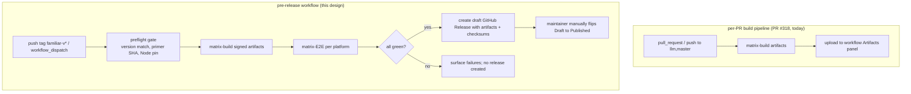
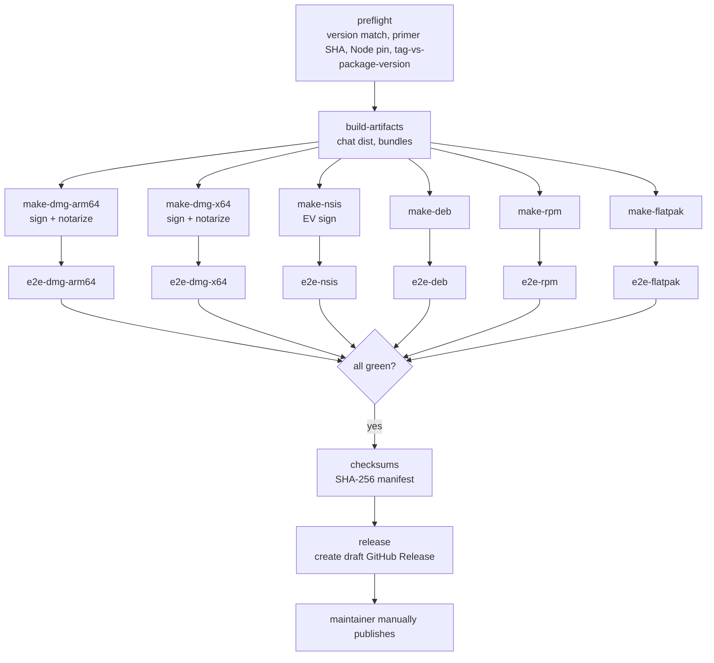

# Familiar Pre-Release CI Workflow with End-to-End Validation

| | |
|---|---|
| **Created** | 2026-05-22 |
| **Author** | endolinbot (designer dispatch, prompted) |
| **Status** | Proposed |
| **Source** | Extension of [`familiar-release.md`](familiar-release.md) G1, G16 |

## What is the Problem Being Solved?

[`familiar-release.md`](familiar-release.md) G16 names "verify the
Primer-into-CAS path in the packaged build" as a CI smoke-test
deliverable but leaves the testing shape open.
PR [#318](https://github.com/endojs/endo-but-for-bots/pull/318)
wires the per-platform build pipeline but only emits artifacts;
nothing currently gates GitHub Release publication on the
artifacts actually working.
The companion design
[`familiar-platform-packaging.md`](familiar-platform-packaging.md)
specifies the per-platform packaging lanes
(macOS `.dmg`, Windows `.exe` via NSIS, Linux `.deb` / `.rpm`,
Linux `.flatpak`) but leaves end-to-end validation as a separate
question.

This design fills both gaps:

1. A per-platform **end-to-end test suite** that exercises each
   installed artifact, modelled on
   [`chat-playwright-smoke.md`](chat-playwright-smoke.md) but
   targeting the packaged binary rather than the dev build.
2. A **dedicated pre-release CI workflow** distinct from the
   per-PR build pipeline.
   The pre-release workflow builds all lanes, runs the E2E suite
   against each, and only on full-green publishes a draft GitHub
   Release.
   The per-PR build pipeline stays cheap (artifacts only, no E2E,
   no signing); the pre-release workflow holds the expensive
   gates.

## Two-workflow split



The per-PR pipeline keeps its current behaviour (artifacts for
manual smoke download).
The pre-release workflow is new; it produces the **signed**
artifacts and runs the E2E.
Signing happens only in the pre-release workflow because that is
where the signing-credential secrets are scoped (per
[`familiar-platform-packaging.md`](familiar-platform-packaging.md)
§ Windows / macOS signing custody).

## End-to-end validation per platform

The E2E suite is one Playwright spec per platform, written in
the shape of
[`chat-playwright-smoke.md`](chat-playwright-smoke.md) but
launching the **installed packaged Familiar** rather than a
`vite dev` Chat bundle.
Each spec runs five phases.

### Five phases of the per-platform E2E

| Phase | What it does | Failure surface |
|---|---|---|
| 1. **Install** | Install the artifact under the runner's user account. | Installer prerequisites missing (libraries, sandbox setuid, codesign verify). |
| 2. **Launch** | Spawn the installed binary headless or under a virtual display; assert the Electron window opens, the daemon spawns, the `localhttp://` protocol handler registers. | App crash on startup; daemon spawn failure; protocol-handler registration failure. |
| 3. **First-run setup** | Drive the [`lal-fae-form-provisioning.md`](lal-fae-form-provisioning.md) form: fill the LLM-provider host, model, and auth-token fields; submit. | Form rendering failure; submission failure; daemon CAS write failure. |
| 4. **lal-agent responds** | Send a test message addressed to the `lal` profile created in phase 3; assert a coherent response within a 30 s timeout. | Agent provisioning failure; Primer-into-CAS path broken; LLM call routing failure. |
| 5. **Clean shutdown** | Close the window; assert no orphaned daemon process, no port still bound, no temp directory leaked. | Daemon detach broken; child process leak; gateway socket leaked. |

The LLM provider in phase 4 is a **stubbed local HTTP server**
that mimics the Anthropic / OpenAI / Ollama API just enough to
echo a canned response.
The stub lives in `packages/familiar/test/e2e/stub-llm-server.js`
and is started by the spec before phase 3.
The `lal` agent's outbound `fetch` is pointed at the stub via the
form's `host` field, so phase 4 does not consume real LLM credits
and works offline.

### Per-platform install and launch differences

Each platform's `install` and `launch` phases differ; the
remaining three phases (setup, agent-responds, shutdown) are
platform-agnostic Playwright operations against the installed
app.

| Platform | Install command | Launch command | Display |
|---|---|---|---|
| macOS arm64 | `hdiutil attach Familiar-<v>-darwin-arm64.dmg && cp -R /Volumes/Familiar/Familiar.app /Applications/ && spctl --assess --verbose /Applications/Familiar.app` | `open -a /Applications/Familiar.app --args --remote-debugging-port=9222` | Headed (macOS runners have a native window server). |
| macOS x64 | (same) | (same) | (same) |
| Windows x64 | `Familiar-<v>-win32-x64.exe /S /D=C:\Familiar` (NSIS silent install) | `C:\Familiar\Familiar.exe --remote-debugging-port=9222` | Headed (Windows runners have a virtual display). |
| Linux deb | `sudo apt install -y ./familiar_<v>_amd64.deb` | `xvfb-run --auto-servernum familiar --remote-debugging-port=9222` | `xvfb-run` (Ubuntu runners are headless). |
| Linux rpm | `sudo dnf install -y ./familiar-<v>-1.x86_64.rpm` (on Fedora runner) | (same) | (same) |
| Linux flatpak | `flatpak install --user --bundle Familiar-<v>-linux-x64.flatpak` | `xvfb-run --auto-servernum flatpak run org.endojs.Familiar --remote-debugging-port=9222` | `xvfb-run`. |

Playwright attaches to the running Electron app via the
`--remote-debugging-port=9222` CDP endpoint (Playwright's
`electron` API or `chromium.connectOverCDP` for the renderer
process).
The macOS notarization assertion (`spctl --assess --verbose`)
exits 0 only if the `.dmg` is signed and notarized; this is the
E2E surfacing of the
[`familiar-platform-packaging.md`](familiar-platform-packaging.md)
signing chain.

### Per-platform failure-harvesting

When the spec fails, the runner captures:

| Platform | Daemon log | System log | Screenshots |
|---|---|---|---|
| macOS | `~/Library/Application Support/endo/endo.log` and `familiar.log` | `log show --predicate 'process == "Familiar"' --last 5m` | `screencapture -x failure.png` |
| Windows | `%LOCALAPPDATA%\endo\State\endo.log` and `familiar.log` | `Get-WinEvent -LogName Application -MaxEvents 200` | Playwright's `page.screenshot()` |
| Linux (deb/rpm/flatpak) | `$XDG_STATE_HOME/endo/endo.log` and `familiar.log` (flatpak: `~/.var/app/org.endojs.Familiar/state/endo/endo.log`) | `journalctl --user --since '5 minutes ago'` | `import -window root failure.png` (ImageMagick on `xvfb` display) |

All harvested artifacts upload to the workflow's artifact panel
under `e2e-failure-<platform>-<arch>/` so a maintainer triaging
a failed pre-release can download the daemon log, the screenshot,
and the system log together.

### Runner images

| Lane | Runner | Notes |
|---|---|---|
| macOS arm64 E2E | `macos-14` (Apple Silicon) | The signing identity (Developer ID) is installed into the runner's temporary keychain at job start. |
| macOS x64 E2E | `macos-13` (Intel) | Same. |
| Windows x64 E2E | `windows-latest` | The EV signing credential is fetched from Cloud HSM (per [`familiar-platform-packaging.md`](familiar-platform-packaging.md)). |
| Linux deb E2E | `ubuntu-24.04` | The deb's declared dependencies are resolved from the runner's apt repos. |
| Linux rpm E2E | `fedora:40` Docker container or `fedora-40` self-hosted runner | GitHub-hosted runners do not offer Fedora directly; the rpm E2E runs inside a Fedora container atop `ubuntu-latest`, or against a self-hosted Fedora runner if/when the maintainer provisions one. |
| Linux flatpak E2E | `ubuntu-24.04` with Flatpak toolchain installed | Per [`familiar-flatpak-pipeline.md`](familiar-flatpak-pipeline.md). |

The Fedora-on-Docker shape for the rpm E2E is the workable MVR
posture; an opinionated `rocky-9` or `rhel-9` runner is a
followup if the maintainer needs that coverage.

## Pre-release CI workflow shape

### Trigger

```yaml
on:
  push:
    tags:
      - 'familiar-v*'
  workflow_dispatch:
    inputs:
      version:
        description: 'Release version (e.g. 0.1.0)'
        required: true
        type: string
      dry_run:
        description: 'Build and E2E without creating a Release'
        required: false
        type: boolean
        default: false
```

`pull_request` and branch `push` triggers stay on the existing
`familiar-release.yml` (per-PR build pipeline, PR #318).
The new workflow lives at `.github/workflows/familiar-pre-release.yml`
and is tag-driven.

### Job topology



### Preflight job

The preflight job fails the workflow before any artifact is
built when:

- The git tag does not match `packages/familiar/package.json`'s
  `version` field (tag `familiar-v0.1.0` requires
  `pkg.version === '0.1.0'`).
- The bundled Primer's git tree hash does not match
  `packages/familiar/bundles/primer.sha`.
- The `download-node.mjs` pinned Node version does not match the
  CI's `actions/setup-node` Node version (catches drift after
  PR [#316](https://github.com/endojs/endo-but-for-bots/pull/316) and any
  subsequent LTS-pin bumps; see
  [`skills/node-lts-window-watch/SKILL.md`](
  https://github.com/kriskowal/garden/blob/main/skills/node-lts-window-watch/SKILL.md)
  for the upstream-motion-sensing tooling).
- The change log entries since the previous `familiar-v*` tag are
  empty.

Preflight is a cheap (under 30 s) gate that prevents an
expensive multi-platform build from running on a
self-inconsistent commit.

### Build-artifacts job

Identical to PR #318's `build-artifacts` job: builds the chat
Vite output and the esbuild bundles on `ubuntu-latest`, uploads
them as workflow artifacts for the `make-*` jobs to consume.

### Make-* jobs (one per platform)

Each `make-*` job:

1. Downloads the chat dist and bundles.
2. Downloads the platform-appropriate Node binary.
3. Calls the platform-appropriate `make-distributables.mjs`
   branch.
4. **Signs** the artifact in-job (per
   [`familiar-platform-packaging.md`](familiar-platform-packaging.md)
   § Signing).
5. Uploads the signed artifact as a workflow artifact.

The signing-credential secrets are scoped per job:

- `make-dmg-arm64` and `make-dmg-x64` mount `APPLE_CERT_P12`,
  `APPLE_CERT_PASSWORD`, `APPLE_API_KEY`, `APPLE_API_KEY_ID`,
  `APPLE_API_KEY_ISSUER`.
- `make-nsis` mounts `AZURE_CLIENT_ID`, `AZURE_TENANT_ID`,
  `AZURE_KEY_VAULT_URL` (Cloud HSM workload identity) or
  references a self-hosted runner with the EV token.
- `make-deb`, `make-rpm`, `make-flatpak` need no signing
  credentials for MVR (unsigned; followup adds GPG signing).

### E2E jobs (one per platform)

Each `e2e-*` job:

1. Downloads the signed artifact from the matching `make-*` job.
2. Installs it per the *Per-platform install and launch
   differences* table above.
3. Runs the Playwright spec at
   `packages/familiar/test/e2e/<platform>.spec.js`.
4. On failure, uploads the harvested daemon log, system log, and
   screenshot.

Each E2E spec has a 15-minute timeout; the full E2E phase across
all six platforms runs in parallel and converges in ~20 minutes
on the slowest lane (macOS notarization adds ~5 minutes to the
`make-dmg-*` jobs before E2E starts).

### Checksums job

After every E2E lane goes green, the `checksums` job downloads
all signed artifacts and emits a
`SHA256SUMS-<version>.txt` plus a
`SHA256SUMS-<version>.txt.sig` (signed with the project's
release-signing key, separate from the per-platform code-signing
keys).
The checksums manifest attaches to the Release alongside the
artifacts.

### Release job

The `release` job runs only when every prior job is green.
It creates a **draft** GitHub Release tagged `familiar-v<version>`
with the signed artifacts and the checksums manifest attached.
The Release stays Draft until the maintainer manually clicks
*Publish*; the workflow does not auto-publish.

The manual-attestation step is **defense in depth**: a green
pre-release workflow is necessary but not sufficient to ship.
The maintainer's manual publish is the final check
("I have downloaded the artifact, verified its checksum against
the manifest, run it on my own machine, and confirmed it works").

### CI cost estimate

Per pre-release run, ballpark minutes consumed:

| Job | Runner | Minutes |
|---|---|---|
| preflight | ubuntu-latest | 1 |
| build-artifacts | ubuntu-latest | 5 |
| make-dmg-arm64 | macos-14 | 15 (10 build + 5 notarize) |
| make-dmg-x64 | macos-13 | 15 (10 build + 5 notarize) |
| make-nsis | windows-latest | 12 (10 build + 2 sign) |
| make-deb | ubuntu-24.04 | 4 |
| make-rpm | ubuntu-latest + fedora:40 container | 5 |
| make-flatpak | ubuntu-24.04 with toolchain | 10 |
| e2e-dmg-arm64 | macos-14 | 8 |
| e2e-dmg-x64 | macos-13 | 8 |
| e2e-nsis | windows-latest | 10 |
| e2e-deb | ubuntu-24.04 | 5 |
| e2e-rpm | ubuntu-latest + fedora:40 | 6 |
| e2e-flatpak | ubuntu-24.04 with toolchain | 8 |
| checksums | ubuntu-latest | 1 |
| release | ubuntu-latest | 1 |
| **Total** | | **~114 minutes** |

GitHub Actions multiplies macOS runners by 10x and Windows by
2x for billed minutes against the free tier; the effective
billed cost per pre-release is roughly:

- macOS: (15 + 15 + 8 + 8) × 10 = 460 min
- Windows: (12 + 10) × 2 = 44 min
- Linux: ~50 min × 1 = 50 min
- **Total billed: ~554 minutes per pre-release.**

For a once-a-month release cadence (12 pre-releases / year), the
billed CI cost is ~6,700 minutes / year, well within the
included quota for a paid GitHub plan.
**The per-PR build pipeline (PR #318) intentionally does not run
the E2E**; the per-PR pipeline runs the matrix-build only,
which is ~50 minutes billed per PR.
E2E is pre-release-only; running it on every PR would
multiply CI cost by ~10x without commensurate signal (PR-time
regressions in the packaging shape are caught by the
build-artifacts step; deep regressions in the packaged binary
are caught at pre-release time when the artifact is signed and
ready to ship).

## Cross-cutting

### Reproducibility (recap)

The pre-release workflow records, in the Release body:

- The git SHA the artifacts were built from.
- The `yarn install --immutable` resolution (the `yarn.lock` SHA).
- The signed Node binary's SHA-256 (from
  `download-node.mjs`'s pinned URL).
- The Electron version (from the workspace's pinned dependency).
- Each per-platform artifact's SHA-256 from the checksums
  manifest.

A future audit can rebuild the artifacts from the same git SHA
and compare SHA-256s; signing-timestamp drift will cause the
sign-side bits to differ but the underlying content is
deterministic.

### Version stamping (recap)

The preflight job enforces `tag === pkg.version`.
The `make-*` jobs propagate `pkg.version` into the per-platform
artifact's embedded version metadata (Info.plist on macOS,
VERSIONINFO on Windows, control file on deb, spec file on rpm,
metainfo.xml on flatpak).
No version drift across artifacts.

### Bundled-Primer / agent-bundle freshness (recap)

The preflight job asserts the Primer tree hash matches
`bundles/primer.sha`.
The E2E phase 4 (lal-agent responds) is the runtime confirmation
that the Primer made it into the daemon's CAS and the worker loop
received its `primer` reference.
A regression in the Primer-into-CAS path that PR-time tests miss
falls into the pre-release E2E here.

## Phased implementation

| Phase | Deliverable | Effort |
|---|---|---|
| 1 | E2E spec scaffolding: stub LLM server, Playwright config under `packages/familiar/test/e2e/`, one spec for the platform with the simplest install (Linux deb). | Multi-day (builder). |
| 2 | E2E specs for the remaining platforms (macOS dmg, Windows nsis, Linux rpm, Linux flatpak). One spec per platform; the test logic is shared via a `runPhases(page, platform)` helper. | Day per platform (builder). |
| 3 | Pre-release workflow file at `.github/workflows/familiar-pre-release.yml`; preflight, build, make-*, e2e-*, checksums, release jobs wired. | Multi-day (builder). |
| 4 | Per-platform failure-harvesting and artifact upload on E2E failure. | Day (builder). |
| 5 | First end-to-end pre-release run (probably `familiar-v0.1.0`); iterate on whatever the first run surfaces (per-runner image quirks, notarization rate-limits, sign-step flakiness). | Day to multi-day (debugging). |

Phases 1-4 are the MVR-completion work that closes G1 (CI
emission of release artifacts) and G16 (Primer-into-CAS smoke).
Phase 5 is the first real release; the iteration there is
expected and budgeted.

## Dependencies

| Design | Relationship |
|---|---|
| [`familiar-release.md`](familiar-release.md) | Source; this design implements G1 and G16. |
| [`familiar-platform-packaging.md`](familiar-platform-packaging.md) | Sibling; specifies the per-platform artifact shape this workflow builds and validates. |
| [`familiar-flatpak-pipeline.md`](familiar-flatpak-pipeline.md) | The Flatpak lane the workflow incorporates; cross-link to PR [#322](https://github.com/endojs/endo-but-for-bots/pull/322). |
| [`familiar-electron-shell.md`](familiar-electron-shell.md) | Defines the Electron-main process the E2E exercises. |
| [`familiar-bundled-agents.md`](familiar-bundled-agents.md) | The `lal` agent the E2E phase 4 talks to. |
| [`lal-fae-form-provisioning.md`](lal-fae-form-provisioning.md) | The form the E2E phase 3 drives. |
| [`chat-playwright-smoke.md`](chat-playwright-smoke.md) | The smaller-scoped Chat-renderer E2E this design extends to the packaged binary. |

## Design Decisions

- **Two workflows, not one.**
  Per-PR build pipeline (PR #318) stays cheap (no E2E, no
  signing); pre-release workflow holds the expensive gates.
  Conflating them would force every PR to consume signing credits
  or run signing-credential-less which defeats the credential
  isolation.
- **Manual publication, not automatic.**
  A green pre-release workflow drafts the Release; the maintainer
  flips Draft to Published.
  Defense in depth: the pre-release CI gate is necessary but the
  maintainer's manual confirmation is the final check.
  Revisit after the cadence stabilises and the maintainer is
  comfortable; auto-publish on full-green is an opt-in followup.
- **Stub LLM server in E2E phase 4, not a real provider.**
  A real LLM call would consume credits, introduce nondeterminism,
  and create a per-run dependency on Anthropic / OpenAI uptime.
  The stub returns a canned response; the E2E asserts the
  response made it from the LLM stub through the agent through
  the daemon to the chat UI.
- **`xvfb-run` for headless Linux Playwright,
  native windowing on macOS and Windows.**
  The macOS and Windows runners ship a window server out of the
  box; `xvfb-run` adds overhead and is unnecessary there.
  The Linux runners are headless and require `xvfb`.
- **Fedora-in-Docker for the rpm E2E.**
  GitHub-hosted runners do not offer Fedora directly; running the
  rpm spec inside a Fedora container atop `ubuntu-latest` is the
  workable MVR posture.
  A self-hosted Fedora runner is a followup if the container
  approach proves limiting.
- **Per-platform failure-harvesting** uploads the daemon log,
  system log, and a screenshot to the workflow's artifact panel.
  Without that, a maintainer triaging a failed pre-release has
  only the CI log to work from, which lacks the daemon-side
  detail needed to diagnose Primer-into-CAS or daemon-spawn
  failures.
- **Preflight gate before any heavy job runs.**
  Catches tag-vs-pkg-version drift, Primer drift, and Node-pin
  drift cheaply before consuming macOS / Windows minutes.
- **Checksums manifest signed with a project-level release key**,
  separate from the per-platform code-signing keys.
  The release key signs the manifest of checksums; the
  per-platform keys sign the artifacts themselves.
  Two-tier signing means a user can verify the manifest with one
  public key and then verify each artifact's checksum against the
  manifest, without depending on per-platform signing-key
  publication.

## Open Questions

1. **Auto-publish on full-green vs manual.**
   The MVR posture above is manual publication.
   Revisit when?
   A trigger: three consecutive pre-releases ship cleanly without
   the maintainer finding a defect at the manual-publish step;
   at that point opt into auto-publish behind a workflow input.
2. **Self-hosted Fedora runner** for the rpm E2E vs container.
   Container is MVR; self-hosted unlocks deeper integration tests
   (systemd-user-service, SELinux contexts, dnf-repo install
   flow) but adds runner-maintenance burden.
3. **E2E breadth.**
   The five phases above are the MVR minimum.
   Should the E2E also exercise: app menu items (Restart Daemon,
   Purge Daemon), the localhttp:// weblet protocol, an actual
   weblet install, the chat command-bar's slash commands?
   Adding these expands the spec from ~50 lines to ~200 lines per
   platform; defer to followups.
4. **CI cost overrun thresholds.**
   What pre-release-minutes-per-month limit triggers a
   designer-led cost reduction (cutting macOS x64 if the user
   base concentrates on arm64; collapsing rpm and deb to one
   Linux lane if dependency-resolution differences prove
   insignificant)?
5. **Cross-arch E2E.**
   The MVR runs E2E on the architectures it builds for (arm64 +
   x64 on macOS; x64 elsewhere).
   When the matrix widens (Linux arm64, Windows arm64), does
   each new architecture also get a full E2E job, or only a
   build-and-smoke?
6. **Release-signing key custody and rotation.**
   The release key (separate from per-platform code-signing
   keys) signs the SHA-256 manifest.
   Where does the key live (Yubikey, 1Password, GPG smart card),
   and what is the rotation cadence?
7. **Test-message-as-bundled-canned-data.**
   The E2E phase 4 test message is hardcoded into the spec.
   Should the spec instead read a "canned conversation" file
   (`packages/familiar/test/e2e/canned/lal-hello.json`) so
   updating the test message does not require a code change?
   Cosmetic; defer.
8. **Notarization-failure fallback.**
   If the Apple notary service is down or rate-limiting, the
   `make-dmg-*` job's retry-once posture may not be enough.
   Should the workflow surface notarization-down as a "skip the
   macOS lane and proceed with the others" option, or fail the
   whole pre-release?
   The MVR posture is fail-the-whole-pre-release (consistency),
   but the open question is whether the maintainer wants a
   skip-macOS flag.

## Prompt

Per the liaison's 2026-05-22 dispatch (
`journal/entries/2026/05/22/203143Z-dispatch-liaison-60e957.md`),
relaying the maintainer's directive:

> Please dispatch a designer to extend our existing narrative on
> shipping packaged releases of the Familiar application, with
> separate lanes for MacOS (dmg), Windows (msi, presumably, but
> you might know or find better information), Linux (deb, rpm,
> and flatpack) with particular attention to end-to-end testing
> in the validation feedback loop for all of these variations,
> in dedicated CI pre-release workflows.

This design carries the end-to-end-testing and pre-release-CI
half of that directive; the companion design
[`familiar-platform-packaging.md`](familiar-platform-packaging.md)
carries the per-platform packaging-lane half.
