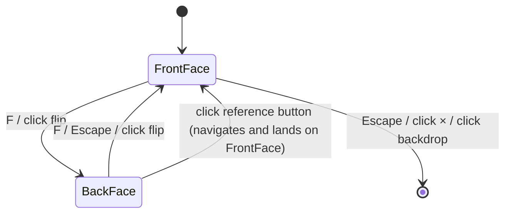
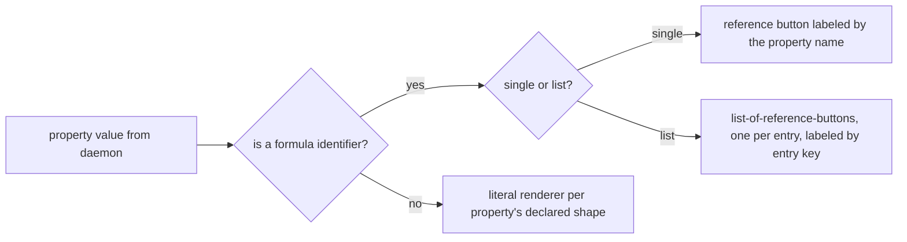
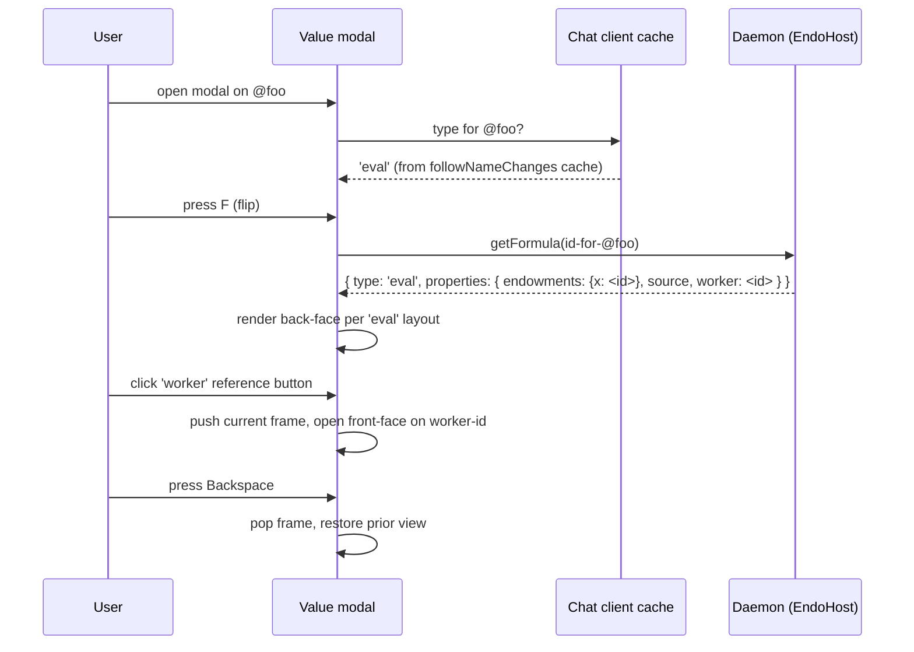

# Formula Inspector

| | |
|---|---|
| **Created** | 2026-02-14 |
| **Updated** | 2026-06-27 |
| **Author** | Kris Kowal (prompted) |
| **Status** | In Progress |

## Status

Daemon and CLI cuts landed in `endojs/endo-but-for-bots#440` (master-base). Specifically:

- `EndoHost.getFormula(identifier)` is on the host facet only; guests have no such method; cross-peer locators are rejected.
- The `INFO` (`@info`) entry is removed from the host pet sitter's `specialNames` map.
- Per-type formula classification is centralized in `packages/daemon/src/formula-record.js`.
- `endo inspect <name-or-identifier>` CLI verb is wired with `--identifier` and `--json` flags.

The Chat-side cut (modal back face, gear icon on inventory rows, layout registry) is deferred. The design assumes a `packages/chat` package that, on the implementation base branch (`master`), does not exist; the chat package on master is `packages/goblin-chat` with a different file layout. The chat cut waits for either the `packages/chat` migration onto `master` or a re-targeting of the chat-side design at `goblin-chat`.

The `InspectorHubInterface`, `InspectorInterface`, and `pet-inspector` formula type are retained as vestigial infrastructure (no user-facing path reaches them post-`@info` removal) to keep existing on-disk host formulas loadable. Full removal is a follow-up.

`getFormula` superseded only *part* of what `@info` offered: the single-node read.
The `@info` hub's `lookup(["@info", petName, ...propertyPath])` form also let a host **address a deeply nested value through a path of formula properties in one call**; `getFormula` alone does not.
The 2026-06-27 maintainer directive ("a general way for hosts to address deeply nested values through the hidden formula properties") asks to close that remaining gap.
The § *Addressing deeply nested values through formula properties* section below adds the forward-traversal host method `getFormulaPath(root, path)` that does so; it is the true `@info` replacement and is **designed but not yet implemented**.

## What is the Problem Being Solved?

There is no way for a user to "pop the bonnet" and see the underlying formula for a pet-named capability.
The daemon stores rich formula structures (33 types with fields like `worker`, `source`, `endowments`, `hub`, `path`, and others) but the Chat UI and CLI only show the rendered value.
Power users and developers cannot see the formula graph that backs each capability: that an `eval` retains a `worker`, that a `guest` retains a `host` and a `handle`, that a `mount` retains its backing files.
They have to consult the daemon directly or trace pet names by hand to understand what a value depends on.

This design adds a Formula Inspector: a host-only daemon method, a CLI verb, and one Chat-side surface (a back-face flip on the existing Value modal) that renders the per-type formula layout.

## Consolidation Note

This document supersedes the earlier `chat-value-modal-formula-view.md` (2026-06-12, never merged).
On 2026-06-12 the maintainer asked to consolidate the two designs and to redesign the inspector around a host-only daemon method, not the `@info` name hub.
The consolidated design preserves the card-flip back-face proposal, the per-type layout taxonomy, the stack navigation model, and the no-cycle-unwinding principle from that draft, and folds them into the existing CLI shape from this document.
The earlier proposal for a dedicated inspector panel (with a read/edit toggle) is dropped per kriskowal review on 2026-06-13: "We only need one surface. ... While one formula captures state, we do not need these to be user editable at this stage of development."

## Description of the Design

### Daemon surface: host-only `getFormula(identifier)`

The daemon already returns per-formula-type metadata via `makePetStoreInspector` in `packages/daemon/src/daemon.js` lines 5704-5829, reachable via `InspectorHubInterface.lookup(petName | path)` and wired into the host's special-names map as `@info` at `packages/daemon/src/host.js` line 209.
That `@info` shape is misguided.
It exposes the inspector as a name hub addressable by any agent that can resolve `@info`, and it forces the user to compose paths through `@info` for every lookup, which "becomes more complicated for formulas in directories of a guest's pet store" (kriskowal 2026-06-12 inline comment on PR #439).

The replacement is a host-only daemon method.

```typescript
interface EndoHost {
  /**
   * Retrieve the formula record for the given identifier.
   * Returns the formula type plus the type-specific metadata
   * (literals plus retained-formula identifiers).
   *
   * Identifier is in the same string form as the second half
   * of a locator (`{64-char number}:{64-char node}` per
   * daemon-256-bit-identifiers.md), and must be local to this
   * node (not a cross-peer locator).
   */
  getFormula(identifier: FormulaIdentifier): Promise<FormulaRecord>;
}

type FormulaRecord = {
  type: FormulaType;                          // 'eval' | 'lookup' | 'guest' | ...
  number: string;                             // the 64-char formula number
  properties: Record<string, FormulaProperty>;
};

type FormulaProperty =
  | { kind: 'literal'; value: PassableValue }
  | { kind: 'reference'; identifier: FormulaIdentifier }
  | { kind: 'reference-list'; entries: Record<string, FormulaIdentifier> };
```

`getFormula` is added to `HostInterface` in `packages/daemon/src/interfaces.js` between `getFormulaGraph` and the closing brace, and is exposed on the `EndoHost` Far facet in `host.js`.
It is **not** added to `GuestInterface`, mirroring the precedent in [`daemon-retention-paths.md`](daemon-retention-paths.md) § Daemon surface (host-only).

#### Why host-only

Guests must not be able to retrieve formula records for capabilities they do not own.
A guest's `getFormula(myLocator)` would reveal the host's internal naming, peer relationships, and which other guests share common roots.
This is the same authority rationale `daemon-retention-paths.md` § Why host-only carries for `listRetentionPaths`: a method that surfaces the host's internal structure belongs on the host facet, not the guest facet.

The error-tracing facility in [`docs/error-tracing-design.md`](../docs/error-tracing-design.md) § EndoHost `traces` facet is a second precedent: `E(host).traces()` is host-only for the same reason (the trace aggregator surfaces worker-level internals that a guest must not enumerate).

### Removing the `@info` name hub

The `@info` entry in the host's `specialNames` map at `packages/daemon/src/host.js` line 209 is removed.
The guest's `specialNames` map at `packages/daemon/src/guest.js` lines 88-96 already omits `@info`; this change brings host parity with guest, and the host-vs-guest method delta moves from "host has `@info` in special names, guest does not" to "host has `getFormula` method, guest does not".

Three regression tests in `packages/daemon/test/endo.test.js` lines 2377-2510 exercise the `@info` lookup path (`E(AGENT).lookup(["@info", "ten", "source"])`).
These tests are rewritten to call `getFormula(identifier)` directly.
There is no deprecation alias: `@info` was a misguided shape and a one-release drop is preferable to carrying a compatibility redirect that re-encodes the same composition burden in a different surface.
The CLI's new `endo inspect` verb (see below) is the user-visible replacement for any prior workflow that composed paths through `@info`.

The standalone `InspectorHubInterface` (`lookup`, `list`) at `packages/daemon/src/interfaces.js` lines 522-525 is retired.
`makePetStoreInspector` remains as the internal implementation of `getFormula` for the per-type metadata catalog; the exo interface it constructed is no longer exposed.
`list` was always a thin wrapper on `petStore.list()`; the host's existing pet-store enumeration methods (`identifyLocal`, the `list()` on the directory facet) cover that use case.

### Addressing deeply nested values through formula properties

`getFormula(identifier)` reads **one** node.
The retired `@info` hub did more: `E(AGENT).lookup(["@info", petName, ...propertyPath])` resolved a (possibly nested) pet name to a formula and then **walked that formula's properties by a path**, in a single call.
That second capability — addressing a deeply nested value by following a path of formula properties from a root — is the part `getFormula` did not carry forward.
Without it, a host that wants the `worker` retained by the `eval` named `ten`, or the endowment `x` of that `eval`, must issue one `getFormula` per hop and assemble the walk on the client.

This section adds the forward-traversal host method that closes the gap.
Given a **root identifier** and a **sequence of property steps**, the host resolves the path through the formula reference graph and returns the addressed leaf (a deeply nested formula record, or a literal value) in one host-only call.

#### Method

```typescript
interface EndoHost {
  /**
   * Resolve a path of formula-property steps starting from a root
   * formula identifier, returning the addressed leaf. Each step
   * descends through exactly one property of the current formula's
   * `FormulaRecord`. host-only; absent on guests; the cross-peer
   * rejection that `getFormula` applies to the root is re-applied at
   * *every* hop, so a path can never tunnel from a local root into a
   * remote peer's formula structure.
   *
   * `path` is the canonical structured form. An empty path is
   * equivalent to `getFormula(root)` wrapped as a `formula` leaf.
   *
   * With `{ trail: true }` the result also carries the ordered list of
   * intermediate `FormulaRecord`s visited (the root first, the leaf
   * last), so a single call can seed the inspector's navigation stack
   * (§ Back-to-value navigation) without re-fetching each hop.
   */
  getFormulaPath(
    root: FormulaIdentifier,
    path: FormulaPathStep[],
    options?: { trail?: boolean },
  ): Promise<FormulaAddress>;
}

type FormulaPathStep =
  // A `literal` or single `reference` property, named directly.
  | string
  // One entry of a `reference-list` property (e.g. an `eval`'s
  // `endowments` keyed by codeName, or a `marshal`'s `slots` keyed by
  // index). Both parts are required for a list step.
  | { property: string; key: string };

type FormulaAddress =
  | {
      kind: 'formula';
      identifier: FormulaIdentifier;
      record: FormulaRecord;
      trail?: FormulaRecord[]; // present when options.trail is set
    }
  | {
      kind: 'literal';
      property: string;        // the final property name
      value: PassableValue;
      trail?: FormulaRecord[];
    };
```

`getFormulaPath` is added to `HostInterface` immediately after `getFormula` in `packages/daemon/src/interfaces.js`, and exposed on the `EndoHost` Far facet in `host.js`.
Like `getFormula`, it is **not** added to `GuestInterface` and never crosses the CapTP `provide` boundary.

#### It is `getFormula` applied iteratively

`getFormulaPath` introduces no new classification logic.
At each hop it resolves the current identifier through the same internal route `getFormula` uses (`getFormulaForId` → `makeFormulaRecord`), reads the named property from the resulting `FormulaRecord`, and continues from that property's identifier.
The legal step alphabet is therefore exactly the three property kinds `makeFormulaRecord` already emits:

- A **string step** names a `literal` or `reference` property.
  On a `reference` it descends to the referenced formula.
  On a `literal` it terminates (a literal has no identifier to continue from); a non-final string step that lands on a literal is an error (see § Errors).
- A **`{ property, key }` step** names one entry of a `reference-list` property.
  List entries are always `FormulaIdentifier`s, so a list step always descends to a formula.

Because the addressable property set is whatever `formula-record.js` classifies, the addressing surface tracks the per-type catalog automatically: a property becomes addressable the moment the classifier emits it, with no change to `getFormulaPath`.
This is the same single-source-of-truth discipline the *Formula-view layout taxonomy* relies on.

#### Relationship to the retention-path edge model

The forward formula-property graph and the retention graph are the **same edge set viewed in opposite directions**.
`listRetentionPaths` ([`daemon-retention-paths.md`](daemon-retention-paths.md)) walks *upstream* (target → GC root) over `groupInEdges`, labeling each edge with a field name (`worker`, `hub`, `powers`, `slot0`, …) or, for pet-store writes, `pet:<name>`.
`getFormulaPath` walks *downstream* (root → leaf) over the same field edges.

The downstream subset differs in two ways that matter:

- It **excludes pet-name edges**.
  `pet:<name>` segments belong to the pet-store / `lookup` / `identify` layer, not to formula properties.
  Pet-name resolution stays the host's existing job (see § Migration below); `getFormulaPath` traverses only formula-internal references and reference-list entries.
- A **`{ property, key }` reference-list step corresponds to one of the per-entry labeled edges** `graph.js` already records via `extractLabeledDeps` (the endowment codeName, the `slot0`/`slot1` marshal-slot label, and so on).
  The `FormulaRecord` nesting (entries grouped under a property) and the graph's flat per-entry labeling are two views of the same edge.

Notation reconciliation with [`retention-path-notation.md`](retention-path-notation.md): that document renders a field edge as `:field`.
A forward formula-property address reuses the same alphabet — a string step is a `:field` edge and a `{ property, key }` step is a `:property[key]` edge — so the two designs never grow divergent edge vocabularies.
A `getFormulaPath` address is literally the downstream continuation of a retention path: a retention path renders `@agent/ten` (root, then a pet-name edge) and a forward address extends it with `:source` or `:endowments[x]`.
If and when a CLI textual form is built (see CLI below), it should reuse `retention-path-notation.md`'s field-edge renderer for the `:field` / `:property[key]` portion rather than minting a second one.

#### Why host-only

The host-only argument from § *Daemon surface: host-only `getFormula`* and from `daemon-retention-paths.md` § *Why host-only* carries verbatim, and is *stronger* here: `getFormulaPath` reaches strictly more than `getFormula` (any node reachable by chaining `getFormula` from the root), so the same structure-disclosure leak it must prevent (the host's internal naming, peer relationships, and which guests share common roots) is reachable in fewer round-trips.
A guest must not gain a path-walker into structure it does not own.

The walk grants **no authority beyond `getFormula`**: every node `getFormulaPath` returns is one a sequence of public `getFormula` calls could already reach from the same root.
It is an ergonomic and round-trip optimization that also moves the per-hop cross-peer check inside the host, where it cannot be skipped — see § Security.

#### Errors and edge semantics

| Condition | Result |
|---|---|
| **Empty path** | `{ kind: 'formula', identifier: root, record }` — the base case, equal to `getFormula(root)`. |
| **Unknown / collected identifier** at any hop (root or a descended reference) | The same surface error `getFormula` raises (`getFormula could not resolve unknown identifier`), naming the unresolved identifier, not the on-disk path. |
| **Missing property** | `makeError` naming the absent property and the current formula's type and identifier (e.g. *no property `worker` on `lookup` formula `…`*). |
| **Kind mismatch** | A `{ property, key }` step on a `literal` or single-`reference` property, or a bare string step on a `reference-list` property (ambiguous — a list step must name a key): a clear error citing the property's actual kind. |
| **Absent list key** | A `{ property, key }` step whose `key` is not in the `reference-list`'s `entries`: error naming the key and the available keys. |
| **Descend through a literal** | A non-final string step that lands on a `literal` property (no identifier to continue from): error *cannot descend through literal property `source`*. |
| **Cross-peer hop** | A `reference` or list entry whose identifier resolves to a non-local node: rejected exactly as `getFormula` rejects cross-peer locators. The walk halts at the peer boundary; cross-peer formula structure is the remote host's concern (no CapTP round-trip is made). |
| **Depth limit** | A supplied `path` longer than a generous fixed cap (proposed 256 steps) is rejected before traversal, as defense-in-depth against a pathological input. |

**Cycles are not a hazard for the core method.**
The reference graph does contain cycles (the `host`+`handle` and `promise`+`resolver` union-find merges, `eval` → `worker` chains that re-reference shared roots).
But `getFormulaPath` performs exactly `path.length` hops over a caller-supplied, finite list of steps; it never auto-expands, so revisiting a node mid-path is simply another hop, not an infinite walk.
This is distinct from the interactive navigation stack in § *Cycle handling: principle of least surprise*, where a *user* may click back into a cycle; that is UI navigation across many calls, governed there, not a property of a single `getFormulaPath` call.

#### Returned shape: metadata, not the live value

`getFormulaPath` returns **formula records and literal values**, the same metadata `getFormula` returns — not a live value capability.
Reaching the actual capability at the leaf (the running `eval`, the worker presence) remains a separate, separately-authorized operation through the host's normal `provide` / lookup channels.
Keeping `getFormulaPath` a pure inspection surface mirrors `getFormula` and `listRetentionPaths`, which also surface structure rather than handing out the capabilities they describe.
A value-returning variant (`E(host)`-style resolution of the leaf to its presence) is a possible follow-up with its own authority analysis; it is out of scope here.

### CLI: `endo inspect`

The CLI gains an `endo inspect <name-or-identifier>` verb, optionally extended with a forward property path.

```
endo inspect <name-or-identifier> [property-step...] [--identifier] [--json]
```

- Without flags, accepts a pet name (or `petname/path`) and resolves it via the host's `identify` to a formula identifier before calling `getFormula`.
- `--identifier` interprets the argument as an already-encoded formula identifier.
- Default output is human-readable: formula type as a header, then one row per property, with reference-properties rendered as the property name plus the target identifier in a dim style.
- `--json` emits the raw `FormulaRecord` for scripting.
- **Trailing `property-step` arguments** form a forward property path and switch the verb to `getFormulaPath(identifier, path)`.
  A `reference-list` entry is written `property[key]` (e.g. `endowments[x]`, `slots[0]`); a plain property is written bare (`worker`, `source`).
  A `formula` leaf renders exactly as the no-path output (type header plus property rows); a `literal` leaf renders the value (for an `eval`'s `source`, the code block).
  `--json` emits the raw `FormulaAddress`.

The trailing-path form restores the single-command ergonomics the `@info` hub used to offer: the old `E(AGENT).lookup(["@info", "ten", "source"])` becomes `endo inspect ten source`, and `endo inspect ten endowments[x]` reaches the endowment `x` of the `eval` named `ten`.
The property-step tokens reuse the `:field` / `:property[key]` edge alphabet of [`retention-path-notation.md`](retention-path-notation.md) (rendered without the leading `:` at the CLI, since the steps are already positional); the CLI should share that document's field-edge renderer rather than minting a second notation.

`inspect` was chosen over the alternatives the maintainer offered (`examine`, `formula`) for parallelism with `formula-inspector.md`'s original `endo inspect` proposal (this document's prior name) and with the *Pop the bonnet* metaphor in the existing concept page.
The current CLI (`packages/cli/src/endo.js`) carries 41 verbs (`run`, `make`, `inbox`, `request`, `resolve`, ..., `log`, `ping`); none of `inspect`, `examine`, or `formula` is taken, so the choice is unconstrained by collision.
The parallel to `endo paths` (from `daemon-retention-paths.md`) and `endo locate` keeps the single-word noun-style-verb shape consistent.

### Migration from the `@info` hub

The `@info` hub bundled two capabilities into one `lookup(["@info", petName, ...propertyPath])` call: (a) pet-name → formula resolution, and (b) formula-property path traversal.
The replacement decomposes them onto the host's existing surfaces plus `getFormulaPath`:

| `@info` capability | Replacement |
|---|---|
| (a) Resolve a (possibly nested) pet name to a formula | The existing host `identify(petNamePath)`, which already resolves nested directory pet-name paths to an identifier. This is exactly the case the maintainer flagged as the reason `@info` "becomes more complicated for formulas in directories of a guest's pet store" (PR #439): `identify` is the correct, already-built pet-name layer. |
| (b) Walk that formula's properties by a path | `getFormulaPath(identifier, propertyPath)`. |

So `lookup(["@info", "ten", "source"])` becomes `getFormulaPath(await identify(["ten"]), ["source"])`, yielding `{ kind: 'literal', property: 'source', value: <source code> }`.
The CLI's `endo inspect ten source` is the one-command surface for the same workflow (§ CLI).

**Nothing still depends on the removed `INFO` special name.**
Verified on `llm`: the host's `specialNames` map in `packages/daemon/src/host.js` no longer contains `@info` / `INFO`; the host formula's retained `inspectorId` is kept only for forward-load compatibility and participates in no special-name lookup; the three `@info` regression tests in `endo.test.js` were rewritten to call `getFormula` directly.
`getFormulaPath` adds **no new special name** — it is a host method, not a hub — so it reintroduces none of the addressability concerns that made `@info` misguided.

### Forward-compatibility for not-yet-classified formula types

`getFormulaPath` inherits the default-empty-properties contract `makeFormulaRecord` established in #440: a formula type with no classifier entry yields a record with `properties: {}`.
Such a node is **reachable** as a leaf (you can address *to* it) but **not traversable past** — any further step fails with the *missing property* error, which names the type and is the visible signal that its properties are not yet classified, mirroring the inspector back face's "Properties not yet exposed" empty state.
When `formula-record.js` later classifies that type, the same path begins resolving with no change to `getFormulaPath`.

### Chat: Value modal back face

The Chat UI grows one surface for inspecting a value's formula: a back face on the existing Value modal.

The Value modal grows a fourth action alongside the existing three (Close, Save, Enter Profile per [`chat-command-bar.md`](chat-command-bar.md) § Modal Actions).

| Action | Keyboard | Manual |
|--------|----------|--------|
| Close | `Escape` (front face) | Click × or backdrop |
| Save | `Enter` (in name field) | Click Save button |
| Enter Profile | `Shift+P` (proposed) | Click "Enter Profile" |
| **Flip to Formula / Flip to Value** | **`F`** | **Click the gear icon in the modal header (front face) or the "Show value" button in the back face header** |

`F` is reachable from both faces.
On the front face it flips to the back; on the back face it flips to the front.
The front face's flip affordance is a gear icon in the modal header opposite the close ×, with `aria-label="Show formula"`; the back face's flip-back affordance is a "Show value" button in the back face header, with `aria-label="Show value"`.
The modeline gains a `F flip to formula` hint on the front face and a `F flip to value` hint on the back face per [`chat-invariants.md`](chat-invariants.md) § Modeline Completeness.

The same modal back face is reachable directly from each inventory row.
The inventory row carries a gear icon (per [`chat-components.md`](chat-components.md) § Inventory panel) that opens the modal already flipped to the back face for that value's formula, so a power user can reach the formula in one click without first opening the modal's front face.
This is the maintainer's "Reaching the formula view directly from the inventory" affordance (kriskowal 2026-06-13 inline comment on PR #439); the gear icon and the modal back face are the only surface the formula view inhabits.

Editing formula fields from the back face is deferred.
At this stage of development the back face is read-only.
A later design can revisit editability; the design space (which fields are mutable, how the daemon validates a patch, how the operation is audited) is unresolved and the maintainer's direction on 2026-06-13 is to ship the read-only inspection moment first.

`Escape` on the back face flips to the front face (not close), so a user who flipped to inspect can `Escape` back into context and `Escape` again to close.
This matches [`chat-invariants.md`](chat-invariants.md) § Escape Consistency: the front face is the simpler state of the two.

Animation register: a 200 ms 3D card-flip on the modal container (CSS `transform: rotateY(180deg)` with `transform-style: preserve-3d` and `backface-visibility: hidden` on both faces).
Reduced-motion fallback (under `@media (prefers-reduced-motion: reduce)`): no rotation; instead a 100 ms cross-fade with `opacity` only.

Screen-reader behavior: the flip is announced via an `aria-live="polite"` region on the modal that updates to "Showing formula for <pet-name-or-id>" on flip-to-back and "Showing value for <pet-name-or-id>" on flip-to-front.
The back face is rendered as `role="region"` with `aria-labelledby` pointing at the back-face title.
Focus moves to the back-face title on flip-to-back and to the front-face value container on flip-to-front, so a keyboard user lands in a known position after the flip.



#### Layout registry

The back face consumes `packages/chat/formula-view-registry.js`, a registry that maps formula type to `{ header, helpText, propertyList }`.
The back face renders the registry via a new file `packages/chat/formula-view-component.js` (sibling of `packages/chat/value-component.js`).
Edits to a per-type layout land in the registry and the back face picks them up.

### Formula-view layout taxonomy

The back face is divided into a fixed header (formula-type badge, title, help text, formula identifier) and a scrollable property list.
The property list shape is the same across all formula types: an ordered list of rows, each row a `<dt>label</dt><dd>value-or-reference-button</dd>` pair.
Per-type variations differ only in *which* properties are listed and in the per-property classifier (see § Literal-vs-reference resolution).

The catalog covers all 33 formula types currently in [`packages/daemon/src/formula-type.js`](../packages/daemon/src/formula-type.js).

| Formula type | Header text | Properties (label → render) |
|---|---|---|
| `eval` | "Evaluation": code run inside a worker | `source` literal (code block, monospace), `endowments` record (list-of-references, one button per binding labeled by codeName), `worker` reference |
| `lookup` | "Lookup": name traversal | `hub` reference, `path` literal (array of names rendered as breadcrumbs) |
| `guest` | "Guest": sub-agent of a host | `hostAgent` reference, `hostHandle` reference |
| `host` | "Host": agent identity | `handle`, `hostHandle`, `keypair`, `worker`, `inspector`, `petStore`, `mailboxStore`, `mailHub`, `endo`, `networks`, `pins` (all references) |
| `directory` | "Directory": naming hub | `petStore` reference |
| `pet-store` | "Pet store": name-to-id table | (no daemon-side metadata; show empty state "No formula properties; this is a leaf store.") |
| `mailbox-store` | "Mailbox store" | (empty state, as `pet-store`) |
| `mail-hub` | "Mail hub": inbox-and-outbox facet | `store` reference |
| `message` | "Message" | (empty state until message-side metadata lands; the formula itself carries `from`, `to`, `replyTo`; treat as references when present) |
| `make-bundle` | "Make-bundle": unconfined code loaded from a bundle | `bundle` reference, `powers` reference, `worker` reference |
| `make-unconfined` | "Make-unconfined": unconfined code loaded from a specifier | `specifier` literal (string), `powers` reference, `worker` reference |
| `make-archive` | "Make-archive": code loaded from an archive | `archive` reference, `powers` reference, `worker` reference |
| `make-from-tree` | "Make-from-tree": code loaded from a tree | `tree` reference, `powers` reference, `worker` reference |
| `peer` | "Peer": remote node | `node` literal (hex), `addresses` literal (list of locator URLs) |
| `mount` | "Mount": filesystem capability | `path` literal (filesystem path), per [`daemon-mount.md`](daemon-mount.md) (additional fields surface as the formula stabilizes) |
| `scratch-mount` | "Scratch mount": daemon-managed scratch directory | (same as `mount`; the `path` is daemon-managed) |
| `git` / `git-credential` / `git-remote` | "Git" / "Git credential" / "Git remote" | (per [`daemon-git-capability.md`](daemon-git-capability.md); enumerate after that design lands) |
| `channel` | "Channel": thread substrate | (per [`daemon-message-streaming.md`](daemon-message-streaming.md); enumerate after that design lands) |
| `readable-blob` | "Readable blob": immutable bytes | (empty state; the blob is content-addressed and has no retained references) |
| `readable-tree` | "Readable tree": immutable snapshot | (empty state today; tree-side metadata can surface here when defined) |
| `promise` | "Promise": pending result | `store` reference, status (pending / fulfilled / rejected), plus the next-value or rejection-reason affordance (see § Promise-formula view) |
| `resolver` | "Resolver": write-half of a promise | `store` reference |
| `worker` | "Worker": execution sandbox | (empty state; the worker is a leaf) |
| `handle` | "Handle": receive-half of an agent | (empty state) |
| `keypair` | "Keypair": Ed25519 key material | `publicKey` literal (hex). The private key is **not** displayed; the row shows "Private key not displayed" in its place. |
| `endo` | "Endo bootstrap" | (lists root references when the formula is loaded; deferred to follow-up) |
| `invitation` | "Invitation" | `hostAgent` reference, `hostHandle` reference, `guestName` literal |
| `pet-inspector` | "Pet inspector" | `petStore` reference |
| `least-authority` | "Least authority" | (empty state) |
| `known-peers-store` | "Known peers store" | (empty state) |
| `loopback-network` | "Loopback network" | (empty state) |
| `marshal` | "Marshal" | (per the formula; enumerate when first encountered) |
| `timer` | "Timer" | `intervalMs` literal, `label` literal |

Where the table says "(empty state)" the back face still renders the header (badge, type name, help text, formula identifier) and an explicit empty-state message so the user sees the type but is not led to expect missing data.

When the daemon-side metadata catalog has not yet shipped a row (any cell marked "enumerate after that design lands"), the back face falls back to the empty state plus a one-line "Properties not yet exposed; see <design-link>" message so the gap is visible rather than silent.

### Literal-vs-reference resolution

Each property declares its render mode at the layout-taxonomy level above.
The runtime classifier is small.



The daemon returns formula-identifier strings (`{64-char number}:{64-char node}` per [`daemon-256-bit-identifiers.md`](daemon-256-bit-identifiers.md)) for properties that retain other formulas, plain JS values for literals, and records (key→identifier maps) for list-of-references properties.

**The reference button is labeled by the property name in the formula schema, not by the target's pet name.**
For an `eval` formula, the row whose value is the formula's `worker` is rendered as a button reading "worker", *not* "@my-worker" (the worker often has no pet name in the user's store).
For the `endowments` record (a `Record<codeName, formula-identifier>`), each binding becomes a button labeled by its codeName (the name the eval's source code uses), not by the source pet name nor by the target's pet name.
This rule keeps the back face truthful: the formula's property names are what the formula carries; pet names are user-side decorations that may or may not exist.

When the click target *does* have one or more pet names in the user's store, the front face the modal lands on still shows those pet name chips (per [`chat-command-bar.md`](chat-command-bar.md) § Value States).
The back face's button label and the front face's title can therefore differ; that is intentional.

### Promise-formula view

`promise` and `resolver` formulas have additional state beyond the static `store` reference.
The back face for a `promise` formula renders one of three affordances depending on the promise's status, integrated with the error-tracing facility in [`docs/error-tracing-design.md`](../docs/error-tracing-design.md).

| Status | Affordance | Behavior |
|---|---|---|
| **Pending** | "View next value" button | Subscribes to the promise via the `store` reference (the substrate where the eventual value lands) and re-renders on resolution. The subscription is per-modal-session; closing the modal drops it. |
| **Fulfilled** | Reference button labeled "value" | Points at the resolved value's formula identifier. Clicking flips the modal to that value's front face, with the existing reference-button discipline. |
| **Rejected** | Rejection reason as a literal, plus a "View trace" button | The rejection reason renders as a literal in a dim style. If the rejection carries an `errorId` annotation (per `docs/error-tracing-design.md` § Correlation key), the "View trace" button fetches `E(host).traces().lookup(errorId)` on demand and renders the resulting `TraceReport` (causal `causes` chain, plus `related` window) below the rejection reason. |

The promise subscription on pending uses the same `store`-reference shape the existing `daemon-message-streaming.md` channel substrate uses; the implementation reuses whatever streaming substrate is shipped by that design rather than introducing a new subscription mechanism.

The error-tracing integration is **on demand**, not eager: the trace is fetched only when the user clicks "View trace", matching the per-modal-session cache discipline used elsewhere.
This keeps the back face cheap for the common case (a rejection the user does not want to deep-dive on) and lets the error-tracing facility serve as the deep-dive substrate when the user does want one.

### Back-to-value navigation

**The design uses the *stack* model**: Back returns to the prior face/value.
The modal grows a back-button (`Backspace` keyboard, `←` glyph manual) that pops the most recent entry off a stack maintained internally to the modal session.
The stack lives until the modal is closed; closing clears it.

Rationale: a user inspecting an `eval` and clicking its `worker` reference expects to come back to the eval, not to lose context.
Without a stack, the user has no way to "rewind" except to re-find the entry point (token chip, inventory click, attachment, command-bar token).
Stack depth is bounded only by the user's clicks; we do not cap it in V1.

**The landed state on a referenced value is indistinguishable from clicking that value's token chip** (per [`chat-components.md`](chat-components.md) § Inventory panel and § Message display).
Concretely: clicking a reference button on the back face calls the same handler that token-chip click calls, with the formula identifier as the seed, and the modal opens on the front face with that value's identity surface (pet names if any, message context if any, ephemeral otherwise).
The user then has the choice to flip again.

### Cycle handling: principle of least surprise

**The reference walk does not unwind cycles.**
The user has a mental model of how many layers they have gone down; the modal does not meddle with it.
If the user navigates A → B → A, the stack reads `[A, B, A]` and Backspace pops one frame at a time.
A → B → A → Backspace returns to B, not to the entry-point A.

Rationale: cycle-unwinding (coalescing A → B → A into a single frame returning to the earlier A) is an invisible behavior that diverges from the click count the user just performed.
The principle of least surprise (kriskowal 2026-06-12 inline comment on PR #439) is that a Backspace pops exactly one click's worth of navigation, regardless of whether the target identifier appears earlier in the stack.
This matches browser-back behavior and is the simplest semantics to reason about.

The modeline on the back face displays the stack depth (`stack 2/3`) so the user can see they are deeper than the entry point.
A cycle never blocks navigation; the reference button is always live.

### Daemon API and Chat data flow

The Chat client consumes two surfaces.

1. **`followNameChanges()` extension from [`inventory-grouping-by-type.md`](inventory-grouping-by-type.md).**
   That design adds a `type` field to the change events:
   ```js
   // before: { add: 'my-file' }
   // after:  { add: 'my-file', type: 'eval' }
   ```
   The Chat client caches the `type` per pet name as it streams.
   When the user opens the modal, the type is already on the client side; no extra round-trip is needed to pick the right back-face layout.
   This is the *additive-shape* discipline from `inventory-grouping-by-type.md` (old consumers that destructure only `add` / `remove` are unaffected).
2. **`E(host).getFormula(identifier)`** for the per-type properties.
   This is called *lazily* on first flip-to-back per modal session.
   The result (literal values plus formula-identifier references) is cached for the session so subsequent flips back-and-forth are cheap.
   The cache is per-modal-session, not global.

For values that did not arrive via `followNameChanges` (ephemeral values from `/list`, message-attachment values, and similar), the type is not yet on the client.
For those the client falls back to a single `getFormula(identifier)` round-trip on first flip; the response carries both the type and the properties.



### Implementation notes

The per-type layouts are a small registry in the Chat client.

- A new file `packages/chat/formula-view-component.js` (sibling of `packages/chat/value-component.js`) renders the modal back face.
- A registry `packages/chat/formula-view-registry.js` maps formula type → `{ header, helpText, propertyList }` per the *Formula-view layout taxonomy* table.
- `packages/chat/value-component.js` grows the flip control, the back-face mount point, and the back-stack.
- The inventory-row gear icon (rendered in `packages/chat/inventory-component.js` per [`chat-components.md`](chat-components.md) § Inventory panel) opens the Value modal already flipped to the back face for the row's value.
- CSS variables added: `--card-flip-duration`, `--card-flip-easing`; the reduced-motion rule overrides duration to `0ms` and disables the rotation.
- Daemon-side: `EndoHost.getFormula(identifier)` is added to `HostInterface` and to the `EndoHost` Far facet in `host.js`; the `@info` row at `host.js` line 209 is removed; `makePetStoreInspector` becomes the internal implementation of `getFormula` (its outer exo construction is deleted; only the per-type metadata function survives); `InspectorHubInterface` is removed from `interfaces.js`.

### Affected Packages

- `packages/daemon`: add `getFormula` to `EndoHost` *(landed in #440)*; add `getFormulaPath(root, path, options?)` to `HostInterface` and the `EndoHost` Far facet, iterating `getFormulaForId` → `makeFormulaRecord` per hop with a per-hop cross-peer check *(this extension)*; remove `@info` from host special names *(landed in #440)*; rewrite the three `@info` regression tests in `endo.test.js` to call `getFormula` directly *(landed in #440)*; retire `InspectorHubInterface` *(landed in #440)*.
- `packages/chat`: new formula-view component, layout registry, flip control on the Value modal, gear icon on inventory rows that opens the modal flipped to the back face.
- `packages/cli`: new `endo inspect <name-or-identifier>` command *(landed in #440)*; extend it with trailing `property-step` arguments that call `getFormulaPath` *(this extension)*.

## Options Considered

| Option | Decision | Rationale |
|---|---|---|
| **Daemon surface**: keep `@info` (extend) versus replace with host method `getFormula` | **Host method `getFormula`** | `@info` forces composed paths through a name hub and exposes the inspector to any agent that resolves `@info`; the redesign aligns the inspector with the host-only authority shape used by `daemon-retention-paths` and the `traces` facet from `docs/error-tracing-design.md`. Considered and rejected: *deprecation alias (`@info` redirects onto `getFormula` for one release)*. Reason: a redirect re-encodes the same composition burden in a different surface; the test rewrite is cheap. |
| **Deep addressing**: single-call `getFormulaPath(root, path)` versus client-side chained `getFormula` | **Single host call** | `@info`'s `lookup([...])` form addressed a deeply nested value in one call; `getFormula` alone forces one round-trip per hop plus a client-side walk. A single host call restores that ergonomic, keeps the per-hop cross-peer check *inside* the host (a client walk would have to re-check at each hop and could leak structure across the boundary), and bounds the work to one method call. Client-side chaining stays available — `getFormula` is public — for callers that interleave their own logic between hops. |
| **Addressing method name**: `getFormulaPath` versus `addressFormula` / `lookupFormula` / `followFormulaPath` | **`getFormulaPath`** | Parallel to `getFormula`, and signals the same metadata (not live-capability) semantics. `lookup` is reserved for the pet-name traversal that returns a value presence; `follow*` is reserved for subscriptions (`followNameChanges`); `address*` reads less like the existing `get*` family. |
| **Path-step encoding**: structured `FormulaPathStep[]` versus a flat delimited string | **Structured steps** | Reference-list keys are arbitrary (endowment codeNames, message names) and would need escaping in a flat string at the API boundary. The structured form is unambiguous and escape-free; the CLI owns the textual `property[key]` rendering and reuses `retention-path-notation.md`'s field-edge alphabet. |
| **Leaf result**: formula record / literal metadata versus the live value capability | **Metadata** | Mirrors `getFormula` and `listRetentionPaths`, which surface structure rather than handing out the capabilities they describe. `getFormulaPath` grants no authority beyond `getFormula` (every node it reaches is reachable by chaining `getFormula`). A value-returning variant is a deferred follow-up with its own authority analysis. |
| **Root key**: formula identifier versus pet name | **Identifier** | Consistent with `getFormula`, the host-only rule, and the no-cross-peer rule. The CLI resolves a pet name to an identifier via the existing `identify` first, exactly as `endo inspect` and `endo paths` already do. |
| **CLI verb**: `inspect` versus `examine` versus `formula` | **`inspect`** | Parallel to the existing `endo inspect` proposal in this document's prior draft; parallel to the *Pop the bonnet* metaphor in the concept page; parallel to the single-word noun-style-verb shape of `endo paths`, `endo locate`, `endo show`. |
| **Chat surface count**: dedicated inspector panel plus modal back face versus single modal back face | **Single modal back face** | The modal back face is the everyday-inspection moment (one flip, no context switch); an inventory-row gear icon reaches it directly so the power-user entry point is preserved without a separate panel. Considered and rejected: *dedicated inspector panel with read/edit toggle and retention-paths embed*. Reason: kriskowal review 2026-06-13: "We only need one surface. ... While one formula captures state, we do not need these to be user editable at this stage of development." |
| **Navigation model**: stack versus replace | **Stack** | Preserves entry-point context across the reference walk; matches user expectation from browser-back; bounded only by user clicks. Considered and rejected: *replace*. Reason: loses context after one click. Maintainer ack 2026-06-12: "Stack model sounds good to me." |
| **Cycle handling**: leave-as-is versus de-duplicate | **Leave as-is (principle of least surprise)** | The user's mental model of stack depth matches their click count; coalescing A → B → A into one frame back to A is an invisible behavior that diverges from that mental model. Maintainer ruling 2026-06-12: "Principle of least surprise: do not unwind cycles. The user has a mental model of how many layers they have gone down that we should not meddle with." |
| **Reference-button label**: property name versus target pet name | **Property name** | The property name is on the formula and always present; the target's pet name is a user-side decoration that may or may not exist. Labeling by property name keeps the back face truthful and consistent across users. |
| **Escape on back face**: flip-to-front versus close-modal | **Flip-to-front** | Matches `chat-invariants.md` § Escape Consistency. Two Escapes from the back face closes the modal, consistent with the modal-stack metaphor. |
| **Promise rendering**: status-aware (subscribe + error-tracing) versus static `store` reference | **Status-aware** | A `promise` formula's interesting content is its eventual value (or rejection); a static `store` reference reveals only the substrate. The subscribe-and-button-to-view-next-value pattern matches kriskowal's directive 2026-06-12 and the error-tracing integration uses the existing `EndoHost.traces()` facet rather than introducing a new error surface. |

## Security Considerations

- **Surface visibility**: The Formula Inspector reveals the formula's retained references and literals to the owning host.
  `getFormula` is host-only; guests do not have access (mirroring the precedent in `daemon-retention-paths.md` and `docs/error-tracing-design.md`).
- **Keypair caveat**: For `keypair` formulas, the back face displays the *public* key only.
  The private key is on the formula JSON (per [`daemon-256-bit-identifiers.md`](daemon-256-bit-identifiers.md) § Per-Agent Keypairs) but **must not** be rendered; the `keypair` row explicitly omits the `privateKey` property and shows a "Private key not displayed" note in its place.
- **Cross-peer locators**: `getFormula(identifier)` accepts only local formula identifiers, not cross-peer locators.
  Cross-peer formula content is the remote host's concern; surfacing it would require a CapTP round-trip that this design does not propose.
- **Trace access for rejected promises**: the "View trace" button calls `E(host).traces().lookup(errorId)`, which is host-only (per `docs/error-tracing-design.md` § Confidentiality and security).
  A guest seeing the modal back face for a rejected promise sees the rejection reason but no "View trace" affordance, because the guest's facet does not include `traces`.
- **`getFormulaPath` per-hop cross-peer enforcement**: each hop re-applies `getFormula`'s local-only check before descending.
  A path therefore cannot tunnel from a local root through a `reference` into a remote peer's formula structure; the walk halts at the peer boundary with the cross-peer rejection.
  This is the central safety reason the path-walk lives inside the host rather than being assembled on the client: the boundary check cannot be skipped or moved off-host.
- **`getFormulaPath` grants no authority beyond `getFormula`**: every node it returns is one a sequence of public `getFormula` calls could already reach from the same root.
  It is host-only (absent on `GuestInterface`, never crossing the CapTP `provide` boundary) for the same structure-disclosure reason as `getFormula`, and the keypair caveat above carries — a path landing on a `keypair` formula returns the same private-key-omitting record `getFormula` returns.

## Scaling Considerations

- **Per-session cache**: `getFormula` results are cached per modal session.
  The cache is dropped on close.
  A deep reference walk through a single session is at worst one round-trip per distinct formula visited.
- **No new subscriptions** (except the promise-pending case): the back face is a snapshot at flip time.
  If the formula is mutated mid-session, the user re-opens or re-flips to refresh.
  The promise-pending subscription is a single-shot subscribe-once-and-render-on-resolve; it does not poll.
- **Large endowments records**: an `eval` with hundreds of endowments produces a long property list.
  The property list is independently scrollable; we do not paginate in V1.
  If real usage shows a need we revisit (consider virtual-scrolling or a search box).
- **`getFormulaPath` cost is bounded by path length**: one `getFormulaForId` per hop, no subscription held, no auto-expansion.
  The depth cap (proposed 256 steps) bounds a pathological supplied path.
  With `{ trail: true }` the host returns each intermediate record it already resolved, so seeding the inspector's navigation stack costs the same single round-trip rather than one per hop.

## Test Plan

Exercise what is implemented.

- **Daemon unit tests** for `getFormula`: each formula type returns the expected per-type metadata; cross-peer locators are rejected with a clear error; the three pre-existing `@info` regression tests in `endo.test.js` lines 2377-2510 are rewritten to call `getFormula` and continue to assert the same per-type properties.
- **Daemon authority test**: a guest's facet does not expose `getFormula` *or* `getFormulaPath`; attempting to call either through a guest-only edge fails with the standard "no such method" guard-rejection.
- **`getFormulaPath` unit tests**:
  - Multi-step resolution: `eval` → `worker` (a `reference` step) returns the worker's record; `eval` → `source` (a final `literal` step) returns `{ kind: 'literal', property: 'source', value }`; `eval` → `endowments[x]` (a `reference-list` entry step) returns the endowment's record.
  - Empty path returns the root's record as a `formula` leaf, equal to `getFormula(root)`.
  - `{ trail: true }` returns each intermediate record in root-to-leaf order.
  - Error cases: missing property; a `{ property, key }` step on a non-list property; a bare string step on a `reference-list` property; an absent list key; a non-final string step landing on a literal (descend-through-literal); an unknown / collected identifier at a hop; a path exceeding the depth cap.
  - Cross-peer enforcement: a `reference` or list entry resolving to a remote node is rejected with the cross-peer error at the hop, not silently skipped.
  - Forward-compatibility: addressing reaches an unclassified-type node as a leaf; a further step fails with the missing-property error.
  - Migration parity: reproduce the old `lookup(["@info", "ten", "source"])` result via `getFormulaPath(await identify(["ten"]), ["source"])` and assert the `eval`'s source.
- **CLI integration test**: `endo inspect <name>` prints the expected per-type output for `eval`, `lookup`, `guest`, and `host` formulas; `--json` emits the raw record. `endo inspect ten source` prints the `eval`'s source literal; `endo inspect ten worker` prints the worker formula record; `endo inspect ten endowments[x]` prints the endowment record; `--json` emits the raw `FormulaAddress`.
- **Unit tests for the formula-view-registry**: each row in the layout-taxonomy table renders the expected header, help text, and property list shape for a synthetic input.
- **Component tests** (Playwright per [`chat-playwright-smoke.md`](chat-playwright-smoke.md)) for the modal back face:
  - Open the modal on an `eval` value; press `F`; assert the back face renders the `eval` layout.
  - Click the `worker` reference button; assert the modal lands on the front face for the worker.
  - Press `Backspace`; assert the modal returns to the `eval` (front face).
  - Press `Escape` on the back face; assert flip-to-front, not close.
  - Press `Escape` on the front face; assert close.
- **Inventory gear entry test**: click the gear icon on an inventory row; assert the modal opens already flipped to the back face for that row's value, identical to opening the modal and pressing `F`.
- **Reduced-motion test**: set `prefers-reduced-motion: reduce`; assert the flip uses cross-fade rather than rotation.
- **Screen-reader smoke test**: assert the `aria-live` region updates on flip and that focus moves to the back-face title on flip-to-back.
- **Cycle test**: construct a formula graph A → B → A; navigate A → B → A; assert stack depth `2/3` indicator; pop twice to A (no coalescing).
- **Keypair test**: assert that the `keypair` back face shows the `publicKey` row and explicitly does not show a `privateKey` row.
- **Promise-formula test**: a pending promise renders the "View next value" button; resolving the promise updates the back face to show the resolved value's reference button; a rejected promise renders the rejection reason plus a "View trace" button that fetches the `TraceReport`.

## Dependencies

| Design | Relationship |
|---|---|
| `inventory-grouping-by-type` (Not Started) | Supplies the `followNameChanges` `type` field so the modal back face can pick the right layout without an extra round-trip. |
| `docs/error-tracing-design.md` (Reference) | Supplies the `EndoHost.traces()` facet that the rejected-promise view uses to fetch causal traces on demand. |
| `daemon-message-streaming` (In Progress) | Supplies the substrate the pending-promise subscription rides on for the "View next value" affordance. |
| `chat-command-bar` (Active) | The Value modal lives here; the `F` flip key and the modeline hint extend its modal-action vocabulary. |
| `chat-components` (Complete) | The inventory row's gear icon (opening the modal flipped to the back face) is a new chat-components-style affordance. |
| `chat-invariants` (Complete) | The `Escape` flip-to-front behavior is governed by the Escape Consistency rule. |
| `daemon-256-bit-identifiers` (Complete) | Supplies the formula-identifier string shape and the per-agent keypair structure. |
| `daemon-retention-paths` (In Progress, PR #284) | Defines the upstream retention-path edge model and the host-only-traversal precedent. `getFormulaPath` is the forward (downstream) reader of the same field-edge set; the two share one edge alphabet and host-only rule. |
| `retention-path-notation` (Reference) | Owns the `:field` / `:property[key]` edge alphabet a `getFormulaPath` CLI textual form should reuse so the forward and reverse renderings never diverge. |
| `packages/daemon/src/formula-record.js` (#440, merged) | The per-type classifier whose `{ literal, reference, reference-list }` output defines `getFormulaPath`'s legal step alphabet; the addressable property set tracks it automatically. |

## Open Questions

1. **Card-flip animation register**: no existing card-flip in the Chat UI; the choice (200 ms 3D rotateY plus reduced-motion cross-fade) is a first-instance decision (per kriskowal 2026-06-12: "This will be new.").
   The implementation should be a simple animation; if it grows past simple, take design cues from [`kriskowal/peruacru/animation.js`](https://github.com/kriskowal/peruacru/blob/master/animation.js) (kriskowal 2026-06-13 inline comment on PR #439).
   Once an animation register exists at the Chat level, this design conforms to it.
2. **Enter-Profile keyboard parity (`Shift+P`)**: the existing modal has `N/A` keyboard for Enter Profile per [`chat-command-bar.md`](chat-command-bar.md) (acknowledged parity gap).
   This design proposes `Shift+P` to retire the gap simultaneously.
   Maintainer acks: "Let's implement this" (2026-06-12) and "Shift+P is worth a try" (kriskowal 2026-06-13 inline comment on PR #439).
3. **`getFormulaPath` value-returning variant**: this design returns metadata at the leaf, not the live capability.
   Whether a separate authorized method should resolve the leaf identifier to its presence (so a host can address-and-fetch in one call) is deferred; it needs its own authority analysis and is not required to close the `@info` gap.
4. **Reference-list step CLI syntax**: the design proposes `property[key]` for a `reference-list` entry at the CLI.
   An alternative is two positional tokens (`property key`).
   The bracket form is the recommendation (it keeps one token per edge and round-trips through the retention-path notation's `:property[key]`); flagged for review.
5. **Depth cap value**: 256 steps is a placeholder defense-in-depth bound.
   Real formula graphs are shallow; confirm whether a lower cap (or none, relying on the caller-supplied finite path) is preferable.

## Prompt

The original prompt that started the design (2026-02):

> Provide a way for a user to "pop the bonnet" and see the underlying formula for a pet-named capability.
> Make formula identifier references clickable so the user can navigate.
> Add an edit toggle for advanced users.
> Add a CLI `endo inspect <name>` command.
> Provide a facility for revealing every retention path in the formula graph.

Plus the 2026-06-12 maintainer consolidation directive on PR #439:

> Please consolidate this design into the existing formula inspector design.
> Synthesize the best of both.
> Drop the `@info` hub: prefer a method of Host agents that is absent on Guest agents, that can retrieve the formula for any identifier (but not for any locator, as these span peers).
> Create a CLI/GUI verb like `inspect` or `examine` or `formula` to replace the former idiom.
> The view for a promise formula will need to subscribe to the promise and provide a button to view the next value when it resolves, or the rejection reason. This should be integrated with error tracing.
> Principle of least surprise: do not unwind cycles. The user has a mental model of how many layers they have gone down that we should not meddle with.

Plus the 2026-06-27 maintainer directive that prompted the § *Addressing deeply nested values through formula properties* extension:

> The `@info` inspector name hubs have been only partially superseded.
> We need a general way for hosts (not guests) to address deeply nested values through the hidden formula properties — given a root value/formula, follow a path through its formula's reference / reference-list properties (and theirs, and so on) to resolve a deeply nested value, host-only.
