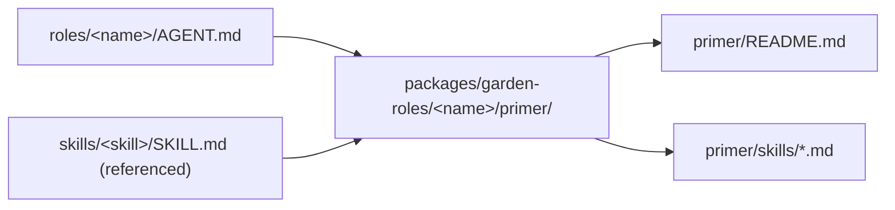
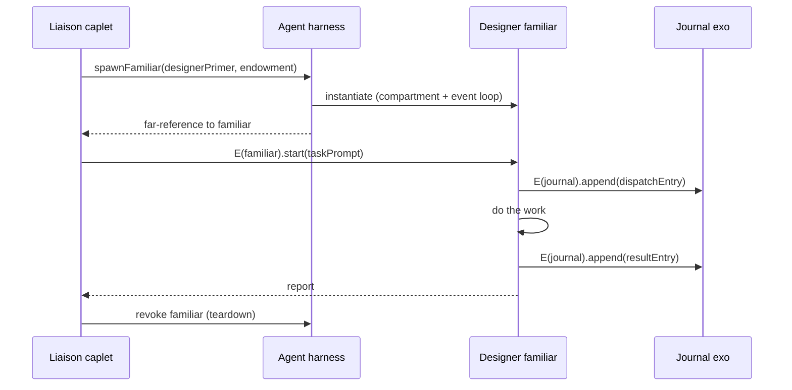

# Lessons from the Garden: shaping Endo's primer and agent harness for journal-driven multi-role workflows

| | |
|---|---|
| **Created** | 2026-05-17 |
| **Updated** | 2026-05-18 |
| **Author** | Kris Kowal (prompted) |
| **Status** | Proposed |

## Motivation

The *garden* is a working environment for orchestrated multi-role
agentic work across forks of upstream GitHub repositories.
It is currently bootstrapped on borrowed substrate: Claude Code is
the model harness, git is the persistent message bus, and bash is
the worktree plumbing.
A *role* is an `AGENT.md` file a dispatched subagent reads, a *skill*
is a `SKILL.md` file the subagent reads on demand, the *journal* is
an orphan git branch worktree that survives across dispatches and
acts as the message bus between agents, and a *dispatch* is a
freshly prepared triple of detached worktrees torn down on the
subagent's return.

Each piece of that bootstrap was a forced choice: the LLM reads
markdown; git stores append-only history cheaply; bash glues the
worktrees together.
The choice of substrate is convenient but it puts a ceiling on what
the garden can attest to about its own behavior.
The Sleeper Channels paper (Maloyan & Namiot 2026, arXiv:2605.13471)
puts that ceiling in formal terms: the paper distinguishes **D1**
defenses, where provenance is tagged but enforcement lives inside
the model loop (an in-context security warning the model is asked
to honor), from **D2** defenses, where enforcement sits **outside**
the model loop on a closed action set, gated by either trusted
provenance or a one-shot attestation the model cannot emit.
The diagnostic in
[`papers--maloyan-namiot-sleeper-channels-2026--provenance-gate-d2-and-soundness-theorem`](https://arxiv.org/abs/2605.13471) §
*Implications for the garden* concludes the garden sits at **D1
today**: journal frontmatter carries authorship, the boatman's
host-precondition check is procedural, and `identity_switch_authorized:
true` is plaintext in a journal entry the model can in principle
author.
The paper's seven invariants give a precise vocabulary for which
gaps matter and a Saltzer-Schroeder-grade target to close them
against.

**This is not a porting exercise.**
The garden runs today on Claude Code and git, and it will keep
running there.
The question this design answers is the inverse: *given that the
garden's working environment already exhibits a journal-driven
multi-role workflow, what primer and agent-harness primitives would
Endo need to provide to host such a workflow natively?*
The direction of inference points at Endo as the **subject** of the
lessons, not as the **container** the garden moves into.

*The Structure of Authority* (Miller, Tulloh, Shapiro, MOZ 2004)
supplies the architectural argument for why the lessons are worth
extracting at all.
Table 1's right column ("capability discipline") is the strict
reading of the corresponding entry in the left column ("good
software engineering"); the garden already exhibits the sparse-but-
capable *knowledge* structure on the left (the role-and-skill
library is decomposed by responsibility, skills are read just-in-
time, dispatches are isolated by per-engagement worktree), but it
cannot yet enforce the matching *authority* structure on the right
because its substrate gives it no way to.
Endo's primer-and-familiar primitives, suitably extended by a
journal-aware *agent harness*, are what would let a future garden-
on-Endo build read the left column and run the right one.
The paper's §3.8 argument (nested POLA multiplicatively reduces
attack surface) is the strongest reason to want that: the garden's
appetite for layers (orchestrator → subordinate role → loaded skill
→ invoked tool) is the exact nesting depth the multiplicative
reduction needs.

## Endo primitives in scope

This design draws on three Endo terms.
Two are documented today; one names the runtime piece that connects
them.

**Primer.**
A *primer* is the directory of markdown documents that defines an
agent's initial knowledge and capabilities.
The canonical reference is `packages/lal/primer/`
([`packages/lal/primer/README.md`](../packages/lal/primer/README.md)):
twelve files organized into three layers (agent reference, user
interface reference, how-to guides) covering tools, messaging,
capabilities, smallcaps encoding, formatting, errors, chat slash
commands, and step-by-step walk-throughs.
The agent reads the primer as part of its system prompt assembly;
the primer is *static* relative to a given agent build and *re-
readable* under the agent's normal capability discipline.
The structural property the garden cares about: **a primer is the
"what does this familiar know at start" answer**, its initial-
conditions slice in the *Structure of Authority* §3.4 sense.

**Familiar.**
A *familiar* in this project's vocabulary is the Electron-hosted
multi-agent shell (`packages/familiar/`,
[`packages/familiar/README.md`](../packages/familiar/README.md))
that runs the Endo daemon, the chat UI, and the agent caplets
together as one user-facing application.
For this design, the load-bearing property is operational rather
than UI-shaped: a familiar instance is a **vat-sized isolation
unit** in the *Concurrency Among Strangers* §6 sense.
It hosts a heap of objects, an event loop, a pending-delivery
queue, its own keypair, and a portion of the formula graph; it is
"the minimum unit of persistence, migration, partial failure,
resource control, and defense from denial of service" (§5.2,
p. 204).
An agent caplet (a `make(powers, context)` factory loaded into
the familiar's daemon as an unconfined guest) inherits the
familiar's vat boundary for free.

**Agent harness.**
An *agent harness* is the runtime loop that drives an agent caplet:
provider configuration, transcript assembly, tool dispatch,
message-following, cancellation, retry.
Two worked examples ship in the project:
[`packages/lal/agent.js`](../packages/lal/agent.js) (the
single-mode message-following loop documented in
[`packages/lal/LAL-ARCHITECTURE.md`](../packages/lal/LAL-ARCHITECTURE.md)
§ *The Agent Loop in Detail*) and
[`packages/genie/src/agent/index.js`](../packages/genie/src/agent/index.js)
(the more elaborate harness `TADA/genie/90_genie_setup.md` line 3
names "a mostly working core agent harness," with session
management, tool calls, memory integration, error handling, and a
streaming interface).
The `cli-edit-verb` design explicitly names *off-the-shelf agent
harnesses* as a class
([`designs/cli-edit-verb.md`](cli-edit-verb.md) line 743), framing
hashline's wire-contract decisions around the assumption that
several such harnesses exist and interoperate.
The harness sits *between* the primer (static) and the familiar
(vat-sized isolation) and is the natural locus for the journal-side
primitives the garden uses today.

**Petname graph, formula graph, per-agent keypair.**
Three supporting primitives the lessons draw on without redefining.
The *petname graph* is the per-agent name-to-formula mapping; the
*formula graph* is the daemon-wide acyclic recipe graph the
petnames resolve through
([`journal/library/concepts/formula-graph.md`](../journal/library/concepts/formula-graph.md));
the *per-agent keypair* is the Ed25519 identity formula each host
or guest agent holds, addressable to itself as `@keypair`
([`journal/library/concepts/per-agent-keypair.md`](../journal/library/concepts/per-agent-keypair.md)).
Together these are the operational form of the *Structure of
Authority* §3.4 "four ways to acquire references": Introduction
through eventual-send arguments, Parenthood through formula
construction, Endowment through initial petname graph, Initial
Conditions through daemon bootstrap.

**An explicit gap: there is no Endo-side "journal" primitive
today.**
The garden's word *journal* names an orphan git branch worktree
that is append-only by convention and acts as the cross-agent
message bus and durable transcript.
Endo has no shipped primitive that plays this exact role.
The closest existing pieces are the daemon's inbox / outbox of
mail messages (persisted via the formula graph; revived across
restarts under the persistence-by-petname-traversal discipline
that *Concurrency Among Strangers* §9.3 describes for E's vat
checkpoints) and the chat-spaces persistence work
([`designs/chat-spaces-gutter.md`](chat-spaces-gutter.md)), but
both are *per-conversation inbox* shapes, not the *daemon-wide
append-only message bus that survives across all agents and all
restarts* the garden's journal is.
A substantial part of this design is naming what such a primitive
would need to look like and where in the primer / harness / daemon
stack it belongs.

## The garden primitives the lessons are extracted from

The garden's own architecture is described in `CLAUDE.md` and
`WORKTREES.md` at the garden root; the relevant primitives are:

- **Orchestrators.**
  Two top-level postures: *liaison* (user-in-the-loop, excess
  authority, asks before acting) and *steward* (autonomous, bot
  credentials, bounded authority).
  Two derived postures: *understudy* (steward bounds, user-
  reachable) and *general-contractor* (liaison-adopted, parallelized
  PR pipeline).
- **Subordinate roles.**
  About fifty named roles (designer, builder, judge, fixer, weaver,
  shepherd, conductor, boatman, scout, journalist, scholar,
  twenty-three jury seats split across code and design panels, ...).
  Each is a single `roles/<name>/AGENT.md` file listing skills the
  role uses and per-role norms.
- **Skills.**
  About sixty skills.
  Each is a `skills/<name>/SKILL.md` file with purpose, inputs,
  procedure, output shape.
  Roles reference skills by path; skills are read just-in-time.
- **The journal.**
  Orphan branch `journal` worktree.
  Append-only by convention; entries carry `ts`, `kind`, `role`,
  optional `repo`, `project`, `to`, `refs`.
  Acts as transcript and as message bus between agents.
- **Dispatches.**
  A *dispatch* is a per-engagement worktree triple
  (`dispatches/<role>--<short-id>/{garden,journal,project}/`)
  prepared by `skills/dispatch-worktree/dispatch-prepare.sh` and
  torn down on return.
  Each triple is detached HEAD; commits push as `HEAD:<branch>`.
- **Standing monitors.**
  A small number of long-lived `worktrees/<owner>-<repo>/watch-*--monitor--*/`
  checkouts that bash daemons own.
  Bound to the *Monitoring safety constraint* in `CLAUDE.md`: only
  repositories gated against untrusted contributors are monitored,
  because daemon output enters the LLM's context on every wake.
- **Per-host bot identity.**
  Each host pins a bot identity (e.g. `endolinbot`, `kriscendobot`)
  into its garden repo's local git config; `dispatch-prepare.sh`
  pins the identity into every sub-worktree's local config so
  subagent commits cannot drift to the maintainer's global identity.
  Boatman dispatches override the pin per-commit when
  `identity_switch_authorized: true` is set.

## The lessons

This is the substantive core.
Each section names a piece of the garden, identifies the primitive
the garden's solution depends on (and where the theoretical
grounding lives), and proposes what an Endo primer, agent harness,
or daemon-side endowment would need to support to host that
primitive.
Where Endo already ships the right shape, the section cites the
source.
Where it does not, the section flags the gap.

### Roles teach us the primer must be role-shaped, not agent-shaped

**What the garden does.**
A role file (`roles/<name>/AGENT.md`) is the operating brief for one
posture (designer, builder, judge, ...).
About fifty of them stand alongside about sixty skills.
The set of skills a role *uses* is named in the role file as a list
of relative links; the dispatched subagent loads skills only when
the procedure calls for them.
Different dispatches with different roles run against the same
garden checkout but read entirely disjoint subsets of the role-and-
skill library.

**The primitive the garden depends on.**
This is the *initial conditions* slice of the access graph in
the *Structure of Authority* §3.4 sense
([`papers--miller-tulloh-shapiro-structure-of-authority-2004--fractal-structure-of-authority`](../journal/library/sections/papers--miller-tulloh-shapiro-structure-of-authority-2004--fractal-structure-of-authority.md)):
the role file says, in markdown, what the subagent knows at spawn.
The garden's *non-CLAUDE.md filename trick* (`AGENT.md`, not
`CLAUDE.md`) is a workaround for an absent primitive: Claude Code
auto-loads every `CLAUDE.md` in scope, so the garden has to dodge
that auto-load to keep each role's initial conditions sparse.

**What Endo would need to provide.**
A primer that ships *with the agent caplet* and is selected at
caplet construction, not by host-side filename globbing, removes the
need for the filename trick.
The shipped `lal` primer
([`packages/lal/primer/README.md`](../packages/lal/primer/README.md))
is already the right shape, but where `lal` ships *one* primer for
*one* posture, the garden-on-Endo build would ship *one primer per
role*: `packages/garden-roles/designer/primer/`,
`packages/garden-roles/builder/primer/`, etc.
The lesson is that **Endo's primer story already supports this**;
what an agent harness would need to add is a *primer-selection*
endowment so the dispatching caplet can choose which primer the
spawned familiar gets.
The `lal` setup script already constructs sub-guests with a primer
reference (`packages/lal/agent.js` lines 1641-1656); the missing
piece is making *primer choice* a per-spawn endowment rather than a
build-time bake-in.



### Dispatches teach us the harness must spawn under endowment, not under filesystem convention

**What the garden does.**
A dispatch is `dispatch-prepare.sh` followed by an `Agent` tool
invocation.
The script creates the worktree triple, pins the bot identity into
each sub-worktree's git config, names the triple in the dispatch
prompt, and trusts the subagent's procedural discipline to stay
inside the triple.
The dispatch prompt names role, repo, task; the subagent obeys.

**The primitive the garden depends on.**
This is the *Endowment* mechanism (the third of the four ways
references can be acquired in *Structure of Authority* §3.4
([`papers--miller-tulloh-shapiro-structure-of-authority-2004--fractal-structure-of-authority`](../journal/library/sections/papers--miller-tulloh-shapiro-structure-of-authority-2004--fractal-structure-of-authority.md)),
expressed today through the filesystem rather than through any
capability discipline: "we hand you these three worktrees and trust
you to write only inside them."
The trust is procedural; the *Only connectivity begets connectivity*
rule of §3.4 is approximated by filesystem path checks the subagent
performs against itself.

**What Endo would need to provide.**
An agent-harness primitive `spawnFamiliar(primerName, endowment)`
that hands the new familiar a *closed JavaScript object* assembled
at spawn time:

```js
const endowment = harden({
  journal: E(daemonPowers).getAttenuatedJournal({
    writePathPrefix: `entries/${date}/${role}--${shortId}/`,
    readScope: 'all',
  }),
  project: await E(workspace).provideWorktree(`endojs/${repo}`, branch, {
    readWrite: true,
    sandbox: 'per-dispatch',
  }),
  garden: await E(workspace).provideWorktree('kriskowal/garden', 'main', {
    readOnly: true,
  }),
  identity: E(daemonPowers).getBotKeypair(),
  github: E(githubGateway).getAttenuatedClient({
    repos: [`endojs/${repo}`],
    scopes: ['pull-request-create', 'review-thread-reply'],
  }),
});
const familiar = await E(harness).spawnFamiliar(primerName, endowment);
```

Capabilities not in the endowment are not reachable.
The per-dispatch worktree triple becomes a per-familiar compartment
boundary backed by the familiar's vat; familiar shutdown is the
moral equivalent of `dispatch-teardown.sh`.
The `lal` harness already shows the basic shape (`make(guestPowers,
context, { env })` in `packages/lal/agent.js`); the lesson is what
*endowment fields* an off-the-shelf harness must accept and gate on
to host a garden-style dispatch:

| Endowment field | What it gates                                          |
| --------------- | ------------------------------------------------------ |
| `journal`       | append + (optional) read on the journal exo            |
| `project`       | filesystem read/write on one branch worktree           |
| `garden`        | filesystem read on the role/skill library              |
| `identity`      | the keypair commits and messages are attributed to     |
| `github`        | a per-repo, per-scope attenuated GitHub client         |

The harness is responsible for refusing any tool invocation whose
target is not in the endowment; the model loop has no way to widen
its own endowment because there is no ambient `daemonPowers` it can
reach.
This is Property D (No Ambient Authority) from *Capability Myths
Demolished* §6
([`papers--miller-capability-myths-demolished-2003--four-models-and-seven-properties`](../journal/library/sections/papers--miller-capability-myths-demolished-2003--four-models-and-seven-properties.md))
made operational at the harness boundary.



### The journal teaches us Endo needs a daemon-resident append-only message-bus exo, paired with the petname graph

**What the garden does.**
The journal is the cross-role transcript and message bus.
Every dispatch writes a `dispatch` entry at the start and a `result`
entry at the end.
Roles message each other by writing entries whose `to:` field names
the target role.
The journal's filesystem layout
(`journal/entries/<YYYY>/<MM>/<DD>/<HHMMSS>Z-<kind>-<role>-<short-id>.md`)
makes browsing cheap; the orphan branch and append-only discipline
make rewrites detectable; the directory structure plus `grep`
suffices for the queries roles actually want (entries for a project,
entries from a role, recent entries, the most recent matching
entry).

**The primitive the garden depends on.**
Two distinct sub-primitives.
The first is a **daemon-wide append-only message bus** with a per-
entry trust label (`from:` the writing role) and durable persistence
that survives daemon restarts.
The closest theoretical grounding is *Concurrency Among Strangers*
§9.3
([`papers--miller-tribble-shapiro-concurrency-among-strangers-2005--partial-failure-and-when-catch`](../journal/library/sections/papers--miller-tribble-shapiro-concurrency-among-strangers-2005--partial-failure-and-when-catch.md))
on persistence-by-traversal-from-petname-roots: the journal's
entries persist because the daemon can revive them from the formula
graph after a restart; in the garden today, git plays the role of
the formula graph for journal entries.
The second is a **petname graph for cross-role addressing**: the
journal's `to:` field is an ad-hoc string today, but the role it
names must be reachable as an actual capability for the
"message-bus" framing to be more than convention.

**What Endo would need to provide.**
This is the largest gap.
A new **journal exo** at (notionally)
`packages/garden-journal/journal-exo.js`, whose `append(entry)` is
the only mutator; the exo seals the entry with the calling
familiar's keypair, includes the previous entry's hash, and stores
the result as a formula in the daemon's content-addressed store.
The interface is `makeExo` with an `M.interface()` guard so calls
are validated at the boundary
([project CLAUDE.md § *Modules and exports*](../CLAUDE.md)).
Different roles get *different attenuations* of the journal:

| Role          | Endowed journal capability                                           |
| ------------- | -------------------------------------------------------------------- |
| Any subagent  | `append({ to: <my-role>, kind: result|message, ... })`               |
| Steward       | `append(...)` plus `readBulletin()` plus `clearBulletin(entryId)`    |
| Liaison       | full `append(...)`, `readAll()`, `subscribe(filter)`                 |
| Boatman       | `append(...)` plus `attestUpstreamPush(prDescriptor, attestation)`   |

Each attenuation is a *Caretaker pattern* facet
([`journal/library/concepts/caretaker-pattern.md`](../journal/library/concepts/caretaker-pattern.md))
of the same underlying journal exo.
The harness chooses which facet to endow at familiar-spawn time; the
familiar has no path to widen its own endowment.

**The petname graph as message-bus directory.**
A `message` entry "to: scholar" becomes `E(scholar).receive(message)`
once the scholar familiar is alive; before then it queues at the
journal exo and the next scholar dispatch hydrates it as part of its
endowment.
The petname graph carries the message bus the journal entries only
described.

**Append-only as a structural property.**
On the garden today, append-only is maintained by `git`'s normal
discipline plus a social convention that nobody rewrites the journal.
On Endo, append-only would be structural: each entry's formula
identifier includes the hash of the previous entry's formula
identifier, so rewriting the chain produces a different formula
graph the daemon will refuse to load against the persisted hash.
A daemon restart revives the journal from the formula graph; entries
broken by partition (the *Concurrency Among Strangers* §9.3 framing
of crash-as-partition) revive as broken references, not as forged
new entries.

**Who can write where.**
A familiar's endowed journal facet declares its write-path prefix at
spawn time and cannot widen.
A designer dispatch writes only under
`entries/.../designer--<short-id>/`; a boatman dispatch writes only
under `entries/.../boatman--<short-id>/`.
This is the operational form of (I-Tag) from the Sleeper Channels
seven invariants: the entry's `from:` is set at write time from the
calling familiar's keypair, not from text the familiar supplies.

The journal exo's *method-surface* is the design's biggest open
question (see *Open questions* item 3): the garden's current journal
usage is wider than the four methods sketched above, and a richer
exo gives the daemon more places to enforce invariants but
re-introduces ambient policy if pushed too far.

### Standing monitors teach us long-lived familiars need deliberately narrow endowment

**What the garden does.**
A standing monitor is a bash daemon that polls GitHub plus a long-
lived worktree that hosts its scratch state.
The daemon's output enters the LLM's context only via the steward's
daemon-log tail, but once it does, *the steward's full authority
is exercised on whatever the daemon's output said*.
The Sleeper Channels paper names this failure mode (§II, the
*OS-live agent's single authority boundary*); the garden's
mitigation today is the *Monitoring safety constraint* (only
monitor repos gated against untrusted contributors), which is a
procedural D1 mitigation.

**The primitive the garden depends on.**
A *durable* familiar with an *attenuated* endowment.
Theoretical grounding: *Structure of Authority* Table 1's *Omit
needless vulnerability*
([`papers--miller-tulloh-shapiro-structure-of-authority-2004--multiplicative-pola-and-security-as-modularity`](../journal/library/sections/papers--miller-tulloh-shapiro-structure-of-authority-2004--multiplicative-pola-and-security-as-modularity.md))
applied at role granularity, and the Sleeper Channels H1 hook
(inbound adapter that tags artifacts at intake).

**What Endo would need to provide.**
A harness primitive for *long-lived* familiar spawning, distinct
from per-dispatch spawning, with a *deliberately narrow* endowment:

```js
const monitor = await E(harness).spawnFamiliar('monitor-endo-but-for-bots', harden({
  network: E(networkGateway).getAttenuatedClient({
    egress: ['api.github.com/repos/endojs/endo-but-for-bots/...'],
    methods: ['GET'],
  }),
  journal: E(journalExo).getMonitorFacet({
    writePathPrefix: `entries/.../monitor-endo-but-for-bots--standing/`,
  }),
}));
```

That endowment is *all* the monitor has.
It cannot spawn other familiars (no `harness` reference).
It cannot read other repos (egress restriction).
It cannot write outside its journal prefix.
It cannot reach the network gateway's wider surface (only the
attenuated facet was endowed).
The network gateway is the H1 hook: it attaches a
`(channel=github-api, principal=<repo-author>,
device=monitor-network-gateway)` triple to each fetched comment
body before passing it across the boundary.
The journal exo refuses to append an entry whose causal set has any
untrusted principal in `Π` unless the entry's `kind` is
`monitor-observation` (a label that does not authorize downstream
action).
The steward's subsequent dispatch from a monitor observation must
either fall within `Πα ⊆ T` or carry a one-shot attestation from
the maintainer, which closes the A4 confused-deputy path the
paper's *Implications for the garden* §3-§4 names.

### Bot identity teaches us per-familiar keypairs scoped to identity capabilities, with a separate identity for upstream pushes

**What the garden does.**
Per-host bot identity is a local git-config pin (`user.name =
endolinbot`, `user.email = ...`); the dispatch-prepare script pins
it into every sub-worktree.
The boatman overrides the pin per-commit with
`git -c user.name=...` when its dispatch carries
`identity_switch_authorized: true`.

**The primitive the garden depends on.**
Distinct identities scoped to distinct authorities, and a one-shot
mechanism to "switch" identity for a specific upstream action.
Theoretical grounding: *Concurrency Among Strangers* §9.2 on
offline capabilities and swiss-number discipline
([`papers--miller-tribble-shapiro-concurrency-among-strangers-2005--partial-failure-and-when-catch`](../journal/library/sections/papers--miller-tribble-shapiro-concurrency-among-strangers-2005--partial-failure-and-when-catch.md)).

**What Endo would need to provide.**
Each familiar already has a per-agent keypair
([`journal/library/concepts/per-agent-keypair.md`](../journal/library/concepts/per-agent-keypair.md))
addressable as `@keypair`.
The bot identity *is* the familiar's keypair.
A subagent's commits to a project worktree are signed (or
attributed, when the project does not enforce signed commits) by
the familiar's keypair.
The boatman remains a special case: the maintainer endows the
boatman familiar with a separate `kriskowalIdentity` capability
whose `signCommit(payload, attestation)` validates an `attestation`
field naming the action-instance digest of the upstream PR the
commit belongs to.
Without a matching attestation, `kriskowalIdentity.signCommit`
refuses; the boatman has no path to forge an attestation because
the model loop has no emit primitive into the attestation channel
(the paper's I-Channel invariant).

The wider liaison-on-`endolinbot`-refuses-to-originate-a-boatman-
dispatch rule
([garden `CLAUDE.md` § *Boatman dispatches and host preconditions*](../CLAUDE.md))
becomes a structural property: a liaison familiar spawned in the
endolinbot daemon never sees the `kriskowalIdentity` capability in
its endowment, because the daemon's daemon-genesis bootstrap never
formulated one.
The procedural check (the boatman's *Host preconditions* norm) is
preserved as a second line of defense.

### Authorization shapes teach us one-shot attestations over canonical-form action-instance digests

**What the garden does.**
Authorization shapes today are plaintext fields in a journal entry:
`identity_switch_authorized: true`, `mirror_authorized: true`, etc.
A liaison originates them after user confirmation; the steward
forwards but never originates; the receiving role acts on them
implicitly.

**The primitive the garden depends on.**
A way for the maintainer to bind a specific authority to a specific
action-instance, computable from the action's canonical bytes,
verifiable without trusting the model loop.
Theoretical grounding: Sleeper Channels §VII-A action-instance
digest
([`papers--maloyan-namiot-sleeper-channels-2026--provenance-gate-d2-and-soundness-theorem`](../journal/library/sections/papers--maloyan-namiot-sleeper-channels-2026--provenance-gate-d2-and-soundness-theorem.md))
and the I-Channel invariant the digest enables.

**What Endo would need to provide.**
A maintainer-attestation channel and a harness-side gate that
consumes attestations on a closed action set.
The action-instance digest covers the post-normalisation dispatch
bytes:

```js
const digest = sha256(canonicalJson({
  kind: 'boatman-ferry',
  causal: sortedCausalSet,           // entries the dispatch read
  args: {
    repo: 'endojs/endo-but-for-bots',
    sourceBranch: 'design-x-foo',
    targetBranch: 'main',
    prTitle: '...',
    prBody: '...',
  },
  target: 'github-pr-create',
  ownerDevice: 'maintainer-yubikey-1',
}));
```

The maintainer issues a one-shot attestation `(digest, nonce,
expiry, qg)` over the hardware-attested companion channel.
The boatman familiar at dispatch time has both the dispatch
description and the attestation; the attestation's digest must
match the digest computed from the exact post-normalisation
dispatch bytes, or the gate denies.
The nonce is consumed atomically on use; repeated attestations on
the same digest fail.

Today's authorization shapes split into three target shapes:

| Today (plaintext flag in journal entry)         | Tomorrow (Endo D2)                                                                 |
| ----------------------------------------------- | ---------------------------------------------------------------------------------- |
| `identity_switch_authorized: true` (boatman)    | one-shot attestation bound to the specific PR's title + body + target branch       |
| `mirror_authorized: true` (boatman mirror)      | one-shot attestation bound to the mirror's source SHA + target branch              |
| `monitor_re-enable_authorized: <repo>` (gardener) | persistent maintainer-signed capability the gardener endows to a new monitor      |
| `pre-staged authorizations` (bulletin items)    | maintainer-signed capability future-dated to a window the steward can present      |

The fourth row deserves a note: not everything moves to per-action
digests.
Pre-staged authorizations are *standing capabilities* the maintainer
wants the steward to wield without per-action confirmation; they
map to maintainer-signed certificates with a future expiry, not to
one-shot nonces.
This is the *Concurrency Among Strangers* §9.3 *durable* offline
capability class rather than the *transient* one.
The trade-off is honest: a standing capability widens the steward's
authority window; the paper's D3 framing (per-skill capability
manifests) would gate even standing capabilities on a "Rule of Two"
budget.

## Threat-model walk (Sleeper Channels persistence × firing matrix)

Walking the Sleeper Channels §V persistence × firing-separation
matrix against the design's proposed shape (i.e., supposing Endo
provided the primer, harness, and journal primitives lessons 1-6
name) produces the following:

### Cells the proposed shape closes (or substantially narrows)

- **M2 × C2 (cross-channel exfil via memory; the paper's A3
  scenario).**
  On the garden today, a malicious comment body persisted in a
  monitor's journal entry could surface in a steward's later
  dispatch and shape the steward's action.
  Under the proposed shape, monitor-written journal entries have
  `Π ⊇ {github-api/<author>/...}`; a steward dispatch that derives
  an action from such an entry has `Πα ⊄ T` and the gate denies
  unless a maintainer attestation is present.
- **M5 × C4 (cron via confused deputy; the paper's A4 scenario).**
  The garden's analog is a `/loop` or scheduled dispatch acting on
  a journal directive whose authorship is untrusted.
  Under the proposed shape, the scheduler is a `Cron` exo whose
  `addEntry(spec, action)` is in the closed action set `C`; the
  gate computes `Πα` over the journal entry that proposed the
  schedule.
  If that entry has untrusted provenance, the schedule is denied
  at H9 (the scheduler hook) without requiring the loop body to
  refuse.
- **M3 × C2 (skill-trojan via group chat; A2).**
  The garden's analog is a maintainer-authored skill that quietly
  acquires authority not granted at install.
  Under the proposed shape, skills are *primer files* inlined at
  primer-build time; loading a primer is the H4-H5 hook (skill
  load) and the primer's manifest declares which capabilities the
  primer's role expects.
  Mismatch between the manifest and the requested endowment denies
  at familiar-spawn time.
- **M4 × C4 (dotfile patch; A5).**
  The garden's analog is a subagent writing under `~/.config/...`
  or another out-of-worktree location.
  Under the proposed shape, the familiar's filesystem capability
  is endowed only with the dispatch-root worktrees; writes outside
  fail-closed (the H8 hook).

### Cells the proposed shape substantially leaves open

- **M1 × C0 (single-shot in-context injection).**
  The familiar's prompt body still contains attacker-influenced
  text on every wake; D2 does not prevent the model from being
  coerced into emitting attacker-favored text.
  What it prevents is the side-effecting *action* on that text.
  This is the paper's own framing in §VII-H's last paragraph.
- **Side-channel persistence outside the formula graph.**
  If a familiar's compartment leaks state through a side channel
  the daemon does not mediate (an unseeded env var, an FFI call to
  a host library), the mediation invariant fails for that channel
  and `Πα ⊄ T` cannot be assured.
  The paper's I-Mediation prescription (enclosing sandbox) is the
  structural answer; SES lockdown plus a microVM around the
  familiar's hosting daemon is the operational answer.

### The four illustrative scenarios

- **A2 (M3 × C2, skill trojan).**
  *Response:* the skill is a primer file; the primer manifest
  declares the capability set; widening at runtime would require an
  H4-H5 hook write that the model cannot reach without a one-shot
  attestation.
- **A3 (M2 × C2, memory-borne exfil).**
  *Response:* the memo's `Π` carries the attacker tag from H1 (the
  inbound adapter); the H10 outbound-emission gate denies the exfil
  dispatch.
- **A4 (M5 × C4, cron confused deputy).**
  *Response:* the H9 scheduler gate observes `Πα` includes the
  attacker tag; the entry is denied without owner attestation for
  the *exact* schedule's digest.
- **A5 (M4 × C4, dotfile patch).**
  *Response:* the familiar's filesystem capability does not include
  `~/.config/...`; H8 denies the write.

The pattern across A2-A5 is the paper's central architectural
claim: **enforcement outside the model loop on a closed action set,
gated by either trusted provenance or a one-shot attestation,
defeats the cross-channel firing pattern that is the sleeper
channel's defining feature**.

## Open questions

Several decisions remain open and would block a serious attempt to
ship the primitives this design names.

1. **What is the relation between an agent harness and a primer
   version?**
   A garden role today is updated by the gardener: a commit on
   `main` lands a new `roles/<name>/AGENT.md`, and the next dispatch
   reads the updated file.
   On Endo, the primer is part of the caplet's source tree; updating
   it requires re-bundling the caplet.
   But the *agent harness* is a separate piece of software again
   ([`packages/lal/agent.js`](../packages/lal/agent.js),
   [`packages/genie/src/agent/index.js`](../packages/genie/src/agent/index.js)).
   What is the relationship: one harness, many primers (a single
   garden-roles harness picks a primer per spawn)?
   Or one harness per role family?
   What is the equivalent of the gardener's "land role edits on
   main" discipline when the role lives in a bundled caplet?
   The likely shape is a `garden-roles` package whose `develop`
   workflow rebuilds primers on save, with a single shared harness
   binary; the binding of "primer version" to "familiar instance"
   needs a concrete versioning story this design does not yet
   provide.

2. **Where does Property F (Access-Controlled Delegation Channels)
   sit for cross-host garden instances?**
   The garden runs on multiple hosts (`kmkmbp2021`, `endolinbot`),
   each with its own bot identity.
   If the proposed "kriskowal-identity capability" lives only on the
   credentialed host, how does a steward on a different host
   *delegate* to the credentialed host?
   The *Capability Myths Demolished* §6 framing
   ([`papers--miller-capability-myths-demolished-2003--four-models-and-seven-properties`](../journal/library/sections/papers--miller-capability-myths-demolished-2003--four-models-and-seven-properties.md))
   requires the delegation channel to be access-controlled, but
   the garden's current cross-host mechanism is filesystem sharing
   of the journal worktree.
   Migrating to per-familiar capabilities means working out the
   cross-host CapTP story for inter-daemon delegation, which is
   its own design.

3. **What is the canonical-form for the action-instance digest the
   maintainer signs?**
   The Sleeper Channels paper's digest covers post-normalisation
   dispatch bytes (§VII-A, p. 4).
   For a boatman ferry, the load-bearing bytes are the PR title, PR
   body, target branch, and the SHA of the source branch's HEAD at
   ferry time.
   For a designer's design-PR open, the bytes are similar but the
   diff is also load-bearing.
   The schema for canonical-form per dispatch kind needs
   specification before D2-grade attestations are issuable.

4. **What is the journal exo's method-surface, and what stays on
   direct endowment?**
   The journal exo's `append`, `readBulletin`, `clearBulletin`,
   `subscribe`, `attestUpstreamPush` are sketched here.
   The garden's current journal usage is much wider: cross-entry
   queries (`grep -rl 'project: endo' entries/`), historical
   browsing (`agents/` archive lookups), bulletin maintenance,
   library-section reads.
   How much of that becomes journal-exo method surface, and how
   much stays as "the orchestrator was endowed with read-access to
   the journal directory and can grep it directly"?
   Erring toward fewer methods preserves the principle that *the
   reference graph is the access graph*; erring toward more methods
   gives the daemon more places to enforce invariants but risks
   reintroducing ambient policy.
   This question changes meaning under the reframe: it is no longer
   "where do these methods sit in a hypothetical Endo journal
   primitive" (there is none); it is "what new primitive is the
   right shape, and how much of the daemon should that primitive
   own."

5. **What happens to the garden's `references/` shelf?**
   The garden's `references/<source>/` directories hold read-only
   snapshots of roles and skills imported from other gardens.
   If garden roles become primers shipped with a caplet, the
   references shelf becomes *non-canonical primer drafts* the
   gardener consults when designing a new role.
   The mechanism for keeping these up to date and the visibility
   from a familiar (or only from the gardener's tooling) needs a
   decision.

6. **How do `@endo/lal` and `@endo/genie` fit?**
   Both packages already ship agent harnesses:
   [`packages/lal/agent.js`](../packages/lal/agent.js) is the
   simpler message-following harness;
   [`packages/genie/src/agent/index.js`](../packages/genie/src/agent/index.js)
   is the more elaborate session-management-and-tool-dispatch
   harness.
   The garden-on-Endo build needs at least one of:
   (a) a third harness shaped specifically for orchestrated batch
   work (the dispatched-subagent pattern), or
   (b) an extension of one of the existing harnesses to accept the
   endowment fields this design names, or
   (c) a clear division of labor (lal for chat-driven, genie for
   memory-rich, garden-roles for batch-orchestrated).
   The harness is *the* load-bearing piece for "what does Endo need
   to provide": choosing among (a), (b), (c) is the gating
   decision.

7. **(New under the reframe.) What does "primer + harness +
   journal exo" look like as a single shipped artifact?**
   Today the garden ships as a markdown library plus shell scripts;
   Endo today ships agent harnesses bundled as caplets.
   If Endo grew the primitives this design names, the natural
   shipped form is something like *a primer package that names its
   harness and journal-exo dependencies*.
   The shape of that package (is it an `@endo/agent-harness`
   abstract package the role-primer packages depend on? does the
   familiar provide a marketplace for primer-package selection?)
   is open.

8. **(New under the reframe.) Does the journal exo belong in the
   daemon, in the familiar, or as its own caplet?**
   The garden's journal is read by many roles and written by all of
   them.
   On Endo, three placements are plausible: daemon-resident (every
   familiar in the daemon shares one journal), familiar-resident
   (each familiar has its own; cross-familiar reads go via CapTP),
   or caplet-resident (a `@endo/journal` caplet that familiars
   spawn or attach to).
   The choice has ripple effects: daemon-resident is the simplest
   match for the garden's current model but couples the journal to
   daemon-lifetime; caplet-resident matches the garden's "any agent
   can read the journal" property but means the journal-exo is in
   the address space of the agent that reads it, with no clean
   isolation.
   This is the central placement question for the gap the design
   names.

## Implementation phasing

The design is a proposal; if pursued, the work splits into three
phases that depend on each other.

### Phase 1: A garden-roles primer package and a harness that selects from it

Goal: demonstrate the *primer-per-role* shape with one role, on
top of an existing harness, with the journal still git-backed.

- Pick the simplest role to port (likely `designer` itself, since
  this design's exemplar is *a designer dispatch*).
- Author `packages/garden-roles/designer/primer/` mirroring the
  `lal` primer's shape.
- Extend either the `lal` or `genie` harness to accept a primer
  name at spawn time and assemble its system prompt from the
  selected primer directory.
- Verify a designer "dispatch" (spawning a designer familiar with
  a designer primer) can run end-to-end (read a design prompt,
  write a `designs/<slug>.md`, push a branch) using git for the
  journal write.

Exit criterion: a designer dispatch produces a design PR as today,
but the operating instructions came from a primer rather than from
`AGENT.md`.

### Phase 2: Journal exo and attenuated facets

Goal: the journal becomes a daemon-resident exo with per-role
attenuated facets.

- Implement `packages/garden-journal/` with the journal-exo shape
  sketched above.
- Bridge the existing orphan-branch journal: a one-way mirror that
  the exo writes to git on a background loop.
  This keeps the maintainer's familiar grep-the-journal habits
  working through the transition.
- Define attenuation facets for every existing role.
- Move append-only enforcement from social convention to formula-
  graph chaining.

Exit criterion: every active garden role's dispatch goes through
the journal exo for `result` and `message` writes; the git-backed
journal continues to exist as a downstream mirror but is no longer
the authoritative store.

### Phase 3: Closed action set, mediation hooks, attestations

Goal: D2-grade enforcement on the boatman, the gardener's
monitor-arming action, and one other high-stakes dispatch shape.

- Identify the closed action set `C` for the boatman: PR open, PR
  mirror, label edit, reaction post.
- Implement the action-instance digest canonical-form for each.
- Implement the maintainer's attestation channel (the choice
  between a hardware-key signing flow and a maintainer-Familiar-
  resident attestation exo is itself a design decision).
- Implement the H1/H2/H6/H7/H8/H9/H10 hooks against the boatman's
  GitHub gateway, the journal exo, the network gateway, the
  filesystem capability, the scheduler exo.

Exit criterion: a boatman ferry without a maintainer attestation
denies at H10 with a `untrusted-provenance` reason; a boatman
ferry *with* a matching attestation succeeds.
The maintainer's signing surface and the boatman's dispatch surface
are wired but the attestation channel itself is hardware-attested.

The three phases are roughly sequential; phase 2 depends on phase 1
(spawned familiars are what hold the journal facets), and phase 3
depends on phase 2 (the action-instance digest covers entries the
journal exo writes).
Each phase is independently shippable as a draft PR against `llm`
and re-bases on top of unrelated `llm` work.

## Considered and rejected

- **Considered and rejected: framing this design as "port the
  garden onto Endo".**
  Reason: the garden runs today on Claude Code and git, will keep
  running there, and the maintainer's framing is explicit ("this
  workflow will teach us how to shape the Endo primer and agent
  harnesses so they can do similar work").
  The design's job is *extracting lessons*, not *plotting a
  migration*.
- **Considered and rejected: a single mega-primer covering every
  role.**
  Reason: it defeats the *Structure of Authority* §3.4 endowment
  argument.
  Each role wants exactly the primer slice its responsibilities
  need; merging primers re-introduces ambient authority through
  the ambient knowledge of all other roles' capabilities.
- **Considered and rejected: mapping the garden's journal onto an
  existing Endo primitive.**
  Reason: there is no existing Endo primitive that plays the
  garden's journal's role (daemon-wide append-only message bus
  with cross-role addressing).
  The closest hits (the daemon's per-conversation inbox/outbox
  and the chat-spaces persistence work) are *per-conversation*
  shapes, not *cross-agent* ones.
  Pretending otherwise (the prior draft of this design's
  *Background* section) miscommunicated what the design proposes.
- **Considered and rejected: model the bot identity as a global
  daemon-level capability.**
  Reason: it reintroduces the confused-deputy hazard the per-host
  pin currently mitigates.
  The per-familiar keypair preserves Property A
  ([`papers--miller-capability-myths-demolished-2003--four-models-and-seven-properties`](../journal/library/sections/papers--miller-capability-myths-demolished-2003--four-models-and-seven-properties.md))
  by making *which identity is signing* visible at the dispatch
  boundary rather than ambient inside the familiar's compartment.

## References

### Library sections

The lessons draw principally on these library sections (paths
relative to the garden's `journal/` worktree):

- [`papers--maloyan-namiot-sleeper-channels-2026--sleeper-channel-taxonomy-and-running-scenario`](../journal/library/sections/papers--maloyan-namiot-sleeper-channels-2026--sleeper-channel-taxonomy-and-running-scenario.md)
  the persistence × firing-separation taxonomy and the A4
  walk-through; the *Implications for the garden* block names the
  steward / monitor / boatman / skill mappings this design extends.
- [`papers--maloyan-namiot-sleeper-channels-2026--provenance-gate-d2-and-soundness-theorem`](../journal/library/sections/papers--maloyan-namiot-sleeper-channels-2026--provenance-gate-d2-and-soundness-theorem.md)
  the D2 gate, the action-instance digest, the seven invariants,
  and the diagnostic that places the garden at D1 today.
- [`papers--maloyan-namiot-sleeper-channels-2026--executable-policy-and-measurement-plan`](../journal/library/sections/papers--maloyan-namiot-sleeper-channels-2026--executable-policy-and-measurement-plan.md)
  the executable reference and the source-anchored-citation
  discipline this design's *Open questions* item 3 calls for.
- [`papers--miller-tulloh-shapiro-structure-of-authority-2004--excess-authority-and-designation`](../journal/library/sections/papers--miller-tulloh-shapiro-structure-of-authority-2004--excess-authority-and-designation.md)
  the cp / cat lesson; the architectural argument that
  designation and authority are one act in Model 4.
- [`papers--miller-tulloh-shapiro-structure-of-authority-2004--fractal-structure-of-authority`](../journal/library/sections/papers--miller-tulloh-shapiro-structure-of-authority-2004--fractal-structure-of-authority.md)
  the four ways B can come to know about C (Introduction,
  Parenthood, Endowment, Initial Conditions); the spawning-tree
  framing this design uses for dispatch-as-familiar-spawning.
- [`papers--miller-tulloh-shapiro-structure-of-authority-2004--multiplicative-pola-and-security-as-modularity`](../journal/library/sections/papers--miller-tulloh-shapiro-structure-of-authority-2004--multiplicative-pola-and-security-as-modularity.md)
  Table 1 and the multiplicative-attack-surface argument; the
  reason nesting depth matters in *Motivation*.
- [`papers--miller-capability-myths-demolished-2003--four-models-and-seven-properties`](../journal/library/sections/papers--miller-capability-myths-demolished-2003--four-models-and-seven-properties.md)
  Properties A through G; the formal vocabulary for "no ambient
  authority" and "access-controlled delegation."
- [`papers--miller-capability-myths-demolished-2003--advantages-pola-confused-deputy`](../journal/library/sections/papers--miller-capability-myths-demolished-2003--advantages-pola-confused-deputy.md)
  the unconfusable-deputy framing this design uses for the
  boatman.
- [`papers--miller-tribble-shapiro-concurrency-among-strangers-2005--vat-and-event-loop-model`](../journal/library/sections/papers--miller-tribble-shapiro-concurrency-among-strangers-2005--vat-and-event-loop-model.md)
  the vat-as-isolation-unit framing for the familiar.
- [`papers--miller-tribble-shapiro-concurrency-among-strangers-2005--partial-failure-and-when-catch`](../journal/library/sections/papers--miller-tribble-shapiro-concurrency-among-strangers-2005--partial-failure-and-when-catch.md)
  the persistence-by-traversal-from-petname-roots story and the
  offline-capability / swiss-number discipline used for bot
  identity.
- [`journal/library/concepts/formula-graph.md`](../journal/library/concepts/formula-graph.md)
  the petname-graph-as-persistence-root concept.
- [`journal/library/concepts/per-agent-keypair.md`](../journal/library/concepts/per-agent-keypair.md)
  the per-agent-keypair concept used for the bot identity
  mapping.
- [`journal/library/concepts/caretaker-pattern.md`](../journal/library/concepts/caretaker-pattern.md)
  the facet / attenuation pattern used for the journal exo's
  per-role surfaces.

### Endo source citations

- [`packages/lal/primer/README.md`](../packages/lal/primer/README.md)
  the reference primer shape (twelve files in three layers).
- [`packages/lal/LAL-ARCHITECTURE.md`](../packages/lal/LAL-ARCHITECTURE.md)
  the worked-example agent caplet that runs against a primer;
  the *Agent Loop in Detail* section is the running-harness model.
- [`packages/lal/agent.js`](../packages/lal/agent.js)
  the `make(guestPowers, context, { env })` entry-point shape,
  the inbox-following loop, and the primer check-in lines 1641-1656
  that make primer choice a familiar property.
- [`packages/genie/src/agent/index.js`](../packages/genie/src/agent/index.js)
  the second worked-example harness; the
  `TADA/genie/90_genie_setup.md` line 3 framing names this as "a
  mostly working core agent harness."
- [`packages/familiar/README.md`](../packages/familiar/README.md)
  the Electron shell hosting the daemon and agent caplets.
- [`packages/genie/DESIGN.md`](../packages/genie/DESIGN.md)
  the system-prompt builder this design's *Open questions* item
  6 references.
- [`designs/cli-edit-verb.md`](cli-edit-verb.md)
  line 743 names "off-the-shelf agent harnesses" as a category,
  framing wire-contract decisions around their interoperability.
- [`packages/daemon/`](../packages/daemon/) and the surrounding
  daemon-persistence designs: for formula-graph and content-store
  persistence semantics the journal exo would build on.
- [`designs/chat-spaces-gutter.md`](chat-spaces-gutter.md),
  [`designs/chat-spaces-home.md`](chat-spaces-home.md), and
  [`designs/chat-spaces-inbox.md`](chat-spaces-inbox.md): the
  per-conversation persistence shapes that *are not* the
  cross-agent journal the garden uses, but whose attenuation
  pattern the journal exo would parallel.

### Papers

- Maloyan, N. and Namiot, D. *Sleeper Channels and Provenance
  Gates*. arXiv:2605.13471, 2026.
- Miller, M. S., Tulloh, B., and Shapiro, J. S. *The Structure of
  Authority: Why Security Is Not a Separable Concern*. MOZ 2004,
  Springer LNAI 3389, 2005.
- Miller, M. S., Tribble, E. D., and Shapiro, J. S. *Concurrency
  Among Strangers*. TGC 2005, Springer LNCS 3705, 2005.
- Miller, M. S., Yee, K.-P., and Shapiro, J. S. *Capability Myths
  Demolished*. Johns Hopkins University SRL Technical Report
  SRL2003-02, 2003.

## Prompt

> Propose a design PR designing how we would model the garden in
> terms of a *primer* and *journal* in the Endo Daemon/Chat/Familiar
> system. Make as much use of the library as you need.

> *Clarification (2026-05-18):* The *journal* referred to here is
> the garden's own journal, our working environment. The expectation
> is that this workflow will teach us how to shape the Endo primer
> and agent harnesses so they can do similar work. Reframe the
> design accordingly: not "make the garden run on Endo's existing
> primer + journal", but "use the garden's journal-based workflow
> as a teaching example to shape Endo's primer and agent harness."
