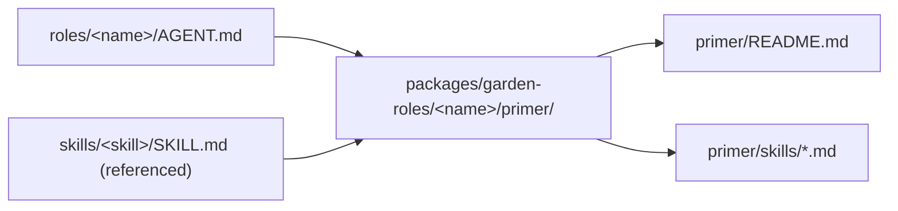

# The Garden as Primer and Journal: Modeling a Bot Library on Endo's Familiar Substrate

| | |
|---|---|
| **Created** | 2026-05-17 |
| **Author** | Kris Kowal (prompted) |
| **Status** | Proposed |

## Motivation

The garden is a library of agent **roles** and **skills** for working across
many forks of GitHub repositories, plus a **journal** that records what the
garden has done.
It is currently bootstrapped on top of Claude Code, git, and bash: a role
is an `AGENT.md` file a subagent reads at dispatch time, a skill is a
`SKILL.md` file it reads on demand, the journal is an orphan git branch
worktree that survives across dispatches, and a *dispatch* is a freshly
prepared triple of detached worktrees torn down on the subagent's return.
The substrate is convenient because each piece exists already (the LLM
reads markdown; git stores history cheaply; bash runs the worktree
plumbing), but the choice of substrate puts a ceiling on what the garden
can attest to about its own behavior.
The Sleeper Channels paper (Maloyan & Namiot 2026, arXiv:2605.13471) puts
that ceiling in formal terms: the paper distinguishes **D1** defenses,
where provenance is tagged but enforcement lives inside the model loop
(an in-context security warning the model is asked to honor), from **D2**
defenses, where enforcement sits **outside** the model loop on a closed
action set, gated by either trusted provenance or a one-shot attestation
the model cannot emit.
The diagnostic in
[`papers--maloyan-namiot-sleeper-channels-2026--provenance-gate-d2-and-soundness-theorem`](https://arxiv.org/abs/2605.13471) §
*Implications for the garden* concludes the garden sits at **D1 today**:
journal frontmatter carries authorship, the boatman's host-precondition
check is procedural, and `identity_switch_authorized: true` is plaintext
in a journal entry the model can in principle author.
The paper's seven invariants give a precise vocabulary for which gaps
matter and a Saltzer-Schroeder-grade target to close them against.

This is more than a porting exercise.
*The Structure of Authority* (Miller, Tulloh, Shapiro, MOZ 2004) argues
that the same modular decomposition that makes a system functional also
makes it secure: every entry in Table 1's right column ("capability
discipline") is just the strict reading of the corresponding entry in
the left column ("good software engineering").
The garden already exhibits sparse-but-capable *knowledge* structure:
the role-and-skill library is decomposed by responsibility, skills are
read just-in-time, dispatches are isolated by per-engagement worktree.
Expressing the same structure on Endo's primer-and-familiar substrate
converts the existing knowledge structure into a sparse-but-capable
**authority** structure: each role's *primer* names exactly the
capabilities that role needs; each dispatch's *familiar* is a vat-sized
isolation unit endowed with only those capabilities; the journal
becomes a daemon-resident artifact whose append-only invariant is
enforced cryptographically rather than by convention.
The paper's §3.8 argument (nested POLA multiplicatively reduces attack
surface) is the strongest reason to want this: the garden's appetite
for layers (orchestrator → subordinate role → loaded skill → invoked
tool) is the exact nesting depth the multiplicative reduction needs.

## Background: the Endo primitives the garden will map onto

This design uses four terms from the Endo daemon-cluster vocabulary.
Two are vendored by the `@endo/lal` package as a concrete reference
shape, two are inherited from the upstream Endo capability architecture.

**Primer.**
A *primer* is the directory of markdown documents that defines an
agent's initial knowledge and capabilities.
The canonical reference is `packages/lal/primer/`
([`packages/lal/primer/README.md`](../packages/lal/primer/README.md)):
twelve files organized into three layers (agent reference, user
interface reference, how-to guides) covering tools, messaging,
capabilities, smallcaps encoding, formatting, errors, chat slash
commands, and step-by-step walk-throughs.
The agent reads the primer as part of its system prompt assembly; the
primer is *static* relative to a given agent build and *re-readable*
under the agent's normal capability discipline.
For the garden's mapping, the key property is that **a primer is the
"what does this familiar know at start" answer** — its
initial-conditions slice in the *Structure of Authority* §3.4 sense.

**Familiar.**
A *familiar* in this project's vocabulary is the Electron-hosted
multi-agent shell — `packages/familiar/`
([`packages/familiar/README.md`](../packages/familiar/README.md)) — that
runs the Endo daemon, the chat UI, and the agent caplets together as
one user-facing application.
For the present design, the load-bearing property is operational rather
than UI-shaped: a familiar instance is a **vat-sized isolation unit**
in the *Concurrency Among Strangers* §6 sense.
It hosts a heap of objects, an event loop, a pending-delivery queue,
its own keypair, and a portion of the formula graph; it is "the
minimum unit of persistence, migration, partial failure, resource
control, and defense from denial of service" (§5.2, p. 204).
An agent caplet — a `make(powers, context)` factory loaded into the
familiar's daemon as an unconfined guest — inherits the familiar's
vat boundary for free.
The `lal` agent ([`packages/lal/agent.js`](../packages/lal/agent.js))
is the simplest worked example: one familiar, one guest caplet, one
inbox loop.

**Journal (in the Endo sense).**
The garden's existing word for *journal* is an orphan git branch.
The Endo project uses the same word for several substrate-level
concerns; for this design only one of them matters.
The Endo *journal* a chat or familiar maintains across daemon restarts
is the **inbox / outbox of mail messages persisted via the formula
graph**.
Messages survive crashes because each message is a value formula in
the daemon's content-addressed store
([`endo--designs-daemon-persistence`](https://github.com/endojs/endo)
§ *Persistence by petname traversal*); the inbox iterator
(`E(powers).followMessages()` in [`packages/lal/agent.js`](../packages/lal/agent.js))
exposes those persisted messages to the agent.
The persistence model is **persistence by traversal from petname
roots** (the same model *Concurrency Among Strangers* §9.3 describes
for E's vat checkpoints): a daemon restart creates a new *incarnation*
of the same agents from the formula graph; vat-crossing references
revive as broken; offline capabilities re-establish them.
The chat-spaces work ([`designs/chat-spaces-gutter.md`](chat-spaces-gutter.md))
adds a per-space convention for client-side bookmarks into this graph;
the
[`endo-but-for-bots--llm-designs-chat-spaces-gutter--space-model-and-persistence`](../journal/library/sections/endo-but-for-bots--llm-designs-chat-spaces-gutter--space-model-and-persistence.md)
section is the design citation.

**Petname graph, formula graph, per-agent keypair.**
Three supporting primitives the mapping uses without redefining.
The *petname graph* is the per-agent name-to-formula mapping; the
*formula graph* is the daemon-wide acyclic recipe graph the petnames
resolve through ([`journal/library/concepts/formula-graph.md`](../journal/library/concepts/formula-graph.md));
the *per-agent keypair* is the Ed25519 identity formula each host or
guest agent holds, addressable to itself as `@keypair`
([`journal/library/concepts/per-agent-keypair.md`](../journal/library/concepts/per-agent-keypair.md)).
Together these are the operational form of the *Structure of
Authority* §3.4 "four ways to acquire references": Introduction
through eventual-send arguments, Parenthood through formula
construction, Endowment through initial petname graph, Initial
Conditions through daemon bootstrap.

## Background: the garden primitives we are mapping

The garden's own architecture is described in
`CLAUDE.md` and `WORKTREES.md` at the garden root; the relevant
primitives for this design are:

- **Orchestrators.**
  Two top-level postures: *liaison* (user-in-the-loop, excess
  authority, asks before acting) and *steward* (autonomous, bot
  credentials, bounded authority).
  Two derived postures: *understudy* (steward bounds, user-reachable)
  and *general-contractor* (liaison-adopted, parallelized PR
  pipeline).
- **Subordinate roles.**
  About fifty named roles (designer, builder, judge, fixer, weaver,
  shepherd, conductor, boatman, scout, journalist, scholar, twenty-
  three jury seats split across code and design panels, ...).
  Each is a single `roles/<name>/AGENT.md` file listing skills the
  role uses and per-role norms.
- **Skills.**
  About sixty skills.
  Each is a `skills/<name>/SKILL.md` file with purpose, inputs,
  procedure, output shape.
  Roles reference skills by path; skills are read just-in-time.
- **The journal (garden sense).**
  Orphan branch `journal` worktree.
  Append-only by convention; entries carry `ts`, `kind`, `role`,
  optional `repo`, `project`, `to`, `refs`.
  Acts as transcript and as message bus between agents.
- **Dispatches.**
  A *dispatch* is a per-engagement worktree triple
  (`dispatches/<role>--<short-id>/{garden,journal,project}/`)
  prepared by `skills/dispatch-worktree/dispatch-prepare.sh` and
  torn down on return.
  Each triple is detached HEAD; commits push as `HEAD:<branch>`.
- **Standing monitors.**
  A small number of long-lived `worktrees/<owner>-<repo>/watch-*--monitor--*/`
  checkouts that bash daemons own.
  Bound to the *Monitoring safety constraint* in `CLAUDE.md`: only
  repositories gated against untrusted contributors are monitored,
  because daemon output enters the LLM's context on every wake.
- **Per-host bot identity.**
  Each host pins a bot identity (e.g. `endolinbot`, `kriscendobot`)
  into its garden repo's local git config; `dispatch-prepare.sh`
  pins the identity into every sub-worktree's local config so
  subagent commits cannot drift to the maintainer's global identity.
  Boatman dispatches override the pin per-commit when
  `identity_switch_authorized: true` is set.

## The mapping

This is the substantive core: each garden primitive expressed as one
or more Endo primitives.
The mapping is presented as one section per garden concept; each
section names the Endo target, the structural argument for the
mapping, and the open questions the mapping does not yet resolve.

### Roles map to primers

A role file (`roles/<name>/AGENT.md`) becomes a *primer directory*
under the agent caplet's source tree.
Where `@endo/lal` ships one primer
([`packages/lal/primer/`](../packages/lal/primer/)), the garden-on-Endo
build ships one primer per role: `packages/garden-roles/designer/primer/`,
`packages/garden-roles/builder/primer/`, etc.

The primer directory expands what is today a single `AGENT.md`:

```
packages/garden-roles/designer/primer/
  README.md            # entry-point: when to use this role, skills list
  norms.md             # operating norms (one section per current bullet)
  skills/
    library-lookup.md  # the skill body, inlined into the primer
    em-dash-style.md
    ...
  references/
    designs-conventions.md  # the consuming project's design template
```

The expansion is not new content — it is a re-layout that gives the
primer the same shape the `lal` primer has (one entry-point README, a
flat or shallow tree of topic files, how-to guides loaded on demand).
Inlining the skills the role uses is the structural equivalent of the
garden's "skills are read just-in-time" discipline: the LLM does not
re-fetch a skill file from disk at use time; the primer assembler
includes it in the system prompt at vat-construction time.

The structural argument: a primer is the *initial conditions* slice
of the access graph in the *Structure of Authority* §3.4 sense.
The role's primer says, in markdown, what the familiar knows at
spawn.
Just as `lal`'s primer covers tools, messaging, capabilities, and
formatting, a designer's primer covers `library-lookup`,
`em-dash-style`, `relative-paths`, and the design-document
conventions.



A consequence worth naming: **the garden's existing
"`AGENT.md` is not `CLAUDE.md`" trick disappears**.
The garden uses non-`CLAUDE.md` filenames precisely because it does
not want Claude Code to auto-load every role file into every
subagent's context.
On Endo, the primer is loaded by the *caplet builder*, not by an
external host harness, so the role-file filename is no longer
load-bearing.
The discipline that selects which primer a familiar gets moves from
"name your files carefully so the harness does not glob them" to
"the dispatching caplet chooses one primer at familiar-spawn time."

### Dispatches map to familiar spawning

A garden dispatch today is `dispatch-prepare.sh` followed by an
`Agent` tool invocation.
On Endo, the equivalent operation is `agent.spawnFamiliar(primer,
endowments)` — the orchestrator caplet asks the daemon to instantiate
a new agent caplet bound to a chosen primer with a chosen endowment
object.
This is the *Endowment* mechanism (the third of the four ways
references can be acquired, *Structure of Authority* §3.4): a new
familiar is born already-endowed with exactly the capabilities the
orchestrator chose to pass.

The endowment object is the single most important per-dispatch
artifact.
Today the dispatch prompt names the role, names `DISPATCH_ROOT`,
names the repo, and trusts the subagent's procedural discipline to
limit its own scope.
On Endo, the endowment is a *closed JavaScript object* assembled at
spawn time:

```js
const endowment = harden({
  journal: E(daemonPowers).getAttenuatedJournal({
    writePathPrefix: `entries/${date}/${role}--${shortId}/`,
    readScope: 'all',
  }),
  project: await E(workspace).provideWorktree(`endojs/${repo}`, branch, {
    readWrite: true,
    sandbox: 'per-dispatch',
  }),
  garden: await E(workspace).provideWorktree('kriskowal/garden', 'main', {
    readOnly: true,
  }),
  identity: E(daemonPowers).getBotKeypair(),
  github: E(githubGateway).getAttenuatedClient({
    repos: [`endojs/${repo}`],
    scopes: ['pull-request-create', 'review-thread-reply'],
  }),
});
const familiar = await E(daemon).spawnFamiliar(primerName, endowment);
```

Every capability the subagent will exercise must appear in the
endowment.
Capabilities not in the endowment are not reachable (the *Only
connectivity begets connectivity* rule from §3.4): the familiar
cannot decide to read a different repo, write to a different journal
prefix, or open a network connection the gateway does not endow.

The per-dispatch worktree triple becomes a per-familiar compartment
boundary backed by the familiar's vat.
The familiar's heap, event loop, and pending-delivery queue are
private to it; `await E(familiar).report()` returns the result the
orchestrator can read; familiar shutdown is the moral equivalent of
`dispatch-teardown.sh`.


### The garden journal maps to a daemon-resident journal exo plus the petname graph

The garden's orphan-branch journal becomes two distinct things on
Endo, each enforced by a different mechanism.

**Append-only message log → journal exo.**
The journal's entry stream (`journal/entries/<YYYY>/<MM>/<DD>/<HHMMSS>Z-...`)
maps to an exo defined in
`packages/garden-journal/journal-exo.js`.
Its `append(entry)` method is the only mutator; the exo seals the
entry with the calling familiar's keypair, includes the previous
entry's hash, and stores the result as a formula in the daemon's
content-addressed store.
The interface is `makeExo` with an `M.interface()` guard so calls
are validated at the boundary
([project CLAUDE.md § *Modules and exports*](../CLAUDE.md)).
Different roles get *different attenuations* of the journal:

| Role          | Endowed journal capability                                           |
| ------------- | -------------------------------------------------------------------- |
| Any subagent  | `append({ to: <my-role>, kind: result|message, ... })`               |
| Steward       | `append(...)` plus `readBulletin()` plus `clearBulletin(entryId)`    |
| Liaison       | full `append(...)`, `readAll()`, `subscribe(filter)`                 |
| Boatman       | `append(...)` plus `attestUpstreamPush(prDescriptor, attestation)`   |

Each attenuation is a *Caretaker pattern* facet
([`journal/library/concepts/caretaker-pattern.md`](../journal/library/concepts/caretaker-pattern.md))
of the same underlying journal exo.
The orchestrator chooses which facet to endow at familiar-spawn time;
the familiar has no path to widen its own endowment because there is
no ambient `daemonPowers` it can reach.
This is Property D (No Ambient Authority) from *Capability Myths
Demolished* §6
([`papers--miller-capability-myths-demolished-2003--four-models-and-seven-properties`](../journal/library/sections/papers--miller-capability-myths-demolished-2003--four-models-and-seven-properties.md))
made operational.

**Cross-role references → petname graph.**
The garden's `to:` field in a journal entry (the message-bus axis) is
an ad-hoc string today.
On Endo it becomes a petname path that resolves to an actual capability
the addressed role holds.
A `message` entry "to: scholar" becomes `E(scholar).receive(message)`
once the scholar familiar is alive; before then it queues at the
journal exo and the next scholar dispatch hydrates it as part of its
endowment.
The petname graph thus carries the message bus the journal entries
only described.

**Append-only invariant.**
On the garden today, append-only is maintained by `git`'s normal
discipline plus a social convention that nobody rewrites the journal.
On Endo, append-only is structural: each entry's formula identifier
includes the hash of the previous entry's formula identifier, so
rewriting the chain produces a different formula graph the daemon
will refuse to load against the persisted hash.
A daemon restart revives the journal from the formula graph; entries
broken by partition (the *Concurrency Among Strangers* §9.3 framing
of crash-as-partition) revive as broken references, not as forged
new entries.

**Who can write where.**
A familiar's endowed journal facet declares its write path prefix at
spawn time and cannot widen.
A designer dispatch writes only under
`entries/.../designer--<short-id>/`; a boatman dispatch writes only
under `entries/.../boatman--<short-id>/`.
This is the operational form of (I-Tag): the entry's `from:` is set
at write time from the calling familiar's keypair, not from text the
familiar supplies.

### Standing monitors map to long-lived familiars with bounded endowment

A standing monitor today is a bash daemon that polls GitHub, plus a
long-lived worktree that hosts its scratch state.
The daemon's output enters the LLM's context only via the steward's
daemon-log tail — but once it does, *the steward's full authority is
exercised on whatever the daemon's output said*.
The Sleeper Channels paper names this exact failure mode (§II, the
*OS-live agent's single authority boundary*); the garden's mitigation
today is the *Monitoring safety constraint* (only monitor repos gated
against untrusted contributors).

On Endo, a monitor becomes a long-lived familiar with a *deliberately
narrow* endowment:

```js
const monitor = await E(daemon).spawnFamiliar('monitor-endo-but-for-bots', harden({
  network: E(networkGateway).getAttenuatedClient({
    egress: ['api.github.com/repos/endojs/endo-but-for-bots/...'],
    methods: ['GET'],
  }),
  journal: E(journalExo).getMonitorFacet({
    writePathPrefix: `entries/.../monitor-endo-but-for-bots--standing/`,
  }),
}));
```

That endowment is *all* the monitor has.
It cannot dispatch other familiars (no `daemon` reference).
It cannot read other repos (egress restriction).
It cannot write outside its journal prefix.
It cannot reach the network gateway's wider surface (only the
attenuated facet was endowed).
This is Table 1's *Omit needless vulnerability* (*Structure of
Authority* §4) at the role granularity:
the monitor's authority is exactly its authority-driven design.

The Sleeper Channels paper's H1 hook (the inbound adapter that tags
artifacts at intake) lands at the network gateway: the gateway
attaches a `(channel=github-api, principal=<repo-author>,
device=monitor-network-gateway)` triple to each fetched comment body
before passing it across the boundary.
The monitor's journal-write facet refuses to append an entry whose
causal set has any untrusted principal in `Π` unless the entry's
`kind` is `monitor-observation` (a label that does not authorize
downstream action).
The steward's subsequent dispatch from a monitor observation must
either fall within `Πα ⊆ T` or carry a one-shot attestation from the
maintainer — which closes the A4 confused-deputy path the paper's
*Implications for the garden* §3-§4 names.

### Bot identity maps to a per-familiar keypair

Per-host bot identity in the garden is a local git-config pin
(`user.name = endolinbot`, `user.email = ...`); the dispatch-prepare
script pins it into every sub-worktree.
The boatman overrides the pin per-commit with `git -c user.name=...`.

On Endo, each familiar already has a per-agent keypair
([`journal/library/concepts/per-agent-keypair.md`](../journal/library/concepts/per-agent-keypair.md))
addressable to itself as `@keypair`.
The mapping is direct: the bot identity is the familiar's keypair.

A subagent's commits to a project worktree are signed (or attributed,
when the project does not enforce signed commits) by the familiar's
keypair.
The boatman remains a special case: the maintainer endows the boatman
familiar with a separate `kriskowalIdentity` capability whose
`signCommit(payload, attestation)` method validates an `attestation`
field naming the action-instance digest of the upstream PR the commit
belongs to.
Without a matching attestation, `kriskowalIdentity.signCommit` refuses;
the boatman has no path to forge an attestation because the model
loop has no emit primitive into the attestation channel (the paper's
I-Channel invariant).
This is the upstream framing of *Concurrency Among Strangers* §9.2's
swiss-number discipline applied to upstream identity: the boatman
demonstrates knowledge of a maintainer-issued one-shot to gain access
to the kriskowal-identity capability for one specific commit.

The wider liaison-on-`endolinbot`-refuses-to-originate-a-boatman-
dispatch rule
([garden `CLAUDE.md` § *Boatman dispatches and host preconditions*](../CLAUDE.md))
becomes a structural property: a liaison familiar spawned in the
endolinbot daemon never sees the `kriskowalIdentity` capability in
its endowment, because the daemon's daemon-genesis bootstrap never
formulated one.
The procedural check (the boatman's *Host preconditions* norm) is
preserved as a second line of defense.

### Authorization shapes map to one-shot attestations

The garden's authorization shapes today are plaintext fields in a
journal entry: `identity_switch_authorized: true`,
`mirror_authorized: true`, etc.
A liaison originates them after user confirmation; the steward
forwards but never originates; the receiving role acts on them
implicitly.

On Endo the same shapes become *action-instance attestations* in the
*Sleeper Channels* §VII-A sense.
The action-instance digest covers the post-normalisation dispatch
bytes:

```js
const digest = sha256(canonicalJson({
  kind: 'boatman-ferry',
  causal: sortedCausalSet,           // entries the dispatch read
  args: {
    repo: 'endojs/endo-but-for-bots',
    sourceBranch: 'design-x-foo',
    targetBranch: 'main',
    prTitle: '...',
    prBody: '...',
  },
  target: 'github-pr-create',
  ownerDevice: 'maintainer-yubikey-1',
}));
```

The maintainer issues a one-shot attestation `(digest, nonce, expiry,
qg)` over the hardware-attested companion channel.
The boatman familiar at dispatch time has both the dispatch
description and the attestation; the attestation's digest must match
the digest computed from the exact post-normalisation dispatch
bytes, or the gate denies.
The nonce is consumed atomically on use; repeated attestations on
the same digest fail.

Today's authorization shapes split into three target shapes:

| Today (plaintext flag in journal entry)         | Tomorrow (Endo D2)                                                                 |
| ----------------------------------------------- | ---------------------------------------------------------------------------------- |
| `identity_switch_authorized: true` (boatman)    | one-shot attestation bound to the specific PR's title + body + target branch       |
| `mirror_authorized: true` (boatman mirror)      | one-shot attestation bound to the mirror's source SHA + target branch              |
| `monitor_re-enable_authorized: <repo>` (gardener) | persistent maintainer-signed capability the gardener endows to a new monitor      |
| `pre-staged authorizations` (bulletin items)    | maintainer-signed capability future-dated to a window the steward can present      |

The fourth row deserves a note: not everything moves to per-action
digests.
Pre-staged authorizations are *standing capabilities* the maintainer
wants the steward to wield without per-action confirmation; they map
to maintainer-signed certificates with a future expiry, not to
one-shot nonces.
This is the *Concurrency Among Strangers* §9.3 *durable* offline
capability class rather than the *transient* one.
The trade-off is honest: a standing capability widens the steward's
authority window; the paper's D3 framing (per-skill capability
manifests) would gate even standing capabilities on a "Rule of Two"
budget.

## Threat-model mapping

Walking the Sleeper Channels §V persistence × firing-separation matrix
against the proposed garden-on-Endo design:

### Cells the design closes (or substantially narrows)

- **M2 × C2 (cross-channel exfil via memory; the paper's A3 scenario).**
  On the garden today, a malicious comment body persisted in a
  monitor's journal entry could surface in a steward's later
  dispatch and shape the steward's action.
  On the proposed design, monitor-written journal entries have
  `Π ⊇ {github-api/<author>/...}`; a steward dispatch that derives
  an action from such an entry has `Πα ⊄ T` and the gate denies
  unless a maintainer attestation is present.
- **M5 × C4 (cron via confused deputy; the paper's A4 scenario).**
  The garden's analog is a `/loop` or scheduled dispatch acting on
  a journal directive whose authorship is untrusted.
  On the proposed design, the scheduler is a `Cron` exo whose
  `addEntry(spec, action)` is in the closed action set `C`; the gate
  computes `Πα` over the journal entry that proposed the schedule.
  If that entry has untrusted provenance, the schedule is denied at
  H9 (the scheduler hook) without requiring the loop body to refuse.
- **M3 × C2 (skill-trojan via group chat; A2).**
  The garden's analog is a maintainer-authored skill that quietly
  acquires authority not granted at install.
  On the proposed design, skills are *primer files* inlined at
  primer-build time; loading a primer is the H4-H5 hook (skill
  load) and the primer's manifest declares which capabilities the
  primer's role expects.
  Mismatch between the manifest and the requested endowment denies
  at familiar-spawn time.
- **M4 × C4 (dotfile patch; A5).**
  The garden's analog is a subagent writing under `~/.config/...`
  or another out-of-worktree location.
  On the proposed design, the familiar's filesystem capability is
  endowed only with the dispatch-root worktrees; writes outside
  fail-closed (the H8 hook).

### Cells the design substantially leaves open

- **M1 × C0 (single-shot in-context injection).**
  The familiar's prompt body still contains attacker-influenced
  text on every wake; D2 does not prevent the model from being
  coerced into emitting attacker-favored text.
  What it prevents is the side-effecting *action* on that text.
  This is the paper's own framing in §VII-H's last paragraph.
- **Side-channel persistence outside the formula graph.**
  If a familiar's compartment leaks state through a side channel
  the daemon does not mediate (an unseeded env var, an FFI call to
  a host library), the mediation invariant fails for that channel
  and `Πα ⊄ T` cannot be assured.
  The paper's I-Mediation prescription (enclosing sandbox) is the
  structural answer; SES lockdown plus a microVM around the
  familiar's hosting daemon is the operational answer.

### The four illustrative scenarios under the proposed design

- **A2 (M3 × C2, skill trojan).**
  An attacker shapes a maintainer-authored skill to acquire
  authority via group-chat-borne text.
  *Design response:* the skill is a primer file; the primer manifest
  declares the capability set; widening at runtime would require an
  H4-H5 hook write that the model cannot reach without a one-shot
  attestation.
- **A3 (M2 × C2, memory-borne exfil).**
  An attacker plants a malicious URL in a memo the steward later
  recalls.
  *Design response:* the memo's `Π` carries the attacker tag from
  H1 (the inbound adapter); the H10 outbound-emission gate denies
  the exfil dispatch.
- **A4 (M5 × C4, cron confused deputy).**
  An owner request triggers a scheduler entry whose payload was
  attacker-laundered.
  *Design response:* the H9 scheduler gate observes `Πα` includes
  the attacker tag; the entry is denied without owner attestation
  for the *exact* schedule's digest.
- **A5 (M4 × C4, dotfile patch).**
  An attacker plants content that becomes a dotfile written by the
  agent.
  *Design response:* the familiar's filesystem capability does not
  include `~/.config/...`; H8 denies the write.

The pattern across A2-A5 is the paper's central architectural claim:
**enforcement outside the model loop on a closed action set, gated by
either trusted provenance or a one-shot attestation, defeats the
cross-channel firing pattern that is the sleeper channel's defining
feature**.

## Open questions

The design is a proposal, not a delivery.
Several decisions remain open.

1. **How does the model loop survive primer evolution?**
   A garden role today is updated by the gardener: a commit on `main`
   lands a new `roles/<name>/AGENT.md`, and the next dispatch reads
   the updated file.
   On Endo, the primer is part of the caplet's source tree; updating
   it requires re-bundling the caplet and re-spawning the familiar.
   What is the equivalent of the gardener's "land role edits on main"
   discipline?
   The likely shape is a `garden-roles` package whose `develop`
   workflow rebuilds primers on save, but the binding of "primer
   version" to "familiar instance" needs design work the present
   document does not do.

2. **Where does Property F (Access-Controlled Delegation Channels)
   sit for cross-host garden instances?**
   The garden runs on multiple hosts (`kmkmbp2021`, `endolinbot`),
   each with its own bot identity.
   If the design's "kriskowal-identity capability" lives only on the
   credentialed host, how does a steward on a different host *delegate*
   to the credentialed host?
   The *Capability Myths Demolished* §6 framing
   ([`papers--miller-capability-myths-demolished-2003--four-models-and-seven-properties`](../journal/library/sections/papers--miller-capability-myths-demolished-2003--four-models-and-seven-properties.md))
   requires the delegation channel to be access-controlled — but the
   garden's current cross-host mechanism is filesystem sharing of the
   journal worktree.
   Migrating to per-familiar capabilities means working out the
   cross-host CapTP / OCapN story for inter-daemon delegation, which
   is its own design.

3. **What is the canonical-form for the action-instance digest the
   maintainer signs?**
   The Sleeper Channels paper's digest covers post-normalisation
   dispatch bytes (§VII-A, p. 4).
   For a boatman ferry, the load-bearing bytes are the PR title, PR
   body, target branch, and the SHA of the source branch's HEAD at
   ferry time.
   For a designer's design-PR open, the bytes are similar but the
   diff is also load-bearing.
   The schema for canonical-form per dispatch kind needs
   specification before D2-grade attestations are issuable.

4. **How rich is the journal exo's interface?**
   The present design names `append`, `readBulletin`, `clearBulletin`,
   `subscribe`, `attestUpstreamPush`.
   The garden's current journal usage is wider: cross-entry queries
   (`grep -rl 'project: endo' entries/`), historical browsing
   (`agents/` archive lookups), bulletin maintenance.
   How much of that becomes journal-exo method surface, and how much
   becomes "the orchestrator reads `journal` directly because it has
   that endowment"?
   Erring toward fewer methods preserves the principle that *the
   reference graph is the access graph*; erring toward more methods
   gives the daemon more places to enforce invariants.

5. **What happens to the `references/` shelf?**
   The garden's `references/<source>/` directories hold read-only
   snapshots of roles and skills imported from other gardens.
   On the proposed design, those snapshots become *non-canonical
   primer drafts* the gardener consults when designing a new role.
   The mechanism for keeping them up to date and the visibility into
   them from a familiar (or only from the gardener's tooling) needs a
   decision.

6. **What is the role of [`@endo/genie`](../packages/genie/) in the
   proposed shape?**
   The `genie` package already names a "Claw-like AI Agent framework
   for Endo" with tools, memory, heartbeat, and a system-prompt
   builder.
   It could be the substrate that primers run on, or it could be a
   sibling architecture the present design supersedes.
   A careful read of `packages/genie/DESIGN.md` against this design
   should produce one of: a `genie`-based primer-builder, a clear
   division of labor between `genie` (for chat-driven agents) and
   `garden-roles` (for orchestrated batch roles), or a merge.

## Implementation phasing

The design is a proposal; if pursued, the work splits into three
phases that depend on each other.

### Phase 1: Primer authoring and the simplest dispatch

Goal: a working single-role design where the *primer* and *familiar*
primitives are in place, even if the journal is still git-backed.

- Pick the simplest role to port (likely `designer` itself, since
  this design's exemplar is *a designer dispatch*).
- Author `packages/garden-roles/designer/primer/` mirroring the
  `lal` primer's shape.
- Implement `agent.spawnFamiliar(primerName, endowment)` in a new
  `packages/garden-roles/dispatcher/` package; endowments at this
  phase are still the dispatch-worktree triple.
- Verify a designer dispatch can run end-to-end (read a design
  prompt, write a `designs/<slug>.md`, push a branch).

Exit criterion: a designer dispatch produces a design PR as today,
but the operating instructions came from a primer rather than from
`AGENT.md`.

### Phase 2: Journal exo and attenuated facets

Goal: the journal becomes a daemon-resident exo with per-role
attenuated facets.

- Implement `packages/garden-journal/` with the `journal-exo.js`
  shape sketched above.
- Bridge the existing orphan-branch journal: a one-way mirror that
  the exo writes to git on a background loop.
  This keeps the maintainer's familiar grep-the-journal habits
  working through the transition.
- Define attenuation facets for every existing role.
- Move append-only enforcement from social convention to formula-
  graph chaining.

Exit criterion: every active garden role's dispatch goes through
the journal exo for `result` and `message` writes; the git-backed
journal continues to exist as a downstream mirror but is no longer
the authoritative store.

### Phase 3: Closed action set, mediation hooks, attestations

Goal: D2-grade enforcement on the boatman, the gardener's
monitor-arming action, and one other high-stakes dispatch shape.

- Identify the closed action set `C` for the boatman: PR open, PR
  mirror, label edit, reaction post.
- Implement the action-instance digest canonical-form for each.
- Implement the maintainer's attestation channel (the choice
  between a hardware-key signing flow and a maintainer-Familiar-
  resident attestation exo is itself a design decision).
- Implement the H1/H2/H6/H7/H8/H9/H10 hooks against the boatman's
  GitHub gateway, the journal exo, the network gateway, the
  filesystem capability, the scheduler exo.

Exit criterion: a boatman ferry without a maintainer attestation
denies at H10 with a `untrusted-provenance` reason; a boatman ferry
*with* a matching attestation succeeds.
The maintainer's signing surface and the boatman's dispatch surface
are wired but the attestation channel itself is hardware-attested.

The three phases are roughly sequential; phase 2 depends on phase 1
(spawned familiars are what hold the journal facets), and phase 3
depends on phase 2 (the action-instance digest covers entries the
journal exo writes).
Each phase is independently shippable as a draft PR against `llm`
and re-bases on top of unrelated `llm` work.

## Considered and rejected

- **Considered and rejected: a single mega-primer covering every
  role.**
  Reason: it defeats the *Structure of Authority* §3.4 endowment
  argument.
  Each role wants exactly the primer slice its responsibilities
  need; merging primers re-introduces ambient authority through the
  ambient knowledge of all other roles' capabilities.
- **Considered and rejected: keep the orphan-branch journal as
  authoritative; layer Endo on top.**
  Reason: append-only-by-convention is exactly the D1 enforcement
  the paper argues is insufficient.
  The journal's value as a defensible substrate comes from making
  the append-only invariant structural (formula-graph chaining), not
  procedural.
- **Considered and rejected: model the bot identity as a global
  daemon-level capability.**
  Reason: it reintroduces the confused-deputy hazard the per-host
  pin currently mitigates.
  The per-familiar keypair preserves Property A
  ([`papers--miller-capability-myths-demolished-2003--four-models-and-seven-properties`](../journal/library/sections/papers--miller-capability-myths-demolished-2003--four-models-and-seven-properties.md))
  by making *which identity is signing* visible at the dispatch
  boundary rather than ambient inside the familiar's compartment.

## References

### Library sections

The design draws principally on these library sections (paths
relative to the garden's `journal/` worktree):

- [`papers--maloyan-namiot-sleeper-channels-2026--sleeper-channel-taxonomy-and-running-scenario`](../journal/library/sections/papers--maloyan-namiot-sleeper-channels-2026--sleeper-channel-taxonomy-and-running-scenario.md)
  — the persistence × firing-separation taxonomy and the A4
  walk-through; the *Implications for the garden* block names the
  steward / monitor / boatman / skill mappings this design extends.
- [`papers--maloyan-namiot-sleeper-channels-2026--provenance-gate-d2-and-soundness-theorem`](../journal/library/sections/papers--maloyan-namiot-sleeper-channels-2026--provenance-gate-d2-and-soundness-theorem.md)
  — the D2 gate, the action-instance digest, the seven invariants,
  and the diagnostic that places the garden at D1 today.
- [`papers--maloyan-namiot-sleeper-channels-2026--executable-policy-and-measurement-plan`](../journal/library/sections/papers--maloyan-namiot-sleeper-channels-2026--executable-policy-and-measurement-plan.md)
  — the executable reference and the source-anchored-citation
  discipline this design's *Open questions* item 3 calls for.
- [`papers--miller-tulloh-shapiro-structure-of-authority-2004--excess-authority-and-designation`](../journal/library/sections/papers--miller-tulloh-shapiro-structure-of-authority-2004--excess-authority-and-designation.md)
  — the cp / cat lesson; the architectural argument that designation
  and authority are one act in Model 4.
- [`papers--miller-tulloh-shapiro-structure-of-authority-2004--fractal-structure-of-authority`](../journal/library/sections/papers--miller-tulloh-shapiro-structure-of-authority-2004--fractal-structure-of-authority.md)
  — the four ways B can come to know about C (Introduction,
  Parenthood, Endowment, Initial Conditions); the spawning-tree
  framing this design uses for dispatch-as-familiar-spawning.
- [`papers--miller-tulloh-shapiro-structure-of-authority-2004--multiplicative-pola-and-security-as-modularity`](../journal/library/sections/papers--miller-tulloh-shapiro-structure-of-authority-2004--multiplicative-pola-and-security-as-modularity.md)
  — Table 1 and the multiplicative-attack-surface argument; the
  reason nesting depth matters in *Motivation*.
- [`papers--miller-capability-myths-demolished-2003--four-models-and-seven-properties`](../journal/library/sections/papers--miller-capability-myths-demolished-2003--four-models-and-seven-properties.md)
  — Properties A through G; the formal vocabulary for "no ambient
  authority" and "access-controlled delegation."
- [`papers--miller-capability-myths-demolished-2003--advantages-pola-confused-deputy`](../journal/library/sections/papers--miller-capability-myths-demolished-2003--advantages-pola-confused-deputy.md)
  — the unconfusable-deputy framing this design uses for the
  boatman.
- [`papers--miller-tribble-shapiro-concurrency-among-strangers-2005--vat-and-event-loop-model`](../journal/library/sections/papers--miller-tribble-shapiro-concurrency-among-strangers-2005--vat-and-event-loop-model.md)
  — the vat-as-isolation-unit framing for the familiar.
- [`papers--miller-tribble-shapiro-concurrency-among-strangers-2005--partial-failure-and-when-catch`](../journal/library/sections/papers--miller-tribble-shapiro-concurrency-among-strangers-2005--partial-failure-and-when-catch.md)
  — the persistence-by-traversal-from-petname-roots story and the
  offline-capability / swiss-number discipline used for bot
  identity.
- [`journal/library/concepts/formula-graph.md`](../journal/library/concepts/formula-graph.md)
  — the petname-graph-as-persistence-root concept.
- [`journal/library/concepts/per-agent-keypair.md`](../journal/library/concepts/per-agent-keypair.md)
  — the per-agent-keypair concept used for the bot identity
  mapping.
- [`journal/library/concepts/space.md`](../journal/library/concepts/space.md)
  — the chat-spaces convention; named here for context, not used
  load-bearingly in the mapping.

### Endo source citations

- [`packages/lal/primer/README.md`](../packages/lal/primer/README.md)
  — the reference primer shape (twelve files in three layers).
- [`packages/lal/LAL-ARCHITECTURE.md`](../packages/lal/LAL-ARCHITECTURE.md)
  — the worked-example agent caplet that runs against a primer.
- [`packages/lal/agent.js`](../packages/lal/agent.js)
  — the `make(guestPowers, context)` entry-point shape and the
  inbox-following loop.
- [`packages/familiar/README.md`](../packages/familiar/README.md)
  — the Electron shell hosting the daemon and agent caplets.
- [`packages/genie/DESIGN.md`](../packages/genie/DESIGN.md)
  — the system-prompt builder this design's *Open questions* item 6
  references.
- [`packages/daemon/`](../packages/daemon/) and the
  [`endo--designs-daemon-persistence`](https://github.com/endojs/endo)
  surrounding design — for formula-graph and content-store
  persistence semantics.
- The
  [`designs/chat-spaces-gutter.md`](chat-spaces-gutter.md),
  [`designs/chat-spaces-home.md`](chat-spaces-home.md), and
  [`designs/chat-spaces-inbox.md`](chat-spaces-inbox.md)
  designs — for the chat-side persistence conventions the journal
  exo's attenuation pattern parallels.

### Papers

- Maloyan, N. and Namiot, D. *Sleeper Channels and Provenance Gates*.
  arXiv:2605.13471, 2026.
- Miller, M. S., Tulloh, B., and Shapiro, J. S. *The Structure of
  Authority: Why Security Is Not a Separable Concern*. MOZ 2004,
  Springer LNAI 3389, 2005.
- Miller, M. S., Tribble, E. D., and Shapiro, J. S. *Concurrency
  Among Strangers*. TGC 2005, Springer LNCS 3705, 2005.
- Miller, M. S., Yee, K.-P., and Shapiro, J. S. *Capability Myths
  Demolished*. Johns Hopkins University SRL Technical Report
  SRL2003-02, 2003.

## Prompt

> Propose a design PR designing how we would model the garden in
> terms of a *primer* and *journal* in the Endo Daemon/Chat/Familiar
> system. Make as much use of the library as you need.
