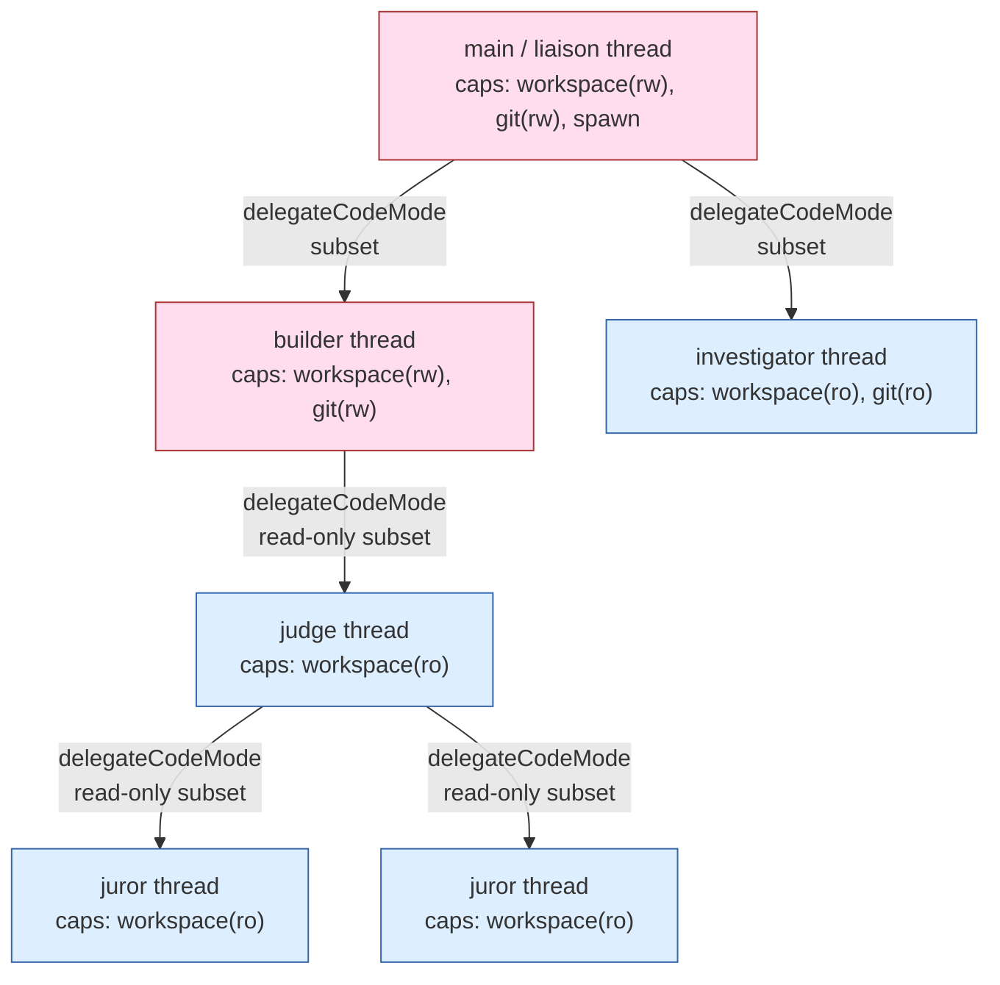
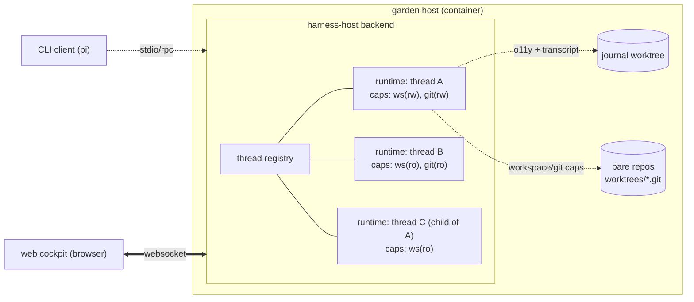

# Garden Cockpit: a harness-host web application that operates the garden

| | |
|---|---|
| **Created** | 2026-06-13 |
| **Author** | 0xpatrickdev (prompted) |
| **Status** | Proposed |

## What is the Problem Being Solved?

The garden today enforces authority and alignment through **prompts**.
A role is *told* what it may do.
The builder role's `AGENT.md` says it builds; the boatman's says it
ferries; `roles/COMMON.md` says no subagent may comment on an upstream
issue without authorization.
Nothing in the running system *makes* any of that true.
A dispatched subagent holds the same ambient authority every other
process on the host holds: it can read any file, run any command, and
reach any network endpoint, and the only thing standing between it and
an unauthorized action is a paragraph it was asked to read.

The cockpit makes the authority **real**.
An agent holds only the Endo capabilities bound to it, in lexical scope,
inside a `Compartment`.
A builder thread that was never handed a writable `git` cap cannot
push, not because its prompt forbids it but because there is no `git`
object in its scope that can.
This is the thesis, stated as a slogan:

> **Codify authority in the harness, not the prompt.**

The cockpit is the harness-host web application that operates the garden
under that thesis.
It runs the same code-mode agent loop the
[endopi code-mode access plan](endopi-code-mode-access-plan.md)
specifies, gives each running agent a thread-specific capability set,
and presents the whole tree of running agents (and the caps each one
holds) to a single operator over the web.

This design is exploratory and personal-first.
The MVP is a single-user, localhost, multi-thread chat cockpit that a
maintainer runs next to the garden's `journal` worktree and bare repos.
The later milestones (steward view, multi-user, hosted, confined-pi)
are sketched but out of scope for the first build.

## The Spine: Template, Thread, Delegation

The data model is three nouns.
Everything else in the design hangs off them.
The two verbs `define` and `make` come straight from the
[endopi code-mode access plan](endopi-code-mode-access-plan.md)'s
define/make seam (`defineCodeModeAgent(template)` is powerless;
`makeCodeModeAgent(definition, powers)` binds caps), which is itself the
same factorization the
[`@endo/agentry` agent builder (#416)](agentry-agent-builder.md) applies
to its JSON-tool lane (`defineAgent` / `makeAgent`).

### Template (define)

A **template** is a saved, named, **powerless** agent definition.
It is the value `defineCodeModeAgent(template)` returns.
It carries everything that does *not* depend on which capabilities an
instance will hold:

- the system and steering prompt,
- the tool surface and the **cap shape** (which powers the agent expects,
  and for each whether it is read-only or writable),
- the model and provider selection,
- the compaction policy.

A template carries **no caps**.
No `Filesystem`, no `git`, no `authToken`.
It is safe to share, persist, version, and re-instantiate.

The garden's `roles/` directory is the existing analogue.
`roles/builder/AGENT.md`, `roles/investigator/AGENT.md`,
`roles/liaison/AGENT.md` each describe an agent's prompt, the skills it
draws on, and (in prose) the authority it is meant to wield.
Under the cockpit, a role becomes a **saved template**: the prose
authority statement becomes a declared cap shape, and the skill list
becomes part of the steering prompt.
Templates are authored in **Builder Mode** (see *Two planes* below).

### Thread (make)

A **thread** is a running instance.
It is what `makeCodeModeAgent(definition, powers)` returns once concrete
caps are bound: a live runtime with `agent.prompt()`,
`agent.waitForIdle()`, and a streaming event surface.
A thread binds a template to:

- concrete capabilities (a real `workspace` `Filesystem`, a real `git`
  cap at a specific repo and mode, named powers), and
- a specific invocation prompt (the task).

A garden **dispatch** is a thread.
The dispatch contract in `CLAUDE.md` (prepare a worktree triple, write a
`dispatch` journal entry, invoke the `Agent` tool, tear down on return)
is the prompt-era way of doing what `make(powers)` does in the harness:
bind a role's template to a specific worktree's caps and a specific
task.
Threads are spun in **Doer Mode**.

### Thread tree and delegation

A thread can spawn child threads via `delegateCodeMode`
(`code-mode-delegation` in the
[endopi code-mode access plan](endopi-code-mode-access-plan.md)).
Each child holds a **strict subset** of its parent's caps.
Authority **attenuates down the tree**, and the attenuation is
**harness-enforced**: a child cannot name a power its parent does not
hold, and the delegation tool rejects an attempt to upgrade a read-only
git cap to a writable one.

The main thread (the liaison thread, the root of the tree) holds an
agent-spawn tool, so the operator's top-level agent can fan work out to
children exactly the way the liaison dispatches subagents today.



**Known gap to flag.**
Delegation is **pass-through** today, not active attenuation.
`delegateCodeMode` can *reject* an upgrade (read-only → read-write is
refused) and it can *require* a pre-attenuated cap (the parent must
already hold a read-only git cap to hand one down), but it **cannot yet
mint** a read-only cap from a writable one.
Active attenuation (for example, an `exo-git` read-only minter that
derives a read-only cap from a writable one on demand) is the named next
increment in the code-mode plan's *active attenuation* milestone.
It is **not in scope for the cockpit MVP**.
The cockpit MVP attenuates by *selection*: the operator picks, at
thread-creation time, which already-held caps to hand a child, and the
harness enforces the subset rule.
Minting comes later.

## Architecture

### Harness-host backend

The backend runs **on the garden host**: inside the container, next to
the `journal` worktree and the bare repos under `worktrees/`.
For the personal-first MVP it is **single-user and localhost-bound**.

Per thread, the backend instantiates a **code-mode runtime** (the endopi
define/make factory plus the delegation engine) with a thread-specific
cap set, and streams that agent's events to the frontend.
N threads means N concurrent runtimes.
The backend owns the thread registry, the per-thread stream multiplexing,
and the concurrency.

**Transport: websocket** (recommended).
The differentiating interaction is **steer-while-running**: the operator
types a new instruction into a thread that is mid-turn, and the agent
picks it up.
That is bidirectional and long-lived, which is a websocket, not a series
of request/response calls.
A server-sent-events stream plus a separate POST for steering would also
work, but a single websocket per thread (or one multiplexed websocket
carrying all threads, keyed by thread id) keeps the steer and the stream
on one ordered channel.



### Per-thread engine: an open question

There are two ways to give a thread its agent loop, and the maintainer
says it could be either.
This is the **central open question**, and it is **decidable in the M0
spike** (build one thread both ways, keep the one that is less code to
own).
Present both, recommend, defer.

**(a) Wrap our code-mode runtime directly.**
The backend owns the thread, the stream, and the concurrency, and it
calls `makeCodeModeAgent(definition, powers)` to get a runtime, then
pumps `agent.prompt()` / `agent.waitForIdle()` and forwards the event
stream over the websocket.
Cleaner for a **multi-thread server**: the backend's concurrency model
is its own, the agent loop is a library it calls, and there is no second
lifecycle to reconcile.

**(b) Host pi's own loop / ExtensionAPI (Access Path 1).**
The backend hosts pi's loop and registers the Endo `execute` tool as a
pi extension (the
[endopi code-mode access plan](endopi-code-mode-access-plan.md)'s Access
Path 1).
Inherits pi's loop, compaction machinery, and event model directly, at
the cost of adapting to pi's lifecycle and threading assumptions (pi's
default is *one agent, one session, one cwd*, which the backend must
multiplex).

**Recommendation: (a) for the cockpit's own threads, with (b) available
as the CLI's path.**
The cockpit is a multi-thread server first; owning the thread/stream/
concurrency is the job, and wrapping the runtime keeps that job in one
place.
But the recommendation is soft, and the spike decides it: the maintainer
wants the main thread to be able to spawn agents, which **code mode
already provides** through `delegateCodeMode` regardless of which engine
wraps it.
Whichever engine the M0 spike proves out, the spawn-a-child capability
is the same delegation tool.

### CLI and web are two clients of one harness-host

Building the harness-host **once** satisfies two wants:

1. the "run `pi` safely with Endo" CLI want (a terminal client speaking
   stdio/RPC to the harness-host, the
   [endopi-stdio-rpc-bridge](endopi-stdio-rpc-bridge.md) shape), and
2. the web cockpit (a browser client speaking websocket to the same
   harness-host).

The harness-host is the product; the CLI and the web UI are two front
ends on it.
This is the reason to invest in the backend boundary cleanly: it is not
web-only infrastructure.

### Cockpit frontend (MVP = multi-thread chat cockpit)

The MVP frontend is a multi-thread chat cockpit:

- a **thread list** (every running thread, its template, its status),
- a **per-thread streaming pane** (the agent's events as they arrive),
- **steer a running thread** (type into a mid-turn thread), and
- (M2) a **per-thread cap view**: see, grant, and revoke the caps a
  thread holds.

The cap view is the **differentiator**.
The demo that sells the thesis is: revoke a thread's `git` cap from the
cap view, then watch the agent become *literally unable* to push, not
because it was told not to but because the `git` object left its scope.
That is "authority in the harness, not the prompt" made visible.

The frontend stack is a **low-stakes, boring choice** and is flagged as
such: any light SPA framework (or no framework) over a websocket client
is fine.
Do not over-invest here; the value is in the backend and the cap model.

### Two planes: Builder Mode and Doer Mode

The cockpit has two planes, mapping to the maintainer's two framings:

| Plane | Verb | What the operator does | Maps to |
|---|---|---|---|
| **Builder Mode** | `define` | author templates: plan roles, capability shapes, flows, repos/filesystem scope, models | the maintainer's "plan roles, capabilities, flows, repos/fs, models" |
| **Doer Mode** | `make` | run threads, see active features / PRs / issues / tasks, view chat logs and previous chats | the maintainer's "kick off work; view logs" |

Builder Mode authors the powerless side (templates).
Doer Mode runs the powered side (threads) and observes them.
The MVP centers on Doer Mode (the multi-thread chat cockpit); the
Builder-Mode template editor is a later milestone.

### Observability

Per-thread o11y: **tokens, turns, and cost**, aggregable per thread, per
template, and per model.
Source from two places:

- the **agent runtime** (token counts and turn boundaries come off the
  pi loop / provider events the runtime already emits), and
- the **journal** (the existing transcript and result entries; see
  *Relationships* below for the templates≈roles, threads≈dispatches,
  journal≈transcript mapping).

### Confinement staging

Confinement lands in the same named increments as the
[endopi code-mode access plan](endopi-code-mode-access-plan.md)'s
*Confinement Milestones*, and the cockpit rides them:

- **Today (milestone 1).** Pi runs **unconfined** in Node; only the
  executed tool `source` is `Compartment`-confined (the endopi plan's
  milestone 1). Repository authority already flows only through Endo
  caps. The cockpit hosts **unconfined-but-cap-scoped** first: the
  agent's tool calls are cap-bound even though the pi loop and provider
  SDKs are ambient.
- **Later (milestone 2).** Tighten to **confined-pi** (load pi itself
  through `importLocation` from a confined module graph) as the slice
  matures, once the pi-and-provider dependency graph is audited and its
  endowments are supplied explicitly.

The cockpit does not need confined-pi to demonstrate the thesis: the cap
scoping of the executed `source` is what makes the revoke-a-cap demo
real.
Confined-pi hardens the *host*, not the *demo*.

## The define → make → delegate sequence

```mermaid
sequenceDiagram
  participant Op as operator (browser)
  participant BE as harness-host backend
  participant Tpl as template store
  participant RT as code-mode runtime (thread)
  participant Child as child runtime (delegated)

  Op->>BE: open "new thread" form
  BE->>Tpl: load template (define output, powerless)
  Tpl-->>BE: AgentTemplate { prompt, capShape, model, compaction }
  Op->>BE: pick repo + caps (ws rw/ro, git rw/ro) + task
  BE->>RT: makeCodeModeAgent(template, powers)
  Note over RT: caps bound into lexical scope of execute()
  RT-->>BE: agent { prompt(), waitForIdle(), events }
  BE-->>Op: stream thread events (websocket)
  Op->>BE: steer ("also run the tests")
  BE->>RT: agent.prompt("also run the tests")
  RT->>RT: execute({ source }) over E, workspace, git
  RT->>Child: delegateCodeMode(prompt, subset-of-caps)
  Note over Child: harness rejects any cap not held by RT<br/>rejects ro->rw upgrade
  Child-->>RT: serializable result summary
  RT-->>BE: streamed events + o11y (tokens/turns/cost)
  BE-->>Op: render in thread pane; revoke a cap from cap view
  Op->>BE: revoke git cap on RT
  BE->>RT: drop git from scope
  Note over RT: next execute() has no git in scope -> cannot push
```

## Milestones

The build is a tracer through an MVP to a next increment.

### M0: tracer (proves embedding + streaming end-to-end)

One websocket.
The backend hosts **one** code-mode runtime over a test repo with a
**read-only** git cap.
A bare page streams the agent's output.
The acceptance demo: type "what branch?", the agent runs
`execute → E(git).currentBranch()`, and the answer streams back to the
page.
This proves the runtime embeds in a server and its events stream to a
browser.
The M0 spike is also where the per-thread-engine open question (wrap vs
host pi) is **decided** by building the one thread both ways and keeping
the cheaper one.

### M1: the MVP (thread registry)

N concurrent runtimes.
A thread list, independent per-thread streams, and the three core
interactions: **switch** between threads, **steer** a running thread, and
**spawn a child thread** via delegation.
This is the multi-thread chat cockpit.

### M2: cap view + new-thread form

A **per-thread cap view** (the differentiator: see / grant / revoke caps
per thread, with the revoke-a-cap demo).
A **"new thread" form** that picks a template, a repo, and caps
(read-only vs writable) and instantiates through the delegation /
attenuation path.

### Later (out of scope for the first build)

- **Steward view**: the autonomous loop plus daemon-log tails, the
  steward posture rendered as a cockpit surface.
- **Builder-Mode template editor**: author roles as templates in the UI
  (the `define` plane as a first-class editor).
- **Journal / o11y integration**: wire the o11y aggregates to the journal
  as a durable source and sink.
- **Multi-user + confined-pi + hosted**: lift the single-user localhost
  constraint, move to confined-pi (milestone 2), and host the
  harness-host as a service.

## Relationships

### Three agentry design docs that should converge

Three design documents in this lineage currently **fragment across three
branches** and should converge:

| Doc | Branch today | Role |
|---|---|---|
| [endopi code-mode access plan](endopi-code-mode-access-plan.md) | `feat/endopi-code-mode-access-minimal` | the code-mode slice this cockpit embeds (define/make + delegation) |
| [`@endo/agentry` agent builder (#416)](agentry-agent-builder.md) | `pc-agent-tools-and-agentry-designs` | the JSON-tool `defineAgent` / `makeAgent` lane; same define/make seam |
| this cockpit | `design/garden-cockpit` | operates the garden on top of the code-mode lane |

They share the define/make factorization and should land on a common
base so a reader sees the whole agentry story in one place rather than
chasing three branches.

### The garden's own concepts map onto the spine

| Garden concept | Cockpit concept |
|---|---|
| a **role** (`roles/<role>/AGENT.md`) | a **template** (powerless `define` output) |
| a **dispatch** (worktree triple + `Agent` invocation) | a **thread** (powered `make` instance) |
| the **journal** (transcript + message bus) | the thread **transcript / event log** and the **o11y source** |

The cockpit does not replace the garden's roles and skills library; it
**operationalizes** it.
A role's prose authority statement becomes a declared cap shape; a
dispatch's worktree-and-task becomes a thread's bound caps and prompt;
the journal stays the durable record and becomes the o11y backing store.

## Open Questions

These are surfaced, not resolved.
The maintainer decides; the M0 spike decides the engine question.

1. **Per-thread engine: wrap our runtime (a) vs host pi's loop /
   ExtensionAPI (b).** Recommendation is (a) for the cockpit's own
   threads, but it is decidable in the M0 spike by building one thread
   both ways. (See *Per-thread engine*.)
2. **Thread / transcript persistence.** Do thread transcripts live as
   **journal entries** (reusing the existing message-bus and `result`
   entry shape) or in a **separate thread store** keyed by thread id?
   The journal is durable and already the transcript of garden work; a
   separate store is cleaner for high-frequency streaming events that
   would bloat the journal's git history.
3. **Template storage and versioning.** Are templates **data in the
   garden repo** (a `templates/` directory versioned alongside `roles/`),
   a separate **registry**, or a projection of the existing `roles/`
   files? Versioning matters because a thread instantiated from template
   v1 should be reproducible after the template moves to v2.
4. **Grant / revoke auth model.** The cap view grants and revokes caps on
   a running thread. What authorizes a grant? In the single-user MVP the
   operator is trusted, but the model needs a shape before multi-user:
   who may mint a cap, who may hand one to a thread, and how a revoke
   propagates to children that were delegated the cap.
5. **Frontend stack.** Flagged low-stakes; any light SPA-or-none over a
   websocket client. Named here only so the builder does not treat it as
   load-bearing.
6. **Relationship to existing Claude-Code / steward sessions.** Does the
   cockpit **replace** the current terminal-based liaison/steward
   sessions, or **sit beside** them as a second front end on the same
   garden? The CLI-and-web-are-two-clients framing suggests *beside*, but
   the steward's autonomous loop and the cockpit's thread tree overlap,
   and the boundary needs a decision before the steward-view milestone.

## Dependencies

| Design | Relationship |
|---|---|
| [endopi code-mode access plan](endopi-code-mode-access-plan.md) | **Embeds.** The cockpit hosts this design's define/make runtime and `code-mode-delegation`. Active attenuation (the read-only minter) is named there as a next increment and is out of scope for the cockpit MVP. |
| [`@endo/agentry` agent builder (#416)](agentry-agent-builder.md) | **Sibling.** Same define/make seam, JSON-tool lane. Converges with this doc onto a common base. |
| [endopi](endopi.md) | **Reference.** The comparative pi-vs-Endo analysis the code-mode lane descends from. |
| [endopi-stdio-rpc-bridge](endopi-stdio-rpc-bridge.md) | **CLI client transport.** The "run pi safely with Endo" CLI is a stdio/RPC client of the same harness-host. |

## Prompt

> Write `designs/garden-cockpit.md`, a self-contained design for the
> **garden cockpit**: a harness-host web application that operates the
> garden. Thesis: the garden today enforces authority/alignment through
> prompts (a role is *told* what it may do); the cockpit makes it real,
> an agent holds only the Endo caps bound to it. "Codify authority in the
> harness, not the prompt." Data model spine: Template (define) = saved
> powerless agent definition (garden roles become templates, authored in
> Builder Mode); Thread (make) = running instance binding concrete caps
> plus an invocation prompt (a garden dispatch is a thread, spun in Doer
> Mode); Thread tree + delegation via `delegateCodeMode` with
> harness-enforced strict-subset attenuation down the tree (flag the gap:
> delegation is pass-through today, cannot mint a read-only cap from a
> writable one; active attenuation is the named next increment, not in
> the MVP). Architecture: harness-host backend on the garden host,
> single-user/localhost, per-thread code-mode runtime, websocket stream;
> open question on per-thread engine (wrap our runtime vs host pi's loop,
> decidable in M0 spike); CLI + web = two clients of one harness-host;
> frontend MVP = multi-thread chat cockpit with an M2 per-thread cap
> view; two planes (Builder Mode = define, Doer Mode = make); o11y
> (tokens/turns/cost per thread/template/model); confinement staging
> (unconfined-but-cap-scoped first, confined-pi later). Milestones M0
> tracer → M1 MVP → M2 cap view → later. Record that the three agentry
> design docs fragment across three branches and should converge;
> templates≈roles, threads≈dispatches, journal≈transcript + o11y. Make it
> implementable so a later builder can build M0 from this doc. Use mermaid
> for the thread-tree, harness-host architecture, and a define→make→
> delegate sequence.
