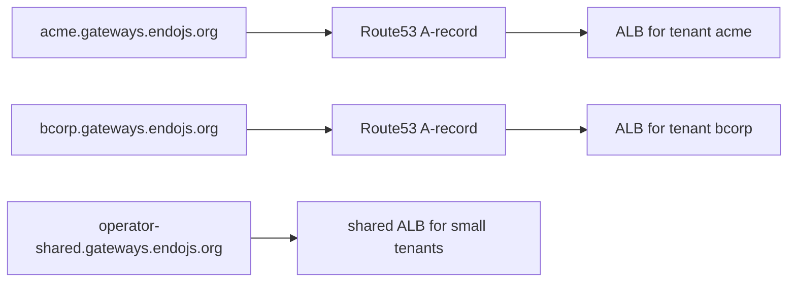
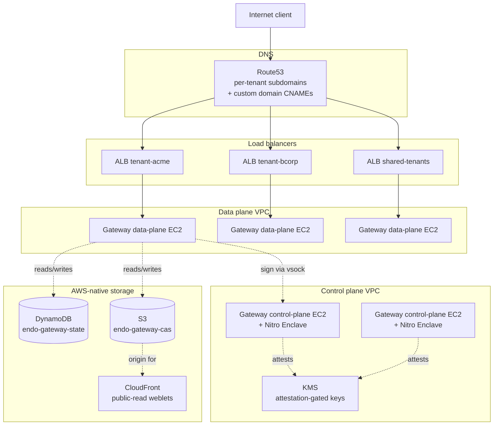

# AWS-Attuned Gateway

| | |
|---|---|
| **Created** | 2026-05-22 |
| **Updated** | 2026-05-23 |
| **Author** | Kris Kowal (prompted) |
| **Status** | Proposed |
| **Depends on** | [gateway-aws-deployment](gateway-aws-deployment.md), [gateway-package](gateway-package.md) |

## What is the Problem Being Solved?

[`gateway-aws-deployment`](gateway-aws-deployment.md) describes how to
take the *generic Linux service* version of the Endo Gateway and run
it on AWS infrastructure (EC2 + ALB + sqlite-on-EBS).
That deployment is **a Linux service that happens to be on AWS**.
This design describes the next step: a Gateway shape that **treats
AWS-native services as first-class capability substrates** rather than
as a stand-in for a generic Linux host.

The maintainer directive frames this design as:

> Consider also designing a Gateway attuned to AWS S3, EC2, Nitro
> Enclaves, Route53, and the appropriate analogue to sqlite for a
> hosted gateway service with a domain name.

**What changes from the deployment-only design.** The previous
design in this stack ([`gateway-aws-deployment`](gateway-aws-deployment.md))
treats AWS as a host for a generic-Linux service: the Gateway is
the same binary that runs on a bare Linux box, the EC2 instance
provides the kernel, EBS provides the disk, the ALB provides the
public address, and the Gateway's local sqlite holds state.
This design replaces five of those generic-Linux substrates with
AWS-native services that match each subsystem's actual shape:
the CAS moves from `/var/cache/endo-gateway/` to S3 because S3 is
already a content-addressed object store; the relay-and-ledger
state moves from sqlite to DynamoDB because DynamoDB is already
a partition-keyed key-value store; the long-lived signing key
moves from Secrets Manager (visible to the OS on the EC2 instance)
to a Nitro Enclave (invisible to the OS); the DNS layer becomes
part of the routing fabric instead of a single CNAME; and the
EC2 fleet splits into control plane and data plane. The reader
who has not seen the prior design can read this preamble as a
standalone framing, then consult the table for the per-service
mapping.

The five named services map to five subsystems that
[`gateway-package`](gateway-package.md) currently treats as
generic-Linux subsystems:

| Generic-Linux subsystem | AWS-attuned substitute |
|-------------------------|------------------------|
| Local CAS at `/var/cache/endo-gateway/` (content-addressed static-asset cache) | **S3** with intelligent tiering, per-tenant prefix, lifecycle policies |
| EC2 ASG with per-instance gateway processes | **EC2** with mixed control-plane / data-plane fleet shapes; per-tenant isolation via dedicated instance reservations |
| Per-instance bearer-token signing in Secrets Manager | **Nitro Enclaves** as the trusted execution boundary for key custody and bearer-token issuance |
| Single `gateway.endojs.org` ALB with HTTP `Host` header routing | **Route53** for per-subdomain DNS routing to per-tenant ALBs or to a single ALB with host-based listener rules |
| Local sqlite at `/var/lib/endo-gateway/state.db` (relay registration, ledger) | **DynamoDB** (single-table design) as the cloud-native sqlite analogue |

Each substitute is a deliberate trade-off: it picks up AWS-native
durability, scalability, and integration at the cost of portability
and cost-floor.
This design records the trade-offs explicitly so an operator who does
not need AWS-native scale can stay on the simpler shape from
[`gateway-aws-deployment`](gateway-aws-deployment.md).

A second framing is **multi-tenancy**.
The generic-Linux Gateway assumes single-operator-many-users (one
person running a Gateway for their personal use or for a small team).
The AWS-attuned Gateway assumes **many-operators-many-users** (a
hosted service offering Gateways as a tenant-isolated product).
Several of the AWS-native choices below (per-tenant S3 prefix,
DynamoDB partition-key tenancy, Route53 per-subdomain) only matter
in the multi-tenant framing.

## Scope

In scope:

- The five AWS-native substitutions named above.
- The configuration seam (`[storage]` section in `config.toml`,
  `type = "aws"`) that switches a Gateway from generic-Linux mode to
  AWS-attuned mode.
- Per-tenant isolation primitives across S3, DynamoDB, and Route53.
- The Nitro Enclave's role in custody of long-lived signing material.
- A consolidated open-questions section folding in the parent stack's
  questions that this design newly resolves and the questions this
  design newly raises.

Out of scope:

- Implementation of `@endo/gateway` itself; that work is the
  [`gateway-package`](gateway-package.md) phased rollout.
- The IaC for the basic AWS deployment; that work is
  [`gateway-aws-deployment`](gateway-aws-deployment.md).
- Cross-cloud AWS-equivalents for other providers (GCP, Azure).
  Sibling designs per provider would re-derive the trade-offs.
- The payment-processor integration for the per-account resource
  ledger
  ([`gateway-package`](gateway-package.md) Open Question 1).
  Payment is orthogonal to AWS-attunement; both can land in either
  order.
- Multi-region active-active.
  Deferred to a follow-up; DynamoDB Global Tables and S3 Cross-Region
  Replication are the candidate building blocks but the operational
  complexity dwarfs the first-cut benefit.

## S3 as the Content-Addressed Store

The Gateway's CAS holds two kinds of objects:

1. **Weblet content trees** (per
   [`gateway-package`](gateway-package.md) § Feature 2).
   Static assets the Gateway serves on behalf of a tenant.
2. **OCapN-Noise session state** (per
   [`gateway-package`](gateway-package.md) § Feature 8).
   Negotiated keys, replay-attack counters, recently-seen-nonce
   bloom filter snapshots.

Both are content-addressed: the object key is the SHA-256 hash of
the content.
The generic-Linux Gateway stores both kinds in
`/var/cache/endo-gateway/` as plain files.
The AWS-attuned Gateway stores both in S3.

### Bucket layout

A single bucket per Gateway deployment:

```
s3://endo-gateway-cas-<deployment>/
  tenants/
    <tenant-id>/
      cas/
        <sha256-hex>/
          object              # the bytes
          metadata.json       # MIME type, creation timestamp, ref count
      sessions/
        <session-id>          # ephemeral OCapN-Noise session state
  shared/
    cas/
      <sha256-hex>/           # cross-tenant dedup-by-hash for public content
        object
        metadata.json
```

### Per-tenant prefix

Per-tenant isolation is provided by the **bucket prefix** plus an IAM
condition.
The Gateway's EC2 instance role grants S3 access to
`s3://endo-gateway-cas-<deployment>/tenants/${aws:PrincipalTag/tenant-id}/*`
(the `${aws:PrincipalTag/tenant-id}` is an AWS IAM condition variable
expanded at policy-evaluation time) via an IAM condition;
cross-tenant access requires an explicit operator override.

For shared (public) content, the `shared/cas/` prefix holds objects
that any tenant may read but only the operator may write.
This covers the Chat-application bundle, common JavaScript libraries,
and other content that is the same across tenants.

### Lifecycle policies

Lifecycle policies on the bucket:

- **OCapN-Noise session state**: 24-hour expiration (sessions are
  ephemeral; a connection that pauses longer than 24 hours
  re-handshakes from scratch).
- **Per-tenant CAS objects**: transition to Standard-Infrequent-Access
  after 30 days without access, transition to Glacier Instant
  Retrieval after 90 days, expire after 365 days unless the metadata
  marks the object as pinned by an active formula.
- **Shared CAS objects**: never expire; operator manages.

The lifecycle policy assumes a **reference-count check** runs against
DynamoDB before expiration (so the Gateway does not lose content
referenced by a live formula).
The expiration is a soft default; the operator can tune per workload.

### Public-read vs. signed-URL for weblet static content

Weblets that serve fully-public content (a brochure site, an open-
source project's documentation) benefit from **public-read S3 with
CloudFront** in front: cheap, cacheable at the edge, zero per-request
Gateway compute.
The Gateway's role in this case is to *issue redirects* to the
CloudFront URLs rather than to proxy the bytes.

Weblets that serve authenticated content (a tenant's private files,
per-user weblets) use **signed-URL** access: the Gateway issues a
short-lived (5-minute) presigned URL on first request, the client
fetches directly from S3 via the URL.
This shifts bytes off the Gateway but keeps authentication on the
Gateway.

The Weblet formula gains a `s3Mode` field:

```ts
interface WebletFormula {
  // ... existing fields per gateway-package.md ...
  s3Mode?: 'public' | 'signed-url' | 'gateway-proxy';
}
```

`gateway-proxy` is the default (matches the generic-Linux behavior:
the Gateway reads from S3 and serves bytes to the client); the other
two are AWS-attuned optimizations.

### Why S3 over EFS or FSx

| Storage | Outcome | Reason |
|---------|---------|--------|
| **S3** | Chosen | Object storage matches CAS shape exactly (content-addressed); per-object lifecycle policies; per-prefix IAM; intelligent tiering reduces cost at scale; bound only by request rate (~5,500 GET/prefix/second). |
| EFS | Considered, rejected | POSIX file semantics are overkill (CAS is content-addressed; rename / link / chmod don't apply). Cost is ~3-10x S3 at scale. EFS-IA helps but still pricier than S3-IA. |
| FSx for Lustre | Considered, rejected | Optimized for high-throughput parallel-compute workloads (HPC, ML). Wrong shape for HTTP-serving. |
| EBS (the generic-Linux choice) | Considered, rejected | Per-instance; would require synchronization across the ASG. S3 elides the synchronization problem. |

## EC2 Fleet Shape

[`gateway-aws-deployment`](gateway-aws-deployment.md) uses a single
homogeneous ASG of `c7g.large` instances.
The AWS-attuned variant splits the fleet:

### Control-plane EC2

A small fleet (2 instances) of `c7g.xlarge` instances running the
**administration and registration** subsystems:

- The UDS bootstrap socket
  ([`gateway-package`](gateway-package.md) § Feature 4) for local
  relay registration.
- The admin daemon ([`gateway-package`](gateway-package.md) § Feature 7).
- The per-tenant Route53 record management API
  (a CapTP exo the operator's onboarding tool calls).
- The Nitro Enclave host (see § Nitro Enclaves below).

These instances are long-lived (minimal rotation), hold the Nitro
Enclaves with the per-Gateway signing keys, and are not directly
behind the ALB.
Their security group accepts traffic only from the operator's bastion
or from SSM Session Manager.

### Data-plane EC2

The main ASG (3-9 `c7g.large` instances) running the **HTTP / WS
serving** subsystems:

- HTTP request handling (virtual hosting, Git over HTTP).
- WebSocket framing (Chat, `/ocapn-cbor-np`).
- Per-account resource metering
  ([`gateway-package`](gateway-package.md) § Feature 1).
- CAS read-through caching backed by S3.

These instances are rotation-friendly (instance refresh on new AMI),
stateless (state lives in DynamoDB + S3), and behind the ALB.
They reach the control plane for signing operations via a VPC-internal
TLS channel.

### Why split

Splitting lets the data-plane scale on traffic load while the
control-plane stays small and trusted.
The Nitro Enclave's signing-key custody benefits especially: the
key never reaches a rotation-friendly instance, so the blast radius
of a data-plane compromise is bounded to the lifetime of an issued
bearer token.

A future variant could move the data plane to **Fargate** or
**Lambda** for true per-request scaling; surfaced in Open Questions
below.

## Nitro Enclaves as the Trusted Execution Boundary

The Gateway holds three long-lived secrets that benefit from enclave-
backed custody:

1. **The Gateway's per-instance signing key** for OCapN-Noise
   responder identity (the `intended-responder` Ed25519 key per
   [`ocapn-noise-network`](ocapn-noise-network.md)).
2. **The bearer-token-issuance key** for new account onboarding
   (256-bit hex per
   [`daemon-256-bit-identifiers`](daemon-256-bit-identifiers.md)).
3. **The DynamoDB-row-encryption key** for at-rest encryption of the
   per-account resource ledger.

A Nitro Enclave is a vsock-attached, attestation-rooted, no-network,
no-disk virtual machine on the parent EC2 instance.
The parent talks to the enclave over `/dev/vsock`; the enclave talks
to nothing else.

### Enclave responsibilities

The enclave exposes a vsock service with the following operations:

```ts
interface GatewayEnclaveService {
  /** Sign an Ed25519 message under the responder key. */
  sign(message: Uint8Array): Promise<Uint8Array>;

  /** Generate a fresh bearer token; returns the token and a sealed
   * proof the enclave issued it. */
  issueBearerToken(accountId: AccountId): Promise<{
    token: BearerToken;
    proof: Uint8Array;     // PCR-quote-signed
  }>;

  /** Decrypt a DynamoDB row's at-rest-encrypted column. */
  decryptRow(ciphertext: Uint8Array, aad: Uint8Array): Promise<Uint8Array>;

  /** Get the enclave's attestation document (for KMS key-release
   * conditions). */
  attest(nonce: Uint8Array): Promise<Uint8Array>;
}
```

### Two key roles: durable signing identity and ephemeral KMS-handshake key

The enclave uses **two distinct keys** that earlier drafts of this
design conflated. Naming them separately resolves the rotation /
verification ambiguity the panel review surfaced.

1. **Durable signing key** (the enclave's *responder identity*).
   This is the long-lived Ed25519 key whose public half is the
   gateway's OCapN-Noise `intended-responder` key and whose
   signature backs issued bearer tokens. It is **stored in AWS
   KMS** with a key policy that conditions release on Nitro
   Enclave attestation matching a specific PCR (Platform
   Configuration Register; the SHA-384 hash of the enclave image).
   The durable key survives enclave instance rotation: a new
   enclave with the same PCR is granted the same key by KMS.

2. **Ephemeral KMS-handshake key**. On each enclave startup, the
   enclave generates a fresh keypair *only* to wrap the
   KMS-returned durable-key material in transit. The ephemeral
   key is the response target in the KMS `kms:Decrypt` call's
   attestation block; it lets KMS encrypt the durable-key
   material to a key only this enclave instance holds. The
   ephemeral key never signs anything; it exists for the duration
   of the KMS handshake and is discarded.

On enclave startup:

1. Enclave generates a fresh ephemeral keypair (KMS-handshake key).
2. Enclave calls `attest(nonce=ephemeral_pubkey)` and the
   attestation document binds the ephemeral public key to this
   enclave instance.
3. Enclave forwards the attestation to KMS via the parent EC2 (the
   parent has IAM permission to call `kms:Decrypt` with an
   attestation document).
4. KMS validates the attestation (PCRs match, image signature is
   from the operator's signing identity), encrypts the **durable
   key material** to the ephemeral public key, returns the
   encrypted blob.
5. Enclave decrypts the blob using its ephemeral private key,
   loads the **durable** signing key into memory, and is ready.
   The ephemeral key is discarded.

The parent never sees the durable key. An attacker with full
root on the parent can use operations *under* the enclave's
authority (the enclave will sign while it is live) but cannot
exfiltrate the durable key. Cycling the EC2 instance regenerates
the ephemeral handshake key but the durable signing key is
unchanged; the new enclave re-acquires the same durable key from
KMS on attestation.

### Durable-key rotation

Rotating the durable key is a separate, deliberate operation:

1. Operator publishes a new enclave image (new PCR).
2. Operator provisions a new key in KMS, with the new PCR as the
   attestation condition.
3. Operator runs the per-account re-issuance flow for outstanding
   bearer tokens (the old durable key signs a hand-off record;
   the new durable key re-issues each account's token).
4. After a grace period (operator-named, default 30 days), the
   old KMS key is deleted.

The historical-key registry the gateway consults during the
grace period is the KMS key history itself: KMS retains the
prior key version, and verifiers (gateway data-plane EC2 calling
the enclave's `verify()` operation) check the token's signature
against both the current and the prior durable-key versions
until the grace period ends.

### Resolution of bearer-token rotation (parent Open Question 4)

[`gateway-package`](gateway-package.md) Open Question 4 named the
**rotation story for formula-identifier bearer tokens** as unsolved.
The Nitro Enclave shape above gives a concrete answer keyed on the
durable signing key:

- The bearer token is the SHA-256 of a Pass-Invariant-Eq tuple
  signed by the **durable** key: `(account-id, issuance-time,
  durable-key-id)`. The `durable-key-id` is the KMS key version,
  not the enclave PCR (the PCR identifies the enclave image; the
  key version identifies the signing identity backing the token).
- Rotation = new enclave image (new PCR) + new KMS key version
  (new durable key) + per-account re-issuance flow over a
  grace period.
- During the grace period both the current and prior durable-key
  versions verify; afterward, only the current verifies and old
  tokens fail closed.
- The durable key never leaves KMS in plaintext; it is released
  to a specific enclave PCR via the ephemeral-handshake mechanism
  above, so a compromised AMI does not exfiltrate the durable
  key. The historical-key registry is KMS's own key-version
  history.

**Reconciliation with the parent token model (this is a second
credential shape, not a redefinition of the first).**
[`gateway-package`](gateway-package.md) Design Decision 4 defines
the bearer token as the pre-existing **opaque 256-bit formula
identifier** — a *capability*, keyed by formula id, that grants the
authority of whatever formula it names (the Git repo handle, the
Chat `fetch(token)` target). The signed `(account-id,
issuance-time, durable-key-id)` credential above is a **different,
account-scoped, time-scoped claim**, and this design does **not**
silently replace the formula-identifier token with it. The two
coexist by construction:

- **Formula-identifier capability tokens** (Git remotes, Chat
  `fetch(token)`) stay exactly as the parent design defines them:
  opaque, formula-keyed, not account-scoped. The AWS-attuned
  variant does not re-key these onto account id; a Git remote URL
  is still a formula-identifier bearer token and rotates only by
  the parent's (still-open) formula-identifier rotation story.
- **The enclave-signed account credential** is a *new, additional*
  credential minted at account onboarding for the **hosted
  multi-tenant** control surface (account provisioning, ledger
  access, tenant-scoped admin). It is the credential the enclave's
  durable key backs and the one the rotation flow above rotates.
  It is account-scoped precisely because the hosted product's unit
  of tenancy is the account, not the formula.

So Open Question 4's *rotation* concern is resolved **only for the
account credential**, which is the credential the durable key
signs; the formula-identifier capability tokens are out of that
resolution's scope and keep their parent-design rotation gap. The
mapping "which surfaces use which token" is: Git-over-HTTP and Chat
`fetch(token)` use formula-identifier capabilities; account/ledger/
tenant-admin use the enclave-signed account credential.

On the **Pass-Invariant-Eq** framing the parent question carries
(object identity must hold across a key change so two paths to the
same object still compare `Eq`): the mechanism above resolves the
*verification* side (dual-validity during the grace period, hard
cutover after) but does **not** by itself establish the Eq
property — a hard cutover where old account tokens "fail closed"
is a re-issuance, not an identity-preserving rotation. This design
therefore claims to resolve the **verification and custody** side
of Open Question 4 for the account credential, and explicitly
leaves the Pass-Invariant-Eq identity-preservation question open
(it is the same open question the parent inherits from
[`endo-gateway`](endo-gateway.md) § Open Questions 1). The
remaining *user-visible workflow* question (do clients re-issue on
rotation, or is the old token valid for the full grace period?) is
the operator's product call.

### Cost

Nitro Enclaves are free at the AWS level (no additional charge beyond
the parent instance's CPU / memory).
The constraint is **memory partitioning**: the enclave reserves a
portion of the parent's RAM at launch.
A `c7g.xlarge` (8 GiB) reserves 1 GiB for the enclave (the smallest
size that fits the enclave's runtime plus key material).

## Route53 for DNS-Level Routing

[`gateway-package`](gateway-package.md) § Feature 2 routes by
HTTP `Host` header to a Weblet formula.
[`gateway-aws-deployment`](gateway-aws-deployment.md) aliases a single
`gateway.endojs.org` to the ALB; the wildcard `*.endojs.org` covers
sub-domains, all routed by the Gateway's Host-header logic.

The AWS-attuned variant introduces **DNS-level tenant isolation**:

### Per-tenant subdomains

Each tenant gets a subdomain:



Large tenants (>1000 RPS sustained) get a dedicated ALB; smaller
tenants share an ALB and rely on the Gateway's Host-header routing
within.

### Custom domains

A tenant can bring their own domain (`chat.example.com`):

1. Tenant creates a CNAME `chat.example.com -> acme.gateways.endojs.org`.
2. Operator provisions an ACM certificate (DNS validation) for
   `chat.example.com`.
3. Operator adds `chat.example.com` to the tenant's ALB listener
   rules.
4. Gateway's Host-header routing already handles the inbound traffic
   (the Host is now `chat.example.com` instead of
   `acme.gateways.endojs.org`).

Custom-domain TLS termination uses the same ACM-on-ALB shape as the
default tenant subdomain; no per-instance certificate management.

### Health-checked failover

Route53 health checks against the ALB target group surface failures
at the DNS layer: if all instances in a tenant's ALB go unhealthy,
Route53 fails over to a secondary record (a static maintenance page
on S3, served via CloudFront).
This is cheap insurance against partial outages.

### Resolution of parent Open Question 3

[`gateway-package`](gateway-package.md) Open Question 3 named
**virtual-host name allocation across users** as the collision-prone
case (two users wanting `chat.example.com`).
The AWS-attuned variant **partially resolves** by changing the
allocation namespace: instead of one shared `endojs.org` namespace,
each tenant gets their own subdomain (`<tenant>.gateways.endojs.org`)
plus optional custom domains they bring themselves.
First-bind-wins reduces to *per-tenant* first-bind-wins, which is
trivial (each tenant manages their own namespace).

The cross-tenant case (two tenants both want `chat`) becomes a
non-issue because `acme.gateways.endojs.org/chat` and
`bcorp.gateways.endojs.org/chat` are different URLs.

It is **partial** — not full — because "per-tenant first-bind-wins
is trivial" holds only where a tenant is a **single trust domain**.
A tenant that contains several mutually-distrusting accounts still
needs an intra-tenant allocation rule; that missing half is named
and resolved (falling back to the parent's `authenticated-allocation`
mode keyed by `ACCOUNT#<aid>`) in § Correspondence between
row-identity and handle-identity below.

## DynamoDB as the SQLite Analogue

The "appropriate analogue to sqlite for a hosted gateway service" in
the maintainer directive maps to **DynamoDB** with a **single-table
design**.

### Alternatives considered

| Backend | Outcome | Reason |
|---------|---------|--------|
| **DynamoDB** | Chosen | Serverless (no instances to manage); per-request pricing aligns with the multi-tenant cost model; single-table design covers all access patterns; per-partition-key tenancy is natural; Global Tables open the multi-region door later. |
| Aurora Serverless v2 | Considered, rejected for first cut | Relational, autoscale-to-zero, supports complex queries. Heavier operationally (a database to run); per-second billing has a minimum floor that doesn't suit low-traffic tenants. Reconsider if the Gateway's data model evolves toward needing joins. |
| RDS Postgres (multi-AZ) | Considered, rejected | Always-on, per-AZ instance billing, requires schema migrations to be coordinated with deploys. Operational overhead high relative to the Gateway's actually-modest data needs. |
| DynamoDB + ElastiCache Redis | Considered as composite, deferred | Redis as a hot-path cache in front of DynamoDB is a sensible optimization, deferred until traffic warrants. |
| Per-tenant sqlite on EFS | Considered, rejected | EFS POSIX semantics + sqlite file-locking + many writers = locking pathologies. Wrong tool. |
| Per-tenant DynamoDB *tables* (not single-table) | Considered, rejected | DynamoDB has a per-account table quota (default 2500, raisable to ~10k); per-tenant tables don't scale past mid-thousands of tenants. Single-table with a tenant-prefixed partition key scales arbitrarily. |

### Single-table schema

All data lives in one DynamoDB table `endo-gateway-state`.
The partition key is `pk`, the sort key is `sk`.
Per-tenant items prefix `pk` with the tenant ID:

| pk | sk | Item kind | Attributes |
|----|-----|-----------|------------|
| `TENANT#<tid>` | `META` | Tenant metadata | name, plan, created_at, custom_domains |
| `TENANT#<tid>` | `ACCOUNT#<aid>` | Account record | created_at, status, bearer_token_hash (enclave-decryptable) |
| `TENANT#<tid>` | `LEDGER#<aid>` | Resource ledger (**deferred — reserved key prefix only, see note below**) | compute, storage, network counters; token balance |
| `TENANT#<tid>` | `WEBLET#<formula-id>` | Weblet binding | virtual_host, content_root_ref, mime_types, ssr_handler |
| `TENANT#<tid>` | `RELAY#<pubkey-hex>` | Relay registration | target_handle, registered_at |
| `TENANT#<tid>` | `SESSION#<session-id>` | Active OCapN session (hot) | last_seen, frame_count |
| `SHARED` | `WEBLET#<formula-id>` | Operator-managed shared weblet (Chat, etc.) | same as WEBLET above |

A **GSI** on `(account_id, sk)` lets the Gateway look up everything
related to a single account regardless of tenant.

### The `LEDGER#` row is a reserved prefix, not a settled schema

[`gateway-package`](gateway-package.md) Feature 1b **defers** the
resource ledger: it withholds the `ResourceLedger` shape from the
design surface precisely because the gateway-side-vs-daemon-side
compute-metering **trust boundary** is unsettled, and requires a
follow-up design to land before any phase depends on it. This
AWS-attuned design does **not** override that deferral, and the
`LEDGER#<aid>` row above must not be read as settling the ledger's
schema. It is included only to **reserve the sort-key prefix**
(`LEDGER#`) so a later single-table migration does not collide with
it; the attribute list (`compute, storage, network counters; token
balance`) is illustrative of the *kind* of counters such a row
would hold, not a committed column set. The actual ledger
schema — which counters exist, who may read them, who may charge,
and where the authoritative meter lives (gateway, daemon, or
split) — is owned by the parent's Feature 1b follow-up design and
lands there first. If that follow-up chooses a shape incompatible
with a single DynamoDB row (for example, splitting the meter across
the gateway and the user daemon), this reserved prefix is dropped
rather than forcing the ledger into it. This design raises **no**
new resolution of the ledger trust boundary; it defers to the
parent exactly as the parent requires.

### Correspondence between row-identity and handle-identity

The single-table schema introduces a **place-oriented** identity
scheme — `TENANT#<tid>` / `ACCOUNT#<aid>` partition/sort keys where
"who may act" is "whoever the row says" (an ambient, DB-row
identity). [`gateway-package`](gateway-package.md) (§ Capability
Surface, § Feature 4) uses a **capability-oriented** identity —
`UserDaemonHandle`, where authority is "whoever holds the handle."
These are two different kinds of identity, and this design states
their correspondence explicitly rather than letting them run in
parallel unreconciled:

- An `ACCOUNT#<aid>` row is the hosted product's **billing- and
  provisioning-scoped record** for a tenant's account. It is
  **not** itself a capability and confers no OCapN authority; it is
  data the control plane reads under its own IAM/enclave authority.
- A `UserDaemonHandle` remains the sole **capability** that directs
  CapTP traffic to a user's daemon. The `RELAY#<pubkey-hex>` row's
  `target_handle` attribute is a *serialized reference* to such a
  handle (persisted so a data-plane instance can re-establish the
  relay after restart), not an alternative source of authority: the
  authority still travels with the handle, and the row is a durable
  note of where a previously-held handle pointed.
- A **tenant is a single trust domain** for the purpose of
  first-bind-wins (§ Resolution of parent Open Question 3): the
  "per-tenant first-bind-wins is trivial" claim holds **only**
  because a `TENANT#<tid>` is one trust domain. Where a tenant
  contains several mutually-distrusting **accounts**, the
  intra-tenant allocation among those accounts falls back to the
  parent design's `authenticated-allocation` mode keyed by
  `ACCOUNT#<aid>` namespace, not to row-ownership. This is the
  missing half the earlier draft hedged as "partially resolves":
  cross-tenant is resolved by DNS; intra-tenant cross-account is
  resolved by the parent's authenticated-allocation mode.

The two identity models are therefore **not** orthogonal and
**not** interchangeable: the capability model owns *authority to
act*; the row model owns *durable product/billing state and
persisted references*. No place-oriented row is ever the sole
basis for granting CapTP authority.

### At-rest encryption

DynamoDB's built-in at-rest encryption protects the table by default.
Sensitive columns (bearer-token hashes, payment-proof binaries) get
**additional** encryption with a key the Nitro Enclave holds: the
Gateway sends the ciphertext + an authenticated-additional-data tag
(AAD = `pk||sk`) to the enclave's `decryptRow()` call, which returns
the plaintext.
A KMS-only attacker who compromises the per-table KMS key still
cannot read the doubly-encrypted columns.

### Pricing model

DynamoDB has two pricing modes:

- **On-demand** (per-request billing): no capacity planning; pay per
  read/write request.
- **Provisioned** (per-RCU/WCU/hour): capacity-planned; cheaper at
  steady-state but requires planning.

The first-cut Gateway deployment uses **on-demand** for unpredictable
multi-tenant traffic.
Once usage patterns stabilize, individual high-volume tables (Per-
tenant LEDGER, for example) may switch to provisioned with
auto-scaling.

### Resolution of parent Open Question 5

[`gateway-package`](gateway-package.md) Open Question 5 named
**multi-tenant filesystem isolation for the per-user CAS** as
underspecified.
The AWS-attuned variant **resolves** by moving the CAS out of the
filesystem entirely:

- Per-tenant S3 prefixes (`s3://.../tenants/<tid>/cas/`) carry
  per-tenant content with IAM-enforced isolation.
- Dedup happens via **reference-counted entries in DynamoDB**: the
  DynamoDB table tracks `(content-hash, tenant-id) -> ref-count`; the
  S3 object exists once at `s3://.../shared/cas/<hash>` for any
  shareable content, and the per-tenant prefix carries
  copy-on-restrict-access content.

The combination of S3 prefix + DynamoDB reference count + lifecycle
policies covers all three cases (per-tenant isolation, cross-tenant
dedup, garbage collection).

## Configuration Seam

[`gateway-aws-deployment`](gateway-aws-deployment.md) § Seam to the
AWS-Attuned Variant named the `[storage]` configuration section.
This design fleshes it out:

```toml
[storage]
type = "aws"

[storage.aws]
dynamodb_table = "endo-gateway-state"
dynamodb_endpoint = ""              # default: regional endpoint
s3_bucket = "endo-gateway-cas-prod"
s3_endpoint = ""                    # default: regional endpoint
nitro_enclave_cid = 10              # vsock context ID
nitro_enclave_port = 7000
region = "us-east-1"

[storage.aws.kms]
signing_key_id = "arn:aws:kms:us-east-1:ACCOUNT:key/UUID"
encryption_key_id = "arn:aws:kms:us-east-1:ACCOUNT:key/UUID"

[routing]
type = "route53"

[routing.route53]
hosted_zone_id = "Z1234567890ABCDEF"
tenant_subdomain_pattern = "{tenant}.gateways.endojs.org"
default_alb_arn = "arn:aws:elasticloadbalancing:..."
```

A `type = "sqlite"` configuration is the generic-Linux mode; a
`type = "aws"` configuration is this design's mode.
The `@endo/gateway` codebase ships both; the configuration picks.

A future `type = "gcp"` or `type = "azure"` mode would land via a
sibling design without touching this design's contract.

## Deployment Topology

The AWS-attuned deployment topology extends
[`gateway-aws-deployment`](gateway-aws-deployment.md) with the AWS-
native services:



## Dependencies

| Design | Relationship |
|--------|--------------|
| [gateway-package](gateway-package.md) | **Grandparent.** The package design; this design re-targets several of its feature subsystems to AWS-native services. |
| [gateway-packaging-ci](gateway-packaging-ci.md) | **Parent stack (grandparent).** The packaging-CI workflow produces the same `.deb` and Docker artifacts; the AMI build in [`gateway-aws-deployment`](gateway-aws-deployment.md) bakes them in. |
| [gateway-aws-deployment](gateway-aws-deployment.md) | **Parent.** The basic AWS deployment shape. This design replaces several subsystems with AWS-native services. |
| [gateway-bearer-token-auth](gateway-bearer-token-auth.md) | The bearer-token scheme the enclave issues. |
| [ocapn-noise-network](ocapn-noise-network.md) | The signing key the enclave holds for OCapN-Noise responder identity. |
| [daemon-256-bit-identifiers](daemon-256-bit-identifiers.md) | The 256-bit hex bearer-token shape. |

## Phased Implementation

**Phase A**: Configuration seam in `@endo/gateway` (`type = "aws"`
mode of `[storage]` and `[routing]`). DynamoDB single-table schema
lands and Gateway's state-store API switches behind the configuration
flag. S3 CAS lands and Gateway's CAS API switches similarly. Both
fall back to sqlite / local-disk if the AWS-specific configuration is
missing.

**Phase B**: Nitro Enclave skeleton. Enclave image with the four
operations above; KMS attestation-conditioned key release; parent EC2
talks to enclave via vsock. The first cut uses the enclave only for
signing operations; bearer-token issuance and DynamoDB-row encryption
follow in later phases as the Gateway's authentication and ledger
work matures.

**Phase C**: Route53 per-tenant subdomains and ALB-per-tenant
provisioning. The operator's onboarding tool (a separate piece of
software, not part of `@endo/gateway`) calls a Gateway CapTP exo to
provision a tenant; the exo orchestrates the Route53 + ALB + IAM
work via Terraform module instantiations.

**Phase D**: CloudFront for public-read weblets; signed-URL for
authenticated weblets; the Weblet formula's `s3Mode` field lands.

**Phase E**: Reference operator-onboarding tool. A CLI or web UI that
provisions a tenant end-to-end (custom domain, Route53 record, ALB,
IAM, DynamoDB tenant prefix, S3 prefix, enclave-issued bearer-token).

These phases live downstream of
[`gateway-package`](gateway-package.md) phase 4 (which lands the OS
packaging) and
[`gateway-aws-deployment`](gateway-aws-deployment.md) phases A
through C (which establish the basic AWS deployment).
Roughly speaking, the AWS-attuned variant is **Milestone 1 plus 2
quarters** (per the README's milestone framing); the multi-tenant
shape is a serious piece of software in its own right.

## Test Catalog

The AWS-native trust boundaries this design introduces carry their
own adversarial coverage obligations, distinct from the
generic-Linux catalogue in [`gateway-package`](gateway-package.md)
§ Test Catalog (which this design references rather than repeats).
Each row lands with the phase that lands its boundary.

| Trust boundary | Adversarial tests |
|----------------|-------------------|
| Nitro Enclave attestation / key custody | A `kms:Decrypt` attempt whose attestation PCR does not match the pinned enclave image is denied by the KMS key policy; the parent EC2 (root-compromised) cannot obtain the durable key in plaintext; the ephemeral handshake key never signs a token (a negative assertion). |
| Durable-key rotation / dual-verification | A token signed by the prior durable-key version verifies **during** the grace period and fails **after** it; a token signed by neither the current nor prior version always fails; the account credential's `durable-key-id` must match a KMS key version the enclave will verify against. |
| Per-tenant DynamoDB isolation | A request scoped to `TENANT#<a>` cannot read or write `TENANT#<b>` items; the `(account_id, sk)` GSI does not leak cross-tenant rows to an account query; the `LEDGER#` prefix is inert (no code path reads it as a settled ledger) until the Feature 1b follow-up lands. |
| Per-tenant S3 prefix isolation | A signed URL / IAM path scoped to one tenant's prefix cannot read another tenant's objects; the shared-dedup ref-count table cannot be driven negative to delete an object another tenant still references. |
| Route53 / custom-domain binding | A tenant cannot add a custom domain to another tenant's ALB listener rules; ACM validation is required before a custom domain routes. |

## Design Decisions

1. **S3 + DynamoDB + Nitro Enclaves as the AWS-native storage trio.**
   S3 for content (CAS), DynamoDB for state, Nitro Enclaves for
   custody. Each is the AWS-native answer to a specific generic-
   Linux concern.

2. **Per-tenant prefix in S3 + per-tenant partition key in DynamoDB.**
   Tenancy is enforced at the IAM and access-pattern layer; no
   per-tenant tables or buckets means no quota walls.

3. **Single DynamoDB table, single-table design (with a noted
   physical-vs-logical trade-off).**
   Standard DynamoDB best practice. The table holds all entity kinds
   for all tenants; the `(pk, sk)` shape and a single GSI cover the
   access patterns. Single-table design is *easy* (one table to
   provision, one set of IAM policies) but ships accidental
   complexity into every read-and-write path (every consumer must
   know the `pk` / `sk` encoding for each entity kind). The
   first-cut shape collapses physical schema (one table) into
   logical schema (one model); a future refactor lands a code-side
   data-access layer that hides the `(pk, sk)` encoding behind
   entity-kind-specific helpers, decomplecting storage shape from
   logical model. Acknowledged here so the trade-off is visible
   rather than presented as the only natural choice.

4. **Nitro Enclave holds the long-lived signing material.**
   Parent EC2 compromise does not exfiltrate the key. The PCR-gated
   KMS key release ties the key to a specific enclave image.

5. **Route53 per-tenant subdomain + optional custom domain.**
   Tenancy and DNS namespace are co-managed: each tenant gets a
   subdomain by default and may bring their own domain via CNAME +
   ACM.

6. **Control-plane / data-plane EC2 split.**
   Lets the data plane scale on traffic load while keeping the
   Nitro Enclaves on a small trusted fleet.

7. **CloudFront for public-read weblets.**
   Public static content goes through the CDN; the Gateway is not
   a bytes-shoveling proxy for content that does not need it.

8. **Configuration seam at `[storage].type`.**
   One codebase, two configurations: generic-Linux mode for
   self-hosted deployments and AWS-attuned mode for the hosted
   service. No fork.

## Open Questions

1. **Operator-onboarding API shape.**
   The CapTP exo that provisions a tenant (Route53 record + ALB +
   IAM + DynamoDB prefix + S3 prefix + enclave-issued bearer-token)
   is a substantial piece of software in its own right. The first-
   cut design records that it exists; the actual shape is a follow-up
   design.

2. **Per-tenant cost attribution.**
   AWS cost-attribution at the tenant level requires per-tenant tags
   on every billable resource. Per-tenant S3 prefix and per-tenant
   DynamoDB partition key support cost-allocation tags; per-tenant
   ALB does too. The compute layer (shared EC2 ASG for small
   tenants) is harder to attribute; per-request metering plus a
   monthly cost-divisor is the first-cut answer, surfaced as a
   product question.

3. **Multi-region active-active.**
   DynamoDB Global Tables, S3 Cross-Region Replication, and Route53
   latency-based routing are the building blocks. The Nitro Enclave
   side is the hard part: each region has its own enclaves, each
   with their own ephemeral keys; cross-region bearer-token
   verification needs to either replicate the signing public key or
   route the verification call back to the issuing region.
   Deferred.

4. **Migrating an existing self-hosted Gateway to AWS-attuned mode.**
   A self-hosted operator who outgrows their single VPS wants a
   path to the hosted service. Migrating from `type = "sqlite"` to
   `type = "aws"` is non-trivial: sqlite rows need to be re-keyed
   into DynamoDB's `(pk, sk)` schema; local CAS files need to be
   uploaded to S3 with reference-count records in DynamoDB.
   A `endo-gateway migrate` subcommand could automate; deferred.

5. **Per-tenant rate limits.**
   The Gateway's existing rate-limiter
   ([`gateway-bearer-token-auth`](gateway-bearer-token-auth.md)) is
   global. Per-tenant limits need a new namespace; DynamoDB-backed
   token-bucket per `(tenant, source-ip)` tuple is the candidate
   shape but not designed here.

6. **Lambda / Fargate data plane.**
   The first-cut data plane is EC2. A future variant could move to
   Fargate (per-task billing) or Lambda (per-request billing) for
   bursty workloads. Lambda's 15-minute timeout precludes long-
   lived WebSocket sessions, so the `/ocapn-cbor-np` endpoint would
   stay on EC2 even in a Lambda-fronted design.

7. **Compliance regimes (SOC 2, GDPR, HIPAA).**
   A hosted multi-tenant service raises compliance questions the
   self-hosted shape does not: audit logging, data-residency
   guarantees, breach-notification flows. AWS provides the
   primitives (CloudTrail, regional service deployment, Macie); the
   operator's compliance posture is a product decision the design
   names but does not pin.

## Prompt

> Please dispatch a designer to describe the next steps from
> implementing the Endo Gateway as pertaining to packaging for RPM,
> DEB &c, ideally using CI workflows. Then, stack a design on top of
> that describing automation for deploying Gateways to AWS. Consider
> also designing a Gateway attuned to AWS S3, EC2, Nitro Enclaves,
> Route53, and the appropriate analogue to sqlite for a hosted gateway
> service with a domain name.

(This is the third design in the stack; the first is
[`gateway-packaging-ci`](gateway-packaging-ci.md), the second is
[`gateway-aws-deployment`](gateway-aws-deployment.md).
The "consider also" phrasing made this third design optional per the
dispatch brief; the designer chose sibling-design rather than
folding into Design 2's *Out of scope* because the maintainer flagged
five distinct AWS services to attune to, which would have collapsed
into a hand-wave in a single Out-of-scope bullet.)
