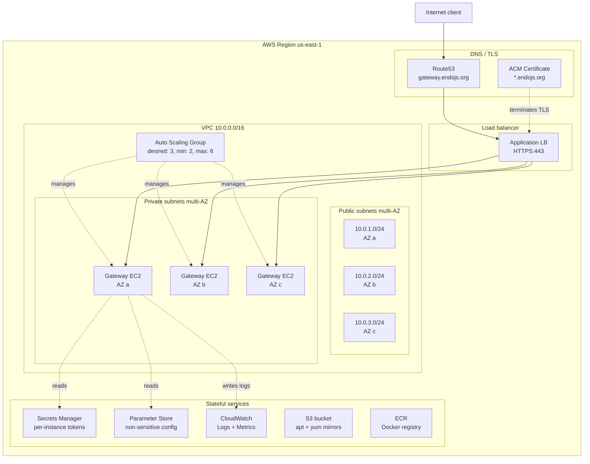

# Gateway AWS Deployment Automation

| | |
|---|---|
| **Created** | 2026-05-22 |
| **Updated** | 2026-05-23 |
| **Author** | Kris Kowal (prompted) |
| **Status** | Proposed |
| **Depends on** | [gateway-packaging-ci](gateway-packaging-ci.md), [gateway-package](gateway-package.md) |

## What is the Problem Being Solved?

[`gateway-package`](gateway-package.md) describes the `@endo/gateway`
package and its ten configurable feature subsystems.
[`gateway-packaging-ci`](gateway-packaging-ci.md) describes the CI
workflow that builds and signs OS package artifacts (`.deb`, `.rpm`,
PKGBUILD, Docker image).
What is missing is the **deployment** layer: how those artifacts reach
production hosts on a cloud provider, how those hosts are provisioned
and managed, and how the public surface (DNS, TLS termination, load
balancing) is wired up.

The maintainer directive frames this design as:

> Then, stack a design on top of that describing automation for
> deploying Gateways to AWS.

AWS is named explicitly.
Other cloud providers (GCP, Azure, DigitalOcean, Hetzner) are out of
scope for this design but the underlying patterns (Packer-built AMIs,
Terraform-or-equivalent IaC, secrets management, blue-green deploys)
generalize; sibling designs can re-instantiate the shape for those
providers without re-deriving the contract.

A working AWS deployment story needs:

1. **Artifact ingress.** The signed `.deb` and Docker image from
   [`gateway-packaging-ci`](gateway-packaging-ci.md) need to land in
   AWS-hosted artifact stores (S3 for apt mirrors, ECR for Docker
   images) so the deployment pipeline can consume them.
2. **AMI build.** The deb is baked into a launch-ready AMI (Amazon
   Machine Image) so EC2 instances launch with the gateway already
   installed and configured.
3. **Infrastructure provisioning.** VPCs, subnets, security groups,
   IAM roles, target groups, load balancers, DNS records, and TLS
   certificates are codified in an IaC tool.
4. **Instance lifecycle.** Auto Scaling Groups, launch templates,
   instance refresh on new AMI, blue-green or canary patterns for
   risky deploys.
5. **Secrets management.** Per-instance bearer tokens, GPG signing
   keys, SSH bastion keys, and any third-party credentials (payment
   processor, observability backend) need a single source of truth
   that CI can write to and instances can read from.
6. **Observability.** CloudWatch Logs, CloudWatch Metrics, alerting
   on gateway-specific signals (registration table size, relay
   session count, rate-limit denials).

This design picks the answers and surfaces the picks as named decisions
with rationale.
The AWS-attuned Gateway variant ([`gateway-aws-attuned`](gateway-aws-attuned.md))
is the next stack frame above this one; this design treats the gateway
as a generic Linux service and leaves the AWS-native shape (S3 CAS,
Nitro Enclave key custody, DynamoDB state) to that sibling.

## Scope

In scope:

- Single-region deployment topology with multi-AZ HA.
- Public-facing ALB (Application Load Balancer) for HTTP/WS, with
  AWS Certificate Manager terminating TLS.
- EC2 Auto Scaling Group running the AMI-baked gateway.
- IaC in Terraform; CloudFormation and CDK considered and rejected for
  reasons named below.
- Packer-built AMIs triggered by the
  [`gateway-packaging-ci`](gateway-packaging-ci.md) release tag.
- AWS Secrets Manager for sensitive material; Parameter Store for
  non-sensitive configuration.
- CloudWatch Logs and Metrics for observability.
- Blue-green via ASG instance refresh; canary deferred.
- The artifact contract with
  [`gateway-packaging-ci`](gateway-packaging-ci.md).

Out of scope (deferred or sibling):

- Multi-region active-active deployments.
  Single-region for the first cut; multi-region is a follow-up once
  the single-region shape proves out.
- AWS-attuned Gateway features (S3 CAS, Nitro Enclaves, Route53-as-
  routing-substrate, DynamoDB state).
  See [`gateway-aws-attuned`](gateway-aws-attuned.md).
- Other cloud providers (GCP, Azure, DigitalOcean, Hetzner,
  Cloudflare).
  The patterns generalize but the IaC modules do not; sibling designs
  named per-provider would land that work.
- Kubernetes deployment (EKS, GKE, AKS).
  The Docker image
  ([`gateway-packaging-ci`](gateway-packaging-ci.md) § Docker) is the
  building block; a Helm chart and EKS deployment design is a sibling
  follow-up.
- On-premises deployments.
  The deb / rpm / arch packages from
  [`gateway-packaging-ci`](gateway-packaging-ci.md) cover on-premises;
  no automation layer is in scope here.

## Deployment Topology



### VPC and subnets

A single VPC `10.0.0.0/16` per region, with three public subnets
(`10.0.1.0/24`, `10.0.2.0/24`, `10.0.3.0/24`) and three private
subnets (`10.0.11.0/24`, `10.0.12.0/24`, `10.0.13.0/24`), one of each
per Availability Zone.

The ALB lives in the public subnets; the gateway EC2 instances live
in the private subnets.
Outbound internet from the private subnets routes through a NAT
Gateway (one per AZ, for HA).
Inbound internet reaches the gateways only via the ALB.

### Application Load Balancer

The ALB terminates TLS using an ACM-issued wildcard certificate for
`*.endojs.org` (the production domain) and forwards plaintext HTTP to
the gateway instances on port 3469.
The ALB sets `X-Forwarded-Proto`, `X-Forwarded-For`, and
`X-Forwarded-Host` headers; the gateway's trusted-proxy configuration
([`gateway-package`](gateway-package.md) § Feature 9) lists the VPC's
CIDR as the trusted source for these headers.

The ALB target group health check hits `GET /healthz` (a new endpoint
the gateway exposes; covered in *Open Questions* below); a 200
response within 5 seconds is healthy.

WebSocket upgrade (`/ocapn-cbor-np` per
[`gateway-package`](gateway-package.md) § Feature 8) passes through
the ALB transparently; ALB supports WebSocket upgrade natively.

### EC2 Auto Scaling Group

The ASG launches instances from the latest AMI (per *AMI Build* below).
The launch template specifies:

- Instance type: **`c7g.large`** (ARM Graviton, 2 vCPU, 4 GiB RAM)
  for the first cut.
  ARM Graviton is the cost-optimal choice for the gateway's workload
  (HTTP request handling, lightweight WebSocket framing); the
  `gateway-packaging-ci` Docker matrix already produces `arm64`
  artifacts, so the AMI inherits the same architecture.
- Volume: 20 GiB gp3 root volume.
  The gateway's persistent state lives in the volume (sqlite at
  `/var/lib/endo-gateway/state.db`, content-addressed cache at
  `/var/cache/endo-gateway/`).
  The cache is reconstructible; the sqlite ledger is not, and
  motivates either daily snapshots or the AWS-attuned variant's move
  to DynamoDB (see [`gateway-aws-attuned`](gateway-aws-attuned.md)).
- IAM instance profile: an EC2 role with read access to the
  per-instance Secrets Manager secret, read access to the relevant
  Parameter Store namespace, and write access to the CloudWatch Logs
  log group.
- Security group: ingress only from the ALB security group on port
  3469; egress unrestricted.
- User data: a `cloud-init` script that fetches the per-instance
  bearer token from Secrets Manager, renders
  `/etc/endo-gateway/config.toml` from a Parameter Store template,
  and starts the gateway via `systemctl`.

The ASG configuration:

- Desired capacity: 3 (one per AZ).
- Minimum capacity: 2 (so a single-AZ outage still has 2 instances
  serving).
- Maximum capacity: 6 (room for burst, e.g., during a deploy).
- Health check type: ELB (uses the ALB target group health, not
  just instance status).
- Termination policy: oldest-launch-template first (so deploys roll
  out cleanly).

### Correctness constraint: registration state is not shared across replicas

A homogeneous ASG of ≥2 gateway replicas, each with **local,
unshared** sqlite (`/var/lib/endo-gateway/state.db`) and a
**host-local** UDS bootstrap socket
([`gateway-package`](gateway-package.md) Feature 4, reachable only
by a co-located process), has a correctness problem that this
design must surface rather than ship silently:

- The virtual-host registration table and the relay-registration
  table are populated via the host-local UDS bootstrap and held
  **in-process** ([`gateway-package`](gateway-package.md) Feature 2,
  Feature 4). A `bind()` or `registerRelay()` that lands on replica
  A is **invisible** to replicas B and C. The ALB distributes
  requests across replicas that disagree on whether a given vhost
  or relay exists, so the same `Host` header routes
  non-deterministically.
- Worse, Feature 2's `authenticated-allocation` namespace-conflict
  check — the mechanism specifically relied on to stop malicious
  squatting on a multi-tenant host — is a **per-replica** check
  with no cross-replica visibility. Two users racing the same name
  against two different replicas both "win" locally, so the check
  fails to prevent the very race it exists to close.

This is not a nuance; it is a correctness break for any deployment
that both (a) runs ≥2 replicas and (b) accepts registrations at
runtime. This design therefore **constrains** the multi-replica
ASG to shapes where it is actually safe, and names the fix:

1. **Single-writer registration for the ≥2-replica shape.** In this
   deployment (sqlite, no shared store), runtime registration
   (`bind`, `registerRelay`) must be funneled to a **single**
   designated instance and the resulting state distributed to the
   others, **or** registration must be a **deploy-time /
   config-baked** input (the vhost and relay tables are rendered
   from Parameter Store into every instance's config at launch and
   are read-only at runtime). The first cut takes the config-baked
   route: the ASG replicas are **read-mostly** serving instances,
   and there is no runtime UDS registration on the fleet.
2. **The real fix is a shared store.** Cross-replica-consistent
   runtime registration requires moving the registration and relay
   tables out of per-instance sqlite into a shared store. That is
   exactly the control-plane / data-plane split and DynamoDB-backed
   registration that [`gateway-aws-attuned`](gateway-aws-attuned.md)
   specifies (2 long-lived control-plane instances own admin/UDS;
   the data plane is stateless and reads shared state). The
   sqlite-on-EBS deployment here is correct **only** as a
   single-instance shape (Phase A) or as a config-baked read-mostly
   fleet (Phase B under the constraint above); it is **not** a
   correct substrate for runtime multi-user registration across a
   live ASG.

Phase B (below) therefore ships the 3-instance ASG under the
config-baked-registration constraint, not as a general
runtime-registration multi-user host. Open Question 1 and Design
Decision 8 restate this so the rationale is not lost.

### Route53

A single A-record `gateway.endojs.org` aliased to the ALB.
The wildcard for `*.endojs.org` covers virtual-hosted weblets per
[`gateway-package`](gateway-package.md) § Feature 2, all aliased to
the same ALB; the gateway routes by `Host` header to the
corresponding Weblet formula.

DNS-level routing (subdomains pointing to different ALBs or different
regions) is **out of scope for this design**; that work belongs to
[`gateway-aws-attuned`](gateway-aws-attuned.md) where the DNS layer
becomes part of the routing fabric.

## Provisioning Tool: Terraform

The IaC tool is **Terraform** (HashiCorp's tool, MPL-2.0 license,
multi-cloud-aware).

### Alternatives considered

| Tool | Outcome | Reason |
|------|---------|--------|
| **Terraform** | Chosen | Multi-provider story makes future GCP/Azure/Hetzner siblings easy; HashiCorp configuration language has a wide community and tooling surface; state-file mechanism is well understood. |
| AWS CDK | Considered, rejected | Locks the IaC to AWS; the gateway is meant to be cloud-portable. CDK's TypeScript synthesis adds a build step ahead of the deploy step that complicates the CI pipeline. Reconsider if AWS-only is the long-term shape. |
| CloudFormation (raw YAML) | Considered, rejected | AWS-only (same reason as CDK), more verbose than Terraform's HCL, no good cross-resource referencing without nested stacks. |
| Pulumi | Considered, rejected for first cut | Multi-cloud-aware (same as Terraform), uses real programming languages instead of HCL. Smaller community than Terraform. Worth revisiting if the deployment grows complex enough that HCL becomes painful; not a first-cut differentiator. |
| Ansible | Considered, rejected as primary tool | Excellent for post-provision configuration (deb installs, systemd unit drops, config-file rendering) but not designed for resource provisioning. The user-data cloud-init script covers the per-instance configuration this design needs; Ansible adds operational complexity without a matching benefit. Reconsider if the per-instance configuration grows beyond what cloud-init handles cleanly. |

### Repository layout

The Terraform modules live in a **separate repository** from
`endojs/endo`: `endojs/endo-deploy`.
The repository contains:

```
endo-deploy/
  modules/
    gateway-aws/
      main.tf
      variables.tf
      outputs.tf
      vpc.tf
      alb.tf
      asg.tf
      iam.tf
      secrets.tf
      observability.tf
  envs/
    production/
      main.tf            # consumes the gateway-aws module
      backend.tf         # S3 + DynamoDB state lock
      terraform.tfvars   # production values
    staging/
      main.tf
      backend.tf
      terraform.tfvars   # staging values (smaller ASG, different domain)
  .github/
    workflows/
      terraform-plan.yml   # runs on PR
      terraform-apply.yml  # runs on merge to main
```

Separating the deploy repo from `endo` itself has three benefits:

- Deploy-side credentials never need to reach `endo` CI runners.
  An `endo` PR cannot accidentally trigger a Terraform apply.
- The deploy repo can be private even if `endo` is public, in case
  operator-specific configuration (cost-center tags, alerting
  thresholds, on-call routing) needs to stay confidential.
- The deploy repo's release cadence is decoupled from `endo`'s; an
  emergency IaC fix lands without an `endo` release cycle.

The state backend is **S3 + DynamoDB**: state file in an S3 bucket
with versioning and encryption, lock in a DynamoDB table.
This is the canonical Terraform-on-AWS state pattern.

## AMI Build

A Packer template builds an AMI from the latest tagged `.deb`:

```hcl
# packaging/aws/gateway.pkr.hcl
packer {
  required_plugins {
    amazon = {
      version = ">= 1.3.0"
      source  = "github.com/hashicorp/amazon"
    }
  }
}

variable "gateway_version" {
  type = string
}

variable "region" {
  type    = string
  default = "us-east-1"
}

source "amazon-ebs" "gateway" {
  ami_name      = "endo-gateway-${var.gateway_version}-{{timestamp}}"
  instance_type = "t4g.medium"
  region        = var.region
  source_ami_filter {
    filters = {
      name                = "ubuntu/images/hvm-ssd-gp3/ubuntu-noble-24.04-arm64-server-*"
      root-device-type    = "ebs"
      virtualization-type = "hvm"
    }
    most_recent = true
    owners      = ["099720109477"]   # Canonical
  }
  ssh_username = "ubuntu"
}

build {
  sources = ["source.amazon-ebs.gateway"]

  provisioner "shell" {
    inline = [
      # Trust the endojs apt repository's signing key.
      "curl -fsSL https://apt.endojs.org/key.gpg | sudo tee /usr/share/keyrings/endojs.gpg > /dev/null",
      "echo 'deb [signed-by=/usr/share/keyrings/endojs.gpg] https://apt.endojs.org stable main' | sudo tee /etc/apt/sources.list.d/endojs.list",
      "sudo apt-get update",
      "sudo apt-get install -y endo-gateway=${var.gateway_version}",
      # Install the cloud-init handler the user-data script will hit.
      "sudo install -m 0755 /tmp/gateway-cloud-init.sh /usr/local/bin/gateway-cloud-init",
      # Defer service start to first boot under the per-instance config.
      "sudo systemctl disable endo-gateway.service",
    ]
  }
}
```

### CI integration

The packaging CI workflow
([`gateway-packaging-ci`](gateway-packaging-ci.md)) emits a release
event when a new `.deb` lands in the apt repo.
A separate workflow in `endojs/endo-deploy` (`build-ami.yml`) listens
for that event (via a `repository_dispatch` API call) and runs the
Packer template above.

```yaml
# endo-deploy/.github/workflows/build-ami.yml
name: Build Gateway AMI
on:
  repository_dispatch:
    types: [gateway-released]
  workflow_dispatch:
    inputs:
      gateway_version:
        required: true
        type: string

jobs:
  packer:
    runs-on: ubuntu-latest
    permissions:
      id-token: write   # for OIDC into AWS
    steps:
      - uses: actions/checkout@v6
      - uses: aws-actions/configure-aws-credentials@v4
        with:
          role-to-assume: arn:aws:iam::ACCOUNT:role/PackerBuild
          aws-region: us-east-1
      - uses: hashicorp/setup-packer@v3
      - run: packer init packaging/aws/gateway.pkr.hcl
      - run: packer build -var gateway_version=${{ inputs.gateway_version }} packaging/aws/gateway.pkr.hcl
      - run: |
          AMI_ID=$(jq -r '.builds[-1].artifact_id' manifest.json | cut -d: -f2)
          aws ssm put-parameter --name /endo-gateway/latest-ami-id --value $AMI_ID --type String --overwrite
```

The AMI ID is stored in Parameter Store at
`/endo-gateway/latest-ami-id`; the Terraform launch template reads
that parameter on the next `terraform apply` so a fresh `apply`
rolls the ASG to the new AMI.

### Artifact contract with the packaging design

The seam between
[`gateway-packaging-ci`](gateway-packaging-ci.md) and this design is:

| Artifact | Producer | Consumer | Location |
|----------|----------|----------|----------|
| `endo-gateway_VERSION_arm64.deb` | packaging-ci `deb` job | this design's Packer template | `apt.endojs.org/pool/main/e/endo-gateway/` |
| `endo-gateway-VERSION-1.aarch64.rpm` | packaging-ci `rpm` job | future RHEL/Fedora AMI variant | `rpm.endojs.org/endo-gateway/aarch64/` |
| `ghcr.io/endojs/gateway:VERSION` | packaging-ci `docker` job | future EKS Helm chart | ghcr.io |
| `gateway-released` repository dispatch event | packaging-ci `publish` job | this design's `build-ami` workflow | GitHub Actions API |

The artifact contract is **versioned by `VERSION`** (the semver from
the `gateway-v<semver>` tag).
A new release version bumps every artifact in lockstep per
[`gateway-packaging-ci`](gateway-packaging-ci.md) § Release Cadence,
so the AMI references a single deb version unambiguously.

## Secrets Management

| Secret | Storage | Rotation | Read by |
|--------|---------|----------|---------|
| Per-instance bearer token (`fetch(token)`-style) | Secrets Manager `endo-gateway/instance/<instance-id>/bearer` | Rotated on instance refresh | gateway process on startup |
| Apt-repo GPG signing key (private) | Secrets Manager `endo-gateway/apt-repo/signing-key` | Manual, infrequent | `gateway-packaging-ci` workflow (cross-account read) |
| Yum-repo GPG signing key (private) | Secrets Manager `endo-gateway/yum-repo/signing-key` | Manual, infrequent | `gateway-packaging-ci` workflow (cross-account read) |
| SSH bastion key | Secrets Manager `endo-gateway/bastion/ssh-key` | Manual, on personnel changes | bastion host on user creation |
| Payment processor key (when Feature 1 lands) | Secrets Manager `endo-gateway/payment-processor/key` | Per processor rotation policy | gateway process (lazy fetch) |
| Observability backend credential (e.g., Datadog API key, if used) | Secrets Manager `endo-gateway/observability/backend` | Per backend policy | cloud-init at boot |

### Why Secrets Manager over Parameter Store

Parameter Store (the `SecureString` parameter type) supports encrypted
values and access via IAM, and is significantly cheaper than Secrets
Manager.
Secrets Manager adds:

- **Automatic rotation** integrations for RDS, DocumentDB, Redshift,
  and Lambda-defined custom rotation flows.
- **Per-secret resource policies**, distinct from IAM, for granting
  cross-account access.
- A higher rate-limit ceiling and a richer audit shape.

The cost difference ($0.40/secret/month vs. free for Parameter Store
under the 10,000 standard parameters quota) is not material once the
deployment has a handful of secrets.
Use Secrets Manager for anything that meets *any* of these criteria:

- The value can grant authority that an attacker would want.
- The value rotates.
- The value is accessed cross-account.

Use Parameter Store for everything else (the apt repo URL, the
expected gateway version, the CloudWatch log group name, etc.).

### Per-instance secret pattern

The cloud-init script generates a fresh per-instance bearer token on
first boot, writes it to Secrets Manager at
`endo-gateway/instance/<instance-id>/bearer`, and then writes the
same value into `/etc/endo-gateway/config.toml`.
Subsequent boots read the value from Secrets Manager rather than
generating a new one.

When the ASG terminates an instance, a CloudWatch Events rule fires a
Lambda that deletes the corresponding Secrets Manager entry (with the
recovery-window-in-days set to 7 in case of accidental termination).

## Observability

### CloudWatch Logs

Each instance ships systemd-journal output to CloudWatch Logs via
the `awslogs` agent baked into the AMI.
Log group: `/endo-gateway/production` (production env) or
`/endo-gateway/staging` (staging env).
Log stream: `<instance-id>/<unit-name>`.

Retention: 30 days standard, infrequent-access tier after 7 days,
delete after 90 days.

### CloudWatch Metrics

The gateway emits StatsD-style metrics from the gateway process to a
local CloudWatch agent over UDP at `127.0.0.1:8125`.
Metrics:

- `endo.gateway.http.requests` (counter, tags: status_code, method,
  vhost).
- `endo.gateway.ws.sessions.opened` (counter, tags: subprotocol).
- `endo.gateway.ws.sessions.closed` (counter, tags: subprotocol,
  reason).
- `endo.gateway.relay.registrations` (gauge).
- `endo.gateway.rate_limit.denied` (counter, tags: limit_type).
- `endo.gateway.state.sqlite.size_bytes` (gauge).

### Alerts

CloudWatch Alarms on:

- 5xx error rate above 1% over 5 minutes.
- ALB target health below 50% of desired capacity.
- Instance CPU above 80% sustained 15 minutes.
- sqlite state file size above 5 GiB (flags the need to migrate to
  the AWS-attuned variant per
  [`gateway-aws-attuned`](gateway-aws-attuned.md)).

Alerts route to SNS, then to PagerDuty or the operator's choice of
alerting backend.

## Auto-scaling, Blue/Green, Canary

### Auto-scaling

CPU-based scaling: scale out when average CPU > 60% for 5 minutes,
scale in when average CPU < 30% for 15 minutes.
Cooldown: 5 minutes.

This is the first-cut policy; more sophisticated metrics (request
rate, WebSocket session count) replace CPU once observed traffic
patterns warrant.

### Blue/green via ASG instance refresh

A new AMI triggers an ASG instance refresh.
The refresh launches replacements before terminating originals
(minimum healthy percentage: 100%; maximum healthy percentage: 150%),
so the gateway never drops below capacity during a deploy.

The refresh is **automatic on new AMI**: the Terraform launch template
reads the AMI ID from Parameter Store on every apply; a `terraform
apply` (or a scheduled cron-driven apply) picks up the new AMI and
triggers the refresh.

### Canary

**Deferred to a follow-up.**
A canary pattern (a fraction of instances on the new version, gradual
rollout based on observed error rates) requires either:

- A second ASG and a weighted ALB target group (operator manages two
  ASGs, shifts weight gradually), or
- AWS CodeDeploy with blue-green deployment configuration.

Either is reasonable; pinning the choice waits for the first
production-load issue that the blue-green instance-refresh shape
above does not handle.

## Cost Model

| Component | Quantity | Monthly cost (us-east-1) |
|-----------|----------|--------------------------|
| EC2 `c7g.large` instances | 3 | ~$84 (3 × $0.0725/hour × 720h) |
| EBS gp3 root volumes (20 GiB) | 3 | ~$5 (3 × 20 × $0.08/GiB-month) |
| ALB | 1 | ~$22 (Application LB pricing + 0.008/LCU-hour) |
| NAT Gateways | 3 (one per AZ) | ~$99 (3 × $0.045/hour × 720h) |
| Data transfer | Variable | depends on traffic; budget $50/month for first cut |
| Route53 hosted zone | 1 | ~$0.50 |
| Secrets Manager secrets | ~10 | ~$4 |
| CloudWatch Logs ingestion | ~10 GiB/month | ~$5 |
| **Total first cut** | | **~$270/month** |

The NAT Gateway cost is the most surprising; it dominates because
private subnets need outbound internet for OS package updates and
external API calls.
Cost-reduction follow-ups:

- Replace NAT Gateways with NAT Instances (cheaper, less reliable;
  trade-off depends on operator's reliability tolerance).
- Use Interface Endpoints for Secrets Manager / ECR (cheaper than NAT
  for these specific traffic flows).
- **S3 VPC Gateway Endpoints (free)** become relevant *only* once
  the AWS-attuned variant lands and the gateway routes substantive
  S3 traffic. In this design (Linux-service-on-EC2), the gateway
  reaches S3 only indirectly via apt-update traffic; the savings
  available pre-attunement are modest. The substantive S3 traffic
  appears in [`gateway-aws-attuned`](gateway-aws-attuned.md); plan
  the endpoint together with that variant's landing.

A staging environment runs at roughly 1/3 the production cost (1
instance, 1 NAT Gateway, smaller ALB): ~$90/month.

## Seam to the AWS-Attuned Variant

[`gateway-aws-attuned`](gateway-aws-attuned.md) replaces several of
this design's "generic Linux service" choices with AWS-native services:

| This design | AWS-attuned variant |
|-------------|---------------------|
| Local sqlite at `/var/lib/endo-gateway/state.db` | DynamoDB single-table design |
| Local CAS at `/var/cache/endo-gateway/` | S3 bucket with intelligent tiering |
| Per-instance bearer token in Secrets Manager | Nitro Enclave-resident signing key |
| Single `gateway.endojs.org` ALB target | Route53-based per-subdomain routing to per-tenant ALBs |
| Persistent ASG with `c7g.large` instances | Mix of EC2 (control plane) and Lambda (per-request handlers) |

The seam is **the gateway process's storage interface**.
The package and the AMI are the same; the configuration differs.
A `[storage]` section in `config.toml`:

```toml
[storage]
# generic
type = "sqlite"
path = "/var/lib/endo-gateway/state.db"
cas_path = "/var/cache/endo-gateway"

# AWS-attuned (gateway-aws-attuned.md)
type = "aws"
dynamodb_table = "endo-gateway-state"
s3_bucket = "endo-gateway-cas"
nitro_enclave_endpoint = "vsock:10:7000"
```

This design's deployment uses `type = "sqlite"`;
[`gateway-aws-attuned`](gateway-aws-attuned.md) introduces
`type = "aws"` and the corresponding Terraform modules.

## Dependencies

| Design | Relationship |
|--------|--------------|
| [gateway-package](gateway-package.md) | **Grandparent.** The overarching package design. This design's per-instance config inherits from there. |
| [gateway-packaging-ci](gateway-packaging-ci.md) | **Parent stack.** This design consumes the signed `.deb` artifact and the apt repository this design's predecessor establishes. |
| [gateway-bearer-token-auth](gateway-bearer-token-auth.md) | The bearer-token scheme this design's per-instance Secrets Manager entries hold. |
| [ocapn-noise-network](ocapn-noise-network.md) | The `/ocapn-cbor-np` endpoint that the ALB forwards as a WebSocket upgrade. |
| [daemon-docker-selfhost](daemon-docker-selfhost.md) | Sibling deployment pattern; an EKS / Fargate sibling design would build on the Docker image this design references. |
| [gateway-aws-attuned](gateway-aws-attuned.md) | **Stacked child.** Replaces this design's generic-Linux storage with AWS-native services. |

## Phased Implementation

**Phase A**: Terraform skeleton + Packer template + manual deploy.
Stand up the VPC, the ALB, a single EC2 instance with the gateway
installed via Packer-baked AMI. No ASG yet, no auto-rollover.

**Phase B**: ASG and instance refresh. Move from single-instance to
3-instance multi-AZ ASG with automatic instance refresh on new AMI.
The multi-replica fleet runs under the **config-baked,
read-mostly registration** constraint of § Correctness constraint:
registration state is not shared across replicas — the vhost and
relay tables are rendered from Parameter Store into every
instance's config at launch and are read-only at runtime; there is
no runtime UDS registration on the fleet. Runtime multi-user
registration across a live ASG is **not** in this deployment's
scope and waits for the shared-store shape in
[`gateway-aws-attuned`](gateway-aws-attuned.md).

**Phase C**: Observability. CloudWatch Logs, CloudWatch Metrics,
alarms wired to SNS.

**Phase D**: Secrets Manager rotation flows. Migrate from manual
secret writes to Lambda-orchestrated rotation for the rotatable
secrets (per-instance bearer tokens, observability backend
credentials).

**Phase E**: Staging environment alongside production. Same Terraform
modules, different `envs/staging/` variables.

These phases live inside Milestone 1's "remote-access" framing
([`gateway-package`](gateway-package.md) inherits M1 placement);
phases A through C are on the critical path to a publicly-reachable
gateway, D and E are quality improvements.

## Design Decisions

1. **Single region, multi-AZ HA for the first cut.**
   Multi-region active-active is a follow-up; the operational
   complexity of cross-region state sync would dwarf the gateway's
   first-cut benefits.

2. **ALB with ACM-terminated TLS.**
   AWS-native TLS termination eliminates per-instance certificate
   management.
   The gateway's "no TLS in the gateway" decision
   ([`gateway-package`](gateway-package.md) § Feature 9) lines up
   exactly with this shape.

3. **ARM Graviton instance type for cost.**
   `c7g.large` is the first cut; revisit once load patterns suggest a
   different instance family.

4. **Terraform over CDK, CloudFormation, or Pulumi.**
   Multi-cloud portability and a wider community.
   See the *Alternatives Considered* table above.

5. **Separate `endo-deploy` repository.**
   Keeps deploy credentials out of the `endo` repo and decouples the
   release cadences.

6. **Secrets Manager for sensitive material, Parameter Store for the
   rest.**
   Standard AWS pattern; the cost difference is immaterial.

7. **Blue/green via ASG instance refresh for the first cut.**
   Canary deferred; instance refresh covers the common case.

8. **Sqlite local state for now, with named seam to the AWS-attuned
   variant.**
   Deployment-portability taste (not prematurely coupling to
   AWS-native storage) is a *secondary* reason to keep sqlite for
   the first cut. The **primary** reason the storage layer must
   eventually move is **registration-state correctness under
   horizontal scaling**: per-instance sqlite plus a host-local UDS
   bootstrap cannot give ≥2 replicas a consistent view of the
   vhost / relay registration tables (see § Correctness constraint:
   registration state is not shared across replicas). Sqlite is
   therefore correct here **only** as a single-instance shape or as
   a config-baked read-mostly fleet; runtime multi-user
   registration across a live ASG requires the shared store that
   [`gateway-aws-attuned`](gateway-aws-attuned.md) introduces
   (DynamoDB + control/data-plane split). The seam to the
   AWS-attuned variant is thus a **correctness** boundary, not
   merely a portability one, and this decision states that plainly
   so the cost of deferring the move is not understated.

## Open Questions

1. **Cross-replica registration consistency (the load-bearing one).**
   Per-instance sqlite plus a host-local UDS bootstrap give ≥2 ASG
   replicas **no** shared view of the vhost / relay registration
   tables, which breaks routing determinism and defeats the
   `authenticated-allocation` conflict check (§ Correctness
   constraint: registration state is not shared across replicas).
   This design's answer for the sqlite deployment is to constrain
   the multi-replica fleet to **config-baked, read-mostly**
   registration (no runtime UDS registration on the fleet); the
   *general* runtime-multi-user answer is the shared-store
   control/data-plane split in
   [`gateway-aws-attuned`](gateway-aws-attuned.md). The remaining
   open product question is the migration path from a config-baked
   Phase-B fleet to the AWS-attuned shared store without a
   flag-day.

2. **`/healthz` endpoint specification.**
   The ALB health check needs a gateway endpoint that returns 200
   when the gateway is ready to serve.
   What counts as "ready"? Listening on 3469 is necessary but
   insufficient (the registration table may be empty, the sqlite
   migration may be running).
   Surfaced; the gateway's first-cut implementation should land
   `/healthz` with explicit ready vs. live distinction (Kubernetes-
   convention).

3. **Multi-region active-active future.**
   When the gateway has enough traffic that single-region risk is
   intolerable, the multi-region story needs: cross-region DynamoDB
   global table (in the AWS-attuned variant) or cross-region sqlite
   replication (not really possible), Route53 latency-based or
   geolocation routing, per-region Secrets Manager entries.
   Deferred; surfaced as the work that would need to happen.

4. **Bastion host or AWS Systems Manager Session Manager?**
   First-cut decision is **SSM Session Manager** (no SSH key
   management, IAM-gated access, audit-logged); a bastion host is
   the fallback if SSM proves insufficient.
   Surfaced because some operators prefer SSH and would push back
   on SSM.

5. **Backup strategy for sqlite.**
   Daily snapshot of the EBS volume? Stream sqlite WAL to S3?
   For the first cut, daily EBS snapshots with 14-day retention.
   The longer-term answer is to move to DynamoDB
   ([`gateway-aws-attuned`](gateway-aws-attuned.md)) and let AWS
   handle durability.

6. **GitHub Actions OIDC role permissions scope.**
   The Packer build needs to launch EC2 instances, create AMIs, and
   write to Parameter Store.
   The principle of least authority suggests a per-workflow role
   with the narrowest possible policy; the first-cut policy is
   already too broad and should be tightened once observed usage
   pins it down.

7. **Cost-control budgets.**
   AWS Budgets alarms on monthly spend exceeding $400 (production)
   and $150 (staging) catch runaway costs; sensible thresholds
   depend on the operator's tolerance.
   Surfaced rather than picked.

8. **Where do the AWS account credentials originate?**
   The endojs organization presumably has an AWS account; the IAM
   roles and trust policies that let the bot's CI assume those roles
   need to be configured by the maintainer at bootstrap time.
   This is operational work outside the design's reach but the
   design records it so the bootstrap step is not forgotten.

## Prompt

> Please dispatch a designer to describe the next steps from
> implementing the Endo Gateway as pertaining to packaging for RPM,
> DEB &c, ideally using CI workflows. Then, stack a design on top of
> that describing automation for deploying Gateways to AWS. Consider
> also designing a Gateway attuned to AWS S3, EC2, Nitro Enclaves,
> Route53, and the appropriate analogue to sqlite for a hosted gateway
> service with a domain name.

(This is the second design in the stack; the first is
[`gateway-packaging-ci`](gateway-packaging-ci.md), the third is
[`gateway-aws-attuned`](gateway-aws-attuned.md).)
