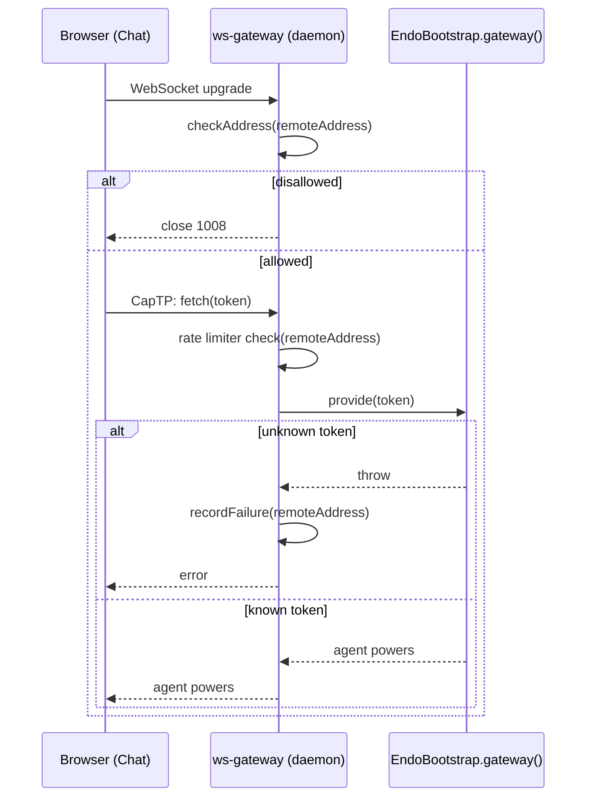

# Gateway Remote Access

| | |
|---|---|
| **Created** | 2026-03-02 |
| **Updated** | 2026-07-06 (reconciled against the shipped `ws-gateway.js` + orphaned `cidr.js` and the merged [gateway-package](gateway-package.md) design; status corrected from the erroneous Implemented) |
| **Author** | Kris Kowal (prompted) |
| **Status** | In Progress |

## Status

This record previously claimed **Implemented**, citing an
`ENDO_GATEWAY=remote` mode, a per-IP rate limiter, and a TLS warning in
`packages/daemon/src/web-server-node.js`. That claim was wrong, and PR
[#608](https://github.com/endojs/endo-but-for-bots/pull/608)
(`feat: Docker self-hosting image for the daemon`) tripped over it: its
survey of the master lineage found no gateway at all and proposed
resetting this design to Not Started. Neither status is accurate. The
truth is split across the fork's two lineages:

**On `llm` (the roadmap branch), shipped:**

- `packages/daemon/src/ws-gateway.js` (`startWsGateway`, started
  unconditionally by `daemon-node.js`) — the HTTP+WebSocket CapTP
  gateway, bound to `ENDO_ADDR` (default `127.0.0.1:8920`). Each
  connection receives a `GatewayBootstrap` exo whose
  `fetch(token)` forwards to `E(endoBootstrap).gateway()`'s
  `provide(token)` — the bearer-token gate this design specifies.
  Landed via [familiar-gateway-migration](familiar-gateway-migration.md)
  (whose own Status prose still cites the pre-migration
  `web-server-node.js` filename).
- The per-IP rate limiter on failed `fetch()` attempts
  (`makeRateLimiter` in `ws-gateway.js`) — exactly this design's
  § Rate limiting: 1-second accruing penalty, failures only, lazy sweep
  at 10× the penalty interval.
- `packages/daemon/src/cidr.js` — `makeAddressChecker({ allowRemote,
  allowedCIDRs })` implementing the full admission policy this design
  calls for (localhost-only default, `allowRemote` bypass,
  comma-separated CIDR allowlist, IPv4/IPv6 with v4-mapped-v6
  normalization), unit-tested by `test/cidr.test.js`.

**On `llm`, not implemented:**

- **Nothing imports `cidr.js`.** It is an orphaned module: no code
  reads `ENDO_GATEWAY` or `ENDO_GATEWAY_ALLOWED_CIDRS`, and
  `ws-gateway.js` performs **no address check of any kind** — neither
  the localhost rejection this design's problem statement presumed nor
  the remote-mode opt-in it specified. The only barrier is the default
  loopback bind; an operator who sets `ENDO_ADDR=0.0.0.0` today exposes
  `fetch(token)` to every network peer with no opt-in and no warning.
- The TLS startup warning.
- Remote-mode integration tests (`test/gateway.test.js`'s `afterEach`
  already clears both env vars in anticipation, but no test sets them).

**On the master lineage** (base of PR #608): none of the above exists;
the daemon is controllable only over its private UNIX domain socket
(`serve-private-path.js`). #608's finding was correct for its base.

Two premises of the 2026-03 text were never true and are corrected
below: the daemon has no `--addr` flag (the bind address is the
`ENDO_ADDR` environment variable, read by `daemon-node.js` and
`packages/familiar/src/daemon-manager.js`), and the "gateway rejects
non-localhost IPs today" premise described Chat's since-deleted dev
gateway (`packages/chat/scripts/gateway-server.js`), not the daemon.

## Ownership

The gateway corpus has moved since 2026-03: the `endo-gateway` design
was removed 2026-05-29 and absorbed into
[gateway-package](gateway-package.md) (merged as PR
[#343](https://github.com/endojs/endo-but-for-bots/pull/343)), whose
implementation stack (#389–#397, #578) is in flight as the
`@endo/gateway` package. So no "endo-gateway phase" exists to own
remote access. The division is:

- **This design owns bearer-token admission control**: the
  token-as-credential model, the `fetch(token)` gate, the failure rate
  limiter, and the local/CIDR/remote admission policy — wherever the
  gateway lives. Today that is the daemon's `ws-gateway.js` (Phases A
  and B below).
- **[gateway-package](gateway-package.md) owns the transport
  surfaces** — virtual hosting (Feature 2), the `/ocapn-cbor-np`
  WebSocket subprotocol (Feature 8), trusted-proxy compatibility
  (Feature 9) — and, per its own Dependencies table, hoists this
  design's rate-limit and CIDR machinery into its request-handling
  layer when `@endo/gateway` replaces the daemon-inline gateway
  (Phase C below). Feature 3 (Git smart-HTTP) reuses the same
  formula-identifier bearer scheme.

## What is the Problem Being Solved?

The daemon's WebSocket gateway binds loopback by default and performs
no peer-address admission check. This leaves no safe path to remote
access: a self-hosted daemon on a VPS cannot be controlled from a
user's local machine without binding wide, and binding wide today
exposes the `fetch(token)` gate to every network peer with no
explicit operator opt-in.

The specific requirement is unchanged from 2026-03: a user
self-hosting a daemon with Docker can open
`https://my-daemon.example.com/#gateway=<host>&agent=<root-agent-id>`
in their browser, and the Chat UI establishes an authenticated session
as that agent's profile. This is the remote-control keystone of
Milestone 3 (Remote Access and Coding Capabilities) and the blocked
remote-access follow-up of PR #608.

## Authentication Model

Authentication is CapTP-native. The `GatewayBootstrap` exo exposes a
single method:

```js
fetch(token) → agent powers
```

The `token` is the agent's formula identifier — a 256-bit hex string
(64 characters). Knowing the identifier grants full control of that
agent's profile, the same authority model as SSH keys or API tokens.

The Chat UI receives the agent ID via URL fragment
(`#gateway=<host>&agent=<id>`). Per RFC 3986 § 3.5 the fragment is
never sent to the server in HTTP requests. The client extracts the
agent ID from `window.location.hash` and passes it to
`GatewayBootstrap.fetch()` over the CapTP WebSocket connection.

No additional JSON auth handshake is needed — CapTP provides the
channel, and `fetch(token)` is the gate. **This part is shipped** on
`llm`; what follows is the admission-control wiring that is not.

## Design

### Admission control: `ENDO_GATEWAY` modes

Remote mode is controlled by the `ENDO_GATEWAY` environment variable,
read once at daemon startup in `daemon-node.js` alongside `ENDO_ADDR`:

| Configuration | Mode | Admission |
|---|---|---|
| `ENDO_GATEWAY` unset or `local` (default) | Local | Loopback peers only (`127.0.0.1`, `::1`, `::ffff:127.0.0.1`) |
| `ENDO_GATEWAY_ALLOWED_CIDRS=<list>` | Local+CIDR | Loopback plus peers inside the listed CIDRs |
| `ENDO_GATEWAY=remote` | Remote | Every peer; bearer token is the gate |

The predicate is the existing `makeAddressChecker` from `cidr.js`,
finally imported:

```js
const checkAddress = makeAddressChecker({
  allowRemote: env.ENDO_GATEWAY === 'remote',
  allowedCIDRs: env.ENDO_GATEWAY_ALLOWED_CIDRS,
});
```

`startWsGateway` accepts the checker and consults it in the
`connection` handler, before any CapTP is spoken: a disallowed peer's
socket is closed immediately (WebSocket close code 1008, policy
violation) and the attempt logged. Binding `ENDO_ADDR=0.0.0.0` without
`ENDO_GATEWAY=remote` therefore accepts TCP connections on all
interfaces but refuses non-loopback peers at the WebSocket layer — the
operator must opt in to remote access explicitly. This closes the
current hazard where a wide bind silently exposes the gate, and it is
a deliberate behavior change for any operator relying on that
exposure.



### Rate limiting (shipped)

Failed `fetch()` attempts are rate-limited per peer address to prevent
online brute force, as already implemented by `makeRateLimiter` in
`ws-gateway.js`: a 1-second penalty per failure, accruing (10 rapid
failures impose 10 seconds), no state change on success, stale entries
lazily swept 10× the penalty interval after the last failure. This
section is retained as the normative spec for the shipped code.

### TLS warning

When remote mode is active, the gateway logs at startup:

```
[Gateway] Remote mode active. Ensure TLS termination (reverse proxy)
is configured — bearer tokens are transmitted over the WebSocket
connection.
```

The gateway itself never terminates TLS; that posture is pinned by
[gateway-package](gateway-package.md) Feature 9, whose
trusted-proxy `X-Forwarded-*` parsing lands in its Phase 4. Until
then the rate limiter and address checker key on the raw socket peer
address — behind a reverse proxy, all clients share the proxy's
address for rate-limiting purposes (acceptable: the limiter only
throttles failures, and the token space is unguessable).

## Phased Implementation

**Phase A — wire the shipped pieces (daemon, `llm`).** Import
`makeAddressChecker` into the gateway path: read `ENDO_GATEWAY` /
`ENDO_GATEWAY_ALLOWED_CIDRS` in `daemon-node.js`, thread the checker
through `startWsGateway`, enforce at connection admission, add the
remote-mode TLS warning. Tests in `test/gateway.test.js` (whose env
hygiene already anticipates exactly these variables): local-mode
loopback acceptance, non-loopback rejection on a wide bind, CIDR
admission, remote-mode acceptance, rate-limit behavior across a
rejected/accepted boundary. Small, self-contained: one new option
threading, no new modules. This is the M3 remote-control keystone.

**Phase B — self-host enablement (rides PR #608's follow-up).** The
container recipe publishes the gateway port and sets
`ENDO_GATEWAY=remote`, with a reverse-proxy TLS recipe (Caddy or
nginx) and the Chat `#gateway=<host>&agent=<id>` connection flow
documented end to end. Blocked on Phase A and on the lineage question
below (#608's image builds from the master lineage, which has no
gateway to expose).

**Phase C — hoist into `@endo/gateway`.** When the gateway-package
stack replaces the daemon-inline gateway (its Phase 1 wiring), the
admission checker, rate limiter, and `fetch(token)` gate move into the
package's request-handling layer, applying uniformly to the Chat
WebSocket, weblet WebSockets, and Git smart-HTTP (Feature 3, which
reuses the formula-identifier bearer scheme). The `/ocapn-cbor-np`
endpoint (Feature 8) is exempt: OCapN's Noise handshake authenticates
in-band and needs no bearer gate. This phase is tracked by
[gateway-package](gateway-package.md)'s implementation stack, not
here; this design's residual scope ends at Phase B.

## Security Considerations

1. **Token secrecy.** The agent ID is a 256-bit random hex string;
   brute force is infeasible. The primary risk is leakage through
   browser history or shared links. Users should treat the URL as
   sensitive.
2. **TLS required in remote mode.** The WebSocket carries the bearer
   token; without TLS termination in front of the gateway the token is
   visible to network observers. The gateway warns at startup.
3. **Rate limiting** prevents online brute force of the residual
   token space (shipped).
4. **No session tokens.** Each WebSocket connection authenticates
   independently via `fetch(token)`; no cookies, no JWTs.
5. **The current unwired state is itself the top finding:** on `llm`
   today, `ENDO_ADDR=0.0.0.0` grants every network peer a
   `GatewayBootstrap` with unlimited-connection `fetch` attempts and
   no opt-in. Phase A closes this.

## Design Decisions

1. **No separate auth handshake.** CapTP already provides the channel;
   `fetch(token)` is the gate. Confirmed by the shipped code.
2. **Agent ID as bearer token.** Reuses the existing 256-bit formula
   identifier rather than a separate credential.
3. **URL fragment, not query parameter** (RFC 3986 § 3.5: fragments
   are not transmitted), reducing accidental logging.
4. **No OAuth/OIDC for admission.** The bearer token scopes authority
   to the holder without redirect flows or IdP configuration.
   Operator-side recovery of a lost bearer via OAuth
   proof-of-identity is a named M5 gap (`gateway-key-recovery` in the
   designs README), out of scope here.
5. **Explicit opt-in to remote.** Binding wide is not consent to
   remote access; `ENDO_GATEWAY=remote` is. Considered and rejected:
   inferring remote mode from a non-loopback `ENDO_ADDR` — it would
   silently arm remote access for operators binding to a LAN
   interface for local convenience.
6. **Reuse the orphaned `cidr.js` rather than rewrite.** The module
   already implements and tests this design's admission policy; the
   remaining work is wiring, not invention.

## Open Questions

1. Which lineage serves PR #608's remote-access follow-up? The
   Docker image builds from the master lineage, which lacks
   `ws-gateway.js` entirely; the gateway lives on `llm`. Either the
   image's daemon builds from `llm`, or the follow-up waits for the
   gateway to ferry to the master lineage. Maintainer call; tracked in
   #608's follow-up list.
2. Should local mode's loopback enforcement land behind a
   deprecation notice? It changes behavior for any operator who
   deliberately binds `ENDO_ADDR` wide today and relies on the
   (unauthenticated) exposure. The design's position: no notice —
   the current exposure is a hazard, not a contract.

## Related Designs

- [gateway-package](gateway-package.md) — owns the gateway's transport
  surfaces and absorbs this design's machinery in its Phase C hoist;
  absorbed the removed `endo-gateway` design (2026-05-29).
- [familiar-gateway-migration](familiar-gateway-migration.md) — landed
  the daemon-hosted gateway (`ws-gateway.js`) this design gates; its
  Status prose still names the pre-migration `web-server-node.js`.
- [daemon-docker-selfhost](daemon-docker-selfhost.md) — PR #608; its
  remote-access follow-up is Phase B. Its "gateway rejects
  non-localhost connections" premise is corrected by this revision.
- [endo-gateway-mcp](endo-gateway-mcp.md) — the MCP bridge reuses the
  formula-identifier bearer scheme over the gateway (M6).
