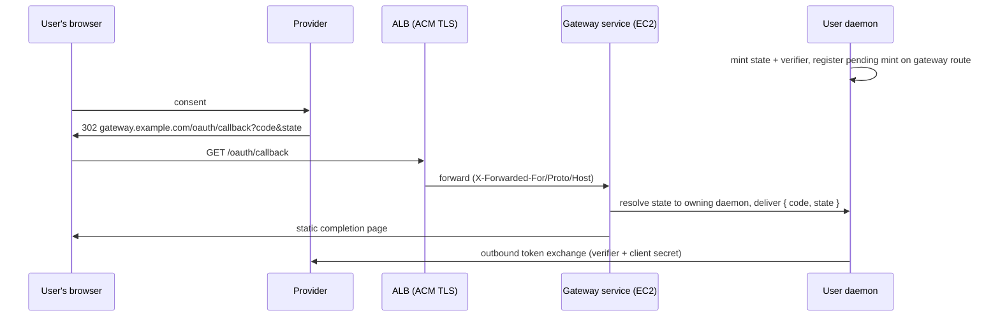

# AWS Endo Gateway: OAuth Redirect Flow

| | |
|---|---|
| **Created** | 2026-07-10 |
| **Author** | Kris Kowal (prompted) |
| **Status** | Proposed |
| **Parent** | [gateway-oauth-redirect](gateway-oauth-redirect.md) |

## Summary

On AWS, the Endo Gateway is itself publicly hosted
([gateway-aws-deployment](gateway-aws-deployment.md): EC2 Auto Scaling
Group behind an Application Load Balancer, ACM-terminated TLS, Route53
DNS). The daemon's web gateway already has a public HTTPS face, so the
OAuth redirect flow takes the simplest shape in the taxonomy of
[gateway-oauth-redirect](gateway-oauth-redirect.md): **direct
ingress**. The callback route is one more path on the gateway's
existing listener; the `RedirectRelay` implementation is the same HTTP
handler the loopback flow uses, reached through the ALB instead of
`127.0.0.1`. No new AWS service enters the flow.

Provenance: the maintainer's `minion.town` experiment
(`kriscendobot/minion.town`) proved the AWS legs of a spec-correct
OAuth deployment (Route53 + ACM domain custody, container compute,
config-only environment seams). Its Cognito work does **not** carry
over: there, Cognito was the authorization server for clients calling
*into* the service. Here the authorization servers are the third-party
providers (Google, GitHub, Microsoft), and AWS supplies only routing,
TLS, and custody of configuration.

## The Flow

The gateway domain, `gateway.example.com`, resolves through Route53 to
the ALB; ACM terminates TLS; the ALB forwards to the gateway service
on the EC2 fleet, which trusts `X-Forwarded-*` from the VPC-internal
ALB per [gateway-package](gateway-package.md) Feature 9. The provider
profile registers `https://gateway.example.com/oauth/callback` on a
web-application client, and the client id and secret live in the
daemon's encrypted formula store, seeded through Secrets Manager per
[gateway-aws-deployment](gateway-aws-deployment.md) § Secrets
Management. They are never ALB, listener-rule, or instance-userdata
configuration.

Route mechanics:

- **Listener rule.** The HTTPS:443 listener forwards path
  `/oauth/callback` to the same gateway target group as all other
  browser-facing traffic. No dedicated rule is required unless AWS WAF
  is attached; if it is, the callback path must be excluded from rules
  that block long or high-entropy query strings.
- **Route resolution inside the gateway.** In the single-operator
  deployment there is one user daemon and the gateway binds the
  callback route to it statically. The pending-mint `state` is the
  discriminator for concurrent mints, exactly as in the contract.
- **Timeouts are irrelevant.** The callback is an instant GET; the
  minutes-long pendency (the user reading the consent screen) lives in
  the daemon's pending-mint record, not in any AWS-visible connection.
- **Fleet dynamics.** The delivery from gateway process to daemon
  rides the gateway's existing daemon registration channel
  ([gateway-package](gateway-package.md) Feature 4), so an instance
  refresh mid-consent at worst fails one mint loudly at the
  `awaitCallback` timeout.

## Log Hygiene

ALB access logs, when enabled per
[gateway-aws-deployment](gateway-aws-deployment.md) § Observability,
record full request URLs into S3, authorization codes included. The
code is inert (contract § Custody invariants), and it is single-use
and expired within minutes, but the S3 log bucket should still be
treated as sensitive, and the form-post response mode preferred where
the provider supports it so codes travel in POST bodies that ALB
access logs do not capture. CloudWatch log groups for the gateway
service must not log callback query strings at info level.

## Multi-Tenancy (AWS-Attuned Variant)

The [gateway-aws-attuned](gateway-aws-attuned.md) shape serves many
tenants through per-tenant Route53 subdomains. Exact-match redirect
URI registration makes this the one place the flow is not simple:

- **Per-tenant client registration (recommended).** Each tenant's
  daemon holds its own client id and secret, registered with
  `https://<tenant>.gateway.example.com/oauth/callback`. All custody
  invariants hold per tenant; the gateway stays a code-blind
  forwarder. The cost is registration effort per tenant per provider,
  which is exactly the registrar-capability question
  ([endoclaw-oauth](endoclaw-oauth.md) Open Question 2); a hosted
  gateway's control plane is the natural registrar host.
- **Shared operator client (rejected as default).** One client,
  callback on a shared host such as
  `auth.gateway.example.com/oauth/callback`, with `state` routing the
  delivery to the owning tenant (the pending-mint index moving to the
  control plane's DynamoDB table per
  [gateway-aws-attuned](gateway-aws-attuned.md) § DynamoDB). It
  economizes registrations, but the exchange then needs the shared
  secret: distributing it to tenant daemons breaks custody invariant 2
  across tenants, and exchanging in the control plane hands the
  operator live tokens. Acceptable only where the operator and all
  tenants are one trust domain.
- **Nitro custody (deferred).** The attuned design's Nitro Enclave
  key custody suggests a future variant where a shared client's secret
  and the exchange move inside an enclave, giving the shared-client
  economics without operator-visible tokens. Deferred until the
  attuned control plane exists; noted so the enclave interface leaves
  room for it.

## Dependencies

| Design | Relationship |
|--------|-------------|
| [gateway-oauth-redirect](gateway-oauth-redirect.md) | **Parent contract.** This narrative instantiates direct ingress. |
| [gateway-aws-deployment](gateway-aws-deployment.md) | **Substrate.** ALB, ACM, Route53, Secrets Manager, observability. |
| [gateway-aws-attuned](gateway-aws-attuned.md) | **Multi-tenant variant.** Route53 per-tenant subdomains, DynamoDB pending-mint index, Nitro custody option. |
| [gateway-package](gateway-package.md) | **Route host.** Feature 9 header trust; Feature 4 gateway-to-daemon delivery channel. |

## Implementation Phases

1. **Single-operator route (S).** Mount `/oauth/callback` on the
   gateway listener, bind to the resident daemon, WAF exclusion note
   in the Terraform module. Gated on M5 standing the AWS gateway up
   (PR #356 stack).
2. **Multi-tenant registrar integration (M, deferred).** Per-tenant
   registration flow in the control plane; lands with the registrar
   capability follow-up, to be filed with it.

## Design Decisions

1. **Direct ingress; no new AWS service in the flow.** The ALB and the
   gateway listener already exist for browser-facing traffic; adding a
   Lambda, an API Gateway stage, or an S3-hosted completion app would
   add custody surface without adding reachability. Considered and
   rejected for that reason.
2. **Per-tenant clients over a shared operator client** for the
   attuned multi-tenant shape, preserving custody invariants at the
   cost of registration effort routed to the registrar follow-up.
3. **Cognito stays out.** It solves inbound identity for a hosted
   service, a different axis; naming this prevents the minion.town
   precedent from being over-applied.

## Open Questions

1. **Does the registrar live in the attuned control plane or in each
   tenant daemon?** Follow-up shared with endoclaw-oauth Open
   Question 2; to be filed with the registrar design.
2. **Access-log redaction.** Is an ALB-level mechanism worth pursuing
   for callback URLs, or is bucket-sensitivity plus form-post
   preference sufficient? Revisit when the M5 deployment is live.

## Prompt

See [gateway-oauth-redirect](gateway-oauth-redirect.md) § Prompt; this
narrative is the AWS instantiation the maintainer's directive on
endojs/endo-but-for-bots#621 named first.
