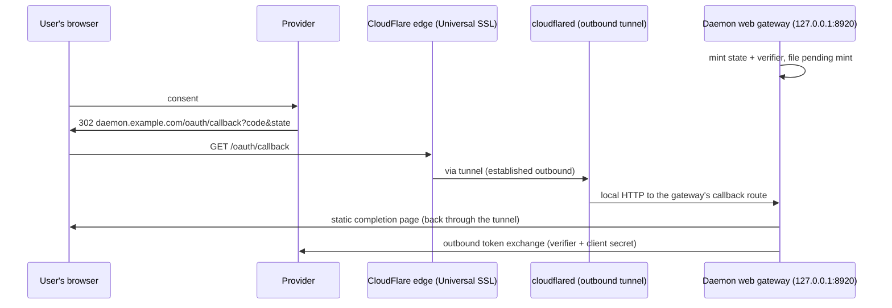

# CloudFlare Endo Gateway: OAuth Redirect Flow

| | |
|---|---|
| **Created** | 2026-07-10 |
| **Author** | Kris Kowal (prompted) |
| **Status** | Proposed |
| **Parent** | [gateway-oauth-redirect](gateway-oauth-redirect.md) |

## Summary

CloudFlare's distinctive offer is a public HTTPS face for a daemon
that has none of its own: the daemon stays on a home machine, a NATed
box, or a VPS with no open inbound port, and the edge reaches it over
a connection the daemon's host opens **outbound**. The primary shape
is therefore **tunneled ingress** via Cloudflare Tunnel: the callback
traverses the edge and the tunnel and lands on the *same gateway HTTP
handler the loopback flow uses*. This is the loopback listener of
RFC 8252 § 7.3 generalized, borrowing public reachability from the
tunnel while keeping zero relay code and zero relay state at the edge.

A secondary shape, the **Worker mailbox**, covers hosts that cannot
run a tunnel connector or are only intermittently connected: a Worker
parks the callback in a Durable Object and the daemon claims it
outbound, per the dead-drop half of the parent's taxonomy.

## Shape 1: Tunneled Ingress (Recommended)

The daemon's host runs `cloudflared` with one ingress rule mapping a
public hostname to the local gateway port:

```yaml
# cloudflared config: the tunnel's only ingress rule
ingress:
  - hostname: daemon.example.com
    service: http://127.0.0.1:8920   # the daemon web gateway (ENDO_ADDR)
  - service: http_status:404
```

The zone's DNS record for `daemon.example.com` targets the tunnel;
CloudFlare's Universal SSL certificate terminates TLS at the edge; the
connector maintains outbound tunnel connections to the edge, so no
inbound firewall rule or public IP is needed. The provider profile
registers `https://daemon.example.com/oauth/callback` on a
web-application client; client id and secret live only in the daemon's
encrypted formula store.



The `RedirectRelay` here is the same in-daemon HTTP handler as the
loopback implementation; only `redirectUri()` differs, reporting the
tunnel hostname. Delivery is in-process, so there is no second hop to
secure: the edge-to-connector leg rides the tunnel's own encryption,
and the connector-to-daemon leg is loopback traffic on the daemon's
host.

**Exposure discipline.** The tunnel hostname exposes whatever the
gateway serves on that port. The gateway's browser-facing routes are
bearer-gated
([gateway-bearer-token-auth](gateway-bearer-token-auth.md)), and the
callback route is inert without a live `state`, but an operator who
wants only the OAuth surface public can point the ingress rule at a
gateway configured with everything else disabled, or gate the hostname
with Cloudflare Access. If Access gates the hostname, exempt the exact
`/oauth/callback` path with a bypass policy: the provider's redirect
is a plain browser navigation mid-consent, and interposing an Access
login there risks dropping the flow, while the path itself is safe to
expose (contract § Custody invariants).

## Shape 2: Worker Mailbox (Variant)

When no connector can run, a Worker bound to the route
`daemon.example.com/oauth/callback*` implements the dead-drop mailbox:

- **Park.** The Worker validates the query shape and stores
  `{ code, error, ts }` in a **Durable Object** keyed by `state`, then
  returns the static completion page.
- **Claim.** The daemon polls outbound
  (`POST /oauth/claim` with `state` in the body, same Worker); the
  Durable Object returns the record once and deletes it. A Durable
  Object alarm expires unclaimed records at the ten-minute TTL.
- Durable Objects are chosen over Workers KV deliberately: the claim
  is a read-modify-delete that must be single-use, and KV's eventual
  consistency can double-deliver or lose the race; the Durable
  Object's serialized execution gives the exactly-once semantics the
  contract's claim ticket needs.
- A push refinement is available for free: the daemon holds an
  outbound WebSocket to the same Durable Object and the park pushes
  the record down it, collapsing poll latency; the poll remains the
  fallback.

The mailbox holds `{ code, state }` at the edge for the seconds
between park and claim, which the contract permits (a parked code is
inert); the tunnel shape is still preferred because it holds nothing
anywhere.

## Log Hygiene and Operational Notes

- Edge request logs (Logpush, Workers logs) capture callback URLs,
  codes included. Same posture as the parent: inert, single-use,
  short-lived, prefer form-post response mode where the provider
  supports it, and treat log sinks as sensitive.
- Everything in both shapes fits CloudFlare's free tier; there is no
  instance to patch in the tunnel shape and no server at all in
  either.
- `cloudflared` becomes a host service dependency of the daemon
  deployment, a peer of the daemon's own service unit; the OS
  packaging of [gateway-package](gateway-package.md) Feature 10 is
  where a bundled recipe would land, noted there as a follow-up, to
  be filed.

## Dependencies

| Design | Relationship |
|--------|-------------|
| [gateway-oauth-redirect](gateway-oauth-redirect.md) | **Parent contract.** Tunneled ingress primary, dead-drop variant secondary. |
| [daemon-web-gateway](daemon-web-gateway.md) / [gateway-package](gateway-package.md) | **Route host.** The tunnel terminates on the existing gateway listener; Feature 9's trusted-proxy posture applies to the connector. |
| [gateway-bearer-token-auth](gateway-bearer-token-auth.md) | **Exposure discipline.** The bearer gate on everything else the tunnel hostname exposes. |

## Implementation Phases

1. **Tunnel recipe (S).** Documentation plus a config fragment:
   ingress rule, DNS, the profile's `redirectUri`. No daemon code
   beyond the parent's Phase 1 seam.
2. **Worker mailbox (S-M).** The Worker and Durable Object (small,
   single-file), plus the daemon's mailbox poller from the parent's
   Phase 2. The WebSocket push refinement trails as its own small
   step.

## Design Decisions

1. **Tunnel over Worker as the primary shape.** The tunnel keeps zero
   code and zero state at the edge and reuses the loopback handler
   verbatim; the Worker exists for hosts that cannot hold a tunnel.
   Considered and rejected as primary for that custody reason alone;
   operationally both are sound.
2. **Durable Object over KV for the mailbox**, for single-use claim
   semantics under strong consistency.
3. **Access bypass on the callback path** rather than an Access-gated
   callback, keeping the consent redirect uninterrupted.

## Open Questions

1. **Should the gateway grow a "callback-only" listener profile** so
   tunnel operators can expose one route without configuring the rest
   of the gateway surface off? Cheap if Feature toggles
   ([gateway-package](gateway-package.md) § Per-feature toggles)
   already reach that granularity.
2. **Worker deployment custody.** The Worker is operator-deployed
   code; whether the endo repo ships it as a versioned artifact
   (mirroring the Netlify site package) or as documentation only.

## Prompt

See [gateway-oauth-redirect](gateway-oauth-redirect.md) § Prompt; this
narrative is the CloudFlare instantiation the maintainer's directive
on endojs/endo-but-for-bots#621 named second.
