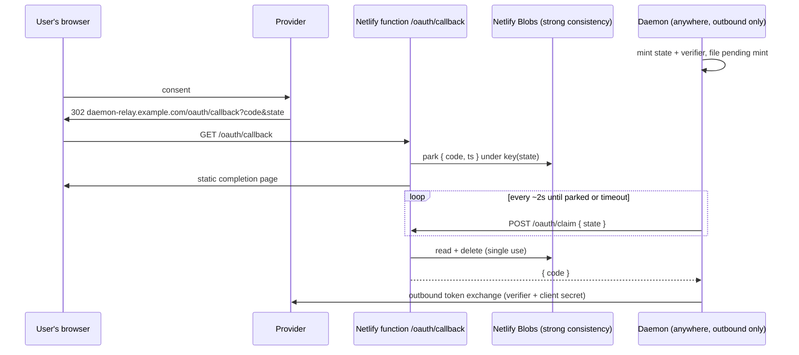

# Netlify Endo Gateway: OAuth Redirect Flow

| | |
|---|---|
| **Created** | 2026-07-10 |
| **Author** | Kris Kowal (prompted) |
| **Status** | Proposed |
| **Parent** | [gateway-oauth-redirect](gateway-oauth-redirect.md) |

## Summary

Netlify hosts static sites and short-lived serverless functions. It
cannot host the daemon, cannot terminate a tunnel to one, and offers
no long-lived inbound channel (functions cannot hold WebSockets). The
provider-specific finding is therefore structural: **the only coherent
Netlify shape is the dead-drop mailbox**, the third leg of the
parent's taxonomy. A function at the callback route parks
`{ code, state }` in Netlify Blobs; the daemon claims it by outbound
poll, presenting `state` as the single-use claim ticket. What Netlify
gives up in delivery immediacy it returns in radical simplicity: the
whole relay is a static page, two small functions, and a blob store,
deployed in minutes on the free tier with managed TLS.

## The Relay Site

One Netlify site, `daemon-relay.example.com` (a custom domain or the
`*.netlify.app` name; Netlify manages the certificate either way),
containing:

- **`/oauth/callback`** (function). Validates that `state` is present
  and well-formed, writes `{ code?, error?, errorDescription?, ts }`
  to a blob, and returns the static completion page. It performs no
  redirect and calls no third party.
- **`/oauth/claim`** (function). `POST` with `state` in the body.
  Reads the blob, deletes it, returns the record; answers 404 while
  nothing is parked and 410 for a record past the ten-minute TTL
  (deleting it). The blob store is opened in Netlify Blobs'
  strong-consistency mode: the claim is a read-modify-delete whose
  single-use semantics the default eventual-consistency mode cannot
  guarantee.
- **The completion page** (static asset). Consent received, return to
  your Chat or terminal; the provider's error text when the callback
  carried one.

The provider profile registers
`https://daemon-relay.example.com/oauth/callback` on a web-application
client. Client id and secret live only in the daemon's encrypted
formula store; the site holds no environment secrets at all, because
the functions never talk to the provider.

The daemon side is the parent's provider-neutral mailbox poller
(`RedirectRelay` Phase 2): poll every two seconds while a mint is
pending, stop at claim, timeout, or cancel. Mints are rare and
interactive, so the polling budget is a handful of function
invocations per mint, far inside Netlify's free allowance, and the
two-second worst case is imperceptible next to the user's consent
click.

## Custody and Hardening

The contract already makes a parked code inert (no verifier, no client
secret ever reaches the relay). Netlify-specific measures on top:

- **Blob keys are `SHA-256(state)`**, computed identically by both
  functions. The store then never contains the claim ticket itself: a
  leaked store listing or snapshot exposes inert codes but does not
  let the holder claim one, because claiming requires the preimage.
- **Single-use and TTL at the claim function**, as above; a scheduled
  Netlify function sweeps expired blobs hourly as a backstop against
  mints abandoned before any claim attempt.
- **Log hygiene.** Function logs record request URLs, codes included,
  and the site operator can read them; same posture as the parent
  (inert, single-use, prefer the form-post response mode where the
  provider supports it, treat logs as sensitive). Note the trust
  statement this implies: the relay site's operator is normally the
  daemon's own operator, and the shape is not designed for a shared
  third-party relay, which would concentrate many users' mint
  metadata in one place for no offsetting benefit.

## What Netlify Cannot Do

Stated so a builder does not go looking:

- No push delivery: functions cannot hold a WebSocket or server-sent
  stream open to the daemon; polling is the shape, not an
  optimization shortfall.
- No daemon co-hosting and no tunnel termination: the relay can never
  become direct or tunneled ingress; a deployment that outgrows the
  mailbox moves providers rather than reshaping this one.
- Function wall-clock limits (roughly ten seconds on the standard
  tier) rule out long-poll claims; the claim answers immediately and
  the daemon owns the cadence.

## Dependencies

| Design | Relationship |
|--------|-------------|
| [gateway-oauth-redirect](gateway-oauth-redirect.md) | **Parent contract.** This narrative is the canonical dead-drop mailbox. |
| [endoclaw-oauth](endoclaw-oauth.md) | **Grandparent.** The mint procedure and token custody the claim feeds. |
| [gateway-oauth-cloudflare](gateway-oauth-cloudflare.md) | **Sibling.** Its Worker-mailbox variant shares the claim protocol and the daemon-side poller; the two relays are interchangeable behind the seam. |

## Implementation Phases

1. **The relay site (S).** Two functions, the completion page, the
   blob-store wiring, and a deploy recipe; versioned in the endo repo
   as a deployable package (name and location to be filed with the
   implementation PR).
2. **Daemon poller (S).** Shared with the parent's Phase 2; nothing
   Netlify-specific beyond the claim URL in host configuration.

## Design Decisions

1. **Dead-drop mailbox as the only shape.** Forced by the platform:
   no inbound path, no tunnels, no long-lived connections. The
   narrative's value is making the constraint and its consequences
   explicit rather than discovering them at build time.
2. **Poll, not push,** with a two-second cadence bounded by the
   pending-mint window. Considered and rejected: long-poll claims
   (function wall-clock limits) and third-party push channels (new
   custody surface for a latency win the interactive flow cannot
   feel).
3. **Hash-keyed blobs** so the claim capability never rests in the
   store, at the cost of one hash per function invocation.
4. **Strong-consistency blob mode** so the single-use claim holds;
   the default eventual mode could double-deliver a code across
   racing claims.

## Open Questions

1. **Netlify Identity and other platform authentication are out of
   scope**; is that worth revisiting if Netlify's platform grows a
   durable push channel? Track passively; no action.
2. **Claim-endpoint abuse surface.** The claim function is public and
   unauthenticated by design (the `state` is the authenticator).
   Whether Netlify's rate limiting suffices against blind claim
   probing, or the function should add a per-IP penalty in the spirit
   of [gateway-bearer-token-auth](gateway-bearer-token-auth.md)
   § Rate limiting, can be settled with a measurement at
   implementation time; 256-bit states make probing hopeless either
   way.

## Prompt

See [gateway-oauth-redirect](gateway-oauth-redirect.md) § Prompt; this
narrative is the Netlify instantiation the maintainer's directive on
endojs/endo-but-for-bots#621 named third.
