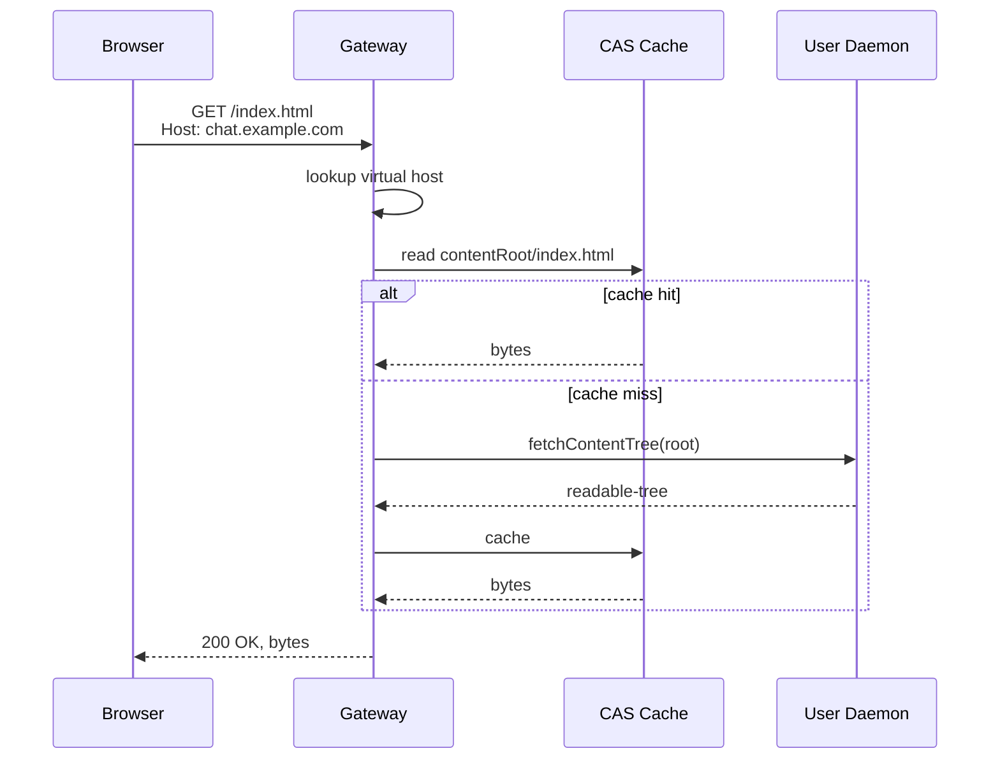
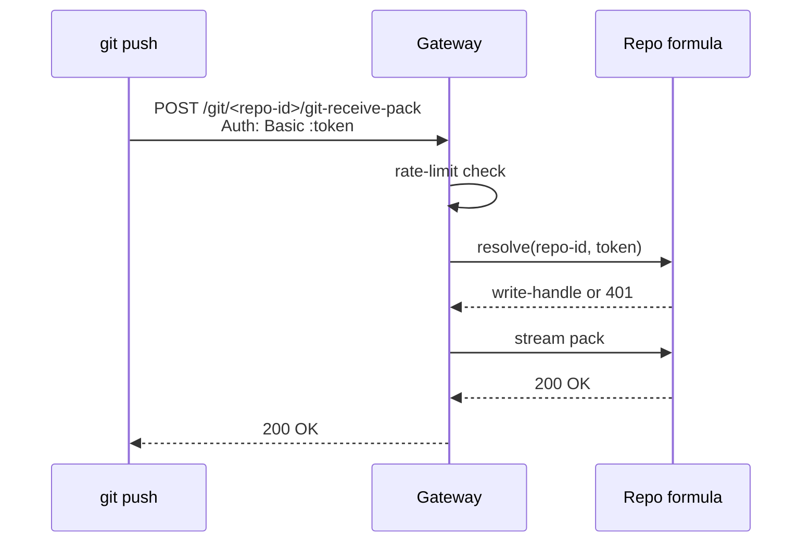
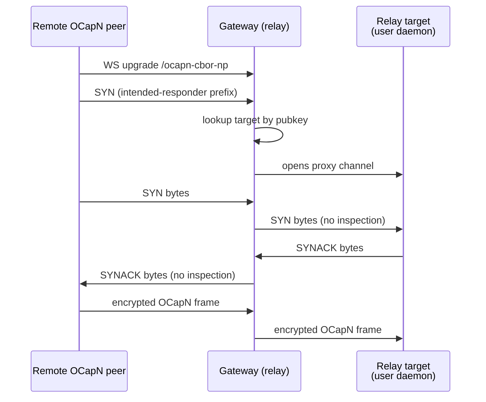

# @endo/gateway Package

| | |
|---|---|
| **Created** | 2026-05-22 |
| **Updated** | 2026-05-23 |
| **Author** | Kris Kowal (prompted) |
| **Status** | Proposed |
| **Supersedes** | [endo-gateway](endo-gateway.md) |

## What is the Problem Being Solved?

The Endo daemon currently bundles its HTTP+WebSocket server inside
[`packages/daemon`](../packages/daemon)
as the `@apps` unconfined guest formula
([`daemon-web-gateway`](daemon-web-gateway.md), Complete).
That shape works for the per-user developer install: one OS user,
one daemon, one port, one weblet hierarchy, one CapTP bridge for
Chat.
It does not extend to the deployment shapes the project now wants
from the gateway:

1. A **per-host system service** that virtual-hosts many users on
   one address and registers from a UNIX-domain bootstrap socket
   ([`endo-gateway`](endo-gateway.md) sketches this; the present
   design subsumes and reframes it).
2. A **public web service** reachable from the internet, serving
   the Chat application, Git-over-HTTP, OCapN over a Noise-encrypted
   WebSocket, and per-tenant weblets.
3. A **Familiar-bundled fallback** that the Electron shell can stand
   up on an OS-assigned port for exactly one user when no system
   gateway is installed.
4. A **CapTP relay-as-a-service** for customers or the public.
5. An **administrator handle** for the local system administrator,
   distinct from any one user's daemon authority.

These uses share most of their machinery (HTTP framing, virtual
hosting, the Noise-over-WebSocket OCapN endpoint, the content-
addressed static-asset cache), but they need to compose
differently across deployments.
A single binary configuration cannot serve all of them without
re-introducing the per-user, multi-user, and bundled-fallback
forks the existing design corpus has been working around one PR
at a time.

Today, the daemon's HTTP+WebSocket surface lives inline in
`packages/daemon/src/ws-gateway.js` (the `startWsGateway` entry
point). That file is deliberately narrow: at this design's base
commit (`b1c3f4dca9`) it is ~226 lines implementing only the
bearer-token `fetch(token)` WebSocket bootstrap and a per-key rate
limiter. It has **no** Host-header virtual hosting, **no**
content-addressed static-asset cache, and **no** weblet
content-tree resolution. This design therefore does two distinct
things, and is careful not to conflate them: it **relocates** the
existing `ws-gateway.js` bootstrap-and-rate-limit surface into
`packages/gateway/`, and it **builds new** the virtual-hosting
table, the CAS read-through cache, and the weblet content-tree
serving that the deployment shapes above require but that the
daemon does not have today. The relocated code keeps its present
per-user behavior on the developer install; the new subsystems
land phase by phase; the whole picks up the system-service shape
via a thin `@endo/gateway-daemon` wrapper and rides into the
Familiar via the same package imported into the Electron main
process. See Open Question 7 for the relocation-vs-new-construction
accounting that the phase sizing depends on.

The proposal is to extract the gateway concerns from `@endo/daemon`
into a new package, **`@endo/gateway`**, that exposes a `make({ ... })`
factory returning a hardened exo.
The daemon embeds it when run as the per-user developer install
(today's shape), the Familiar embeds it for the bundled fallback,
and a separate `@endo/gateway-daemon` entry point (a thin wrapper)
runs it as the system-service variant.
The ten features in the maintainer directive land as configurable
subsystems of the same package, gated by configuration rather than
by binary.

The shorter framing: **the gateway is becoming a thing in its own
right; give it a package.**

This document covers the overarching shape of that package, the ten
feature subsystems, the capability surface, the configuration
model, and a phased rollout.
It supersedes [`endo-gateway`](endo-gateway.md) and integrates the
weblet, Familiar, and OCapN-Noise designs cited in the Dependencies
table below.
Where [`endo-gateway`](endo-gateway.md) named specific decisions
(no TLS in the gateway, Noise in-band, `@apps` NameHub, distinct
config trees, IPC socket for local-vs-remote attestation, public-key
rotation as a follow-up), those decisions carry forward verbatim
unless explicitly revised in the Design Decisions section below.

## Package Shape

The new package lives at `packages/gateway/` in the monorepo.

```
packages/gateway/
  package.json
  src/
    index.js              # make({ ... }) factory
    types.d.ts            # public types
    bind.js               # listener + ENDO_HTTP_ADDR parsing
    vhost.js              # Host-header → weblet routing
    cas.js                # content-addressed static-asset cache
    git-http.js           # smart-HTTP Git endpoint
    bootstrap-uds.js      # UNIX-domain registration bootstrap
    relay.js              # CapTP relay over OCapN
    ocapn-ws.js           # /ocapn-cbor-np WebSocket subprotocol
    proxy-headers.js      # X-Forwarded-* trust model
    config.js             # env + config-file parse
  test/
```

The package's public surface is a single factory:

```ts
import { make } from '@endo/gateway';

const gateway = await make({
  powers,            // filesystem, net, crypto, time
  config,            // see Configuration Model below
  userDaemon,        // optional: UserDaemonHandle this gateway serves
  trustedProxy,      // optional: HTTPS-terminating proxy contract
});

await E(gateway).start();
// ...
await E(gateway).stop();
```

The `userDaemon` option is a `UserDaemonHandle` — the **one**
name this design uses for a handle to a user's per-user daemon
(see § Capability Surface; earlier drafts spelled the same
concept `hostAgent` and `HostHandle`, now unified to
`UserDaemonHandle` everywhere it appears — param, type, and field).

`make({ ... })` returns a hardened exo with an `M.interface` guard
(per `project/CLAUDE.md` § makeExo).
The exo exposes `start`, `stop`, and `getBindAddress`, plus the
feature-specific facets named per the Capability Surface section
below. `getApps` is **not** on this base exo: it is an
admin-tooling convenience method that lives only on the UDS-only
`GatewayBootstrap` (§ Capability Surface), reachable through the
bootstrap socket and never from the base `make()` exo or any public
surface.

The gateway does not own the formula graph, the content store, or
the worker pool.
Those remain in `@endo/daemon`.
The gateway holds:

- An HTTP listener (Node `http.Server`).
- A WebSocket server (`@endo/ws-relay` style, see `packages/daemon/src/networks/ws-relay.js`).
- A virtual-host registration table (Host header -> weblet handle).
- A content-addressed read-through cache for static assets.
- A registration table for OCapN public keys to relay targets.
- Optionally, a UNIX-domain bootstrap socket for local registration.

It composes with `@endo/daemon` via the same `@apps` NameHub the
current built-in gateway uses
([`daemon-web-gateway`](daemon-web-gateway.md)); the daemon
formulates a gateway in the same place it formulates `@apps`
today, but the gateway code lives in `@endo/gateway` rather than
inline in `packages/daemon/src/ws-gateway.js`.
The Familiar's bundled variant uses the same package with a
different configuration (OS-assigned port, single-user, no UDS
bootstrap).

## Bind Shape

The gateway binds to **`0.0.0.0:3469`** by default, overridable
via the `ENDO_HTTP_ADDR` environment variable.

The maintainer directive names this port and env var explicitly.
`0.0.0.0` makes the bind public to the host's network interfaces;
this is appropriate because the gateway is intended as a public
web service.
Operators who want a private bind override:

```sh
ENDO_HTTP_ADDR=127.0.0.1:3469 endo-gateway
ENDO_HTTP_ADDR=[::1]:3469 endo-gateway
ENDO_HTTP_ADDR=0.0.0.0:0 endo-gateway      # OS-assigned port
```

The `ENDO_HTTP_ADDR` value is a host:port pair parseable by
Node's `URL` (with the IPv6 brackets convention).
The gateway parses it with the same `port !== '' ? Number(port) : default`
rule called out in `project/CLAUDE.md` § Familiar to handle the
OS-assigned `:0` case correctly.

`ENDO_HTTP_ADDR` is distinct from the existing `ENDO_ADDR`
(default `127.0.0.1:8920`) used by the per-user daemon's existing
web server.
The two coexist during the transition: a host running today's
per-user daemon (binding `ENDO_ADDR`) can also run an `@endo/gateway`
on `ENDO_HTTP_ADDR=0.0.0.0:3469` without a port conflict.
After the gateway lands and the per-user daemon's built-in server
is retired, `ENDO_ADDR` is deprecated and `ENDO_HTTP_ADDR` is the
single source of truth.

The IPv4-vs-IPv6 default: `0.0.0.0` is IPv4-only.
On a dual-stack host that wants both, the operator binds two
gateway instances (one IPv4, one IPv6) or uses `[::]:3469` (which
on Linux with `IPV6_V6ONLY=0` accepts both).
The default stays IPv4-only because IPv4 reachability is the
broader case for the public-web-service use; the operator who
wants IPv6 overrides explicitly.

For the **Familiar-bundled variant** (feature 5), the bind shape
changes: the Familiar always sets `ENDO_HTTP_ADDR=127.0.0.1:0`
(localhost only, OS-assigned port) and the Familiar's
`localhttp://` protocol handler
([`familiar-localhttp-protocol`](familiar-localhttp-protocol.md))
proxies through the OS-assigned port instead of the default 3469.
The Familiar does not bind a public address.

## Feature Decomposition

The maintainer directive lists ten features.
Each subsection names what the feature is, how it composes with
the existing corpus, the phase it lands in, and which questions
it leaves open.

The original maintainer-directive Feature 1 ("Chat-hosting with
payment-token enhancement") braids three orthogonal concerns:
Chat-application hosting, per-account resource metering, and
payment-processor integration.
The panel review of the first draft surfaced that the braid hides
three independent decisions (metering granularity, ledger location,
payment-processor contract) and ships a `ResourceLedger` exo in the
public Capability Surface before the gateway-side-vs-daemon-side
trust boundary for metering is settled.
This revision decomplects into three smaller features (1a, 1b, 1c),
keeps the standalone surfaces visible, and removes the `ResourceLedger`
from the package's public Capability Surface until the trust model
is settled.

### Feature 1a: Chat-hosting

The gateway hosts the Chat application as the entry-point weblet on
the default virtual host (`http://<gateway-host>/` with no weblet-id
subdomain).
The Chat weblet today connects to a per-user daemon over the
`fetch(token)` WebSocket call
([`daemon-web-gateway`](daemon-web-gateway.md),
[`gateway-bearer-token-auth`](gateway-bearer-token-auth.md));
that flow carries forward, with the gateway routing the WS upgrade
to the user daemon identified by the bearer token.
Chat-hosting depends on Feature 2 (virtual hosting) and on no other
Feature-1 sub-component.

### Feature 1b: Resource ledger (deferred from this design's surface)

A per-account resource ledger (compute / storage / network counters)
is a separate capability that any weblet, daemon, or admin tool may
want to consult.
A first instinct is to add a `ResourceLedger` exo to the gateway's
Capability Surface with `getBalance`, `chargeBalance`, and
`purchaseTokens` methods.
This design **does not** add that exo yet.
The reason is the trust boundary the original draft hand-waved past:
the gateway can meter its own HTTP/WS traffic, but it cannot
directly meter compute inside a user daemon's worker without
instrumentation on the daemon side, and the gateway has no clean
authority to charge for storage it does not own.
Adding the exo to the public surface before that boundary is
settled would lock in a contract that later trust-model work cannot
revise without a breaking change.

The resource-ledger work moves to a follow-up design that resolves:
where the counters live (gateway, daemon, or split), what the
authority shape is (which actor may read, which may charge, which
may credit), and what the standalone resource-ledger CapTP surface
looks like.
That follow-up design lands before phase 2's ledger plumbing,
not after, so the implementation work has a settled trust model to
build against.
Until that follow-up lands, this design's Capability Surface omits
`ResourceLedger`.

### Feature 1c: Payment-adapter (deferred sibling)

Payment-processor integration (Stripe, Coinbase Commerce, Lightning,
on-chain stablecoin) is a separate operator-supplied external.
The gateway delegates to a `PaymentAdapter` configured by the
operator, but the contract between the resource ledger and the
payment adapter depends on the ledger's settled trust model
(Feature 1b above).
This design **does not** pin the payment-adapter shape; it lands as
a sibling follow-up to the resource-ledger design once the ledger's
contract is decided.
Phase 4 in this design's roadmap was originally going to land a
reference payment-processor adapter; the revised roadmap defers
that work to the post-1b follow-up design rather than tying it to
this package's phase plan.

**Open question:** the granularity of the resource counters
(per-request, per-session, per-weblet) and whether the gateway
itself owns the metering or delegates to the per-user daemon.
The gateway can meter its own HTTP/WS traffic, but it cannot
directly meter compute inside a user daemon's worker without
instrumentation on the daemon side.
The follow-up resource-ledger design picks this up.

### Feature 2: Virtual hosting (Host header -> Weblet formula)

The gateway routes incoming HTTP and WebSocket traffic by the
`Host` header to the corresponding weblet.
A **Weblet formula** designates the content for that virtual host;
the gateway resolves the formula on first contact, caches the
result, and serves subsequent requests from cache.

The Weblet formula is a new daemon-side formula type with the
following shape:

```ts
interface WebletFormula {
  type: 'weblet';
  /** Content tree to serve as static assets. */
  contentRoot: FormulaIdentifier;       // readable-tree per
                                        // daemon-weblet-application.md
  /** Optional per-extension MIME-type overrides. */
  mimeTypes?: Record<string, string>;
  /** Optional SSR-route handler. */
  ssrHandler?: FormulaIdentifier;
  /** Optional virtual-host names this weblet may bind. */
  virtualHosts?: ReadonlyArray<string>;
}
```

The gateway exposes the **`@apps` NameHub** on each host agent's
special-names (already the convention per
[`endo-gateway`](endo-gateway.md) and
[`familiar-bundled-agents`](familiar-bundled-agents.md)).
`@apps` is a NameHub: each entry is a `(virtualHostName,
webletFormulaId)` mapping.
The host agent's user holds the capability to register, update,
and revoke entries.

```js
// On a host agent:
await E(agent).lookup('@apps');           // → AppsNameHub
await E(apps).bind('chat', chatWebletId);
await E(apps).bind('inbox', inboxWebletId);
// Gateway now serves http://chat.example.com/ and
// http://inbox.example.com/ from chatWebletId and inboxWebletId.
```

For multi-user hosts, each user's `@apps` NameHub is local to
their host agent; the gateway aggregates the bindings from every
registered user into its routing table.
The virtual-host namespace is collision-prone (two users binding
`chat.example.com` would fight).

**Threat model for multi-user allocation.**
A mutually-distrusting multi-user system-service deployment cannot
use first-bind-wins: two users on the same host can both call
`E(apps).bind('chat.example.com', myWeblet)`; whichever lands first
wins, the other gets a silent registration that never serves
traffic, and a malicious user can deny service to a legitimate
user by binding popular names first.
This design therefore restricts the deployment shapes that may
enable Feature 2 to one of two allocation **modes** (the word
"profile" is reserved throughout this document for the named
configurations in § Configuration Model, and is deliberately not
reused for these allocation-policy variants):

1. **Single-user / mutually-trusting deployment** (developer-install,
   Familiar-bundled, single-tenant system-service). First-bind-wins
   is acceptable because the only registrants are the same trust
   domain. This is the default mode.
2. **Multi-user / mutually-distrusting deployment** (a public
   system-service, a multi-tenant host). Enabling Feature 2
   requires the **authenticated-allocation** mode: the operator
   pre-allocates a hostname namespace per user (a subdomain prefix
   or an explicit allowlist), and `bind` is checked against that
   namespace at registration time.
   First-bind-wins is **disabled** in this mode.

The configuration flag `vhost.allocationPolicy` selects between
`first-bind-wins` (mode 1) and `authenticated-allocation`
(mode 2); the gateway refuses to start under
`first-bind-wins` if the operator has also enabled multi-user
registration via the UDS bootstrap's group-relaxed mode (Feature 4),
because the combination is unsafe.

The [`gateway-aws-attuned`](gateway-aws-attuned.md) variant resolves
the multi-user case differently, by moving the allocation into the
DNS layer (each tenant gets a subdomain).
That AWS-native resolution does **not** apply to the non-AWS
deployment shape, which is why this design pins the
`authenticated-allocation` mode for the generic-Linux
multi-user case.

The content-tree resolution path:

1. Gateway receives `GET /index.html`, `Host: chat.example.com`.
2. Gateway looks up `chat.example.com` in its virtual-host table
   -> `webletFormulaId`.
3. Gateway fetches the weblet formula from the originating user
   daemon (or its cache).
4. Gateway resolves `index.html` against `webletFormula.contentRoot`
   (a `readable-tree`, content-addressed).
5. Gateway serves the bytes directly from its CAS, applying
   `mimeTypes` overrides and inferring otherwise (per
   [`daemon-weblet-application`](daemon-weblet-application.md)).

The SSR-route handler is invoked for requests that do not match a
file in the content tree; the gateway forwards
`(method, path, headers, body)` to the user daemon as a CapTP
call and returns the response.
This is the existing dynamic-fallback path per
[`endo-gateway`](endo-gateway.md) § Routing an HTTP request.



Phase 1.

### Feature 3: Git over HTTP, formula-identifier bearer-token

The gateway hosts the Git **smart HTTP** protocol (the
`info/refs?service=git-upload-pack` / `git-receive-pack` shape) for
push and pull, authenticated by a formula-identifier bearer token.

URL shape: `/git/<repo-id>/info/refs?service=git-upload-pack`,
where `<repo-id>` is a Git-repo formula identifier (a new daemon
formula type wrapping a Git working tree or a packed reference).

**Authentication: HTTP Basic is the primary scheme.**
The client sends `Authorization: Basic <base64(":" + token)>`
(empty username, formula identifier as password). This is the
de-facto convention for token-authenticated Git over HTTPS;
`git` clients negotiate it without configuration via the standard
`credential.helper` integration. The gateway's documentation and
the `endo-gateway` CLI tooling emit `https://<host>/git/<repo-id>`
URLs that resolve to Basic auth.

HTTP Bearer (`Authorization: Bearer <formula-id>`) is **a
tolerated fallback** for clients that prefer Bearer (some
`git-credential` integrations do, with configuration). The
gateway accepts Bearer when present, emits a single deprecation-
free log line per session (`info: bearer-fallback for repo=<id>`),
and treats it as semantically equivalent to Basic.
Documentation does not advertise Bearer; it is recognized but not
recommended.
A future tightening that removes Bearer is a non-breaking change
because no canonical client tooling depends on it.

The formula-identifier bearer token is **the same 256-bit hex
string** already used as the `fetch(token)` argument on the Chat
gateway
([`gateway-bearer-token-auth`](gateway-bearer-token-auth.md),
[`daemon-256-bit-identifiers`](daemon-256-bit-identifiers.md)).
The token grants the authority of whichever formula it identifies;
for Git the relevant formulas are repo handles with read-only or
read-write powers.

Rate-limiting and CIDR-allowlisting reuse the existing
`gateway-bearer-token-auth` machinery; the gateway exposes both
the Chat WS endpoint and the Git HTTP endpoint under the same
rate-limiter table keyed by remote IP.



The smart-HTTP framing is the standard `pkt-line` format defined
in Git's `Documentation/technical/http-protocol.txt`; the gateway
proxies the byte stream from the client to the repo formula
without parsing the Git protocol itself.
The repo formula's exo exposes `gitUploadPack(reader, writer)` and
`gitReceivePack(reader, writer)` methods that the gateway invokes.

Phase 3.

**Open question:** the rotation story for formula-identifier
bearer tokens.
Today the formula identifier is permanent; rotating it requires
re-issuing every saved Git remote URL.
This is the same as `gateway-bearer-token-auth.md`'s "token
secrecy" warning and inherits the Pass-Invariant-Eq follow-up
from [`endo-gateway`](endo-gateway.md) § Open Questions 1.
Surfaced rather than answered.

### Feature 4: UDS bootstrap for local CapTP relay registration

The gateway optionally exposes a **UNIX-domain socket** with a
bootstrap object that has implicit authority to register CapTP
relays for local users.
This is the system-service-variant configuration.

The socket path defaults to `/run/endo-gateway/bootstrap.sock`
when the gateway runs as a system service (matching
[`endo-gateway`](endo-gateway.md) § Registration Protocol), or
`${XDG_RUNTIME_DIR}/endo-gateway/bootstrap.sock` when it runs
under a user account.
The access mode is 0700 (owner-only) by default; the operator may
relax to 0770 with a group whitelist for multi-user hosts.

The bootstrap exo speaks CapTP, framed by netstrings as
`packages/daemon/src/connection.js` already does for the daemon's
CLI socket.
The bootstrap exposes:

```ts
interface GatewayBootstrap {
  /** Register a relay for an OCapN public key. */
  registerRelay(args: {
    publicKey: Uint8Array;            // Ed25519 public key
    proofOfPossession: Uint8Array;    // signature over a fresh nonce
    relayTarget: UserDaemonHandle;    // where to forward sessions
  }): Promise<RelayRegistration>;

  /** Get the gateway's bind address. */
  getBindAddress(): Promise<string>;

  /** Get the @apps NameHub for the calling user's host. */
  getApps(userDaemon: UserDaemonHandle): Promise<AppsNameHub>;

  /** Issue a fresh nonce for proof-of-possession. */
  challenge(): Promise<Uint8Array>;
}
```

The `proofOfPossession` step is identical to
[`endo-gateway`](endo-gateway.md) § Handshake: the client signs a
fresh nonce returned by `challenge()`, the gateway verifies under
the claimed public key, then accepts the registration.
This prevents one local OS user from registering another user's
public key.

The **implicit authority** the directive names is the
`registerRelay` capability itself: any process that can connect
to the UDS gets a `GatewayBootstrap`, and from it the right to
register relays.
The filesystem permissions on the socket gate who-may-connect;
the proof-of-possession step gates which-public-keys-may-register.

The proof-of-possession step authenticates the *registering
public key*, not the *registering relay target*. A
group-member who legitimately holds key K can register K with
any `relayTarget: UserDaemonHandle` they have a handle to;
`relayTarget` must itself be a capability the registering user
already holds (passed in over a separate CapTP path from the
registering user's own daemon). The gateway does not validate
that the registering user has independent authority to direct
traffic to the named target; the operator running a multi-user
host therefore restricts the UDS socket's group whitelist to
mutually-trusting accounts, or pins
`vhost.allocationPolicy = authenticated-allocation` (Feature 2)
as the system-wide safety net.

Phase 2.

### Feature 5: Familiar-bundled fallback on OS-assigned port

When the system gateway is not available (no installation
privileges, or a per-user-developer install), the Familiar
embeds `@endo/gateway` and stands it up on an OS-assigned port
bound to `127.0.0.1:0`.
The Familiar's `localhttp://` protocol handler
([`familiar-localhttp-protocol`](familiar-localhttp-protocol.md))
then proxies through the OS-assigned port instead of the default
3469.

The Familiar reads the gateway's actual port after bind:

```js
const gateway = await make({
  powers,
  config: {
    bindAddress: '127.0.0.1:0',
    enableFeatures: {
      virtualHosting: true,
      chatHosting: true,
      ocapnWebSocket: true,
      udsBootstrap: false,
      gitHttp: false,
      captpRelay: false,
    },
  },
});
await E(gateway).start();
const bindAddress = await E(gateway).getBindAddress();
// bindAddress === "127.0.0.1:54321"
familiar.configureLocalhttpProxy(bindAddress);
```

The **dual-binary-vs-shared-package question**: `@endo/gateway` is
the same code in both configurations.
Configuration branches gate which features are active.
There is no separate `@endo/gateway-familiar` package; the
Familiar simply imports `@endo/gateway` and passes a different
configuration.

A separate binary entry point (`@endo/gateway-daemon`) exists for
the system-service variant; it is a thin wrapper around
`@endo/gateway` that reads environment variables and config
files, then invokes `make(...)`.
The Familiar does not use this wrapper; it embeds the package
directly in its main process.

Phase 3.

### Feature 6: Public CapTP relay

When configured to relay, the gateway exposes the OCapN-Noise
WebSocket endpoint (feature 8) to the public internet and
forwards incoming sessions to the registered relay target keyed
by the destination public key.

The relay's responsibilities:

- Accept inbound OCapN sessions on `/ocapn-cbor-np`.
- Read the destination public key from the Noise handshake's
  intended-responder prefix (per
  [`ocapn-noise-network`](ocapn-noise-network.md)).
- Look up the registered relay target for that public key in the
  relay registration table (populated via UDS bootstrap, feature
  4).
- Establish a frame-level proxy between the public WebSocket and
  the registered target (which may be a local UNIX-socket-attached
  user daemon, a Tor onion service, or another gateway).
- Pump Noise-encrypted frames in both directions; the gateway is
  a frame relay and never decrypts.

**Per-peer authentication** is provided by Noise in-band: the
peer's Ed25519 public key is bound to the session by the Noise
XX (or IK, per [`ocapn-noise-cryptographic-review`](ocapn-noise-cryptographic-review.md))
handshake.
The gateway sees only Noise-encrypted ciphertext after the
handshake; relay targets receive the same ciphertext and complete
the handshake themselves.



**Abuse prevention** is an open question; candidate mechanisms:

- Per-public-key rate limit (N sessions/minute).
- Per-IP rate limit (already in `gateway-bearer-token-auth`).
- Registration-required: relay targets must register before the
  gateway accepts inbound sessions for their public key
  (closed-allowlist by default).
- Operator-configured registration policy: per-IP allowlist,
  per-account quota, billing-tied gating via the resource ledger
  (feature 1).

The first implementation lands closed-allowlist (registration-
required) by default; public-relay configuration is an explicit
opt-in by the operator.
The rate-limit machinery composes from the
`gateway-bearer-token-auth` `makeRateLimiter`. The
resource-ledger-tied gating named in earlier drafts depends on
feature 1b landing first; until then, abuse-prevention relies on
per-IP and per-public-key rate limits without a ledger-side quota
hook.

Phase 4.

### Feature 7: Admin daemon

The gateway serves as a daemon on behalf of the local system
administrator, for purposes of management.
"Administrator" here means the OS account that owns the gateway
process: `endo` on a typical Linux install, the logged-in user
on a single-user install, the Electron main-process user inside
the Familiar.

The administrator's handle is **the UDS bootstrap from feature 4**.
A process that can connect to the gateway's bootstrap socket
holds the administrator's authority on the gateway: it can
inspect the registration table, override the virtual-host
allocation policy, force-deregister a peer, and rotate the
gateway's per-instance signing key. (Inspection of per-account
resource balances waits for Feature 1b to land.)

```ts
interface GatewayAdmin {
  /** List currently-registered relay public keys. */
  listRegistrations(): Promise<ReadonlyArray<{
    publicKey: Uint8Array;
    target: UserDaemonHandle;
    registeredAt: number;
  }>>;

  /** Deregister a relay. */
  deregisterRelay(publicKey: Uint8Array): Promise<void>;

  /** Inspect virtual-host bindings. */
  listVirtualHosts(): Promise<ReadonlyArray<{
    hostname: string;
    weblet: FormulaIdentifier;
    owner: UserDaemonHandle;
  }>>;

  /** Override an allocation policy decision. */
  setVirtualHostAllocationPolicy(policy: AllocationPolicy): Promise<void>;

  // getResourceBalances is deferred to Feature 1b's follow-up
  // design; the admin's read access lands when the ledger does.
}
```

The `GatewayAdmin` exo is accessible **only** over the UDS
bootstrap, never over the public HTTP surface.
This keeps the admin authority off the network.

Phase 2 (after the UDS bootstrap lands).

### Feature 8: `/ocapn-cbor-np` WebSocket subprotocol

The gateway exposes a single canonical WebSocket path,
**`/ocapn-cbor-np`**, that runs OCapN over **CBOR** (codec) and
**Noise Protocol** (network).
This is the OCapN entry point for both relay (feature 6) and
direct-to-this-gateway sessions.

The path name encodes the codec/transport pair:

- `ocapn`: protocol family.
- `cbor`: payload codec; each OCapN message is carried as a
  CBOR-encoded record. [`cbors`](cbors.md) is the
  `@endo/syrups`-peer library that implements CBOR for the Endo
  codebase.
- `np`: the Noise Protocol network identifier (per
  [`ocapn-noise-network`](ocapn-noise-network.md) § Network
  Identifier). The Noise Protocol layer provides confidentiality
  and peer authentication in-band, so the gateway never decrypts
  the payload it relays.

The naming differs from [`endo-gateway`](endo-gateway.md)'s
`/ocapn` for forward extensibility: future siblings can land at
`/ocapn-syrups-tcp`, `/ocapn-cbor-tls`, etc., without colliding
on the bare `/ocapn` slot.
The [`endo-gateway`](endo-gateway.md) `/ocapn` path becomes a
compatibility alias that maps to `/ocapn-cbor-np` during the
transition.

**Framing**: one Noise message per WebSocket binary frame.
The WebSocket message boundary corresponds to one Noise
ciphertext (handshake message during the first three exchanges,
encrypted payload thereafter).
Inside the encrypted payload, the OCapN payload is a single CBOR
record encoding one OCapN message.
This is analogous to
[`ocapn-tcp-syrups-framing`](ocapn-tcp-syrups-framing.md)'s
netstring-around-syrup framing on TCP: the outer layer (WS frame
or netstring) provides message boundaries, the inner layer
(Noise) provides encryption, and the innermost layer (CBOR or
Syrup) carries the OCapN semantics.

The Noise handshake's `intended-responder` prefix on the SYN
([`ocapn-noise-network`](ocapn-noise-network.md) § Session
Establishment) tells the gateway which relay target to forward
to before the handshake completes; the gateway opens a proxy
channel to that target on receipt of the SYN, then pumps frames
in both directions without inspecting them.

The OCapN locator's connection hint for a gateway-hosted endpoint
is `wss:host=<hostname>;path=/ocapn-cbor-np;np` (the `wss:` form
when behind an HTTPS terminating proxy, `ws:` for plain
deployments).

Phase 1.

### Feature 9: HTTPS terminating proxy compatibility

The gateway does **not** terminate TLS itself.
An external reverse proxy (nginx, Caddy, Cloudflare, Traefik)
terminates TLS when the gateway is exposed to the public internet
for browser-facing endpoints (Chat, virtual-hosted weblets, Git).

The gateway accepts and trusts the `X-Forwarded-*` headers from
a configured trusted proxy:

- `X-Forwarded-For`: client IP address (for rate-limiting).
- `X-Forwarded-Proto`: original scheme (`https` or `http`).
- `X-Forwarded-Host`: original `Host` header (for virtual-host
  routing).

The **trust model** for X-Forwarded headers is critical: the
gateway must trust them only when the immediate TCP peer is a
configured proxy.
The configuration takes a CIDR allowlist of trusted proxy IPs;
requests from outside the allowlist are treated as direct
client requests (X-Forwarded headers ignored, the TCP peer's IP
is the client IP, the `Host` header is taken at face value).

**Interaction with Feature 2 virtual hosting.** The trust list is
global to the gateway, but the `X-Forwarded-Host` header is what
the gateway uses for `Host`-header-based weblet routing once the
immediate peer is trusted. A misconfiguration (overly-broad CIDR,
or an immediate peer that itself does not authenticate the
underlying client) lets a malicious immediate peer forge
`X-Forwarded-Host` and reach another user's weblet. Operators
running multi-user weblets behind a terminating proxy carry the
responsibility to authenticate the immediate peer before trusting
its `X-Forwarded-Host`; the gateway's job is to honor the trust
list once configured, not to second-guess it.

```ts
interface TrustedProxyConfig {
  /** CIDR ranges that are trusted to set X-Forwarded-*. */
  cidrs: ReadonlyArray<string>;
  /** Maximum number of X-Forwarded-For hops to trust. */
  maxHops: number;
}
```

The gateway does **not** require TLS for the OCapN endpoint:
OCapN's confidentiality and peer authentication are provided by
Noise in-band per
[`ocapn-noise-network`](ocapn-noise-network.md) and
[`ocapn-network-transport-separation`](ocapn-network-transport-separation.md).
HTTPS on the OCapN endpoint is defense-in-depth only; the
gateway functions correctly without it.

For the browser-facing endpoints (Chat, weblets, Git), HTTPS is
required for any public deployment because the formula-identifier
bearer tokens travel in HTTP headers (Git auth, Chat WS
URL-fragment) and a passive observer would otherwise see them.
The gateway warns at startup when bound publicly without a
trusted-proxy configuration:

```
[Gateway] Bound to 0.0.0.0:3469 with no trusted proxy configured.
Browser-facing endpoints transmit bearer tokens; ensure TLS
termination if this gateway is reachable from the internet.
```

This matches the existing warning in
[`gateway-bearer-token-auth`](gateway-bearer-token-auth.md) § TLS
warning.

**Documentation-only feature** (no code beyond the
`X-Forwarded-*` parser and the warning).
The actual reverse-proxy configuration is the operator's; the
gateway publishes example Caddy and nginx fragments in
`packages/gateway/examples/` for the common cases.

Phase 4 (parser + warning land with the public-relay work).

### Feature 10: OS packaging (rpm / deb / PKGBUILD / Docker)

The gateway is **deployable as a system service** on the major
Linux distributions and as a Docker container for everything
else.

**Common shape across packages:**

- Service user/group: `endo:endo` (system account, no shell,
  home `/var/lib/endo-gateway`).
- Data directory: `/var/lib/endo-gateway/` (owner `endo:endo`,
  mode 0750).
- Runtime directory: `/run/endo-gateway/` (owner `endo:endo`,
  mode 0750), holds the UDS bootstrap socket.
- Config file: `/etc/endo-gateway/config.toml` (owner `root:endo`,
  mode 0640).
- Cache directory: `/var/cache/endo-gateway/` (owner `endo:endo`,
  mode 0750), holds the CAS read-through cache.
- Log directory: `/var/log/endo-gateway/` (owner `endo:endo`,
  mode 0750) or systemd journal.

**Per-distribution packaging:**

| Package | Service manager | Notes |
|---------|-----------------|-------|
| `.deb` (Debian, Ubuntu) | systemd unit `endo-gateway.service` | `debian/postinst` creates the service user and directories. |
| `.rpm` (RHEL, Fedora) | systemd unit `endo-gateway.service` | `%pre` creates user, `%post` enables service. |
| PKGBUILD (Arch) | systemd unit `endo-gateway.service` | `pkgbuild.install` does post-install. |
| Dockerfile | `endo-gateway` as PID 1 | Container runtime is the service manager; restart policy `unless-stopped`. |

The systemd unit:

```ini
[Unit]
Description=Endo Gateway
After=network.target

[Service]
Type=notify
User=endo
Group=endo
ExecStart=/usr/bin/endo-gateway
EnvironmentFile=-/etc/default/endo-gateway
Restart=on-failure
RestartSec=5s
RuntimeDirectory=endo-gateway
StateDirectory=endo-gateway
CacheDirectory=endo-gateway
LogsDirectory=endo-gateway
ProtectSystem=strict
ProtectHome=true
NoNewPrivileges=true

[Install]
WantedBy=multi-user.target
```

The Docker image:

```dockerfile
FROM node:20-slim
RUN useradd --system --home /var/lib/endo-gateway endo && \
    mkdir -p /var/lib/endo-gateway /run/endo-gateway && \
    chown endo:endo /var/lib/endo-gateway /run/endo-gateway
USER endo
WORKDIR /var/lib/endo-gateway
COPY --chown=endo:endo dist/ ./
ENV ENDO_HTTP_ADDR=0.0.0.0:3469
EXPOSE 3469
ENTRYPOINT ["node", "endo-gateway.cjs"]
```

The packaging is **scope-bounded for this design**: the design
names the shape (file paths, service user, systemd unit
skeleton, Dockerfile skeleton); the builder PR lands the actual
spec files in `packaging/{deb,rpm,arch,docker}/`.
The systemd unit, postinst hooks, and per-distro quirks (selinux
labels on RHEL, AppArmor profile on Debian, dynamic-user on
recent systemd) are implementation work, not design work.

Phase 4.

## Capability Surface

The gateway exposes the following CapTP-reachable exos:

### Via the UDS bootstrap (`/run/endo-gateway/bootstrap.sock`)

- `GatewayBootstrap`: the entry exo, with `challenge`,
  `registerRelay`, `getBindAddress`, and a single admin-tool
  convenience `getApps(userDaemon)` that returns the
  `AppsNameHub` for the named user's daemon (admin / operator
  tooling reaches a user's `@apps` through this path so it can
  enumerate bindings without holding the user's host agent).
- `RelayRegistration`: handle returned by `registerRelay`, with
  `update`, `deregister`.
- `AppsNameHub`: `bind`, `unbind`, `list`, `follow` (per the
  `EndoDirectory` `lookup` shape on `readable-tree` so that
  `E(apps).lookup('chat')` returns the weblet formula identifier).
  The **canonical access path** is `E(agent).lookup('@apps')` on
  the calling user's own host agent's special-names; the bootstrap-
  side `getApps(userDaemon)` is a *convenience for admin tooling
  only*. End-user code does not call `getApps`; admin tooling does
  not reach into per-user host agents.
- `GatewayAdmin`: `listRegistrations`, `deregisterRelay`,
  `listVirtualHosts`, `setVirtualHostAllocationPolicy`. Only
  exposed to UDS clients (never on the network).

The `ResourceLedger` exo named in the first draft of this design
is **not exposed** in this surface. Feature 1b above (resource
ledger) defers the ledger's CapTP shape to a follow-up design
that settles the gateway-vs-daemon trust model first. Once that
follow-up lands, the ledger's surface joins this list.

### Via the public HTTP/WS surface

- `PublicGatewayBootstrap`: a **distinct, deliberately smaller**
  interface (not a "variant" sharing the `GatewayBootstrap` name)
  that exposes only the Chat-facing `fetch(token)` per
  [`gateway-bearer-token-auth`](gateway-bearer-token-auth.md).
  No relay registration, no admin, no apps NameHub. It carries a
  separate name precisely because it has a materially different —
  and far narrower — method set and trust radius than the UDS
  `GatewayBootstrap`; a reader who greps for `GatewayBootstrap`
  methods must not assume the wider surface is reachable from the
  network.
- Virtual-hosted weblets: the gateway routes by `Host` to the
  weblet's `respond` and `connect` handlers; the weblet runs as
  the user's guest formula and exposes its own CapTP surface to
  in-iframe MessagePort bridges per
  [`familiar-chat-weblet-hosting`](familiar-chat-weblet-hosting.md).
- Git smart-HTTP: stateless (per-request authentication via the
  formula-identifier bearer token).
- `/ocapn-cbor-np`: frame-relay, no application-level exo
  exposed by the gateway (the relay target's exo is reached
  through the relayed CapTP session).

### Familiar-bundled variant

The Familiar-bundled gateway exposes a **subset**: no UDS
bootstrap, no relay, no admin, no apps NameHub for cross-user
binding (the Familiar is single-user).
The Familiar uses the in-process JS API directly (no CapTP
boundary), passing through the exos it wants to expose to the
renderer process.

## Configuration Model

The gateway reads configuration in three layers (later wins):

1. **Built-in defaults**: encoded in `packages/gateway/src/config.js`.
2. **Config file**: TOML at `/etc/endo-gateway/config.toml` (system
   service) or `${XDG_CONFIG_HOME}/endo-gateway/config.toml` (user).
3. **Environment variables**: `ENDO_HTTP_ADDR`, `ENDO_GATEWAY_*`
   (for parity with the existing `ENDO_GATEWAY` /
   `ENDO_GATEWAY_ALLOWED_CIDRS` from
   [`gateway-bearer-token-auth`](gateway-bearer-token-auth.md)).

### Named configurations

The first cut of the configuration model exposed ten per-feature
booleans plus a startup-time dependency validator. Reviewing the
shape, that flag matrix is place-oriented: each operator must
mutate a TOML place to enable or disable a feature, downstream
readers must consult the same place to know what is enabled,
and the matrix invites the "ten-flag deployment" pathology where
every flag interacts with every other.

A **value-oriented** alternative is the canonical path: the
gateway ships four named configurations that specify the feature
subset, and the operator chooses one. Overrides on the margin are
allowed, but the operator does not have to assemble a feature set
from scratch.

| Configuration | Use case | Active features |
|---------------|----------|-----------------|
| `developer` | Per-user developer install (today's daemon shape) | 1a, 2, 8 |
| `system-service` | Per-host system service (the directive's main target) | 1a, 2, 3, 4, 7, 8 |
| `familiar-bundled` | Familiar-bundled fallback (Feature 5 sub-mode) | 1a, 2, 8 (no UDS) |
| `public-relay` | CapTP relay-as-a-service | 4, 6, 7, 8, 9 |

The operator names the configuration in `config.toml`:

```toml
[gateway]
profile = "system-service"

# Optional per-feature overrides on the margin:
[gateway.overrides]
git.enabled = false       # disable Git over HTTP on this host
```

### Per-feature toggles (margin-override surface)

The per-feature flags remain available as the override surface
beneath the named profiles. The defaults below describe the
*profile-resolved* defaults; an operator's `[gateway.overrides]`
block adjusts on the margin:

| Feature | Flag | `system-service` | `familiar-bundled` |
|---------|------|------------------|--------------------|
| 1a. Chat hosting | `chat.enabled` | true | true |
| 1b. Resource ledger | `ledger.enabled` | false (deferred) | false (deferred) |
| 1c. Payment adapter | `payment.enabled` | false (deferred) | false (deferred) |
| 2. Virtual hosting | `vhost.enabled` | true | true |
| 2. Allocation policy | `vhost.allocationPolicy` | `authenticated-allocation` | `first-bind-wins` |
| 3. Git over HTTP | `git.enabled` | true | false |
| 4. UDS bootstrap | `uds.enabled` | true | false |
| 5. Familiar-bundled | (variant) | n/a | n/a |
| 6. CapTP relay | `relay.enabled` | false (opt-in) | false |
| 7. Admin daemon | `admin.enabled` | true (UDS-only) | false |
| 8. `/ocapn-cbor-np` WS | `ocapn.enabled` | true | true |
| 9. HTTPS proxy compat | `proxy.trustedCidrs` | [] (none) | n/a |
| 10. OS packaging | (build) | n/a | n/a |

### Dependencies between features

- Feature 1a (Chat) depends on feature 2 (virtual hosting) for the
  Chat weblet's bind. Features 1b (resource ledger) and 1c
  (payment adapter) are deferred to a follow-up design and are
  not assumed by any other feature in this package's first cuts.
- Feature 6 (relay) depends on feature 8 (`/ocapn-cbor-np`) for
  the wire surface and on feature 4 (UDS) for registration.
- Feature 7 (admin) depends on feature 4 (UDS) for its access
  channel.
- Feature 3 (Git) is independent of every other feature.

The `make({ ... })` factory validates the dependency graph at
startup; a misconfiguration (e.g., `relay.enabled` with
`uds.enabled=false`) is a startup error.

## Dependencies

| Design | Relationship |
|--------|--------------|
| [endo-gateway](endo-gateway.md) | **Superseded by** this design. The prior framing (system-service Daemon variant relaying to per-user Daemons) is the feature-4 + feature-6 + feature-7 subset of the new package. The prior design's specific decisions (no TLS, Noise in-band, `@apps` NameHub, separate config trees, IPC for local-vs-remote, deferred key rotation) carry forward unless explicitly revised. |
| [daemon-web-gateway](daemon-web-gateway.md) | The current in-daemon HTTP+WS surface (`packages/daemon/src/ws-gateway.js`, `startWsGateway`), whose bearer-token bootstrap + rate limiter this package relocates. Note the daemon does **not** today have virtual hosting or a CAS; those are new construction here, not a generalization of existing daemon code. The daemon's `startWsGateway` call site transitions to a `@endo/gateway` import. |
| [daemon-weblet-application](daemon-weblet-application.md) | Provides the `readable-tree-weblet` formula type the new Weblet formula generalizes (feature 2). The gateway's content-tree serving reuses the `readable-tree` traversal. |
| [weblet-next](weblet-next.md) | Reference doc for the removed weblet feature; the new design's feature 2 picks up the `@webs`-style NameHub idea sketched there. |
| [familiar-unified-weblet-server](familiar-unified-weblet-server.md) | The multi-user / per-session-confidentiality concerns flagged in the 2026-04-17 revision are addressed by this package's feature 8 (Noise in-band) and feature 4 (UDS for local-vs-remote attestation). |
| [familiar-gateway-migration](familiar-gateway-migration.md) | The current daemon-side gateway location; this package is the next move (out of daemon, into its own package). |
| [familiar-chat-weblet-hosting](familiar-chat-weblet-hosting.md) | Chat-as-weblet hosting; the new design's feature 1 hosts Chat through feature 2's virtual-hosting machinery. |
| [familiar-localhttp-protocol](familiar-localhttp-protocol.md) | The Familiar's `localhttp://` scheme; feature 5 (Familiar-bundled fallback) reuses the existing protocol handler to proxy to the OS-assigned port. |
| [familiar-bundled-agents](familiar-bundled-agents.md) | Bundle shape; the Familiar's gateway-bundling follows the same esbuild pattern. |
| [familiar-daemon-bundling](familiar-daemon-bundling.md) | The esbuild infrastructure the gateway bundle joins. |
| [familiar-electron-shell](familiar-electron-shell.md) | The Familiar's existing daemon-management code; feature 5 adds gateway lifecycle alongside the daemon lifecycle. |
| [gateway-bearer-token-auth](gateway-bearer-token-auth.md) | The formula-identifier-as-bearer-token scheme. Feature 3 reuses it for Git HTTP auth; the rate-limit and CIDR-allowlist machinery is hoisted into the gateway's request-handling layer. |
| [ocapn-noise-network](ocapn-noise-network.md) | Provides the Noise protocol netlayer the `/ocapn-cbor-np` endpoint (feature 8) and the public relay (feature 6) use. The `np` network identifier is the "np" in the path name. |
| [ocapn-noise-cryptographic-review](ocapn-noise-cryptographic-review.md) | The handshake-pattern review feeds the relay's session-establishment shape; the gateway uses whichever pattern (XX, IK, XK) that review settles on. |
| [ocapn-network-transport-separation](ocapn-network-transport-separation.md) | Justifies "no TLS, Noise in-band": OCapN's transport is separated from its semantics, so the network layer (Noise) owns confidentiality and the gateway's HTTP/WS transport owns only framing. |
| [daemon-256-bit-identifiers](daemon-256-bit-identifiers.md) | The Ed25519 public keys that identify OCapN nodes are the keys the gateway's relay table is indexed by, and the formula-identifier bearer tokens (feature 3) are the same 256-bit hex strings. |
| [ocapn-tcp-syrups-framing](ocapn-tcp-syrups-framing.md) | Sibling framing pattern (netstring-around-syrup on TCP); the `/ocapn-cbor-np` design (feature 8) is the WS-around-CBOR analog. |
| [ocapn-tcp-for-test-extraction](ocapn-tcp-for-test-extraction.md) | The `op:start-session` extraction; the relay (feature 6) inherits the post-extraction OCapN-Noise session shape. |

## Phased Implementation

Phase 1: **Package skeleton plus core surface.**
Establish `packages/gateway/` in the monorepo; implement
`make({ ... })`; **relocate** the daemon's existing
`ws-gateway.js` bootstrap-and-rate-limit surface into the package,
and **build new** feature 2 (virtual hosting via `@apps` NameHub)
and feature 8 (`/ocapn-cbor-np` WebSocket) — neither exists in the
daemon today, so this half of phase 1 is fresh construction, not
extraction, and the phase's size estimate must reflect that. Wire
the daemon's existing `startWsGateway` call site to import
`@endo/gateway` instead of `ws-gateway.js`. The package binds
`0.0.0.0:3469` by default. For the single-user `fetch(token)`
path it behaves indistinguishably from today's `ws-gateway.js`;
the virtual-hosting and CAS behavior is **added** capability with
no prior daemon behavior to match.

Phase 2: **System-service shape.**
Land feature 4 (UDS bootstrap), feature 7 (admin daemon), and
feature 1a (Chat hosting). Feature 1b (resource ledger) and
feature 1c (payment adapter) do **not** land in this phase;
they wait for the follow-up resource-ledger design that settles
the trust model.
Introduce `@endo/gateway-daemon` as the system-service entry
point.

Phase 3: **Multi-deployment fanout.**
Land feature 5 (Familiar-bundled fallback) and feature 3 (Git
over HTTP).
The Familiar starts embedding `@endo/gateway` directly; the per-
user daemon's built-in `ws-gateway.js` is deprecated.

Phase 4: **Public service.**
Land feature 6 (CapTP relay), feature 9 (HTTPS terminating-proxy
support), and feature 10 (OS packaging: deb, rpm, PKGBUILD,
Dockerfile).
The reference payment-adapter for feature 1c lands in the
post-1b follow-up design's roadmap, not as part of this
package's phase 4.

The phases are sequential because each builds on its predecessor;
the Phase-1 and Phase-2 work is on the critical path to feature
parity with the existing in-daemon gateway.
Phases 3 and 4 are independently order-able once Phase 2 is in.

## Test Catalog

The `gateway-packaging-ci.md` sibling defines a `package-smoke`
CI job that proves the package builds, installs, and starts. That
job is necessary but not sufficient: it does not exercise the
load-bearing **trust boundaries** this design introduces. Each such
boundary carries an adversarial test obligation, catalogued here so
the phase that lands the boundary lands its coverage with it (a
phase is not "done" until its row's tests are green). The tests
named below are design-level obligations; the builder writes the
concrete `ava` cases.

| Trust boundary | Phase | Adversarial tests the phase must land |
|----------------|-------|----------------------------------------|
| Feature 2 multi-user vhost allocation | 1 (mode wiring), 2 (multi-user) | Under `authenticated-allocation`: a `bind()` for a hostname outside the caller's pre-allocated namespace is rejected; a second user cannot bind a name already allocated to another user's namespace; the gateway **refuses to start** when `first-bind-wins` is combined with the UDS group-relaxed mode. |
| Feature 4 UDS proof-of-possession | 2 | A `registerRelay` whose `proofOfPossession` does not verify under the claimed `publicKey` is rejected; a replayed nonce (reusing a prior `challenge()`) is rejected; a caller cannot register a public key it does not hold the private key for. |
| Feature 3 Git bearer-token auth | 3 | A request with no / wrong token gets 401 and no repo access; a read-only token cannot drive `git-receive-pack`; the rate limiter blocks after N failed attempts keyed by remote IP. |
| Feature 9 `X-Forwarded-*` trust list | 4 | An `X-Forwarded-Host` / `X-Forwarded-For` from a peer **outside** the trusted-proxy CIDR is ignored (TCP-peer IP and literal `Host` used instead); a forged `X-Forwarded-Host` from an untrusted peer cannot reach another user's weblet; `maxHops` truncation is enforced. |
| Feature 6 relay closed-allowlist | 4 | An inbound OCapN session for an unregistered destination public key is refused by default; per-public-key and per-IP rate limits shed load; the frame relay never decrypts (a payload-inspection assertion). |

The AWS-native trust boundaries (Nitro Enclave attestation and the
bearer-token durable-key rotation flow) carry their own coverage
obligations in [`gateway-aws-attuned`](gateway-aws-attuned.md)
§ Test Catalog, since they exist only in that variant.

## Design Decisions

1. **Extract the gateway into its own package.**
   The gateway's responsibilities (HTTP framing, virtual hosting,
   CAS read-through cache, OCapN-Noise WS, Git smart-HTTP, UDS
   bootstrap, relay) are coherent and distinct from the formula
   store, worker pool, and CapTP plumbing that `@endo/daemon`
   owns.
   Extracting lets the Familiar embed the gateway without
   embedding the daemon, lets the system service run the gateway
   without per-user daemon state, and lets the package have its
   own tests and release cadence.

2. **`0.0.0.0:3469` default with `ENDO_HTTP_ADDR` override.**
   The maintainer directive names the port and env var.
   `0.0.0.0` reflects the "public web service" framing; operators
   who want a private bind override.
   3469 is a non-conflicting maintainer pick (not in the IANA
   well-known range, not commonly used by other services).

3. **`/ocapn-cbor-np` rather than `/ocapn`.**
   The path encodes the codec/network pair (CBOR + Noise
   Protocol) so future siblings (`/ocapn-syrups-tcp`,
   `/ocapn-cbor-tls`) can coexist without renaming the OCapN
   slot.
   The bare `/ocapn` becomes a compatibility alias for
   `/ocapn-cbor-np` during the transition.
   This revises [`endo-gateway`](endo-gateway.md)'s `/ocapn`
   decision.

4. **Formula identifier as bearer token.**
   Reuses the existing `gateway-bearer-token-auth` scheme rather
   than introducing a separate credential.
   The 256-bit hex identifier already represents authority over
   the formula it identifies; the Git endpoint and the Chat
   endpoint use the same tokens for the same authority semantics.

5. **No TLS in the gateway.**
   OCapN's confidentiality is provided by Noise in-band; HTTPS
   for browser-facing endpoints is delegated to an external
   terminating proxy.
   The gateway has no certificate management, no ACME client,
   no cipher-suite configuration.
   This is the same decision as
   [`endo-gateway`](endo-gateway.md) § Cryptographic Protocol.

6. **The gateway and daemon are separate processes, not separate
   binaries.**
   The Familiar embeds both in its main process for the bundled
   variant.
   The system-service variant runs the gateway alone; user
   daemons connect to it via the UDS bootstrap.
   The developer install runs a per-user daemon that embeds the
   gateway in-process (today's shape, generalized).

7. **UDS bootstrap is the administrator's access channel.**
   The "admin daemon" framing (feature 7) is the UDS bootstrap
   from feature 4 with an extended exo (`GatewayAdmin`).
   Admin authority is not on the network surface.

8. **Per-account resource ledger deferred to a follow-up design.**
   The first draft of this design placed the ledger on the
   gateway. Reviewing the trust boundary (the gateway can meter
   its own HTTP/WS traffic but not compute inside a user
   daemon's worker) surfaced that the ledger's location depends
   on a settled trust model the first draft hand-waved past.
   The ledger therefore moves out of this design and into a
   follow-up that picks the location, the authority shape, and
   the standalone CapTP surface before phase 2's ledger plumbing
   lands. See Feature 1b above.

## Open Questions

1. **Resource-ledger and payment-adapter contracts (Features 1b, 1c).**
   The trust boundary between gateway-side and daemon-side
   compute metering is the unsettled question that motivates the
   deferral of the `ResourceLedger` exo from this design's
   Capability Surface. A follow-up design lands the ledger's
   CapTP surface (where counters live, who reads, who charges,
   who credits) and, once that contract is settled, a sibling
   payment-adapter design pins the `PaymentAdapter` shape and
   the reference processor (Stripe, Coinbase Commerce, Lightning,
   on-chain stablecoin). Both follow-up designs land before any
   phase of this package's roadmap depends on them.

2. **Abuse-prevention model for the public relay.**
   Per-public-key rate limit, per-IP rate limit, billing-tied
   gating, closed-allowlist by default: pick which combination.
   The first implementation lands closed-allowlist (registration-
   required) by default; the wider policy space is the operator's
   call and not pinned by this design.

3. **Virtual-host name allocation across users (non-AWS case).**
   Feature 2 above pins two allocation modes:
   `first-bind-wins` for mutually-trusting deployments and
   `authenticated-allocation` for mutually-distrusting multi-user
   deployments. The remaining open product question is the
   *shape* of authenticated allocation on the non-AWS multi-user
   case: is it a TOML-side per-user namespace
   (`user.foo.namespace = ["foo.example.com", "bar.example.com"]`),
   a NameHub the operator delegates to each user, or a runtime
   API the operator's onboarding tool calls? The
   [`gateway-aws-attuned`](gateway-aws-attuned.md) variant resolves
   by moving the namespace into DNS; the non-AWS analogue is
   underspecified. The first implementation picks the simplest
   shape that meets the constraint (operator-pinned namespace in
   TOML) and revisits. (Multi-tenant CAS isolation is a separate
   question, tracked below as Open Question 5, not here.)

4. **Rotation story for formula-identifier bearer tokens.**
   Inherits the Pass-Invariant-Eq follow-up from
   [`endo-gateway`](endo-gateway.md) § Open Questions 1.
   A token-rotation that preserves the E `Eq` property across
   key changes is unsolved.

5. **Multi-tenant filesystem isolation for the per-user CAS
   (non-AWS case).**
   When the gateway hosts weblets from many users, it caches
   their content trees in `/var/cache/endo-gateway/`.
   The user-daemon-side `daemon-cas-management` plumbing
   addresses per-user isolation; the gateway-side cache shape
   (per-user subdirectory, shared dedup-by-content-hash, garbage
   collection on user-daemon disconnect) is still
   underspecified.
   The first implementation uses a shared dedup-by-hash CAS with
   reference counts keyed by registering user; refinement
   deferred.
   The [`gateway-aws-attuned`](gateway-aws-attuned.md) variant
   resolves this question for the AWS-native shape by moving the
   CAS to S3 + DynamoDB reference counts. The non-AWS multi-user
   case is not addressed by that resolution and remains the
   operator's choice until a sibling design pins it.

6. **`@endo/gateway` vs. `@endo/web-gateway`.**
   The package name is a maintainer pick.
   `@endo/gateway` matches the directive's language; `@endo/web-gateway`
   is more descriptive (the package is web-shaped specifically;
   future protocols would live in sibling packages).
   The design uses `@endo/gateway` per the directive but flags
   the alternative for completeness.

7. **Migration of the existing in-daemon `ws-gateway.js`, and the
   relocation-vs-new-construction accounting.**
   The daemon's current HTTP+WS surface is
   `packages/daemon/src/ws-gateway.js` (`startWsGateway`), ~226
   lines at this design's base commit implementing **only** the
   bearer-token `fetch(token)` bootstrap and a per-key rate
   limiter. It has no virtual hosting, no CAS, and no weblet
   content-tree resolution. The phase-1 work therefore splits
   cleanly into two kinds of change that the builder must size
   separately: (a) **relocation** — move the `startWsGateway`
   bootstrap + rate limiter into `@endo/gateway` and repoint the
   daemon's call site at `import { make } from '@endo/gateway'`;
   this is the only part that "extracts" existing behavior; and
   (b) **new construction** — the vhost table (feature 2) and the
   CAS read-through cache, which have no daemon predecessor to
   extract from. The timing of *removing* the relocated inline
   code depends only on (a) reaching parity with today's
   `fetch(token)` + rate-limit behavior; it does not wait on (b).
   Surfaced here so the phase-1 builder plans the split, and so
   the phase-1 size estimate is not read as a pure extraction.

## Prompt

> Please dispatch a designer to read in the existing design documents
> pertaining to an Endo gateway and then propose an overarching
> design document for the Gateway. This would be a package
> `@endo/gateway` that stands up a local HTTP server on
> 0.0.0.0:3469 by default (ENDO_HTTP_ADDR). That is, it is a public
> web service.
>
> The gateway will, in the fullness of its design:
>
> 1. Host the Chat application, potentially with Gateway-specific
>    enhancements like payment processing to purchase
>    compute/storage/network tokens.
> 2. Virtual host weblets. That is, mapping the Host header to a
>    Weblet formula. The Weblet formula would designate the content
>    address for static content to host. The gateway would reveal
>    the capability to govern this mapping as an `@apps` special
>    name on host agents. The Weblet formula might also designate
>    other configuration as the system evolves, like the mapping
>    from extension to content type, and server-side rendering
>    routes.
> 3. Host Git over HTTP for push and pull, authenticated by formula
>    identifier as bearer token.
> 4. Listens on a local UNIX domain socket with a bootstrap object
>    with implicit authority to register CapTP relays for local
>    users, when configured as a system service.
> 5. Can also be bundled with the Familiar to listen on an OS
>    assigned port on behalf of exactly one user, in the event
>    that a system Gateway cannot be installed or is otherwise
>    unavailable. The Familiar would configure its own custom
>    protocol handler to proxy the OS-assigned port instead of
>    the system service.
> 6. Relay CapTP on behalf of customers or the public, if
>    configured to do so.
> 7. Serve generally as a daemon on behalf of the local system
>    administrator, for purposes of management.
> 8. Host WebSocket at /ocapn-cbor-np that uses the Noise Protocol
>    network and CBOR codec for OCapN.
> 9. Potentially served behind an HTTPS terminating proxy if
>    public to the internet.
> 10. Deployable in a variety of configurations, but ultimately as
>     rpm, deb, pkgbuild on a base Linux distribution, rolled up
>     to Dockerfile for some cases.
