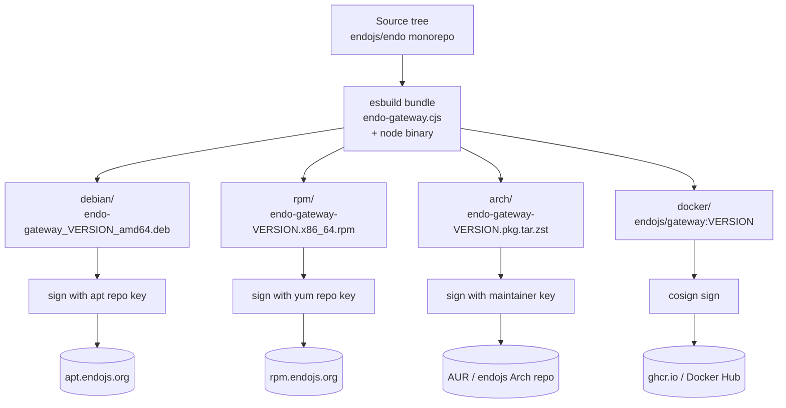

# Gateway Packaging via CI

| | |
|---|---|
| **Created** | 2026-05-22 |
| **Updated** | 2026-05-23 |
| **Author** | Kris Kowal (prompted) |
| **Status** | Proposed |
| **Depends on** | [gateway-package](gateway-package.md) |

## What is the Problem Being Solved?

[`gateway-package`](gateway-package.md) § Feature 10 names the
packaging targets (deb, rpm, Arch PKGBUILD, Dockerfile) and gives a
shape skeleton (service user `endo:endo`, `/var/lib/endo-gateway/`,
systemd unit template) but defers the actual build, signing, hosting,
and release-cadence questions to a follow-up.
This design is that follow-up.

The packaging matters because the gateway is the first piece of the
Endo system intended to run **as a long-lived system service** rather
than as a per-user developer process or a bundled Familiar component.
The maintainer directive frames the next step as:

> Please dispatch a designer to describe the next steps from
> implementing the Endo Gateway as pertaining to packaging for RPM,
> DEB &c, ideally using CI workflows.

A coherent packaging story needs:

1. A reproducible build pipeline that produces signed `.deb`, `.rpm`,
   PKGBUILD, and Docker artifacts from a single `git` tag.
2. A hosting story for the resulting artifact repositories (apt repo,
   yum repo, Arch user repository or third-party repo, Docker
   registry).
3. A release-cadence convention that ties the OS package version to
   the `@endo/gateway` npm version and to the Familiar-bundled
   variant's coordinate.
4. A signing model that keeps maintainer keys out of CI runners while
   still letting CI sign release artifacts.
5. An upgrade path that handles systemd-unit reload, configuration-
   schema migration, and on-disk state migration safely.

The existing repository already has the CI building blocks: a
`familiar-release.yml` workflow that matrix-builds desktop bundles for
macOS and Linux, a `ci.yml` that enforces lint / build / docs / tests
on every PR, and a release-tag-triggered upload pattern.
This design extends that pattern to OS packages.

## Scope

In scope:

- The packaging-CI workflow shape (matrix dimensions, job graph, build
  inputs, artifact outputs).
- Per-distribution packaging conventions (file layout, systemd unit,
  pre/post hooks, dependency declarations).
- Artifact signing (which keys, where they live, how CI reaches them).
- Artifact hosting (apt repo, yum repo, Docker registry).
- Release cadence and version-number coordination.
- Upgrade path (config and state migration, unit-file changes).

Out of scope (deferred to siblings or follow-ups):

- AWS-specific deployment automation
  ([`gateway-aws-deployment`](gateway-aws-deployment.md) picks this up).
- AWS-attuned Gateway variant (S3 CAS, Nitro Enclaves, Route53; see
  [`gateway-aws-attuned`](gateway-aws-attuned.md)).
- Windows packaging (no `.msi` / `.appx` / chocolatey).
  The gateway is Linux-first; Windows users run the Familiar-bundled
  variant per [`gateway-package`](gateway-package.md) § Feature 5.
- macOS packaging.
  Same rationale as Windows; the Familiar bundles the gateway for
  per-user use, and a system-service shape on macOS waits for demand.
- BSD packaging (FreeBSD ports, OpenBSD pkg).
  Track demand; revisit when a maintainer steps up.
- Implementation of `@endo/gateway` itself.
  That work is the four-phase rollout in
  [`gateway-package`](gateway-package.md) § Phased Implementation;
  the CI work this design names lands alongside phase 4.

## Build Topology

The four packaging targets are **built independently** from a common
JavaScript bundle, not stacked one on top of the other.



The common bundle is the same artifact `familiar-release.yml` already
produces: an esbuild output that bundles `@endo/gateway` and its
transitive dependencies into a single `endo-gateway.cjs` plus a
downloaded Node.js binary
([`familiar-daemon-bundling`](familiar-daemon-bundling.md) is the
reference pattern).
Each packaging job stages that bundle into the distribution's expected
layout, runs the distribution's build tool, and signs the result.

Three reasons drive the independent-build choice: portability
across distributions, blast-radius containment of signing-key
failures, and shape difference between OS packages and container
images.

- **Portability.** The distributions have different conventions for
  filesystem layout, pre/post hooks, and dependency declarations;
  the per-distribution packaging files are not derivable from one
  another.
- **Blast-radius containment.** A failure in one packaging job
  should not block the others. An apt-repo signing-key outage
  should not delay an rpm release.
- **Shape difference.** The Docker image is fundamentally a
  different artifact shape (a container image, not an OS package);
  building it from the same bundle stream rather than from a
  packaged `.deb` keeps it independent of any Debian-specific bug.

Common across all four:

- Same `@endo/gateway` source tree, same git tag, same Node.js binary
  version pin.
- Same systemd unit template (per
  [`gateway-package`](gateway-package.md) § Feature 10 sketch).
- Same data directory layout
  (`/var/lib/endo-gateway/`, `/run/endo-gateway/`,
  `/etc/endo-gateway/`).

## CI Workflow Shape

A new workflow file `.github/workflows/gateway-release.yml` mirrors
the `familiar-release.yml` shape: tag-triggered, matrix-build, signed
artifact upload.

```yaml
name: Gateway Release

on:
  workflow_dispatch:
    inputs:
      version:
        description: 'Release version (e.g. 0.1.0)'
        required: false
        type: string
  push:
    tags:
      - 'gateway-v*'

permissions:
  contents: write
  packages: write    # for ghcr.io push
  id-token: write    # for cosign keyless signing

jobs:
  bundle:
    name: Build bundle
    runs-on: ubuntu-latest
    steps:
      # corepack + Node 22 + yarn install --immutable
      # yarn workspace @endo/gateway step:bundle
      # upload bundle artifact

  package:
    needs: bundle
    strategy:
      matrix:
        include:
          - target: deb
            runner: ubuntu-latest
            arch: amd64
          - target: deb
            runner: ubuntu-24.04-arm
            arch: arm64
          - target: rpm
            runner: ubuntu-latest
            arch: x86_64
          - target: rpm
            runner: ubuntu-24.04-arm
            arch: aarch64
          - target: arch
            runner: ubuntu-latest
            arch: x86_64
          - target: docker
            runner: ubuntu-latest
            arch: amd64,arm64

    runs-on: ${{ matrix.runner }}
    steps:
      # download bundle artifact
      # run packaging script per target
      # sign artifact
      # upload signed artifact

  publish:
    needs: package
    runs-on: ubuntu-latest
    if: startsWith(github.ref, 'refs/tags/gateway-v')
    steps:
      # push deb to apt repo
      # push rpm to yum repo
      # push PKGBUILD update to AUR
      # push docker image to ghcr.io
      # create GitHub Release with all artifacts attached
```

### Matrix dimensions

| Dimension | Values | Rationale |
|-----------|--------|-----------|
| Target | deb, rpm, arch, docker | The four packaging targets named by the parent design. |
| Architecture | amd64 / x86_64, arm64 / aarch64 | The two architectures that cover modern server fleets. Arch user repo skips arm64 (AUR convention; Arch ARM is a separate distribution). |
| Node.js LTS | One pin per gateway release (today: 22.x) | Following [`node-lts-window-watch`](../../../.garden/skills/node-lts-window-watch/SKILL.md) cadence; the gateway pins one LTS at build time and CI matrix-tests the supported range elsewhere (`ci.yml`). |

The matrix produces **7 artifacts per release**: 2 deb (amd64, arm64),
2 rpm (x86_64, aarch64), 1 PKGBUILD (Arch x86_64 only), 2 Docker tags
(amd64 and arm64, combined into a multi-arch manifest).
Each artifact carries the same version string and the same bundled
Node.js binary version.

### Triggers

- **Tag push** `gateway-v<semver>`: full pipeline runs and publishes
  artifacts.
  The tag is on the release commit on `master`; the workflow refuses
  to run on any branch other than `master`.
- **Manual dispatch with `version` input**: builds the artifacts and
  attaches them to a *draft* GitHub Release without publishing to
  the apt / yum / AUR / docker registries.
  This is the staging path: a maintainer dispatches a build, smoke-
  tests the artifacts locally, then re-runs with the actual tag.
- **PR**: a `package-smoke` job in `ci.yml` builds the deb and the
  Docker image without signing or publishing, to catch packaging
  regressions before they reach a release.
  The smoke job runs on every PR that touches `packages/gateway/`,
  `packaging/`, or `.github/workflows/gateway-release.yml`.

## Per-Distribution Conventions

### What the package guarantees

The four distribution packages diverge in their *idiomatic*
post-install hooks (Debian's `adduser --system --group`, RHEL's
`useradd --system`, Arch's `endo-gateway.install`) but converge
on the same post-install invariants. The hook is implementation
detail; the table below pins the invariant the operator can rely
on regardless of distribution:

| Invariant | Value |
|-----------|-------|
| System user | `endo` (no login shell, no home directory creation) |
| System group | `endo` |
| State directory | `/var/lib/endo-gateway/`, mode `0750`, owner `endo:endo` |
| Cache directory | `/var/cache/endo-gateway/`, mode `0750`, owner `endo:endo` |
| Runtime directory | `/run/endo-gateway/`, mode `0750`, owner `endo:endo` (created by systemd's `RuntimeDirectory=`) |
| Config directory | `/etc/endo-gateway/`, mode `0640`, owner `root:endo` |
| systemd unit | `endo-gateway.service`, enabled (deb / rpm) or operator-enabled (Arch / Docker), not started by default |

Each per-distribution hook below lands these same invariants
through its idiomatic mechanism.

### Debian / Ubuntu (`.deb`)

Layout under `packaging/deb/`:

```
packaging/deb/
  debian/
    changelog                # generated from git tag history
    control                  # package metadata, dependencies
    rules                    # build orchestration (debhelper)
    postinst                 # post-install: useradd, systemctl enable
    prerm                    # pre-remove: systemctl stop, disable
    postrm                   # post-remove: purge state on --purge
    endo-gateway.service     # systemd unit
    endo-gateway.default     # /etc/default/endo-gateway template
  build-deb.sh               # called by CI; runs dpkg-buildpackage
```

Dependencies declared in `debian/control`:

```
Package: endo-gateway
Architecture: amd64 arm64
Depends: ${shlibs:Depends}, ${misc:Depends}, adduser, systemd
Recommends: nginx | caddy | apache2 | traefik
Description: Endo Gateway: HTTP+OCapN service for the Endo distributed
 capability system. Provides virtual hosting, Git over HTTP, an
 OCapN-Noise WebSocket subprotocol, and a UDS bootstrap for local
 CapTP relay registration.
```

The `Recommends:` line lists the HTTPS terminating proxies that
[`gateway-package`](gateway-package.md) § Feature 9 expects; the
operator picks one. Debian's `|` (space-pipe-space) syntax in the
`Recommends:` field means apt installs the first available
alternate from the list; the operator's choice surfaces during
`apt install` selection rather than requiring them to edit the
control file.

Post-install hook (`debian/postinst`):

```bash
#!/bin/sh
set -e
case "$1" in
  configure)
    # Create the system user if it does not exist.
    if ! getent passwd endo > /dev/null; then
      adduser --system --group --home /var/lib/endo-gateway \
        --no-create-home --shell /usr/sbin/nologin endo
    fi
    # Ensure state and runtime directories exist with the right mode.
    install -d -o endo -g endo -m 0750 /var/lib/endo-gateway
    install -d -o endo -g endo -m 0750 /var/cache/endo-gateway
    install -d -o root -g endo -m 0640 /etc/endo-gateway
    # Enable but do not start; the operator starts after editing config.
    deb-systemd-helper enable endo-gateway.service
    ;;
esac
#DEBHELPER#
exit 0
```

The `--no-create-home` plus the explicit `install -d` separates the
user creation from the directory permissions, so a re-run of
`postinst` on an existing install does not clobber the operator's
filesystem-level customizations.

### RHEL / Fedora (`.rpm`)

Layout under `packaging/rpm/`:

```
packaging/rpm/
  endo-gateway.spec
  endo-gateway.service       # systemd unit (same content as the .deb)
  endo-gateway.sysconfig     # /etc/sysconfig/endo-gateway template
  build-rpm.sh               # called by CI; runs rpmbuild
```

The `.spec` file:

```spec
Name:     endo-gateway
Version:  %{_gateway_version}
Release:  1%{?dist}
Summary:  Endo Gateway: HTTP+OCapN service for Endo
License:  Apache-2.0
URL:      https://github.com/endojs/endo

BuildArch: %{_arch}
Requires:  systemd shadow-utils

%description
Endo Gateway provides virtual hosting, Git over HTTP, an OCapN-Noise
WebSocket subprotocol, and a UDS bootstrap for local CapTP relay
registration.

%pre
getent passwd endo > /dev/null || \
  useradd --system --no-create-home --home-dir /var/lib/endo-gateway \
          --shell /sbin/nologin endo

%post
%systemd_post endo-gateway.service

%preun
%systemd_preun endo-gateway.service

%postun
%systemd_postun_with_restart endo-gateway.service

%files
%attr(0755, root, root) /usr/bin/endo-gateway
%dir %attr(0750, endo, endo) /var/lib/endo-gateway
%dir %attr(0750, endo, endo) /var/cache/endo-gateway
%dir %attr(0640, root, endo) /etc/endo-gateway
%attr(0644, root, root) /usr/lib/systemd/system/endo-gateway.service
%config(noreplace) /etc/sysconfig/endo-gateway
```

The `%config(noreplace)` flag preserves the operator's edits to
`/etc/sysconfig/endo-gateway` on upgrade; the spec file's defaults
land as `.rpmnew` files alongside.

### Arch (`PKGBUILD`)

Layout under `packaging/arch/`:

```
packaging/arch/
  PKGBUILD
  endo-gateway.install       # pre/post hooks
  endo-gateway.service       # systemd unit
```

The `PKGBUILD`:

```bash
pkgname=endo-gateway
pkgver=__VERSION__       # CI substitutes at build time
pkgrel=1
pkgdesc='Endo Gateway: HTTP+OCapN service for Endo'
arch=('x86_64')
url='https://github.com/endojs/endo'
license=('Apache-2.0')
depends=('systemd')
backup=('etc/endo-gateway/config.toml')
install='endo-gateway.install'
source=("https://github.com/endojs/endo/releases/download/gateway-v${pkgver}/endo-gateway-${pkgver}.tar.gz")
sha256sums=('SKIP')      # CI substitutes the actual sha256 at build

package() {
  cd "${srcdir}/endo-gateway-${pkgver}"
  install -Dm0755 endo-gateway "${pkgdir}/usr/bin/endo-gateway"
  install -Dm0644 endo-gateway.service \
    "${pkgdir}/usr/lib/systemd/system/endo-gateway.service"
  install -Dm0640 config.toml.example \
    "${pkgdir}/etc/endo-gateway/config.toml.example"
}
```

Arch ARM (the separate distribution for ARM hardware) is not in scope
for the first cut; the AUR convention prioritizes `x86_64` first, and
downstream ARM repackagers handle their own platforms when AUR
packages do not ship multi-arch.

The PKGBUILD lands in the AUR under the bot identity (`endojs` AUR
account; the maintainer creates and grants the bot access at release
time).
Tag-triggered CI pushes the updated `PKGBUILD` via SSH to the AUR
git remote.

### Docker

Layout under `packaging/docker/`:

```
packaging/docker/
  Dockerfile
  docker-entrypoint.sh
  config.toml.example
```

The `Dockerfile`:

```dockerfile
FROM node:22-slim AS runtime

RUN useradd --system --uid 1000 --no-create-home \
    --home-dir /var/lib/endo-gateway \
    --shell /usr/sbin/nologin endo && \
    mkdir -p /var/lib/endo-gateway /var/cache/endo-gateway \
             /run/endo-gateway /etc/endo-gateway && \
    chown -R endo:endo /var/lib/endo-gateway /var/cache/endo-gateway \
                       /run/endo-gateway && \
    chown root:endo /etc/endo-gateway && \
    chmod 0640 /etc/endo-gateway

USER endo
WORKDIR /var/lib/endo-gateway

COPY --chown=endo:endo bundles/endo-gateway.cjs ./endo-gateway.cjs
COPY --chown=endo:endo packaging/docker/config.toml.example \
     /etc/endo-gateway/config.toml.example
COPY --chown=endo:endo packaging/docker/docker-entrypoint.sh ./entrypoint.sh

VOLUME /var/lib/endo-gateway
VOLUME /etc/endo-gateway
EXPOSE 3469

ENV ENDO_HTTP_ADDR=0.0.0.0:3469
ENTRYPOINT ["/var/lib/endo-gateway/entrypoint.sh"]
CMD ["node", "/var/lib/endo-gateway/endo-gateway.cjs"]
```

The entrypoint script copies the example config in if no config exists
yet, then `exec`s the gateway:

```bash
#!/bin/sh
set -eu
if [ ! -f /etc/endo-gateway/config.toml ]; then
  cp /etc/endo-gateway/config.toml.example /etc/endo-gateway/config.toml
fi
exec "$@"
```

Multi-arch build via `docker buildx`:

```yaml
- name: Set up Docker Buildx
  uses: docker/setup-buildx-action@v3
- name: Build and push (multi-arch)
  uses: docker/build-push-action@v6
  with:
    context: .
    file: packaging/docker/Dockerfile
    platforms: linux/amd64,linux/arm64
    push: true
    tags: |
      ghcr.io/endojs/gateway:${{ github.ref_name }}
      ghcr.io/endojs/gateway:latest
    cache-from: type=gha
    cache-to: type=gha,mode=max
```

The Docker image is pushed to **`ghcr.io/endojs/gateway`** (the
project's existing GitHub Container Registry namespace) by default.
A mirror to Docker Hub is configurable but not the default; the
maintainer's docker-hub credentials would need to land in CI secrets,
which is the kind of authorization the boatman gates per the standard
identity-switch flow.

## Signing Model

| Artifact | Key | Storage | Used by |
|----------|-----|---------|---------|
| `.deb` | Repository signing key (gpg, RSA 4096) | GitHub Secrets `APT_REPO_SIGNING_KEY` | `aptly publish` step at release time |
| `.rpm` | Repository signing key (gpg, RSA 4096) | GitHub Secrets `YUM_REPO_SIGNING_KEY` | `rpmsign --resign` step at release time |
| PKGBUILD | Maintainer key (committed sha256, AUR convention) | n/a (PKGBUILD source URLs carry their own sha256) | `makepkg --geninteg` at build time |
| Docker | Sigstore cosign keyless signature | GitHub OIDC token (no long-lived key) | `cosign sign` step after image push |

### Repository keys vs. maintainer keys

The `.deb` and `.rpm` repository keys are **repository keys**, not the
maintainer's personal key.
The repository key signs the *repository metadata* (the `Release` file
in apt, the `repomd.xml` in yum); clients trust the key, then the
metadata names the per-package sha256 sums, then the per-package
signature (if any) is verified against the package itself.
Compromising the repository key compromises the integrity of the
repository contents but does not impersonate the maintainer's
identity for non-repository purposes (commit signing, ferry pushes
under kriskowal credentials).

The repository keys are generated **once at repo bootstrap** and live
in GitHub Secrets as armored private keys.
Rotation is via the standard apt / yum trusted-key replacement: ship
a new repository key alongside the old one for one release cycle, then
remove the old one.

The Docker image uses **sigstore keyless** signing: the GitHub Actions
runner authenticates to Sigstore's Fulcio with its OIDC token, gets a
short-lived signing certificate, and signs the image with it.
The Rekor transparency log records the signature; consumers verify
with `cosign verify --certificate-identity-regexp` against the
expected workflow identity.
No long-lived signing key is stored anywhere; the OIDC chain plus the
transparency log substitutes.

**Why the asymmetry between Docker and apt / yum.** Docker's
sigstore-keyless path works because the OCI ecosystem has the
Fulcio OIDC chain plus the Rekor transparency log as the
client-side verification primitive: `cosign verify` accepts a
short-lived certificate keyed to a workflow identity, and the
transparency log makes the issuance auditable. apt and yum
clients do *not* have an analogous transparency-log verification
primitive; they verify against a published repository public key
embedded in the client's trust store. A "no long-lived signing
key anywhere" shape on apt / yum would require either
short-lived per-release keys (which would force every consumer
to re-trust on every release) or a transparency-log integration
that does not exist in apt / yum today. The asymmetry is
structural to the per-ecosystem tooling, not a choice this
design made; the repo-key shape on apt / yum is the right
fit for what those clients support.

### Why not the maintainer's personal GPG key?

The maintainer's personal GPG key (`kriskowal`) signs commits on the
canonical `endojs/endo` repository and is used by the boatman to ferry
PRs upstream.
Putting that key in CI secrets would widen the blast radius of any CI
compromise to include the maintainer's commit identity on every repo
they touch.
Repository-only keys keep the scope tight.

### Open question: keyring distribution

Where does the apt repository's public key live for *first contact* by
a Debian user?

Options:

1. `apt-key add` via `curl https://apt.endojs.org/key.gpg | sudo apt-key add -`.
   (Deprecated by Debian; modern apt rejects this.)
2. A signed-by directive in the user's `sources.list`:
   `deb [signed-by=/usr/share/keyrings/endojs.gpg] https://apt.endojs.org stable main`.
   The keyring file ships separately, downloaded once.
3. A small `endo-apt-keyring` package shipped *unsigned* via a parallel
   bootstrap repository.
   (Awkward; a chicken-and-egg shape.)

Surfaced rather than picked.
The likely answer is (2), matching modern Debian convention.

## Artifact Hosting

### Apt repository (`apt.endojs.org`)

A static apt repository generated by `aptly` on tag push, hosted on
**S3 + CloudFront** (the sibling design
[`gateway-aws-deployment`](gateway-aws-deployment.md) covers the AWS
side).
Until that AWS infrastructure lands, the bootstrap host is **GitHub
Pages** at `https://endojs.github.io/apt-repo/`, indexed via a small
`apt.endojs.org` CNAME.

Layout:

```
apt.endojs.org/
  dists/
    stable/
      main/
        binary-amd64/
          Packages
          Packages.gz
        binary-arm64/
          Packages
          Packages.gz
      Release
      Release.gpg
      InRelease
  pool/
    main/
      e/
        endo-gateway/
          endo-gateway_0.1.0_amd64.deb
          endo-gateway_0.1.0_arm64.deb
```

The release workflow runs `aptly repo add`, `aptly publish update`,
then `aws s3 sync` (or `git push gh-pages` during the bootstrap
phase).

### Yum repository (`rpm.endojs.org`)

A static yum repository generated by `createrepo_c` on tag push,
same hosting story as apt.

```
rpm.endojs.org/
  endo-gateway/
    x86_64/
      endo-gateway-0.1.0-1.el9.x86_64.rpm
      repodata/
        repomd.xml
        repomd.xml.asc
    aarch64/
      ...
```

A `endo-gateway.repo` file at the repo root lets users install with:

```sh
sudo dnf config-manager --add-repo https://rpm.endojs.org/endo-gateway.repo
sudo dnf install endo-gateway
```

### Arch (AUR)

The PKGBUILD lives in the AUR under the `endo-gateway` package name.
The CI workflow pushes updates to the AUR via SSH on tag push.
Users install with their AUR helper of choice (`yay`, `paru`, etc.).

### Docker (`ghcr.io/endojs/gateway`)

Push to GitHub Container Registry on tag push, tagged with the version
and `latest`.
A multi-arch manifest lets `docker pull ghcr.io/endojs/gateway:latest`
work transparently on amd64 and arm64 hosts.

## Release Cadence

### Version coordinate

The OS package version **matches** the `@endo/gateway` npm package
version exactly.
A release of `@endo/gateway@0.1.0` produces:

- `endo-gateway_0.1.0_amd64.deb`
- `endo-gateway-0.1.0-1.fc40.x86_64.rpm`
- `endo-gateway 0.1.0-1` (Arch)
- `ghcr.io/endojs/gateway:0.1.0`

The git tag is `gateway-v0.1.0`, matching the `familiar-v*` tag
convention.

The Familiar-bundled variant
([`gateway-package`](gateway-package.md) § Feature 5) carries the same
`@endo/gateway` version as its dependency in the Familiar's bundle;
Familiar releases name the gateway version in the release notes.

### Frequency

The first cut is **on-demand, maintainer-tagged**.
Once the gateway lands in the wild and a regular cadence is justified,
move to a monthly release on the last Tuesday of each month (the
established pattern for upstream Linux distribution packages).
Pinning the cadence here is premature; the design records the seam.

### Channels

Two channels in the apt and yum repositories:

- `stable` (default): tagged releases.
- `nightly` (opt-in): built nightly from `master` HEAD, version
  `0.0.0-nightly.YYYYMMDD.SHA`.

The nightly channel is for developers and integrators; the stable
channel is for production deployments.
Both go through the same packaging matrix; the nightly job is a
scheduled-cron variant of the release workflow that skips the GitHub
Release upload.

## Upgrade Path

### systemd unit reload

The gateway is **not designed to hot-reload** in the first cut.
A package upgrade triggers `systemctl restart endo-gateway.service`
via the package's post-upgrade hook (`%systemd_postun_with_restart`
on rpm, `dh_installsystemd --restart-after-upgrade` on deb).

A graceful-restart story (drain in-flight requests, hand-off the
listening socket to the new process via `systemd`'s socket-activation
mechanism) is **deferred** to a follow-up design once the gateway has
real production traffic.
Surfaced as Open Question 3 below.

### Configuration migration

The configuration file at `/etc/endo-gateway/config.toml` carries a
top-level `schema_version` field.
The gateway reads it on startup and applies migration shims for older
schema versions up to the current.
The package install lays down a `config.toml.example` reflecting the
current schema; the operator merges by hand on schema changes (a
config-conflict marker file at `/etc/endo-gateway/config.toml.dpkg-dist`
or `.rpmnew`).

A future `endo-gateway config migrate` subcommand would automate
the merge; deferred to follow-up.

### State migration

The gateway's on-disk state at `/var/lib/endo-gateway/` carries a
**state version** in `/var/lib/endo-gateway/STATE_VERSION` (a single
integer).
The gateway refuses to start if `STATE_VERSION` is higher than its
own (forward-incompatible downgrade) or if a downward migration step
is missing.
Upward migrations run automatically on startup, recording each step
to a `migrations.log` adjacent to the state.

State here is the multi-tenant CAS and the relay registration table,
whose schemas are defined in [`gateway-package`](gateway-package.md)
and are referenced rather than re-defined here. The per-account
resource ledger is **deliberately excluded** from the set of
versioned state this design plans a migration for: its schema is
**not** defined in [`gateway-package`](gateway-package.md) — Feature
1b there defers the ledger (no schema, no CapTP surface) to an
unwritten follow-up design. This design therefore does not version a
schema that does not yet exist; when the follow-up lands the ledger's
schema, the ledger joins the versioned-state set and this migration
story is extended to cover it. Until then, `STATE_VERSION` covers
only the CAS and the relay table.

### sqlite (or sibling) database

The state ledger backs onto a local sqlite file at
`/var/lib/endo-gateway/state.db` for the first cut.
Sqlite's `PRAGMA user_version` carries the schema version; the
gateway's startup-time migration step bumps it through registered
migrations.
The AWS-attuned variant
([`gateway-aws-attuned`](gateway-aws-attuned.md)) replaces sqlite with
a cloud-native equivalent (DynamoDB, Aurora Serverless, or RDS
Postgres); that swap is invisible to the packaging layer because the
state-store abstraction lives in `@endo/gateway`'s code, not in the
package's filesystem layout.

## Dependencies

| Design | Relationship |
|--------|--------------|
| [gateway-package](gateway-package.md) | **Parent design.** Feature 10 (OS packaging) names the shape; this design picks the build topology, signing model, hosting, cadence, and upgrade path. |
| [gateway-bearer-token-auth](gateway-bearer-token-auth.md) | Per-deployment bearer-token configuration ships in `/etc/endo-gateway/config.toml`; package installs a `config.toml.example` only. |
| [familiar-daemon-bundling](familiar-daemon-bundling.md) | Reference for the esbuild bundle shape the gateway packages consume; same `step:bundle` pattern. |
| [familiar-bundled-agents](familiar-bundled-agents.md) | Sibling bundling pattern; gateway packaging follows the same Node.js binary download approach. |
| [ci-no-npm-lifecycle](ci-no-npm-lifecycle.md) | The packaging workflow inherits the `YARN_ENABLE_SCRIPTS=false` posture; lifecycle scripts run in no packaging job. |
| [daemon-docker-selfhost](daemon-docker-selfhost.md) | Prior Docker design for the daemon (port 8920, `ENDO_ADDR`); this design's Docker image is the gateway counterpart (port 3469, `ENDO_HTTP_ADDR`). The two coexist during the transition; long-term the daemon container embeds the gateway and the standalone gateway image is the system-service variant. |
| [gateway-aws-deployment](gateway-aws-deployment.md) | **Stacked sibling.** Consumes this design's signed artifacts and deploys them to AWS. The artifact contract (what filenames, what signatures, what registry URLs) is the seam. |
| [gateway-aws-attuned](gateway-aws-attuned.md) | **Stacked grandchild.** The AWS-attuned variant of the gateway whose state backend (S3 + DynamoDB) replaces the local sqlite this design's packages install. |

## Phased Implementation

**Phase A**: deb + Docker only. The two most common shapes for first
adopters. CI workflow lands with the `deb` and `docker` matrix
entries; rpm, arch deferred. Hosting bootstraps on GitHub Pages
(`endojs.github.io/apt-repo/`) and ghcr.io.

**Phase B**: rpm matrix entry added. yum repo bootstraps on GitHub
Pages alongside apt.

**Phase C**: PKGBUILD added; AUR push step added. Arch users
serve themselves.

**Phase D**: hosting moves from GitHub Pages to S3 + CloudFront
(provisioned by [`gateway-aws-deployment`](gateway-aws-deployment.md)).
The `apt.endojs.org` and `rpm.endojs.org` CNAMEs flip; old GitHub
Pages URLs serve `301 Moved Permanently` for one release cycle.

Phases A through C run inside the parent design's Phase 4; the
packaging-CI work is the last work before the gateway ships to OS
package consumers.
Phase D depends on
[`gateway-aws-deployment`](gateway-aws-deployment.md) landing first.

## Design Decisions

1. **Independent build per distribution, common bundle source.**
   The deb / rpm / arch / docker jobs each build from the same
   esbuild output, in parallel, with no inter-dependency.
   A failure in one does not block the others.

2. **Tag-triggered, with a manual-dispatch staging path.**
   `gateway-v<semver>` tags fire the full pipeline; manual dispatch
   stages a draft GitHub Release without publishing to repos.
   This matches the existing `familiar-release.yml` pattern and lets
   the maintainer smoke-test a build before publishing.

3. **Per-repository signing keys, not the maintainer's personal key.**
   The apt and yum repos sign with dedicated keys stored in GitHub
   Secrets.
   Compromising a CI runner compromises a repository, not the
   maintainer's commit identity.

4. **Sigstore keyless signing for Docker images.**
   No long-lived Docker signing key to manage; the OIDC chain plus
   Rekor transparency log is the signature.
   Consumers verify with `cosign verify --certificate-identity-regexp`.

5. **OS package version exactly matches `@endo/gateway` npm version.**
   No drift, no per-distribution version games.
   One tag, one version, four artifacts.

6. **Linux-first; Windows and macOS via Familiar.**
   The gateway is intended as a system-service deployment shape.
   Windows and macOS users run the Familiar-bundled variant.
   This decision can be revisited once a system-service shape on
   either platform has demand.

7. **Sqlite as the local state backend for the first cut.**
   Sqlite is in the standard library on every Linux distribution
   (no extra package dependency), `PRAGMA user_version` covers
   migration metadata, and the AWS-attuned variant
   ([`gateway-aws-attuned`](gateway-aws-attuned.md)) replaces it
   transparently to the packaging layer.

## Open Questions

1. **Keyring distribution for first contact.**
   How does a Debian user trust the apt repository's signing key
   the first time?
   The `signed-by` directive plus a downloaded keyring file is the
   likely answer; named under § Signing Model.

2. **Long-term storage of repository signing keys.**
   GitHub Secrets is the bootstrap.
   AWS Secrets Manager (per
   [`gateway-aws-deployment`](gateway-aws-deployment.md)) is the
   likely long-term home, with CI pulling the key at job start.
   Pinning the migration to Secrets Manager waits for the AWS
   deployment landing.

3. **Graceful restart via systemd socket activation.**
   The first cut restarts hard.
   A socket-activation hand-off lets the new process pick up the
   listening socket while the old process drains in-flight
   requests; deferred to a follow-up.

4. **Per-distribution post-install systemd defaults.**
   Should the package enable the service by default (start on next
   boot) or leave the operator to enable explicitly?
   The `.deb` post-install enables but does not start; the `.rpm`
   `%systemd_post` macro is the same convention.
   Arch and Docker do not enable automatically (Arch follows the
   "operator decides everything" convention; Docker has no systemd
   in the container).
   Surfaced because it diverges per distribution; the answer is
   "match distribution convention" but the design could pin a
   uniform answer if the maintainer prefers.

5. **Release cadence frequency.**
   On-demand for the first cut; monthly once the gateway lands in
   production.
   Pinning the cadence here is premature; revisit after the first
   six releases.

6. **`nightly` channel security implications.**
   Nightly builds are unsigned-by-maintainer (CI signs with the
   repo key, same as stable).
   Consumers of `nightly` accept the trade-off explicitly; the docs
   warn loudly.
   Is that warning sufficient or should `nightly` use a *different*
   repository key so a nightly-channel compromise does not cascade
   into stable?
   Surfaced rather than picked.

## Prompt

> Please dispatch a designer to describe the next steps from
> implementing the Endo Gateway as pertaining to packaging for RPM,
> DEB &c, ideally using CI workflows. Then, stack a design on top of
> that describing automation for deploying Gateways to AWS. Consider
> also designing a Gateway attuned to AWS S3, EC2, Nitro Enclaves,
> Route53, and the appropriate analogue to sqlite for a hosted gateway
> service with a domain name.

(The full directive named three designs; this is the first.
See [`gateway-aws-deployment`](gateway-aws-deployment.md) for the
second and [`gateway-aws-attuned`](gateway-aws-attuned.md) for the
third.)
