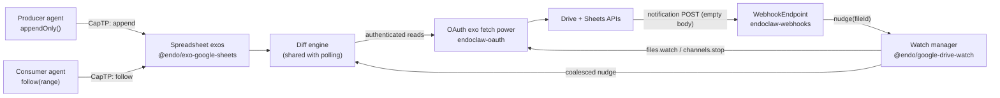

# Google Sheet pubsub: Drive push channels behind `follow`

| | |
|---|---|
| **Created** | 2026-07-07 |
| **Author** | Kris Kowal (prompted) |
| **Status** | Proposed |

## Summary

This is the push phase that [exo-google-sheets](exo-google-sheets.md)
deferred (its Resolved Question 2 and Implementation Phase 5): replace the
polling timer behind the existing `follow(range)` async-iterator contract
with Google Drive `files.watch` push notification channels, delivered
through the public webhook endpoints that
[endoclaw-webhooks](endoclaw-webhooks.md) provides.

The load-bearing decision: push notification is **not a mode of
`@endo/exo-google-sheets`**. It is a small, plain substrate package,
**`@endo/google-drive-watch`** (`packages/google-drive-watch/`), that owns
the Google channel model (arming, expiration, replacement, validation,
deduplication) for every watcher in the Drive family, plus a thin
integration inside `@endo/exo-google-sheets` that converts the substrate's
*nudges* into the range diffs `follow` already yields. Consumers cannot
tell push from polling except by latency; the `follow` contract, the
`RangeChange` shape, and the attenuation lattice are untouched.

A Drive push notification says *that* a file changed, never *what*
changed, and its body is empty by specification. So push does not replace
the read path; it replaces the timer. The notification is treated strictly
as an unauthenticated **nudge** that triggers the same
authenticated-read-and-diff step polling performs, which makes spoofed or
replayed webhooks harmless by construction: the worst a forger can cause
is a rate-limited re-read.

The motivating workload is the **sheet as queue** that the parent design's
permission lattice was split for: `appendOnly()` producers and
`readOnly()`/`follow()` consumers sharing one sheet with no overlapping
authority. A queue is exactly where polling hurts (latency bounded by the
poll interval, read quota burned while idle) and push shines (latency in
seconds, reads only on change).

## What is the Problem Being Solved?

[exo-google-sheets](exo-google-sheets.md) ships `follow(range)` by
polling: re-read the range every interval (default 30s), diff against the
last snapshot, yield on difference. That is correct and simple, but:

- **Latency.** A queue consumer sees a new row up to a full poll interval
  after the producer appended it. Shortening the interval trades directly
  against quota.
- **Idle cost.** Polling spends read quota proportional to followers ×
  frequency even when nothing changes. The in-exo token bucket accounts
  for it, but the budget is shared with real reads.
- **Fan-in.** Every follower of every range of every spreadsheet ticks its
  own timer. N followers of one busy sheet should cost one change signal,
  not N independent polls.

Google's push model fixes the trigger but nothing else: Drive API
notification channels (`files.watch`) POST to a public HTTPS address when
a watched file changes. The channels are short-lived (default 3600
seconds, maximum 86400 seconds for the `files` resource) and there is no
renewal call; an expiring channel must be replaced by a fresh `watch`
(Drive API push guide, § Renewing notification channels). Notifications
carry only headers; the body is empty (same guide, § Receive
notifications). So a real design owes answers to four things the API
leaves open, and those answers are this document: channel lifecycle,
delivery routing, the read-to-learn-what-changed step, and fan-out to
many followers.

## Where Pubsub Lives

Three placements were on the table; the first is chosen:

1. **A shared substrate package, `@endo/google-drive-watch`** (chosen).
   The channel model is not Sheets-specific: the same `watch` /
   notification / `channels/stop` protocol covers every Drive file kind
   (Sheets, Docs, Slides, plain files) and the Google Calendar API uses
   the same channels resource. Any future Docs or Calendar connector
   needs the identical arming, replacement, validation, and deduplication
   bookkeeping. Writing it once, with no Sheets knowledge, is the layering
   the parent design's Design Decision 8 calls for: the diff step is
   domain-specific, the nudge step is not.
2. *A mode of `@endo/exo-google-sheets`* (rejected). Buries reusable
   channel bookkeeping inside one connector; the Docs sibling would copy
   it. The parent design already resolved this direction ("push is not a
   mode of this package", Resolved Question 2).
3. *A daemon/gateway feature* (rejected). The gateway's job ends at
   delivering webhook POSTs ([endoclaw-webhooks](endoclaw-webhooks.md));
   teaching it Google channel semantics would couple the generic webhook
   substrate to one vendor's protocol.

`@endo/google-drive-watch` carries **no `exo-` prefix** deliberately: its
consumer is host-side composition code (the same code that composes
`makeSheetsClient` over an `OAuth` fetch power), not agents over CapTP. It
exports no passable surface; the passable surface stays `follow` on the
already-designed facets. Like `@endo/google-sheets` it is pure ECMAScript
with injected powers, testable with a stub fetch and synthetic
notification records.

## Architecture



One watch manager instance serves one OAuth credential (one Google
project/account surface). It maintains at most one active channel per
watched `fileId` regardless of how many followers that file has; followers
multiplex through the diff engine, not through Google.

## Channel Lifecycle

The substrate package owns the full lifecycle. All Google-facing calls go
through the injected fetch power (an [endoclaw-oauth](endoclaw-oauth.md)
`OAuth` exo's fetch in production), so the watch manager never sees a
token.

```ts
// Plain (non-exo) surface, consumed by host-side composition code.
type Unwatch = () => Promise<void>;
interface DriveWatchManager {
  // Refcounted: first watcher of a fileId arms a channel; last unwatch
  // stops it (after a linger, to ride out follow-churn).
  watch(fileId: string, onNudge: (nudge: DriveNudge) => void): Unwatch;
  // Called by the webhook delivery adapter for every incoming POST.
  deliver(headers: Record<string, string>): DeliverResult;
  stopAll(): Promise<void>;   // teardown / credential revocation
}
type DriveNudge = {
  fileId: string;
  state: 'update' | 'add' | 'remove' | 'trash' | 'untrash';
  changed?: string[];         // X-Goog-Changed: content, properties, ...
  messageNumber: number;
};
type DeliverResult = { ok: boolean, reason?: 'unknown-channel' | 'bad-token' | 'stale-replay' };
```

- **Arming.** `POST /drive/v3/files/<fileId>/watch` with
  `{ id, type: 'web_hook', address, token, expiration }` per the Drive API
  push guide, § Create a notification channel. `id` is a fresh UUID per
  channel (the guide caps it at 64 characters); `token` is a fresh
  per-channel secret (capped at 256 characters); `address` is the
  [endoclaw-webhooks](endoclaw-webhooks.md) endpoint URL; `expiration`
  requests the maximum (now + 86400000 ms), since Google clamps rather
  than rejects. Google answers with the assigned `resourceId` and actual
  expiration, then POSTs a `sync` notification (`X-Goog-Resource-State:
  sync`, message number 1) confirming the channel is live.
- **Replacement, not renewal.** There is no renew call; the manager
  schedules a replacement at expiration minus a safety margin (default 30
  minutes) via an injected timer power. The replacement channel (fresh
  `id`, fresh `token`) is armed first; only after its `sync` arrives is
  the old channel released with `POST /drive/v3/channels/stop`
  (`{ id, resourceId }`). The overlap window means both channels may
  deliver the same change; the nudge path is level-triggered, so
  duplicates cost nothing (see § Delivery).
- **Durability.** Channel records (`fileId`, `channelId`, `resourceId`,
  `token`, `expiration`) persist in the daemon formula state alongside the
  `google-sheet` formula the parent design's Phase 3 introduces. On daemon
  restart the manager stops every recorded channel it no longer wants and
  re-arms fresh ones for current followers. If state is lost entirely,
  orphaned channels self-expire within 24 hours and their notifications
  are dropped as `unknown-channel`, so the failure mode is stray POSTs for
  a bounded window, not corruption.
- **Backstop polling stays.** Google's delivery is best-effort from the
  receiver's perspective (retries with exponential backoff only on
  500/502/503/504 responses, everything else counts as delivered; guide,
  § Receive notifications). Rather than reason about lost notifications,
  the diff engine keeps its poll timer at a long backstop interval
  (default 300s when push is armed, against 30s pure-polling), bounding
  staleness even if a channel silently dies. The control facet's
  `setPollIntervalMs` keeps its meaning; a new
  `setPushBackstopIntervalMs` tunes the armed-mode backstop.

## Delivery: webhook POST to nudge

[endoclaw-webhooks](endoclaw-webhooks.md) gives each webhook a formula, a
stable URL, and delivery of payloads "as inbox messages" to the owning
agent. For this consumer, two adjustments matter, one of which is a
proposed refinement to that design:

- **Machine delivery.** Drive nudges are frequent, empty, and
  machine-consumed; materializing each as a durable inbox message an agent
  must `follow` and dismiss is mailbox clutter and write amplification.
  Proposed: `endoclaw-webhooks` grows a second delivery mode where a
  webhook is bound at creation to a **handler capability** (the watch
  manager's `deliver`), invoked per POST with headers and body, no inbox
  materialization. Until that lands, an adapter that `follow`s the
  webhook's inbox and forwards to `deliver` works unchanged; the shape of
  `deliver` is the same either way. This mirrors the endoclaw-oauth
  refinement follow-up the parent design posted: the substrate design gets
  a consumer-driven requirements pass (tracked as this document's Open
  Question 1; job to be filed on acceptance).
- **Validation before trust, and no trust after validation.** `deliver`
  looks up the channel by `X-Goog-Channel-ID`, compares
  `X-Goog-Channel-Token` against the stored per-channel secret
  (constant-time), and drops anything unknown or mismatched. Replays and
  out-of-order deliveries are collapsed via `X-Goog-Message-Number`
  monotonicity per channel. But validation only gates *whether to nudge*:
  no header content ever reaches a follower. The data plane is exclusively
  the authenticated read in the diff step, so the webhook surface (which
  any internet host can POST to) has no path to inject values, ranges, or
  ordering into a consumer. A successful forgery of channel id and token
  achieves a spurious, throttled re-read.
- **Respond fast, always 200.** The gateway answers success immediately
  after validation regardless of nudge outcome, so Google never enters
  backoff against the endpoint on behalf of a slow diff.

## Read-to-learn-what-changed, and Fan-out

The notification names a `fileId` (spreadsheet), never a tab, range, or
value. Producing `RangeChange` events therefore reuses the polling
implementation's snapshot-diff engine wholesale; push and polling are two
triggers of one code path:

1. **Coalesce.** Nudges for a file are collapsed with a short quiet window
   (default 2s, tunable) so an editing burst (or the replacement-channel
   overlap) triggers one refresh, not one per POST. A refresh already in
   flight marks a follow-up refresh dirty rather than stacking.
2. **Read once per file, not per follower.** The refresh gathers the
   followed ranges of that spreadsheet across all followers (all facets,
   all agents), dedupes and merges overlaps, and issues one
   `values.batchGet` through the existing throttle.
3. **Diff per follower.** Each follower's slice is compared against its
   last snapshot; changed followers get a `RangeChange` on their iterator,
   unchanged followers get nothing. A nudge whose refresh finds no
   observable diff (a change outside every followed range, or a
   formatting-only change) yields no events, which is exactly the
   level-triggered semantics polling already has.

Fan-out is thus two-stage by construction: Google delivers one
notification per channel per change, and the diff engine multiplies it
into per-follower events locally. Followers on the same range cost one
read; followers on disjoint tabs cost one batched read. Nothing about
multiple followers touches the channel count, which stays at one per
watched file.

For hosts watching **many** spreadsheets under one credential, one channel
per file is O(files) channels to keep armed. The Drive `changes.watch`
variant (one channel for the whole account's change feed, consumed with
`changes.list` page tokens) collapses that to a single channel at the cost
of account-wide change visibility and an extra listing step to map a
change onto a watched file. That is the right shape for a busy
`SheetsService`-rooted deployment and the wrong default for the common
one-spreadsheet grant (it reads more than the grant is about). It is
specified as a substrate mode but deferred to Phase 4.

## The queue, end to end

The sheet-as-queue pattern the parent design motivates, assembled from
already-designed parts plus this document:

- The host grants the producer an `appendOnly()` appender scoped to
  `'Queue'` and the consumer a `readOnly()` facet plus
  `follow('Queue!A:C')` on the same tab. Neither can do the other's job;
  neither knows the other exists.
- The producer appends rows; each carries a producer-minted idempotency
  key column (a UUID), because delivery to the consumer is
  **at-least-once**: a restart replays the diff against the last durable
  snapshot, and a coalesced refresh can batch several appends into one
  `RangeChange`.
- The consumer treats each `RangeChange` as "rows beyond my checkpoint",
  processes idempotently by key, and advances its checkpoint. The
  checkpoint lives with the consumer (its own durable state), or, when
  progress should be visible in the sheet itself, in a cursor cell the
  consumer holds a separate range-scoped writer for. Competing consumers
  (work-sharing, not fan-out) additionally need a claim column and
  range-scoped write authority; that is a consumer pattern over these
  primitives, not new mechanism, and is deliberately left as a package
  README recipe (parent design Phase 4's worked example upgrades to this).
- Latency: producer append to consumer wakeup is Google's notification
  delay plus the coalescing window, typically low single-digit seconds,
  against up to a full poll interval today. Idle cost: zero reads while
  no one appends, against a read per poll per follower today.

## Scopes and preconditions

- **A Drive scope rides along.** `files.watch` and `channels.stop` are
  Drive API calls; the Sheets scopes on the parent design's token do not
  cover them. The `OAuth` exo backing a push-armed connector must carry a
  Drive scope adequate for `watch` on the granted file and
  `setAllowedPaths` patterns extended with exactly
  `/drive/v3/files/<spreadsheetId>/watch` and `/drive/v3/channels/stop`,
  keeping the path pinning per-spreadsheet. Choosing the narrowest
  sufficient scope (`drive.file` where the app's relationship to the file
  qualifies, otherwise a metadata-read scope) is pinned at implementation
  time against live API behavior (Open Question 2).
- **A reachable, honestly-certified endpoint.** Google delivers only to
  HTTPS addresses with a certificate a public CA signed (guide, § Receive
  notifications); a self-hosted daemon behind
  [daemon-docker-selfhost](daemon-docker-selfhost.md) plus
  [gateway-bearer-token-auth](gateway-bearer-token-auth.md) needs a real
  certificate on the gateway host. The current guide imposes no domain
  ownership verification for `web_hook` addresses; older guidance did, so
  the Phase 3 bring-up verifies operationally and documents what the
  console actually requires (Open Question 3).
- **Push is progressive enhancement.** A daemon with no public endpoint,
  no Drive scope, or no webhook substrate simply keeps polling `follow`;
  arming push is host composition (inject a watch manager into
  `makeExoSpreadsheet`), never a consumer-visible capability change.

## Dependencies

| Design | Relationship |
|--------|-------------|
| [exo-google-sheets](exo-google-sheets.md) | **Parent.** Defines the `follow(range)` contract, `RangeChange`, the polling diff engine this design re-triggers, and the sheet-as-queue facets. Push is its deferred Phase 5, designed here. |
| [endoclaw-webhooks](endoclaw-webhooks.md) | **Depends on.** The public webhook endpoint and delivery substrate; this design proposes its machine-delivery (handler-capability) refinement. |
| [endoclaw-oauth](endoclaw-oauth.md) | **Depends on.** The fetch power for `files.watch` / `channels.stop`; must admit the two Drive paths and a Drive scope. |
| [endoclaw-network-fetch](endoclaw-network-fetch.md) | **Depends on (transitively).** Origin allowlist under the OAuth exo. |
| [gateway-bearer-token-auth](gateway-bearer-token-auth.md), [daemon-docker-selfhost](daemon-docker-selfhost.md) | **Depends on (transitively).** Public reachability and TLS for the webhook address, via endoclaw-webhooks. |

## Implementation Phases

1. **`@endo/google-drive-watch` substrate (S-M).** Channel records,
   arm/replace/stop scheduling over injected fetch and timer powers,
   `deliver` validation (channel lookup, token compare, message-number
   dedupe), refcounted `watch`, durable-record hooks. Tested wholly
   against a stub fetch and synthetic notification header sets, including
   expiry-replacement overlap and restart reconciliation. No Sheets
   knowledge, no network.
2. **`@endo/exo-google-sheets` integration (S).** Refactor the polling
   `follow` internals into the shared refresh engine (coalescing, one
   batched read per file, per-follower diff) triggered by timer or nudge;
   backstop-interval and coalescing knobs on `SpreadsheetControl`. Landable
   before webhooks exist, driven by a fake nudge source in tests.
3. **Webhook binding and bring-up (S).** Compose a real
   [endoclaw-webhooks](endoclaw-webhooks.md) endpoint with the watch
   manager (inbox-follow adapter, or the handler mode if its refinement
   has landed), extend the `google-sheet` formula with channel state,
   verify the TLS/console preconditions against a live endpoint. Gated on
   endoclaw-webhooks implementation.
4. **`changes.watch` account mode (M, deferred).** Single-channel mode for
   many-file hosts behind the same `DriveWatchManager` surface, chosen by
   composition for `SheetsService`-rooted deployments.

## Design Decisions

1. **A shared plain substrate package, not a connector mode.** The channel
   model is vendor-generic across the Drive family (and the Calendar API's
   identical channels resource); one bookkeeping implementation serves
   every current and future watcher. No `exo-` prefix: it exports no
   passable surface and is consumed by host composition code only.
2. **Notifications are nudges; the data plane is always an authenticated
   read.** Forged, replayed, reordered, or duplicated webhook POSTs can
   only cause throttled re-reads. This is what makes accepting
   unauthenticated internet POSTs compatible with the connector's
   confinement story, and it costs nothing because Drive bodies are empty
   by specification anyway.
3. **Same `follow` contract, push invisible except latency.** No new
   consumer-facing capability, method, or event shape; push arms by host
   composition. The parent's Design Decision 6 promised the swap; this
   keeps it.
4. **Replace channels with overlap; never gap.** New channel armed and
   `sync`-confirmed before the old one is stopped. Duplicate delivery in
   the window is absorbed by level-triggered coalescing; a gap would be
   absorbed only by the slow backstop, so the asymmetry favors overlap.
5. **Keep a long-interval polling backstop while push is armed.** Google's
   delivery guarantees are weak (retry only on 5xx, silent channel death
   possible); a bounded-staleness backstop converts "did we miss one?"
   from a correctness question into a latency question.
6. **One channel per file, one batched read per nudge, per-follower diff
   fan-out.** Channels scale with watched files, reads scale with change
   events, events scale with interested followers. `changes.watch` is the
   deferred escape hatch when file count, not follower count, is the
   pressure.
7. **At-least-once, idempotent-consumer queue semantics.** The substrate
   does not manufacture exactly-once delivery the underlying APIs cannot
   support; the queue recipe (idempotency-key column, consumer
   checkpoint) states the contract consumers actually get.

## Open Questions

1. Should [endoclaw-webhooks](endoclaw-webhooks.md) grow the
   handler-capability delivery mode this design proposes (binding a
   webhook to a machine consumer instead of materializing inbox
   messages), and does that refinement fold into its design document
   before implementation? Proposed: yes; a refinement job against
   endoclaw-webhooks to be filed on acceptance of this design. The
   inbox-follow adapter keeps Phase 3 unblocked either way.
2. Which Drive OAuth scope is the narrowest that authorizes `files.watch`
   on a spreadsheet the host was granted but did not create (`drive.file`
   versus the metadata-read scopes versus `drive.readonly`)? To be pinned
   by live probing in Phase 3 and recorded in the package README; the
   answer changes the consent screen, not the design.
3. Does Google currently require console-side domain ownership
   verification for `web_hook` addresses, or only a publicly-trusted TLS
   certificate as the current guide states? Verified operationally at
   Phase 3 bring-up; affects self-host documentation only.
4. Should the consumer-side queue checkpoint helper (`rows beyond my
   cursor, idempotent by key column`) be codified as a small library layer
   over `follow`, or remain a README recipe? Proposed: recipe first;
   promote to a helper if a second consumer duplicates it.

## Prompt

> Propose a design for **Google Sheet pubsub**: push-based change
> notification for a Google Sheet, delivered via the Drive API
> `files.watch` channel model over the endoclaw-webhooks gateway
> substrate, plugging in behind the `follow(range)` async-iterator
> contract that `designs/exo-google-sheets.md` already defines (polling is
> the v1 implementation; this is the push phase).
>
> Cover: channel lifecycle (channels expire and must be re-armed),
> delivery fan-out to multiple followers, the read-to-learn-what-changed
> step (Drive watch says *that* a file changed, not *what*), and the
> sheet-as-queue motivation (appendOnly() producers, readOnly()/follow()
> consumers). Decide whether this is a mode of exo-google-sheets or its
> own package/design shared by all Drive-family watchers. Reference:
> designs/exo-google-sheets.md (Resolved Question 2),
> designs/endoclaw-webhooks.md.
