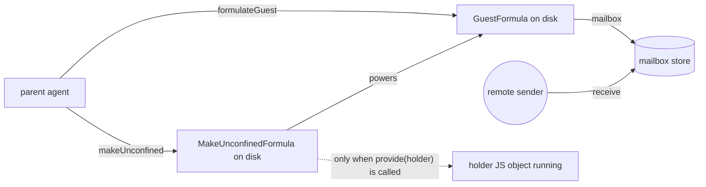
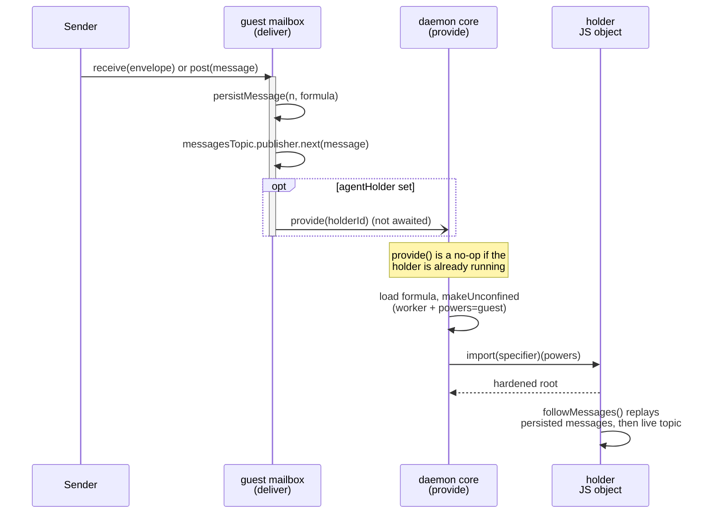

# Guest Agent Holder Reincarnation

| | |
|---|---|
| **Created** | 2026-06-22 |
| **Updated** | 2026-06-24 |
| **Author** | endolinbot (prompted) |
| **Status** | Not Started |

<!--
Heading case: the convention-named sections (Alternatives Considered,
Dependencies, Affected Packages, Test Plan, Design Decisions) keep the
title-case spellings fixed by designs/CLAUDE.md. The free-choice
headings (Background and existing model, Acceptance criteria, Open
questions) are sentence-case and consistent with each other. The two
styles coexist by design, not by oversight.
-->

## What is the Problem Being Solved?

Subagents built on top of `EndoGuest` today have a split lifecycle.
The guest formula is durable.
The guest's *holder* (the `make-unconfined` formula whose `powers` field
points at the guest, and whose JavaScript object actually runs the
subagent's loop) is *also* durable as a formula.
But the holder's in-memory object only exists once it has been
incarnated, and nothing in the daemon's wake-up path re-incarnates it
on its own when an external event lands in its powers' inbox.

The lal and fae bundled agents work around this by running their
incarnation eagerly on daemon start: an `ENDO_EXTRA` setup script runs
`E(host).makeUnconfined('@main', specifier, { powersName: '...' })` at
boot, which provides the holder if it does not already exist and
restores it if it does (see `packages/lal/setup.js`, the
`@lal` / `@fae` startup convention noted in
[`familiar-bundled-agents`](familiar-bundled-agents.md), and the
`ENDO_EXTRA` block in `daemon-node.js`).
This is fine for two named, hard-coded, top-level agents.
It does not scale to subagents that user prompts (or other guests)
create on demand and that need to survive a daemon restart without
the daemon knowing each one's specifier in advance.

The same pattern recurs in
[`lal-fae-form-provisioning`](lal-fae-form-provisioning.md):
the manager loop persists worker configs to its pet store and, on
restart, re-runs `provideGuest` plus a new `makeUnconfined` per worker
to respawn the workers from the persisted side.
Each subagent's holder is reconstructed by the *parent* on restart,
imperatively, by walking a parent-managed list.
There is no daemon-level mechanism that says *"if mail arrives for
guest G, make sure G's designated holder H is running before the mail
is observable."*

Throughout this design, to *reincarnate* a holder means to
re-instantiate the in-memory JavaScript object for a holder formula
that is still durable on disk: the formula JSON survives a restart, but
its running object does not, so reincarnation rebuilds the object from
the persisted formula.

The motivation for adding such a mechanism is the survive-restart
subagent: a guest paired with a holder formula at creation time, such
that the next message into the guest's inbox lazily reincarnates the
holder.
The parent no longer needs a restart-recovery walk; mail arrival is
itself the wake-up signal.

## Background and existing model

The relevant primitives live in `packages/daemon/src/`:

- A **guest formula** (`GuestFormula` in `src/types.d.ts`) names eight
  fields: a handle, a host-agent and host-handle, a pet store, a
  mailbox store, a mail hub, a worker, and a networks directory.
  Its construction is `makeGuest()` in `src/guest.js`.
  Its dependency lifecycle (`thisDiesIfThatDies` in `makeGuest`) ties
  the guest to seven of those (host-handle, host-agent, pet store,
  mailbox store, mail hub, worker, networks); the handle runs the
  reverse direction (the handle dies if the guest dies), and none of
  the seven names a holder.
- A **make-unconfined formula** (`MakeUnconfinedFormula`) names a
  worker, a `powers` formula identifier, a module specifier, and an
  optional env.
  Its constructor (`makeUnconfined()` in `src/daemon.js`) instantiates
  a worker, provides the powers value, and asks the worker to import
  the specifier with the powers passed as the module's argument.
  When the holder is a subagent, this `powers` field is the guest's
  formula identifier.
- The **delivery path** for messages is `deliver()` in
  `src/mail.js`.
  `deliver()` persists the message to the mailbox store and publishes
  it to the in-memory `messagesTopic`.
  Inbound messages from peers enter through `receive()` in the same
  file, which validates the envelope and then calls `deliver()`.
  The local-send path (`post()` in `src/mail.js`) is the mirror for
  same-daemon sends.
- The daemon's **memoization tables** are `controllerForId`,
  `formulaForId`, and `idForRef` in `src/daemon.js`.
  `provide()` is the function that, given a formula id, returns the
  live value, reincarnating it from disk if no controller is cached.
  Disincarnation is `cancelValue(id, reason)` (in `src/daemon.js`);
  the formula JSON stays on disk and the next `provide()` call
  rehydrates the controller.
- The convention noted in `packages/daemon/CLAUDE.md` is that
  formula JSON must be written to disk before the id is added to the
  in-memory graph, so that a failed instantiation can be retried by a
  later `provide()` call.

The shape of the existing subagent split is therefore:



The dotted edge from holder formula to running holder is the gap this
design fills: today nothing on the message-arrival path traverses it.

## Design

The relationship is named in one direction throughout this design: the
guest points at its holder through an `agentHolder` field, read as "this
guest's agent holder is H". That single field on the `GuestFormula` is
the authoritative pointer. A reciprocal `holderFor` field on the holder
formula (the reverse, "this holder is the holder for guest G") is
discussed under *Open questions* but is **not** added by this design;
the design commits to `agentHolder` (guest to holder) as the one
direction of record.

Add an optional `agentHolder` field to the `GuestFormula`.
The guest's mailbox-store delivery path (`deliver()` in `src/mail.js`)
gains a step: when `agentHolder` is set, the delivery path asks the
daemon to reincarnate the holder through an idempotent `provide(holderId)`
call (a no-op when the holder is already running; see § Reincarnation
trigger for why no separate liveness check is needed).
The hook lives inside `deliver()` (the mailbox factory already receives
`provide`), not on the guest constructor; the wording "registers a hook"
in earlier drafts overstated it, the change is one conditional inside
the existing `deliver()` body.

Correctness does not depend on the holder being alive at the instant
the message publishes. `followMessages()` (`src/mail.js`) replays the
persisted `messages` map (repopulated from disk by `loadMailboxState()`
at mailbox construction) *before* it subscribes to the live
`messagesTopic`, and `deliver()` persists the message *before* it
publishes. A holder that comes up after the publish therefore still
observes every persisted message when its `followMessages()` iterator
opens. The reincarnation hook is a *latency* mechanism, not a
*message-loss* guard: it brings the holder up promptly on the arriving
message rather than leaving the guest dormant until some later trigger.
Because correctness does not hinge on the ordering, the hook fires the
reincarnation *after* the publish and does not await it; see
§ Reincarnation trigger and § Back-pressure for why.

### Formula shape change

`GuestFormula` gains one optional field:

```ts
export type GuestFormula = {
  type: 'guest';
  handle: FormulaIdentifier;
  hostHandle: FormulaIdentifier;
  hostAgent: FormulaIdentifier;
  petStore: FormulaIdentifier;
  mailboxStore: FormulaIdentifier;
  mailHub: FormulaIdentifier;
  worker: FormulaIdentifier;
  networks: FormulaIdentifier;
  // New: optional formula id of an unconfined-style holder
  // whose `powers` field MUST point back at this guest's id.
  // When set, message arrival reincarnates the holder.
  agentHolder?: FormulaIdentifier;
};
```

The reciprocal direction is recorded for fast lookup but the *truth*
is the guest's `agentHolder`.
`MakeUnconfinedFormula` does not need to gain a `holderFor` field for
the mechanism to work; the guest holds the only authoritative pointer.
A symmetric `holderFor` field on the holder formula is discussed under
*Open questions*.

The new edge participates in `extractLabeledDeps` (in `src/daemon.js`)
as a normal labelled dependency so it appears in the retention-graph
snapshot and in `listRetentionPaths` output.
The label is `agentHolder`.

### Constructor signature change

`formulateGuest()` (in `src/daemon.js`) and the underlying
`formulateGuestDependencies` gain an optional `agentHolderId`
parameter:

```js
const formulateGuest = async (
  hostAgentId,
  hostHandleId,
  deferredTasks,
  workerLabel,
  agentHolderId, // new, optional
) => { ... };
```

If `agentHolderId` is provided, it is recorded into the
`GuestFormula.agentHolder` field at the
`formulateNumberedGuest` step (in `src/daemon.js`).
The daemon does not validate at write time that the holder's `powers`
field points back at this guest (it cannot, because the holder may
not exist yet; see *Pairing order* below).
Validation is deferred until first reincarnation; a mismatch raises a
specific error (*Holder mismatch on reincarnation*, below) and the
message arrival path falls through without invoking the holder.

The high-level entry point `EndoHost.provideGuest(petName, opts)` and
`EndoHost.makeGuest` gain a corresponding optional `agentHolder` field
on `MakeHostOrGuestOptions`.
To match the host surface, where the sibling methods (`provideMount`,
`provideScratchMount`, `storeBlob`) take pet names or name paths and
resolve them through the host's directory (`namePathFrom` /
`assertPetNamePath` in `src/host.js`), the option is spelled as a pet
name (or name path) naming the holder, not a raw formula id.
The host resolves it to the holder's id before threading it into
`formulateGuest` as `agentHolderId`.

### Pairing order

Two orderings are possible, and the design supports both:

1. **Holder-after-guest** (the simpler path).
   The parent creates the guest first with `agentHolder` unset, then
   creates the holder formula with `powers = guestId`, then issues a
   separate call (a new `EndoHost.setAgentHolder(guestName, holderName)`
   method, taking pet names to match the host surface above and
   resolving them to ids internally).
   This rewrites the guest's formula JSON on disk to add the
   `agentHolder` field.
   The field is a one-time field on a guest's lifetime: once set, it is
   immutable, and attempts to overwrite a non-empty `agentHolder` are
   rejected.
2. **Guest-after-holder** (matches lal/fae's existing shape).
   The parent first allocates a guest formula number (without
   incarnating it), then formulates the holder pointing at the
   pre-allocated guest id, then formulates the guest with
   `agentHolder` already populated.
   The daemon's `randomHex256()`-based number minting in
   `formulateGuestDependencies` is the only thing that needs to be
   exposed; the rest follows.

Both orderings end with the same on-disk state.
The first-class API is *holder-after-guest* (simplest for callers);
the second is available for callers that want atomic pairing at
formulation time.

#### Rewriting the guest formula does not change its id

The holder-after-guest path rewrites an already-persisted guest formula
in place, which deserves a word against `packages/daemon/CLAUDE.md`
§ "Disk before graph".
That invariant governs **write ordering** (the JSON must reach disk
before the id enters the in-memory graph, so a failed instantiation is
retryable); it is not a write-once rule on the JSON.
The daemon already rewrites a live formula in place elsewhere: the
`git-remote` controller's `setPolicy` path calls
`persistencePowers.writeFormula(formulaNumber, formulaNode, nextFormula)`
with the *same* number and node and then `formulaForId.set(id,
nextFormula)` to reconcile the in-memory cache. `setAgentHolder` follows
that exact pattern.

The id stays valid across the rewrite because guest formula ids are
**not content-derived**.
A guest's formula number is minted by `randomHex256()` in
`formulateGuestDependencies`, and `formatId` composes the id from that
random number plus the node number, never from a hash of the formula
JSON (`deriveId` in `src/daemon.js` hashes a path and a root nonce, not
formula content).
Adding the `agentHolder` field therefore changes the JSON but not the
number, the node, or the id, so every existing reference to the guest
(pet-store entries, `powers` pointers, retention-graph edges) continues
to resolve.
Reconciliation is the `formulaForId.set(id, nextFormula)` write under
`withFormulaGraphLock`, mirroring the `git-remote` precedent; the
retention graph then re-derives the new `agentHolder` edge from the
rewritten formula via `extractLabeledDeps`.

### Reincarnation trigger

The hook goes into the **mailbox store's deliver path**
(`deliver()` in `src/mail.js`), not into `receive()`.
`deliver()` is the single funnel through which every observable
message arrival (local-send, remote-receive, locally injected via
`deliverValueById`, and any future local-only delivery) passes.
Hooking `receive()` would miss locally-originated messages.

The hook fires `provide(holderId)` after the message is persisted and
published, and does **not** await it inside the
`mailboxStoreJobs.enqueue` critical section.
The ordering relative to the publish is not load-bearing for delivery
(§ Design establishes that `followMessages()` replays the persisted
message regardless of holder-liveness at publish time); placing the
kick-off after the publish keeps the critical-section body short and
avoids the back-pressure problem discussed below:

```js
const deliver = async envelope => {
  await mailboxStoreJobs.enqueue(async () => {
    assertMessageEnvelope(envelope);
    // 1. Persist the message first (current behavior).
    const messageNumber = nextMessageNumber;
    const date = new Date().toISOString();
    const done =
      /** @type {EnvelopedMessage & { done?: boolean }} */ (envelope).done ??
      true;
    const formula = makeMessageFormula(envelope, date, done);
    await persistMessage(messageNumber, formula);
    nextMessageNumber += 1n;
    await persistNextMessageNumber(nextMessageNumber);

    // ... existing dismissal + messages.set + messagesTopic.publisher.next ...

    // 2. NEW: if this guest has an agentHolder, ask the daemon to bring
    //    it up. provide() is idempotent (memoized on the daemon's
    //    controllerForId table): a repeat call for an already-running
    //    or already-in-flight holder returns the same controller, so no
    //    "is it running?" guard is needed here. The call is NOT awaited
    //    inside the critical section (see "Back-pressure" below).
    if (agentHolderId !== undefined) {
      void provide(agentHolderId).catch(err => {
        // Holder failed to reincarnate; see "Reincarnation failure" below.
        console.error('agent holder reincarnation failed', err);
      });
    }
  });
};
```

Only symbols in scope at the hook point appear in the sketch.
The mailbox factory `makeMailboxMaker` already receives `provide` (it
uses it throughout `src/mail.js` for promise and resolver lookups), so
the hook references only `provide` and the new `agentHolderId` (read
from the guest's formula and threaded into `makeMailbox` alongside the
other mailbox parameters).
The daemon's `controllerForId` table is **not** in `src/mail.js` scope:
it lives in `src/daemon.js` and is not among the values passed to
`makeMailboxMaker`.
Earlier drafts wrote a `controllerForId.has(agentHolderId)` guard at
this point; that symbol does not exist here.
The "is the holder already running?" decision is therefore delegated to
`provide()` itself, which is the right place for it: `provideController`
in `src/daemon.js` consults `controllerForId` synchronously and returns
the existing controller when one is present, so a `provide()` call for a
live holder is a cheap no-op and a call for an in-flight reincarnation
joins the same promise.
This keeps the design's trigger free of any daemon-internal symbol.

The trigger condition is therefore:

- The guest's mailbox has just persisted a new message, AND
- The guest's formula carries an `agentHolder`.

The liveness check that earlier drafts spelled as a
`controllerForId.has(...)` test (as opposed to a `formulaForId.has(...)`
test, since `formulaForId` caches the on-disk JSON long before any
incarnation) is exactly the memoization that `provideController` already
performs against `controllerForId`. The design relies on it rather than
re-implementing it in the mailbox.

### Back-pressure

`provide(holderId)` can take unbounded time: it instantiates a worker,
imports a module, and runs the holder's constructor, any of which can be
slow or hang.
If the hook awaited that promise **inside** the
`mailboxStoreJobs.enqueue` critical section, every later `deliver()` for
the same guest would queue behind the in-flight reincarnation, stalling
the guest's whole mailbox on a single slow or wedged holder import.

The design therefore does **not** hold the lock across `provide()`.
The hook starts the reincarnation as a fire-and-forget continuation
(`void provide(...).catch(...)`) after the message is published and lets
the critical section return immediately.
Delivery never waits on holder liveness (the message is already
persisted and on the topic), so the holder's start latency does not
back up the mailbox.

Concurrency across back-to-back messages is handled by `provide()`'s own
memoization rather than by holding the lock: the first message's
fire-and-forget `provide(holderId)` installs the controller in
`controllerForId` synchronously (`provideController` sets the entry
before resolving the value promise), so a second message's
`provide(holderId)` finds the in-flight controller and awaits the same
promise instead of starting a parallel reincarnation.
Two near-simultaneous deliveries thus still converge on one
reincarnation without the critical section serializing on it.

### Sequence



The critical section returns after the publish; the reincarnation runs
concurrently (the dashed arrow is the fire-and-forget `provide`).
The holder's `followMessages()` iterator (held against the guest's
mailbox from inside the holder loop, exactly as today) first replays the
persisted `messages` map and then drains the live topic, so it observes
the just-arrived message whether the holder came up before or after the
publish; the loop runs as if the daemon had never been restarted.

### Reincarnation failure

If `provide(holderId)` rejects (the holder formula is missing, its
worker fails to start, the holder module fails to import, the holder
constructor throws), the design **does not block delivery**.
The message was already persisted and published before the
reincarnation was even kicked off (the `provide` call is the
fire-and-forget continuation after the publish, never awaited inside the
critical section), so a rejection cannot affect the delivery that
triggered it.
The error is logged via `console.error` and a structured lifecycle-log
event (per `packages/daemon/CLAUDE.md` § Diagnostic Discipline).
A rejected reincarnation also clears the daemon's `controllerForId`
entry (the controller's `value` promise rejects and `context.cancel`
runs), so the next message arrival starts a fresh `provide(holderId)`
attempt rather than re-observing the failed one.

This matches the daemon's existing posture: a corrupted or absent
formula returns through the usual error path and the system stays
responsive.
The alternative (refusing to deliver mail until the holder is
restored) would be the *more conservative* shape; see *Open
questions* for the discussion.

### Pairing validation

On first reincarnation, the daemon reads the holder formula and
checks that its `powers` field equals the guest's own id.
If not, the daemon logs a *holder mismatch* error and treats the
agent-holder slot as inactive for the remainder of this daemon
session (the next reincarnation attempt also fails, with the same
error, until the misconfigured field is corrected).
This catches the case where someone manually edits the formula JSON
or where a future API allows setting the holder field to a non-holder
formula by mistake.

### Lifecycle once reincarnated

A reincarnated holder is indistinguishable from a freshly created
one.
The same `MakeUnconfinedFormula` controller is used; the
`thisDiesIfThatDies` edges (worker, powers, cancelWithWorker) are
attached at controller-creation time exactly as today.
The reincarnated holder participates in retention as a normal node
and is reachable from the guest along the new `agentHolder` edge in
the retention graph.

### Garbage-collection edge direction

The `agentHolder` edge is a **strong** retention edge from the guest
to the holder.
The guest formula already lives as long as the parent retains it
(via the parent's pet store, or via a sub-guest's `@host` reference,
or by virtue of being the parent's `@host` when the relation is
nested).
Adding a guest -> holder strong edge means: as long as the guest is
retained, the holder formula JSON is also retained.
The holder's *controller* is still ephemeral (created on demand);
the *formula* is durable.

The reverse direction (holder retains guest) already exists via the
`make-unconfined` `powers` field, as part of the holder formula's
own dependencies (the `make-unconfined` formula maker's
`context.thisDiesIfThatDies(powersId)` in `src/daemon.js`).

The combined effect: holder and guest form a two-node retention
cohort once paired.
Destroying either through `revoke`-style pet-name withdrawal collects
both.
This is consistent with the existing
[`familiar-bundled-agents`](familiar-bundled-agents.md) lifecycle.

### Disincarnation interplay

The holder can still be deliberately disincarnated via
`cancelValue(holderId, reason)` (for example, the existing
[`daemon-retention-paths`](daemon-retention-paths.md) Disincarnate
button, or a manual `endo cancel` invocation).
After disincarnation, the next mail arrival reincarnates the holder
again.
This is a feature: the operator can free the holder's memory at any
point, and the next message wakes it.

The design does **not** add a "disincarnate-and-disable" mode that
would block reincarnation.
Disabling reincarnation, if needed, is done by clearing the guest's
`agentHolder` field (a separate API, not in this design's scope; see
*Open questions*).

### Reincarnation race with shutdown

If the daemon receives a shutdown signal while a fire-and-forget
`provide(holderId)` is in flight, the existing shutdown sequence
(cancel topic, controller cancellation, persistence flush) tears down
the partially reincarnated holder along with everything else.
No special handling is required: the message was already persisted and
published before the `provide` was kicked off, so nothing waits on it;
the in-flight `provide` returns or rejects and its controller is
cancelled with the rest, and the next daemon start sees the persisted
message in the mailbox store with no live holder, ready for the next
external event to re-trigger reincarnation.

## Acceptance criteria

A future implementation PR's tests must demonstrate, in
`packages/daemon/test/`:

1. **Field round-trip.**
   A guest formulated with `agentHolder = H` reads back through
   `getFormulaForId` with `agentHolder === H`.
2. **Lazy reincarnation on local send.**
   Holder is paired, daemon restarted, holder controller absent.
   A local `send()` to the guest reincarnates the holder before the
   guest's `followMessages()` iterator emits the message.
   Asserted by observing the holder's exo log entry preceding the
   message-yielded entry.
3. **Lazy reincarnation on remote receive.**
   Same as (2) but the message arrives via `receive()` from a peer.
4. **Lazy reincarnation on `submit()` value delivery.**
   Same as (2) but the message arrives via
   `deliverValueById` (the form-submission path).
   This is the test that locks `deliver()` as the chosen hook point
   rather than `receive()`.
5. **No reincarnation when holder is already running.**
   Pair holder, message-send, second message-send.
   `provide(holderId)` is called once across the two sends.
6. **Pairing validation.**
   Pair guest G with holder H' whose `powers` points at a different
   guest.
   First message arrival logs the mismatch error and the message
   is still delivered (asserted by observing the message on
   `followMessages()`).
7. **Reincarnation failure does not block delivery.**
   Pair guest G with holder H whose specifier import will throw.
   First message arrival logs the import error and the message is
   still delivered.
8. **Cohort destruction.**
   Disincarnate the guest via `cancelValue(guestId, reason)`.
   The holder controller (if running) is cancelled as part of the
   same cohort.
9. **Retention path visibility.**
   `listRetentionPaths(holderId)` returns a path that traverses the
   new `agentHolder` edge (so `endo paths` and the chat paths panel
   show the pairing).
10. **Pre-existing holder + guest pattern (lal-fae) is unaffected.**
    The bundled-agents bootstrap path
    (`makeUnconfined('@main', specifier, { powersName })` without an
    `agentHolder` field) continues to work; lal and fae start on
    daemon boot exactly as today.
11. **Concurrent message arrivals.**
    Two `deliver()` calls enqueued back-to-back converge on a single
    `provide(holderId)`: the second observes the controller the first
    installed in `controllerForId` and does not start a parallel
    reincarnation. Assert one holder startup across the two sends.
12. **`setAgentHolder` rewrites a live guest formula in place.**
    Formulate a guest G (holder unset) and store it under a pet name in
    the parent, then formulate a second formula that references G by id
    (a holder with `powers = G`, plus a plain pet-store entry pointing
    at G). Call `setAgentHolder(guestName, holderName)`. Assert that
    (a) `getFormulaForId(guestId)` reads back the *same* id with the
    `agentHolder` field now present, (b) the holder's `powers` reference
    and the parent's pet-name lookup of G both still resolve to the live
    guest after the rewrite, and (c) a second `setAgentHolder` call is
    rejected because the field is already set.

## Open questions

- Should the daemon also surface a high-level method on `EndoHost` to
  unpair (clear the `agentHolder` field) without destroying the
  guest?
  The design currently treats the field as immutable once set, which
  matches the simplest mental model but may be inconvenient if a
  parent wants to swap holders.
  A future *unpair-and-rebind* API is to be filed against
  [`daemon-retention-paths`](daemon-retention-paths.md) if the
  maintainer wants the mutable-field shape.
- Should a corresponding `holderFor` field be added to the holder
  formula for symmetry?
  The current design omits it (the guest is the authoritative
  pointer).
  Adding it would make the bidirectional retention visible in both
  directions of the formula graph and would let the holder discover
  *which* guest it is the holder of without inspecting its `powers`
  field at runtime.
  Argument for: makes `endo paths` clearer when the operator stands
  on the holder side.
  Argument against: two fields can fall out of sync if one is edited
  by hand.
- Should the trigger fire on *every* message, or only the *first*
  message after a controller goes absent?
  The design fires `provide(holderId)` on every message and leans on
  `provide()`'s own memoization (a synchronous `controllerForId` lookup
  inside `provideController`) to make the repeat calls cheap no-ops; this
  is self-correcting if the holder dies mid-session.
  An alternative is a one-shot flag in the mailbox that suppresses the
  `provide()` call after the first reincarnation and is cleared on
  `cancelValue(holderId, ...)`.
  The fire-every-message form is preferred for simplicity (it adds no
  mailbox-side state) unless profiling shows the redundant `provide()`
  calls add measurable latency.
- Should reincarnation failure block message delivery rather than
  proceed?
  The design proposes proceed-and-log.
  A future maintainer may prefer the conservative shape (refuse
  delivery, log the error, surface a per-guest *holder broken* state
  visible in the Chat inventory).
  The conservative shape is straightforward to add later if the
  permissive shape proves problematic.
- Should the `agentHolder` field be restricted to holder formulas of
  type `make-unconfined`, or accept any formula whose `powers` field
  points at the guest (covering `make-archive` and `make-from-tree`)?
  The design's `extractLabeledDeps` change uses the generic
  `agentHolder` label; the reincarnation-time validation checks for a
  `powers` field.
  A future *typed holder* shape could narrow this, but the symmetric
  treatment of all three holder-family formulas seems sound.

## Alternatives Considered

Considered and rejected: a daemon-startup *holder scan* that walks
every guest with `agentHolder` set and provides the holder eagerly at
boot.
Reason: eager incarnation defeats the design's main purpose
(memory-cheap idle subagents).
Many subagents may exist; only a small subset receive mail in any
given session.
Lazy-on-mail is the right shape.

Considered and rejected: storing the pairing in the parent's pet
store (the existing lal-fae shape).
Reason: it requires every parent to implement its own restart-recovery
walk and tightly couples the parent's code to the durability of the
subagent.
The pairing is properly a property of the guest formula itself, not
of an outer manager.

Considered and rejected: blocking the publish until the holder is
alive (awaiting `provide(holderId)` *before* `messagesTopic.publisher
.next` inside the critical section) so the live holder is guaranteed to
observe the message on the topic rather than on replay.
Reason: it is both unnecessary and harmful.
Unnecessary because `followMessages()` replays the persisted `messages`
map before draining the live topic, so a holder that comes up after the
publish still observes the message; nothing is lost by publishing first.
Harmful because awaiting `provide()` inside the critical section holds
the mailbox lock across an unbounded worker spin and module import,
stalling every later `deliver()` for that guest behind one slow or
wedged holder (§ Back-pressure).
The design instead persists and publishes first, then fires
`provide(holderId)` as a fire-and-forget continuation outside the
await path.

Considered and rejected: hooking `receive()` instead of `deliver()`.
Reason: `receive()` only sees messages arriving from peers;
locally-originated sends (`post()`) and injected value deliveries
(`deliverValueById`) reach the mailbox through `deliver()` without
passing `receive()`, so a `receive()` hook would miss them.
`deliver()` is the single funnel every observable arrival passes
through.

## Dependencies

| Design | Relationship |
|--------|-------------|
| [familiar-bundled-agents](familiar-bundled-agents.md) | Origin of the eager-incarnation `ENDO_EXTRA` pattern this design generalizes for non-bundled subagents. |
| [lal-fae-form-provisioning](lal-fae-form-provisioning.md) | The current parent-managed restart-recovery shape this design replaces for sub-guests. |
| [daemon-retention-paths](daemon-retention-paths.md) | The new `agentHolder` edge participates in the retention-graph snapshot and surfaces in `endo paths` / chat paths panel. |
| [daemon-guest-eval-simplification](daemon-guest-eval-simplification.md) | The `evaluate` simplification that gave guests direct authority over their workers also tightened the holder / powers model this design extends. |

## Affected Packages

- `packages/daemon`: `src/types.d.ts` (one optional field on
  `GuestFormula`), `src/daemon.js` (`formulateGuest` /
  `formulateGuestDependencies` / `formulateNumberedGuest` /
  `extractLabeledDeps` / formula-makers dispatch / disk-write ordering /
  the new `setAgentHolder` in-place formula rewrite), `src/mail.js`
  (`deliver` post-publish reincarnation hook, plus threading
  `agentHolderId` into `makeMailbox`), `src/host.js` (one optional
  pet-name field on `MakeHostOrGuestOptions` for `provideGuest`, and the
  new `setAgentHolder` host method).
- `packages/daemon/test`: the twelve acceptance-criteria tests.
- No client-side change in `packages/cli`, `packages/chat`, or
  `packages/familiar` for this slice.
  CLI / Chat surfaces for inspecting and clearing the pairing can be
  added as a sibling design once this lands.

## Test Plan

- **Unit:** the field round-trip (criterion 1), the
  no-reincarnation-when-running branch (criterion 5), and the
  `setAgentHolder` in-place rewrite (criterion 12) are unit-testable
  directly on the daemon core.
- **Daemon integration (`test.serial`):** acceptance criteria 2-9 and
  11 spin up a full daemon, formulate a parent host, a guest, and a
  holder whose specifier is a one-shot test fixture that records its
  startup time, then exercise the various delivery paths and assert
  ordering against the recorded times.
- **Restart test:** acceptance criterion 2-4 (and a non-numbered
  variant) restart the daemon between formulation and the first
  message; the test must not call `makeUnconfined` after restart, so
  reincarnation can only come from the new mail-arrival hook.
- **Lifecycle log:** the design's diagnostic events
  (reincarnation start, holder-mismatch error, reincarnation-failure
  error) are emitted via the existing lifecycle-log channel; tests
  may grep them by pattern.

## Phased implementation

This design's surface is small enough to land in a single
implementation PR.
A phased delivery is not warranted.

## Design Decisions

1. **Hook in `deliver()`, not `receive()`.**
   `deliver()` is the single funnel through which every observable
   message arrival passes; `receive()` misses locally-originated
   messages (`post()`) and injected value deliveries
   (`deliverValueById`).
2. **The hook fires `provide()` after the publish, not before, and does
   not await it inside the mailbox critical section.**
   Delivery correctness does not depend on the holder being alive at
   publish time, because `followMessages()` replays the persisted
   `messages` map before draining the live topic; so the message is
   never lost by publishing first. Awaiting `provide()` under the lock
   would stall the mailbox on an unbounded holder import, so the call is
   a fire-and-forget continuation (§ Back-pressure).
3. **Reincarnation does not block delivery on failure.**
   The message has already been persisted and published before the
   holder is asked for; a holder-import rejection cannot affect the
   triggering delivery. Errors are logged but not surfaced to the
   sender.
4. **`agentHolder` is a single optional field on `GuestFormula`.**
   The pairing's authoritative truth lives on the guest; no
   reciprocal field is added to the holder formula.
5. **Reincarnation is fired on every message, not just the first, and
   relies on `provide()`'s own memoization.**
   `provideController` consults `controllerForId` synchronously, so a
   `provide()` call for a live or in-flight holder is a cheap no-op; the
   mailbox keeps no liveness state of its own. The benefit is
   self-correction if the holder dies mid-session.
6. **The hook does not eagerly incarnate at daemon start.**
   Subagent holders stay dormant until the first message arrives.
7. **The `agentHolder` field is immutable once set, written by an
   in-place formula rewrite.**
   `setAgentHolder` rewrites the guest's formula JSON under the same
   formula number and node (the id is not content-derived, so it does
   not change) and reconciles `formulaForId`, following the `git-remote`
   `setPolicy` precedent. Immutability keeps the surface small; a future
   mutable-field design can be filed if needed.
8. **Pairing-validation failure is logged and the slot is treated as
   inactive for the session.**
   A misconfigured holder pointer should not cause every subsequent
   message to attempt and fail reincarnation; an early hard-fail
   matches the safer-default shape.

## Prompt

> Design a modification to the daemon's guest agent formula and
> constructor methods such that:
>
> - A guest can OPTIONALLY be paired with a designated "holder" for
>   its agent powers.
> - The holder gets reincarnated (re-instantiated from its formula)
>   and given the agent as its powers if the guest receives a message
>   AND the holder is not already instantiated.
>
> The motivation: this enables creating subagents that survive a
> daemon restart. Today (presumably), a subagent's holder lives only
> in memory and dies on restart; the guest formula is durable but the
> holder it spawned is not. With this modification, message arrival
> can lazily reincarnate the holder with the guest's agent powers,
> restoring the subagent without external intervention.
