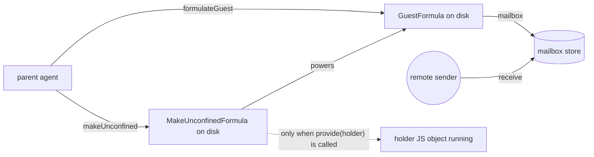
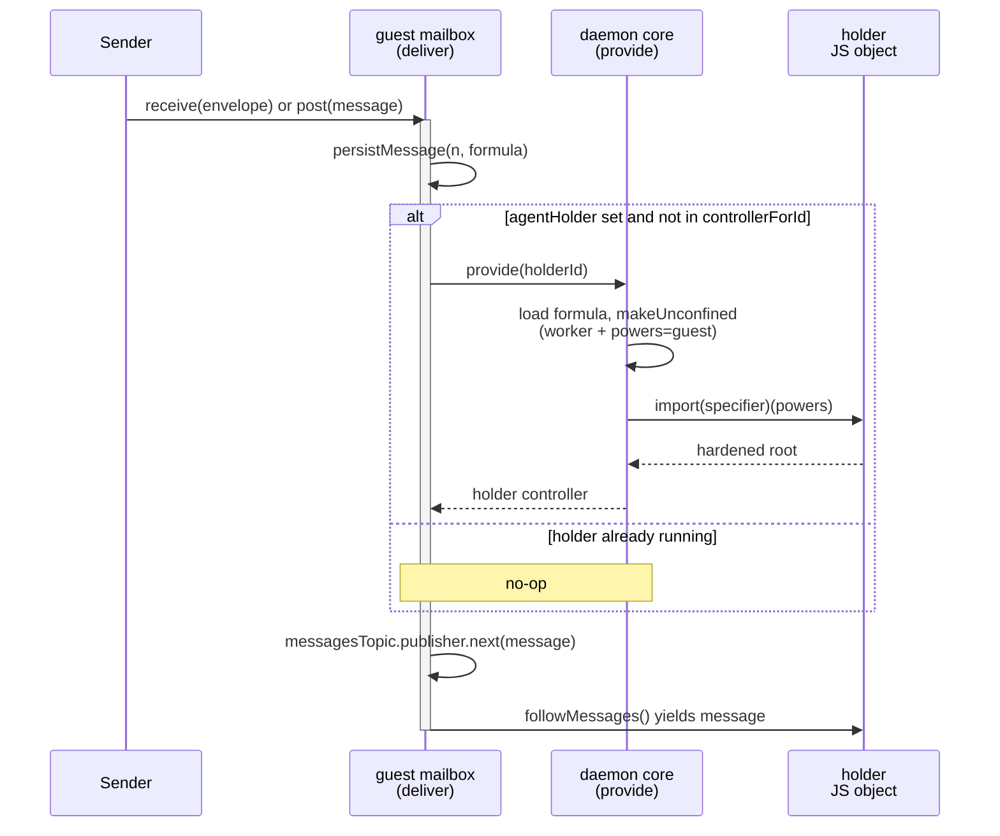

# Guest Agent Holder Reincarnation

| | |
|---|---|
| **Created** | 2026-06-22 |
| **Author** | endolinbot (prompted) |
| **Status** | Not Started |

## What is the Problem Being Solved?

Subagents built on top of `EndoGuest` today have a split lifecycle.
The guest formula is durable.
The guest's *holder* (the `make-unconfined` formula whose `powers` field
points at the guest, and whose JavaScript object actually runs the
subagent's loop) is *also* durable as a formula.
But the holder's in-memory object only exists once it has been
incarnated, and nothing in the daemon's wake-up path re-incarnates it
on its own when an external event lands in its powers' inbox.

The lal and fae bundled agents work around this by running their
incarnation eagerly on daemon start: an `ENDO_EXTRA` setup script runs
`E(host).makeUnconfined('@main', specifier, { powersName: '...' })` at
boot, which provides the holder if it does not already exist and
restores it if it does (see `packages/lal/setup.js`, the
`@lal` / `@fae` startup convention noted in
[`familiar-bundled-agents`](familiar-bundled-agents.md), and the
`ENDO_EXTRA` block at `daemon-node.js:205`).
This is fine for two named, hard-coded, top-level agents.
It does not scale to subagents that user prompts (or other guests)
create on demand and that need to survive a daemon restart without
the daemon knowing each one's specifier in advance.

The same pattern recurs in
[`lal-fae-form-provisioning`](lal-fae-form-provisioning.md):
the manager loop persists worker configs to its pet store and, on
restart, re-runs `provideGuest` plus a new `makeUnconfined` per worker
to respawn the workers from the persisted side.
Each subagent's holder is reconstructed by the *parent* on restart,
imperatively, by walking a parent-managed list.
There is no daemon-level mechanism that says *"if mail arrives for
guest G, make sure G's designated holder H is running before the mail
is observable."*

The motivation for adding such a mechanism is the survive-restart
subagent: a guest paired with a holder formula at creation time, such
that the next message into the guest's inbox lazily reincarnates the
holder.
The parent no longer needs a restart-recovery walk; mail arrival is
itself the wake-up signal.

## Background and existing model

The relevant primitives live in `packages/daemon/src/`:

- A **guest formula** (`GuestFormula` in `src/types.d.ts`) names a
  handle, a host-agent and host-handle, a pet store, a mailbox store,
  a mail hub, a worker, and a networks directory.
  Its construction is `makeGuest()` in `src/guest.js`.
  Its dependency lifecycle (`thisDiesIfThatDies`) ties it to those
  six dependencies but does not name a holder.
- A **make-unconfined formula** (`MakeUnconfinedFormula`) names a
  worker, a `powers` formula identifier, a module specifier, and an
  optional env.
  Its constructor (`makeUnconfined()` in `src/daemon.js`) instantiates
  a worker, provides the powers value, and asks the worker to import
  the specifier with the powers passed as the module's argument.
  When the holder is a subagent, this `powers` field is the guest's
  formula identifier.
- The **delivery path** for messages is `deliver()` in
  `src/mail.js`.
  `deliver()` persists the message to the mailbox store and publishes
  it to the in-memory `messagesTopic`.
  Inbound messages from peers enter through `receive()` in the same
  file, which validates the envelope and then calls `deliver()`.
  The local-send path (`post()` in `src/mail.js`) is the mirror for
  same-daemon sends.
- The daemon's **memoization tables** are `controllerForId`,
  `formulaForId`, and `idForRef` in `src/daemon.js`.
  `provide()` is the function that, given a formula id, returns the
  live value, reincarnating it from disk if no controller is cached.
  Disincarnation is `cancelValue(id, reason)` (`src/daemon.js`
  near line 3335); the formula JSON stays on disk and the next
  `provide()` call rehydrates the controller.
- The convention noted in `packages/daemon/CLAUDE.md` is that
  formula JSON must be written to disk before the id is added to the
  in-memory graph, so that a failed instantiation can be retried by a
  later `provide()` call.

The shape of the existing subagent split is therefore:



The dotted edge from holder formula to running holder is the gap this
design fills: today nothing on the message-arrival path traverses it.

## Design

Add an optional `agentHolder` field to the `GuestFormula`, and an
optional `holderFor` field to the `MakeUnconfinedFormula` (or to the
holder formula family more broadly; see *Open questions*).
On guest construction, the daemon registers a hook on the guest's
mailbox store so that every observable message arrival is preceded by
a check: if `agentHolder` is set and no controller exists for the
holder's id, the daemon calls `provide(holderId)` and waits for it to
resolve before publishing the message to the `messagesTopic`.

### Formula shape change

`GuestFormula` gains one optional field:

```ts
export type GuestFormula = {
  type: 'guest';
  handle: FormulaIdentifier;
  hostHandle: FormulaIdentifier;
  hostAgent: FormulaIdentifier;
  petStore: FormulaIdentifier;
  mailboxStore: FormulaIdentifier;
  mailHub: FormulaIdentifier;
  worker: FormulaIdentifier;
  networks: FormulaIdentifier;
  // New: optional formula id of an unconfined-style holder
  // whose `powers` field MUST point back at this guest's id.
  // When set, message arrival reincarnates the holder.
  agentHolder?: FormulaIdentifier;
};
```

The reciprocal direction is recorded for fast lookup but the *truth*
is the guest's `agentHolder`.
`MakeUnconfinedFormula` does not need to gain a `holderFor` field for
the mechanism to work; the guest holds the only authoritative pointer.
A symmetric `holderFor` field on the holder formula is discussed under
*Open questions*.

The new edge participates in `extractLabeledDeps` (`src/daemon.js`
near line 481) as a normal labelled dependency so it appears in the
retention-graph snapshot and in `listRetentionPaths` output.
The label is `agentHolder`.

### Constructor signature change

`formulateGuest()` (`src/daemon.js` near line 4107) and the underlying
`formulateGuestDependencies` gain an optional `agentHolderId`
parameter:

```js
const formulateGuest = async (
  hostAgentId,
  hostHandleId,
  deferredTasks,
  workerLabel,
  agentHolderId, // new, optional
) => { ... };
```

If `agentHolderId` is provided, it is recorded into the
`GuestFormula.agentHolder` field at the
`formulateNumberedGuest` step (`src/daemon.js` near line 4083).
The daemon does not validate at write time that the holder's `powers`
field points back at this guest (it cannot, because the holder may
not exist yet; see *Pairing order* below).
Validation is deferred until first reincarnation; a mismatch raises a
specific error (*Holder mismatch on reincarnation*, below) and the
message arrival path falls through without invoking the holder.

The high-level entry point `EndoHost.provideGuest(petName, opts)` and
`EndoHost.makeGuest` (host.js near line 907) gain a corresponding
optional `agentHolder` field on `MakeHostOrGuestOptions`.
The host passes it through to `formulateGuest`.

### Pairing order

Two orderings are possible, and the design supports both:

1. **Holder-after-guest** (the simpler path).
   The parent creates the guest first with `agentHolder` unset, then
   creates the holder formula with `powers = guestId`, then issues
   a separate call (a new
   `EndoHost.setAgentHolder(guestId, holderId)` method) that rewrites
   the guest's formula on disk to add the `agentHolder` field.
   This is a one-time field on a guest's lifetime: once set, the
   field is immutable.
   Attempts to overwrite a non-empty `agentHolder` are rejected.
2. **Guest-after-holder** (matches lal/fae's existing shape).
   The parent first allocates a guest formula number (without
   incarnating it), then formulates the holder pointing at the
   pre-allocated guest id, then formulates the guest with
   `agentHolder` already populated.
   The daemon's `randomHex256()`-based number minting in
   `formulateGuestDependencies` is the only thing that needs to be
   exposed; the rest follows.

Both orderings end with the same on-disk state.
The first-class API is *holder-after-guest* (simplest for callers);
the second is available for callers that want atomic pairing at
formulation time.

### Reincarnation trigger

The check goes into the **mailbox store's deliver path**
(`deliver()` in `src/mail.js` near line 694), not into
`receive()`.
`deliver()` is the single funnel through which every observable
message arrival (local-send, remote-receive, locally injected via
`deliverValueById`, and any future local-only delivery) passes.
Hooking `receive()` would miss locally-originated messages; hooking
the in-memory `messagesTopic` after publish would race against the
holder's `followMessages()` subscription.

The hook is a pre-publish step inside the `mailboxStoreJobs.enqueue`
critical section, in this order:

```js
const deliver = async envelope => {
  await mailboxStoreJobs.enqueue(async () => {
    assertMessageEnvelope(envelope);
    // 1. Persist the message first (current behavior).
    const messageNumber = nextMessageNumber;
    const date = new Date().toISOString();
    const formula = makeMessageFormula(envelope, date);
    await persistMessage(messageNumber, formula);
    nextMessageNumber += 1n;
    await persistNextMessageNumber(nextMessageNumber);

    // 2. NEW: if this guest has an agentHolder and the holder is not
    //    currently incarnated, provide() it before publishing.
    if (agentHolderId !== undefined && !controllerForId.has(agentHolderId)) {
      try {
        await provide(agentHolderId);
      } catch (err) {
        // Holder failed to reincarnate; see "Reincarnation failure" below.
        console.error('agent holder reincarnation failed', err);
      }
    }

    // 3. Publish to in-memory topic (current behavior).
    /* ... existing dismissal + messagesTopic.publisher.next(message) ... */
  });
};
```

The trigger condition is therefore:

- The guest's mailbox has just persisted a new message, AND
- The guest's formula carries an `agentHolder`, AND
- The daemon's `controllerForId` table has no entry for that holder.

The hook is `controllerForId.has(...)`, not a `formulaForId.has(...)`
check.
`controllerForId` is the live-instantiation table; its absence is
exactly the *holder is not running* state.
`formulaForId` may carry the holder long before any incarnation has
occurred (it caches the on-disk formula JSON), so it is the wrong
table to test against.

The hook runs **inside** the mailbox-store critical section so that
two messages arriving back-to-back race on a single
`provide(holderId)` rather than two concurrent ones.
`provide()` is internally memoized on `controllerForId`, so a second
caller observing the in-flight controller awaits the same promise.

### Sequence



The holder's `followMessages()` iterator (held against the guest's
mailbox from inside the holder loop, exactly as today) yields the
just-published message; the loop runs as if the daemon had never
been restarted.

### Reincarnation failure

If `provide(holderId)` rejects (the holder formula is missing, its
worker fails to start, the holder module fails to import, the holder
constructor throws), the design **does not block delivery**.
The message has already been persisted in step 1; the topic publish
in step 3 proceeds.
The error is logged via `console.error` and a structured lifecycle-log
event (per `packages/daemon/CLAUDE.md` § Diagnostic Discipline).
The next message arrival will retry `provide(holderId)`.

This matches the daemon's existing posture: a corrupted or absent
formula returns through the usual error path and the system stays
responsive.
The alternative (refusing to deliver mail until the holder is
restored) would be the *more conservative* shape; see *Open
questions* for the discussion.

### Pairing validation

On first reincarnation, the daemon reads the holder formula and
checks that its `powers` field equals the guest's own id.
If not, the daemon logs a *holder mismatch* error and treats the
agent-holder slot as inactive for the remainder of this daemon
session (the next reincarnation attempt also fails, with the same
error, until the misconfigured field is corrected).
This catches the case where someone manually edits the formula JSON
or where a future API allows setting the holder field to a non-holder
formula by mistake.

### Lifecycle once reincarnated

A reincarnated holder is indistinguishable from a freshly created
one.
The same `MakeUnconfinedFormula` controller is used; the
`thisDiesIfThatDies` edges (worker, powers, cancelWithWorker) are
attached at controller-creation time exactly as today.
The reincarnated holder participates in retention as a normal node
and is reachable from the guest along the new `agentHolder` edge in
the retention graph.

### Garbage-collection edge direction

The `agentHolder` edge is a **strong** retention edge from the guest
to the holder.
The guest formula already lives as long as the parent retains it
(via the parent's pet store, or via a sub-guest's `@host` reference,
or by virtue of being the parent's `@host` when the relation is
nested).
Adding a guest -> holder strong edge means: as long as the guest is
retained, the holder formula JSON is also retained.
The holder's *controller* is still ephemeral (created on demand);
the *formula* is durable.

The reverse direction (holder retains guest) already exists via the
`make-unconfined` `powers` field, as part of the holder formula's
own dependencies (`makeUnconfined`'s
`context.thisDiesIfThatDies(powersId)` near `src/daemon.js:1502`).

The combined effect: holder and guest form a two-node retention
cohort once paired.
Destroying either through `revoke`-style pet-name withdrawal collects
both.
This is consistent with the existing
[`familiar-bundled-agents`](familiar-bundled-agents.md) lifecycle.

### Disincarnation interplay

The holder can still be deliberately disincarnated via
`cancelValue(holderId, reason)` (e.g., the existing
[`daemon-retention-paths`](daemon-retention-paths.md) Disincarnate
button, or a manual `endo cancel` invocation).
After disincarnation, the next mail arrival reincarnates the holder
again.
This is a feature: the operator can free the holder's memory at any
point, and the next message wakes it.

The design does **not** add a "disincarnate-and-disable" mode that
would block reincarnation.
Disabling reincarnation, if needed, is done by clearing the guest's
`agentHolder` field (a separate API, not in this design's scope; see
*Open questions*).

### Reincarnation race with shutdown

If the daemon receives a shutdown signal while a `provide(holderId)`
call is in flight, the existing shutdown sequence (cancel topic,
controller cancellation, persistence flush) tears down the partially
reincarnated holder along with everything else.
No special handling is required: the in-flight `provide` returns or
rejects, the deliver path proceeds (publishing the persisted
message), the topic is then cancelled, and the next daemon start sees
the persisted message in the mailbox store with no live holder, ready
for the next external event to re-trigger reincarnation.

## Acceptance criteria

A future implementation PR's tests must demonstrate, in
`packages/daemon/test/`:

1. **Field round-trip.**
   A guest formulated with `agentHolder = H` reads back through
   `getFormulaForId` with `agentHolder === H`.
2. **Lazy reincarnation on local send.**
   Holder is paired, daemon restarted, holder controller absent.
   A local `send()` to the guest reincarnates the holder before the
   guest's `followMessages()` iterator emits the message.
   Asserted by observing the holder's exo log entry preceding the
   message-yielded entry.
3. **Lazy reincarnation on remote receive.**
   Same as (2) but the message arrives via `receive()` from a peer.
4. **Lazy reincarnation on `submit()` value delivery.**
   Same as (2) but the message arrives via
   `deliverValueById` (the form-submission path).
   This is the test that locks `deliver()` as the chosen hook point
   rather than `receive()`.
5. **No reincarnation when holder is already running.**
   Pair holder, message-send, second message-send.
   `provide(holderId)` is called once across the two sends.
6. **Pairing validation.**
   Pair guest G with holder H' whose `powers` points at a different
   guest.
   First message arrival logs the mismatch error and the message
   is still delivered (asserted by observing the message on
   `followMessages()`).
7. **Reincarnation failure does not block delivery.**
   Pair guest G with holder H whose specifier import will throw.
   First message arrival logs the import error and the message is
   still delivered.
8. **Cohort destruction.**
   Disincarnate the guest via `cancelValue(guestId, reason)`.
   The holder controller (if running) is cancelled as part of the
   same cohort.
9. **Retention path visibility.**
   `listRetentionPaths(holderId)` returns a path that traverses the
   new `agentHolder` edge (so `endo paths` and the chat paths panel
   show the pairing).
10. **Pre-existing holder + guest pattern (lal-fae) is unaffected.**
    The bundled-agents bootstrap path
    (`makeUnconfined('@main', specifier, { powersName })` without an
    `agentHolder` field) continues to work; lal and fae start on
    daemon boot exactly as today.
11. **Concurrent message arrivals.**
    Two `deliver()` calls enqueued back-to-back observe a single
    in-flight `provide(holderId)`; the second awaits the first
    without firing a parallel reincarnation.

## Open questions

- Should the daemon also surface a high-level method on `EndoHost` to
  unpair (clear the `agentHolder` field) without destroying the
  guest?
  The design currently treats the field as immutable once set, which
  matches the simplest mental model but may be inconvenient if a
  parent wants to swap holders.
  A future *unpair-and-rebind* API can be filed against
  [`daemon-retention-paths`](daemon-retention-paths.md) once a
  concrete use case appears.
  To be filed against
  [`daemon-retention-paths`](daemon-retention-paths.md) as a
  follow-up if the maintainer wants the mutable-field shape.
- Should a corresponding `holderFor` field be added to the holder
  formula for symmetry?
  The current design omits it (the guest is the authoritative
  pointer).
  Adding it would make the bidirectional retention visible in both
  directions of the formula graph and would let the holder discover
  *which* guest it is the holder of without inspecting its `powers`
  field at runtime.
  Argument for: makes `endo paths` clearer when the operator stands
  on the holder side.
  Argument against: two fields can fall out of sync if one is edited
  by hand.
- Should the trigger be *every* message, or only the *first* message
  after a controller goes absent?
  The design proposes every-message-checks-controllerForId, which is
  cheap (one Map lookup) and self-correcting if the holder dies mid-
  session.
  An alternative is a one-shot flag that is set on first
  reincarnation and cleared on
  `cancelValue(holderId, ...)`.
  The Map-lookup form is preferred for simplicity unless profiling
  shows it adds measurable latency.
- Should reincarnation failure block message delivery rather than
  proceed?
  The design proposes proceed-and-log.
  A future maintainer may prefer the conservative shape (refuse
  delivery, log the error, surface a per-guest *holder broken* state
  visible in the Chat inventory).
  The conservative shape is straightforward to add later if the
  permissive shape proves problematic.
- Should the `agentHolder` field be restricted to holder formulas of
  type `make-unconfined`, or accept any formula whose `powers` field
  points at the guest (covering `make-archive` and `make-from-tree`)?
  The design's `extractLabeledDeps` change uses the generic
  `agentHolder` label; the reincarnation-time validation checks for a
  `powers` field.
  A future *typed holder* shape could narrow this, but the symmetric
  treatment of all three holder-family formulas seems sound.

## Alternatives Considered

Considered and rejected: a daemon-startup *holder scan* that walks
every guest with `agentHolder` set and provides the holder eagerly at
boot.
Reason: eager incarnation defeats the design's main purpose
(memory-cheap idle subagents).
Many subagents may exist; only a small subset receive mail in any
given session.
Lazy-on-mail is the right shape.

Considered and rejected: storing the pairing in the parent's pet
store (the existing lal-fae shape).
Reason: it requires every parent to implement its own restart-recovery
walk and tightly couples the parent's code to the durability of the
subagent.
The pairing is properly a property of the guest formula itself, not
of an outer manager.

Considered and rejected: hooking `messagesTopic` after publish rather
than before.
Reason: the holder's `followMessages()` subscription would race the
`provide(holderId)` call; the holder would not be alive at the
moment the iterator yields, so the first message would land in the
subscription queue with no consumer.
Hooking inside the `mailboxStoreJobs.enqueue` critical section, before
publish, guarantees a live consumer at publish time.

## Dependencies

| Design | Relationship |
|--------|-------------|
| [familiar-bundled-agents](familiar-bundled-agents.md) | Origin of the eager-incarnation `ENDO_EXTRA` pattern this design generalizes for non-bundled subagents. |
| [lal-fae-form-provisioning](lal-fae-form-provisioning.md) | The current parent-managed restart-recovery shape this design replaces for sub-guests. |
| [daemon-retention-paths](daemon-retention-paths.md) | The new `agentHolder` edge participates in the retention-graph snapshot and surfaces in `endo paths` / chat paths panel. |
| [daemon-guest-eval-simplification](daemon-guest-eval-simplification.md) | The `evaluate` simplification that gave guests direct authority over their workers also tightened the holder / powers model this design extends. |

## Affected Packages

- `packages/daemon` — `src/types.d.ts` (one optional field on
  `GuestFormula`), `src/daemon.js` (`formulateGuest` /
  `formulateGuestDependencies` / `formulateNumberedGuest` /
  `extractLabeledDeps` / formula-makers dispatch / disk-write
  ordering), `src/mail.js` (`deliver` pre-publish hook),
  `src/host.js` (one optional field on
  `MakeHostOrGuestOptions` for `provideGuest`).
- `packages/daemon/test` — the eleven acceptance-criteria tests.
- No client-side change in `packages/cli`, `packages/chat`, or
  `packages/familiar` for this slice.
  CLI / Chat surfaces for inspecting and clearing the pairing can be
  added as a sibling design once this lands.

## Test Plan

- **Unit:** the field round-trip and the no-reincarnation-when-running
  branch are unit-testable directly on the daemon core.
- **Daemon integration (`test.serial`):** acceptance criteria 2-9 and
  11 spin up a full daemon, formulate a parent host, a guest, and a
  holder whose specifier is a one-shot test fixture that records its
  startup time, then exercise the various delivery paths and assert
  ordering against the recorded times.
- **Restart test:** acceptance criterion 2-4 (and a non-numbered
  variant) restart the daemon between formulation and the first
  message; the test must not call `makeUnconfined` after restart, so
  reincarnation can only come from the new mail-arrival hook.
- **Lifecycle log:** the design's diagnostic events
  (reincarnation start, holder-mismatch error, reincarnation-failure
  error) are emitted via the existing lifecycle-log channel; tests
  may grep them by pattern.

## Phased implementation

This design's surface is small enough to land in a single
implementation PR.
A phased delivery is not warranted.

## Design Decisions

1. **Hook in `deliver()`, not `receive()` or `messagesTopic`.**
   `deliver()` is the single funnel through which every observable
   message arrival passes.
   `receive()` misses locally-originated messages.
   Hooking the topic after publish races the subscription.
2. **Reincarnation does not block delivery on failure.**
   The message has already been persisted before the holder is
   asked for; the topic publish proceeds.
   Errors are logged but not surfaced to the sender.
3. **`agentHolder` is a single optional field on `GuestFormula`.**
   The pairing's authoritative truth lives on the guest; no
   reciprocal field is added to the holder formula.
4. **Reincarnation is checked on every message, not just the first.**
   The cost is a single Map lookup; the benefit is self-correction
   if the holder dies mid-session.
5. **The hook does not eagerly incarnate at daemon start.**
   Subagent holders stay dormant until the first message arrives.
6. **The `agentHolder` field is immutable once set.**
   A future mutable-field design can be filed if needed; deferring
   it keeps this design's surface small and obvious.
7. **Pairing-validation failure is logged and the slot is treated as
   inactive for the session.**
   A misconfigured holder pointer should not cause every subsequent
   message to attempt and fail reincarnation; an early hard-fail
   matches the safer-default shape.

## Prompt

> Design a modification to the daemon's guest agent formula and
> constructor methods such that:
>
> - A guest can OPTIONALLY be paired with a designated "holder" for
>   its agent powers.
> - The holder gets reincarnated (re-instantiated from its formula)
>   and given the agent as its powers if the guest receives a message
>   AND the holder is not already instantiated.
>
> The motivation: this enables creating subagents that survive a
> daemon restart. Today (presumably), a subagent's holder lives only
> in memory and dies on restart; the guest formula is durable but the
> holder it spawned is not. With this modification, message arrival
> can lazily reincarnate the holder with the guest's agent powers,
> restoring the subagent without external intervention.
