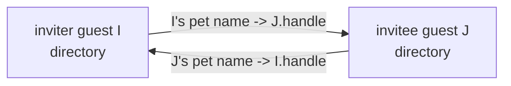

# Guest-Native Invitation and Acceptance

| | |
|---|---|
| **Created** | 2026-09-02 |
| **Updated** | 2026-09-02 |
| **Author** | Kris Kowal (prompted) |
| **Status** | Not Started |

## What is the Problem Being Solved?

An **invitation** is how two Endo agents become mutual peers: the inviter mints a
one-time locator, hands it to the invitee out of band, and when the invitee
accepts, each side binds a durable pet name for the other, after which they can
exchange messages over the existing mailbox substrate. An **`EndoHost`** is the
privileged agent a daemon creates for its operator — it can register daemon peers
and formulate new agents. An **`EndoGuest`** is a subordinate agent that a host
(or, after this design, another guest) onboards, with a deliberately attenuated
surface.

Today only an `EndoHost` can extend or redeem an invitation: `invite` and
`accept` are defined in `src/host.js` and guarded by `HostInterface` in
`src/interfaces.js`. `EndoGuest` (`src/guest.js`, `GuestInterface`) exposes
neither. Any application that wants a guest to onboard another guest has to
borrow host authority and act as a membrane.

That membrane is exactly what `kriscendobot/minion.town#56`
(`designs/invitation-only-guest-onboarding.md`) is forced into. Its
capability-first onboarding model is guest-to-guest: "a guest may invite more
guests, transitively"; "extending an invitation does not provision a guest";
each side names the other with an independently chosen pet name. Because no
guest-native facet exists, minion.town's app "is the membrane: it calls the host
method on behalf of the inviting guest." Kris Kowal's review at
`kriscendobot/minion.town#56` (comment `r3909478669`) closes on the directive:
"Guests must be able to invite and accept." This design closes that daemon gap
so the app exercises only the inviting guest's own authority.

The method and parameter names in this design (`invite`, `accept`, and the
role-neutral `peerName` introduced in section 1) are provisional and track the
daemon tool-renaming effort tracked in `designs/daemon-locator-terminology.md`;
this design fixes the semantics and the parameter *roles*, not the final spelling.

## Design

### 1. Surface

Add two methods to `EndoGuest`. Rather than copy the host signatures, hoist the
`invite`/`accept` guards into a shared record and spread it into both interfaces
(section 9), so the vocabulary is defined once:

```
guest.invite(peerName: string | string[]): Promise<Invitation>
guest.accept(invitationLocator: string, peerName: string | string[]): Promise<void>
```

- On `invite`, `peerName` is the pet name the **inviting** guest chooses for its
  prospective peer, in its own directory. The array form is a path, and it nests
  under a directory that must already exist (the same `petNamePathFrom` contract
  as `host.invite`).
- On `accept`, `peerName` is the pet name the **accepting** guest chooses for the
  inviter.
- The parameter is spelled `peerName` on both facets on purpose. The relation is
  symmetric — in a guest-to-guest exchange the inviter is itself a guest — so
  naming either party's pet name after a role (`guestName`/`hostName`) would
  reintroduce the host/guest asymmetry this design exists to remove, and `hostName`
  in particular collides with the `@host` special name a guest already carries for
  its *creating* host (`src/guest.js`). The host sibling still spells its `accept`
  parameter `guestName` today; if the paths converge (section 9 and the Open
  questions section), that spelling would follow.
- Both names are private to each side. They may differ, and renaming one does
  not touch either agent's formula identifier.
- `invite` returns the `Invitation` exo; the caller calls `E(invitation).locate()`
  to get the transmissible locator string, exactly as with `host.invite`.

The two methods are agent-generic: `invite`/`accept` become part of a shared
agent vocabulary that both `EndoHost` and `EndoGuest` satisfy (via the shared
`EndoAgent` base type and a shared guard record, section 9), rather than a
host-only capability duplicated onto each.

**Failure surface.** `accept` returns `Promise<void>`, and sections 5 and 7 ask
callers to distinguish outcomes, so the failure modes must be discriminable at the
call site rather than by string-matching an error message. `accept` rejects with a
tagged error whose reason names one of: `already-consumed` (the invitation was
already redeemed or overwritten — "this invite link was already used"),
`unreachable` (the inviter's daemon could not be dialed), and `malformed-locator`
(the locator did not parse). The exact tag shape is an implementation choice for
the builder, but the taxonomy above is normative and both facets surface it
consistently.

### 2. Reciprocal handle exchange, no replacement guest

The defining semantic difference from the host path: a guest accepts **as
itself**. Neither side formulates a fresh guest.

A **handle** is an agent's `@self`: a transmissible reference to just the agent's
identity — the "face" peers name and message — as distinct from the agent's full
authority. The identity each side presents is its own handle, and the durable
credential remains the guest's existing formula identifier, per minion.town's
model where "the guest formula identifier is the credential." Binding a peer's
handle is therefore *not* the same as minting a guest: it grants only the ability
to address that peer, whereas `formulateGuest` would create a new subordinate
agent (with its own authority and its own `@pins/guest-*` formula) under your
daemon. Accepting as itself is what lets this design avoid that mint entirely
(sections 7 and 9).



Concretely, for inviter guest `I` and invitee guest `J`:

1. `I.invite('new-neighbor')` calls `formulateInvitation(I.agentId, I.handleId,
   'new-neighbor', tasks)`. That maker is already agent-agnostic (it stores
   `hostAgent`/`hostHandle` fields but never assumes a host). A deferred task
   retains the invitation formula under `new-neighbor` in `I`'s own pet store,
   so a re-invite under the same name overwrites and cancels the prior pending
   invitation (consume-once, section 5).
2. `E(invitation).locate()` yields
   `endo://<I.daemonNode>/<invitationNumber>@<hints>?type=invitation&from=<I.handleNumber>&fromNode=<I.agentNode>`,
   where the URL authority `<I.daemonNode>` is **I's daemon node number, not I's
   agent key**. `getPeerInfo` returns `{ node: localNodeNumber }` (the daemon's
   key, `src/host.js`), and the acceptor feeds that authority straight into
   `addPeerInfo({ node })` and into `formatId({ number, node })` to resolve the
   invitation formula — which `formulateInvitation` minted on the daemon node
   (`src/manager.js`). Putting I's agent key in the authority would rebuild an
   invitation id for a formula that does not exist and register an undialable
   peer, so the authority must stay the daemon node. I's own agent identity — the
   guest's Ed25519 handle key — travels separately in the `from`/`fromNode` (and,
   for the reciprocal handle exchange, `handleNode`) query parameters, which
   already carry an agent-key node distinct from the daemon node. The `<hints>`
   are the **daemon's** network addresses, discussed next.
3. `J.accept(locator, 'my-neighbor')` parses the locator, obtains a remote
   presence of the invitation (`provide(invitationId, 'invitation')`), builds
   `J`'s own handle locator (from `J.handleId`, `J`'s agent node, and the daemon's
   network addresses), and calls `E(invitation).accept(J.handleLocator)`.
4. The inviter-side `Invitation.accept` (in `I`'s daemon) binds `J`'s remote
   handle under `new-neighbor` in `I`'s directory via
   `E(I.agent).storeLocator(peerNamePath, jRemoteHandleLocator)`, replacing
   the pending-invitation entry. It does **not** call `formulateGuest`.
5. Back in `J`, `accept` binds `I`'s remote handle under `my-neighbor` in `J`'s
   directory (`storeLocator`).

After this, `I`'s `new-neighbor` and `J`'s `my-neighbor` are ordinary mailable
pet names; `I.send('new-neighbor', ...)` and `J.request('my-neighbor', ...)`
flow over the existing mailbox substrate (`src/mail.js`).

`storeLocator`/`storeIdentifier` are directory methods already shared by both
`HostInterface` and `GuestInterface`, so step 4 needs no new guest authority.

**Where a guest's connection hints come from.** Reachability is a property of the
daemon, not of the guest agent. A guest's own `@nets` directory starts empty by
construction — `formulateGuestDependencies` gives each guest "its own (initially
empty) networks directory" (`src/manager.js`), asserted by `test/endo.test.js`
("guest @nets starts empty"), and networks reach a guest's `@nets` only via a host
`move` (`test/_multiplayer-suite.js`). Nothing in this design provisions it. The
invitation locator therefore advertises the **daemon's** node (step 2) and the
**daemon's** network addresses — the same source `host.invite` already uses via
`getPeerInfo` / `getAllNetworkAddresses` against the daemon's shared networks
directory — so the injected `getAllNetworkAddresses` capability (section 3) reads
the *daemon's* networks directory, never the guest's empty `@nets`. Two
consequences follow:

- Same-daemon guest-to-guest needs no hints at all (section 4).
- Cross-daemon guest-to-guest is reachable exactly when the inviter's **daemon**
  has configured listeners — a daemon precondition identical to the one hosts
  already rely on, not a per-guest capability the guest must first acquire. A
  guest on a daemon with no listeners can still invite same-daemon peers but
  cannot be dialed across daemons. This is stated as a precondition, not silently
  assumed.

### 3. Authority attenuation

`GuestInterface` gains exactly two public guards, `invite` and `accept`. It does
**not** gain the public methods `getPeerInfo`, `addPeerInfo`, or a public
`writeRemoteAgentKey` guard. Those stay absent from the guest's public surface, so
no holder of a guest reference can register arbitrary daemon peers by calling a
public method.

The peer-registration and handle-binding steps that `invite`/`accept` need are
supplied as **narrow daemon-core capabilities injected into `makeGuestMaker`** —
closure captures, the same shape as the existing `formulateEval`,
`formulateMarshalValue`, and `getAllNetworkAddresses` injections, and reachable
only from inside the two method bodies, never as guest exo methods the interface
guards. (The `writeRemoteAgentKey` capture below is such a closure capture, not
the public method denied in the previous paragraph; same name, different surface.)

- `registerPeer(peerInfo)`: writes the known-peers entry for a remote daemon.
- `writeRemoteAgentKey(agentNode, daemonNode)`: records agent-key routing when
  a handle's node differs from the daemon node.

The same seam removes the `EndoHost` cast inside `makeInvitation`. Today
`Invitation.locate`/`accept` do `provide(hostAgentId)` and call
`hostAgent.getPeerInfo()` / `hostAgent.addPeerInfo()` on it, casting the bound
agent to a host. Those become daemon-core capabilities that read the **daemon's**
own network addresses (`getAllNetworkAddresses` against the daemon's shared
`networks` directory, not the agent's `@nets`) and register peers directly, so the
invitation machinery works uniformly whether the bound agent is a host or a guest.

Security argument for letting a guest cause peer registration at all: an
invitation locator already conveys the remote daemon's node key and addresses to
whoever holds it, so registering that peer only teaches the local daemon how to
dial a node the holder was already told about; it grants no authority over any
formula the guest did not already receive a capability to. The registration is
reachable only from inside the two invitation method bodies — a lexical boundary,
not a capability property, and it fires on the caller-supplied locator string
*before* `provide(invitationId, 'invitation')` validates the invitation, so the
argument cannot lean on invitation liveness. Two facts the builder must therefore
handle explicitly:

- `addPeerInfo` **overwrites** an existing known-peers entry when the addresses
  differ (`src/manager.js`), and known-peers is daemon-global, so a guest
  redeeming a locator that names an already-known node would rewrite the daemon's
  addresses for a peer the host also uses. The builder must refuse to overwrite a
  differing existing entry (or otherwise scope the write), not treat registration
  as purely additive.
- A guest still cannot reach the endo bootstrap (`@endo`), enumerate or resolve
  arbitrary formulas, or obtain the host bootstrap; its special-name namespace
  stays `@agent` / `@self` / `@host` / `@mail` / `@nets` / `@planes`
  (`makePetSitter`, `src/pet-sitter.js`).

### 4. Same-daemon vs cross-daemon

The flow is uniform; only peer setup differs.

- **Same daemon** (`I` and `J` are guests of one daemon): the locator's daemon
  node equals the local daemon node, `provide(invitationId, 'invitation')`
  resolves the local exo directly, and the accept skips peer registration for the
  local node. That self-node skip lives in the invitation method body — note that
  `addPeerInfo` itself has no self-node guard (`src/manager.js`), so the guard
  cannot be assumed downstream. Both reciprocal bindings are local directory
  writes; no network transport is touched.
- **Cross daemon**: `registerPeer` records the remote daemon (and
  `writeRemoteAgentKey` records agent-key routing when a guest's node differs
  from its daemon node), the remote invitation and handles resolve as remote
  presences over the established peer connection (`src/remote-control.js`,
  `src/networks/`), and the crossed-hello race is handled by the existing
  remote-control accept-bias state machine.

Because guests carry their own agent node keys, the `from`/`fromNode` and
`handleNode` locator query parameters (all shown in step 2's locator) that already
distinguish agent-key nodes from daemon nodes are exercised on both sides of a
guest-to-guest exchange, not just when a host redeems.

### 5. Cancellation and consume-once

An invitation is consumed exactly once, and the **durable** consume-once record is
the pet-store binding, not an in-memory signal. When `accept` succeeds it
overwrites the inviter's `peerName` entry — which until then referenced the
pending `invitation` formula — with the acceptor's remote handle (section 2,
step 4). That de-references the invitation formula, so it is collected and can no
longer be provided or re-incarnated. Cancellation of the invitation controller is
the **in-process liveness** half that makes any reference still live in memory
fail fast; it is *not* the durable ledger:

```
await withFormulaGraphLock(async () => {
  const controller = provideController(invitationId);
  // Bind the reciprocal handle, overwriting the pending-invitation pet-store
  // entry. That overwrite is the durable consume-once record. Then:
  await controller.context.cancel(harden(Error('Invitation accepted')));
});
```

Why cancellation alone would be insufficient: `context.cancel` does
`controllerForId.delete(id)` (`src/context.js`), and `provideController`
re-evaluates the **persisted** `invitation` formula on its next call
(`src/manager.js`). A second `accept` that observed only a cancelled controller
would re-incarnate a live invitation. Consume-once therefore has to remove the
formula's last durable referent — the pet-store entry — after which
`provideController` has nothing to re-incarnate.

Two revocation paths converge on that pet-store de-reference:

- **Redemption**: the first `accept` overwrites the entry with the acceptor's
  handle and cancels the controller; a second `accept` finds no pending
  invitation to provide and fails with the `already-consumed` reason (section 1),
  without re-binding.
- **Overwrite**: re-invoking `invite` under the same `peerName`, or otherwise
  overwriting that pet-store entry, replaces the invitation reference and cancels
  the pending invitation so it can no longer mutate the entry. `invite`'s deferred
  task wires this fate-sharing. Overwrite is a revocation verb: `remove` or
  `rename` on a pending entry likewise retires the invitation.

This design closes the redemption half of the current `makeInvitation.accept` TODO
("ensure that this is sufficient to cancel the previous incarnation ... such
that it can no longer be redeemed, and such that overwriting the invitation also
revokes the invitation"). The builder must prove both paths with tests (section 8),
not assume `cancel` suffices; the Open questions section records the residual doubt
about revoking prior incarnations across a restart.

### 6. Concurrency

The compare-de-reference-bind sequence in section 5 runs under the existing global
`withFormulaGraphLock` (`src/manager.js`). Be precise about what that primitive
guarantees: it is a **reentrant depth counter**, not a mutex — an entrant that
arrives while the depth is already greater than zero runs inline rather than
queuing (`if (formulaGraphLockDepth > 0) return asyncFn()`). It therefore
serializes *top-level* concurrent `accept` calls against one another (each takes
the lock at depth 0), which is the race that matters here, but it does **not**
protect a critical section that `await`s another lock-reentering daemon-core
operation midway. The builder must keep the consume-once step — the pet-store
de-reference that is the durable commit (section 5) — free of an interleaving
`await` on a reentrant operation, so the loser of two concurrent accepts observes
the already-de-referenced entry instead of racing a half-applied bind. The
inviter-side and acceptor-side binds are independent single-writer directory
updates on their own daemons; message-number assignment on the resulting
relationship remains serialized by the mailbox `SerialJobs` (`src/mail.js`,
`mailboxStoreJobs`). No new concurrency primitive is introduced.

### 7. Crash recovery

- A **pending** invitation is a persisted `invitation` formula
  (`{ type, hostAgent, hostHandle, guestName }`, `src/formula-record.js`) whose
  maker `makeInvitation` re-creates the exo on incarnation, so it survives a
  restart of the inviter's daemon and is still redeemable.
- A **completed** relationship is two durable `storeLocator` bindings plus the
  peer/known-peers entries; guest incarnation (`src/manager.js` `guest:` maker,
  which recovers `agentNodeNumber` from `persistencePowers.listAgentKeys()`)
  re-hydrates both guests and their directories. No `@pins` guest is minted (for
  the guest inviter path), so there is no pinned intermediate to revive.
- **Mid-accept crash**: `accept` performs a remote call (the inviter-side bind)
  and then a local bind; the two are not one transaction across daemons. The
  builder must make `accept` idempotent and safe to re-drive. Because the
  inviter-side de-reference is the commit point (section 5), **a re-driven
  `accept` that runs after the inviter has de-referenced-and-bound but before the
  acceptor's local bind completed must detect the already-consumed invitation and
  finish (or cleanly report) the acceptor-side binding**, rather than
  double-consuming or wedging. The precise recovery ordering is an open question
  (the Open questions section).

### 8. Test plan

**Retain and keep green** the existing host invitation coverage, which exercises
the shared invitation core:

- the `invite, accept, and send mail` family and `invite nests the invitation at a
  directory path` in `test/endo.test.js`;
- the cross-daemon retention suite `test/_multiplayer-suite.js` driven by
  `test/invite-retention.test.js` (tcp-netstring) and
  `test/invite-retention-ocapn.test.js` (ocapn), including its restart case
  (`invite/accept works across restart`), `three-party invite with partition and
  recovery`, and `sub-invitation chain (A->B->C) collects C-side resources after C
  release`;
- `test/peer-formula-revocation.test.js`.

Where converging the host path onto the reciprocal-own-handle model (the Open
questions section) changes an assertion about a minted `@pins/guest-*` formula,
migrate the assertion to the new binding — by updating the assertion to the new
binding while preserving its GC/retention intent (`formulaExistsInDb` checks),
never by deleting the coverage.

**Add** guest-native coverage that mirrors the retained shapes:

- Same-daemon `guest.invite` / `guest.accept` round trip: two guests of one
  daemon, reciprocal pet-name binding, mail both directions, no new guest
  formula created (assert formula count/kind).
- Cross-daemon guest-to-guest over both `_multiplayer-suite.js` networks
  (tcp-netstring and ocapn), with the retention/GC assertions.
- Transitive guest chain `I -> J -> K` (the minion.town "a guest may invite more
  guests, transitively" case): `J` accepts from `I`, then `J.invite`s `K`, and
  resources collect correctly on release.
- Consume-once: a second `accept` of a redeemed locator rejects with
  `already-consumed`; an `invite` overwrite cancels the pending invitation.
- Restart with a pending guest invitation, and restart after a completed
  guest relationship.

Every lint and test run is exercised locally first per the project's pre-push
gates.

### 9. Implementation sketch

- `src/interfaces.js`: hoist the `invite`/`accept` guards into a shared
  `agentInvitationMethodGuards` record (reusing `NameOrPathShape` and
  `LocatorShape`) and spread it into **both** `HostInterface` and `GuestInterface`,
  the same way the existing shared agent guards are already spread into both, so
  the vocabulary is defined once rather than duplicated.
- `src/types.d.ts`: add `invite`/`accept` to the shared `EndoAgent` base type that
  both `EndoHost` and `EndoGuest` extend, rather than to each separately; correct
  the stale `Invitation.accept` return type (`{ syncedStoreNumber }` no longer
  matches the returned `{ guestPublicKey }`).
- `src/guest.js` (`makeGuestMaker` / `makeGuest`): add `invite` and `accept`
  method bodies analogous to `host.js`, using the injected `registerPeer` /
  `writeRemoteAgentKey` daemon-core capabilities and the guest's own
  `agentNodeNumber` + `getAllNetworkAddresses(daemonNetworksDirectoryId)` to build
  its handle locator; bind the inviter's remote handle under `peerName`; do not
  `formulateGuest`. Add the two methods to the returned `guest` record.
- `src/manager.js` (`makeInvitation`, and the `makeGuestMaker(...)`
  instantiation): drop the `EndoHost` cast in `locate`/`accept`; compute peer
  info and register peers via daemon-core capabilities; for a **guest** inviter,
  bind the acceptor's own remote handle under the inviter's `peerName` instead of
  `formulateGuest` + `@pins` pin. A **host** inviter retains its current mint for
  now — `Invitation.accept` selects bind-vs-mint on the inviter's kind — until the
  retention question below (what the `@pins/guest-*` mint protected) is resolved;
  whether the host path also converges onto the no-mint model is the first Open
  question, deliberately left open here rather than silently decided. Inject
  `registerPeer` / `writeRemoteAgentKey` into `makeGuestMaker`.

## Dependencies

| Design | Relationship |
|---|---|
| `kriscendobot/minion.town` `designs/invitation-only-guest-onboarding.md` | Downstream consumer; this design closes the daemon gap it names. |
| [familiar-deep-link-invitations](familiar-deep-link-invitations.md) | Sibling consumer of `invite`/`accept`; currently routes through `host.accept`. May move to the guest facet once this lands. |

## Open questions

- Should the host invitation path converge onto the same reciprocal-own-handle
  model (no minted guest), or keep minting a per-relationship guest for hosts
  while only guests use the no-mint path? This design ships the guest path as
  no-mint and leaves the host path minting for now (`Invitation.accept` branches
  on the inviter's kind, section 9). Convergence is cleaner and would remove the
  branch, but it changes host `accept` semantics and the retained host tests, and
  it is gated on the retention question below.
- What was the `@pins/guest-<leaf>` local guest minted by the current
  `host.accept` / `makeInvitation.accept` actually protecting? The
  `_hostNameFromGuest` "previously used by synced pet stores" comment suggests
  it is a vestige of a retired synced-pet-store flow. Before deleting the mint,
  the builder must confirm it carries no live retention or GC guarantee that
  needs preserving another way, so the `_multiplayer-suite.js` retention
  assertions do not silently weaken.
- What is the exact idempotent recovery ordering for a mid-`accept` crash
  (section 7)? Which side's bind is the commit point, and how does a re-driven
  `accept` distinguish "already consumed by me" from "consumed by someone else"?
- Does de-referencing the invitation and cancelling its controller under the
  formula graph lock revoke prior incarnations of the invitation across a restart,
  or can a stale incarnation still be redeemed? This is the unresolved half of the
  current `makeInvitation.accept` TODO; the builder must verify with a restart
  test.
- Should peer registration triggered by a guest `accept` be rate-limited or
  bounded per guest, given a guest can now grow the daemon's known-peers set (to
  nodes it holds valid invitations for)? Likely out of scope for the first
  increment; name a follow-up if deferred.

## Prompt

> Design the Endo daemon API that lets every `EndoGuest` both extend and accept
> invitations directly. The required surface should support `guest.invite(guestName)`
> and `guest.accept(invitationLocator, hostName)` (names remain provisional while
> the daemon tool renaming settles), consume an invitation once, accept into the
> calling guest without minting a replacement guest, and bind reciprocal handles
> under independently chosen pet names. Cover same-daemon and cross-daemon
> semantics, authority attenuation, cancellation, concurrency, crash recovery,
> and retained integration tests. The current `llm` surface exposes `invite` and
> `accept` only on `EndoHost`; `EndoGuest` exposes neither. This closes the
> dependency identified by kriskowal's review of `kriscendobot/minion.town#56`
> (comment `r3909478669`).
