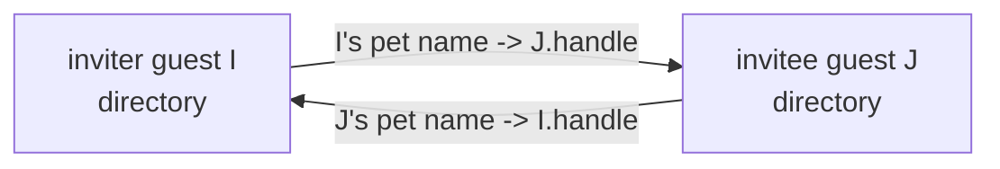

# Guest-Native Invitation and Acceptance

| | |
|---|---|
| **Created** | 2026-09-02 |
| **Updated** | 2026-09-04 |
| **Author** | Kris Kowal (prompted) |
| **Status** | Not Started |

## What is the Problem Being Solved?

An **invitation** is how two Endo agents become mutual peers.
The inviter mints a one-time locator, hands it to the invitee out of band, and
when the invitee accepts, each side binds a durable pet name for the other,
after which they can exchange messages over the existing mailbox substrate.
An **`EndoHost`** is the privileged agent a daemon creates for its operator; it
can register daemon peers and formulate new agents.
An **`EndoGuest`** is a subordinate agent that a host (or, after this design,
another guest) onboards, with a deliberately attenuated surface.

Today only an `EndoHost` can extend or redeem an invitation.
`invite` and `accept` are defined in `packages/daemon/src/host.js` and guarded by
`HostInterface` in `packages/daemon/src/interfaces.js`.
`EndoGuest` (`packages/daemon/src/guest.js`, `GuestInterface`) exposes neither.
Today's `host.accept` does not merely bind a peer: it calls `formulateGuest` and
mints a **fresh `@pins/guest-*` guest** to stand for the relationship
(`packages/daemon/src/manager.js` `makeInvitation.accept`), so redeeming an invitation into an
existing guest is not something the current surface offers at all.
Any application that wants a guest to onboard another guest has to borrow host
authority and act as a membrane.

That membrane is exactly what
[minion.town#56](https://github.com/kriscendobot/minion.town/pull/56)
(`designs/invitation-only-guest-onboarding.md` in that repo) is forced into.
Its capability-first onboarding model is guest-to-guest: "a guest may invite
more guests, transitively"; "extending an invitation does not provision a
guest"; each side names the other with an independently chosen pet name.
Because no guest-native facet exists, minion.town's app "is the membrane: it
calls the host method on behalf of the inviting guest."
Kris Kowal's review at
[minion.town#56 (comment `r3909478669`)](https://github.com/kriscendobot/minion.town/pull/56#discussion_r3909478669)
closes on the directive: "Guests must be able to invite and accept."
This design closes that daemon gap so the app exercises only the inviting
guest's own authority.

The method and parameter names in this design (`invite`, `accept`, and the
role-neutral `correspondentName` introduced in section 1) are provisional.
They track the daemon tool-renaming effort in
[daemon-locator-terminology](daemon-locator-terminology.md); this design fixes
the semantics and the parameter *roles*, not the final spelling.

## Design

### 1. Surface

Add two methods to `EndoGuest`.
Rather than copy the host signatures, hoist the `invite`/`accept` guards into a
shared record and spread it into both interfaces (section 9), so the vocabulary
is defined once:

```ts
guest.invite(correspondentName: string | string[]): Promise<Invitation>
guest.accept(invitationLocator: string, correspondentName: string | string[]):
  Promise<{ status: 'joined' | 'already-joined' | 'already-consumed'
                  | 'peer-conflict' | 'name-in-use' }>
```

- On `invite`, `correspondentName` is the pet name the **inviting** guest chooses for its
  prospective peer, in its own directory.
  The array form is a path, and it nests under a directory that must already
  exist (the same `petNamePathFrom` contract as `host.invite`).
- On `accept`, `correspondentName` is the pet name the **accepting** guest chooses for the
  inviter.
- The parameter is spelled `correspondentName` on both facets on purpose.
  The relation is symmetric (in a guest-to-guest exchange the inviter is itself a
  guest), so naming either party's pet name after a role (`guestName`/`hostName`)
  would reintroduce the host/guest asymmetry this design exists to remove.
  `hostName` in particular collides with the `@host` special name a guest
  already carries for its *creating* host (`packages/daemon/src/guest.js`).
  Hoisting the guard (section 9) replaces the host's `invite`/`accept`
  declarations too, so `EndoHost.invite`'s `guestName` parameter
  (`packages/daemon/src/types.d.ts:1815`) is renamed to `correspondentName` in the
  same change. The parameter is positional, so no *caller* breaks, but the rename
  is **not** documentation-only: the spelling is user-visible in `help()` text and
  in the CLI grammar, so it also touches `packages/daemon/src/help.md`,
  `help-text-data.js`, and the `packages/cli` positionals (the full artifact list
  is in section 9). `help()` is the guest's only discovery entry point (section
  3), so those edits are what make the new guest methods discoverable at all.
- Both names are private to each side.
  They may differ, and renaming one does not touch either agent's formula
  identifier.
- `invite` returns the `Invitation` exo (the daemon-side object a caller reaches by
  reference); the caller calls `E(invitation).locate()` to get the transmissible
  locator string, exactly as with `host.invite`.

The two methods are agent-generic: `invite`/`accept` become part of a shared
agent vocabulary that both `EndoHost` and `EndoGuest` satisfy (via the shared
`EndoAgent` base type and a shared guard record, section 9), rather than a
capability duplicated onto each.

**Reading invitation state.**
An `invite` under a `correspondentName` leaves a *pending* entry that later becomes
a *redeemed* one: the entry holds the pending `invitation` formula until `accept`
overwrites it with the acceptor's bound handle (section 5).
The two states are not interchangeable, and a caller must be able to tell them
apart before acting.
The affordance that answers this cold is `locate(correspondentName)`, already on
`GuestInterface` (`packages/daemon/src/interfaces.js:102`).
The returned locator carries `?type=invitation` while pending, so a caller reads the `type` field directly and treats any non-`invitation` type as joined, whatever its subscription history.
The joined type is not a single constant: same-daemon redemption yields `?type=handle`, but a cross-daemon invitee's bound handle is a remote id, so `getTypeForId` stamps `?type=remote` (`packages/daemon/src/locator.js:187-193`; `getTypeForId` in `packages/daemon/src/manager.js` returns `remote` for any non-local id).
A consumer therefore checks `type !== 'invitation'` to mean "joined", never `type === 'handle'`, which would miss every cross-daemon invitee.
`locate` is a **pull** affordance: it answers the kind on demand but supplies no wake-up, so a consumer that only reads `locate` must poll to notice the pending-to-joined transition.
`followNameChanges` is its **push** complement: it yields `{ add: name, value: { number, node } }` (`packages/daemon/src/pet-store.js:132-145`), a bare identifier with no kind, so it supplies the *edge* (the wake-up) but not the *kind*, and it only discriminates for a consumer subscribed *across* the transition, so a UI that attaches after a restart sees one `add` and cannot tell pending from joined on its own.
The two are therefore complementary, not exclusive: the named consumer's eventing story is to subscribe with `followNameChanges` for the wake-up and read `locate(correspondentName)` on each edge to recover the kind.
A consumer that accepts polling as the cost may use `locate` alone.
A guest cannot introspect a formula's kind (`getFormulaForId` is host-only, `packages/daemon/src/host.js:2204-2214`), so `locate`'s `type` is the guest-facet answer the named consumer (minion.town's onboarding UI) uses to answer "has my invitee joined?"

The reliable **revocation** verb is overwrite: re-`invite` under the same
`correspondentName`, whose deferred task cancels the prior pending invitation (section 5).
`remove` and `rename` do *not* revoke, and this increment must not let them *look*
like they do: with formula collection off (the shipped default, section 5) `remove`
would delete only the pet-store row while the persisted `invitation` formula stays
reincarnatable via `provideController`, and `rename` would merely *move* the binding
(`packages/daemon/src/pet-store.js:182-207`) so the invitation stays live under the
new name while redemption still binds at the path captured at mint (`makeInvitation`
fixes `guestName` at mint, `packages/daemon/src/manager.js:6653-6659`).
So that neither verb ships as a silent false revocation affordance, this increment
makes `remove` and `rename` **reject** when the entry they touch resolves to a
pending `invitation` formula, telling the caller to re-`invite` (revoke) or `accept`
(redeem) first.
The invitation's identity is therefore its **formula id**, not the mutable pet name.
Section 5 states what each verb does; turning `remove`/`rename` into genuine
revocation verbs (cancel plus a recorded `revoked` disposition) rather than merely
refusing is the residual scoped in the Open Questions section.

**Failure surface.**
Sections 5 and 7 ask callers to distinguish outcomes, so the outcome must be
discriminable at the call site rather than by string-matching an error message.
The load-bearing fact is that the outcome is decided on the **inviter's** daemon:
`E(invitation).accept(...)` runs the consume commit there (section 5), so its
result has to travel back to the acceptor over CapTP, and again out to the named
consumer (minion.town's onboarding UI reaches the guest facet over CapTP too).
A thrown error is the wrong carrier for that crossing: `encodeErrorCommon`
(`packages/marshal/src/marshal.js`) carries only `{ errorId, message, name }`, so a
custom tag property is dropped and even a custom `.name` collapses to `Error`
across the boundary (the `makeTaggedError` precedent documents exactly this,
`packages/daemon/src/registry.js`). A **returned passable record survives
marshalling intact**, so the terminal states are returned as data, not thrown.

`accept` therefore resolves to a hardened record `{ status }` whose `status` names
one of the terminal states, and it **rejects only** for the two *exceptional*
conditions no `status` value can meaningfully carry: an inviter daemon that cannot
be dialed and a locator that does not parse.
The discriminating axis is **exceptional-versus-terminal**, not where the outcome
was decided.
An earlier draft framed the split as locally-decided-rejects versus
remotely-decided-returns, but that axis does not hold: `name-in-use` and the
acceptor-side half of `peer-conflict` are both decided locally, on the acceptor's
own daemon, and are still *returned*, because they are ordinary terminal outcomes a
consumer branches on rather than exceptions.
Each terminal outcome also states whether the one-time invitation was **consumed**,
which is the bit the named consumer branches on to decide "retry under a free name"
versus "this link is dead".
Returned (the caller branches on `result.status`):

- `joined` (invitation **consumed** by this call): this call won the consume commit
  and completed the reciprocal bind;
- `already-joined` (invitation **consumed** earlier by *this* agent): the committed
  entry is already bound to this agent's own handle id, the idempotent re-drive case
  section 7 requires (a re-driven `accept` finishes or re-confirms its own prior bind
  rather than reporting a stranger's use), and the one outcome that used to be the
  self-contradictory "reject-but-also-finish-the-bind" state.
  A **handle** is an agent's `@self`, its transmissible identity, defined in full in
  section 2;
- `already-consumed` (invitation **consumed** earlier by a *different* agent): the
  committed entry is bound to a different handle id ("this invite link was already
  used");
- `peer-conflict` (invitation **not consumed**): the insert-only peer registration
  refused because the locator names an already-known node with differing addresses,
  or would rebind a differing agent key (section 3), and the refusal happens before
  the consume commit, so the invitation stays redeemable;
- `name-in-use` (invitation **not consumed**): the pre-check of `correspondentName`
  on the acceptor's own store found it already bound to a live peer, so `accept`
  refused *before* reaching the inviter-side commit (section 2 step 3), leaving the
  invitation redeemable under a free name rather than burning it on a purely local,
  pre-checkable name collision.

Rejected (locally raised in the acceptor's daemon, where `err.name` is the carrier
the same-daemon caller reads, and which, per the `makeTaggedError` precedent,
survives to a cross-CapTP caller at least as a distinguishable message-carried
class):

- `unreachable`: the inviter's daemon could not be dialed;
- `malformed-locator`: the locator did not parse.

This split is what lets a caller tell "my daemon refused to register this peer"
(`peer-conflict`, returned) from "the inviter could not be dialed"
(`unreachable`, rejected), and "this link was already used by someone else"
(`already-consumed`) from "I already used it myself" (`already-joined`) without a
second store: the committed binding (a positive, GC-independent fact) is what makes
`already-consumed`/`already-joined` decidable, and the inviter-side
`Invitation.accept` returns the discriminated record that carries the judgement
back. The `status` tag constants are exported the way `Registry*ErrorName` are
(`packages/daemon/src/registry.js`) so callers branch on a constant, not a literal.

This taxonomy covers the states the design's *shipped* verbs reach; the deferred
`overwritten` and `revoked` outcomes (a later re-`invite`, and genuine
`remove`/`rename` revocation, Open Question 5) would each require recording an
explicit tagged terminal value for an entry that never reached redemption, which
that question scopes.
Both facets route `accept` through the single daemon-core `acceptInvitation` helper
(section 9), so **the helper returns this record (and raises the two exceptional
rejects) for both facets**: the contract does not fork by facet, because
`accept` is declared once on the shared `EndoAgent` base (section 9).
This replaces today's bare host-facet errors (`packages/daemon/src/host.js:2045`);
the residual host-convergence work (whether the host path also drops the minted
guest) is Open Question 1, but the outcome contract converges regardless.

### 2. Reciprocal handle exchange, no replacement guest

The defining semantic difference from the host path is that a guest accepts **as
itself**.
Neither side formulates a fresh guest.

A **handle** is an agent's `@self`: a transmissible reference to just the agent's
identity (the "face" peers name and message), as distinct from the agent's full
authority.
The identity each side presents is its own handle, and the durable credential
remains the guest's existing formula identifier, per minion.town's model where
"the guest formula identifier is the credential."
Binding a peer's handle is therefore *not* the same as minting a guest: it grants
only the ability to address that peer, whereas `formulateGuest` would create a new
subordinate agent (with its own authority and its own `@pins/guest-*` formula)
under the guest's own daemon.
Accepting as itself is what lets this design avoid that mint entirely (sections 7
and 9).

An identifier in this design is a `(number, node)` pair, reassembled by
`formatId({ number, node })`; keep that model in mind through the walkthrough
below, where `I` presents several such pairs.
This design also relies on a **two-kinds-of-node-key** model: a daemon has a node
key (its `localNodeNumber`), and each agent it hosts *additionally* has its own
node key (its Ed25519 handle key). The two coincide for a host but differ for a
guest, which is why the walkthrough carefully distinguishes `I`'s **daemon node**
from `I`'s **agent node** below.



Concretely, for inviter guest `I` and invitee guest `J`:

1. `I.invite('new-neighbor')` calls `formulateInvitation(I.agentId, I.handleId,
   'new-neighbor', tasks)`.
   That maker is already agent-agnostic (it stores `hostAgent`/`hostHandle`
   fields but never assumes a host).
   A deferred task retains the invitation formula under `new-neighbor` in `I`'s
   own pet store, so a re-invite under the same name overwrites and cancels the
   prior pending invitation (consume-once, section 5).
2. `E(invitation).locate()` yields
   `endo://<I.daemonNode>/<invitationNumber>@<hints>?type=invitation&from=<I.handleNumber>&fromNode=<I.agentNode>`,
   where the URL authority `<I.daemonNode>` is **I's daemon node number, not I's
   agent key**.
   The invitation locator carries only `type`, `from`, and a conditional `fromNode`
   (the parameters `locate()` actually emits, `packages/daemon/src/manager.js:6661-6680`);
   `handleNode` is **not** an invitation-locator parameter; it belongs to the
   separate *handle* locator that `host.accept` writes and `Invitation.accept`
   reads (`packages/daemon/src/host.js:2066-2078`, `packages/daemon/src/manager.js:6701`),
   carrying the acceptor's own agent node in step 3.
   `getPeerInfo` returns `{ node: localNodeNumber }` (the daemon's node key,
   `packages/daemon/src/host.js`), and the acceptor feeds that authority straight into
   `addPeerInfo({ node })` and into `formatId({ number, node })` to resolve the
   invitation formula, which `formulateInvitation` minted on the daemon node
   (`packages/daemon/src/manager.js`).
   Putting I's agent key in the authority would rebuild an invitation id for a
   formula that does not exist and register an undialable peer, so the authority
   must stay the daemon node.
   I's own agent identity (the guest's Ed25519 handle key) travels separately in
   the `from`/`fromNode` query parameters, which already carry an agent-key node
   distinct from the daemon node.
   The `<hints>` are the **inviting agent's** advertised network addresses,
   discussed next.
3. `J.accept(locator, 'my-neighbor')` parses the locator, then **pre-checks that
   `my-neighbor` is free** in `J`'s own directory before spending the invitation.
   Because `my-neighbor` is a purely local, pre-checkable fact, a name collision
   must not consume the one-time invitation: if it already resolves to a live peer,
   `accept` resolves `{ status: 'name-in-use' }` here, before any remote call, and
   the invitation stays redeemable under a free name (section 1).
   Only if the name is free does `J` obtain a remote presence of the invitation
   (`provide(invitationId, 'invitation')`), build `J`'s own handle locator (from
   `J.handleId`, `J`'s agent node, and `J`'s advertised network addresses), and call
   `E(invitation).accept(J.handleLocator)`.
4. The inviter-side `Invitation.accept` (in `I`'s daemon) binds `J`'s remote
   handle under `new-neighbor` in `I`'s directory via
   `E(I.agent).storeLocator(correspondentNamePath, jRemoteHandleLocator)`, replacing the
   pending-invitation entry.
   It does **not** call `formulateGuest`.
5. Back in `J`, `accept` binds `I`'s remote handle under `my-neighbor` in `J`'s
   directory. This bind stays **insert-only**, like every other write in this design:
   the step-3 pre-check is what protects the one-time invitation, and this final bind
   re-checks under the same insert-only rule to close the narrow window between the
   pre-check and the bind (a concurrent local bind of `my-neighbor`), refusing rather
   than clobbering `J`'s existing relationship. A caller that means to replace an
   existing correspondent chooses a free name or removes the old binding first.

After this, `I`'s `new-neighbor` and `J`'s `my-neighbor` are ordinary mailable
pet names.
`I.send('new-neighbor', ...)` and `J.request('my-neighbor', ...)` flow over the
existing mailbox substrate (`packages/daemon/src/mail.js`).

`storeLocator`/`storeIdentifier` are directory methods already shared by both
`HostInterface` and `GuestInterface`, so step 4 needs no new guest authority.

**Where a guest's connection hints come from.**
Reachability is a property of an agent's networks directory, not of the guest
agent's authority.
This design sources an invitation's connection hints from the **inviting agent's
own `@nets`**, exactly as
[daemon-agent-network-identity](daemon-agent-network-identity.md) prescribes:
that design gives every agent (host and guest) its own networks directory and
routes `locate()`, `getPeerInfo()`, and invitation construction through it, with
an empty `@nets` being the deliberate default for an agent that "should not be
directly reachable" and "the foundation for anonymizing personas."
This design therefore **composes with** that model rather than overriding it: it
does not read the guest's empty `@nets` as an accident to route around by
advertising the daemon's shared addresses, which would silently un-attenuate
every guest locator.
A guest's own `@nets` directory starts empty by construction
(`formulateGuestDependencies` gives each guest "its own (initially empty)
networks directory," `packages/daemon/src/manager.js`, asserted by `test/endo.test.js` "guest
@nets starts empty"), and networks reach a guest's `@nets` only when a host
`move`s one in (`test/_multiplayer-suite.js`).
Two consequences follow, both stated as preconditions, and the cross-daemon one is reciprocal:

- Same-daemon guest-to-guest needs no hints at all (section 4), so it works regardless of `@nets` contents.
- Cross-daemon guest-to-guest is reachable exactly when **each** participating guest's `@nets` has had a network moved in by its host, because the exchange dials in both directions.
  The invitation locator carries the *inviting* guest's addresses, so an empty inviter `@nets` leaves the invitee unable to dial the invitation.
  Symmetrically, `Invitation.accept` in the inviter's daemon builds `peerInfo` from the *acceptor's* handle locator and registers it (`packages/daemon/src/manager.js:6704-6724`), so an acceptor whose `@nets` is empty emits an address-less handle locator, the inviter registers an undialable peer, and `I.send('new-neighbor', ...)` never reaches `J` even though `accept` resolved.
  A guest whose `@nets` is empty can still invite and accept *same-daemon* peers but cannot be dialed across daemons; that is the anonymizing-persona default, not a defect.
  This is the same "populate the agent's networks directory to be reachable" precondition hosts already meet, applied to the guest facet on **both** sides, so section 8's cross-daemon test populates both guests' `@nets`, not just the inviter's.

Until per-agent networks are wired into invitation construction for both facets
(`daemon-agent-network-identity` tracks that work), the builder threads the
inviting agent's `networksDirectoryId` into `getAllNetworkAddresses` in the
invitation path (section 9) rather than defaulting to the daemon's shared
networks directory.

### 3. Authority attenuation

`GuestInterface` gains exactly two public guards, `invite` and `accept`.
It does **not** gain the public methods `getPeerInfo`, `addPeerInfo`, or a public
`writeRemoteAgentKey` guard.
Those stay absent from the guest's public surface, so no holder of a guest
reference can register arbitrary daemon peers by calling a public method.

The peer-registration and handle-binding steps that `invite`/`accept` need are
supplied as **narrow daemon-core capabilities injected into `makeGuestMaker`**:
closure captures, the same shape as the existing `formulateEval`,
`formulateMarshalValue`, and `getAllNetworkAddresses` injections, and reachable
only from inside the two method bodies, never as guest exo methods the interface
guards.

Crucially, the injected capabilities are **already narrowed to enforce the
overwrite policy**, so the refuse-to-overwrite obligation is a property of the
capability rather than prose a builder must remember to apply at each call site
(decomplecting the policy from its use):

- `accept` receives only the shared `acceptInvitation` helper (section 9), which carries the whole register-peer -> record-agent-key -> bind sequence with the refuse-to-overwrite check baked in; it does **not** receive the raw `registerPeer` / `writeRemoteAgentKey` daemon-global writes.
- `invite` receives `formulateInvitation` and the inviting agent's network-address reader (`getAllNetworkAddresses` against its own `@nets`, section 2). It does **not** register peers at all: peer registration is an inviter-side step of `Invitation.accept` (`packages/daemon/src/manager.js:6704-6724`), not of `invite`, whose walkthrough (section 2, step 1) only formulates the invitation and returns the locator.
- The **insert-only** `registerPeer` used inside the accept sequence (a pre-narrowed capability that refuses to overwrite a differing known-peers entry and refuses to rebind a differing agent key, rejecting rather than mutating) is passed as a *parameter* into the shared `acceptInvitation` helper and the `Invitation.accept` path, not the raw daemon-global write. The overwrite policy therefore lives in the capability, and the shared helper never tests the agent's kind to decide it.

Because the raw daemon-global writes are never handed to a method body, "the builder must remember to refuse an overwrite" is not a standing hazard: the only peer-registration authority these bodies can reach already refuses.

The same seam removes the `EndoHost` cast inside `makeInvitation`.
Today `Invitation.locate`/`accept` do `provide(hostAgentId)` and call
`hostAgent.getPeerInfo()` / `hostAgent.addPeerInfo()` on it, casting the bound
agent to a host.
Those become daemon-core capabilities that read the **inviting agent's own**
network addresses (`getAllNetworkAddresses` against that agent's `@nets`, section
2) and register peers directly, so the invitation machinery works uniformly
whether the bound agent is a host or a guest.

**Security argument for letting a guest cause peer registration at all.**
The registration is reachable only from inside the invitation method bodies (a lexical boundary, not a capability property).
The two sides register at different points, and that ordering is load-bearing:

- **Acceptor side**, the registration fires on the caller-supplied locator string
  *before* `provide(invitationId, 'invitation')` validates the invitation, so its
  argument cannot lean on invitation liveness (a live invitation would otherwise have
  let the acceptor prove the inviter meant to reach it; without that, the write must
  be independently safe).
- **Inviter side**, the *mutating* registration of the acceptor's handle (the known-
  peers write) runs **only after the winning compare-and-set** (section 5), never
  before. Nothing in the commit needs it first: `storeLocator` internalizes the
  acceptor's handle locator without dialing, so the peer write is deferred to the
  winner. The insert-only *conflict determination* is read-only (it grows nothing), so
  it may run before the CAS, which is what lets `peer-conflict` be reported as a
  **non-consuming** terminal outcome without attempting the commit (section 1); only
  the write that actually grows known-peers is deferred behind the CAS. This closes a
  vector the earlier ordering left open, where the inviter-side write fired before the
  CAS validated, so a holder of a *spent* locator could re-drive `accept` and drive
  attacker-chosen known-peers growth on every losing attempt. Behind the CAS, only the
  single consuming `accept` writes, and a spent locator's re-accept loses the CAS and
  writes nothing.

Because the writes on the two sides of the exchange are driven by *different* suppliers, the safety argument is stated **separately per direction**, naming who supplies the written values:

- **Acceptor side** (guest `J` redeems `I`'s locator): the written node key and
  addresses come from `I`'s locator, which already conveyed the remote daemon's
  node key and addresses to whoever holds it. Registering that peer only teaches
  `J`'s daemon how to dial a node `J` was already told about; it grants no
  authority over any formula `J` did not already receive a capability to.
- **Inviter side** (`I`'s daemon runs `Invitation.accept` on `J`-supplied node and
  addresses, `packages/daemon/src/manager.js:6704-6724`): here the *acceptor*
  chooses which node `I`'s daemon registers and which addresses it will dial, so
  the locator-holder argument does **not** transfer. This direction is safe first
  because the registration runs only behind the winning CAS (above), so a spent
  locator drives no growth at all, and second because the injected capability is
  insert-only: even the one winning registration can cause `I`'s daemon to learn a
  *new* peer of the acceptor's choosing but cannot **rewrite** an existing
  known-peers entry or rebind an existing agent key that `I`'s host relies on.
  Bounding the additive growth from *distinct* valid invitations `I` itself minted
  is the residual in Open Question 6.

Two daemon-global writes are newly reachable from this attenuated facet, and each
needs its own overwrite analysis, not one shared caveat:

- `addPeerInfo` **overwrites** an existing known-peers entry when the addresses
  differ (`packages/daemon/src/manager.js`), and known-peers is daemon-global, so a guest
  redeeming a locator that names an already-known node would rewrite the daemon's
  addresses for a peer the host also uses.
  The insert-only capability above refuses to overwrite a differing existing entry
  rather than treating registration as purely additive. That refusal narrows a
  deliberate replacement path: `addPeerInfo`'s differing-addresses branch is an
  explicit stale-peer replacement (`packages/daemon/src/manager.js:3982-4020`), so
  scoping the refusal to the **guest** facet (the host facet keeps its replacement
  behavior) is what lets a peer whose addresses legitimately changed still
  re-register through the host; converging the host facet is deferred to the host
  convergence question.
- `writeRemoteAgentKey` is `INSERT OR REPLACE` and daemon-global
  (`packages/daemon/src/manager-database.js`), driven on the inviter side by the
  acceptor-supplied `handleNode` (which rides the acceptor's handle locator, section
  2 step 3), and on the acceptor side by the inviter-supplied `fromNode` (which rides
  the invitation locator, section 2 step 2), so it too can rebind an existing agent
  key's daemon routing.
  The same insert-only capability refuses to rebind a differing entry, on **both**
  the inviter and acceptor sides of the exchange.

A guest still cannot reach the endo bootstrap (`@endo`), enumerate or resolve
arbitrary formulas, or obtain the host bootstrap; its special-name namespace stays
`@agent` / `@self` / `@host` / `@mail` / `@nets` / `@planes` (`makePetSitter`,
`packages/daemon/src/pet-sitter.js`). This is an attenuation property, not a third
daemon-global write.

### 4. Same-daemon vs cross-daemon

The flow is uniform; only peer setup differs.

- **Same daemon** (`I` and `J` are guests of one daemon): the locator's daemon
  node equals the local daemon node, `provide(invitationId, 'invitation')`
  resolves the local exo directly, and the accept skips peer registration for the
  local node.
  That self-node skip lives in the invitation method body; note that `addPeerInfo`
  itself has no self-node guard (`packages/daemon/src/manager.js`), so the guard cannot be assumed
  downstream.
  The skip must cover the **sibling** `writeRemoteAgentKey` write too: a guest
  handle's node is always its own agent key, so a same-daemon accept otherwise
  satisfies `handleNode !== daemonNode` and would write a `remote_agent_key` row for
  a *local* key (`INSERT OR REPLACE`, `packages/daemon/src/manager-database.js:203`).
  Routing tolerates it (`isLocalKey` consults `hasAgentKey` first,
  `packages/daemon/src/manager.js:866-868`), but the row should not be written at
  all, so the self-node skip is scoped to both writes, not just peer registration.
  Both reciprocal bindings are local directory writes; no network transport is
  touched.
- **Cross daemon**: `registerPeer` records the remote daemon (and
  `writeRemoteAgentKey` records agent-key routing when a guest's node differs from
  its daemon node), the remote invitation and handles resolve as remote presences
  over the established peer connection (`packages/daemon/src/remote-control.js`, `packages/daemon/src/networks/`),
  and the crossed-hello race is handled by the existing remote-control accept-bias
  state machine.

Because guests carry their own agent node keys, the locator query parameters that
already distinguish agent-key nodes from daemon nodes are exercised on both sides
of a guest-to-guest exchange, not just when a host redeems: the invitation
locator's `from`/`fromNode` (step 2) carry the inviter's agent node, and the
separate handle locator's `handleNode` (step 3) carries the acceptor's agent node.

### 5. Cancellation and consume-once

An invitation is consumed exactly once, and the **durable** consume-once record is
the pet-store binding, not an in-memory signal, and not the eventual collection of
a formula.
When `accept` succeeds it overwrites the inviter's `correspondentName` entry (which until
then referenced the pending `invitation` formula) with the acceptor's remote
handle (section 2, step 4).
That overwrite is the commit, and it is observable without any garbage collector:
the entry now resolves to a bound peer handle, and a second `accept` re-reads the
entry, sees it no longer references a pending `invitation` formula, and resolves
`{ status: 'already-consumed' }` (or `already-joined` if the bound handle is the
caller's own, section 1) without re-binding.
Because the check is "does this entry still point at the pending invitation,"
consume-once holds whether or not formula collection is enabled.
This matters because collection is **off by default** in the shipped daemon:
`onCollect` early-returns unless `enableFormulaCollection` (`packages/daemon/src/manager.js`), and
`gcEnabled = process.env.ENDO_GC === '1'` is unset in production
(`packages/daemon/src/manager-node.js`; `packages/daemon/DEBUGGING.md` "off by default for now").
So the design must not rest consume-once on the invitation formula being collected
after de-reference; collection is orthogonal cleanup, and reclaiming the storage
is a bonus, not the correctness mechanism.

Cancellation of the invitation controller is the **in-process liveness** half that makes any reference still live in memory fail fast.
It is *not* the durable ledger, and it must **not** share a serialization point with the commit:

```js
// 1. Resolve the leaf hub that actually holds the row, BEFORE the compare. For a
//    bare `correspondentName` this is the inviter's own pet store; for a path form
//    (`invite(['peers','bob'])`, section 1, and the retained `invite nests the
//    invitation at a directory path` test) the row lives in the *sub-directory's*
//    hub, so a compare-and-set closed only over the inviter's top-level store
//    would miss it and consume-once would silently degrade to last-writer-wins.
//    One `await lookup(prefixPath)` reaches the leaf hub; for a bare name the
//    prefix is empty and the leaf hub is the identity (the inviter's own store).
//    Resolving the address first does NOT widen the race section 6 closes: that
//    race is compare-vs-set on ONE row, which stays atomic inside the synchronous
//    hub body below; only the row's location is resolved beforehand, exactly as an
//    ordinary lookup+read would.
const [leafHub, leafName] = await lookupLeafHub(correspondentNamePath);

// 2. The commit and the serialization point: an atomic compare-and-set on the
//    resolved leaf hub. Replace `leafName` with the acceptor's remote handle
//    locator ONLY IF the row still holds the pending `invitation` formula id. The
//    compare and the set run in one synchronous hub (pet-store) body over the
//    synchronous sqlite, with no await between them, so no formula-graph queue is
//    involved. This is the durable consume-once record; the loser's CAS sees a
//    bound handle and the caller learns `already-consumed`/`already-joined`.
const won = leafHub.storeLocatorIfMatches(
  leafName, invitationId, acceptorHandleLocator,
);
if (!won) return classifyLostCas(leafHub, leafName, acceptorHandleId); // see section 1

// 3. Replay the store-controller bookkeeping the synchronous CAS bypassed, for the
//    WINNER only. `storeIdentifier` (store-controller.js:49-64) normally runs, under
//    `withFormulaGraphLock`, `onPetStoreWrite(storeId, id)` for a LOCAL new id and
//    `removeEdgeIfUnreferenced(previousId)` for the OVERWRITTEN id. The new id here
//    is the acceptor's REMOTE handle locator (non-local: `isLocalId` false), so no
//    new edge is recorded, matching store-controller's own `isLocalId` guard. But
//    the overwritten id IS the local `invitation` formula, so its edge must be
//    released or the consumed invitation is retained forever (the retention/
//    collection assertions section 8 keeps green would regress). This runs AFTER the
//    synchronous CAS and awaits, exactly as store-controller does, which calls
//    removeEdgeIfUnreferenced directly (it acquires the formula-graph lock itself).
await removeEdgeIfUnreferenced(invitationId);

// 4. Register the acceptor's handle as an inviter-side peer (section 3): the
//    read-only conflict determination ran BEFORE the CAS (a peer-conflict returns
//    non-consuming, never reaching here), but the mutating known-peers write runs
//    behind the winning CAS so a spent locator drives no growth. Then best-effort
//    in-memory liveness, OUTSIDE any formula-graph enqueue. Cancellation is cleanup,
//    not the commit: a reincarnated controller cannot re-win the CAS above.
await registerAcceptorPeer(acceptorHandleLocator); // insert-only write, section 3
const controller = provideController(invitationId);
await controller.context.cancel(harden(Error('Invitation accepted')));
```

`storeLocatorIfMatches` is a **new** synchronous `NameHub`/pet-store capability, not an existing method and not a public agent guard.
It must be added as a synchronous compare-and-set on the pet store (`packages/daemon/src/pet-store.js`), where the read of the row and its conditional replacement share one synchronous run-to-completion body, exactly as the pet store's existing `write`/`remove`/`rename` bodies are async-declared but synchronous over the synchronous sqlite.
The path form is handled by resolving the leaf hub *first* (one `await lookup(prefixPath)` to reach the sub-directory's own hub, step 1 above, or the identity hub for a bare name) and then invoking the **synchronous** compare-and-set on that already-resolved local hub. The inviter's directory tree is local to the inviter's daemon (the CAS runs inside `Invitation.accept` there), so the leaf hub is always a local, synchronous pet store even for a nested path.
What must **not** happen is composing the commit out of the directory layer's `storeIdentifier` (`packages/daemon/src/directory.js:493-501`), which does `await lookup(prefixPath)` and then a *second* `await E(hub).storeIdentifier(...)`: that second await is a separate turn (and, for a remote hub, a network round trip), so a compare built as read-then-`E(hub).storeIdentifier` would span turns and lose exactly the race section 6 exists to close. Resolving the address in step 1 is fine; the compare-and-set itself must be one synchronous hub call, not two awaited directory calls.
It is injected into the invitation method body as a daemon-core capability that resolves and operates on the inviter's own directory tree (sections 3 and 9), so it adds **no** third public guard to `GuestInterface`, and `storeLocator`'s shared `nameHubMethodGuards` are untouched (section 3's "exactly two public guards" holds).

**The bypassed store-controller layer, and how each of its invariants is preserved.**
The pet-store CAS deliberately sits one layer *below* `store-controller.js`, which is where an ordinary overwrite's GC bookkeeping lives (`storeIdentifier`, `packages/daemon/src/store-controller.js:49-64`, running `onPetStoreWrite` under `withFormulaGraphLock` and `removeEdgeIfUnreferenced(previousId)` for the overwritten id).
The design flees that layer because its bookkeeping *awaits*, which would split the compare from the set across a turn and lose the race section 6 exists to close; but fleeing the layer does not excuse dropping its invariants.
Each is preserved explicitly, after the synchronous CAS, in step 3 of the sketch above:

- **New-id edge registration** (`onPetStoreWrite` for a local new id): the new value is the acceptor's *remote* handle locator, a non-local id, so store-controller's own `isLocalId` guard would record no edge; the CAS matches that by design, recording none.
- **Overwritten-id edge release** (`removeEdgeIfUnreferenced(previousId)`): the overwritten id is the local `invitation` formula, so its edge *must* be released or the consumed invitation is retained forever and the `_multiplayer-suite.js` retention/collection assertions regress. Step 3 calls `removeEdgeIfUnreferenced(invitationId)` for the winner, after the CAS commits, exactly as store-controller invokes it (directly; it acquires the formula-graph lock internally).
- **Serialization discipline preserved**: the release awaits and runs *outside* the synchronous CAS body, so it never reintroduces the split-turn race or the self-deadlock section 5's cold-cache analysis describes; and unlike `provideController`, `removeEdgeIfUnreferenced` does not re-enter the invitation controller, so it cannot deadlock on the token the CAS already released.

**Why the commit must not run inside `formulaGraphJobs.enqueue`.** `formulaGraphJobs`
is a strict one-token serial queue (`packages/daemon/src/serial-jobs.js`). A *raw*
`formulaGraphJobs.enqueue(...)` runs its body with `formulaGraphLockDepth` still
`0` (only `withFormulaGraphLock` increments that counter, `packages/daemon/src/manager.js:563-575`).
The body here calls `provideController(invitationId)`, which on a cold cache reaches
`evaluateFormulaForId` -> `getFormulaForId` -> `withFormulaGraphLock`
(`packages/daemon/src/manager.js:4324,1255`); seeing depth `0`, that nested call
tries to `enqueue` on the *same single token the outer enqueue still holds* and
hangs forever, exactly the post-restart cold-cache path section 7 requires.
The consume-once mechanism therefore rests on the pet-store compare-and-set alone
(a conditional write whose atomicity comes from its single synchronous pet-store body), never
on the formula-graph queue. Cancellation runs afterward, unqueued.

Why cancellation alone would be insufficient: `context.cancel` does
`controllerForId.delete(id)` (`packages/daemon/src/context.js`), and `provideController`
re-evaluates the **persisted** `invitation` formula on its next call
(`packages/daemon/src/manager.js`), whether or not collection is on.
A second `accept` that observed only a cancelled controller would reincarnate a
live invitation, but that reincarnation still loses the compare-and-set, so
consume-once holds regardless. Consume-once hinges only on the pet-store entry no
longer pointing at the invitation, a positive, GC-independent fact.

Two paths reach that pet-store overwrite, redemption (consumption) and revocation:

- **Redemption**: the first `accept` wins the compare-and-set, binding the
  acceptor's handle; a second `accept` loses it, finds a bound handle, and
  resolves `{ status: 'already-consumed' }` (section 1), without re-binding.
- **Revocation by overwrite**: re-invoking `invite` under the same
  `correspondentName` replaces the invitation reference, and `invite`'s deferred
  task cancels the prior pending invitation so it can no longer mutate the entry.
  This is the **only** reliable revocation verb.

`remove` and `rename` do **not** retire a pending invitation.
With collection off (the shipped default above), `remove` deletes only the pet-store row while the persisted `invitation` formula remains and `provideController` reincarnates it.
`rename` *moves* the binding via `renamePetStoreEntry` (`packages/daemon/src/pet-store.js:182-207`) so the invitation stays live under the new name; worse, `makeInvitation` captured `guestName` as a path at mint (`packages/daemon/src/manager.js:6653-6659`) and redemption binds at that captured path, so a renamed-then-redeemed invitation writes a second binding at the vacated old name while still pending under the new one.
The invitation's identity is the **formula id**, not the mutable pet name.
Making `remove`/`rename` genuinely revoke (by cancelling the controller and recording a `revoked` disposition, section 1) is scoped work the builder must add, tracked in Open Question 5.

This design closes the redemption half of the current `makeInvitation.accept` TODO
("ensure that this is sufficient to cancel the previous incarnation ... such that
it can no longer be redeemed, and such that overwriting the invitation also revokes
the invitation").
Note that the current `makeInvitation.accept` calls `await withFormulaGraphLock()`
with **no callback** (`packages/daemon/src/manager.js`), which serializes nothing;
the builder replaces that no-op with the compare-and-set above (section 6), not
with a callback-form `withFormulaGraphLock` (which would reintroduce the deadlock).
The builder must prove both paths with tests (section 8), not assume `cancel`
suffices; the Open Questions section records the residual doubt about revoking
prior incarnations across a restart.

### 6. Concurrency

The compare-overwrite-cancel sequence in section 5 must run under a **real**
serialization point.
Be precise about what the existing `withFormulaGraphLock` (`packages/daemon/src/manager.js`)
provides, because it is easy to over-read.
`withFormulaGraphLock` is a **reentrant depth counter over a serial queue**, not a
mutex.
It increments a *module-level* `formulaGraphLockDepth` **before** it enqueues on
`formulaGraphJobs`, and every entrant first checks that one global counter:
`if (formulaGraphLockDepth > 0) return asyncFn()`.
So a second **top-level** `accept` that arrives while the first is still inside its
`await formulaGraphJobs.enqueue(...)` window sees `depth > 0` and runs **inline,
unqueued**, the opposite of serialized.
The wrapper therefore does **not** serialize top-level concurrent `accept` calls
against one another, and consume-once cannot lean on it.

The serialization point is therefore **not** the formula-graph queue at all.
Enqueuing the critical section directly on `formulaGraphJobs` self-deadlocks
(section 5): the body's `provideController` re-enters `withFormulaGraphLock` at
depth `0` and blocks on the single token the outer enqueue still holds. The
serialization point is instead the **pet-store compare-and-set** (the new `storeLocatorIfMatches`, section 5): a conditional
overwrite that commits only if the row still holds the pending invitation formula id,
made atomic by running the compare and the set in one synchronous pet-store body, not
by any job queue, which the pet store does not have.
Two concurrent top-level accepts both attempt the CAS; exactly one
wins, and the loser observes the bound handle and resolves `{ status:
'already-consumed' }` (section 1) instead of racing a half-applied bind.
The inviter-side and acceptor-side binds are independent single-writer directory
updates on their own daemons; message-number assignment on the resulting
relationship remains serialized by the mailbox `SerialJobs` (`packages/daemon/src/mail.js`,
`mailboxStoreJobs`).
The one new primitive is that synchronous pet-store compare-and-set itself; no new
*queue* or lock is introduced, and no formula-graph enqueue wraps the commit.
The fix is to make the consume-once check an atomic compare-and-set on the
pet store, and to run controller cancellation afterward, unqueued.

### 7. Crash recovery

- A **pending** invitation is a persisted `invitation` formula (`{ type,
  hostAgent, hostHandle, guestName }`, `packages/daemon/src/formula-record.js`) whose maker
  `makeInvitation` re-creates the exo on incarnation, so it survives a restart of
  the inviter's daemon and is still redeemable.
- A **completed** relationship is two durable `storeLocator` bindings plus the
  peer/known-peers entries; guest incarnation (`packages/daemon/src/manager.js` `guest:` maker,
  which recovers `agentNodeNumber` from `persistencePowers.listAgentKeys()`)
  re-hydrates both guests and their directories.
  No `@pins` guest is minted (for the guest inviter path), so there is no pinned
  intermediate to revive.
- **Mid-accept crash**: `accept` performs a remote call (`E(invitation).accept`,
  which runs the inviter-side commit) and then a local bind; the two are not one
  transaction across daemons. There is exactly **one** commit point, the
  inviter-side pet-store compare-and-set (section 5), and the acceptor-side bind
  is a plain, idempotent, single-writer local write, not a second commit. That is
  what makes `accept` safe to re-drive: a re-driven `accept` that runs after the
  inviter committed-and-bound but before the acceptor's local bind completed calls
  `E(invitation).accept` again, the inviter-side CAS loses (the entry already holds
  the acceptor's handle), and the inviter returns the passable record `{ status:
  'already-joined' }` because the bound handle id equals this agent's own (section
  1). Because that terminal state is **returned as data rather than thrown**, the
  re-drive is an ordinary success path: `accept` then (re-)performs the idempotent
  acceptor-side local bind and resolves `{ status: 'already-joined' }`, repairing
  the half-finished relationship rather than double-consuming, wedging, or throwing
  forever (this resolves the earlier contradiction between sections 1 and 7, between
  "rejects" and "returns and finishes the bind": it returns, and the returned record
  is what makes finishing the bind reachable). The precise cross-daemon re-drive ordering
  of the two binds is Open Question 3.

### 8. Test plan

**Retain and keep green** the existing host invitation coverage, which exercises
the shared invitation core:

- the `invite, accept, and send mail` family and `invite nests the invitation at a
  directory path` in `test/endo.test.js`;
- the cross-daemon retention suite `test/_multiplayer-suite.js` driven by
  `test/invite-retention.test.js` (tcp-netstring) and
  `test/invite-retention-ocapn.test.js` (ocapn), including its restart case
  (`invite/accept works across restart`), `three-party invite with partition and
  recovery`, and `sub-invitation chain (A->B->C) collects C-side resources after C
  release`;
- `test/peer-formula-revocation.test.js`.

Where converging the host path onto the reciprocal-own-handle model (the Open
Questions section) changes an assertion about a minted `@pins/guest-*` formula,
migrate the assertion to the new binding while preserving its GC/retention intent
(`formulaExistsInDb` checks), never by deleting the coverage.

**Add** guest-native coverage that mirrors the retained shapes:

- Same-daemon `guest.invite` / `guest.accept` round trip: two guests of one
  daemon, reciprocal pet-name binding, mail both directions, no new guest formula
  created (assert formula count/kind).
- Cross-daemon guest-to-guest over both `_multiplayer-suite.js` networks
  (tcp-netstring and ocapn), with the retention/GC assertions, and with **both**
  guests' `@nets` populated by a host `move` (section 2's reciprocal precondition),
  so the inviter can be dialed from the invitation and the acceptor can be dialed
  from its bound handle; the mail assertion is bidirectional to prove the
  inviter-side `send` reaches the acceptor.
- Transitive guest chain `I -> J -> K` (the minion.town "a guest may invite more
  guests, transitively" case): `J` accepts from `I`, then `J.invite`s `K`, and
  resources collect correctly on release.
- Consume-once, pinned to run with **`gcEnabled: false`** so the durable
  consume-once record is proven independent of formula collection: a second
  `accept` of a redeemed locator resolves `{ status: 'already-consumed' }`; an
  `invite` overwrite cancels the pending invitation; and the pet-store entry is asserted to
  resolve to the bound handle (not merely to be absent) after redemption.
- **Concurrency of consume-once** (the race section 6 exists to close, which every
  *sequential* assertion above passes even for a naive `identifyLocal` +
  `await storeIdentifier` composition that splits the compare from the set): fire two
  **concurrent top-level** `accept`s of one locator (distinct acceptor handles) and
  assert **exactly one** resolves `{ status: 'joined' }` and the other
  `{ status: 'already-consumed' }`, never two `joined`. Written to fail if the
  compare-and-set is split across a turn.
- **Overwritten-id collection** (section 5's bypassed-layer analysis): with
  `gcEnabled: true`, assert the consumed `invitation` formula's edge is released and
  the formula collects after redemption (`formulaExistsInDb`), proving the CAS's
  step-3 `removeEdgeIfUnreferenced` replays the store-controller bookkeeping the raw
  CAS bypassed rather than retaining the invitation forever.
- Pending-state observability: a consumer reading `locate(correspondentName)` sees
  `?type=invitation` while pending and a non-`invitation` type after the invitee
  joins (`?type=handle` same-daemon and `?type=remote` cross-daemon, section 1),
  asserted with the `type !== 'invitation'` check rather than `type === 'handle'`
  (which would miss the cross-daemon case), and from a subscription attached *after*
  the transition to prove it does not depend on observing the change live.
- `remove` / `rename` on a **pending** entry: assert this increment's shipped
  behavior, that both **reject** when the entry resolves to a pending `invitation`
  formula (section 1), so neither ships as a silent false revocation affordance. The
  test also documents *why* they reject by pinning the underlying facts (with
  `gcEnabled: false`, a removed invitation's persisted formula would otherwise be
  reincarnatable, and a renamed pending invitation would stay live under the new
  name). Turning these into genuine-revocation verbs (cancel plus a `revoked`
  disposition) is deferred (Open Question 5); the reject is the shipped guard.
- Attenuation: a guest cannot register an arbitrary peer through any public
  method; and the section-3 overwrite refusal, where redeeming a locator that
  names an already-known node with differing addresses is rejected rather than
  silently rewriting the daemon-global entry (on both the `addPeerInfo` and
  `writeRemoteAgentKey` writes).
- Failure taxonomy, split by carrier (section 1): assert the two exceptional
  conditions **reject** (`accept` of a malformed locator with `malformed-locator`,
  and `accept` against an undialable inviter daemon with `unreachable`), while the
  terminal states **resolve** a hardened `{ status }` record. Assert `accept` of a
  locator a *different* agent already redeemed resolves `{ status:
  'already-consumed' }`, and a re-driven `accept` of a locator *this* agent already
  redeemed resolves `{ status: 'already-joined' }` (proving the self-consumption
  case section 7 requires is discriminable from a stranger's use, and that the
  re-drive resolves rather than throws so the acceptor-side bind is repairable).
  Assert `accept` into an already-bound `correspondentName` resolves `{ status:
  'name-in-use' }` rather than clobbering. Because the outcome is decided on the
  inviter's daemon, run the `already-consumed`/`already-joined`/`peer-conflict`
  assertions **cross-daemon** as well as same-daemon, to prove the discriminator
  survives CapTP as a returned passable record (a thrown tag would not).
- Restart with a pending guest invitation, and restart after a completed guest
  relationship.

Every lint and test run is exercised locally first per the project's pre-push
gates.

### 9. Implementation sketch

- `packages/daemon/src/interfaces.js`: hoist the `invite`/`accept` guards into a shared
  `agentInvitationMethodGuards` record (reusing `NameOrPathShape` and
  `LocatorShape`) and spread it into **both** `HostInterface` and `GuestInterface`,
  the same way the existing shared agent guards are already spread into both, so
  the vocabulary is defined once rather than duplicated.
  Correct `InvitationInterface.accept`'s guard from `M.call(IdShape)`
  (`packages/daemon/src/interfaces.js:609`) to `LocatorShape`, since step 3 passes
  the acceptor's handle *locator*, matching the agent facets' `LocatorShape`.
  Do **not** add `storeLocatorIfMatches` to the shared `nameHubMethodGuards`: it is
  a daemon-core capability, not a public agent method (section 5), so `GuestInterface`
  still gains exactly the two public guards `invite` and `accept` (section 3).
- `packages/daemon/src/types.d.ts`: add `invite`/`accept` to the shared `EndoAgent` base type that
  both `EndoHost` and `EndoGuest` extend, rather than to each separately, and let
  that replace the per-facet declarations (renaming `EndoHost.invite`'s `guestName`
  to `correspondentName`, section 1). Declare the agent-facet `accept` as returning
  the discriminated `{ status: 'joined' | 'already-joined' | 'already-consumed' |
  'peer-conflict' | 'name-in-use' }` record (section 1), not `void`, and export the
  `status` tag constants (the way `Registry*ErrorName` are exported) so callers
  branch on a constant. Correct the stale `Invitation.accept` return type
  (`{ syncedStoreNumber }` no longer matches its actual return, which becomes the
  passable `{ outcome, inviterHandleLocator }` record the acceptor maps to
  `{ status }`, section 9), and mark its ignored second parameter `hostNameFromGuest?`
  (`packages/daemon/src/types.d.ts:781`, ignored at `packages/daemon/src/manager.js:6685`)
  as deprecated in the same edit rather than leaving it as a live affordance.
- `packages/daemon/src/manager.js` (new daemon-core helper): add a single
  `acceptInvitation(agentId, handleId, locator, correspondentNamePath)` that carries
  the **acceptor-side** sequence and runs on the acceptor's daemon: parse (reject
  `malformed-locator`) -> **pre-check `correspondentNamePath` is free (return
  `name-in-use` here, before spending the invitation, section 2 step 3)** -> register
  peer via the insert-only capability -> record agent-key routing -> resolve the
  invitation (reject `unreachable` on dial failure) ->
  `E(invitation).accept(handleLocator)`. The **single commit point is
  the inviter-side compare-and-set inside `Invitation.accept`** (section 5), which
  runs on the *inviter's* daemon and returns a passable discriminated record
  (`{ outcome, inviterHandleLocator }`) back across CapTP, not a thrown tag, which
  would not survive the boundary (section 1). `acceptInvitation` then performs the
  **plain insert-only acceptor-side local bind** of the inviter's handle under
  `correspondentNamePath` (this is a single-writer local write, *not* a second
  compare-and-set: there is no pending invitation in the acceptor's own store to
  compare against; it refuses only an already-bound live name, yielding
  `name-in-use`) and returns the section-1 `{ status }` record. It **returns the
  section-1 record (and raises the two exceptional rejects) for both facets**, so
  both `accept` bodies are one call into it and the overwrite-refusal and outcome
  contract live in one place rather than being copied into `host.js` and
  `guest.js`.
- `packages/daemon/src/pet-store.js` (new primitive): add a **synchronous**
  `storeLocatorIfMatches(name, expectedFormulaId, locator)` `NameHub`/pet-store
  method that replaces the single row's locator only if it still resolves to
  `expectedFormulaId`, the read and the write sharing one synchronous body over the
  synchronous sqlite (no await between them). It operates on a single, already-
  resolved hub; the **path form is resolved by the caller first** (one
  `await lookup(prefixPath)` in the daemon-core capability to reach the leaf
  sub-directory's hub, section 5), so this method itself takes a bare `name`, never
  a path, and never composes two awaited directory calls. Surface it to the
  daemon-core invitation capability, which resolves and operates on the inviter's
  own directory tree, and **not** through `nameHubMethodGuards` (it is not a public
  agent method). This is the single load-bearing new primitive the consume-once
  commit rests on (sections 5 and 6).
- `remove` / `rename` guard: make both **reject** when the entry they touch resolves
  to a pending `invitation` formula (sections 1 and 5), so neither ships as a silent
  false revocation affordance. The check is local to the resolving hub (the same
  `identifyLocal` the CAS reads); it refuses with a message directing the caller to
  re-`invite` (revoke) or `accept` (redeem). Genuine `revoked`-disposition revocation
  is deferred (Open Question 5); the reject is what this increment ships.
- `packages/daemon/src/guest.js` (`makeGuestMaker` / `makeGuest`): add the `invite`
  and `accept` method bodies. `accept` is one call into the injected
  `acceptInvitation` helper. `invite` uses the injected `formulateInvitation` and
  the guest's own `agentNodeNumber` +
  `getAllNetworkAddresses(guestNetworksDirectoryId)` to build the invitation
  locator; it does **not** register peers (peer registration is an inviter-side
  step of `Invitation.accept`, section 3) and does not `formulateGuest`.
  The raw daemon-global writes are never injected here (section 3).
  Add the two methods to the returned `guest` record.
  (`makeGuestMaker` today receives `provide`/`getAllNetworkAddresses` but not
  `acceptInvitation`/`formulateInvitation` (`packages/daemon/src/guest.js:37-52`);
  those injections are added here.)
- `packages/daemon/src/manager.js` (`makeInvitation`, and the `makeGuestMaker(...)`
  instantiation): drop the `EndoHost` cast in `locate`/`accept`; compute peer info
  and register peers via the insert-only daemon-core capability, ordering the
  inviter-side peer registration **behind the winning compare-and-set** (section 3),
  so a spent locator drives no registration; for a **guest** inviter, bind the
  acceptor's own remote handle under the inviter's `correspondentName` instead of
  `formulateGuest` + `@pins` pin, and after the winning CAS replay the store-controller
  edge-release bookkeeping for the overwritten `invitation` id (section 5).
  The bind-vs-mint policy rides the **persisted invitation formula** as a field
  recorded at mint time, not a runtime test on the inviter's kind, so an invitation
  pending across a later convergence rollout keeps the meaning it was minted with
  and convergence changes only what *new* invitations record.
  A **host**-minted invitation retains the current mint until the retention
  question below (what the `@pins/guest-*` mint protected) is resolved; whether the
  host path also converges onto the no-mint model is Open Question 1.
  Inject the `acceptInvitation` helper and `formulateInvitation` into
  `makeGuestMaker`; the insert-only `registerPeer` is passed as a parameter into
  `acceptInvitation` and the `Invitation.accept` path (section 3), not injected for
  `invite`, which registers no peers.
- `packages/daemon/src/help.md` + `help-text-data.js`: add the two guest methods
  (`help()` is the guest's only discovery entry point, section 3, so the methods
  are undiscoverable until this lands). The existing `accept` entry
  (`packages/daemon/src/help.md:456`) is not merely mis-spelled but wrong-arity: it
  reads `accept(invitationId, guestHandleId, guestName)` against the actual
  `accept(invitationLocator, guestName)` (`packages/daemon/src/host.js:2026`), so
  **correct and rename** it to the `accept(invitationLocator, correspondentName)`
  shape rather than editing the spelling alone, and rename `## invite(guestName)` to
  `correspondentName`; regenerate `help-text-data.js`. Update `EndoGuest`'s help
  overview, which currently omits that a guest can onboard peers.
- `packages/cli`: rename the `invite <guest-name>` / `accept <guest-name>`
  positionals to the `correspondentName` spelling. Routing needs no change:
  `withEndoAgent` already routes on the shared `EndoAgent`
  (`packages/cli/src/context.js`), so once guests gain the methods,
  `endo invite <name> --as <guest>` and `endo accept <name> --as <guest>` start
  working as a shipped affordance. But converting the terminal states from a *throw*
  to a *returned* `{ status }` record (section 1) breaks an in-repo consumer of the
  old contract: `packages/cli/src/commands/accept.js:20` discards the result, so a
  re-used or dead link that used to exit nonzero (a thrown error) would now exit **0
  silently**. That command must be swept in this change to read the returned
  `status`, print it, and exit nonzero on the failure statuses (`already-consumed`,
  `peer-conflict`, `name-in-use`) while exiting 0 on `joined`/`already-joined`. Any
  other in-repo caller that relied on `accept` throwing is swept the same way.

## Dependencies

| Design | Relationship |
|---|---|
| [minion.town#56 `invitation-only-guest-onboarding`](https://github.com/kriscendobot/minion.town/pull/56) | Downstream consumer; this design closes the daemon gap it names. |
| [daemon-agent-network-identity](daemon-agent-network-identity.md) | Composes with; invitation hints are sourced from the inviting agent's own `@nets` per that design's per-agent networks model, with an empty `@nets` meaning "not directly reachable" (section 2). |
| [daemon-locator-terminology](daemon-locator-terminology.md) | Tracks the `invite`/`accept`/`correspondentName` renaming; this design fixes the roles, not the final spelling. |
| [familiar-deep-link-invitations](familiar-deep-link-invitations.md) | Sibling consumer of `invite`/`accept`; currently routes through `host.accept`. May move to the guest facet once this lands. |

## Open Questions

1. Should the host invitation path converge onto the same reciprocal-own-handle
   model (no minted guest), or keep minting a per-relationship guest for hosts while
   only guests use the no-mint path?
   This design ships the guest path as no-mint and leaves the host path minting for
   now (the bind-vs-mint policy rides the persisted invitation formula, section 9).
   Convergence is cleaner and would remove the branch, but it changes host `accept`
   semantics and the retained host tests, and it is gated on Open Question 2.
2. What was the `@pins/guest-<leaf>` local guest minted by the current
   `host.accept` / `makeInvitation.accept` actually protecting?
   The `_hostNameFromGuest` "previously used by synced pet stores" comment suggests
   it is a vestige of a retired synced-pet-store flow.
   Before deleting the mint, the builder must confirm it carries no live retention or
   GC guarantee that needs preserving another way, so the `_multiplayer-suite.js`
   retention assertions do not silently weaken.
3. What is the exact idempotent recovery ordering for a mid-`accept` crash (section
   7): which side's bind is the commit point, and in what order the two binds
   re-drive?
   The narrower "already consumed by me vs by someone else" discrimination is
   *settled* (section 1: the re-driven `accept` compares the committed bound handle
   id to its own); what remains open is the cross-daemon ordering of the inviter-side
   commit and the acceptor-side local bind.
4. Does the pet-store compare-and-set plus best-effort controller cancellation
   (section 5) revoke prior incarnations of the invitation across a restart, or can a
   stale incarnation still be redeemed?
   This is the unresolved half of the current `makeInvitation.accept` TODO; the
   builder must verify with a restart test.
5. How should `remove` and `rename` on a **pending** invitation be made to genuinely
   *revoke* it? This increment ships the safe half: both verbs **reject** on a pending
   entry (sections 1, 5, 9) so neither is a silent false revocation affordance. What
   remains open is the genuine-revoke mechanism, having those verbs cancel the
   invitation controller and record a `revoked` disposition (section 1) rather than
   merely refuse, whose exact shape, and whether it belongs in this increment, is
   open.
6. Should peer registration triggered by a guest `accept` be rate-limited or bounded
   per guest? Ordering the inviter-side registration **behind the winning CAS**
   (section 3) closes the spent-locator vector, so a leaked, already-consumed locator
   drives no growth. What remains is the additive growth a guest can still cause via
   *distinct* valid invitations it holds or mints (`formulateInvitation`).
   Likely out of scope for the first increment; name a follow-up if deferred.

## Prompt

> Design the Endo daemon API that lets every `EndoGuest` both extend and accept
> invitations directly. The required surface should support `guest.invite(guestName)`
> and `guest.accept(invitationLocator, hostName)` (names remain provisional while
> the daemon tool renaming settles), consume an invitation once, accept into the
> calling guest without minting a replacement guest, and bind reciprocal handles
> under independently chosen pet names. Cover same-daemon and cross-daemon
> semantics, authority attenuation, cancellation, concurrency, crash recovery,
> and retained integration tests. The current `llm` surface exposes `invite` and
> `accept` only on `EndoHost`; `EndoGuest` exposes neither. This closes the
> dependency identified by kriskowal's review of `kriscendobot/minion.town#56`
> (comment `r3909478669`).
