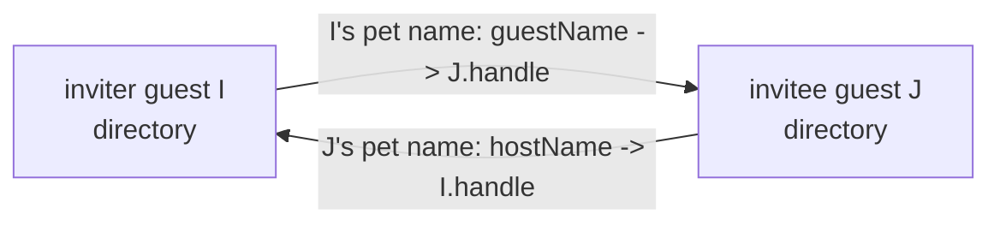

# Guest-Native Invitation and Acceptance

| | |
|---|---|
| **Created** | 2026-09-02 |
| **Author** | kriskowal (prompted) |
| **Status** | Not Started |

## What is the Problem Being Solved?

Today only an `EndoHost` can extend or redeem an invitation: `invite` and
`accept` are defined in `src/host.js` and guarded by `HostInterface` in
`src/interfaces.js`. `EndoGuest` (`src/guest.js`, `GuestInterface`) exposes
neither. Any application that wants a guest to onboard another guest has to
borrow host authority and act as a membrane.

That membrane is exactly what `kriscendobot/minion.town` PR 56
(`designs/invitation-only-guest-onboarding.md`) is forced into. Its
capability-first onboarding model is guest-to-guest: "a guest may invite more
guests, transitively"; "extending an invitation does not provision a guest";
each side names the other with an independently chosen pet name. Because no
guest-native facet exists, minion.town's app "is the membrane: it calls the host
method on behalf of the inviting guest." kriskowal's review at
`kriscendobot/minion.town#56` (comment `r3909478669`) closes on the directive:
"Guests must be able to invite and accept." This design closes that daemon gap
so the app exercises only the inviting guest's own authority.

Method names (`invite`, `accept`, `guestName`, `hostName`) are provisional and
track the daemon tool-renaming effort; this design fixes the semantics, not the
spelling.

## Design

### 1. Surface

Add two methods to `EndoGuest`, mirroring the host signatures already in
`types.d.ts` and adding matching guards to `GuestInterface`:

```
guest.invite(guestName: string | string[]): Promise<Invitation>
guest.accept(invitationLocator: string, hostName: string | string[]): Promise<void>
```

- `guestName` is the pet name the **inviting** guest chooses for its
  prospective peer, in its own directory. A path nests under a directory that
  must already exist (same `petNamePathFrom` contract as `host.invite`).
- `hostName` is the pet name the **accepting** guest chooses for the inviter.
- Both names are private to each side. They may differ, and renaming one does
  not touch either agent's formula identifier.
- `invite` returns the `Invitation` exo; the caller calls `E(invitation).locate()`
  to get the transmissible locator string, exactly as with `host.invite`.

The two methods are agent-generic: `invite`/`accept` become part of a shared
agent vocabulary that both `EndoHost` and `EndoGuest` satisfy, rather than a
host-only capability.

### 2. Reciprocal handle exchange, no replacement guest

The defining semantic difference from the host path: a guest accepts **as
itself**. Neither side formulates a fresh guest. The identity each side
presents is its own `handle` (its `@self` façade), and the durable credential
remains the guest's existing formula identifier, per minion.town's model where
"the guest formula identifier is the credential."



Concretely, for inviter guest `I` and invitee guest `J`:

1. `I.invite('new-neighbor')` calls `formulateInvitation(I.agentId, I.handleId,
   'new-neighbor', tasks)`. That maker is already agent-agnostic (it stores
   `hostAgent`/`hostHandle` fields but never assumes a host). A deferred task
   retains the invitation formula under `new-neighbor` in `I`'s own pet store,
   so a re-invite under the same name overwrites and cancels the prior pending
   invitation (consume-once, § 5).
2. `E(invitation).locate()` yields
   `endo://<I.node>/<invitationNumber>@<hints>?type=invitation&from=<I.handleNumber>`,
   where `I.node` is `I`'s agent node number (a guest carries its own Ed25519
   keypair, so its node is its own agent public key) and the hints are `I`'s own
   network addresses from its `@nets` directory. `fromNode` is set when the
   handle node differs from the daemon node.
3. `J.accept(locator, 'my-neighbor')` parses the locator, obtains a remote
   presence of the invitation (`provide(invitationId, 'invitation')`), builds
   `J`'s own handle locator (from `J.handleId`, `J`'s agent node, and `J`'s
   network addresses), and calls `E(invitation).accept(J.handleLocator)`.
4. The inviter-side `Invitation.accept` (in `I`'s daemon) binds `J`'s remote
   handle under `new-neighbor` in `I`'s directory via
   `E(I.agent).storeLocator(guestNamePath, jRemoteHandleLocator)`, replacing
   the pending-invitation entry. It does **not** call `formulateGuest`.
5. Back in `J`, `accept` binds `I`'s remote handle under `my-neighbor` in `J`'s
   directory (`storeLocator`).

After this, `I`'s `new-neighbor` and `J`'s `my-neighbor` are ordinary mailable
pet names; `I.send('new-neighbor', ...)` and `J.request('my-neighbor', ...)`
flow over the existing mailbox substrate (`src/mail.js`).

`storeLocator`/`storeIdentifier` are directory methods already shared by both
`HostInterface` and `GuestInterface`, so step 4 needs no new guest authority.

### 3. Authority attenuation

`GuestInterface` gains exactly two guards, `invite` and `accept`. It does **not**
gain `getPeerInfo`, `addPeerInfo`, or `writeRemoteAgentKey`. Those remain absent
from the guest's public surface, so no holder of a guest reference can register
arbitrary daemon peers by calling a public method.

The peer-registration and handle-binding steps that `invite`/`accept` need are
supplied as **narrow daemon-core capabilities injected into `makeGuestMaker`**
(closure captures, the same shape as the existing `formulateEval`,
`formulateMarshalValue`, `getAllNetworkAddresses` injections), not as public exo
methods:

- `registerPeer(peerInfo)` — writes the known-peers entry for a remote daemon.
- `writeRemoteAgentKey(agentNode, daemonNode)` — records agent-key routing when
  a handle's node differs from the daemon node.

The same seam removes the `EndoHost` cast inside `makeInvitation`. Today
`Invitation.locate`/`accept` do `provide(hostAgentId)` and call
`hostAgent.getPeerInfo()` / `hostAgent.addPeerInfo()` on it. Replace those with
daemon-core capabilities that read the agent's own network addresses
(`getAllNetworkAddresses` against the agent's `networks` directory) and register
peers directly, so the invitation machinery works uniformly whether the bound
agent is a host or a guest.

Security argument for letting a guest cause peer registration at all: an
invitation locator already conveys the remote daemon's node key and addresses to
whoever holds it. Registering that peer only teaches the local daemon how to
dial a node the holder was already told about; it grants no authority over any
formula the guest did not already receive a capability to. The registration is
reachable only from inside the two invitation method bodies, each gated by
possession of a live invitation. A guest still cannot reach the endo bootstrap
(`@endo`), enumerate or resolve arbitrary formulas, or obtain the host
bootstrap; its special-name namespace stays `@agent`/`@self`/`@host`/`@mail`/
`@nets`/`@planes` (`makePetSitter`, `src/pet-sitter.js`).

### 4. Same-daemon vs cross-daemon

The flow is uniform; only peer setup differs.

- **Same daemon** (`I` and `J` are guests of one daemon): the locator's node
  equals the local node, `provide(invitationId, 'invitation')` resolves the
  local exo directly, and `registerPeer` is a no-op for the local node. Both
  reciprocal bindings are local directory writes. No network transport is
  touched.
- **Cross daemon**: `registerPeer` records the remote daemon (and
  `writeRemoteAgentKey` records agent-key routing when a guest's node differs
  from its daemon node), the remote invitation and handles resolve as remote
  presences over the established peer connection (`src/remote-control.js`,
  `src/networks/`), and the crossed-hello race is handled by the existing
  remote-control accept-bias state machine.

Because guests carry their own agent node keys, the `from`/`fromNode` and
`handleNode` locator query parameters that already distinguish agent-key nodes
from daemon nodes are exercised on both sides of a guest-to-guest exchange, not
just when a host redeems.

### 5. Cancellation and consume-once

An invitation is consumed exactly once. The single revocation signal is the
invitation formula controller's `context.cancelled` (`src/context.js`), per the
daemon's standard `cancelled` `Promise<never>` cancellation shape. `accept`
cancels it under the formula graph lock:

```
await withFormulaGraphLock(async () => {
  const controller = provideController(invitationId);
  await controller.context.cancel(harden(Error('Invitation accepted')));
  // ... bind reciprocal handle inside the same critical section ...
});
```

Two revocation paths converge on the same signal:

- **Redemption**: the first `accept` cancels the controller; a second `accept`
  observes an already-cancelled controller and fails without re-binding.
- **Overwrite**: re-invoking `invite` under the same `guestName`, or otherwise
  overwriting that pet-store entry, must cancel the pending invitation so it can
  no longer mutate the entry. `invite`'s deferred task wires this fate-sharing.

This design supersedes the current `makeInvitation.accept` TODO
("ensure that this is sufficient to cancel the previous incarnation ... such
that it can no longer be redeemed, and such that overwriting the invitation also
revokes the invitation"). The builder must prove both paths with tests (§ 8),
not assume `cancel` suffices; § Open questions records the residual doubt about
revoking prior incarnations across a restart.

### 6. Concurrency

All formula-graph mutation stays under the existing global `withFormulaGraphLock`
(`src/manager.js`), so the compare-cancel-bind critical section in § 5 is atomic
against a concurrent second `accept`: the loser sees the cancelled controller.
The inviter-side bind and the acceptor-side bind are independent single-writer
directory updates on their own daemons; message-number assignment on the
resulting relationship remains serialized by the mailbox `SerialJobs`
(`src/mail.js`, `mailboxStoreJobs`). No new concurrency primitive is introduced.

### 7. Crash recovery

- A **pending** invitation is a persisted `invitation` formula
  (`{ type, hostAgent, hostHandle, guestName }`, `src/formula-record.js`) whose
  maker `makeInvitation` re-creates the exo on incarnation, so it survives a
  restart of the inviter's daemon and is still redeemable.
- A **completed** relationship is two durable `storeLocator` bindings plus the
  peer/known-peers entries; guest incarnation (`src/manager.js` `guest:` maker,
  which recovers `agentNodeNumber` from `persistencePowers.listAgentKeys()`)
  re-hydrates both guests and their directories. No `@pins` guest is minted, so
  there is no pinned intermediate to revive.
- **Mid-accept crash**: `accept` performs a remote call (inviter-side bind) and
  then a local bind. The two are not one transaction across daemons. The builder
  must make `accept` idempotent and safe to re-drive: cancellation is the
  commit point, so a crash after the inviter cancels-and-binds but before the
  acceptor's local bind must, on retry, detect the already-consumed invitation
  and complete (or cleanly report) the acceptor-side binding rather than
  double-consuming or wedging. The precise recovery ordering is an open
  question (§ Open questions).

### 8. Test plan

**Retain and keep green** the existing host invitation coverage, which exercises
the shared invitation core: the `invite, accept, and send mail` family and
`invite nests the invitation at a directory path` in `test/endo.test.js`; the
cross-daemon retention suite `test/_multiplayer-suite.js` driven by
`test/invite-retention.test.js` (tcp-netstring) and
`test/invite-retention-ocapn.test.js` (ocapn), including its restart case
(`invite/accept works across restart`), `three-party invite with partition and
recovery`, and `sub-invitation chain (A->B->C) collects C-side resources after C
release`; and `test/peer-formula-revocation.test.js`. Where converging the host
path onto the reciprocal-own-handle model (§ Open questions) changes an
assertion about a minted `@pins/guest-*` formula, update the assertion to the
new binding while preserving its GC/retention intent (`formulaExistsInDb`
checks), never by deleting the coverage.

**Add** guest-native coverage that mirrors the retained shapes:

- Same-daemon `guest.invite` / `guest.accept` round trip: two guests of one
  daemon, reciprocal pet-name binding, mail both directions, no new guest
  formula created (assert formula count/kind).
- Cross-daemon guest-to-guest over both `_multiplayer-suite.js` networks
  (tcp-netstring and ocapn), with the retention/GC assertions.
- Transitive guest chain `I -> J -> K` (the minion.town "a guest may invite more
  guests, transitively" case): `J` accepts from `I`, then `J.invite`s `K`, and
  resources collect correctly on release.
- Consume-once: a second `accept` of a redeemed locator rejects; an `invite`
  overwrite cancels the pending invitation.
- Restart with a pending guest invitation, and restart after a completed
  guest relationship.

Every lint and test CI run is run locally first per the project's pre-push
gates.

### 9. Implementation sketch

- `src/interfaces.js`: add `invite`/`accept` guards to `GuestInterface`
  (reuse `NameOrPathShape`, `LocatorShape`, matching `HostInterface`).
- `src/guest.js` (`makeGuestMaker` / `makeGuest`): add `invite` and `accept`
  method bodies analogous to `host.js`, using the injected `registerPeer` /
  `writeRemoteAgentKey` daemon-core capabilities and the guest's own
  `agentNodeNumber` + `getAllNetworkAddresses(networksDirectoryId)` to build its
  handle locator; bind the inviter's remote handle under `hostName`; do not
  `formulateGuest`. Add the two methods to the returned `guest` record.
- `src/manager.js` (`makeInvitation`, and the `makeGuestMaker(...)`
  instantiation): drop the `EndoHost` cast in `locate`/`accept`; compute peer
  info and register peers via daemon-core capabilities; bind the acceptor's own
  remote handle under `guestName` instead of `formulateGuest` + `@pins` pin;
  inject `registerPeer`/`writeRemoteAgentKey` into `makeGuestMaker`.
- `src/types.d.ts`: add `invite`/`accept` to the `EndoGuest` type; correct the
  stale `Invitation.accept` return type (`{ syncedStoreNumber }` no longer
  matches the returned `{ guestPublicKey }`).

## Dependencies

| Design | Relationship |
|---|---|
| `kriscendobot/minion.town` `designs/invitation-only-guest-onboarding.md` | Downstream consumer; this closes the daemon gap it names. Cite as plain text, not a cross-repo link. |
| [familiar-deep-link-invitations](familiar-deep-link-invitations.md) | Sibling consumer of `invite`/`accept`; currently routes through `host.accept`. May move to the guest facet once this lands. |

## Open questions

- Should the host invitation path converge onto the same reciprocal-own-handle
  model (no minted guest), or keep minting a per-relationship guest for hosts
  while only guests use the no-mint path? Convergence is cleaner and removes the
  `EndoHost` cast entirely, but changes host `accept` semantics and the retained
  host tests.
- What was the `@pins/guest-<leaf>` local guest minted by the current
  `host.accept` / `makeInvitation.accept` actually protecting? The
  `_hostNameFromGuest` "previously used by synced pet stores" comment suggests
  it is a vestige of a retired synced-pet-store flow. Before deleting the mint,
  the builder must confirm it carries no live retention or GC guarantee that
  needs preserving another way, so the `_multiplayer-suite.js` retention
  assertions do not silently weaken.
- What is the exact idempotent recovery ordering for a mid-`accept` crash
  (§ 7)? Which side's bind is the commit point, and how does a re-driven
  `accept` distinguish "already consumed by me" from "consumed by someone else"?
- Does cancelling the invitation controller under the formula graph lock revoke
  prior incarnations of the invitation across a restart, or can a stale
  incarnation still be redeemed? This is the unresolved half of the current
  `makeInvitation.accept` TODO; the builder must verify with a restart test.
- Should peer registration triggered by a guest `accept` be rate-limited or
  bounded per guest, given a guest can now grow the daemon's known-peers set (to
  nodes it holds valid invitations for)? Likely out of scope for the first
  increment; name a follow-up if deferred.

## Prompt

> Design the Endo daemon API that lets every `EndoGuest` both extend and accept
> invitations directly. The required surface should support `guest.invite(guestName)`
> and `guest.accept(invitationLocator, hostName)` (names remain provisional while
> the daemon tool renaming settles), consume an invitation once, accept into the
> calling guest without minting a replacement guest, and bind reciprocal handles
> under independently chosen pet names. Cover same-daemon and cross-daemon
> semantics, authority attenuation, cancellation, concurrency, crash recovery,
> and retained integration tests. The current `llm` surface exposes `invite` and
> `accept` only on `EndoHost`; `EndoGuest` exposes neither. This closes the
> dependency identified by kriskowal's review of `kriscendobot/minion.town#56`
> (comment `r3909478669`).
