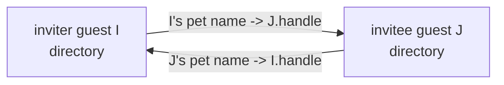

# Guest-Native Invitation and Acceptance

| | |
|---|---|
| **Created** | 2026-09-02 |
| **Updated** | 2026-09-02 |
| **Author** | Kris Kowal (prompted) |
| **Status** | Not Started |

## What is the Problem Being Solved?

An **invitation** is how two Endo agents become mutual peers.
The inviter mints a one-time locator, hands it to the invitee out of band, and
when the invitee accepts, each side binds a durable pet name for the other,
after which they can exchange messages over the existing mailbox substrate.
An **`EndoHost`** is the privileged agent a daemon creates for its operator; it
can register daemon peers and formulate new agents.
An **`EndoGuest`** is a subordinate agent that a host (or, after this design,
another guest) onboards, with a deliberately attenuated surface.

Today only an `EndoHost` can extend or redeem an invitation.
`invite` and `accept` are defined in `packages/daemon/src/host.js` and guarded by
`HostInterface` in `packages/daemon/src/interfaces.js`.
`EndoGuest` (`packages/daemon/src/guest.js`, `GuestInterface`) exposes neither.
Today's `host.accept` does not merely bind a peer: it calls `formulateGuest` and
mints a **fresh `@pins/guest-*` guest** to stand for the relationship
(`packages/daemon/src/manager.js` `makeInvitation.accept`), so redeeming an invitation into an
existing guest is not something the current surface offers at all.
Any application that wants a guest to onboard another guest has to borrow host
authority and act as a membrane.

That membrane is exactly what
[minion.town#56](https://github.com/kriscendobot/minion.town/pull/56)
(`designs/invitation-only-guest-onboarding.md` in that repo) is forced into.
Its capability-first onboarding model is guest-to-guest: "a guest may invite
more guests, transitively"; "extending an invitation does not provision a
guest"; each side names the other with an independently chosen pet name.
Because no guest-native facet exists, minion.town's app "is the membrane: it
calls the host method on behalf of the inviting guest."
Kris Kowal's review at
[minion.town#56 (comment `r3909478669`)](https://github.com/kriscendobot/minion.town/pull/56#discussion_r3909478669)
closes on the directive: "Guests must be able to invite and accept."
This design closes that daemon gap so the app exercises only the inviting
guest's own authority.

The method and parameter names in this design (`invite`, `accept`, and the
role-neutral `correspondentName` introduced in section 1) are provisional.
They track the daemon tool-renaming effort in
[daemon-locator-terminology](daemon-locator-terminology.md); this design fixes
the semantics and the parameter *roles*, not the final spelling.

## Design

### 1. Surface

Add two methods to `EndoGuest`.
Rather than copy the host signatures, hoist the `invite`/`accept` guards into a
shared record and spread it into both interfaces (section 9), so the vocabulary
is defined once:

```ts
guest.invite(correspondentName: string | string[]): Promise<Invitation>
guest.accept(invitationLocator: string, correspondentName: string | string[]): Promise<void>
```

- On `invite`, `correspondentName` is the pet name the **inviting** guest chooses for its
  prospective peer, in its own directory.
  The array form is a path, and it nests under a directory that must already
  exist (the same `petNamePathFrom` contract as `host.invite`).
- On `accept`, `correspondentName` is the pet name the **accepting** guest chooses for the
  inviter.
- The parameter is spelled `correspondentName` on both facets on purpose.
  The relation is symmetric (in a guest-to-guest exchange the inviter is itself a
  guest), so naming either party's pet name after a role (`guestName`/`hostName`)
  would reintroduce the host/guest asymmetry this design exists to remove.
  `hostName` in particular collides with the `@host` special name a guest
  already carries for its *creating* host (`packages/daemon/src/guest.js`).
  Hoisting the guard (section 9) replaces the host's `invite`/`accept`
  declarations too, so `EndoHost.invite`'s `guestName` parameter
  (`packages/daemon/src/types.d.ts:1815`) is renamed to `correspondentName` in the
  same change. The parameter is positional, so no *caller* breaks, but the rename
  is **not** documentation-only: the spelling is user-visible in `help()` text and
  in the CLI grammar, so it also touches `packages/daemon/src/help.md`,
  `help-text-data.js`, and the `packages/cli` positionals — the full artifact list
  is in section 9, and `help()` is the guest's only discovery entry point (section
  3), so those edits are what make the new guest methods discoverable at all.
- Both names are private to each side.
  They may differ, and renaming one does not touch either agent's formula
  identifier.
- `invite` returns the `Invitation` exo; the caller calls `E(invitation).locate()`
  to get the transmissible locator string, exactly as with `host.invite`.

The two methods are agent-generic: `invite`/`accept` become part of a shared
agent vocabulary that both `EndoHost` and `EndoGuest` satisfy (via the shared
`EndoAgent` base type and a shared guard record, section 9), rather than a
capability duplicated onto each.

**Reading invitation state.**
An `invite` under a `correspondentName` leaves a *pending* entry that later becomes
a *redeemed* one: the entry holds the pending `invitation` formula until `accept`
overwrites it with the acceptor's bound handle (section 5).
The two states are not interchangeable, and a caller must be able to tell them
apart before acting.
The affordance that answers this cold is `locate(correspondentName)`, already on
`GuestInterface` (`packages/daemon/src/interfaces.js:102`): the returned locator
carries `?type=invitation` while pending and `?type=handle` once redeemed
(`packages/daemon/src/locator.js:187-193`), so a caller reads the discriminating
field (`type`) directly, whatever its subscription history.
This is deliberately **not** `followNameChanges`, which the earlier draft cited:
that affordance yields `{ add: name, value: { number, node } }`
(`packages/daemon/src/pet-store.js:132-145`) — a bare identifier with no kind — and
only discriminates for a consumer subscribed *across* the transition, so a UI that
attaches after a restart sees one `add` and cannot tell pending from joined.
A guest cannot introspect a formula's kind (`getFormulaForId` is host-only,
`packages/daemon/src/host.js:2204-2214`), so `locate`'s `type` is the guest-facet
answer the named consumer (minion.town's onboarding UI) uses to answer "has my
invitee joined?".

The only reliable **revocation** verb is overwrite — re-`invite` under the same
`correspondentName`, whose deferred task cancels the prior pending invitation
(section 5). `remove` and `rename` are *not* revocation verbs, contrary to the
earlier draft: with formula collection off (the shipped default, section 5)
`remove` deletes only the pet-store row while the persisted `invitation` formula
remains reincarnatable via `provideController`, and `rename` merely *moves* the
binding (`packages/daemon/src/pet-store.js:182-207`) so the invitation stays live
under the new name while redemption still binds at the path captured at mint
(`makeInvitation` fixes `guestName` at mint, `packages/daemon/src/manager.js:6653-6659`).
The invitation's identity is therefore its **formula id**, not the mutable pet
name; section 5 states what each verb actually does and section 7's Open Questions
records the residual on cancelling a pending invitation out from under a stale
name.

**Failure surface.**
`accept` returns `Promise<void>`, and sections 5 and 7 ask callers to distinguish
outcomes, so the failure modes must be discriminable at the call site rather than
by string-matching an error message.
So that every terminal state the design's own verbs can produce maps onto a tag,
the invitation records its **terminal disposition as a value** — a small field on
the invitation formula record (or beside the binding), written at the consume
commit — rather than leaving the outcome to be inferred from "the pet-store place
no longer holds a pending formula". That value distinguishes the four histories a
bare place cannot: `redeemed-by-me`, `redeemed-by-other`, `overwritten` (a later
re-`invite`), and `revoked`, plus the residual `entry-absent` (a `remove` with the
formula still reincarnatable, section 5).
`accept` then rejects with a tagged error whose reason names one of:
- `already-consumed` — the disposition is `redeemed-by-other` or `overwritten`
  ("this invite link was already used");
- `already-accepted` — the disposition is `redeemed-by-me`, the idempotent
  re-drive case section 7 requires a caller to distinguish from the above (a
  re-driven `accept` completes or cleanly reports its own prior bind rather than
  reporting a stranger's use);
- `unreachable` — the inviter's daemon could not be dialed;
- `malformed-locator` — the locator did not parse.
Recording the disposition as a value is what makes `already-consumed` a positive
fact rather than the mere absence of a formula, and what lets §7's "safe to
re-drive" claim be represented at all.
Both facets route `accept` through the single daemon-core `acceptInvitation`
helper (section 9), so **the helper throws this taxonomy for both facets** — the
contract does not fork by facet even though `accept` is declared once on the
shared `EndoAgent` base (section 9). This replaces today's bare host-facet errors
(`packages/daemon/src/host.js:2045`); the residual host-convergence work (whether
the host path also drops the minted guest) is the first Open Question, but the
error contract converges regardless.

### 2. Reciprocal handle exchange, no replacement guest

The defining semantic difference from the host path is that a guest accepts **as
itself**.
Neither side formulates a fresh guest.

A **handle** is an agent's `@self`: a transmissible reference to just the agent's
identity (the "face" peers name and message), as distinct from the agent's full
authority.
The identity each side presents is its own handle, and the durable credential
remains the guest's existing formula identifier, per minion.town's model where
"the guest formula identifier is the credential."
Binding a peer's handle is therefore *not* the same as minting a guest: it grants
only the ability to address that peer, whereas `formulateGuest` would create a new
subordinate agent (with its own authority and its own `@pins/guest-*` formula)
under the guest's own daemon.
Accepting as itself is what lets this design avoid that mint entirely (sections 7
and 9).

An identifier in this design is a `(number, node)` pair, reassembled by
`formatId({ number, node })`; keep that model in mind through the walkthrough
below, where `I` presents several such pairs.
This design also relies on a **two-kinds-of-node-key** model: a daemon has a node
key (its `localNodeNumber`), and each agent it hosts *additionally* has its own
node key (its Ed25519 handle key). The two coincide for a host but differ for a
guest, which is why the walkthrough carefully distinguishes `I`'s **daemon node**
from `I`'s **agent node** below.



Concretely, for inviter guest `I` and invitee guest `J`:

1. `I.invite('new-neighbor')` calls `formulateInvitation(I.agentId, I.handleId,
   'new-neighbor', tasks)`.
   That maker is already agent-agnostic (it stores `hostAgent`/`hostHandle`
   fields but never assumes a host).
   A deferred task retains the invitation formula under `new-neighbor` in `I`'s
   own pet store, so a re-invite under the same name overwrites and cancels the
   prior pending invitation (consume-once, section 5).
2. `E(invitation).locate()` yields
   `endo://<I.daemonNode>/<invitationNumber>@<hints>?type=invitation&from=<I.handleNumber>&fromNode=<I.agentNode>`,
   where the URL authority `<I.daemonNode>` is **I's daemon node number, not I's
   agent key**.
   The invitation locator carries only `type`, `from`, and a conditional `fromNode`
   (the parameters `locate()` actually emits, `packages/daemon/src/manager.js:6661-6680`);
   `handleNode` is **not** an invitation-locator parameter — it belongs to the
   separate *handle* locator that `host.accept` writes and `Invitation.accept`
   reads (`packages/daemon/src/host.js:2066-2078`, `packages/daemon/src/manager.js:6701`),
   carrying the acceptor's own agent node in step 3.
   `getPeerInfo` returns `{ node: localNodeNumber }` (the daemon's node key,
   `packages/daemon/src/host.js`), and the acceptor feeds that authority straight into
   `addPeerInfo({ node })` and into `formatId({ number, node })` to resolve the
   invitation formula, which `formulateInvitation` minted on the daemon node
   (`packages/daemon/src/manager.js`).
   Putting I's agent key in the authority would rebuild an invitation id for a
   formula that does not exist and register an undialable peer, so the authority
   must stay the daemon node.
   I's own agent identity (the guest's Ed25519 handle key) travels separately in
   the `from`/`fromNode` query parameters, which already carry an agent-key node
   distinct from the daemon node.
   The `<hints>` are the **inviting agent's** advertised network addresses,
   discussed next.
3. `J.accept(locator, 'my-neighbor')` parses the locator, obtains a remote
   presence of the invitation (`provide(invitationId, 'invitation')`), builds
   `J`'s own handle locator (from `J.handleId`, `J`'s agent node, and `J`'s
   advertised network addresses), and calls `E(invitation).accept(J.handleLocator)`.
4. The inviter-side `Invitation.accept` (in `I`'s daemon) binds `J`'s remote
   handle under `new-neighbor` in `I`'s directory via
   `E(I.agent).storeLocator(correspondentNamePath, jRemoteHandleLocator)`, replacing the
   pending-invitation entry.
   It does **not** call `formulateGuest`.
5. Back in `J`, `accept` binds `I`'s remote handle under `my-neighbor` in `J`'s
   directory (`storeLocator`).

After this, `I`'s `new-neighbor` and `J`'s `my-neighbor` are ordinary mailable
pet names.
`I.send('new-neighbor', ...)` and `J.request('my-neighbor', ...)` flow over the
existing mailbox substrate (`packages/daemon/src/mail.js`).

`storeLocator`/`storeIdentifier` are directory methods already shared by both
`HostInterface` and `GuestInterface`, so step 4 needs no new guest authority.

**Where a guest's connection hints come from.**
Reachability is a property of an agent's networks directory, not of the guest
agent's authority.
This design sources an invitation's connection hints from the **inviting agent's
own `@nets`**, exactly as
[daemon-agent-network-identity](daemon-agent-network-identity.md) prescribes:
that design gives every agent (host and guest) its own networks directory and
routes `locate()`, `getPeerInfo()`, and invitation construction through it, with
an empty `@nets` being the deliberate default for an agent that "should not be
directly reachable" and "the foundation for anonymizing personas."
This design therefore **composes with** that model rather than overriding it: it
does not read the guest's empty `@nets` as an accident to route around by
advertising the daemon's shared addresses, which would silently un-attenuate
every guest locator.
A guest's own `@nets` directory starts empty by construction
(`formulateGuestDependencies` gives each guest "its own (initially empty)
networks directory," `packages/daemon/src/manager.js`, asserted by `test/endo.test.js` "guest
@nets starts empty"), and networks reach a guest's `@nets` only when a host
`move`s one in (`test/_multiplayer-suite.js`).
Two consequences follow, both stated as preconditions:

- Same-daemon guest-to-guest needs no hints at all (section 4), so it works
  regardless of `@nets` contents.
- Cross-daemon guest-to-guest is reachable exactly when the inviting guest's
  `@nets` has had a network moved in by its host.
  A guest whose `@nets` is empty can still invite same-daemon peers but cannot be
  dialed across daemons; that is the anonymizing-persona default, not a defect.
  This is the same "populate the agent's networks directory to be reachable"
  precondition hosts already meet, applied to the guest facet.

Until per-agent networks are wired into invitation construction for both facets
(`daemon-agent-network-identity` tracks that work), the builder threads the
inviting agent's `networksDirectoryId` into `getAllNetworkAddresses` in the
invitation path (section 9) rather than defaulting to the daemon's shared
networks directory.

### 3. Authority attenuation

`GuestInterface` gains exactly two public guards, `invite` and `accept`.
It does **not** gain the public methods `getPeerInfo`, `addPeerInfo`, or a public
`writeRemoteAgentKey` guard.
Those stay absent from the guest's public surface, so no holder of a guest
reference can register arbitrary daemon peers by calling a public method.

The peer-registration and handle-binding steps that `invite`/`accept` need are
supplied as **narrow daemon-core capabilities injected into `makeGuestMaker`**:
closure captures, the same shape as the existing `formulateEval`,
`formulateMarshalValue`, and `getAllNetworkAddresses` injections, and reachable
only from inside the two method bodies, never as guest exo methods the interface
guards.

Crucially, the injected capabilities are **already narrowed to enforce the
overwrite policy**, so the refuse-to-overwrite obligation is a property of the
capability rather than prose a builder must remember to apply at each call site
(decomplecting the policy from its use):

- `accept` receives only the shared `acceptInvitation` helper (section 9), which
  carries the whole register-peer -> record-agent-key -> bind sequence with the
  refuse-to-overwrite check baked in; it does **not** receive the raw
  `registerPeer` / `writeRemoteAgentKey` daemon-global writes.
- `invite` receives an **insert-only** `registerPeer` (a pre-narrowed capability
  that refuses to overwrite a differing known-peers entry and refuses to rebind a
  differing agent key, rejecting rather than mutating), not the raw daemon-global
  write.

Because the raw daemon-global writes are never handed to a method body, "the
builder must remember to refuse an overwrite" is not a standing hazard: the only
peer-registration authority the two bodies can reach already refuses.

The same seam removes the `EndoHost` cast inside `makeInvitation`.
Today `Invitation.locate`/`accept` do `provide(hostAgentId)` and call
`hostAgent.getPeerInfo()` / `hostAgent.addPeerInfo()` on it, casting the bound
agent to a host.
Those become daemon-core capabilities that read the **inviting agent's own**
network addresses (`getAllNetworkAddresses` against that agent's `@nets`, section
2) and register peers directly, so the invitation machinery works uniformly
whether the bound agent is a host or a guest.

Security argument for letting a guest cause peer registration at all. The
registration is reachable only from inside the two invitation method bodies (a
lexical boundary, not a capability property), and it fires on the caller-supplied
locator string *before* `provide(invitationId, 'invitation')` validates the
invitation, so the argument cannot lean on invitation liveness (a live invitation
would otherwise have let the acceptor prove the inviter meant to reach it; without
that, the write must be independently safe). Because the writes on the two sides
of the exchange are driven by *different* suppliers, the safety argument is stated
**separately per direction**, naming who supplies the written values:

- **Acceptor side** (guest `J` redeems `I`'s locator): the written node key and
  addresses come from `I`'s locator, which already conveyed the remote daemon's
  node key and addresses to whoever holds it. Registering that peer only teaches
  `J`'s daemon how to dial a node `J` was already told about; it grants no
  authority over any formula `J` did not already receive a capability to.
- **Inviter side** (`I`'s daemon runs `Invitation.accept` on `J`-supplied node and
  addresses, `packages/daemon/src/manager.js:6704-6724`): here the *acceptor*
  chooses which node `I`'s daemon registers and which addresses it will dial, so
  the locator-holder argument does **not** transfer. This direction is safe only
  because the injected capability is insert-only: an attacker holding a leaked
  locator can cause `I`'s daemon to learn a *new* peer of the attacker's choosing
  but cannot **rewrite** an existing known-peers entry or rebind an existing agent
  key that `I`'s host relies on. Bounding purely-additive attacker-chosen growth of
  `I`'s known-peers set is Open Question 5.

Two daemon-global writes are newly reachable from this attenuated facet, and each
needs its own overwrite analysis, not one shared caveat:

- `addPeerInfo` **overwrites** an existing known-peers entry when the addresses
  differ (`packages/daemon/src/manager.js`), and known-peers is daemon-global, so a guest
  redeeming a locator that names an already-known node would rewrite the daemon's
  addresses for a peer the host also uses.
  The insert-only capability above refuses to overwrite a differing existing entry
  rather than treating registration as purely additive. That refusal narrows a
  deliberate replacement path — `addPeerInfo`'s differing-addresses branch is an
  explicit stale-peer replacement (`packages/daemon/src/manager.js:3982-4020`), so
  scoping the refusal to the **guest** facet (the host facet keeps its replacement
  behavior) is what lets a peer whose addresses legitimately changed still
  re-register through the host; converging the host facet is deferred to the host
  convergence question.
- `writeRemoteAgentKey` is `INSERT OR REPLACE` and daemon-global
  (`packages/daemon/src/manager-database.js`), driven by the acceptor-supplied `fromNode`/
  `handleNode` on the inviter side and the inviter-supplied values on the acceptor
  side, so it too can rebind an existing agent key's daemon routing.
  The same insert-only capability refuses to rebind a differing entry, on **both**
  the inviter and acceptor sides of the exchange.

A guest still cannot reach the endo bootstrap (`@endo`), enumerate or resolve
arbitrary formulas, or obtain the host bootstrap; its special-name namespace stays
`@agent` / `@self` / `@host` / `@mail` / `@nets` / `@planes` (`makePetSitter`,
`packages/daemon/src/pet-sitter.js`). This is an attenuation property, not a third
daemon-global write.

### 4. Same-daemon vs cross-daemon

The flow is uniform; only peer setup differs.

- **Same daemon** (`I` and `J` are guests of one daemon): the locator's daemon
  node equals the local daemon node, `provide(invitationId, 'invitation')`
  resolves the local exo directly, and the accept skips peer registration for the
  local node.
  That self-node skip lives in the invitation method body; note that `addPeerInfo`
  itself has no self-node guard (`packages/daemon/src/manager.js`), so the guard cannot be assumed
  downstream.
  The skip must cover the **sibling** `writeRemoteAgentKey` write too: a guest
  handle's node is always its own agent key, so a same-daemon accept otherwise
  satisfies `handleNode !== daemonNode` and would write a `remote_agent_key` row for
  a *local* key (`INSERT OR REPLACE`, `packages/daemon/src/manager-database.js:203`).
  Routing tolerates it (`isLocalKey` consults `hasAgentKey` first,
  `packages/daemon/src/manager.js:866-868`), but the row should not be written at
  all, so the self-node skip is scoped to both writes, not just peer registration.
  Both reciprocal bindings are local directory writes; no network transport is
  touched.
- **Cross daemon**: `registerPeer` records the remote daemon (and
  `writeRemoteAgentKey` records agent-key routing when a guest's node differs from
  its daemon node), the remote invitation and handles resolve as remote presences
  over the established peer connection (`packages/daemon/src/remote-control.js`, `packages/daemon/src/networks/`),
  and the crossed-hello race is handled by the existing remote-control accept-bias
  state machine.

Because guests carry their own agent node keys, the locator query parameters that
already distinguish agent-key nodes from daemon nodes are exercised on both sides
of a guest-to-guest exchange, not just when a host redeems: the invitation
locator's `from`/`fromNode` (step 2) carry the inviter's agent node, and the
separate handle locator's `handleNode` (step 3) carries the acceptor's agent node.

### 5. Cancellation and consume-once

An invitation is consumed exactly once, and the **durable** consume-once record is
the pet-store binding, not an in-memory signal, and not the eventual collection of
a formula.
When `accept` succeeds it overwrites the inviter's `correspondentName` entry (which until
then referenced the pending `invitation` formula) with the acceptor's remote
handle (section 2, step 4).
That overwrite is the commit, and it is observable without any garbage collector:
the entry now resolves to a bound peer handle, and a second `accept` re-reads the
entry, sees it no longer references a pending `invitation` formula, and rejects
with `already-consumed` (section 1) without re-binding.
Because the check is "does this entry still point at the pending invitation,"
consume-once holds whether or not formula collection is enabled.
This matters because collection is **off by default** in the shipped daemon:
`onCollect` early-returns unless `enableFormulaCollection` (`packages/daemon/src/manager.js`), and
`gcEnabled = process.env.ENDO_GC === '1'` is unset in production
(`packages/daemon/src/manager-node.js`; `packages/daemon/DEBUGGING.md` "off by default for now").
So the design must not rest consume-once on the invitation formula being collected
after de-reference; collection is orthogonal cleanup, and reclaiming the storage
is a bonus, not the correctness mechanism.

Cancellation of the invitation controller is the **in-process liveness** half that
makes any reference still live in memory fail fast; it is *not* the durable ledger,
and — this is the load-bearing correction over the earlier draft — it must **not**
share a serialization point with the commit:

```js
// 1. The commit and the serialization point: an atomic compare-and-set on the
//    pet-store entry. Overwrite `correspondentNamePath` with the acceptor's remote
//    handle ONLY IF it still resolves to the pending `invitation` formula. This is
//    the durable consume-once record; the loser's CAS sees a bound handle and the
//    caller rejects with `already-consumed`. It runs on the pet store's own
//    single-writer job queue — NOT the formula-graph queue.
const won = await E(inviterAgent).storeLocatorIfMatches(
  correspondentNamePath, invitationId, acceptorHandleLocator,
);
if (!won) throw makeInvitationError('already-consumed');

// 2. Best-effort in-memory liveness, OUTSIDE any formula-graph enqueue. This is
//    cleanup, not the commit: it may run before or after step 1 without affecting
//    correctness, because a reincarnated controller cannot re-win the CAS above.
const controller = provideController(invitationId);
await controller.context.cancel(harden(Error('Invitation accepted')));
```

**Why the commit must not run inside `formulaGraphJobs.enqueue`.** `formulaGraphJobs`
is a strict one-token serial queue (`packages/daemon/src/serial-jobs.js`). A *raw*
`formulaGraphJobs.enqueue(...)` runs its body with `formulaGraphLockDepth` still
`0` (only `withFormulaGraphLock` increments that counter, `packages/daemon/src/manager.js:563-575`).
The body here calls `provideController(invitationId)`, which on a cold cache reaches
`evaluateFormulaForId` -> `getFormulaForId` -> `withFormulaGraphLock`
(`packages/daemon/src/manager.js:4324,1255`); seeing depth `0`, that nested call
tries to `enqueue` on the *same single token the outer enqueue still holds* and
hangs forever — exactly the post-restart cold-cache path section 7 requires.
The consume-once mechanism therefore rests on the pet-store compare-and-set alone
(a conditional write serialized by the pet store's own single-writer queue), never
on the formula-graph queue. Cancellation runs afterward, unqueued.

Why cancellation alone would be insufficient: `context.cancel` does
`controllerForId.delete(id)` (`packages/daemon/src/context.js`), and `provideController`
re-evaluates the **persisted** `invitation` formula on its next call
(`packages/daemon/src/manager.js`), whether or not collection is on.
A second `accept` that observed only a cancelled controller would reincarnate a
live invitation — but that reincarnation still loses the compare-and-set, so
consume-once holds regardless. Consume-once hinges only on the pet-store entry no
longer pointing at the invitation, a positive, GC-independent fact.

Two paths reach that pet-store overwrite — redemption (consumption) and revocation:

- **Redemption**: the first `accept` wins the compare-and-set, binding the
  acceptor's handle; a second `accept` loses it, finds a bound handle, and fails
  with `already-consumed` (section 1), without re-binding.
- **Revocation by overwrite**: re-invoking `invite` under the same
  `correspondentName` replaces the invitation reference, and `invite`'s deferred
  task cancels the prior pending invitation so it can no longer mutate the entry.
  This is the **only** reliable revocation verb.

`remove` and `rename` do **not** retire a pending invitation, contrary to the
earlier draft — the claim was false in both halves. With collection off (the
shipped default above), `remove` deletes only the pet-store row while the persisted
`invitation` formula remains and `provideController` reincarnates it. `rename`
*moves* the binding via `renamePetStoreEntry` (`packages/daemon/src/pet-store.js:182-207`)
so the invitation stays live under the new name; worse, `makeInvitation` captured
`guestName` as a path at mint (`packages/daemon/src/manager.js:6653-6659`) and
redemption binds at that captured path, so a renamed-then-redeemed invitation
writes a second binding at the vacated old name while still pending under the new
one. The invitation's identity is the **formula id**, not the mutable pet name;
making `remove`/`rename` genuinely revoke (by cancelling the controller and
recording a `revoked` disposition, section 1) is scoped work the builder must add,
tracked in the Open Questions.

This design closes the redemption half of the current `makeInvitation.accept` TODO
("ensure that this is sufficient to cancel the previous incarnation ... such that
it can no longer be redeemed, and such that overwriting the invitation also revokes
the invitation").
Note that the current `makeInvitation.accept` calls `await withFormulaGraphLock()`
with **no callback** (`packages/daemon/src/manager.js`), which serializes nothing;
the builder replaces that no-op with the compare-and-set above (section 6), not
with a callback-form `withFormulaGraphLock` (which would reintroduce the deadlock).
The builder must prove both paths with tests (section 8), not assume `cancel`
suffices; the Open Questions section records the residual doubt about revoking
prior incarnations across a restart.

### 6. Concurrency

The compare-overwrite-cancel sequence in section 5 must run under a **real**
serialization point.
Be precise about what the existing `withFormulaGraphLock` (`packages/daemon/src/manager.js`)
provides, because it is easy to over-read.
`withFormulaGraphLock` is a **reentrant depth counter over a serial queue**, not a
mutex.
It increments a *module-level* `formulaGraphLockDepth` **before** it enqueues on
`formulaGraphJobs`, and every entrant first checks that one global counter:
`if (formulaGraphLockDepth > 0) return asyncFn()`.
So a second **top-level** `accept` that arrives while the first is still inside its
`await formulaGraphJobs.enqueue(...)` window sees `depth > 0` and runs **inline,
unqueued**, the opposite of serialized.
The wrapper therefore does **not** serialize top-level concurrent `accept` calls
against one another, and consume-once cannot lean on it.

The serialization point is therefore **not** the formula-graph queue at all.
Enqueuing the critical section directly on `formulaGraphJobs` self-deadlocks
(section 5): the body's `provideController` re-enters `withFormulaGraphLock` at
depth `0` and blocks on the single token the outer enqueue still holds. The
serialization point is instead the **pet-store compare-and-set** — a conditional
overwrite that commits only if the entry still resolves to the pending invitation,
serialized by the pet store's own single-writer job queue, which no invitation
body re-enters. Two concurrent top-level accepts both attempt the CAS; exactly one
wins, and the loser observes the bound handle and rejects `already-consumed`
instead of racing a half-applied bind.
The inviter-side and acceptor-side binds are independent single-writer directory
updates on their own daemons; message-number assignment on the resulting
relationship remains serialized by the mailbox `SerialJobs` (`packages/daemon/src/mail.js`,
`mailboxStoreJobs`).
No new concurrency primitive is introduced, and no formula-graph enqueue wraps the
commit: the fix is to make the consume-once check an atomic compare-and-set on the
pet store, and to run controller cancellation afterward, unqueued.

### 7. Crash recovery

- A **pending** invitation is a persisted `invitation` formula (`{ type,
  hostAgent, hostHandle, guestName }`, `packages/daemon/src/formula-record.js`) whose maker
  `makeInvitation` re-creates the exo on incarnation, so it survives a restart of
  the inviter's daemon and is still redeemable.
- A **completed** relationship is two durable `storeLocator` bindings plus the
  peer/known-peers entries; guest incarnation (`packages/daemon/src/manager.js` `guest:` maker,
  which recovers `agentNodeNumber` from `persistencePowers.listAgentKeys()`)
  re-hydrates both guests and their directories.
  No `@pins` guest is minted (for the guest inviter path), so there is no pinned
  intermediate to revive.
- **Mid-accept crash**: `accept` performs a remote call (the inviter-side bind)
  and then a local bind; the two are not one transaction across daemons.
  The builder must make `accept` idempotent and safe to re-drive.
  Because the inviter-side pet-store compare-and-set is the commit point (section
  5), a re-driven `accept` that runs after the inviter has overwritten-and-bound but
  before the acceptor's local bind has completed reads the recorded
  `redeemed-by-me` disposition (section 1), returns `already-accepted` rather than
  `already-consumed`, and finishes (or cleanly reports) the acceptor-side binding,
  rather than double-consuming or wedging.
  The precise recovery ordering is an open question (the Open Questions section).

### 8. Test plan

**Retain and keep green** the existing host invitation coverage, which exercises
the shared invitation core:

- the `invite, accept, and send mail` family and `invite nests the invitation at a
  directory path` in `test/endo.test.js`;
- the cross-daemon retention suite `test/_multiplayer-suite.js` driven by
  `test/invite-retention.test.js` (tcp-netstring) and
  `test/invite-retention-ocapn.test.js` (ocapn), including its restart case
  (`invite/accept works across restart`), `three-party invite with partition and
  recovery`, and `sub-invitation chain (A->B->C) collects C-side resources after C
  release`;
- `test/peer-formula-revocation.test.js`.

Where converging the host path onto the reciprocal-own-handle model (the Open
Questions section) changes an assertion about a minted `@pins/guest-*` formula,
migrate the assertion to the new binding while preserving its GC/retention intent
(`formulaExistsInDb` checks), never by deleting the coverage.

**Add** guest-native coverage that mirrors the retained shapes:

- Same-daemon `guest.invite` / `guest.accept` round trip: two guests of one
  daemon, reciprocal pet-name binding, mail both directions, no new guest formula
  created (assert formula count/kind).
- Cross-daemon guest-to-guest over both `_multiplayer-suite.js` networks
  (tcp-netstring and ocapn), with the retention/GC assertions, and with the
  inviting guest's `@nets` populated by a host `move` (section 2 precondition).
- Transitive guest chain `I -> J -> K` (the minion.town "a guest may invite more
  guests, transitively" case): `J` accepts from `I`, then `J.invite`s `K`, and
  resources collect correctly on release.
- Consume-once, pinned to run with **`gcEnabled: false`** so the durable
  consume-once record is proven independent of formula collection: a second
  `accept` of a redeemed locator rejects with `already-consumed`; an `invite`
  overwrite cancels the pending invitation; and the pet-store entry is asserted to
  resolve to the bound handle (not merely to be absent) after redemption.
- Pending-state observability: a consumer reading `locate(correspondentName)` sees
  `?type=invitation` while pending and `?type=handle` after the invitee joins
  (section 1's named-consumer question), asserted from a subscription attached
  *after* the transition to prove it does not depend on observing the change live.
- `remove` / `rename` on a **pending** entry (the claim section 5 corrects): assert
  what actually happens — with `gcEnabled: false`, a removed invitation's persisted
  formula is still reincarnatable, and a renamed pending invitation stays live under
  the new name — so the builder's chosen genuine-revocation mechanism (cancel +
  `revoked` disposition) is what the test pins, not the false "the reference is
  dropped" behavior.
- Attenuation: a guest cannot register an arbitrary peer through any public
  method; and the section-3 overwrite refusal, where redeeming a locator that
  names an already-known node with differing addresses is rejected rather than
  silently rewriting the daemon-global entry (on both the `addPeerInfo` and
  `writeRemoteAgentKey` writes).
- Failure taxonomy: `accept` of a malformed locator rejects with
  `malformed-locator`; `accept` against an undialable inviter daemon rejects with
  `unreachable`; a re-driven `accept` of a locator this agent already redeemed
  rejects with `already-accepted` (not `already-consumed`), proving the
  self-consumption case section 7 requires is discriminable from a stranger's use.
- Restart with a pending guest invitation, and restart after a completed guest
  relationship.

Every lint and test run is exercised locally first per the project's pre-push
gates.

### 9. Implementation sketch

- `packages/daemon/src/interfaces.js`: hoist the `invite`/`accept` guards into a shared
  `agentInvitationMethodGuards` record (reusing `NameOrPathShape` and
  `LocatorShape`) and spread it into **both** `HostInterface` and `GuestInterface`,
  the same way the existing shared agent guards are already spread into both, so
  the vocabulary is defined once rather than duplicated.
- `packages/daemon/src/types.d.ts`: add `invite`/`accept` to the shared `EndoAgent` base type that
  both `EndoHost` and `EndoGuest` extend, rather than to each separately, and let
  that replace the per-facet declarations (renaming `EndoHost.invite`'s `guestName`
  to `correspondentName`, section 1); correct the stale `Invitation.accept` return type
  (`{ syncedStoreNumber }` no longer matches the returned `{ guestPublicKey }`), and
  mark its ignored second parameter `hostNameFromGuest?` (`packages/daemon/src/types.d.ts:781`,
  ignored at `packages/daemon/src/manager.js:6685`) as deprecated in the same edit rather than
  leaving it as a live affordance.
- `packages/daemon/src/manager.js` (new daemon-core helper): add a single
  `acceptInvitation(agentId, handleId, locator, correspondentNamePath)` that carries
  the shared accept sequence (parse -> register peer via the insert-only capability
  -> record agent-key routing -> resolve the invitation -> `E(invitation).accept` ->
  compare-and-set the reciprocal handle) and **throws the section-1 taxonomy for
  both facets**, so both `accept` bodies are one call into it and the overwrite-
  refusal and error contract live in one place rather than being copied into
  `host.js` and `guest.js`.
- `packages/daemon/src/guest.js` (`makeGuestMaker` / `makeGuest`): add `invite` and
  `accept` method bodies. `accept` is one call into the injected `acceptInvitation`
  helper. `invite` uses the injected **insert-only** `registerPeer`,
  `formulateInvitation`, and the guest's own `agentNodeNumber` +
  `getAllNetworkAddresses(guestNetworksDirectoryId)` to build its handle locator;
  it binds the inviter's remote handle under `correspondentName` and does not
  `formulateGuest`. The raw daemon-global writes are never injected here (section 3).
  Add the two methods to the returned `guest` record.
  (`makeGuestMaker` today receives `provide`/`getAllNetworkAddresses` but not
  `acceptInvitation`/`formulateInvitation` (`packages/daemon/src/guest.js:37-52`);
  those injections are added here.)
- `packages/daemon/src/manager.js` (`makeInvitation`, and the `makeGuestMaker(...)`
  instantiation): drop the `EndoHost` cast in `locate`/`accept`; compute peer info
  and register peers via the insert-only daemon-core capability; for a **guest**
  inviter, bind the acceptor's own remote handle under the inviter's
  `correspondentName` instead of `formulateGuest` + `@pins` pin.
  The bind-vs-mint policy rides the **persisted invitation formula** as a field
  recorded at mint time, not a runtime test on the inviter's kind, so an invitation
  pending across a later convergence rollout keeps the meaning it was minted with
  and convergence changes only what *new* invitations record.
  A **host**-minted invitation retains the current mint until the retention
  question below (what the `@pins/guest-*` mint protected) is resolved; whether the
  host path also converges onto the no-mint model is the first Open Question.
  Inject the `acceptInvitation` helper, the insert-only `registerPeer`, and
  `formulateInvitation` into `makeGuestMaker`.
- `packages/daemon/src/help.md` + `help-text-data.js`: add the two guest methods
  (`help()` is the guest's only discovery entry point, section 3, so the methods
  are undiscoverable until this lands) and update the existing user-facing spellings
  `## invite(guestName)` / `## accept(...)` to `correspondentName`; regenerate
  `help-text-data.js`. Update `EndoGuest`'s help overview, which currently omits
  that a guest can onboard peers.
- `packages/cli`: rename the `invite <guest-name>` / `accept <guest-name>`
  positionals to the `correspondentName` spelling. No CLI *dispatch* change is
  needed — `withEndoAgent` already routes on the shared `EndoAgent`
  (`packages/cli/src/context.js`), so once guests gain the methods,
  `endo invite <name> --as <guest>` and `endo accept <name> --as <guest>` start
  working as a shipped affordance.

## Dependencies

| Design | Relationship |
|---|---|
| [minion.town#56 `invitation-only-guest-onboarding`](https://github.com/kriscendobot/minion.town/pull/56) | Downstream consumer; this design closes the daemon gap it names. |
| [daemon-agent-network-identity](daemon-agent-network-identity.md) | Composes with; invitation hints are sourced from the inviting agent's own `@nets` per that design's per-agent networks model, with an empty `@nets` meaning "not directly reachable" (section 2). |
| [daemon-locator-terminology](daemon-locator-terminology.md) | Tracks the `invite`/`accept`/`correspondentName` renaming; this design fixes the roles, not the final spelling. |
| [familiar-deep-link-invitations](familiar-deep-link-invitations.md) | Sibling consumer of `invite`/`accept`; currently routes through `host.accept`. May move to the guest facet once this lands. |

## Open Questions

- Should the host invitation path converge onto the same reciprocal-own-handle
  model (no minted guest), or keep minting a per-relationship guest for hosts while
  only guests use the no-mint path?
  This design ships the guest path as no-mint and leaves the host path minting for
  now (the bind-vs-mint policy rides the persisted invitation formula, section 9).
  Convergence is cleaner and would remove the branch, but it changes host `accept`
  semantics and the retained host tests, and it is gated on the retention question
  below.
- What was the `@pins/guest-<leaf>` local guest minted by the current
  `host.accept` / `makeInvitation.accept` actually protecting?
  The `_hostNameFromGuest` "previously used by synced pet stores" comment suggests
  it is a vestige of a retired synced-pet-store flow.
  Before deleting the mint, the builder must confirm it carries no live retention or
  GC guarantee that needs preserving another way, so the `_multiplayer-suite.js`
  retention assertions do not silently weaken.
- What is the exact idempotent recovery ordering for a mid-`accept` crash (section
  7)?
  Which side's bind is the commit point, and how does a re-driven `accept`
  distinguish "already consumed by me" from "consumed by someone else"?
- Does the pet-store compare-and-set plus best-effort controller cancellation
  (section 5) revoke prior incarnations of the invitation across a restart, or can a
  stale incarnation still be redeemed?
  This is the unresolved half of the current `makeInvitation.accept` TODO; the
  builder must verify with a restart test.
- How should `remove` and `rename` on a **pending** invitation be made to genuinely
  revoke it? Section 5 establishes they do *not* today (the persisted formula
  reincarnates after `remove`; `rename` leaves it live under the new name while
  redemption binds at the mint-captured path). The likely mechanism is to have those
  verbs cancel the invitation controller and record a `revoked` disposition
  (section 1) when the entry they touch resolves to a pending invitation, but that
  is scoped work whose exact shape — and whether it belongs in this increment — is
  open.
- Should peer registration triggered by a guest `accept` be rate-limited or bounded
  per guest, given a guest can now grow the daemon's known-peers set (to nodes it
  holds valid invitations for) and can create invitation formulas via
  `formulateInvitation`?
  Likely out of scope for the first increment; name a follow-up if deferred.

## Prompt

> Design the Endo daemon API that lets every `EndoGuest` both extend and accept
> invitations directly. The required surface should support `guest.invite(guestName)`
> and `guest.accept(invitationLocator, hostName)` (names remain provisional while
> the daemon tool renaming settles), consume an invitation once, accept into the
> calling guest without minting a replacement guest, and bind reciprocal handles
> under independently chosen pet names. Cover same-daemon and cross-daemon
> semantics, authority attenuation, cancellation, concurrency, crash recovery,
> and retained integration tests. The current `llm` surface exposes `invite` and
> `accept` only on `EndoHost`; `EndoGuest` exposes neither. This closes the
> dependency identified by kriskowal's review of `kriscendobot/minion.town#56`
> (comment `r3909478669`).
