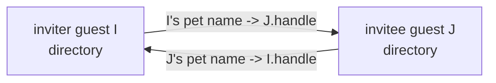

# Guest-Native Invitation and Acceptance

| | |
|---|---|
| **Created** | 2026-09-02 |
| **Updated** | 2026-10-02 |
| **Author** | Kris Kowal (prompted) |
| **Status** | In Progress |

## What is the Problem Being Solved?

An **invitation** is how two Endo agents become mutual peers.
The inviter mints a one-time locator and hands it to the invitee out of band.
When the invitee accepts, each side binds a durable pet name for the other, and
the two can then exchange messages over the existing mailbox substrate.
An **`EndoHost`** is the privileged agent a daemon creates for its operator; it
can register daemon peers and formulate new agents.
An **`EndoGuest`** is a subordinate agent with a deliberately attenuated surface,
onboarded by a host or, after this design, by another guest.

When this design was proposed (2026-09-02), only an `EndoHost` could invite or
accept: `invite` and `accept` lived in `packages/daemon/src/host.js`, guarded by
`HostInterface` in `packages/daemon/src/interfaces.js`, and `EndoGuest`
(`packages/daemon/src/guest.js`, `GuestInterface`) exposed neither.
`host.accept` also called `formulateGuest` and minted a fresh `@pins/guest-*`
guest to stand for the relationship (`makeInvitation.accept` in
`packages/daemon/src/manager.js`), so an invitation could not be redeemed into an
existing guest at all.
*Implementation status* records what has landed since.

An application that wanted a guest to onboard another guest therefore had to
borrow host authority and act as a membrane.
[minion.town#56](https://github.com/kriscendobot/minion.town/pull/56)
(`designs/invitation-only-guest-onboarding.md` in that repo) is forced into
exactly that.
Its onboarding model is guest-to-guest ("a guest may invite more guests,
transitively"; "extending an invitation does not provision a guest"; each side
names the other with an independently chosen pet name), so its app "is the
membrane: it calls the host method on behalf of the inviting guest."
Kris Kowal's review at
[minion.town#56 (comment `r3909478669`)](https://github.com/kriscendobot/minion.town/pull/56#discussion_r3909478669)
closes on the directive: "Guests must be able to invite and accept."
This design closes that daemon gap so the app exercises only the inviting
guest's own authority.

The names `invite`, `accept`, and `correspondentName` are provisional and track
[daemon-locator-terminology](daemon-locator-terminology.md); this design fixes
the semantics and the parameter roles, not the final spelling.

## Implementation status (reconciled 2026-09-30)

Most of this design has landed on `llm`.
This section records what shipped, where it differs from the design, and what
remains.
The rest of the document is the target design, updated to the review decisions
recorded in Open Questions.

**Landed.**

- [#1306](https://github.com/endojs/endo-but-for-bots/pull/1306): callers choose
  `pins`, `networks`, and names for new agents.
  A guest can have its own `@pins` directory, and each mailbox delivery
  reincarnates the values pinned there, which wakes a bot when its guest receives
  a message ([daemon-guest-bot-incarnation](daemon-guest-bot-incarnation.md)).
- [#1305](https://github.com/endojs/endo-but-for-bots/pull/1305): `EndoGuest.invite`.
  The invitation formula names its inviting `EndoAgent`, host or guest.
  The persisted fields are now spelled `invitingAgent`/`invitingHandle`; the
  legacy `hostAgent`/`hostHandle` spellings are still read.
- [#1310](https://github.com/endojs/endo-but-for-bots/pull/1310):
  `EndoGuest.accept(invitationLocator, correspondentName)` and a single
  daemon-core `acceptInvitation` helper that both facets call.
  `EndoHost.accept` uses the same helper, so **neither facet mints a
  replacement guest** and the `@pins/guest-*` pin is gone.
  Peer and agent-key registration is additive only: it may add a route but never
  redirects one.
  Same-daemon accepts skip both registration writes.
  The CLI and the `help` text use `correspondentName`.

**Where the landed code differs from this design.**

| Topic | This design | Landed on `llm` | Resolution |
|---|---|---|---|
| Consume-once serialization | A synchronous pet-store compare-and-set (`storeLocatorIfMatches`) | An in-memory per-invitation `SerialJobs` queue around a check of the captured-path slot, followed by `storeLocator` | Consume-once holds within one process. Durability across a restart moves to the formula-store state machine (section 7). |
| Outcome surface | A returned `{ status }` record | Thrown errors; `accept` resolves `undefined` | Still to do, confirmed by the maintainer (Open Question 7). The returned record is what lets a cross-CapTP caller tell the outcomes apart. |
| Acceptor ordering | Consume on the inviter, then bind locally | Speculative local bind and peer route first, then consume on the inviter, with rollback if that fails and an outcome-unknown error on a timeout | The landed order is kept. The formula-store state machine turns outcome-unknown into a resumable state (section 7). |
| Revocation | Re-`invite` overwrite only; `remove`/`rename` reject | An explicit `Invitation.cancel()` verb | `cancel()` is kept. `remove` becomes revocation through prompt collection, and `rename` is not revocation (section 5). |
| Host-minted pin | Kept for hosts, recorded per invitation | Removed on both facets | Removed. Per-agent pins replace it (Open Question 2). |

**In flight.**

- [#1277](https://github.com/endojs/endo-but-for-bots/pull/1277) (design,
  draft): retention labels and a lifecycle for a guest's hidden `hostPins`,
  including a path-derived invitation pin key.
  The maintainer has asked for #1277 to be retired
  ([comment](https://github.com/endojs/endo-but-for-bots/pull/1116#issuecomment-5939221667)),
  so this design neither depends nor reconciles with it.
  If retiring it leaves a gap, that gap will be designed again on its own terms.
- [#399](https://github.com/endojs/endo-but-for-bots/pull/399)
  ([familiar-deep-link-invitations](familiar-deep-link-invitations.md)):
  `endo://` deep links routed to `accept`, the entry point that provisions a
  guest for a newcomer (section 2, *Onboarding a newcomer*).

## Design

### 1. Surface

Add two methods to `EndoGuest`, declared once in a guard record shared with
`EndoHost` (section 9) rather than copied from the host signatures:

```ts
guest.invite(correspondentName: string | string[]): Promise<Invitation>
guest.accept(invitationLocator: string, correspondentName: string | string[]):
  Promise<{ status: 'joined' | 'already-joined' | 'already-consumed'
                  | 'peer-conflict' | 'name-in-use' | 'revoked' }>
```

- On `invite`, `correspondentName` is the pet name the **inviting** agent chooses
  for its prospective peer, in its own directory.
  The array form is a path nested under a directory that must already exist (the
  `petNamePathFrom` contract of `host.invite`).
- On `accept`, `correspondentName` is the pet name the **accepting** agent chooses
  for the inviter.
- Both names are private to each side, may differ, and renaming one does not
  touch either agent's formula identifier.
- The parameter is spelled `correspondentName` on both facets because the
  relation is symmetric: a role name (`guestName`/`hostName`) would reintroduce
  the host/guest asymmetry this design removes, and `hostName` collides with the
  `@host` special name a guest already carries for its creating host
  (`packages/daemon/src/guest.js`).
  `EndoHost.invite`'s `guestName` (`packages/daemon/src/types.d.ts:1815`) is
  renamed in the same change.
  The parameter is positional, so no caller breaks, but the spelling is
  user-visible in `help()` and the CLI grammar, so the rename touches the
  artifacts listed in section 9.
  `help()` is the guest's only discovery entry point, so those edits are what make
  the guest methods discoverable.
- `invite` returns the `Invitation` exo; the caller gets the transmissible locator
  string from `E(invitation).locate()`, as with `host.invite`.

`invite`/`accept` thus become shared agent vocabulary on the `EndoAgent` base type
(section 9), not a capability duplicated onto each facet.

**Reading invitation state.**
The `correspondentName` entry holds the pending `invitation` formula until `accept`
overwrites it with the acceptor's bound handle (section 5), and a caller must be
able to tell the two states apart.
`locate(correspondentName)`, already on `GuestInterface`
(`packages/daemon/src/interfaces.js:102`), answers this cold: the returned locator
carries `?type=invitation` while pending.
The joined type is not a single constant.
Same-daemon redemption yields `?type=handle`, but a cross-daemon invitee's bound
handle is a remote id, stamped `?type=remote` (`packages/daemon/src/locator.js:187-193`;
`getTypeForId` in `packages/daemon/src/manager.js` returns `remote` for any
non-local id).
A consumer therefore tests `type !== 'invitation'` for "joined", never
`type === 'handle'`, which would miss every cross-daemon invitee.

`locate` is pull-only.
For a wake-up, subscribe with `followNameChanges` and read `locate` on each edge.
`followNameChanges` yields `{ add: name, value: { number, node } }`
(`packages/daemon/src/pet-store.js:132-145`), an identifier with no kind, so on its
own it cannot tell pending from joined for a subscriber that attaches after the
transition (for example after a restart).
A consumer that accepts polling may use `locate` alone.
A guest cannot introspect a formula's kind (`getFormulaForId` is host-only,
`packages/daemon/src/host.js:2204-2214`), so `locate`'s `type` is how minion.town's
onboarding UI answers "has my invitee joined?"

**Revocation.**
An invitation's identity is its **formula id**, not the pet name that holds it.
Three verbs revoke a pending invitation:

- `E(invitation).cancel()` (landed in #1310) revokes exactly that invitation.
- Re-`invite` under the same `correspondentName` overwrites the entry, and the
  deferred task cancels the prior pending invitation.
- `remove` of the last reference makes the invitation formula unreachable; it is
  collected promptly, and collecting a formula whose value is incarnated cancels
  that value promptly (section 5).

`rename` is **not** revocation.
The formula stays reachable, so the invitation stays pending under its new name,
and redemption binds the correspondent at the name that holds the invitation when
it is redeemed, not at the path captured when it was minted (section 5).

**Failure surface.**
The outcome of `accept` is decided on the **inviter's** daemon, where
`E(invitation).accept(...)` runs the consume commit (section 5), and must cross
CapTP back to the acceptor and again to the consumer (minion.town's onboarding UI
reaches the guest facet over CapTP too).
A thrown error cannot carry a discriminator across that boundary:
`encodeErrorCommon` (`packages/marshal/src/marshal.js`) carries only
`{ errorId, message, name }`, so a custom tag property is dropped and a custom
`.name` collapses to `Error` (the `makeTaggedError` precedent in
`packages/daemon/src/registry.js` documents this).
A returned passable record survives marshalling intact.

`accept` therefore resolves to a hardened `{ status }` record for every terminal
outcome and rejects only for the two exceptional conditions no status can carry.
The split is exceptional-versus-terminal, not local-versus-remote: `name-in-use`
and the acceptor-side half of `peer-conflict` are decided on the acceptor's daemon
and are still returned.
Each status also says whether the one-time invitation was **consumed**, which is
what a consumer needs to choose between "retry under a free name" and "this link
is dead".

Returned (the caller branches on `result.status`):

- `joined` (**consumed** by this call): this call won the consume commit and
  completed the reciprocal bind.
- `already-joined` (**consumed** earlier by *this* agent): the committed entry is
  bound to this agent's own handle (its `@self`, section 2).
  This is the idempotent re-drive of section 7: a re-driven `accept` finishes or
  re-confirms its own bind rather than reporting a stranger's use.
- `already-consumed` (**consumed** earlier by a *different* agent): "this invite
  link was already used".
- `revoked` (**not redeemable**): the formula-store state records the invitation
  as cancelled, overwritten by a re-`invite`, or removed (section 7), so it is
  distinguishable from an unknown formula.
- `peer-conflict` (**not consumed**): the insert-only peer registration refused
  because the locator names a known node with differing addresses, or would rebind
  a differing agent key (section 3); the refusal precedes the consume commit.
- `name-in-use` (**not consumed**): `correspondentName` is already bound to a live
  peer in the acceptor's own store, so `accept` refused before reaching the
  inviter (section 2, step 3).

Rejected (raised in the acceptor's daemon; `err.name` carries the kind to a
same-daemon caller, and per the `makeTaggedError` precedent it survives CapTP at
least as a distinguishable message):

- `unreachable`: the inviter's daemon could not be dialed;
- `malformed-locator`: the locator did not parse.

The committed binding, a positive GC-independent fact, is what makes
`already-consumed` and `already-joined` decidable without a second store; the
inviter-side `Invitation.accept` returns the discriminated record that carries the
judgement back.
The `status` constants are exported the way `Registry*ErrorName` are
(`packages/daemon/src/registry.js`), so callers branch on a constant, not a
literal.
Both facets route `accept` through the shared `acceptInvitation` helper, declared
once on `EndoAgent` (section 9), so the contract does not fork by facet.
It replaces the thrown errors #1310 landed (Open Question 7).

### 2. Reciprocal handle exchange, no replacement guest

A guest accepts **as itself**; neither side formulates a fresh guest.

A **handle** is an agent's `@self`: a transmissible reference to the agent's
identity (the face peers name and message), distinct from its full authority.
Each side presents its own handle, and the durable credential remains the guest's
existing formula identifier, per minion.town's model where "the guest formula
identifier is the credential."
Binding a peer's handle grants only the ability to address that peer, whereas
`formulateGuest` would create a new subordinate agent with its own authority and
its own `@pins/guest-*` formula.

An identifier is a `(number, node)` pair, reassembled by
`formatId({ number, node })`.
A daemon has a node key (its `localNodeNumber`), and each agent it hosts also has
its own node key (its Ed25519 handle key).
The two coincide for a host but differ for a guest, so the walkthrough below
distinguishes `I`'s **daemon node** from `I`'s **agent node**.


```mermaid
flowchart LR
  I["inviter guest I<br/>directory"] -->|"I's pet name -> J.handle"| J["invitee guest J<br/>directory"]
  J -->|"J's pet name -> I.handle"| I
```

For inviter guest `I` and invitee guest `J`:

1. `I.invite('new-neighbor')` calls `formulateInvitation(I.agentId, I.handleId,
   'new-neighbor', tasks)`, a maker that is already agent-agnostic.
   A deferred task retains the invitation formula under `new-neighbor` in `I`'s
   own pet store, so a re-invite under the same name overwrites and cancels the
   prior pending invitation (section 5).
2. `E(invitation).locate()` yields
   `endo://<I.daemonNode>/<invitationNumber>@<hints>?type=invitation&from=<I.handleNumber>&fromNode=<I.agentNode>`.
   The URL authority is **`I`'s daemon node, not its agent key**: `getPeerInfo`
   returns `{ node: localNodeNumber }` (`packages/daemon/src/host.js`), and the
   acceptor feeds the authority into `addPeerInfo({ node })` and
   `formatId({ number, node })` to resolve the invitation formula, which
   `formulateInvitation` minted on the daemon node.
   An agent key there would name a formula that does not exist and register an
   undialable peer.
   `I`'s agent identity travels in `from`/`fromNode` instead.
   The invitation locator carries only `type`, `from`, and a conditional
   `fromNode` (`packages/daemon/src/manager.js:6661-6680`).
   `handleNode` belongs to the separate *handle* locator that `accept` writes and
   `Invitation.accept` reads (`packages/daemon/src/host.js:2066-2078`,
   `packages/daemon/src/manager.js:6701`), carrying the acceptor's agent node
   (step 3).
   The `<hints>` are the inviting agent's advertised network addresses (below).
3. `J.accept(locator, 'my-neighbor')` parses the locator and first checks that
   `my-neighbor` is free in `J`'s own directory.
   If it already resolves to a live peer, `accept` resolves
   `{ status: 'name-in-use' }` before any remote call, so a local name collision
   never consumes the invitation.
   Otherwise `J` obtains a remote presence of the invitation
   (`provide(invitationId, 'invitation')`), builds its own handle locator (from
   `J.handleId`, `J`'s agent node, and `J`'s advertised network addresses), and
   calls `E(invitation).accept(J.handleLocator)`.
4. `Invitation.accept`, in `I`'s daemon, binds `J`'s remote handle under
   `new-neighbor` via
   `E(I.agent).storeLocator(correspondentNamePath, jRemoteHandleLocator)`,
   replacing the pending entry.
   It does **not** call `formulateGuest`.
   `storeLocator`/`storeIdentifier` are directory methods already shared by
   `HostInterface` and `GuestInterface`, so this needs no new guest authority.
5. Back in `J`, `accept` binds `I`'s remote handle under `my-neighbor`.
   This bind is also **insert-only**: it re-checks to close the window between
   step 3's pre-check and the bind (a concurrent local bind of `my-neighbor`),
   refusing rather than clobbering `J`'s existing relationship.
   A caller that means to replace a correspondent chooses a free name or removes
   the old binding first.

After this, `new-neighbor` and `my-neighbor` are ordinary mailable pet names;
`I.send('new-neighbor', ...)` and `J.request('my-neighbor', ...)` flow over the
existing mailbox substrate (`packages/daemon/src/mail.js`).

**Any agent may accept any agent's invitation.**
A host may accept a guest's invitation, a guest may accept a host's, and agents
on different daemons may accept each other's.
The acceptor always accepts as itself, as in steps 3 to 5.

**Onboarding a newcomer.**
A person who opens an invitation link without an agent has nothing to accept
with.
The service that receives the link (minion.town, or the Familiar deep-link
handler in [familiar-deep-link-invitations](familiar-deep-link-invitations.md))
provisions a guest for that person through its host's `provideGuest`, and the new
guest accepts as itself.
The daemon needs no new invitation surface for this.
How a service limits provisioning is out of scope; a coupon-based approach is
follow-up work (Open Question 6).

**Where a guest's connection hints come from.**
Invitation hints come from the **inviting agent's own `@nets`**, as
[daemon-agent-network-identity](daemon-agent-network-identity.md) prescribes: that
design gives every agent its own networks directory, routes `locate()`,
`getPeerInfo()`, and invitation construction through it, and makes an empty
`@nets` the deliberate default for an agent that "should not be directly
reachable" and "the foundation for anonymizing personas."
This design composes with that model.
It does not route around an empty guest `@nets` by advertising the daemon's shared
addresses, which would silently un-attenuate every guest locator.
A guest's `@nets` starts empty (`formulateGuestDependencies` gives each guest "its
own (initially empty) networks directory," `packages/daemon/src/manager.js`,
asserted by `test/endo.test.js` "guest @nets starts empty"), and gains a network
only when a host `move`s one in (`test/_multiplayer-suite.js`).
Consequently:

- Same-daemon guest-to-guest needs no hints (section 4), whatever `@nets` holds.
- Cross-daemon guest-to-guest works only when **each** guest's `@nets` has had a
  network moved in, because the exchange dials in both directions.
  An empty inviter `@nets` leaves the invitee unable to dial the invitation.
  An empty acceptor `@nets` yields an address-less handle locator, which
  `Invitation.accept` registers as an undialable peer
  (`packages/daemon/src/manager.js:6704-6724`), so `I.send('new-neighbor', ...)`
  never reaches `J` even though `accept` resolved.
  That is the anonymizing-persona default, not a defect; it is the same
  precondition hosts already meet, applied to both sides, so section 8's
  cross-daemon test populates both guests' `@nets`.

Until per-agent networks are wired into invitation construction for both facets
(tracked by `daemon-agent-network-identity`), the builder threads the inviting
agent's `networksDirectoryId` into `getAllNetworkAddresses` in the invitation path
(section 9) rather than defaulting to the daemon's shared networks directory.

### 3. Authority attenuation

`GuestInterface` gains exactly two public guards, `invite` and `accept`.
It does **not** gain `getPeerInfo`, `addPeerInfo`, or a `writeRemoteAgentKey`
guard, so no holder of a guest reference can register arbitrary daemon peers by
calling a public method.

The peer-registration and handle-binding steps are supplied as **narrow
daemon-core capabilities injected into `makeGuestMaker`**: closure captures, like
the existing `formulateEval`, `formulateMarshalValue`, and
`getAllNetworkAddresses` injections, reachable only from inside the two method
bodies.
The injected capabilities are **already narrowed to refuse overwrites**, so that
policy is a property of the capability, not something each call site must
remember:

- `accept` receives only the shared `acceptInvitation` helper (section 9), which
  carries the register-peer -> record-agent-key -> bind sequence with the
  refuse-to-overwrite check built in; it never receives the raw `registerPeer` /
  `writeRemoteAgentKey` daemon-global writes.
- `invite` receives `formulateInvitation` and the inviting agent's
  network-address reader (`getAllNetworkAddresses` against its own `@nets`,
  section 2).
  It registers no peers: that is an inviter-side step of `Invitation.accept`
  (`packages/daemon/src/manager.js:6704-6724`), not of `invite`.
- The **insert-only** `registerPeer` (refuses to overwrite a differing
  known-peers entry or rebind a differing agent key, rejecting rather than
  mutating) is passed as a *parameter* into `acceptInvitation` and the
  `Invitation.accept` path; the shared helper never tests the agent's kind.

The same change removes the `EndoHost` cast inside `makeInvitation`.
Today `Invitation.locate`/`accept` do `provide(hostAgentId)` and call
`getPeerInfo()`/`addPeerInfo()` on the result.
Those become daemon-core capabilities that read the **inviting agent's own**
network addresses (section 2) and register peers directly, so the invitation
machinery works the same for a host or a guest.

**Why a guest may cause peer registration at all.**
Registration is reachable only from inside the invitation method bodies (a
lexical boundary, not a capability property).
Different parties supply the written values in each direction, so each is argued
separately:

- **Acceptor side** (`J` redeems `I`'s locator): registration fires on the
  caller-supplied locator *before* `provide(invitationId, 'invitation')` validates
  the invitation, so the argument cannot rely on invitation liveness.
  It holds anyway: the node key and addresses come from `I`'s locator, which
  already conveyed them to whoever holds it.
  Registering that peer only teaches `J`'s daemon to dial a node `J` was already
  told about and grants no authority over any formula.
- **Inviter side** (`I`'s daemon runs `Invitation.accept` on a `J`-supplied node
  and addresses): the acceptor chooses what `I`'s daemon registers, so the
  locator-holder argument does not transfer.
  This direction is safe for two reasons.
  First, the mutating known-peers write runs **only after the winning
  compare-and-set** (section 5); `storeLocator` internalizes the handle locator
  without dialing, so nothing in the commit needs the write earlier.
  Only the read-only conflict check runs before the CAS, which is what lets
  `peer-conflict` be a non-consuming outcome (section 1).
  A spent locator's re-accept loses the CAS and writes nothing, so it cannot drive
  known-peers growth.
  Second, the capability is insert-only: the one winning registration can teach
  `I`'s daemon a *new* peer of the acceptor's choosing but cannot rewrite an
  existing known-peers entry or rebind an agent key `I`'s host relies on.
  Bounding the additive growth from *distinct* invitations `I` minted is the
  residual in Open Question 6.

Each of the two newly reachable daemon-global writes needs its own refusal:

- `addPeerInfo` **overwrites** a known-peers entry when the addresses differ
  (`packages/daemon/src/manager.js`), so a guest redeeming a locator that names a
  known node would rewrite addresses the host also uses.
  The insert-only capability refuses instead.
  Because that branch is a deliberate stale-peer replacement
  (`packages/daemon/src/manager.js:3982-4020`), the refusal is scoped to the
  **guest** facet, and the host facet keeps replacement so a peer whose addresses
  legitimately changed can still re-register; converging the host facet is
  deferred.
- `writeRemoteAgentKey` is `INSERT OR REPLACE` and daemon-global
  (`packages/daemon/src/manager-database.js`), driven by the acceptor-supplied
  `handleNode` on the inviter side and the inviter-supplied `fromNode` on the
  acceptor side (section 2), so it too could rebind an agent key's routing.
  The capability refuses to rebind a differing entry on **both** sides.

A guest still cannot reach the endo bootstrap (`@endo`), enumerate or resolve
arbitrary formulas, or obtain the host bootstrap; its special-name namespace stays
`@agent` / `@self` / `@host` / `@mail` / `@nets` / `@planes` (`makePetSitter`,
`packages/daemon/src/pet-sitter.js`).

### 4. Same-daemon vs cross-daemon

The flow is uniform; only peer setup differs.

- **Same daemon**: the locator's daemon node equals the local one,
  `provide(invitationId, 'invitation')` resolves the local exo directly, and the
  accept skips peer registration for the local node.
  That skip lives in the invitation method body, because `addPeerInfo` itself has
  no self-node guard (`packages/daemon/src/manager.js`).
  The skip also covers `writeRemoteAgentKey`: a guest handle's node is its own
  agent key, so a same-daemon accept satisfies `handleNode !== daemonNode` and
  would otherwise write a `remote_agent_key` row for a *local* key
  (`INSERT OR REPLACE`, `packages/daemon/src/manager-database.js:203`).
  Routing tolerates that row (`isLocalKey` consults `hasAgentKey` first,
  `packages/daemon/src/manager.js:866-868`), but it should not be written.
  Both reciprocal bindings are local directory writes; no network transport is
  touched.
- **Cross daemon**: `registerPeer` records the remote daemon (and
  `writeRemoteAgentKey` records agent-key routing when a guest's node differs from
  its daemon node), the remote invitation and handles resolve as remote presences
  over the peer connection (`packages/daemon/src/remote-control.js`,
  `packages/daemon/src/networks/`), and the crossed-hello race is handled by the
  existing remote-control accept-bias state machine.

Because guests carry their own agent node keys, a guest-to-guest exchange
exercises the agent-node parameters on both sides: `from`/`fromNode` on the
invitation locator (step 2) and `handleNode` on the handle locator (step 3).

### 5. Cancellation and consume-once

> **Reconciliation note (2026-09-30).** #1310 landed consume-once as an in-memory
> per-invitation `SerialJobs` queue around a check of the invitation's slot, not
> as the pet-store compare-and-set below.
> Because invitations must survive a restart, the commit point is now the
> formula-store state transition of section 7.
> The analysis below still applies to that transition: the compare and the set
> must share one synchronous body, the commit must not be enqueued on
> `formulaGraphJobs`, and the edge of the overwritten invitation must be
> released.

An invitation is consumed exactly once, and the **durable** consume-once record is
the inviter's binding, not an in-memory signal and not the collection of a
formula.
A successful `accept` overwrites the inviter's `correspondentName` entry, which
referenced the pending `invitation` formula, with the acceptor's remote handle
(section 2, step 4).
That overwrite is the commit, observable without a garbage collector: a second
`accept` sees the entry no longer references the pending invitation and resolves
`{ status: 'already-consumed' }` (or `already-joined` if the bound handle is the
caller's own, section 1) without re-binding.
This matters because collection is **off by default**: `onCollect` early-returns
unless `enableFormulaCollection` (`packages/daemon/src/manager.js`), and
`gcEnabled = process.env.ENDO_GC === '1'` is unset in production
(`packages/daemon/src/manager-node.js`; `packages/daemon/DEBUGGING.md` "off by
default for now").
Collection is cleanup, not the correctness mechanism.

Cancelling the invitation controller makes any reference still live in memory
fail fast.
It is not the durable record, and it must **not** share a serialization point with
the commit:

```js
// 1. Resolve the hub that holds the row. A bare name resolves to the inviter's
//    own pet store; a path (`invite(['peers', 'bob'])`) resolves to the
//    sub-directory's hub with one `await lookup(prefixPath)`. A compare-and-set
//    on the top-level store would miss a nested row and degrade to
//    last-writer-wins. Resolving the location first does not widen the race of
//    section 6, which is compare versus set on one row.
const [leafHub, leafName] = await lookupLeafHub(correspondentNamePath);

// 2. The commit: replace the row with the acceptor's handle locator only if it
//    still holds the pending invitation id. Compare and set share one
//    synchronous pet-store body over synchronous sqlite, with no await between
//    them and no formula-graph queue.
const won = leafHub.storeLocatorIfMatches(
  leafName, invitationId, acceptorHandleLocator,
);
if (!won) return classifyLostCas(leafHub, leafName, acceptorHandleId); // section 1

// 3. Winner only: release the overwritten invitation's edge, the bookkeeping
//    store-controller would have done (see below).
await removeEdgeIfUnreferenced(invitationId);

// 4. Winner only: the mutating known-peers write (section 3), then best-effort
//    in-memory cancellation outside any formula-graph enqueue. A reincarnated
//    controller cannot re-win the CAS above.
await registerAcceptorPeer(acceptorHandleLocator); // insert-only, section 3
const controller = provideController(invitationId);
await controller.context.cancel(harden(Error('Invitation accepted')));
```

`storeLocatorIfMatches` is a **new** synchronous compare-and-set on the pet store
(`packages/daemon/src/pet-store.js`), not a public agent guard.
The read and the conditional replacement share one run-to-completion body, as the
pet store's `write`/`remove`/`rename` are async-declared but synchronous over the
synchronous sqlite.
It takes a bare name on an already-resolved hub.
The inviter's directory tree is local to the inviter's daemon, where
`Invitation.accept` runs, so the leaf hub is always a local synchronous pet store,
even for a nested path.
The commit must **not** be composed from the directory layer's `storeIdentifier`
(`packages/daemon/src/directory.js:493-501`), which awaits `lookup(prefixPath)` and
then a second `E(hub).storeIdentifier(...)`: a compare built that way spans turns
(a network round trip, for a remote hub) and loses the race section 6 closes.
It is injected into the invitation method body as a daemon-core capability over the
inviter's own directory tree (sections 3 and 9), so `GuestInterface` gains no third
public guard and `nameHubMethodGuards` is untouched.

**Preserving the bypassed store-controller invariants.**
The CAS sits one layer below `store-controller.js`, whose `storeIdentifier`
(`packages/daemon/src/store-controller.js:49-64`) runs `onPetStoreWrite` under
`withFormulaGraphLock` and `removeEdgeIfUnreferenced(previousId)` for the
overwritten id.
That bookkeeping awaits, which would split the compare from the set, so the CAS
skips the layer and preserves each invariant explicitly:

- **New-id edge**: the new value is the acceptor's *remote* handle locator, so
  store-controller's `isLocalId` guard would record no edge, and neither does the
  CAS.
- **Overwritten-id edge**: the old value is the local `invitation` formula, so
  step 3 releases its edge for the winner; otherwise the consumed invitation is
  retained forever and the `_multiplayer-suite.js` retention/collection
  assertions regress.
  `removeEdgeIfUnreferenced` acquires the formula-graph lock itself.
- **Serialization**: the release runs after and outside the synchronous CAS, and,
  unlike `provideController`, does not re-enter the invitation controller, so it
  cannot deadlock.

**Why the commit must not run inside `formulaGraphJobs.enqueue`.**
`formulaGraphJobs` is a strict one-token serial queue
(`packages/daemon/src/serial-jobs.js`).
A raw `formulaGraphJobs.enqueue(...)` runs its body with `formulaGraphLockDepth`
still `0`, since only `withFormulaGraphLock` increments it
(`packages/daemon/src/manager.js:563-575`).
On a cold cache, the post-restart path section 7 requires, `provideController`
reaches `evaluateFormulaForId` -> `getFormulaForId` -> `withFormulaGraphLock`
(`packages/daemon/src/manager.js:4324,1255`), which sees depth `0`, enqueues on the
token the outer enqueue still holds, and hangs forever.
Consume-once therefore rests on the compare-and-set alone, and cancellation runs
afterward, unqueued.

**Why cancellation alone would be insufficient.**
`context.cancel` does `controllerForId.delete(id)` (`packages/daemon/src/context.js`),
and `provideController` re-evaluates the **persisted** `invitation` formula on its
next call (`packages/daemon/src/manager.js`), whether or not collection is on.
A later `accept` would reincarnate a live invitation, but that reincarnation still
loses the compare-and-set, so consume-once holds.

**Revocation paths.**
Redemption is the CAS above.
Re-`invite` under the same `correspondentName` replaces the invitation reference,
and `invite`'s deferred task cancels the prior pending invitation so it can no
longer mutate the entry.
`E(invitation).cancel()` revokes explicitly.
`remove` and `rename` follow the collection rule (Open Question 5):

- **`remove`**: when the inviting agent's directory drops its last reference to a
  pending invitation, the formula is unreachable and must be collected promptly,
  and collecting it must promptly cancel an incarnated invitation.
  A later `accept` of its locator then fails because the formula no longer exists.
  The inviter-side check reads the formula-store state (section 7), so even before
  collection finishes, an invitation whose last reference is gone is not
  redeemable.
- **`rename`**: the formula is still reachable, so the invitation stays pending.
  The inviter-side accept binds the correspondent at the invitation's **current**
  name, found by reverse lookup of the invitation id in the inviting agent's
  directory, not at the path `makeInvitation` captured at mint (`guestNamePath`
  in `packages/daemon/src/manager.js`), which would leave a second binding at the
  vacated name.

Collection is off by default today (`ENDO_GC`), so until it is on, `remove`
retires an invitation only through the formula-store check, and
`E(invitation).cancel()` is the explicit revocation verb.

This closes the redemption half of the `makeInvitation.accept` TODO ("ensure that
this is sufficient to cancel the previous incarnation ... such that it can no
longer be redeemed, and such that overwriting the invitation also revokes the
invitation").
That code calls `await withFormulaGraphLock()` with **no callback**
(`packages/daemon/src/manager.js`), which serializes nothing; the builder replaces
it with the compare-and-set, not with a callback-form `withFormulaGraphLock`, which
would reintroduce the deadlock above.
The builder must prove both paths with tests (section 8), not assume `cancel`
suffices.

### 6. Concurrency

`withFormulaGraphLock` (`packages/daemon/src/manager.js`) is a **reentrant depth
counter over a serial queue**, not a mutex.
It increments a module-level `formulaGraphLockDepth` **before** it enqueues on
`formulaGraphJobs`, and every entrant first checks
`if (formulaGraphLockDepth > 0) return asyncFn()`.
A second top-level `accept` that arrives while the first is inside its enqueue
window therefore runs **inline, unqueued**.
The wrapper does not serialize concurrent top-level accepts, and enqueuing the
critical section directly on `formulaGraphJobs` self-deadlocks (section 5).

The serialization point is instead the synchronous pet-store compare-and-set
(`storeLocatorIfMatches`, section 5), the one new primitive; no new queue or lock
is introduced.
Two concurrent top-level accepts both attempt it; exactly one wins, and the loser
observes the bound handle and resolves `{ status: 'already-consumed' }` rather
than racing a half-applied bind.
The inviter-side and acceptor-side binds are independent single-writer updates on
their own daemons, and message-number assignment on the resulting relationship
stays serialized by the mailbox `SerialJobs` (`packages/daemon/src/mail.js`,
`mailboxStoreJobs`).

### 7. Crash recovery

- A **pending** invitation is a persisted `invitation` formula (`{ type,
  hostAgent, hostHandle, guestName }`, `packages/daemon/src/formula-record.js`;
  the agent fields are now `invitingAgent`/`invitingHandle`, see *Implementation
  status*) whose maker `makeInvitation` re-creates the exo on incarnation, so it
  survives a restart of the inviter's daemon and is still redeemable.
- A **completed** relationship is two durable `storeLocator` bindings plus the
  peer/known-peers entries; guest incarnation (the `guest:` maker in
  `packages/daemon/src/manager.js`, which recovers `agentNodeNumber` from
  `persistencePowers.listAgentKeys()`) re-hydrates both guests and their
  directories.
  No `@pins` guest is minted on either facet (#1310), so there is no pinned
  intermediate to revive.
- **Durable invitation state machine** (Open Question 4): the invitation's state
  is recorded in the **formula store**, not in an in-memory queue or only as a
  pet-store slot.
  On the inviter, the invitation moves from `pending` to `accepted` (with the
  acceptor's handle id) or to `revoked`.
  The consume check and the transition run in one synchronous formula-store
  transaction, so a reincarnated stale invitation cannot be redeemed.
  On the acceptor, an `accepting` record (the invitation locator and the chosen
  `correspondentName`) is written before the speculative bind and becomes `joined`
  when the inviter confirms.
  After a restart, the daemon re-drives each `accepting` record.
  This replaces the landed outcome-unknown error, which asks the caller to check
  by hand, with a state the daemon resumes itself.
  The per-invitation `SerialJobs` queue from #1310 still serializes calls within
  one process, but it is no longer what makes consume-once hold.
- **Mid-accept crash**: `accept` makes a remote call (`E(invitation).accept`, the
  inviter-side commit) and then a local bind; the two are not one transaction
  across daemons.
  The inviter-side commit (section 5) is the **only** commit point; the
  acceptor-side bind is an idempotent single-writer local write.
  If a crash falls between them, a re-driven `accept` loses the inviter-side
  compare, the inviter returns `{ status: 'already-joined' }` because the bound
  handle is this agent's own (section 1), and `accept` re-performs the local bind
  and resolves `already-joined`.
  Because that outcome is returned as data rather than thrown, the re-drive repairs
  the half-finished relationship instead of double-consuming, wedging, or throwing
  forever.
  Re-drive ordering and crossed invitations are Open Question 3.

### 8. Test plan

**Retain and keep green** the existing host invitation coverage, which exercises
the shared invitation core:

- the `invite, accept, and send mail` family and `invite nests the invitation at a
  directory path` in `test/endo.test.js`;
- the cross-daemon retention suite `test/_multiplayer-suite.js` driven by
  `test/invite-retention.test.js` (tcp-netstring) and
  `test/invite-retention-ocapn.test.js` (ocapn), including `invite/accept works
  across restart`, `three-party invite with partition and recovery`, and
  `sub-invitation chain (A->B->C) collects C-side resources after C release`;
- `test/peer-formula-revocation.test.js`.

Where host convergence changes an assertion about a minted `@pins/guest-*`
formula, migrate it to the new binding while preserving its GC/retention intent
(`formulaExistsInDb` checks), never by deleting the coverage.

**Add** guest-native coverage that mirrors the retained shapes:

- Same-daemon `guest.invite` / `guest.accept` round trip: reciprocal pet-name
  binding, mail both directions, no new guest formula created (assert formula
  count/kind).
- Cross-daemon guest-to-guest over both `_multiplayer-suite.js` networks
  (tcp-netstring and ocapn), with the retention/GC assertions and with **both**
  guests' `@nets` populated by a host `move` (section 2); the mail assertion is
  bidirectional, to prove the inviter-side `send` reaches the acceptor.
- Transitive chain `I -> J -> K` (minion.town's "a guest may invite more guests,
  transitively"): `J` accepts from `I`, then invites `K`, and resources collect on
  release.
- Consume-once with **`gcEnabled: false`**, proving it independent of collection:
  a second `accept` of a redeemed locator resolves
  `{ status: 'already-consumed' }`; an `invite` overwrite cancels the pending
  invitation; and the entry resolves to the bound handle (not merely absent) after
  redemption.
- **Concurrent consume-once**: fire two concurrent top-level `accept`s of one
  locator (distinct acceptor handles) and assert exactly one `joined` and one
  `already-consumed`, never two `joined`.
  Sequential assertions pass even for a naive `identifyLocal` +
  `await storeIdentifier` composition, so this test is written to fail if the
  compare-and-set is split across a turn.
- **Overwritten-id collection**: with `gcEnabled: true`, assert the consumed
  `invitation` formula's edge is released and the formula collects after
  redemption (`formulaExistsInDb`), proving step 3 of section 5's sketch.
- Pending-state observability: `locate(correspondentName)` shows
  `?type=invitation` while pending and a non-`invitation` type after joining
  (`handle` same-daemon, `remote` cross-daemon), asserted with
  `type !== 'invitation'`, and from a subscription attached *after* the transition.
- `remove` / `rename` of a **pending** entry: with collection on, `remove` of the
  last reference collects the invitation and cancels its incarnation, and a later
  `accept` fails; with collection off, the formula-store state still refuses it.
  After `rename`, the invitation stays redeemable and binds at the **new** name,
  with nothing written at the old one.
- Durability: restart the inviter with a pending guest invitation and
  redeem it afterwards; restart an acceptor in the `accepting` state and assert
  the daemon re-drives it to `joined`; restart after `accepted` and assert a stale
  incarnation cannot be redeemed; restart after a completed guest relationship.
- Attenuation: a guest cannot register an arbitrary peer through any public
  method, and redeeming a locator that names a known node with differing
  addresses is refused rather than rewriting the daemon-global entry (for both
  `addPeerInfo` and `writeRemoteAgentKey`).
- Failure taxonomy (section 1): `malformed-locator` and `unreachable` **reject**;
  terminal states **resolve** a hardened `{ status }`.
  A locator a *different* agent redeemed resolves `already-consumed`; a re-driven
  `accept` by *this* agent resolves `already-joined` (and does not throw, so the
  acceptor-side bind is repairable); an already-bound `correspondentName`
  resolves `name-in-use` rather than clobbering.
  Run the `already-consumed`/`already-joined`/`peer-conflict` assertions
  cross-daemon as well as same-daemon, to prove the discriminator survives CapTP
  as a returned record.

Every lint and test run is exercised locally first per the project's pre-push
gates.

### 9. Implementation sketch

- `packages/daemon/src/interfaces.js`: hoist the `invite`/`accept` guards into a
  shared `agentInvitationMethodGuards` record (reusing `NameOrPathShape` and
  `LocatorShape`) and spread it into **both** `HostInterface` and
  `GuestInterface`, as the existing shared agent guards are.
  Correct `InvitationInterface.accept`'s guard from `M.call(IdShape)`
  (`packages/daemon/src/interfaces.js:609`) to `LocatorShape`, since step 3 passes
  the acceptor's handle *locator*.
  Do **not** add `storeLocatorIfMatches` to `nameHubMethodGuards` (section 5).
- `packages/daemon/src/types.d.ts`: declare `invite`/`accept` once on the shared
  `EndoAgent` base type that `EndoHost` and `EndoGuest` extend, replacing the
  per-facet declarations (and renaming `EndoHost.invite`'s `guestName`, section 1).
  Declare `accept` as returning the section-1 `{ status }` record, not `void`, and
  export the `status` constants.
  Correct the stale `Invitation.accept` return type: `{ syncedStoreNumber }`
  becomes the passable `{ outcome, inviterHandleLocator }` record that the
  acceptor maps to `{ status }`.
  Mark its ignored second parameter `hostNameFromGuest?`
  (`packages/daemon/src/types.d.ts:781`, ignored at
  `packages/daemon/src/manager.js:6685`) deprecated in the same edit.
- `packages/daemon/src/manager.js`, new helper
  `acceptInvitation(agentId, handleId, locator, correspondentNamePath)`, running
  on the acceptor's daemon: parse (reject `malformed-locator`) -> check
  `correspondentNamePath` is free (return `name-in-use`, section 2 step 3) ->
  register peer via the insert-only capability -> record agent-key routing ->
  resolve the invitation (reject `unreachable` on dial failure) ->
  `E(invitation).accept(handleLocator)`.
  The single commit point is the inviter-side compare-and-set inside
  `Invitation.accept` (section 5), which returns `{ outcome, inviterHandleLocator }`
  across CapTP.
  `acceptInvitation` then performs the insert-only acceptor-side local bind (a
  single-writer write, not a second compare-and-set: there is no pending
  invitation in the acceptor's store) and returns the section-1 record.
  Both facets' `accept` bodies are one call into it, so the overwrite refusal and
  the outcome contract live in one place rather than in `host.js` and `guest.js`.
- `packages/daemon/src/pet-store.js`: add the synchronous
  `storeLocatorIfMatches(name, expectedFormulaId, locator)`, which replaces the
  row's locator only if it still resolves to `expectedFormulaId`, read and write
  in one synchronous body.
  It takes a bare `name`; the caller resolves a path to the leaf hub first
  (section 5).
  Expose it only to the daemon-core invitation capability over the inviter's own
  directory tree.
- `remove` / `rename`: no reject guard.
  `remove` revokes through prompt collection and the formula-store state;
  `rename` moves the pending entry, and the inviter-side accept binds at its
  current name (section 5).
- Formula store: record the invitation state machine, including the acceptor-side
  `accepting` record and its re-drive on restart (section 7).
- `packages/daemon/src/guest.js` (`makeGuestMaker` / `makeGuest`): add the
  `invite` and `accept` bodies and add them to the returned `guest` record.
  `accept` is one call into the injected `acceptInvitation`.
  `invite` uses the injected `formulateInvitation`, the guest's own
  `agentNodeNumber`, and `getAllNetworkAddresses(guestNetworksDirectoryId)` to
  build the locator; it registers no peers and does not `formulateGuest`.
  `makeGuestMaker` today receives `provide`/`getAllNetworkAddresses` but not
  `acceptInvitation`/`formulateInvitation` (`packages/daemon/src/guest.js:37-52`);
  add those injections, and never the raw daemon-global writes (section 3).
- `packages/daemon/src/manager.js` (`makeInvitation` and the `makeGuestMaker(...)`
  instantiation): drop the `EndoHost` cast in `locate`/`accept`; compute peer info
  and register peers via the insert-only capability, **behind the winning
  compare-and-set** (section 3); bind the acceptor's remote handle under the
  inviter's `correspondentName` for both facets, with no minted guest; and after
  the winning CAS, release the overwritten `invitation` id's edge (section 5).
  Pass the insert-only `registerPeer` as a parameter into `acceptInvitation` and
  `Invitation.accept`, not into `invite`.
- `packages/daemon/src/help.md` + `help-text-data.js`: add the two guest methods;
  they are undiscoverable until this lands.
  The existing `accept` entry (`packages/daemon/src/help.md:456`) is wrong-arity as
  well as mis-spelled: it reads `accept(invitationId, guestHandleId, guestName)`
  against the actual `accept(invitationLocator, guestName)`
  (`packages/daemon/src/host.js:2026`), so correct it to
  `accept(invitationLocator, correspondentName)`, rename `## invite(guestName)` to
  `correspondentName`, and regenerate `help-text-data.js`.
  Update `EndoGuest`'s help overview, which omits that a guest can onboard peers.
- `packages/cli`: rename the `invite <guest-name>` / `accept <guest-name>`
  positionals to the `correspondentName` spelling.
  Routing needs no change: `withEndoAgent` already routes on the shared
  `EndoAgent` (`packages/cli/src/context.js`), so `endo invite <name> --as <guest>`
  and `endo accept <name> --as <guest>` start working once guests gain the
  methods.
  Returning `{ status }` instead of throwing breaks
  `packages/cli/src/commands/accept.js:20`, which discards the result: a used or
  dead link would exit **0 silently**.
  Sweep that command in the same change to print the status and exit nonzero on
  `already-consumed`, `peer-conflict`, and `name-in-use`, and 0 on `joined` /
  `already-joined`; sweep any other in-repo caller that relied on `accept`
  throwing the same way.

## Dependencies

| Design | Relationship |
|---|---|
| [minion.town#56 `invitation-only-guest-onboarding`](https://github.com/kriscendobot/minion.town/pull/56) | Downstream consumer; this design closes the daemon gap it names. |
| [daemon-agent-network-identity](daemon-agent-network-identity.md) | Composes with; invitation hints are sourced from the inviting agent's own `@nets` per that design's per-agent networks model, with an empty `@nets` meaning "not directly reachable" (section 2). |
| [daemon-locator-terminology](daemon-locator-terminology.md) | Tracks the `invite`/`accept`/`correspondentName` renaming; this design fixes the roles, not the final spelling. |
| [familiar-deep-link-invitations](familiar-deep-link-invitations.md) | Sibling consumer of `invite`/`accept`; currently routes through `host.accept`. May move to the guest facet once this lands. |

## Open Questions

Questions 1 to 6 were answered in kriskowal's review of this PR
([review 5360612317](https://github.com/endojs/endo-but-for-bots/pull/1116#pullrequestreview-5360612317)),
checked against what has landed since; question 7 was answered in a later
[comment](https://github.com/endojs/endo-but-for-bots/pull/1116#issuecomment-5939221667).

1. **Host convergence: resolved.**
   Any agent can accept an invitation from any other agent, host or guest, and a
   newcomer who opens an invitation link gets a guest provisioned automatically
   (section 2, *Onboarding a newcomer*).
   #1310 already routes `EndoHost.accept` through `acceptInvitation` without
   minting a guest, so both facets use the reciprocal own-handle model.
2. **The minted `@pins/guest-*` guest: resolved, remove it.**
   It was most likely added to make a test pass across a restart.
   Per-agent pins (#1306, [daemon-guest-bot-incarnation](daemon-guest-bot-incarnation.md))
   now wake a bot whenever its agent receives a message, which replaces it.
   #1310 removed the mint on both facets, and no per-invitation pin should return
   in any other form; #1277's conflicting `hostPins` invitation-pin lifecycle is
   being retired (*Implementation status*).
   The `_multiplayer-suite.js` retention assertions stay green without the pin,
   because a pending invitation is retained by its pet-store entry and a completed
   one by the reciprocal bindings.
3. **Mid-accept ordering and crossed invitations: tie-break by formula id.**
   The review compared this to crossed hellos in CapTP, where a tie is broken by
   comparing identifiers.
   A crash is handled by the durable state machine (section 7): the inviter-side
   state transition is the only commit point, and the acceptor's `accepting`
   record is re-driven after a restart until the inviter reports `accepted` (for
   this acceptor, giving `already-joined`) or a terminal refusal.
   In the crossed case, two agents each redeem the other's invitation at the same
   time, which would otherwise leave two relationships.
   Both daemons compare the two invitation formula ids, and the lower id wins.
   The losing invitation resolves as `already-joined` against the winning
   relationship and is cancelled, so both sides settle on one pair of bindings
   without further coordination.
4. **Durability across a restart: resolved, the state machine is persisted.**
   The state machine is recorded in the formula store (section 7).
   This replaces #1310's in-memory serialization as what makes consume-once hold,
   and turns its outcome-unknown error into a state that is resumed automatically.
5. **`remove` / `rename` of a pending invitation: resolved by collection.**
   `remove` of the last reference makes the formula unreachable, so it is
   collected and its incarnation cancelled promptly, revoking the invitation.
   `rename` keeps it reachable, so it stays pending under its new name and
   redemption binds there (section 5).
   No reject guard is needed.
   This depends on collection being on promptly by default; until it is, the
   formula-store state gives the same refusal, and `E(invitation).cancel()` is the
   explicit revocation verb.
6. **Rate limiting: out of scope, follow-up posted.**
   Follow-up job `design-minion-town-guest-coupons` designs guest-account
   **coupons**.
   An invitation can carry the formula id of a capability to create a
   minion.town guest, and an accepter with no agent of their own can redeem it.
   The root account holds a growable pool of coupons that expire back to the
   pool, and can air-drop coupon books to guests, so minion.town's operators can
   limit growth to the scale they are ready for.
   An accepter who uses another federated instance, a Familiar, or their own pet
   daemon never uses the coupon.
7. **The outcome surface: resolved, return a discriminated record.**
   #1310 landed thrown errors, while section 1 asks for a returned `{ status }`
   record because a thrown tag does not survive CapTP.
   The maintainer prefers returning passable discriminated unions or labeled tags
   ([comment](https://github.com/endojs/endo-but-for-bots/pull/1116#issuecomment-5939221667)).
   The returned record therefore stays as remaining work, with `revoked` added as
   a status (section 1).

## Prompt

> Design the Endo daemon API that lets every `EndoGuest` both extend and accept
> invitations directly. The required surface should support `guest.invite(guestName)`
> and `guest.accept(invitationLocator, hostName)` (names remain provisional while
> the daemon tool renaming settles), consume an invitation once, accept into the
> calling guest without minting a replacement guest, and bind reciprocal handles
> under independently chosen pet names. Cover same-daemon and cross-daemon
> semantics, authority attenuation, cancellation, concurrency, crash recovery,
> and retained integration tests. The current `llm` surface exposes `invite` and
> `accept` only on `EndoHost`; `EndoGuest` exposes neither. This closes the
> dependency identified by kriskowal's review of `kriscendobot/minion.town#56`
> (comment `r3909478669`).
