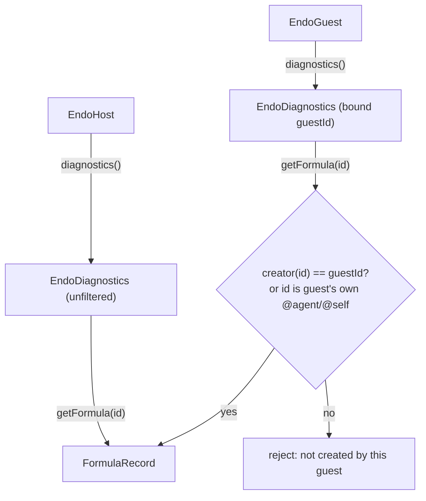

# Guest-Owned, Creator-Attenuated Diagnostics

| | |
|---|---|
| **Created** | 2026-09-12 |
| **Author** | Kris Kowal (prompted) |
| **Status** | Not Started |

## What is the Problem Being Solved?

The formula-introspection surface is host-only. `E(host).diagnostics()` returns
the privileged `EndoDiagnostics` facet (`getFormula`, `getFormulaGraph`,
`traces`); `E(guest).diagnostics()` does not exist, and the guest facet exposes
no `getFormula` edge. That host-only stance is correct as a default, and
[formula-inspector](formula-inspector.md) argues for it: a guest that could read
arbitrary formula records would learn the host's internal naming, its peer
relationships, and which other guests share common roots.

But the all-or-nothing shape denies a guest something it is entitled to: the
ability to inspect the formulas it *itself* created. A guest that evaluated code,
stored a value, or stored a blob produced formulas whose full structure it
already authored. Withholding introspection of those formulas buys no security
(the guest already holds the capabilities and knows their inputs) and costs the
guest the same "pop the bonnet" affordance the host enjoys. A guest debugging its
own caplet has to ask the host to inspect on its behalf.

The obstacle is that the daemon has no record of *which agent created a given
formula*. Agent formulas (`guest`, `host`) carry their own node number by way of
their keypair, and a few relationship formulas carry an agent reference
(`channel.creatorAgent`, `invitation.hostAgent`), but the general formula types a
guest produces (`eval`, `marshal`, `readable-blob`, and the `worker` and `lookup`
formulas created as their subsidiaries) record no creator. A guest-scoped
diagnostics facet therefore has nothing to filter on.

This design adds creator attribution to the formula store and a
creator-attenuated `diagnostics` facet on the guest, so a guest obtains a
diagnostics function scoped to the formulas it created.

## Description of the Design

### Two mechanisms, and the one this design chooses

The prompt (the review comment that requested this design, quoted in full under
`## Prompt` below) names two candidate mechanisms: partition formulas by creator,
or mark individual formulas by creator. They are genuinely different, and the choice
turns on what the formula identifier's *node* already means.

Every formula identifier is `{number}:{node}` (per
[daemon-256-bit-identifiers](daemon-256-bit-identifiers.md)). The `node` is an
agent's Ed25519 public key. On disk the `formula` table keys rows by `number`
alone (the primary key), with `node` a separate indexed column
(`idx_formula_node`) that records which agent key roots the formula for locality,
peer routing, and retention. `getFormula` already parses `node` and rejects the
call when `isLocalKey(node)` is false (a cross-peer locator).

- **Partition by node (rejected).** Route each guest-created formula onto the
  guest's own node partition, so "formulas I created" becomes "formulas whose
  node is my agent node." This is tempting because the identifier already carries
  the node and the store already indexes by it. It is rejected because it
  overloads `node` with a second, conflicting meaning. Today a guest's `eval` and
  `marshal` formulas are written on `localNodeNumber` (see `formulateEval` and
  `formulateMarshalValue` in `packages/daemon/src/manager.js`, both of which call
  `formatId({ number, node: localNodeNumber })`). Moving them onto the guest's
  node would change the identifier's node-part, which feeds `isLocalKey`, the
  cross-peer rejection, locator formation, and per-node retention. Attribution and
  routing are separate concerns; conflating them turns a read-only
  introspection feature into a change in the daemon's addressing model.

- **Mark by creator (chosen).** Record the creating agent's identifier alongside
  each formula, as its own field, leaving `node` untouched. Attribution becomes a
  dedicated column that the diagnostics facet filters on, and the formula's
  address, locality, and routing are unchanged.

The rest of this design specifies the creator-mark mechanism.

### Daemon: record the creator at the formulate chokepoint

Add a `creator` column to the `formula` table, mirroring the earlier `node`
column addition exactly:

```
creator TEXT NOT NULL DEFAULT ''
```

with an index `idx_formula_creator ON formula(creator)` and a `schema_version`
bump plus the corresponding migration in `packages/daemon/src/manager-database.js`
(the `formula` table lives there; `writeFormula(formulaNumber, nodeNumber,
formula)` becomes `writeFormula(formulaNumber, nodeNumber, creator, formula)`, and
`readFormula` / `listFormulas` surface the new field). The empty-string default is
the grandfathering value: it means "unattributed," and every row that predates the
migration carries it.

The creating agent is known at the agent-facet boundary but not at the low-level
`formulate`. The guest facet method that produces a formula knows "I am
`guestId`"; the host facet knows "I am `hostId`." Thread that identity down the
`formulate*` helpers into the single `formulate` / `formulateLazy` chokepoint in
`manager.js`, which persists it.

**The creator is a new, explicit parameter — it is not the existing `nameHubId`.**
An earlier draft of this design proposed reusing `formulateEval`'s first argument
(`nameHubId`) as the creator, on the reasoning that it "already receives the
initiating agent." That is wrong, and the counterexample is a happy path, not an
edge case: `nameHubId` denotes *whose namespace resolves the endowment pet-name
paths*, which is not the same as *who owns the resulting formula*. The two diverge
at `EndoHost.endow()` (`packages/daemon/src/host.js`). `endow` is a **host-facet**
method — the host operator approving a guest's earlier `define()` proposal — that
calls `formulateEval(guestAgentId, source, codeNames, endowmentFormulaIdsOrPaths,
...)`. Here `nameHubId` is the *guest*, but the endowment identifiers are resolved
through the **host's own** `petStore` (host-selected capabilities the guest never
held), and the eval result is delivered only to the host's inbox
(`deliverValueById`, "does NOT appear in the proposer's inbox"). If the creator
were `nameHubId`, this eval formula — and its host-namespace endowment `lookup`
formulas — would be marked guest-created and become visible through
`E(guest).diagnostics().getFormula(...)`, leaking host-selected authority the
guest never held. That directly falsifies the security rationale below. So the
creator must be passed independently of `nameHubId`. Concretely:

- `formulateEval` gains an explicit `creator` parameter, distinct from its first
  argument. On the ordinary guest `eval` path the guest facet passes
  `creator = guestId`. On the host-facet `endow` path the host passes
  `creator = hostId` (the endowments are host-resolved and the result is
  host-delivered), even though `nameHubId` is the guest. `nameHubId` continues to
  mean only "namespace for endowment path resolution."
- `formulateMarshalValue` and `formulateReadableBlob` are called from
  `guest.js` `storeValue` / `storeBlob` without the guest identity. Add a creator
  parameter to both and pass `guestId` from the guest facet (and `hostId` from the
  host facet, which shares these makers).
- The subsidiary formulas a guest operation creates within the same call (the
  `worker` from `provideWorkerId` when none was named, the `lookup` formulas for
  endowments) are attributed to the *same* creator passed for that operation, not
  to `nameHubId`. Attribution is per-operation: whoever the facet declares as the
  operation's creator owns every formula minted inside it. (For `endow` this again
  means `hostId`, so the host-namespace endowment `lookup` formulas are correctly
  host-scoped.)
- Agent creation attributes by the same rule. When the host calls `provideGuest`,
  the host declares itself the creator, so the new `guest` formula and its
  dependency formulas (`handle`, `pet-store`, `mailbox-store`, `worker`) carry
  `creator = hostId`. The guest did not create itself. (This has a usability
  consequence for a guest inspecting its *own* provisioning infrastructure — see
  Open Questions.)

Some `formulate*` chokepoint call sites have no agent identity in scope at all.
`manager.js`'s `makeResolver` / `writeStatus` calls `formulateMarshalValue` to
persist promise-status bookkeeping, and `mail.js`'s cross-agent form-reply path
(`submit`) formulates marshal values on the shared mailbox path. These internal,
non-agent-initiated call sites pass the **empty-string creator** (unattributed,
host-scope-only), the same value bootstrap formulas carry. Only a call reached
through a guest or host facet with a declared creator records a non-empty one.

Daemon-bootstrap formulas (`endo`, `least-authority`, `main` worker, the special
names) are created before any agent exists; they keep the empty-string creator
and are visible only to the host facet.

### Guest facet: a self-attenuated `diagnostics()`

Add `diagnostics` to `GuestInterface` in `packages/daemon/src/interfaces.js` and
implement it in `packages/daemon/src/guest.js`, returning a `makeExo`
`EndoDiagnostics` facet whose methods are the creator-attenuated forms bound to
the guest's own `guestId` at construction time. The `guestId` is captured from the
closure, never taken from the caller, so a guest cannot ask for another agent's
view.

The facet reuses the existing `DiagnosticsInterface` shape (`help`, `getFormula`,
`getFormulaGraph`, `traces`); where a method is present on both facets it behaves
the same way and only the authority differs, but the guest's method set may be a
subset (see `traces()` below and Design Decision 5):

- **`getFormula(identifier)`** performs the daemon's existing checks (string
  shape, `isLocalKey`, cross-peer rejection, unknown-identifier normalization) and
  then one additional gate: the persisted `creator` of the formula must equal the
  bound `guestId`, with a carve-out for the guest's own identity formulas
  (`@agent` and `@self`, whose creator is the host). A mismatch must reject with an
  error **textually indistinguishable from the existing unknown-identifier
  rejection** — same message shape, no "not created by this guest" wording that
  would let a caller tell "exists but isn't yours" apart from "does not exist."
  Distinguishable text would hand the guest an existence oracle over the host's and
  other guests' formula namespace, exactly the leak this design forbids; the
  rejection therefore reveals nothing about the creator of record or the
  identifier's existence. The gate is enforced in the daemon core against the
  stored creator, not in the exo wrapper, so it cannot be forged.

- **`getFormulaGraph()`** seeds from the guest's own pet-store entries, exactly as
  the host implementation seeds from `list()` (it is already agent-scoped by
  reachability). Graph entries the guest created expand normally; entries it did
  not create (a host-granted endowment, a shared worker) appear as opaque
  identifier references and do not expand. ("Entry" here, not "node," is
  deliberate: `node` is reserved throughout this design for the identifier's
  agent-key part.) An opaque reference discloses only that a reachable dependency
  edge exists and the referenced identifier string — never the referenced
  formula's body or creator — so it stays within the same no-leak bar `getFormula`
  enforces above. This is the same "render references without unwinding" principle
  [formula-inspector](formula-inspector.md) applies to cycles, reused here as the
  attenuation boundary.

- **`traces()`** returns a trace facet scoped to workers the guest created (the
  `worker` formulas whose `creator` is the guest). The underlying aggregator is
  the daemon's shared one; the guest-scoped facet filters `lookup` / `recent` to
  guest-created worker ids and omits `clear` (a guest must not drop another
  agent's traces). If per-worker creator filtering on the aggregator proves
  awkward, `traces()` may be omitted from the guest facet in the first cut and the
  guest facet may expose only `getFormula` and `getFormulaGraph`; see Open
  questions.



### Why this preserves the host-only security rationale

[formula-inspector](formula-inspector.md) forbids a guest from reading formula
records because doing so would reveal the host's internal naming, peer
relationships, and cross-guest roots. Creator attenuation keeps that intact: a
guest sees only records it authored (plus its own identity), so it learns nothing
about the host's namespace, other guests, or peers it was not already party to.
The dependency identifiers inside a guest-created record name capabilities the
guest already holds (its endowments, its worker), so surfacing those identifier
strings leaks no new authority; and because the referenced records do not expand
under the guest's facet, the guest cannot walk outward from them into host
structure. The host facet remains the unfiltered superset for the operator.

### Relationship to the host inspector and the Chat formula-view

- `E(host).diagnostics()` is unchanged: unfiltered over the local node, the
  privileged operator view.
- The `endo inspect` CLI verb and the Chat Value-modal back face
  ([formula-inspector](formula-inspector.md)) call the *host* facet today and are
  unchanged by this design. They already run with host authority.
- A future guest-facing Chat inspector (a Chat session bound to a guest rather
  than the host) would call `E(guest).diagnostics()` and automatically see only
  that guest's formulas. This design provides the daemon substrate for that; the
  Chat surface itself is out of scope and left to a follow-up, to be filed against
  the chat milestone when a guest-bound Chat session exists.

## Persistence and Migration

- **Schema.** One additive column (`creator`) plus one index, a `schema_version`
  bump, and a migration that adds the column with the empty-string default. This
  is the same shape as the migration that introduced the `node` column, so it
  reuses a proven path in `manager-database.js`.
- **Existing formulas.** Every formula written before the migration carries
  `creator = ''`. Grandfathering rule: an empty creator is host-scope-only. No
  guest diagnostics facet returns such a formula; the host facet returns all of
  them. There is no lossy backfill (see Open Questions on whether best-effort
  backfill is wanted).
- **Reincarnation.** The creator travels with the formula body's row, so a formula
  read back after a daemon restart retains its attribution with no recomputation.
- **Peer formulas.** Cross-peer formulas are rejected by `getFormula` before the
  creator gate is reached, so remote formulas need no creator semantics; the
  column is a local-attribution concept only.

## Dependencies

| Design | Relationship |
|--------|--------------|
| [formula-inspector](formula-inspector.md) | Establishes the host-only `diagnostics` facet, `FormulaRecord` shape, and the "render references without unwinding" principle this design attenuates and reuses. |
| [daemon-retention-paths](daemon-retention-paths.md) | Second host-only-introspection precedent; its `listRetentionPaths` stays host-only and is not attenuated here. |
| [daemon-256-bit-identifiers](daemon-256-bit-identifiers.md) | Defines the `{number}:{node}` identifier whose `node` this design deliberately does not overload. |

## Phased Implementation

1. **Attribution.** Add the `creator` column, migration, and `writeFormula` /
   `readFormula` / `listFormulas` changes; thread the declared creator through the
   `formulate*` helpers (as an explicit parameter distinct from `nameHubId`) into
   `formulate` / `formulateLazy`. Land with daemon tests asserting each formula
   type records the expected creator: guest-created `eval` / `marshal` /
   `readable-blob` carry the guest; host-created `guest` and its deps carry the
   host; an `endow`-minted eval **and its endowment `lookup` formulas** carry the
   host (not the `nameHubId` guest); the internal non-agent formulate paths
   (`makeResolver` / `writeStatus`, the `mail.js` form-reply `submit`) and
   bootstrap formulas carry the empty creator.
2. **Guest facet.** Add `diagnostics` to `GuestInterface`, implement the
   self-attenuated facet in `guest.js`, and enforce the creator gate in the daemon
   core. Rewrite the `packages/daemon/test/endo.test.js` test
   `the diagnostics facet is absent on the guest facet` (near line 3190): the guest
   now has `diagnostics()`, but it is attenuated. Add tests for the positive case
   (guest reads a formula it created), the negative case (guest is rejected on a
   formula the host created), the `endow` case (guest is rejected on the
   host-attributed eval it proposed via `define`), the self-identity carve-out, the
   existence-oracle case (the "not yours" rejection is byte-for-byte the same as
   the "unknown identifier" rejection), and continued cross-peer rejection.
3. **Add guest-scoped `traces()`** filtered to guest-created workers, or defer per
   Open Questions (optional in cut 1).

## Design Decisions

1. **Mark by creator, do not partition by node.** Attribution and routing are
   separate; the `node` column already carries locality and peer meaning, and a
   read-only introspection feature must not perturb the addressing model.
2. **Attribute per operation, to the initiating agent.** Subsidiary formulas
   (auto-created worker, endowment lookups) belong to whoever initiated the
   formulate chain, so a guest's diagnostics shows a coherent slice of its own
   work rather than a top-level formula whose parts are invisible.
3. **Bind `guestId` in the closure, gate in the daemon core.** The guest cannot
   name another agent's view, and the gate cannot be bypassed by a forged exo.
4. **Grandfather empty creators to host-scope only.** Safe by default: existing
   formulas never leak to a guest, and the operator's host facet loses nothing.
5. **Same `DiagnosticsInterface` shape on both facets, method-for-method where a
   method is present.** Host and guest reuse one interface shape so a future
   guest-bound Chat inspector reuses one code path, but the *method set may differ
   by authority*: the guest facet may omit `traces()` entirely in cut 1, and even
   when present its `traces()` sub-facet omits `clear` (a guest must not drop
   another agent's traces). Callers must therefore discover methods via CapTP
   introspection (`__getMethodNames__()`) rather than assume the two facets expose
   an identical set; a method that *is* present behaves identically, only the
   authority behind it differs.

## Open Questions

- Should `traces()` appear on the guest facet in the first cut, or wait until
  per-worker creator filtering on the shared aggregator is proven? The design can
  ship `getFormula` + `getFormulaGraph` alone and add `traces()` later without a
  surface change.
- How far should the guest's self-identity carve-out extend? The guest's diagnostics
  should resolve its own identity formulas (`@agent`, `@self`) even though the host
  created them — this design assumes yes, mirroring the host's *already-shipped*
  self-identity resolution in `getFormula` (the carve-out that today lets the host
  facet resolve `@agent`/`@self`, distinct from the new guest-side carve-out this
  design introduces). But the same reasoning extends to the rest of the guest's
  *provisioning chain*: the guest's default `worker`, `pet-store`, and
  `mailbox-store` are all minted during `provideGuest` and so carry
  `creator = hostId`, yet they exist for that guest's exclusive future use and are
  exactly the "my worker" resources a guest debugging its own caplet would expect
  `getFormula`/`traces` to reach. Cut 1 as specified would wall the guest off from
  them (the motivating worked example is only partly served). Open question:
  broaden the carve-out (or the attribution rule) to cover the guest's own
  provisioning-chain infrastructure, and confirm that a guest reading its own
  `guest`, `handle`, `worker`, `pet-store`, and `mailbox-store` records is
  acceptable.
- Is grandfathering (empty creator equals host-only) sufficient for existing
  deployments, or is a best-effort backfill wanted (for example, attribute a
  formula reachable only from a single guest's pet store to that guest)? Backfill
  is ambiguous when a formula is reachable from more than one agent, so this design
  recommends grandfathering and no backfill.
- Should every guest get `diagnostics()` unconditionally, or should it be
  withholdable (for example, absent under a `least-authority`-style attenuator)?
  The prompt reads as "guests have their own diagnostics function," so this design
  makes it an unconditional guest-facet method; a future attenuator could remove
  it if a deployment wants to.
- Does the `FormulaRecord` returned to a guest need to expose the `creator` field
  itself, or is the creator purely a daemon-internal gate? This design keeps it
  internal; the record shape is unchanged.

## Prompt

> From kriskowal's review of the endo-but-for-bots formula-inspector work
> (inline comment on `packages/daemon/test/endo.test.js`): propose a system for
> enabling guests to have their own diagnostics function, attenuated to the
> formulas that they created. That will require partitioning formulas by creator
> or marking individual formulas by creator.
