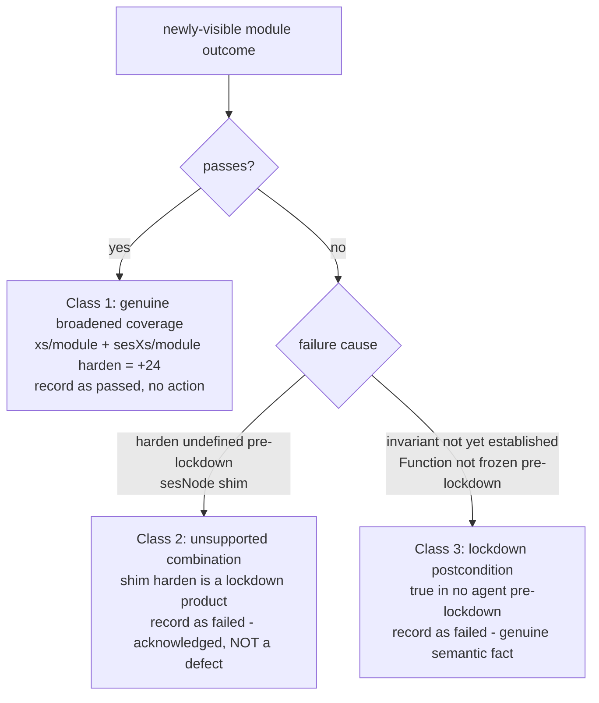

# Retire lockdown-only test selection in `@endo/hardened262`

| | |
|---|---|
| **Created** | 2026-08-27 |
| **Updated** | 2026-08-27 |
| **Author** | endolinbot (prompted) |
| **Status** | Not Started |
| **Source** | Follow-up requested in review 5045929318 on PR #1064 (head `ec37f708d74c64714475c8452145623bf26b004c`) |

## What is the Problem Being Solved?

The maintainer's approving review on PR #1064 asked for a follow-up: *"propose a
change that causes these tests to be run in every environment, removing the
lockdownOnly flag from the run. This may reveal new failures that need
addressing, but moreover will increase clarity for coverage ratchets."*

Fourteen cases in `packages/hardened262/test/` carry an `onlyLockdown`
front-matter flag (the review named it `lockdownOnly`; the token as spelled in
the corpus and as the filter machinery reads it is `onlyLockdown`). That flag
restricts a case to the `lockdown*` half of the scenario cross product, so today
each flagged case is **generated only into lockdown scenarios and is entirely
absent from the non-lockdown ones**: not skipped, not counted, simply missing.
Because the harness executes exactly the `module` and `lockdownModule` scenarios
(the two it "wires up"; `agentRunsScenario`, `scripts/test.js`), the practical
effect is: a flagged case runs in `lockdownModule` for all three agents and
appears **nowhere** in the `module` column. Throughout this design, "wired"
refers to those two executed scenarios.

This is precisely what muddies coverage-ratchet accounting. PR #1064's ratchet
counts "executed passing case-agent-scenarios". But the `module` column
enumerates a *smaller* case set than `lockdownModule` (shorter by exactly the
`onlyLockdown` cases), so the two wired scenarios have different denominators.
Whether a case belongs in one wired column but not the other is then answerable
only by reading front-matter. Removing the flag makes the wired columns
enumerate the same case set (rectangular coverage) and, more importantly,
surfaces a real, currently
**hidden** parity divergence between the SES shim and native Hardened
JavaScript, which is the entire reason this package exists (README, *The cross
product*).

This design is the named follow-up review surface. It does **not** fold the
change into PR #1064 (a coverage-ratchet PR); a later builder implements from
here.

## Ground truth (measured on this branch)

### How the flag is consumed

`onlyLockdown` is **not** referenced by name anywhere in `scripts/` or the
golden test `scripts/scenarios.test.js` (the test that pins the harness's
expected scenario-selection output). It rides the generic only-rule in
`filterOnlyRules` (`scripts/test.js`): any flag matching `^only[A-Z]` maps to the
qualifier obtained by lower-casing its first post-`only` letter, and a case
survives a scenario only if every such qualifier holds. `onlyLockdown` maps to
qualifier `lockdown`. So the flag is pure data over an existing, generic
mechanism; retiring it is a **corpus edit, not a harness-code change**: there is
no dedicated branch to delete.

### Inventory of the fourteen flagged cases

| Case | Full flags | Post-retirement selection |
|---|---|---|
| `test/harden/property.js` | `onlyLockdown` | every scenario (module + lockdownModule wired) |
| `test/harden/proto.js` | `onlyLockdown` | every scenario |
| `test/harden/getter.js` | `onlyLockdown` | every scenario |
| `test/harden/cycle.js` | `onlyLockdown` | every scenario |
| `test/harden/exists.js` | `onlyLockdown` | every scenario |
| `test/harden/proto-of-property.js` | `onlyLockdown` | every scenario |
| `test/harden/property-of-proto.js` | `onlyLockdown` | every scenario |
| `test/harden/transitive-proto.js` | `onlyLockdown` | every scenario |
| `test/harden/transitive-property.js` | `onlyLockdown` | every scenario |
| `test/lockdown/function-frozen.js` | `onlyLockdown` | every scenario |
| `test/harden/frozen.js` | `onlyStrict, onlyLockdown` | strict + module (module is strict) |
| `test/harden/private-field.js` | `onlyStrict, onlyLockdown` | strict + module |
| `test/harden/stamp.js` | `onlyStrict, onlyLockdown, noSesNode` | strict + module, never `sesNode` |
| `test/Compartment/prototype/Symbol.toStringTag-lockdown.js` | `noSloppy, onlyLockdown, noXs, noSesNode, noSesXs` | strict + module modes, once an agent exclusion is lifted |

The `strict`/`sloppy` axis named in the last four rows is a third, source-mode
dimension of the cross product, separate from the agent and lockdown-state axes.
Only the `module` and `lockdownModule` scenarios are wired for execution, and
`module` is itself a strict scenario, so an `onlyStrict` case still lands in the
wired `module` column; that third axis therefore does not change the
wired-column accounting used below.

### Why the baseline records this case as skipped

`baseline/zeroCoverage/skipped.txt` is not a list of tests that ran and elected
to skip at runtime.
It is the lossless inventory for source files whose front-matter filters leave
no agent-scenario pair to execute.
Such a file cannot honestly appear under `passed.txt` or `failed.txt`, because
neither outcome was observed.
The harness instead emits one synthetic `zeroCoverage` record so the excluded
file remains visible.

All ten files in that baseline group are `Compartment` or `ModuleSource` tests
whose source front matter records known behavior gaps for the current agents.
Every file carries the complete current-agent exclusion: `noXs` covers bare XS,
and `noSesXs` plus `noSesNode` cover the two SES shim agents.
Their individual source descriptions preserve the more specific disposition:

| Case | Recorded reason it has no eligible current agent |
|---|---|
| `test/Compartment/ModuleSource/bindings/name.js` | The `ModuleSource.prototype.bindings` descriptor check is pending a SES fix. |
| `test/Compartment/ModuleSource/needsImport/name.js` | The `needsImport` descriptor check is known to fail on XS and SES. |
| `test/Compartment/ModuleSource/needsImportMeta/name.js` | The `needsImportMeta` descriptor check is known to fail on XS and SES. |
| `test/Compartment/constructor/resolveHook.js` | The `Compartment` `resolveHook` behavior is pending a SES fix. |
| `test/Compartment/prototype/Symbol.toStringTag-lockdown.js` | The locked-down `Compartment.prototype[Symbol.toStringTag]` descriptor is pending a SES fix. |
| `test/Compartment/prototype/Symbol.toStringTag.js` | The non-lockdown `Compartment.prototype[Symbol.toStringTag]` descriptor is pending a SES fix. |
| `test/Compartment/prototype/import/importHook-separate-errors.js` | Separate error results from concurrent `importHook` consumers are known to fail on XS and SES. |
| `test/Compartment/prototype/importNow/importNowHook-separate-errors.js` | Separate synchronous error results are known to fail in SES and bare XS. |
| `test/Compartment/prototype/importNow/importNowHook-source-parent.js` | Parent-source resolution through `importNowHook` is known to fail in XS and Node.js. |
| `test/Compartment/prototype/importNow/loadNowHook-source-parent.js` | Parent-source resolution through `loadNowHook` is known to fail in XS and SES. |

The `Symbol.toStringTag-lockdown.js` row is the only member of this group that
also carries `onlyLockdown`.
Removing that token broadens its mode eligibility, but deliberately does not
override any environment exclusion: `filterNoRules` still removes all three
agents, so the case remains visible in `zeroCoverage/skipped.txt`.
When support for any excluded agent is implemented, removing that agent's
`no*` flag will move the case into that agent's scenario baseline with an
observed pass or failure.

### The matrix broadening reveals (measured, wired scenarios only)

Running the harness over `test/harden` + `test/lockdown` with `onlyLockdown`
stripped, against the checked-in tree, adds these `module`-scenario outcomes and
removes nothing (every prior `lockdownModule` result is unchanged):

| Agent / new column | passed | failed | Which cases fail |
|---|---|---|---|
| `xs/module` (bare native XS) | +12 | +1 | `function-frozen.js` |
| `sesXs/module` (SES shim on XS) | +12 | +1 | `function-frozen.js` |
| `sesNode/module` (SES shim on Node) | 0 | +12 | all 11 harden cases it runs plus `function-frozen.js` |

Net: **+24 newly-passing** and **+14 newly-failing** case-agent-scenarios, all in
the previously-empty `module` column; `lockdownModule` is untouched. For the
`xs` agent the `module` column rises to parity with `lockdownModule` (both
enumerate the same harden set), which is the rectangular-coverage win.

These counts (+24/+14 and the per-cell decomposition) are a point-in-time
measurement taken on this branch on 2026-08-27, with the corpus, the pinned
Moddable/`xst` build, and the SES shim as they stood then. They are what the
builder should expect to reproduce, not a contractual gate: if the harden corpus,
the pinned build, or the shim shifts before implementation, the exact numbers may
legitimately move without the change being wrong. The hard invariant the builder
must gate on is structural, not numeric, and is stated in the migration and
verification sections: additions confined to `*/module/*.txt`, with **zero**
movement in any `lockdownModule` file.

### Why each cell lands where it does (root causes, probed directly)

- **Native XS freezes primordials *lazily*, on the first `harden()` call, not
  ambiently at startup.** `Object.isFrozen(Function)` is `false` in a fresh XS
  realm and becomes `true` only after any `harden(...)`. Hence under `xs/module`
  the harden-graph cases **pass** (each calls `harden`, which establishes the
  invariant they then assert), while `function-frozen.js` (which asserts
  `Object.isFrozen(Function)` without ever calling `harden`) **fails**.
- **The SES shim on XS (`sesXs`) rides native `harden`.** `harden` is present
  pre-lockdown, so the harden-graph cases pass under `sesXs/module` exactly as
  under bare XS; the shim-vs-native distinction *collapses* pre-lockdown on XS.
  `function-frozen.js` still fails because the shim's realm has replaced
  `Function` with an evaluator wrapper that is not frozen until `lockdown()`.
- **The pure-JS SES shim on Node (`sesNode`) gates `harden` on `lockdown()`.**
  Before `lockdown()`, `harden` is *not defined* (`ReferenceError`); every
  harden-graph case throws at its `harden(...)` call, and `function-frozen.js`
  fails because `Function` is not frozen pre-lockdown. This is the one agent
  where the divergence is real and load-bearing, and it is exactly what
  `onlyLockdown` hides today.

## Design

### 1. Retire the flag globally (corpus edit)

Delete the `onlyLockdown` token from all fourteen cases, collapsing the flags
list (`[onlyStrict, onlyLockdown]` -> `[onlyStrict]`; a lone `[onlyLockdown]` ->
`[]`, which `test262-stream` normalizes away). No `scripts/` change is required;
no golden-test change is required (`scenarios.test.js` pins only the generic
`onlyStrict`/`onlyModule`/`no*`/`raw` machinery, never `onlyLockdown`).

### 2. Add a guard so the flag cannot silently return

"Retire globally" should be enforceable, not merely done once. Add a cheap
assertion to `scripts/scenarios.test.js` (or a lint rule) that the corpus
contains **no** `onlyLockdown` front-matter flag. This converts the retirement
into a standing invariant: a future case that reaches for lockdown-only
selection trips a test with a message pointing here, rather than silently
re-hiding itself from the non-lockdown column. (Tracking anchor for the guard: to
be filed as an issue on `endojs/endo-but-for-bots` at implementation time if the
builder prefers a lint over a golden-test assertion.)

### 3. Regenerate and re-baseline; classify every new failure

Run `yarn test262:update` to accept the broadened matrix, then classify each
newly-visible `module` outcome. The harness baseline is *lossless by design* and
records `failed` as a first-class, reviewable outcome (README: it "reports
per-scenario pass/fail ... a failing case is printed, not a non-zero exit, so
cases the native surface has not yet reached are visible rather than fatal").
The baseline is therefore the correct ledger for acknowledged divergence.

**Reconciliation with PR #1064's failure-free precedent.** #1064 met the
identical dilemma (a test asserting a lockdown-only postcondition) and resolved
it *without adding a failure*: it stripped the lockdown-only assertion from four
`test/intrinsics/*` cases (`git show ec37f708d`) so each still passes in the
`module` column, and its baseline diff touched only `passed.txt`/`skipped.txt`,
never `failed.txt`. Any resolution here that accepts new `failed.txt` entries is
the opposite disposition to that precedent and must justify itself against it,
class by class:

- **Class 1** already passes; it matches the precedent (no new failure) with
  nothing to strip.
- **Class 3** (`function-frozen.js`) is precisely #1064's situation, and the
  failure-free resolution *is available*: split the case so the `module`-column
  variant asserts only the pre-lockdown truth (`Function` is *not* frozen) and the
  post-lockdown assertion stays in the `lockdownModule` variant. That is Open
  question 2 below, and choosing it keeps `failed.txt` untouched for this case,
  exactly as #1064 would.
- **Class 2** (`sesNode/module` harden) is where the precedent's resolution
  *does not exist*: the test body calls `harden(...)`, which is `undefined` and
  throws pre-lockdown on the Node shim, so there is no single assertion to strip;
  the whole operation is outside the shim's pre-lockdown contract. The only
  failure-free options are to skip via a precondition qualifier (Open question 1)
  or to keep the case lockdown-only (what this design retires). Recording `failed`
  is therefore a genuine choice for Class 2, not a lapse from the precedent, and
  the maintainer's "may reveal new failures that need addressing" reads as
  licence for it; the precondition-skip alternative is nonetheless real and is put
  to the maintainer in Open question 1.

The classification below is the recommended disposition; the two open questions
carry the failure-free alternatives for the maintainer to choose.

Three classes, and how each should be represented after retirement:

- **Class 1: genuine broadened coverage (24).** The harden-graph cases passing
  under `xs/module` and `sesXs/module` are real, previously-uncounted coverage
  proving native (and shim-on-XS) `harden` is ambient before lockdown. Record as
  `passed`. No further action; this is the payoff.
- **Class 2: unsupported harness/environment combination (11).** The
  `sesNode/module` harden failures are not defects in SES: the pure-JS shim
  *correctly* installs `harden` only at `lockdown()`; "harden before lockdown on
  the Node shim" is an operation outside the shim's contract. Record as `failed`
  baseline entries **and** annotate them as acknowledged divergence in the ledger
  itself (see the acknowledgment ledger below), not merely in prose. Their *value*
  is documentary: they pin, as reviewable data, that the Node shim's hardened
  surface is lockdown-gated while XS's is ambient: the parity signal the package
  exists to measure.
- **Class 3: lockdown postcondition (`function-frozen.js`, 3 agents).**
  `assert(Object.isFrozen(Function))` is a lockdown/harden *postcondition*, false
  in every agent's fresh non-lockdown realm (native XS: until first `harden`;
  both shims: until `lockdown()`). Its uniform `module`-column failure across all
  three agents is a genuine semantic statement about pre-lockdown state, not an
  agent divergence. Record as `failed` (or split per Open question 2).

**Persist the classification as in-ledger data, not prose.** After retirement the
per-scenario `failed.txt` files will carry two semantically different kinds of
entry that a future reader or a coverage-ratchet script cannot tell apart from
the bare path lines alone: Class 2 ("acknowledged, do not fix") and Class 3
("genuine semantic fact"). Recording the distinction only in the PR body or the
README (as an earlier draft of this design proposed) puts it out-of-band from the
artifact its actual readers grep, re-creating the exact "answerable only by
reading front-matter" opacity this change exists to remove. So the classification
must ship as committed, machine-readable data co-located with the outcome record.
Concretely: add a dedicated acknowledgment ledger,
`packages/hardened262/baseline/acknowledged.txt`, one
`<agent>/<scenario> <case-path> <class>` line per acknowledged `failed` entry,
sited at the `baseline/` root (not inside a regenerated per-scenario directory)
so `test262:update` does not clobber it, mirroring how `zeroCoverage/` already
gets a dedicated location for a distinct meaning. A ratchet consumer then reads
`failed.txt` for the raw outcome and joins against `acknowledged.txt` to
distinguish "expected divergence" from "unexplained new failure"; a `failed`
entry absent from `acknowledged.txt` is, by construction, a surprise to
investigate. (Whether the harness later grows to *consume* this file, e.g. to
fail CI on an un-acknowledged new `failed` entry, is a follow-up; committing the
data is what this design requires.)

The recommended end state: **remove the flag, broaden the matrix, record the
observed outcomes in the baseline verbatim, and annotate the acknowledged
failures in the acknowledgment ledger**: passes where the invariant holds,
failures where it does not, each acknowledged failure keyed to its class. This
maximizes the maintainer's stated goals (run-in-every-environment +
coverage-ratchet clarity) and keeps the baseline honest. None of the fourteen
require a change to SES or XS; the "failures that need addressing" are addressed
by *acknowledgment in the baseline*, which is what this harness's baseline is
for.

## Migration sequence (for the builder)

1. Strip `onlyLockdown` from the fourteen cases (§Design 1); collapse flag lists.
2. Add the anti-reintroduction guard (§Design 2).
3. `yarn --cwd packages/hardened262 build` then
   `MODDABLE_VERSION=<pin> yarn --cwd packages/hardened262 test262:update` to
   regenerate `baseline/` (needs `xst` on `PATH` for the `xs`/`sesXs` agents). Use
   the Moddable version pinned by CI as the single source of truth:
   `.github/workflows/ci.yml` sets `MODDABLE_VERSION` (currently `5.0.0`); match
   that value rather than a hand-picked one, so the local regeneration and the CI
   `test-xs` gate use the same `xst`.
4. Review the baseline diff against the **hard invariant** (not the illustrative
   counts): it must show **only** additions to `*/module/*.txt` and **no** change
   to any `lockdownModule` file. Any `lockdownModule` movement is a red flag: the
   flag removal must not perturb lockdown scenarios. The counts observed at design
   time (+24 `passed`, +14 `failed`) are the expected magnitude to sanity-check
   against, not a pass/fail gate; re-verify them at implementation time and treat
   a small drift (from a corpus/build/shim change since 2026-08-27) as expected,
   not as failure, provided the structural invariant above holds.
5. Write the acknowledgment ledger (§Design 3): create
   `packages/hardened262/baseline/acknowledged.txt` with one
   `<agent>/<scenario> <case-path> <class>` line for each acknowledged `failed`
   entry (the Class 2 `sesNode/module` harden cases, and Class 3
   `function-frozen.js` if recorded as `failed` rather than split). This is the
   in-tree, machine-readable record a reviewer or ratchet joins against
   `failed.txt`; a one-line summary in the PR body or `README.md` may point at it
   but does not replace it.
6. `yarn --cwd packages/hardened262 test` (golden/harness tests) and `lint`.

## Verification plan

- **Rectangularity check:** after re-baselining, the wired `module` and
  `lockdownModule` columns for each agent enumerate the same case set for the
  harden/lockdown family (spot-check: `xs/module` and `xs/lockdownModule` both
  contain all twelve harden cases).
- **No-regression check:** `git diff` on `baseline/` touches only `*/module/`
  paths; every `lockdownModule` outcome is byte-identical.
- **Guard check:** temporarily re-adding `onlyLockdown` to one case makes the new
  guard test fail with the pointer message; remove it again.
- **Determinism:** two consecutive `test262:update` runs on the pinned XS binary
  produce identical baselines (the harness sorts outcomes; `test-xs` CI already
  pins this).
- **CI:** the repository's `test-xs` job runs `test262:baseline`; a green run on
  the regenerated baseline is the acceptance gate.

## Rollback boundary

The change is confined to `packages/hardened262/`: fourteen `test/**.js`
front-matter edits, the regenerated `baseline/` tree, the new
`baseline/acknowledged.txt` ledger, one guard assertion added to
`scripts/scenarios.test.js` (or a lint rule), and an optional `README.md` note.
The guard assertion is the *only* `scripts/` content that changes: no change to
the harness's filtering or execution logic in `scripts/test.js`, no SES or XS
code, no other package. Rollback is a single revert of that commit; because the
flag rode a generic filter and no execution code was deleted, reverting restores
the exact prior selection with no residue. The blast radius touches only this private test
instrument (`@endo/hardened262` is not published; PR #1064 confirms "no
production upgrade or changeset is required").

## Open questions

- **Should the Class-2 `sesNode/module` harden failures be recorded as `failed`
  (recommended here: visible divergence, honest ledger, annotated in
  `acknowledged.txt`) or converted to `skipped` via a new "requires harden / needs
  lockdown" precondition qualifier in the harness?** A skip would keep `failed.txt`
  reserved for surprises while still keeping the coverage matrix rectangular and
  visible (unlike the old flag, which filtered entirely); it is the failure-free
  resolution closest to PR #1064's precedent for this class (see §Design 3's
  reconciliation, which explains why the "strip an assertion" path #1064 used is
  not available here). The cost: a skip re-hides less than the old flag but still
  re-introduces per-precondition filtering logic this change otherwise removes,
  and the acknowledgment ledger already lets `failed` carry the "do not fix"
  signal without a new qualifier. The maintainer's "may reveal new failures that
  need addressing" reads as a preference for visible failures, which is why
  `failed` is recommended, but the choice is theirs.
- **Should `function-frozen.js` be broadened at all, or split?** It is a pure
  lockdown postcondition with no cross-agent divergence, so its `module`-column
  contribution is a uniform failure that carries less information than the harden
  cases' tri-agent contrast. An alternative is to split it into an
  ambient-expectation case and a post-lockdown case. Recommendation: broaden it
  as-is (uniform failure is still honest data and the simplest end state), but
  flag the split as available if the maintainer prefers the `module` column to
  carry only meaningful-difference cases.
- **Guard mechanism: golden-test assertion vs. lint rule?** Both enforce "no
  `onlyLockdown` in the corpus"; the builder should pick whichever matches the
  package's existing conventions (the golden test already lives at
  `scripts/scenarios.test.js` and needs no new tooling).
