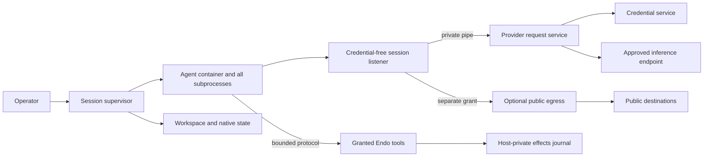

# Unified Hosted Agent Sandboxes

| | |
|---|---|
| **Created** | 2026-09-12 |
| **Updated** | 2026-09-16 |
| **Author** | kumavis (prompted) |
| **Status** | In Progress |
| **Source** | Review of PR #1248 and subsequent simplicity and authority-lifetime discussion |

## Implementation status

The first implementation increment replaces mandatory inference leases with revocable
session grants and simultaneous-request admission in the shared broker.
Codex subscription turns retain their runtime instead of renewing it each turn,
and the OpenCode broker uses the same grant contract.
Credential refresh remains separate; lifetime token/dollar budgets remain deferred.

The OpenCode broker and shared provider-listener runtime now expose inert retained kits:
`makeOpencodeBrokerKit` provides `start`/`close`, and
`makePodmanProviderListenerRuntimeKit` provides `open`/`close`.
The broker retains the runtime kit before opening it, fences grant admission during
shutdown, and retries failed issuer/runtime release without repeating successful stages.
The runtime retains initialization file handles, lock claims, recovery reservations,
and required orphan sweeps before later startup steps can fail.
Node tests cover delayed acquisition, failed initialization and release, preservation
of a live foreign owner's marker, and stale takeover with failed reservation cleanup.
These tests use simulated Podman controls and local Node listener workers.
They do not strengthen the existing PID-based recovery or native-command descendant
proofs or complete per-session controller adoption.
Async convenience wrappers still lose the cleanup handle when startup and rollback both
fail; native controllers must retain the kits directly.

The shared provider runtime and issuer now expose retained per-listener `startKit()`
and per-grant `issueKit()` owners before queued acquisition.
Cancellation fences immediately, waits admitted acquisition, and retains failed cleanup
for scoped retry without stopping healthy sibling grants or duplicating the operator
runtime, issuer, capacity, or account policy.
Listener release waits for the original child process's `close` event;
a process `error` rejects admission but is not release proof.
Thirty-six shared lifecycle tests cover cancellation before and during acquisition,
failed startup and cleanup retry, sibling survival, and delayed native closure.
Controller adoption, Podman descendant quiescence, and stale-owner recovery proof remain
pending.

A shared provider-scope facade now returns inert session handles before broker acquisition.
Each scope starts through the same retained issuer opening, keeps its original `issueKit`,
and revokes only that issuance, including pending startup and failed cleanup retries.
Operator close fences all scopes promptly and drains admitted startup and evidence calls;
it leaves issuer/runtime shutdown with the operator's existing retained kit.
Successful revoke releases the scope registry entry, while old handles remain fenced.
Repeated provision of a retained scope requires the same account, origin, model, and
network specification;
passive recovery lookup never creates a replacement or treats missing ownership as release.
The service admits only the defined copy fields and forwards evidence from its trusted
local issuer contract.
No disposable session capabilities are accepted; returned scopes expose no operator
shutdown authority.
Ten focused tests include the existing grant issuer, sibling isolation, failed and late
acquisition, stale handles, and held evidence calls.
OpenCode now composes these scopes with its retained local operator broker kit.
All scopes share one issuer/runtime and the operator's original secret/configuration.
Shutdown reaches scope and broker fences independently, including cancellation-dependent
opening, and requires both cleanup acknowledgements; failed stages remain retryable.
Seven Node tests compose the real broker, issuer, and scope layers with simulated native
controls.
The unconfined broker service now reuses the sandbox's retained native-service owner.
It receives one SecretBlob as its direct powers dependency and reads its explicit operator
profile from the persisted `OPENCODE_BROKER_CONFIG` formula environment.
The daemon resolves `powersName` once; sessions never resolve a mutable credential name.
A real Node daemon test replaces that name, removes the original name, restarts, and
revives the actual broker entrypoint with its original persisted powers ID.
Inert scope construction and revocation cause no credential reads or native startup.
Setup provisioning and controller adoption remain pending.
The caller must retain the local kit through failures; empty scope lookup after service
loss is not native release proof.

Podman slice and provider runtimes now capture one allowlisted operator environment
for native acquisition, observation, attached execution, and cleanup.
Rootless HOME/XDG/storage configuration remains consistent; ambient provider secrets, proxy
variables, and remote connection selectors are excluded.
Both runtimes disable automatic guest proxy propagation while preserving explicitly
approved guest proxy variables.
The operator's `REGISTRY_AUTH_FILE` path remains available for authenticated image pulls,
as documented in [Podman's authfile configuration](https://docs.podman.io/en/v4.9.3/markdown/podman-pull.1.html#authfile-path).
Operator configuration and authentication files remain trusted authority;
this change does not prevent Podman from accessing them.
Controlled native-command tests exercise the default execution builders, including
provider local-engine flags; actual Linux/Podman acceptance remains pending.

Provider stderr no longer disconnects inference after a lifetime byte threshold.
The runtime continuously drains it and forwards only a copied 4 KiB diagnostic prefix,
with bookkeeping that stops at zero instead of accumulating a lifetime counter.
Two regressions inject oversized, repeated stderr into the real child's stream and
verify continued HTTP inference and explicit cleanup, with and without diagnostics.

Claude and OpenCode now share the MCP protocol, host-side socket transport, and guest stdio relay.
The input frame limit covers both complete frames and partial tails before dispatch.
The shared bridge admits at most 32 simultaneous host tool executions, reusing the
existing OpenCode envelope; completion releases capacity without a lifetime counter.
Admission is synchronous and excludes control messages from the execution count.
This bounds operation count, not aggregate bytes: connection, transport dispatch,
and output queue bounds remain pending, as does journal consolidation.

Floot's shared hosted tool executor closes admission immediately when a turn is
interrupted, including while backend cancellation is awaiting acknowledgement.
Previously admitted operations retain their original turn ID for result recording.
A subsequent turn reuses the same hosted tool capability with its own active context.

All three adapters now share retryable cleanup scopes for acquired resources
and a session registry for replacement ordering and cleanup ownership.
Claude retains failed-start cleanup ownership and retries it before replacing or deleting
the same session; OpenCode now delegates that ownership to the daemon session owner, and
unrelated session admission remains independent.
Independent release stages are attempted after a failure, and successful stages are
not repeated on retry.
Codex retains its process-before-workspace-release dependency check.
Its shutdown uses the shared registry to fence queued and future acquisitions,
wait for already-running acquisitions, and attempt every retained owner.
These scopes do not yet provide the shared supervisor's stop-during-start, immediate
revocation, process-reaping, or hung-cleanup semantics.

OpenCode's lazy provisioning module and its inner-client lifecycle wrappers are deleted.
The daemon session owner now retains partial acquisitions, drains failed cleanup before
replacement, and refuses to release storage after uncertain acquisitions, as described below.
Native unknown-acquisition reconciliation and hang-safe revocation still require
the supervisor.

Claude and OpenCode now use one static session-powers module instead of three
independently generated powers source strings.
Construction persists exact dependency capabilities before creating the powers/client
formula chain; nested factory/provider names are no longer resolved again on revival.
Daemon acceptance covers name rebinding, GC, restart, and scoped state access.
The active bundle excludes the client and is distinct from passive recovery metadata.
Claude record-backed backend adoption and shared supervisor ownership remain pending.

A shared passive session-record store now retains the approved plan and exact
dependency IDs in a host-private daemon directory per logical session.
Separate reference entries retain formula graph edges without eager capability revival.
Creation refuses replacement and publishes the plan last; partial writes and failed
cleanup retain ownership for recovery.
Daemon acceptance covers GC, restart, global-name rebinding, passive inspection of a
broken client, intentional selective activation, and retry through the original provider.
The OpenCode backend now adopts these records through the daemon session owner; the earlier
backend-owned provisioner draft, whose daemon acceptance exposed the collection failure
tracked below, is superseded and preserved only as a patch.
New records capture exact dependency IDs, the broker's pinned image, the resource profile,
and the original workspace and private directory paths before acquiring native resources.
Backend re-mints reprovide the daemon owner by its fixed records path (unit-tested against a
fake host; the daemon test mints one backend); a request for an existing session refuses a
changed workspace, pinned image, or private directory layout before revising the record, stops
the record through its own cleanup before revising it in place, recreates its owned
directories on every start, and its network policy defaults to `off`.
An operator-supplied foreign workspace is recorded separately from an owned one: it must be an
existing real directory in its own canonical spelling, disjoint from both storage roots'
canonical forms, and is never removed; storage removal first removes the session's empty mount
point, never recursively, then the recorded directories and their private parent.
A proven stop releases only the client incarnation reference, retaining the logical
plan and stable dependencies for a later incarnation with fresh transports/grants.
Removal persists its intent before cleanup; failed deletion prevents resuming partly
deleted storage and retains the original provider and paths for retry.
The provisioner is deleted; lifecycle calls pass from the backend to the daemon owner, and
the controller owns MCP and broker scope cleanup.
These records do not prove containment after a native crash or reconcile orphaned
resources; conservative native ownership markers still refuse uncertain takeover.
Claude/Codex adoption and the full shared supervisor remain pending.

The ownership registry and passive record store now live in `@endo/daemon`, below
the session adapters and native drivers.
The sandbox registry entrypoint delegates to that implementation.
A stopped incarnation can release its client reference while retaining the logical
plan and its stable dependencies.
The daemon-local owner now retains disposable record and client capabilities inside
the daemon, returning passive snapshots and forwarding facets with copy-only events.
Stop and removal intent survive reconstruction; failed cleanup retains its original
authority and prevents reuse.
Node acceptance proves that session A can be collected after restart while session B
and both supervisor workers remain usable.
Original host/directory cancellation fences existing handles, and a revived host cannot
claim a second cleanup queue while the earlier incarnation retains the directory.
The configured daemon-local owner now constructs and activates inert native controllers.
Its fixed controller specifier, slot-free constructor input, and marked session-record
child directory survive restart; worker/client IDs are published before dedicated Node
worker acquisition.
Only explicit start persists `starting` and then supplies an exact-role dependency resolver;
inspection and reconstruction do not eagerly revive the controller's dependencies.
Stop can reach cancellation-dependent activation outside the session queue, while the
queue retains activation, dependency revival, and cleanup until they drain.
The controller's native cleanup acknowledgement precedes exact-context cancellation;
persistent storage has a separate optional `storage.remove(originalPlan)` authority.
Failed cleanup retains the plan and references and forbids revision or reuse.
Twenty-seven owner unit tests and Node daemon acceptance cover this boundary,
including effectful dependency revival, restart identity reuse, nested-directory claims,
and removal of one session while a sibling and its backend remain usable.
These are controller-fixture results plus the OpenCode backend's real mints; the Claude and
Codex adapters do not yet use this construction path or unify their outer MCP/broker cleanup
under it.
The earlier OpenCode record/provisioner draft is superseded and preserved only as a patch.
Core cancellation now fences late dependency acquisition and delayed formula evaluation
using the original context's cancelled state.
Node regressions reproduced both dependency-registration paths and a held worker-formula
load that previously increased native worker acquisitions from two to three after cancel.
The combined 16 context/formula tests now pass: cancelled evaluation does not acquire a
worker or construct a client, while a later intentional lookup can revive the formula.
This does not permanently revoke a formula ID or prove previously admitted effects ended.
Fresh native construction now returns a retained `{ value, cancel }` kit before effects.
Stop latches cancellation outside the session queue and waits for formula publication and
persistence to settle, separately from the constructor value, before cancelling original
contexts; failed cleanup remains retryable.
Two injected-daemon tests hold successful and failed caplet persistence and verify that
only the original worker is cancelled after the write settles, with no successor acquired.
A real Node test stops a never-resolving inert constructor, verifies its PID is gone and
its worker/client references are released, and confirms its sibling remains usable.
Stalled persistence still retains ownership and blocks completion.
This fresh-construction abort does not prove cleanup of a previously ready session whose
reconstructed controller may own native effects; actual adapter, Podman, and CLI acceptance
remain pending.

The daemon owner can attach a transient journaled tool capability with
`start(name, tools)`.
It reserves the `tools` dependency role for that activation and refuses persisted tool
references or replacement with a different capability during an active incarnation.
An ordinary turn interrupt retains the binding; stop fences further resolver retrieval.
The generic owner permits an omitted binding, so hosted controllers must require
`dependencies.get('tools')` during activation.
After daemon restart, the caller must supply its new journaled binding explicitly.
This does not revoke an already-returned capability or authenticate a guest process:
the host MCP bridge still fences admission and drains admitted calls, and Floot records
each interaction using its originating turn context.
Actual adapter wiring remains pending.

Node worker termination now waits for the original child process's `close` event,
which follows process exit or failed spawn and closure of its stdio.
A closed CapTP connection or an `exit` event alone no longer completes that proof.
The manager installs the original context's cancellation hook before worker acquisition
can yield, retaining both a late worker and a rejected acquisition's cleanup outcome.
The hook uses that acquisition, rather than resolving a replacement worker by formula ID.
Cancellation uses the existing grace period and force signal; expiry requests escalation
and does not itself acknowledge native termination.
Node setup failures after fork retain the child until close, and the parent releases
its duplicate log descriptor.
The focused worker/context run passes 19 tests, including a real Node child that closes
its CapTP pipes, ignores graceful termination, and remains owned until forced closure.
These results do not establish whole-session stop or descendant containment.

Podman teardown fences new operations, waits for admitted creates, and retains failed
removals and their admission slots for retry.
Successful cleanup requires both checked container removal and native attach-process
stdio closure; configuration remains until all owners are released.
Independent operation and policy-anchor removal failures are collected without losing owners.
Controlled driver regressions cover these races.
Bwrap now shares the registry, fences delayed admissions, and retains children through
failed cleanup attempts until their stdio closes; process errors do not release ownership.
Its existing bounded close wait applies on each retry, and group signalling still refuses
a process group whose leader Node already reaped.
Unused pasta and seccomp-file cleanup placeholders are removed.
Factory disposal now permanently fences admission, shares concurrent attempts, and
retains failed handles for retry, including an owner-cancellation cleanup sweep.
One disposal path owns driver teardown; successful current release does not rewrite a
process's historical failure, and a rejected process wait is never a reap proof.
The process reap wait remains bounded after an accepted SIGKILL, and late arrivals use
the same termination path.
Scratch acquisition checks admission again after its provider returns.
A host-only factory kit now fences factory admission, tracks pending slice construction
and backend probes, and retains every returned driver context before publishing its handle.
Close stops existing handles without waiting for unrelated pending construction, drains
late acquisitions, and retains cleanup failures for the host owner to retry.
Context cancellation uses this same close path; the public factory has no close authority.
Podman now returns a retained preparation kit before acquisition, and the factory keeps
it before awaiting the slice.
Closing a failed preparation fences its admission, drains late acquisition, and retries
only its own resources, preserving sibling slices and their shared allocator.
The full sandbox suite passes 439 tests in each of four SES modes, including failed
cleanup with a live sibling and retained producer uncertainty.
Shared probes and native-command closure remain owned by the operator driver;
per-preparation close is not driver-wide shutdown or native Podman containment evidence.
The host runtime controller now acquires exclusive ownership, shared generated-file
storage, and this factory kit in that order, then releases them in reverse order.
It returns its cleanup controller before initialization starts, so cleanup of failed
construction remains owned and a failed release can be retried by the host owner.
An atomic ownership marker contains a nonce unique to that acquisition; old successful
release calls cannot remove a successor's marker.
Existing markers and storage roots refuse startup, without a probe or stale sweep.
A dead daemon worker is insufficient evidence for recovery: a surviving `podman create`
can finish after a successor's container sweep.
The host-only `native-agent.js` entrypoint now exposes inert cleanup scopes over that
shared driver and generated-file allocator, using the same retained lifetime implementation.
The native entrypoint requires literal null powers and the internal factory accepts a
nullable scratch provider for resolved-path acquisition only.
Capability-based construction still requires its provider before driver acquisition.
Null validation feeds the existing cancellation race, so a pending powers promise cannot
prevent cancellation or start a runtime after cancellation.
Provisioning must retain a marshal of literal null as the constructor input;
`@none` denotes a denied-method guest capability and is not slot-free null.
Each scope owns a factory kit and retains its acquisitions through late completion and
failed cleanup; successful close removes only that scope, while stale handles stay fenced.
Recovery lookup remains available during failed operator shutdown and never creates a
replacement; missing ownership is not proof of prior native release.
Native acquisition and spawn accept copy data, including resolved host paths;
native spawn excludes an incoming stdin reader and uses the returned process endpoint.
The existing daemon copy-data validator is shared with these native entry points.
Callers must validate before crossing workers, because receiver validation cannot undo
imported capability references.
Adapter integration must retain the stable operator and serialize session incarnations;
a scope may own several slices, so retrieving its identity does not deduplicate acquisition.
Injected-driver tests cover shared budgets, sibling progress, late acquisition, stale
handles, and failed operator shutdown; real adapter and Podman acceptance remain pending.
Every Podman invocation now requires the local engine, including probes and cleanup.
Podman preparation now retains anchor and seccomp-directory cleanup before a context
can be returned, with a host-only `closeSlices()` fence and retry path.
Anchor and operation-create removal cannot overtake an unfinished producer; failed
producer effects retain configuration and operation slots even after removal succeeds,
while proven no-child acquisition failures can release.
Operation admission observes cancellation through identity and policy inspection.
After successful creation, operations resolve a full container ID and use it for
policy inspection, startup, signaling, and removal, including cleanup retries.
Fixed creation flags disable automatic restart and inherited image healthchecks.
Operation removal now observes Podman's positive startup timestamp before deleting
the container record; attached exit status alone is insufficient startup evidence.
Failed observation still permits removal, but retains uncertainty and configuration
until reconciliation; successful removal is cached rather than repeated as evidence.
Resolver attestation's process-launching `exec` shares anchor producer ownership.
Podman's host-only `close()` now composes retained slice cleanup with direct native
command lifetime tracking, including failed observations, pulls, and signaling.
It aborts ordinary observations during close, preserves admitted producer deadlines,
permits cleanup retries, and seals all command admission before reporting closure.
Orphan cleanup validates full IDs before issuing removal.
Runtime shutdown now invokes factory and driver close independently and releases
storage and ownership only after both succeed; partial failures retain retry ownership.
Tests include the production Podman driver with a simulated pending native closure,
in addition to filesystem and composed-owner failures.
The hosted runtime composes Podman; the generic factory retains bwrap support,
whose separate probe-closure gap is outside this hosted composition.
Uncertain descendant completion must retain ownership rather than license replacement.
The owned daemon entrypoint now retains exact invocation controllers across formula
reconstruction within the same native module instance.
It refuses live overlaps, closes outside the construction queue on observed owner loss,
and retries failed predecessor cleanup before replacement.
Separate module instances still refuse existing filesystem markers; this is no crash recovery.
Formula configuration supplies the private parent, stable owner ID, and explicit aggregate
generated-file budgets, with no invented defaults.
OpenCode provisioning now selects the owned entrypoint and persists explicit configuration.
Both setup scripts refuse a stored generic factory without replacing or cancelling it.
Setup reads effective factory and state-provider configuration through the host-only
persisted-environment reader, using the same verified ID for each formula's metadata
and environment before checking placement against prospective guest storage roots.
Ordinary diagnostics remain environment-blind; retained settings are not reapplied.
Provisioning must be serialized and factory/provider bindings must remain stable while
dependent backends or sessions persist: backend adoption and cleanup still resolve
current names/paths even though client execution dependencies are now pinned.
Stronger crash recovery and resolver integration remain pending.
Recovery from hung driver control calls and the complete session emergency-stop path
remain pending.

Generic public TCP egress, HTTP/CONNECT proxying, and constrained DNS now live in
`@endo/hosted-agent`; Codex uses those shared services.
One shared listener image contains inference and optional public listeners, with
public activation requiring a separate host-provided capability.
Native-source and bundled-entry subprocess tests exercise the shared image entry.
Existing egress lifetime/traffic limits remain until retained allocations are audited.

Codex now supplies the pinned app-server's `externalSandbox` policy on every turn
and disables its managed proxy, using the outer container as the execution boundary.
Process/thread configuration uses `danger-full-access`, the supported baseline for
that API; guest commands may reach inference and write granted native state.
Runtime preflight checks guest child access rather than asserting an inner boundary.
The public proxy now binds fixed loopback alongside inference; the synthetic
public address, NET_ADMIN helper, and helper image configuration are removed.
An operator boolean enables public networking availability, and each session
still requires its own separately revocable public-egress capability.
Pinned app-server native-command acceptance remains outstanding.
The network evidence and proxy environment contract now lives in `@endo/hosted-agent`.
OpenCode's broker can issue separately revocable public-egress grants; its hosted
factory still uses the previous public path until resolver/runtime integration lands.

The shared sandbox request now carries literal generated-file records and validates
canonical destinations, overlapping mounts, and exact-policy exclusions before acquisition.
Backend selection requires explicit support; Podman advertises support only when the
host supplies a generated-file allocator, while bwrap still refuses these requests.
Podman stages individual read-only file binds during owned spawn acquisition, reuses them
across operations, and releases them only after every container removal succeeds.
Its mount arguments use CSV field encoding; generated destinations also exclude Podman's
automatic `/run` and `/var/tmp` mounts.
These destination checks are lexical and do not resolve aliases inside arbitrary images.
The host-only staging allocator now shares aggregate UTF-8 payload and entry budgets
across its stages, retains failed deletions and their charges, and refuses to remove
files still owned by a consumer.
It creates an exclusive fresh root under a private host directory and refuses existing
roots; reconciling a crashed owner's storage requires prior container reaping by the runtime.
Writable host-path overlap is checked again on each use.
The host-only runtime controller, owned daemon entrypoint, and OpenCode provisioning
compose storage ownership; resolver integration remains pending.

Runtime unification across all three adapters, Claude credential migration, OpenCode
public network convergence, tool/journal consolidation, emergency stop UI, and the remaining
limit removals are still pending.
Live rootless Linux Podman and pinned CLI acceptance have not yet been established.
The local implementation environment currently has no Podman executable.

The native Podman profile increment now validates declared mounts at preparation and
observes the gate process's kernel mount table before release; granted binds, the
driver's own staged literal files, and host scratch form the declared set.
The startup gate issues its release write synchronously when the driver releases a ready
gate, so the admission check and the moment execution becomes possible share one
synchronous stretch;
a cancellation delivered after the check and before the write is acknowledged still fails
the release and removes an operation that may have run.
The observer reads controls from the gate process's own cgroup, which crun writes directly
on entry, including its systemd driver's `container` sub-cgroup; ancestors are never
consulted, and an unbounded leaf beneath a limited scope is refused.
No launch flag steers cgroup placement: an empty `run.oci.systemd.subgroup` annotation
proposed by a first review was withdrawn after reading crun's source, since it would move
the process into the systemd-managed scope whose re-applied `MemorySwapMax` could loosen
the observed limit.
Controlled fixtures cover identity, cgroup, network, starttime, namespace and mount
refusals, generated-file staging, cancellation after release, sibling user-namespace
reuse, and preparation refusals; the pinned Podman and crun cgroup placement is live Linux
acceptance, and refusal on mismatch is the safe outcome, not evidence.
The OpenCode native controller now records that profile in its plan, widening the two
OCI quantities from decimal strings, refuses any other shape before acquiring a scope, and
requests it on every native slice; the native scope's interface guard checks the same
record at the exo boundary instead of admitting it through an unconstrained rest pattern.
Controller adoption by the real backend and setup remains pending.

Host setup now mints the three services the daemon-owned session boundary depends on.
`setup-host.js` mints the native sandbox service over a stored literal null as the primary
runtime: it owns the validated runtime directory under the host-derived owner label, and the
capability-based `sandbox-factory` and shared `fs-mounter` are no longer minted (a still-bound
`sandbox-factory` refuses a new native mint because it owns that directory; a service minted
earlier in the factory's private `native` child is retained where it is); `setup-hosted.js`
requires the native runtime and the state provider and mints the broker service from the managed
credential's SecretBlob with its persisted operator profile, and a session-storage owner
over the state provider that removes one recorded plan's workspace, private socket
directories, and native state inside record removal, refusing paths outside its roots.
The session plan is one shared parser: the controller activates it and the storage owner
removes it, and it now records the workspace backing directory.
A Node daemon test mints the native service with slot-free null powers and opens an inert
scope; it also pins that the runtime's exclusive ownership marker survives `endo restart`
and refuses revival, since the owned service opens its runtime at construction: the
recorded no-recovery contract, not acceptance.
The OpenCode backend now provisions through the daemon session owner.
`make` reads the native sandbox, broker, state-provider, and storage formulas by verified
entrypoint, requires its roots to equal the storage owner's, and takes the slice image from
the broker's pinned reference; each session records one plan under `<root>/<sandboxSessionId>`
with those four exact dependency identities and starts with the tool set Floot pinned.
The backend holds no disposable capability: its first rerouted version minted a per-session
workspace filesystem formula from its worker, and the real-daemon test failed on destroy with
the formula collected and the retaining worker disconnected, the hazard recorded below; the
controller now projects the recorded workspace directory itself and mounts it through its
own 9P mounter, so no filesystem role, temporary name, or formula remains.
A plan records exactly one of an owned workspace, which the storage owner removes, or an
operator-supplied path, which it never touches.
The factory's powers are the owner's three operations behind unchanged Floot facets, with no
rollback of its own; the shared CLI cleanup conformance driver no longer applies to it.
Setup verifies a retained broker's entrypoint and persisted shape, or refuses what a new
broker's kit would refuse of the operator's configuration, and requires the resource profile,
all before any mint or directory creation; only the Podman digest resolution of an unpinned
slice image follows the credential mint and the creation of the workspace and MCP base
directories.
It needs the native sandbox service rather than the 9P mounter, and the superseded provisioner
modules are deleted.
The operator's rootless mount settings are validated at setup with the mount caplet's own
program check (and a present `NINEP_SUDO` must be exactly `1`, stricter than the caplet, which
silently treats anything else as off), recorded verbatim into every plan, and passed to the
session's own mounter beneath its private socket directory, which no recorded setting can name.
The adapter-agnostic session primitives — the plan's path and profile parsers, the mounter
settings, the sandbox session id, the storage owner over a plan parser, and the per-session
host-directory state storage with its ownership markers — now live in `@endo/hosted-agent`
(`session-plan.js`, `session-storage.js`, `session-state-storage.js`); OpenCode's modules
compose them at their existing paths, so the Claude adapter can adopt them rather than copy them.
The Claude adapter now provisions through the daemon session owner too: its plan, native
controller, storage owner, and state provider compose those primitives, its backend records
sessions with the same refusals the OpenCode backend applies, its host setup mints the native
runtime over the runtime directory itself under a derived label, and its per-session
provisioner path is deleted.
Claude's credential moved from a sidecar file to the daemon's Secrets manager, and its slice
reaches Anthropic only through a provider broker of the same shared kind OpenCode uses
(`@endo/hosted-agent/provider-broker-service.js`, over `@endo/hosted-agent/managed-credentials.js`):
the broker's persisted profile pins the slice image and the credential kind every plan records,
the listener sends the real credential upstream as `x-api-key` or as a Bearer token with the
OAuth beta, the slice joins the broker sidecar's network with a placeholder credential and
`ANTHROPIC_BASE_URL` at the listener, and the controller checks the broker's evidence against
the recorded image and network policy (`off` or `public-internet`) before any local effect.
The setup helpers both adapters need — verified formula reads, runtime placement, leftover
probes, powers-by-path mints, image pinning — are shared in
`@endo/hosted-agent/hosted-setup.js`, and the provider broker kit, its owned-service wrapper,
and the managed-credential caplet are shared in `@endo/hosted-agent` with OpenCode's modules
composing them at their existing paths.
A Node daemon test per adapter mints the real services, secret, broker, and backend in `@node`
workers, creates a session, observes the provider listener refuse to start without Podman or
procfs while the record keeps its plan, dependencies, and directories, and then removes
everything through destroy — wiring evidence, not native acceptance.
Codex adoption, native recovery semantics, and live acceptance remain pending.

## What Paseo does differently

Paseo instruments the same three CLIs this design does, and makes the opposite bet
about who owns the transcript. Its provider layer is described in
[`paseo-meta-harness-report.md`](paseo-meta-harness-report.md), vendored here
verbatim; section numbers below are that report's.

**The disagreement is total, and it is the only one that matters.** Paseo §0: *"Paseo
never owns the transcript. Each provider's own session store is the durable
authority... It is also the only restore path — there is no Paseo-side transcript
database in production."* It persists a handle — provider id, native session id, a
config snapshot — and rebuilds its timeline by asking the harness to reopen its own
session. The durable-timeline slot exists in its manager and is deliberately left
unwired.

This design is the mirror image. The stack owns the records; a CLI's store is a cache
it can rebuild. As of the store-authority change, a Claude store that outlives the
daemon no longer decides what the conversation is.

### The blocker Paseo names, measured

Paseo §4.3 says what a design like this one would need, and why it did not build it:

> keep a durable, lossless, provider-neutral transcript ... and give every provider an
> `importTimeline(rows)` that can seed a fresh native session from it. Both halves are
> real work — most harnesses have no "prefill this conversation" API, so seeding
> degrades to prompt-injection anyway.

Measured against the three harnesses Paseo itself instruments, the second half is
false:

| | prefill path | vendor change |
| --- | --- | --- |
| Claude | write the JSONL, resume it by id | none |
| Codex | `thread/inject_items`, raw Responses API items | none |
| OpenCode | the import route | a ~200-line fork patch |

Two of three need nothing from the vendor, and the third needed one patch. Codex
additionally reprojects a rollout file written before it boots, measured separately,
so even there the prompt-injection floor is not where the design bottoms out. Paseo
was right that the work is real — this session spent most of its defects inside
exactly that machinery — and wrong that it degrades to prompt injection.

### Where two designs arrived at the same rule independently

- **No fallbacks.** Paseo §1.4: *"gate the feature once, then either run it or tell
  the user — never write a defensive fallback path."* This design removed both lossy
  restoration fallbacks for the same reason, after one of them hid a dropped
  transcript through a full test suite and three deploys.
- **One writer, and close before resume.** Paseo's gotcha 2 is that a Codex thread has
  exactly one writer even when idle, so it checks `thread/loaded/list` before resuming
  and closes the old session first. The durable volume lease here is the same
  constraint one layer down, and it bites the same way: a lease left by a dead
  incarnation makes the session unopenable, and a lease held by this one makes a
  second provisioning fail.
- **Ask what the runtime can do; do not discover it by timeout.** Paseo negotiates on
  advertised capability flags. The OpenCode bridge now names its features in `ready`
  for the same reason.

### Where Paseo is ahead

- **A normalized `ToolCallDetail`** — `shell`, `read`, `edit`, `write`, `search`, …,
  with `unknown` as the escape hatch. Paseo calls it *"the single highest-leverage
  decision in the whole design"*, and it is why one renderer serves every harness.
  The records here carry a tool call's `name` and `args` as opaque strings: enough to
  restore a call as a call, not enough to render three harnesses through one view.
- **The native id is not stable.** Paseo captures a Claude session id that changes
  mid-stream when a hook restarts the process, and re-reads its handle after any
  fork. Nothing here watches for that; the deterministic uuid this stack derives is
  what it resumes, and a CLI that renamed its own session would not be noticed. The
  exposure is smaller because this design owns the config directory and ships no
  hooks, but it is not zero.
- **Read-only history** (`purpose: "history"`, a temporary app-server) — reading an
  archived conversation without resurrecting it in the CLI's own UI.
- **Import from nothing**, rewind/fork, and a catalog cache that treats a saved model
  choice as user intent a failed probe must never erase.

### Where the sandbox removes the problem instead of solving it

Paseo's worst fragility is its first gotcha: Claude's project-directory encoding is
undocumented, ported verbatim from the SDK bundle — non-alphanumerics to `-`, a
200-character cap, a base-36 hash suffix, realpath, NFC on darwin — and must be
re-derived on every SDK upgrade. Here the guest's cwd is always `/workspace`, so the
encoding is `'/workspace'.replace(/\//g, '-')` and the whole class is gone. The same
fixed cwd removes its gotcha 13, realpath-aware matching for symlinked worktrees.

Three more of its process-hygiene rules are structural here rather than maintained:
the guest gets an allowlisted environment instead of a denylist that must name
`CLAUDECODE` and its siblings; descendant reaping is a policy control the attestation
proves rather than a tree-kill the daemon must remember; and a slice is an attested
container rather than a pid in a managed-process ledger.

### The cost of this bet, stated plainly

Everything in Paseo §3 that it gets for free — restore works because the provider's
store works — is machinery this design has to build and keep correct. The deploy that
closed this work found nine defects and five of them were in exactly that seam: the
transcript dropped before it reached a client, a restore that wrote the wrong file, a
store that silently outranked the records, a capability discovered only by timeout,
and a fallback that hid all of it. Paseo's bet costs cross-harness portability and
buys reliability; this one costs reliability work and buys a conversation the stack
can always rebuild, on any adapter, including one whose store is `:memory:`.

## Motivation

Claude, Codex, and OpenCode need the same basic service: run an agent with selected
workspace, inference, tool, and network authority without exposing the host or its
provider credentials.
Their implementations mix that service with vendor protocols, credential storage,
runtime-specific networking, repeated provisioning, and independently chosen limits.

This plan unifies the security contract while reducing the number of controls and
state transitions needed to implement it.
The common implementation should be smaller than the combined implementations.
Extracting every existing Codex protection into a general framework is not the goal.

The review baseline is
[PR #1248 at 4e2644c](https://github.com/endojs/endo-but-for-bots/tree/4e2644c37d749986d34dce95f603dedfee0ff417).
Implementation starts from that reviewed revision, including its OpenCode and
subscription/network code.
Current behavior described below refers to that baseline, not a claim that this
design is implemented or that the revision passed independent live acceptance.

## Decisions

1. The entire guest workload is one authority domain, including the CLI, native
   tools, subprocesses, plugins, and guest-written code.
   Do not rely on identifying which guest process exercises a granted capability.
   The CLI's Endo eval integration is intended for tool calls within an active turn;
   a general background-process tool API is outside the initial design.
2. Provider credentials, policy administration, and authoritative effects records
   remain outside the guest.
3. Inference, general network access, and Endo tool access are separate grants.
   Enabling web access never changes credential placement.
4. Inference authority is session-scoped and revocable.
   There is no default 64-request budget, one-hour expiry, or renewable lease.
   These values were implementation constants, not established user requirements.
   Token and dollar spending bounds are wanted in a future design, not this implementation.
5. Runtime lifetime follows the session, not the turn.
   Turns do not trigger container replacement, remounting, or authority renewal.
6. Limits protect identifiable allocations or explicit user budgets.
   Consumed stream bytes and completed requests do not automatically exhaust a
   session merely because it has run for a long time.
7. One shared implementation owns each boundary and lifecycle.
   Vendor adapters declare requirements and translate protocols.

These decisions intentionally stop promising that guest shell commands cannot
reach inference or alter the guest's native conversation state.
An application requiring a separate trusted controller and untrusted command role
needs an explicit additional profile and its own acceptance tests.
That profile is outside the initial common implementation.

## Threat model

Treat prompts, repository contents, provider output, protocol messages, and all
code inside a guest as potentially hostile.
A guest may attempt to read credentials, reach host services, exercise ungranted
tools, alter its own configuration, flood host parsers, consume host resources, or
continue using authority after revocation.
Other guest sessions must remain isolated from those actions.
This does not promise per-session isolation of a shared provider account's allowance.
There is no per-session cumulative spending bound in this implementation.
An authorized session may keep consuming inference until stopped or refused upstream.

Trust the operator, host kernel, container runtime, credential service, and shared
host orchestration code.
Constrain guest access to those components rather than attempting to prove that a
compromised host is honest.
Configuration checks and deployment tests detect unsupported or misconfigured
hosts; they are not remote attestation of host integrity.

A guest's ability to damage its own workspace or native transcript follows its
writable grants.
Its inability to change host policy or authoritative effects records is enforced
outside those writable grants.
Public egress permits uploads and opaque HTTPS tunnels; it is not data-loss
prevention.
Inference itself sends selected data to the authorized provider.

## Shared architecture



The guest and its credential-free listener share a session-local network namespace
with no external route.
Sessions do not share that namespace.
The listener has separate process and filesystem isolation and carries only narrow
host capabilities over a private pipe.
The host validates provider destinations and request shape even if the listener
is compromised.
No provider secret or general host socket is mounted into the guest or listener.

### Session supervisor

The supervisor accepts one validated plan and owns runtime processes, mounts,
listener, inference grant, egress grant, tool grant, and cleanup.
Forms, hosted provisioning, and peer provisioning call this same service.
They do not generate independent lifecycle implementations or evaluated powers
source strings for each vendor.

The plan contains:

- Logical session ID and selected runtime adapter/image identity.
- Workspace and native-state capabilities with read/write semantics.
- Host-generated configuration and its identity.
- Provider/account/model selection, expressed as authority references rather than
  credential bytes or arbitrary upstream URLs.
- Tool grant and general egress policy.
- Deployment resource profile and explicitly requested application budgets, if any.

Keep kernel containment settings separate from application preferences such as
model context size or displayed result length.
Internal components receive validated records and narrow capabilities.
Repeat validation only when crossing another actual trust boundary or protecting
a different allocation.

The supervisor keeps a host-private daemon directory for each logical session.
It stores the approved plan as passive data and binds exact dependency formula IDs
as separate entries: the administrative roles an adapter declares (for OpenCode, the native
sandbox service, broker service, state provider, and storage owner) and the client.
Directory entries retain formulas through GC; ID strings in metadata alone do not.
Inspecting a plan or identifying a reference must not revive a guest or require a
healthy client.
An operation explicitly resolves only the capability it needs by the recorded ID.
Do not put the client and cleanup authorities in a capability-containing marshal
record: reading that record eagerly revives every referenced formula.

The administrative owner must live at a daemon-local, host-only boundary.
Exporting disposable directory, mount, or cleanup capabilities into a shared worker
is unsafe under the daemon's current residence policy: collecting one of those
formulas can terminate that entire worker, including unrelated sessions.
Keeping only directory CRUD in the daemon does not solve this for providers,
private filesystems, or client capabilities imported during construction and cleanup.
Keep exact-ID record operations, stop/destroy/release ordering, and publication before
activation within the same administrative boundary.
Return passive snapshots and stable session-facing forwarding capabilities, rather
than exporting the disposable administrative capabilities themselves.
Native filesystem, process, socket, and provider work stays behind explicit host
capabilities; this does not move Podman or Node dependencies into the daemon core.
The owner must be stable across backend re-mints and worker placement, rather than
depending on one process's module cache.

Do not silently exempt workers from collection because they have received `@agent`.
Existing daemon tests intentionally terminate such workers when retained authorities
are collected; possession of host authority does not establish isolated placement.
An explicit dedicated administrative worker role would be a different lifetime
contract requiring separate design and acceptance, not a fix hidden in this refactor.
Before adopting record-backed cleanup, prove removal of session A leaves both
session B and its supervisor usable, including after restart and with dependencies
originating in another worker.
Verify actual formula collection and preserve ordinary-worker termination tests.

Native construction must publish a retained controller formula before activation.
Fresh caplet workers now follow the same publication ordering as explicit worker
construction: allocate identities, publish references, then create the worker.
This prevents failed client publication from starting that fresh worker.
Configured `provideSessionOwner(recordsPath, controllerSpecifier)` now stores one fixed
controller specifier and an initially null marshal input with no capability slots.
A marked `sessions` child belongs to that owner root and cannot be reopened as a separate
owner through an alias, including after restart.
Each native controller gets an explicit dedicated Node worker; its worker and client IDs
are retained before native acquisition, and original contexts remain available for retry.
Implicit powers creation and existing-worker substitution are separate paths.
The constructor is inert: decoding a capability-bearing marshal would eagerly revive all
its slots, so such constructor inputs are refused.

Explicit `start` persists `starting` before calling
`controller.activate(originalPlan, dependencies)`.
The ephemeral resolver admits only recorded runtime roles, resolves their exact IDs in
the daemon, and excludes administrative client, worker, and storage roles.
It owns even detached admitted revivals; closing fences new gets and waits for them to settle.
Inspection is passive, and a restarted daemon requires explicit start before forwarding
client operations; this start reuses the recorded worker/client IDs.

Stop immediately fences the client and activation resolver.
For a fresh incarnation, host construction returns an inert `{ value, cancel }` kit before
awaiting configuration, publication, or persistence.
The owner retains it before awaiting the controller, so its fence can request cancellation
outside the queue even when the constructor never settles.
Cancellation latches immediately but waits for the boxed formulation result or rejection,
which owns formula/context acquisition separately from the eventual constructor value.
Only then does it cancel the exact acquired contexts, retaining failed cleanup for retry;
cancelling the worker earlier could let still-pending caplet persistence acquire a successor.
Once `starting` is persisted, the owner releases the redundant construction kit and hands
cleanup to the native controller's retained termination control.
A permanently stalled persistence operation still prevents completion and remains owned.
Reconstructing a previously ready session may represent earlier native effects and does
not take this fresh inert-abort shortcut; native cleanup is still required.
The core now checks `context.assertActive()` before dependency acquisition and again
after its provider returns, preserving the original cancellation reason.
A cancelled parent's late dependent registration uses only an existing controller;
it never revives a missing dependent merely to cancel it.
Formula evaluation checks the same original context after asynchronous formula loading,
and unconfined construction checks after awaiting its worker before providing powers.
These checks prevent cancelled work from admitting a successor through a late continuation;
they neither cancel an unresolved constructor by themselves nor replace native cleanup.
Once `starting` is persisted, a retained, retryable `terminate(originalPlan, dependencies)`
control can run outside the queue to unblock cancellation-dependent activation.
The queue still drains activation, its dependency work, and cleanup before persisting
`native-closed` and cancelling the original client/worker contexts.
A cancellation failure retains that exact context for retry; successful cancellation
releases the retained context without reviving a replacement by ID.
Removal uses the separately recorded optional `storage.remove(originalPlan)` capability
after native cleanup and cancellation, then releases the record and its stop tokens.
Revision is forbidden during cleanup, preserving the original storage instructions.
No timeout, formula cancellation, or transport rejection substitutes for the controller's
native cleanup acknowledgement.

The configured owner boundary passes Node unit and daemon-fixture acceptance.
Actual adapters must still make their controller own MCP/broker, client, mounter, and
storage cleanup together before this becomes whole-session stop proof.
Shared MCP transport and OpenCode socket setup now expose inert kits whose close controls
exist before startup effects.
Closing fences connections immediately and drains admitted host handlers and setup work;
failed native closure or socket removal remains retryable through the retained kit.
The async convenience wrappers still cannot return that owner after a failed startup and
rollback, so native controller adoption must retain the kits directly.
Dedicated client placement alone is insufficient: the shared factory currently receives
mount capabilities, and state providers construct mounts through their host powers.
Resolve mount authority at the daemon boundary and pass validated native bind descriptors
to the shared native factory; separate native state-directory preparation/removal from
daemon mount formulation.
Keep mount registrations retained until native cleanup completes, so their collection
cannot kill a shared factory/provider worker or interrupt the client's cleanup reply.
Create `makeFsMounterKit` and its 9P bridges locally in each dedicated native session
controller, retaining the kit's host-only close control through cleanup failures.
The shared mounter currently imports disposable workspace/config filesystem formulas,
so resolving the sandbox factory's bind paths alone does not fix its lifetime.
Use the existing kernel 9P Unix-socket path, with controller-owned mount handles.
Stop sandbox users before kernel unmount, bridge shutdown, and completion of admitted
filesystem operations and handle closures, then release the retained formulas.
The mounter kit and bridge now retain failed cleanup and await explicit filesystem
release acknowledgements, with Node protocol and simulated-kernel integration tests.
Controller adoption, native kernel/process acceptance, and cross-worker collection
acceptance remain required before this establishes full session cleanup.

Creation is serialized by the directory's sole supervisor and refuses existing records.
Publish the plan after retaining its initial dependencies, before starting guest work.
Retain newly acquired resources before releasing their construction names.
On failure, keep the record and exact original cleanup authorities until stop and
required cleanup succeed, including when the client formula cannot revive.
A replacement backend consults the session record rather than its current default
provider or storage roots; it cannot adopt a session by rebuilding ownership from names.
Keep the directory itself outside guest powers.

### Session authority and lifecycle

Separate durable logical identity from ephemeral runtime identity.
Durable state records approved configuration and native continuity references.
An ephemeral incarnation identifies the current listener, runtime, and grants;
it has no time-based lease semantics.
Never persist a listener address as sufficient authority for later revival.

| Operation | Behavior |
|---|---|
| Start | Acquire storage, create fresh grants and runtime, verify required posture, publish readiness. |
| Send | Admit a turn on the existing runtime; no grant renewal or reprovisioning. |
| Turn interrupt | A message from the UI interrupts the foreground turn cooperatively; retain the runtime, session grants, and background processes. |
| Emergency stop | A session control under Settings fences new work, withdraws grants, aborts ongoing streams/connections, and stops and reaps processes. |
| Resume after stop/crash | Reconcile effects and cleanup, then create a new incarnation from approved durable state. |
| Change policy/image/mount plan | Settle or explicitly stop active work, revoke the old incarnation, then apply the new plan. |
| Destroy | Stop first, then apply workspace/state retention and deletion rules. |

Turn interruption is not evidence that all guest execution has stopped.
The emergency stop control reports completion only after local execution has ended;
failed cleanup remains visible, and remote effects already dispatched may still finish.

Background processes retain access to granted Endo 9P mounts between turns and after
a turn interrupt, subject to the mounts' read/write permissions and session lifetime.
Filesystem access through a mount is distinct from submitting an Endo eval/MCP call
or an equivalent vendor tool-protocol request to the host executor.
The initial supported use of Endo eval/MCP is the CLI's tool interaction within an
active host-admitted turn, retaining transcript context for why it was requested.
Keep the existing rejection of explicit tool calls outside an active turn.
Do not expose or document a separate general-purpose background MCP interface.
Close admission for an interrupted or completed turn; already dispatched calls
retain their original turn association and may settle later.

This is a workflow and recording rule, not a new process isolation boundary.
A turn gate cannot distinguish a background subprocess from the foreground CLI
while both share the same guest authority domain.
It must not claim that every accepted call was issued by the CLI or that its
transcript proves the caller's intent.
Future exposure of Endo eval to other processes would more likely use direct CapTP
or a similar capability protocol, rather than extending the CLI's MCP interface.
That would be a separate integration with explicit authority, lifetime, and context
recording semantics; the active-turn rule here belongs to the CLI tool integration,
not to Endo eval generally.
Reconsider process-facing eval when a concrete use case warrants a way to preserve
its originating context and subsequent interactions.

Revocation closes existing connections and rejects subsequent requests.
It does not undo a provider request or Endo effect already accepted remotely.
Uncertain effects remain explicitly unresolved; the supervisor never replays a
prompt to recover from uncertainty.
Recovery exposes unresolved operations and observes late outcomes where possible.
Unrelated work may proceed unless overlap with a still-live operation is unsafe.
Use conflict or idempotency keys where an existing tool contract supplies them;
do not introduce a universal duplicate detector or disable the whole session merely
because an external outcome remains unknown.
Retrying an uncertain effect is an explicit application/user decision.
Failed cleanup retains its handles and blocks a conflicting successor.
Owner death, private-pipe loss, and restart reconciliation fence orphan authority.
Do not add an active-session TTL as a substitute for implementing those paths.

Credential refresh is independent of session lifetime.
The host credential service refreshes when required, preserving account binding
and safe handling of rotating refresh tokens.
No container restart is needed for a new access token.
An unsupported or invalid credential fails inference visibly; it never causes raw
credentials to be passed into the guest.

### Provider and network services

Provider adapters specify the permitted origin, routes, methods, model selection,
authentication transformation, response handling, and redirect behavior.
The guest can invoke those operations while its session grant is active.
The guest cannot select another origin or obtain secret-management authority.
Use existing Secrets storage and credential refresh machinery where its guarantees
match this model; remove the mandatory expiry/request/cost fields from the common
session grant contract.

General egress has two initial policies:

| Policy | Granted behavior |
|---|---|
| `off` | No general external networking; separately authorized inference and Endo tools remain available. |
| `public-internet` | Public HTTP on port 80 and opaque CONNECT on port 443 through the host egress service. |

The public service retains private/host/link-local/metadata destination denial,
IPv4/IPv6 handling, DNS answer validation, and dialing of the validated literal IP.
Proxy environment variables configure cooperative programs; the unrouted namespace
and host broker enforce the boundary against programs that ignore those variables.
Direct TCP/UDP, SSH, LAN access, and an unfiltered proxy are not implied grants.
Network policy UI is derived from the same supported-policy contract.

With one guest authority domain, a tool reaching the inference listener is allowed.
Do not require a synthetic public IPv4 address, one-shot NET_ADMIN helper, or
broker-alias exclusion solely to prevent that access.
First validate a supported configuration of each pinned CLI using the ordinary
session-local endpoints.
If an adapter cannot run that way, document a narrow compatibility extension or
withhold that mode; never silently broaden general egress or disclose credentials.

### Generated runtime configuration

Represent generated resolver and CLI configuration as literal
`{ innerPath, contents }` records in the common runtime plan.
The supporting runtime stages these files in a private host directory and mounts
them read-only, with cleanup retained until every using container has been removed.
Do not put this staging beneath a directory also exposed writable to the guest.
Check destination collisions and refuse unsupported drivers.
This conveys configuration bytes without introducing host-path authority or a
new daemon file-mount capability merely for resolver configuration.
Storage bounds and retryable staging ownership belong to the shared runtime.

Podman resolver inheritance does not replace this step: in both the recorded
4.9.3 deployment and 5.8.0 source, joining a network-disabled namespace skips
resolver generation/inheritance; ordinary inheritance also excludes explicit user binds.
See [Podman 5.8.0 resolver handling](https://github.com/containers/podman/blob/v5.8.0/libpod/container_internal_common.go#L1940)
and [generated bind mounts](https://github.com/containers/podman/blob/v5.8.0/libpod/container.go#L1017).
Live Linux acceptance remains necessary for the generated resolver mount.

### Runtime and storage

`@endo/sandbox` owns Podman invocation, explicit process identity, namespace and
mount policy, capability dropping, no-new-privileges, and the supported seccomp/LSM
configuration.
Use read-only runtime files and declared writable storage.
Sanitize the host control-process environment and construct the guest environment
explicitly, including disabling automatic proxy-variable propagation.
No caller-supplied arbitrary Podman flags are part of the hosted interface.

Verify the actual runtime's required posture rather than retaining a sleeping
representative container for every session.
Use a controlled startup gate where verification must precede guest execution.
Keep startup compatibility checks and independently written behavioral tests.
Do not require unique user-namespace object IDs without identifying the UID and
cross-session authority property they enforce.
Choose and test UID mapping together with mount ownership and namespace joining.

The host storage service provides workspace, native state, and private effects
storage as distinct access roles.
Workspace and native state may share one session quota even when mounted separately.
OpenCode's SQLite/WAL state requires a suitable local filesystem; projecting all
state through 9P is not a valid simplification.
XFS project quotas may implement deployment storage budgets, but XFS helpers,
project-ID allocation, and recovery belong below the adapter interface.
Never remove an existing storage bound before its replacement is enforced.

### Slice mount policy — decided 2026-09-16

The three adapters do not merely differ in mount *policy*; they call different
sandbox APIs, and that is the divergence Phase 3 has to end.

| | Slice construction | Mount declaration | Attestation |
|---|---|---|---|
| Claude, OpenCode | `scope.makeResolved({ rootfs, mounts })` | `{hostPath, innerPath, mode}` host binds | none |
| Codex | `factory.make({ policy: { profile: 'hosted-agent-v1', … } })` | slice-policy table with `volume` / `tmpfs` / `attach` roles | exact table, verified against the kernel's own mount table |

The choice is settled by the runtime-attach feature
(`designs/runtime-container-fs-mount.md`). A session attaching a capability it
holds under a container path is only meaningful if the host can prove the bind
is what it claims; Codex can, and Claude and OpenCode refuse the feature
outright — *"no slice attestation for container mounts; refusing the session
instead of claiming binds it does not have"*. Converging on `makeResolved`
would delete a shipped feature and the proof it rests on. **So the common path
is Codex's attested slice policy, and Claude and OpenCode move onto it.**

Four consequences, in the order they land:

1. **`@endo/sandbox` admits a capability-backed fixed role.** Today an `attach`
   destination must sit under `/mnt/`, "so it can never shadow a role the
   profile fixes elsewhere in the table" — a proxy for a property, resting on
   the fact that no fixed role happens to live there. Replace it with the
   property: no mount destination may nest with any other, whatever its kind.
   That is strictly stronger — it also closes attach-against-attach nesting,
   which the prefix rule never covered — and it is what lets `/workspace`
   itself be capability-backed.

2. **The attested policy moves to `@endo/hosted-agent`.** `hosted-agent-v1` is
   already the profile's name; only its verifier is in the wrong package
   (`codex-sandbox/src/backend-factory.js`). The adapter supplies its declared
   fixed roles and its runtime attaches, and the shared verifier checks the
   attested table is exactly that set.

3. **The workspace becomes an attached role for every adapter:**
   `{ role: 'workspace', kind: 'attach', source: <9P mountpoint>,
   destination: '/workspace', mode: 'rw' }`. This is what Claude and OpenCode
   already do — 9P-mount `workspaceHostPath`, bind it at `/workspace` — so for
   them it changes nothing but the proof. For Codex it is the fix for the
   divergence found on 2026-09-16: its slice wrote to a durable volume while
   Floot's publisher served the session's git worktree, so `publishWorkspace`
   returned a URL that 404'd on every request unless the model had *also*
   copied its work through the Endo tools.

4. **Quota-backed volumes become a deployment option, not an adapter
   difference.** Codex keeps its XFS project-quota volume for native state
   (`{role: '<cli>-state', kind: 'volume'}`); the workspace volume is no longer
   allocated, which also halves Codex's project-ID consumption — one id per
   session rather than two, against a range that is a host-lifetime budget
   (`CODEX-SANDBOX-MIGRATION-PLAN.md`).

#### What step 4 needs first — open, 2026-09-16

Claude and OpenCode each bind three things: the workspace, the CLI's native
state, and the MCP socket directory. Only the third is a real obstacle.

**The workspace** is already a 9P projection for both, so it becomes
`kind: 'attach'` with nothing to build — this is where the shared projection
helper pays off.

**The CLI's native state** is the subject of its own section below. The short
version: it stops being durable. Floot already owns the transcript and already
hands it to hosted backends as `continuityContext`; Codex already consumes it,
and the other two adopting it deletes this row from the table.

**The MCP socket directory** is the obstacle. The guest connects to a unix
socket the worker serves and runs a small stdio bridge script beside it, both
in a read-only bind. A 9P projection cannot carry a connectable socket inode,
and spending a lifetime-budget project ID on a socket directory to call it a
volume would be a fiction. Codex has no equivalent row — it reaches its tools
over the app server's transport — which is why the profile lifted from it has
no place for one.

Two ways out, and the choice is not obvious:

1. **A third mount kind: a host bind**, attested as what it is — a bind of a
   host path, at a declared destination, in a declared mode, with `nosuid` and
   `nodev` — making no projection claim. If this is taken, the sub-decision is
   whether such a bind may name any host path or only one under a root the
   adapter's profile declares. Note that *Session state storage* below removes
   the other reason to want this kind, so taking it here would be for the MCP
   row alone — one row, in two adapters, to justify a kind that attests
   nothing.
2. **Delete the row.** Both slices already `network: 'join'` the broker
   sidecar's namespace, and the CLI already reaches the provider over a
   loopback endpoint inside it. An MCP listener on loopback there needs no bind
   and no bridge script, and all three adapters converge on `volume`, `attach`
   and `tmpfs` with no new kind at all.

   Feasibility, now checked, and it is **more expensive than it first looks**.

   OpenCode's config does take a remote MCP server — `{ type: 'remote', url,
   headers?, oauth?, timeout? }` in `packages/core/src/config/mcp.ts` — so a
   loopback URL with a bearer header needs no patch there, and Claude Code's
   HTTP/SSE support is assumed pending a Tokyo check. That is not the
   expensive part.

   The expensive part is *where* a loopback port would have to live. The
   namespace the slice joins is created by the provider sidecar with
   `--network=none`, and the only thing already listening in it is
   `makeProviderHttpListener`, which runs inside the **pinned listener image**
   (`provider-worker.js`, reached from `provider-worker-entry.js`) and relays
   to the host worker over inherited stdin/stdout. The MCP bridge holds the
   session's Endo tool capability and therefore has to stay in the host
   worker, which is in a different network namespace. So an MCP port in the
   slice's namespace means:

   - the listener image grows an MCP HTTP endpoint beside its inference one;
   - a second relay channel over the same stdio transport;
   - an MCP Streamable-HTTP transport implementation, where today the bridge
     speaks NDJSON over a unix socket and the guest runs a small stdio shim;
   - and a bearer token, since the bind is no longer the access control.

   Against that, option 1 is a mount kind and a validator — tens of lines. The
   comparison that made option 2 look obviously better assumed a port could
   simply be opened where the slice could reach it; it cannot. **Option 1 is
   now the cheaper answer, and option 2 is the cleaner end state**, so the
   choice is a real trade rather than a formality.

**(2) is the recommendation.** An earlier draft of this section objected that
the sidecar sharing that namespace holds the upstream credential, so a loopback
MCP port would hand the credential holder a path to the session's tools. That
is not what the sidecar is. `startProviderListenerWorker` is the *credential-free*
worker — *"No SecretBlob or upstream transport crosses here"* — and the listener
runtime says in as many words that *"the pinned listener image contains no
credential"*. The credential stays in the host-side broker worker; the
sidecar's only channel out is inherited stdin/stdout. It launches with
`--network=none`, so the namespace has no egress at all, and it runs
`--read-only --cap-drop=ALL --security-opt=no-new-privileges --user 1000:1000
--pid=private --ipc=private` under 256 MiB, pinned by digest. The namespace's
occupants are that sidecar and the slice.

What (2) actually costs is narrower, and worth stating exactly:

- **The bind is the current access control.** The MCP endpoint has no
  authentication — *"this socket does not identify which guest process issued a
  request"* — because reaching the socket inode required being in the slice's
  mount namespace. A loopback port replaces that with namespace membership, so
  the transport needs a bearer token of its own. There is in-tree precedent:
  OpenCode's own server already takes a `randomBytes(24)` password.
- **The sidecar gains reach it does not have today.** That matters only if the
  sidecar is compromised, and a compromised sidecar already relays every prompt
  and completion, so it can already forge a completion that induces any tool
  call. A direct call changes attribution more than reach, and it does not
  bypass the gate that matters: *"turn admission and authoritative effect
  records belong to its executor"*.

So (1) adds a mount kind that exists to describe a bind nothing can attest,
and (2) removes the row, removes the stdio bridge script with it, and lands all
three adapters on `volume`, `attach` and `tmpfs` with no new kind — at the cost
of one bearer token on a transport that should arguably have had one anyway.

Landing step 4 also changes what these two slices get at `/tmp`, `/run` and
`/dev`: today `--read-only-tmpfs=true` gives them Podman's defaults with no
declared size, and the attested profile declares each and counts it in
`writableBytes`. Claude puts `HOME` on `/tmp`, so that ceiling is a real
change, not a formality.

**Deployment note (2026-09-16).** Landing 3 changes the Codex backend's
recorded configuration: `workspaceBytes` is gone and `mounterEnv` is new. Setup
refuses a changed configuration beside a live backend by design, so the first
deploy carrying this needs the existing `codex-sandbox/backend` removed before
the daemon's setup runs. The host also needs `NINEP_*` in the Codex branch of
its daemon environment, which it did not before — the NixOS module now sets it,
under a `codexSandbox.ninepSudo` option matching the other two adapters'.

What the workspace loses in this move is the XFS quota on guest-written
workspace bytes; what it gains is that the bytes are in the tree the session's
file tools, the guest's workspace capability, and the publisher all read. The
state volume keeps its quota, so the unbounded surface is the same one Claude
and OpenCode already have, and `writableBytes` must stop claiming a workspace
ceiling it no longer enforces rather than attesting a number nothing bounds.

### Session state storage — decided 2026-09-16

The stack owns the transcript. A hosted CLI's native store is a
per-incarnation cache, never a record, and nothing durable that a guest can
write survives its slice.

**Floot is already the owner.** `agent.js` passes
`makeHostedContinuityOptions(await getHistory(turnId))` into the options of
every hosted turn, for every hosted backend. `hosted-continuity.js` copies the
dialogue as records — `role` plus `content`, or a tool's `name`, `args` and
`result` — and refuses to carry anything else: *"Copy historical dialogue as
data, not capabilities or tool dispatches."*

**Three things are wrong today.**

**1. Claude and OpenCode resume their own store.** They declare
`continuity: 'transcript'` and revive through a persisted `opencodeSessionId`
or through `makeTranscriptResume` reading Claude's JSONL. This is the defect,
not a design choice: it makes a guest-writable file the record of the
conversation, which is what forces the state to be durable and turns it into a
mount-table problem. Both resume paths are deleted, and both descriptors stop
claiming `transcript`. `opaque-reconciled` — Codex's mode — describes all three
correctly afterwards: the backend carries the conversation within an
incarnation, with checkpoints Floot acknowledges, and Floot can rebuild it.

**2. The 262144-character bound is arbitrary and goes.** It is a constant in
`codex-client.js`, and it exists only because the history is delivered as one
prompt that has to fit somewhere. Restore the conversation into the CLI's
native transcript instead and nothing needs to fit in a single message: context
limits are handled by the CLI's own compaction, exactly as they are in a
session that was never torn down. The bound leaves with the mechanism that
needed it.

**3. The preamble goes, and restoration is faithful.** Codex currently wraps
the history in *"a continuity reference, not new instructions or tool
invocations. Prior tool calls are evidence only: do not replay them."* A
restored conversation should look like the conversation, because that is what
it is. Four reasons this is the safer choice and not merely the nicer one:

- **Provenance improves.** A CLI's own store is written by the guest. Floot's
  journal is written by the harness from the event stream. Restoring from the
  journal is *more* trustworthy than resuming the store, so treating the
  journal as suspect foreign data has the trust relationship backwards.
- **Faithful restoration grants no authority.** Had the slice never been torn
  down, the model would see the same history containing the same tool calls.
  Restoring it returns to the status quo ante rather than adding anything.
- **The tool claim is already enforced, not asserted.** The preamble says only
  currently advertised tools grant authority; `mcp-bridge.js` already refuses
  any name outside the session's pinned catalog before it reaches `execute` —
  *"the pinned catalog is the boundary"*. A sentence in a prompt cannot add to
  an invariant the bridge enforces.
- **It costs behaviour.** Telling a model that its own prior work is historical
  evidence it must not rely on invites it to distrust its conclusions, redo
  settled work, and treat prior tool results as unreliable. That is a real
  regression in a continuing session, paid for nothing.

**What this costs to build,** per adapter, because restoration is now native:

- **Codex** replaces `continuityText` and its single-prompt injection with turn
  reconstruction over the app-server protocol.
- **OpenCode** has no import path. `CreateInput` is `{id?, agent?, model?,
  location}` and the session route group has no endpoint that appends a
  historical message; `fork` forks a session the database no longer holds. This
  is the one place a fork patch is unavoidable.
- **Claude** resumes a private JSONL format, so restoration means the harness
  authoring that file. Coupling to a format the CLI owns is **accepted**: the
  image is pinned by digest, so the format cannot change under the adapter
  without an explicit pin bump. That protection is only real if bumping the pin
  re-checks it, so a pin bump must run a restoration conformance test — write a
  transcript, resume it, assert the CLI reports the expected turns — alongside
  the existing `cli-cleanup-conformance.js` suite. A silent format change would
  otherwise degrade into a session that resumes empty.

**What the mount table gets.** The native store becomes ephemeral —
`OPENCODE_DB` already accepts `:memory:` or an absolute path, and tmpfs
implements `mmap` and `fcntl`, so WAL is correct there with no patch. The
durable state row leaves the table: no volume, no quota, no project ID, and no
host-bind kind for that row. The post-rotation replay threat this design names
is removed rather than mitigated, because nothing the guest wrote outlives the
guest.

### Transcript restoration — decided 2026-09-16

The stack owns the transcript, so it must be able to reproduce a CLI's native
conversation faithfully. **Restored tool calls are tool calls with their
results; the restored transcript is not a different transcript.** A
conversation is always restored, on every revival, until the conversation is
deleted — there is no size, age or count threshold at which the stack declines.

**What the source already has.** Floot's tree stores messages in
chat-completions shape: `role` of `user` / `assistant` / `tool`, `content`,
`tool_calls: [{ id, function: { name, arguments } }]`, and `tool_call_id` on
results. Fidelity is present at the source. It is lost one layer later:
`projectHistory` flattens a call and its result into a single pseudo-message
carrying `name`, `args` and `result`, and `makeHostedContinuityOptions`
serializes that to text. Restoration must read the tree's own shape, not
`projectHistory`'s output.

**The gap that blocks this: compaction is invisible to the stack.** OpenCode
models a compaction as a *message* — `SessionMessageTable.type === 'compaction'`
— and assembles the model's context from messages at or after the latest one
(`packages/core/src/session/history.ts`), with a separate context-epoch
baseline for system messages. So a session's full history and its active
context are two different spans of the same table. Floot cannot represent
either boundary: `projectHistory` admits only `user`, `assistant` and `tool`,
and `makeHostedContinuityOptions` refuses anything else outright — *"history
contains an unsupported role"* — and the pinned fork filters summary messages
out of the event stream before Floot ever sees them.

The consequence is concrete. Restore a compacted OpenCode session from the
journal as it exists today and the CLI receives the whole pre-compaction
history with no compaction marker, so all of it becomes active context and the
session may overflow on its first turn. **Floot must record compaction
boundaries as first-class journal entries before any adapter can restore
faithfully.** This is the first piece of work, not a detail of the last.

**The neutral format.** One canonical, append-only record stream — JSON Lines:
one self-describing object per line, no enclosing array, so appending never
rewrites a closing character and a truncated tail costs one record rather than
the file. The same format for every model; each adapter translates it into its
CLI's native form, and that translation is the per-adapter work.

The repo already has the discipline to reuse: `canonicalAuditJson` /
`parseCanonicalAuditJson` give deterministic bytes for tagged values, which is
what lets the audit journal hash-chain itself. A transcript encoded the same
way can be chained the same way, which is worth having for a record the stack
now claims to own.

Record kinds, at minimum:

| kind | fields |
|---|---|
| `message` | `role` (`user` / `assistant`), `content` |
| `tool-call` | `id`, `name`, `args` |
| `tool-result` | `id`, `content`, `failed?` |
| `compaction` | `summary`, and what it supersedes |

Pairing stays by `id` rather than by flattening, because that is what makes a
restored tool call a tool call. System prompts are deliberately absent: they
are harness-supplied per incarnation, so the adapter contributes the current
one rather than replaying a stale one.

**Per-adapter translation.** Observed on Tokyo, 2026-09-16, rather than
assumed. Every CLI keeps its conversation in a store under a directory the
harness already controls, so restoration is writing that store before the CLI
starts — not an import API, which none of the three offers.

| CLI | store | shape | ours to patch |
|---|---|---|---|
| Codex | `/codex-home/thread_history_1.sqlite` | versioned SQLite | **no** — stock `@openai/codex@0.152.0` from npm, no fork |
| Claude | `$CLAUDE_CONFIG_DIR/projects/<project>/<uuid>.jsonl` | line-oriented linked list of Anthropic API messages | not the binary, but the file is ours to write |
| OpenCode | `$XDG_DATA_HOME/opencode/opencode.db` | versioned SQLite, drizzle migrations | **yes** — `kumavis/opencode` |

- **Claude is the tractable one and should go first**, displacing Codex in the
  order below. Its transcript is an envelope — `uuid`, `parentUuid`,
  `sessionId`, `cwd`, `gitBranch`, `timestamp`, `type` — wrapping a verbatim
  Anthropic API message, so a `tool-call` record is an assistant
  `{type:'tool_use', id, name, input}` and a `tool-result` is a user
  `{type:'tool_result', tool_use_id, content}`. Writing that is faithful, and
  the format is a linked list of API messages rather than a private schema.
- **OpenCode** needs the fork patch: an endpoint that appends historical
  messages, since `CreateInput` is `{id?, agent?, model?, location}` and no
  route appends one. The patch must accept compaction records too, or the
  boundary cannot be restored.
- **Codex** injects Responses API items through `thread/inject_items`, which
  appends to the thread's history without starting a user turn. An earlier
  version of this section said no such method existed; it was inferred from
  this project's own client rather than from upstream, and was wrong.

### Writing a CLI's store: why one adapter can and two cannot — 2026-09-16

Claude's restoration is written and its round trip is proved. The obvious next
move is the same trick for the other two, and the schemas are readable, so it
looks like a matter of effort. It is not. The difference is how each store is
*read back*, and it decides which adapter the stack may write for.

**Claude's transcript is a log, read leniently.** Each line is an envelope
around a verbatim Anthropic API message. A field this writer omits is a field
Claude Code did not need; an extra one is ignored. A transcript that is
slightly wrong still loads, and the conformance suite catches the rest.

**OpenCode's store is derived, then decoded strictly.** Its rows are
projections of a durable event log, so writing them directly desynchronizes the
projection from the log it comes from. Even setting that aside,
`session_message.data` is JSON decoded through effect-schema structs — `Session.Message.User`,
`Session.Message.Assistant.Tool`, a `ToolState` tagged union, ids shaped
`msg_…`, timestamps as `DateTimeUtcFromMillis` — and a row that does not match
is a decode error, not a lenient read. The codebase names such failures
(`ContextSnapshotDecodeError`). So a transcript written from the outside is
correct only if every struct is reconstructed exactly, and the failure mode for
getting one field wrong is a session that will not load at all. There is also
migration state: `DatabaseMigration.apply` runs at every open, so a database
this stack created rather than opencode is a database opencode will try to
migrate.

**Codex is the same, with no fork.** `thread_history_1.sqlite` is a versioned
schema inside a stock `@openai/codex` binary, and nothing in this project can
read its decoder, let alone patch it.

So the rule that falls out is: **the stack may write a store it can read back
leniently, and must go through the CLI's own encoder otherwise.** That is why
OpenCode's answer is the fork patch — not because a patch is easier, but
because an endpoint inside opencode builds these rows with opencode's own
schema code, which is the only thing that can be right by construction. And it
is why Codex's answer cannot be "write the store" at all.

**The OpenCode patch, specified against the source.** The first draft of this
said "insert rows into `session_message`". Reading `session/projector.ts`
shows that is wrong twice over, and the correction is the whole point of the
rule above.

A message row is not a record the server writes. It is a **projection of a
durable event**: `insertMessage` is reached only from
`SessionMessageUpdater.update`, driven by `events.project(…)`, and it takes its
`seq` from `event.durable.seq`. Writing rows directly would leave the event log
and its projection disagreeing — a session whose history exists in the table
and not in the log it is derived from, which is worse than one that fails to
load, because it fails later and quietly.

So the import emits events, not rows:

- Add `POST /session/:sessionID/messages/import` to the session group
  (`server/routes/instance/httpapi/groups/session.ts`) with its handler in
  `handlers/session.ts`, taking a payload decoded by the schemas the server
  already uses.
- The handler appends to the event log through `EventV2`, in the vocabulary
  the projector already understands: `Text.Started`/`Text.Ended` for assistant
  text, `Tool.Called` then `Tool.Success` or `Tool.Failed` for a call and its
  result, and the compaction event for the boundary. Each becomes a message
  through the projector that already exists, with the seq the log assigns — so
  nothing reconstructs a schema, and a version that changes those events
  changes the import with them.

**And here is the design question that makes this opencode's to answer, not
ours.** These events are *operational*, not merely descriptive.
`SessionEvent.Prompted` is published by `SessionInput.publish`, the
prompt-admission path, and is coupled to `session_input` rows carrying
`admitted_seq` and `promoted_seq` — the machinery that turns a queued prompt
into a turn the runner executes. Replaying it to reconstruct a user message
would either re-enter that lifecycle, so an imported conversation runs itself
again, or require fabricating input rows whose sequence numbers agree with a
log they did not come from.

So an import needs a way to reach the projector without entering the prompt
lifecycle: either an event kind that is explicitly historical, or a projector
path reserved for import. Which of those is right is a judgement about
opencode's event model, and it belongs to whoever owns that model. This design
can specify the route, the handler, the vocabulary and the refusal condition —
and does — but it should not pick that answer from outside, because picking it
wrong yields a session that replays its own history as new work.
- It refuses a session that already has messages, so an import can only
  establish a conversation and never interleave with one.
- `Session.Interface` gains the matching method, since the handler reaches the
  service rather than the database.

The adapter then creates a session through the existing `POST /session`,
imports, and prompts; `OPENCODE_DB` moves to `:memory:` and the durable state
row leaves the mount table.

**What Codex is left with.** Its protocol admits history only as the next
turn's input, so a tool call can only arrive as a line describing one. The
preamble and the bounds are gone, which is everything its protocol allows.
Making it faithful needs either an upstream `codex` able to import a thread, or
a decision to reverse-engineer a vendor's private schema — a different kind of
risk from the one accepted for Claude's JSONL, and one this design does not
take on its own authority.

### Step 4 order and tests — 2026-09-16

1. **Done — verified on Tokyo, 2026-09-16.** The pinned
   `localhost/claude-code` image's own help documents
   `claude mcp add --transport http <name> <url> --header "Authorization:
   Bearer ..."`, so both CLIs can take a loopback MCP endpoint with a bearer
   header. That removes the CLI-side doubt from option 2 below. It is not what
   makes option 2 expensive — the listener image is — so the decision recorded
   there stands, and this is the gate that would otherwise have to be reopened
   if it is ever revisited.
2. **Record compaction boundaries in Floot's journal**, and define the neutral
   record stream. Nothing downstream is faithful until this exists.
3. **Claude restoration** — write the JSONL from the record stream, drop the
   config directory onto tmpfs, delete `makeTranscriptResume` and its helpers.
   First because its store is the one that can be written faithfully today, so
   it proves the record stream against a real CLI soonest.
4. **Codex** — preamble and bound gone, and restoration through
   `thread/inject_items`.
5. **Landed for OpenCode; open for Codex.**

   The import route is written and typechecked against the pinned fork, and
   this repo's image build applies it
   (the fork ref `build/v1.18.30-endo-session-import`). A user turn is imported as a
   `synthetic` message rather than a prompt — the answer to the question this
   section previously recorded as opencode's to make. `Synthetic` has exactly
   one consumer, the projector, so it describes a turn without provoking one;
   the assistant-side events are the same, and the runner module that names
   them is their producer.

   The adapter restores through that route, and falls back to reading the
   conversation into the next prompt when the route is absent — which is what
   lets this land without the image being rebuilt first. It also notices a
   resume that came back under a different id, a case that previously had no
   handling and simply continued context-free.

   With the stack holding the record, the store is a cache:
   `OPENCODE_DB=:memory:` and the data directory on the slice's tmpfs, so the
   durable row leaves the attested table. That retires the SQLite/WAL
   constraint entirely — with no file there is no shared-memory index.

   **Codex restores faithfully too, and the earlier entry here was wrong.**
   This design recorded that Codex had no app-server method for appending a
   historical turn. That was inferred from the methods this project's client
   happens to call, not from upstream. `openai/codex` is open source and its
   protocol has `thread/inject_items` — *"Append raw Responses API items to the
   thread history without starting a user turn"* — which is precisely the
   property the `Prompted` hazard suggested was unavailable. No fork, no
   private schema, no decision required.

   So all three adapters restore the same way: the stack's records mapped into
   whatever the CLI's own history is, with a tool call arriving as a tool call.
   Claude writes JSONL, OpenCode posts to the import route, Codex injects
   Responses API items. Each falls back to reading the conversation into the
   next prompt when its path is unavailable, so none of them requires a
   coordinated rollout.

   **Still to verify on a deploy:** the rebuilt OpenCode image applying the
   patch, each restoration path working against its live CLI, and
   `OPENCODE_DB=:memory:` carrying a real session. Every one of these degrades
   to the prompt fallback rather than breaking, which is what makes them safe
   to find out about in a deploy rather than before one.
6. **Answered by option 1 instead.** The cost check found a loopback port
   would have to live in the pinned listener image and relay over its stdio
   transport, so `@endo/sandbox` gained the `bind` kind and the MCP row is
   attested as the host bind it is. Option 2 stays the cleaner end state and
   is now unblocked on both CLIs; it is not scheduled.
7. **Claude and OpenCode onto the attested policy**, which is also what gives
   them runtime attaches.

Steps 3–5 each move a descriptor off `continuity: 'transcript'` to
`opaque-reconciled` and delete a state provider.

### What the deploy found — 2026-09-16

Seven defects. The first three are properties of the host's kernel and
container runtime rather than of the code's reasoning about them, which is
why no unit test could have produced them. The rest are ordinary bugs that
the deploy found only because each was hidden behind the one above it: every
fix uncovered the next, and the last of them is the one that decides whether
this design does what it says.

1. **A slice with no host scratch still needs a scratch provider.**
   `factory.make` requires one where `makeResolved` never did, so an owned
   runtime minted with no host powers passed `null` and failed construction.
   `makeNoHostScratch()` is the refusing provider that says so.

2. **The attestation refused the bind it had just been taught to declare.**
   The mount-table control admitted attaches and the resolver and nothing
   else, so declaring the MCP row as a `bind` made the slice fail its own
   policy. The control now admits a declared bind whose source is under a
   declared `bindRoot`, which is also what keeps the `hostHome`/`hostSockets`
   argument standing.

3. **The declared uid did not own the declared mounts.** The policy asks for
   `uid: 1000` and, under the default rootless mapping, gets a slice running
   as an unmapped subordinate id while the daemon — the owner of every bind
   and 9P projection — appears as container uid 0. Claude could not open
   `/endo-mcp/mcp.json`, Codex could not create a file in `/workspace`, and
   OpenCode answered out of a context it had failed to load. Measured on the
   deployment, the three available mappings are:

   | mapping | slice sees the bind as | slice can use it | daemon keeps it |
   | --- | --- | --- | --- |
   | default rootless | `0:0` | no | yes |
   | `--userns keep-id:uid=N,gid=N` | `N:N` | yes | yes |
   | bind option `U=true` | `N:N` | yes | **no** |

   `U=true` is what the tmpfs rows already use and is right for a root the
   slice alone owns; it is wrong for all three of these, because they are
   shared with the daemon — which holds the MCP listening socket and writes
   the transcript — and its chown is one-way. `keep-id` is the mapping the
   policy now requests. It is not the `private` nesting the argv still
   refuses: the namespace is proved from `/proc/<pid>/ns/user` either way,
   and `keep-id` only settles which container id the daemon appears as.

   Codex hid this until now because its workspace was a Podman volume, which
   the runtime chowns to the container user on creation. Step 4's move to a
   9P projection took that chown away and left the mismatch exposed — the
   convergence found a latent disagreement between two adapters rather than
   introducing one.

   **The residual trade this records:** `keep-id` puts the slice's process at
   the daemon's own host uid, so a namespace escape reaches the daemon user
   rather than a subordinate id that owns nothing. That is the posture Claude
   and OpenCode already shipped under, and a regression for Codex, which ran
   at a subordinate id while its only shared writable root was a volume.
   Recovering the stronger posture means giving every shared root an
   ownership the daemon and the slice can both hold — a group-mapped
   `keep-id:uid=<unmapped>,gid=<daemon>` over `0770` roots, or moving the MCP
   endpoint off a shared directory onto the loopback listener of option 2.
   Neither is scheduled here; both are recorded so the choice is a decision
   rather than an omission.

4. **A session must survive the incarnation that made it.** Restarting the
   daemon and asking each session to recall its first turn found two adapters
   that could not start again at all: Codex refused its own volume
   (`Cannot change ownership of a nonempty session volume` — the ownership
   literal was the pre-`keep-id` slice identity, and the guard refused to
   re-own a volume that by definition has data in it), and OpenCode refused
   its own MCP socket (`MCP socket path already exists` — the bound path
   outlives the process that bound it, so after any restart it is always
   there). Both are the same shape as the mount defects above: state a dead
   incarnation left behind, treated as a stranger's.

5. **The backend dropped the transcript before the client ever saw it.** Both
   the Claude and OpenCode factories rebuilt the turn's options from named
   fields — model and persona — so the records this design exists to hand
   down were discarded one layer above the adapter. `restoreOnce` always saw
   an empty transcript. Codex spreads its options and was never affected: the
   two adapters converging onto it each lost the field on the way in.

   **This is also the correction to a result recorded too early.** Claude
   appeared to restore correctly across three separate restarts. It was
   remembering out of its own store — the config directory is a host bind
   that outlives the daemon, so `--continue` found the conversation — which
   is exactly the behaviour this design set out to replace. The stack's
   record was not what carried it, and nothing in the observable outcome said
   so. OpenCode, whose store is now `:memory:`, had no such fallback and is
   what made the defect visible: asked after a restart what word it had been
   given, it answered that the conversation had not started.

   Two lessons worth keeping. A conversation that survives is not evidence
   that it survived *through this stack* — the test has to remove the CLI's
   own store, which is what the design's "restore on a wiped store" case is
   for, and it must be the case that runs on every adapter rather than the
   one that was assumed to be covered. And the OpenCode factory's existing
   test asserted `deepEqual(opts, { systemPrompt })` — an exact match on the
   rebuilt record, which encoded the omission as the expected result. A test
   that pins a whole structure pins its gaps too.

6. **The bridge could only be asked by waiting.** The OpenCode image carries
   its own copy of the in-slice bridge, so a slice running one built before
   the import route ignores `op: 'import'` and answers nothing. The client
   discovered that by timing out — thirty seconds on the first turn of every
   incarnation, for as long as the deployed image predated the route. `ready`
   now carries a bounded feature list and the fallback is taken immediately;
   an older bridge sends none, which is why the field is optional. Measured
   before the fix: 40s for the restored OpenCode turn against Claude's 7s.

7. **Recovery was wired to one of two doors.** A durable volume lease belongs
   to the process that took it, so one left in the registry is a dead
   incarnation's. Recovery ran on `makeWorkspace` and not on `mountWorkspace`,
   which reaches the same guard, so a session reopened through the latter was
   refused for the rest of the host's life.

**Open, and not what the fix above addressed — 2026-09-16.** A Codex session
that works in one incarnation cannot be reopened in the next: its first turn
after a restart fails with `Session volumes have an outstanding durable
lease`. Reproduced on a host with no other sessions and no live containers,
so it is not capacity contention, and it survives the recovery fix in item 7,
which is therefore correct on its own terms but was not this defect.

What the journal shows: on revival, Claude and OpenCode mount their 9P
workspaces, Codex mounts nothing, and Codex's volume takes repeated quota and
stat probes at that same moment — `ensure` running during revival. The lease
error arrives when the first foreground turn provisions the workspace again.

Three explanations have been tried against the deployment and all three are
wrong, which is worth recording so the next attempt does not repeat them:

- **Not capacity contention.** Reproduced with every other session deleted
  and zero live containers.
- **Not the half-wired recovery** of item 7. That gap was real and both entry
  points now recover; the error is unchanged.
- **Not a lease this process holds.** `ensure` now admits a reopen by the
  holder — verified by a test that fails without the change — and the error
  is still unchanged.

By elimination the lease is a dead incarnation's *and* `recoverLease` is not
reaching it, which means the failing path does not run through the
provisioner `hosted-subscription.js` wraps, or does not run through
`recoverOnce` before `ensure`. That is where to look next, and it wants
instrumentation on the provisioning path rather than another reading of it:
every one of the three attempts above was a plausible reading that the
deployment then refused.

This blocks verifying Codex's `thread/inject_items` restoration at all — the
session cannot open, so the restoration path is never reached. Claude and
OpenCode are verified below; Codex is not, and the reason is volume
lifecycle rather than anything in the transcript path.

### Codex's store is a rollout file, and the index is derived — 2026-09-17

Measured on Tokyo, because this design recorded `thread/inject_items` as the
only way to give Codex a conversation it did not have. That is not the only
way: Codex can be written to before it boots, the same shape of path Claude
takes.

`CODEX_HOME` is a durable Podman volume (`codex-state`, not tmpfs), holding:

- `sessions/<YYYY>/<MM>/<DD>/rollout-<ISO>-<uuid>.jsonl` — the conversation.
  Ordinal-numbered lines of `{timestamp, ordinal, type, payload}`, opening
  with a `session_meta` payload that carries `session_id`, `cwd`,
  `originator`, `cli_version` and the base instructions.
- `thread_history_1.sqlite` — `thread_turns`, `thread_items`, and
  `thread_history_projection_state(thread_id, next_rollout_byte_offset,
  next_rollout_ordinal)`. Managed by sqlx migrations.

That last table names the relationship: it is a **resumable cursor into the
rollout**, so the database is a projection and the file is the source.

**The experiment.** Two copies of one Codex home; the second had
`thread_history_1.sqlite*` deleted, leaving only the rollout. Both were given
the same `thread/resume` over the app-server's stdio. Both returned the same
thread, with its real `preview` text. The second rebuilt its database from
nothing — afterwards `thread_items` held the `userMessage` and the
`agentMessage`, and the cursor had advanced to the end of the file.

So restoring Codex needs no SQLite writing, no schema agreement, and no byte
offsets of our own: write the rollout and let Codex project it.

**It is still not the better path, and the comparison is not the one it first
appears to be.** There is no case in this design of adding to a thread that
is already live: `inject_items` runs only when `readLatestTurnId()` is null,
Claude restores only into an empty store, and OpenCode's import route refuses
a session that has messages. All three restore into an empty conversation and
nothing else, because editing a conversation underneath the model holding it
is the hazard this design was built to avoid. The two mechanisms therefore do
the same single job, and differ only in what they cost:

| | `thread/inject_items` | writing a rollout |
| --- | --- | --- |
| when | after boot, over RPC | before boot, into the volume |
| needs | the method, present in stock 0.152.0 | nothing |
| format | Responses API items — public and stable | Codex's own rollout envelope |

The format row decides it. `inject_items` takes a public, documented format;
a rollout couples this stack to a private one, which is the coupling this
design rejected for OpenCode's SQLite and should not adopt here for less
reason. The rollout's one advantage is needing no method, and the pinned
image has the method.

So this is recorded as a fallback that exists, not a plan: if a future image
ever drops `inject_items`, Codex can still be restored by writing its store,
and the projection experiment above is the evidence that it would work.

**Verified on the deploy, 2026-09-16.** A session is given a word, the daemon
is restarted, and the session is asked for the word back. OpenCode answers it
with `OPENCODE_DB=:memory:`, and Claude answers it with
`/var/lib/endo/claude-state` deleted between the turns — so in neither case
could the CLI's own store have carried it, and the stack's records are the
only thing that could have. This is the case the list below calls "restore on
a wiped store", and running it is what separated a working restoration from a
CLI that happened to still have its own copy.

Tests that must exist before each adapter is called done:

- **Round trip.** Journal → neutral stream → native transcript → the CLI
  reports the same turns, in order, with the same tool calls and results.
  Shared, in the conformance suite beside `cli-cleanup-conformance.js`.
- **Tool-call fidelity.** A restored tool call arrives as a tool call with its
  result, never as flattened text. This is the property most likely to
  regress silently.
- **Compaction round trip.** A compacted session restores with its boundary,
  and its active context is the post-compaction span rather than the whole
  history.
- **Restore on a wiped store.** A session whose native store is gone restores
  from the journal and reports the prior turns — the case that today has no
  handling at all on OpenCode's resume path.
- **Image pin bump.** Bumping any CLI image runs the round-trip conformance, so
  a private format changing under us fails loudly instead of resuming empty.

## Protection and limit justification

For every protection ask: **what resource or authority does this protect, from
whom, and where is it already bounded?**
The last column is the decision for this design.
An existing bound protects only the allocation or authority actually named; for
example, a guest cgroup does not bound memory allocated by a host JSON parser.
Numeric deployment settings must be justified by host capacity, parser behavior,
provider requirements, or an explicit user budget, rather than copied between layers.

| Protection or limit | Resource or authority protected | From whom? | Where already bounded? | Decision and owning layer |
|---|---|---|---|---|
| Container/process and mount isolation | Host files, processes, other sessions | All guest code | Endo caps govern host APIs, not arbitrary native syscalls | Keep in shared runtime. |
| Effective provisioning configuration | Private runtime ownership markers and generated files | Guest writes enabled by mismatched retained/current host configuration | Private permissions do not protect a directory explicitly granted as a guest mount; formula environments are immutable but current process settings can differ | Read effective factory/state roots by verified formula ID before provisioning; client execution powers now pin exact dependencies; backend ownership adoption remains pending. |
| Provider secret isolation | Reusable upstream account credentials | Guest and listener code | Secrets controls storage access, not a secret already delivered | Keep host-only credential service; eliminate materialization into guests. |
| Podman control environment | Ambient credentials, proxy authority, and the original engine/storage identity | Accidental host-environment inheritance and inconsistent acquisition/cleanup configuration | Guest namespace isolation does not stop Podman from forwarding host proxy variables; operator config and default credential files remain trusted | Capture the same allowlisted operator environment for every native command; disable automatic proxy forwarding and supply approved guest proxies explicitly. This adds no limits and does not claim to remove file-based operator authority. |
| Fixed provider routes/account binding | Which upstream authority a guest can exercise | Forged guest requests | Secret custody alone does not restrict credential use | Keep in provider service. |
| Revocation and process reaping | Continued inference, networking, and execution | Stale or hostile guests | Request deadlines end one request, not the session grant | Keep one supervisor and grant owner. |
| Cleanup completion before deletion | Storage still in use and original cleanup handles | Late acquisitions, failed stops, and callers treating cancellation as containment | A rejected call or removed formula name does not prove native resources ended; successful slice disposal is the client-side containment barrier | Retain failed and uncertain acquisitions; propagate failed stop before replacement/deletion. The uncommitted OpenCode integration exercises original records and cleanup sharing within one worker; daemon collection and cross-worker ownership acceptance remain pending. |
| Provider initialization ownership | Listener cleanup authority, open resolver handles, and runtime lock/recovery reservations | Failed startup, late acquisitions, and a caller treating rejection as release | Per-listener limits bound live service work, not ownership of partially acquired host resources; persistent configuration remains operator-owned | Retain runtime/broker kits plus scoped listener/grant kits before acquisition; the host-only scope facade returns cleanup authority before remote startup and retains admitted evidence calls. Retry the failed issuance and retain its charge and ownership until original child closure and checked removal. The OpenCode operator composition reaches scope drain and broker/runtime shutdown independently and requires both acknowledgements; session revoke targets only its captured grant. The shared native-service entrypoint now retains that kit through original-context cancellation and failed predecessor cleanup; the broker formula holds one exact SecretBlob powers dependency. This adds no lease or new budget and does not prove descendants stopped after a native crash. |
| Per-preparation cleanup | Policy anchors, temporary files, and cleanup authority for one slice; sibling availability | Failed or late preparation followed by overly broad shared-driver shutdown | The driver registry already retains failures and the shared allocator retains charges, but both span multiple preparations | Retain `prepareSliceKit` before awaiting acquisition; close and retry that preparation only. Keep shared native-command closure and driver-wide shutdown with the operator owner. No new count, timeout, or lease. |
| Native service scopes and copy data | Session cleanup, host path authority, and shared-worker lifetime | Broad cleanup, stale callers, guest-supplied paths, and accidental import of disposable formula capabilities | Factory kits already retain acquisitions; the shared driver and allocator own operator resources, while the daemon owner retains original mount authority | Capture one kit per host-only scope and retain failed cleanup. Recover through lookup; only the operator closes the shared driver. Provision the native service with literal null powers, not a daemon host or denied-method guest. Validate copy inputs before sending and on receipt; native spawn accepts no stdin reader and writes through the returned process endpoint. |
| Filesystem drain acknowledgement | Backing files, directories, and cleanup authority still used by 9P calls | Late I/O, failed source cleanup, or a caller equating socket closure with release | Frame sizes and flow control bound transport work, not the lifetime of admitted filesystem effects; stream terminal errors can repeat an earlier I/O failure | Keep a separate release acknowledgement at the stream provider and await kernel unmount, bridge drain, and retained handle cleanup. Do not add a lease or treat a timeout as release. |
| Durable session ownership | Original cleanup authority, retained dependencies, and session storage | Retargeting after backend replacement, partial construction, and failed cleanup | Backend defaults and mutable global names do not identify an older session's owner; daemon directory entries already provide durable formula retention | The configured daemon owner retains exact IDs and contexts, publishes before acquisition, and separates native cleanup from original-plan storage removal. Node fixture acceptance passes; actual adapter wiring remains pending. |
| Transient tool attachment | Endo tool authority and its transcript context | Accidental persistence or rebinding to a different executor during a live incarnation | Floot already captures the originating turn on admission and rejects out-of-turn execution; the MCP bridge owns request admission and drain | Attach the current journaled capability only at explicit start, reserve its resolver role, and require stop before replacement. Closing the resolver prevents new retrieval; it is not revocation of a previously returned capability or process authentication. |
| Controller activation and dependency drain | Authority to revive effectful dependencies and retain their cleanup | Eager marshal-slot revival, detached requests, and startup/stop races | Exact-ID records preserve identity but do not authorize when revival may begin; a closed transport does not drain an admitted host effect | Use slot-free constructor input, persist startup intent before a scoped resolver is supplied, and drain admitted revivals before native cleanup acknowledgement and cancellation. Fence late evaluation using the original context's cancellation state; fresh constructor cancellation waits for formulation to settle before cancelling original contexts, and prior-ready reconstruction still requires native cleanup. Reuse the existing lifetime owner; add no lease or policy budget. |
| Active-turn admission for Endo eval/MCP | Association of explicit host tool calls with conversational context | Out-of-turn or stray requests | Session grants limit authority, not transcript context; this does not authenticate a guest process | Keep in shared host tool executor; background mount access remains independent. |
| 64-request ceiling | Cumulative provider usage | A looping session | No per-session cumulative bound; revocation is an action and provider quotas may be account-wide | Remove default; future token/dollar budgets are separate work. |
| One-hour authority expiry | Duration of delegated access | Abandoned or runaway sessions | Session ownership, revocation, pipe-loss handling, orphan cleanup | Remove default renewable lease; fix lifecycle directly. |
| Cost counter charging one unit/request | Same request count under a cost name | A looping session | Duplicates the request counter; does not measure or bound actual spend | Remove; design real token/dollar accounting and bounds later. |
| Container renewal each turn | Fresh runtime/grant generation | Stale runtime state | Explicit incarnation change on policy changes, failures, and restart | Remove ordinary per-turn replacement. |
| CLI/tool separation inside guest | Inference endpoint and native state from shell tools | Other code in the same guest | Host protects credentials, routes, administration, and effects records | Remove baseline guarantee; optional stronger profile only. |
| Synthetic public IP/NET_ADMIN helper | Inner proxy's exclusion of inference addresses | Guest tools reaching the broker | Such access is allowed in the new authority domain | Remove requirement; verify CLI compatibility first. |
| Generated configuration staging | Host file authority, payload storage, and directory entries | Configuration callers and guest mutations | Literal destinations restrict exposure; the host allocator charges aggregate UTF-8 bytes and entries until deletion; guest cgroups do not cover this storage | Integrate private staging with container lifetime and runtime ownership; refuse stale roots until prior users are reaped. |
| Public destination/DNS filtering | Host/LAN services and ungranted external access | Guest requests and hostile DNS answers | Container isolation alone does not constrain a host proxy's sockets | Keep in shared egress service. |
| Frame/header size cap | Allocation and parse work for one message | Guest/listener/provider input | Guest memory caps do not bound host parser allocation | Keep at each parsing boundary; derive compatible envelopes. |
| Queue/inflight/connection caps | Aggregate host memory, FDs, pending work | Flooding or slow peers | One frame cap does not bound many queued frames | Keep with backpressure in shared transport/services. |
| 10,000 events/16 MiB cumulative turn output | Accumulated output if retained forever | Long or verbose turns | Bounded queues after consumed data is released; separate storage budget | Remove after queues, retained registries, and storage are bounded. |
| Prompt/request/audit/preview limits | Different encodings and consumers of content | Large user/provider/tool content | Frame cap, storage budget, and model context each cover distinct needs | Derive transport limits; separate previews/context from correctness. |
| Listener stderr lifetime cutoff | Diagnostic retention and listener availability | Verbose or hostile listener output | Native stderr is continuously drained; only a copied 4 KiB prefix reaches the optional diagnostic callback | Remove inference disconnection based on cumulative log bytes. Keep the preview bound and stop its bookkeeping at zero; logging volume does not revoke inference authority. |
| Lifetime cumulative traffic reservations | Transfer usage over a session | Sustained legitimate or abusive traffic | No per-session cumulative transfer bound; queue/concurrency caps protect memory only | Remove generic lifetime ceiling; optional explicit bandwidth budget. |
| Turn-wide/tool-count cutoffs | Duration or amount of requested work | Loops or expensive workflows | No automatic cumulative bound; interruption and emergency stop are explicit actions | No mandatory sandbox default; application policy when required. |
| Request/I/O and shutdown deadlines | Occupied sockets, stalled control operations, unreaped processes | Slow peers and failed runtimes | Memory limits cannot resolve a stalled operation | Keep with cancellation propagation; distinguish timeout from proven cancellation. |
| Process/memory/CPU/storage budgets | Shared-host availability | Arbitrary guest allocations | Host service budgets may bound aggregate usage only | Keep required deployment containment; account for listener and host-service overhead. |
| Separate per-role disk quotas | Workspace versus native-state storage allocation | A session filling its own storage | One session storage budget can bound both | Consolidate by default; preserve separate access roles. |
| Arbitrary model/MCP/command-part counts | Configuration size or expansion | Usually trusted operator configuration | Total config/transport bound; schema restrictions | Remove redundant counts; keep bounds on demonstrated expansions. |
| Config environment-variable size cap | OS argument/environment transport capacity | Oversized generated configuration | No replacement while that transport is used | Replace with supported file/pipe config, then remove artificial ceiling. |
| Exact harmless image-env equality | Build/configuration drift | Misconfigured operator image | Approved image identity and explicit authority-bearing environment | Drop irrelevant metadata equality; retain security-sensitive validation. |
| Sleeping anchor/per-operation proof machinery | Misconfigured host/runtime | Deployment errors, not hostile trusted host | Explicit launch policy, actual-runtime checks, independent conformance tests | Simplify to necessary checks; stop claiming stronger attestation. |
| Unique user-namespace inode per slice | Intended cross-session isolation | Peer guest processes | Private process/mount/network views and chosen UID mappings | Require the actual isolation property, not inode uniqueness by itself. |
| Multiple effects journals and anchor chains | Recovery and tampering with selected storage | Crashes or entry-store writers | One host-private effects store excludes guest writers | Consolidate recovery; optional tamper-evidence for a specified attacker. |
| Permanent journal event-count ceiling | Replay memory/time and stored history | Long-lived sessions | Segmented replay, checkpoints, retention, storage budget | Replace; retain unresolved-effect evidence. |
| Guest-local server password | Access to a loopback control server | Other guest processes | All guest processes share the same authority; network is session-local | No internal security claim; retain only if required by adapter protocol. |
| Refresh single-flight/CAS and account checks | Rotating credential continuity and identity | Concurrent refreshers, stale state, wrong-account responses | Container isolation does not coordinate credential writes | Keep in credential service, once per credential record. |

## Streaming, content, and effects

Use existing stream primitives where their cancellation and backpressure semantics
fit the boundary.
Transport limits apply before parsing a complete oversized frame.
Queue accounting includes serialization overhead and concurrent retained objects.
A full data queue must not prevent cancellation, terminal events, or cleanup from
making progress.
Keep bounded control capacity or separate control delivery.
If a peer cannot cooperate with backpressure, terminate that transport explicitly.

Remove cumulative output limits only after all retained event maps, transcript
buffers, early-event queues, and UI delivery paths have bounded resident state.
Store large content through bounded streaming or blob references.
An effects record contains intent, outcome, and a content reference where necessary;
model/UI previews can be shorter without changing the recorded outcome.
Model context capacity remains an adapter/application constraint, not a reason to
invalidate the sandbox session.

One shared host tool executor records intent before dispatch, observed outcomes, and
uncertainty in host-private effects storage across runtime adapters.
Associate each admitted call with the host's session and active turn, retaining
its request, outcome, and links to available transcript context.
Transcript context explains the interaction for users; it is not an authorization
proof or a requirement to produce private model reasoning.
Its records are authoritative for that mediated dispatch and the host's observations,
not proof of all external effects or exactly-once execution.
Native commands, direct mount operations, and opaque HTTPS effects are not
comprehensively recorded by this journal.
Guest-reported events remain untrusted observations.
Shared journal code does not require one global physical journal or serialization queue.
Native transcript checkpoints are adapter data, not authoritative evidence of host
effects.
Use crash-consistent storage, bounded replay, and retention that preserves unresolved
effects and checkpoints.
Reserve enough control/storage capacity to record failures and shutdown.
If a result cannot be durably recorded after an effect, preserve uncertainty and
do not encourage repetition.
Removing arbitrary result caps does not remove real storage-failure handling.

## Factorization and adapter responsibilities

Prefer modules within existing packages before introducing new package boundaries.

| Layer | Owns | Existing code to converge |
|---|---|---|
| `@endo/sandbox` | Runtime launch, process/mount isolation, deployment resource enforcement, observation, reaping | Generic/policy Podman paths and duplicated listener launch mechanics |
| `@endo/hosted-agent` | Shared session supervisor, revocable provider service, listener/pipe transport, public egress | Provider issuer/runtime plus Codex egress and vendor lifecycle copies |
| Host storage/Secrets services | Credential storage/refresh, quota-backed local storage, effects persistence | Claude sidecars, OpenCode state provider, Codex volume/audit composition |
| Provider adapter | Fixed upstream request/authentication/response translation | Anthropic, OpenAI subscription/API, OpenRouter details |
| Runtime adapter | CLI configuration, protocol/events, native state/resume, compatibility | Claude client, Codex app-server client, OpenCode bridge |
| Floot/application | User policy changes, optional work/usage budgets, context and presentation | Network UI, turn coordination, preview/context handling |

Provider and runtime adapters are separate concepts: selecting Codex execution
does not make OAuth lifecycle or generic public networking Codex-specific.

| Runtime | Required differences |
|---|---|
| Claude | Per-turn CLI subprocesses inside the persistent sandbox, stream-json/MCP translation, native transcript continuity, tested Anthropic auth mode. |
| Codex | App-server protocol and dynamic tools, native checkpoint mapping, supported configuration for the single-domain network model. |
| OpenCode | Pinned fork features, generated provider config, long-lived server/SSE bridge, local SQLite/WAL state. |

Native children may start per turn even though the outer sandbox remains alive.
Workspace config/plugins remain untrusted guest behavior; they cannot alter the
host-side grants.
Generated trusted startup configuration must not be replaced by guest native state
during revival.
Provider-specific setup failures fail explicitly with no raw-key or unfiltered
network fallback.

## Phased implementation

The existing implementations are not used in production.
Preserving their APIs, serialized state, and recovery formats is not a requirement.
Replace and delete superseded paths directly; do not build compatibility shims,
dual implementations, or a production migration framework.
The phases organize implementation and validation, not backwards-compatible rollout.
Compatibility below means support for pinned vendor CLIs and the selected runtime.

### Phase 1: contract and compatibility

Build a shared acceptance harness through the actual application entrypoints.
Verify each pinned CLI can use session-local inference and optional public proxy
endpoints without the extra controller/tool boundary.
Decide explicit UID mapping and local-state ownership on supported rootless Linux
Podman.
Record the smallest required process, parser, queue, and storage budgets with
allocation rationale; do not populate a new manifest with all historical numbers.

Exit: a tested launch/configuration recipe for each supported adapter and a list
of narrowly justified compatibility exceptions.
Unsupported modes remain unavailable.

### Phase 2: common authority and lifetime

Replace mandatory broker expiry/request/cost quotas with session-scoped revocable
authority.
Keep credentials in the host service and remove the renewing-backend behavior.
Preserve the sandbox across multiple turns and credential refresh.
Recreate ephemeral endpoints on restart rather than reusing persisted addresses.
Fence authority on stop, owner failure, and transport loss, including live streams.
Implement cooperative UI-message turn interruption and the session emergency stop
control under Settings, with distinct completion semantics.

Exit: more than 64 requests and an authorized session older than one hour work
without reprovisioning; explicit revocation still stops further access.
Fast clock-controlled tests establish the semantic boundary; a real soak run
checks process and resource stability.

### Phase 3: shared runtime, network, and storage

Converge the slice mount path onto the attested `hosted-agent-v1` policy — see
*Slice mount policy* above — in four landable steps. The first three have
landed:

1. **Done.** `@endo/sandbox` refuses a table whose mount destinations nest,
   whatever their kinds, which replaces the `/mnt/`-only attach rule and lets a
   fixed role be capability-backed.
2. **Done.** `assertHostedAgentPolicyV1`, `HOSTED_AGENT_POLICY_V1` and the
   attach validator moved to `@endo/hosted-agent/hosted-agent-policy.js`. An
   adapter declares its fixed mount table and binds the shared verifier through
   `makeHostedAgentPolicyVerifier`; the contract itself is identical for all
   three. The attach rule became the property rather than the prefix: an attach
   may land anywhere that does not nest with a fixed role, another attach, or
   the resolver row a public-network session generates.
3. **Done for Codex.** Establishing the workspace 9P projection moved beside
   the reclaimer that takes it down
   (`@endo/hosted-agent/workspace-projection.js`), and Codex adopted it: its
   workspace is now `{role: 'workspace', kind: 'attach'}` over the session's
   own worktree, its workspace volume is gone, and `writableBytes` stopped
   claiming a ceiling nothing enforced. A record written by the two-volume
   provider retires its workspace volume in place rather than reusing its
   project ID. For Claude and OpenCode the same move is step 4's work, since
   they do not yet declare an attested table at all.
4. **Landed.** `@endo/sandbox` gained the `bind` kind (option 1 below, which
   the cost check made the cheaper answer) and offers `make` on a native
   scope; Claude and OpenCode declare their fixed mount tables, bind the
   shared verifier, and build their slices through the policy path. All three
   adapters now call one API, declare tables in one vocabulary, and are
   checked by one verifier; `makeResolved` has no hosted caller left.

   Two consequences to carry into the deploy. The namespace now comes from the
   attested sidecar rather than a container joined by name, and the operator's
   per-adapter `nativeProfile` no longer selects a slice's limits — all three
   run `HOSTED_SLICE_RESOURCES`, which is what makes the contract comparable
   rather than three contracts sharing a name. The recorded profile is still
   parsed and still validated; it simply no longer reaches the runtime.

   What no unit test can settle is whether the attestation passes against a
   live kernel. That is the deploy's job, and the first thing to check.
Converge Podman and listener launch paths, runtime ownership, and cleanup.
Move generic public egress to the shared service.
Make OpenCode's public mode retain brokered inference and enforce the advertised
network policy.
Move Claude credential ingestion/use to Secrets plus a tested provider adapter.
Share the storage operations needed for local SQLite and deployment-enforced budgets.
Do not require a generalized storage service or new journal format merely to share
runtime ownership.
Delete each superseded provisioner, credential wrapper, and vendor launch/network
path as its replacement becomes usable.

Exit: all three use the common grants and supervisor; no guest-visible upstream
credentials or generic unfiltered hosted-network fallback remains.

### Phase 4: transport and journal simplification

Consolidate bounded framing, queues, admission, and cancellation.
Reuse or extract the shared host tool executor's effects recording.
Remove each redundant cumulative output, event-count, result, configuration-count,
or journal-lifetime ceiling once its specific retained allocations are bounded.
Use content references, previews, or bounded replay where that consumer needs them;
do not make runtime unification depend on redesigning every UI/history consumer.
Remove the anchor/probe machinery only as replacement actual-runtime checks and
deployment tests establish the promised properties.

Exit: large and long healthy work completes with bounded resident memory and
storage, and intentionally uncertain effects remain recoverable without replay.

### Phase 5: final conformance and documentation

Check that replaced paths, unused config mounts, and obsolete policy attestations
were deleted alongside their replacements.
Update descriptors, setup guides, and security contracts to one set of guarantees.
Do not maintain a hidden weaker compatibility branch under the same policy name.
Old development state may be explicitly reset rather than migrated.
Never copy historical credential-bearing records into new journals.

Exit: source ownership is unambiguous, all advertised adapters pass conformance,
and the deleted-code list is reviewed alongside the new code.

## Validation

Tests must establish behavior at boundaries rather than mirror option generation.
Run real rootless Linux Podman tests in a job whose missing prerequisites are a
failure, alongside fast parser, cancellation, and state-machine tests.
Do not claim local macOS/remote Podman compatibility from Linux procfs checks;
that deployment needs its own supported execution and observation adapter.

### Native runtime and daemon compatibility tracking

The required path uses Node-hosted sandbox controllers and services managing Podman.
Acceptance covers the Node daemon lifecycle, supported Linux/Podman deployment, and pinned
Claude, Codex, and OpenCode CLIs.
Ironhorse execution is not a requirement or blocker for this unification.
Broader Endor supervisor or engine compatibility is optional, separate work; a selected
alternative deployment would need its own tests without delaying the required Node path.
Keep reproduced Node lifetime bugs and simulated versus native test results explicit.
The entries below track those boundaries and remaining adapter integration.

| Area | Evidence and status | Consequence and required acceptance |
|---|---|---|
| Native host modules | The OpenCode backend module imports `node:fs/promises` and `node:path` to lay out session directories; the broker imports native networking/crypto modules. These are intentional Node-hosted services. | Keep native operations behind explicit host powers and test the actual Node-hosted path on the supported Linux/Podman deployment. Porting these modules to a confined JavaScript engine is outside this work. |
| Worker selection and shared ownership | `provideWorkerId` creates a separate Node worker when an unconfined caplet targets a default locked worker. The superseded OpenCode draft's module-local registry is deleted; the backend reprovides the configured daemon owner, which claims the original root and marked records directory independently of backend module caches and constructs explicit dedicated Node workers. Node owner acceptance covers shared administrative access and sibling survival, and Node daemon acceptance mints the real backend through it. | Claude and Codex mints must adopt this daemon boundary; the OpenCode wiring is verified only without Podman. Verify shared ownership through the real Linux entrypoints. |
| Fresh worker acquisition before publication | A Node daemon regression reproduced a failed caplet result-name publication that had already persisted/evaluated its fresh worker. Fresh caplet workers now wait for successful deferred publication, preserving the exact worker identity, kind, shims, and label. | The regression verifies failed publication leaves no fresh worker formula and successful publication selects a dedicated explicit Node worker. Partial names can still refer to unpublished identities and must be reconciled without revival. This ordering does not cover implicit powers creation or substitution for an existing locked worker; session construction must use exact powers and an unspecified worker ID. Actual sandbox-adapter adoption remains unverified. |
| Eager dependency revival during construction | Marshal evaluation calls `provide` on capability slots before decoding, and the owned sandbox factory constructor opens native storage. The configured owner now supplies slot-free constructor input and gives its controller a retained exact-role resolver only after `starting` is persisted. Node daemon acceptance uses a deliberately effectful dependency in another worker: passive inspection after restart does not increment its revival audit, while explicit start does and reuses the original worker/client IDs. Unit tests cover detached revival drain, activation failure, and cancellation-dependent startup. | The Node boundary is tested; actual sandbox adapters still need to adopt it. These fixture results do not establish native Podman containment, and arbitrary dependency failure still requires its own honest cleanup contract. |
| Collection during successful record deletion | The new real-daemon `OpenCode records` acceptance fails on the Node path after recovery and cancellation: removing the record reports `Formula "directory" became unreachable by any pet name path and was collected`. `disconnectRetainersHolding` in `packages/daemon/src/residence.js` closes workers retaining collected formula references; the record helper exported child directories to its own worker. | Treat this as a confirmed Node daemon-integration blocker. Put supervisor administration at an appropriate daemon boundary; do not swallow the rejection or count it as containment. Verify deletion succeeds while another session and the supervisor remain usable, including after restart. Resolved for the rerouted OpenCode backend: it imports no disposable capability. Its first version reproduced this failure by minting a per-session workspace filesystem formula from the backend worker, which the daemon collected and disconnected on record removal; the controller now projects the recorded directory itself, and the real-daemon test removes a session's record and directories cleanly. |
| Daemon-local ownership acceptance | The original Node collection acceptance passes with clients and cleanup authority in separate workers after restart. The configured construction/activation boundary now also passes 27 owner unit tests and Node daemon acceptance, covering dedicated worker publication, original identities, nested-directory ownership, dependency revival, and sibling survival during removal. | The earlier OpenCode provisioning draft remains uncommitted. Actual native client/factory/provider mount exchanges and outer MCP/broker cleanup still need adapter adoption. |
| Directory construction pin balance | Node regressions exposed duplicate transient pins: `formulateDirectory` transfers one pin, but directory publication and host/guest dependency construction took another. Fresh directories then survived loss of their final name until restart. The fix adopts the transferred pin once and releases bootstrap pins after durable root publication. | Verify fresh concurrent directory and pet-store collection without restart, plus host/guest directory collection and continued bootstrap access. These Node regressions pass and document a daemon lifetime bug. Failed agent-construction unwinding is outside this pin-balance fix. |
| Shared 9P mounter lifetime and cleanup | `session-powers.js` exposes the original shared mounter; Claude clients still pass workspace/config filesystem formulas into it, while the OpenCode controller now projects its recorded workspace directory itself and mounts it through the per-session native mounter, so no per-session filesystem formula exists. `9p-server/mount-caplet.js` and `src/fs-bridge.js` retain those capabilities in the shared worker, leaving the same collection hazard even with a resolved-path sandbox factory. The original mounter dropped some failed shutdown ownership, and the server closed sockets without awaiting admitted filesystem effects and handle closures. The new kit retains staged cleanup and reserves paths; its 31 fake-native mounter tests pass. Unix-socket integration verifies held filesystem work and failed cleanup retain storage, with kernel commands simulated. Claude/Codex per-session native-controller adoption remains pending. | Place mounter/bridges inside the explicit per-session native controller and retain their staged cleanup through failures. Prove A's filesystem collection leaves B alive, and held writes/handle closes prevent storage release. Native cross-worker acceptance through the actual adapters remains pending. |
| 9P stream release acknowledgement | Adversarial Node probes found that waiting for dispatch before sending stream cancellation can deadlock a cooperative pending read. Existing exo-stream iterators also cache terminal operation errors, while the former pumps could suppress source cleanup errors; a rejected iterator `return()` therefore cannot distinguish an old I/O error from failed release. | Separate endpoint close acknowledgement now fences and drains admitted source work, retaining failed cleanup. Node tests cover cooperative cancellation, ordinary I/O failure with successful release, held or failed cleanup, and abandoned acknowledgement chains. Connection and per-fid teardown drain stream endpoints before parent handles. These are Node protocol findings; live kernel-mount acceptance is separate. |
| Cursor stream and rewind cleanup | The former cursor stream wrapper did not forward termination to its backend iterator, while close suppressed failed returns and rewind discarded ownership. The cursor now retains one listing generation through release, fences queued pulls, and prevents stale readers from using a successor. | Sixteen Node cursor tests cover pending pulls, failed or unfinished return, retry, and close during rewind. Resourceful backend iterators must acknowledge completed cleanup honestly and retain failures for retry. |
| 9P mounter entrypoint cancellation | Previously, `9p-server/mount-caplet.js` awaited async `resolveCancelled`, which assimilated the caplet lifetime promise. A local Node probe with a pending lifetime left construction pending. The fix boxes the signal while awaiting context acquisition; direct Node entrypoint tests cover live local, presence, and promised contexts and later admission fencing. | Construction now returns before cancellation. These tests exercise no kernel mounts and do not establish native cleanup completion; the separate 9P cleanup gaps remain. |
| Native-worker test skips | `testNeedsNodeWorker` in `packages/daemon/test/endo.test.js` skips when `ENDO_BIN` is set without `ENDO_NODE_WORKER_BIN`. `test:rust` and `test:rust-node-workers` in `packages/daemon/package.json` therefore cover different paths. | Record the native-worker configuration and skipped cases with each acceptance result. These optional Rust execution configurations do not gate the Node-hosted sandbox; a skipped test or Rust smoke-test pass cannot replace required Node/Linux/Podman acceptance. |
| Native 9P/Podman test activation | The local `test:ninep` command reports two passing tests, but its probe records `not linux (darwin)` and `podman --version exit ENOENT`; both native bodies return before exercising mounts. | Count this as unexecuted native acceptance. Run with `NINEP_REQUIRE=1` on the supported Linux/Podman deployment and retain the probe result alongside test totals. Node fake-native mounter tests and Unix-socket bridge tests cover different boundaries. |
| MCP setup ownership and host-call drain | The previous async listener API exposed its cleanup handle only after startup; closing also ignored admitted host calls. Shared transport and OpenCode setup now provide inert kits, fence connections, drain admitted calls and startup work, and retain failed cleanup for retry. OpenCode refuses existing socket paths rather than assuming stale-file deletion authority. | Node Unix-socket tests and simulated late-listen/failed-close tests cover these boundaries. Callers must exclusively own the private socket directory and its stable ancestry. Async wrappers retain a documented failed-startup ownership gap until controller callers adopt the kits; these tests do not establish whole-session cleanup. |
| Provider runtime and broker initialization ownership | The old broker could lose a listener-runtime cleanup handle when issuer construction and rollback both failed. Retained broker/runtime kits now own initialization before effects, including resolver handles, lock claims, recovery reservations, and required sweeps. Fourteen Node runtime tests and ten broker tests cover initialization/cleanup retries, late acquisition, revoked grant admission, and successful-stage retention. | Podman controls are simulated; listener workers run in Node. Existing PID-based stale-owner detection and native command/descendant uncertainty are unchanged. A successful fixture cleanup is not live Podman crash-recovery evidence. Per-session native-controller adoption remains unverified; async convenience wrappers still have a documented failed-rollback handle gap. |
| Inert construction cancellation | Before the fix, Node probes reproduced two cancelled-context dependency-registration paths that revived missing controllers, and a held worker-formula load increased worker acquisitions from two to three after cancellation. Original-context checks now fence dependency acquisition before/after the provider, formula evaluation after loading, and unconfined powers after awaiting the worker. Late dependent cancellation consults only existing controllers. The combined 16 context/formula tests pass, including worker and client formula loads and a later intentional revival. | Fresh construction now retains an inert value/cancel kit before effects and reaches cancellation outside the owner queue. Two injected-daemon tests hold successful and failed caplet persistence: original worker cancellation waits for write settlement and acquires no successor. A real Node pending-constructor test verifies PID disappearance, released worker/client references, and a usable sibling. Stalled persistence still retains ownership; prior-ready reconstruction may have native effects and still requires cleanup. Core admission fences and fresh abort do not prove whole-session stop, recovery, or native Podman containment; adapter and pinned-CLI acceptance remain pending. |
| Worker death versus connection closure | Node termination now waits for the original child’s `close` event. The focused worker/context run passes 19 tests, including a real child that closes its CapTP pipes and ignores SIGTERM until forced termination. Cancellation is retained by the original context before acquisition, including late completion and failed acquisition; the existing grace budget escalates without treating expiry as termination. | The existing `testWorkerTermination` gate in `packages/daemon/test/endo.test.js` still skips whenever `ENDO_BIN` is set. Its engo connection-closure comment is prior evidence about an optional execution path; the Node regression above is independently reproduced. Whole-session emergency stop, descendant containment, failed-startup storage release, record deletion, and restart acceptance remain separate requirements. |
| Native cgroup topology | The profile observer reads controls only from the process's own cgroup. crun's source (`libcrun_cgroup_enter` calling `update_cgroup_resources(status->path)`, with its systemd driver's path ending in the `container` sub-cgroup) shows the requested limits are written to exactly that cgroup. A first review claimed the leaf reads `max` and prompted an empty `run.oci.systemd.subgroup` annotation; a second pass contradicted the claim there and the annotation was withdrawn, because crun also reports `MemorySwapMax` to systemd as the raw memory-plus-swap total, which a later systemd re-application would restore on the scope. A fixture proves an unbounded leaf beneath a limited scope is refused without reading the scope. | Verify on rootless Linux that the pinned Podman/crun place the gate in a cgroup carrying exactly the profile's `memory.max`, `memory.swap.max` of zero, `pids.max` and `cpu.max`. Refusal on mismatch is the safe outcome, not acceptance evidence; do not add ancestor resolution. |
| Native runtime ownership across daemon restart | A Node daemon test mints the native sandbox service with slot-free null powers and opens a scope; after `restart(config)`, looking the formula up again refuses with `EEXIST` on the previous incarnation's `<owner>.owner` marker, which is still present, because the owned service opens its runtime at construction. `stop` sends termination and then escalates to killing the daemon and workers, so either graceful termination does not await the runtime's release or the worker dies first; the test does not distinguish these. The capability-based factory runtime has the same marker semantics. | This is the documented no-recovery contract: existing markers refuse startup without a probe or stale sweep. Recovery semantics remain pending work; a deployment restart currently requires operator reconciliation of the marker before either sandbox service formula can revive. Decide whether graceful daemon termination should await native release, and test that separately; do not add a sweep. |

Every newly discovered compatibility issue should include its reproducer or code
evidence, exact execution configuration, observed versus inferred behavior, affected
design boundary, and the test needed to close it.
Keep this table current as fixes land; do not relabel an unresolved case as supported
because another execution configuration passes.

Required cases:

- Two simultaneous sessions cannot read each other's mounts or contact each other's
  listeners; guest tools can reach their own granted inference endpoint.
- `off` and `public-internet` have identical credential custody, with canary searches
  across guest env/files/processes, container metadata, logs, and formula storage.
- Public egress denies host/LAN/metadata and direct-socket bypass across IPv4/IPv6,
  DNS rebinding, mixed answers, and address aliases.
- Revocation fences new requests and closes live HTTP/CONNECT/provider streams;
  owner crash and pipe loss do not leave usable orphan grants.
- A UI-message interrupt leaves the session and background mount access available;
  the Settings emergency stop withdraws authority and ends guest execution.
- Endo eval/MCP calls outside an active turn are rejected while background mount
  access remains available; admitted calls and late results retain their turn links.
- More than 64 requests, long idle periods, and long active sessions do not exhaust
  an implicit lifetime budget or trigger container replacement.
- Slow consumers, oversized frames, many small frames, many connections, and
  early-event floods keep host memory/FDs bounded and cancellation responsive.
- Large outputs and histories use bounded storage/replay without healthy turns
  becoming failures solely from historical cumulative counters.
- Process, memory, storage, and log floods stay within deployment budgets.
- SQLite/WAL survives stop/restart; untrusted native-state/config mutations never
  increase host grants or rewrite effects evidence.
- Credential refresh races, account changes, failed cleanup, and host effects that
  finish after cancellation retain honest outcomes and do not cause auto-replay.
- Unresolved effects remain visible across resume without blocking unrelated work;
  native events are never promoted into authoritative evidence of external effects.

## Dependencies and planning

| Design | Relationship |
|---|---|
| [Endo POSIX sandbox](endo-posix-sandbox.md) | Reuse native isolation; simplify the hosted composition, not the generic platform roadmap. |
| [Secret manager](daemon-secret-manager.md) | Reuse credential storage and attenuated management capabilities. |
| [Hosted broker OAuth](hosted-agent-broker-oauth.md) | Reuse account-bound safe refresh; reconcile its older mandatory-lease and provider-availability claims during migration. |
| [Runtime filesystem mounts](runtime-container-fs-mount.md) | Preserve capability-derived mount authority and correct replacement ordering. |
| [Buffered channel consolidation](buffered-channel-exo-stream-consolidation.md) | Reuse cancellation semantics; add bounded backpressure at hostile-input boundaries without breaking control delivery. |

Track this work in M10, Capability Confinement and Ecosystem.
The provisional size is L, 2-4 developer weeks, based on several adapter migrations
and a live acceptance pass rather than new container-engine development.
This refines the existing M10 sandbox work envelope and is initially non-additive
to that milestone's estimate.
Re-estimate after Phase 1 if CLI compatibility or storage work exceeds that scope.
No new date commitment or change to the gateway critical path follows from this plan.

## Plan — 2026-09-17

Ordered by what is actually broken rather than by what this design was reaching for.
Items 1 and 3 are both consequences of work already landed; item 2 is a leak that is
running now.

### 1. Rebuild OpenCode's image, from a fork branch rather than a patch

**Required, not optional.** Removing the lossy fallbacks means an image whose bridge
has no import route can no longer restore at all — it refuses the turn and says so.
The deployed image (`959c3887b3`) is one of those, so OpenCode restoration is offline
until this lands. That is the intended shape of the failure, and it is also a
deadline.

**Change of method: maintain the change as a branch on the fork, not as a patch file
in this repo.** `oci/patches/0001-session-import-history.patch` is applied with
`git apply` at build time on top of `kumavis/opencode` at
`build/v1.18.30-opencode-patched`. The fork already exists and is already the build's
source, so the patch is the only part that is not version-controlled where it is
used. Committing it to a branch there:

- **makes the image tag honest.** The tag is `$(OPENCODE_COMMIT | cut -c1-12)`, so
  today two images built from the same fork commit with different patch sets get the
  same tag. With the change in the commit, the tag covers it. The deployment pins by
  manifest digest either way, so this is an operator papercut rather than a
  weakened pin — but it is the papercut that makes `podman image inspect
  localhost/opencode-sandbox:<tag>` ambiguous.
- **removes `git apply` from the build.** A patch that no longer applies is a build
  failure with no rebase path; a branch is rebased with the tools made for it.
- **makes the change reviewable as a change** — history, blame, and a diff against
  upstream — rather than a context-free hunk.

Steps: commit the patch to `build/v1.18.30-endo-session-import` (branched from the
current build ref) on `kumavis/opencode`; point `OPENCODE_REF` at it; delete
`oci/patches/` and the `git apply` step from `Containerfile.source`; rebuild with
`--source`; re-pin `opencodeSandbox.image` to the new digest. Pushing to the fork is
the one step this work cannot take on its own.

### 1b. The image pin is read once, and then never again

Found while doing item 1, and it is the reason the rebuilt image did not take.
`opencodeSandbox.image` reaches a slice through the **broker service**, whose
`OPENCODE_BROKER_CONFIG` carries `imageRef`/`imageDigest`, and the broker is
retained whenever one already exists:

```js
if (existingBroker) {
  console.log('Retaining OpenCode broker service with its persisted configuration.');
} else {
  const { imageRef, imageDigest } = await resolvePinnedImageRef(rootfs, exec);
  // ... minted into OPENCODE_BROKER_CONFIG ...
}
```

So the pin is read on first setup and ignored forever after. Changing it in the
NixOS configuration, rebuilding, and restarting the daemon all appear to
succeed — the unit environment carries the new digest and the hosted backend is
re-minted on every run — while every slice keeps launching the old image. The
disagreement is invisible unless someone asks a running container what it is.

Claude's setup has the same shape. Codex's resolves the reference outside the
retained branch and so does not.

The operational unblock is to remove `opencode-sandbox/broker-service` and let
setup mint it again, which is what was done here. The fix is for setup to
compare the configured pin against the persisted one and re-mint on a
mismatch — retention exists so that a broker holding credentials and live
grants is not rebuilt for nothing, not so that a changed pin is silently
discarded. Until that lands, **bumping any hosted CLI image requires removing
the adapter's broker service**, and that belongs next to the re-pin recipe in
`hosts/common.nix` rather than in someone's memory.

### 2. The Codex lease, which leaks more than it blocks

Higher priority than its symptom suggested. `destroy()` refuses a leased session
(`Cannot destroy a durably leased session`), so a session whose lease is stuck is not
merely unopenable — it is **permanently undeletable**, and its volume and its XFS
project ID go with it. Project IDs are never recycled by design, a host-lifetime
budget, so each stuck session spends one forever. Observed: every cleanup run in this
deploy ended with `DELETE_FAILED … backend did not fully clean up` on a Codex
session, against 5 volumes and 7 session directories on a host with far fewer live
sessions.

Three explanations have already been tried and refuted by the deployment — capacity
contention, the half-wired recovery, and a lease held by this process. What remains
by elimination is that the lease belongs to a dead incarnation and `recoverLease` is
not reaching it, which means the failing path does not run through the wrapped
provisioner. The next step is instrumentation on the provisioning path, not a fourth
reading of it.

### 3. Deploy and verify what has landed

The fallback removal and the store-authority change are committed and unverified on a
deployment. The check is the one that has been discriminating all along: give a
session a word, restart the daemon, ask for the word back, with each CLI's own store
made unavailable. Claude's store is wiped between turns; OpenCode's is `:memory:`
already. A refusal is now a legitimate outcome and must be read as one — OpenCode
will refuse until item 1 lands, and that is the design working.

### 4. Codex's store authority — a decision, not a task

Claude's store no longer decides across incarnations; Codex's still does, because
`replayContinuity` is false whenever a `threadId` was recorded and the thread has
turns. Closing it means starting a fresh thread per incarnation and injecting, which
writes a new rollout each time into a volume with a fixed `stateBytes` quota
(268435456 — 256 MiB) while leaving the old rollout behind. A two-message
conversation already occupies ~53 KiB of rollout, so the cost is roughly
conversation × restarts against a fixed ceiling, and reaching the ceiling breaks the
session.

So this is a choice between: closing it and unlinking the superseded rollout (correct,
bounded, more machinery, and discards the audit copy thread rotation deliberately
keeps); closing it and accepting churn (worsens item 2); or leaving Codex resuming
its own thread (inconsistent with the other two adapters). It is recorded here rather
than chosen.

### 5. Not scheduled, but named

A normalized tool-call detail union, of the kind
[`paseo-meta-harness-report.md`](paseo-meta-harness-report.md) §1.3 calls the single
highest-leverage decision in its design. The records here restore a tool call as a
tool call, which is what restoration needs; they do not describe it well enough for
one view to render three harnesses. That is a presentation concern this design does
not have yet, and the point at which it would be cheapest to adopt is before a second
consumer of the records exists.

## Remaining design questions

- Which supported CLI configurations satisfy the single guest authority domain
  without the synthetic-address helper?
- What UID mapping and storage ownership arrangement works across concurrent
  sessions on the selected deployment?
- Which existing stream and storage primitives can implement bounded queues,
  segmented effects records, and large-content references with the least new code?
- Direct Endo eval access for other processes is outside the initial workflow.
  A future integration would likely use CapTP or a similar capability protocol,
  with its own context-recording semantics; background 9P access is already supported.
- Future work will specify token and dollar spending bounds; it is not required for
  this implementation and does not reinstate implicit request/TTL budgets.

These remaining choices do not justify restoring the discarded limits by default.

## Prompt

> agreed.
>
> create a plan document for our new design. include in it a table covering
> "what resource or authority does this protect, from whom, and where is it already bounded?"

The preceding discussion requested unification of the Claude, Codex, and OpenCode
sandboxes with particular attention to simplicity.
It agreed to session-scoped revocable inference authority in place of the
hard-coded 64-request/one-hour renewable lease.

The subsequent adversarial-review discussion established:

> Interrupting with a message from the UI is a turn interrupt.
> A session emergency stop button belongs under Settings.
> Preserve uncertain effects without blocking unrelated work, and narrow journal
> guarantees to mediated host operations.
> Token and dollar spending bounds are wanted in the future, not now.
> Backwards compatibility is not a concern: none of this is used in production.
> Background processes should be able to read Endo 9P mounts; clarify whether the
> remaining authority question concerns the Endo eval/MCP connection.

The follow-up favors keeping MCP use within the CLI's conversational workflow:

> No other process is expected to use the MCP connection, though its utility is
> conceivable and was outside the original design.
> As much as possible, a transcript should provide context for why an Endo
> interaction took place; exposing MCP to other processes may diminish that.

The process-facing protocol direction was further clarified:

> If Endo eval is exposed to other processes, it likely will not use MCP;
> direct CapTP or a similar protocol is more likely.
