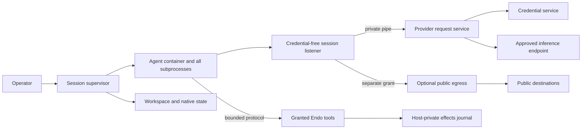

# Unified Hosted Agent Sandboxes

| | |
|---|---|
| **Created** | 2026-09-12 |
| **Updated** | 2026-09-13 |
| **Author** | kumavis (prompted) |
| **Status** | In Progress |
| **Source** | Review of PR #1248 and subsequent simplicity and authority-lifetime discussion |

## Implementation status

The first implementation increment replaces mandatory inference leases with revocable
session grants and simultaneous-request admission in the shared broker.
Codex subscription turns retain their runtime instead of renewing it each turn,
and the OpenCode broker uses the same grant contract.
Credential refresh remains separate; lifetime token/dollar budgets remain deferred.

The OpenCode broker and shared provider-listener runtime now expose inert retained kits:
`makeOpencodeBrokerKit` provides `start`/`close`, and
`makePodmanProviderListenerRuntimeKit` provides `open`/`close`.
The broker retains the runtime kit before opening it, fences grant admission during
shutdown, and retries failed issuer/runtime release without repeating successful stages.
The runtime retains initialization file handles, lock claims, recovery reservations,
and required orphan sweeps before later startup steps can fail.
Node tests cover delayed acquisition, failed initialization and release, preservation
of a live foreign owner's marker, and stale takeover with failed reservation cleanup.
These tests use simulated Podman controls and local Node listener workers.
They do not strengthen the existing PID-based recovery or native-command descendant
proofs or complete per-session controller adoption.
Async convenience wrappers still lose the cleanup handle when startup and rollback both
fail; native controllers must retain the kits directly.

The shared provider runtime and issuer now expose retained per-listener `startKit()`
and per-grant `issueKit()` owners before queued acquisition.
Cancellation fences immediately, waits admitted acquisition, and retains failed cleanup
for scoped retry without stopping healthy sibling grants or duplicating the operator
runtime, issuer, capacity, or account policy.
Listener release waits for the original child process's `close` event;
a process `error` rejects admission but is not release proof.
Thirty-six shared lifecycle tests cover cancellation before and during acquisition,
failed startup and cleanup retry, sibling survival, and delayed native closure.
Controller adoption, Podman descendant quiescence, and stale-owner recovery proof remain
pending.

Claude and OpenCode now share the MCP protocol, host-side socket transport, and guest stdio relay.
The input frame limit covers both complete frames and partial tails before dispatch.
The shared bridge admits at most 32 simultaneous host tool executions, reusing the
existing OpenCode envelope; completion releases capacity without a lifetime counter.
Admission is synchronous and excludes control messages from the execution count.
This bounds operation count, not aggregate bytes: connection, transport dispatch,
and output queue bounds remain pending, as does journal consolidation.

Floot's shared hosted tool executor closes admission immediately when a turn is
interrupted, including while backend cancellation is awaiting acknowledgement.
Previously admitted operations retain their original turn ID for result recording.
A subsequent turn reuses the same hosted tool capability with its own active context.

All three adapters now share retryable cleanup scopes for acquired resources
and a session registry for replacement ordering and cleanup ownership.
Claude/OpenCode retain failed-start cleanup ownership and retry it before replacing
or deleting the same session; unrelated session admission remains independent.
Independent release stages are attempted after a failure, and successful stages are
not repeated on retry.
Codex retains its process-before-workspace-release dependency check.
Its shutdown uses the shared registry to fence queued and future acquisitions,
wait for already-running acquisitions, and attempt every retained owner.
These scopes do not yet provide the shared supervisor's stop-during-start, immediate
revocation, process-reaping, or hung-cleanup semantics.

OpenCode's inner client now separates the immediate turn fence from completed cleanup.
It retries failed disposal/unmount/state deletion, retains admitted startup acquisition,
and does not wait for guest readiness or command writes before host disposal.
The lazy provisioning module retains partial acquisitions outside its result promise,
drains failed rollback before replacement, and checks mount-name removal results.
Callers retain a failed direct-stop owner instead of treating cancellation as stop proof
or proceeding to delete storage; independent provider/MCP releases remain separate.
Rejected mount/slice acquisitions without handles remain explicitly uncertain and require
host reconciliation before releasing their dependent storage or admitting replacements.
Native unknown-acquisition reconciliation and hang-safe revocation still require
the supervisor; durable OpenCode record adoption is described below.

Claude and OpenCode now use one static session-powers module instead of three
independently generated powers source strings.
Construction persists exact dependency capabilities before creating the powers/client
formula chain; nested factory/provider names are no longer resolved again on revival.
Daemon acceptance covers name rebinding, GC, restart, and scoped state access.
The active bundle excludes the client and is distinct from passive recovery metadata.
Claude record-backed backend adoption and shared supervisor ownership remain pending.

A shared passive session-record store now retains the approved plan and exact
dependency IDs in a host-private daemon directory per logical session.
Separate reference entries retain formula graph edges without eager capability revival.
Creation refuses replacement and publishes the plan last; partial writes and failed
cleanup retain ownership for recovery.
Daemon acceptance covers GC, restart, global-name rebinding, passive inspection of a
broken client, intentional selective activation, and retry through the original provider.
The current uncommitted OpenCode increment adopts these records through a
backend-owned provisioner; its daemon acceptance has exposed the collection failure
tracked below and must pass before this integration is committed.
New records capture dependency IDs, effective image/broker configuration, and original
workspace/config/MCP paths before acquiring native resources.
Backend re-mints share the process-local cleanup registry; new defaults apply only to
new sessions, whose hosted network policy defaults to `off`.
A proven stop releases only the client incarnation reference, retaining the logical
plan and stable dependencies for a later incarnation with fresh transports/grants.
Removal persists its intent before cleanup; failed deletion prevents resuming partly
deleted storage and retains the original provider and paths for retry.
The unused standalone provisioner entrypoint is removed so lifecycle calls pass through
the backend that owns outer MCP and broker cleanup.
These records do not prove containment after a native crash or reconcile orphaned
resources; conservative native ownership markers still refuse uncertain takeover.
Claude/Codex adoption and the full shared supervisor remain pending.

The ownership registry and passive record store now live in `@endo/daemon`, below
the session adapters and native drivers.
The sandbox registry entrypoint delegates to that implementation.
A stopped incarnation can release its client reference while retaining the logical
plan and its stable dependencies.
The daemon-local owner now retains disposable record and client capabilities inside
the daemon, returning passive snapshots and forwarding facets with copy-only events.
Stop and removal intent survive reconstruction; failed cleanup retains its original
authority and prevents reuse.
Node acceptance proves that session A can be collected after restart while session B
and both supervisor workers remain usable.
Original host/directory cancellation fences existing handles, and a revived host cannot
claim a second cleanup queue while the earlier incarnation retains the directory.
The configured daemon-local owner now constructs and activates inert native controllers.
Its fixed controller specifier, slot-free constructor input, and marked session-record
child directory survive restart; worker/client IDs are published before dedicated Node
worker acquisition.
Only explicit start persists `starting` and then supplies an exact-role dependency resolver;
inspection and reconstruction do not eagerly revive the controller's dependencies.
Stop can reach cancellation-dependent activation outside the session queue, while the
queue retains activation, dependency revival, and cleanup until they drain.
The controller's native cleanup acknowledgement precedes exact-context cancellation;
persistent storage has a separate optional `storage.remove(originalPlan)` authority.
Failed cleanup retains the plan and references and forbids revision or reuse.
Twenty-seven owner unit tests and Node daemon acceptance cover this boundary,
including effectful dependency revival, restart identity reuse, nested-directory claims,
and removal of one session while a sibling and its backend remain usable.
These are controller-fixture results; actual Claude/Codex/OpenCode adapters do not yet
use this construction path or unify their outer MCP/broker cleanup under it.
The earlier OpenCode record/provisioner draft remains uncommitted.
Core cancellation now fences late dependency acquisition and delayed formula evaluation
using the original context's cancelled state.
Node regressions reproduced both dependency-registration paths and a held worker-formula
load that previously increased native worker acquisitions from two to three after cancel.
The combined 16 context/formula tests now pass: cancelled evaluation does not acquire a
worker or construct a client, while a later intentional lookup can revive the formula.
This does not permanently revoke a formula ID or prove previously admitted effects ended.
Fresh native construction now returns a retained `{ value, cancel }` kit before effects.
Stop latches cancellation outside the session queue and waits for formula publication and
persistence to settle, separately from the constructor value, before cancelling original
contexts; failed cleanup remains retryable.
Two injected-daemon tests hold successful and failed caplet persistence and verify that
only the original worker is cancelled after the write settles, with no successor acquired.
A real Node test stops a never-resolving inert constructor, verifies its PID is gone and
its worker/client references are released, and confirms its sibling remains usable.
Stalled persistence still retains ownership and blocks completion.
This fresh-construction abort does not prove cleanup of a previously ready session whose
reconstructed controller may own native effects; actual adapter, Podman, and CLI acceptance
remain pending.

The daemon owner can attach a transient journaled tool capability with
`start(name, tools)`.
It reserves the `tools` dependency role for that activation and refuses persisted tool
references or replacement with a different capability during an active incarnation.
An ordinary turn interrupt retains the binding; stop fences further resolver retrieval.
The generic owner permits an omitted binding, so hosted controllers must require
`dependencies.get('tools')` during activation.
After daemon restart, the caller must supply its new journaled binding explicitly.
This does not revoke an already-returned capability or authenticate a guest process:
the host MCP bridge still fences admission and drains admitted calls, and Floot records
each interaction using its originating turn context.
Actual adapter wiring remains pending.

Node worker termination now waits for the original child process's `close` event,
which follows process exit or failed spawn and closure of its stdio.
A closed CapTP connection or an `exit` event alone no longer completes that proof.
The manager installs the original context's cancellation hook before worker acquisition
can yield, retaining both a late worker and a rejected acquisition's cleanup outcome.
The hook uses that acquisition, rather than resolving a replacement worker by formula ID.
Cancellation uses the existing grace period and force signal; expiry requests escalation
and does not itself acknowledge native termination.
Node setup failures after fork retain the child until close, and the parent releases
its duplicate log descriptor.
The focused worker/context run passes 19 tests, including a real Node child that closes
its CapTP pipes, ignores graceful termination, and remains owned until forced closure.
These results do not establish whole-session stop or descendant containment.

Podman teardown fences new operations, waits for admitted creates, and retains failed
removals and their admission slots for retry.
Successful cleanup requires both checked container removal and native attach-process
stdio closure; configuration remains until all owners are released.
Independent operation and policy-anchor removal failures are collected without losing owners.
Controlled driver regressions cover these races.
Bwrap now shares the registry, fences delayed admissions, and retains children through
failed cleanup attempts until their stdio closes; process errors do not release ownership.
Its existing bounded close wait applies on each retry, and group signalling still refuses
a process group whose leader Node already reaped.
Unused pasta and seccomp-file cleanup placeholders are removed.
Factory disposal now permanently fences admission, shares concurrent attempts, and
retains failed handles for retry, including an owner-cancellation cleanup sweep.
One disposal path owns driver teardown; successful current release does not rewrite a
process's historical failure, and a rejected process wait is never a reap proof.
The process reap wait remains bounded after an accepted SIGKILL, and late arrivals use
the same termination path.
Scratch acquisition checks admission again after its provider returns.
A host-only factory kit now fences factory admission, tracks pending slice construction
and backend probes, and retains every returned driver context before publishing its handle.
Close stops existing handles without waiting for unrelated pending construction, drains
late acquisitions, and retains cleanup failures for the host owner to retry.
Context cancellation uses this same close path; the public factory has no close authority.
Podman now returns a retained preparation kit before acquisition, and the factory keeps
it before awaiting the slice.
Closing a failed preparation fences its admission, drains late acquisition, and retries
only its own resources, preserving sibling slices and their shared allocator.
The full sandbox suite passes 439 tests in each of four SES modes, including failed
cleanup with a live sibling and retained producer uncertainty.
Shared probes and native-command closure remain owned by the operator driver;
per-preparation close is not driver-wide shutdown or native Podman containment evidence.
The host runtime controller now acquires exclusive ownership, shared generated-file
storage, and this factory kit in that order, then releases them in reverse order.
It returns its cleanup controller before initialization starts, so cleanup of failed
construction remains owned and a failed release can be retried by the host owner.
An atomic ownership marker contains a nonce unique to that acquisition; old successful
release calls cannot remove a successor's marker.
Existing markers and storage roots refuse startup, without a probe or stale sweep.
A dead daemon worker is insufficient evidence for recovery: a surviving `podman create`
can finish after a successor's container sweep.
The host-only `native-agent.js` entrypoint now exposes inert cleanup scopes over that
shared driver and generated-file allocator, using the same retained operator lifetime.
Each scope owns a factory kit and retains its acquisitions through late completion and
failed cleanup; successful close removes only that scope, while stale handles stay fenced.
Recovery lookup remains available during failed operator shutdown and never creates a
replacement; missing ownership is not proof of prior native release.
Native acquisition and spawn accept copy data, including resolved host paths;
native spawn excludes an incoming stdin reader and uses the returned process endpoint.
The existing daemon copy-data validator is shared with these native entry points.
Callers must validate before crossing workers, because receiver validation cannot undo
imported capability references.
Adapter integration must retain the stable operator and serialize session incarnations;
a scope may own several slices, so retrieving its identity does not deduplicate acquisition.
Injected-driver tests cover shared budgets, sibling progress, late acquisition, stale
handles, and failed operator shutdown; real adapter and Podman acceptance remain pending.
Every Podman invocation now requires the local engine, including probes and cleanup.
Podman preparation now retains anchor and seccomp-directory cleanup before a context
can be returned, with a host-only `closeSlices()` fence and retry path.
Anchor and operation-create removal cannot overtake an unfinished producer; failed
producer effects retain configuration and operation slots even after removal succeeds,
while proven no-child acquisition failures can release.
Operation admission observes cancellation through identity and policy inspection.
After successful creation, operations resolve a full container ID and use it for
policy inspection, startup, signaling, and removal, including cleanup retries.
Fixed creation flags disable automatic restart and inherited image healthchecks.
Operation removal now observes Podman's positive startup timestamp before deleting
the container record; attached exit status alone is insufficient startup evidence.
Failed observation still permits removal, but retains uncertainty and configuration
until reconciliation; successful removal is cached rather than repeated as evidence.
Resolver attestation's process-launching `exec` shares anchor producer ownership.
Podman's host-only `close()` now composes retained slice cleanup with direct native
command lifetime tracking, including failed observations, pulls, and signaling.
It aborts ordinary observations during close, preserves admitted producer deadlines,
permits cleanup retries, and seals all command admission before reporting closure.
Orphan cleanup validates full IDs before issuing removal.
Runtime shutdown now invokes factory and driver close independently and releases
storage and ownership only after both succeed; partial failures retain retry ownership.
Tests include the production Podman driver with a simulated pending native closure,
in addition to filesystem and composed-owner failures.
The hosted runtime composes Podman; the generic factory retains bwrap support,
whose separate probe-closure gap is outside this hosted composition.
Uncertain descendant completion must retain ownership rather than license replacement.
The owned daemon entrypoint now retains exact invocation controllers across formula
reconstruction within the same native module instance.
It refuses live overlaps, closes outside the construction queue on observed owner loss,
and retries failed predecessor cleanup before replacement.
Separate module instances still refuse existing filesystem markers; this is no crash recovery.
Formula configuration supplies the private parent, stable owner ID, and explicit aggregate
generated-file budgets, with no invented defaults.
OpenCode provisioning now selects the owned entrypoint and persists explicit configuration.
Both setup scripts refuse a stored generic factory without replacing or cancelling it.
Setup reads effective factory and state-provider configuration through the host-only
persisted-environment reader, using the same verified ID for each formula's metadata
and environment before checking placement against prospective guest storage roots.
Ordinary diagnostics remain environment-blind; retained settings are not reapplied.
Provisioning must be serialized and factory/provider bindings must remain stable while
dependent backends or sessions persist: backend adoption and cleanup still resolve
current names/paths even though client execution dependencies are now pinned.
Stronger crash recovery and resolver integration remain pending.
Recovery from hung driver control calls and the complete session emergency-stop path
remain pending.

Generic public TCP egress, HTTP/CONNECT proxying, and constrained DNS now live in
`@endo/hosted-agent`; Codex uses those shared services.
One shared listener image contains inference and optional public listeners, with
public activation requiring a separate host-provided capability.
Native-source and bundled-entry subprocess tests exercise the shared image entry.
Existing egress lifetime/traffic limits remain until retained allocations are audited.

Codex now supplies the pinned app-server's `externalSandbox` policy on every turn
and disables its managed proxy, using the outer container as the execution boundary.
Process/thread configuration uses `danger-full-access`, the supported baseline for
that API; guest commands may reach inference and write granted native state.
Runtime preflight checks guest child access rather than asserting an inner boundary.
The public proxy now binds fixed loopback alongside inference; the synthetic
public address, NET_ADMIN helper, and helper image configuration are removed.
An operator boolean enables public networking availability, and each session
still requires its own separately revocable public-egress capability.
Pinned app-server native-command acceptance remains outstanding.
The network evidence and proxy environment contract now lives in `@endo/hosted-agent`.
OpenCode's broker can issue separately revocable public-egress grants; its hosted
factory still uses the previous public path until resolver/runtime integration lands.

The shared sandbox request now carries literal generated-file records and validates
canonical destinations, overlapping mounts, and exact-policy exclusions before acquisition.
Backend selection requires explicit support; Podman advertises support only when the
host supplies a generated-file allocator, while bwrap still refuses these requests.
Podman stages individual read-only file binds during owned spawn acquisition, reuses them
across operations, and releases them only after every container removal succeeds.
Its mount arguments use CSV field encoding; generated destinations also exclude Podman's
automatic `/run` and `/var/tmp` mounts.
These destination checks are lexical and do not resolve aliases inside arbitrary images.
The host-only staging allocator now shares aggregate UTF-8 payload and entry budgets
across its stages, retains failed deletions and their charges, and refuses to remove
files still owned by a consumer.
It creates an exclusive fresh root under a private host directory and refuses existing
roots; reconciling a crashed owner's storage requires prior container reaping by the runtime.
Writable host-path overlap is checked again on each use.
The host-only runtime controller, owned daemon entrypoint, and OpenCode provisioning
compose storage ownership; resolver integration remains pending.

Runtime unification across all three adapters, Claude credential migration, OpenCode
public network convergence, tool/journal consolidation, emergency stop UI, and the remaining
limit removals are still pending.
Live rootless Linux Podman and pinned CLI acceptance have not yet been established.
The local implementation environment currently has no Podman executable.

## Motivation

Claude, Codex, and OpenCode need the same basic service: run an agent with selected
workspace, inference, tool, and network authority without exposing the host or its
provider credentials.
Their implementations mix that service with vendor protocols, credential storage,
runtime-specific networking, repeated provisioning, and independently chosen limits.

This plan unifies the security contract while reducing the number of controls and
state transitions needed to implement it.
The common implementation should be smaller than the combined implementations.
Extracting every existing Codex protection into a general framework is not the goal.

The review baseline is
[PR #1248 at 4e2644c](https://github.com/endojs/endo-but-for-bots/tree/4e2644c37d749986d34dce95f603dedfee0ff417).
Implementation starts from that reviewed revision, including its OpenCode and
subscription/network code.
Current behavior described below refers to that baseline, not a claim that this
design is implemented or that the revision passed independent live acceptance.

## Decisions

1. The entire guest workload is one authority domain, including the CLI, native
   tools, subprocesses, plugins, and guest-written code.
   Do not rely on identifying which guest process exercises a granted capability.
   The CLI's Endo eval integration is intended for tool calls within an active turn;
   a general background-process tool API is outside the initial design.
2. Provider credentials, policy administration, and authoritative effects records
   remain outside the guest.
3. Inference, general network access, and Endo tool access are separate grants.
   Enabling web access never changes credential placement.
4. Inference authority is session-scoped and revocable.
   There is no default 64-request budget, one-hour expiry, or renewable lease.
   These values were implementation constants, not established user requirements.
   Token and dollar spending bounds are wanted in a future design, not this implementation.
5. Runtime lifetime follows the session, not the turn.
   Turns do not trigger container replacement, remounting, or authority renewal.
6. Limits protect identifiable allocations or explicit user budgets.
   Consumed stream bytes and completed requests do not automatically exhaust a
   session merely because it has run for a long time.
7. One shared implementation owns each boundary and lifecycle.
   Vendor adapters declare requirements and translate protocols.

These decisions intentionally stop promising that guest shell commands cannot
reach inference or alter the guest's native conversation state.
An application requiring a separate trusted controller and untrusted command role
needs an explicit additional profile and its own acceptance tests.
That profile is outside the initial common implementation.

## Threat model

Treat prompts, repository contents, provider output, protocol messages, and all
code inside a guest as potentially hostile.
A guest may attempt to read credentials, reach host services, exercise ungranted
tools, alter its own configuration, flood host parsers, consume host resources, or
continue using authority after revocation.
Other guest sessions must remain isolated from those actions.
This does not promise per-session isolation of a shared provider account's allowance.
There is no per-session cumulative spending bound in this implementation.
An authorized session may keep consuming inference until stopped or refused upstream.

Trust the operator, host kernel, container runtime, credential service, and shared
host orchestration code.
Constrain guest access to those components rather than attempting to prove that a
compromised host is honest.
Configuration checks and deployment tests detect unsupported or misconfigured
hosts; they are not remote attestation of host integrity.

A guest's ability to damage its own workspace or native transcript follows its
writable grants.
Its inability to change host policy or authoritative effects records is enforced
outside those writable grants.
Public egress permits uploads and opaque HTTPS tunnels; it is not data-loss
prevention.
Inference itself sends selected data to the authorized provider.

## Shared architecture

The guest and its credential-free listener share a session-local network namespace
with no external route.
Sessions do not share that namespace.
The listener has separate process and filesystem isolation and carries only narrow
host capabilities over a private pipe.
The host validates provider destinations and request shape even if the listener
is compromised.
No provider secret or general host socket is mounted into the guest or listener.

### Session supervisor

The supervisor accepts one validated plan and owns runtime processes, mounts,
listener, inference grant, egress grant, tool grant, and cleanup.
Forms, hosted provisioning, and peer provisioning call this same service.
They do not generate independent lifecycle implementations or evaluated powers
source strings for each vendor.

The plan contains:

- Logical session ID and selected runtime adapter/image identity.
- Workspace and native-state capabilities with read/write semantics.
- Host-generated configuration and its identity.
- Provider/account/model selection, expressed as authority references rather than
  credential bytes or arbitrary upstream URLs.
- Tool grant and general egress policy.
- Deployment resource profile and explicitly requested application budgets, if any.

Keep kernel containment settings separate from application preferences such as
model context size or displayed result length.
Internal components receive validated records and narrow capabilities.
Repeat validation only when crossing another actual trust boundary or protecting
a different allocation.

The supervisor keeps a host-private daemon directory for each logical session.
It stores the approved plan as passive data and binds exact dependency formula IDs
as separate entries, including the factory, mounter, state provider, and client.
Directory entries retain formulas through GC; ID strings in metadata alone do not.
Inspecting a plan or identifying a reference must not revive a guest or require a
healthy client.
An operation explicitly resolves only the capability it needs by the recorded ID.
Do not put the client and cleanup authorities in a capability-containing marshal
record: reading that record eagerly revives every referenced formula.

The administrative owner must live at a daemon-local, host-only boundary.
Exporting disposable directory, mount, or cleanup capabilities into a shared worker
is unsafe under the daemon's current residence policy: collecting one of those
formulas can terminate that entire worker, including unrelated sessions.
Keeping only directory CRUD in the daemon does not solve this for providers,
private filesystems, or client capabilities imported during construction and cleanup.
Keep exact-ID record operations, stop/destroy/release ordering, and publication before
activation within the same administrative boundary.
Return passive snapshots and stable session-facing forwarding capabilities, rather
than exporting the disposable administrative capabilities themselves.
Native filesystem, process, socket, and provider work stays behind explicit host
capabilities; this does not move Podman or Node dependencies into the daemon core.
The owner must be stable across backend re-mints and worker placement, rather than
depending on one process's module cache.

Do not silently exempt workers from collection because they have received `@agent`.
Existing daemon tests intentionally terminate such workers when retained authorities
are collected; possession of host authority does not establish isolated placement.
An explicit dedicated administrative worker role would be a different lifetime
contract requiring separate design and acceptance, not a fix hidden in this refactor.
Before adopting record-backed cleanup, prove removal of session A leaves both
session B and its supervisor usable, including after restart and with dependencies
originating in another worker.
Verify actual formula collection and preserve ordinary-worker termination tests.

Native construction must publish a retained controller formula before activation.
Fresh caplet workers now follow the same publication ordering as explicit worker
construction: allocate identities, publish references, then create the worker.
This prevents failed client publication from starting that fresh worker.
Configured `provideSessionOwner(recordsPath, controllerSpecifier)` now stores one fixed
controller specifier and an initially null marshal input with no capability slots.
A marked `sessions` child belongs to that owner root and cannot be reopened as a separate
owner through an alias, including after restart.
Each native controller gets an explicit dedicated Node worker; its worker and client IDs
are retained before native acquisition, and original contexts remain available for retry.
Implicit powers creation and existing-worker substitution are separate paths.
The constructor is inert: decoding a capability-bearing marshal would eagerly revive all
its slots, so such constructor inputs are refused.

Explicit `start` persists `starting` before calling
`controller.activate(originalPlan, dependencies)`.
The ephemeral resolver admits only recorded runtime roles, resolves their exact IDs in
the daemon, and excludes administrative client, worker, and storage roles.
It owns even detached admitted revivals; closing fences new gets and waits for them to settle.
Inspection is passive, and a restarted daemon requires explicit start before forwarding
client operations; this start reuses the recorded worker/client IDs.

Stop immediately fences the client and activation resolver.
For a fresh incarnation, host construction returns an inert `{ value, cancel }` kit before
awaiting configuration, publication, or persistence.
The owner retains it before awaiting the controller, so its fence can request cancellation
outside the queue even when the constructor never settles.
Cancellation latches immediately but waits for the boxed formulation result or rejection,
which owns formula/context acquisition separately from the eventual constructor value.
Only then does it cancel the exact acquired contexts, retaining failed cleanup for retry;
cancelling the worker earlier could let still-pending caplet persistence acquire a successor.
Once `starting` is persisted, the owner releases the redundant construction kit and hands
cleanup to the native controller's retained termination control.
A permanently stalled persistence operation still prevents completion and remains owned.
Reconstructing a previously ready session may represent earlier native effects and does
not take this fresh inert-abort shortcut; native cleanup is still required.
The core now checks `context.assertActive()` before dependency acquisition and again
after its provider returns, preserving the original cancellation reason.
A cancelled parent's late dependent registration uses only an existing controller;
it never revives a missing dependent merely to cancel it.
Formula evaluation checks the same original context after asynchronous formula loading,
and unconfined construction checks after awaiting its worker before providing powers.
These checks prevent cancelled work from admitting a successor through a late continuation;
they neither cancel an unresolved constructor by themselves nor replace native cleanup.
Once `starting` is persisted, a retained, retryable `terminate(originalPlan, dependencies)`
control can run outside the queue to unblock cancellation-dependent activation.
The queue still drains activation, its dependency work, and cleanup before persisting
`native-closed` and cancelling the original client/worker contexts.
A cancellation failure retains that exact context for retry; successful cancellation
releases the retained context without reviving a replacement by ID.
Removal uses the separately recorded optional `storage.remove(originalPlan)` capability
after native cleanup and cancellation, then releases the record and its stop tokens.
Revision is forbidden during cleanup, preserving the original storage instructions.
No timeout, formula cancellation, or transport rejection substitutes for the controller's
native cleanup acknowledgement.

The configured owner boundary passes Node unit and daemon-fixture acceptance.
Actual adapters must still make their controller own MCP/broker, client, mounter, and
storage cleanup together before this becomes whole-session stop proof.
Shared MCP transport and OpenCode socket setup now expose inert kits whose close controls
exist before startup effects.
Closing fences connections immediately and drains admitted host handlers and setup work;
failed native closure or socket removal remains retryable through the retained kit.
The async convenience wrappers still cannot return that owner after a failed startup and
rollback, so native controller adoption must retain the kits directly.
Dedicated client placement alone is insufficient: the shared factory currently receives
mount capabilities, and state providers construct mounts through their host powers.
Resolve mount authority at the daemon boundary and pass validated native bind descriptors
to the shared native factory; separate native state-directory preparation/removal from
daemon mount formulation.
Keep mount registrations retained until native cleanup completes, so their collection
cannot kill a shared factory/provider worker or interrupt the client's cleanup reply.
Create `makeFsMounterKit` and its 9P bridges locally in each dedicated native session
controller, retaining the kit's host-only close control through cleanup failures.
The shared mounter currently imports disposable workspace/config filesystem formulas,
so resolving the sandbox factory's bind paths alone does not fix its lifetime.
Use the existing kernel 9P Unix-socket path, with controller-owned mount handles.
Stop sandbox users before kernel unmount, bridge shutdown, and completion of admitted
filesystem operations and handle closures, then release the retained formulas.
The mounter kit and bridge now retain failed cleanup and await explicit filesystem
release acknowledgements, with Node protocol and simulated-kernel integration tests.
Controller adoption, native kernel/process acceptance, and cross-worker collection
acceptance remain required before this establishes full session cleanup.

Creation is serialized by the directory's sole supervisor and refuses existing records.
Publish the plan after retaining its initial dependencies, before starting guest work.
Retain newly acquired resources before releasing their construction names.
On failure, keep the record and exact original cleanup authorities until stop and
required cleanup succeed, including when the client formula cannot revive.
A replacement backend consults the session record rather than its current default
provider or storage roots; it cannot adopt a session by rebuilding ownership from names.
Keep the directory itself outside guest powers.

### Session authority and lifecycle

Separate durable logical identity from ephemeral runtime identity.
Durable state records approved configuration and native continuity references.
An ephemeral incarnation identifies the current listener, runtime, and grants;
it has no time-based lease semantics.
Never persist a listener address as sufficient authority for later revival.

| Operation | Behavior |
|---|---|
| Start | Acquire storage, create fresh grants and runtime, verify required posture, publish readiness. |
| Send | Admit a turn on the existing runtime; no grant renewal or reprovisioning. |
| Turn interrupt | A message from the UI interrupts the foreground turn cooperatively; retain the runtime, session grants, and background processes. |
| Emergency stop | A session control under Settings fences new work, withdraws grants, aborts ongoing streams/connections, and stops and reaps processes. |
| Resume after stop/crash | Reconcile effects and cleanup, then create a new incarnation from approved durable state. |
| Change policy/image/mount plan | Settle or explicitly stop active work, revoke the old incarnation, then apply the new plan. |
| Destroy | Stop first, then apply workspace/state retention and deletion rules. |

Turn interruption is not evidence that all guest execution has stopped.
The emergency stop control reports completion only after local execution has ended;
failed cleanup remains visible, and remote effects already dispatched may still finish.

Background processes retain access to granted Endo 9P mounts between turns and after
a turn interrupt, subject to the mounts' read/write permissions and session lifetime.
Filesystem access through a mount is distinct from submitting an Endo eval/MCP call
or an equivalent vendor tool-protocol request to the host executor.
The initial supported use of Endo eval/MCP is the CLI's tool interaction within an
active host-admitted turn, retaining transcript context for why it was requested.
Keep the existing rejection of explicit tool calls outside an active turn.
Do not expose or document a separate general-purpose background MCP interface.
Close admission for an interrupted or completed turn; already dispatched calls
retain their original turn association and may settle later.

This is a workflow and recording rule, not a new process isolation boundary.
A turn gate cannot distinguish a background subprocess from the foreground CLI
while both share the same guest authority domain.
It must not claim that every accepted call was issued by the CLI or that its
transcript proves the caller's intent.
Future exposure of Endo eval to other processes would more likely use direct CapTP
or a similar capability protocol, rather than extending the CLI's MCP interface.
That would be a separate integration with explicit authority, lifetime, and context
recording semantics; the active-turn rule here belongs to the CLI tool integration,
not to Endo eval generally.
Reconsider process-facing eval when a concrete use case warrants a way to preserve
its originating context and subsequent interactions.

Revocation closes existing connections and rejects subsequent requests.
It does not undo a provider request or Endo effect already accepted remotely.
Uncertain effects remain explicitly unresolved; the supervisor never replays a
prompt to recover from uncertainty.
Recovery exposes unresolved operations and observes late outcomes where possible.
Unrelated work may proceed unless overlap with a still-live operation is unsafe.
Use conflict or idempotency keys where an existing tool contract supplies them;
do not introduce a universal duplicate detector or disable the whole session merely
because an external outcome remains unknown.
Retrying an uncertain effect is an explicit application/user decision.
Failed cleanup retains its handles and blocks a conflicting successor.
Owner death, private-pipe loss, and restart reconciliation fence orphan authority.
Do not add an active-session TTL as a substitute for implementing those paths.

Credential refresh is independent of session lifetime.
The host credential service refreshes when required, preserving account binding
and safe handling of rotating refresh tokens.
No container restart is needed for a new access token.
An unsupported or invalid credential fails inference visibly; it never causes raw
credentials to be passed into the guest.

### Provider and network services

Provider adapters specify the permitted origin, routes, methods, model selection,
authentication transformation, response handling, and redirect behavior.
The guest can invoke those operations while its session grant is active.
The guest cannot select another origin or obtain secret-management authority.
Use existing Secrets storage and credential refresh machinery where its guarantees
match this model; remove the mandatory expiry/request/cost fields from the common
session grant contract.

General egress has two initial policies:

| Policy | Granted behavior |
|---|---|
| `off` | No general external networking; separately authorized inference and Endo tools remain available. |
| `public-internet` | Public HTTP on port 80 and opaque CONNECT on port 443 through the host egress service. |

The public service retains private/host/link-local/metadata destination denial,
IPv4/IPv6 handling, DNS answer validation, and dialing of the validated literal IP.
Proxy environment variables configure cooperative programs; the unrouted namespace
and host broker enforce the boundary against programs that ignore those variables.
Direct TCP/UDP, SSH, LAN access, and an unfiltered proxy are not implied grants.
Network policy UI is derived from the same supported-policy contract.

With one guest authority domain, a tool reaching the inference listener is allowed.
Do not require a synthetic public IPv4 address, one-shot NET_ADMIN helper, or
broker-alias exclusion solely to prevent that access.
First validate a supported configuration of each pinned CLI using the ordinary
session-local endpoints.
If an adapter cannot run that way, document a narrow compatibility extension or
withhold that mode; never silently broaden general egress or disclose credentials.

### Generated runtime configuration

Represent generated resolver and CLI configuration as literal
`{ innerPath, contents }` records in the common runtime plan.
The supporting runtime stages these files in a private host directory and mounts
them read-only, with cleanup retained until every using container has been removed.
Do not put this staging beneath a directory also exposed writable to the guest.
Check destination collisions and refuse unsupported drivers.
This conveys configuration bytes without introducing host-path authority or a
new daemon file-mount capability merely for resolver configuration.
Storage bounds and retryable staging ownership belong to the shared runtime.

Podman resolver inheritance does not replace this step: in both the recorded
4.9.3 deployment and 5.8.0 source, joining a network-disabled namespace skips
resolver generation/inheritance; ordinary inheritance also excludes explicit user binds.
See [Podman 5.8.0 resolver handling](https://github.com/containers/podman/blob/v5.8.0/libpod/container_internal_common.go#L1940)
and [generated bind mounts](https://github.com/containers/podman/blob/v5.8.0/libpod/container.go#L1017).
Live Linux acceptance remains necessary for the generated resolver mount.

### Runtime and storage

`@endo/sandbox` owns Podman invocation, explicit process identity, namespace and
mount policy, capability dropping, no-new-privileges, and the supported seccomp/LSM
configuration.
Use read-only runtime files and declared writable storage.
Sanitize the host control-process environment and construct the guest environment
explicitly, including disabling automatic proxy-variable propagation.
No caller-supplied arbitrary Podman flags are part of the hosted interface.

Verify the actual runtime's required posture rather than retaining a sleeping
representative container for every session.
Use a controlled startup gate where verification must precede guest execution.
Keep startup compatibility checks and independently written behavioral tests.
Do not require unique user-namespace object IDs without identifying the UID and
cross-session authority property they enforce.
Choose and test UID mapping together with mount ownership and namespace joining.

The host storage service provides workspace, native state, and private effects
storage as distinct access roles.
Workspace and native state may share one session quota even when mounted separately.
OpenCode's SQLite/WAL state requires a suitable local filesystem; projecting all
state through 9P is not a valid simplification.
XFS project quotas may implement deployment storage budgets, but XFS helpers,
project-ID allocation, and recovery belong below the adapter interface.
Never remove an existing storage bound before its replacement is enforced.

## Protection and limit justification

For every protection ask: **what resource or authority does this protect, from
whom, and where is it already bounded?**
The last column is the decision for this design.
An existing bound protects only the allocation or authority actually named; for
example, a guest cgroup does not bound memory allocated by a host JSON parser.
Numeric deployment settings must be justified by host capacity, parser behavior,
provider requirements, or an explicit user budget, rather than copied between layers.

| Protection or limit | Resource or authority protected | From whom? | Where already bounded? | Decision and owning layer |
|---|---|---|---|---|
| Container/process and mount isolation | Host files, processes, other sessions | All guest code | Endo caps govern host APIs, not arbitrary native syscalls | Keep in shared runtime. |
| Effective provisioning configuration | Private runtime ownership markers and generated files | Guest writes enabled by mismatched retained/current host configuration | Private permissions do not protect a directory explicitly granted as a guest mount; formula environments are immutable but current process settings can differ | Read effective factory/state roots by verified formula ID before provisioning; client execution powers now pin exact dependencies; backend ownership adoption remains pending. |
| Provider secret isolation | Reusable upstream account credentials | Guest and listener code | Secrets controls storage access, not a secret already delivered | Keep host-only credential service; eliminate materialization into guests. |
| Fixed provider routes/account binding | Which upstream authority a guest can exercise | Forged guest requests | Secret custody alone does not restrict credential use | Keep in provider service. |
| Revocation and process reaping | Continued inference, networking, and execution | Stale or hostile guests | Request deadlines end one request, not the session grant | Keep one supervisor and grant owner. |
| Cleanup completion before deletion | Storage still in use and original cleanup handles | Late acquisitions, failed stops, and callers treating cancellation as containment | A rejected call or removed formula name does not prove native resources ended; successful slice disposal is the client-side containment barrier | Retain failed and uncertain acquisitions; propagate failed stop before replacement/deletion. The uncommitted OpenCode integration exercises original records and cleanup sharing within one worker; daemon collection and cross-worker ownership acceptance remain pending. |
| Provider initialization ownership | Listener cleanup authority, open resolver handles, and runtime lock/recovery reservations | Failed startup, late acquisitions, and a caller treating rejection as release | Per-listener limits bound live service work, not ownership of partially acquired host resources; persistent configuration remains operator-owned | Retain runtime/broker kits plus scoped listener/grant kits before acquisition; retry the failed issuance and retain its charge and ownership until original child closure and checked removal. This adds no lease or new budget and does not prove descendants stopped after a native crash. |
| Per-preparation cleanup | Policy anchors, temporary files, and cleanup authority for one slice; sibling availability | Failed or late preparation followed by overly broad shared-driver shutdown | The driver registry already retains failures and the shared allocator retains charges, but both span multiple preparations | Retain `prepareSliceKit` before awaiting acquisition; close and retry that preparation only. Keep shared native-command closure and driver-wide shutdown with the operator owner. No new count, timeout, or lease. |
| Native service scopes and copy data | Session cleanup, host path authority, and shared-worker lifetime | Broad cleanup, stale callers, guest-supplied paths, and accidental import of disposable formula capabilities | Factory kits already retain acquisitions; the shared driver and allocator own operator resources, while the daemon owner retains original mount authority | Capture one kit per host-only scope and retain failed cleanup. Recover through lookup; only the operator closes the shared driver. Validate copy inputs before sending and on receipt; native spawn accepts no stdin reader and writes through the returned process endpoint. |
| Filesystem drain acknowledgement | Backing files, directories, and cleanup authority still used by 9P calls | Late I/O, failed source cleanup, or a caller equating socket closure with release | Frame sizes and flow control bound transport work, not the lifetime of admitted filesystem effects; stream terminal errors can repeat an earlier I/O failure | Keep a separate release acknowledgement at the stream provider and await kernel unmount, bridge drain, and retained handle cleanup. Do not add a lease or treat a timeout as release. |
| Durable session ownership | Original cleanup authority, retained dependencies, and session storage | Retargeting after backend replacement, partial construction, and failed cleanup | Backend defaults and mutable global names do not identify an older session's owner; daemon directory entries already provide durable formula retention | The configured daemon owner retains exact IDs and contexts, publishes before acquisition, and separates native cleanup from original-plan storage removal. Node fixture acceptance passes; actual adapter wiring remains pending. |
| Transient tool attachment | Endo tool authority and its transcript context | Accidental persistence or rebinding to a different executor during a live incarnation | Floot already captures the originating turn on admission and rejects out-of-turn execution; the MCP bridge owns request admission and drain | Attach the current journaled capability only at explicit start, reserve its resolver role, and require stop before replacement. Closing the resolver prevents new retrieval; it is not revocation of a previously returned capability or process authentication. |
| Controller activation and dependency drain | Authority to revive effectful dependencies and retain their cleanup | Eager marshal-slot revival, detached requests, and startup/stop races | Exact-ID records preserve identity but do not authorize when revival may begin; a closed transport does not drain an admitted host effect | Use slot-free constructor input, persist startup intent before a scoped resolver is supplied, and drain admitted revivals before native cleanup acknowledgement and cancellation. Fence late evaluation using the original context's cancellation state; fresh constructor cancellation waits for formulation to settle before cancelling original contexts, and prior-ready reconstruction still requires native cleanup. Reuse the existing lifetime owner; add no lease or policy budget. |
| Active-turn admission for Endo eval/MCP | Association of explicit host tool calls with conversational context | Out-of-turn or stray requests | Session grants limit authority, not transcript context; this does not authenticate a guest process | Keep in shared host tool executor; background mount access remains independent. |
| 64-request ceiling | Cumulative provider usage | A looping session | No per-session cumulative bound; revocation is an action and provider quotas may be account-wide | Remove default; future token/dollar budgets are separate work. |
| One-hour authority expiry | Duration of delegated access | Abandoned or runaway sessions | Session ownership, revocation, pipe-loss handling, orphan cleanup | Remove default renewable lease; fix lifecycle directly. |
| Cost counter charging one unit/request | Same request count under a cost name | A looping session | Duplicates the request counter; does not measure or bound actual spend | Remove; design real token/dollar accounting and bounds later. |
| Container renewal each turn | Fresh runtime/grant generation | Stale runtime state | Explicit incarnation change on policy changes, failures, and restart | Remove ordinary per-turn replacement. |
| CLI/tool separation inside guest | Inference endpoint and native state from shell tools | Other code in the same guest | Host protects credentials, routes, administration, and effects records | Remove baseline guarantee; optional stronger profile only. |
| Synthetic public IP/NET_ADMIN helper | Inner proxy's exclusion of inference addresses | Guest tools reaching the broker | Such access is allowed in the new authority domain | Remove requirement; verify CLI compatibility first. |
| Generated configuration staging | Host file authority, payload storage, and directory entries | Configuration callers and guest mutations | Literal destinations restrict exposure; the host allocator charges aggregate UTF-8 bytes and entries until deletion; guest cgroups do not cover this storage | Integrate private staging with container lifetime and runtime ownership; refuse stale roots until prior users are reaped. |
| Public destination/DNS filtering | Host/LAN services and ungranted external access | Guest requests and hostile DNS answers | Container isolation alone does not constrain a host proxy's sockets | Keep in shared egress service. |
| Frame/header size cap | Allocation and parse work for one message | Guest/listener/provider input | Guest memory caps do not bound host parser allocation | Keep at each parsing boundary; derive compatible envelopes. |
| Queue/inflight/connection caps | Aggregate host memory, FDs, pending work | Flooding or slow peers | One frame cap does not bound many queued frames | Keep with backpressure in shared transport/services. |
| 10,000 events/16 MiB cumulative turn output | Accumulated output if retained forever | Long or verbose turns | Bounded queues after consumed data is released; separate storage budget | Remove after queues, retained registries, and storage are bounded. |
| Prompt/request/audit/preview limits | Different encodings and consumers of content | Large user/provider/tool content | Frame cap, storage budget, and model context each cover distinct needs | Derive transport limits; separate previews/context from correctness. |
| Lifetime cumulative traffic reservations | Transfer usage over a session | Sustained legitimate or abusive traffic | No per-session cumulative transfer bound; queue/concurrency caps protect memory only | Remove generic lifetime ceiling; optional explicit bandwidth budget. |
| Turn-wide/tool-count cutoffs | Duration or amount of requested work | Loops or expensive workflows | No automatic cumulative bound; interruption and emergency stop are explicit actions | No mandatory sandbox default; application policy when required. |
| Request/I/O and shutdown deadlines | Occupied sockets, stalled control operations, unreaped processes | Slow peers and failed runtimes | Memory limits cannot resolve a stalled operation | Keep with cancellation propagation; distinguish timeout from proven cancellation. |
| Process/memory/CPU/storage budgets | Shared-host availability | Arbitrary guest allocations | Host service budgets may bound aggregate usage only | Keep required deployment containment; account for listener and host-service overhead. |
| Separate per-role disk quotas | Workspace versus native-state storage allocation | A session filling its own storage | One session storage budget can bound both | Consolidate by default; preserve separate access roles. |
| Arbitrary model/MCP/command-part counts | Configuration size or expansion | Usually trusted operator configuration | Total config/transport bound; schema restrictions | Remove redundant counts; keep bounds on demonstrated expansions. |
| Config environment-variable size cap | OS argument/environment transport capacity | Oversized generated configuration | No replacement while that transport is used | Replace with supported file/pipe config, then remove artificial ceiling. |
| Exact harmless image-env equality | Build/configuration drift | Misconfigured operator image | Approved image identity and explicit authority-bearing environment | Drop irrelevant metadata equality; retain security-sensitive validation. |
| Sleeping anchor/per-operation proof machinery | Misconfigured host/runtime | Deployment errors, not hostile trusted host | Explicit launch policy, actual-runtime checks, independent conformance tests | Simplify to necessary checks; stop claiming stronger attestation. |
| Unique user-namespace inode per slice | Intended cross-session isolation | Peer guest processes | Private process/mount/network views and chosen UID mappings | Require the actual isolation property, not inode uniqueness by itself. |
| Multiple effects journals and anchor chains | Recovery and tampering with selected storage | Crashes or entry-store writers | One host-private effects store excludes guest writers | Consolidate recovery; optional tamper-evidence for a specified attacker. |
| Permanent journal event-count ceiling | Replay memory/time and stored history | Long-lived sessions | Segmented replay, checkpoints, retention, storage budget | Replace; retain unresolved-effect evidence. |
| Guest-local server password | Access to a loopback control server | Other guest processes | All guest processes share the same authority; network is session-local | No internal security claim; retain only if required by adapter protocol. |
| Refresh single-flight/CAS and account checks | Rotating credential continuity and identity | Concurrent refreshers, stale state, wrong-account responses | Container isolation does not coordinate credential writes | Keep in credential service, once per credential record. |

## Streaming, content, and effects

Use existing stream primitives where their cancellation and backpressure semantics
fit the boundary.
Transport limits apply before parsing a complete oversized frame.
Queue accounting includes serialization overhead and concurrent retained objects.
A full data queue must not prevent cancellation, terminal events, or cleanup from
making progress.
Keep bounded control capacity or separate control delivery.
If a peer cannot cooperate with backpressure, terminate that transport explicitly.

Remove cumulative output limits only after all retained event maps, transcript
buffers, early-event queues, and UI delivery paths have bounded resident state.
Store large content through bounded streaming or blob references.
An effects record contains intent, outcome, and a content reference where necessary;
model/UI previews can be shorter without changing the recorded outcome.
Model context capacity remains an adapter/application constraint, not a reason to
invalidate the sandbox session.

One shared host tool executor records intent before dispatch, observed outcomes, and
uncertainty in host-private effects storage across runtime adapters.
Associate each admitted call with the host's session and active turn, retaining
its request, outcome, and links to available transcript context.
Transcript context explains the interaction for users; it is not an authorization
proof or a requirement to produce private model reasoning.
Its records are authoritative for that mediated dispatch and the host's observations,
not proof of all external effects or exactly-once execution.
Native commands, direct mount operations, and opaque HTTPS effects are not
comprehensively recorded by this journal.
Guest-reported events remain untrusted observations.
Shared journal code does not require one global physical journal or serialization queue.
Native transcript checkpoints are adapter data, not authoritative evidence of host
effects.
Use crash-consistent storage, bounded replay, and retention that preserves unresolved
effects and checkpoints.
Reserve enough control/storage capacity to record failures and shutdown.
If a result cannot be durably recorded after an effect, preserve uncertainty and
do not encourage repetition.
Removing arbitrary result caps does not remove real storage-failure handling.

## Factorization and adapter responsibilities

Prefer modules within existing packages before introducing new package boundaries.

| Layer | Owns | Existing code to converge |
|---|---|---|
| `@endo/sandbox` | Runtime launch, process/mount isolation, deployment resource enforcement, observation, reaping | Generic/policy Podman paths and duplicated listener launch mechanics |
| `@endo/hosted-agent` | Shared session supervisor, revocable provider service, listener/pipe transport, public egress | Provider issuer/runtime plus Codex egress and vendor lifecycle copies |
| Host storage/Secrets services | Credential storage/refresh, quota-backed local storage, effects persistence | Claude sidecars, OpenCode state provider, Codex volume/audit composition |
| Provider adapter | Fixed upstream request/authentication/response translation | Anthropic, OpenAI subscription/API, OpenRouter details |
| Runtime adapter | CLI configuration, protocol/events, native state/resume, compatibility | Claude client, Codex app-server client, OpenCode bridge |
| Floot/application | User policy changes, optional work/usage budgets, context and presentation | Network UI, turn coordination, preview/context handling |

Provider and runtime adapters are separate concepts: selecting Codex execution
does not make OAuth lifecycle or generic public networking Codex-specific.

| Runtime | Required differences |
|---|---|
| Claude | Per-turn CLI subprocesses inside the persistent sandbox, stream-json/MCP translation, native transcript continuity, tested Anthropic auth mode. |
| Codex | App-server protocol and dynamic tools, native checkpoint mapping, supported configuration for the single-domain network model. |
| OpenCode | Pinned fork features, generated provider config, long-lived server/SSE bridge, local SQLite/WAL state. |

Native children may start per turn even though the outer sandbox remains alive.
Workspace config/plugins remain untrusted guest behavior; they cannot alter the
host-side grants.
Generated trusted startup configuration must not be replaced by guest native state
during revival.
Provider-specific setup failures fail explicitly with no raw-key or unfiltered
network fallback.

## Phased implementation

The existing implementations are not used in production.
Preserving their APIs, serialized state, and recovery formats is not a requirement.
Replace and delete superseded paths directly; do not build compatibility shims,
dual implementations, or a production migration framework.
The phases organize implementation and validation, not backwards-compatible rollout.
Compatibility below means support for pinned vendor CLIs and the selected runtime.

### Phase 1: contract and compatibility

Build a shared acceptance harness through the actual application entrypoints.
Verify each pinned CLI can use session-local inference and optional public proxy
endpoints without the extra controller/tool boundary.
Decide explicit UID mapping and local-state ownership on supported rootless Linux
Podman.
Record the smallest required process, parser, queue, and storage budgets with
allocation rationale; do not populate a new manifest with all historical numbers.

Exit: a tested launch/configuration recipe for each supported adapter and a list
of narrowly justified compatibility exceptions.
Unsupported modes remain unavailable.

### Phase 2: common authority and lifetime

Replace mandatory broker expiry/request/cost quotas with session-scoped revocable
authority.
Keep credentials in the host service and remove the renewing-backend behavior.
Preserve the sandbox across multiple turns and credential refresh.
Recreate ephemeral endpoints on restart rather than reusing persisted addresses.
Fence authority on stop, owner failure, and transport loss, including live streams.
Implement cooperative UI-message turn interruption and the session emergency stop
control under Settings, with distinct completion semantics.

Exit: more than 64 requests and an authorized session older than one hour work
without reprovisioning; explicit revocation still stops further access.
Fast clock-controlled tests establish the semantic boundary; a real soak run
checks process and resource stability.

### Phase 3: shared runtime, network, and storage

Converge Podman and listener launch paths, runtime ownership, and cleanup.
Move generic public egress to the shared service.
Make OpenCode's public mode retain brokered inference and enforce the advertised
network policy.
Move Claude credential ingestion/use to Secrets plus a tested provider adapter.
Share the storage operations needed for local SQLite and deployment-enforced budgets.
Do not require a generalized storage service or new journal format merely to share
runtime ownership.
Delete each superseded provisioner, credential wrapper, and vendor launch/network
path as its replacement becomes usable.

Exit: all three use the common grants and supervisor; no guest-visible upstream
credentials or generic unfiltered hosted-network fallback remains.

### Phase 4: transport and journal simplification

Consolidate bounded framing, queues, admission, and cancellation.
Reuse or extract the shared host tool executor's effects recording.
Remove each redundant cumulative output, event-count, result, configuration-count,
or journal-lifetime ceiling once its specific retained allocations are bounded.
Use content references, previews, or bounded replay where that consumer needs them;
do not make runtime unification depend on redesigning every UI/history consumer.
Remove the anchor/probe machinery only as replacement actual-runtime checks and
deployment tests establish the promised properties.

Exit: large and long healthy work completes with bounded resident memory and
storage, and intentionally uncertain effects remain recoverable without replay.

### Phase 5: final conformance and documentation

Check that replaced paths, unused config mounts, and obsolete policy attestations
were deleted alongside their replacements.
Update descriptors, setup guides, and security contracts to one set of guarantees.
Do not maintain a hidden weaker compatibility branch under the same policy name.
Old development state may be explicitly reset rather than migrated.
Never copy historical credential-bearing records into new journals.

Exit: source ownership is unambiguous, all advertised adapters pass conformance,
and the deleted-code list is reviewed alongside the new code.

## Validation

Tests must establish behavior at boundaries rather than mirror option generation.
Run real rootless Linux Podman tests in a job whose missing prerequisites are a
failure, alongside fast parser, cancellation, and state-machine tests.
Do not claim local macOS/remote Podman compatibility from Linux procfs checks;
that deployment needs its own supported execution and observation adapter.

### Native runtime and daemon compatibility tracking

The required path uses Node-hosted sandbox controllers and services managing Podman.
Acceptance covers the Node daemon lifecycle, supported Linux/Podman deployment, and pinned
Claude, Codex, and OpenCode CLIs.
Ironhorse execution is not a requirement or blocker for this unification.
Broader Endor supervisor or engine compatibility is optional, separate work; a selected
alternative deployment would need its own tests without delaying the required Node path.
Keep reproduced Node lifetime bugs and simulated versus native test results explicit.
The entries below track those boundaries and remaining adapter integration.

| Area | Evidence and status | Consequence and required acceptance |
|---|---|---|
| Native host modules | The OpenCode provisioner imports `node:fs/promises` and `node:path`; its backend imports native networking/crypto modules. These are intentional Node-hosted services. | Keep native operations behind explicit host powers and test the actual Node-hosted path on the supported Linux/Podman deployment. Porting these modules to a confined JavaScript engine is outside this work. |
| Worker selection and shared ownership | `provideWorkerId` creates a separate Node worker when an unconfined caplet targets a default locked worker. The older OpenCode draft still uses a module-local registry. The configured daemon owner instead claims the original root and marked records directory independently of backend module caches, and constructs explicit dedicated Node workers; Node owner acceptance covers shared administrative access and sibling survival. | Actual OpenCode backend mints must adopt this daemon boundary; Node owner fixtures do not establish adapter wiring. Verify shared ownership through the real application entrypoints. |
| Fresh worker acquisition before publication | A Node daemon regression reproduced a failed caplet result-name publication that had already persisted/evaluated its fresh worker. Fresh caplet workers now wait for successful deferred publication, preserving the exact worker identity, kind, shims, and label. | The regression verifies failed publication leaves no fresh worker formula and successful publication selects a dedicated explicit Node worker. Partial names can still refer to unpublished identities and must be reconciled without revival. This ordering does not cover implicit powers creation or substitution for an existing locked worker; session construction must use exact powers and an unspecified worker ID. Actual sandbox-adapter adoption remains unverified. |
| Eager dependency revival during construction | Marshal evaluation calls `provide` on capability slots before decoding, and the owned sandbox factory constructor opens native storage. The configured owner now supplies slot-free constructor input and gives its controller a retained exact-role resolver only after `starting` is persisted. Node daemon acceptance uses a deliberately effectful dependency in another worker: passive inspection after restart does not increment its revival audit, while explicit start does and reuses the original worker/client IDs. Unit tests cover detached revival drain, activation failure, and cancellation-dependent startup. | The Node boundary is tested; actual sandbox adapters still need to adopt it. These fixture results do not establish native Podman containment, and arbitrary dependency failure still requires its own honest cleanup contract. |
| Collection during successful record deletion | The new real-daemon `OpenCode records` acceptance fails on the Node path after recovery and cancellation: removing the record reports `Formula "directory" became unreachable by any pet name path and was collected`. `disconnectRetainersHolding` in `packages/daemon/src/residence.js` closes workers retaining collected formula references; the record helper exported child directories to its own worker. | Treat this as a confirmed Node daemon-integration blocker. Put supervisor administration at an appropriate daemon boundary; do not swallow the rejection or count it as containment. Verify deletion succeeds while another session and the supervisor remain usable, including after restart. |
| Daemon-local ownership acceptance | The original Node collection acceptance passes with clients and cleanup authority in separate workers after restart. The configured construction/activation boundary now also passes 27 owner unit tests and Node daemon acceptance, covering dedicated worker publication, original identities, nested-directory ownership, dependency revival, and sibling survival during removal. | The earlier OpenCode provisioning draft remains uncommitted. Actual native client/factory/provider mount exchanges and outer MCP/broker cleanup still need adapter adoption. |
| Directory construction pin balance | Node regressions exposed duplicate transient pins: `formulateDirectory` transfers one pin, but directory publication and host/guest dependency construction took another. Fresh directories then survived loss of their final name until restart. The fix adopts the transferred pin once and releases bootstrap pins after durable root publication. | Verify fresh concurrent directory and pet-store collection without restart, plus host/guest directory collection and continued bootstrap access. These Node regressions pass and document a daemon lifetime bug. Failed agent-construction unwinding is outside this pin-balance fix. |
| Shared 9P mounter lifetime and cleanup | `session-powers.js` exposes the original shared mounter; Claude/OpenCode clients pass workspace/config filesystem formulas into it. `9p-server/mount-caplet.js` and `src/fs-bridge.js` retain those capabilities in the shared worker, leaving the same collection hazard even with a resolved-path sandbox factory. The original mounter dropped some failed shutdown ownership, and the server closed sockets without awaiting admitted filesystem effects and handle closures. The new kit retains staged cleanup and reserves paths; its 31 fake-native mounter tests pass. Unix-socket integration verifies held filesystem work and failed cleanup retain storage, with kernel commands simulated. Per-session native-controller adoption remains pending. | Place mounter/bridges inside the explicit per-session native controller and retain their staged cleanup through failures. Prove A's filesystem collection leaves B alive, and held writes/handle closes prevent storage release. Native cross-worker acceptance through the actual adapters remains pending. |
| 9P stream release acknowledgement | Adversarial Node probes found that waiting for dispatch before sending stream cancellation can deadlock a cooperative pending read. Existing exo-stream iterators also cache terminal operation errors, while the former pumps could suppress source cleanup errors; a rejected iterator `return()` therefore cannot distinguish an old I/O error from failed release. | Separate endpoint close acknowledgement now fences and drains admitted source work, retaining failed cleanup. Node tests cover cooperative cancellation, ordinary I/O failure with successful release, held or failed cleanup, and abandoned acknowledgement chains. Connection and per-fid teardown drain stream endpoints before parent handles. These are Node protocol findings; live kernel-mount acceptance is separate. |
| Cursor stream and rewind cleanup | The former cursor stream wrapper did not forward termination to its backend iterator, while close suppressed failed returns and rewind discarded ownership. The cursor now retains one listing generation through release, fences queued pulls, and prevents stale readers from using a successor. | Sixteen Node cursor tests cover pending pulls, failed or unfinished return, retry, and close during rewind. Resourceful backend iterators must acknowledge completed cleanup honestly and retain failures for retry. |
| 9P mounter entrypoint cancellation | Previously, `9p-server/mount-caplet.js` awaited async `resolveCancelled`, which assimilated the caplet lifetime promise. A local Node probe with a pending lifetime left construction pending. The fix boxes the signal while awaiting context acquisition; direct Node entrypoint tests cover live local, presence, and promised contexts and later admission fencing. | Construction now returns before cancellation. These tests exercise no kernel mounts and do not establish native cleanup completion; the separate 9P cleanup gaps remain. |
| Native-worker test skips | `testNeedsNodeWorker` in `packages/daemon/test/endo.test.js` skips when `ENDO_BIN` is set without `ENDO_NODE_WORKER_BIN`. `test:rust` and `test:rust-node-workers` in `packages/daemon/package.json` therefore cover different paths. | Record the native-worker configuration and skipped cases with each acceptance result. These optional Rust execution configurations do not gate the Node-hosted sandbox; a skipped test or Rust smoke-test pass cannot replace required Node/Linux/Podman acceptance. |
| Native 9P/Podman test activation | The local `test:ninep` command reports two passing tests, but its probe records `not linux (darwin)` and `podman --version exit ENOENT`; both native bodies return before exercising mounts. | Count this as unexecuted native acceptance. Run with `NINEP_REQUIRE=1` on the supported Linux/Podman deployment and retain the probe result alongside test totals. Node fake-native mounter tests and Unix-socket bridge tests cover different boundaries. |
| MCP setup ownership and host-call drain | The previous async listener API exposed its cleanup handle only after startup; closing also ignored admitted host calls. Shared transport and OpenCode setup now provide inert kits, fence connections, drain admitted calls and startup work, and retain failed cleanup for retry. OpenCode refuses existing socket paths rather than assuming stale-file deletion authority. | Node Unix-socket tests and simulated late-listen/failed-close tests cover these boundaries. Callers must exclusively own the private socket directory and its stable ancestry. Async wrappers retain a documented failed-startup ownership gap until controller callers adopt the kits; these tests do not establish whole-session cleanup. |
| Provider runtime and broker initialization ownership | The old broker could lose a listener-runtime cleanup handle when issuer construction and rollback both failed. Retained broker/runtime kits now own initialization before effects, including resolver handles, lock claims, recovery reservations, and required sweeps. Fourteen Node runtime tests and ten broker tests cover initialization/cleanup retries, late acquisition, revoked grant admission, and successful-stage retention. | Podman controls are simulated; listener workers run in Node. Existing PID-based stale-owner detection and native command/descendant uncertainty are unchanged. A successful fixture cleanup is not live Podman crash-recovery evidence. Per-session native-controller adoption remains unverified; async convenience wrappers still have a documented failed-rollback handle gap. |
| Inert construction cancellation | Before the fix, Node probes reproduced two cancelled-context dependency-registration paths that revived missing controllers, and a held worker-formula load increased worker acquisitions from two to three after cancellation. Original-context checks now fence dependency acquisition before/after the provider, formula evaluation after loading, and unconfined powers after awaiting the worker. Late dependent cancellation consults only existing controllers. The combined 16 context/formula tests pass, including worker and client formula loads and a later intentional revival. | Fresh construction now retains an inert value/cancel kit before effects and reaches cancellation outside the owner queue. Two injected-daemon tests hold successful and failed caplet persistence: original worker cancellation waits for write settlement and acquires no successor. A real Node pending-constructor test verifies PID disappearance, released worker/client references, and a usable sibling. Stalled persistence still retains ownership; prior-ready reconstruction may have native effects and still requires cleanup. Core admission fences and fresh abort do not prove whole-session stop, recovery, or native Podman containment; adapter and pinned-CLI acceptance remain pending. |
| Worker death versus connection closure | Node termination now waits for the original child’s `close` event. The focused worker/context run passes 19 tests, including a real child that closes its CapTP pipes and ignores SIGTERM until forced termination. Cancellation is retained by the original context before acquisition, including late completion and failed acquisition; the existing grace budget escalates without treating expiry as termination. | The existing `testWorkerTermination` gate in `packages/daemon/test/endo.test.js` still skips whenever `ENDO_BIN` is set. Its engo connection-closure comment is prior evidence about an optional execution path; the Node regression above is independently reproduced. Whole-session emergency stop, descendant containment, failed-startup storage release, record deletion, and restart acceptance remain separate requirements. |

Every newly discovered compatibility issue should include its reproducer or code
evidence, exact execution configuration, observed versus inferred behavior, affected
design boundary, and the test needed to close it.
Keep this table current as fixes land; do not relabel an unresolved case as supported
because another execution configuration passes.

Required cases:

- Two simultaneous sessions cannot read each other's mounts or contact each other's
  listeners; guest tools can reach their own granted inference endpoint.
- `off` and `public-internet` have identical credential custody, with canary searches
  across guest env/files/processes, container metadata, logs, and formula storage.
- Public egress denies host/LAN/metadata and direct-socket bypass across IPv4/IPv6,
  DNS rebinding, mixed answers, and address aliases.
- Revocation fences new requests and closes live HTTP/CONNECT/provider streams;
  owner crash and pipe loss do not leave usable orphan grants.
- A UI-message interrupt leaves the session and background mount access available;
  the Settings emergency stop withdraws authority and ends guest execution.
- Endo eval/MCP calls outside an active turn are rejected while background mount
  access remains available; admitted calls and late results retain their turn links.
- More than 64 requests, long idle periods, and long active sessions do not exhaust
  an implicit lifetime budget or trigger container replacement.
- Slow consumers, oversized frames, many small frames, many connections, and
  early-event floods keep host memory/FDs bounded and cancellation responsive.
- Large outputs and histories use bounded storage/replay without healthy turns
  becoming failures solely from historical cumulative counters.
- Process, memory, storage, and log floods stay within deployment budgets.
- SQLite/WAL survives stop/restart; untrusted native-state/config mutations never
  increase host grants or rewrite effects evidence.
- Credential refresh races, account changes, failed cleanup, and host effects that
  finish after cancellation retain honest outcomes and do not cause auto-replay.
- Unresolved effects remain visible across resume without blocking unrelated work;
  native events are never promoted into authoritative evidence of external effects.

## Dependencies and planning

| Design | Relationship |
|---|---|
| [Endo POSIX sandbox](endo-posix-sandbox.md) | Reuse native isolation; simplify the hosted composition, not the generic platform roadmap. |
| [Secret manager](daemon-secret-manager.md) | Reuse credential storage and attenuated management capabilities. |
| [Hosted broker OAuth](hosted-agent-broker-oauth.md) | Reuse account-bound safe refresh; reconcile its older mandatory-lease and provider-availability claims during migration. |
| [Runtime filesystem mounts](runtime-container-fs-mount.md) | Preserve capability-derived mount authority and correct replacement ordering. |
| [Buffered channel consolidation](buffered-channel-exo-stream-consolidation.md) | Reuse cancellation semantics; add bounded backpressure at hostile-input boundaries without breaking control delivery. |

Track this work in M10, Capability Confinement and Ecosystem.
The provisional size is L, 2-4 developer weeks, based on several adapter migrations
and a live acceptance pass rather than new container-engine development.
This refines the existing M10 sandbox work envelope and is initially non-additive
to that milestone's estimate.
Re-estimate after Phase 1 if CLI compatibility or storage work exceeds that scope.
No new date commitment or change to the gateway critical path follows from this plan.

## Remaining design questions

- Which supported CLI configurations satisfy the single guest authority domain
  without the synthetic-address helper?
- What UID mapping and storage ownership arrangement works across concurrent
  sessions on the selected deployment?
- Which existing stream and storage primitives can implement bounded queues,
  segmented effects records, and large-content references with the least new code?
- Direct Endo eval access for other processes is outside the initial workflow.
  A future integration would likely use CapTP or a similar capability protocol,
  with its own context-recording semantics; background 9P access is already supported.
- Future work will specify token and dollar spending bounds; it is not required for
  this implementation and does not reinstate implicit request/TTL budgets.

These remaining choices do not justify restoring the discarded limits by default.

## Prompt

> agreed.
>
> create a plan document for our new design. include in it a table covering
> "what resource or authority does this protect, from whom, and where is it already bounded?"

The preceding discussion requested unification of the Claude, Codex, and OpenCode
sandboxes with particular attention to simplicity.
It agreed to session-scoped revocable inference authority in place of the
hard-coded 64-request/one-hour renewable lease.

The subsequent adversarial-review discussion established:

> Interrupting with a message from the UI is a turn interrupt.
> A session emergency stop button belongs under Settings.
> Preserve uncertain effects without blocking unrelated work, and narrow journal
> guarantees to mediated host operations.
> Token and dollar spending bounds are wanted in the future, not now.
> Backwards compatibility is not a concern: none of this is used in production.
> Background processes should be able to read Endo 9P mounts; clarify whether the
> remaining authority question concerns the Endo eval/MCP connection.

The follow-up favors keeping MCP use within the CLI's conversational workflow:

> No other process is expected to use the MCP connection, though its utility is
> conceivable and was outside the original design.
> As much as possible, a transcript should provide context for why an Endo
> interaction took place; exposing MCP to other processes may diminish that.

The process-facing protocol direction was further clarified:

> If Endo eval is exposed to other processes, it likely will not use MCP;
> direct CapTP or a similar protocol is more likely.
