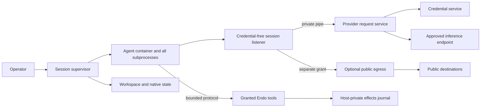

# Unified Hosted Agent Sandboxes

| | |
|---|---|
| **Created** | 2026-09-12 |
| **Updated** | 2026-09-13 |
| **Author** | kumavis (prompted) |
| **Status** | In Progress |
| **Source** | Review of PR #1248 and subsequent simplicity and authority-lifetime discussion |

## Implementation status

The first implementation increment replaces mandatory inference leases with revocable
session grants and simultaneous-request admission in the shared broker.
Codex subscription turns retain their runtime instead of renewing it each turn,
and the OpenCode broker uses the same grant contract.
Credential refresh remains separate; lifetime token/dollar budgets remain deferred.

Claude and OpenCode now share the MCP protocol, host-side socket transport, and guest stdio relay.
The input frame limit covers both complete frames and partial tails before dispatch.
The shared bridge admits at most 32 simultaneous host tool executions, reusing the
existing OpenCode envelope; completion releases capacity without a lifetime counter.
Admission is synchronous and excludes control messages from the execution count.
This bounds operation count, not aggregate bytes: connection, transport dispatch,
and output queue bounds remain pending, as does journal consolidation.

Floot's shared hosted tool executor closes admission immediately when a turn is
interrupted, including while backend cancellation is awaiting acknowledgement.
Previously admitted operations retain their original turn ID for result recording.
A subsequent turn reuses the same hosted tool capability with its own active context.

All three adapters now share retryable cleanup scopes for acquired resources
and a session registry for replacement ordering and cleanup ownership.
Claude/OpenCode retain failed-start cleanup ownership and retry it before replacing
or deleting the same session; unrelated session admission remains independent.
Independent release stages are attempted after a failure, and successful stages are
not repeated on retry.
Codex retains its process-before-workspace-release dependency check.
Its shutdown uses the shared registry to fence queued and future acquisitions,
wait for already-running acquisitions, and attempt every retained owner.
These scopes do not yet provide the shared supervisor's stop-during-start, immediate
revocation, process-reaping, or hung-cleanup semantics.

Generic public TCP egress, HTTP/CONNECT proxying, and constrained DNS now live in
`@endo/hosted-agent`; Codex uses those shared services.
One shared listener image contains inference and optional public listeners, with
public activation requiring a separate host-provided capability.
Native-source and bundled-entry subprocess tests exercise the shared image entry.
Existing egress lifetime/traffic limits remain until retained allocations are audited.

Codex now supplies the pinned app-server's `externalSandbox` policy on every turn
and disables its managed proxy, using the outer container as the execution boundary.
Process/thread configuration uses `danger-full-access`, the supported baseline for
that API; guest commands may reach inference and write granted native state.
Runtime preflight checks guest child access rather than asserting an inner boundary.
The public proxy now binds fixed loopback alongside inference; the synthetic
public address, NET_ADMIN helper, and helper image configuration are removed.
An operator boolean enables public networking availability, and each session
still requires its own separately revocable public-egress capability.
Pinned app-server native-command acceptance remains outstanding.
The network evidence and proxy environment contract now lives in `@endo/hosted-agent`.
OpenCode's broker can issue separately revocable public-egress grants; its hosted
factory still uses the previous public path until resolver/runtime integration lands.

Runtime unification across all three adapters, Claude credential migration, OpenCode
public network convergence, tool/journal consolidation, emergency stop UI, and the remaining
limit removals are still pending.
Live rootless Linux Podman and pinned CLI acceptance have not yet been established.
The local implementation environment currently has no Podman executable.

## Motivation

Claude, Codex, and OpenCode need the same basic service: run an agent with selected
workspace, inference, tool, and network authority without exposing the host or its
provider credentials.
Their implementations mix that service with vendor protocols, credential storage,
runtime-specific networking, repeated provisioning, and independently chosen limits.

This plan unifies the security contract while reducing the number of controls and
state transitions needed to implement it.
The common implementation should be smaller than the combined implementations.
Extracting every existing Codex protection into a general framework is not the goal.

The review baseline is
[PR #1248 at 4e2644c](https://github.com/endojs/endo-but-for-bots/tree/4e2644c37d749986d34dce95f603dedfee0ff417).
Implementation starts from that reviewed revision, including its OpenCode and
subscription/network code.
Current behavior described below refers to that baseline, not a claim that this
design is implemented or that the revision passed independent live acceptance.

## Decisions

1. The entire guest workload is one authority domain, including the CLI, native
   tools, subprocesses, plugins, and guest-written code.
   Do not rely on identifying which guest process exercises a granted capability.
   The CLI's Endo eval integration is intended for tool calls within an active turn;
   a general background-process tool API is outside the initial design.
2. Provider credentials, policy administration, and authoritative effects records
   remain outside the guest.
3. Inference, general network access, and Endo tool access are separate grants.
   Enabling web access never changes credential placement.
4. Inference authority is session-scoped and revocable.
   There is no default 64-request budget, one-hour expiry, or renewable lease.
   These values were implementation constants, not established user requirements.
   Token and dollar spending bounds are wanted in a future design, not this implementation.
5. Runtime lifetime follows the session, not the turn.
   Turns do not trigger container replacement, remounting, or authority renewal.
6. Limits protect identifiable allocations or explicit user budgets.
   Consumed stream bytes and completed requests do not automatically exhaust a
   session merely because it has run for a long time.
7. One shared implementation owns each boundary and lifecycle.
   Vendor adapters declare requirements and translate protocols.

These decisions intentionally stop promising that guest shell commands cannot
reach inference or alter the guest's native conversation state.
An application requiring a separate trusted controller and untrusted command role
needs an explicit additional profile and its own acceptance tests.
That profile is outside the initial common implementation.

## Threat model

Treat prompts, repository contents, provider output, protocol messages, and all
code inside a guest as potentially hostile.
A guest may attempt to read credentials, reach host services, exercise ungranted
tools, alter its own configuration, flood host parsers, consume host resources, or
continue using authority after revocation.
Other guest sessions must remain isolated from those actions.
This does not promise per-session isolation of a shared provider account's allowance.
There is no per-session cumulative spending bound in this implementation.
An authorized session may keep consuming inference until stopped or refused upstream.

Trust the operator, host kernel, container runtime, credential service, and shared
host orchestration code.
Constrain guest access to those components rather than attempting to prove that a
compromised host is honest.
Configuration checks and deployment tests detect unsupported or misconfigured
hosts; they are not remote attestation of host integrity.

A guest's ability to damage its own workspace or native transcript follows its
writable grants.
Its inability to change host policy or authoritative effects records is enforced
outside those writable grants.
Public egress permits uploads and opaque HTTPS tunnels; it is not data-loss
prevention.
Inference itself sends selected data to the authorized provider.

## Shared architecture

The guest and its credential-free listener share a session-local network namespace
with no external route.
Sessions do not share that namespace.
The listener has separate process and filesystem isolation and carries only narrow
host capabilities over a private pipe.
The host validates provider destinations and request shape even if the listener
is compromised.
No provider secret or general host socket is mounted into the guest or listener.

### Session supervisor

The supervisor accepts one validated plan and owns runtime processes, mounts,
listener, inference grant, egress grant, tool grant, and cleanup.
Forms, hosted provisioning, and peer provisioning call this same service.
They do not generate independent lifecycle implementations or evaluated powers
source strings for each vendor.

The plan contains:

- Logical session ID and selected runtime adapter/image identity.
- Workspace and native-state capabilities with read/write semantics.
- Host-generated configuration and its identity.
- Provider/account/model selection, expressed as authority references rather than
  credential bytes or arbitrary upstream URLs.
- Tool grant and general egress policy.
- Deployment resource profile and explicitly requested application budgets, if any.

Keep kernel containment settings separate from application preferences such as
model context size or displayed result length.
Internal components receive validated records and narrow capabilities.
Repeat validation only when crossing another actual trust boundary or protecting
a different allocation.

### Session authority and lifecycle

Separate durable logical identity from ephemeral runtime identity.
Durable state records approved configuration and native continuity references.
An ephemeral incarnation identifies the current listener, runtime, and grants;
it has no time-based lease semantics.
Never persist a listener address as sufficient authority for later revival.

| Operation | Behavior |
|---|---|
| Start | Acquire storage, create fresh grants and runtime, verify required posture, publish readiness. |
| Send | Admit a turn on the existing runtime; no grant renewal or reprovisioning. |
| Turn interrupt | A message from the UI interrupts the foreground turn cooperatively; retain the runtime, session grants, and background processes. |
| Emergency stop | A session control under Settings fences new work, withdraws grants, aborts ongoing streams/connections, and stops and reaps processes. |
| Resume after stop/crash | Reconcile effects and cleanup, then create a new incarnation from approved durable state. |
| Change policy/image/mount plan | Settle or explicitly stop active work, revoke the old incarnation, then apply the new plan. |
| Destroy | Stop first, then apply workspace/state retention and deletion rules. |

Turn interruption is not evidence that all guest execution has stopped.
The emergency stop control reports completion only after local execution has ended;
failed cleanup remains visible, and remote effects already dispatched may still finish.

Background processes retain access to granted Endo 9P mounts between turns and after
a turn interrupt, subject to the mounts' read/write permissions and session lifetime.
Filesystem access through a mount is distinct from submitting an Endo eval/MCP call
or an equivalent vendor tool-protocol request to the host executor.
The initial supported use of Endo eval/MCP is the CLI's tool interaction within an
active host-admitted turn, retaining transcript context for why it was requested.
Keep the existing rejection of explicit tool calls outside an active turn.
Do not expose or document a separate general-purpose background MCP interface.
Close admission for an interrupted or completed turn; already dispatched calls
retain their original turn association and may settle later.

This is a workflow and recording rule, not a new process isolation boundary.
A turn gate cannot distinguish a background subprocess from the foreground CLI
while both share the same guest authority domain.
It must not claim that every accepted call was issued by the CLI or that its
transcript proves the caller's intent.
Future exposure of Endo eval to other processes would more likely use direct CapTP
or a similar capability protocol, rather than extending the CLI's MCP interface.
That would be a separate integration with explicit authority, lifetime, and context
recording semantics; the active-turn rule here belongs to the CLI tool integration,
not to Endo eval generally.
Reconsider process-facing eval when a concrete use case warrants a way to preserve
its originating context and subsequent interactions.

Revocation closes existing connections and rejects subsequent requests.
It does not undo a provider request or Endo effect already accepted remotely.
Uncertain effects remain explicitly unresolved; the supervisor never replays a
prompt to recover from uncertainty.
Recovery exposes unresolved operations and observes late outcomes where possible.
Unrelated work may proceed unless overlap with a still-live operation is unsafe.
Use conflict or idempotency keys where an existing tool contract supplies them;
do not introduce a universal duplicate detector or disable the whole session merely
because an external outcome remains unknown.
Retrying an uncertain effect is an explicit application/user decision.
Failed cleanup retains its handles and blocks a conflicting successor.
Owner death, private-pipe loss, and restart reconciliation fence orphan authority.
Do not add an active-session TTL as a substitute for implementing those paths.

Credential refresh is independent of session lifetime.
The host credential service refreshes when required, preserving account binding
and safe handling of rotating refresh tokens.
No container restart is needed for a new access token.
An unsupported or invalid credential fails inference visibly; it never causes raw
credentials to be passed into the guest.

### Provider and network services

Provider adapters specify the permitted origin, routes, methods, model selection,
authentication transformation, response handling, and redirect behavior.
The guest can invoke those operations while its session grant is active.
The guest cannot select another origin or obtain secret-management authority.
Use existing Secrets storage and credential refresh machinery where its guarantees
match this model; remove the mandatory expiry/request/cost fields from the common
session grant contract.

General egress has two initial policies:

| Policy | Granted behavior |
|---|---|
| `off` | No general external networking; separately authorized inference and Endo tools remain available. |
| `public-internet` | Public HTTP on port 80 and opaque CONNECT on port 443 through the host egress service. |

The public service retains private/host/link-local/metadata destination denial,
IPv4/IPv6 handling, DNS answer validation, and dialing of the validated literal IP.
Proxy environment variables configure cooperative programs; the unrouted namespace
and host broker enforce the boundary against programs that ignore those variables.
Direct TCP/UDP, SSH, LAN access, and an unfiltered proxy are not implied grants.
Network policy UI is derived from the same supported-policy contract.

With one guest authority domain, a tool reaching the inference listener is allowed.
Do not require a synthetic public IPv4 address, one-shot NET_ADMIN helper, or
broker-alias exclusion solely to prevent that access.
First validate a supported configuration of each pinned CLI using the ordinary
session-local endpoints.
If an adapter cannot run that way, document a narrow compatibility extension or
withhold that mode; never silently broaden general egress or disclose credentials.

### Generated runtime configuration

Represent generated resolver and CLI configuration as literal
`{ innerPath, contents }` records in the common runtime plan.
The supporting runtime stages these files in a private host directory and mounts
them read-only, with cleanup retained until every using container has been removed.
Do not put this staging beneath a directory also exposed writable to the guest.
Check destination collisions and refuse unsupported drivers.
This conveys configuration bytes without introducing host-path authority or a
new daemon file-mount capability merely for resolver configuration.
Storage bounds and retryable staging ownership belong to the shared runtime.

Podman resolver inheritance does not replace this step: in both the recorded
4.9.3 deployment and 5.8.0 source, joining a network-disabled namespace skips
resolver generation/inheritance; ordinary inheritance also excludes explicit user binds.
See [Podman 5.8.0 resolver handling](https://github.com/containers/podman/blob/v5.8.0/libpod/container_internal_common.go#L1940)
and [generated bind mounts](https://github.com/containers/podman/blob/v5.8.0/libpod/container.go#L1017).
Live Linux acceptance remains necessary for the generated resolver mount.

### Runtime and storage

`@endo/sandbox` owns Podman invocation, explicit process identity, namespace and
mount policy, capability dropping, no-new-privileges, and the supported seccomp/LSM
configuration.
Use read-only runtime files and declared writable storage.
Sanitize the host control-process environment and construct the guest environment
explicitly, including disabling automatic proxy-variable propagation.
No caller-supplied arbitrary Podman flags are part of the hosted interface.

Verify the actual runtime's required posture rather than retaining a sleeping
representative container for every session.
Use a controlled startup gate where verification must precede guest execution.
Keep startup compatibility checks and independently written behavioral tests.
Do not require unique user-namespace object IDs without identifying the UID and
cross-session authority property they enforce.
Choose and test UID mapping together with mount ownership and namespace joining.

The host storage service provides workspace, native state, and private effects
storage as distinct access roles.
Workspace and native state may share one session quota even when mounted separately.
OpenCode's SQLite/WAL state requires a suitable local filesystem; projecting all
state through 9P is not a valid simplification.
XFS project quotas may implement deployment storage budgets, but XFS helpers,
project-ID allocation, and recovery belong below the adapter interface.
Never remove an existing storage bound before its replacement is enforced.

## Protection and limit justification

For every protection ask: **what resource or authority does this protect, from
whom, and where is it already bounded?**
The last column is the decision for this design.
An existing bound protects only the allocation or authority actually named; for
example, a guest cgroup does not bound memory allocated by a host JSON parser.
Numeric deployment settings must be justified by host capacity, parser behavior,
provider requirements, or an explicit user budget, rather than copied between layers.

| Protection or limit | Resource or authority protected | From whom? | Where already bounded? | Decision and owning layer |
|---|---|---|---|---|
| Container/process and mount isolation | Host files, processes, other sessions | All guest code | Endo caps govern host APIs, not arbitrary native syscalls | Keep in shared runtime. |
| Provider secret isolation | Reusable upstream account credentials | Guest and listener code | Secrets controls storage access, not a secret already delivered | Keep host-only credential service; eliminate materialization into guests. |
| Fixed provider routes/account binding | Which upstream authority a guest can exercise | Forged guest requests | Secret custody alone does not restrict credential use | Keep in provider service. |
| Revocation and process reaping | Continued inference, networking, and execution | Stale or hostile guests | Request deadlines end one request, not the session grant | Keep one supervisor and grant owner. |
| Active-turn admission for Endo eval/MCP | Association of explicit host tool calls with conversational context | Out-of-turn or stray requests | Session grants limit authority, not transcript context; this does not authenticate a guest process | Keep in shared host tool executor; background mount access remains independent. |
| 64-request ceiling | Cumulative provider usage | A looping session | No per-session cumulative bound; revocation is an action and provider quotas may be account-wide | Remove default; future token/dollar budgets are separate work. |
| One-hour authority expiry | Duration of delegated access | Abandoned or runaway sessions | Session ownership, revocation, pipe-loss handling, orphan cleanup | Remove default renewable lease; fix lifecycle directly. |
| Cost counter charging one unit/request | Same request count under a cost name | A looping session | Duplicates the request counter; does not measure or bound actual spend | Remove; design real token/dollar accounting and bounds later. |
| Container renewal each turn | Fresh runtime/grant generation | Stale runtime state | Explicit incarnation change on policy changes, failures, and restart | Remove ordinary per-turn replacement. |
| CLI/tool separation inside guest | Inference endpoint and native state from shell tools | Other code in the same guest | Host protects credentials, routes, administration, and effects records | Remove baseline guarantee; optional stronger profile only. |
| Synthetic public IP/NET_ADMIN helper | Inner proxy's exclusion of inference addresses | Guest tools reaching the broker | Such access is allowed in the new authority domain | Remove requirement; verify CLI compatibility first. |
| Generated configuration staging | Host file authority and temporary host storage | Configuration callers and guest mutations | Declared mount destinations restrict exposure; host storage budget is still required because guest cgroups do not cover staging | Stage literal bytes privately, mount read-only, and retain cleanup ownership; implement with shared runtime storage. |
| Public destination/DNS filtering | Host/LAN services and ungranted external access | Guest requests and hostile DNS answers | Container isolation alone does not constrain a host proxy's sockets | Keep in shared egress service. |
| Frame/header size cap | Allocation and parse work for one message | Guest/listener/provider input | Guest memory caps do not bound host parser allocation | Keep at each parsing boundary; derive compatible envelopes. |
| Queue/inflight/connection caps | Aggregate host memory, FDs, pending work | Flooding or slow peers | One frame cap does not bound many queued frames | Keep with backpressure in shared transport/services. |
| 10,000 events/16 MiB cumulative turn output | Accumulated output if retained forever | Long or verbose turns | Bounded queues after consumed data is released; separate storage budget | Remove after queues, retained registries, and storage are bounded. |
| Prompt/request/audit/preview limits | Different encodings and consumers of content | Large user/provider/tool content | Frame cap, storage budget, and model context each cover distinct needs | Derive transport limits; separate previews/context from correctness. |
| Lifetime cumulative traffic reservations | Transfer usage over a session | Sustained legitimate or abusive traffic | No per-session cumulative transfer bound; queue/concurrency caps protect memory only | Remove generic lifetime ceiling; optional explicit bandwidth budget. |
| Turn-wide/tool-count cutoffs | Duration or amount of requested work | Loops or expensive workflows | No automatic cumulative bound; interruption and emergency stop are explicit actions | No mandatory sandbox default; application policy when required. |
| Request/I/O and shutdown deadlines | Occupied sockets, stalled control operations, unreaped processes | Slow peers and failed runtimes | Memory limits cannot resolve a stalled operation | Keep with cancellation propagation; distinguish timeout from proven cancellation. |
| Process/memory/CPU/storage budgets | Shared-host availability | Arbitrary guest allocations | Host service budgets may bound aggregate usage only | Keep required deployment containment; account for listener and host-service overhead. |
| Separate per-role disk quotas | Workspace versus native-state storage allocation | A session filling its own storage | One session storage budget can bound both | Consolidate by default; preserve separate access roles. |
| Arbitrary model/MCP/command-part counts | Configuration size or expansion | Usually trusted operator configuration | Total config/transport bound; schema restrictions | Remove redundant counts; keep bounds on demonstrated expansions. |
| Config environment-variable size cap | OS argument/environment transport capacity | Oversized generated configuration | No replacement while that transport is used | Replace with supported file/pipe config, then remove artificial ceiling. |
| Exact harmless image-env equality | Build/configuration drift | Misconfigured operator image | Approved image identity and explicit authority-bearing environment | Drop irrelevant metadata equality; retain security-sensitive validation. |
| Sleeping anchor/per-operation proof machinery | Misconfigured host/runtime | Deployment errors, not hostile trusted host | Explicit launch policy, actual-runtime checks, independent conformance tests | Simplify to necessary checks; stop claiming stronger attestation. |
| Unique user-namespace inode per slice | Intended cross-session isolation | Peer guest processes | Private process/mount/network views and chosen UID mappings | Require the actual isolation property, not inode uniqueness by itself. |
| Multiple effects journals and anchor chains | Recovery and tampering with selected storage | Crashes or entry-store writers | One host-private effects store excludes guest writers | Consolidate recovery; optional tamper-evidence for a specified attacker. |
| Permanent journal event-count ceiling | Replay memory/time and stored history | Long-lived sessions | Segmented replay, checkpoints, retention, storage budget | Replace; retain unresolved-effect evidence. |
| Guest-local server password | Access to a loopback control server | Other guest processes | All guest processes share the same authority; network is session-local | No internal security claim; retain only if required by adapter protocol. |
| Refresh single-flight/CAS and account checks | Rotating credential continuity and identity | Concurrent refreshers, stale state, wrong-account responses | Container isolation does not coordinate credential writes | Keep in credential service, once per credential record. |

## Streaming, content, and effects

Use existing stream primitives where their cancellation and backpressure semantics
fit the boundary.
Transport limits apply before parsing a complete oversized frame.
Queue accounting includes serialization overhead and concurrent retained objects.
A full data queue must not prevent cancellation, terminal events, or cleanup from
making progress.
Keep bounded control capacity or separate control delivery.
If a peer cannot cooperate with backpressure, terminate that transport explicitly.

Remove cumulative output limits only after all retained event maps, transcript
buffers, early-event queues, and UI delivery paths have bounded resident state.
Store large content through bounded streaming or blob references.
An effects record contains intent, outcome, and a content reference where necessary;
model/UI previews can be shorter without changing the recorded outcome.
Model context capacity remains an adapter/application constraint, not a reason to
invalidate the sandbox session.

One shared host tool executor records intent before dispatch, observed outcomes, and
uncertainty in host-private effects storage across runtime adapters.
Associate each admitted call with the host's session and active turn, retaining
its request, outcome, and links to available transcript context.
Transcript context explains the interaction for users; it is not an authorization
proof or a requirement to produce private model reasoning.
Its records are authoritative for that mediated dispatch and the host's observations,
not proof of all external effects or exactly-once execution.
Native commands, direct mount operations, and opaque HTTPS effects are not
comprehensively recorded by this journal.
Guest-reported events remain untrusted observations.
Shared journal code does not require one global physical journal or serialization queue.
Native transcript checkpoints are adapter data, not authoritative evidence of host
effects.
Use crash-consistent storage, bounded replay, and retention that preserves unresolved
effects and checkpoints.
Reserve enough control/storage capacity to record failures and shutdown.
If a result cannot be durably recorded after an effect, preserve uncertainty and
do not encourage repetition.
Removing arbitrary result caps does not remove real storage-failure handling.

## Factorization and adapter responsibilities

Prefer modules within existing packages before introducing new package boundaries.

| Layer | Owns | Existing code to converge |
|---|---|---|
| `@endo/sandbox` | Runtime launch, process/mount isolation, deployment resource enforcement, observation, reaping | Generic/policy Podman paths and duplicated listener launch mechanics |
| `@endo/hosted-agent` | Shared session supervisor, revocable provider service, listener/pipe transport, public egress | Provider issuer/runtime plus Codex egress and vendor lifecycle copies |
| Host storage/Secrets services | Credential storage/refresh, quota-backed local storage, effects persistence | Claude sidecars, OpenCode state provider, Codex volume/audit composition |
| Provider adapter | Fixed upstream request/authentication/response translation | Anthropic, OpenAI subscription/API, OpenRouter details |
| Runtime adapter | CLI configuration, protocol/events, native state/resume, compatibility | Claude client, Codex app-server client, OpenCode bridge |
| Floot/application | User policy changes, optional work/usage budgets, context and presentation | Network UI, turn coordination, preview/context handling |

Provider and runtime adapters are separate concepts: selecting Codex execution
does not make OAuth lifecycle or generic public networking Codex-specific.

| Runtime | Required differences |
|---|---|
| Claude | Per-turn CLI subprocesses inside the persistent sandbox, stream-json/MCP translation, native transcript continuity, tested Anthropic auth mode. |
| Codex | App-server protocol and dynamic tools, native checkpoint mapping, supported configuration for the single-domain network model. |
| OpenCode | Pinned fork features, generated provider config, long-lived server/SSE bridge, local SQLite/WAL state. |

Native children may start per turn even though the outer sandbox remains alive.
Workspace config/plugins remain untrusted guest behavior; they cannot alter the
host-side grants.
Generated trusted startup configuration must not be replaced by guest native state
during revival.
Provider-specific setup failures fail explicitly with no raw-key or unfiltered
network fallback.

## Phased implementation

The existing implementations are not used in production.
Preserving their APIs, serialized state, and recovery formats is not a requirement.
Replace and delete superseded paths directly; do not build compatibility shims,
dual implementations, or a production migration framework.
The phases organize implementation and validation, not backwards-compatible rollout.
Compatibility below means support for pinned vendor CLIs and the selected runtime.

### Phase 1: contract and compatibility

Build a shared acceptance harness through the actual application entrypoints.
Verify each pinned CLI can use session-local inference and optional public proxy
endpoints without the extra controller/tool boundary.
Decide explicit UID mapping and local-state ownership on supported rootless Linux
Podman.
Record the smallest required process, parser, queue, and storage budgets with
allocation rationale; do not populate a new manifest with all historical numbers.

Exit: a tested launch/configuration recipe for each supported adapter and a list
of narrowly justified compatibility exceptions.
Unsupported modes remain unavailable.

### Phase 2: common authority and lifetime

Replace mandatory broker expiry/request/cost quotas with session-scoped revocable
authority.
Keep credentials in the host service and remove the renewing-backend behavior.
Preserve the sandbox across multiple turns and credential refresh.
Recreate ephemeral endpoints on restart rather than reusing persisted addresses.
Fence authority on stop, owner failure, and transport loss, including live streams.
Implement cooperative UI-message turn interruption and the session emergency stop
control under Settings, with distinct completion semantics.

Exit: more than 64 requests and an authorized session older than one hour work
without reprovisioning; explicit revocation still stops further access.
Fast clock-controlled tests establish the semantic boundary; a real soak run
checks process and resource stability.

### Phase 3: shared runtime, network, and storage

Converge Podman and listener launch paths, runtime ownership, and cleanup.
Move generic public egress to the shared service.
Make OpenCode's public mode retain brokered inference and enforce the advertised
network policy.
Move Claude credential ingestion/use to Secrets plus a tested provider adapter.
Share the storage operations needed for local SQLite and deployment-enforced budgets.
Do not require a generalized storage service or new journal format merely to share
runtime ownership.
Delete each superseded provisioner, credential wrapper, and vendor launch/network
path as its replacement becomes usable.

Exit: all three use the common grants and supervisor; no guest-visible upstream
credentials or generic unfiltered hosted-network fallback remains.

### Phase 4: transport and journal simplification

Consolidate bounded framing, queues, admission, and cancellation.
Reuse or extract the shared host tool executor's effects recording.
Remove each redundant cumulative output, event-count, result, configuration-count,
or journal-lifetime ceiling once its specific retained allocations are bounded.
Use content references, previews, or bounded replay where that consumer needs them;
do not make runtime unification depend on redesigning every UI/history consumer.
Remove the anchor/probe machinery only as replacement actual-runtime checks and
deployment tests establish the promised properties.

Exit: large and long healthy work completes with bounded resident memory and
storage, and intentionally uncertain effects remain recoverable without replay.

### Phase 5: final conformance and documentation

Check that replaced paths, unused config mounts, and obsolete policy attestations
were deleted alongside their replacements.
Update descriptors, setup guides, and security contracts to one set of guarantees.
Do not maintain a hidden weaker compatibility branch under the same policy name.
Old development state may be explicitly reset rather than migrated.
Never copy historical credential-bearing records into new journals.

Exit: source ownership is unambiguous, all advertised adapters pass conformance,
and the deleted-code list is reviewed alongside the new code.

## Validation

Tests must establish behavior at boundaries rather than mirror option generation.
Run real rootless Linux Podman tests in a job whose missing prerequisites are a
failure, alongside fast parser, cancellation, and state-machine tests.
Do not claim local macOS/remote Podman compatibility from Linux procfs checks;
that deployment needs its own supported execution and observation adapter.

Required cases:

- Two simultaneous sessions cannot read each other's mounts or contact each other's
  listeners; guest tools can reach their own granted inference endpoint.
- `off` and `public-internet` have identical credential custody, with canary searches
  across guest env/files/processes, container metadata, logs, and formula storage.
- Public egress denies host/LAN/metadata and direct-socket bypass across IPv4/IPv6,
  DNS rebinding, mixed answers, and address aliases.
- Revocation fences new requests and closes live HTTP/CONNECT/provider streams;
  owner crash and pipe loss do not leave usable orphan grants.
- A UI-message interrupt leaves the session and background mount access available;
  the Settings emergency stop withdraws authority and ends guest execution.
- Endo eval/MCP calls outside an active turn are rejected while background mount
  access remains available; admitted calls and late results retain their turn links.
- More than 64 requests, long idle periods, and long active sessions do not exhaust
  an implicit lifetime budget or trigger container replacement.
- Slow consumers, oversized frames, many small frames, many connections, and
  early-event floods keep host memory/FDs bounded and cancellation responsive.
- Large outputs and histories use bounded storage/replay without healthy turns
  becoming failures solely from historical cumulative counters.
- Process, memory, storage, and log floods stay within deployment budgets.
- SQLite/WAL survives stop/restart; untrusted native-state/config mutations never
  increase host grants or rewrite effects evidence.
- Credential refresh races, account changes, failed cleanup, and host effects that
  finish after cancellation retain honest outcomes and do not cause auto-replay.
- Unresolved effects remain visible across resume without blocking unrelated work;
  native events are never promoted into authoritative evidence of external effects.

## Dependencies and planning

| Design | Relationship |
|---|---|
| [Endo POSIX sandbox](endo-posix-sandbox.md) | Reuse native isolation; simplify the hosted composition, not the generic platform roadmap. |
| [Secret manager](daemon-secret-manager.md) | Reuse credential storage and attenuated management capabilities. |
| [Hosted broker OAuth](hosted-agent-broker-oauth.md) | Reuse account-bound safe refresh; reconcile its older mandatory-lease and provider-availability claims during migration. |
| [Runtime filesystem mounts](runtime-container-fs-mount.md) | Preserve capability-derived mount authority and correct replacement ordering. |
| [Buffered channel consolidation](buffered-channel-exo-stream-consolidation.md) | Reuse cancellation semantics; add bounded backpressure at hostile-input boundaries without breaking control delivery. |

Track this work in M10, Capability Confinement and Ecosystem.
The provisional size is L, 2-4 developer weeks, based on several adapter migrations
and a live acceptance pass rather than new container-engine development.
This refines the existing M10 sandbox work envelope and is initially non-additive
to that milestone's estimate.
Re-estimate after Phase 1 if CLI compatibility or storage work exceeds that scope.
No new date commitment or change to the gateway critical path follows from this plan.

## Remaining design questions

- Which supported CLI configurations satisfy the single guest authority domain
  without the synthetic-address helper?
- What UID mapping and storage ownership arrangement works across concurrent
  sessions on the selected deployment?
- Which existing stream and storage primitives can implement bounded queues,
  segmented effects records, and large-content references with the least new code?
- Direct Endo eval access for other processes is outside the initial workflow.
  A future integration would likely use CapTP or a similar capability protocol,
  with its own context-recording semantics; background 9P access is already supported.
- Future work will specify token and dollar spending bounds; it is not required for
  this implementation and does not reinstate implicit request/TTL budgets.

These remaining choices do not justify restoring the discarded limits by default.

## Prompt

> agreed.
>
> create a plan document for our new design. include in it a table covering
> "what resource or authority does this protect, from whom, and where is it already bounded?"

The preceding discussion requested unification of the Claude, Codex, and OpenCode
sandboxes with particular attention to simplicity.
It agreed to session-scoped revocable inference authority in place of the
hard-coded 64-request/one-hour renewable lease.

The subsequent adversarial-review discussion established:

> Interrupting with a message from the UI is a turn interrupt.
> A session emergency stop button belongs under Settings.
> Preserve uncertain effects without blocking unrelated work, and narrow journal
> guarantees to mediated host operations.
> Token and dollar spending bounds are wanted in the future, not now.
> Backwards compatibility is not a concern: none of this is used in production.
> Background processes should be able to read Endo 9P mounts; clarify whether the
> remaining authority question concerns the Endo eval/MCP connection.

The follow-up favors keeping MCP use within the CLI's conversational workflow:

> No other process is expected to use the MCP connection, though its utility is
> conceivable and was outside the original design.
> As much as possible, a transcript should provide context for why an Endo
> interaction took place; exposing MCP to other processes may diminish that.

The process-facing protocol direction was further clarified:

> If Endo eval is exposed to other processes, it likely will not use MCP;
> direct CapTP or a similar protocol is more likely.
