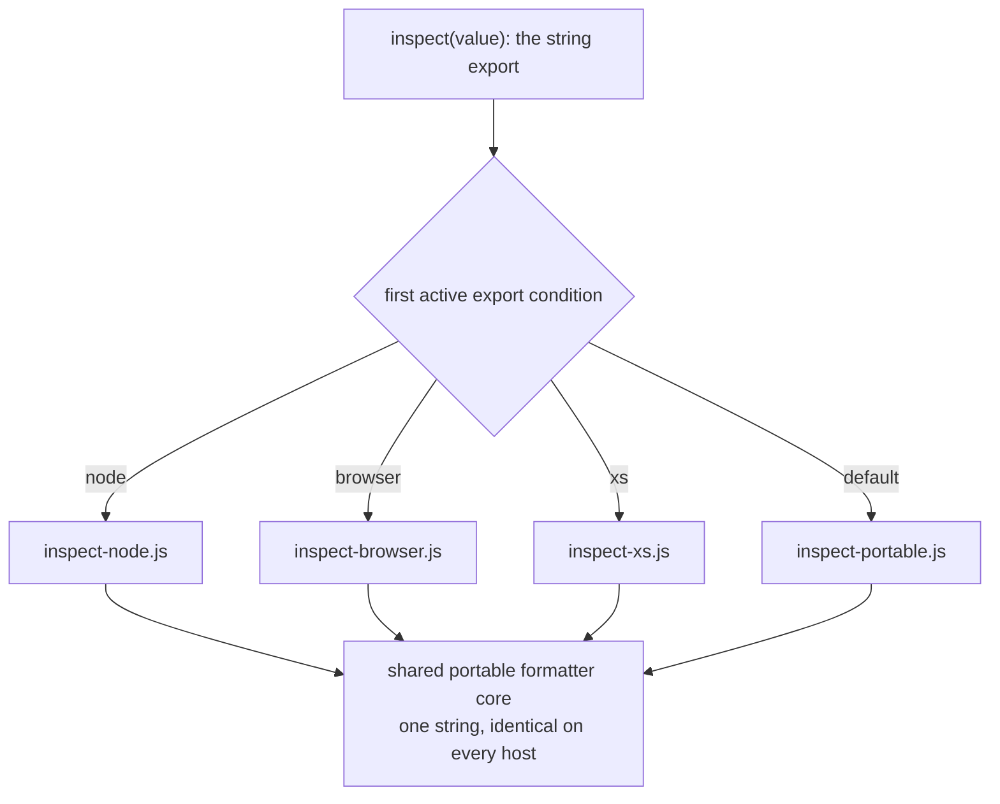

# `@endo/inspect`: a portable, safe object inspector shim

| | |
|---|---|
| **Created** | 2026-07-12 |
| **Updated** | 2026-09-04 |
| **Author** | Kris Kowal (prompted) |
| **Status** | Not Started |

## What is the Problem Being Solved?

Endo has no first-class, portable object inspector. When code under SES wants
to render an object for a human (a `console.log` argument, an assertion detail,
a REPL result), the only tool inside `packages/ses` is
`bestEffortStringify` (`packages/ses/src/error/stringify-utils.js`), a
deliberately minimal, `JSON.stringify`-based formatter whose own doc comment
warns it "has an imprecise specification and may change over time" and "possibly
emits too many 'seen' markings." It produces flat, unstyled, cycle-lossy text
and knows nothing of the host's rendering capabilities.

Meanwhile each host has a *good* inspector that Endo cannot portably reach:

- **Node** ships `util.inspect`, which colorizes with VT-100/ANSI escapes when
  writing to a TTY and emits bare text otherwise.
- **Browsers** have a *rich* console: passing a live object to `console.log`
  (or via the `%o`/`%O` format directives) yields an interactive, expandable
  tree the developer can drill into.
- **XS** has no `console` and no inspector at all; a formatter there must
  degrade to plain string production (or a no-op sink).

We want one package, `@endo/inspect`, that exposes a single inspection surface
and selects the right host behavior at build/bundle time, plus an
`@endo/inspect/shim.js` that can be **incorporated into the base of SES** so the
assertion-detail quoting renders through it instead of through
`bestEffortStringify`.

Scoping the SES win precisely matters, because SES today reaches
`bestEffortStringify` from exactly one place. The only call site in the whole
package is `quote()` at `packages/ses/src/error/assert.js:80`, inside a frozen
`toString` thunk (`toString: freeze(() => bestEffortStringify(value, spaces))`).
The tamed *causal console* (SES's console wrapper, installed by
`tame-console.js`, that records the causal chain of errors while forwarding log
calls to the host console rather than serializing their arguments) does
**not** stringify: it forwards live arguments
straight to the host console (`baseConsole[name](...args)`,
`packages/ses/src/error/console.js:330`) and, on Node, already opts out of
custom inspection (`inspectOptions: { customInspect: false }`,
`console.js:368`). So the browser's rich, expandable `console.log` tree under
SES is delivered **today**, unchanged, by that live-argument forwarding; the
shim does not create it and cannot improve it. The one seam the shim replaces is
the assertion/`quote()` string path, whose `toString` must return a **string**.
Everything the shim buys SES is a better *assertion detail* than
`bestEffortStringify`'s flat JSON: structured, depth-limited, cycle-marked, and
proxy-careful. The rich per-host console experience is a benefit of the
`@endo/inspect` API used **directly** by application code, not of the SES base
integration.

The target environment is selected by an **export condition**
(`node` / `browser` / `xs`), so the same source resolves differently under
Node's `-C`/`--conditions` flag, a browser bundler's conditions, and the
`compartment-mapper` conditions used to build for XS.

### The Proxy hazard (why this cannot be done faithfully today)

An inspector's job is to read an object's shape: walk own keys, read property
values, follow prototypes. But under SES *as written* that walk is not safe. A
**Proxy** can masquerade as an object with plain data properties, and reading
one of those "data" properties actually invokes the `get` trap, which may
**throw** or, worse, **re-enter** the caller. `bestEffortStringify` already
flinches at exactly this; its fallback comment (`stringify-utils.js`, in the
`catch` of the top-level `stringifyJson`) reads: *"the caught thing might be a
proxy or other exotic object rather than an error. The proxy might throw
whenever it is possible for it to."* So it wraps the whole render in one
`try/catch` and gives up with `[Something that failed to stringify]` on any
failure.

We cannot do better *faithfully* in engine-portable code, because **standard
JavaScript has no Proxy brand check.** Proxies are specified to be fully
transparent, so no supported predicate answers "is this value a Proxy?". The
existing defense of `passStyleOf` (Endo's [`@endo/marshal`](https://github.com/endojs/endo/tree/master/packages/marshal)
pass-style classifier, the marshalling-eligibility gate that decides how a value
may cross CapTP, Endo's capability-transfer protocol for passing references
between vats) rejects accessor properties, but that does not cover a proxy
pretending to hold data properties. Node is the one exception:
`util.types.isProxy` is a public, native, internal-slot brand check, which is
why the Node entry below can quarantine proxies today. Nothing equivalent exists
for XS, for a browser render that must return a string (the `inspect` string
export, as opposed to the rich live-object console path introduced under
"Package surface"), or for pure SES userland. Repairing
that gap is tracked upstream along two distinct lines: a **stamping power** (a
Proxy constructor that marks every instance at creation so it can later be
recognized trap-free) and a **non-trapping integrity trait** (an integrity level
a value can carry so that a proxy of it never calls its handler). It is a hard
**dependency** of a *faithful* portable inspector; see Dependencies below. The
maintainer has asked that @erights and @mhofman be tagged on this design for the
capability-security review of that gap.

## Design

### Package surface

`@endo/inspect` exports one primary function plus two console conveniences:

```js
import { inspect, inspectToConsoleArgs, log } from '@endo/inspect';

inspect(value, options);              // -> always a string, on every host
inspectToConsoleArgs(value, options); // -> always a console-argument array
log(...values);                       // -> delivers each value to this host's console sink
```

A source line authored against one shape but resolved under a different
condition is a silent-corruption hazard. If `inspect` returned a string under
one condition and an array under another, `...inspect(value)` would spread a
string into one-argument-per-character output with no error. The surface closes
that hazard by fixing each name's return *type* independent of build condition,
and by separating "compute a representation" (data, uniform type and uniform
bytes per name) from "deliver it to this host's log sink" (mechanism, per-host
richness). That same representation-vs-delivery separation runs through the
**options type**, so a field only a sink-owning export honors cannot silently
no-op on one that owns no sink: `inspect` takes an `InspectOptions` bag (the
representation options: `depth`, `breakLength`, `indent`, and the cardinality /
size bounds under "Avoiding triggered behavior") and nothing about a sink; the
two console exports take a `ConsoleOptions` bag that `extends InspectOptions`
with the sink-owning fields (`stream`, `colors`). A field only the console
exports honor is therefore absent from `inspect`'s parameter type, so handing it
to `inspect` is a compile-time type error rather than a silent drop:

- **`inspect(value, options)` returns a `string` on every host, and the same
  string on every host.** It is the portable, capability-free, deterministic
  representation produced by the shared core below. It is *not* a host-inspector
  wrapper: `util.inspect`'s format is host-specific and would make
  `inspect(v)` differ per condition, breaking the portability promise, breaking
  snapshot tests, and (via the assertion path) baking host-specific bytes into
  `Error` messages that travel to log files and over CapTP. The host inspector's
  richness lives only in the two console exports below, which own a sink and may
  legitimately vary by host. `inspect` honors `depth`, `breakLength`, and `indent`
  (the last is the per-level indentation width `quote()`'s `spaces` argument
  threads through; see "The shim and SES integration"). Its `InspectOptions`
  parameter type carries **no `colors` and no `stream`**, and it **never senses a
  TTY**, because it owns no destination (its caller does). Because `colors` is not
  a field `inspect` accepts, `inspect(v, { colors: true })` is a **compile-time
  type error**, not a silent no-op. That is the deliberate resolution of the
  divergence from Node's well-known `util.inspect`, whose name `inspect` echoes and
  which *does* colorize on `{ colors: true }`: rather than accept-and-ignore
  `colors` and diverge silently at runtime, the surface makes the mismatch fail
  loud at the type boundary. A narrower, cosmetic question does remain open (whether
  `inspect` should additionally be *renamed*, to `format` or `stringify`, to free
  the `inspect` name for a future genuinely `util.inspect`-compatible entry),
  carried under "Open Questions" below; but the silent-wrong-output hazard itself is
  closed here, at the definition site, by the option-type split.
- **`inspectToConsoleArgs(value, options)` returns an array of `console`
  arguments** on every host. On **browser** the array is the *live* object(s),
  so `console.log(...inspectToConsoleArgs(value))` preserves the rich,
  expandable tree the browser console renders. On **node** it returns the
  colorized host render as a two-element `['%s', str]` (never a bare
  `[str]`: a bare first element would let a `%s`/`%o` sequence inside
  caller-derived text be interpreted as a `console` format directive and corrupt
  the render), where `str` is `util.inspect`'s output honoring the same options
  plus TTY-driven `colors`. **The destination against which TTY-ness is sensed
  lives in the signature, not in an implicit global stream:** `options.stream`
  (default `process.stdout`) names the stream whose `.isTTY` decides colorization.
  A caller who will splat the result into `console.error` passes
  `inspectToConsoleArgs(value, { stream: process.stderr })`, so colors track the
  real destination when stdout and stderr TTY-ness diverge (piped stdout with a
  TTY stderr, or the reverse, a common CI/shell shape). `stream` and `colors` are
  `ConsoleOptions` fields, absent from `inspect`'s `InspectOptions` type entirely
  (the string export owns no sink); on non-node conditions they are inert. On
  **xs**/**default** it returns
  `['%s', inspect(value, options)]`, the portable-core string in the same
  never-misinterpreted shape.
- **`log(...values)`** is the console idiom: it maps each value through
  `inspectToConsoleArgs` and delivers the best rendering this host offers to the
  host console sink (the live-object splat on browser, the colorized string on
  node, a no-op on xs, which has no `console`). It is variadic to match
  `console.log` muscle memory (`log('tick:', obj)` logs both, never binding
  `obj` as an options bag); callers who need explicit options (including a
  non-default `stream`) call `inspectToConsoleArgs(value, options)` and splat the
  result themselves. TTY sensing lives here and in `inspectToConsoleArgs`, the
  exports that own the destination, never in `inspect`. Because `log` writes to
  `console.log`, it senses `process.stdout` (the stream `console.log` actually
  targets), so its default destination and the stream it colorizes for never
  diverge.

The three behaviors share one internal, dependency-free **portable formatter**
(the evolution of `bestEffortStringify`, with cycle marking, depth limiting, and
typed-value tags) so that `inspect`'s string output is identical across hosts
and XS has a real implementation rather than a stub. The rich browser tree is
the one deliberate exception: `inspectToConsoleArgs`/`log` on browser bypass the
shared core and hand the live value to the host console, which is why that path
is faithful-by-delegation (see "How far each environment can go").

**Totality has two halves, guaranteed to different strengths.** The first half
is **unconditional**: `inspect` (and therefore the seam that routes assertion
quoting through it) **never throws** and **initiates no console/assert call of
its own** (it renders to a string and logs nothing). The never-throw guarantee
comes from wrapping the whole render in one outer `try/catch`, matching the
total guarantee of the `bestEffortStringify` it replaces (`stringify-utils.js`),
so a throw inside `quote().toString()` can never destroy the error report it
belongs to, and `inspect` cannot re-enter `console`/`assert` through its *own*
code. The second half is **conditional**: whether reading a hostile value
re-enters the caller *through a proxy trap* cannot be promised unconditionally,
because a trap fires synchronously during the read, before any `try/catch` can
catch a later throw, and suppressing it requires a Proxy brand check that the
portable core (`inspect` on every condition) does not have. Where no brand check
applies, the trap-re-entrancy half is therefore **best-effort**, scoped exactly
like the "faithful vs best-effort" split tracked everywhere else in this
document (contract step 5, and the "How far each environment can go" table):
steps 1-4 reduce but cannot eliminate it. The per-property `try/catch` of
contract step 4 below is the inner guard for the throw half; the outer
whole-render `try/catch` is the never-throw guarantee. Both halves are Phase 1
tests (the never-throw half as a totality assertion, the re-entrancy half as a
best-effort assertion over the hostile corpus). Bounded *work* (that a hostile
`ownKeys` returning millions of synthetic keys, or an oversized value, cannot
exhaust CPU or memory even when it never throws and never re-enters) is a
**third, orthogonal guarantee**, not covered by either totality half; it is
carried by the cardinality / size bounds under "Avoiding triggered behavior"
below.

**Option honoring, per condition** (the value export `inspect`, whose parameter
type is `InspectOptions`):

| Option | node | browser | xs | default |
|---|---|---|---|---|
| `depth` | honored (shared core) | honored | honored | honored |
| `breakLength` | honored (shared core; line-wrap threshold) | honored | honored | honored |
| `indent` | honored (shared core; per-level indentation width: the axis `quote()`'s `spaces` threads through) | honored | honored | honored |
| `maxArrayLength` / `maxStringLength` / max own-keys | honored (shared core; bounded-work caps, see "Avoiding triggered behavior") | honored | honored | honored |

Every field `InspectOptions` carries is honored on every condition; `inspect` has
no accept-and-ignore field. The sink-owning fields (`colors`, `stream`) are not
part of `InspectOptions` at all; they live only on the `ConsoleOptions` bag the
two console exports take (below), so a caller cannot hand `inspect` an option it
would have to silently drop; doing so is a type error, not a no-op. Implementers
must keep `inspect`'s parameter type free of any sink-owning field rather than
widening it to "accept-and-ignore".

**`colors` on the console path** (`inspectToConsoleArgs`/`log`; `colors` is a
`ConsoleOptions` field, absent from `inspect`'s `InspectOptions`): here `colors`
*is* honored, and it
takes **precedence over the `stream`-driven auto-detection** when it is set. The
console path both auto-detects (via `options.stream.isTTY`, default
`process.stdout`) and accepts an explicit `colors`; the explicit value wins so a
caller can force color on for output that will later be viewed with `less -R`, or
force it off on a TTY for accessibility or log-scraping:

| `options.colors` (console path) | Effect |
|---|---|
| unset / `undefined` | auto-detect from `options.stream.isTTY` (default `process.stdout`) |
| `true` | force colorization on, regardless of `stream.isTTY` |
| `false` | force colorization off, regardless of `stream.isTTY` |

On non-node conditions the console path has no ANSI render, so `colors` is inert
there just as `stream` is. Phase 2's TTY test matrix must cover the override case
(explicit `colors` opposing `stream.isTTY`), not only the auto-detected default.

### Condition-parameterized resolution

The package is built once and resolved per target through `exports`
conditions, mirroring how `packages/ses` already splits `xs` from `default`
(`packages/ses/package.json` `exports`, for example `"./lockdown-shim.js"`
resolving to `{ "xs": "./src-xs/...", "default": "./..." }`):

```jsonc
"exports": {
  ".": {
    "node":    "./src/inspect-node.js",
    "browser": "./src/inspect-browser.js",
    "xs":      "./src/inspect-xs.js",
    "default": "./src/inspect-portable.js"
  },
  "./shim.js": {
    "node":    "./shim-node.js",
    "browser": "./shim-browser.js",
    "xs":      "./shim-xs.js",
    "default": "./shim-portable.js"
  }
}
```

Node resolves an `exports` object by **first match in key order**: it walks the
keys top to bottom and returns the entry for the first key whose condition is
active, so the key order *is* the priority. That first-match rule is also why
the prompt's `-C` parameterization works, and it is why the order above is
deliberate: `node` is listed ahead of `browser`, so a `node --conditions=browser`
process (both conditions active) still resolves the `node` entry, and reaching
any non-node entry under Node requires a build that deliberately *clears* the
`node` condition. `default` is the portable (string-only, capability-free)
formatter and the fallback for any resolver that activates *none* of the named
conditions:

- **Node** activates the `node` condition *implicitly* on every resolution. No
  `-C node` / `--conditions=node` flag is required ("in most cases explicitly
  calling out the Node.js platform is not necessary",
  [Node package-exports docs](https://nodejs.org/api/packages.html#conditional-exports)). Because `node` is listed first and is always active, a plain
  `import '@endo/inspect'` under any Node process resolves to `inspect-node.js`,
  the host inspector. Node consumers *always* get the host entry, never the
  portable core, unless a build deliberately clears the `node` condition (a
  bundler resolving with `node` removed from its condition set, or importing the
  `default` entry path directly).
- **Browsers/bundlers** activate `browser` by configuration (webpack/rollup/vite
  `browser` condition), not implicitly. Under a browser bundler the `node`
  condition is inactive, so the first-listed `node` key is skipped and `browser`
  resolves; a bundler that omits `browser` too falls through to `default`.
- **XS** activates `xs` through the `compartment-mapper` condition set used to
  build for XS; absent that, `default`.

So `default` is the genuine "no named condition" result (a raw resolver, or a
build that clears every platform condition), not a state Node reaches on its
own. Each condition's resolved entry is pinned by a per-condition resolution
test in Phase 1.



The diagram is the `inspect` (string) resolution path: every condition routes
`inspect` through the one shared core, which is why its bytes do not vary by
host. The per-host console richness (`util.inspect` colorization on node, the
live-value tree on browser) is a property of `inspectToConsoleArgs`/`log`, a
separate path not shown here.

Because `inspect`'s bytes are condition-invariant, the per-condition entry files
(`inspect-node.js` / `inspect-browser.js` / `inspect-xs.js`) exist to carry only
the *sink-owning* exports whose behavior the condition actually changes; each
**re-exports** the one invariant `inspect` from the shared core rather than
reimplementing it, so the condition axis selects varying behavior (`log` /
`inspectToConsoleArgs`) and never a distinct `inspect`. That keeps the axis
applied only where it earns its keep. Whether to go further and expose `inspect`
at its own condition-free subpath (retiring those three re-exports, at the cost
of a second import site and a bundler tree-shaking tradeoff) is an
implementation-level refinement deferred to the code panel's packager / assessor,
not settled here.

### The shim and SES integration

`@endo/inspect/shim.js` is a vetted shim in the sense of the other
`*-shim.js` entries (permitted to run before `lockdown()`): importing it for its
side effects installs the inspector as the formatter SES uses for
**assertion-detail quoting**. The scope is exactly that one seam. As established
above, `quote()` (`assert.js:80`) is the sole reader of `bestEffortStringify` in
the package; the tamed causal console already forwards live arguments to the
host console (`console.js:330`) and already sets `customInspect: false`
(`console.js:368`), so the console path needs no shim and gains nothing from one.
The shim provides a `setInspector`-style seam so that, when loaded, `quote()`'s
`toString` delegates to `@endo/inspect`'s `inspect` (a **string**, the only
shape a `toString` may return) instead of to `bestEffortStringify`.

The seam must preserve `quote()`'s existing contract in full; the replacement
may drop none of its terms:

- **Laziness.** `quote` returns a frozen `Stringable` whose `toString` renders
  only when read; the seam stays a `toString` thunk and never renders eagerly.
- **Declassifier registration.** `quote`'s result is registered in the
  `declassifiers` WeakMap (`assert.js:75`) so redaction can map the stringable
  back to its input; the seam preserves that registration unchanged.
- **`spaces`.** `quote(value, spaces)` threads a pretty-print indentation-width
  argument (today passed straight to `JSON.stringify` as its `space` argument,
  `stringify-utils.js`). The seam forwards it to `inspect`'s **`indent`** option
  (the portable core's per-level indentation width, the `indent` row in the
  option table under "Package surface" above), *not* to `breakLength`. The two are different axes: `indent` sets
  how deeply each nested level is indented (the `JSON.stringify` `space` axis
  `bestEffortStringify` honors today), while `breakLength` is the line-wrap
  threshold before a value is split across lines. Because the `quote()` seam always
  renders through `inspect` (the portable-core string on every host, never
  `util.inspect`), `indent` is honored by the shared core directly, so no fidelity
  is dropped on the one call site the shim is built around.

Incorporating the shim "in the base of SES" means it is part of the SES
bootstrap for a given target build, selected by the same export condition. The
seam routes `quote()` through `inspect` (the **string** export), which is the
shared portable core on *every* condition (see "Package surface"), so a Node,
browser, or XS base build all render assertion details through that same
brand-check-free portable core, without SES taking a static dependency on any
host inspector. The host inspector (`util.inspect` and its `util.types.isProxy`
quarantine) is reached only by the direct-console exports
(`inspectToConsoleArgs`/`log`), which the SES base seam never calls; the
condition still selects the *package* build, but at the `quote()` seam every
condition, node included, resolves to the same portable core. The default SES
build (no `@endo/inspect/shim.js`) keeps `bestEffortStringify` unchanged, so
this is strictly additive and opt-in per build.

**Seam authority (the invariant that constrains the seam choice).** Because
`quote()` is SES's redaction-adjacent surface, whoever can set the inspector
controls what trusted assertion output discloses (and the depth/format of
unredacted payloads). The installed inspector is therefore a **value fixed at
taming construction, settable only before `lockdown()`** (write-once,
pre-lockdown), never a mutable module-singleton place that post-lockdown code
can re-point. The first item under "Open Questions" (far below) lists three
candidate seams for *how* the shim installs the inspector; each must be judged
against this write-once bound, not against ergonomics. A mutable post-lockdown
`setInspector` is out of scope by this invariant.

**Adopter guidance: the best-effort SES base build is an explicit act, never an
omission.** Every `@endo/inspect/shim.js` variant routes `quote()` through the
**string** `inspect` export, which is the *best-effort* portable core on *every*
condition (the host inspector's `util.types.isProxy` quarantine lives only on
the direct-console path the seam never calls). So the SES base assertion seam
carries the *same* best-effort exposure regardless of condition, **node
included**: its own contract (step 5 below) concedes the faithful portable
guarantee is not available, a proxy handed to trusted code can still make
`getOwnPropertyDescriptor` throw, lie, or re-enter, the exact re-entrancy /
interleaving attack [Agoric/agoric-sdk#3905](https://github.com/Agoric/agoric-sdk/issues/3905)
describes. Wiring that best-effort formatter into SES's own assertion path (the
trusted logging machinery) under an *adversarial* threat model, before the
faithful contract of Phase 5 lands, reintroduces a re-entrancy surface in
precisely the place SES is meant to defend. Two safeguards keep that from
happening by accident:

- **A base integration cannot be reached by forgetting a condition.** `default`
  is both the least-safe entry and the fallthrough for a resolver that activates
  *no* condition, so a build that merely omits its conditions must not silently
  wire the inspector into SES's trusted assertion path. Base-integrating the
  inspector into SES is therefore gated behind a distinct, named opt-in (a
  dedicated build entry / condition that the adopter sets deliberately),
  regardless of target condition, not the plain `default` fallthrough. Adopting
  the best-effort formatter is an act, not an omission.
- **Scoped by surface, not by condition, for the base seam.** The node
  quarantine (`util.types.isProxy`) and the browser faithful-by-delegation path
  benefit the **direct console API** (`inspectToConsoleArgs`/`log`, which own a
  sink and may reach the host inspector); those exports are safe to adopt now on
  node/browser (with the browser expand-time caveat in the table below). The
  **SES base assertion seam is a different surface**: it calls only the string
  `inspect` (portable core, no brand check on *any* condition), so
  base-integrating the shim carries the best-effort re-entrancy exposure on
  **every** condition, node included, not only on `default`/`xs`. Until Phase 5
  supplies a faithful brand/trait check, treat the base integration itself, on
  any condition, as *dev-and-non-adversarial-context* tooling (REPLs, local
  diagnostics, trusted-input logging); an adopter enabling it inside a trust
  boundary that handles untrusted proxies accepts the residual re-entrancy risk
  knowingly, and a base integration for adversarial use should gate on Phase 5
  regardless of the target condition.

### Avoiding triggered behavior (the safety contract)

The inspector must **carefully avoid triggering behaviors of the logged
objects**: reading a value must not run guest getters or proxy traps whose
side effects (throwing, re-entrancy, mutation, timing signals) could subvert the
logger or leak authority.

#### What can be read without triggering anything

The portable core restricts itself to a graded vocabulary of operations:

- **Trap-free on every value, including proxies:** `typeof`, identity
  (`===`, `Object.is`), `Array.isArray` (which follows a proxy to its target
  without running handler code, though it throws `TypeError` on a *revoked*
  proxy, itself caught by the fallible-read wrapper), and, critically,
  **WeakMap/WeakSet lookup**, which is keyed on identity and consults the
  collection's own state, never the key's. Identity-keyed lookup is the
  primitive that makes proxy *stamping* ([endojs/endo#1756](https://github.com/endojs/endo/issues/1756))
  a sound defense, and it is why an inspector could consult an existing registry
  (for example the `passStyleMemo` inside `passStyleOf`) without touching the
  value.
- **Trap-free but brand-specific, internal-slot brand probes:** applying a
  built-in that reads an internal slot directly (for example
  `Date.prototype.getTime`, which reads `[[DateValue]]` via the `thisTimeValue`
  abstract operation) to classify a suspected `Date`. A proxy has *no* such
  internal slot, so the operation throws `TypeError` immediately **without
  invoking any handler trap**; it is trap-free, not trap-firing. The practical
  consequence is the *inverse* of a re-entrancy hazard: a proxy-wrapped `Date`
  is safely misidentified as "not a `Date`" (rendered opaquely) with no
  interleaving channel opened, so probe ordering can lean on these operations as
  non-triggering. These throws are still caught by the fallible-read wrapper of
  contract step 4 below, but the catch is for the ordinary brand-mismatch throw,
  not for trap re-entrancy.
- **Getter-free on ordinary objects but trap-firing on proxies:**
  `Object.getOwnPropertyDescriptor(s)`, `Reflect.ownKeys`,
  `Object.getPrototypeOf`, and `Object.isFrozen`. On a non-proxy these
  read engine-internal state without running guest code, and descriptor reads
  let the renderer show `[Getter]` without calling it. On a proxy, every one
  of them enters the handler; [endojs/endo#1912](https://github.com/endojs/endo/issues/1912)
  makes the point that even integrity queries like `Object.isFrozen` are
  observable probes.
- **Never used on guest values:** property Gets through the object
  (`value[key]`), `toString`, `Symbol.toPrimitive`, `toJSON`,
  `Symbol.for('nodejs.util.inspect.custom')` and any other custom-inspection
  hook, and any accessor invocation.

The contract, in descending order of what we can guarantee today:

1. **Never invoke `customInspect` / `Symbol.for('nodejs.util.inspect.custom')`
   / `Symbol.toPrimitive` / `toString` on guest objects** by default. On Node
   this is `util.inspect(v, { customInspect: false, getters: false })`. SES's
   tamed console already opts out of custom inspection at `console.js:368`; the
   node inspector coordinates with that seam rather than duplicating it.
2. **Quarantine detectable proxies before reading them.** Where the selected
   condition supplies a brand check (Node's `util.types.isProxy` today; a
   stamping predicate or non-trapping trait check, available portably once a
   dependency lands), test first, and render a detected proxy opaquely as the
   bracketed placeholder `[Proxy <typeof>]` (for example `[Proxy function]`),
   kept in the same `[...]` family as the `[Getter]` / `[Setter]` / `[Getter threw]`
   read-outcome tags so the whole placeholder sub-vocabulary spells as one pattern
   a reader or downstream parser can match, disclosing proxy-ness without entering
   the handler. This
   matches the direction Node itself took in [nodejs/node#61029](https://github.com/nodejs/node/pull/61029).
3. **Prefer own-enumerable data descriptors** obtained via
   `getOwnPropertyDescriptor`; render accessor properties as `[Getter]` /
   `[Setter]` **without calling them** unless the caller opts in.
4. **Treat every remaining read as fallible:** wrap each property read in
   `try/catch` and render a failed read as a typed placeholder (for example
   `[Getter threw]`) rather than propagating, so one hostile property cannot
   abort or hijack the whole render. (This is the inner guard beneath the
   top-level never-throw/never-re-enter invariant stated under Package surface.)
5. **The faithful portable guarantee is not available.** Where no brand check
   exists, we cannot distinguish a proxy-with-a-throwing-`get` from a plain
   data object *before* touching it; steps 1-4 reduce but do not eliminate the
   hazard (a proxy can still make `getOwnPropertyDescriptor` itself throw, lie,
   or re-enter). The residual risk is the subject of the upstream dependencies
   below and the reason for the @erights / @mhofman review.

**Bounded work is a separate defense from never-throw.** "Never throws" is not
the same guarantee as "safe against a hostile input" on the resource axis: a
`[[OwnPropertyKeys]]` trap on an extensible proxy target may legally return
millions of synthetic keys, and a getter (or a genuinely enormous data value)
may yield a multi-gigabyte string, *without* throwing and *without* re-entering
beyond the initial trap call, so a render that satisfies both totality halves
above can still exhaust CPU or memory before it finishes producing the string.
`inspect` therefore carries cardinality and size bounds analogous to Node's
`util.inspect` defaults (`maxArrayLength`, `maxStringLength`, and a matching cap
on the number of own keys walked per object) as `InspectOptions` fields with
finite, total-work-preserving defaults, truncating with an explicit elision
marker (for example `... N more items`) once a limit is hit rather than walking
an attacker-chosen count to completion. This is a distinct defense from the
never-throw wrapper (step 4) and the proxy quarantine (step 2): it closes the
resource-exhaustion vector those two do not, which matters most on the SES base
assertion seam that "Adopter guidance" already frames as reachable by adversarial
proxies (the [Agoric/agoric-sdk#3905](https://github.com/Agoric/agoric-sdk/issues/3905)
interleaving attack), so a bounded render cannot be turned into an unbounded
denial-of-service by a hostile `ownKeys`.

#### How far each environment can go

| Environment | Proxy brand check | Faithfulness achievable today |
|---|---|---|
| node | Yes: `util.types.isProxy`, a public native internal-slot check | Near-faithful: quarantine proxies before delegating to `util.inspect` for the console-args/`log` path. `util.types.isProxy` is a top-level check; disclosing a *nested* proxy inside `util.inspect`'s own walk requires a Node build carrying [nodejs/node#61029](https://github.com/nodejs/node/pull/61029) (2025). On older Node we pre-walk top-level with `util.types.isProxy` and render nested unknowns opaquely rather than delegating a nested walk that could re-enter. `inspect` (the string export) is the portable core and shares its limits |
| browser | None in userland; the devtools console has engine access and renders proxies itself | Faithful *by delegation* for the rich path, **with an expand-time caveat**: the pass-through hands the live value to the host console and never reads it in our code, but rendering is *deferred to devtools expand time*. A getter or proxy trap still runs in the developer's own session when the tree is expanded, the tree shows post-mutation state, and the console retains the live value. Safe to adopt for non-adversarial inputs; against untrusted values the deferred-expansion channel remains open. `inspect` (the string export) falls back to the portable core and inherits its limits |
| xs | None today. Endo co-maintains the XS lockdown integration (`packages/ses/src-xs`), so a native predicate could be requested from Moddable as future work | Best-effort via the portable core |
| default (pure SES userland) | None; this is the gap | Best-effort only, per steps 1, 3, and 4 |

## Dependencies

| Design / Issue | Relationship |
|---|---|
| [endojs/endo#1756: Repair `Proxy` with stamping power](https://github.com/endojs/endo/issues/1756) | **Blocking for the *faithful* portable safety contract.** Proposes that Hardened JS replace the `Proxy` constructor with one that stamps every instance into a WeakSet and expose a start-compartment predicate. Identity-keyed lookup is trap-free, so the predicate lets the inspector detect and quarantine proxies before reading them. Explicitly motivated by `passStyleOf`-style traversals. |
| [Agoric/agoric-sdk#3905: Stamp proxies to prevent reentrancy / interleaving](https://github.com/Agoric/agoric-sdk/issues/3905) | **The agoric-sdk twin of endojs/endo#1756.** Untrusted code can hand trusted code a proxy of a hardened object that behaves identically but lets the attacker observe and interleave on every property access (re-entrancy against marshal's serializer, the virtual object manager, and `passStyleOf` traversal). The same attack applies verbatim to an inspector's walk. |
| [tc39/proposal-stabilize](https://github.com/tc39/proposal-stabilize) (Stage 1) | **The standards-track repair.** Adds integrity traits including **non-trapping**: a proxy whose target is non-trapping never calls its handler. Champions include Mark S. Miller and Mathieu Hofman, the reviewers this design tags. If hardened values become non-trapping, the hazard disappears for hardened inputs wholesale, subsuming the stamping predicate for most inspector inputs. |
| [endojs/endo#2673: feat(non-trapping-shim): opt-in shim of the non-trapping integrity trait](https://github.com/endojs/endo/pull/2673) (open PR) | **In-flight Endo shim of that trait.** (`isNonTrapping` / `suppressTrapping`, placeholder names pending tc39/proposal-stabilize naming.) A portable inspector should bind to this seam when present. |
| [endojs/endo#2675: feat(ses,pass-style): use non-trapping integrity trait for safety](https://github.com/endojs/endo/pull/2675) (open PR) | **The systemic adoption direction.** `harden` suppresses trapping at each step and `passStyleOf` checks non-trapping where it checked `isFrozen`. The preparatory refactor already merged as [endojs/endo#2679](https://github.com/endojs/endo/pull/2679). This design's faithful phase should align with whichever of stamping ([endojs/endo#1756](https://github.com/endojs/endo/issues/1756)) or non-trapping ([endojs/endo#2673](https://github.com/endojs/endo/pull/2673) / [endojs/endo#2675](https://github.com/endojs/endo/pull/2675)) lands. |
| [endojs/endo#1912: harden as a new integrity level](https://github.com/endojs/endo/issues/1912) | **Why even probing is triggering.** Observes that integrity queries such as `Object.isFrozen` fire proxy traps, so an inspector cannot even safely ask about integrity. Precursor framing for tc39/proposal-stabilize. |
| [endojs/endo#819: Propose ECMA 262 language invariant for proxy handlers](https://github.com/endojs/endo/issues/819) | **Related soundness precondition.** SES's proxy defenses rest on the handler-interaction invariant; a brand check or trait check is only sound while that invariant holds. Surfaced so the safety review considers both together. |
| Node precedent: [nodejs/node#6464](https://github.com/nodejs/node/issues/6464), fixed by [nodejs/node#6465](https://github.com/nodejs/node/pull/6465); [nodejs/node#60964](https://github.com/nodejs/node/issues/60964), fixed by [nodejs/node#61029](https://github.com/nodejs/node/pull/61029) | **Prior art for both halves of the contract.** Node's `console.log` originally re-entered proxy traps and crashed ([nodejs/node#6464](https://github.com/nodejs/node/issues/6464)); the fix introduced native proxy detection and the `showProxy` inspect option ([nodejs/node#6465](https://github.com/nodejs/node/pull/6465)), and `util.types.isProxy` is public API. The 2025 refinement ([nodejs/node#61029](https://github.com/nodejs/node/pull/61029), follow-up [nodejs/node#61077](https://github.com/nodejs/node/pull/61077)) labels proxies even when `showProxy` is off, including nested ones: safe inspection must both *avoid traps* and *disclose proxy-ness*. |
| SES console prior art: [endojs/endo#945](https://github.com/endojs/endo/issues/945), [endojs/endo#636](https://github.com/endojs/endo/issues/636), [endojs/endo#944](https://github.com/endojs/endo/issues/944), [endojs/endo#1530](https://github.com/endojs/endo/issues/1530), [endojs/endo#2941](https://github.com/endojs/endo/issues/2941) | **The pain this package retires.** The causal-console/taming split and its constraints ([endojs/endo#945](https://github.com/endojs/endo/issues/945)); Node's inspector confused by SES-tamed `constructor` accessors ([endojs/endo#636](https://github.com/endojs/endo/issues/636)) and bare `Error` logging as `{}` under lockdown ([endojs/endo#944](https://github.com/endojs/endo/issues/944)); `bestEffortStringify` performance ([endojs/endo#1530](https://github.com/endojs/endo/issues/1530)); SES error censorship yielding useless output ([endojs/endo#2941](https://github.com/endojs/endo/issues/2941)). |
| `packages/ses/src/error/stringify-utils.js` (`bestEffortStringify`) | **Superseded as SES's assertion-detail formatter.** That supersession applies *when the shim is loaded*; absent the shim it remains the default fallback. The inspector's portable core is its successor. |
| SES `exports` conditions in `packages/ses/package.json` (the `xs`/`default` split) | **Prior art.** The `xs`/`default` split is prior art for condition-parameterized resolution; `@endo/inspect` follows the same pattern extended with `node`/`browser`. |
| `packages/ses/src/error/assert.js` (`quote()`) and the console-taming seam (`packages/ses/src/error/tame-console.js`, `console.js`) | **Adjacent.** `quote()` is the sole reader of `bestEffortStringify` and the one seam the shim replaces; the tamed console already forwards live arguments and opts out of custom inspection, so coordinate the `setInspector` hook with `quote()` and the console-shim surface rather than re-taming the console. |

## Phased Implementation

1. **Portable core.** Extract and harden a depth-limited, cycle-marking,
   typed-tag formatter from `bestEffortStringify` as `inspect-portable.js`;
   ship `default` + `xs` entries. No host dependency. Unit tests pin output for
   cycles, bigints, symbols, errors, functions, and accessor placeholders; a
   **hostile-corpus** test (revoked proxies, throwing getters, lying
   `getOwnPropertyDescriptor`, huge `ownKeys`, oversized strings) proves the
   **never-throw** totality invariant unconditionally, pins the **best-effort
   re-entrancy** behavior (render an opaque placeholder, never propagate) where no
   brand check applies, matching the two-strength totality stated under "Package
   surface", and, for the huge-`ownKeys` and oversized-string cases specifically,
   asserts **bounded work**: the render truncates at the cardinality / size limits
   with an elision marker rather than walking the attacker-chosen count to
   completion, pinning the resource-exhaustion defense distinct from never-throw; and a
   **per-condition resolution test** confirms each condition resolves its
   intended entry, using the mechanism each condition can actually be observed
   through. This split is forced by Node's resolver: it activates the `node`
   condition implicitly, unconditionally, and first in key order, and
   `--conditions` is strictly *additive* (it cannot *clear* the built-in `node`
   condition), so **no real `node` process can ever resolve the `browser`, `xs`,
   or `default` entry**. The test therefore separates by observability:
   - **Under real `node` child processes** (the only resolutions a live `node`
     resolver can produce): a plain `node` invocation resolves
     **`inspect-node.js`**, and, the case the resolution analysis above flags as
     counter-intuitive, a `node --conditions=browser` (and `--conditions=xs`)
     invocation *still* resolves **`inspect-node.js`** (the `node` entry, because
     `node` is listed first and remains active; *not* the browser or xs entry a
     naive reading expects). Because Node fixes the active `exports` conditions at
     process start (`--conditions` is not swappable per-import), this is a small
     matrix of **child-process spawns**, one `node` invocation per condition set,
     each importing `@endo/inspect` and asserting the resolved module's identity,
     orchestrated from a single AVA test that spawns the children and collects
     their results.
   - **For the `browser`, `xs`, and `default` entries** (unreachable from any live
     `node` resolver, because it cannot clear `node`): resolve the `exports` map
     against a condition set that omits `node`, using a standalone resolver such
     as `resolve.exports` (or an equivalent in-test walk of `package.json`'s
     `exports`), asserting `browser` resolves `inspect-browser.js`, `xs` resolves
     `inspect-xs.js`, and a no-named-condition set falls through to
     `inspect-portable.js`. This checks the same `exports` key order and
     first-match priority the `node` matrix pins for the `node`-active cases,
     without pretending a `node` process can observe a `node`-cleared resolution.
   - **Through `compartment-mapper` itself, for the `xs` entry** (the resolver
     "Condition-parameterized resolution" names as authoritative for XS, and the
     mechanism Design Decision 2 rests on): ask `compartment-mapper` to resolve
     `@endo/inspect`'s `exports` map under the XS condition set it actually builds
     with, and assert it selects **`inspect-xs.js`**. The generic-`resolve.exports`
     leg above pins *Node-exports-spec* semantics; this leg pins the **real build
     path**, so a divergence between `compartment-mapper`'s condition matching and
     generic Node-exports semantics (key order, condition-set composition, `default`
     fallthrough) cannot leave the one host with the weakest safety story (no brand
     check) selecting the wrong file through an untested resolver. Without this leg
     no test ever asks `compartment-mapper` to resolve the package, so Design
     Decision 2's "condition selection over runtime detection" premise would go
     unverified against its own mechanism on exactly the condition that most needs
     it.

   The `xs` entry's *file* identity is pinned by the standalone-resolver leg above;
   its *behavior* under the real Moddable engine is verified by the XS-runtime
   test below, which imports `inspect-portable.js` **directly** rather than
   relying on condition resolution. That **XS-runtime test** executes the portable
   core on the real Moddable engine via `xst` (the same harness the repo's
   `node-parity-test` skill uses for XS-sensitive packages): it runs the
   cycle/bigint/symbol/error/function pinning corpus and confirms
   `inspect-portable.js` produces byte-identical output to the Node run and
   executes without any Node-only global, and that the `xs` `log` export is a true
   no-op (XS has no `console`). This is the one phase-1 assertion that must run on
   XS itself; resolving (or in this case direct-importing) the `xs` file under V8
   only proves the module graph picks the file, not that the file behaves under XS.
2. **Node entry.** Add `inspect-node.js`, supplying the portable-core `inspect`
   (string, no colors) plus the `inspectToConsoleArgs`/`log` path that wraps
   `util.inspect` with the safety defaults and TTY-driven `colors`, quarantining
   proxies via `util.types.isProxy` before delegation. Test both TTY (ANSI
   present) and non-TTY (bare) rendering of the console path keyed off
   `options.stream.isTTY`, including a **divergent-stream** case (a TTY
   `stream` while the process default is non-TTY, and the reverse) proving colors
   track the passed `stream` rather than an implicit `process.stdout`, that
   `inspect` itself is plain and equals the portable core, and proxy disclosure
   (top-level on all Node; nested where the build carries [nodejs/node#61029](https://github.com/nodejs/node/pull/61029)).
3. **Browser entry.** Add `inspect-browser.js`, supplying the live-value console
   arguments behind `inspectToConsoleArgs`/`log`; its `inspect` is the portable
   core.
4. **SES seam + shim.** Add the `setInspector` hook to the assertion-detail
   quoting path (`quote()`), *not* the tamed console (which already forwards
   live arguments and sets `customInspect: false`); ship
   `@endo/inspect/shim.js` per-target; wire an optional SES base build that
   includes it behind a named opt-in. Guard behind the condition so the default
   SES build is output-identical. The blast radius is the assertion/`quote()`
   string, not `console.log`. Named tests: (a) an **output-identical regression
   test** proving the default SES build (shim not loaded) emits exactly the
   current `bestEffortStringify` output for a `quote()` fixture corpus, pinning
   the "unchanged" invariant; (b) a **seam test** that loads the shim and
   asserts `quote().toString()` renders through `@endo/inspect` while preserving
   laziness (the thunk is not evaluated until `toString`), declassifier-WeakMap
   registration (`declassifiers.get(quote(v)) === v`), and `spaces`; (c) a
   **proxy-in-a-quoted-detail** test confirming the shimmed assertion path
   discloses proxy-ness (or, in pure userland, degrades per the best-effort
   contract) and never throws or re-enters a trap; and (d) a **write-once
   authority** test that directly exercises the seam-authority invariant stated
   under "The shim and SES integration": it sets the inspector before `lockdown()`,
   then asserts that any attempt to re-point the inspector *after* `lockdown()` is
   **rejected** (throws, or is otherwise inert, per the chosen seam) and that
   `quote().toString()` still renders through the pre-lockdown inspector. This
   pins the load-bearing "settable only before `lockdown()`" bound rather than
   leaving it implied by the adjacent laziness/declassifier assertions.
5. **Faithful Proxy handling (deferred).** When a portable brand check exists
   (the [endojs/endo#1756](https://github.com/endojs/endo/issues/1756) stamping
   power, or the non-trapping trait via [endojs/endo#2673](https://github.com/endojs/endo/pull/2673)
   / [endojs/endo#2675](https://github.com/endojs/endo/pull/2675)), tighten the
   safety contract from best-effort to faithful and remove the residual-risk
   caveat. Tracked as a follow-up to be filed against this design once one of
   those lands.

## Design Decisions

1. **No `exo-` prefix.** The `exo-` naming rule is Endo's convention of
   prefixing the names of CapTP-passable exo-interface designs with `exo-`.
   `@endo/inspect` exports no passable interfaces over CapTP (it is a local
   diagnostic formatter), so that rule does not apply. The name `@endo/inspect`
   is the maintainer's.
2. **Condition selection over runtime detection.** Behavior is chosen by build
   condition, not by sniffing `typeof window` / `process` at runtime, so an XS
   build carries no Node code and a browser build carries no ANSI logic. Runtime
   TTY detection is confined to the already-Node-only console path
   (`log` / `inspectToConsoleArgs`), never `inspect`.
3. **One name, one return type, one byte string; presentation is downstream of
   the value.** Rejected: a single `inspect` whose return *type* (string vs
   console-argument array) varied by build condition, which braided "compute a
   representation" with "deliver it to a host sink" and made `...inspect(value)`
   silently corrupt output under the wrong condition. Also rejected: an
   `inspect` that returned host-specific *bytes* (a `util.inspect` string on
   node, the portable core elsewhere), which keeps the type stable but breaks
   snapshot tests and bakes host-specific bytes into `Error` messages and CapTP
   payloads. Instead `inspect` always returns the same portable-core string on
   every host, `inspectToConsoleArgs` always returns a `console`-argument array
   (with a `'%s'` guard element off-browser so a `%`-directive in caller text
   cannot corrupt the render), and `log` is the variadic console idiom. The
   rich, expandable browser tree still survives, riding the
   `inspectToConsoleArgs` live-value path, but no exported name changes its type
   or its portable bytes by target.
4. **The `default` entry is the capability-free, portable formatter.** A
   resolver that activates none of the named conditions gets the capability-free
   portable core, never a host inspector. ("Capability-free" is the axis here:
   it touches no host inspector. This is deliberately *not* the same axis as the
   proxy-adversarial "safe"/"least-safe" language under "Adopter guidance", where
   this same `default` entry is the **least-safe** entry because it has no proxy
   brand check. The two axes are orthogonal: what the code is *capable of
   touching* versus how it *fares against a hostile input*.) This is a statement about the *fallback*, not
   a promise that every host reaches it: Node activates `node` implicitly and it
   is listed first, so a plain Node import gets the host inspector by default and
   must deliberately clear the condition to get the portable core (see
   "Condition-parameterized resolution").
5. **Best-effort now, faithful later.** We ship the try/catch-guarded contract
   immediately and upgrade to the faithful contract behind the Proxy-repair
   dependencies rather than blocking all value on them. The immediate win the
   shim delivers to SES is a structured, safe *assertion detail* replacing
   `bestEffortStringify`'s flat JSON at the one `quote()` seam; the rich per-host
   console experience is a benefit of the `@endo/inspect` API used directly, not
   of the SES base integration (the tamed console already forwards live
   arguments).
6. **Disclose, never touch.** Wherever a proxy is detectable, the inspector
   reports proxy-ness and stops rather than inspecting through the handler,
   matching Node's direction in [nodejs/node#61029](https://github.com/nodejs/node/pull/61029).
   Considered and rejected: rendering through the traps under try/catch when
   detection is available, because a well-behaved-during-render proxy still
   gains an interleaving channel.

## Open Questions

- What exact seam should SES expose for the shim to install the inspector into
  the `quote()` assertion-detail path: a `setInspector(inspect)` installer, an
  option threaded through `lockdown({ consoleTaming, inspector })`, or endowment
  via the console-shim? Whichever is chosen, it must satisfy the **write-once,
  pre-lockdown** authority bound stated under "The shim and SES integration":
  the inspector is a value fixed at taming construction, not a post-lockdown
  mutable place, because `quote()` is redaction-adjacent. Which seam keeps the
  taming code free of a static `@endo/inspect` import while honoring that bound?
- Which faithful substrate should the inspector bind to: the **stamping power**
  of [endojs/endo#1756](https://github.com/endojs/endo/issues/1756), or the
  **non-trapping integrity trait** ([tc39/proposal-stabilize](https://github.com/tc39/proposal-stabilize),
  shimmed in [endojs/endo#2673](https://github.com/endojs/endo/pull/2673) and
  adopted by SES and pass-style in [endojs/endo#2675](https://github.com/endojs/endo/pull/2675))?
  They compose (stamping *detects*, non-trapping *prevents*), but the endowment
  shape differs: a predicate power handed to the inspector versus a global trait
  check any code may consult. This is the specific question on which the design
  requests @erights / @mhofman guidance.
- Until either lands, may the inspector treat membership in existing
  identity-keyed registries (for example `passStyleOf`'s internal
  `passStyleMemo`, consulted trap-free via WeakMap lookup) as a partial
  "previously validated" stamp set? Honest limit: membership proves a value
  once passed validation, not that it is proxy-free; a proxy can behave during
  validation and misbehave later (the [Agoric/agoric-sdk#3905](https://github.com/Agoric/agoric-sdk/issues/3905)
  interleaving attack), so this weaker signal must not be presented as the
  faithful contract.
- Should the browser entry's `inspect` return plain portable-core text, or a
  DOM/`%c`-styled string that carries some of the tree's structure into a flat
  sink? (Whether the browser default should be arrays or a string is already
  settled by the name split: callers that need a string call `inspect`, callers
  that want the rich tree call `inspectToConsoleArgs`/`log`, and the assertion
  path just calls `inspect`.)
- Does XS want a true no-op console sink, or should `@endo/inspect` on XS feed
  strings into whatever XS diagnostic channel exists (for example `print`
  under `xst`, `trace` under the Moddable runtime)? Relatedly, should Endo
  request a native proxy brand check from Moddable for the `xs` entry?
- **How should the `inspect` name's residual collision with Node's `util.inspect`
  be resolved: keep the name, or rename the string export?** The silent-divergence
  hazard is *already closed* at the type boundary: `inspect` takes `InspectOptions`
  (`depth` / `breakLength` / `indent`), which carries no `colors` field, so
  `inspect(v, { colors: true })` is a compile-time type error rather than the same
  plain string `util.inspect(v, { colors: true })` would have colorized (see
  "Package surface"). What remains open is only the *name*: `inspect` still echoes
  a stdlib function a Node developer reaches for first, yet accepts a narrower
  option set. The candidates: (a) **rename the string export** (for example
  `format` or `stringify`), freeing `inspect` for a later, genuinely
  Node-`util.inspect`-compatible entry, at the cost of the maintainer-chosen
  `inspect` name; or (b) **keep `inspect`**, treating the name collision as
  documented and type-guarded (the type error at the boundary is the fail-loud
  signal). Relatedly, should `@endo/inspect` re-export a
  Node-`util.inspect`-compatible positional signature
  (`inspect(value, showHidden?, depth?, colors?)`) for drop-in familiarity, or keep
  only the single options-bag form? This is a maintainer decision, surfaced here
  because it trades the maintainer-chosen name against least-surprise for Node
  developers; the substantive `colors` behavior it once forked on is no longer at
  stake.

## Prompt

> Please post a follow-up design to produce an `@endo/inspect` package and
> `@endo/inspect/shim.js` such that the shim can be incorporated in the base of
> `SES` and parameterized for target environment with `-C` condition. This
> should have different behavior on `browser` (where the console is rich) and
> `node` where the console is VT-100 if a `tty` and should be bare text
> otherwise, and `xs` where the console does not exist. The inspector should
> carefully avoid triggering behaviors of the logged objects. We cannot avoid
> these faithfully on SES as written since we do not have a `Proxy` brand check,
> so tag `@erights` and `@mhofman` on that design PR for assistance. Please
> research existing concerns about Proxy in SES. There are existing issues
> regarding proxy stamping that we should surface as a dependency.
>
> -- kriskowal, [endojs/endo-but-for-bots#187 (comment)](https://github.com/endojs/endo-but-for-bots/pull/187#issuecomment-4951950042)
