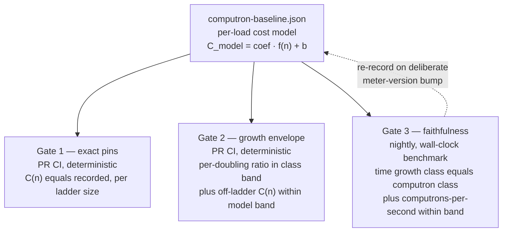

# Ironhorse computron benchmark baselines

| | |
|---|---|
| **Created** | 2026-09-16 |
| **Author** | kriskowal (prompted) |
| **Status** | Proposed |
| **Source** | PR #1282 review comment (2026-09-15) |

## What is the Problem Being Solved?

PR #1282 ("chore(ironhorse): demolish the XS-computron-parity myth") is correct in
its doctrine: **Iron Horse's meter approximates real CPU time, and XS-computron
parity is a non-goal, not a deferred goal.** But in demolishing the *parity myth*
it also removed or relaxed a class of tests that were doing a second, legitimate
job under a parity costume: **they constrained the range of valid computron values
for particular loads.** An XS-delta pin like the `await_in_try.rs` `−20`
async-generator start-reject residue was, mechanically, "this load costs a specific
amount"; when it is relaxed to advisory drift, nothing catches that load silently
tripling in cost or turning quadratic. Own-determinism gates (`--repeat`, the
`golden_computrons.rs` frozen pins) only catch *run-to-run nondeterminism*; they do
not catch a code change that shifts a load's cost, because after the change the new
cost is still perfectly deterministic.

The maintainer's course-correction (verbatim in § Prompt): do **not** eliminate the
range-constraining tests — instead **re-express their constraint as a
benchmark-established baseline.** Measure Iron Horse's *own* computron cost for
representative loads, bound the acceptable range around that measured baseline, and
model built-ins whose time cost is a **polynomial of the magnitude/size of one or
more inputs** so a baseline **scales with input** rather than pinning a single
value. These baselines constrain IH's meter against measured CPU-time load — they
are emphatically **not** XS-equality gates, so the accuracy-over-parity doctrine is
preserved intact.

## Doctrine alignment

This design sits *inside* the accuracy-over-parity doctrine, not against it. The
oracle's computrons never enter any predicate here. The reference a baseline is
measured against is **Iron Horse's own wall-clock CPU time**, and the property being
gated is the meter's founding purpose: *computrons track CPU time.* A metering
defect, per PR #1282's own doctrine note, is "un-charged / over-charged **work** in
IH's own cost model" — a divergence between what a load costs in computrons and what
it costs in CPU time. That is exactly what these baselines detect, using CPU time
(not XS) as the measuring instrument.

## Design

Computrons are **deterministic**: the same binary on the same platform yields
identical computrons. The meter is a 16.16 fixed-point `u64` accumulator, so
`computrons == meter_raw >> 16` (a `1<<16` raw charge is one computron, `1<<14` is a
quarter); the release cost table is pinned by `COST_TABLE_VERSION` (today
`ironhorse-meter-5`) and its SHA-256 digest is append-only in
`ironhorse-meter/releases.rs`. Determinism holds *within a release binary and
platform*, not across platforms (per the engine design's § Metering, the
accuracy-over-parity doctrine of 2026-07-04). That within-binary determinism is the
lever this design exploits: because the *value* is deterministic, the *cost model*
fitted from it is deterministic too, so most of the constraint can be gated cheaply
on ordinary PR CI, and the noisy wall-clock benchmark is reserved for the one job
only it can do — keeping the model honest as a CPU-time proxy. (Because computrons
are not guaranteed identical across platforms, the exact-pin gate runs on the same
debug/release × Linux/macOS lanes `golden_computrons.rs` already runs on, where the
pins are known reproducible.)

### The baseline: a per-load cost model, not a single number

For each representative load `L` with an input-size parameter `n`, the baseline is a
**cost model**

```
C_model(n) = coefficient · f(n) + intercept
```

where `f(n)` is a growth basis drawn from a small closed set — `1` (constant),
`log n`, `n` (linear), `n·log n`, `n²` (quadratic). The `coefficient` and
`intercept` are fit from the **exact, deterministic** computron counts measured at a
ladder of at least four input sizes (doublings). Because the inputs to the fit are
exact integers, the fitted model is itself deterministic and reproducible — it can
be committed and re-derived bit-for-bit on any host.

Each committed baseline record carries: the load id, the growth basis `f(n)`, the
fitted `coefficient`/`intercept`, the exact `computrons` (and `meter_raw`) at each
ladder size, the wall-clock medians that *confirmed* the growth basis, and
provenance (`COST_TABLE_VERSION`, source revision, host, toolchain digest, tolerance
bands). This mirrors the existing `rust/engine/benches/baseline.json` /
`ironhorse-262/baseline/` provenance discipline; the natural home is a sibling
`rust/engine/benches/computron-baseline.json` plus, for the deterministic exact
pins, an input-parameterized extension of the `computrons.tsv` corpus that
`golden_computrons.rs` already consumes.

### The three gates the baseline yields



1. **Exact pins (PR lane, deterministic, cheap).** At each committed ladder size,
   `C(n)` must equal the recorded value. This is `golden_computrons.rs` extended
   from its 52 single-size families to the input-parameterized loads that lost their
   constraint. Catches *any* change to a covered load's cost; a deliberate change
   updates the pin under a `COST_TABLE_VERSION` bump (the existing rule: "never
   regenerate pins in a test").

2. **Growth-envelope gate (PR lane, deterministic, cheap).** Run each parameterized
   load across its size ladder computing *only computrons* (no timing — free and
   deterministic). Assert (a) the per-doubling computron ratio lies in the band for
   the load's declared growth class (e.g. linear ⇒ ratio ∈ ~[1.8, 2.2]; quadratic ⇒
   ~[3.6, 4.4]); (b) `C(n)` for an **off-ladder** size lies within `C_model(n) ± ε`,
   catching a regression that only manifests between or beyond the pinned points.
   Because it needs no wall clock, this half of the old `scaling_bench` contract can
   *graduate from nightly to PR CI* — the deterministic constraint the eliminated
   tests used to provide, restored where it belongs.

3. **Faithfulness gate (nightly lane, wall-clock benchmark).** This is the
   *benchmark-established* part. Measure CPU-time medians across the ladder (warmup +
   repeated samples, host-controlled, exactly as `benches/run.py` and `scaling_bench`
   already do). Assert (a) the measured **time** growth class equals the load's
   declared **computron** growth class — this is what *confirms* the `f(n)` chosen
   for the model, so the polynomial is measured, not assumed; (b) the meter's global
   fidelity ratio (computrons per second) stays within a band across the whole
   roster, so the meter cannot silently drift into over- or under-charging a family
   of loads relative to CPU time. This gate plugs into the existing nightly
   `benchmarks` job in `.github/workflows/ironhorse-full-test262.yml`.

The split is the crux of the design: **the deterministic model (gates 1–2) carries
the range constraint on PR CI, and the noisy benchmark (gate 3) carries only the
narrower "is the model still a faithful CPU-time proxy?" question on the nightly
lane.** This resolves the standing rule that "ordinary PR CI does not run timing
assertions" (bench README) *without* leaving loads unconstrained on the PR lane.

### Modelling polynomial built-ins

The engine's cost table **already prices some built-ins by input size**: `*_PER_ELEMENT`
weights in `ironhorse-meter/lib.rs` (e.g. `APPLY_ARRAY_PER_ELEMENT_METERING`,
`AGGREGATE_ERROR_PER_ELEMENT`), and the `chunk_cost(bytes)` / `string_chunk_cost(units)`
helpers that price allocation and string ops as O(n) in code-unit length while a
single code-unit access stays O(1) (the 2026-07-06 UTF-16 re-basing in § Metering).
Those per-element weights are **hand-derived XS estimates**, never measured. That is
exactly the gap: this design's baselines *validate those input-size scalings against
measured CPU time* and lock their growth class. The whole point of `f(n)` is that a
built-in whose cost is superlinear in input gets a baseline that *scales*, not a
single pinned value. Known surfaces to seed the roster (several already exercised by
`scaling_bench.rs` and siblings):

- **named-property insertion** into a growing object (`o['k'+i]=i`) — currently
  **quadratic**, called out in `scaling_bench.rs` as a known cost; its baseline is
  `f(n)=n²` and the gate *locks that class* so it cannot silently worsen (and, if
  ever fixed, the class change is a deliberate re-record).
- **string indexing / iteration** (`charCodeAt`, `for..of` over a string) — linear;
  `string_receiver_indexing_is_independent_of_receiver_length` already asserts the
  per-call cost is independent of receiver length, a constant-class baseline.
- **`Map`/`Set` bulk insertion** — linear (amortized) baseline; a rehash regression
  would show as a class break.
- **`for..in` traversal** — linear over property count.
- **regexp match** — parameterized by subject length and by pattern shape; the
  `ironhorse-regexp` match-meter, whose XS-equality assert #1282 relaxed to advisory,
  gets an own-cost growth baseline instead.
- **async-generator `await`/`suspend` metering** — the `await_in_try.rs` /
  `suspend_in_try_metering.rs` loads whose XS-delta pins #1282 relaxed; re-expressed
  as own-cost pins (gate 1) at representative shapes.

A load may be parameterized by **more than one** input (the prompt's "one or more
inputs"): the model generalizes to `C_model(n, m) = c·f(n)·g(m) + …`, fit over a
grid; regexp (subject length × pattern size) is the canonical two-input case. The
builder starts with single-input loads and adds grid loads only where a built-in's
cost genuinely depends on two inputs.

### Deliberate recalibration

A genuine, intended change to Iron Horse's cost model (a new cost-table release) is a
reviewed operation, never a silent test edit: bump `COST_TABLE_VERSION`, then
re-record every baseline with a `--write-baseline`-style command (mirroring
`benches/run.py --write-baseline`). The exact pins and the fitted models move
together under that one reviewed diff, and the nightly faithfulness gate re-measures
against the new record. This is the same discipline the frozen pins and
`baseline.json` already follow, extended to the cost models.

## Relationship to PR #1282 (its fate)

**Revise #1282 in place; do not supersede it.** Its doctrine demolition is right and
should stay: deleting `is_bit_exact`/`Summary`/`met_bar`, `computrons_agree`, the
oracle-computron asserts, the `ironhorse-meter-exact` tag emission, and retiring
`F074` ("Make the new coercion tests enforce computron parity") and `F164` ("Make
the slice suite enforce the project's meter-parity contract") *as XS-parity
requirements* are all correct and doctrine-aligned. Nothing in this design brings any
of that back. One reconciliation the builder owns: removing `computrons_agree` also
strands the general metering-claim rule in `designs/ironhorse-known-defects.md`
("Metering claims are decided by `computrons_agree` and the raw meter") — repoint it
at the benchmark baseline plus the raw meter.

What #1282 must **not** do is leave a load's computron range unconstrained. So the
sequencing is:

1. The sibling build job's **first step is an audit**: for every test #1282 removed
   or relaxed from a hard gate to advisory drift, determine whether that load's
   computron range is *still* constrained by a surviving own-cost pin (many are — the
   ~15 interp frozen-cost pins and the `error_messages_calls.rs` `ironhorse_computrons
   == 14` pin were deliberately kept). Produce the list of loads left with **no**
   surviving constraint (candidates: the `await_in_try`/`suspend_in_try` async-gen
   metering shapes and the `ironhorse-regexp` match-meter).
2. Add benchmark baselines (gates 1–3) covering exactly those unconstrained loads,
   plus the seed roster above.
3. Only then are #1282's advisory-only relaxations safe. To avoid a coverage-gap
   window, **land the baseline-regime build PR at or before #1282's relaxations
   merge** — either merge the build PR first, or hold #1282 (which is doctrine-correct
   but not urgent) until the regime lands, then merge together. Recommendation: land
   the regime first as its own PR against `llm`; then #1282 rebases onto it and merges
   with the gap already closed. Add a note to #1282's body pointing at the successor
   design and PR.

Partial-keep is rejected: leaving #1282's relaxations in place *without* the
replacement is precisely the gap the maintainer is course-correcting; a full
supersede is wasteful because #1282's demolition is sound and independently valuable.

## Relationship to existing infrastructure

This design **extends**, it does not duplicate:

- `golden_computrons.rs` + `computrons.tsv` (52 exact single-size families) — gate 1
  is the input-parameterized extension of exactly this corpus and harness.
- `scaling_bench.rs` (time **and** computron growth < 2.5×/doubling, nightly) — its
  *deterministic computron half* becomes gate 2 (PR lane) and its *timing half*
  becomes gate 3 (nightly); the design formalizes its ad-hoc 2.5× rule into declared
  per-class bands and a fitted model. `checkpoint_scaling_bench`,
  `property_lookup_bench`, `lifecycle_bench`, and the compiler growth-policy benches
  are siblings that adopt the same record format.
- `benches/run.py` + `baseline.json` (48-metric time roster, 1.25× floor, nightly,
  provenance-checked) — gate 3 reuses its measurement discipline, provenance digests,
  and the nightly `benchmarks` CI job; `computron-baseline.json` is a sibling record
  with a `--write-baseline`/`--check-baseline` surface of the same shape.
- `ironhorse-meter-opcode-cost-instrumentation` (In Progress) — **complementary, not
  overlapping.** That design already specifies, per opcode and per builtin-step
  family, "the expected computational complexity as a **polynomial in the size** …
  of the operation's operands" (its C1 scaffold lives in `ironhorse-vm/src/cost.rs`;
  its C2–C4 timing/normalization/calibration loop is not started, and current
  weights are still the frozen XS-derived estimates). So the *polynomial-in-input*
  primitive is theirs, at the micro (per-opcode/builtin-step) level; **this design
  applies it as an acceptance gate at the macro (representative-load) level.** The
  opcode instrumentation feeds better weights *in*; these baselines catch when any
  change — a weight recalibration, an interpreter refactor, a built-in rewrite —
  moves an aggregate load's cost off its CPU-time-faithful curve. The two share the
  growth-basis vocabulary and should name the polynomial classes identically.

## Phased execution (builder steps)

The sibling build job `ironhorse-computron-benchmark-baseline-build` executes:

1. **Audit #1282's relaxations** (§ fate, step 1): produce the list of loads left
   with no surviving own-cost constraint. Record it in the build PR body.
2. **Define the baseline record format** — `rust/engine/benches/computron-baseline.json`
   schema (load id, `f(n)` basis, fitted coefficient/intercept, per-size exact
   `computrons`/`meter_raw`, confirming wall-clock medians, tolerance bands,
   `COST_TABLE_VERSION` + provenance) and the growth-class band table.
3. **Build the harness**: a `computron_baseline` test crate/module that (gate 1)
   asserts exact pins at committed ladder sizes, (gate 2) asserts per-doubling class
   bands and off-ladder `C_model(n) ± ε`, both deterministic and PR-runnable; and a
   `--write-baseline` recorder.
4. **Build gate 3** as a nightly benchmark step: wall-clock medians across the
   ladder, time-class == computron-class assertion, and the global computrons/second
   fidelity band; wire it into the `benchmarks` job in
   `ironhorse-full-test262.yml`.
5. **Seed the roster** (§ polynomial built-ins) plus every load from step 1's audit;
   record their baselines with `--write-baseline` on a controlled host and commit.
6. **Wire PR CI**: add gates 1–2 to the ordinary Rust test lane (`ci.yml`),
   deterministic and fast; keep gate 3 nightly.
7. **Rebase #1282** onto the landed regime (or merge order per § fate) so no
   coverage-gap window exists; update #1282's body to reference this work.
8. Run the full nightly benchmark lane locally (release, host-controlled) and record
   the measured medians and growth-class confirmations as evidence.

## Design Decisions

1. **Deterministic model on PR CI, wall clock nightly.** Because computrons are
   deterministic, the cost *model* and its range band are deterministic and belong on
   PR CI (gates 1–2); the benchmark's irreducibly-noisy role (confirming the growth
   class and CPU-time fidelity) stays nightly (gate 3). This honors "no timing
   assertions on PR CI" while restoring a PR-lane range constraint.
2. **The measuring stick is IH's own CPU time, never XS.** No oracle computron enters
   any predicate. Fully doctrine-aligned.
3. **Growth class is confirmed by measurement, not assumed.** Gate 3's time-class ==
   computron-class check is what makes `f(n)` "benchmark-established" rather than a
   guess baked into a fixture.
4. **Baselines are a reviewed artifact tied to a meter version.** Re-recording is a
   deliberate `--write-baseline` operation under a `COST_TABLE_VERSION` bump, never a
   silent per-test edit — same discipline as the frozen pins and `baseline.json`.
5. **Extend, don't replace, the existing bench corpus and provenance.** Reuse
   `golden_computrons.rs`/`computrons.tsv`, `scaling_bench.rs`, and `benches/run.py`
   shapes to keep one metering-baseline mental model.

## Open questions

- What tolerance bands should the gates use? Proposed defaults, to confirm or
  adjust: gate-1 exact (band 0); gate-2 off-ladder model band ε = ±3%, per-doubling
  class bands ≈ [1.8, 2.2] linear / [3.6, 4.4] quadratic / [1.0, 1.15] constant;
  gate-3 fidelity band (computrons/second) ±25% across the roster (the same order as
  the existing 1.25× time floor). Are these the right widths?
- Should the deterministic growth-envelope gate (gate 2) run on **PR CI** as
  proposed, or stay on the nightly lane with gate 3? (Recommendation: PR CI — it is
  deterministic and cheap, and PR-lane coverage is the whole point of restoring the
  constraint.)
- What is the authoritative **seed roster** of loads/built-ins to baseline first?
  Proposed: the § polynomial-built-ins list plus every load surfaced by the #1282
  audit. Any built-ins to add or drop?
- Should a `COST_TABLE_VERSION` bump **auto-regenerate** all baselines, or always
  require a manual reviewed `--write-baseline`? (Recommendation: manual, for
  reviewability.)
- Confirm the fate of PR #1282: **revise in place, land the regime first, merge
  together to avoid a gap window** (this design's recommendation) versus superseding
  #1282 with a fresh combined PR.
- Two-input (grid) baselines: land in this build, or defer regexp's
  subject-length × pattern-size grid to a follow-up once single-input loads are
  proven? (Recommendation: defer the grid; ship single-input first.)

## Prompt

> Instead of eliminating tests that constrain the range of valid computron values
> on Ironhorse, let's instead use benchmarks to establish a baseline for particular
> loads, taking into account that some built-in functions will have a time cost that
> is a polynomial of the magnitude or size of one or more inputs. Please make a plan
> and execute that plan.
>
> — kriskowal, endojs/endo-but-for-bots PR #1282 review comment, 2026-09-15
