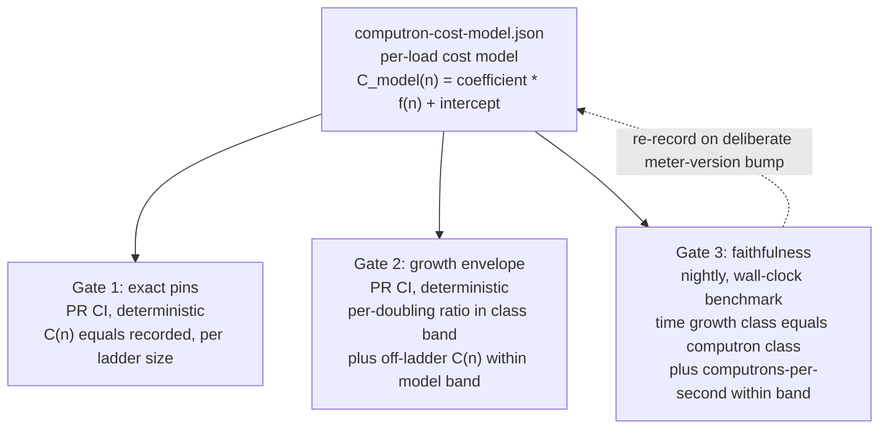

# Ironhorse computron benchmark baselines

| | |
|---|---|
| **Created** | 2026-09-16 |
| **Updated** | 2026-09-16 |
| **Author** | Kris Kowal (prompted) |
| **Status** | Proposed |
| **Source** | PR #1282 review comment (2026-09-15) |

## What is the Problem Being Solved?

A *computron* is Ironhorse's deterministic unit of metered execution cost, derived
from its fixed-point meter (`computrons == meter_raw >> 16`; the full definition is
in § Design). Ironhorse (IH) is the Rust engine that supersedes XS; its meter is
meant to approximate real CPU time.

PR #1282 ("chore(ironhorse): demolish the XS-computron-parity myth") is correct in
its doctrine: Ironhorse's meter approximates real CPU time, and XS-computron parity
is a non-goal, not a deferred goal. But in demolishing the *parity myth* it also
removed or relaxed a class of tests that were doing a second, legitimate job under a
parity costume: they constrained the range of valid computron values for particular
loads. Consider the `await_in_try.rs` `-20` async-generator start-reject *pin* (a
pin is a frozen, committed test-assertion value; the mechanism is defined in
full in § Design, "each pin is an `assert_eq!(outcome.computrons, pinned_value)`
against a committed number").
That pin recorded that a specific load (starting and then rejecting an async
generator inside a `try`) metered exactly 20 computrons *below* the oracle, a `-20`
delta (the oracle is the XS reference engine used as the old parity target; see
§ Doctrine alignment). Read as a *parity* assertion ("IH must match XS here"), it deserved
demolition. But, read mechanically, it also said "this load costs a specific
amount," and when it is relaxed to advisory drift, nothing catches that same load
silently tripling in cost or turning quadratic.

Own-determinism gates (the existing checks that a load meters *identically across
repeated runs*, chiefly the test harness's `--repeat` flag, which re-executes a
load N times and fails on any cross-run computron difference) only *partly* cover
that gap, and it is worth being precise about which part. `--repeat` catches only
run-to-run nondeterminism.
`golden_computrons.rs`'s frozen pins *do* catch a code change that shifts a covered
load's absolute cost (each pin is an `assert_eq!(outcome.computrons, pinned_value)`
against a committed number, not merely a cross-repeat equality). The real, narrower
gap is twofold: (a) the pins #1282 relaxed were *oracle-relative deltas* (for example `ironhorse_computrons - oracle_computrons == -20`), which pin nothing about IH's own
absolute cost even today; and (b) `golden_computrons.rs`'s 52 families are each
*single-size*, so even a surviving own-cost pin cannot catch a *scaling* regression
(a load going quadratic between or beyond its one pinned point). This design closes
exactly that gap: an own-cost constraint that also *scales with input size* for the
loads whose only prior constraint was an oracle-relative delta or a single-size pin.

The maintainer's course-correction (verbatim in § Prompt): do **not** eliminate the
range-constraining tests. Instead, **re-express their constraint as a
benchmark-established baseline.** Measure Ironhorse's *own* computron cost for
representative loads, bound the acceptable range around that measured baseline, and
model built-ins whose time cost is a **polynomial of the magnitude/size of one or
more inputs** so a baseline **scales with input** rather than pinning a single
value. These baselines constrain IH's meter against measured CPU-time load. They are
emphatically **not** XS-equality gates, so the accuracy-over-parity doctrine is
preserved intact.

## Doctrine alignment

This design sits *inside* the accuracy-over-parity doctrine, not against it. The
oracle (the XS reference engine used as the old parity target) and its computrons
never enter any predicate here. The reference a baseline is measured against is
**Ironhorse's own wall-clock CPU time**, and the property being gated is the meter's
founding purpose: *computrons track CPU time.* A metering defect, per PR #1282's own
doctrine note, is "un-charged / over-charged **work** in IH's own cost model": a
divergence between what a load costs in computrons and what it costs in CPU time.
That is exactly what these baselines detect, using CPU time (not XS) as the
measuring instrument.

## Design

Computrons are **deterministic**: the same binary on the same platform yields
identical computrons. The meter is a 16.16 fixed-point `u64` accumulator, so
`computrons == meter_raw >> 16` (a `1<<16` raw charge is one computron, `1<<14` is a
quarter); the release cost table is pinned by `COST_TABLE_VERSION` (today
`ironhorse-meter-5`) and its SHA-256 digest is append-only in
`ironhorse-meter/releases.rs`. Determinism holds *within a release binary and
platform*, not across platforms (per [ironhorse-engine](ironhorse-engine.md)
§ Metering, the accuracy-over-parity doctrine of 2026-07-04). That within-binary determinism is the
lever this design exploits: because the *value* is deterministic, the *cost model*
fitted from it is deterministic too (when the fit is done in exact arithmetic, not
`f64` regression, per § The baseline), so most of the constraint can be gated cheaply
on ordinary PR CI, and the noisy wall-clock benchmark is reserved for the one job
only it can do: keeping the model honest as a CPU-time proxy. (Because computrons
are not guaranteed identical across platforms, the exact-pin gate runs on the same
debug/release, Linux/macOS lanes that `golden_computrons.rs` already runs on, where
the pins are known to be reproducible.)

### The baseline: a per-load cost model, not a single number

Two quantities recur throughout and are deliberately distinct: `C(n)` is the
**exact, measured** computron count obtained by *actually running* load `L` at input
size `n` (deterministic per § Design, but known only by execution; it is what gates 1
and 2 compute at gate time), while `C_model(n) = coefficient * f(n) + intercept` is
the **fitted prediction**: the committed cost model, evaluable without running the
load.

For each representative load `L` with an input-size parameter `n`, the baseline is a
**cost model**

```
C_model(n) = coefficient * f(n) + intercept
```

where `f(n)` is a growth basis drawn from a small closed set: `1` (constant),
`log n`, `n` (linear), `n*log n`, `n^2` (quadratic). The `coefficient` and
`intercept` are fit from the **exact, deterministic** computron counts measured at a
ladder of at least four input sizes (doublings **starting from a power of two**,
`n = 2^k`, so `log2(n) = k` is exact-integer at every rung; a ladder that does *not*
start at a power of two — such as `scaling_bench.rs`'s inherited `1000`/`2000`
decimal rungs — makes `log2(n)` irrational and is re-based onto powers of two before a
load enters this record, precisely so the `log n` / `n*log n` bases never drop onto
platform `f64`). The fit **must use exact
rational/integer arithmetic, not floating-point regression.** Exact-integer inputs
alone do not make an `f64` least-squares fit reproducible across hosts: summation
order, FMA contraction, and libm differences vary by platform and toolchain, so an
`f64` regression would silently forfeit the very determinism this design leans on.
The exact-rational fit holds even for the two size-dependent bases (`log n`,
`n*log n`), which would otherwise involve an irrational `log`: because the ladder is
**doublings** (`n = 2^k`) and the basis logarithm is **base 2**, `f(n)` is
integer-valued at every ladder point (`log2(2^k) = k`, and `n*log2(n) = 2^k * k`), so
the fit inputs stay exact integers for all five bases, not only the polynomial ones.
With a closed basis of five simple forms fit to at most a handful of exact-integer
ladder points, the normal-equation solution is a ratio of small integer sums and is
representable exactly as a rational; the record commits the reduced rational (or its
exact-integer numerator/denominator pair). Only then is the fitted model itself
deterministic and re-derivable bit-for-bit on any host.

The `1` (constant) basis is the one case the normal-equation solution does **not**
cover, and the record fixes it by definition rather than deriving it. The
two-parameter model `coefficient * 1 + intercept` is rank-deficient for that basis:
both design-matrix columns are all-ones, so `det(XᵀX) = 0` and the least-squares
solution is undefined. For basis `1`, therefore, `coefficient` is fixed at `0` and
`intercept` is the common measured computron value every ladder rung shares (a load
whose value is *not* constant across the ladder is, by definition, not basis `1` and
must declare a size-dependent basis). Gate 1's exact pins independently guarantee that
common value, so the constant record stays fully re-derivable despite the degenerate
fit. The worked `charcodeat_indexing` example below is exactly this case
(`coefficient: "0"`, `intercept: "14"`).

**Number encoding in the record.** Every exact **rational** gate input — the
`coefficient`, `intercept`, the four tolerance knobs, and `divergence_time_ratio` — is
written as a rational string `"num/den"` (an integer as `"14"` or `"4/1"`, never a bare
JSON number and never a float like `4.0`), so the whole gate-input region reads under
the one exact-rational rule this design leans on. The exact **integer counts** (`n`,
`computrons`, `meter_raw`, and the ladder cap `pr_max_ladder_n`) stay JSON integers,
which are already exact and carry no denominator; these are the only bare JSON numbers
that are gate inputs. Floats appear **only** inside `provenance` (descriptive
wall-clock medians), never as a gate input. The gate-1/gate-2 harness additionally
**re-derives the fit from the committed ladder and asserts it equals the recorded
`coefficient`/`intercept`**, so a hand-edited coefficient cannot silently move every
gate-2 center.

### The three gates the baseline yields



1. **Exact pins (PR lane, deterministic, cheap).** At each committed ladder size,
   the measured `C(n)` must equal the recorded exact value. This is a new
   input-parameterized harness in the spirit of `golden_computrons.rs`, reading the
   per-size pins from `computron-cost-model.json` for the loads that lost their
   constraint (it does not modify the 52 single-size families in `computrons.tsv`).
   Catches *any* change to a covered load's cost; a deliberate change updates the pin
   under a
   `COST_TABLE_VERSION` bump (the existing rule: "never regenerate pins in a test").

2. **Growth-envelope gate (PR lane, deterministic, cheap).** Run each parameterized
   load across its size ladder computing *only computrons* (no timing: free and
   deterministic). Assert (a) the per-doubling computron ratio lies in the band for
   the load's declared growth class (see the class-band table below); (b) the
   measured `C(n)` for an **off-ladder** size lies within
   `C_model(n) +/- gate2_off_ladder_radius` (the fitted prediction plus this load's
   `+/-` radius), catching a regression that only manifests beyond the pinned points.
   The off-ladder probe **must itself be a power of two beyond the PR-lane ladder** (a
   further doubling anchored at `2 * pr_max_ladder_n`, one doubling past the top *PR-lane*
   rung, itself a power of two — never `2^(k+1)` past the *full recorded* top pin, which
   would execute a size the PR-lane cap exists to exclude), never a between-points size:
   for the `log n` /
   `n*log n` bases `C_model(n)` is exact-integer only where `log2(n)` is (at powers of
   two, `log2(2^k) = k`), so a non-power-of-two probe would force an irrational
   `log2(n)`, drop the evaluation onto platform `f64`/libm, and reintroduce the
   toolchain divergence the exact fit forbids, on the very Linux/macOS lanes gate 1
   relies on. Restricting the probe to a further doubling keeps `C_model(n)`
   bit-reproducible across hosts while still exercising a size outside the fitted
   ladder. `gate2_off_ladder_radius` is **not a free constant**:
   it is derived from the fit residual and recorded in the record. Because the fit is
   exact and the on-ladder points are pinned exactly by
   gate 1, `C_model(n)` reproduces each on-ladder `C(n)` with a known per-point
   residual; the radius is that maximum on-ladder residual scaled by a small fixed
   safety margin (the builder records both the raw max residual and the chosen margin
   so the value is reviewable, not arbitrary). A zero residual (an exactly fitting
   basis) yields a small floor radius, not zero, to absorb the off-ladder point's
   own rounding to an integer computron count. Because gate 2
   needs no wall clock, this half of the old `scaling_bench` contract can *graduate
   from nightly to PR CI*: the deterministic constraint the eliminated tests used to
   provide, restored where it belongs.

   Gate 2 **honors `validated_lanes` exactly as gate 1 does**, and that is what keeps
   its two sub-checks from being redundant. On a lane *in* `validated_lanes`, gate 1
   already pins every on-ladder `C(n)` exactly, so 2(a)'s per-doubling ratio is fixed at
   record time and cannot fail there unless gate 1 already has — on such a lane 2(a) is a
   redundant restatement and only **2(b)'s off-ladder probe** (a size gate 1 does *not*
   pin) adds constraint. On a lane *absent* from `validated_lanes` gate 1 stands down (the
   pin is not asserted reproducible there), and 2(a) becomes the live growth-class check
   no other gate supplies. So neither sub-check is dead weight across the lane set: 2(a)
   carries the lanes gate 1 cannot, and 2(b) carries the off-ladder size gate 1 does not
   reach.

3. **Faithfulness gate (nightly lane, wall-clock benchmark).** This is the
   *benchmark-established* part. Measure CPU-time medians across the ladder (warmup
   plus repeated samples, host-controlled, exactly as `benches/run.py` and
   `scaling_bench` already do). Assert (a) the measured **time** growth class equals
   the load's declared **computron** growth class. The growth basis `f(n)` is
   *established by measurement at record time*: `--write-baseline` fits it against the
   full measured time-and-computron ladder, which spans enough doublings (at least
   four) to separate the closed basis set, since a `log n` load and a linear load have
   visibly different measured per-doubling curves across four-plus rungs. Gate 3's
   *nightly* class check is the looser single-sided guard described below (§ Gate 3
   uses a looser, single-sided band): it catches a gross *worsening* of the class (a
   linear load whose measured time starts growing quadratically) but is deliberately
   **not** the origin of the `f(n)` claim, which is already fixed and re-derivable in
   the committed record. So "benchmark-established" names the record-time measurement,
   and gate 3 nightly is its non-regression sentinel, not a per-run re-derivation of
   the exact class. Assert
   (b) **each load's** fidelity ratio stays within *that load's* recorded
   `gate3_fidelity_radius`. Computrons-per-second has seconds in the denominator, so a
   *committed* absolute rate compared against a nightly measurement would be exactly the
   absolute cross-machine time comparison that the F4 exception (a documented,
   still-live meter defect; § F4 exception below) and `benches/README.md` forbid
   (a runner merely slower than the recording host would red-fail every load). The
   fidelity check is therefore made **host-independent by the same-host remeasure
   discipline that gate 3's F4 non-regression bound (part (ii)) already uses**: it remeasures the
   baseline revision (the record's `provenance.commit`, checked out and rebuilt exactly
   as `divergence_baseline_commit` is for the F4 bound) on the current nightly host, in
   the same run, and asserts the candidate's computrons-per-second against that *fresh
   same-host* reference. Because the computrons are constant (gate-1 pinned identical on
   both revisions), that assertion reduces to a **dimensionless ratio** of two same-host
   wall-clock medians, never a committed absolute rate. The meter therefore cannot
   silently drift into over- or under-charging that load relative to CPU time, and the
   check establishes that **without any cross-machine absolute comparison**. This is a **per-load**
   check (one assertion per load against its own band, matching the per-record
   `gate3_fidelity_radius` field), deliberately **not** a single roster-wide aggregate
   ratio, which would let one load's over-charge cancel another's under-charge and pass
   while a real per-load drift hides inside the average. This gate plugs into the
   existing nightly `benchmarks` job in `.github/workflows/ironhorse-full-test262.yml`.

The split is the crux of the design: **the deterministic model (gates 1-2) carries
the range constraint on PR CI, and the noisy benchmark (gate 3) carries only the
narrower "is the model still a faithful CPU-time proxy?" question on the nightly
lane.** This resolves the standing rule that "ordinary PR CI does not run timing
assertions" (bench README) *without* leaving loads unconstrained on the PR lane.

#### Gate 3 uses a looser, single-sided band than gate 2

Gates 1-2 assert on **deterministic computrons** with no wall clock, so their bands
are legitimately tight (the class-band table below). Gate 3 asserts on **measured
wall-clock time** on a shared GitHub-hosted `ubuntu-latest` runner, where timing is
noisy. Gate 3 therefore must **not** reuse gate 2's tight two-sided per-doubling
bands. It follows the existing wall-clock precedent it extends
(`scaling_bench.rs`'s "less than 2.5x per input doubling," a single-sided upper
bound with no tight lower band, chosen precisely for CI timing noise). Concretely,
gate 3's growth-class check is a **single-sided upper bound per class** (for example a
linear load's measured per-doubling time ratio must stay below a class ceiling well
above 2.0, not inside `[1.8, 2.2]`), and the computrons/second fidelity check is a
wide `+/-` band (see the class-band table). The design states this divergence
explicitly so a builder does not reuse the computron bands for wall-clock time and
produce a flaky nightly gate.

#### The class-band table and a shared failure-message contract

Gate 2 checks the per-doubling computron ratio against one expected center per ladder
step. **The center is always the ratio of the committed fitted model itself,
`C_model(2n)/C_model(n)`**, evaluated in exact rational arithmetic at each ladder
step's `n`. The design already commits an exact fitted model (`coefficient`,
`intercept`) for every load, and that single model already answers "what should the
per-doubling ratio be here?" unconditionally: it is intercept-aware, reproducible
bit-for-bit (§ The baseline), and defined at every `n`. There is deliberately **no
second, closed-form definition** of the center and no per-load "which derivation"
selector: the center is derived from the one committed model, full stop. A per-doubling
ratio that is itself a function of `n` (as for the size-dependent classes) is therefore
bounded correctly at every ladder step, because the center tracks `n` through the model
rather than a single static row (a `log n` load's ratio is `1.5` at `n=4` but `~1.03`
near `2^30`; a single fixed row would false-fail a correct implementation at one ladder
extreme or the other).

The closed-form asymptotic ratios below are **exposition only** (the value
`C_model(2n)/C_model(n)` converges to once the fixed overhead (`intercept`) is
negligible relative to the size-dependent term), not a second computation path. They
let a reader sanity-check the class at a glance; the gate never evaluates them.

| growth class `f(n)` | asymptotic per-doubling ratio (exposition; the gate uses `C_model(2n)/C_model(n)`) |
|---|---|
| `1` (constant) | `-> 1.00` |
| `log n` | `-> 1 + 1/log2(n)` (for example `1.50` at `n=4`, `~1.10` at `n=1k`) |
| `n` (linear) | `-> 2.00` |
| `n*log n` | `-> 2*(1 + 1/log2(n))` |
| `n^2` (quadratic) | `-> 4.00` |

About that per-step center the gate applies the two-sided `+/- gate2_class_band_radius`
recorded in the baseline record (for example a linear load's mid-ladder band works out near
`[1.80, 2.20]` about a `2.00` center; a constant load near `[0.925, 1.075]` about a
`1.00` center (symmetric, matching the worked example's `gate2_class_band_radius` of
`3/40`); a quadratic load near `[3.60, 4.40]` about a `4.00` center). The builder confirms the exact `gate2_class_band_radius`
against the measured ladders and records it; the illustrative ranges here are mid-ladder
defaults, not frozen edges. Because the center comes from the intercept-aware model, the
ladder need not start large enough to make the intercept negligible for gate-2(a) to be
correct (the earlier closed-form-only precondition is gone); the model is exact at every
`n`. Gate 3's single-sided time ceilings are derived per class from these same per-step
model centers (upper edge, loosened for timing noise per the section above).

All three gates emit failures in **one shared shape** so a red CI line is
diagnosable without learning three idioms, matching the existing `scaling_bench.rs`
convention (`SCALING_RATIO {name} n={n} ...` then a uniform
`{name} n={n}: ...x; must be <2.5x` pushed onto `failures` and asserted once). Every
gate's failure message carries, in this order: the **`label`**, the **size** `n`,
the **metric** (exact computrons / ratio / wall-clock median), the **observed**
value, and the **expected pin or band** with its threshold. The builder factors one
failure-formatting helper shared by all three gate harnesses.

### Where the baseline lives: one JSON record, not two artifacts

Each committed baseline record carries two kinds of field, and the schema **keeps the
two kinds in separate structural regions** (a top-level object of gate inputs and a
nested `provenance` sub-object), so a future editor can tell (without reading this
whole design) which fields a gate reads as truth versus which are frozen evidence that
may go stale. The boundary is drawn precisely on **comparison, not access**: a
`provenance` field is *never a comparison target* — no gate ever asserts a measured
value against one — but a gate may still *read* one as a pointer that tells it what to
do. Gate 3(b), for instance, reads `provenance.commit` to learn *which revision to
check out and remeasure same-host*; that is a pointer, not a frozen value the gate
compares against, so it does not breach the rule. Gate inputs, by contrast, are exactly
the values a gate asserts *against*. (A reader who wants the revision pointer promoted
out of `provenance` entirely can note it is the same pattern the gate-input
`divergence_baseline_commit` already follows; keeping the fidelity remeasure's commit in
`provenance` is deliberate, since it is the *record's own* provenance commit reused as a
pointer, not a second independent input.) The gate names and "class band" used here are defined **above** in
§ The three gates the baseline yields and § class-band table, so every tolerance-field
name below arrives after the gate whose behavior it tunes.

- **Gate-input (authoritative, read by a gate at gate time):** the `label` (the
  load's key), the growth basis `f(n)`, the fitted `coefficient`/`intercept`, the exact
  `computrons` (and `meter_raw`) at each ladder size, `COST_TABLE_VERSION`, the
  `validated_lanes` on which those exact pins were confirmed reproducible (see below),
  the boolean `known_divergent`, and **four distinct tolerance knobs, each a separately
  named field rather than one lumped "tolerance bands" blob.** Three of the four are a
  **radius** (a one-sided `+/-` half-width applied about a center or prediction, so a
  band `[center - radius, center + radius]` has *total span* `2 * radius`), and their
  names say so; the fourth (`gate3_time_ceiling`) is a genuine single-sided ceiling with
  no lower edge. The four: `gate2_class_band_radius` (the per-doubling computron band's
  `+/-` radius about the class center), `gate2_off_ladder_radius` (the `+/-` radius about
  the off-ladder `C_model(n)` prediction), `gate3_time_ceiling` (the single-sided
  wall-clock per-doubling upper bound), and `gate3_fidelity_radius` (the `+/-` radius
  about the **dimensionless computrons-per-second ratio** of the candidate against the
  baseline revision remeasured **same-host in the same nightly run**, never a committed
  absolute rate; the fidelity check is per-load, not a roster-wide aggregate, see gate
  3(b)). For a `known_divergent` load the record additionally
  carries `divergence_time_ratio` (the recorded already-bad per-doubling wall-clock time
  ratio), read by gate 3's ratio bound. These two wall-clock-derived gate inputs
  (`divergence_time_ratio` and the `gate3_fidelity_radius` band) are the **only** ones
  fed from timing rather than provenance, a deliberate exception to the
  "wall-clock is provenance" rule below, and both are admitted for the same reason: each
  bounds a *dimensionless ratio* (a per-doubling ratio, or a computrons-per-second ratio
  against a same-host remeasure) that is host-independent (comparable across machines),
  whereas an absolute median is not and is **never** a gate input
  (§ F4 exception, and `benches/README.md`: "Absolute timings from different machines
  are not comparable"). A `known_divergent` load also carries **`divergence_baseline_commit`**,
  a concrete **git revision** (a full commit SHA) that gate 3's constant-factor bound
  checks out and rebuilds to remeasure the recorded baseline *same-host, same run*. This
  is a distinct field from the provenance-only `divergence_ref` (below): `divergence_ref`
  is a human-readable pointer to the *tracking* record (the F4 issue/finding), never
  checked out, whereas `divergence_baseline_commit` is the machine-checkoutable revision
  the remeasurement rebuilds, mirroring the git SHA `benches/run.py --check-baseline`
  reads from `baseline["provenance"]["commit"]` and `git archive`s. Keeping them separate
  is deliberate: one names *why* the divergence is tracked, the other names *what* to
  rebuild; conflating them (as an earlier draft did, treating `divergence_ref` as both)
  left the remeasurement with no field to check out. Gates 1-3 assert against these.
- **Provenance (descriptive-only, never a gate comparison target), in a segregated
  `provenance` sub-object:** the wall-clock medians that *confirm* the growth basis at
  `--write-baseline` time; for a `known_divergent` load, `divergence_time_medians` (the
  recorded already-bad absolute per-ladder-size wall-clock medians, an audit reference
  only; gate 3's absolute-median bound remeasures the baseline revision same-host
  rather than comparing against these committed medians, § F4 exception); the source,
  host, and toolchain digest; the `commit` (the git revision the baseline was recorded
  at, mirroring `baseline.json`'s `provenance.commit`, which gate 3(b)'s fidelity
  remeasure checks out and rebuilds same-host); and `divergence_ref`. Gate 3 re-measures wall-clock time
  fresh on every nightly run and never compares against a committed median, so those
  medians are audit trail, not an assertion input. The nested sub-object is chosen
  deliberately over a per-field `"provenance": true` annotation: a structural boundary
  is one thing to remember, and a field added without it is a gate input by the same
  visible rule as its siblings, whereas a *forgotten per-field tag* would silently make
  a frozen median a comparison target, exactly the accident the tagging exists to
  prevent.

A worked example makes the gate-input / `provenance` boundary concrete: one ordinary
load and one `known_divergent` load (medians and pins illustrative, not measured).

```json
{
  "charcodeat_indexing": {
    "basis": "1",
    "coefficient": "0", "intercept": "14",
    "ladder": [
      { "n": 1024, "computrons": 14, "meter_raw": 917504 },
      { "n": 2048, "computrons": 14, "meter_raw": 917504 },
      { "n": 4096, "computrons": 14, "meter_raw": 917504 },
      { "n": 8192, "computrons": 14, "meter_raw": 917504 }
    ],
    "COST_TABLE_VERSION": "ironhorse-meter-5",
    "validated_lanes": ["linux-debug", "linux-release", "macos-debug", "macos-release"],
    "pr_max_ladder_n": 8192,
    "known_divergent": false,
    "gate2_class_band_radius": "3/40",
    "gate2_off_ladder_radius": "2",
    "gate3_time_ceiling": "5/2",
    "gate3_fidelity_radius": "1/4",
    "provenance": {
      "commit": "0000000000000000000000000000000000000000",
      "time_medians_ns": { "1024": 640, "2048": 645, "4096": 648, "8192": 651 },
      "source": "benches/computron_baseline.rs",
      "host": "linux-x86_64",
      "toolchain_digest": "sha256:1a2bcd00"
    }
  },
  "map_set_bulk_insertion": {
    "basis": "n",
    "coefficient": "5/2", "intercept": "12",
    "ladder": [
      { "n": 1024, "computrons": 2572, "meter_raw": 168558592 },
      { "n": 2048, "computrons": 5132, "meter_raw": 336330752 },
      { "n": 4096, "computrons": 10252, "meter_raw": 671875072 },
      { "n": 8192, "computrons": 20492, "meter_raw": 1342963712 },
      { "n": 16384, "computrons": 40972, "meter_raw": 2685140992 },
      { "n": 32768, "computrons": 81932, "meter_raw": 5369495552 }
    ],
    "COST_TABLE_VERSION": "ironhorse-meter-5",
    "validated_lanes": ["linux-debug", "linux-release", "macos-debug", "macos-release"],
    "pr_max_ladder_n": 8192,
    "known_divergent": true,
    "gate2_class_band_radius": "1/10",
    "gate2_off_ladder_radius": "8",
    "gate3_time_ceiling": "5/2",
    "gate3_fidelity_radius": "1/4",
    "divergence_time_ratio": "4",
    "divergence_baseline_commit": "2222222222222222222222222222222222222222",
    "provenance": {
      "commit": "1111111111111111111111111111111111111111",
      "time_medians_ns": {
        "1024": 2300000, "2048": 8900000, "4096": 35000000,
        "8192": 140000000, "16384": 560000000, "32768": 2240000000
      },
      "divergence_time_medians_ns": {
        "1024": 2300000, "2048": 8900000, "4096": 35000000,
        "8192": 140000000, "16384": 560000000, "32768": 2240000000
      },
      "divergence_ref": "rust/engine/architecture-review/2026-09-06 F4 (issue link)",
      "source": "benches/computron_baseline.rs",
      "host": "linux-x86_64",
      "toolchain_digest": "sha256:1a2bcd00"
    }
  }
}
```

Every field outside `provenance` is a gate input; everything inside it is frozen
evidence no gate compares against.

The `label` key reuses `golden_computrons.rs`'s existing field name rather than coining
a third term. `scaling_bench.rs` calls the same concept `name` and the frozen-pin
corpus calls it `label`, so this record standardizes on `label`.

`validated_lanes` records the eligibility constraint the exact-pin gate needs.
Computrons are deterministic within a release binary and platform but **not** across
platforms (§ Design), so a pin is a valid gate-1 input only on the lanes where its
reproducibility was actually confirmed at `--write-baseline` time. Rather than braid a
three-dimensional value (load x platform x build-config) into a one-dimensional `label`
identity, the record lists the lanes on which the pin was validated; gate 1 asserts the
pin only on a listed lane and treats an unlisted lane as out of scope, not a failure. A
load is eligible for gate 1 only once its cross-lane reproducibility is confirmed and
recorded here. The existing 52 families are already known reproducible on the
debug/release, Linux/macOS lanes `golden_computrons.rs` runs on; a genuinely
platform-sensitive new load records only the lanes it was proven on.

This mirrors the existing `rust/engine/benches/baseline.json` /
`ironhorse-262/baseline/` provenance discipline, made explicit rather than inherited
implicitly.

**The record is a single artifact: a new `rust/engine/benches/computron-cost-model.json`,
and only that.** The name deliberately differs from the sibling
`benches/baseline.json` (time-based) by *content* ("cost-model," not another
"...baseline.json"), so a contributor grepping or tab-completing `baseline.json` in
that directory does not grab the wrong artifact. An earlier draft floated *also*
extending the `computrons.tsv` corpus that `golden_computrons.rs` consumes, so that
the exact per-size pins would live in the TSV. This design rejects that split.
Keeping the deterministic exact pins and the (host-tied) confirming wall-clock
medians in one JSON keyed by `label` (with the gate/provenance separation above so the
two never blur) is simpler than a schema change to the consumed TSV format, and gate
1 reads the pins directly from the JSON. `golden_computrons.rs`'s single-size TSV
corpus is left untouched; gate 1 is a *new* input-parameterized harness that reads
`computron-cost-model.json`, not an edit to the TSV schema (§ Relationship to
existing infrastructure restates this).

### Modeling polynomial built-ins

The engine's cost table **already prices some built-ins by input size**: `*_PER_ELEMENT`
weights in `ironhorse-meter/lib.rs` (for example `APPLY_ARRAY_PER_ELEMENT_METERING`,
`AGGREGATE_ERROR_PER_ELEMENT`), and the `chunk_cost(bytes)` / `string_chunk_cost(units)`
helpers that price allocation and string ops as O(n) in code-unit length while a
single code-unit access stays O(1) (the 2026-07-06 UTF-16 re-basing in § Metering).
Those per-element weights are **hand-derived XS estimates**, never measured. That is
exactly the gap: this design's baselines *validate those input-size scalings against
measured CPU time* and lock their growth class. The whole point of `f(n)` is that a
built-in whose cost is superlinear in input gets a baseline that *scales*, not a
single pinned value. Known surfaces to seed the roster (several already exercised by
`scaling_bench.rs` and siblings):

- **named-property insertion** into a growing object (`o['k'+i]=i`): its *wall-clock
  time* is currently **quadratic** but its *metered computrons are linear*: this is an
  F4 known-divergent case (F4 is a documented, still-live meter defect explained in
  § F4 exception below), not a faithfully metered `n^2` load. Insertion into a growing
  object carries an un-metered per-insert cost that scales with the object's current
  size (`scaling_bench.rs` independently confirms it: the construction phase's
  "named-property insertion currently has its own quadratic cost"), so the hidden O(n)
  work per insert makes total time O(n^2) while the meter charges O(1) per insert
  (linear total computrons). The un-metered mechanism here is the object's **own**
  property-insertion path, **not** the Map/Set `collection_find` scan cited for the
  `map_set` load (the "`Map`/`Set` bulk insertion" bullet below): `collection_find` is
  called only from Map/Set/WeakMap/WeakSet native
  methods (`collection.rs`), never plain-object bracket assignment. The F4 review
  observes this divergence through the `for..in` load, whose construction phase *is* this
  insertion, recording `computrons linear` at n=2000..16000 while wall time grows
  quadratically (22.8 to 1274.4ms), though it does not itself pin the exact insertion
  call site. Because gates 1-2 assert on the deterministic **computron**
  value, the computron baseline for the `for..in` load that carries this insertion is
  therefore `f(n)=n` (the linear class gates 1-2 lock, so a computron regression is
  still caught), and that `for..in` load is seeded `known_divergent` so gate 3 applies
  its two-part non-regression time bound rather than a class-match that would go red on
  day one (§ F4 exception). Named-property insertion is thus the *divergence mechanism*
  the `for..in` seed load already covers, **not a fourth `known_divergent` roster
  entry**. Declaring `f(n)=n^2` here
  would misdeclare the *computron* growth the deterministic gates measure (the measured
  per-doubling computron ratio is ~2, not ~4) and red-fail gate 2 on the first run.
  When the F4 meter defect is fixed so the scan cost is charged, the computrons become
  quadratic and match the time; that is a deliberate re-record that clears
  `known_divergent` and re-classes the load to `f(n)=n^2` (§ Deliberate recalibration).
- **string indexing / iteration** (`charCodeAt`, `for..of` over a string), linear;
  `string_receiver_indexing_is_independent_of_receiver_length` already asserts the
  per-call cost is independent of receiver length, a constant-class baseline.
- **`Map`/`Set` bulk insertion**, linear (amortized) baseline; a rehash regression
  would show as a class break.
- **`for..in` traversal**, linear over property count.
- **regexp match**, parameterized by subject length and by pattern shape; the
  `ironhorse-regexp` match-meter, whose XS-equality assert #1282 relaxed to advisory,
  gets an own-cost growth baseline instead.
- **async-generator `await`/`suspend` metering**, the `await_in_try.rs` /
  `suspend_in_try_metering.rs` loads whose XS-delta pins #1282 relaxed, re-expressed
  as own-cost pins (gate 1) at representative shapes.
- **`Function.prototype.apply` with a growing argument array**
  (`f.apply(null, arr)` over arrays of length `n`), the `APPLY_ARRAY_PER_ELEMENT_METERING`
  weight's own load, linear in element count. This is one of the two `*_PER_ELEMENT`
  weights the intro names as *hand-derived XS estimates never measured*; it gets a
  linear (`f(n)=n`) own-cost baseline (gates 1-2) whose growth class gate 3 confirms
  against measured CPU time, closing exactly the "estimated, not measured" gap for that
  weight.
- **`AggregateError` construction over a growing errors iterable**
  (`new AggregateError(errs)` over `n` errors), the `AGGREGATE_ERROR_PER_ELEMENT`
  weight's own load, linear in error count. The second of the two named per-element
  weights, baselined the same way (`f(n)=n`, gate-3-confirmed) so the design baselines
  the very examples its opening paragraph leads with, not only the easy paths already
  exercised by `scaling_bench.rs`.

A load may be parameterized by **more than one** input (the prompt's "one or more
inputs"): the model generalizes to `C_model(n, m) = c*f(n)*g(m) + ...`, fit over a
grid; regexp (subject length by pattern size) is the canonical two-input case. The
builder starts with single-input loads and adds grid loads only where a built-in's
cost genuinely depends on two inputs.

#### Loads already known to diverge from CPU time (the F4 exception)

This repo's own `rust/engine/architecture-review/2026-09-06/lenses/performance-architecture.md`
finding F4 ("high" severity, still live in the current tree: `collection_find`'s
linear scan and `enumerate.rs:159`'s per-`next()` `IterState` clone are both still
present) documents that three of the seed loads above are *already* quadratic in
wall-clock time while metered *exactly linear* in computrons: `Map`/`Set` bulk
insertion (n=1k to 8k: 2.30 to 119.27ms at linear computrons), `for..in` (n=2k to
16k: 22.8 to 1274.4ms at linear computrons), and string `for..of` (n=64Ki to 256Ki:
254.7 to 3643.2ms). For
these loads, gate 3's "measured time growth class equals declared computron growth
class" check would go **red on day one from a pre-existing, unfixed meter defect**,
not from a future regression. That inverts the gate's purpose.

The design resolves this so the builder does not have to improvise a
fix-first-or-flag decision:

- Each baseline record carries a **boolean** `known_divergent` flag and, when it is
  set: a `divergence_ref` string naming the live tracking reference (here,
  architecture-review F4, with its issue/finding link, never checked out); a
  `divergence_baseline_commit` holding the concrete **git revision** (full commit SHA)
  that gate 3's constant-factor bound checks out and rebuilds to remeasure the recorded
  baseline same-host (§ Where the baseline lives, on why this is a separate field from
  the doc-pointer `divergence_ref`); the gate-input
  `divergence_time_ratio` (the currently measured, already-bad per-doubling wall-clock
  time ratio, read by gate 3's ratio bound); and the provenance-only
  `divergence_time_medians` (the already-bad absolute per-ladder-size wall-clock
  medians, an audit reference; gate 3's absolute-median bound remeasures
  `divergence_baseline_commit` same-host rather than comparing against these committed
  medians, per its part (ii) below) for the load. Splitting the boolean from the reference
  keeps the field's name honest: `known_divergent` reads as the boolean predicate it
  is, and the reference lives in `divergence_ref`, not smuggled into a "boolean" that
  actually holds a string. A `known_divergent` load is recorded with its exact
  deterministic computron pins and its computron growth class as usual, so **gates 1
  and 2 constrain it fully** (its computron cost is still locked; a computron
  regression is still caught).
- **Gate 3's class-match assertion is replaced by a non-regression bound, not
  dropped**, for a `known_divergent` load. Suppressing gate 3 entirely would remove
  all wall-clock coverage on exactly the loads with the largest known metering blind
  spot: a *second*, new time-side regression stacking on the F4 defect (for example `collection_find`'s linear scan degrading
  further under an unrelated refactor)
  would go undetected, since gates 1-2 only constrain the computron value, which by
  construction does not move. So only the **time-class-equals-computron-class**
  check stands down (it would go red on day one purely from the pre-existing
  defect); in its place gate 3 asserts a **two-part** non-regression bound. A
  per-doubling ratio bound alone is insufficient: a *uniform* constant-factor slowdown
  (for example every ladder point 1.5x slower for an unrelated reason) leaves the per-doubling
  *ratio* unchanged and would slip past a ratio-only check entirely. So the bound
  asserts **both** (i) the measured per-doubling time ratio must not exceed
  `divergence_time_ratio` by more than the gate-3 noise margin (catches a *growth*-class
  worsening; a per-doubling *ratio* is host-independent, so this comparison is sound on the
  shared nightly runner), **and** (ii) a **constant-factor** non-regression check that
  stays host-honest by following `benches/run.py --check-baseline`'s discipline: it
  **checks out and rebuilds the recorded baseline revision (`divergence_baseline_commit`,
  a git SHA it `git archive`s exactly as `run.py` does) and remeasures it on the current
  nightly host, in the same run**, and asserts the candidate's absolute wall-clock median at
  each ladder size does not exceed that fresh same-host baseline median by more than the
  gate-3 noise margin. It **never** compares the candidate against the committed
  `divergence_time_medians` directly, because absolute timings from different machines
  are not comparable (`benches/README.md`); the committed medians are retained only as
  an audit reference. This catches a constant-factor slowdown that leaves the per-doubling
  ratio flat (which part (i) would miss) without any cross-machine absolute comparison.
  The nightly report lists the load as a *tracked exception*,
  visibly distinct from a regression ("known-divergent (F4): class-match not
  asserted; non-regression bound (ratio + absolute) versus recorded baseline held"), never
  a silent skip and
  never a red gate for the pre-existing defect alone, but still red on a *fresh*
  time regression (whether a growth-class shift or a uniform slowdown) that worsens
  the load beyond its recorded baseline.
- The exception cannot silently become a permanent parking lot. `divergence_ref` must
  point at a *live* tracking reference, and the nightly report surfaces the count and
  age of `known_divergent` loads (oldest divergence date), so a high-severity metering
  gap is not laundered into routine nightly output but stays visible instead.
- When the underlying meter defect (F4) is fixed, the load's computrons stop being
  linear-while-time-is-quadratic. That is a deliberate cost-model change: it lands
  under a `COST_TABLE_VERSION` bump that re-records the baseline (§ Deliberate
  recalibration), clears `known_divergent` (and its `divergence_ref`), and re-enables
  gate 3's full class-match. The seeding step (§ Phased execution step 6) marks the
  F4 trio `known_divergent` from the start rather than seeding them into an
  immediately red gate 3.

This keeps the F4 loads *in* the roster (their computron range is constrained today)
while refusing to assert a wall-clock faithfulness the meter cannot yet honor.

### Deliberate recalibration

A genuine, intended change to Ironhorse's cost model (a new cost-table release) is a
reviewed operation, never a silent test edit: bump `COST_TABLE_VERSION`, then
re-record every baseline with a `--write-baseline`-style command (mirroring
`benches/run.py --write-baseline`). The exact pins and the fitted models move
together under that one reviewed diff, and the nightly faithfulness gate re-measures
against the new record. This is the same discipline the frozen pins and
`baseline.json` already follow, extended to the cost models. A meter fix that
resolves a `known_divergent` load (for example the F4 fix) travels this same path: the
re-record is where the divergence flag is cleared and gate 3 re-armed for that load.

## Relationship to PR #1282 (its fate)

**Revise #1282 in place; do not supersede it.** Its doctrine demolition is right and
should stay. Those deleted symbols are all the old XS-parity apparatus: `is_bit_exact`,
`Summary`, and `met_bar` are the parity-verdict helpers (do IH and the oracle agree
bit-for-bit, and did the run clear the parity bar); `computrons_agree` is the assertion
that IH's computrons equal the oracle's; the "oracle-computron asserts" are the
individual `assert_eq!`s against oracle counts; and `ironhorse-meter-exact` is the CI
tag #1282 emitted to advertise parity. Deleting all of these, plus retiring
`F074` ("Make the new coercion tests enforce computron parity") and `F164` ("Make
the slice suite enforce the project's meter-parity contract") *as XS-parity
requirements*, is correct and doctrine-aligned. Nothing in this design brings any
of that back. One reconciliation the builder owns: removing `computrons_agree` also
strands the general metering-claim rule in
[ironhorse-known-defects](ironhorse-known-defects.md) ("Metering claims are decided
by `computrons_agree` and the raw meter"). The builder repoints that rule at the
benchmark baseline plus the raw meter.

What #1282 must **not** do is leave a load's computron range unconstrained. So the
sequencing is:

1. The sibling build job's **first step is an audit**: for every test #1282 removed
   or relaxed from a hard gate to advisory drift, determine whether that load's
   computron range is *still* constrained by a surviving own-cost pin (many are: the
   ~15 interp frozen-cost pins and the `error_messages_calls.rs` `ironhorse_computrons
   == 14` pin were deliberately kept). Produce the list of loads left with **no**
   surviving constraint (candidates: the `await_in_try`/`suspend_in_try` async-gen
   metering shapes and the `ironhorse-regexp` match-meter).
2. Add benchmark baselines (gates 1-3) covering exactly those unconstrained loads,
   plus the seed roster above.
3. Only then are #1282's advisory-only relaxations safe.

**Constraining the merge order: what the hold actually enforces, and what it does
not.** A prose note in #1282's body is not enough on its own: #1282 is currently
open, not draft, `MERGEABLE`, with no blocking review, so the autonomous fleet could
merge it independently and open the very gap this design exists to prevent. The build
PR that lands this regime is therefore registered as a job-board dependency of #1282
via this garden's own `skills/orchestration` `blocked_on` edge, so the garden's own
automated **conductor** role will not merge #1282 until the regime PR has landed.
This must be scoped honestly: the `blocked_on` edge is consulted by the conductor,
not by GitHub, so it binds **only the fleet's automated merge path.** It does **not**
block a maintainer merging #1282 by hand through the GitHub UI, and there is no
merge-blocking "hold label" mechanism in this repo to lean on (verified: nothing in
`.github/workflows` gates a merge on a label). The `blocked_on` edge is thus a
mechanical guarantee against the *fleet* opening the gap, not against every actor.
Closing the human-merge window rests on the note in #1282's body (added for human
readers) plus maintainer awareness of the ordering. A hard guarantee against a human
merge would require a concrete branch-protection primitive this repo does not yet
have (a required status check on #1282's target that stays red until the regime PR
has landed); adding one is a separate CI change, out of scope for this design. The
recommended concrete order remains: land the regime first as its own PR against
`llm`; then rebase #1282 onto it and merge with the gap already closed. Registering
the `blocked_on` edge is the **first** build step (§ Phased execution step 1), not a
late one, so the fleet-facing window is never open while the rest of the build
proceeds.

Partial-keep is rejected: leaving #1282's relaxations in place *without* the
replacement is precisely the gap the maintainer is course-correcting; a full
supersede is wasteful because #1282's demolition is sound and independently valuable.

## Relationship to existing infrastructure

This design **extends** existing infrastructure; it does not duplicate it:

- `golden_computrons.rs` + `computrons.tsv` (52 exact single-size families): gate 1
  is an input-parameterized harness in the same spirit, but it reads its per-size
  pins from the new `computron-cost-model.json` and leaves the 52-family TSV corpus
  and its schema untouched.
- `scaling_bench.rs` (time **and** computron growth < 2.5x/doubling, nightly): its
  *deterministic computron half* is **migrated into** gate 2 (PR lane) and its *timing
  half* into gate 3 (nightly); the design formalizes its ad-hoc 2.5x rule into declared
  per-class bands and a fitted model. "Migrated," not "duplicated": for any load the new
  gates cover, the builder **retires the overlapping ad-hoc assertion in
  `scaling_bench.rs`** so the load is not gated twice by two drifting thresholds; a load
  that `scaling_bench.rs` exercises but the new roster does *not* yet cover stays under
  its existing check until it is brought into the record. `checkpoint_scaling_bench`,
  `property_lookup_bench`, `lifecycle_bench`, and the compiler growth-policy benches
  are siblings that adopt the same record format under the same migrate-not-duplicate
  rule.
- `benches/run.py` + `baseline.json` (48-metric time roster, 1.25x floor, nightly,
  provenance-checked): gate 3 reuses its measurement discipline, provenance digests,
  and the nightly `benchmarks` CI job. `computron-cost-model.json` is a sibling
  *record*, but its CLI surface is only the `--write-baseline` recorder (§ Phased
  execution step 4): gates 1-2 "check" by running the ordinary `cargo test` lane, so
  there is no separate `--check-baseline` verb on this harness (unlike `run.py`,
  which needs both because its check is a standalone timing invocation, not a test).
- [ironhorse-meter-opcode-cost-instrumentation](ironhorse-meter-opcode-cost-instrumentation.md)
  (In Progress): **complementary, not
  overlapping.** That design already specifies, per opcode and per builtin-step
  family, "the expected computational complexity as a **polynomial in the size** ...
  of the operation's operands" (its C1 scaffold lives in `ironhorse-vm/src/cost.rs`;
  its C2-C4 timing/normalization/calibration loop is not started, and current
  weights are still the frozen XS-derived estimates). So the *polynomial-in-input*
  primitive is theirs, at the micro (per-opcode/builtin-step) level; **this design
  applies it as an acceptance gate at the macro (representative-load) level.** The
  opcode instrumentation feeds better weights *in*; these baselines catch when any
  change (a weight recalibration, an interpreter refactor, a built-in rewrite) moves
  an aggregate load's cost off its CPU-time-faithful curve. The two share the
  growth-basis vocabulary and should name the polynomial classes identically.

## Phased execution (builder steps)

The sibling build job `ironhorse-computron-benchmark-baseline-build` executes:

1. **Register the hold first** (§ Relationship to PR #1282): before any build work, register the
   `blocked_on` job-board edge that makes #1282's automated (conductor) merge depend
   on this regime PR landing, and add the note to #1282's body. This is step *one*,
   not a late step, so the fleet-facing coverage-gap window is never open while the
   rest of the build proceeds. (The human-merge order is closed by the body note plus
   maintainer awareness, not the edge; see § Relationship to PR #1282.)
2. **Audit #1282's relaxations** (§ Relationship to PR #1282): produce the list of loads left with no
   surviving own-cost constraint. Record it in the build PR body.
3. **Define the baseline record format**: the single
   `rust/engine/benches/computron-cost-model.json` schema, with gate inputs at the top
   level (the `label` key, `f(n)` basis, fitted coefficient/intercept, per-size exact
   `computrons`/`meter_raw`, `validated_lanes`, the four separately named tolerance
   knobs `gate2_class_band_radius` / `gate2_off_ladder_radius` / `gate3_time_ceiling` /
   `gate3_fidelity_radius`, the PR-lane ladder cap `pr_max_ladder_n` (§ step 7),
   boolean `known_divergent`, and for a divergent load
   `divergence_time_ratio` and the checkoutable git revision `divergence_baseline_commit`,
   `COST_TABLE_VERSION`) and the descriptive fields in a
   segregated `provenance` sub-object (per § Where the baseline lives: confirming
   wall-clock medians, `divergence_time_medians` for a divergent load,
   source/host/toolchain digest, and `divergence_ref`), plus the growth-class band
   table (§ class-band table).
4. **Build the gate 1-2 harness**: a `computron_baseline` test crate/module that
   (gate 1) asserts exact pins at committed ladder sizes reading
   `computron-cost-model.json`, (gate 2) asserts per-doubling class bands (the per-step
   center is always the fitted model's own ratio `C_model(2n)/C_model(n)`) and off-ladder
   `C_model(n) +/- gate2_off_ladder_radius`,
   both deterministic and PR-runnable, sharing the one failure-message helper. The fit
   uses exact rational arithmetic (§ The baseline), not `f64`. Add a `--write-baseline`
   recorder (the only CLI verb; checking is running the test lane), and **document its
   exact invocation in `rust/engine/benches/README.md`**: this project's convention is
   that every bench and recorder carries a spelled-out run command there, so the
   regime's one mutating verb is not left without a discoverable entry point.
5. **Build the gate 3 harness** as a named nightly benchmark module,
   `computron_faithfulness_bench`, a sibling test of `scaling_bench.rs` in the same
   directory (`rust/engine/ironhorse-snapshot/tests/`, where `scaling_bench.rs`
   actually lives, *not* `rust/engine/benches/`, which holds the JSON records and
   `run.py`). It measures wall-clock medians across the ladder, the
   time-class == computron-class assertion (with the single-sided timing band; for
   `known_divergent` loads a **two-part non-regression bound** replaces the class-match,
   per § F4 exception: a per-doubling ratio check plus a same-host remeasurement of the
   baseline revision's absolute per-size medians), and each load's own fidelity band
   (a per-load check, not a roster-wide aggregate), asserted as a host-independent ratio
   against the same baseline-revision remeasure (gate 3(b)). Because the same-host
   remeasures (the F4 bound's part (ii) and the fidelity ratio) build and run a
   *reference* revision, they cannot live in a bare `cargo test`: like
   `benches/run.py --check-baseline`, the reference-revision checkout, build, and
   provenance validation are orchestrated through `run.py`'s harness, which the nightly
   module invokes rather than reimplementing. It is wired into the
   `benchmarks` job in `ironhorse-full-test262.yml`.
6. **Seed the roster** (§ polynomial built-ins) plus every load from the step-2 audit;
   mark the F4-divergent loads `known_divergent` with a live `divergence_ref` per
   § F4 exception. Those **three** loads are: `Map`/`Set` bulk insertion and string
   `for..of` (diverging via the un-metered `collection_find` scan and the `IterState`
   clone respectively), and `for..in` (whose construction phase *is* named-property
   insertion `o['k'+i]=i`, F4-divergent through that insertion's own un-metered
   per-insert cost, not the Map/Set `collection_find` scan; that insertion is the
   divergence mechanism inside the `for..in` load, not a fourth roster entry). Record
   all baselines with
   `--write-baseline` on a controlled host, recording each pin's `validated_lanes`, and
   commit.
7. **Wire PR CI**: add gates 1-2 to the ordinary Rust test lane (`ci.yml`),
   deterministic and fast; keep gate 3 nightly. **Build profile and PR-lane budget:**
   gates 1-2 run under the **same debug profile `golden_computrons.rs` already uses in
   `ci.yml`** (not `--release`; the exact pins are reproducible on that lane, § Design).
   Because computrons are deterministic, gate 2 executes **exactly one run per ladder
   point**, never `scaling_bench`'s 8-round median-of-7 (that repetition exists only to
   stabilize *timing*, which gates 1-2 do not measure). That single-execution property is
   what makes PR-lane cost bounded despite debug being slower than the release numbers
   quoted in § F4 exception. To keep the added PR-lane wall-clock small even so, the **PR
   lane caps each load's top admitted ladder size** at a per-load `pr_max_ladder_n`
   recorded in the JSON (chosen so each load's full PR-lane ladder runs in well under a
   second in debug). **The cap binds *all* PR-lane execution, gate 1 included** — this is
   the crux, because a cap that bound only gate 2 would bound nothing: gate 1 checking a
   pin *executes* the load at that size just as gate 2 does. So on the PR lane gate 1
   checks each pin only up to `pr_max_ladder_n`, and every recorded ladder rung *above*
   the cap — the heavy F4-class points (the string `for..of` 256Ki, `for..in` 16k, and
   `Map.set` 8k sizes whose debug run would be seconds) — has **both** its gate-1 pin and
   its gate-2 growth check deferred to the **nightly lane**, which runs the full recorded
   ladder. No gate, gate 1 or gate 2, executes a load above `pr_max_ladder_n` on the PR
   lane; the one deliberate above-cap PR-lane execution is gate 2's single off-ladder
   probe, anchored at `2 * pr_max_ladder_n` (one doubling past the cap, § growth-envelope
   gate), which the budget accounts for. The PR lane still runs each load at enough
   doublings (at least four, `pr_max_ladder_n` chosen accordingly) to gate the growth
   class without paying the top-size cost on every PR, and the build records the resulting
   per-load PR-lane time as evidence (§ step 9) so the budget is measured, not asserted.
8. **Rebase #1282** onto the landed regime (or merge order per § Relationship to PR #1282); confirm
   the hold from step 1 held throughout and update #1282's body to reference this
   work.
9. **Confirm the regime end to end**: run the full nightly benchmark lane locally
   (release, host-controlled) and record the measured medians and growth-class
   confirmations as evidence.

## Design decisions

1. **Deterministic model on PR CI, wall clock nightly.** Because computrons are
   deterministic, the cost *model* and its range band are deterministic and belong on
   PR CI (gates 1-2); the benchmark's irreducibly noisy role (confirming the growth
   class and CPU-time fidelity) stays nightly (gate 3). This honors "no timing
   assertions on PR CI" while restoring a PR-lane range constraint.
2. **The measuring stick is IH's own CPU time, never XS.** No oracle computron enters
   any predicate. Fully doctrine-aligned.
3. **Growth class is confirmed by measurement, not assumed.** Gate 3's time-class ==
   computron-class check is what makes `f(n)` "benchmark-established" rather than a
   guess baked into a fixture, for every load *except* a `known_divergent` one, whose
   class-match is deliberately suspended (§ F4 exception). A `known_divergent` load's
   `f(n)` is benchmark-established only at record time (from the measured medians that
   confirmed the growth basis); until its meter defect is fixed, gate 3 holds it to the
   two-part non-regression bound rather than re-confirming the class each nightly run.
4. **Baselines are a reviewed artifact tied to a meter version.** Re-recording is a
   deliberate `--write-baseline` operation under a `COST_TABLE_VERSION` bump, never a
   silent per-test edit: same discipline as the frozen pins and `baseline.json`.
5. **Extend, don't replace, the existing bench corpus and provenance.** Reuse
   `golden_computrons.rs`/`computrons.tsv`, `scaling_bench.rs`, and `benches/run.py`
   shapes to keep one metering-baseline mental model.
6. **One committed artifact.** The baseline is a single `computron-cost-model.json`,
   not a split across the TSV corpus and a JSON, so a builder adding a load touches
   one file of one format (§ Where the baseline lives).
7. **Known-divergent loads are tracked exceptions, not red gates.** A load whose
   wall-clock cost already diverges from its computron class (the F4 trio) is kept in
   the roster under gates 1-2, with gate 3's class-match replaced by a non-regression
   bound on the already-bad time ratio (so a second, fresh regression is still
   caught) until the meter fix re-records it (§ F4 exception).

## Open questions

- What tolerance bands should the gates use? Proposed defaults are in the § class-band
  table (gate-1 exact, band 0; gate-2 two-sided per-class computron bands; gate-3
  single-sided time ceilings plus a **per-load** computrons/second fidelity band of
  `+/-25%`, the same order as the existing 1.25x time floor). Are these the
  right widths, especially the size-dependent `log n` / `n*log n` bands?
- **The merge-order hold does not bind a human merge, only the fleet.** The
  `blocked_on` edge (§ Relationship to PR #1282) stops the garden's automated conductor
  from merging #1282 before the regime lands, but nothing in this repo's
  branch-protection stops a maintainer merging #1282 by hand through the GitHub UI
  before the regime PR lands, reopening the very coverage gap this design exists to
  close; the residual is covered only by a body note plus maintainer awareness. Does
  the maintainer **accept this residual human-merge risk** as-is (this design's
  assumption), or should the build first add a merge-blocking primitive (for example a
  required status check on #1282's target that stays red until the regime PR lands),
  which is a separate CI change currently out of scope?
- Should the deterministic growth-envelope gate (gate 2) run on **PR CI** as
  proposed, or stay on the nightly lane with gate 3? (Recommendation: PR CI. It is
  deterministic and cheap, and PR-lane coverage is the whole point of restoring the
  constraint.)
- What is the authoritative **seed roster** of loads/built-ins to baseline first?
  Proposed: the § polynomial built-ins list plus every load surfaced by the #1282
  audit, with the F4-divergent loads seeded `known_divergent`. Any built-ins to add or
  drop?
- Should a `COST_TABLE_VERSION` bump **auto-regenerate** all baselines, or always
  require a manual reviewed `--write-baseline`? (Recommendation: manual, for
  reviewability.)
- Which fate for PR #1282: **revise in place, land the regime first, hold the
  fleet's merge order with a `blocked_on` edge** (human-merge order closed by the
  note plus maintainer awareness; this design's recommendation), or supersede
  #1282 with a fresh combined PR?
- Two-input (grid) baselines: land in this build, or defer regexp's
  subject-length-by-pattern-size grid to a follow-up once single-input loads are
  proven? (Recommendation: defer the grid; ship single-input first.)

## Prompt

> Instead of eliminating tests that constrain the range of valid computron values
> on Ironhorse, let's instead use benchmarks to establish a baseline for particular
> loads, taking into account that some built-in functions will have a time cost that
> is a polynomial of the magnitude or size of one or more inputs. Please make a plan
> and execute that plan.
>
> (kriskowal, endojs/endo-but-for-bots PR #1282 review comment, 2026-09-15)
