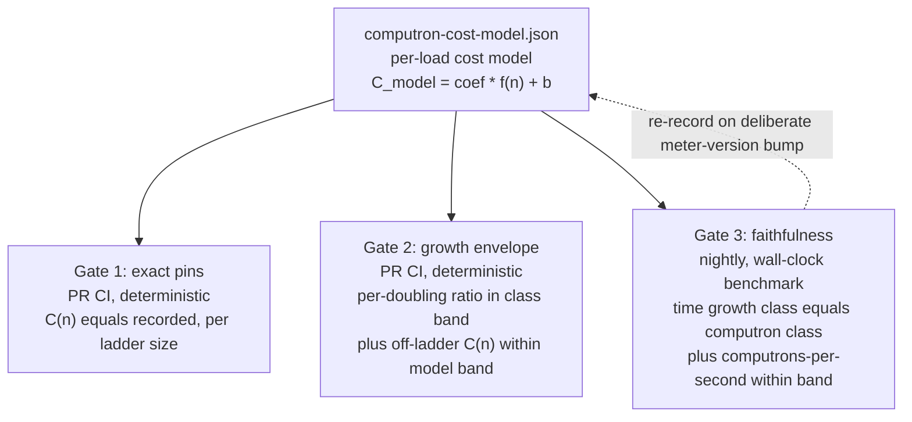

# Ironhorse computron benchmark baselines

| | |
|---|---|
| **Created** | 2026-09-16 |
| **Author** | kriskowal (prompted) |
| **Status** | Proposed |
| **Source** | PR #1282 review comment (2026-09-15) |

## What is the Problem Being Solved?

A *computron* is Ironhorse's deterministic unit of metered execution cost, derived
from its fixed-point meter (`computrons == meter_raw >> 16`; the full definition is
in § Design). Ironhorse (IH) is the Rust engine that supersedes XS; its meter is
meant to approximate real CPU time.

PR #1282 ("chore(ironhorse): demolish the XS-computron-parity myth") is correct in
its doctrine: Ironhorse's meter approximates real CPU time, and XS-computron parity
is a non-goal, not a deferred goal. But in demolishing the *parity myth* it also
removed or relaxed a class of tests that were doing a second, legitimate job under a
parity costume: they constrained the range of valid computron values for particular
loads. Consider the `await_in_try.rs` `-20` async-generator start-reject residue.
That pin recorded that a specific load (starting and then rejecting an async
generator inside a `try`) settled the meter by exactly 20 computrons relative to the
oracle (the XS reference engine used as the old parity target; see § Doctrine
alignment). Read as a *parity* assertion ("IH must match XS here"), it deserved
demolition. But, read mechanically, it also said "this load costs a specific
amount", and when it is relaxed to advisory drift, nothing catches that same load
silently tripling in cost or turning quadratic.

Own-determinism gates only *partly* cover that gap, and it is worth being precise
about which part. `--repeat` catches only run-to-run nondeterminism.
`golden_computrons.rs`'s frozen pins *do* catch a code change that shifts a covered
load's absolute cost (each pin is an `assert_eq!(outcome.computrons, pinned_value)`
against a committed number, not merely a cross-repeat equality). The real, narrower
gap is twofold: (a) the pins #1282 relaxed were *oracle-relative deltas* (e.g.
`ironhorse_computrons - oracle_computrons == -20`), which pin nothing about IH's own
absolute cost even today; and (b) `golden_computrons.rs`'s 52 families are each
*single-size*, so even a surviving own-cost pin cannot catch a *scaling* regression
(a load going quadratic between or beyond its one pinned point). This design closes
exactly that gap: an own-cost constraint that also *scales with input size* for the
loads whose only prior constraint was an oracle-relative delta or a single-size pin.

The maintainer's course-correction (verbatim in § Prompt): do **not** eliminate the
range-constraining tests. Instead, **re-express their constraint as a
benchmark-established baseline.** Measure Ironhorse's *own* computron cost for
representative loads, bound the acceptable range around that measured baseline, and
model built-ins whose time cost is a **polynomial of the magnitude/size of one or
more inputs** so a baseline **scales with input** rather than pinning a single
value. These baselines constrain IH's meter against measured CPU-time load. They are
emphatically **not** XS-equality gates, so the accuracy-over-parity doctrine is
preserved intact.

## Doctrine alignment

This design sits *inside* the accuracy-over-parity doctrine, not against it. The
oracle (the XS reference engine used as the old parity target) and its computrons
never enter any predicate here. The reference a baseline is measured against is
**Ironhorse's own wall-clock CPU time**, and the property being gated is the meter's
founding purpose: *computrons track CPU time.* A metering defect, per PR #1282's own
doctrine note, is "un-charged / over-charged **work** in IH's own cost model": a
divergence between what a load costs in computrons and what it costs in CPU time.
That is exactly what these baselines detect, using CPU time (not XS) as the
measuring instrument.

## Design

Computrons are **deterministic**: the same binary on the same platform yields
identical computrons. The meter is a 16.16 fixed-point `u64` accumulator, so
`computrons == meter_raw >> 16` (a `1<<16` raw charge is one computron, `1<<14` is a
quarter); the release cost table is pinned by `COST_TABLE_VERSION` (today
`ironhorse-meter-5`) and its SHA-256 digest is append-only in
`ironhorse-meter/releases.rs`. Determinism holds *within a release binary and
platform*, not across platforms (per the engine design's § Metering, the
accuracy-over-parity doctrine of 2026-07-04). That within-binary determinism is the
lever this design exploits: because the *value* is deterministic, the *cost model*
fitted from it is deterministic too (when the fit is done in exact arithmetic, not
`f64` regression, per § The baseline), so most of the constraint can be gated cheaply
on ordinary PR CI, and the noisy wall-clock benchmark is reserved for the one job
only it can do: keeping the model honest as a CPU-time proxy. (Because computrons
are not guaranteed identical across platforms, the exact-pin gate runs on the same
debug/release, Linux/macOS lanes that `golden_computrons.rs` already runs on, where
the pins are known to be reproducible.)

### The baseline: a per-load cost model, not a single number

Two quantities recur throughout and are deliberately distinct: `C(n)` is the
**exact, measured** computron count obtained by *actually running* load `L` at input
size `n` (deterministic per § Design, but known only by execution; it is what gates 1
and 2 compute at gate time), while `C_model(n) = coefficient * f(n) + intercept` is
the **fitted prediction** — the committed cost model, evaluable without running the
load.

For each representative load `L` with an input-size parameter `n`, the baseline is a
**cost model**

```
C_model(n) = coefficient * f(n) + intercept
```

where `f(n)` is a growth basis drawn from a small closed set: `1` (constant),
`log n`, `n` (linear), `n*log n`, `n^2` (quadratic). The `coefficient` and
`intercept` are fit from the **exact, deterministic** computron counts measured at a
ladder of at least four input sizes (doublings). The fit **must use exact
rational/integer arithmetic, not floating-point regression.** Exact-integer inputs
alone do not make an `f64` least-squares fit reproducible across hosts: summation
order, FMA contraction, and libm differences vary by platform and toolchain, so an
`f64` regression would silently forfeit the very determinism this design leans on.
With a closed basis of five simple forms fit to at most a handful of exact-integer
ladder points, the normal-equation solution is a ratio of small integer sums and is
representable exactly as a rational; the record commits the reduced rational (or its
exact-integer numerator/denominator pair). Only then is the fitted model itself
deterministic and re-derivable bit-for-bit on any host.

### Where the baseline lives: one JSON record, not two artifacts

Each committed baseline record carries two kinds of field, and the schema **marks
which kind each is**, so a future editor can tell — without reading this whole design
— which fields a gate reads as truth versus which are frozen evidence that may go
stale:

- **Gate-input (authoritative, read by a gate at gate time):** the load id, the
  growth basis `f(n)`, the fitted `coefficient`/`intercept`, the exact `computrons`
  (and `meter_raw`) at each ladder size, the tolerance bands, the boolean
  `known_divergent`, the recorded already-bad per-doubling time ratio (for
  `known_divergent` loads, read by gate 3's non-regression bound), and
  `COST_TABLE_VERSION`. Gates 1-3 assert against these.
- **Provenance (descriptive-only, never a gate comparison target):** the wall-clock
  medians that *confirm* the growth basis at `--write-baseline` time, the source
  revision, host, and toolchain digest, and `divergence_ref`. Gate 3 re-measures
  wall-clock time fresh on every nightly run and never compares against the recorded
  medians, so those medians are audit trail, not an assertion input. The schema tags
  every provenance field (a `"provenance": true` annotation or a segregated
  `provenance` sub-object) so a later schema edit cannot silently start reading a
  frozen median as a comparison target.

This mirrors the existing `rust/engine/benches/baseline.json` /
`ironhorse-262/baseline/` provenance discipline, made explicit rather than inherited
implicitly.

**The record is a single artifact: a new `rust/engine/benches/computron-cost-model.json`,
and only that.** The name deliberately differs from the sibling
`benches/baseline.json` (time-based) by *content* — "cost-model", not another
"...baseline.json" — so a contributor grepping or tab-completing `baseline.json` in
that directory does not grab the wrong artifact. An earlier draft floated *also*
extending the `computrons.tsv` corpus that `golden_computrons.rs` consumes, so that
the exact per-size pins would live in the TSV. This design rejects that split.
Keeping the deterministic exact pins and the (host-tied) confirming wall-clock
medians in one JSON keyed by load id — with the gate/provenance tagging above so the
two never blur — is simpler than a schema change to the consumed TSV format, and gate
1 reads the pins directly from the JSON. `golden_computrons.rs`'s single-size TSV
corpus is left untouched; gate 1 is a *new* input-parameterized harness that reads
`computron-cost-model.json`, not an edit to the TSV schema (§ Relationship to
existing infrastructure restates this).

### The three gates the baseline yields



1. **Exact pins (PR lane, deterministic, cheap).** At each committed ladder size,
   the measured `C(n)` must equal the recorded exact value. This is a new
   input-parameterized harness in the spirit of `golden_computrons.rs`, reading the
   per-size pins from `computron-cost-model.json` for the loads that lost their
   constraint (it does not modify the 52 single-size families in `computrons.tsv`). Catches *any* change to
   a covered load's cost; a deliberate change updates the pin under a
   `COST_TABLE_VERSION` bump (the existing rule: "never regenerate pins in a test").

2. **Growth-envelope gate (PR lane, deterministic, cheap).** Run each parameterized
   load across its size ladder computing *only computrons* (no timing: free and
   deterministic). Assert (a) the per-doubling computron ratio lies in the band for
   the load's declared growth class (see the class-band table below); (b) the
   measured `C(n)` for an **off-ladder** size lies within `C_model(n) +/- epsilon`
   (the fitted prediction plus a per-load tolerance), catching a regression that only
   manifests between or beyond the pinned points. Because it
   needs no wall clock, this half of the old `scaling_bench` contract can *graduate
   from nightly to PR CI*: the deterministic constraint the eliminated tests used to
   provide, restored where it belongs.

3. **Faithfulness gate (nightly lane, wall-clock benchmark).** This is the
   *benchmark-established* part. Measure CPU-time medians across the ladder (warmup
   plus repeated samples, host-controlled, exactly as `benches/run.py` and
   `scaling_bench` already do). Assert (a) the measured **time** growth class equals
   the load's declared **computron** growth class. This is what *confirms* the
   `f(n)` chosen for the model, so the polynomial is measured, not assumed. Assert
   (b) the meter's global fidelity ratio (computrons per second) stays within a band
   across the whole roster, so the meter cannot silently drift into over- or
   under-charging a family of loads relative to CPU time. This gate plugs into the
   existing nightly `benchmarks` job in `.github/workflows/ironhorse-full-test262.yml`.

The split is the crux of the design: **the deterministic model (gates 1-2) carries
the range constraint on PR CI, and the noisy benchmark (gate 3) carries only the
narrower "is the model still a faithful CPU-time proxy?" question on the nightly
lane.** This resolves the standing rule that "ordinary PR CI does not run timing
assertions" (bench README) *without* leaving loads unconstrained on the PR lane.

#### Gate 3 uses a looser, single-sided band than gate 2

Gates 1-2 assert on **deterministic computrons** with no wall clock, so their bands
are legitimately tight (the class-band table below). Gate 3 asserts on **measured
wall-clock time** on a shared GitHub-hosted `ubuntu-latest` runner, where timing is
noisy. Gate 3 therefore must **not** reuse gate 2's tight two-sided per-doubling
bands. It follows the existing wall-clock precedent it extends
(`scaling_bench.rs`'s "less than 2.5x per input doubling", a single-sided upper
bound with no tight lower band, chosen precisely for CI timing noise). Concretely,
gate 3's growth-class check is a **single-sided upper bound per class** (e.g. a
linear load's measured per-doubling time ratio must stay below a class ceiling well
above 2.0, not inside `[1.8, 2.2]`), and the computrons/second fidelity check is a
wide `+/-` band (see the class-band table). The design states this divergence
explicitly so a builder does not reuse the computron bands for wall-clock time and
produce a flaky nightly gate.

#### The class-band table and a shared failure-message contract

Gate 2's per-doubling computron ratio, one expected center per member of the closed
growth-basis set. **For the size-dependent classes the band is not a single fixed row
— it is computed per ladder step from the class's closed-form asymptotic**, because a
per-doubling ratio that is itself a function of `n` cannot be bounded correctly by
one static two-sided row across a whole doubling ladder (a `log n` load's true ratio
is `1.5` at `n=4` but `~1.03` at `n` near `2^30`; a single row would false-fail a correct
implementation at one ladder extreme or the other):

| growth class `f(n)` | expected per-doubling computron ratio (gate 2, two-sided about the center) |
|---|---|
| `1` (constant) | center `1.00`; fixed band, e.g. `[1.00, 1.15]` |
| `log n` | center `1 + 1/log2(n)` **evaluated at each step's `n`** (e.g. `1.50` at `n=4`, `~1.10` at `n=1k`); band is `center +/- width` |
| `n` (linear) | center `2.00`; fixed band, e.g. `[1.80, 2.20]` |
| `n*log n` | center `2*(1 + 1/log2(n))` **evaluated at each step's `n`**; band is `center +/- width` |
| `n^2` (quadratic) | center `4.00`; fixed band, e.g. `[3.60, 4.40]` |

The three asymptotically-flat classes (`1`, `n`, `n^2`) use a fixed two-sided band
about a constant center. The two size-dependent classes (`log n`, `n*log n`)
evaluate their center from the closed-form asymptotic **at each ladder step's `n`**
and apply the tolerance `width` about that per-step center. In all five cases the
builder confirms the exact tolerance `width` against the measured ladders and records
it (and, for the flat classes, the ladder must start large enough that the intercept
is negligible, else the same per-step derivation applies) in the baseline record's
tolerance fields; the numeric ranges above are illustrative mid-ladder defaults, not
frozen edges. Gate 3's single-sided time ceilings are derived per class from these
same per-step centers (upper edge, loosened for timing noise per the section above).

All three gates emit failures in **one shared shape** so a red CI line is
diagnosable without learning three idioms, matching the existing `scaling_bench.rs`
convention (`SCALING_RATIO {name} n={n} ...` then a uniform
`{name} n={n}: ...x; must be <2.5x` pushed onto `failures` and asserted once). Every
gate's failure message carries, in this order: the **load id**, the **size** `n`,
the **metric** (exact computrons / ratio / wall-clock median), the **observed**
value, and the **expected pin or band** with its threshold. The builder factors one
failure-formatting helper shared by all three gate harnesses.

### Modeling polynomial built-ins

The engine's cost table **already prices some built-ins by input size**: `*_PER_ELEMENT`
weights in `ironhorse-meter/lib.rs` (e.g. `APPLY_ARRAY_PER_ELEMENT_METERING`,
`AGGREGATE_ERROR_PER_ELEMENT`), and the `chunk_cost(bytes)` / `string_chunk_cost(units)`
helpers that price allocation and string ops as O(n) in code-unit length while a
single code-unit access stays O(1) (the 2026-07-06 UTF-16 re-basing in § Metering).
Those per-element weights are **hand-derived XS estimates**, never measured. That is
exactly the gap: this design's baselines *validate those input-size scalings against
measured CPU time* and lock their growth class. The whole point of `f(n)` is that a
built-in whose cost is superlinear in input gets a baseline that *scales*, not a
single pinned value. Known surfaces to seed the roster (several already exercised by
`scaling_bench.rs` and siblings):

- **named-property insertion** into a growing object (`o['k'+i]=i`), currently
  **quadratic**, called out in `scaling_bench.rs` as a known cost; its baseline is
  `f(n)=n^2` and the gate *locks that class* so it cannot silently worsen (and, if
  ever fixed, the class change is a deliberate re-record).
- **string indexing / iteration** (`charCodeAt`, `for..of` over a string), linear;
  `string_receiver_indexing_is_independent_of_receiver_length` already asserts the
  per-call cost is independent of receiver length, a constant-class baseline.
- **`Map`/`Set` bulk insertion**, linear (amortized) baseline; a rehash regression
  would show as a class break.
- **`for..in` traversal**, linear over property count.
- **regexp match**, parameterized by subject length and by pattern shape; the
  `ironhorse-regexp` match-meter, whose XS-equality assert #1282 relaxed to advisory,
  gets an own-cost growth baseline instead.
- **async-generator `await`/`suspend` metering**, the `await_in_try.rs` /
  `suspend_in_try_metering.rs` loads whose XS-delta pins #1282 relaxed, re-expressed
  as own-cost pins (gate 1) at representative shapes.

A load may be parameterized by **more than one** input (the prompt's "one or more
inputs"): the model generalizes to `C_model(n, m) = c*f(n)*g(m) + ...`, fit over a
grid; regexp (subject length by pattern size) is the canonical two-input case. The
builder starts with single-input loads and adds grid loads only where a built-in's
cost genuinely depends on two inputs.

#### Loads already known to diverge from CPU time (the F4 exception)

This repo's own `architecture-review/2026-09-06/lenses/performance-architecture.md`
finding F4 ("high" severity, still live in the current tree: `collection_find`'s
linear scan and `enumerate.rs:159`'s per-`next()` `IterState` clone are both still
present) documents that three of the seed loads above are *already* quadratic in
wall-clock time while metered *exactly linear* in computrons: `Map.set` (n=1k to 8k:
2.30 to 119.27ms at linear computrons), `for..in` (n=2k to 16k: 22.8 to 1274.4ms at
linear computrons), and string `for..of` (64Ki to 256Ki: 254.7 to 3643.2ms). For
these loads, gate 3's "measured time growth class equals declared computron growth
class" check would go **red on day one from a pre-existing, unfixed meter defect**,
not from a future regression. That is inverted from the gate's purpose.

The design resolves this so the builder does not have to improvise a
fix-first-or-flag decision:

- Each baseline record carries a **boolean** `known_divergent` flag and, when it is
  set, a `divergence_ref` string naming the live tracking reference (here,
  architecture-review F4, with its issue/finding link), plus the currently-measured
  (already-bad) per-doubling wall-clock time ratio for the load. Splitting the two
  keeps the field's name honest — `known_divergent` reads as the boolean predicate it
  is, and the reference lives in `divergence_ref`, not smuggled into a "boolean" that
  actually holds a string. A `known_divergent` load is recorded with its exact
  deterministic computron pins and its computron growth class as usual, so **gates 1
  and 2 constrain it fully** (its computron cost is still locked; a computron
  regression is still caught).
- **Gate 3's class-match assertion is replaced by a non-regression bound, not
  dropped**, for a `known_divergent` load. Suppressing gate 3 entirely would remove
  all wall-clock coverage on exactly the loads with the largest known metering blind
  spot: a *second*, new time-side regression stacking on the F4 defect (e.g.
  `collection_find`'s linear scan degrading further under an unrelated refactor)
  would go undetected, since gates 1-2 only constrain the computron value, which by
  construction does not move. So only the **time-class-equals-computron-class**
  check stands down (it would go red on day one purely from the pre-existing
  defect); in its place gate 3 asserts that the load's measured per-doubling time
  ratio **must not exceed the recorded already-bad ratio by more than the gate-3
  noise margin**. The nightly report lists the load as a *tracked exception*,
  visibly distinct from a regression ("known-divergent (F4): class-match not
  asserted; non-regression bound vs. recorded ratio held"), never a silent skip and
  never a red gate for the pre-existing defect alone, but still red on a *fresh*
  time regression that worsens the load beyond its recorded baseline.
- The exception cannot silently become a permanent parking lot. `divergence_ref` must
  point at a *live* tracking reference, and the nightly report surfaces the count and
  age of `known_divergent` loads (oldest divergence date), so a high-severity metering
  gap laundered into routine nightly output stays visible, not buried.
- When the underlying meter defect (F4) is fixed, the load's computrons stop being
  linear-while-time-is-quadratic. That is a deliberate cost-model change: it lands
  under a `COST_TABLE_VERSION` bump that re-records the baseline (§ Deliberate
  recalibration), clears `known_divergent` (and its `divergence_ref`), and re-enables
  gate 3's full class-match. The seeding step (§ Phased execution step 6) marks the
  F4 trio `known_divergent` from the start rather than seeding them into an
  immediately-red gate 3.

This keeps the F4 loads *in* the roster (their computron range is constrained today)
while refusing to assert a wall-clock faithfulness the meter cannot yet honor.

### Deliberate recalibration

A genuine, intended change to Ironhorse's cost model (a new cost-table release) is a
reviewed operation, never a silent test edit: bump `COST_TABLE_VERSION`, then
re-record every baseline with a `--write-baseline`-style command (mirroring
`benches/run.py --write-baseline`). The exact pins and the fitted models move
together under that one reviewed diff, and the nightly faithfulness gate re-measures
against the new record. This is the same discipline the frozen pins and
`baseline.json` already follow, extended to the cost models. A meter fix that
resolves a `known_divergent` load (e.g. the F4 fix) travels this same path: the
re-record is where the divergence flag is cleared and gate 3 re-armed for that load.

## Relationship to PR #1282 (its fate)

**Revise #1282 in place; do not supersede it.** Its doctrine demolition is right and
should stay: deleting `is_bit_exact`/`Summary`/`met_bar`, `computrons_agree`, the
oracle-computron asserts, the `ironhorse-meter-exact` tag emission, and retiring
`F074` ("Make the new coercion tests enforce computron parity") and `F164` ("Make
the slice suite enforce the project's meter-parity contract") *as XS-parity
requirements* are all correct and doctrine-aligned. Nothing in this design brings any
of that back. One reconciliation the builder owns: removing `computrons_agree` also
strands the general metering-claim rule in
[ironhorse-known-defects](ironhorse-known-defects.md) ("Metering claims are decided
by `computrons_agree` and the raw meter"). The builder repoints that rule at the
benchmark baseline plus the raw meter.

What #1282 must **not** do is leave a load's computron range unconstrained. So the
sequencing is:

1. The sibling build job's **first step is an audit**: for every test #1282 removed
   or relaxed from a hard gate to advisory drift, determine whether that load's
   computron range is *still* constrained by a surviving own-cost pin (many are: the
   ~15 interp frozen-cost pins and the `error_messages_calls.rs` `ironhorse_computrons
   == 14` pin were deliberately kept). Produce the list of loads left with **no**
   surviving constraint (candidates: the `await_in_try`/`suspend_in_try` async-gen
   metering shapes and the `ironhorse-regexp` match-meter).
2. Add benchmark baselines (gates 1-3) covering exactly those unconstrained loads,
   plus the seed roster above.
3. Only then are #1282's advisory-only relaxations safe.

**Constraining the merge order: what the hold actually enforces, and what it does
not.** A prose note in #1282's body is not enough on its own: #1282 is currently
open, not draft, `MERGEABLE`, with no blocking review, so the autonomous fleet could
merge it independently and open the very gap this design exists to prevent. The build
PR that lands this regime is therefore registered as a job-board dependency of #1282
via this garden's own `skills/orchestration` `blocked_on` edge, so the garden's own
automated **conductor** role will not merge #1282 until the regime PR has landed.
This must be scoped honestly: the `blocked_on` edge is consulted by the conductor,
not by GitHub, so it binds **only the fleet's automated merge path.** It does **not**
block a maintainer merging #1282 by hand through the GitHub UI, and there is no
merge-blocking "hold label" mechanism in this repo to lean on (verified: nothing in
`.github/workflows` gates a merge on a label). The `blocked_on` edge is thus a
mechanical guarantee against the *fleet* opening the gap, not against every actor.
Closing the human-merge window rests on the note in #1282's body (added for human
readers) plus maintainer awareness of the ordering. A hard guarantee against a human
merge would require a concrete branch-protection primitive this repo does not yet
have (a required status check on #1282's target that stays red until the regime PR
has landed); adding one is a separate CI change, out of scope for this design. The
recommended concrete order remains: land the regime first as its own PR against
`llm`; then #1282 rebases onto it and merges with the gap already closed. Registering
the `blocked_on` edge is the **first** build step (§ Phased execution step 1), not a
late one, so the fleet-facing window is never open while the rest of the build
proceeds.

Partial-keep is rejected: leaving #1282's relaxations in place *without* the
replacement is precisely the gap the maintainer is course-correcting; a full
supersede is wasteful because #1282's demolition is sound and independently valuable.

## Relationship to existing infrastructure

This design **extends** existing infrastructure; it does not duplicate it:

- `golden_computrons.rs` + `computrons.tsv` (52 exact single-size families): gate 1
  is an input-parameterized harness in the same spirit, but it reads its per-size
  pins from the new `computron-cost-model.json` and leaves the 52-family TSV corpus
  and its schema untouched.
- `scaling_bench.rs` (time **and** computron growth < 2.5x/doubling, nightly): its
  *deterministic computron half* becomes gate 2 (PR lane) and its *timing half*
  becomes gate 3 (nightly); the design formalizes its ad-hoc 2.5x rule into declared
  per-class bands and a fitted model. `checkpoint_scaling_bench`,
  `property_lookup_bench`, `lifecycle_bench`, and the compiler growth-policy benches
  are siblings that adopt the same record format.
- `benches/run.py` + `baseline.json` (48-metric time roster, 1.25x floor, nightly,
  provenance-checked): gate 3 reuses its measurement discipline, provenance digests,
  and the nightly `benchmarks` CI job. `computron-cost-model.json` is a sibling
  *record*, but its CLI surface is only the `--write-baseline` recorder (§ Phased
  execution step 4): gates 1-2 "check" by running the ordinary `cargo test` lane, so
  there is no separate `--check-baseline` verb on this harness (unlike `run.py`,
  which needs both because its check is a standalone timing invocation, not a test).
- [ironhorse-meter-opcode-cost-instrumentation](ironhorse-meter-opcode-cost-instrumentation.md)
  (In Progress): **complementary, not
  overlapping.** That design already specifies, per opcode and per builtin-step
  family, "the expected computational complexity as a **polynomial in the size** ...
  of the operation's operands" (its C1 scaffold lives in `ironhorse-vm/src/cost.rs`;
  its C2-C4 timing/normalization/calibration loop is not started, and current
  weights are still the frozen XS-derived estimates). So the *polynomial-in-input*
  primitive is theirs, at the micro (per-opcode/builtin-step) level; **this design
  applies it as an acceptance gate at the macro (representative-load) level.** The
  opcode instrumentation feeds better weights *in*; these baselines catch when any
  change (a weight recalibration, an interpreter refactor, a built-in rewrite) moves
  an aggregate load's cost off its CPU-time-faithful curve. The two share the
  growth-basis vocabulary and should name the polynomial classes identically.

## Phased execution (builder steps)

The sibling build job `ironhorse-computron-benchmark-baseline-build` executes:

1. **Register the hold first** (§ its fate): before any build work, register the
   `blocked_on` job-board edge that makes #1282's automated (conductor) merge depend
   on this regime PR landing, and add the note to #1282's body. This is step *one*,
   not a late step, so the fleet-facing coverage-gap window is never open while the
   rest of the build proceeds. (The human-merge order is closed by the body note plus
   maintainer awareness, not the edge; see § its fate.)
2. **Audit #1282's relaxations** (§ its fate): produce the list of loads left with no
   surviving own-cost constraint. Record it in the build PR body.
3. **Define the baseline record format**: the single
   `rust/engine/benches/computron-cost-model.json` schema (load id, `f(n)` basis,
   fitted coefficient/intercept, per-size exact `computrons`/`meter_raw`, tolerance
   bands, boolean `known_divergent`, `COST_TABLE_VERSION`; plus the provenance-tagged
   fields — confirming wall-clock medians, source/host/toolchain digest, and
   `divergence_ref` — marked per § Where the baseline lives) and the growth-class band
   table (§ class-band table).
4. **Build the gate 1-2 harness**: a `computron_baseline` test crate/module that
   (gate 1) asserts exact pins at committed ladder sizes reading
   `computron-cost-model.json`, (gate 2) asserts per-doubling class bands (per-step
   centers for the size-dependent classes) and off-ladder `C_model(n) +/- epsilon`,
   both deterministic and PR-runnable, sharing the one failure-message helper. The fit
   uses exact rational arithmetic (§ The baseline), not `f64`. Add a `--write-baseline`
   recorder (the only CLI verb; checking is running the test lane).
5. **Build the gate 3 harness** as a named nightly benchmark module —
   `computron_faithfulness_bench` (sibling to `scaling_bench.rs` under
   `rust/engine/benches/`) — measuring wall-clock medians across the ladder, the
   time-class == computron-class assertion (with the single-sided timing band, and for
   `known_divergent` loads the **non-regression time-ratio bound** in place of the
   class-match, per § F4 exception), and the global computrons/second fidelity band;
   wire it into the `benchmarks` job in `ironhorse-full-test262.yml`.
6. **Seed the roster** (§ polynomial built-ins) plus every load from the step-2 audit;
   mark the F4 trio (`Map`/`Set` bulk insertion, `for..in`, string `for..of`)
   `known_divergent` with a live `divergence_ref` per § F4 exception; record all
   baselines with `--write-baseline` on a controlled host and commit.
7. **Wire PR CI**: add gates 1-2 to the ordinary Rust test lane (`ci.yml`),
   deterministic and fast; keep gate 3 nightly.
8. **Rebase #1282** onto the landed regime (or merge order per § its fate); confirm
   the hold from step 1 held throughout and update #1282's body to reference this
   work.
9. Run the full nightly benchmark lane locally (release, host-controlled) and record
   the measured medians and growth-class confirmations as evidence.

## Design decisions

1. **Deterministic model on PR CI, wall clock nightly.** Because computrons are
   deterministic, the cost *model* and its range band are deterministic and belong on
   PR CI (gates 1-2); the benchmark's irreducibly-noisy role (confirming the growth
   class and CPU-time fidelity) stays nightly (gate 3). This honors "no timing
   assertions on PR CI" while restoring a PR-lane range constraint.
2. **The measuring stick is IH's own CPU time, never XS.** No oracle computron enters
   any predicate. Fully doctrine-aligned.
3. **Growth class is confirmed by measurement, not assumed.** Gate 3's time-class ==
   computron-class check is what makes `f(n)` "benchmark-established" rather than a
   guess baked into a fixture.
4. **Baselines are a reviewed artifact tied to a meter version.** Re-recording is a
   deliberate `--write-baseline` operation under a `COST_TABLE_VERSION` bump, never a
   silent per-test edit: same discipline as the frozen pins and `baseline.json`.
5. **Extend, don't replace, the existing bench corpus and provenance.** Reuse
   `golden_computrons.rs`/`computrons.tsv`, `scaling_bench.rs`, and `benches/run.py`
   shapes to keep one metering-baseline mental model.
6. **One committed artifact.** The baseline is a single `computron-cost-model.json`,
   not a split across the TSV corpus and a JSON, so a builder adding a load touches
   one file of one format (§ Where the baseline lives).
7. **Known-divergent loads are tracked exceptions, not red gates.** A load whose
   wall-clock cost already diverges from its computron class (the F4 trio) is kept in
   the roster under gates 1-2, with gate 3's class-match replaced by a non-regression
   bound on the already-bad time ratio (so a second, fresh regression is still
   caught) until the meter fix re-records it (§ F4 exception).

## Open questions

- What tolerance bands should the gates use? Proposed defaults are in the § class-band
  table (gate-1 exact, band 0; gate-2 two-sided per-class computron bands; gate-3
  single-sided time ceilings plus a computrons/second fidelity band of `+/-25%`
  across the roster, the same order as the existing 1.25x time floor). Are these the
  right widths, especially the size-dependent `log n` / `n*log n` bands?
- Should the deterministic growth-envelope gate (gate 2) run on **PR CI** as
  proposed, or stay on the nightly lane with gate 3? (Recommendation: PR CI. It is
  deterministic and cheap, and PR-lane coverage is the whole point of restoring the
  constraint.)
- What is the authoritative **seed roster** of loads/built-ins to baseline first?
  Proposed: the § polynomial-built-ins list plus every load surfaced by the #1282
  audit, with the F4 trio seeded `known_divergent`. Any built-ins to add or drop?
- Should a `COST_TABLE_VERSION` bump **auto-regenerate** all baselines, or always
  require a manual reviewed `--write-baseline`? (Recommendation: manual, for
  reviewability.)
- Confirm the fate of PR #1282: **revise in place, land the regime first, hold the
  fleet's merge order with a `blocked_on` edge** (human-merge order closed by the
  note plus maintainer awareness; this design's recommendation) versus superseding
  #1282 with a fresh combined PR.
- Two-input (grid) baselines: land in this build, or defer regexp's
  subject-length-by-pattern-size grid to a follow-up once single-input loads are
  proven? (Recommendation: defer the grid; ship single-input first.)

## Prompt

> Instead of eliminating tests that constrain the range of valid computron values
> on Ironhorse, let's instead use benchmarks to establish a baseline for particular
> loads, taking into account that some built-in functions will have a time cost that
> is a polynomial of the magnitude or size of one or more inputs. Please make a plan
> and execute that plan.
>
> (kriskowal, endojs/endo-but-for-bots PR #1282 review comment, 2026-09-15)
