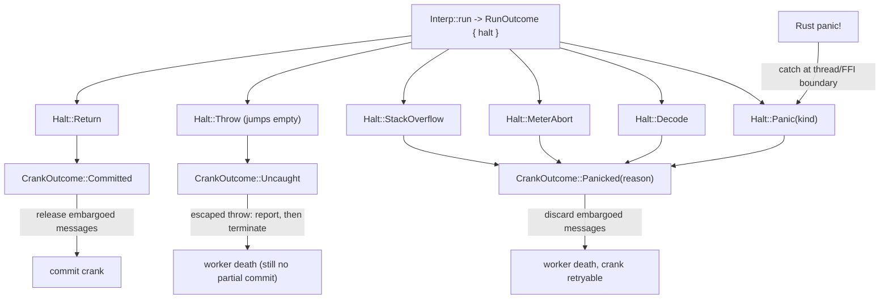
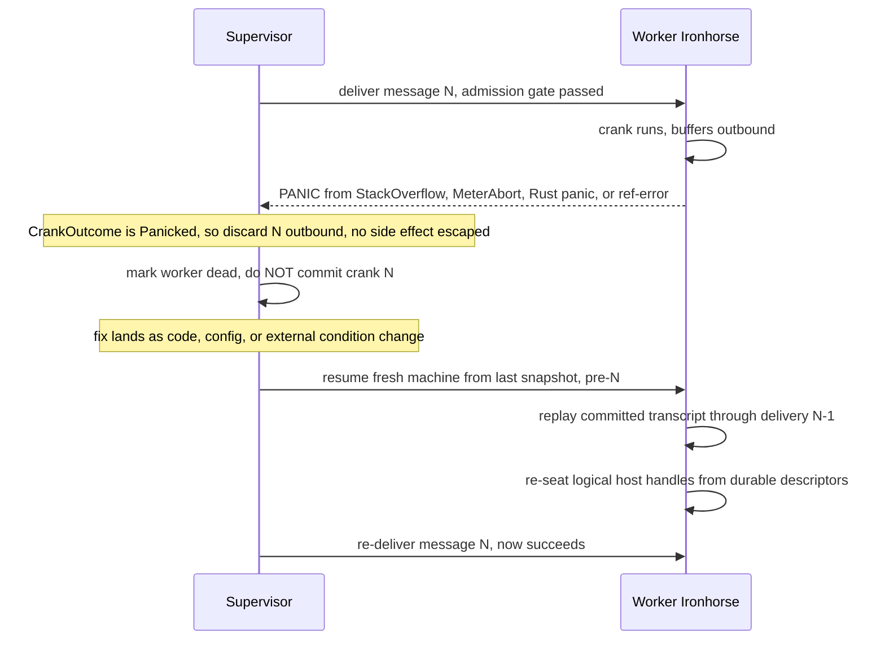

# Ironhorse Panic: Uncatchable Termination and the Message Embargo

| | |
|---|---|
| **Created** | 2026-08-17 |
| **Updated** | 2026-08-29 |
| **Author** | Kris Kowal (prompted) |
| **Status** | Proposed |

This design names, formalizes, and extends the **panic**: an uncatchable,
unrecoverable termination of a vat/worker that no JavaScript `try`/`catch`,
promise handler, or engine recovery path can intercept. Ironhorse substantially
has this already. `Halt::StackOverflow` and `Halt::MeterAbort`
([ironhorse-engine](ironhorse-engine.md) § Interpreter, the `Halt` enum in
`rust/engine/ironhorse-vm/src/interp.rs`) are each documented today as "an abort
to the host, not a catchable `RangeError`", and both descend from XS/xsnap's
`fxAbort` longjmp. This design gives the pattern one name, generalizes it over
every uncatchable-termination source, states its relationship to the daemon's
message-delivery model, and adds an opt-in mode — the `panic-on-reference-error`
configuration option, framed as **the Coda** below — that turns selected
reference errors into panics for post-mortem debugging. (A worker hosts exactly
one vat in the current daemon, so "vat" and "worker" are used interchangeably
throughout; the one-database-per-worker isolation claim below rests on that 1:1
relationship.)

**Status and vocabulary (read first).** "The daemon" throughout is the endo
daemon; **Endor** is its Rust runtime that hosts the Ironhorse engine (see
[ironhorse-engine](ironhorse-engine.md) § Endor integration). Ironhorse is
**prospective, not the live delivery-path engine**: the production daemon still
runs C-XS through the `xsnap` crate, and the `-e ironhorse` engine-selection
integration is incomplete (roadmap stage 8/9). Only the Coda's reference-error
classification and the net-new FFI-abort guard (§ Scope: What Is Already a
Panic) touch code the live daemon runs today; the `Machine`-seam `CrankOutcome`
and the per-worker transcript land with that integration. Weigh every claim
below against this status.

## What Is the Problem Being Solved?

A **crank** is the processing of one inbound delivery plus all resulting promise
jobs until quiescence ([daemon-xs-worker-metering](daemon-xs-worker-metering.md)
§ Crank lifecycle). A crank that aborts partway through, after it has already
sent some outbound messages but before it finishes, risks **hangover
inconsistency**: the classic partial-failure hazard (the E-language and KeyKOS
lineage, where a vat is the unit of partial failure) in which a crank's intended
effects are split, some observed by the outside world and some never applied,
leaving peers with a view the vat never actually reached.

The clean answer is a two-part contract:

1. A **panic** terminates the vat uncatchably: no in-vat code can catch it,
   suppress it, or continue past it, so the vat cannot half-run to a state a
   handler papered over.
2. A **message embargo** holds a crank's outbound messages until the crank
   commits, so a panic can **discard** them rather than releasing a partial set.
   Together these guarantee the vat dies with **no side effect escaping**, which
   makes the crank safely **retryable**: restore the worker from its last
   snapshot, replay the transcript up to but not including the panicking
   delivery, and re-run the (now fixed) delivery.

Ironhorse already terminates uncatchably for two of the three natural
*guest-behavior* cases (stack overflow, meter refusal); the third (a Rust
engine-logic-bug panic) is the net-new source named below. (Corrupt-bytecode
`Decode` also aborts today, but it is a supervisor-level fault, not guest
behavior, and sits in a different provenance bucket in the table below.) What is
missing is (a) one formal concept that
unifies them and the net-new cases, (b) a per-worker write-ahead transcript that
makes embargo, restart, and replay one durability contract, (c) treatment of
host calls and their restart-sensitive handles as transcript messages, and (d)
the debugger's treatment of a panic versus an ordinary uncaught throw. This
design supplies all four, then adds the reference-error Coda.

## Scope: What Is Already a Panic (the required first step)

Surveying the `Halt` enum (`interp.rs`) against the panic definition yields
three buckets. This is the design's starting inventory, not an invention from
nothing.

| `Halt` variant | Uncatchable abort-to-host today? | Panic classification |
|---|---|---|
| `StackOverflow(usize)` | **Yes**: its doc says "an abort to the host, not a catchable `RangeError`, a deterministic, consensus-relevant limit". XS's `fxOverflow` -> `fxAbort(XS_JAVASCRIPT_STACK_OVERFLOW_EXIT)`. | **Already a panic.** Reclassify under the formal concept; no behavior change. |
| `MeterAbort` | **Yes**: the meter host refused more computation; XS's `XS_TOO_MUCH_COMPUTATION_EXIT` via `longjmp`. The metering design already destroys the worker on this. | **Already a panic.** Reclassify; no behavior change. |
| `Throw(String)` | **No**: this is the JS-level throw. Empty `jumps` means it escapes every JS handler and reaches the host, but it is *catchable in principle* (a `catch` above it intercepts it). | **Not a panic.** It is the ordinary (possibly uncaught) throw. Kept distinct; see § Debugger Interaction. |
| `Decode(String)` | **Yes**: truncated/invalid bytecode; the loader must not continue. | **Panic-adjacent.** A corrupt-input abort; group it with panics for the "terminate, do not commit" decision, though its provenance (a bad snapshot or buggy compiler) is a supervisor-level fault, not guest behavior. |
| `StepLimit(u64)` | **Yes**, but only on the un-metered fuzz path (never on `Interp::run`). | **Panic-adjacent (harness only).** Not reachable in production; grouped for completeness. |
| `Yield`/`Await`/`Return` | **No**: normal control-flow suspension/completion. | **Not panics.** |

Net-new panic sources (no existing `Halt` variant, added by this design):

- **Rust-level logic-bug panic.** A wrong index reaching a kind-checked arena
  accessor `panic!`s the machine thread. [ironhorse-engine](ironhorse-engine.md)
  § Minimizing `unsafe` already states the intended treatment: "a panic is a
  crashed crank, not a compromised daemon", which the supervisor "already treats
  as worker death". This is mechanically different from a `Halt` value (it
  unwinds the Rust thread rather than returning) but is the *same concept* at the
  supervisor boundary. See § The Formal `Panic` Category for the seam that unifies them (a
  *seam* here is the boundary where one component's return value becomes
  another's input or decision: in this design, where the interpreter's `Halt`
  becomes the supervisor's commit/discard decision).
- **Reference-error panic (opt-in).** The Coda's configuration, off by default.

**The already-live FFI abort hazard (grounding the "not a compromised daemon"
claim).** The "a panic is a crashed crank, not a compromised daemon" framing is
inherited from [ironhorse-engine](ironhorse-engine.md), whose arena-index
`panic!` unwinds a *Rust* call stack that a `catch_unwind` at the `Machine` seam
can convert into a `Halt::Panic(EngineFault)` value. But the *currently live*
worker does not run that engine. `rust/endo/src/inproc.rs` (`spawn_shared_worker`
/ `spawn_inproc_xs_manager`) runs the C-XS interpreter's Rust glue **in-process,
on a daemon thread**, and the native interpreter invokes that glue through
`unsafe extern "C"` callbacks in `rust/endo/xsnap/src/worker_io.rs`
(`host_send_frame`, `host_issue_command`, `host_send_raw_frame`). Those callbacks
already contain panicking calls today: for example `with_transport`'s
`.expect("WorkerTransport not installed on this thread")` (`worker_io.rs:363`),
reached from every send callback. Since Rust 1.71 and later **abort the whole
process** when a panic unwinds past an `extern "C"` frame, and no `catch_unwind`
exists anywhere in `rust/endo/xsnap/src/` today, an uncaught panic in this glue
kills **every vat sharing the daemon process**, not just the panicking one. That
is the opposite of the per-vat isolation the embargo and transcript contract
assumes. So the `EngineFault` "catch at the thread/FFI boundary" (§ The Formal
`Panic` Category, item 3) is not a property Ironhorse already has for the live
worker. It is a **net-new requirement this design imposes on the existing xsnap
glue too**: a `catch_unwind` (or panic hook) must wrap each `extern "C"` callback
body, and the machine-thread crank entry, converting the process abort into a
`Panicked` worker-death value before it crosses the FFI boundary. Until that
lands, the "not a compromised daemon" guarantee holds only for the prospective
Ironhorse `Machine` seam, not for the C-XS worker on today's delivery path.

**Conclusion of the scope step:** the mechanism exists for two of three natural
cases and needs *naming and generalizing*, not building. The genuinely new
engineering is the formal category (small), the per-worker write-ahead
transcript and embargo, transcript-aware host calls, and the Coda.

## The Formal `Panic` Category

The requirement is one concept that answers a single supervisor question at the
crank boundary: *did this delivery terminate the vat uncatchably, so its effects
must be discarded rather than committed?* Three shapes were considered (see
§ Alternatives Considered). The recommendation keeps the rich diagnostic `Halt` variants
and adds classification, rather than collapsing them:

1. **Keep the informative variants.** `StackOverflow(usize)` carries the slot
   overshoot; `MeterAbort` marks meter refusal; `Decode(String)` names the
   corruption. Collapsing them into one opaque `Panic` would destroy the
   diagnostics the supervisor and debugger need.
2. **Add a grouping predicate** on `Halt`:
   `fn is_panic(&self) -> bool`, true for `StackOverflow | MeterAbort |
   Panic(_)`, and also for `Decode | StepLimit`. The predicate is a pure function
   of the `Halt` value — it does **not** consult caller context; the "on their
   respective paths" qualifier is a fact about *where those variants arise*
   (`Decode` only on the loader path, `StepLimit` only on the un-metered fuzz
   harness, each on exactly one path in practice; see the Scope table), not a
   branch inside the predicate. Its doc comment states this so the `(&self) ->
   bool` signature is not read as context-dependent. This is the one place the
   "terminate, do not commit" set is defined.
3. **Add one `Halt::Panic(PanicKind)` variant** for net-new sources that have no
   existing variant: `PanicKind::EngineFault` (a caught Rust panic, converted into
   this `Halt` at the thread/FFI boundary so the supervisor sees a value rather
   than a process abort; the `catch_unwind`/panic-hook wrap this requires for the
   live C-XS glue, which has none today, is surveyed under § Scope: What Is
   Already a Panic, "The already-live FFI abort hazard") and
   `PanicKind::ReferenceError` (the Coda). Extensible.
   The variant is deliberately **not** named `Host`: this document uses "host"
   throughout for the surrounding-runtime call surface (`host_send_frame`,
   `host_call`, § "Host functions are messages too"), so a `PanicKind::Host` would
   read as "a host-function call panicked" rather than "the Rust engine hit an
   internal logic bug." `EngineFault` names *what happened*, not the FFI boundary
   *where the value is observed*.
4. **Surface a three-way `CrankOutcome` at the `Machine` seam.** The interpreter
   keeps returning `RunOutcome { halt, .. }`; the `Machine`/supervisor seam
   ([ironhorse-engine](ironhorse-engine.md) § Endor integration) classifies each
   `halt` into `Committed` | `Uncaught(throw)` | `Panicked(reason)`. The commit
   decision reads only this three-way value; the `reason` carries the underlying
   `Halt` for reporting.

Note the two panic-family shapes this creates are deliberate but must not leak:
the pre-existing sources stay flat (`Halt::StackOverflow(n)`, `Halt::MeterAbort`)
while the net-new ones nest under `Halt::Panic(PanicKind)`, so a consumer that
pattern-matched `Halt` directly would see the same conceptual family spelled two
ways. The rule that keeps this from mattering: **no commit-path consumer matches
`Halt` variant shape directly** (the *commit path* is the supervisor's
release-or-discard machinery defined in § The Message Embargo Contract, where
"commit" means a durable transcript+heap join; the forward reference is
deliberate — the term is defined there). The "terminate, do not commit" decision
routes through `is_panic()` (item 2) and the classification routes through
`CrankOutcome` (item 4). The flat-vs-nested asymmetry is retained only to
preserve the existing variants' rich diagnostics and never reaches the commit
decision, which is why `Decode`/`StepLimit` are *not* folded into `PanicKind`
even though they are panic-adjacent.

This does leave the "match on `Halt` shape only via `is_panic()`/`CrankOutcome`,
never on the variant directly" rule as a **convention, not a type-enforced
guarantee** — `Halt::StackOverflow` and `Halt::Panic(_)` remain equally
matchable from any call site. The design accepts the asymmetry (folding
`StackOverflow`/`MeterAbort` into `PanicKind` would churn every existing site
for no behavior change), so the convention is enforced two ways rather than by
representation: (a) `Halt` is exported `#[non_exhaustive]`, forcing every
external match to carry a wildcard arm and blocking any consumer from
exhaustively enumerating variant shapes as its commit predicate; and (b) a
clippy lint (`disallowed-methods`-style deny on direct `Halt` matches outside
`is_panic`/`describe_halt`) flags any commit-path site that reaches for a variant
instead of the predicate. Unifying the representation is recorded as the
should-fix alternative in § Alternatives Considered rather than adopted here.

Note the seam that surfaces `CrankOutcome` is **prospective**: today
`ironhorse-vm`'s `Halt` is consumed by the oracle/fuzz harnesses and by direct
`Machine::evaluate`/`eval` callers (rendered by `describe_halt` into
`EvalOutcome` in `rust/endo/src/ironhorse_engine.rs`), while the production daemon
still runs C-XS through the `xsnap` crate. The panic-to-supervisor surfacing rides
on the not-yet-complete `-e ironhorse` engine-selection integration
([ironhorse-engine](ironhorse-engine.md) § Endor integration, roadmap stages
8/9). The interpreter-side classification (items 1-3) is landable now; the
`Machine`-boundary `CrankOutcome` (item 4) lands with that integration, and it is
the point where an Ironhorse `Halt::Panic` and the XS `"terminated"` meter report
(two separate mechanisms today) become one supervisor-visible worker death.

## The Message Embargo Contract

This is the part that must be grounded in the daemon's *real* current behavior,
because the daemon deliberately chose a mechanism **different from** the one the
naive reading of "embargo" would reinvent.

### What the daemon does today: admission control, not embargo

[daemon-xs-worker-metering](daemon-xs-worker-metering.md) (status **Complete**)
§ "Admission Control Eliminates Embargo" records an explicit maintainer decision.
An earlier revision proposed embargoing outbound messages per crank and
discarding them on abort; it was **rejected as too complex** (buffering in the
bridge layer, crank-boundary delimiters, reasoning about partial effects). The
shipped model instead **pre-pays the worst case**: the supervisor delivers a
message only when the worker's remaining budget exceeds the full per-crank hard
limit, so any crank that completes normally was already fully paid for and never
needs rollback. The design states the consequence in one line: **"No embargo, no
rollback, no buffering of outbound messages."** The single partial-effect case
it acknowledges is hard-limit `MeterAbort` termination, and its answer is that
this "destroys the worker anyway".

So the literal "message embargo" of this design's premise is, for the
**meter-exhaustion** case, *already handled* by a different and simpler
mechanism. A design that asserted a fresh per-crank embargo-and-discard buffer
would re-introduce exactly what the maintainer removed.

### Where admission control does not reach, and what the survey found

Admission control eliminates the *meter-exhaustion* partial-effect case, and
only that case, because pre-payment is about **budget**. It does nothing for a
panic that aborts a well-budgeted crank partway through:

- `StackOverflow` fires on a crank with ample budget.
- A Rust logic-bug panic fires regardless of budget.
- The Coda's reference-error panic fires regardless of budget.

For these, the hangover question turns entirely on **whether outbound messages
have already left the vat when the panic fires.** A survey of the live crank
path (the XS worker in `rust/endo/xsnap/src/lib.rs`, whose main loop carries
literal `// ---- Crank start ----` / `// ---- Crank end ----` markers) settles
it, and the answer is the *unfavorable* one:

- **There is no per-crank commit point.** The only thing that crosses the
  crank-end boundary is `send_meter_report`; nothing snapshots, journals, or
  commits per delivery.
- **Outbound messages leave immediately, mid-crank.** When guest JS sends out,
  it calls the host functions `host_send_frame` (`sendFrame`),
  `host_issue_command` (`issueCommand`), or `host_send_raw_frame`
  (`sendRawFrame`) in `worker_io.rs`, each of which calls
  `WorkerTransport::send_frame`/`send_raw_frame` **synchronously, writing straight
  to the pipe/channel**. There is no queue and no hold-until-crank-end. Only
  *debug* output is batched (`flush_debug_outbound`), not message traffic.
- **A meter-aborted or crashed worker just dies and is unregistered.** The abort
  path (`metering_callback` -> `XS_TOO_MUCH_COMPUTATION_EXIT`, caught in
  `run_promise_jobs_metered`, reported as `send_meter_report(steps,
  "terminated")`) leads the supervisor's `process_meter_report` to `unregister`
  the worker. **Its already-sent messages stay sent.** There is no rollback and
  no auto-restart.

So the premise's "implicit embargo" does **not** exist today. Even `MeterAbort`,
which the metering design calls the one partial-effect case, leaks its
already-sent messages; the metering design tolerates that only because it treats
a hard-limit abort as a non-retryable runaway (an infinite loop) whose
consistency nobody cares about. The moment a panic is meant to be **fixed and
retried**, those escaped messages become exactly the hangover inconsistency the
embargo exists to prevent, and admission control gives nothing here.

### Per-worker write-ahead transcript

An earlier revision of this design deferred the embargo/crank-commit mechanics to
a follow-on and left them an Open Question, honoring the prompt's "say so in Open
Questions rather than asserting an unverified mechanism." That deferral is now
**reversed deliberately**, and the grounding condition that justified it no longer
holds, for two reasons. First, the maintainer's review of that revision determined
the transcript is a *soundness prerequisite*, not an independent later design:
without a transcript there is no snapshot-relative record of the messages a crank
sent and received, so a restored worker cannot replay to the pre-panic state, and
panic recovery is unsound rather than merely unimplemented. Second, the condition
that made deferral right before (the mechanism was net-new *and the daemon's
behavior was unsurveyed*) is discharged by this revision's own § Where admission
control does not reach, and what the survey found, which surveyed the live crank
path and established there
is *no* existing commit point to build on. That finding is exactly what promotes
the transcript from a speculative follow-on to a named prerequisite of this
contract. The schema below is stated as this design's proposal, still to be
validated against the daemon when the implementation lands; the residual "which
backend owns the joint commit" question is carried explicitly (below and in Open
Questions), not asserted as settled.

**Why revive a mechanism heavier than the one already rejected as too complex.**
This must be met head-on, because the transcript is strictly *bigger* than the
per-crank embargo buffer the metering design rejected: it adds durable IO on the
send path, a replay/dedup protocol, and a host-handle reconstruction contract on
top of "buffering + crank delimiters." The coverage gap (§ Where admission
control does not reach) explains why *some* mechanism beyond admission control is
needed; it does not by itself justify *this* mechanism's complexity. Three things
do. First, **the complexity is not additive — most of it is already mandatory for
recovery.** The metering design rejected embargo as a *pure buffering* feature
whose only job was discard-on-abort; measured against that job alone, buffering
plus delimiters was indeed too much. But panic *recovery* (restore-snapshot +
replay-to-pre-panic + re-deliver) independently requires a durable,
snapshot-relative record of the messages a crank sent and received — that is the
transcript, and the maintainer's own review named it a soundness prerequisite.
Once the transcript must exist for replay, the embargo is *not new code at all*:
it is the same pending-rows-until-commit discipline the transcript already needs,
read for its discard-on-abort effect. The heavy parts (durable IO, dedup, handle
reconstruction) are recovery's cost, which the rejected embargo did not carry and
could not amortize. Second, **the rejected embargo had a cheaper substitute for
its whole scope; this mechanism does not.** Admission control fully replaced the
embargo *for meter exhaustion*, which was the embargo's entire original target —
so the rejection traded a complex mechanism for a simpler one with equal
coverage. Here there is no simpler substitute: pre-payment is about budget and is
structurally silent on a well-budgeted stack overflow, Rust panic, or
reference-error panic. Rejecting this mechanism does not fall back to a cheaper
one; it falls back to *no recovery*. Third, **the pure-buffering objection is
directly retired** — the transcript pays its send-path cost per crank under group
commit (§ below), not per frame, so the "buffering in the bridge layer" hot-path
concern that sank the earlier proposal is bounded and named rather than left
open. The honest summary: this is not the rejected embargo made bigger for the
same job; it is the recovery substrate the maintainer required, from which the
embargo falls out for free.

Each endor worker (a worker running under Endor, the endo daemon's Rust runtime
that hosts the Ironhorse engine; see [ironhorse-engine](ironhorse-engine.md)
§ Endor integration) owns
`<endo-dir>/workers/<handle>/transcript.sqlite`, opened in WAL mode. A database
per worker avoids a global writer lock between vats and confines corruption and
recovery to one vat. The database contains four logical records (the physical
schema may normalize payloads into side tables):

| Record | Durable content |
|---|---|
| `snapshot` | Snapshot identity, engine/callback-table signature, and the last committed transcript sequence represented by the snapshot. |
| `crank` | Monotonic crank id, inbound-delivery sequence, starting snapshot epoch, and `started` / `committed` / `aborted` state. |
| `event` | Ordered inbound messages, outbound messages, host-call requests, and host-call replies. Every event has a crank id and sequence number; outbound and host-effect events also have a stable idempotency key. |
| `host_handle` | Logical handle id, the host-call event that created it, a durable reconstruction descriptor, and a **query-only** open/closed cache. The guest heap stores the logical id, never an OS file descriptor or native pointer. |

**The event log is authoritative for handle state; the `open/closed` field is a
derived cache the log always overrides.** A handle's open/closed status is a fold
over its `event` stream (the creating host call opens it; a later `close` event
closes it), so it is not an independent fact and must not be maintained by a
second, separately-committed write. The `host_handle.open/closed` field exists
only to answer "is this handle open?" without rescanning the log on every query;
it is refreshed in the *same* transaction that appends the state-changing event
(never in a second transaction), and on any disagreement — including recovery
after a crash between two writes — replay recomputes it from the event stream and
overwrites the cache. There is therefore no torn-write window in which the field
and the log can durably disagree: a crash before the shared commit loses both the
event and the cache update together; after it, both are present. An
implementation that would rather not carry the cache at all may drop the field
and compute open/closed on read — the design treats the field as an optimization,
not a source of truth.

The worker supervisor is the only writer. Its crank protocol is:

1. In one short transaction, append the inbound delivery and a `started` crank
   row, then sync the WAL before entering the guest. The inbound message is
   therefore recoverable even if the worker process dies immediately.
2. Route `sendFrame`, `issueCommand`, and `sendRawFrame` into pending `event`
   rows instead of the transport. Route transcript-aware host functions through
   the same event writer, durably recording a request before invoking its host
   adapter and its reply afterward. Nothing outside the vat observes pending
   outbound rows.
3. On `CrankOutcome::Committed`, mark every pending event and the crank committed
   in one transaction. Only after that transaction is durable may the supervisor
   release outbound messages, in sequence order. Each released frame carries its
   stable event sequence so the receiver can discard a duplicate if the
   supervisor crashes after send but before recording the acknowledgement.
4. On `CrankOutcome::Panicked` or `CrankOutcome::Uncaught`, discard the staged
   outbound payloads, close tentative native handles, and mark every event and
   the crank aborted. The original inbound row remains available for diagnosis
   and an explicit retry, but none of the crank's outbound effects become
   releasable.

The synchronous `send_frame` methods in `worker_io.rs` are the existing
chokepoint to replace with step 2. The literal crank-start/crank-end markers in
the XS main loop supply the scope.

The load-bearing invariant is that **a committed heap epoch can never name an
uncommitted transcript suffix, or vice versa**. That is what makes a crank
retryable. It is backend-specific, and the two backends need different mechanisms:

- **Store-backed machines**
  ([ironhorse-snapshot-store-seam](ironhorse-snapshot-store-seam.md)):
  `HeapStore::commit` writes the supervisor-owned heap store (e.g., `endo.sqlite`),
  a *separate SQLite file* from this design's
  `<endo-dir>/workers/<handle>/transcript.sqlite`. SQLite gives no cross-file
  atomic commit for free, so the two must be made to share one commit: either
  `ATTACH` the transcript database onto the heap-store connection and commit both
  in a single transaction, or run an explicit two-phase commit (prepare both,
  then commit both) keyed on the crank id. This is a *prospective* backend
  (§ The Formal `Panic` Category: the store-backed `Machine` seam is not yet on the daemon's
  delivery path); the mechanism is named here so the invariant is buildable, not
  assumed.
- **Production XS/CAS path**: the backend the survey above is actually grounded
  in, since the daemon still runs C-XS through `xsnap` and heap durability today
  is the CAS `suspend_to_cas`/`resume_shared` snapshot, *not* `HeapStore`. Here
  there is no shared SQLite transaction to join, because the snapshot is a CAS
  blob rather than a database row. The invariant is instead preserved by
  **ordering behind a watermark**: commit the transcript crank first, then record
  the CAS snapshot identity together with the transcript watermark it covers, and
  only then compact events at or below that watermark. A crash between the two
  can only leave a snapshot naming an *earlier* watermark (replay redoes the
  extra committed cranks idempotently), never a snapshot naming an uncommitted
  suffix. Which backend carries the first production integration (and therefore
  which of these two commit disciplines lands first) is Open Question territory,
  tracked below.

WAL checkpointing is lifecycle maintenance, not the logical crank commit.

The durability this buys is not free: routing every outbound send and every
transcript-aware host call through a WAL-durable SQLite commit (with an fsync
before an outbound frame is released) replaces today's direct, unbuffered pipe
write in `worker_io.rs`. The order of magnitude is the load-bearing fact and can
be stated now without a benchmark: today's send is an in-process channel/pipe
`write` — on the order of **~1 µs**. A commit that is durable against process
death requires an fsync, whose floor is a storage-device flush — on the order of
**~1-10 ms** on rotational or conservatively-configured media, and **~0.1-1 ms**
on SSD/NVMe. That is a **~100x-1000x** regression *on the durability step*, per
committing crank, if applied naively one fsync per outbound frame. That gap is
too large to pay per frame, so the mitigation is **not optional and is named
here, not deferred**: commit is **per crank, not per frame** (step 3 already
batches every pending event of a crank into one transaction and one fsync), and
across concurrent cranks the supervisor uses **group commit** (WAL + a short
coalescing window, the standard `PRAGMA synchronous=NORMAL` + batched-fsync
discipline) so N cranks emitting frames in the same window amortize onto one
device flush. With per-crank + group commit the amortized cost is one fsync per
crank-batch, not per frame — the regression the send path actually pays is the
fsync-vs-pipe gap divided by frames-per-batch. What is genuinely left to the
follow-on's benchmarking is only the *tuning* (coalescing-window width, whether
`synchronous=NORMAL` on WAL meets the crash-consistency invariant below or
`FULL` is required, batch-size caps), not whether a mitigation exists or which
one — those are settled here.

This contract supersedes admission control only where admission control is
insufficient. Pre-payment remains the quota gate. The transcript and embargo
cover stack overflow, host failure, Rust panic, reference-error panic, and
restart, none of which pre-payment makes atomic.

**Which termination paths the embargo includes.** Because step 2 routes *every*
`sendFrame`/`issueCommand`/`sendRawFrame` into pending rows with no per-source
carve-out, and step 4 discards those rows on *any* non-`Committed` outcome, the
embargo's coverage follows mechanically from `CrankOutcome`, not from the panic
source. The design commits to one answer, tabulated so no reader has to
reconcile it from scattered prose:

| Termination path | `CrankOutcome` | Outbound embargoed & discarded on abort? |
|---|---|---|
| Normal quiescence | `Committed` | N/A — released after commit |
| `Throw` (uncaught) | `Uncaught` | **Yes** — discarded (worker still dies; no partial commit) |
| `StackOverflow` | `Panicked` | **Yes** |
| `MeterAbort` (hard limit) | `Panicked` | **Yes** |
| Rust `EngineFault` | `Panicked` | **Yes** |
| `ReferenceError` (Coda) | `Panicked` | **Yes** |
| `Decode` / `StepLimit` | `Panicked` | **Yes** |

**`MeterAbort` is explicitly *included*.** This resolves an apparent tension with
the metering design, which "tolerates" a hard-limit abort's already-sent messages
as a leak "nobody cares about." That tolerance was a property of the
admission-control-*only* world, where **no embargo existed**: with no buffer,
`MeterAbort`'s mid-crank sends had already hit the wire and could not be recalled,
so the metering design rationally declined to build a recall mechanism for a
runaway it treats as non-retryable anyway. Once this transcript exists, those
sends are *pending rows*, not wire traffic, so discarding them is free and
uniform — there is no reason to special-case `MeterAbort` back out of the embargo
and reintroduce a leak the mechanism now trivially prevents. Folding `MeterAbort`
in **strengthens** the metering design's guarantee (leaked-messages become
no-leak) without contradicting its "terminate, don't auto-retry" stance: whether
a `MeterAbort` crank is *retried* is still the metering design's call
(§ What "fixed" means in practice, and the Open Question below), and the default
remains "treat as a runaway, don't retry." The embargo only guarantees that *if*
it is retried after a config change, it retries against a clean snapshot with no
escaped effects — which is exactly what the § What "fixed" means in practice
`MeterAbort` row already assumes.

### Host functions are messages too

An XS snapshot preserves callback-table positions but not the native resources
behind callbacks: file descriptors, directory streams, sockets, timers, and
database cursors die with the worker incarnation. Consequently every host
function that reads nondeterministic state, performs an effect, or returns an
open handle participates in the transcript exactly like a vat message:

- A canonical request, crank id, call sequence, and idempotency key are appended
  before invocation. A read-only or tentative-local adapter may run during the
  crank; its canonical reply or failure is appended before returning to the
  guest. Replay checks the request byte-for-byte and returns the recorded reply
  instead of invoking the adapter again.
- A handle-producing reply returns a logical `host_handle` id. Its durable
  descriptor records enough authority and position to reconstruct the native
  resource (for example, a file capability plus offset and open flags). On
  restart the host re-seats that logical id before replay reaches its first use.
  Every subsequent operation on the handle is another request/reply event, so
  reads, writes, seeks, close, and errors replay in the original order.
- A transactional local effect joins the worker SQLite crank commit. A
  non-transactional external effect cannot run synchronously inside the crank:
  the host records it as an outbound message and invokes it only after commit,
  using the event id as the provider's idempotency key. Any reply returns as a
  later inbound message and therefore starts another crank. Idempotency closes
  the crash-after-commit/send-before-ack window; it does not make an effect from
  an aborted crank acceptable.
- A non-transactional provider without idempotency is not admissible to a
  retryable vat. Its adapter must either gain an idempotency protocol, or declare
  a snapshot barrier, which makes panic recovery stop for operator intervention.
- A resource with no reconstruction descriptor (an unresumable live socket is
  the canonical example) cannot masquerade as restored. Its handle is re-seated
  as broken, and replay/retry remains stopped until the adapter supplies a
  replacement under the same logical id or the application handles a new
  delivery that reports the loss.

Pure host functions need no events. The callback registry marks each function
`pure`, `read`, `transactional`, `outbound`, or `barrier`; startup
rejects an unclassified callback for a retryable worker. This makes the restart
rule auditable instead of relying on each callback author to remember that
native handles do not survive a vat restart.

## Termination and Retry

Retry composes the existing suspend-to-snapshot / resume-from-snapshot machinery
of [daemon-debug-worker-restart](daemon-debug-worker-restart.md) with the new
per-worker transcript. Snapshot restore supplies the checkpoint; transcript
replay supplies every committed crank after it.

Sequence from panic to recovery:

During replay, the supervisor delivers only committed inbound events after the
snapshot watermark. Outbound sends and host calls must match the next recorded
event; the supervisor suppresses recorded outbound sends and returns recorded
host replies. A kind, payload, order, or handle-id mismatch is a deterministic
replay fault and stops recovery. When replay reaches the end of the committed
suffix, the machine is at the state immediately before the aborted delivery.
The supervisor then exits replay mode and may retry that pending delivery after
the named fix is present.

The current daemon has only coarse snapshot suspend/resume: `handle_suspend` ->
`Machine::suspend_to_cas` and `handle_resume` -> `resume_shared` /
`resume_process`. Implementing the transcript adds the required suffix-replay
loop and periodic snapshot policy to that path. A successful snapshot records
its committed-event watermark before older events are compacted. Events for open
logical handles remain reachable through `host_handle` reconstruction records
even when the crank events that created them fall below the snapshot watermark.

A second gap the survey surfaced: today the XS `XS_TOO_MUCH_COMPUTATION_EXIT`
path and `ironhorse-vm`'s `Halt::MeterAbort` are **two separate, unjoined
mechanisms**. `ironhorse-vm`'s `Halt` values reach only direct
`Machine::evaluate`/`eval` callers (rendered by `describe_halt` into
`EvalOutcome` in `rust/endo/src/ironhorse_engine.rs`); they do not reach the
supervisor, because `ironhorse_engine` is not on the delivery path. The
`CrankOutcome` seam (§ The Formal `Panic` Category) is where the two are joined: it is the
point at which an Ironhorse `Halt::Panic` becomes the same supervisor-visible
worker-death that the XS `"terminated"` meter report is today.

### What "fixed" means in practice

"Fix and retry" is not one thing; the panic source determines it:

| Panic source | What "fixed" is | Can the same snapshot be retried unmodified? |
|---|---|---|
| Reference error / application logic bug | A **code change** to the guest bundle, producing a new snapshot/build. | No. The same bundle deterministically re-panics. |
| Rust engine logic-bug panic | An **engine fix** (new Ironhorse build). | No. Same engine deterministically re-panics until fixed. |
| `MeterAbort` (hard limit) | Usually a **config change** (raise the quota) or a code change (the crank was genuinely too expensive / looping). | **Yes, if config**: after a quota raise, re-delivering N against the same snapshot can succeed. The metering design treats hard-limit abort as a probable infinite loop, so this is the rarer path. |
| `StackOverflow` | A **code change** (bound the recursion), new snapshot. Or, if the depth was input-driven, an **external-condition change** (different input on re-drive). | **Sometimes**: unmodified retry helps only when the triggering input differs on re-delivery; identical input re-overflows deterministically. |

So the three modes the premise anticipates all occur: new-snapshot fixes
(application/engine bugs), config-change retries of the same snapshot
(`MeterAbort` after a quota raise), and external-condition retries of the same
snapshot (input-dependent overflow). The panic contract is the same in every
case; only the fix differs.

## Debugger Interaction

A panic must be **distinguishable from an ordinary uncaught throw** in the
debugger's model, so the recovery-and-uncaught classifier
([ironhorse-debugger-recovery-and-uncaught](ironhorse-debugger-recovery-and-uncaught.md))
is not left to guess.

### Panic is not an uncaught throw

The two are categorically different, and Ironhorse already encodes the
difference structurally:

- An **uncaught throw** is `Halt::Throw` with `self.jumps.is_empty()` (the
  recovery-and-uncaught design's exact predicate). It is uncaught *by
  circumstance* (no `catch` happened to be above it); had a `catch` been present,
  it would have been caught. The debugger reports it as an **exception**, and the
  `uncaughtExceptions` pseudo-breakpoint with the `caught="0"` classification
  (that design's § Protocol) is precisely about it.
- A **panic** is uncatchable *by category*. It never consults `jumps` at all;
  even a `catch` directly enclosing the panic site cannot intercept it. It is not
  a throw and must not flow through the exception-break classifier.

Therefore a panic needs its **own break reason and wire message**, distinct from
`<break ... caught="...">`. The design **decides for a distinct
`<panic kind="stack-overflow|meter-abort|reference-error|engine-fault" .../>`
element**, not a `reason="panic"` attribute on `<break>`. The reason is the same
one § Alternatives Considered uses to reject an attribute-based *exception* mode:
the xsbug parser discards unknown attributes byte by byte, so a
`reason="panic"` attribute would silently degrade to a plain `<break>` on any
consumer that has not been taught the attribute — a panic misread as an ordinary
break — whereas a new element degrades to a visibly-unrecognized message that a
consumer cannot mistake for a break. Choosing the attribute here after rejecting
it there would be inconsistent; the same failure mode applies. The `<panic>`
echo is reported on the always-fatal path and is never gated by
`setExceptionBreakMode`. The exception-break modes (`none`, `uncaught`, `all`)
govern **throws**; they say nothing about panics, and a panic must surface even
under `setExceptionBreakMode('none')`.

### Should a panic be debuggable? Yes: stop the world at the panic site

When a debugger is attached, a panic should **stop the world at the panic site**
rather than tearing the worker down immediately. This is the whole diagnostic
value: the machine is frozen with the program counter pointing at the fault,
before the worker-death teardown discards it. The interaction with
`setExceptionBreakMode` is **orthogonal**. Panic-break is its own control, not a
fourth exception mode. Concretely:

- **No debugger attached:** a panic tears the worker down immediately per
  § Termination and Retry (discard, die, retry).
- **Debugger attached:** the panic hook stops the machine at the panic site and
  emits the `<panic>` wire message; the developer can inspect frames and take a
  snapshot (a snapshot here captures the machine *at the fault*, which is exactly
  what the Coda exploits). Releasing the debugger then proceeds to the normal
  teardown; the crank is still discarded, never committed.
- This reuses the same single dormant branch the stepping and throw hooks already
  established (the recovery-and-uncaught design's § Cost when disarmed); a panic
  is far rarer than a `line` opcode, so the disarmed cost is nil and the armed
  cost is one hook call on the dying path.

## Coda: An Option to Panic on Reference Errors

This design proposes an Ironhorse **configuration option, off by default**,
under which an engine-raised **reference error** panics instead of throwing. The engine-raised
reference-error sites in `interp.rs` are:

- `XS_CODE_GET_LOCAL_1`/`_2` (a read of a `let`/`const` binding in its temporal
  dead zone, interp.rs:8484) and `XS_CODE_GET_VARIABLE`/`XS_CODE_GET_THIS_VARIABLE`
  (an unresolved name, interp.rs:8536) already build a `ReferenceError` and
  raise it through `raise_js(..)`, a **catchable** throw that unwinds the jump
  chain, landed with the eval/undefined-variable message work (`47d5bb8c6`,
  `97fad0abd`). The `GET_LOCAL` site's own comment states this is "a **catchable**
  `ReferenceError` ... not an uncatchable host abort," which is exactly the
  default (non-panic) behavior this Coda's option would override. These are the
  sites the option repoints.
- `XS_CODE_GET_CLOSURE_1`/`_2` (a read of a captured `let`/`const` binding in
  its temporal dead zone, interp.rs:10774) still returns a raw
  `Halt::Throw("get closure: not initialized yet")` and has **not** been routed
  through `raise_js`. For the option to cover reference errors uniformly (so a
  captured-binding TDZ read behaves like a local TDZ read under the flag), this
  site must first be converted to the same `raise_js` seam; otherwise closures
  and locals diverge under the option.

Under the option, each of these sites returns
`Halt::Panic(PanicKind::ReferenceError)` instead of raising a catchable throw.

**Motivation.** A heap snapshot taken at the panic captures the machine with the
program counter pointing **directly at the error**, before any unwind, `catch`,
or promise-rejection handler has run to obscure the fault site, even when a
`catch` or rejection handler *would* otherwise have intercepted the error and
continued past it. That is the diagnostic trade: normal catchable-`ReferenceError`
semantics are given up in exchange for the ability to freeze and inspect the
exact moment of failure. It is a debugging build/config, never the default.

### Interaction with the debugger design's engine-raise-unwind prerequisite

[ironhorse-debugger-recovery-and-uncaught](ironhorse-debugger-recovery-and-uncaught.md)
§ Prerequisite requires the **opposite** direction for these same sites: to make
break-on-uncaught work, engine-raised errors (including "undefined variable")
must **unwind through the jump chain as catchable throws** rather than returning
an inline `Halt::Throw(...)`. That prerequisite is now met: the raise helper
exists as `raise_js(&mut self, value: Slot) -> Result<usize, Halt>` (routes
through `unwind_to_jump`, escaping to the host as `Halt::Throw` only when the
throw is uncaught), and the `GET_LOCAL`/`GET_VARIABLE`/`GET_THIS_VARIABLE` sites
already call it (see the Coda's site inventory above). The one remaining
raw-`Halt::Throw` reference-error site is the closure read. The Coda points these
same sites at a panic instead of a throw. The two directions are not in conflict;
they are **two settings of one switch** at the raise seam:

- **Normal build/config (default):** the reference-error sites call `raise_js(..)`,
  which unwinds through `jumps` and is catchable. This satisfies the debugger
  design's uncaught-mode prerequisite unchanged.
- **panic-on-reference-error (opt-in):** the reference-error sites return
  `Halt::Panic(PanicKind::ReferenceError)` and never consult `jumps`. The error
  never becomes a throw at all, so the uncaught classifier never sees it (it is
  not in the throw population), and no `catch` can intercept it.

Because the switch lives **at the raise helper**, adding the Coda does not
perturb emitted bytecode and so does not threaten the port's byte-identity
acceptance bar (the same reason the debugger design preferred a target-opcode
peek over a `flag == 2` compiler change).

### Where the switch lives, and both-active behavior

- **Location: a `Machine` construction option** (a field set at machine
  create/resume), not a build feature and not a per-call flag. Rationale: a build
  feature is too coarse (it would flip the whole fleet, and the reference-error
  panic is a per-worker diagnostic choice), while a per-worker construction
  option mirrors how debug is enabled per worker
  ([daemon-debug-worker-restart](daemon-debug-worker-restart.md)'s `debug-flag`
  set before resume). A `raise` seam reads the option once per raise.
- **Both an attached debugger and panic-on-reference-error active at once:** the
  reference-error site takes the panic path (it is not a throw), so it stops the
  world at the fault site via the panic hook (§ Debugger Interaction), *not* via
  the exception-break classifier. This is strictly the intended behavior: the
  developer wants to freeze at the exact reference-error PC before any unwind,
  and the panic path delivers exactly that. The `uncaughtExceptions`
  pseudo-breakpoint is inert for these errors while the option is on, because
  they are no longer throws. Turn the option off and the same errors revert to
  catchable throws that the uncaught classifier sees normally.

## Verification

The transcript's **load-bearing crash-consistency invariant** — *a committed heap
epoch can never name an uncommitted transcript suffix, or vice versa*
(§ Per-worker write-ahead transcript) — is a correctness property, not a
performance one, and the design owes a test strategy for it in the shape its
SQLite-backed sibling designs already set (e.g.
[ironhorse-snapshot-store-seam](ironhorse-snapshot-store-seam.md)'s metamorphic
agreement suite and multi-wave adversarial review of its commit correctness).
The acceptance bar this design proposes, to be filled in by the implementation:

- **Crash-injection matrix over the commit sequence.** For each backend
  discipline (store-backed `ATTACH`/2PC and XS/CAS watermark ordering), inject a
  process kill at every ordering point of a committing crank — after WAL append
  but before the commit fsync; after the transcript commit but before the CAS
  snapshot record; after the snapshot record but before compaction; between the
  two phases of the 2PC — and assert on restart that replay reaches exactly one
  of {pre-crank state, post-crank state}, never a torn state naming an
  uncommitted suffix and never a leaked outbound frame from an aborted crank.
  A deterministic fault-injection harness (a seam that fails the Nth fsync/write)
  makes this a unit-level suite, not a stochastic soak.
- **Metamorphic equivalence: replay == live.** Running a delivery sequence live
  and re-deriving it by snapshot-restore + transcript-replay must yield
  byte-identical heap state and the identical outbound-frame sequence
  (duplicate-suppressed). This is the transcript analogue of the snapshot-store
  seam's agreement suite and directly exercises the handle-reconstruction path
  (§ Host functions are messages too): a replayed handle must re-seat and produce
  the recorded reply stream.
- **Idempotency / duplicate-suppression property.** For the crash-after-send,
  before-ack window (step 3), assert a receiver discards the re-sent frame by its
  stable event sequence, so at-least-once release is observed exactly-once.
- **Embargo coverage assertions.** One case per row of the "Which termination
  paths the embargo includes" table in § The Message Embargo Contract: drive a
  crank to each `CrankOutcome` and
  assert (a) `Committed` releases the outbound set in sequence order and (b) every
  non-`Committed` outcome — `MeterAbort` explicitly included — leaves zero
  outbound frames observable outside the vat.

Crank-consistency correctness gates the transcript's first landing; the
performance tuning (the group-commit discipline in § Per-worker write-ahead
transcript) is a separate, later bar and does not block the correctness suite.

## Alternatives Considered

- **A single opaque `Halt::Panic` replacing `StackOverflow`/`MeterAbort`.**
  Rejected: destroys the per-source diagnostics (overshoot count, meter refusal,
  decode message) the supervisor and debugger need. Classification over retained
  variants is strictly more informative at negligible cost.
- **Fold `StackOverflow`/`MeterAbort` into `PanicKind` (retaining their
  payloads), unifying the flat and nested shapes.** A genuine middle ground
  between the opaque-collapse above and the retained-flat-variants recommendation:
  it *keeps* the per-source payloads (as `PanicKind::StackOverflow(usize)` etc.)
  while giving the panic family one representational shape, which would make the
  "never match `Halt` variant shape directly" discipline (§ The Formal `Panic`
  Category) unnecessary rather than convention-enforced — the decomplector's
  preferred structural fix. Not adopted for the **first** landing because it
  churns every existing `StackOverflow`/`MeterAbort` match site for no behavior
  change, conflicting with the "reclassify, no behavior change" goal for the
  pre-existing variants; the design instead enforces the discipline with
  `#[non_exhaustive]` plus a lint (§ The Formal `Panic` Category). Recorded here
  as the standing should-fix refactor to prefer once the classification has
  landed and the churn is a deliberate cleanup rather than coupled to this
  design.
- **Admission control without a transcript or embargo.** Rejected: pre-paying
  the meter prevents quota exhaustion in an admitted crank but does not make a
  stack overflow, Rust panic, reference-error panic, or host effect atomic.
- **One global transcript database.** Rejected: unrelated vats would contend on
  SQLite's writer lock and share one recovery/corruption domain. One database per
  worker keeps the commit order local to the vat.
- **A plain append-only log per worker.** Viable, but rejected for the first
  implementation. SQLite WAL supplies transactions across crank state, event
  rows, snapshot watermarks, and handle descriptors, plus indexed replay and
  compaction without a second recovery protocol.
- **A mode *attribute* on the exception breakpoint for panics.** Rejected for the
  same reason the debugger design rejected a mode attribute: the xsbug parser
  discards unknown attributes byte by byte, so it degrades to silent no-op. A
  distinct `<panic>` element (or a new pseudo-path) degrades safely instead.
- **A build feature for panic-on-reference-error.** Rejected: too coarse for a
  per-worker diagnostic; a `Machine` construction option is per-worker and
  composes with debug-enable.

## Open Questions

- Should `Decode` and the harness-only `StepLimit` be inside `is_panic()`, or
  kept out because their provenance is supervisor/harness rather than guest
  behavior? Leaning: inside for the commit decision (both must terminate without
  commit), but reported with their own reason so a corrupt-snapshot decode is not
  read as a guest fault.
- Should a `MeterAbort` that is genuinely a quota-exhaustion (not an infinite
  loop) be a **pause-and-refill** rather than a panic, given admission control
  already prevents mid-crank budget exhaustion for normally-admitted cranks? The
  metering design's answer is "terminate"; this design does not reopen it, but
  the `CrankOutcome` seam leaves room for a future pause outcome distinct from
  `Panicked`.
- Which worker backend carries the first production transcript integration: the
  store-backed `HeapStore` machine (joint commit via `ATTACH`/2PC on one SQLite
  connection) or the current production XS/CAS path (transcript-commit-then-CAS
  ordering behind a watermark)? Both commit disciplines are specified in
  § Per-worker write-ahead transcript; which one lands first, and whether the
  design should require the ATTACH form once store-backed workers are on the
  delivery path, is left to the implementation that surveys the daemon's actual
  snapshot mechanism.
- The `Machine`-boundary `CrankOutcome` surfacing depends on the `-e ironhorse`
  engine-selection integration, which is roadmap stage 8/9. Landing the
  interpreter-side classification earlier is fine, but the supervisor cannot act
  on a panic until that seam exists. To be filed as a dependency note on the
  integration work rather than blocking this design.
- How should a **SQLite I/O failure inside a transcript write** be disposed? The
  transcript's synchronous writes (step 2) are inserted into the same
  `extern "C"` send-callback bodies whose Rust panics the FFI guard converts to
  `PanicKind::EngineFault` (§ Scope: What Is Already a Panic). But an I/O error
  from the transcript commit itself is neither a guest fault nor a Rust logic bug
  — a full disk or a failed fsync means the *durability substrate* failed, and
  discarding-and-retrying the crank cannot help because the retry writes to the
  same broken store. Candidate dispositions: a distinct non-retryable `Halt`
  (a `PanicKind::TranscriptFault` that halts the worker for operator
  intervention rather than offering retry), a snapshot barrier (as for a
  non-idempotent host effect, § Host functions are messages too), or fail-stop of
  the whole daemon if the store is shared. Left open pending the implementation's
  survey of which failures are recoverable in place.

## Dependencies

| Design | Relationship |
|---|---|
| [ironhorse-engine](ironhorse-engine.md) | Supplies the `Halt` enum, the `StackOverflow`/`MeterAbort` abort-to-host precedent, the "a panic is a crashed crank" framing (§ Minimizing `unsafe`), and the `Machine` / `-e ironhorse` integration seam that surfaces `CrankOutcome`. This design names and generalizes what that design left as scattered `Halt` variants. |
| [daemon-xs-worker-metering](daemon-xs-worker-metering.md) | **Load-bearing.** Its admission-control decision already handles the meter-exhaustion partial-effect case and explicitly rejected a per-crank embargo; this design reconciles the panic contract with that decision rather than reinventing embargo. |
| [daemon-debug-worker-restart](daemon-debug-worker-restart.md) | The suspend-to-snapshot / resume-from-snapshot machinery the retry path composes; the per-worker `debug-flag`-before-resume shape the Coda's construction option mirrors. |
| [ironhorse-debugger-recovery-and-uncaught](ironhorse-debugger-recovery-and-uncaught.md) | Supplies the throw/uncaught classifier (`jumps.is_empty()`), the `raise` engine-unwind prerequisite the Coda toggles against, and the break/report model a panic must be distinguished within. The Coda's switch lives at that design's `raise` seam. |
| [daemon-xs-worker-debugger](daemon-xs-worker-debugger.md) | The consumer contract (`<break>`/`<panic>` wire messages, `DebugSession`, `setExceptionBreakMode`) the panic break reason extends. |
| [ironhorse-snapshot-store-seam](ironhorse-snapshot-store-seam.md) | Supplies the per-worker SQLite `HeapStore::commit` / `CheckpointBatch` durability primitive. Its heap store is a *separate* SQLite file from the transcript, so a store-backed worker joins its heap epoch and transcript crank via `ATTACH` on one connection or an explicit two-phase commit (§ Per-worker write-ahead transcript), not a single implicit transaction. |
| [ocapn-orthogonal-persistence](ocapn-orthogonal-persistence.md) | Supplies the landed snapshot-plus-journal-suffix, stable frame sequence, duplicate-suppression, and replay-window precedent. This design applies that recovery envelope to endor vats and extends it to host-call messages and logical handles. |

## Prompt

> Design a panic mechanism for the Ironhorse engine (endojs/endo-but-for-bots,
> roadmap branch `llm`). A panic is an uncatchable, unrecoverable termination of
> a vat/worker that no JS `try`/`catch`, promise handler, or engine recovery can
> intercept. Paired with a message embargo (outbound messages held until the
> crank commits; a panic discards them) it mitigates hangover inconsistency, so a
> panicking crank can be fixed and retried by restoring from the last snapshot and
> replaying the transcript up to but not including the panicking delivery.
> `Halt::StackOverflow` and `Halt::MeterAbort` already behave this way, built on
> XS's `fxAbort`. Confirm and scope which existing paths are already a panic, then
> name/generalize/extend the concept rather than bolting on a parallel mechanism.
> Specify: a formal `Panic` category; the message-embargo contract grounded in the
> daemon's real crank/commit machinery (cite the real commit point, do not assume
> one); termination and retry building on `debugWorker`, including what "fixed"
> means; the debugger interaction (how a panic differs from an uncaught throw, and
> whether a panic is itself debuggable, with the `setExceptionBreakMode`
> interaction). Coda: propose an off-by-default option under which a reference
> error (the `XS_CODE_GET_LOCAL` and variable-lookup `Halt::Throw` sites) panics
> instead of throwing, so a snapshot captures the PC at the fault before any
> unwind; name its interaction with the debugger design's engine-raise-unwind
> prerequisite, where the switch lives, and what happens if both a debugger and
> panic-on-reference-error are active. Where the embargo/crank-commit mechanics
> need their own follow-on design once the daemon's actual behavior is surveyed,
> say so in Open Questions rather than asserting an unverified mechanism.
