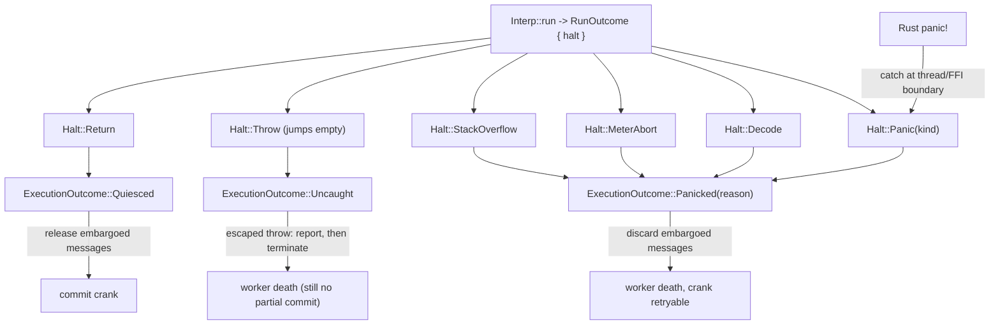
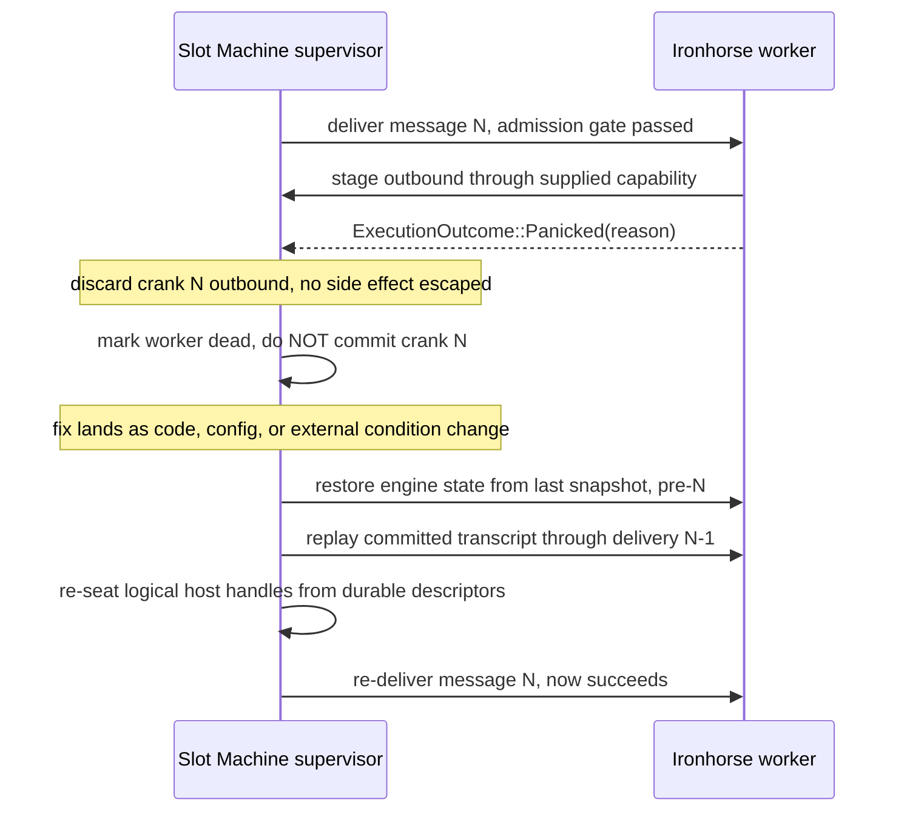

# Ironhorse Panic and the Slot Machine Recovery Boundary

| | |
|---|---|
| **Created** | 2026-08-17 |
| **Updated** | 2026-09-29 |
| **Author** | Kris Kowal (prompted) |
| **Status** | In Progress |

## Status

Surveyed on 2026-09-29 at `llm` commit `1706e63247`.
[Implementation #1150](https://github.com/endojs/endo-but-for-bots/pull/1150)
landed the classifier and live XS FFI panic guard, including worker-owned native
handle tables; transcript, replay, delivery-path outcome consumption, and the
reference-error option remain unimplemented.
The decisions below amend the original eight open questions; they are requirements
for those follow-ons, not claims that the recovery protocol already runs.

This design names, formalizes, and extends the **panic**: an uncatchable,
unrecoverable termination of a vat/worker that no JavaScript `try`/`catch`,
promise handler, or engine recovery path can intercept. Ironhorse substantially
has this already. `Halt::StackOverflow` and `Halt::MeterAbort`
([ironhorse-engine](ironhorse-engine.md) § Interpreter, the `Halt` enum in
`rust/engine/ironhorse-vm/src/interp.rs`) are each documented today as "an abort
to the host, not a catchable `RangeError`," and both descend from XS/xsnap's
`fxAbort` longjmp (a C control-flow jump that unwinds straight to the host frame
past every intervening JavaScript `try`/`catch` without running it, which is what
makes the termination uncatchable rather than merely abrupt). This design gives
the pattern one name, generalizes it over
every uncatchable-termination source, states its relationship to the daemon's
message-delivery model, and adds an opt-in mode (the `panic-on-reference-error`
configuration option, framed as **the Coda** below) that turns selected
reference errors into panics for post-mortem debugging. The snapshot,
transcript, and message embargo are **Slot Machine responsibilities**, not
Ironhorse mechanisms. This design specifies them only to define the contract
that consumes an Ironhorse panic. (A worker hosts exactly
one vat in the current daemon, so "vat" and "worker" are used interchangeably
throughout; the one-database-per-worker isolation claim below rests on that 1:1
relationship.)

**Status and vocabulary (read first).** "The daemon" throughout is the endo
daemon; **Endor** is its Rust runtime that hosts the Ironhorse engine (see
[ironhorse-engine](ironhorse-engine.md) § Endor integration). Ironhorse is
**prospective, not the live delivery-path engine**: the production daemon still
runs C-XS through the `xsnap` crate, and the `-e ironhorse` engine-selection
integration is incomplete (see § Integration dependency). The FFI guard is live; the Coda is still prospective. The `Machine`-seam `ExecutionOutcome`
lands with the Ironhorse integration; Slot Machine consumes that outcome and
independently supplies the per-worker snapshot, transcript, and embargo. Weigh
every claim below against this status.

## Architectural Boundary: Ironhorse and Slot Machine

The boundary is deliberate: **Ironhorse reports how execution ended; Slot
Machine decides what becomes durable and observable.** Ironhorse is the language
engine inside a worker. Slot Machine is the worker-supervision and message layer
around that engine. In the current tree, the latter responsibility spans the
daemon/Endor supervisor and worker transport rather than living wholly in the
`@endo/slots` JavaScript package.

Ironhorse's own execution model is deliberately narrow: it evaluates code and
then runs the event loop until the job queue is empty (it **quiesces**),
reporting how that run ended. It has **no notion of a crank.** The *crank* (one
inbound delivery plus the resulting jobs, taken as the unit of admission,
embargo, commit, and retry) is entirely a **Slot Machine** concept, whose
lifecycle is the metering design's ([daemon-xs-worker-metering](daemon-xs-worker-metering.md)
§ Crank lifecycle). The engine's return value is therefore an
`ExecutionOutcome` (`Quiesced` / `Uncaught` / `Panicked`), a statement about the
run rather than a "crank outcome"; Slot Machine wraps a crank around each
delivery and maps that `ExecutionOutcome` onto its own crank commit-or-discard
decision. Every "crank" in this document names a Slot Machine unit; Ironhorse
only ever evaluates, runs to quiescence, and classifies the result.

| Layer | Owns | Does not own |
|---|---|---|
| **Ironhorse** | Execute a delivery; enforce engine limits; classify ordinary completion, uncaught throws, and every uncatchable termination; normalize the existing `StackOverflow` and `MeterAbort` abort conditions together with new engine faults; return a diagnostic `ExecutionOutcome`; provide the engine primitive from which a snapshot can be taken or restored. | Choosing, persisting, or naming worker snapshots; recording a delivery transcript; deciding when outbound messages become visible; replay policy; durable commit or rollback. |
| **Slot Machine** | Define the worker crank boundary; admit inbound messages; stage outbound messages and host calls; own worker snapshot identities and watermarks; append and replay the per-worker transcript; embargo outbound effects; atomically commit or discard a crank; terminate, restore, and re-drive a worker according to policy. | Interpreting JavaScript control flow; deciding whether a `Halt` is a panic; inspecting Ironhorse's internal `Halt` variants to reconstruct that classification. |

The seam between them is a small protocol:

1. Slot Machine opens a crank and gives Ironhorse transcript-aware inbound,
   outbound, and host-call capabilities. Ironhorse cannot write directly to the
   durable transcript or release a frame to the transport.
2. Ironhorse runs the delivery and returns `ExecutionOutcome::Quiesced`,
   `ExecutionOutcome::Uncaught(throw)`, or `ExecutionOutcome::Panicked(reason)`.
   `Panicked` includes the existing abort conditions; Slot Machine does not need
   a parallel list of `Halt` variants.
3. Slot Machine alone maps `Quiesced` to its durable transcript/snapshot commit.
   It maps every other outcome to discard of the pending crank and embargoed
   effects. A `Panicked` outcome additionally enters Slot Machine's configured
   terminate/restore/replay policy.

For the live C-XS worker, the adapter must map the existing `fxAbort` exits to
the same supervisor-visible `Panicked` arm. That compatibility adapter does not
move panic classification into Slot Machine; it preserves the seam until
Ironhorse is the live engine. Conversely, Ironhorse may expose snapshot and
restore primitives, but Slot Machine owns when snapshots are taken, where they
are stored, which transcript watermark they represent, and whether replay is
safe. Every later reference to "commit," "snapshot," "transcript," "embargo,"
or "retry" is therefore a Slot Machine action unless it explicitly describes an
Ironhorse engine primitive.

## Ownership map

| Boundary | Mechanism | Policy | Durable state | Lifecycle / commit authority | Value crossing |
|---|---|---|---|---|---|
| Engine → worker adapter → Slot Machine | Execute and drain; classify termination | Slot Machine selects commit/discard and survival | Slot Machine owns snapshot identities and transcript; engine supplies heap bytes | Slot Machine restores, replays, commits, or discards | `ExecutionOutcome` plus diagnostic reason |
| Slot Machine → transcript/CAS store | Append, sync, publish snapshot watermark | Supervisor withholds release until durability is proven | Supervisor owns records; store implements persistence | Supervisor reconciles ambiguous commits and stops affected workers | Durable sequence or `TranscriptFault` |
| Slot Machine → host provider / peer | Invoke recorded requests; deliver committed frames | Supervisor admits only supported recovery protocols | Supervisor owns event/handle descriptors; provider owns its resource and dedup state | Supervisor retries by stable key; provider applies idempotently | Request/reply, logical handle, event sequence |

Slot Machine owns persistent worker state, the commit/discard decision, and
restart/replay; the engine and its adapter own execution classification.
A provider's external state is not rolled back by destroying a worker.
Inner mechanisms must not be named for outer lifecycle concepts:
`ExecutionOutcome` describes execution, while transcript commit and
`TranscriptFault` belong to supervision, not to Ironhorse's `PanicKind`.

## What Is the Problem Being Solved?

A **crank** is the processing of one inbound delivery plus all resulting promise
jobs until quiescence ([daemon-xs-worker-metering](daemon-xs-worker-metering.md)
§ Crank lifecycle). A crank that aborts partway through, after it has already
sent some outbound messages but before it finishes, risks **hangover
inconsistency**: the classic partial-failure hazard in which a crank's intended
effects are split, some observed by the outside world and some never applied,
leaving peers with a view the vat never actually reached. The discipline that
avoids it is a tradition going back to the E programming language and the KeyKOS
capability operating system: treat a vat (a single-threaded object heap) as the
unit of partial failure, so a fault takes down a whole vat rather than leaving it
half-updated.

The clean answer is a two-layer contract:

1. **Ironhorse panic:** a panic terminates the vat uncatchably: no in-vat code
   can catch it, suppress it, or continue past it, so the vat cannot half-run to
   a state a handler papered over.
2. **Slot Machine recovery:** a message embargo holds a crank's outbound
   messages until the crank commits, so a panic can **discard** them rather than
   releasing a partial set.
   Together with the host-effect protocol below, these prevent uncommitted
   application messages from escaping and make an eligible crank **retryable**:
   restore the worker from its last snapshot, replay the transcript up to but not including the panicking
   delivery, and re-run the (now fixed) delivery.

Ironhorse already terminates uncatchably on stack overflow, meter refusal, and
other engine limits; the formal classification and caught-Rust-panic path have
landed.
Decode failures are bytecode-integrity faults and must retain that provenance.
Remaining work is the transcript and embargo, host-call and handle recovery,
production outcome consumption, debugger panic handling, and reference-error Coda.

## Scope: What Is Already a Panic (The Required First Step)

Surveying the `Halt` enum (`interp.rs`) against the panic definition distinguishes
panics from ordinary control flow. The table retains the original inventory;
Q1 also names the heap and native-reentry limits added since that inventory.

| `Halt` variant | Uncatchable abort-to-host today? | Panic classification |
|---|---|---|
| `StackOverflow(usize)` | **Yes**: its doc says "an abort to the host, not a catchable `RangeError`, a deterministic, consensus-relevant limit." XS's `fxOverflow` -> `fxAbort(XS_JAVASCRIPT_STACK_OVERFLOW_EXIT)`. | **Already a panic.** Reclassify under the formal concept; no behavior change. |
| `MeterAbort` | **Yes**: the meter host refused more computation; XS's `XS_TOO_MUCH_COMPUTATION_EXIT` via `longjmp`. The metering design already destroys the worker on this. | **Already a panic.** Reclassify; no behavior change. |
| `Throw { value, rendered }` | **No**: this is the JS-level throw. Empty `jumps` means it escapes every JS handler and reaches the host, but it is *catchable in principle* (a `catch` above it intercepts it). | **Not a panic.** It is the ordinary (possibly uncaught) throw. Kept distinct; see § Debugger Interaction. |
| `Decode(DecodeError)` | **Yes**: truncated/invalid bytecode; the loader must not continue. | **Panic.** Preserve the structured decode reason and report bytecode-integrity provenance; do not attribute it to guest behavior or assume a snapshot was involved. |
| `StepLimit(u64)` | **Yes**, on explicitly bounded execution and bounded guest diagnostic rendering; not on default-unbounded `Interp::run`. | **Panic.** Report an execution-bound refusal with its dispatch count and caller context; do not infer that every occurrence came from fuzzing. |
| `Yield`/`Await`/`Return` | **No**: normal control-flow suspension/completion. | **Not panics.** |

Net-new panic sources (no existing `Halt` variant, added by this design):

- **Rust-level logic-bug panic.** A wrong index reaching a kind-checked arena
  accessor `panic!`s the machine thread (an *arena* here is the flat pool of
  fixed-size slots the interpreter allocates its heap objects from; a kind-checked
  accessor `panic!`s rather than returning wrong-typed memory when an index names a
  slot of the wrong kind). [ironhorse-engine](ironhorse-engine.md)
  § Minimizing `unsafe` already states the intended treatment: "a panic is a
  crashed crank, not a compromised daemon," which the supervisor "already treats
  as worker death." This is mechanically different from a `Halt` value (it
  unwinds the Rust thread rather than returning) but is the *same concept* at the
  supervisor boundary. See § The Formal `Panic` Category for the seam that unifies them (a
  *seam* here is the boundary where one component's return value becomes
  another's input or decision: in this design, where the interpreter's `Halt`
  becomes the supervisor's commit/discard decision).
- **Reference-error panic (opt-in).** The Coda's configuration, off by default.

**The live FFI abort guard.** The hazard identified by this design was a Rust
panic crossing an `extern "C"` callback and aborting the shared daemon process.
The guard has landed in #1150: `worker_io.rs` captures the fault, poisons the
worker, prevents subsequent guarded effects, and the XS run loop returns
`XsnapError::Panicked` at a safe Rust boundary.
`inproc.rs` tears down and unregisters that worker; sibling workers survive.
This contains unwinding Rust panics, not arbitrary native aborts.
The transcript must preserve this guard and add its own typed I/O failure channel;
a failed SQLite operation must not be converted to a Rust panic with `unwrap()`.

**Worker-owned power tables.** Catching a panic must not expose torn shared
state or leave the dead worker's native handles alive for the daemon's lifetime.
The filesystem, directory, SQLite connection/statement, and incremental hasher
tables therefore belong to the dedicated worker thread. Thread exit drops these
resources. Handle identifiers remain globally allocated, and a lookup resolves
only against the calling thread's table. This also closes the pre-existing
cross-worker handle lookup gap: the former process-wide tables did not check
ownership even in runs without a panic. Reconstruction after restart remains
separate work in § Slot Machine Termination and Retry. Until those handles can
be reconstructed, a supervised suspend request with open native handles returns
`suspend-error` and leaves the worker running. The caller must close its file,
directory, SQLite, and hasher handles before retrying suspension.

**Limits of the unwind boundary.** `catch_unwind` catches unwinding Rust panics.
It cannot contain native stack overflow, explicit process abort, allocation
abort, or a second panic from a destructor during unwinding. Native recursion
on guest-controlled inputs still needs its own bound; this differs from the
interpreter's emulated `Halt::StackOverflow` limit. The build rejects
`panic = "abort"`. No transactional rollback of host effects already performed
before the fault is provided by this slice.

**Conclusion of the scope step:** Ironhorse's mechanism exists for two of three
natural cases and needs *naming and generalizing*, not building. Its genuinely
new engineering is the formal category (small) and the Coda. Slot Machine's
separate work is the per-worker write-ahead transcript and embargo plus
transcript-aware host calls. The architectural boundary above is the contract
between those work streams.

## The Formal `Panic` Category

The requirement is one concept that answers a single supervisor question at the
crank boundary: *did this delivery terminate the vat uncatchably, so its effects
must be discarded rather than committed?* Three shapes were considered (see
§ Alternatives Considered). The first implementation retained flat diagnostic `Halt` variants and added
classification.
Q8 now requires a payload-preserving structural migration; legacy
spellings below describe the survey baseline, not a second lasting representation:

1. **Keep the informative variants.** `StackOverflow(usize)` carries the slot
   overshoot; `MeterAbort` marks meter refusal; `Decode(DecodeError)` names the
   corruption. Collapsing them into one opaque `Panic` would destroy the
   diagnostics the supervisor and debugger need.
2. **Keep `Decode` and `StepLimit` inside `is_panic()` (Q1).**
   The live predicate already includes both, together with `StackOverflow`,
   `ReentryLimit`, `MeterAbort`, `HeapExhausted`, `EngineInvariant`, and `Panic`.
   The membership is settled, not provisional.
   In `interp/dispatch.rs`, `dispatch_at` returns structured `DecodeError`
   values while fetching instructions, so decode is not confined to loading.
   `StepLimit` also protects bounded execution and guest throw rendering
   (`RENDER_DISPATCH_BUDGET`), so it is not exclusively a fuzz-harness result.
   Preserve the decode payload or dispatch count, plus the adapter's operation
   context (load, execute, diagnostic rendering, or harness) in diagnostics.
   The predicate remains context-free; provenance is a separate report field,
   not a guess that an uncatchable stop is a guest bug.
3. **Preserve `Halt::Panic(PanicKind)` and its diagnostics.** The first landing added `PanicKind::EngineFault` (a caught Rust panic, converted into
   this `Halt` at the thread/FFI boundary so the supervisor sees a value rather
   than a process abort; the live XS guard is surveyed in § Scope: What Is Already a Panic) and
   reserves the follow-on
   `PanicKind::ReferenceError` (the Coda). Extensible. **Each net-new variant
   carries a diagnostic payload, for the same reason item 1 keeps the legacy
   variants' payloads**: collapsing them to payload-free would forfeit exactly the
   supervisor/debugger diagnostics this family is meant to preserve:
   `EngineFault { message: String, location: Option<String> }` captures the
   caught Rust panic's message and (where the panic hook can recover it) its
   file/line, so `EngineFault` is as informative as `StackOverflow(usize)`'s
   overshoot; `ReferenceError { name: Option<String>, site: RaiseSite }` captures
   the offending binding/name (when known) and which raise site fired
   (local temporal-dead-zone (TDZ) read, meaning a read of a `let`/`const` binding in the
   window after it is in scope but before its declaration has run, itself a
   reference error; or variable-lookup, or closure-TDZ read, per the Coda's site
   inventory), so a
   frozen-at-fault snapshot is self-describing rather than requiring the cause to be
   re-derived from the program counter alone. The two "where" fields are
   deliberately spelled differently: `EngineFault.location` is an *optional
   physical source position* (`Option<String>`, a Rust `file:line:col` string the
   panic hook can recover only sometimes), whereas `ReferenceError.site` is a *non-optional
   categorical raise-site* (`RaiseSite`, always exactly one of the finite Coda
   sites). The distinction is a fault's physical origin versus its known-in-advance categorical
   origin, not an accidental naming inconsistency. Neither variant is payload-free.
   The variant is deliberately **not** named `Host`: this document uses "host"
   throughout for the surrounding-runtime call surface (`host_send_frame`,
   `host_call`, § "Host functions are messages too"), so a `PanicKind::Host` would
   read as "a host-function call panicked" rather than "the Rust engine hit an
   internal logic bug." `EngineFault` names *what happened*, not the FFI boundary
   *where the value is observed*.
4. **Surface a three-way `ExecutionOutcome` at the `Machine` seam.** The interpreter
   keeps returning `RunOutcome { halt, .. }`; the `Machine`/supervisor seam
   ([ironhorse-engine](ironhorse-engine.md) § Endor integration) classifies each
   `halt` into `Quiesced` | `Uncaught(throw)` | `Panicked(reason)`. `Quiesced`
   means only that engine execution ran the event loop to quiescence (the job
   queue emptied); it does not claim that Slot Machine has committed anything, nor
   that a Slot Machine crank has closed. Slot Machine's commit
   decision reads only this three-way value; the `reason` carries the underlying
   `Halt` for reporting. **The `Panicked` arm is defined *by delegation*, not by a
   second enumeration:** `ExecutionOutcome::classify(halt)` computes `Panicked(halt)`
   whenever `halt.is_panic()` (item 2) is true, never by re-listing the panic
   variant shapes at the `Machine` seam. The seam also fails closed for
   `NotImplemented`, `Refused`, and unexpected control-state halts: these classify as
   `Panicked` for discard policy even though they are not members of the panic
   category. Thus the outcome is a strict superset of the predicate. This is a binding implementation
   constraint, so the "one place the set is defined" claim in item 2 survives its
   own architecture: adding a new `Halt`/`PanicKind` variant updates `is_panic()`
   alone, and the classifier follows for free instead of drifting as a
   hand-maintained parallel `match`. It is spelled as an associated function
   `ExecutionOutcome::classify` rather than as a free `classify_halt(&halt)` (the
   spelling sibling `Halt`-consuming operations such as `describe_halt` use)
   deliberately: it is the seam's canonical `ExecutionOutcome` constructor, the one
   sanctioned way to build an `ExecutionOutcome` from a `Halt`, so it lives on the
   destination enum to keep that construction path discoverable at the type it
   produces. A reader reaching for `classify_halt` should expect to find the
   constructor on `ExecutionOutcome`.

### Type-enforced classification (Q8)

Adopt the payload-preserving refactor before wiring the production Ironhorse
worker outcome consumer.
The first landing deliberately retained flat variants; the live `Halt` and
`PanicKind` in `interp.rs` still have that representation.
Move *all* members of `is_panic()` under `Halt::Panic(PanicKind)`, including decode,
execution bounds, heap exhaustion, and native reentry bounds, retaining their
structured payloads and stable diagnostic distinctions.
Then `is_panic()` is a shape test, and the classifier matches one panic arm.
Migrate construction sites, test fixtures, and debugger renderers together;
adding only stack and meter variants would leave the same classification hazard.

This alone does not prevent a supervisor from inspecting diagnostics.
Keep the worker adapter as the only classifier and expose its execution outcome,
not a raw `Halt` decision API, to commit/discard code.
The current `ExecutionOutcome::Panicked(Halt)` also contains non-panic stops
(`NotImplemented`, `Refused`, and a fail-closed fallback); preserve that fail-closed
behavior during migration and distinguish these reasons in diagnostics.
Do not pretend that every value in that arm is a `PanicKind`.
Use exhaustive internal matches and classification tests for the adapter; an
external `#[non_exhaustive]` wildcard is not type-enforced completeness.
No unimplemented custom Clippy lint is a prerequisite of this refactor.

```mermaid
graph TD
    RUN["Interp::run -> RunOutcome { halt }"]
    RUN --> RET["Halt::Return"]
    RUN --> THR["Halt::Throw (jumps empty)"]
    RUN --> SO["Halt::StackOverflow"]
    RUN --> MA["Halt::MeterAbort"]
    RUN --> DEC["Halt::Decode"]
    RUN --> PAN["Halt::Panic(kind)"]
    RUST["Rust panic!"] -->|catch at thread/FFI boundary| PAN
    RET --> C["ExecutionOutcome::Quiesced"]
    THR --> U["ExecutionOutcome::Uncaught"]
    SO --> P["ExecutionOutcome::Panicked(reason)"]
    MA --> P
    DEC --> P
    PAN --> P
    C -->|release embargoed messages| COMMIT["commit crank"]
    U -->|escaped throw: report, then terminate| U2["worker death (still no partial commit)"]
    P -->|discard embargoed messages| DISCARD["worker death, crank retryable"]
```

Note the seam that surfaces `ExecutionOutcome` is **prospective**: today
`ironhorse-vm`'s `Halt` is consumed by the oracle/fuzz harnesses and by direct
`Machine::evaluate`/`eval` callers (rendered by `describe_halt` into
`EvalOutcome` in `rust/endo/src/ironhorse_engine.rs`), while the production daemon
still runs C-XS through the `xsnap` crate. The panic-to-supervisor surfacing rides
on the incomplete delivery integration (§ Integration dependency).
The `ExecutionOutcome` type and classifier have landed; their production worker
consumer has not.

## The Slot Machine Message Embargo Contract

This is the part that must be grounded in the daemon's *real* current behavior,
because the daemon deliberately chose a mechanism **different from** the one the
naive reading of "embargo" would reinvent.

### What the daemon does today: admission control, not embargo

[daemon-xs-worker-metering](daemon-xs-worker-metering.md) (status **Complete**)
§ "Admission Control Eliminates Embargo" records an explicit maintainer decision.
An earlier revision proposed embargoing outbound messages per crank and
discarding them on abort; it was **rejected as too complex** (buffering in the
bridge layer, crank-boundary delimiters, reasoning about partial effects). The
shipped model instead **pre-pays the worst case**: the supervisor delivers a
message only when the worker's remaining budget exceeds the full per-crank hard
limit, so any crank that completes normally is already fully paid for and never
needs rollback. The design states the consequence in one line: **"No embargo, no
rollback, no buffering of outbound messages."** The single partial-effect case
it acknowledges is hard-limit `MeterAbort` termination, and its answer is that
this "destroys the worker anyway."

So the literal "message embargo" of this design's premise is, for the
**meter-exhaustion** case, *already handled* by a different and simpler
mechanism. A design that asserted a fresh per-crank embargo-and-discard buffer
would re-introduce exactly what the maintainer removed.

### Where admission control does not reach, and what the survey found

Admission control eliminates the *meter-exhaustion* partial-effect case, and
only that case, because pre-payment is about **budget**. It does nothing for a
panic that aborts a well-budgeted crank partway through:

- `StackOverflow` fires on a crank with ample budget.
- A Rust logic-bug panic fires regardless of budget.
- The Coda's reference-error panic fires regardless of budget.

For these, the hangover question turns entirely on **whether outbound messages
have already left the vat when the panic fires.** A survey of the live crank
path (the XS worker in `rust/endo/xsnap/src/lib.rs`, whose main loop carries
literal `// ---- Crank start ----` / `// ---- Crank end ----` markers) settles
it, and the answer is the *unfavorable* one:

- **There is no per-crank commit point.** The only thing that crosses the
  crank-end boundary is `send_meter_report`; nothing snapshots, journals, or
  commits per delivery.
- **Outbound messages leave immediately, mid-crank.** When guest JS sends out,
  it calls the host functions `host_send_frame` (`sendFrame`),
  `host_issue_command` (`issueCommand`), or `host_send_raw_frame`
  (`sendRawFrame`) in `worker_io.rs`, each of which calls
  `WorkerTransport::send_frame`/`send_raw_frame` **synchronously, writing straight
  to the pipe/channel**. There is no queue and no hold-until-crank-end. Only
  *debug* output is batched (`flush_debug_outbound`), not message traffic.
- **A meter-aborted or crashed worker just dies and is unregistered.** The abort
  path (`metering_callback` -> `XS_TOO_MUCH_COMPUTATION_EXIT`, caught in
  `run_promise_jobs_metered`, reported as `send_meter_report(steps,
  "terminated")`) leads the supervisor's `process_meter_report` to `unregister`
  the worker. **Its already-sent messages stay sent.** There is no rollback and
  no auto-restart.

So the premise's "implicit embargo" does **not** exist today. Even `MeterAbort`,
which the metering design calls the one partial-effect case, leaks its
already-sent messages; the metering design tolerates that only because it treats
a hard-limit abort as a non-retryable runaway (an infinite loop) whose
consistency nobody cares about. The moment a panic is meant to be **fixed and
retried**, those escaped messages become exactly the hangover inconsistency the
embargo exists to prevent, and admission control gives nothing here.

### Slot Machine per-worker write-ahead transcript

The transcript is required for snapshot-relative recovery, not merely for
buffering until quiescence.
The current XS pump interleaves inbound envelopes and sends directly through
`worker_io`; its crank-end meter report is not a durable commit point.
The integration must introduce one before claiming safe replay.

Slot Machine assigns each Endor worker (a worker running under Endor, the endo
daemon's Rust runtime that hosts the Ironhorse engine; see
[ironhorse-engine](ironhorse-engine.md) § Endor integration) its own
`<endo-dir>/workers/<handle>/transcript.sqlite`, opened in WAL mode. A database
per worker avoids a global writer lock between vats and confines corruption and
recovery to one vat. The database contains four logical records (the physical
schema may normalize payloads into side tables):

| Record | Durable content |
|---|---|
| `snapshot` | Snapshot identity, engine/callback-table signature, the `panic-on-reference-error` setting in force (§ Coda, pinned so a resume-for-replay cannot diverge from the run that produced the transcript), and the last committed transcript sequence represented by the snapshot. |
| `crank` | Monotonic crank id, inbound-delivery sequence, starting snapshot epoch, and `started` / `committed` / `aborted` state. |
| `event` | Ordered inbound messages, outbound messages, host-call requests, and host-call replies. Every event has a crank id and sequence number; outbound and host-effect events also have a stable idempotency key. |
| `host_handle` | Logical handle id, the host-call event that created it, a durable reconstruction descriptor, and a **query-only** open/closed cache. The guest heap stores the logical id, never an OS file descriptor or native pointer. |

**The event log is authoritative for handle state; the `open/closed` field is a
derived cache the log always overrides.** A handle's open/closed status is a fold
over its `event` stream (the creating host call opens it; a later `close` event
closes it), so it is not an independent fact and must not be maintained by a
second, separately-committed write. The `host_handle.open/closed` field exists
only to answer "is this handle open?" without rescanning the log on every query;
it is refreshed in the *same* transaction that appends the state-changing event
(never in a second transaction), and on any disagreement (including recovery
after a crash between two writes) replay recomputes it from the event stream and
overwrites the cache. There is therefore no torn-write window in which the field
and the log can durably disagree: a crash before the shared commit loses both the
event and the cache update together; after it, both are present. An
implementation that would rather not carry the cache at all may drop the field
and compute open/closed on read: the design treats the field as an optimization,
not a source of truth.

The Slot Machine worker supervisor is the only writer. Its crank protocol is:

1. In one short transaction, append the inbound delivery and a `started` crank
   row, then sync the WAL before entering the guest. The inbound message is
   therefore recoverable even if the worker process dies immediately.
2. Route `sendFrame`, `issueCommand`, and `sendRawFrame` into pending `event`
   rows instead of the transport. Route transcript-aware host functions through
   the same event writer, durably recording a request before invoking its host
   adapter and its reply afterward. Nothing outside the vat observes pending
   outbound rows.
3. On `ExecutionOutcome::Quiesced`, mark every pending event and the crank committed
   in one transaction. Only after that transaction is durable may the supervisor
   release outbound messages, in sequence order. Each released frame carries its
   stable event sequence so the receiver can discard a duplicate if the
   supervisor crashes after send but before recording the acknowledgement.
4. On `ExecutionOutcome::Panicked` or `ExecutionOutcome::Uncaught`, discard the staged
   outbound payloads, close tentative native handles, and mark every event and
   the crank aborted. The original inbound row remains available for diagnosis
   and an explicit retry, but none of the crank's outbound effects become
   releasable.

The synchronous `send_frame` methods in `worker_io.rs` are the existing
chokepoint to replace with step 2. The XS main loop needs the one-delivery
admission discipline from #989 before its crank markers can delimit this protocol;
today the reactive pump admits further unrelated deliveries inside those markers.

The durability invariant is that **a published snapshot never covers an
uncommitted transcript suffix, and every committed suffix after that snapshot
remains available for replay until a newer snapshot is durably published**.
This is a prerequisite for retry; host-effect safety is required as well.
The two backends need different commit mechanisms:

### Backend selection and snapshot ordering (Q3)

**Integrate XS/CAS first.** In `xsnap/src/lib.rs`, `handle_suspend` calls
`Machine::suspend_to_cas`; `write_snapshot_to_file` flushes and `sync_all`s the
file, and `suspend_to_cas` renames it to its hash.
`Supervisor::mark_suspended` records the identity in supervisor state.
This is a suspend operation, not a per-delivery durable heap commit.
It also refuses suspension while native handles remain open.
The first transcript integration must supply the durable snapshot/watermark
record and the host-handle reconstruction contract below; existing suspension
alone is insufficient.

Commit the transcript first; write and sync a quiescent CAS snapshot, rename it,
**sync the containing directory**, then durably publish its hash and exact
committed sequence in the transcript's snapshot record.
The current `suspend_to_cas` does not sync that directory: add that step before
claiming power-loss durability.
Only after publication may compaction remove the covered prefix.
A crash before publication leaves the older snapshot and a retained replay suffix;
an orphan newer blob is safe to reclaim later.
An initial durable snapshot must exist before the first retryable delivery.
A missing or corrupt published blob is a storage fault, not permission to replay
from an arbitrary snapshot.

`PersistentMachine` already implements heap persistence, but `run_worker` still
returns `MachineError::Unavailable` for the envelope protocol.
The SQLite implementation (`rust/endo/ironhorse-store-sqlite/src/lib.rs`,
`SqliteHeapStore::open` and `commit_verified`) uses WAL and `synchronous=FULL`.
It does not yet join transcript commits.
Do **not** make `ATTACH` mandatory later: SQLite's
[ATTACH documentation, §2](https://www.sqlite.org/lang_attach.html) explicitly
excludes WAL from cross-database crash atomicity.
For a store-backed worker, require a proven shared durability boundary: one
physical database transaction, or an explicit recovery protocol with durable
prepare records, a commit decision, and restart handling of every in-doubt pair.
A two-phase label or an `ATTACH` statement is not that protocol.
An ATTACH-based alternative needs a separately justified journal-mode change and
crash tests; it cannot inherit the WAL guarantee stated here.

WAL checkpointing is lifecycle maintenance, not the logical crank commit.

### Single-vat durability cost (Q7)

Use WAL with `synchronous=FULL` for the first durable integration.
Batch ordinary outbound events in the final commit; do not fsync each frame.
This bounds the *release commit* to one transaction per successful crank, not the
whole crank to one fsync: step 1 durably records admission, and step 2 requires
additional request/reply durability boundaries around restart-sensitive host calls.
A useful accounting model is `admission + host-call barriers + release commit`,
with snapshot publication and WAL checkpoints measured separately.
Actual sync counts depend on SQLite and the filesystem and must be instrumented.
Bound admitted event bytes and host-call count per crank and apply backpressure
before exceeding those limits; fsync latency itself has no portable upper bound.

A single sequential vat has no guaranteed group-commit amortization.
Do not delay its own commits to accumulate speculative later cranks in this first
implementation: that needs a separate rollback and input-admission protocol.
Cross-file coalescing is likewise an optional measured optimization.
Do not switch to `NORMAL` while releasing effects after COMMIT: SQLite's
[synchronous documentation](https://www.sqlite.org/pragma.html#pragma_synchronous)
permits loss of recent WAL transactions after power failure in that mode, which
could forget already-released effects and idempotency records.

The performance leg must report one-vat throughput and p50/p95/p99 release latency,
actual syncs per delivery, and host-call/snapshot overhead on named storage, for
zero-host-call and host-call-heavy workloads, alongside multi-vat results.
Keep correctness independent of an unmeasured throughput claim.
The deployment SLO is the remaining maintainer decision in Open Questions.

This contract supplements admission control where it is insufficient. Pre-payment remains the quota gate. The transcript and embargo
cover stack overflow, host failure, Rust panic, reference-error panic, and
restart, none of which pre-payment makes atomic.

**Which termination paths the embargo includes.** Because step 2 routes *every*
`sendFrame`/`issueCommand`/`sendRawFrame` into pending rows with no per-source
carve-out, and step 4 discards those rows on *any* non-`Quiesced` outcome, the
embargo's coverage follows mechanically from `ExecutionOutcome`, not from the panic
source. The design commits to one answer, tabulated so no reader has to
reconcile it from scattered prose:

| Termination path | `ExecutionOutcome` | Outbound embargoed & discarded on abort? |
|---|---|---|
| Normal quiescence | `Quiesced` | N/A (released after Slot Machine commits) |
| `Throw` (uncaught) | `Uncaught` | **Yes**, discarded (worker still dies; no partial commit) |
| `StackOverflow` | `Panicked` | **Yes** |
| `MeterAbort` (hard limit) | `Panicked` | **Yes** |
| Rust `EngineFault` | `Panicked` | **Yes** |
| `ReferenceError` (Coda) | `Panicked` | **Yes** |
| `Decode` / `StepLimit` | `Panicked` | **Yes** |

**Embargo coverage is uniform; retryability is not. Do not read the two as the
same column.** The single "Yes, discarded" verdict this table gives every
non-`Quiesced` row is a statement about *embargo coverage only*: the crank's
staged outbound rows are discarded, so no outcome leaks a partial effect. It says
nothing about whether the crank is ever **re-driven**. Retry (restore the
snapshot, replay the committed suffix, re-deliver) is reserved for **panics**; an
uncaught `Throw` has its outbound discarded and its worker torn down, but it is
**not** placed on the restore-and-replay path. This is why three artifacts in this
document treat `Throw` differently on purpose, and they do not actually disagree
once the two axes are separated:

- the mermaid in § The Formal `Panic` Category routes `Uncaught` to `worker death
  (still no partial commit)` and only `Panicked` to `worker death, crank
  retryable` (the *retryability* axis);
- this table folds `Throw (uncaught)` into "Yes, discarded" alongside the panic
  rows (the *embargo-coverage* axis, on which they genuinely are identical);
- § Slot Machine Termination and Retry's recovery diagram and § What "fixed"
  means in practice
  are deliberately panic-scoped, because they describe the retry axis, on which
  `Throw` has no entry.

Read the "discarded" column as *hangover prevention*, orthogonal to whether the
crank is re-driven.

### Uncaught throws versus rejected deliveries (Q5)

A CapTP application rejection is a normally completed delivery, not
`ExecutionOutcome::Uncaught`.
In `packages/captp/src/captp.js`, `CTP_CALL` attaches fulfillment and rejection
handlers and `processResult` encodes the rejected return.
Commit that response with the ordinary batch and continue the worker.
`packages/daemon/src/worker.js` also reports `unhandledRejection` as a trace,
without terminating the worker.
Neither a rejected result nor an unwatched promise proves that execution aborted.

The live XS `dispatch_envelope` wraps `handleCommand` in a JS `try/catch`, traces
an error, and returns `EnvelopeAction::Continue` through `handle_envelope`.
Thus existing behavior for an error caught by that wrapper is report-and-continue,
not the teardown originally implied by this design's diagram.
For the new recovery contract, **a throw escaping the delivery adapter itself**
terminates the incarnation and discards the pending batch, without automatic
redelivery; that is a deliberate change to the XS wrapper, not a description of
current behavior.
Continuing after discarding its sends would preserve heap mutations whose
corresponding messages were removed.
The adapter must return a distinct failure signal instead of swallowing that
throw; ordinary CapTP rejections remain handled before this boundary.
Termination does not undo host effects already performed: retry still requires
the host-effect protocol below, and a non-replayable effect still blocks retry.

**`MeterAbort` is explicitly *included*.** This resolves an apparent tension with
the metering design, which "tolerates" a hard-limit abort's already-sent messages
as a leak "nobody cares about." That tolerance was a property of the
admission-control-*only* world, where **no embargo existed**: with no buffer,
`MeterAbort`'s mid-crank sends had already hit the wire and could not be recalled,
so the metering design rationally declined to build a recall mechanism for a
runaway it treats as non-retryable anyway. Once this transcript exists, those
sends are *pending rows*, not wire traffic, so discarding them is free and
uniform: there is no reason to special-case `MeterAbort` back out of the embargo
and reintroduce a leak the mechanism now trivially prevents. Folding `MeterAbort`
in **strengthens** the metering design's guarantee (leaked-messages become
no-leak) without contradicting its "terminate, don't auto-retry" stance: whether
a `MeterAbort` crank is *retried* is still the metering design's call
(§ What "fixed" means in practice), and the default
remains "treat as a runaway, don't retry." The embargo only guarantees that *if*
it is retried after a config change, it retries against a clean snapshot with no
escaped effects, which is exactly what the `MeterAbort` row in § What "fixed"
means in practice already assumes.

### Meter exhaustion (Q2)

Keep terminate, not pause-and-refill, for `MeterAbort`.
The XS run loop sends `meter-report(terminated)` and exits on a metering abort;
[daemon-xs-worker-metering](daemon-xs-worker-metering.md) § Hard limit as
termination, not pause specifies the same policy.
Budget shortage before admission queues the delivery until refill; refusal after
execution begins destroys the worker regardless of whether the computation was
useful or runaway.
The survey provides no resumable continuation contract after such an abort.
An operator may explicitly restore/retry after changing the limit, subject to
replay and effect safety; replenishing quota never resumes a half-run machine.

### Transcript storage failures (Q6)

Report a supervisor-owned `TranscriptFault`, outside Ironhorse's `PanicKind`.
The writer owns the failed durability operation, not the engine.
Keep worker identity, crank/sequence, operation, SQLite primary/extended error,
and whether the commit outcome is known in the diagnostic.
On a write, sync, or ambiguous commit failure, poison that worker's pending crank,
stop its admission and effect release, and require recovery before serving again.
Do not require an `aborted` row to succeed on the failed store; durable `started`
without a proven commit is sufficient for recovery to withhold output.
Do not invoke a host effect if its required request record failed to become durable.

The nearby `StoreError::classify` maps `Io` to `StoreFailure::Transient` but
explicitly says that it cannot distinguish permanent medium failure and requires
bounded retries; `MachineError::Poisoned` handles failed rewind separately.
That supports bounded storage-operation retry only when transaction state is
known, not automatic re-execution of guest work after ambiguous COMMIT.
Reopen and reconcile the last proven durable state before an operator-authorized
retry; persistent failures leave the worker unavailable.
This is not a snapshot barrier, since the failed substrate cannot certify one.
Do not fail-stop healthy sibling workers merely because they share a daemon.
A daemon-wide store failure stops all affected admissions; daemon fail-stop is
reserved for inability to isolate failure or trust shared supervisor state.

### Host functions are messages too

An XS snapshot preserves callback-table positions but not the native resources
behind callbacks: file descriptors, directory streams, sockets, timers, and
database cursors die with the worker incarnation. Consequently every host
function that reads nondeterministic state, performs an effect, or returns an
open handle participates in the transcript exactly like a vat message.

The callback registry gives every host function one of **five classifications**,
and the bullets below are instances of this already-named scheme, not ad-hoc
terms: **`pure`** (deterministic, no effect, no event needed); **`read`** (reads
nondeterministic state, recorded so replay returns the recorded value);
**`transactional`** (a local effect that joins the worker's SQLite crank commit);
**`outbound`** (a non-transactional external effect, recorded as an outbound
message and invoked only after commit); and **`barrier`** (a callback that cannot
be made replay-safe and forces a snapshot barrier, stopping recovery for operator
intervention). The first four name what the callback *itself does* (no effect /
reads nondeterministic state / local effect / external effect), so a callback
author self-classifies against them by asking "what does my function do?".
`barrier` is not a peer on that axis: it is the **elimination case**, the
classification a callback gets precisely when none of the other four can be made
to apply and it cannot be made replay-safe, describing what the recovery
machinery must then do (stop for intervention) rather than a positive property of
the callback. Read it as the fallback, not as a fifth behavior to test for.
Startup rejects an unclassified callback for a retryable worker. With that
vocabulary fixed:

- A canonical request, crank id, call sequence, and idempotency key are appended
  before invocation. A read-only or tentative-local adapter may run during the
  crank; its canonical reply or failure is appended before returning to the
  guest. Replay checks the request byte-for-byte and returns the recorded reply
  instead of invoking the adapter again.
- A handle-producing reply returns a logical `host_handle` id. Its durable
  descriptor records enough authority and position to reconstruct the native
  resource (for example, a file capability plus offset and open flags). On
  restart the host re-seats that logical id before replay reaches its first use.
  Every subsequent operation on the handle is another request/reply event, so
  reads, writes, seeks, closes, and errors replay in the original order.
- A transactional local effect joins the worker SQLite crank commit. A
  non-transactional external effect cannot run synchronously inside the crank:
  the host records it as an outbound message and invokes it only after commit,
  using the event id as the provider's idempotency key. Any reply returns as a
  later inbound message and therefore starts another crank. Idempotency closes
  the crash-after-commit/send-before-ack window; it does not make an effect from
  an aborted crank acceptable.
- A non-transactional provider without idempotency is not admissible to a
  retryable vat. Its adapter must either gain an idempotency protocol, or declare
  a snapshot barrier, which makes panic recovery stop for operator intervention.
- A resource with no reconstruction descriptor (an unresumable live socket is
  the canonical example) cannot masquerade as restored. Its handle is re-seated
  as broken, and replay/retry remains stopped until the adapter supplies a
  replacement under the same logical id or the application handles a new
  delivery that reports the loss.

Because every callback carries one of the five classifications above and startup
rejects an unclassified one, the restart rule is **auditable**: enforced by the
registry rather than relying on each callback author to remember that native
handles do not survive a vat restart.

## Slot Machine Termination and Retry

Slot Machine retry composes the existing suspend-to-snapshot /
resume-from-snapshot machinery of
[daemon-debug-worker-restart](daemon-debug-worker-restart.md) with its new
per-worker transcript. Snapshot restore supplies the checkpoint; transcript
replay supplies every committed crank after it. Ironhorse participates only by
restoring its engine state and executing the replayed deliveries; it neither
selects the checkpoint nor reads the transcript.

Sequence from panic to recovery:

```mermaid
sequenceDiagram
    participant SM as Slot Machine supervisor
    participant IH as Ironhorse worker
    SM->>IH: deliver message N, admission gate passed
    IH->>SM: stage outbound through supplied capability
    IH-->>SM: ExecutionOutcome::Panicked(reason)
    Note over SM: discard crank N outbound, no side effect escaped
    SM->>SM: mark worker dead, do NOT commit crank N
    Note over SM: fix lands as code, config, or external condition change
    SM->>IH: restore engine state from last snapshot, pre-N
    SM->>IH: replay committed transcript through delivery N-1
    SM->>SM: re-seat logical host handles from durable descriptors
    SM->>IH: re-deliver message N, now succeeds
```

During replay, the supervisor delivers only committed inbound events after the
snapshot watermark. Outbound sends and host calls must match the next recorded
event; the supervisor suppresses recorded outbound sends and returns recorded
host replies. A kind, payload, order, or handle-id mismatch is a deterministic
replay fault and stops recovery. When replay reaches the end of the committed
suffix, the machine is at the state immediately before the aborted delivery.
The supervisor then exits replay mode and may retry that pending delivery after
the named fix is present.

The current daemon has only coarse snapshot suspend/resume: `handle_suspend` ->
`Machine::suspend_to_cas` and `handle_resume` -> `resume_shared` /
`resume_process`. Implementing the Slot Machine transcript adds the required
suffix-replay loop and periodic snapshot policy to that path. A successful
snapshot records its committed-event watermark before older events are
compacted. Events for open logical handles remain reachable through
`host_handle` reconstruction records even when the crank events that created
them fall below the snapshot watermark.

A second gap the survey surfaced: today the XS `XS_TOO_MUCH_COMPUTATION_EXIT`
path and `ironhorse-vm`'s `Halt::MeterAbort` are **two separate, unjoined
mechanisms**. `ironhorse-vm`'s `Halt` values reach only direct
`Machine::evaluate`/`eval` callers (rendered by `describe_halt` into
`EvalOutcome` in `rust/endo/src/ironhorse_engine.rs`); they do not reach the
supervisor, because `ironhorse_engine` is not on the delivery path. The
`ExecutionOutcome` seam (§ The Formal `Panic` Category) is where the two are joined: it is the
point at which an Ironhorse `Halt::Panic` becomes the same supervisor-visible
worker-death that the XS `"terminated"` meter report is today.

### What "fixed" means in practice

"Fix and retry" is not one thing; the panic source determines it:

| Panic source | What "fixed" is | Can the same snapshot be retried unmodified? |
|---|---|---|
| Reference error / application logic bug | A **code change** to the guest bundle, producing a new snapshot/build. | No. The same bundle deterministically re-panics. |
| Rust engine logic-bug panic | An **engine fix** (new Ironhorse build). | No. Same engine deterministically re-panics until fixed. |
| `MeterAbort` (hard limit) | Usually a **config change** (raise the quota) or a code change (the crank was genuinely too expensive / looping). | **Yes, if config**: after a quota raise, re-delivering N against the same snapshot can succeed. The metering design treats hard-limit abort as a probable infinite loop, so this is the rarer path. |
| `StackOverflow` | A **code change** (bound the recursion), new snapshot. Or, if the depth was input-driven, an **external-condition change** (different input on re-drive). | **Sometimes**: unmodified retry helps only when the triggering input differs on re-delivery; identical input re-overflows deterministically. |

So the three modes the premise anticipates all occur: new-snapshot fixes
(application/engine bugs), config-change retries of the same snapshot
(`MeterAbort` after a quota raise), and external-condition retries of the same
snapshot (input-dependent overflow). The panic contract is the same in every
case; only the fix differs.

## Debugger Interaction

A panic must be **distinguishable from an ordinary uncaught throw** in the
debugger's model, so the recovery-and-uncaught classifier
([ironhorse-debugger-recovery-and-uncaught](ironhorse-debugger-recovery-and-uncaught.md))
is not left to guess.

### Panic is not an uncaught throw

The two are categorically different, and Ironhorse already encodes the
difference structurally:

- An **uncaught throw** is `Halt::Throw` with `self.jumps.is_empty()` (the
  recovery-and-uncaught design's exact predicate). It is uncaught *by
  circumstance* (no `catch` happened to be above it); had a `catch` been present,
  it would have been caught. The debugger reports it as an **exception**, and the
  `uncaughtExceptions` pseudo-breakpoint with the `caught="0"` classification
  (that design's § Protocol) is precisely about it.
- A **panic** is uncatchable *by category*. It never consults `jumps` at all;
  even a `catch` directly enclosing the panic site cannot intercept it. It is not
  a throw and must not flow through the exception-break classifier.

Therefore a panic needs its **own break reason and wire message**, distinct from
`<break ... caught="...">`. The design **decides for a distinct
`<panic kind="stack-overflow|meter-abort|engine-fault|reference-error" .../>`
element**, not a `reason="panic"` attribute on `<break>`. The reason is the same
one § Alternatives Considered uses to reject an attribute-based *exception* mode:
the xsbug parser discards unknown attributes byte by byte, so a
`reason="panic"` attribute would silently degrade to a plain `<break>` on any
consumer that has not been taught the attribute (a panic misread as an ordinary
break), whereas a new element degrades to a visibly-unrecognized message that a
consumer cannot mistake for a break. Choosing the attribute here after rejecting
it there would be inconsistent; the same failure mode applies. The `<panic>`
echo is reported on the always-fatal path and is never gated by
`setExceptionBreakMode`. The exception-break modes (`none`, `uncaught`, `all`)
govern **throws**; they say nothing about panics, and a panic must surface even
under `setExceptionBreakMode('none')`.

### Should a panic be debuggable? Yes: stop the world at the panic site

When a debugger is attached, a panic should **stop the world at the panic site**
rather than tearing the worker down immediately. This is the whole diagnostic
value: the machine is frozen with the program counter pointing at the fault,
before the worker-death teardown discards it. The interaction with
`setExceptionBreakMode` is **orthogonal**. Panic-break is its own control, not a
fourth exception mode. Concretely:

- **No debugger attached:** a panic tears the worker down immediately per
  § Slot Machine Termination and Retry (discard, die, retry).
- **Debugger attached:** the panic hook stops the machine at the panic site and
  emits the `<panic>` wire message; the developer can inspect frames and take a
  snapshot (a snapshot here captures the machine *at the fault*, which is exactly
  what the Coda exploits). Releasing the debugger then proceeds to the normal
  teardown; the crank is still discarded, never committed.
- This reuses the same single dormant branch the stepping and throw hooks already
  established (the recovery-and-uncaught design's § Cost when disarmed); a panic
  is far rarer than a `line` opcode, so the disarmed cost is nil and the armed
  cost is one hook call on the dying path.

## Coda: An Option to Panic on Reference Errors

This design proposes one Ironhorse configuration option, off by default, under
which selected engine-raised reference errors panic before guest unwinding.
The live source has moved into `rust/engine/ironhorse-vm/src/interp/dispatch.rs`:
`GET_LOCAL` and `GET_CLOSURE` now both construct an error and call `raise_js`;
`GET_VARIABLE`/`GET_THIS_VARIABLE` delegate to `dispatch_get_variable`.
The former closure-TDZ uncaught-abort gap is already fixed; it is not deferred to
this option.
The initial inventory covers local TDZ, closure TDZ, and unresolved-name reads.
The Coda build must audit the current binding helpers as well as dispatch opcodes,
record each supported raise-site category, and test the option before converting
the error to a throw or rejection.
Do not intercept arbitrary user throws by inspecting their string or `name`.
Each selected site produces `PanicKind::ReferenceError { name, site }` under the
option and retains normal catchable semantics when it is off.

**Motivation.** A heap snapshot taken at the panic captures the machine with the
program counter pointing **directly at the error**, before any unwind, `catch`,
or promise-rejection handler has run to obscure the fault site, even when a
`catch` or rejection handler *would* otherwise have intercepted the error and
continued past it. That is the diagnostic trade: normal catchable-`ReferenceError`
semantics are given up in exchange for the ability to freeze and inspect the
exact moment of failure. It is a debugging build/config, never the default.

### Interaction with the debugger design's engine-raise-unwind prerequisite

[ironhorse-debugger-recovery-and-uncaught](ironhorse-debugger-recovery-and-uncaught.md)
§ Prerequisite requires the **opposite** direction for these same sites: to make
break-on-uncaught work, engine-raised errors (including "undefined variable")
must **unwind through the jump chain as catchable throws** rather than returning
an inline `Halt::Throw(...)`. The surveyed local/closure TDZ and variable lookup paths already use the guest
raise machinery; the Coda selects panic before that machinery unwinds.
These are two settings at the same engine-raised error boundary:

- **Normal build/config (default):** the reference-error sites call `raise_js(..)`,
  which unwinds through `jumps` and is catchable. This satisfies the debugger
  design's uncaught-mode prerequisite unchanged.
- **panic-on-reference-error (opt-in):** the reference-error sites return
  `Halt::Panic(PanicKind::ReferenceError)` and never consult `jumps`. The error
  never becomes a throw at all, so the uncaught classifier never sees it (it is
  not in the throw population), and no `catch` can intercept it.

Because the switch lives **at the raise helper**, adding the Coda does not
perturb emitted bytecode and so does not threaten the port's byte-identity
acceptance bar (the same reason the debugger design preferred a target-opcode
peek over a `flag == 2` compiler change).

### Where the switch lives, and both-active behavior

- **Location: a `Machine` construction option** (a field set at machine
  create/resume), not a build feature and not a per-call flag. Rationale: a build
  feature is too coarse (it would flip the whole fleet, and the reference-error
  panic is a per-worker diagnostic choice), while a per-worker construction
  option mirrors how debug is enabled per worker
  ([daemon-debug-worker-restart](daemon-debug-worker-restart.md)'s `debug-flag`
  set before resume). A `raise` seam reads the option once per raise.
- **Pinned across a worker's snapshot->replay lineage.** Although the option is
  set at machine create/resume, its value is **recorded into the `snapshot`
  transcript record** (§ Slot Machine per-worker write-ahead transcript) and
  checked on every
  resume-for-replay exactly as the engine/callback-table signature is. This is
  load-bearing for the crash-consistency invariant, because replay re-executes
  the committed guest bytecode through these same raise sites: a site that
  *panicked* under the flag during the original run must panic identically during
  replay, and one that *threw-and-was-caught* with the flag off must re-throw
  identically. Otherwise a caught `ReferenceError` whose only effect was an
  in-heap local computation (never reaching an outbound send or host call, and
  therefore invisible to the kind/payload/order/handle mismatch detector,
  § Slot Machine Termination and Retry) would silently replay to a *different*
  heap state
  than the one the committed transcript was produced against. The supervisor
  therefore **refuses to resume a worker for replay with a
  `panic-on-reference-error` setting different from the run that produced its
  committed transcript** (a mismatch against the pinned `snapshot` value is a
  deterministic replay fault, like the engine-signature check). Toggling the flag
  to debug a live panic starts a **new lineage** (a fresh snapshot whose
  transcript records the new setting), never a divergent replay of an existing
  one. The pinning shape generalizes: `panic-on-reference-error` is the *first*
  member of a **replay-relevant `Machine`-construction config fingerprint**, since
  the justification (any construction option that changes what a raise site does,
  and so what replay must reproduce, has to match between record and replay)
  applies to every future such option, not to reference-error handling
  specifically. The implementation should carry the pin as one such fingerprint
  field in `snapshot` (of which this flag is the first entry) plus one
  resume-time mismatch check over the whole fingerprint, so a second
  replay-relevant option falls out of the same mechanism rather than needing its
  own bespoke pin-and-check plumbing bolted onto `snapshot` under later
  schema-migration pressure.
- **Both an attached debugger and panic-on-reference-error active at once:** the
  reference-error site takes the panic path (it is not a throw), so it stops the
  world at the fault site via the panic hook (§ Debugger Interaction), *not* via
  the exception-break classifier. This is strictly the intended behavior: the
  developer wants to freeze at the exact reference-error PC before any unwind,
  and the panic path delivers exactly that. The `uncaughtExceptions`
  pseudo-breakpoint is inert for these errors while the option is on, because
  they are no longer throws. Turn the option off and the same errors revert to
  catchable throws that the uncaught classifier sees normally.

## Verification

The transcript's **load-bearing crash-consistency invariant** (*a committed heap
epoch can never name an uncommitted transcript suffix, or vice versa*,
§ Slot Machine per-worker write-ahead transcript) is a correctness property,
not a
performance one, and the design owes a test strategy for it in the shape its
SQLite-backed sibling designs already set (for example,
[ironhorse-snapshot-store-seam](ironhorse-snapshot-store-seam.md)'s metamorphic
agreement suite and multi-wave adversarial review of its commit correctness).
The acceptance bar this design proposes, to be filled in by the implementation:

- **Crash-injection matrix over the commit sequence.** For each backend
  discipline (store-backed coordinated commit and XS/CAS watermark ordering), inject a
  process kill at every ordering point of a committing crank (after WAL append
  but before the commit fsync; after the transcript commit but before the CAS
  snapshot record; after the snapshot record but before compaction; between the
  two phases of the 2PC) and assert on restart that replay reaches exactly one
  of {pre-crank state, post-crank state}, never a torn state naming an
  uncommitted suffix and never a leaked outbound frame from an aborted crank.
  A deterministic fault-injection harness (a seam that fails the Nth fsync/write)
  makes this a unit-level suite, not a stochastic soak.
- **Metamorphic equivalence: replay == live.** Running a delivery sequence live
  and re-deriving it by snapshot-restore + transcript-replay must yield
  byte-identical heap state and the identical outbound-frame sequence
  (duplicate-suppressed). This is the transcript analogue of the snapshot-store
  seam's agreement suite and directly exercises the handle-reconstruction path
  (§ Host functions are messages too): a replayed handle must re-seat and produce
  the recorded reply stream.
- **Idempotency / duplicate-suppression property.** For the crash-after-send,
  before-ack window (step 3), assert a receiver discards the re-sent frame by its
  stable event sequence, so at-least-once release is observed exactly-once.
- **Embargo coverage assertions.** One case per row of the "Which termination
  paths the embargo includes" table in § The Slot Machine Message Embargo
  Contract: drive a
  crank to each `ExecutionOutcome` and
  assert (a) `Quiesced` lets Slot Machine commit and release the outbound set in
  sequence order and (b) every non-`Quiesced` outcome (`MeterAbort` explicitly
  included) leaves zero
  outbound frames observable outside the vat.
- **FFI guard regression.** Preserve the landed `xsnap/tests/ffi_wiring.rs`
  callback-wiring and sibling-survival coverage while inserting transcript calls.
  Inject a callback panic and a separate transcript I/O failure with two workers;
  the first must remain an `XsnapError::Panicked`, the second a supervisor storage
  fault, with no affected-worker release and continued service by the sibling.
- **Host-handle / effect contract: drive each named failure branch, not only the
  happy path.** § Host functions are messages too enumerates two operator-visible
  failure behaviors the metamorphic "replay == live" bullet's success path does not
  reach: (a) a **non-idempotent provider without an idempotency protocol** must
  refuse admission or **declare a snapshot barrier**, so recovery stops for
  intervention: assert that classifying such a callback for a retryable worker is
  rejected at startup, and that a declared barrier halts replay at the barrier
  rather than re-invoking the effect; and (b) a **handle with no reconstruction
  descriptor** (the unresumable live socket) is **re-seated as broken**: assert
  that replay/retry stays stopped until the adapter supplies a replacement under
  the same logical id or the application handles a delivery reporting the loss,
  and that a use of the broken handle does not silently succeed against a
  fabricated resource.

- **Classification representation and provenance.** Migrate every panic
  construction site with the Q8 refactor; require payload-preserving classification
  tests for every member, plus fail-closed tests for non-panic refusals.
  Exercise decode during dispatch and StepLimit during bounded rendering, checking
  that the report does not falsely label either as a guest bug or fuzz-only event.
- **Delivery versus storage failure.** A rejecting CapTP method must commit its
  rejected return and serve the next delivery; a throw escaping the delivery
  adapter must discard and terminate.
  Inject transcript write and ambiguous COMMIT failures, ensure no release or
  automatic guest retry, and verify unaffected workers continue.
- **Durability accounting.** Measure the Q7 workload matrix with sync counters;
  include admission, host requests/replies, publication, and checkpoints rather
  than reporting only the release-commit count.
- **Coda: panic-on-reference-error behavior, wire message, and replay pinning.**
  The switch remains a prospective deliverable (§ Status), so it earns its own cases, not only the mechanism-level bullets
  above: (a) with the option **on**, a local TDZ read (`XS_CODE_GET_LOCAL`), an
  unresolved-name read (`XS_CODE_GET_VARIABLE`), and a closure TDZ read
  (`XS_CODE_GET_CLOSURE`) each surface
  `Halt::Panic(PanicKind::ReferenceError)` and are **not** intercepted by an
  enclosing `catch`; with the option **off**, the identical sites raise a
  catchable `ReferenceError` the `uncaughtExceptions` classifier sees normally;
  (b) under an attached debugger with the option on, the fault emits the
  `<panic kind="reference-error">` wire message and stops at the fault-site PC
  even under `setExceptionBreakMode('none')`; and (c) resuming a worker for replay
  with a `panic-on-reference-error` setting different from the one pinned in its
  `snapshot` record is rejected as a deterministic replay fault (§ Where the
  switch lives, and both-active behavior).

Crank-consistency correctness gates the transcript's first landing; the
performance tuning (the measurements in § Single-vat durability cost) is a separate, later bar and does not block the correctness suite.

## Alternatives Considered

- **A single opaque `Halt::Panic` replacing `StackOverflow`/`MeterAbort`.**
  Rejected: destroys the per-source diagnostics (overshoot count, meter refusal,
  decode message) the supervisor and debugger need. Classification over retained
  variants is strictly more informative at negligible cost.
- **Retain flat panic variants indefinitely.** Rejected for the follow-on:
  Q8 adopts payload-preserving nesting and one adapter-owned classifier.
- **Admission control without a transcript or embargo.** Rejected: pre-paying
  the meter prevents quota exhaustion in an admitted crank but does not make a
  stack overflow, Rust panic, reference-error panic, or host effect atomic.
- **One global transcript database.** Rejected: unrelated vats would contend on
  SQLite's writer lock and share one recovery/corruption domain. One database per
  worker keeps the commit order local to the vat.
- **A plain append-only log per worker.** Viable, but rejected for the first
  implementation. SQLite WAL supplies transactions across crank state, event
  rows, snapshot watermarks, and handle descriptors, plus indexed replay and
  compaction without a second recovery protocol.
- **A mode *attribute* on the exception breakpoint for panics.** Rejected for the
  same reason the debugger design rejected a mode attribute: the xsbug parser
  discards unknown attributes byte by byte, so it degrades to silent no-op. A
  distinct `<panic>` element (or a new pseudo-path) degrades safely instead.
- **A build feature for panic-on-reference-error.** Rejected: too coarse for a
  per-worker diagnostic; a `Machine` construction option is per-worker and
  composes with debug-enable.
- **Continue a genuinely escaped delivery after discarding its outbound.**
  Rejected: the mutated heap and removed messages would disagree.
  Normal CapTP rejections continue with their response committed
  (§ Uncaught throws versus rejected deliveries).

## Integration dependency (Q4)

The dependency is filed in [ironhorse-engine](ironhorse-engine.md)
§ Endor integration, under "Panic/recovery consumer dependency".
The historical "stage 8/9" label is not an adequate build dependency:
`engine::run_worker` explicitly identifies the missing host-function surface,
SES boot bundle (roadmap stage 4), and actual init/restore/deliver envelope path.
The classifier exists; production consumption still requires those components.
Wire `ExecutionOutcome` after delivery plus job-drain, and let Slot Machine own
commit/discard, snapshot publication, and replay.
Do not substitute an eval-only protocol for the daemon's delivery protocol.
The XS/CAS transcript leg can proceed through an XS outcome adapter independently
of that Ironhorse integration; both adapters must satisfy the same outcome tests.

## Relationship to the open companion designs

**Scope-split [#989](https://github.com/endojs/endo-but-for-bots/pull/989),
`designs/worker-quiescence-embargo.md`:** it owns the common admission/quiescence
boundary, Node/XS parity, in-memory buffering, and pre-flush abort behavior.
This design owns durable release, snapshot-relative replay, deduplication, and
host-effect recovery.
There must be one per-worker pending batch and one release authority: durable mode
replaces #989's release-at-quiescence step with release-after-durable-commit.
Do not stack independent buffers or infer crash-atomic multi-frame transmission
from an in-memory flush; committed frames may be resent with receiver deduplication.

#989's Decision 5 exempts synchronous ancestor calls/replies, and its debug path
also bypasses the ordinary outbound buffer.
These are not automatically safe exceptions to this design's recovery guarantee.
A retryable synchronous host operation requires a durable request/idempotency
protocol before invoking the ancestor and a recorded reply before dependent
execution; otherwise refuse retryable admission or declare the non-replayable
barrier in § Host functions are messages too before performing it.
Admit only the matching in-flight response inside a crank, not unrelated deliveries.
Debugger control/diagnostics use a separate observational channel and must not carry
application effects.
The blanket "no side effect escaping" claim applies to the staged application
batch; immediate host effects require the explicit provider protocol.
The follow-on integration must test this composition for deadlock and replay.
Neither companion PR is superseded or closed by this amendment.

**Scope-split [#1016](https://github.com/endojs/endo-but-for-bots/pull/1016),
`designs/ironhorse-rejection-handling.md`:** this document's Coda owns the single
reference-error option, raise-site classification, debugger panic message, and
snapshot/replay pinning.
#1016 supplies the motivation, report-only unwatched-rejection policy, ownership
handoff tracking, and debugger panels; its option discussion must refer to the
same Coda, not introduce a second switch or panic classifier.
Panic at an engine reference-error raise site is independent of a later promise's
watch status; user-thrown error objects do not activate the option by name alone.
Preserve the existing daemon report-only rejection behavior.
No timeout or absent observer converts a rejection to `Uncaught` or `Panicked`.
Tracker terminal-boundary and handoff decisions remain in #1016's scope and do
not block the precise panic mechanism.

## Open Questions

- **Q7 deployment gate:** What one-vat throughput and p99 release-latency targets,
  on which supported storage classes, must the benchmark meet before rollout?
  This requires a maintainer workload/SLO decision, not a durability relaxation.
  Until answered, build and probe the FULL-durability baseline and report results;
  do not claim production performance acceptance or silently adopt `NORMAL`.

## Dependencies

| Design | Relationship |
|---|---|
| [ironhorse-engine](ironhorse-engine.md) | Supplies the `Halt` enum, the `StackOverflow`/`MeterAbort` abort-to-host precedent, the "a panic is a crashed crank" framing (§ Minimizing `unsafe`), and the `Machine` / `-e ironhorse` integration seam that surfaces `ExecutionOutcome`. This design names and generalizes what that design left as scattered `Halt` variants. |
| [Slot Machine supervision](../rust/endo/src/supervisor.rs) | Supplies the worker message layer on which the snapshot/transcript/embargo owner is built. The architectural responsibility spans the daemon/Endor supervisor and the worker transport; it is deliberately outside Ironhorse even where Ironhorse supplies the engine snapshot primitive. |
| [daemon-xs-worker-metering](daemon-xs-worker-metering.md) | **Load-bearing.** Its admission-control decision already handles the meter-exhaustion partial-effect case and explicitly rejected a per-crank embargo; this design reconciles the panic contract with that decision rather than reinventing embargo. |
| [daemon-debug-worker-restart](daemon-debug-worker-restart.md) | The suspend-to-snapshot / resume-from-snapshot machinery the retry path composes; the per-worker `debug-flag`-before-resume shape the Coda's construction option mirrors. |
| [ironhorse-debugger-recovery-and-uncaught](ironhorse-debugger-recovery-and-uncaught.md) | Supplies the throw/uncaught classifier (`jumps.is_empty()`), the `raise` engine-unwind prerequisite the Coda toggles against, and the break/report model a panic must be distinguished within. The Coda's switch lives at that design's `raise` seam. |
| [daemon-xs-worker-debugger](daemon-xs-worker-debugger.md) | The consumer contract (`<break>`/`<panic>` wire messages, `DebugSession`, `setExceptionBreakMode`) the panic break reason extends. |
| [ironhorse-snapshot-store-seam](ironhorse-snapshot-store-seam.md) | Supplies the Ironhorse engine primitive that Slot Machine uses to obtain or restore a worker snapshot, including the per-worker SQLite `HeapStore::commit` / `CheckpointBatch` durability primitive. Its heap store is a *separate* SQLite file from the transcript, so Slot Machine joins a store-backed worker's heap epoch and transcript crank via a single physical database transaction or an explicit recovery protocol (§ Slot Machine per-worker write-ahead transcript), not a single implicit transaction. |
| [thixotrope](thixotrope.md) | Supplies the landed snapshot-plus-journal-suffix, stable frame sequence, duplicate-suppression, and replay-window precedent. This design applies that recovery envelope to endor vats and extends it to host-call messages and logical handles. |

## Prompt

> Design a panic mechanism for the Ironhorse engine (endojs/endo-but-for-bots,
> roadmap branch `llm`). A panic is an uncatchable, unrecoverable termination of
> a vat/worker that no JS `try`/`catch`, promise handler, or engine recovery can
> intercept. Paired with a message embargo (outbound messages held until the
> crank commits; a panic discards them) it mitigates hangover inconsistency, so a
> panicking crank can be fixed and retried by restoring from the last snapshot and
> replaying the transcript up to but not including the panicking delivery.
> `Halt::StackOverflow` and `Halt::MeterAbort` already behave this way, built on
> XS's `fxAbort`. Confirm and scope which existing paths are already a panic, then
> name/generalize/extend the concept rather than bolting on a parallel mechanism.
> Specify: a formal `Panic` category; the message-embargo contract grounded in the
> daemon's real crank/commit machinery (cite the real commit point, do not assume
> one); termination and retry building on `debugWorker`, including what "fixed"
> means; the debugger interaction (how a panic differs from an uncaught throw, and
> whether a panic is itself debuggable, with the `setExceptionBreakMode`
> interaction). Coda: propose an off-by-default option under which a reference
> error (the `XS_CODE_GET_LOCAL` and variable-lookup `Halt::Throw` sites) panics
> instead of throwing, so a snapshot captures the PC at the fault before any
> unwind; name its interaction with the debugger design's engine-raise-unwind
> prerequisite, where the switch lives, and what happens if both a debugger and
> panic-on-reference-error are active. Where the embargo/crank-commit mechanics
> need their own follow-on design once the daemon's actual behavior is surveyed,
> say so in Open Questions rather than asserting an unverified mechanism.
