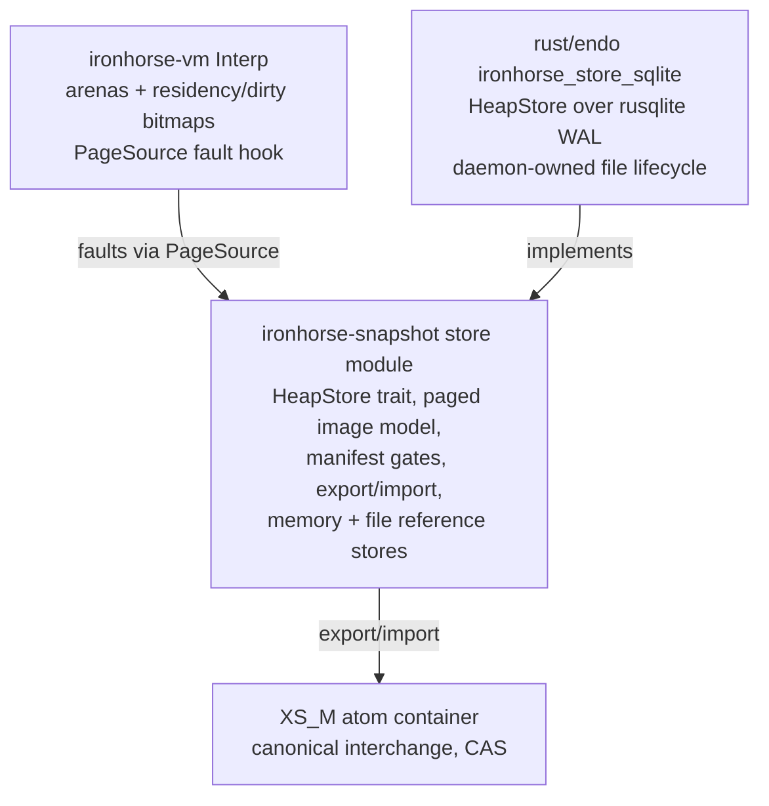

# Ironhorse Snapshot Store Seam: Database-Backed Heaps

| | |
|---|---|
| **Created** | 2026-08-06 |
| **Updated** | 2026-08-11 |
| **Author** | Aaron Kumavis (prompted) |
| **Status** | In Progress |
| **Builds on** | designs/ironhorse-engine.md (§ Snapshots, requirement 1c) |

Investigation of a seam in the Ironhorse engine's snapshot subsystem
that lets the whole-heap snapshot artifact be replaced by a database
(SQLite first), so that large heaps are **lazily reified** at resume
and **incrementally updated** at checkpoint, instead of serialized and
deserialized wholesale.
The seam is store-agnostic; SQLite is the first production backend
because the daemon already ships it
([daemon-endo-rust-sqlite](daemon-endo-rust-sqlite.md)).
Nothing in this design changes an oracle-checked observable: results,
computron counts, allocation sequences, and abort points are
independent of the store backend, the residency schedule, and the
checkpoint cadence, and the existing `XS_M` atom container remains the
canonical interchange format.
Per the naming doctrine (ironhorse-engine resolved question 7, as
amended 2026-07-29): the trait and the arena hooks are **Ironhorse**
(language execution); the SQLite backend and its file lifecycle are
**Endor** (platform binding).

## Status

Phases 1-4 implemented (2026-08-06/07, this branch, PR #963), then
revised by a wide adversarial multi-agent review (8 finder dimensions,
25 grounded findings, all confirmed ones fixed on-branch). The
principal review-driven revisions, recorded as design amendments:

- **Succession is (epoch, seal), not epoch alone.** Every commit's
  manifest carries a `seal` — SHA-256 over the previous seal and the
  commit's content — and every backend refuses a batch whose
  `prev_seal` does not match the stored seal (`check_succession`). A
  bare epoch counter cannot distinguish forks, copies, or foreign
  stores at equal height; the seal chain fails all of them closed
  (`StoreError::BaselineMismatch`). Identical-content forks share a
  seal and converge harmlessly.
- **`StoreSession` owns the machine.** The dirty bitmaps are
  machine-global, so only the session that watched them accumulate may
  commit them; ownership makes machine/session mispairing and
  dirty-bit theft (a second binding consuming bits another store still
  needed) unrepresentable rather than guarded.
- **Lazy faults are pinned.** The lazy page source re-verifies the
  store's (epoch, seal) on every fault (the session advances the pin
  on its own commits), and eager resume re-checks the manifest after
  its row reads — a store advanced by anyone else yields a
  deterministic named crashed crank or a structured error, never a
  chimera heap mixing epochs.
- **Guard-discipline fix (critical):** the string comparison opcodes
  hold two chunk guards at once and now pre-fault both operands, so a
  lazily resumed machine cannot die on `a === b` across extents.
  Fault installs assert exact row lengths (a short row dies loudly);
  `FileStore` commits check succession against the durable file (not
  a cached view), fsync the directory after the publishing rename,
  and bound directory arithmetic; `validate_store` additionally
  refuses duplicate free-list indices; `store_to_image` clamps its
  pre-reservations; the SQLite backend gates on a `PRAGMA
  application_id` stamp, verifies WAL actually engaged, and applies
  `busy_timeout(5000)` + `wal_autocheckpoint=1000` per the daemon
  designs.

A follow-up automated review pass (PR #963 Copilot review,
2026-08-07) drove a second, smaller wave:

- **Open-time row inventory is metadata-only.** `HeapStore` grew
  `inventory()` (present row keys + stored lengths — map metadata,
  directory entries, or `SELECT length(bytes)` — never row content),
  and `validate_store` checks existence/length through it. Before
  this, validation read every row's bytes, so a *lazy* resume still
  paid O(heap) I/O at open, defeating phase 3's wake-latency point.
  Content reads now happen only on fault (or eager reify), and the
  fault path's exact-length asserts keep the length half of the
  check enforced at use.
- **Commit presence checks are O(dirty + grown).** A batch that grows
  the geometry must supply every row in the grown region; the check
  now walks only `prior geometry .. new geometry` against a hash set
  of the batch's keys, instead of re-walking the whole store per
  commit.
- **Lazy-pin advance is identity-gated, borrow-free.** The pin
  advances only when the committed store *is* the pinned store,
  decided by comparing the store's address recorded at resume — not
  by re-probing the store's manifest, which necessarily re-enters the
  `RefCell` the caller already holds mutably to pass
  `&mut dyn HeapStore` on every same-store commit. A commit into a
  byte-identical twin passes succession but leaves the pin (and the
  pinned store's content) exactly where the machine's faults need
  them.
- **`FileStore` temp names are unique per attempt** (pid + process
  sequence), so two writers racing the same path cannot clobber each
  other's staging file; the single-writer-per-path model itself is
  documented at the type, and the second-handle lock stays the seal
  chain.
- **Recorded trade — placeholder allocation at lazy attach.** A lazy
  resume allocates the full dense `Cell` arrays (slots and residency
  bits) up front: O(slot_count) zero-fill before any fault. The
  sparse alternative (allocate per faulted page) was rejected because
  dense indexing keeps the by-value `get` free of an extra map lookup
  on the hottest path in the machine — the layer the benchmark gate
  priced. The attach cost is one contiguous allocation pass, far
  below the cost of faulting even a handful of pages, and it scales
  with the *pinned* heap, not the working set — accepted and named
  here rather than hidden.

A second automated pass over the force-pushed head (2026-08-07)
closed the cross-connection torn-read windows the first pass's fixes
still left on the lazy paths, and tightened the decoders:

- **Lazy resume re-checks the manifest after validation**, exactly as
  eager resume does after its row reads: validation's manifest /
  small / inventory reads are separate store operations, so a commit
  from a second SQLite connection could otherwise seed a session and
  its fault pin from mixed epochs. Epochs only advance, so same
  (epoch, seal) after the reads proves they all saw one commit.
- **Faults re-verify the pin after the row read**, not just before
  it: a foreign commit landing between the pre-check and the read
  would otherwise hand the fault a successor-epoch row the pre-check
  could not see. Both windows are locked by a deterministic
  interleaving-store harness (`store_checkpoint.rs`) that applies a
  valid successor commit inside the chosen read.
- **Decoders require exact consumption.** A manifest with bytes after
  its seal, or a small state with bytes after its sixth section, now
  fails closed as corrupt rather than decoding permissively — store
  contents are untrusted, and format evolution goes through the
  schema-version gate, not trailing data.
- The pass re-raised the placeholder-allocation trade (twice); the
  disposition stands as recorded above.

**The acceptance suite is backend-parameterized (2026-08-08).** The
metamorphic determinism runner (six ways then; seven since phase 8's
adversarial-evict arm), the lazy working-set bound,
and the checkpoint acceptance locks moved into
`ironhorse-snapshot::store_suite` (a `store-suite` cargo feature —
test support, never in production builds), generic over the
`HeapStore` under test. Every backend now runs the SAME instrument:
the reference backends instantiate it in the engine workspace
(`MemoryStore`, and newly `FileStore`, which previously had no
metamorphic coverage), and the SQLite crate instantiates it in
`tests/store_suite.rs` against both `:memory:` and on-disk (WAL
engaged) stores — in addition to its own real-JS close/reopen
lifecycle scenarios. Byte-level corruption sweeps and commit-stats
proportionality locks deliberately stay per-backend: they poke a
backend's physical representation, so their failure taxonomy is not
shared.

**Phase 5 landed (2026-08-11, store schema v3): the row-hash tree.**
Every row (slot page, chunk extent, small state) has a SHA-256 leaf;
the manifest carries the combined root, which the seal signs (the
seal hashes the full manifest).
Backends persist leaves beside rows (a `leaf_hashes` table in SQLite;
a leaf section in the store file layout, whose magic is
version-suffixed; vectors in the memory store), maintain them
transactionally via the shared batch application — which also REFUSES
any batch whose sealed root does not match its own rows — and serve
them through `HeapStore::leaf_hashes()` (32 bytes per row,
metadata-scale like `inventory()`).
`validate_store` recombines leaves against the root at open;
`store_to_image` verifies each row as it reads; lazy faults verify
against the pinned leaves, which the session's own commits refresh
(see the review wave below — phase 8's eviction made
committed-then-clean rows re-faultable, so frozen attach-time leaves
misdiagnosed a healthy re-fault as corruption).
The root is the store-native identity — two stores compare equal by
manifest field, no row read; the CAS blob key remains SHA-256 of the
canonical export, computed only at interchange (the golden vector
proved the container unchanged across every schema bump).
The wake-latency instrument (`wake_latency_bench.rs`, `#[ignore]`d
like the dispatch bench) closed the phase-5 bar: on a 120k-slot
fixture, eager wake median 15.3 ms vs lazy wake 0.41 ms (ratio
0.027) for a one-global crank — wake cost is measurably the working
set, not the heap.
Provenance: medians of 5 in-process rounds, debug-excluded release
profile, and the timed span is resume + validation + the wake crank
— an upper bound on the attach alone.
Still open: an interior tree if leaf counts ever make the linear
recombine measurable.

**Phase 6 landed (2026-08-11): persisted page-edge summaries and the
summary-driven partial collector.**
Every checkpoint writes per-page outgoing-edge summaries
(`derive_page_edges` — a pure function of the page's records, NULL
links excluded), carried in the batch, signed by the seal, and — as
of schema v5 (review wave, below) — folded into the root and
verified at commit against the very rows they travel with.
Backends persist them beside rows (`page_edges` table / file section
/ memory vectors).
`reachable_pages` answers reachability from the summaries alone —
locked to ZERO row-content reads by a counting-store test — and
`partial_collect` frees every page unreachable from the machine's
roots at a clean checkpoint boundary, with side-table cleanup via
`Interp::free_pages`.
The root set is `gc_roots` PLUS `side_table_ref_slots`: the stored
summaries carry only ARENA edges, so a reference held in a Rust side
table (an Array's element map, a Map/Set entry, a captured closure
record, a suspended frame) roots its page directly — without this,
an object reachable only through a side table was freed while live
(the review wave's critical finding, now locked by a test that fails
without the fix).
The collect schedule is part of a replica's decision sequence — the
collect rewrites the free list, so replicas must collect at the same
boundaries, exactly as with the full collector.
Locks: strict conservatism (`freed == 0` on summary-chained
garbage), genuine reclaim (hand-planted page-isolated garbage frees
at page granularity), side-table survival, and a summary-count
refusal (`StoreError::SummaryCount`) instead of reading a truncated
summary table as maximal garbage.
**Honest limitation, recorded:** edges are derived from ALL records,
dead ones included, and sequentially allocated objects straddle page
boundaries — so a dropped allocation run keeps its pages
summary-chained and the partial collect correctly frees nothing
there.
Page-isolated garbage is the reclaim case; live-only summaries after
a sweep belong to the deferred chunk-row re-key (phase 7 note).

**Phase 7 landed as the incremental-compaction cut (2026-08-11).**
Compaction dirties only extents whose OWN bytes changed (diffed
against the pre-compaction space, OR'd with uncommitted
pre-compaction dirt, the tail extent's own shrink counted), so the
post-GC checkpoint writes what MOVED, not the whole geometry.
The review wave extended the same bound to slot pages: identity
remaps no longer pass through `get_mut`, so a no-movement collection
leaves slot pages clean too — both halves locked by
`compaction_dirties_only_moved_extents`.
The full re-key of chunk rows by stable identity — which would also
de-chain the page summaries phase 6 needs for dropped sequential
runs — is deferred with this honest note: it changes the slot→chunk
reference encoding, the store schema, and the compaction algorithm
together, and the incremental-dirt cut already removes the
whole-space recommit cost that motivated it.

**Phase 8 landed (2026-08-11): eviction.**
See amended Design Decision 3 — clean-row fault-out with
guard/dirty refusal (dirty lookups fail closed, `#[must_use]`
returns).
The review wave completed its story: a session's own checkpoint now
refreshes the pinned row leaves and advances the arenas' backing
geometry (`advance_backing`), because a committed-then-clean row is
evictable and its re-fault must verify against the bytes the commit
wrote at the committed length — frozen attach-time state misread
that healthy re-fault as a corrupt store.
The adversarial-evict arm evicts after every resume AND after every
checkpoint, asserts eviction genuinely happened, and the
evict-after-own-checkpoint regression bites on each half of the fix
independently.
Honest deferrals, recorded: randomized evict schedules and a
long-running bounded-residency fixture remain open — the arm's two
evict points are fixed, not fuzzed.

**Phase 9 landed (2026-08-11, store schema v4): the paged free
list.**
The free list no longer rides small state: it lives in leafed,
dirty-diffed segment rows (`FREE_SEG_ENTRIES` = 4096 entries per
segment; kind-2 leaf rows; `free_len` in the manifest; segments in
the seal), so per-commit small-state bytes are O(1) in heap size.
Locks, each on its own axis:
`small_state_stays_small_with_a_large_free_list` (sub-512-byte small
state over a multi-segment list, round-trip length),
`lifo_churn_rewrites_only_the_tail_free_segment` (LIFO churn ships
exactly one segment row, observed through
`CommitStats::free_segs_written`), and
`free_seg_boundaries_split_and_reassemble_exactly` (order-exact
split/reassembly at the 4096/4097 boundaries).
Validation reassembles the list from leaf-verified segments and runs
the range/distinctness gates on the result — the one O(free-list)
exception to the metadata-only open, inherent because the machine
needs the list in memory at wake.
The sparse-attach half of phase 9 is **measured and deferred**: the
wake-latency instrument put the whole dense wake path — zero-fill
included — at 0.41 ms for a 120k-slot heap, so the dense trade the
benchmark gate priced remains the right one until heaps grow orders
of magnitude; the disposition and the re-run-the-gate condition stay
recorded at the phase-3 trade note.

**Store schema v5 landed (2026-08-11): the adversarial-review wave.**
Eight dimension-scoped review agents swept the phase 5-9 work; the
confirmed findings landed as three commits (GC completeness +
partial-collect soundness + evict refresh; schema v5; this doc
sync).
The store-side core: page-edge summaries joined the integrity root
(section-count header; length-prefixed edge entries in root and
seal), and the shared `apply_batch` now verifies — before any
backend persists — grown-region presence for ALL three row
dimensions (free segments were previously checked only by the
memory store), row lengths against the batch's own geometry, and
summary coupling (summaries travel with exactly the traveling page
rows and are recomputed from them).
`checkpoint_to_store` recombines the stored leaves/summaries/small
state against the stored root before building on them, so an
at-rest edit cannot be laundered into the next validly sealed root;
`store_to_image` verifies the small-state leaf and recombines the
root for the export/root_hash paths that skip `validate_store`.
Backend parity: SQLite's commit-time prior-leaf read is
kind-filtered with per-kind contiguity, its `page_edges()` refuses a
truncated tail, `synchronous=FULL` is verified by read-back, and
point reads report `Empty` on an uncommitted store across all three
backends; the file store survives bare-filename directory syncs,
checks the free-segment count at open, drops its reservation
amplification, and removes temp files on failed commits.
The machine side: the GC root set gained the completion register,
the pending microtask queue (with reaction-kind payloads — a
suspended await's instance, a combinator's state), and a sorted
root sequence; `external_chunk_refs` gained the interned `typeof`
strings and queued jobs; slot-bearing side tables prune at sweep
time so chunk reclamation lands in the same collection; free-list
membership is an O(1) twin bitmap (the sweep was quadratic in
free-list length).
The golden seal was re-pinned once more; the canonical blob hash has
never moved.

**Phase 10 underway (2026-08-16): the query-driven GC layer, measured
first.**
The full local toolchain came up in this environment (the `c/moddable`
oracle submodule, nightly + `cargo-fuzz`; the `snapshot_decoder`
target promptly earned a trophy — a corrupt blob's out-of-range free
index panicked the arena's free-bitmap rebuild — fixed with
range/duplicate/accounting gates at the decoder edge, locked by
`heap_free_list_semantic_gates_fail_closed`).
Landed as infrastructure and instruments:

- The SQLite backend maintains `edge_pairs (target, page)` — a
  normalized, DERIVED twin of the sealed summaries (never sealed,
  rebuilt from `page_edges` at open when absent or stale; wiped-index
  recovery locked by test) — in the same commit transaction as the
  rows it mirrors.
- `pages_referencing(target)` answers the reverse question no blob
  encoding can (O(in-degree) by primary key), and
  `reachable_pages_sql(roots)` runs reachability INSIDE SQLite as a
  recursive CTE; dense/CTE parity is locked by test.
- The store instrument (`store_bench.rs`; release, medians of 5,
  this repo's dev container): dense reachability reads the whole
  edge set and scales with the heap — 0.014 / 0.043 / 0.146 ms at
  60 / 236 / 939 pages — while the CTE stays flat at ~0.02 ms:
  transfer proportional to the ANSWER, the property the generational
  mark needs. Incremental checkpoints: 0.9 / 1.2 / 2.0 ms end to end
  under WAL + `synchronous=FULL`.
- The GC instrument (`gc_bench.rs`, same provenance): steady-state
  full mark scales linearly — 0.7 / 3.3 / 13.4 ms at 30k / 120k /
  480k slots — and `partial_collect` costs 0.4 / 1.9 / 9.5 ms:
  cheaper, but still O(live) through the side-table enumeration and
  O(pages) through the dense edge read — exactly the two terms
  phases 10-11 remove. Sweep runs ~24-29 ns/slot flat across
  free-list sizes (the review wave's bitmap fix; the prior sweep was
  quadratic in free-list length).
- The attached-mode instrument (`attached_bench.rs`) closed the
  deferred bar: a fully resident attached machine runs a hot crank
  at x1.009 of detached; the same crank cold-faulting its whole
  working set costs x1.075.

The partial collector's decision queries now run through the trait
(`HeapStore::summary_page_count` / `reachable_page_set`, dense
defaults preserved; the SQLite backend overrides them with `COUNT(*)`
and the CTE — backend equivalence locked by
`partial_collect_equivalent_across_backends`), and the GC instrument
splits the partial's phases. The split at 480k slots / 160k
side-table entries: enumeration 3.6 ms (O(live), the remaining
decision-side term), reachability query 0.13 ms (killed by the
indexed path), and ~8.5 ms in `free_pages` — O(garbage reclaimed) at
~35-44 ns per freed slot, the pay-for-what-you-free term.

Next in phase 10, in measured order of value:
page-wholesale freeing (a dead page's records need no per-slot walk
once the free list is paged — phase 9 interaction — attacking the
dominant ~8.5 ms term), then incremental side-table ref-page counts
behind counted accessors on the two bulk tables (arrays,
collections; ~60 direct mutation sites make privacy-enforced
accessors the only sound route — parity-locked against the
enumeration), which retires the 3.6 ms term when attached machines
carry large side tables. The stored-summary variant of that term
belongs to the side-table LEDGER work (rows are not yet persisted;
the quiescent contract keeps resumed machines arena-confined), so it
lands there, not here.

Preceding it, the collaborator-review follow-up wave landed:
`compare_payloads` as the only sanctioned two-chunk read, SQLite
EXCLUSIVE locking (second opener fails closed, locked by test) +
IMMEDIATE transactions + pinned `synchronous=FULL`, full per-crank
computron vectors and a frozen golden vector in the metamorphic
suite, a structural-span corruption arm, and the checked
`compact` header subtraction.

Phase 1-2 detail (2026-08-06):

- `rust/engine/ironhorse-snapshot/src/store.rs` — the paged logical
  image and the `HeapStore` trait: `StoreManifest` (gates + geometry +
  epoch), `SmallState`, `CheckpointBatch`, `check_epoch`,
  `validate_store` (exhaustive open-time gates, accounting, row
  inventory — metadata-only since the follow-up review),
  `image_to_batch` / `store_to_image`,
  `export_to_container` / `import_from_container` (the byte-identity
  locks), `root_hash` (logical identity: SHA-256 of the canonical
  export, locked equal to the blob path's CAS key), and `MemoryStore`
  with per-commit row stats.
- `rust/engine/ironhorse-snapshot/src/store_file.rs` — `FileStore`,
  the single-file pure-Rust reference store: lazy point reads by
  directory entry; atomic whole-file-rewrite commit (temp + rename)
  merging dirty rows over clean ones.
  Its commit I/O is O(store) while commit *encoding* is O(dirty) —
  reference semantics only; the O(dirty)-I/O backend is SQLite.
- `rust/engine/ironhorse-vm/src/value.rs` — the canonical geometry
  (`SLOTS_PER_PAGE` = 256, `CHUNK_EXTENT_BYTES` = 64 KiB) and the
  per-page / per-extent dirty bitmaps, set only by the record/byte
  mutating paths (`alloc`, `get_mut`, `slice_mut`, `compact`);
  free-list and mark-bit churn never dirties, restores start clean,
  compaction dirties exactly the new extent range.
  Deviation from the doc as first written: the geometry constants
  live in the **vm** (the bitmaps key to them and the dependency runs
  snapshot → vm); `ironhorse-snapshot::store` re-exports them.
- `rust/engine/ironhorse-snapshot/src/machine.rs` — the store-backed
  machine surface: `StoreSession` (the machine↔store pairing pinned
  by epoch — an addition over the design text, closing the
  dirty-set-against-the-wrong-baseline hazard surfaced during
  implementation), `begin_store_session` (full epoch-1 write, refuses
  a `NotEmpty` store), `checkpoint_to_store` (dirty rows + whole
  small state; bitmaps cleared only after a successful commit),
  `resume_from_store` (validate exhaustively, then reify eagerly —
  the lazy mode is phase 3).
- `rust/endo/ironhorse-store-sqlite/` — the daemon-side SQLite
  backend (§ SQLite schema: `meta` / `slot_pages` / `chunk_exts` /
  `small_state` / `side_tables`; WAL + foreign keys at open;
  transactional dirty-row upserts + geometry drop; explicit full
  last-connection close, sidecar removal asserted by test).
  Deviation: a sibling crate in the root workspace rather than an
  `endo` module, so it builds and tests without the XS C toolchain
  the `xsnap` crate needs; wiring into the `endor` binary's
  supervisor verbs lands with the worker-envelope work.
- Locks: `ironhorse-snapshot/tests/store_checkpoint.rs` (both
  reference backends: store equals the live machine after every
  checkpoint; export byte-equals the machine's own blob; root hash
  equals the blob CAS key; incrementality measured at the full /
  partial / zero points; resume equals uninterrupted in result AND
  computrons; pairing guards fail closed; lifecycle across file
  reopens), the vm dirty-tracking suite, the store-model and
  FileStore suites, and the SQLite suite (including cross-backend
  byte parity with `MemoryStore`).

Phase 3-4 detail (2026-08-07): lazy reification (`PageSource`,
Cell-backed by-value slot reads, the ChunkBytes Plain/Lazy enum with
guard-deref chunk reads, grow-only residency, GC compaction as the
amortized reifier, `resume_from_store_lazy`); the six-way metamorphic
determinism suite (five real-JS scenarios × uninterrupted / blob /
store-eager / store-lazy / adversarial-prefetch /
checkpoint-every-crank, agreeing on per-crank results, final
computrons, and final blob bytes) plus a working-set residency bound
(a one-global wake crank must fault at most a quarter of a 12+-page
heap); seeded hardening arms (randomized mutate/checkpoint/restore
schedules with GC interleaved, randomized fault schedules, a 400-case
corruption sweep, and the exact dirty-fraction sweep — closing phase
2's measured-proportionality bar); and engine-level SQLite lifecycles
running real compiled JavaScript through full sleep/wake cycles.

**Hot-path benchmark outcome (2026-08-07), recorded as the amendment
the gate text below requires.** The landed mechanization is a hybrid:
Cell-backed by-value slot reads (variant (a)'s interior mutability,
storage-wide rather than miss-path-confined) plus the Plain/Lazy enum
for chunks (variant (b)'s dual representation where reads return
slices). Measured on 12 interleaved release A/B rounds against the
pre-change tree (`tests/dispatch_bench.rs`, medians): dispatch-heavy
workload **-2.5%** (neutral/noise), chunk-heavy **+1.6%** (noise),
slot-heavy microworkload **+7.1%** — the strict "zero measurable
regression detached" bar was met on program-shaped
(dispatch-dominated) workloads and missed on the slots microaxis.
Decision: **accepted**, on the grounds that real programs are
dispatch-dominated and the engine's overall 2.0x-of-XS envelope has
ample headroom; the compile-time feature split remains the named
fallback if that envelope later tightens. The bench is an
*instrument* (manual two-tree A/B, no assertion, no attached-mode
workload yet), not an automated gate; an attached-mode workload and a
wake-latency benchmark remain open.

**Named integrity limitations (review findings, accepted and scoped —
these bound Requirement 6 and Design Decision 7 to *structural*
validation):**

1. ~~Row content is not checksummed.~~ **Discharged 2026-08-11 by
   phase 5** (store schema v3): every row has a stored leaf hash, the
   manifest carries the sealed row-tree root, validation recombines
   leaves against the root at open (metadata-scale), and every row
   read — eager reify or lazy fault — verifies content against its
   leaf. A length-preserving flip at rest now fails closed (open-time
   error for a leaf flip; read-time structured error or named panic
   for a row flip), locked by
   `length_preserving_flip_at_rest_fails_closed`. Completed by
   schema v5 (the review wave): the page-edge summaries and the
   small state joined the root, so the discharge covers every
   persisted row class — a summary flip now refuses at open (locked
   by `edge_summary_flip_at_rest_fails_closed`) instead of silently
   shrinking the partial collector's reachability — and
   `checkpoint_to_store` recombines the stored metadata against the
   stored root before building on it, closing the laundering path.
   Scope, stated honestly: the tree defends against PARTIAL
   tampering; an author who can rewrite rows, leaves, root, and seal
   together produces a store that validates as a different machine —
   this is tamper-evidence at row scale, not authentication. The
   blob path keeps its external-CAS-address integrity model.
2. **Record semantics are not validated at open.** A structurally
   valid store whose record *contents* are corrupt (a chunk offset
   below the header width, an out-of-range slot index) passes
   validation and dies later as a uniformly named deterministic panic
   (`len_of`'s checked underflow, the arenas' bounds checks) — a
   crashed crank, not a wrong answer, but not the structured
   open-time error either. Decoding every record at open would defeat
   lazy resume; the panic path is the accepted trade.

Remaining, mapped to the phases: cargo-fuzz CI promotion of the
hardening arms (the toolchain now runs locally — submodule + nightly
+ libFuzzer — and has already produced a trophy; a CI lane is the
remaining step); the supervisor cadence policy and `endor` binary
wiring (with the worker-envelope work). The attached-mode benchmark
landed with phase 10's instruments.
The phase 5-9 roadmap is LANDED (2026-08-11, see the phase blocks
above): row-hash tree + wake-latency instrument (5), page-edge
summaries + partial collect (6), incremental compaction dirt (7),
eviction + adversarial-evict arm (8), paged free list with sparse
attach measured-and-deferred (9). The residual O(heap) operations
are, by design: full GC (the amortized reifier, now with
incremental-compaction dirt), eager reification, and canonical
export at interchange.

## What Is the Problem Being Solved?

### Ground truth: the snapshot is a monolith

The stage-6 snapshot surface
(`rust/engine/ironhorse-snapshot/src/{image,machine}.rs`) is correct
and canonical, but wholesale in both directions:

- **Write.** `MachineImage::from_arenas` copies *every* slot record
  (`slots.records().to_vec()`), the *entire* chunk arena
  (`chunks.raw().to_vec()`), the free list, the stack, and the symbol
  tables into a plain-data image; `write_machine` serializes the whole
  image to one `Vec<u8>`; `write_snapshot_to_file` streams those bytes
  to disk and `suspend_to_cas` renames the file to its SHA-256.
  Every suspend pays O(heap) time and bytes — and briefly holds a
  second full copy of the heap in memory — even when one slot changed
  since the last suspend.
- **Read.** `from_snapshot_file` reads the whole file into memory,
  `read_machine` decodes every atom, `MachineImage::to_arenas` clones
  the full record array and byte arena, and `restore_snapshot_state`
  installs them on a fresh boot.
  The first instruction of the wake crank cannot run until the entire
  heap has been decoded and materialized, so wake latency is O(heap)
  regardless of how little of the heap the wake crank touches.
- **Storage.** Successive suspends of a slowly-changing heap store
  near-duplicate CAS blobs; there is no structural sharing between
  snapshot generations.

### Who this hurts

- **Sleepy workers.** The suspend/resume lifecycle
  ([daemon-xs-worker-snapshot](daemon-xs-worker-snapshot.md)) exists
  so idle agents cost nothing; thixotrope's sleepy CapTP workers
  ([ocapn-orthogonal-persistence](ocapn-orthogonal-persistence.md))
  suspend when quiescent and wake per message.
  Both pay the full-heap round-trip on every sleep/wake cycle, so the
  cost of sleeping grows with accumulated heap state — precisely
  backwards for long-lived agents whose in-heap memory grows without
  bound.
- **Checkpoint durability.** A crash loses everything since the last
  suspend.
  Checkpointing every crank would fix that, but at O(heap) per
  checkpoint it is unaffordable; at O(dirty pages) it is routine.
- **Large heaps.** A multi-gigabyte agent memory is serialized,
  hashed, written, read, decoded, and re-allocated in full to answer
  one message.

### Why this is tractable now

The heap model was built for this, even though the current writer does
not exploit it.
The design's own words (ironhorse-engine § Value and heap model): "An
index arena also makes snapshots nearly structural … the Ironhorse
heap is already in that form."

- `SlotIndex(u32)` is a stable identity — slots never move — so a slot
  page number is a natural primary key.
- The serialized slot record is already a canonical fixed-width
  encoding (`slot_codec::SLOT_RECORD_BYTES` = 20, zero-filled,
  byte-identical on round-trip) that works equally as an atom payload
  element and as a row/page encoding.
- The chunk arena is a flat byte space addressed by offset; fixed-size
  extents of it are pageable spans.
- The suspend point is machine quiescence between cranks (the
  `machine.rs` suspend-point contract), so store commits have a
  natural, already-enforced transaction boundary.

XS could not have this seam without a relocation pass; Ironhorse gets
it almost structurally.
It is also timely: most rich side tables are still `Pending` in the
completeness ledger (`sidetable.rs`), so their atoms and their store
rows can be designed once, together, instead of migrating a second
time.

## Requirements

1. **Determinism unchanged (unconditional).** Results, computrons,
   `currentHeapCount`, allocation sequence, GC scheduling, and abort
   points are identical across: no store, blob snapshot, DB-backed
   eager restore, DB-backed lazy restore, and any checkpoint cadence.
   The metering doctrine (accuracy over parity, determinism per
   release) is untouched.
2. **The atom container stays canonical.** Export from a store
   produces byte-canonical `XS_M` bytes (same atoms, same order, same
   gates); import seeds a store from a container.
   CAS interchange, the `VERS`/`SIGN`/`METR` fail-closed gates, and
   resolved question 3 (no XS importer) are all preserved.
3. **Zero `unsafe`, zero C in engine crates.** `ironhorse-vm` and
   `ironhorse-snapshot` keep `#![forbid(unsafe_code)]` and gain no C
   dependency; SQLite (a C library, however battle-tested) lives on
   the daemon side of a pure trait, in the workspace that already
   compiles `rusqlite` with `bundled`.
   No design-amendment trigger under § Minimizing `unsafe` is pulled.
4. **Hot path unperturbed when detached.** The store-less
   configuration — the one the differential oracle and the
   conformance corpora run — keeps today's arena representation and
   access cost.
   The attached configuration's overhead is bounded and measured
   against the ironhorse-engine performance envelope before the seam
   is accepted (a benchmark gate, per the repo's rule that perf
   choices are substantiated by measurement).
5. **Suspend-point contract unchanged.** Store commits happen only at
   machine quiescence between cranks.
   The side-table completeness ledger governs the store schema exactly
   as it governs atoms: a ledger row is `Serialized` only when both
   the atom and the store carry it.
6. **Fail closed.** A malformed or foreign store is refused at open
   with structured errors (the analogue of
   `NotIronhorse`/`SignatureMismatch`/`CostTableMismatch`), never a
   wrong answer.
   An I/O fault after a successful open is a crashed crank — worker
   death and supervisor recovery, the existing story — never silent
   corruption.

## Design

### The seam is three layers



**Layer 1 — `HeapStore` (pure trait, `ironhorse-snapshot::store`).**
The paged logical image and its transactional surface.
Shape sketch (names are illustrative, not final):

```rust
pub struct StoreManifest {
    pub version: Version,          // IRONHORSE format + store schema version
    pub signature: Signature,      // host callback-table gate (SIGN)
    pub cost_table_version: String,// meter gate (METR discipline)
    pub creation: CreationParams,
    pub slot_pages: u32,           // page geometry and counts
    pub chunk_extents: u32,
    pub epoch: u64,                // checkpoint generation counter
}

pub trait HeapStore {
    fn manifest(&self) -> &StoreManifest;
    fn read_slot_page(&self, page: u32) -> Result<Box<[Slot]>, StoreError>;
    fn read_chunk_extent(&self, ext: u32) -> Result<Vec<u8>, StoreError>;
    /// Stack, keys/names/symbols, meter — small at quiescence (the
    /// free list moved to segment rows in phase 9).
    fn read_small_state(&self) -> Result<SmallState, StoreError>;
    /// One atomic batch: dirty pages/extents + whole small state + epoch.
    fn commit(&mut self, batch: CheckpointBatch) -> Result<(), StoreError>;
}
```

`ironhorse-snapshot` provides `store::memory` (tests) and
`store::file` (a paged single-file reference store, pure Rust), plus
`export_to_container(&dyn HeapStore) -> Vec<u8>` and
`import_from_container(&[u8], &mut dyn HeapStore)`.

**Layer 2 — arena residency and dirty tracking (`ironhorse-vm`).**
The arenas gain two bitmaps and an optional backing:

- **Dirty bits** (always compiled, trivially cheap): one bit per slot
  page / chunk extent, set by the record/byte-mutating paths (`alloc`,
  `get_mut`, `slice_mut`, arena growth, compaction rewrite) — and
  deliberately NOT by `free`/sweep/mark, which never change record
  bytes (the reclamation travels as free-list state — since phase 9,
  leafed segment rows plus the manifest's `free_len`). The
  checkpoint peeks `dirty_pages()`/`dirty_extents()` and clears only
  after a successful commit.
- **Residency bits + fault hook** (active only when a backing is
  attached): `get`/`payload` consult residency and fault a missing
  page in through a narrow `PageSource` trait *defined by the vm* and
  implemented by the snapshot crate over any `HeapStore` — keeping the
  dependency direction unchanged (snapshot depends on vm, never the
  reverse).

A chunk fault first loads the extent(s) covering the 4-byte length
header at `off - 4`, reads the stored length, then loads the extents
covering the payload span — a chunk larger than one extent faults a
contiguous extent range.

**Layer 3 — backends.**
The SQLite backend lives in `rust/endo` (module
`ironhorse_store_sqlite`, behind the existing `ironhorse-engine`
feature), *not* in the engine workspace.
`rust/endo` already compiles `rusqlite 0.31` with `bundled`, already
owns WAL-mode discipline
([daemon-endo-rust-sqlite](daemon-endo-rust-sqlite.md)), and already
owes a full-close-before-handoff contract
([daemon-sqlite-shutdown-checkpoint](daemon-sqlite-shutdown-checkpoint.md))
that a worker-heap database inherits verbatim.
The engine workspace stays zero-unsafe and zero-C; the oracle harness
remains the sole place C is compiled *in the engine workspace*.

### Store data model: the paged logical image

One logical encoding, two containers.
The atom grammar's payload encodings are reused as the page encodings,
so the store introduces no second codec:

| Store object | Content | Atom equivalent |
|---|---|---|
| Slot page `p` | `SLOTS_PER_PAGE` × 20-byte `slot_codec` records, index order | a fixed span of the `HEAP` record array |
| Chunk extent `e` | `CHUNK_EXTENT_BYTES` raw bytes of the chunk arena (header discipline included) | a fixed span of `BLOC` |
| Small state | stack (`STAC`), live count (`HEAP` header), keys/names/symbols (`KEYS`/`NAME`/`SYMB`), meter (`METR`); since phase 9 the free list lives in its own leafed segment rows and small state's free section is empty | the small atoms, verbatim |
| Manifest | `VERS` + `SIGN` + `CREA` + store schema version + geometry + epoch | the header atoms |
| Side tables | one keyed row set per ledger row, as each `Pending` atom lands | the future side-table atoms |

Starting geometry (to be calibrated in phase 2): `SLOTS_PER_PAGE` =
256 (5,120-byte page blobs), `CHUNK_EXTENT_BYTES` = 64 KiB.
The free list's LIFO order is load-bearing for deterministic slot
reuse after resume.
(Amended by phase 9: the list itself moved out of small state into
leafed, dirty-diffed segment rows — order preserved exactly — so at
quiescence the stack is empty and the tables are small, and "small
state" stays genuinely small AND O(1) in heap size; it alone is
rewritten whole per checkpoint.)

**Logical identity.** A store state's identity is the SHA-256 of its
canonical export (the `XS_M` bytes), not of the database file —
SQLite files are not byte-canonical.
Phase 2 computes it on demand via export; an incrementally maintained
page-hash tree is named future work for when exporting to hash becomes
the bottleneck.

### SQLite schema and operational discipline

```sql
CREATE TABLE meta        (key  TEXT    PRIMARY KEY, value BLOB NOT NULL);
CREATE TABLE slot_pages  (page INTEGER PRIMARY KEY, bytes BLOB NOT NULL);
CREATE TABLE chunk_exts  (ext  INTEGER PRIMARY KEY, bytes BLOB NOT NULL);
CREATE TABLE small_state (name TEXT    PRIMARY KEY, bytes BLOB NOT NULL);
CREATE TABLE side_tables (name TEXT NOT NULL, key BLOB NOT NULL,
                          bytes BLOB NOT NULL, PRIMARY KEY (name, key));
-- phases 5-9 (see the landed blocks):
CREATE TABLE leaf_hashes (kind INTEGER NOT NULL, idx INTEGER NOT NULL,
                          hash BLOB NOT NULL, PRIMARY KEY (kind, idx));
CREATE TABLE page_edges  (page INTEGER PRIMARY KEY, targets BLOB NOT NULL);
CREATE TABLE free_segs   (seg  INTEGER PRIMARY KEY, bytes BLOB NOT NULL);
```

- `PRAGMA journal_mode=WAL`; one connection, owned by the worker's
  thread (machines are `!Send`; the store rides the same pinning).
- `commit(batch)` is one transaction: upsert dirty pages/extents,
  replace small state, bump `meta.epoch`.
  A torn checkpoint is impossible by SQLite's atomicity; a resume
  reads a consistent epoch or fails closed.
- Full close before any state-directory suspension or handoff, per the
  shutdown-checkpoint contract, after which the worker-heap DB is a
  single self-contained file.
- The file is daemon-private state (same trust class as
  `endo.sqlite`), owned and placed by the supervisor.
  For store-backed workers the DB file *is* the suspended worker: the
  CAS ephemeral-root bookkeeping of
  [daemon-xs-worker-snapshot](daemon-xs-worker-snapshot.md) is
  replaced by ordinary file lifecycle (delete the worker ⇒ delete the
  file), while CAS export remains available for archival, migration,
  and sharing.

### Lazy reification (resume)

`resume_from_store(store, expected_sig)`:

1. Open and validate the manifest — magic, format + schema version,
   signature, cost-table version, and a page-inventory check (every
   page/extent the geometry promises exists) — failing closed with the
   same taxonomy the container reader uses.
   Exhaustive open-time validation is what confines later faults to
   genuine I/O errors.
2. Read small state; fresh `Interp::new()` boot (intrinsics land at
   their deterministic slot indices, as today); attach the arenas in
   lazy mode: capacity from the manifest, residency clear, no page
   reads yet.
3. Run the restore re-derivations exactly as
   `restore_snapshot_state` does today: `bind_program_symbols` from
   the restored names, `rebuild_global_props` by walking the global
   object's property chain.
   That walk faults in the pages holding the global object and its
   property slots — O(globals), not O(heap) — and is the natural
   pre-touch of the hottest region.
4. Return; the wake crank runs, faulting pages as it touches them.
   Wake latency becomes O(working set of the wake crank), not
   O(heap).

Residency is **grow-only** in this design: pages fault in and stay.
"Large heaps" is served by fast wake plus memory proportional to the
touched working set.
Eviction (heaps larger than RAM) is explicitly future work with named
prerequisites — by-value slot reads, clean-page tracking, and a GC
story — and no observable is permitted to depend on residency either
way (`currentHeapCount` counts live slots, not resident pages, so
eviction would not move it).

**Hot-path mechanization (the phase-3 benchmark decides).**
Two candidate arena shapes, stated with their costs:

- *(a) Flat pre-sized `Vec<Slot>` + residency bitmap (recommended).*
  `get` gains one branch on `Option<Backing>` (always-false when
  detached) plus, when attached, a bitmap test; the miss path installs
  records in place.
  Install-through-`&self` needs interior mutability confined to the
  miss path, or a fault-barrier refactor of `get` to `&mut self` /
  by-value return (`Slot` is `Copy`; the interpreter owns its arenas
  at every one of the ~89 read sites, so `&mut` is available — the
  refactor is mechanical but wide).
- *(b) Two-level paged storage (`Vec<Option<Box<[Slot; N]>>>`).*
  Installs are structurally clean, but every access pays two-level
  indexing even when detached, unless the representation itself is
  swapped at attach time (dual representation, more code).

Acceptance for either: **zero measurable regression detached** (the
oracle configuration), and attached overhead inside the
ironhorse-engine § Performance envelope on the microbenchmark corpus.
If neither variant meets the detached bar, the residency machinery
moves behind a compile-time feature and the lazy mode ships as a
distinct build — an outcome this investigation considers unlikely
(one well-predicted branch) but names rather than assumes.

### Incremental checkpoint

At any crank boundary the supervisor (or the suspend verb) may call
`checkpoint(&mut store)`:

1. Drain dirty bits; encode each dirty slot page and chunk extent.
2. Encode small state whole (stack empty at quiescence, meter
   counters); diff the free-list segments against the stored leaves
   so only changed segments travel (phase 9).
3. `store.commit(batch)` — one transaction, epoch bumped.

Costs, stated honestly:

- Steady-state checkpoint cost is proportional to pages dirtied since
  the last checkpoint — the point of the seam.
- The first checkpoint into an empty store is a full write (the
  degenerate case).
- A checkpoint after a GC **compaction** approaches a full chunk-space
  write (slide-compaction rewrites the whole byte space and the
  offsets in surviving slots; the sweep itself dirties nothing — freed
  records keep their bytes, and the reclamation travels as free-list
  state: segment rows plus the manifest's `free_len`).
  Compaction is inherently global; the seam does not hide that, it
  prices it.
- Suspend = checkpoint + drop the machine; a *durability* checkpoint
  (checkpoint + keep running) is the same call without the drop, which
  is what makes per-crank durability affordable.

### GC interaction

- GC **scheduling** stays exactly as the GC roots contract demands: a
  pure function of release-fixed allocation thresholds.
  Residency and dirtiness never feed it, so collection timing is
  identical with and without a store.
- A collection traces the full live graph, so in lazy mode the first
  collect after resume faults in every live slot: **GC is the
  amortized full reifier.**
  This is correct and deterministic, and it is the accepted cost —
  pinning GC to require prior full residency would reify the same
  pages at the same moment with more machinery.
  Making the collection itself lighter than the heap — tracing
  against indexed store queries instead of resident content — is
  Open Question 6.
- Mark bits remain transient (never stored); sweep continues to push
  free-list entries in deterministic index order; the list travels as
  leafed segment rows (phase 9), diffed so LIFO churn ships only the
  tail segment.

### Determinism analysis (the crux)

The store is a transparent layer *below* the deterministic machine;
nothing the guest can observe depends on it:

1. **Faults are content-identical cache fills.** A faulted page equals
   the page an eager restore would have installed, bit for bit — same
   codec, same bytes, validated at open.
   Fault timing changes wall-clock only, which the meter deliberately
   does not observe (the meter is a cost *model*, not a clock).
2. **Commits happen only between cranks.** The machine never observes
   its own checkpoint; a resumed machine continues the meter exactly
   (the row-6 bar), whether it resumed from blob or store.
3. **The bookkeeping is outside the observable set.** Residency and
   dirty bitmaps are host state, invisible to `currentHeapCount`,
   allocation counters, GC thresholds, and the cost table — the same
   firewall discipline as the cost-calibration recorder
   (`ironhorse-vm::cost`), which observes without feeding back.
4. Therefore, for any fault schedule and any legal checkpoint
   schedule, the observable trace equals the store-less trace.

Enforced, not merely argued — a **metamorphic determinism suite**
extends the existing `suspend_resume_equals_uninterrupted` lock: one
program, run (i) uninterrupted, (ii) blob suspend/resume, (iii) store
eager resume, (iv) store lazy resume, (v) store lazy resume with an
adversarial prefetch order, (vi) store lazy resume with adversarial
eviction after every resume and checkpoint, (vii)
checkpoint-every-crank; all seven must agree on per-crank results,
the per-crank computron vector, and the final canonical blob bytes.

### Interchange, CAS, and the oracle

- `export_to_container` walks pages in index order and emits the
  canonical atom sequence (`VERS SIGN CREA BLOC HEAP STAC KEYS NAME
  SYMB METR`); two exports of the same epoch are byte-identical, and
  an export of a store seeded by `import_from_container` reproduces
  the source container byte for byte.
  These identity locks are phase-1 tests.
- The supervisor's existing verbs (`suspend_to_cas`,
  `resume_from_cas`, `write_snapshot_to_file`, `from_snapshot_file`)
  are unchanged; store-backed workers add `checkpoint_to_store` /
  `resume_from_store` alongside them (the
  [daemon-xs-worker-snapshot](daemon-xs-worker-snapshot.md) CBOR verb
  set extends, nothing changes shape).
- The differential oracle is untouched: it checks results on live
  runs, and the container format it can be handed is preserved.
  The XS snapshot importer stays out of scope (resolved question 3);
  a future importer would target the container, and `import_from_container`
  would carry it into a store for free.

### Side tables: the ledger governs the schema

The store must not outpace the completeness ledger.
Each `SideTable` row that graduates from `Pending` lands as a
matched pair — its atom in the container grammar *and* its
`side_tables` rows (or dedicated table) in the store — in the same
change, with the ledger's `Coverage` naming both.
Rows keyed by `SlotIndex` (functions, generators, promises,
collections, …) get `key = slot index` and page-independent lazy
loading later if profiling demands; initially side tables load eagerly
at resume (they are per-instance metadata, small relative to the
arenas) and are rewritten per checkpoint only when dirty (a per-table
dirty flag suffices to start).

### Crate and dependency layout

| Crate | New surface | `unsafe` / C |
|---|---|---|
| `ironhorse-vm` | dirty + residency bitmaps, `PageSource` trait, `attach_backing` / `checkpoint` drains | `forbid`, none |
| `ironhorse-snapshot` | `store` module: `HeapStore`, manifest gates, paged model, memory + file reference stores, `export_to_container` / `import_from_container` | `forbid`, none |
| `rust/endo` (daemon) | `ironhorse_store_sqlite`: `HeapStore` over rusqlite, file lifecycle, supervisor verbs | daemon already compiles bundled SQLite |
| `ironhorse-fuzz` | malformed-store decoder target, fault-schedule metamorphic target, checkpoint round-trip target | dev/CI only |

## Alternatives Considered and Rejected

1. **SQLite as the operational heap** (a B-tree lookup per slot
   access).
   Rejected: orders of magnitude beyond the performance envelope on
   the hottest path in the engine; the arena stays the working
   representation and the DB is its backing store.
2. **mmap the snapshot and let the OS page it.**
   Rejected: requires `unsafe` in an engine crate (a design-amendment
   event § Minimizing `unsafe` invites us not to trigger), turns I/O
   errors into signals rather than typed failures, offers no
   incremental logical write and no schema for side tables, and its
   caching is invisible to the fail-closed validation story.
   Named here because it is the classic shape of this feature in other
   VMs.
3. **Content-addressed page store inside the existing CAS** (Merkle
   pages as CAS blobs).
   Rejected as the primary store: no transactional multi-page batch
   commit, a file per page, and every checkpoint becomes a
   retain/release churn of superseded page blobs through the CAS
   ref-count and mark/sweep machinery
   ([daemon-cas-management](daemon-cas-management.md)) where SQLite
   gives the same atomicity in one transaction.
   Its good half is retained as the logical root hash and the
   canonical export.
4. **Store seam at the atom level only** (store atoms as rows, keep
   wholesale arena rebuild).
   Insufficient alone — it yields incremental *storage* but neither
   lazy reification nor sub-atom incremental writes, because `HEAP`
   and `BLOC` are single atoms today.
   Retained as the phase-1 stepping stone (the paged model is exactly
   this, one level finer).
5. **A pure-Rust embedded store (e.g. redb) as the first backend.**
   Deferred, not rejected: it would keep even the backend free of C,
   and the `HeapStore` trait admits it later.
   SQLite goes first because the daemon has already standardized its
   operational discipline (WAL, close-at-shutdown, cross-platform
   single-file handoff) and ships the dependency today.

## Dependencies

| Design | Relationship |
|---|---|
| [ironhorse-engine](ironhorse-engine.md) | Parent. Extends § Snapshots (requirement 1c) with a store seam; preserves the meter doctrine, the unsafe budget, the perf envelope, and resolved question 3 |
| [daemon-xs-worker-snapshot](daemon-xs-worker-snapshot.md) | Preserved lifecycle; gains the store-backed suspend/resume mode and per-crank durability checkpoints |
| [daemon-endo-rust-sqlite](daemon-endo-rust-sqlite.md) | Precedent and home for daemon-side rusqlite (bundled, WAL defaults) |
| [daemon-sqlite-shutdown-checkpoint](daemon-sqlite-shutdown-checkpoint.md) | The full-close contract the worker-heap database inherits for suspension, backup, and handoff |
| [ocapn-orthogonal-persistence](ocapn-orthogonal-persistence.md) | Primary consumer: sleepy workers whose sleep/wake cost this seam re-prices |
| [daemon-cas-management](daemon-cas-management.md) | The CAS root bookkeeping that store-backed workers replace with file lifecycle; CAS remains the interchange plane |

## Phased Implementation

Each phase is independently green and names its acceptance bar; none
changes an engine observable.

1. **Store model and identity locks (no vm changes).**
   `ironhorse-snapshot::store`: `HeapStore`, manifest gates, paged
   logical image, `store::memory` + `store::file`, export/import.
   *Bar:* container → store → container is byte-identical; store
   validation refuses foreign/corrupt/mismatched stores with
   structured errors; malformed-store fuzz target armed (the
   over-allocation trophies generalize to page counts).
2. **Dirty tracking, checkpoint, SQLite backend, eager store resume.**
   Arena dirty bitmaps; `checkpoint(&mut store)`;
   `ironhorse_store_sqlite` in `rust/endo`; supervisor verbs behind an
   opt-in flag; logical root hash via export.
   *Bar:* checkpoint I/O measured proportional to dirty pages on a
   dirty-fraction sweep; store resume equals uninterrupted (result +
   computrons); the shutdown full-close contract holds for the heap DB.
3. **Lazy reification.**
   Residency bitmaps + `PageSource` faulting; `resume_from_store`
   lazy mode; GC-as-reifier semantics; the six-way metamorphic
   determinism suite; the hot-path benchmark gate (zero detached
   regression; attached within envelope) deciding mechanization (a)
   vs (b).
   *Bar:* wake-latency benchmark shows O(working set) resume on a
   large-heap fixture; all six metamorphic runs agree exactly.
4. **Hardening and co-evolution.**
   Fault-schedule and checkpoint round-trip fuzz targets; supervisor
   checkpoint cadence policy; side-table rows landing paired with
   their atoms as the ledger's `Pending` rows graduate; incremental
   root hash if export-to-hash becomes hot.

Phases 5-9 (added 2026-08-08) chase one goal: **no operation on a
store-backed machine ever reifies, rewrites, or hashes the whole
heap** — the residual O(heap) touchpoints being GC mark, GC chunk
compaction (and the near-full checkpoint after it), export-for-
identity, the dense lazy attach with grow-only residency, and the
free list riding whole in small state.

5. **Incremental root hash (Merkle row tree).** Per-row hashes as
   tree leaves, maintained at commit in O(dirty · log n) (landed as
   O(dirty) hashing + an O(rows) linear recombine; the interior tree
   remains the named upgrade), the root
   sealed into the manifest chain; faults verify the row against its
   leaf, discharging named integrity limitation 1 (unchecksummed row
   content). The Merkle root is the *store-native* identity for
   verification and store-equality; the blob CAS key remains
   SHA-256 of the canonical export, now computed only at actual
   interchange — never for verification.
   *Bar:* commit overhead measured O(dirty); a flipped row byte fails
   closed at fault with a named error; two stores compare equal by
   root without a row read. Land the wake-latency benchmark with this
   phase so 6-9 each have a number to move.
6. **Persisted page-edge summaries; generational mark.** Checkpoints
   also write per-page outgoing-reference summaries (computed from
   the dirty pages already being encoded), sealed with the commit; a
   release-fixed partial collector marks only pages dirtied since the
   last collect plus pages their summaries reach, resolving the rest
   through indexed store queries — including the periodic full
   reachability pass, which traces over summaries, not faulted
   content. Collector behavior stays a pure function of store
   content, never residency; the change is per-release, per the
   metering doctrine. *Prerequisite:* the chunk-roots ledger rows
   (array buffers, static strings) first-class in the GC roots
   contract — the adversarial review's latent finding.
   *Bar:* a generational metamorphic arm agrees exactly with the
   other six; collection store-I/O measured sub-O(live heap) on the
   wide-heap fixture under small mutation sets; collection *timing*
   byte-identical to the ungenerational release... within that
   release's own six ways.
7. **Identity-keyed chunk rows; incremental compaction.** Re-key
   chunk storage by stable chunk identity (a store-schema bump), with
   the slot→chunk reference encoding and the compaction algorithm
   moving together, so compaction becomes per-chunk row moves —
   indexed updates — never a whole-space slide-and-rewrite, and the
   post-GC checkpoint dirties only chunks that actually moved.
   *Bar:* post-compaction checkpoint I/O proportional to moved
   chunks; the container byte-identity locks still hold (export
   canonicalizes back to offset order).
8. **Eviction (fault-out) — the amendment Design Decision 3
   requires.** Clean pages and extents may drop (the store holds
   them); dirty rows checkpoint first or stay; nothing evicts under a
   live chunk guard. Any eviction schedule must be observably
   irrelevant — the adversarial-prefetch metamorphic arm generalizes
   to an adversarial-evict arm.
   *Bar:* six-way agreement extended with randomized evict schedules;
   a long-running working-set fixture holds bounded residency with
   results, computrons, and blobs identical.
9. **Sparse attach; paged free list.** Placeholder pages allocate on
   first fault instead of the dense O(slot_count) zero-fill (the
   phase-3 recorded trade's named follow-up — re-runs the hot-path
   benchmark gate, since it touches the by-value `get`), and the free
   list moves out of small state into dirty-tracked paged rows (its
   LIFO order is load-bearing and is preserved row-internally) —
   closing the last two O(heap) terms.
   *Bar:* attach time O(working set) on a huge-heap fixture;
   small-state bytes O(1) in heap size; slots microbench within the
   recorded envelope.

Phases 10-12 (added 2026-08-16) continue the same goal into the
collectors themselves — GC-shaped questions become indexed store
queries, so collection cost tracks the mutation set, not the heap:

10. **Query-driven reachability + stored root/side-table summaries.**
    Normalize the page-edge summaries into an indexed `(target,
    page)` pair table, derived and rebuildable, maintained in the
    same commit transaction as the sealed rows; serve reverse-edge
    lookups and reachability as store queries (a recursive CTE in
    SQLite) instead of reifying the whole edge set. Then persist
    per-page side-table-reference summaries at checkpoint, so the
    partial collector's conservative root set is itself a store
    query rather than an O(live) machine enumeration.
    *Bar:* query/dense reachability parity locked; derived-index
    rebuild locked; partial-collect decision cost sub-O(live) on the
    wide fixture.
11. **Summary-generational full mark.** Mark = pages dirtied since
    the last full collect ∪ pages reachable from them through the
    stored summaries, resolved through the phase-10 indexes (the
    phase-6 roadmap's generational ambition, now with the reverse
    index it actually needs); the full-heap trace becomes a periodic
    verification pass, not the steady state.
    *Bar:* steady-state collection cost sub-O(live heap) on the wide
    fixture under small mutation sets; a generational metamorphic
    arm agrees with the other seven ways; collection timing stays a
    release-fixed pure function of store content.
12. **Identity-keyed chunk rows; compaction as row moves** — the
    phase-7 deferral, unchanged scope: per-chunk indexed updates
    retire the whole-space slide and de-chain the dead sequential
    runs the page summaries conservatively keep.

*Future work beyond phase 12 (out of scope until a consumer demands
it):* structural sharing of pages across forked workers; store
compaction/vacuum policy.

## Design Decisions

1. **The seam sits below the atom grammar and above the arenas.**
   Pages and extents reuse the existing canonical record encodings, so
   there is one logical format with two containers (atom container for
   interchange, keyed store for residence), never two formats.
2. **SQLite lives daemon-side behind a pure trait.** The engine
   workspace keeps `forbid(unsafe_code)` and zero C; the daemon, which
   already bundles SQLite and owns its shutdown discipline, owns the
   backend.
   Ironhorse defines the seam; Endor binds it — matching the
   engine/binding naming doctrine.
3. **Lazy reification is grow-only residency.** ~~Fault-in, never
   fault-out~~ **Amended 2026-08-11 (phase 8):** fault-out landed.
   `evict_page`/`evict_extent` drop residency for CLEAN, source-backed
   rows only (dirty rows are refused — their content exists nowhere
   else; a live chunk guard refuses too), so the next touch re-faults
   committed bytes — verified against the PINNED leaves, which the
   session's own checkpoints refresh alongside the backing geometry
   (the review wave's finding: a committed-then-clean row is
   evictable, and frozen attach-time state misread its healthy
   re-fault as store corruption). Any evict schedule is observably
   irrelevant — the adversarial-evict metamorphic arm (warm
   everything; evict everything after every resume AND after every
   checkpoint; assert the evictions happened) agrees with the other
   six ways on every backend, and an evict-after-own-checkpoint
   regression bites on each half of the refresh independently.
   Randomized evict schedules and a long-running bounded-residency
   fixture are the recorded deferrals. The dense arrays keep their RAM until phase 9's sparse
   backing; eviction is the correctness machinery that makes bounded
   residency possible.
4. **GC is the amortized reifier and its scheduling is untouched.**
   Collection stays a pure function of release-fixed thresholds; the
   first collect after a lazy resume pays full reification, and a
   post-compaction checkpoint pays a near-full chunk write — priced,
   not hidden.
5. **Checkpoints only at crank boundaries.** The suspend-point
   contract is unchanged; per-crank durability is the same call
   without dropping the machine.
6. **Identity is logical, not file bytes.** A store state's identity
   is the SHA-256 of its canonical export, preserving CAS-grade
   content addressing over a non-canonical database file.
7. **Fail closed at open, crash the crank on later I/O.** Exhaustive
   open-time validation (manifest + page inventory) confines runtime
   faults to genuine I/O errors, which surface as worker death — the
   supervisor's existing recovery path — never as a wrong answer.
8. **Determinism is enforced by metamorphic tests, not argued.** The
   seven-way agreement suite is the acceptance instrument; the analysis
   above only explains why it is expected to pass.

## Open Questions

1. ~~Arena mechanization~~ **Decided 2026-08-07** (see Status): a
   hybrid — Cell-backed by-value slot reads plus the Plain/Lazy chunk
   enum — with the measured A/B outcome recorded in the Status section
   and the compile-time split retained as the fallback.
2. Page and extent geometry (256 slots / 64 KiB starting points) —
   calibrate on real worker heaps in phase 2.
3. Checkpoint cadence policy: supervisor-driven only, or an automatic
   every-N-cranks knob on the worker?
   (A policy question for the daemon, not an engine semantic.)
4. ~~Side-table row granularity as `Pending` atoms land~~ **Decided
   2026-08-08** (phase 5-9 roadmap): per-instance keyed rows from the
   start, with dirty tracking and lazy fault, the same discipline as
   slot pages — a per-table blob would reintroduce a whole-heap
   object per graduated ledger row, against the roadmap's goal.
5. Whether `store::file` (the pure-Rust reference store) should grow
   into the default backend for non-daemon embedders, leaving SQLite
   as the daemon's choice — revisit when a second embedder exists.
6. **Lighter GC against the store.** *Promoted 2026-08-08: the
   second and third directions below are now phases 6 and 7 of the
   roadmap; the first is standing supervisor policy.* Today a
   collection is the amortized full reifier (Design Decision 4): mark faults every live
   slot page, and chunk compaction reifies the whole extent space
   before downgrading it to plain bytes; only sweep and the free list
   are content-free. Three directions could shrink a collection's
   store I/O below O(live heap), in rising order of ambition — all
   constrained by the determinism doctrine (collector behavior must
   stay a release-fixed pure function of heap *content*, never of
   residency, so sleep/wake stays observably identical to
   uninterrupted):
   - **Prefetch, not reschedule.** Collection *timing* cannot move
     (release-fixed thresholds), but fault *latency* can hide: the
     supervisor already knows the allocation meters, so it can warm
     the heap (`touch_page` / `touch_extent` sweeps, or bulk
     `SELECT`s ahead of the threshold) before the reifying collect
     lands. Residency order is proven observably irrelevant (the
     adversarial-prefetch metamorphic arm), so this is pure policy.
     Cheapest, changes no engine semantics, saves latency spikes but
     not total I/O.
   - **Persisted page-edge summaries (remembered sets).** At
     checkpoint, also write per-page outgoing-reference summaries
     (which pages a page's slots point into — computable from the
     dirty pages being encoded anyway) into an indexed side table,
     sealed with the commit. A partial/generational collector could
     then trace only pages dirtied since the last full collect plus
     pages their summaries reach, resolving the rest through indexed
     store queries instead of faulting content. Deterministic so long
     as the summary format and the partial-collection rule are
     release-fixed functions of store content. The real price is a
     second collector algorithm to keep deterministic and metered —
     and free-list/compaction interaction becomes the hard part.
   - **Identity-keyed chunk rows.** Re-key chunk storage by stable
     chunk identity instead of raw extent offsets, so compaction
     becomes per-chunk row moves (`UPDATE`s over the index) rather
     than a whole-space rewrite — de-globalizing the one GC phase
     that today touches every byte. This is the deep redesign: it
     changes the store schema, the slot→chunk reference encoding, and
     the compaction algorithm together, and only pays once heaps are
     large enough that compaction I/O dominates checkpoints.
   Prerequisite for the latter two: the side-table chunk-roots
   completeness item from the adversarial review (array-buffer and
   static-string roots must be first-class before any collector
   consults the store for reachability).

## Prompt

> investigate adding a seam to the endor ironhorse engine to allow the
> snapshot to be replaced with a db (eg sqlite), supporting large
> heaps to be lazily reified and incrementally updated.
