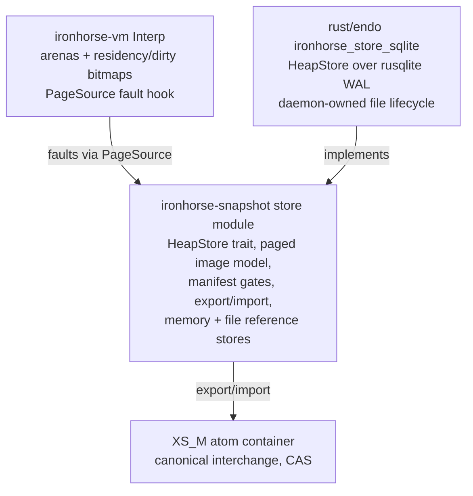

# Ironhorse Snapshot Store Seam: Database-Backed Heaps

| | |
|---|---|
| **Created** | 2026-08-06 |
| **Updated** | 2026-08-27 |
| **Author** | Aaron Kumavis (prompted) |
| **Status** | In Progress |
| **Builds on** | designs/ironhorse-engine.md (§ Snapshots, requirement 1c) |

Investigation of a seam in the Ironhorse engine's snapshot subsystem
that lets the whole-heap snapshot artifact be replaced by a database
(SQLite first), so that large heaps are **lazily reified** at resume
and **incrementally updated** at checkpoint, instead of serialized and
deserialized wholesale.
The seam is store-agnostic; SQLite is the first production backend
because the daemon already ships it
([daemon-endo-rust-sqlite](daemon-endo-rust-sqlite.md)).
Nothing in this design changes an oracle-checked observable: results,
computron counts, allocation sequences, and abort points are
independent of the store backend, the residency schedule, and the
checkpoint cadence, and the existing `XS_M` atom container remains the
canonical interchange format.
Per the naming doctrine (ironhorse-engine resolved question 7, as
amended 2026-07-29): the trait and the arena hooks are **Ironhorse**
(language execution); the SQLite backend and its file lifecycle are
**Endor** (platform binding).

## Status

Phases 1-4 implemented (2026-08-06/07, this branch, PR #963), then
revised by a wide adversarial multi-agent review (8 finder dimensions,
25 grounded findings, all confirmed ones fixed on-branch). The
principal review-driven revisions, recorded as design amendments:

- **Succession is (epoch, seal), not epoch alone.** Every commit's
  manifest carries a `seal` — SHA-256 over the previous seal and the
  commit's content — and every backend refuses a batch whose
  `prev_seal` does not match the stored seal (`check_succession`). A
  bare epoch counter cannot distinguish forks, copies, or foreign
  stores at equal height; the seal chain fails all of them closed
  (`StoreError::BaselineMismatch`). Identical-content forks share a
  seal and converge harmlessly.
- **`StoreSession` owns the machine.** The dirty bitmaps are
  machine-global, so only the session that watched them accumulate may
  commit them; ownership makes machine/session mispairing and
  dirty-bit theft (a second binding consuming bits another store still
  needed) unrepresentable rather than guarded.
- **Lazy faults are pinned.** The lazy page source re-verifies the
  store's (epoch, seal) on every fault (the session advances the pin
  on its own commits), and eager resume re-checks the manifest after
  its row reads — a store advanced by anyone else yields a
  deterministic named crashed crank or a structured error, never a
  chimera heap mixing epochs.
- **Guard-discipline fix (critical):** the string comparison opcodes
  hold two chunk guards at once and now pre-fault both operands, so a
  lazily resumed machine cannot die on `a === b` across extents.
  Fault installs assert exact row lengths (a short row dies loudly);
  `FileStore` commits check succession against the durable file (not
  a cached view), fsync the directory after the publishing rename,
  and bound directory arithmetic; `validate_store` additionally
  refuses duplicate free-list indices; `store_to_image` clamps its
  pre-reservations; the SQLite backend gates on a `PRAGMA
  application_id` stamp, verifies WAL actually engaged, and applies
  `busy_timeout(5000)` + `wal_autocheckpoint=1000` per the daemon
  designs.

A follow-up automated review pass (PR #963 Copilot review,
2026-08-07) drove a second, smaller wave:

- **Open-time row inventory is metadata-only.** `HeapStore` grew
  `inventory()` (present row keys + stored lengths — map metadata,
  directory entries, or `SELECT length(bytes)` — never row content),
  and `validate_store` checks existence/length through it. Before
  this, validation read every row's bytes, so a *lazy* resume still
  paid O(heap) I/O at open, defeating phase 3's wake-latency point.
  Content reads now happen only on fault (or eager reify), and the
  fault path's exact-length asserts keep the length half of the
  check enforced at use.
- **Commit presence checks are O(dirty + grown).** A batch that grows
  the geometry must supply every row in the grown region; the check
  now walks only `prior geometry .. new geometry` against a hash set
  of the batch's keys, instead of re-walking the whole store per
  commit.
- **Lazy-pin advance is identity-gated, borrow-free.** The pin
  advances only when the committed store *is* the pinned store,
  decided by comparing the store's address recorded at resume — not
  by re-probing the store's manifest, which necessarily re-enters the
  `RefCell` the caller already holds mutably to pass
  `&mut dyn HeapStore` on every same-store commit. A commit into a
  byte-identical twin passes succession but leaves the pin (and the
  pinned store's content) exactly where the machine's faults need
  them.
- **`FileStore` temp names are unique per attempt** (pid + process
  sequence), so two writers racing the same path cannot clobber each
  other's staging file; the single-writer-per-path model itself is
  documented at the type, and the second-handle lock stays the seal
  chain.
- **Recorded trade — placeholder allocation at lazy attach.** A lazy
  resume allocates the full dense `Cell` arrays (slots and residency
  bits) up front: O(slot_count) zero-fill before any fault. The
  sparse alternative (allocate per faulted page) was rejected because
  dense indexing keeps the by-value `get` free of an extra map lookup
  on the hottest path in the machine — the layer the benchmark gate
  priced. The attach cost is one contiguous allocation pass, far
  below the cost of faulting even a handful of pages, and it scales
  with the *pinned* heap, not the working set — accepted and named
  here rather than hidden.

A second automated pass over the force-pushed head (2026-08-07)
closed the cross-connection torn-read windows the first pass's fixes
still left on the lazy paths, and tightened the decoders:

- **Lazy resume re-checks the manifest after validation**, exactly as
  eager resume does after its row reads: validation's manifest /
  small / inventory reads are separate store operations, so a commit
  from a second SQLite connection could otherwise seed a session and
  its fault pin from mixed epochs. Epochs only advance, so same
  (epoch, seal) after the reads proves they all saw one commit.
- **Faults re-verify the pin after the row read**, not just before
  it: a foreign commit landing between the pre-check and the read
  would otherwise hand the fault a successor-epoch row the pre-check
  could not see. Both windows are locked by a deterministic
  interleaving-store harness (`store_checkpoint.rs`) that applies a
  valid successor commit inside the chosen read.
- **Decoders require exact consumption.** A manifest with bytes after
  its seal, or a small state with bytes after its sixth section, now
  fails closed as corrupt rather than decoding permissively — store
  contents are untrusted, and format evolution goes through the
  schema-version gate, not trailing data.
- The pass re-raised the placeholder-allocation trade (twice); the
  disposition stands as recorded above.

**The acceptance suite is backend-parameterized (2026-08-08).** The
metamorphic determinism runner (six ways then; seven since phase 8's
adversarial-evict arm), the lazy working-set bound,
and the checkpoint acceptance locks moved into
`ironhorse-snapshot::store_suite` (a `store-suite` cargo feature —
test support, never in production builds), generic over the
`HeapStore` under test. Every backend now runs the SAME instrument:
the reference backends instantiate it in the engine workspace
(`MemoryStore`, and newly `FileStore`, which previously had no
metamorphic coverage), and the SQLite crate instantiates it in
`tests/store_suite.rs` against both `:memory:` and on-disk (WAL
engaged) stores — in addition to its own real-JS close/reopen
lifecycle scenarios. Byte-level corruption sweeps and commit-stats
proportionality locks deliberately stay per-backend: they poke a
backend's physical representation, so their failure taxonomy is not
shared.

**Phase 5 landed (2026-08-11, store schema v3): the row-hash tree.**
Every row (slot page, chunk extent, small state) has a SHA-256 leaf;
the manifest carries the combined root, which the seal signs (the
seal hashes the full manifest).
Backends persist leaves beside rows (a `leaf_hashes` table in SQLite;
a leaf section in the store file layout, whose magic is
version-suffixed; vectors in the memory store), maintain them
transactionally via the shared batch application — which also REFUSES
any batch whose sealed root does not match its own rows — and serve
them through `HeapStore::leaf_hashes()` (32 bytes per row,
metadata-scale like `inventory()`).
`validate_store` recombines leaves against the root at open;
`store_to_image` verifies each row as it reads; lazy faults verify
against the pinned leaves, which the session's own commits refresh
(see the review wave below — phase 8's eviction made
committed-then-clean rows re-faultable, so frozen attach-time leaves
misdiagnosed a healthy re-fault as corruption).
The root is the store-native identity — two stores compare equal by
manifest field, no row read; the CAS blob key remains SHA-256 of the
canonical export, computed only at interchange (the golden vector
proved the container unchanged across every schema bump).
The wake-latency instrument (`wake_latency_bench.rs`, `#[ignore]`d
like the dispatch bench) closed the phase-5 bar: on a 120k-slot
fixture, eager wake median 15.3 ms vs lazy wake 0.41 ms (ratio
0.027) for a one-global crank — wake cost is measurably the working
set, not the heap.
Provenance: medians of 5 in-process rounds, debug-excluded release
profile, and the timed span is resume + validation + the wake crank
— an upper bound on the attach alone.
Still open: an interior tree if leaf counts ever make the linear
recombine measurable.

**Phase 6 landed (2026-08-11): persisted page-edge summaries and the
summary-driven partial collector.**
Every checkpoint writes per-page outgoing-edge summaries
(`derive_page_edges` — a pure function of the page's records, NULL
links excluded), carried in the batch, signed by the seal, and — as
of schema v5 (review wave, below) — folded into the root and
verified at commit against the very rows they travel with.
Backends persist them beside rows (`page_edges` table / file section
/ memory vectors).
`reachable_pages` answers reachability from the summaries alone —
locked to ZERO row-content reads by a counting-store test — and
`partial_collect` frees every page unreachable from the machine's
roots at a clean checkpoint boundary, with side-table cleanup via
`Interp::free_pages`.
The root set is `gc_roots` PLUS `side_table_ref_slots`: the stored
summaries carry only ARENA edges, so a reference held in a Rust side
table (an Array's element map, a Map/Set entry, a captured closure
record, a suspended frame) roots its page directly — without this,
an object reachable only through a side table was freed while live
(the review wave's critical finding, now locked by a test that fails
without the fix).
The collect schedule is part of a replica's decision sequence — the
collect rewrites the free list, so replicas must collect at the same
boundaries, exactly as with the full collector.
Locks: strict conservatism (`freed == 0` on summary-chained
garbage), genuine reclaim (hand-planted page-isolated garbage frees
at page granularity), side-table survival, and a summary-count
refusal (`StoreError::SummaryCount`) instead of reading a truncated
summary table as maximal garbage.
**Honest limitation, recorded:** edges are derived from ALL records,
dead ones included, and sequentially allocated objects straddle page
boundaries — so a dropped allocation run keeps its pages
summary-chained and the partial collect correctly frees nothing
there.
Page-isolated garbage is the reclaim case; live-only summaries after
a sweep belong to the deferred chunk-row re-key (phase 7 note).

**Phase 7 landed as the incremental-compaction cut (2026-08-11).**
Compaction dirties only extents whose OWN bytes changed (diffed
against the pre-compaction space, OR'd with uncommitted
pre-compaction dirt, the tail extent's own shrink counted), so the
post-GC checkpoint writes what MOVED, not the whole geometry.
The review wave extended the same bound to slot pages: identity
remaps no longer pass through `get_mut`, so a no-movement collection
leaves slot pages clean too — both halves locked by
`compaction_dirties_only_moved_extents`.
The full re-key of chunk rows by stable identity — which would also
de-chain the page summaries phase 6 needs for dropped sequential
runs — is deferred with this honest note: it changes the slot→chunk
reference encoding, the store schema, and the compaction algorithm
together, and the incremental-dirt cut already removes the
whole-space recommit cost that motivated it.

**Phase 8 landed (2026-08-11): eviction.**
See amended Design Decision 3 — clean-row fault-out with
guard/dirty refusal (dirty lookups fail closed, `#[must_use]`
returns).
The review wave completed its story: a session's own checkpoint now
refreshes the pinned row leaves and advances the arenas' backing
geometry (`advance_backing`), because a committed-then-clean row is
evictable and its re-fault must verify against the bytes the commit
wrote at the committed length — frozen attach-time state misread
that healthy re-fault as a corrupt store.
The adversarial-evict arm evicts after every resume AND after every
checkpoint, asserts eviction genuinely happened, and the
evict-after-own-checkpoint regression bites on each half of the fix
independently.
Honest deferrals, recorded: randomized evict schedules and a
long-running bounded-residency fixture remain open — the arm's two
evict points are fixed, not fuzzed.

**Phase 9 landed (2026-08-11, store schema v4): the paged free
list.**
The free list no longer rides small state: it lives in leafed,
dirty-diffed segment rows (`FREE_SEG_ENTRIES` = 4096 entries per
segment; kind-2 leaf rows; `free_len` in the manifest; segments in
the seal), so per-commit small-state bytes are O(1) in heap size.
Locks, each on its own axis:
`small_state_stays_small_with_a_large_free_list` (sub-512-byte small
state over a multi-segment list, round-trip length),
`lifo_churn_rewrites_only_the_tail_free_segment` (LIFO churn ships
exactly one segment row, observed through
`CommitStats::free_segs_written`), and
`free_seg_boundaries_split_and_reassemble_exactly` (order-exact
split/reassembly at the 4096/4097 boundaries).
Validation reassembles the list from leaf-verified segments and runs
the range/distinctness gates on the result — the one O(free-list)
exception to the metadata-only open, inherent because the machine
needs the list in memory at wake.
The sparse-attach half of phase 9 is **measured and deferred**: the
wake-latency instrument put the whole dense wake path — zero-fill
included — at 0.41 ms for a 120k-slot heap, so the dense trade the
benchmark gate priced remains the right one until heaps grow orders
of magnitude; the disposition and the re-run-the-gate condition stay
recorded at the phase-3 trade note.

**Store schema v5 landed (2026-08-11): the adversarial-review wave.**
Eight dimension-scoped review agents swept the phase 5-9 work; the
confirmed findings landed as three commits (GC completeness +
partial-collect soundness + evict refresh; schema v5; this doc
sync).
The store-side core: page-edge summaries joined the integrity root
(section-count header; length-prefixed edge entries in root and
seal), and the shared `apply_batch` now verifies — before any
backend persists — grown-region presence for ALL three row
dimensions (free segments were previously checked only by the
memory store), row lengths against the batch's own geometry, and
summary coupling (summaries travel with exactly the traveling page
rows and are recomputed from them).
`checkpoint_to_store` recombines the stored leaves/summaries/small
state against the stored root before building on them, so an
at-rest edit cannot be laundered into the next validly sealed root;
`store_to_image` verifies the small-state leaf and recombines the
root for the export/root_hash paths that skip `validate_store`.
Backend parity: SQLite's commit-time prior-leaf read is
kind-filtered with per-kind contiguity, its `page_edges()` refuses a
truncated tail, `synchronous=FULL` is verified by read-back, and
point reads report `Empty` on an uncommitted store across all three
backends; the file store survives bare-filename directory syncs,
checks the free-segment count at open, drops its reservation
amplification, and removes temp files on failed commits.
The machine side: the GC root set gained the completion register,
the pending microtask queue (with reaction-kind payloads — a
suspended await's instance, a combinator's state), and a sorted
root sequence; `external_chunk_refs` gained the interned `typeof`
strings and queued jobs; slot-bearing side tables prune at sweep
time so chunk reclamation lands in the same collection; free-list
membership is an O(1) twin bitmap (the sweep was quadratic in
free-list length).
The golden seal was re-pinned once more; the canonical blob hash has
never moved.

**Phase 10 underway (2026-08-16): the query-driven GC layer, measured
first.**
The full local toolchain came up in this environment (the `c/moddable`
oracle submodule, nightly + `cargo-fuzz`; the `snapshot_decoder`
target promptly earned a trophy — a corrupt blob's out-of-range free
index panicked the arena's free-bitmap rebuild — fixed with
range/duplicate/accounting gates at the decoder edge, locked by
`heap_free_list_semantic_gates_fail_closed`).
Landed as infrastructure and instruments:

- The SQLite backend maintains `edge_pairs (target, page)` — a
  normalized, DERIVED twin of the sealed summaries — in the same
  commit transaction as the rows it mirrors, and rebuilds it from
  `page_edges` UNCONDITIONALLY at every open: the second review wave
  showed a cardinality-only staleness gate trusts any count-preserving
  at-rest edit forever (a moved pair silently shrinks the CTE's
  reachability), so open never trusts the derived index at all —
  wiped-index and moved-pair recovery are both locked by test, and
  the geometry delete mirrors the sealed rows' normalization verbatim
  (the divergent `OR target >=` disjunct is gone). The
  `summary_page_count` override checks contiguity, not just COUNT
  (gap + phantom row fails closed, locked), and both overrides report
  `Empty` on an uncommitted store exactly like the dense defaults.
- `pages_referencing(target)` answers the reverse question no blob
  encoding can (O(in-degree) by primary key), and
  `reachable_pages_sql(roots)` runs reachability INSIDE SQLite as a
  recursive CTE; dense/CTE parity is locked by test.
- The store instrument (`store_bench.rs`; release, medians of 5,
  this repo's dev container, re-measured 2026-08-18 with the
  arena-visible chain fixture — the first-cut array fixture's
  numbers were retired with it, see the review record): reachability
  has TWO regimes, and the honest instrument shows both. Big answer
  (the whole 60/236/939-page graph): the dense read WINS — 0.022 /
  0.069 / 0.289 ms against the CTE's 0.083 / 0.298 / 1.380 ms — when
  the answer IS the graph, one bulk blob read plus an in-Rust BFS
  beats per-row query transfer; there is no free lunch. Small answer
  (one edgeless page): the CTE stays flat at ~0.023-0.029 ms while
  the dense path grows 0.025 → 0.222 ms with the heap — transfer
  proportional to the ANSWER, the regime the generational mark's
  small mutation sets live in. Phase 11 should therefore use the CTE
  for incremental marks and the dense read for full passes. Cold
  partial collect on the reachable chain frees 0 and prices the pure
  decision path: 0.18 / 0.43 / 1.52 ms. Checkpoints run 0.94 / 1.48 /
  2.70 ms end to end — the growth is the commit's O(pages) seal
  metadata (leaf re-read + root recombination), not the O(dirty) row
  writes, as the arm's label now says.
- The GC instrument (`gc_bench.rs`, same provenance; four-phase
  split re-measured 2026-08-18 — timings vary ~±30% between sessions
  on this shared container, so cross-figure comparisons quote
  same-session pairs): steady-state full mark scales linearly — 2.3 /
  5.4 / 23.5 ms at 30k / 120k / 480k slots that session — and
  `partial_collect` runs 0.44 / 2.30 / 10.83 ms, split gate 0.099 +
  enumeration 1.147 + query 0.191 + free 9.334 ms at 480k (the sum
  cross-checks the end-to-end median): ~86% is the O(garbage
  reclaimed) free term, the enumeration is the remaining O(live)
  decision-side term, and the query term is the one the indexed path
  already collapsed. Sweep runs ~44-49 ns/slot flat across free-list
  sizes (the review wave's bitmap fix; the prior sweep was quadratic
  in free-list length).
- The attached-mode instrument (`attached_bench.rs`) closed the
  deferred bar. Re-measured 2026-08-18 with the wake excluded from
  the faulting arm's clock (the instrument pass): resident x1.051 of
  detached, cold-faulting x1.061 — the faulting-minus-resident delta
  is ~1%, so fault-during-dispatch sits at the noise floor once the
  wake (which `wake_latency_bench` isolates) is not folded in; the
  absolute ratios move with host load session to session.

The partial collector's decision queries now run through the trait
(`HeapStore::summary_page_count` / `reachable_page_set`, dense
defaults preserved; the SQLite backend overrides them with `COUNT(*)`
and the CTE — backend equivalence locked by
`partial_collect_equivalent_across_backends`), and the GC instrument
splits the partial's phases. The split at 480k slots / ~80k
side-table references (measured from the fixture: one 80,000-item
array; the review's recount corrected an earlier 160k here): enumeration 3.6 ms (O(live), the remaining
decision-side term), reachability query 0.13 ms (killed by the
indexed path), and ~8.5 ms in `free_pages` — O(garbage reclaimed) at
~30-44 ns per freed slot, the pay-for-what-you-free term.

A framing correction the split forced: `free_pages` is O(garbage
RECLAIMED), not O(heap) — every freed slot was once allocated, so its
~30-44 ns is amortized O(1) per allocation, the collector analogue of
paying for what you used. It is not a scaling defect and page-
wholesale freeing is NOT queued (it would buy a constant on a term
that already amortizes; if the paged free list ever makes it nearly
free, take it then).

The enumeration term then got its constant fixed the sound way: the
side-table walk is now a single visitor body
(`Interp::each_side_table_ref`) with two thin projections —
`side_table_ref_slots` (index vector, tests and future summaries) and
`side_table_ref_page_bits` (the bitmap the partial collector roots
from) — so the projections cannot drift (also parity-locked by
`side_table_page_bits_agree_with_slot_enumeration`). Measured: the
480k-slot enumeration drops 3.6 ms → 1.06 ms and end-to-end partial
12.4 ms → 8.4 ms, now free-dominated (the amortized term above).

What remains of the decision-side O(live) is the 1.06 ms walk itself.
Retiring it outright means incremental ref-page counts behind counted
accessors on the two bulk tables (arrays, collections; ~60 direct
mutation sites make privacy-enforced accessors the only sound route,
parity-locked against the enumeration) — engine-invasive enough to be
its own reviewed change, queued behind demand from attached machines
that actually carry side-table state that wide. The stored-summary
variant belongs to the side-table LEDGER work (rows are not yet
persisted; the quiescent contract keeps resumed machines
arena-confined), so it lands there, not here.

**Review wave 2 (2026-08-17): seven adversarial reviewers over the
post-draft delta.** Findings are recorded here in full; the fixed set
landed in this wave's commits, the open set was actioned in the
reviewed passes that followed (2026-08-18 — the coverage subset first,
then the instrument mislabelings; see the two closed notes below), and
the cleared set is kept so the negatives are on the record too.

*Fixed and pushed (this wave):*

- **Derived-index trust hole** (raised independently by three
  reviewers, highest severity). `edge_pairs` is the SQLite
  collector's only reachability input yet sits outside the sealed
  root, and the open-time staleness gate compared cardinalities
  only — so a count-preserving at-rest edit (a moved pair) was
  trusted forever and silently shrank reachability, the class the v5
  sealing exists to refuse. Fixed: open rebuilds `edge_pairs` from
  the sealed rows unconditionally; locked by
  `edge_pairs_rebuilt_after_count_preserving_desync`.
- **Geometry-delete normalization divergence**: the commit-side
  `DELETE … OR target >= ?1` disjunct differed from the rebuild's
  normalization (dead code on honest histories; a crafted shrink
  made it oscillate). Removed — pairs mirror the sealed rows
  verbatim.
- **SummaryCount weakened to bare `COUNT(*)`**: accepted a gapped
  `page_edges` (interior gap + phantom beyond-geometry row) the
  dense default refuses. Fixed: contiguity check
  (`COUNT == MAX(page)+1`); locked by
  `summary_page_count_refuses_gapped_page_edges`.
- **Empty-store parity**: both trait overrides now return `Empty` on
  an uncommitted store like the dense defaults; read-back page/target
  columns are range-checked into `u32`, not `as`-truncated.
- **32-bit decoder wrap**: `slot_count * SLOT_RECORD_BYTES` uses
  `checked_mul`, so the truncation gate's payload bound (and the
  `seen`-scratch safety argument) holds on every target, not only
  64-bit.
- **CI fuzz lane** (five defects): floating nightly pinned; the
  corpus cache re-saves every run (run-unique key — the old exact
  key never re-saved); the change probe covers the oracle inputs the
  fuzz build links (`c/moddable`, `.gitmodules`, xsnap platform); the
  submodule fetch retries and fails loud; a lockfile-freshness gate
  fails a stale `fuzz/Cargo.lock`; the smoke loop surfaces every
  crashing target.
- **Docs numerics** (four): "160k side-table entries" corrected to
  the measured ~80k; a phantom function name in the counted-accessor
  plan fixed; two unreconciled partial-collect baselines reconciled
  with a variance note; roadmap item 10 no longer overstates the
  trait surface.

*Instrument mislabelings, closed 2026-08-18 (the reviewed instrument
pass):* the remaining open items — the numbers were real, the framing
was not — are now actioned.

- **Instrument labels vs. what they measure.** `store_bench` now builds
  an ARENA-VISIBLE object chain (`t.next = { v: i }`, appended at the
  tail so the head sits on a low page) instead of the array-held graph
  the arena summaries could not see. The `partial(cte)` arm frees
  ~nothing on a cold resume and so prices the DECISION path (gate +
  enumeration + query + the empty free), not an O(heap) mass-free; and
  the reachability arms are now a big-answer/small-answer pair — the
  full-graph root `[0]` reaches every page and scales with the heap
  (dense and CTE agree, so the CTE has no free lunch when the answer
  *is* the graph), while a bounded edgeless root returns O(answer) rows
  so the CTE stays flat as the dense path still marshals the whole edge
  set (transfer ∝ answer). Answer sizes are printed. (A small NONZERO
  page-answer from a live root is unreachable here — 256-slot pages plus
  prototype back-edges make the arena graph strongly connected — so the
  small half uses the edgeless bounded root, exactly the transfer
  isolation the generational mark needs.)
- **`attached_bench` faulting arm** now starts its clock AFTER
  `resume_from_store_lazy` returns, so the wake latency
  `wake_latency_bench` already isolates is no longer folded into the
  faulting tax; what remains under the clock is the first-crank faults
  interleaving with dispatch (~x1.08 of detached, close to the resident
  arm).
- **`checkpoint` arm relabeled O(pages)**: the seal re-reads every leaf
  hash and recombines the root, so the metadata work is O(pages) even
  though only the dirtied rows are written.
- **`gc_bench` four-phase warm split**: the summary-count gate, root
  enumeration, the store query, and the page free are all timed in ONE
  warm round (round 0 discarded as a warmup), so the dominant free term
  is measured rather than left to subtraction and no cold sample sits
  beside a warm median; a `ref_freed` from the public `partial_collect`
  locks the inline phase replication to the real collector.
- **Temp-dir cleanup**: `store_bench` replaces its manual start/end
  `remove_dir_all` with an RAII `TempDir` guard that removes the
  directory on drop, so a failing assertion (an unwinding panic) cleans
  up too; the pid-keyed pre-clean still recovers a prior hard-aborted
  run. (The query-suite's manual cleanup is unchanged — the broader
  repo-wide convention gap stays low-severity.)

*Coverage gaps from the open list, closed 2026-08-18:*

- **`YIELD` stack-underflow guard is now regression-locked**
  (`hostile_yield_below_run_base_fails_closed`, in the fuzz lib's
  unit tests). The reproducer that finally worked: compile a real
  generator program, walk instruction boundaries with the vm's own
  decode to find `START_GENERATOR` and the body's `YIELD`, and
  rewrite everything between them to single-byte POPs — the resumed
  frame's own stack starts empty, so the pops drain the driver's
  slots below the recorded run base and the guard must refuse by
  name. (Two earlier fixed-offset byte patches failed because
  `NEW_PROPERTY`'s stack arity left own-stack slack above the base —
  the disassembly-guided rewrite is arity-independent.)
- **FileStore joined the backend equivalence**:
  `partial_collect_equivalent_across_backends` is now three-way
  (Memory/File/SQLite; same freed count, same free-list length), so
  the durable non-DB backend's edge-section decode feeds the same
  locked decision path.
- **Cross-crank fixture bindings are result-pinned**: query_gc's
  crank 2 asserts its completion value and store_bench's touch crank
  asserts the per-round counter, so a misaligned redeclaration fails
  loudly instead of silently shifting what the suite builds.
- **The empty-transition pair clear is bite-locked**
  (`commit_clears_pairs_when_a_page_loses_all_edges`): a page whose
  summary goes non-empty → empty across commits must shed its stale
  pairs — guarding the commit-side delete behind a non-empty check
  would have passed every prior suite while leaving ghost edges.

*Cleared on inspection or by empirical probe (no defect):*

- The side-table visitor refactor is set-identical to the old
  enumeration (entry-by-entry diff), and the bitmap projection loses
  no page — `capacity == manifest.slot_count` at every clean
  boundary (the slot arena has no shrink path), proven and
  test-locked.
- Both suspend guards are correctly placed (`pop()` is total), and a
  full dispatch-loop sweep found no other `split_off`/index/truncate
  on a recorded base reachable below it from hostile bytecode.
- The `decode_heap` accounting gate (`free + live == slot_count`)
  holds for every legitimate producer — fresh, post-full-GC,
  post-`partial_collect`, lazily-attached, and round-tripped
  machines — verified empirically against a throwaway probe; it can
  brick no valid snapshot.
- The provided-default reroute is bit-identical for the
  non-overriding backends (MemoryStore, FileStore) including
  error-propagation order, verified old-binary vs new-binary; the two
  new trait methods are provided-with-default, so external
  implementors and object-safety are unaffected.

Preceding it, the collaborator-review follow-up wave landed:
`compare_payloads` as the only sanctioned two-chunk read, SQLite
EXCLUSIVE locking (second opener fails closed, locked by test) +
IMMEDIATE transactions + pinned `synchronous=FULL`, full per-crank
computron vectors and a frozen golden vector in the metamorphic
suite, a structural-span corruption arm, and the checked
`compact` header subtraction.

Phase 1-2 detail (2026-08-06):

- `rust/engine/ironhorse-snapshot/src/store.rs` — the paged logical
  image and the `HeapStore` trait: `StoreManifest` (gates + geometry +
  epoch), `SmallState`, `CheckpointBatch`, `check_epoch`,
  `validate_store` (exhaustive open-time gates, accounting, row
  inventory — metadata-only since the follow-up review),
  `image_to_batch` / `store_to_image`,
  `export_to_container` / `import_from_container` (the byte-identity
  locks), `root_hash` (logical identity: SHA-256 of the canonical
  export, locked equal to the blob path's CAS key), and `MemoryStore`
  with per-commit row stats.
- `rust/engine/ironhorse-snapshot/src/store_file.rs` — `FileStore`,
  the single-file pure-Rust reference store: lazy point reads by
  directory entry; atomic whole-file-rewrite commit (temp + rename)
  merging dirty rows over clean ones.
  Its commit I/O is O(store) while commit *encoding* is O(dirty) —
  reference semantics only; the O(dirty)-I/O backend is SQLite.
- `rust/engine/ironhorse-vm/src/value.rs` — the canonical geometry
  (`SLOTS_PER_PAGE` = 256, `CHUNK_EXTENT_BYTES` = 64 KiB) and the
  per-page / per-extent dirty bitmaps, set only by the record/byte
  mutating paths (`alloc`, `get_mut`, `slice_mut`, `compact`);
  free-list and mark-bit churn never dirties, restores start clean,
  compaction dirties exactly the new extent range.
  Deviation from the doc as first written: the geometry constants
  live in the **vm** (the bitmaps key to them and the dependency runs
  snapshot → vm); `ironhorse-snapshot::store` re-exports them.
- `rust/engine/ironhorse-snapshot/src/machine.rs` — the store-backed
  machine surface: `StoreSession` (the machine↔store pairing pinned
  by epoch — an addition over the design text, closing the
  dirty-set-against-the-wrong-baseline hazard surfaced during
  implementation), `begin_store_session` (full epoch-1 write, refuses
  a `NotEmpty` store), `checkpoint_to_store` (dirty rows + whole
  small state; bitmaps cleared only after a successful commit),
  `resume_from_store` (validate exhaustively, then reify eagerly —
  the lazy mode is phase 3).
- `rust/endo/ironhorse-store-sqlite/` — the daemon-side SQLite
  backend (§ SQLite schema: `meta` / `slot_pages` / `chunk_exts` /
  `small_state` / `side_tables`; WAL + foreign keys at open;
  transactional dirty-row upserts + geometry drop; explicit full
  last-connection close, sidecar removal asserted by test).
  Deviation: a sibling crate in the root workspace rather than an
  `endo` module, so it builds and tests without the XS C toolchain
  the `xsnap` crate needs; wiring into the `endor` binary's
  supervisor verbs lands with the worker-envelope work.
- Locks: `ironhorse-snapshot/tests/store_checkpoint.rs` (both
  reference backends: store equals the live machine after every
  checkpoint; export byte-equals the machine's own blob; root hash
  equals the blob CAS key; incrementality measured at the full /
  partial / zero points; resume equals uninterrupted in result AND
  computrons; pairing guards fail closed; lifecycle across file
  reopens), the vm dirty-tracking suite, the store-model and
  FileStore suites, and the SQLite suite (including cross-backend
  byte parity with `MemoryStore`).

Phase 3-4 detail (2026-08-07): lazy reification (`PageSource`,
Cell-backed by-value slot reads, the ChunkBytes Plain/Lazy enum with
guard-deref chunk reads, grow-only residency, GC compaction as the
amortized reifier, `resume_from_store_lazy`); the six-way metamorphic
determinism suite (five real-JS scenarios × uninterrupted / blob /
store-eager / store-lazy / adversarial-prefetch /
checkpoint-every-crank, agreeing on per-crank results, final
computrons, and final blob bytes) plus a working-set residency bound
(a one-global wake crank must fault at most a quarter of a 12+-page
heap); seeded hardening arms (randomized mutate/checkpoint/restore
schedules with GC interleaved, randomized fault schedules, a 400-case
corruption sweep, and the exact dirty-fraction sweep — closing phase
2's measured-proportionality bar); and engine-level SQLite lifecycles
running real compiled JavaScript through full sleep/wake cycles.

**Hot-path benchmark outcome (2026-08-07), recorded as the amendment
the gate text below requires.** The landed mechanization is a hybrid:
Cell-backed by-value slot reads (variant (a)'s interior mutability,
storage-wide rather than miss-path-confined) plus the Plain/Lazy enum
for chunks (variant (b)'s dual representation where reads return
slices). Measured on 12 interleaved release A/B rounds against the
pre-change tree (`tests/dispatch_bench.rs`, medians): dispatch-heavy
workload **-2.5%** (neutral/noise), chunk-heavy **+1.6%** (noise),
slot-heavy microworkload **+7.1%** — the strict "zero measurable
regression detached" bar was met on program-shaped
(dispatch-dominated) workloads and missed on the slots microaxis.
Decision: **accepted**, on the grounds that real programs are
dispatch-dominated and the engine's overall 2.0x-of-XS envelope has
ample headroom; the compile-time feature split remains the named
fallback if that envelope later tightens. The bench is an
*instrument* (manual two-tree A/B, no assertion, no attached-mode
workload yet), not an automated gate; an attached-mode workload and a
wake-latency benchmark remain open.

**Named integrity limitations (review findings, accepted and scoped —
these bound Requirement 6 and Design Decision 7 to *structural*
validation):**

1. ~~Row content is not checksummed.~~ **Discharged 2026-08-11 by
   phase 5** (store schema v3): every row has a stored leaf hash, the
   manifest carries the sealed row-tree root, validation recombines
   leaves against the root at open (metadata-scale), and every row
   read — eager reify or lazy fault — verifies content against its
   leaf. A length-preserving flip at rest now fails closed (open-time
   error for a leaf flip; read-time structured error or named panic
   for a row flip), locked by
   `length_preserving_flip_at_rest_fails_closed`. Completed by
   schema v5 (the review wave): the page-edge summaries and the
   small state joined the root, so the discharge covers every
   persisted row class — a summary flip now refuses at open (locked
   by `edge_summary_flip_at_rest_fails_closed`) instead of silently
   shrinking the partial collector's reachability — and
   `checkpoint_to_store` recombines the stored metadata against the
   stored root before building on it, closing the laundering path.
   Scope, stated honestly: the tree defends against PARTIAL
   tampering; an author who can rewrite rows, leaves, root, and seal
   together produces a store that validates as a different machine —
   this is tamper-evidence at row scale, not authentication. The
   blob path keeps its external-CAS-address integrity model.
2. **Record semantics are not validated at open.** A structurally
   valid store whose record *contents* are corrupt (a chunk offset
   below the header width, an out-of-range slot index) passes
   validation and dies later as a uniformly named deterministic panic
   (`len_of`'s checked underflow, the arenas' bounds checks) — a
   crashed crank, not a wrong answer, but not the structured
   open-time error either. Decoding every record at open would defeat
   lazy resume; the panic path is the accepted trade.

**Supervisor wiring, first cut (2026-08-18).** The daemon gains the
store seam's supervisor-side option: `HeapStoreOptions { path,
signature }` + `PersistentMachine` in the endo crate's Ironhorse
engine seam (`rust/endo/src/ironhorse_engine.rs`, feature
`ironhorse-engine`), and the engine-agnostic `Supervisor` records
store-backed suspends via `mark_suspended_store` — a `SuspendedWorker`
whose durable identity is the heap database path (`heap_store`), no
CAS key, because every completed crank already checkpointed. The
cadence policy is deliberately minimal and stated: checkpoint per
completed crank (the outcome is durable before the caller sees it); a
crank that halts without completing is REWOUND — the session is
discarded and resumed from the last checkpoint, so no partial effect
ever persists — and a completed crank whose CHECKPOINT fails is
rewound the same way; cranks after the first must compile to the
linked crank's exact symbol table — a divergent table is refused
(`SymbolMismatch`) before anything runs, with the epoch standing and
the machine usable; `collect()` offers partial collection at any
boundary, made durable by a checkpoint before it returns, and the
supervisor picks the schedule (replica-visible, like the full
collector's). The lifecycle test
(`rust/endo/tests/ironhorse_store_worker.rs`, run by the `build-xsnap`
CI job, which owns the bundle/toolchain prerequisites) exercises fresh
open → multi-crank state growth with per-crank epochs → crashed-crank
rewind → refused divergent-symbol crank (epoch stands) → partial
collection (durable: a post-resume second collect frees 0) →
supervisor suspend record (put-back round-trip) → close (WAL folded) →
reopen from the record with state and epoch chain intact → the
signature gate refusing a foreign host surface.

**Two Copilot review passes over the supervisor wiring (2026-08-18),
both fully actioned in this branch's commits.** First pass, five
findings, fixed with locks: the symbol identity tables joined
`gc_roots` and the side-table ref visitor — either collector could
reclaim a descriptor page held only by id (locked by
`symbol_key_descriptor_survives_collection`); weak-collection strong
marking pinned as a named decision (locked by
`weak_collection_entries_are_retained_conservatively`); `collect()`
checkpoints before returning, so a reclamation can no longer be
discarded by close; a completed crank whose checkpoint fails is
rewound like a crashed crank; and routed resume of a store-backed
worker fails loudly and re-suspends the record. Second pass, three
findings, fixed: `apply_batch` gained the boundary-row gate — the
prior manifest travels into commit and the prior/new TAIL of each row
class must be present whenever its geometry-derived length changes
(locked by
`commit_refuses_a_geometry_change_that_omits_the_affected_tail_row`,
bite-checked, with a well-formed twin proving the happy path); the
chunk-arena validation pass uses `checked_add` so a corrupt length
cannot wrap the range guard on 32-bit targets; and `PersistentMachine`
ENFORCES the crank symbol contract — a divergent compiled table is
refused (`SymbolMismatch`) before anything runs.

**Review wave 3 (2026-08-18): five adversarial reviewers over the
supervisor-integration delta (`ca270319..99c718ac`) — the boundary
gate, the non-database backends, the daemon seam, the symbol and
chunk contracts, and the docs.** Findings were first RECORDED here
without fixes, per this branch's review convention; the fix pass
landed the same day and each finding below carries its disposition
inline. Nothing confirmed blocked the branch: no P0, and the one P1
is a contract-documentation falsification whose enforcement is
fail-closed.

*Confirmed findings, with dispositions:*

- **"Same name set ⟹ same symbol table" is FALSE in general (P1,
  probe-confirmed, cross-process).** The compiled table is ordered by
  XS's hash-bucket walk — buckets ascending, within a bucket REVERSE
  interning order — so equal used-name sets yield equal tables IFF no
  two names collide modulo the 1993 buckets. Counterexample:
  `v12; v20;` vs `v20; v12;` — identical set, different
  `program_symbol_names()`, second crank refused; collisions are
  common (136 of 200 probe names). The enforcement compares actual
  name strings, so it can never MISBIND — the failure mode is a
  spurious `SymbolMismatch` refusal, never a wrong global — but the
  authorable contract is really "same used-name set AND same
  first-appearance order for every bucket-colliding pair", which no
  author can see. FIXED (documentation): the ledger item below, the
  `PersistentMachine` docs and inline comments, the refusal message,
  and the lifecycle-test comments all state the true invariant now —
  the enforcement itself was already fail-closed and is unchanged.
  The per-crank relinking of the side-table ledger workstream remains
  the lift.
- **Resumed-machine divergence on Pending side tables is not always
  an honest halt (P2, pre-existing, identical on all backends).** A
  store-resumed `arr.length` answers `undefined` where the continuous
  machine answers `10` — a silent wrong answer — while dynamic element
  writes and symbol-keyed `Object.keys` do refuse with named
  `Unsupported` halts. Machine/image-layer property (backend parity
  intact); the quiescent contract's "resumed equals uninterrupted"
  holds only over programs that avoid the Pending rows. DEFERRED to
  the side-table ledger workstream, with the reason stated: the
  classification IS the missing side-table entry (`length` reads
  gate on `arrays.contains_key`), so a resumed machine cannot tell
  "was an array" from "plain object" to halt honestly — persisting
  the rows is the fix, not a patch here.
- **The routed-resume guard drops the message with no reply (P2,
  latent).** `handle_resume`'s store-backed guard logs, drops the
  routed message (every sender today passes `response_tx: None`), and
  re-suspends the record — so every message to such a handle is
  silently swallowed until the envelope lands. Unreachable in
  production: nothing outside tests calls `mark_suspended_store`.
  FIXED (the reply arm): the guard now answers a waiting sender with
  a named `error` envelope before re-suspending; fire-and-forget
  messages are still dropped, loudly. The routed-resume gap itself
  stays with the envelope workstream.
- P3 set, with dispositions. FIXED, each with its lock or gate:
  `decode_stack` now `checked_mul`s like its `decode_heap` twin and
  `decode_strings` bounds `i + len` with `checked_add` (32-bit-only
  wraps; the existing malformed-count trophies remain the locks);
  SQLite commit runs EVERY verification before the first table
  mutation, so a refused batch leaves the tables untouched by
  construction — rollback is the I/O backstop, not the refusal
  mechanism (locked by `refused_commit_leaves_the_store_untouched`);
  `apply_batch` asserts the prior-leaf/prior-manifest baseline
  coupling it used to trust silently (locked by
  `commit_refuses_a_desynced_prior_leaf_baseline`);
  `FileStore::commit` removes its temp file on a failed RENAME
  (locked by `failed_rename_removes_the_temp_file`); an empty first
  crank no longer links the table, so the live machine and its
  reopened twin accept the same next crank (locked by
  `an_empty_first_crank_does_not_link_the_table`); a failed rewind
  reports a compound error carrying the halt (or checkpoint failure)
  it was rewinding from instead of swallowing it; the CI step pins
  `--features ironhorse-engine` so a default-feature flip cannot
  turn it into a 0-test green pass; the `query_gc` fixture narration
  states the literal-index reality (literal `arr[3]` binds an
  id-keyed ordinary property; crank 1's variable-index loop is the
  real items-map path); and `gc_bench` documents the
  allocation-stride sensitivity its freed counts must be read
  against. STILL OPEN, by design: `partial_collect` after resume
  frees pages referenced only by Pending side-table rows (recovery
  belongs to the ledger workstream); FileStore's dir-sync
  ack-uncertainty and SQLite's ambiguous-commit window (inherent to
  the layers, fail-closed either way). The PR body and the
  test-count figure were refreshed with this pass (270 tests across
  the four engine/store crates).

*Verified clean (the negatives on the record):*

- The boundary-row gate is SOUND in both directions: an exhaustive
  geometry-by-omission sweep (119 commits, 129 refusals) upheld
  commit-OK ⟹ open-OK with zero exceptions; the off-by-one matrix is
  correct in every cell (shrink-to-zero and equal-count shared tail
  included); intermediates of multi-row growth are required; a
  required tail traveling with wrong LENGTH refuses as `RowLength`
  and with stale CONTENT as `BaselineMismatch` — gate = length, root
  = content-at-rest, open-time inventory = backstop.
- No legitimate producer is refused: real cross-extent compaction,
  free-churn-only commits, growth, and a 28-epoch drift sweep with
  reopens and mid-sweep collections hit zero refusals; every backend
  passes a self-consistent CURRENT prior (Memory shares its committed
  state, FileStore re-loads the durable file each commit, SQLite
  reads manifest and leaves inside the one IMMEDIATE transaction —
  the stale-prior scenario is unrepresentable).
- Three-way backend parity holds at every epoch of a lockstep
  boot→growth→reopen→collect→reopen→eval sequence: fifteen
  fingerprint fields identical across Memory/File/SQLite (manifest
  with root and seal, small state, inventory, leaf hashes, edge
  summaries, reachability sets including degenerate roots, canonical
  export); collect-after-reopen frees exactly 0 on all three.
- FileStore crash windows: torn, partial, and parked tmp files are
  inert; both sides of the rename-durability window reopen valid and
  the rolled-back side replays the lost epoch byte-identically; a
  149-position single-byte flip sweep was caught at open, validate,
  or first content read with zero silent passes.
- The GC symbol roots are load-bearing on all three backends
  (bite-check: reverting them reproduces the predicted
  classification failure); the daemon error paths hold (double fault
  after rewind probed; `Rc::try_unwrap` at close proven unreachable
  through the public API; both lifecycle mutations bite — disabling
  the rewind or collect's checkpoint each fails the test); the
  `checked_add` chunk guard is correct though inert on 64-bit (the
  pre-fix wrap was unreachable there; hostile chunk CONTENT remains
  the documented decode-later-panic-at-compact surface); both
  YIELD/AWAIT underflow guards are load-bearing (mutation-checked).

**Review wave 4 — "ultrareview" (2026-08-24): nine adversarial
reviewers over the whole deferred-work delta (`origin/llm..HEAD`, 18
commits) — migration ladder, the V6-c root ledger, side-table ledger
G1, relinking G2, sparse attach H1, the GC passes (counted accessors /
ephemerons / generational), the cadence + supervisor seam, a
cross-cutting determinism/metering sweep, and a docs-vs-code claims
audit.** Findings were RECORDED first without fixes, per this branch's
review convention, and the fix pass then landed 2026-08-25 — see
§ *Wave-4 fix pass* below for what each finding became. Unlike waves
2–3, this wave found genuine SILENT-CORRECTNESS P1s on the shipped
suspend/resume path — the deferred passes traded breadth for the depth
these reviewers reached. No P0: the scariest candidate — a generational
collect freeing a page still referenced only through a bulk side table
— was probed clean (the in-process side-ref bitmap seeds the collector
page-granularly on the target regardless of owner location; 2000
objects reachable only via an old array's item map, gen freed 0).

*Confirmed P1 — silent correctness on the shipped path:*

- **The runtime intern-id space crosses resume UNPERSISTED while the
  arena property slots keyed by it persist — a re-interned key then
  aliases an unrelated slot (silent wrong answer).** Three reviewers
  confirmed it independently by probe, via three surfaces: a
  `Symbol.for` property key (newly reachable BECAUSE G1 made the
  registry persist and compare `===`), a novel dynamic string key, and
  a divergent post-resume crank whose relink appends a program name
  into the occupied id range. Root cause (verified directly):
  `bind_program_symbols` (run on every restore) resets
  `next_intern_id = names.len()+1`, small state ships `keys`/`symbols`
  empty, and `symbol_key_ids` persists nowhere — so after resume the
  mint counter re-issues ids that persisted slots already occupy.
  `o[Symbol.for('a')]=1; o[Symbol.for('b')]=2` → suspend/resume →
  reading `b` returns `1`. The in-process `RuntimeInternsPresent`
  relink guard is fail-CLOSED live but fail-OPEN after resume (restore
  wiped its evidence), so G2 relink turns the refusal into corruption.
  `sidetable.rs`'s `SymbolKeyIds` row is honestly Pending but its
  justification ("cannot re-resolve after restore" / "unreachable …
  regardless of restore") is falsified — the behavior is
  MIS-resolution, and nothing fails closed at snapshot, checkpoint, or
  post-resume relink. Disposition: the honest fix persists the intern
  id space (a KEYS/intern ledger row — the next side-table-ledger
  lift); the minimum safe fix persists `next_intern_id` (so the guard
  survives resume) and makes snapshot/checkpoint refuse a machine
  holding runtime interns, reverting `SymbolRegistry` to Pending until
  the id space travels with it.
- **A related P2 rides the same root cause:** a plain `Symbol()`-keyed
  heap wedges `Object.keys` after resume (`Unsupported` halt, every
  retry — a permanently stuck object), and the first full collect after
  a resume diverges byte-wise from the uninterrupted twin because
  `symbol_key_ids`-keyed ephemeron retention differs by suspend
  history — so "precise symbol-key retention" (pass C) is precise only
  in-session, and the resumed==uninterrupted equivalence bar breaks for
  any schedule that collects after a resume.
- **G2 relink binds only the name table, not intrinsics — a broken
  feature masked by happy-path tests.** Two reviewers confirmed by
  probe: on table growth `relink_crank` calls only
  `bind_program_symbols`, never the intrinsic/value-global/
  prototype-method/well-known-symbol installation that lives in
  `link_intrinsics`. A crank that first references a built-in after
  the linked crank throws (`Math.max` → "undefined variable", even
  inside guest `try`/`catch` — the halt escapes) or silently reads
  `undefined` (`arr.map`), where a fresh-linked machine and XS
  succeed. The `relink_crank` doc claim "re-bind exactly as boot
  does" is false (boot linking ⊋ `bind_program_symbols`). The G2
  tests append only plain vars (`q`/`w`/`zzz`), so the suite is green
  while the common cross-crank-intrinsic case — the case G2 exists to
  enable — is unusable. Disposition: extend the table for an appended
  name that is a known intrinsic/global/method/wk-symbol by running
  the `link_intrinsics` installation for those ids incrementally, not
  just binding the name.
- **A crafted container with an out-of-arena slot index panics on the
  first collect, in RELEASE.** The three ledger decoders
  (`decode_arrays`/`_collections`/`_registry`) carry the byte-level
  fuzz discipline but not the SEMANTIC discipline `decode_heap` has: a
  `REGY` descriptor (or `ARRY`/`COLL` owner/ref) of e.g. 5_000_000
  passes `read_machine`, is rooted at restore, and `collect_garbage`
  hits an unchecked `Vec` index — not a `debug_assert`, so it fires in
  release. Reachable via the container path and the store small-state
  decode. Disposition: validate every restored slot index against
  `slots.capacity()` in `restore_bulk_side_tables` (→ `Corrupt`),
  matching `decode_heap`.
- **P1 (docs, in shipping strings):** the envelope gap statement cites
  the wrong ironhorse-engine roadmap stages — "stage 7 (SES boot
  bundle)" is the Debugger stage; Stage 4 (Hardened JavaScript) *is*
  the SES bundle, and "host-function surface" is no numbered stage —
  in the design doc AND in `run_worker`'s error message and the
  routed-resume guard comment. Companion P2: the cited transport
  symbol `xsnap::worker_io::run` does not exist (the real loop is
  `xsnap::run_xs_program`), also in a shipping error string.
  Disposition: correct all three code/doc sites.

*Confirmed P2 — robustness, hardening, and test-integrity:*

- **A crafted container with duplicate-owner rows leaks side-ref
  counts** (three reviewers): `restore_bulk_side_tables` counts each
  row's refs, then `HashMap::insert` drops the displaced `ArrayData`/
  `CollectionData` without `drop_refs` — a debug parity-net panic
  (hostile-store DoS) or release over-pin, plus import∘export
  non-idempotency (a CAS break for crafted bytes; honest snapshots are
  unaffected). Fix: reject non-ascending/duplicate owners at decode.
- **The ledger decoders are effectively unfuzzed** — the coverage hole
  behind the two crafted-container findings: `gen_machine_image` never
  calls `with_side_tables`, so `ARRY`/`COLL`/`REGY` atoms are never
  emitted and the mutation corpus can't synthesize a well-framed one.
- **`collect_every` starves under any throw-bearing workload:** every
  halt (an uncaught guest throw included) unconditionally zeroes the
  collect clock — even under `checkpoint_every: 1`, where the rewind
  lands on a checkpoint already containing the completed cranks — so an
  alternating good/throwing stream never fires the scheduled
  collection while durable garbage accumulates. Deterministic
  (replicas starve in lockstep, so replica-visibility survives), but
  the memory-management knob is unreliable.
- **The `collect_every` test's central assertion is vacuous** (also a
  docs finding): the fixture frees 0 at the scheduled boundary (probed,
  controlled against the lifecycle fixture that frees 1024), so
  `assert_eq!(freed, 0, "already reclaimed")` passes for the wrong
  reason — the commit message and the ticked cadence box record a
  reclamation lock that does not exist. Fix: a reclaimable `{v:i,w:i}`
  fixture asserting manifest `free_len > 0` at the boundary.
- **`eval` returns `Err` for a durably-committed crank when the
  scheduled collection then fails**, indistinguishable in shape from
  the checkpoint-failure `Err` whose crank was discarded — a supervisor
  that re-delivers on a store error double-executes the crank (the
  duplicate-effect class the seam exists to prevent).
- **SQLite open mutates before it refuses:** `rebuild_edge_pairs`
  commits a write transaction before `migrate_store`'s schema gate can
  reject an unsupported store — content-neutral today (derived table)
  but a fail-closed-at-open violation that a future `page_edges`
  encoding change would turn into corruption of a store the open then
  declares unsupported.
- **Migration precedes the signature gate:** open takes no signature
  and restamps 5→6→7 before `validate_store` checks `SIGN`, so a
  mis-pointed newer daemon one-way-migrates a foreign v5 store and
  bricks its rightful older owner (which refuses `schema != 5`).
  Content-preserving, so an ops/bricking hazard, not data loss.
- **Zero negative-path migration tests:** `NeedsMigration`, corrupt-v5
  refused-and-byte-untouched, and above-current are all unlocked
  (probed correct today, but the one safety property of an in-place
  rewrite of every store is prose-only).
- **Native-receiver `.apply` is mis-metered:** it charges `.call`'s
  per-arg constant, not the apply-array constants the identical
  user-receiver path uses, so `nativeF.apply(t, [args])` undercharges
  vs the XS oracle (deterministic drift, not a metamorphic break) — and
  no pin catches it because the delta's new dispatch/suspend arms have
  no computron-agreement assertions.
- **A throw to a handler live across a suspend undercharges one
  dispatch** (found by fixing the item above — the computron
  assertions the suspend-in-try arms lacked failed the moment they were
  added, which is the whole argument for asserting them). A `try`
  entered before a `yield`/`await` has its handler re-established on
  resume, and XS pays one extra bytecode dispatch to land a throw in
  it; ironhorse paid nothing. Attribution measured per THROW through a
  rebased handler — not per handler, not per suspend — identically in
  the generator and async paths, with a `try` entered after the resume
  bit-exact and unaffected. Both suspend-in-try and detached-native
  suites pinned RESULTS only, so this completed with the right value.

*P3 set AS FOUND (recorded, not enumerated in full here — see the
wave-4 triage notes; § Wave-4 fix pass says what each became): the
intern-id counter was a monotonic high-water mark (permanent relink
over-refusal after any intern, even GC'd); `H1` evict dropped
appended-past-`snapshot_count` tail records so a twin-store/rebind
refault installed `undefined` (no in-tree driver reached it);
`page_records` past the geometry silently returned `[]` where it once
panicked; `XS_CODE_PROFILE` carried XS's `mx32bitID` opcode size in
this 2-byte-ID build, so a relink over a stream containing one would
both skip its operand and mis-advance the scan; several migration
diagnostics/robustness nits (inverted `BaselineMismatch` fields, no
ladder progress guard, an unguarded splice slice,
verify-cached-splice-durable); `close()` masked the flush error and its
public rustdoc had been captured by the inserted `flush_pending`
helper; no side-effect-free live-flush API; the ephemeron symbol scan
is O(arena) per round with id-field false matches (retention-only); the
`Symbol.for` forward map is never pruned (dead code — it is a root);
two SQLite GC-query overrides skipped the siblings' empty-store parity;
a pre-fix boot heap migrated forward keeps NULL-proto natives (a
version-silent compat fork); and a cluster of docs-accuracy items
(systematic 08-18/19 vs 08-24 date skew, a stale `Updated` metadata
field, false checklist-preamble self-claims, two stale code comments
the delta's own code contradicts, the phase-12 "~1MB" figure ~2× the
survivors with its concat half traceable to pre-fixture measurement,
"deciding evidence per row" true for only 2 of 24 rows, and
`TableFull` omitted from the G2 refusal enumeration).*

*Cross-confirmed clean (multiple reviewers, probed): no HashMap
iteration order reaches any observable (bytes, roots, seals, free-list
order); all restore/fault/evict/materialize/ledger/migration/relink/
collector work is unmetered and the meter is restored verbatim;
canonical container bytes and the golden blob pin hold (blob
byte-identical across the 43ca4783→78c5affe→eff933c6 chain, only the
seal moved per format commit); the ephemeron fixpoint converges
(3-deep chains survive, cycles reclaim, re-fixpoint frees 0) and
WeakSet/WeakMap contribute no strong edges; the counted-accessor net
has no mutation bypass (the chunk-remap escape hatch only rewrites
String/BigInt payloads, never references); generational collect is
sound for side-table-held references and retention-only (gen-freed ⊆
partial-freed); migration crash windows are atomic with a genuine
valid v6 intermediate, the 6→7 splice shifts exactly the two
directories, and the v5 fixtures are honest (schema-5 bytes, frozen
pre-bump); the V6-c ledger's drop-on-failure holds in both owners and
its incremental tree equals a from-scratch build; H1's empty-dense-vec
invariant holds at every `self.slots` site with no RefCell reentrancy;
the cadence counter arithmetic and replica-visibility CORE are sound
(the starvation finding is a liveness defect, not a fork); and every
cited test/lock exists and asserts its claim, with the headline bench
numbers reproducing within variance.**

**Wave-4 fix pass (2026-08-25).** Every finding above is now actioned.
Each defect fix carries a lock, and each lock was BITE-CHECKED —
reverted the fix, confirmed the lock fails with the defect's exact
signature, restored. Both workspace sweeps are green, including the
whole conformance corpus.

*P1s.* The intern-id-space cluster took the safe-revert route rather
than the full lift: `has_runtime_interns` now gates
`begin_store_session` and `checkpoint_to_store`, so a machine that
interned a runtime key refuses to persist instead of writing a heap
that aliases on resume. `SymbolRegistry` stays Serialized (correct for
`Map`/`WeakMap` keys); the gate covers the property-key surface, and
the `SymbolKeyIds` Pending justification was rewritten to describe the
gate rather than the falsified "unreachable" claim. Persisting the id
space (the KEYS/SYMB rows) remains the honest completion, and is what
lifts the gate. G2 relink now installs bindings for APPENDED intrinsic
ids (`install_intrinsic_bindings`, extracted from `link_intrinsics`),
scoped to ids past the old table so a guest monkeypatch from crank 1
survives. The crafted-container panic is closed at both untrusted
boundaries by `check_side_table_slot_bounds`, with decoders now
enforcing strictly-ascending unique owners — which also closes the
duplicate-owner leak — and `gen_machine_image` populates side tables so
the decoders are actually fuzzed.

*P2s.* Migration became signature-gated and moved out of `open()`
(F1–F7, five negative-path locks). Cadence: the collect clock survives
a rewind, the vacuous `collect_every` test became a two-policy
comparison with positive evidence, a durably-committed crank no longer
reports `Err` when only its scheduled collection failed, and `flush()`
joined the public surface. Native-receiver `.apply` charges the
apply-array constants, and the dispatch/suspend arms now assert
computron agreement — which immediately surfaced a further metering
gap (a throw to a handler live across a suspend cost XS one dispatch
more than ironhorse charged) that is fixed and locked in both the
generator and async paths.

*P3s.* Two were real defects and are fixed with locks: H1's evict lost
records appended past the backed rows, and `XS_CODE_PROFILE` carried
XS's 32-bit size in a 16-bit-ID build. `page_records` and the SQLite
GC-query overrides gained the parity checks they lacked. The rest are
recorded at the code that needs them — the generational collector is
not resume-invariant, the boot-only intrinsic fixup forks across
restore, the intern high-water mark is permanent, the ephemeron scan is
conservative on two axes, the registry forward map is a root, and the
three RootLedger precision items — each with the reasoning that makes
the current behavior safe and what a future change would have to
preserve.

*Docs.* The stage citations, the transport-loop symbol, the date skew,
the survivor-bytes figure, the `TableFull` omission, the
deciding-evidence claim, and the stale comments are corrected in place;
this section's own preamble no longer claims fixes are pending.

**Review wave 5 — a second ultrareview (2026-08-25): ten adversarial
reviewers over the wave-4 FIX PASS itself (`d37f0d2c..HEAD`).** Reviewing
the fixes rather than the feature was the right call: it found two P0s,
two fixes that were wrong in the other direction, and six false claims in
the fix pass's own commit messages and comments.

*The P0 (two independent confirmations).* `collect_every` was NOT
replica-deterministic. `cranks_since_collect` was session state that
`open()` zeroed, so an ordinary suspend/resume — no fault, no throw —
restarted the collect clock mid-window and two replicas under an
identical policy diverged in DURABLE BYTES, with identical per-crank
results and computrons hiding it. This falsified `CadencePolicy`'s
central claim, and the irony is that the wave-4 pass had written the
DET-5 guard-rail warning about exactly this hazard one layer down: it
closed the collector's candidate-set half and left the schedule half
open. FIXED by store schema **v8** — the manifest carries the ABSOLUTE
completed-crank total, the schedule is `total % collect_every`, and a
suspend is invisible to it. Absolute rather than "since the last
collection" so it cannot drift, and so that a rewind cannot mis-credit it
and a failed collection cannot consume credit for work it did not do —
two defects the clock had. Locked by a two-replica test (one continuous,
one closed and reopened between every crank) asserting equal roots and
free lists; bite-checked, and the fixture had to be rebuilt after the
bite-check showed the first version's fork assertions passed vacuously.

*The other P0.* The crafted-container bounds gate was on the wrong path
AND covered the wrong slice AND its wiring was unlocked — see the
`check_image_slot_bounds` commit. It sat in `store_to_image` (eager
resume only) while the docs claimed `validate_store`, so the daemon's own
lazy resume was ungated; it walked only the three side tables, so a
container with none still panicked; and deleting either call site left
the whole suite green.

*Fixes that were wrong in the other direction.* `XS_CODE_PROFILE` was
corrected from `5` to the `0` sentinel, but XS gives it a POSITIVE size
deliberately so the symbol remap SKIPS it — `3` is right, and the
known-answer test had pinned the falsehood. `APPLY_ARRAY_BASE_METERING`
was 264 raw low, a residual that predated the branch but which the DET-2
fix doubled the exposure of.

*Vindicated.* `RESUMED_HANDLER_THROW_METERING` is justified by XS source
rather than fitted — a longjmp into an in-loop `CATCH` meters once, into
a prologue-restored jump twice, and the difference is the constant. The
G2 intrinsic fix held under a 1122-pair differential. The dup-exec
property genuinely holds: `Err ⟹ the crank was discarded`, uniformly.
Determinism holds on every axis varied except the collect clock.

### Wave-5 fix pass — status (2026-08-26, IN PROGRESS)

Landed so far:

- **Metering corrections.** `XS_CODE_PROFILE` is `3`, not the `0`
  sentinel wave 4 corrected it to — XS gives it a positive size
  deliberately so `fxMapperMapIDs` SKIPS it (its operand is a profiling
  counter, not a symbol id), and the known-answer test that pinned the
  falsehood now asserts both directions.
  `APPLY_ARRAY_BASE_METERING` is `98304` = `XS_CODE_METERING + 2 *
  XS_BUILTIN_METERING`, closing a 264-raw residual that predated the
  branch but which the DET-2 fix doubled the exposure of.
  `RESUMED_HANDLER_THROW_METERING` is now traced to XS source rather
  than justified by measurement, with its computed-goto dependence
  recorded. A cross-call-frame throw lock closes the axis a wrong model
  slipped through (bite-checked: with that model installed every OTHER
  metering test still passes).
- **Store schema v8** — the durable completed-crank counter; see the
  wave-5 P0 above.
- **The crafted-bytes cluster (P0).** Closed across three commits.
  The bounds gate moved from `store_to_image` (eager resume only, while
  every doc claimed otherwise) into `validate_store`, which both resume
  paths run — including the LAZY one `PersistentMachine` uses
  exclusively. The walk widened from the three side tables to heap slot
  refs, heap `next`, STAC refs and `String`/`BigInt` chunk offsets, so a
  238-byte container with no side table at all is now gated;
  `SlotIndex::NULL` is skipped, matching the in-memory accessors. The
  wiring is locked at each boundary and on both paths (bite-checked by
  deleting each call site in turn). ARRY item indices must be strictly
  ascending and below the row's declared `length`; REGY descriptors must
  be pairwise distinct, closing the reverse-map collision that made
  `Symbol.for('a') === Symbol.for('b')`.
  `ArrayImage.length` is deliberately NOT bounded: a sparse array is
  ordinary JS state, so refusing a huge declared length would refuse
  correct snapshots. The abort it enabled was a defect of the CONSUMER
  and is fixed there — `ironhorse-vm`'s TypedArray-from-source path now
  bounds, charges, then streams, instead of collecting `0..length`
  first. Measured on the pre-fix order: 132 seconds and 8.6 GB for a
  two-call program, or `handle_alloc_error` where the reservation fails.
  The fuzz generator, which produced rows the new decoder rules reject,
  now generates rows they accept.
- **Test hygiene.** `TempDir` keys on pid plus a per-call counter in all
  four helpers, so concurrent runs of a crate no longer delete each
  other's fixtures — the likely real cause of the "flaky" store failures
  earlier in this branch, which were misattributed to an xs-oracle
  rebuild race. The ladder-progress test runs under a 20s deadline, so
  losing the guard fails by name instead of hanging the job. The
  side-table arms have the diversity witnesses the four older sections
  had.

- **The intern gate (P1).** Rebuilt around what the heap STORES rather
  than what it minted. Interning happens on a LOOKUP, so the old
  mint-counter witness refused 5.9% of this project's own corpus with
  41% pure false positives; because the refusal came out of a
  checkpoint, whose caller rewinds the crank, it also made
  `checkpoint_every` visible in GUEST RESULTS and wedged a machine
  permanently after one `o.hasOwnProperty("zzz")`. And the counter is
  SESSION state a resume rebuilds from `names.len()`, so a heap that
  reached a store poisoned reported itself clean ever after.
  The witness is now the first runtime-interned id stored in a live
  slot, the stack, or a side table — asked of the `MachineImage` at
  `begin_store_session`, `import_from_container` and the eager resume,
  and of just the DIRTY page records at `checkpoint_to_store`, which
  keeps the per-crank cost O(dirty). Storing an id dirties its page, so
  the O(dirty) form misses no fresh store; `resume_from_store_lazy`
  reads no heap rows at open by design and is protected instead by
  every WRITE path being gated. `relink_crank`'s guard is scoped to
  table EXTENSION — a reorder onto existing names moves nothing in the
  id space. Free slots and empty-symbol-table (raw-bytecode) machines
  are deliberately not counted, each for a stated reason. Finding the
  ids at all required correcting what a property slot looks like:
  `Kind::Property` never appears in a running heap, since a property
  slot takes the kind of its value.

- **H1 body staleness (P1).** The wave-4 guard fixed the appended TAIL
  and left CONTENT staleness on the backed body of the same states.
  `checkpoint_to_store` cleared the dirty bitmaps unconditionally but
  advanced the pin and the backing only for a PINNED commit, so a
  commit into a twin left a modified page clean while the pinned store
  — the one every fault reads — still held the old bytes; `evict_page`
  gates on the dirty bit, so it dropped the page and the re-fault
  reverted the edit. The two bitmaps were answering one question: a new
  `unbacked` twin asks whether the BACKING holds the page's current
  content, which is what eviction needs, while `dirty` keeps asking
  what the next checkpoint owes. `clear_dirty_after_commit(landed_in_
  backing)` maintains it and both evictors gate on it. The new guard
  also subsumed the wave-4 tail guard everywhere the suite reached,
  leaving that test vacuous; it now asks for its clear with
  `landed_in_backing = true` — the `into_machine`-rebind shape the tail
  guard is actually for — and bites again.
- **The migration window (P1).** The ladder reads the manifest DURABLY
  (`HeapStore::reread_manifest`, defaulting to `manifest()` and
  overridden by the one caching backend, `FileStore`), so a handle that
  cached a v5 header before another handle upgraded the file sees the
  current schema and reports nothing to do instead of splicing an
  intermediate manifest onto a newer body. That narrows the window to
  one ladder step; closing it entirely needs a compare-and-swap in the
  write, which the single-writer premise does not pay for, and that is
  recorded at the method. The progress guard now requires a STRICT
  advance, closing the CYCLE case (5→6→5→6 never repeated
  consecutively and spun forever) and bounding the loop by the schema
  range. `store_to_image` gates on the schema before recomputing the
  root, so `root_hash` and `export_to_container` name
  `NeedsMigration` instead of reporting a merely-old store as corrupt.
  The SQLite schema check is gone: `StoreManifest::decode` was already
  the gate, and only the call site's POSITION (before the committed
  edge-pair rebuild) was load-bearing.
- **Cadence remainder (P2).** `checkpoint_every: N` made NO progress at
  all on a workload halting more often than every N cranks — the halt
  dropped the pending count before it could reach N, turning a bounded
  rewind window into total loss. A rewind now forces the next completed
  crank to checkpoint, so the policy self-tunes and then resumes; the
  flag is a pure function of the crank/halt sequence, so replicas still
  flush together. A failed SCHEDULED collection still cannot fail its
  crank (an Err there is indistinguishable from the checkpoint failure
  whose crank was DISCARDED, which a re-delivering supervisor would
  double-execute) but is now reported by `failed_collections()` rather
  than only logged. And `close()`'s `Rc::try_unwrap` arm no longer
  discards the flush result, which had been hiding exactly the
  data-loss error its documented precedence rule exists to surface.

- **Pre-existing engine defects surfaced but NOT introduced by this
  branch.** `unwind_to_jump` had no floor, so an uncaught throw in a
  resumed generator's nested `dispatch_at` consumed the DRIVER's handler
  and ran it against the generator's frame: `function* g() { throw 1; }`
  under `try { g().next() } catch (e) { r = e }` answered
  `Throw("get: not initialized yet")`, and the nested-generator form
  ended in `Unsupported("yield:stack-underflow")`. Neither is the
  program's exception. `dispatch_at` now installs an unwind FLOOR per
  nested run — 0 for the program, the current depth for a callback, the
  run's `jumps_base` for a generator or async step, which sits BELOW the
  handlers the resume rebases so the body's own `try` still catches —
  and both cases carry the value the program actually threw.
  STILL DIVERGENT, precisely: XS COMPLETES these with `1`, because the
  driver's catch catches; this engine escapes to the host with the
  correct value instead, since a `Halt::Throw` returned from a nested
  run is not re-offered to the driver's handler chain. That needs
  `self.exception` populated at every throw site and only 3 of the 23
  `Halt::Throw` constructions set it, so routing them today would push a
  STALE exception into the catch — a wrong answer in place of an honest
  escape. Recorded rather than half-made; it is an engine change, not a
  fix to this seam.

Outstanding:

1. **Doc hygiene remainder.** A cluster of measurement and tense
   inaccuracies is still to be swept, and the delta wants a coverage
   audit. The wave-5 report named seven uncovered delta changes but the
   list itself did not survive into this document, so the remaining work
   is scoped as an audit rather than a checklist that can be ticked —
   stated that way rather than guessed at. Fifteen locks landed across
   this fix pass in the meantime (the TypedArray source length, three
   decoder guards, three intern-gate properties, the twin-store evict,
   three migration locks, checkpoint-cadence starvation, and the four
   unwind-floor directions), each bite-checked. The test-hygiene half of
   this group landed earlier; see above.

Remaining, in one place — every known shortcoming, grouped by where
the work lives (each item's plan, bar, or pin lives in its own
section). This doubles as the DEFERRED-WORK CHECKLIST the post-merge
deferred-work branch worked through — tooling first, then engine, then
seam. That pass is complete in the sense that every item is now
landed, demand-gated with its gate MEASURED, or dependency-gated with
its requirements stated precisely; the Status blocks above carry the
landings. Three boxes stay open for that reason and not for want of
work: the worker envelope (gated on the host-function surface and the
SES bundle), the side-table ledger remainder (its own workstream —
G1/G2 landed; the 2026-08-26 rebase reconciliation then landed SYMB
and retired KEYS by unifying string keys into the NAME table, so the
remainder is the Pending rows), and phase 12 (demand-gated, gate
measured). Entries without a checkbox are stances
rather than work items.

*Seam and daemon:*

- [ ] The Ironhorse worker ENVELOPE protocol (`endor worker -e
  ironhorse`): DEPENDENCY-GATED on ironhorse-engine.md roadmap
  stages 4 (host-function surface) and 7 (SES boot bundle) — this
  seam's deferred pass (2026-08-24) closed everything the envelope
  needs FROM THE SEAM and states the remainder precisely rather
  than leaving it vague. What the envelope now inherits ready-made:
  the whole heap-persistence lifecycle (`PersistentMachine`: open/
  resume/eval with per-crank relinking, durable collect, cadence
  policy, close contract, suspend records via
  `mark_suspended_store`). What it still needs, exactly:
  (1) the TRANSPORT LOOP — the envelope's verb surface is tiny
  (`init`/`restore` handshake, then `deliver` both ways, as
  `xsnap::run_xs_program` implements it over a `WorkerTransport`
  from `xsnap::worker_io`) — an `ironhorse` twin of that loop is
  mechanical ONCE deliver payloads can be interpreted;
  (2) the HOST-FUNCTION SURFACE: the callback table the
  `Signature` gate already fingerprints — deliver payloads are
  vat-level messages whose dispatch lands in host functions
  (`issueCommand` et al.), which the vm's `Native` mechanism must
  carry. Host functions are not a numbered roadmap stage; they are
  the `daemon-endo-rust-sqlite`/host-powers row of
  ironhorse-engine's § Endor integration table;
  (3) the SES BOOT BUNDLE (Stage 4, Hardened JavaScript — whose
  acceptance bar IS the daemon boot bundles running identically on
  both engines): interpreting deliver payloads
  is the manager JS running under lockdown — concretely the
  ledger's `HardenState` row (lockdown/harden state must persist),
  the `Modules` row (the bundle is modules), and cross-crank
  closures (`Functions`/`CtorPrototype` rows) — the exact Pending
  rows the side-table ledger records with their deciding evidence.
  Until those land, faking a private eval-shaped deliver dialect
  would be worse than the named gap (the design's ethos: reported,
  not simulated). ROUTED resume of a store-backed worker stays
  fail-closed by the same reasoning: the guard answers a waiting
  sender with a named `error` envelope and re-suspends the record
  intact (wave-3 fix); reopening the machine just to refuse every
  delivery would hold resources to serve nothing — latent either
  way, since nothing outside tests calls `mark_suspended_store`.
- [x] ~~Any checkpoint/collect cadence policy richer than the stated
  per-crank minimum~~ Done (deferred pass, 2026-08-24):
  `CadencePolicy` on `HeapStoreOptions` — `checkpoint_every: N`
  (flush every Nth completed crank; the default 1 keeps today's
  every-crank contract) and `collect_every: M` (the durable partial
  collection on a crank schedule; 0 = manual only). Both counters
  are REPLICA-VISIBLE (completed cranks, never wall clock), so
  identically configured replicas flush and collect at identical
  points over deterministic executions — crank halts included —
  which is what keeps free-list order, and therefore allocation,
  byte-identical across replicas. The explicit opt-in trade is the
  REWIND WINDOW: under N > 1 a halt or failed flush rewinds past up
  to N-1 completed-but-unflushed cranks; `close()` always flushes
  the pending tail first, so the window exists only while the
  machine is live, and a scheduled collection flushes before it
  runs (the collector needs a checkpoint boundary). A rewind then
  forces the NEXT completed crank to checkpoint whatever the cadence
  says, so the policy self-tunes to a halt-heavy workload and
  resumes afterwards — without that, a workload halting more often
  than every N cranks never reached N, made NO progress durable at
  all, and turned a bounded window into total loss (review wave 5).
  The flag is a pure function of the crank/halt sequence, so
  identically driven replicas still flush at identical points.
  Locked by `cadence_policy_defers_flushes_and_schedules_collections`
  (epoch advances only at flush points, the widened window discards
  the deferred crank on a halt, the crank after a rewind is durable
  regardless of cadence, close's final flush survives reopen, and
  the scheduled collection reclaims) and by
  `checkpoint_every_is_not_starved_by_throwing_cranks`.
- [ ] The side-table LEDGER (its own workstream). **G1 LANDED
  (2026-08-24): the bulk tables and the symbol registry persist.**
  Arrays, collections (Map/Set/WeakMap/WeakSet), and the
  `Symbol.for` registry now travel in container atoms
  (`ARRY`/`COLL`/`REGY`, emitted only when non-empty — every
  existing container's bytes, golden blob pin included, unchanged)
  and in three new small-state sections (store schema **v7**; the
  6→7 ladder step appends them empty as a pure 12-byte suffix and
  restamps the root; `migrate_store` is now a stepwise ladder, each
  step leaving a complete valid intermediate store). Restore routes
  every insert through the counted accessors so the side-ref page
  counts rebuild in lockstep, and repopulates the registry's
  forward/reverse maps — the wave-3 honesty finding is LIFTED: a
  resumed `arr.length` answers `10` like the continuous machine,
  Map/Set answer `get`/`has`/`size`, and `Symbol.for('k')` keeps
  identity across a suspend. Locks: uninterrupted-vs-resumed twins
  (memory, file, eager + lazy resume with a full collect under the
  debug parity net) in `side_table_ledger.rs`, container round-trip
  + canonical bytes + no-atom-when-empty, and a three-crank SQLite
  sleep-cycle scenario incl. a symbol-keyed Map
  (`side_tables_survive_sqlite_sleep_cycles`). The ledger rows
  `Arrays`/`Collections`/`SymbolRegistry` are flipped to
  `Serialized` in `sidetable.rs`.
  **G2 LANDED (2026-08-24): per-crank RELINKING.** The old contract —
  cranks after the first must compile to the linked crank's EXACT
  symbol table (same used-name set, same first-appearance order for
  hash-bucket-colliding pairs) — is lifted: `Interp::relink_crank`
  maps each crank name onto the persisted table (append-only
  extension for new names, so every id already stored in heap slot
  records keeps its meaning) and rewrites the bytecode's 2-byte
  little-endian ID operands via `opcode::remap_ids`, which walks
  `instruction_len` exactly as the disassembler does — `gxCodeSizes
  == 0` marks ID operands, XS's own snapshot-remap convention, and
  nested function bodies are covered because `CODE_X` operands carry
  only the body length with the instructions inline. An aligned
  crank passes through byte-identical. `PersistentMachine` relinks
  every post-link crank; `SymbolMismatch` survives as the
  fail-closed exception (nothing runs), on either `RelinkError`
  variant: bytecode the walker cannot decode (including ids beyond
  the crank's own table), or a TABLE-FULL extension (the table grown
  to the top-down symbol-key floor). The former third variant —
  runtime-interned ids blocking extension — retired with the
  id-space unification (2026-08-26): interned names live IN the
  persisted table and symbol keys mint top-down, so extension
  aliases nothing. Locks: a deliberately misaligned crank
  (reordered + subset + new names) relinks and answers like an
  aligned one on continuous AND resumed machines, the extended
  table persists across suspend/resume with appended-name globals
  intact, both refusal edges are pinned, and the worker lifecycle
  test now runs a divergent crank through relink live and after
  reopen.
  STILL OPEN in this workstream: the 30 `Pending` ledger rows
  (functions/closures, generators, promises, the language-completion
  sweep's per-instance tables, dynamic code segments, …, several
  unreachable cross-crank in the vm today regardless of restore).
  The old intern gap is NOT among them: runtime string keys live in
  the NAME table and symbol keys travel in `SYMB` (id-space
  unification, 2026-08-26), so no interning gates relink or
  persistence any more.
  The ledger names and classifies every row; several carry the
  deciding evidence explicitly (`CtorPrototype`, `Segments`) and
  the rest share the class-level justification.
- [x] ~~Sparse attach (roadmap item 9's deferred half)~~ Done
  (deferred pass, 2026-08-24), measured first: the new
  `placeholder_alloc_cost_across_slot_counts` instrument priced the
  dense placeholder fill at 40 ms at 4M slots (10 ns/slot past the
  ~100MB allocation cliff) — a real wake-bar violation at the
  design's large-heap ambition — so the deferral flipped to
  implementation. A lazily attached arena now stores records
  PAGE-SPARSE in its backing (`SlotBacking::pages`; the dense vec
  stays empty): pages materialize on first write, a read of a
  never-materialized page answers the placeholder `undefined`
  exactly as the dense fill did (behavior-preserving by
  construction), and the fault path installs into the page box.
  Attach cost at 4M slots: 40.4 → 2.9 ms (the honest remainder is
  the still-dense free/mark bitmaps at ~0.7 ns/slot, recorded
  here). The detached hot path keeps its exact pre-H1 shape — one
  `lazy.is_some()` branch then a direct dense index — after the
  first cut (a storage enum) measured a ~5% slots-path regression
  and was restructured; the dispatch bench now reads within noise
  of baseline. Bonus the phase-8 note promised: `evict_page` drops
  the materialized page, so eviction returns RAM. Locked by the
  full suites (metamorphic lazy/adversarial-evict arms), the wake
  instrument (lazy 1.5 ms at 120k slots, ratio 0.10), and the
  placeholder instrument re-run.
- [x] ~~Commit-seal metadata is O(pages) per checkpoint~~ Done in two
  halves. First (2026-08-18): the schema-v6 root combines each row
  class through a binary Merkle tree (`compute_root`; duplicate-last
  odd widths, tagged empty roots, counts bound in the combined hash;
  incremental `update_class_tree` property-locked against
  from-scratch builds). Second (V6-c): a `RootLedger` — the four
  leaf vectors, small leaf, and interior levels as a DERIVED cache
  (only leaves persist anywhere) — held by the checkpoint producer
  (`StoreSession`, seeded from validated state at begin/resume) and
  by the SQLite backend (seeded by each commit's slow path), so a
  steady-state commit reads no stored metadata and re-hashes only
  the dirty leaves' root paths: **O(dirty·log n)** (2026-08-24).
  Admission checks
  split into `check_batch` so both paths run the identical gauntlet;
  `apply_batch`'s full recombination remains the reference commit
  path (Memory/File always) and the cold/rebuild path. Discipline:
  drop-on-failure — a commit that fails once it may have written
  drops the ledger, and the next commit re-reads, re-verifies (the
  wave-2 laundering pre-verify lives on exactly there), and rebuilds.
  A refusal by the guards that run BEFORE any write (pairing, epoch,
  runtime-interns) keeps the ledger, which is coherent precisely
  because nothing moved (wave-4 P3c corrected the earlier "any failed
  or refused commit" phrasing). Detection
  contract locked in both directions (`root_cache.rs`): a COLD
  commit still refuses an at-rest leaf edit via full recombination;
  a WARM store cannot even be edited (SQLite `locking_mode=
  EXCLUSIVE` excludes other writers) and an edit landing between
  opens dies at the open-time validator. Recovery locked engine-side
  (`checkpoint_recovers_through_a_failed_commit`) and SQLite-side
  (`warm_refusal_drops_the_cache_and_recovers`); equivalence locked
  by `root_ledger_apply_equals_scratch_recombination` (grow, shrink,
  stable widths) plus the standing seven-way metamorphic suite.
  Measured (store_bench, release, same rungs): checkpoint 1.230 →
  0.752 ms at 60 pages, 2.300 → 1.438 at 236, **6.839 → 0.809 at
  939** — the pages term is gone (residual = row write + WAL fsync);
  arm relabeled `checkpoint(O-dirty·log)`.
- [x] ~~Schema migration does not exist~~ Done (deferred pass,
  2026-08-18), landed together with the schema **v6 class-tree root**
  (the first half of the incremental-root item above, which created
  the first real cross-version boundary to migrate): `validate`
  refuses a below-current schema with a typed `NeedsMigration` (a
  future schema stays `Corrupt`), `migrate_store` verifies the v5
  store against its OWN flat root before restamping schema + v6 root
  — never migrating what does not verify, and leaving the seal chain
  untouched (links are opaque history) — and each backend supplies
  the one write it needs via `replace_manifest_for_migration`
  (Memory: swap; File: same-length manifest splice + tmp/rename,
  possible because `StoreManifest` encodes v5→v6 at identical byte
  length; SQLite: meta upsert). The **opener** runs `migrate_store`
  explicitly — `FileStore::open` and SQLite `init` do not, since the
  restamp is authorized by a callback-table signature `open` has no
  way to know (review wave 4, F2). Locks: committed v5-era fixtures
  (`.ihstore`, `.container`, `.sqlite` — regenerators stay
  `#[ignore]` so the artifacts remain OLD bytes) plus `migration.rs`
  in both crates: open→migrate→validate→resume→re-read fixture
  content ("3")→checkpoint extends the chain; re-migrating is a
  no-op and byte-stable; the v5 container imports onto the current
  schema and re-exports byte-identically (the container format is
  schema-independent — the golden blob pin did not move). The
  negative path is locked too: resuming un-migrated raises
  `NeedsMigration`, an incompatible signature refuses the restamp
  with the store byte-identical (and the rightful owner can still
  migrate it after), a backend whose migration write does not
  persist fails closed instead of spinning, an unsupported schema is
  refused before SQLite's derived-table rebuild touches a row, and an
  externally truncated file refuses the splice instead of panicking.
- Integrity scope is tamper-evidence at row scale, not
  authentication (§ threat model): an author who can rewrite rows,
  leaves, root, and seal together still forges a validating store.
  (Accepted stance, not a work item.)

*Engine (ironhorse-vm), named gaps the seam inherits:*

- [x] ~~Counted-accessor side-table ref-page counts~~ Done (deferred
  pass, 2026-08-18, per the plan section below; the deferred-work
  branch is the focused change the plan asked for): the two bulk
  tables moved into `ironhorse-vm/src/bulk.rs` with PRIVATE maps —
  every mutation is a counted method applying symmetric per-page
  deltas via `Slot::each_ref_slot`, so a missed site is a compile
  error — and the partial collector's page projection reads the
  standing counts plus an O(small) tail walk. Slots never move (only
  chunks compact), so the counts survive full GC via sweep/retain
  decrements alone; the chunk remap keeps a narrow no-delta escape
  hatch. Measured at 480k slots: enum 1.15 → 0.095 ms (the < 0.1 ms
  bar), decision path gate+enum+query 0.30 ms, free phase unchanged;
  attached-mode envelope held (resident ×0.977, faulting ×1.002 of
  detached). Locks: a debug parity net in the projection compares
  counts against a fresh enumeration on EVERY call (bite-checked:
  disabling one increment fails two suites), unit symmetry tests in
  `bulk.rs`, and the collect-under-churn arm
  `partial_collect_under_bulk_table_churn_stays_parity_clean`
  (unshift/shift rebuilds, length truncation, Map set/overwrite/
  clear, dynamic-index reads, two collections).
- [x] ~~Phase 11, the summary-generational full mark (roadmap item
  11)~~ Done (deferred pass, 2026-08-18): `generational_collect` —
  candidates are only the pages dirtied (or grown) since the last
  collection (accumulated per session from each checkpoint's
  traveling page rows); a candidate survives when rooted, referenced
  from an UN-dirtied old page (the reverse-index seed,
  `externally_referenced`), or reachable from either seed WITHIN the
  dirty region (`reachable_within`, region-bounded so the walk never
  leaves the candidates). Old-generation garbage is deliberately
  retained for the periodic full [`partial_collect`] — every page the
  generational pass frees, the full pass would free too
  (retention-only divergence, twin-locked with equal results and
  computrons). Trait defaults are dense; the SQLite overrides answer
  the seed from `edge_pairs` and bound the CTE to the region.
  Measured (release, fixed 300-object churn): the INDEXED pass stays
  near-flat — 0.32/0.34/0.43 ms across 15k→240k slots — while dense
  and full-partial grow with the page count (0.06→0.21 and
  0.07→0.35 ms); the full in-memory mark remains the periodic
  verification pass. Locked by the twin-agreement and no-dirt-noop
  gc_machine tests plus the three-way backend-equivalence arm; the
  timing is a pure function of store content and the session's own
  checkpoint history.
- [ ] Phase 12, identity-keyed chunk rows and compaction as row moves
  (roadmap item 12) — until then chunk compaction slides the whole
  space. DEMAND-GATED per the phase-7 honest note (the incremental-
  dirt cut removed the whole-space recommit that motivated it; the
  redesign changes the store schema, the slot→chunk encoding, and the
  compactor together and "only pays once heaps are large enough that
  compaction I/O dominates checkpoints"), and the gate is now
  MEASURED (`gc_bench::compaction_slide_checkpoint_cost`,
  2026-08-24): with garbage BEHIND the survivors, the post-compaction
  checkpoint rewrites every surviving extent (9/9 rows, 13.9 ms at
  ~0.56MB of survivors — 9 extents of 64KiB; the ~1MB figure this
  once cited was the PRE-collection chunk space) where the no-move
  twin writes 1 row in 4.0 ms — 8/9 of the chunk I/O is pure movement
  rewrite. Realistic string BUILDING (concat leaves intermediates
  interleaved with survivors) makes every compaction slide-heavy;
  that observation came from measurement BEFORE the committed
  fixture shape was chosen, and the committed arm uses literals, so
  it is provenance for the fixture rather than a result this arm
  re-derives. Identity-keyed rows would reduce
  those content rewrites to metadata updates. The numbers say the
  win is real but bounded by extent-row scale (tens of rows, not
  thousands, at MB-scale chunk spaces); the instrument re-runs the
  gate whenever heaps grow.
- [x] ~~Weak collections are marked STRONG (no ephemeron pass)~~
  Done (deferred pass, 2026-08-18): the full collector runs an
  ephemeron FIXPOINT between mark and sweep
  (`GcHooks::ephemeron_edges`, default no-op for external hook
  implementors) — a WeakMap value is marked exactly while its map
  and key are, chained ephemerons converge, dead-keyed
  WeakMap/WeakSet entries are pruned (counted decrements) before the
  sweep, and live-keyed entries still answer `get`/`has` afterwards.
  The old conservative pin flipped as it promised; locked by
  `ephemeron_marking_reclaims_dead_keyed_weak_entries` and
  `weak_set_membership_keeps_nothing_alive`. The PARTIAL collector
  stays page-conservative for weak entries (they hold their pages
  until a full collect prunes them) — retention only, and the full
  collector now reclaims what it retains.
- [x] ~~Symbol-key descriptors are retained CONSERVATIVELY~~ Done
  (deferred pass, 2026-08-18): interns left the root set — the same
  ephemeron fixpoint keeps a descriptor exactly while its interned
  id sits on a MARKED property record (or the descriptor is
  otherwise reachable), the sweep drops the intern with the
  descriptor, and the description chunk compacts away. Locked by
  `dead_keyed_symbol_interns_are_reclaimed_precisely` with
  `symbol_key_descriptor_survives_collection` as the live-keyed
  positive control. `Symbol.for` registry retention stays exact per
  spec (registry descriptors remain roots); the partial collector
  stays page-conservative through the side-table visitor.
- [x] ~~Suspend in a live `try` halts with a named refusal~~ Done
  (deferred pass, 2026-08-18): a `yield`/`await` with live handlers
  snapshots the run's jump chain into the saved frame (positions
  made relative to the frame base) and the resume rebases it at the
  fresh base and depth — a throw after the resume lands in the catch
  that was live across the suspend, normal exits pop the rebased
  handler, nested tries and multiple suspends in one try round-trip.
  Locked by the four `suspend_in_try` generator tests and three
  ORACLE-DIFFERENTIAL `await_in_try` tests (XS agrees on all three).
- [x] ~~Detached intrinsic calls are unsupported~~ Done (deferred
  pass, 2026-08-18) — and the entry had gone STALE: the headline case
  (`var n = Object.keys; n(o)`) was already fixed when callee-identity
  dispatch landed with the symbol-identity work; the pass verified
  that empirically and closed the residue. Native function instances
  now chain to `%Function.prototype%` (alloc_method used to leave the
  prototype NULL), so a detached native resolves `.call`/`.apply`/
  `.bind` through the ordinary walk, and `.call`/`.apply` on a NATIVE
  receiver re-dispatch through the same native paths with the rebound
  `this` (apply: the no-array subset plus dense Array arguments). The
  boot-heap change moved the golden vector's pins — re-pinned with
  provenance (a content re-pin, not a format one). A bare detached
  prototype method with a wrong receiver stays a NAMED refusal, never
  a wrong answer. Locked by the four `detached_natives` tests.
- [ ] Dynamic code segments do not persist — the store gates refuse a
  heap holding a live eval-defined function by name
  (`StoreError::DynamicSegmentsUnsupported`; the ledger's `Segments`
  row; unreachable on the daemon path, which installs no source
  compiler). The lift is crank-code retention — the segments
  machinery generalized to retain and serialize defining-crank
  bytecode — which is also what makes cross-crank function
  references real (the `functions` row's other half). Pinned from
  both sides in `dynamic_segments.rs`.
- [ ] Ledger G3 — carry the SILENT-WRONG rows. The wave-6 fix
  pass gated them (`PendingStateUnsupported{row}` at every persist
  verb: `proxies`, `accessors`, the typed-array family, `error_data`
  — a resumed heap holding one answered wrong values, and the
  visible-fail rows are protected only by per-native `this` guards),
  so persisting such heaps now refuses honestly. The lift is the G1
  pattern per row: an atom + small-state section + restore +
  round-trip twins, retiring each gate as its row lands.
  - [x] `error_data` LANDED (2026-08-27, the first graduation): the
    `ERRD` atom (owner-ascending `(owner, name, optional message)`,
    name refused at decode outside the engine's closed
    error-constructor set, emitted only when non-empty so the golden
    blob pin held) + the tenth small-state section (store schema
    v9; the 8→9 migration appends the one empty section header —
    provably content-preserving, since the v8 gates refused any heap
    holding a live row) + `errors_snapshot`/`restore_error_data` on
    both resume paths + the bounds gate covering `ERRD` owners. The
    gate arm is retired; `error_data_carry.rs` holds the
    uninterrupted-vs-resumed twins (bite-checked: without the carry a
    resumed `throw e` renders `[object Object]` where the continuous
    machine renders `TypeError: boom`). En route the twins surfaced
    and fixed a mainline vm defect: error constructors materialized
    own `message`/`errors`/`error`/`suppressed` properties only when
    the constructing crank happened to compile the name (XS's key
    table is machine-global, so XS always sets them), and
    `new SuppressedError(e, s, msg)` dropped its message argument
    entirely — invisible to the single-crank oracle (naming `.message`
    in source interns it), locked cross-crank in
    `error_own_properties.rs`.
  - [x] The typed-array family LANDED (2026-08-27, store schema
    v10): the `ABUF`/`TARR`/`DVIW` atoms + three more small-state
    sections (the 9→10 migration appends them empty — the same
    provably-content-preserving suffix as every ladder step, since
    the v9 gates refused any heap holding a live row). The backing
    BYTES always traveled (an `ArrayBuffer`'s store is a chunk-arena
    allocation riding `BLOC`); the carry is the geometry: per-buffer
    `(chunk offset, byte length, flags)` — the
    `detached_buffers`/`shared_buffers` brand satellites fold into
    the flag bits — and per-view `(kind, buffer, offset, length)`.
    Decode refuses unknown kinds, unknown flag bits, and
    non-ascending owners; the widened bounds gate (both resume
    paths) refuses backing extents outside the chunk arena, views
    naming a buffer with NO row, and view geometry past its buffer's
    length; the vm restore re-validates against the restored arenas.
    Gate arm retired; `typed_array_carry.rs` holds the twins
    (element/length/byteLength reads, multi-view aliasing through
    one restored buffer, DataView get/set, detached-brand refusal,
    the SharedArrayBuffer/Atomics brand, blob + re-checkpoint) —
    red-first at the gate, bite-checked by dropping the buffer rows
    (the orphaned views then refuse to resume: the cross-table
    validation biting).
  - [x] The DATA-ONLY language rows LANDED (2026-08-27, store schema
    v11, the `WRAP`/`REGX`/`ARGB`/`TMPR` atoms + four more
    small-state sections; the 10→11 migration appends them empty):
    primitive wrapper boxes (the boxed value is an ordinary slot, so
    its chunk reference joins the bounds walk), regular expressions
    (source/flags/`lastIndex` travel; the compiled program RECOMPILES
    from the pair at restore, refusing closed if it cannot — an
    honest snapshot's source always recompiles), the
    arguments-exotic brand (the `Arrays` satellite the coverage note
    called out as not traveling; its consumer is the
    completion-value render, `[object Arguments]` vs the array
    join), and the four Temporal record tables (pure numeric/string
    data; a plain record's `kind` refused past the engine's 0..=4
    discriminants). None depends on the `functions` row — every
    consuming method is a native on rooted boot structure, so a
    resumed instance WORKS (a resumed global regexp continues its
    scan from the persisted `lastIndex`). Twins in
    `language_rows_carry.rs`, red-first (the pre-fix degradations:
    wrapper `to_primitive` halts, regexp this-guard refusals, the
    array join where the brand's render belongs, Temporal
    TypeErrors), bite-checked by dropping the rows at the builder
    (both store and blob paths ride `snapshot_image`, so the bite
    reddened all five twins). En route the twins surfaced two
    engine rendering gaps, recorded not fixed: `new
    String('hi').length` answers `undefined` on a LIVE machine (the
    wrapper's length is not materialized), and
    `Object.prototype.toString.call(arguments)` answers
    `[object Object]` live (only the completion render consults the
    brand). The Intl DATA tables were recorded here as Pending on
    codec volume alone — landed as the next item.
  - [x] The Intl DATA record tables LANDED (2026-08-28, store schema
    v12): the `INTL` atom + an eighteenth small-state section carrying
    all nine tables (locales, collators, list/plural/number formats,
    segmenters, segments + iterators, date-time formats),
    owner-ascending with per-table codecs. Decode refuses
    non-ascending owners, non-UTF-8, bad boolean/option tags, segment
    boundaries outside their input, and a date-time component key
    outside the engine's closed static set
    (`dtf_component_key_static`); the bounds gate (both resume paths)
    refuses a segment iterator naming no covering segments row or a
    cursor past its list; the vm restore re-validates. Every
    consuming method is a native on rooted boot structure, so a
    resumed instance WORKS — a resumed segment iterator CONTINUES its
    walk (the `lastIndex` discipline). Twins in `intl_carry.rs`
    (memory, file, LAZY resume, blob), red-first, bite-checked four
    ways (dropped rows; disabled accessor rebuild; disabled floor
    restore, per resume path; disabled gate exemption).
    The carry surfaced and closed two adjacent seams. First, the
    `accessors` refuse-on-hold gate refused EVERY Intl-touching heap:
    the first `Intl` reference installs the boot
    `Intl.NumberFormat.prototype.format` getter, whose getter/setter
    pair lives only in the non-traveling `accessors` side table. The
    gate now EXEMPTS an entry that exactly matches a boot
    `proto_accessors` seed — same key, the seed's own getter, no
    setter — and `restore_snapshot_state` re-derives the pair from
    boot structure (`rebuild_boot_accessors`; the RebuiltAtRestore
    pattern inside a Pending row). A guest accessor, and a guest
    REDEFINITION at the seed key, still refuse
    (`pending_row_gates.rs`). Second, the installed-names floor —
    wave-6 W6-7's register — did not travel: restore floored at the
    FULL restored table, so a name interned DURING the live machine's
    install pass (`format`, the Intl member keys) could never be
    lazily installed by a resumed machine's growing relink. The
    continuous twin installed `ListFormat.prototype.format` at its
    first growing relink and answered; the resumed twin threw
    TypeError forever. The floor now travels — the `NFLR` atom + the
    nineteenth small-state section, canonicalized to ABSENT when it
    equals the table length (one representation per meaning, which
    keeps the container round-trip identical and every
    floor-at-table machine byte-stable). `NFLR` is the container's
    first new atom since the ledger carries, and every LINKED
    machine's floor sits below its boot-appended table, so BOTH
    golden pins moved consciously (the pin comments carry the
    reason).
    NOT carried, split into its own ledger row (`IntlBoundFunctions`,
    Pending): the bound-function link tables
    (`collator_compare_functions`, `number_format_bound_functions`)
    and the `bound_format` cache. A minted bound compare/format
    function IS a `functions` (`FuncInfo`) row, so the links are
    dependency-gated with `proxies`/`accessors` — and they are
    boundary-DROPPED rather than refused, because both getters
    re-mint on a cache miss: an instance-held collator or format
    answers identically after resume (first-access behavior), and
    only a guest that held the bound function ITSELF degrades,
    exactly as every held guest function does today. The 11→12
    migration appends the two empty sections (a pure 8-byte suffix,
    verify-root-then-restamp). The ledger stands at 18 Pending rows:
    `IntlRecords` and the new `NameFloor` graduated Serialized;
    `IntlBoundFunctions` joined Pending.
  - [ ] `proxies`, `accessors`: dependency-gated on the `functions`
    row, with the probe evidence recorded (2026-08-27): a resumed
    guest function is UNCALLABLE today (`f(2)` throws TypeError,
    `typeof f` answers `"object"` — the `functions` FuncInfo row does
    not travel), and both remaining rows hold function slots (traps,
    getters/setters). Carrying them before `functions` would trade
    silent-wrong for visible-broken, not for correct — so the gates
    stay, and the `functions` carry (per-instance FuncInfo + the
    code-segment story) is the prerequisite lift.
- [x] ~~The `combinators` / `from_async` / `promise_guards` tables
  are append-only for the machine's lifetime (wave-6 W6-19)~~ Done
  (2026-08-27): both collectors' sweeps now COMPACT the three arenas
  — an index is live while a surviving reaction kind, queued job, or
  live resolving-function pair still names it; live entries keep
  index order, every holder is re-pointed onto the dense arena, and
  fully-live arenas early-exit (identity remap). Locked in
  `reaction_arena_pruning.rs`: the growth lock (20 settling cranks
  held 20/20/160 entries before the fix, bounded after) and three
  straddle twins — a PENDING combinator/fromAsync/guard whose index
  the compaction MOVES (settled same-kind churn precedes it), run
  across the very collection that compacts, GC-vs-plain on results
  AND computrons. Bite-checked by skipping the `Combine` re-point
  (the first fixture draft survived the bite because a lone live
  entry remaps identically — the displacement churn is what gives
  the twins teeth).
- [x] ~~Resource-management METERING is not oracle-exact (wave-6):
  the DisposableStack paths measure −4..−8 computrons vs XS and the
  `using` paths −4~~ Done (calibrated 2026-08-27): the suite-wide
  gap decomposed, via a ten-shape dual-run probe, into five clean
  whole-dispatch-unit constants — construct +2
  (`DISPOSABLE_STACK_CONSTRUCT_METERING`), each record-adding
  method and `move` +2 (`DISPOSABLE_STACK_ADD_METERING`), disposing
  a `use` record (this-bound @@dispose) +1
  (`DISPOSE_USE_RECORD_METERING`), the `using` declaration +1
  (`USING_DECL_METERING`) and +1 more for a real resource
  (`USING_RESOURCE_METERING`) — additive across every combination
  probed (defer×2+move measured exactly 3×2 beyond the construct).
  All ten shapes now measure delta 0 and `resource_management.rs`
  asserts FULL agreement (results and computrons). The async forms
  share the arm and the charges, pending their own oracle
  calibration (no async-`using` differential lock exists yet).
- [x] ~~Symbol-key id-space EXHAUSTION at the meet: symbol keys mint
  top-down from `u16::MAX` while the name table grows bottom-up, and
  the MEET — same class as the old shared counter's saturation —
  trips a `debug_assert` in debug builds but ALIASES in release~~
  Done (release-visible refusal, 2026-08-27): the meet branches of
  `append_name_key`/`intern_symbol_key` now set an
  `id_space_exhausted` poison latch instead of debug-asserting; the
  dispatch loop halts `Unsupported("property-key:id-space-exhausted")`
  before the next instruction (no aliased id is guest-observable —
  the managed lifecycle rewinds the aborted crank), the latch holds
  for the machine's lifetime, and `is_quiescent()` reports a
  poisoned machine non-quiescent so every persist gate refuses it.
  Relink's `TableFull` still fails closed for the name-growth
  direction. Locked by `id_space_exhaustion.rs` (66k-key
  `JSON.parse` fixture; asserted in release mode too). The widened
  id type remains available as a future format decision if ~64k
  combined keys ever binds a real workload.
- The async-generator START-REJECT boundary is not yet
  oracle-exact in COMPUTRONS (results agree): −20 versus XS when
  the rejecting generator's `next()` is observed directly, −26 on
  the drain-side twin — a pre-existing mainline gap
  (fxAsyncGeneratorReject's request processing is uncalibrated),
  where the plain async function's start-reject −1 IS calibrated
  away (`ASYNC_START_REJECT_BOUNDARY_METERING`). A calibration
  ATTEMPT (2026-08-27, the resource-management ten-shape method)
  measured the full matrix and CONFIRMED the deferral: the residue
  is not a clean per-operation decomposition — throw+1×`next` −20,
  +2 −38, +3 −55 (per-extra-request increments −18 then −17, so
  not a whole-unit constant), the observed-rejection twin −21, the
  yield-then-throw drain twin −26, while the NORMAL completion
  path measures −1 and the return-only path +3 (an OVERcharge in
  the opposite direction) — compensating constants would overfit
  these shapes and miswire others. The matrix is PINNED
  (`async_generator_reject_residue_shape_is_pinned` beside the −20
  pin in `await_in_try.rs`) so drift in ANY direction is a visible
  flip; calibrating it properly still means tracing XS's
  fxAsyncGeneratorReject/Resolve request dispatch, deferred until
  async-generator metering identity is a bar someone holds.

*Tooling and coverage:*

- [x] ~~Deep fuzzing stays a local/scheduled concern; CI runs
  30-second smoke passes per decoder target only~~ Done (deferred
  pass, 2026-08-18): the `ironhorse-deep-fuzz` workflow runs
  minutes-per-target libFuzzer nightly — dispatchable from the
  Actions tab with a custom budget — sharing the smoke lane's corpus
  cache family so the two lanes accrete ONE corpus; the 30 s PR
  tripwire stays as it was.
- [x] ~~The oracle-linked crate test suites (ironhorse-compile,
  -regexp, -262, the fuzz lib's unit tests) run locally/manually, not
  in CI~~ Done (deferred pass, 2026-08-18): the
  `test-ironhorse-oracle` CI job provisions the c/moddable submodule
  (retry-and-fail-loud fetch) and runs all four oracle-linked crate
  suites with the fuzz lane's self-skip probe, so unrelated PRs stay
  green without paying the C build.
- [x] ~~No line/branch-coverage measurement (llvm-cov) has been run
  for these crates~~ Done (deferred pass, 2026-08-18): first
  `cargo llvm-cov` baseline — the six engine crates together sit at
  89.0% line / 91.4% function coverage (`interp.rs` 89.1%,
  `store_file.rs` 96.3%, `value.rs` 92.4% lines), and
  `ironhorse-store-sqlite` at 93.8% lines. Repeatable with
  `cargo llvm-cov -p <crates> --summary-only` per workspace
  (rustup's llvm-tools plus cargo-llvm-cov); the 270-test count is
  suite size, the coverage number now exists beside it.
- [x] ~~Temp-dir cleanup in the query/gc test files runs only on the
  success path~~ Done (deferred pass, 2026-08-18): every ironhorse
  test scratch dir rides a shared RAII guard now — `tests/common/`
  per crate for the integration binaries, in-crate twins for the src
  test modules — pre-cleaning prior leftovers and removing itself on
  success or panic; the manual success-path removes are gone, and a
  post-suite `$TMPDIR` sweep shows zero leaked dirs.

Landed context for the items above: the
attached-mode benchmark landed with phase 10's instruments, and the
cargo-fuzz CI lane landed as the `fuzz-ironhorse` smoke job (30 s per
decode/round-trip target on every ironhorse-relevant change, corpus
cached across runs, crash artifacts uploaded on failure; deep fuzzing
stays a local/scheduled concern). The lane's FIRST run earned trophy
#2: hostile bytecode that enters an async run, pops below the run's
recorded stack base, then suspends — the frame snapshot's `split_off`
panicked past the stack end. Both suspend twins (`YIELD`/`AWAIT`) now
refuse the malformed shape with named halts, locked by
`hostile_suspend_below_run_base_fails_closed` on the seven-byte
reproducer.
The phase 5-9 roadmap is LANDED (2026-08-11, see the phase blocks
above): row-hash tree + wake-latency instrument (5), page-edge
summaries + partial collect (6), incremental compaction dirt (7),
eviction + adversarial-evict arm (8), paged free list with sparse
attach measured-and-deferred (9). The residual O(heap) operations
are, by design: full GC (the amortized reifier, now with
incremental-compaction dirt), eager reification, and canonical
export at interchange.

### Rebase reconciliation — the language-completion merge (2026-08-26)

The seam branch was rebuilt on top of the `llm` mainline after the
language-completion sweep landed there (Intl, Temporal, RegExp
Unicode, Proxy over the MOP, DataView/TypedArray completion, async
generators, explicit resource management, and the `eval`/dynamic-
`Function` source bridge — `interp.rs` roughly doubled). Five of the
seam's own mechanisms met a changed engine underneath them; each
reconciliation is recorded here, with its lock.

- **Collection tombstones under the counted accessors.** The mainline
  gave `CollectionData` tombstone deletion (`Vec<Option<(Slot,
  Slot)>>`): a delete leaves `None` so a live iterator cursor holding a
  physical index does not skip the following entry, exactly XS's
  unlinked-node-with-live-cursor behavior. The seam's counted-accessor
  port (`bulk.rs`) absorbed the representation — `remove_entry` is now
  a tombstone write, `prune_entries` tombstones dead-keyed weak
  entries, `live_entries`/`live_len` serve `size` and the snapshot —
  and the ledger's `COLL` serialization COMPACTS tombstones: iterator
  cursors live in the `iterators` side table, an honest Pending row
  that does not round-trip, so physical indices are not observable
  across a suspend, while live-entry order, `size`, and the rehash
  geometry all are and all survive compaction. The wire format did not
  move.
- **The unwind floor is superseded — and the divergence it recorded is
  CLOSED.** Wave 5's `dispatch_at` floor made an uncaught nested-run
  throw an honest host escape carrying the right value, and recorded
  the remaining XS divergence (XS completes; we escaped) as blocked on
  `self.exception` being populated at every throw site. The mainline
  did that conversion wholesale: every engine throw routes through
  `raise_js` (which sets `self.exception` and finds the handler), the
  unwind restores the establishing frame's activation (`leave_call`
  per crossed frame, stack/locals/env cuts), and `Halt::Resume`
  propagates the handler's resume point out through the Rust-level
  dispatch nesting to the loop that owns the handler's frame. The
  floor would now BLOCK correct cross-frame catches, so it is removed;
  `nested_run_unwind_floor.rs` re-pins the STRONGER property — the
  driver's catch catches and the program completes with the thrown
  value, full XS agreement. What survives from the wave-5 work is the
  `rebased` handler marking and its `RESUMED_HANDLER_THROW_METERING`
  (a handler live across a suspend still costs XS one extra dispatch
  to land in), now applied inside the mainline's rebase-onto-live-
  chain suspend machinery (which subsumed the seam's suspend-in-try
  fix, adding the `with`-environment head and per-handler call-depth
  offsets).
- **The property-key id space is UNIFIED and PERSISTED — the wave-4 P1
  hazard is lifted, not gated.** The mainline's runtime interns keys
  pervasively — `link_intrinsics` force-interns constructor
  `prototype`s and Intl member names, iterator-protocol atoms intern
  on first native use, index keys on ordinary objects intern per
  index, and the eval bridge interns every novel name a unit compiles
  — so the wave-4 fail-closed gate (refuse to persist any heap
  STORING a runtime-interned id) went from a rare-corner refusal to
  refusing every machine, and the G2 relink extension refusal went
  from an edge to refusing every extending crank. The honest
  completion the gate always named (persist the id space) landed in
  two halves:
  1. **String keys live in the name table.** `intern_key` appends the
     novel name to `symbol_names` — the id IS the new table position —
     so the id→name map for every string key (program symbol, boot-
     link intern, guest `o[expr]`/`JSON.parse` key alike) persists via
     the NAME row that already travels, and a crank name equal to a
     runtime-minted name resolves to the minted id, the aliasing-free
     outcome. The KEYS atom/section is RETIRED (travels empty).
  2. **Symbol keys mint top-down and travel in SYMB.** `intern_symbol_
     key` allocates DOWNWARD from `u16::MAX`, so symbol ids can never
     collide with the growing table (the meet is the id-space-
     exhaustion hazard, same class as the old shared counter's
     `u16::MAX` saturation — recorded in Remaining). The SYMB atom /
     small-state symbols section now carries the top-down counter plus
     every `(id, descriptor slot)` pair id-ascending, restored via
     `Interp::restore_symbol_key_table`; the canonical EMPTY table
     encodes as the legacy four zero bytes, so every pre-table blob
     and store stays byte-identical and neither the container format
     version nor store schema 8 moved.
  With both halves persisted the persist/adopt gates convert to an
  AUDIT: a stored id outside BOTH tables maps to nothing, can only be
  crafted or torn bytes, and is refused as Corrupt
  (`MachineImage::stored_unregistered_key_id`, at
  `begin_store_session`, `import_from_container`, and the eager
  resume; symbol descriptors joined `check_image_slot_bounds`). The
  O(dirty) checkpoint gate is deleted — a live machine cannot store an
  unregistered id, ids only come from minting. The relink extension
  refusal (`RelinkError::RuntimeInternsPresent`) is retired — growth
  aliases nothing — leaving `MalformedBytecode` and `TableFull` (now
  bounded by the symbol-key floor) as G2's fail-closed edges. Locks:
  `interned_property_keys_round_trip_through_the_store` (symbol-keyed
  AND computed-string-key twins, resumed vs uninterrupted),
  `relink_extends_past_minted_symbol_keys_and_refuses_malformed_
  bytecode`, and `the_persistence_audit_reads_the_image_not_the_mint_
  counter` (the poisoned-image refusals, now as Corrupt).
- **Dispatch merges.** The seam's detached-`.call`-on-native fix met
  the mainline's independent `call_dot_call_native` (same feature,
  richer coverage) and yields to it on the `.call` path; the seam's
  boot-end `%Function.prototype%` chain fixup is kept (idempotent,
  NULL-proto-only) and runs after `create_test262_host`.
  `install_intrinsic_bindings` merged both sides' signatures: the
  seam's `keep` filter (relink installs only APPENDED ids, so a guest
  monkeypatch of a crank-1 binding survives) over the mainline's
  `symbol_ids`-resolved ids (so the eval bridge can bind names
  interned past the outer program's range), with freshly-interned
  member ids passing the filter by construction. The mainline's
  async-generator suspend paths gained the seam's hostile-bytecode
  stack-underflow refusals, which they lacked.

- **Dynamic code segments fail persistence CLOSED, and the
  cross-crank function contract is pinned.** The eval/dynamic-
  `Function` bridge compiles into per-realm SEGMENT buffers
  (`code_segments`) that no snapshot carries. On the daemon path this
  intersection is unreachable — nothing installs a source compiler,
  so `eval` halts with `Unsupported("eval:no-compiler")` before any
  segment exists — but an embedder that wires a compiler AND a store
  would have persisted a heap whose resumed callables have no bodies.
  `begin_store_session` and `checkpoint_to_store` now refuse by name
  (`StoreError::DynamicSegmentsUnsupported`), witnessed by what the
  heap HOLDS (a live `func_segments` entry; the map is pruned by both
  collectors, so a collected eval function persists again — the
  wave-5 mint-counter lesson applied). Locks in
  `dynamic_segments.rs`, bite-checked. The same investigation pinned
  the broader crank contract: a function stored in crank N is not
  callable from crank N+1 on the LIVE machine either (its
  `FuncInfo.body` is a pc into the defining crank's borrowed buffer —
  the live failure is `Unsupported` by luck of the bytes, not by
  construction), and on a RESUMED machine the call throws a catchable
  TypeError (`functions` is a Pending row). Both directions are
  pinned so either becoming true is a deliberate flip; the lift is
  the functions ledger row plus crank-code retention (the segments
  machinery generalized).

A post-rebase review pass (seven independent reviews over the merged
tree, each confirmed finding bite-checked) then landed one fix batch;
its outcomes belong to this record:

- **GC visitation for the sweep's tables (P1, silent corruption).**
  None of the language-completion sweep's per-instance side tables
  (proxies, accessor closures, private elements, disposable stacks,
  async generators, Intl/Temporal records, bound-function links) was
  visited by the full mark, the partial collector's enumeration, or
  the sweeps — a collection between cranks freed a live proxy's
  target and the next crank's allocations REUSED the slot (proven
  behaviorally: reads answered wrong values, not errors). All are now
  wired through the shared hook points (`extra_edges`,
  `external_chunk_refs`, in-sweep prunes, both collectors' retains),
  the dead-entry prunes included so the tables cannot leak either
  (`gc_side_tables.rs`, churn-based).
- **Relink must not re-run the well-known-SYMBOL installs.**
  `install_intrinsic_bindings`' name-keyed branches were gated by the
  relink's append-only `keep` filter, but its symbol-keyed branches
  (`@@toStringTag`/`@@iterator`/dispose aliases) depend on no program
  name — every top-down symbol id reads as "appended" — so each
  relink reinstalled them over guest edits: a crank-1 monkeypatch of
  `String.prototype[Symbol.iterator]` silently reverted. They now run
  on the FULL link only (`relink_preserves_guest_edits.rs`).
- **The async host boundary is FENCED.** XS runs an async body's
  synchronous start under its own native mxTry
  (fxStepAsync/fxAsyncGeneratorStep); unfenced, a throw before the
  first suspend landed in a `try` live around the start (XS rejects
  the promise instead) or leaked an internal `Halt::Resume` out of
  `Interp::run`. `step_async`/`step_async_generator` now fence the
  jump chain (`mem::take` for the step's duration), the AWAIT arm
  selects the INNERMOST driver by call-depth (a plain async helper
  called from an async-generator body suspends itself, not the
  generator), and the fence's one boundary computron is calibrated
  (`ASYNC_START_REJECT_BOUNDARY_METERING`); oracle-differential
  locks in `await_in_try.rs`, with the async-generator reject
  residue pinned (see Remaining).
- **Tombstoned collections: `clear()` latches live cursors DONE.**
  The tombstone representation made deletes cursor-safe, but
  `clear()` physically emptied the vec, so a live iterator re-read
  entries a later crank inserted. `CollectionData` now carries a
  clear-GENERATION; cursors capture it at creation and dead-end on
  mismatch (XS's purge semantics, oracle-verified), and `forEach`
  breaks on a generation change.
- **Id-space hardening residue.** The unification's cache seeding
  (`refresh_special_ids_from_symbols` on append), for-in excludes
  symbol-key ids (`enumerable_keys`), restore validates the SYMB
  table shape (counter above the name table, ascending ids, distinct
  descriptors; non-canonical empty refused), and
  `check_image_slot_bounds` covers symbol descriptors.

The rebase squashed the branch's prior 43-commit series into a curated
foundation commit: several of those commits' mechanisms are superseded
above, so a faithful per-commit replay would have manufactured
intermediate states that never built and fixes that a later commit
deletes. The tree, its locks, and this record are the review surface.

### Post-rebase architecture review — wave 6 (2026-08-26): findings recorded, fixes pending

Seven further independent reviews over the merged tree at 259882d6a,
aimed at one question: the upstream mainline moved underneath the seam —
does the architecture still hold, and what state or branches exist that
nothing covers? The seven lenses: ledger-vs-struct reconciliation (all
151 `Interp` fields machine-counted and classified), GC visitation (a
four-obligation trace — mark edge, prune/reuse-safety, partial-collector
enumeration, chunk remap — per table), snapshot/restore parity,
relink/opcode reconciliation, the crank-boundary contract, an EMPIRICAL
Pending-row blast-radius probe (executed suspend/resume twins per row
class), and determinism vectors. Every finding below was re-verified
against the tree before recording (line cites are to 259882d6a); per the
wave-3 precedent this section records findings first, fixes land as
their own pass.

**The verdict in one paragraph.** The mechanisms designed as CLOSED
systems verified sound: snapshot writer↔restorer symmetry on both blob
and store paths (with a proof that boot slot layout is independent of
the name table, so restore-onto-fresh-boot is correct by construction);
canonical byte-ordering at every encode site; the relink walker
reconciled against all 246 opcodes three independent ways (exactly 23
carry ID operands, all covered, fail-closed on malformed streams, id
conventions exact end to end); the async host-boundary fences (all
three run stacks provably empty at completed boundaries);
`SideRefCounts` delta commutativity; free-list and mark-set
determinism; Intl/Temporal/RegExp full determinism (frozen data
profile, no clock, no `Date`, no `Math.random`, no pointer or hasher
leaks, one number-formatting path); module graph structurally
unpersistable today (it lives on `Compartment`, not `Interp`); and the
post-resume eval story a named refusal. What broke is the two places
where soundness depends on ENUMERATION KEEPING UP WITH THE ENGINE —
GC visitation of frame-adjacent state, and the coverage/gating stance —
and the mainline doubled the thing being enumerated.

**W6-1 (P1, GC, silent corruption) — the `with`/eval environment chain
is invisible to both collectors.** Five holders carry it: `Interp.env`
(interp.rs:3704), `CallerState.env` (:4398), `SavedFrame.env` (:4474),
`CatchJump.env` (:4426), `SavedJump.env` (:4502). The collector region
(:39330-40580) contains ZERO references to `env` (grep-verified):
`gc_roots` roots `this_val`/`exception`/`result` but not `self.env` or
any frame's; `saved_frame_slots` (:39576) visits
locals/args/stack/this_val/result/cur_func and omits `f.env`,
`f.target_func`, and `f.jumps[*].env`; the partial collector's
`frame_refs` (:40406) has the identical omission. Nothing else keeps
the environment alive: `XS_CODE_WITH` (:8636) allocates the 2-slot
environment instance and the compiled `POP` discards the only stack
reference, leaving `self.env` the sole holder; suspension copies it
into `SavedFrame.env` (:12148, :12204) and resume reinstalls it
(:13426). Repro: `function* g(o){ with(o){ yield o.x; return y; } }` —
suspend at the yield, run the between-crank `collect_garbage`, resume:
the environment slots are swept and reused, and `EVAL_REFERENCE`/
`GET_VARIABLE` walk a recycled slot as the scope chain — silent wrong
variable resolution or a kind-check panic. The same path exists through
`AsyncData.frame.env` (await inside `with`) and
`AsyncGeneratorData.frame.env`, and through live `jumps` at a
mid-`try` suspension.

**W6-2 (P1, GC, silent corruption) — `FuncInfo.home` (the `super` home
object) is not a GC edge anywhere.** Populated for class
methods/accessors (:9111, :9331, :9393, :10361, :10399), read by every
`super` path (:11324-11410, :9453-9460); the functions mark arm visits
only `f.closures` (:39617-39620), the partial tail likewise (:40420).
Repro: extract `const m = C.prototype.m` and drop every other
reference to `C`; when `C` dies its `ctor_prototype` entry is removed
(:39818), leaving the method's home object edge-less; `C.prototype` is
swept while `m` stays live, its slot is reused, and `m()`'s
`super.greet()` resolves through the recycled instance — a silent
wrong answer on both collectors.

**W6-3 (P1, GC, silent corruption) — in-flight `Array.fromAsync` state
is outside chunk compaction.** `FromAsyncData.{resolve, reject, mapfn,
this_arg, iterator, next_method, array_like, close_error}` are stored
`Slot` COPIES (:2945-2978); `this_arg`/`close_error` can carry raw
`Payload::String(ChunkOffset)`. `external_chunk_refs` (:39944-40082)
remaps every other holder and has no `from_async` loop — structurally
it cannot: the `Hooks` struct borrows `from_async` immutably (:39571,
:40124). Slot-mark coverage is fine (via queued jobs and pending
promises' reactions); the hole is chunk RELOCATION. Repro: a
`fromAsync(iterable, fn, "context")` pending across a crank boundary;
compaction reclaims or slides the `"context"` chunk without rewriting
the stored offset; the drain then reads a dangling `ChunkOffset` —
garbage bytes or a length-header panic. The doc claim at :2941-2943
("no mid-run collection sweeps under it") predates the full collector
and covered only slots, never relocation.

**W6-4 (P1, GC, silent corruption) — `proto_accessors`' pending getter
is an unrooted boot anchor.** The boot-populated lazy-install list
(:3857-3862, seeded with the `Intl.NumberFormat.prototype.format`
getter at :5930-5933, consumed at every (re)link :6903-6925) is the
ONE boot anchor not rooted: `gc_roots` roots `proto_methods`
(:39424-39427) and `proto_data` (:39428-39430) but not
`proto_accessors`. Repro: a program whose first crank never references
`Intl`; the between-crank collection sweeps the pending getter
function; a later unit that first names `NumberFormat` runs the
install loop and stamps a Reference to the RECYCLED slot as
`%NumberFormat.prototype%.format`'s getter. The asymmetry with its
rooted siblings marks this as an oversight, not a policy.

**W6-5 (P1, engine semantics, upstream) — sync `using` never looks up
`@@dispose`.** In the `XS_CODE_USING | XS_CODE_USING_ASYNC` arm
(:12527-12573) BOTH lookups — the `asyncDispose` primary and the
`dispose` fallback — are gated `if op == XS_CODE_USING_ASYNC`. For
plain `using` the disposer stays `undefined`, fails
`is_callable_value`, and raises TypeError. `using x = {
[Symbol.dispose]() {} };` throws at the declaration for every
non-nullish resource: the sync half of explicit resource management is
unusable. Fix shape: unconditional `dispose` lookup for the sync form.

**W6-6 (P1, engine semantics, upstream) — the `strict` register
latches across cranks.** `BEGIN_STRICT*` sets `self.strict = true`
(:8474); no site resets it at `run` entry and the sloppy BEGIN arm
never clears it (set-site inventory: :7233/:7261 eval save/restore,
:8474, :13012 `enter_call` per-frame, :13430/:13703/:13898 resume
restores, :30692 unwind restores — nothing at crank entry). Function
bodies are safe (per-frame reset), so the blast radius is the
TOP-LEVEL code of every subsequent crank on the same machine: after
one strict crank, a later sloppy crank's top-level `delete o.x` on a
non-configurable property or write to a readonly property throws where
it should silently no-op (:9652 et al. branch on `self.strict`). The
register is serialized nowhere, so a resumed machine boots
`strict=false`: uninterrupted-vs-resumed twins DIVERGE on completely
ordinary two-crank input — the highest-blast-radius seam finding of
the wave, and simultaneously a live-engine bug.

**W6-7 (P1, engine semantics, upstream) — the relink/eval `keep` gate
has a semantic false negative for runtime-interned names.** The
append-only filter (relink `|id| id > old_len` :7544; eval
`> pre_eval_len` :7183-7192) treats "id existed before this unit" as
"binding was already installed by a full link". But `resolve_at_key`
(:31214-31247) interns ANY computed string key — `o["Math"] = 1`
appends `Math` to the table WITHOUT any install having seen it. A
later unit that first references `Math` textually maps onto the
pre-existing id, `keep` refuses it, and the global is never bound:
ReferenceError where a fresh machine answers. Reachable live via the
eval bridge (`o["Math"]=1; eval("Math.floor(1.5)")`) and across
cranks via relink; prototype methods (`o["map"]` then `[].map(...)`)
the same. Fix shape: an installed-set predicate rather than an
id-range proxy.

**W6-8 (P1 latent, determinism) — Compartment endowment seeding
iterates a `HashMap` into heap construction.** `globals_by_id:
HashMap<u16, Slot>` (compartment.rs:147) is iterated at :296/:314 into
`define_global_id` → `create_global_property`, which PREPENDS a
property-chain slot per binding: with ≥2 endowments, per-process
SipHash order decides global enumeration order (`for-in`,
`Object.keys(globalThis)`) and slot-allocation order (snapshot bytes).
In-tree callers seed zero endowments, so nothing diverges today. Fix
shape: sort by id before seeding.

**W6-9 (P2, coverage stance; the EMPIRICAL core finding) — four
Pending rows are in the SILENT-WRONG class, and no gate refuses them.**
Executed probes (suspend after crank 1 via `begin_store_session` /
`checkpoint_to_store`, `resume_from_store`, relinked crank 2, against
an uninterrupted twin):

| Row held across the suspend | Uninterrupted | Resumed | Class |
|---|---|---|---|
| Proxy (empty handler), `p.x` | `5` | completes `undefined` | SILENT-WRONG |
| Proxy (get trap), `p.x` | halts (`Decode`, by luck) | completes `undefined` | SILENT-WRONG — resumed COMPLETES where live halts |
| `defineProperty` getter, `o.x` | halts (`Decode`, by luck) | completes `undefined` | SILENT-WRONG |
| `Uint8Array` writes; element/length reads | `16` | completes `NaN` | SILENT-WRONG |
| Error as completion value (render) | `Error: boom` | `[object Object]` | SILENT-WRONG |
| `new RegExp` / literal, `.test` | works | `Unsupported("…non-regexp-this")` | visible-fail |
| Set iterator `.next()` | works | `Unsupported("…non-iterator")` | visible-fail |
| resolved promise, `.then` | works | `Unsupported("then:non-promise-this")` | visible-fail |
| `new Number(5)`, `n + 1` | `6` | `Unsupported("to_primitive…")` | visible-fail |
| class instance public state; `e.message` | works | works | identical (arena) |

The mechanism: a resumed slot loses its side-table row and degrades to
a PLAIN OBJECT; whether that is visible depends entirely on whether
the consuming native guards its `this`. The visible-fail rows are
protected by per-native guards — by luck of implementation, not by a
persist gate; `begin_store_session`/`checkpoint_to_store` accepted
every probed heap. The "honestly Pending" stance was calibrated when
Pending-row state was rare; the language-completion sweep made
proxies, accessors, and typed arrays COMMON. Decision required:
refuse-on-hold (a content witness per row, the `Segments` precedent —
honest and cheap, but refuses common heaps) versus carrying the atoms
(proxies/accessors/error_data are small rows; typed arrays are the
larger lift). Either way, the four silent-wrong rows must not stay
silently wrong.

**W6-10 (P2, contract) — a halted crank returns a NON-quiescent
machine, and every persist verb accepts it.** `run` drains microtasks
only on clean completion (:8297-8303); the `raise_js` host escape
returns without unwinding (:30743-30752); after any
Throw/MeterAbort/Unsupported halt the machine holds pending
`promise_jobs`, a populated `call_stack`, live `jumps`, a set
`exception`, and a mid-frame value stack. Neither
`begin_store_session` (machine.rs:523-556) nor `checkpoint_to_store`
(:614-650) nor the blob verbs check ANY of it; the one probe that
exists, `has_pending_jobs` (interp.rs:17962), is dead code; and the
contract prose (machine.rs:32-39, "returns to the host with the value
stack unwound — the suspend point is that return") is false for the
halt half of `run`'s return surface. A checkpoint there serializes the
mid-frame STAC while silently dropping jobs/call_stack/jumps/
exception: a resumed chimera. `PersistentMachine` rewinds every halt
(ironhorse_engine.rs:584-597), which is why nothing burns on the
managed path — one caller's discipline standing in for a three-field
`is_quiescent()` gate. Related residue: post-halt leftover microtasks
bleed into the NEXT crank's drain on a raw caller (:17972-17977), and
the async-generator halt arm (:13792-13799) leaves its instance
`Executing` with `frame: None` — a lifecycle state the state machine
cannot otherwise produce.

**W6-11 (P2, determinism) — boundary-live register residue creates an
uninterrupted-vs-resumed ROOT-SET asymmetry.** `result` is rooted by
design (:39366-39370 — "it survives past the crank … so it is a
root"), `locals`/`id_map` are cleared only by the NEXT crank's
prologue (:8591-8592) and are rooted meanwhile (:39358-39360) — yet
none is a ledger row, a documented transient, or restored
(`restore_snapshot_state` :7438-7467 touches none). An uninterrupted
machine collecting at a boundary retains pages reachable only from the
stale completion value; its resumed twin (registers at fresh-boot
defaults) frees them — free-list content diverges, and free-list order
feeds allocation, which the design itself declares replica-visible.
The twins suites compare results and computrons, which this does not
disturb, so they cannot see it.

**W6-12 (P2, gating) — the blob-path verbs lack the dynamic-segments
gate.** `write_snapshot`/`write_snapshot_to_file`/`suspend_to_cas`
(machine.rs:117-166) perform no segment check; the store verbs refuse
by name (:538-540, :633-635). An embedder that wires a
`SourceCompiler` and suspends via the blob/CAS path silently persists
exactly what the store path refuses. The `Segments` row's text scopes
the refusal to "the store gates", so the hole is neither gated nor
admitted.

**W6-13 (P2, contract) — the armed-meter resume claim is false on the
armed path.** `meter_host` is a host closure that cannot travel;
`check_meter` no-ops when it is `None` (:7903-7908); the only re-arm
API (`arm_meter` → `Meter::begin`, meter.rs:119-124) ZEROES the
restored index. So a resumed "armed" machine either never meter-aborts
(host not re-wired) or loses its restored computron count (re-wired
through the only API) — the METR row's "a resumed machine continues
its meter exactly" holds only for the unarmed counters. The suite's
`armed_meter_state_survives_suspend` (machine.rs:1258-1271) asserts
the restored STATE SHAPE and never runs the resumed machine armed.

**W6-14 (P2, hardening asymmetry) — store-resume paths skip the
heap-row bounds gate the container path enforces.** `read_machine`
runs `check_image_slot_bounds` over the decoded heap
(image.rs:1142-1151); `validate_store` passes an EMPTY heap
(store.rs:2240-2250), `store_to_image` declines the gate by note
(:2036-2039), and the lazy fault path verifies leaf hashes then
decodes verbatim (machine.rs:1050-1070; value.rs:578-605). Leaf hashes
prove bytes are authentic-to-commit, not in-arena: a tampered-at-rest
store that recomputes hashes/root/seal passes both resume paths and
panics deterministically at the first collection, where the identical
container bytes are refused. `forbid(unsafe_code)` keeps this a
crash, not memory unsafety.

**W6-15..W6-25 (P2/P3 residue, recorded).** (15) a throw inside
`super(...)` argument evaluation leaves `pending_new_target` set
forever (:10465 sets; `unwind_to_jump` :30709-30737 restores
stack/locals/env and never clears it; a LATER `new F()` takes the
stale new.target). (16) `n_dispatched`/`step_limit` do not travel, and
`run_bounded` latches `step_limit` onto all subsequent runs
(:8276-8279). (17) `count_new_locals` mis-sizes `NEW_PROPERTY_AT` by
+2 (:37305 hard-codes 5 with a comment claiming dispatch advances 5;
dispatch advances 3, the coder emits a 1-byte op plus a separate
`INTEGER_1`), desynchronizing the `FUNCTION_LOCAL_METERING` scan —
metering-only; `remap_ids` and the disassembler are unaffected. (18)
the eval-bridge relink FAILS OPEN on ids beyond the unit's own atom
(`relink_program_symbols` :7103-7126 `if let Some … get` with no else)
where `relink_crank` refuses `MalformedBytecode` — the two walkers
should agree. (19) `combinators`/`from_async` are append-only arenas
never pruned, and `promise_guards` grows one flag per resolve pair
forever — unbounded on a long-lived machine. (20)+(21) folded into
W6-10. (22) a truncated trailing string/bigint payload relinks
"successfully" (opcode.rs:1060-1117); the dispatch loop fails closed
on the same bytes, so hardening-nit. (23) Math transcendentals call
platform libm (:26041-26098) — the one genuine host-environment
dependence; needs a decision-of-record: pin one binary/platform per
release, or vendor a deterministic libm as XS does. (24) the two
refusal probes select their witness from HashMap iteration
(`stored_runtime_intern` fallback :7619-7627,
`live_dynamic_segment_function` :7695-7698) — boolean-consumed today;
sort or pin the contract before an id lands in an error message. (25)
ledger doc drift: seven code-verified transients absent from the
excluded-transients audit trail; nine boot artifacts unnamed by the
BootDerived list; `side_refs` missing from the satellite registry; and
the `HardenState` row points at a side table that does not exist while
the real harden state (arena slot FLAGS, :31801-31861) already
travels in HEAP — the one place the ledger UNDERSTATES coverage.

#### Why the suites did not catch these

1093 green tests missed every one of the above. The misses are not
random; they fall into six patterns, each naming the test class that
would have caught its findings.

**1. Fixture bias toward well-behaved programs.** Test programs are
written in the house style — no `with` (W6-1 needs a suspension inside
one), no detached methods on dropped classes (W6-2 needs exactly the
retention shape natural fixtures never produce, because fixtures store
things in globals to read them back, which roots everything), no
`o["Math"]` before a textual `Math` (W6-7), no throw inside `super`
arguments (W6-15). Adversarial-RETENTION and adversarial-NAMING
fixtures are a distinct genre from adversarial-input fixtures, and the
suites have only the latter.

**2. The strongest oracle is structurally single-crank.** `dual_run`
compares one program per fresh machine against XS, so any property of
the SECOND crank on one machine is outside its reach: the strict latch
(W6-6) needs strict-then-sloppy on one machine; every suspend/resume
semantic (W6-9, W6-11, W6-13) is invisible to it by construction. And
sweep-era features that never got a fixture are invisible even
single-crank: no oracle program exercises sync `using` with a
`Symbol.dispose` method (W6-5) — XS disposes correctly, so ONE fixture
would have caught it. A multi-crank oracle mode (drive XS through
`xsSnapshot` the way ironhorse drives its own store) is the
generalization.

**3. Self-referential validation.** The GC debug parity net compares
the counted page projection against a fresh enumeration BY THE SAME
VISITOR — two views derived from one edge definition agree perfectly
when the definition itself omits an edge (W6-1..4 pass every parity
check). The ledger's `all_is_exhaustive` asserts the ENUM's internal
consistency (count, no duplicates), not enum-versus-struct — the
"verified against the struct" step is a hand convention that a
30-field bulk merge overwhelmed (W6-25, and the register findings
generally). Twin suites compare a resumed machine against its own
lineage on results+computrons, so a shared omission (W6-11's root
asymmetry surfaces only in free-list/layout, W6-9's dropped rows only
in row-dependent reads the fixtures deliberately avoid) cancels out.
The golden pin covers one machine's bytes, and the endowment path
(W6-8) ships zero-endowment fixtures. The antidotes are mechanical
ground truth: an enum-vs-struct reconciliation test (parse the struct
field list from source in a build test and diff it against
`SideTable::ALL` + documented satellite/transient name lists), and a
GC net that checks against an INDEPENDENTLY DERIVED edge list rather
than the visitor's own output.

**4. Assertions that stop one step short of behavior.**
`armed_meter_state_survives_suspend` asserts the restored MeterState
fields and never runs the resumed machine armed (W6-13). The twins
assert results, never post-boundary-collect heap layout (W6-11). The
rule: a contract test must exercise the CONSUMER of the state it
restores, not the state's shape.

**5. Contracts by convention, without an enforcement point.**
Quiescence is documented prose plus a dead probe (`has_pending_jobs`),
enforced only by `PersistentMachine`'s rewind discipline (W6-10); the
segments gate landed on the store verbs but not the verb FAMILY
(W6-12); the bounds gate landed on the container decode path but not
the store decode paths (W6-14). When a contract matters, it needs a
gate at the seam — and then a test that VIOLATES the contract and
asserts the refusal. There are no contract-violation tests anywhere in
the suites: nothing checkpoints a halted machine, nothing suspends a
Proxy-holding heap and asserts the failure mode. W6-9 exists because
this wave finally ran that probe.

**6. The coverage frontier is untested.** Every suite tests the
INTERIOR of the supported region (covered state round-trips
correctly); none tests its BOUNDARY (uncovered state fails VISIBLY).
The Pending classification silently relied on per-native `this`
guards for its safety story, and nobody had ever checked which rows
actually had one (W6-9's silent-wrong four). Same genre: the store is
fuzzed at the decoder but no harness forges a store with recomputed
hashes (W6-14), the eval-bridge walker never sees a crafted unit
(W6-18), and the metering walker's mis-size cancels out on every
tested program (W6-17 — a divergence that only fires when a stray
`0x86` lands in the over-stepped bytes, which no fixture produces).

**The meta-cause** is one sentence: the seam's safety rests on
hand-maintained enumerations (ledger rows, GC visitation arms, gate
placement, transient lists) that scale with incremental growth and
were overwhelmed by a bulk merge that doubled the engine underneath
them — and none of those enumerations has a mechanical
reconciliation against the source of truth it enumerates. The
wave-6 fix pass should therefore land not only the fixes but the
missing test CLASSES: enum-vs-struct reconciliation, an independent
GC ground-truth net, contract-violation locks per gate,
failure-mode locks per Pending row, a multi-crank oracle mode, and
adversarial-retention fixtures.

#### The wave-6 fix pass (2026-08-27): outcomes

Every fix landed TDD-red-first (each lock written from the finding,
confirmed failing with the predicted signature, then fixed, then
bite-checked by reverting the fix under the lock). Statuses:

- **FIXED with locks** — W6-1..4 (`gc_frame_state.rs`: same-buffer
  phase-flag cranks keep a saved frame's pc valid so the collection is
  the only variable; the environment chain, `FuncInfo.home`,
  `from_async` chunk remap, and `proto_accessors` roots all landed,
  plus `async_gen_run_stack` roots); W6-5 (`using` @@dispose, THREE
  oracle-differential locks in `resource_management.rs` — result
  agreement; the suite-wide resource-management METERING gap of
  −4..−8 computrons vs XS is pre-existing and recorded below); W6-6
  (`strict` resets at crank entry; `strict_crank_boundary.rs` with a
  sloppy control); W6-7 (the keep filter compares against an
  installed-names floor advanced by every install pass and RESTORED to
  the full table at resume, with create-only existence guards on the
  partial-install branches; the reachable intern path is JSON.parse —
  the computed-access path refuses boot-default names by design, and
  the literal `o['k']` form is an unimplemented opcode; locks in
  `relink_preserves_guest_edits.rs`); W6-8 (endowments seed in id
  order; `endowment_order.rs`, 12-endowment permutation lock, red
  3/3 unsorted); W6-9 (refuse-on-hold gates for the four silent-wrong
  rows — `stored_unpersistable_row` witnesses live-owner-filtered
  `proxies`/`accessors`/typed-array-family/`error_data` holdings and
  every persist verb refuses `PendingStateUnsupported{row}`;
  `pending_row_gates.rs` incl. the collected-instance and
  ordinary-heap controls; CARRYING these rows is the recorded G3
  lift that retires each gate — `error_data` graduated first, see
  the Remaining ledger's G3 entry); W6-10 (`Interp::is_quiescent` +
  gates at begin/checkpoint and every blob verb;
  `persist_gates.rs` carries the tree's first contract-VIOLATION
  locks); W6-11 (`result`/`locals`/`id_map` clear at the completed
  boundary, so uninterrupted and resumed twins root the same set);
  W6-12 (`MachineSnapshot::write_snapshot` now returns `Result`
  through a `persist_gate` carrying the quiescence AND segments
  checks — the blob verbs refuse what the store verbs refuse);
  W6-13 (`Meter::rearm`/`Interp::rearm_meter` re-arm without zeroing
  the restored index; the lock runs the resumed machine armed to a
  real `MeterAbort`); W6-14 (eager `store_to_image` runs the
  full-image semantic bounds gate; the lazy fault installer
  bounds-checks faulted slot references and dies as a NAMED
  corrupt-store refusal — the lock forges a consistently-sealed
  hostile store with the crate's own batch writer); W6-15
  (`pending_new_target` disarms on unwind and host escape;
  oracle lock `new_target_hygiene.rs`); W6-16 (`run_bounded`
  scoped); W6-17 (`count_new_locals` sizes `NEW_PROPERTY_AT` as the
  1-byte opcode it is); W6-18 (the eval-bridge relinker fails
  closed on out-of-table ids); W6-25 (transient/satellite audit
  trails completed; `HardenState` reclassified `InArena` — hardened-
  ness is slot FLAGS riding the HEAP atom, no side table exists —
  so the Pending count is 30).
- **FIXED, no dedicated lock** — W6-20 (the async-generator halt arm
  completes its instance, sibling-arm parity); W6-24 (both refusal
  witnesses answer the deterministic minimum).
- **LANDED test classes** — contract-violation locks
  (`persist_gates.rs`, `pending_row_gates.rs`), the enum-vs-struct
  reconciliation test
  (`ledger_classification_reconciles_with_the_interp_struct`, which
  parses `Interp`'s fields from source and reconciles them two-way
  against the classified groups), adversarial-retention and
  same-buffer-crank fixtures (`gc_frame_state.rs`), the first
  forged-store harness (W6-14's lock), and — landed 2026-08-27 —
  the INDEPENDENT GC GROUND-TRUTH NET (`gc_visitation_registry.rs`):
  ground truth derived from the STRUCT, not either collector's
  visitor — it parses `Interp`'s fields and the type graph from
  source, computes which fields are transitively slot-bearing, and
  requires every one to carry an explicit, CHECKED classification
  (rooted in `gc_roots` / edged in `extra_edges` AND the partial
  enumeration / ephemeron / chunk-remap / weak-keyed with a
  mechanically slot-free value type AND pruning in BOTH sweep
  paths / documented-transitively-rooted), so a shared omission —
  the class the runtime parity net structurally cannot see, and
  exactly how W6-1..4 escaped — fails the moment the field lands;
  `gc_anchor_truth.rs` holds the behavioral GC-vs-plain twins
  (results AND computrons) that back the documented-only anchors,
  including the guest-delete direction. Bite-checked both ways
  (a deregistered field fails the completeness pass; a
  misclassified requirement fails against the visitor bodies —
  `symbol_key_ids`' ephemeron-not-edges classification was caught
  live by the net while writing it).
- **RECORDED, not fixed** — nothing remains open in this list: the
  last entry, the lazy path's chunk-offset bound, closed 2026-08-27.
  The ledger also gained `Coverage::EmptyAtBoundary` the same day:
  the five quiescence-gated rows (`call_stack`, `jumps`,
  `promise_jobs`, `gen_run_stack`, `async_run_stack`) are provably
  empty at every persistable boundary — `is_quiescent` requires each
  empty and every persist verb gates on it (W6-10's gates,
  behaviorally enforced by `persist_gates.rs`) — so no atom is ever
  needed for them; the classification is tied to the predicate's
  ACTUAL field list by a mechanical two-way reconciliation test
  (`empty_at_boundary_rows_match_the_quiescence_predicate`,
  bite-checked in both directions), and `async_gen_run_stack`'s
  quiescence-empty half is documented on the still-Pending
  `AsyncGenerators` variant it rides. With the schema-11 data-only
  carries (wrappers, regexps, Temporal records) the count stands at
  18 honestly-Pending rows.
  The lazy backing now carries the attach-time chunk length
  (`SlotArena::lazy_from_parts` takes `chunk_bound`; the resume path
  passes `manifest.chunk_len`), and `ensure_page_resident` refuses a
  faulted slot whose String/BigInt offset falls outside
  `CHUNK_HEADER..=chunk_bound` — named AT THE FAULT, mirroring the
  eager gate's rule, instead of dying anonymously in the compactor.
  Locked by the forged-store twin
  (`a_lazily_resumed_store_with_a_poisoned_chunk_offset_dies_named_at_the_fault`,
  red-first: the pre-fix panic was the compactor's anonymous assert).
  (W6-19's arena growth, the resource-management metering gap, and
  W6-22 were also FIXED — for W6-22, `instruction_len` now
  bounds the WHOLE instruction, operands and declared payload
  included, so a truncated trailing string/bigint payload refuses to
  size and `remap_ids` agrees with the dispatch loop's fail-closed
  behavior; locked in `opcode.rs` with truncated `-1`-sentinel and
  fixed-size tails plus the exactly-at-the-end well-formed control.
  W6-23 now carries its decision below; the multi-crank oracle mode LANDED
  2026-08-27, closing the last open wave-6 test class:
  `xs_oracle_run_cranks` keeps ONE XS machine across sequential
  script cranks — per-crank compile capture, per-crank meterIndex
  reset, per-crank microtask drain, stop-at-throw — and
  `dual_run_cranks` mirrors it with one relinking ironhorse machine,
  comparing every crank on results AND per-crank raw-meter-delta
  computrons. Scope is the self-contained-crank contract (cross-crank
  data/state reads; never calls of a prior crank's functions, which
  diverge by design). `multi_crank_oracle.rs` holds the locks —
  cross-crank state, error metadata (the pattern-2 live specimen: the
  own-`message` read the single-crank oracle structurally missed,
  bite-checked by reverting that fix and watching crank 2 diverge
  `boom:TypeError` vs `:TypeError`), collections/arrays, `Symbol.for`
  identity, typed arrays, and an aborting crank agreeing on the
  rendered error and the at-throw computron count.)
- **W6-23 DECIDED (libm decision-of-record, 2026-08-27):**
  determinism is scoped PER RELEASE BINARY PER PLATFORM. The Math
  transcendentals call the platform libm — the engine's one genuine
  host-environment dependence — and the pinned XS oracle links the
  SAME platform libm, which is what the differential suite's
  bit-exactness rests on; twins on one host are exact regardless.
  Heterogeneous-fleet consensus requires vendoring a deterministic
  libm (the pure-Rust `libm` crate is the named candidate), and that
  swap must land TOGETHER with an oracle built against the same
  library: a unilateral swap breaks the differential pin wherever
  glibc and MUSL disagree in the last ulp, and any last-ulp
  divergence is a full determinism break (results feed guest
  branches, so computrons diverge transitively). Recorded at
  `Interp::call_math` where the bodies live.
- **The Intl carry (2026-08-28, store schema v12):** the nine Intl
  DATA record tables travel in the `INTL` atom / eighteenth
  small-state section, and the wave-6 W6-7 installed-names floor
  travels in `NFLR` / the nineteenth — the register whose reset at
  restore silently broke lazy installs of names interned during the
  live link (caught red by the carry's own twins). The `accessors`
  gate exempts the boot `proto_accessors` seed, which
  `rebuild_boot_accessors` re-derives at restore, so Intl-touching
  heaps persist at all. The bound-function links split into the
  functions-gated `IntlBoundFunctions` row (boundary-dropped: the
  getters re-mint on a cache miss). Full narrative in the Remaining
  ledger's G3 entry; twins in `intl_carry.rs`; gate locks in
  `pending_row_gates.rs`; both golden pins re-pinned for the first
  deliberate container-format addition since the ledger carries.

## What Is the Problem Being Solved?

### Ground truth: the snapshot is a monolith

The stage-6 snapshot surface
(`rust/engine/ironhorse-snapshot/src/{image,machine}.rs`) is correct
and canonical, but wholesale in both directions:

- **Write.** `MachineImage::from_arenas` copies *every* slot record
  (`slots.records().to_vec()`), the *entire* chunk arena
  (`chunks.raw().to_vec()`), the free list, the stack, and the symbol
  tables into a plain-data image; `write_machine` serializes the whole
  image to one `Vec<u8>`; `write_snapshot_to_file` streams those bytes
  to disk and `suspend_to_cas` renames the file to its SHA-256.
  Every suspend pays O(heap) time and bytes — and briefly holds a
  second full copy of the heap in memory — even when one slot changed
  since the last suspend.
- **Read.** `from_snapshot_file` reads the whole file into memory,
  `read_machine` decodes every atom, `MachineImage::to_arenas` clones
  the full record array and byte arena, and `restore_snapshot_state`
  installs them on a fresh boot.
  The first instruction of the wake crank cannot run until the entire
  heap has been decoded and materialized, so wake latency is O(heap)
  regardless of how little of the heap the wake crank touches.
- **Storage.** Successive suspends of a slowly-changing heap store
  near-duplicate CAS blobs; there is no structural sharing between
  snapshot generations.

### Who this hurts

- **Sleepy workers.** The suspend/resume lifecycle
  ([daemon-xs-worker-snapshot](daemon-xs-worker-snapshot.md)) exists
  so idle agents cost nothing; thixotrope's sleepy CapTP workers
  ([ocapn-orthogonal-persistence](ocapn-orthogonal-persistence.md))
  suspend when quiescent and wake per message.
  Both pay the full-heap round-trip on every sleep/wake cycle, so the
  cost of sleeping grows with accumulated heap state — precisely
  backwards for long-lived agents whose in-heap memory grows without
  bound.
- **Checkpoint durability.** A crash loses everything since the last
  suspend.
  Checkpointing every crank would fix that, but at O(heap) per
  checkpoint it is unaffordable; at O(dirty pages) it is routine.
- **Large heaps.** A multi-gigabyte agent memory is serialized,
  hashed, written, read, decoded, and re-allocated in full to answer
  one message.

### Why this is tractable now

The heap model was built for this, even though the current writer does
not exploit it.
The design's own words (ironhorse-engine § Value and heap model): "An
index arena also makes snapshots nearly structural … the Ironhorse
heap is already in that form."

- `SlotIndex(u32)` is a stable identity — slots never move — so a slot
  page number is a natural primary key.
- The serialized slot record is already a canonical fixed-width
  encoding (`slot_codec::SLOT_RECORD_BYTES` = 20, zero-filled,
  byte-identical on round-trip) that works equally as an atom payload
  element and as a row/page encoding.
- The chunk arena is a flat byte space addressed by offset; fixed-size
  extents of it are pageable spans.
- The suspend point is machine quiescence between cranks (the
  `machine.rs` suspend-point contract), so store commits have a
  natural, already-enforced transaction boundary.

XS could not have this seam without a relocation pass; Ironhorse gets
it almost structurally.
It is also timely: most rich side tables are still `Pending` in the
completeness ledger (`sidetable.rs`), so their atoms and their store
rows can be designed once, together, instead of migrating a second
time.

## Requirements

1. **Determinism unchanged (unconditional).** Results, computrons,
   `currentHeapCount`, allocation sequence, GC scheduling, and abort
   points are identical across: no store, blob snapshot, DB-backed
   eager restore, DB-backed lazy restore, and any checkpoint cadence.
   The metering doctrine (accuracy over parity, determinism per
   release) is untouched.
2. **The atom container stays canonical.** Export from a store
   produces byte-canonical `XS_M` bytes (same atoms, same order, same
   gates); import seeds a store from a container.
   CAS interchange, the `VERS`/`SIGN`/`METR` fail-closed gates, and
   resolved question 3 (no XS importer) are all preserved.
3. **Zero `unsafe`, zero C in engine crates.** `ironhorse-vm` and
   `ironhorse-snapshot` keep `#![forbid(unsafe_code)]` and gain no C
   dependency; SQLite (a C library, however battle-tested) lives on
   the daemon side of a pure trait, in the workspace that already
   compiles `rusqlite` with `bundled`.
   No design-amendment trigger under § Minimizing `unsafe` is pulled.
4. **Hot path unperturbed when detached.** The store-less
   configuration — the one the differential oracle and the
   conformance corpora run — keeps today's arena representation and
   access cost.
   The attached configuration's overhead is bounded and measured
   against the ironhorse-engine performance envelope before the seam
   is accepted (a benchmark gate, per the repo's rule that perf
   choices are substantiated by measurement).
5. **Suspend-point contract unchanged.** Store commits happen only at
   machine quiescence between cranks.
   The side-table completeness ledger governs the store schema exactly
   as it governs atoms: a ledger row is `Serialized` only when both
   the atom and the store carry it.
6. **Fail closed.** A malformed or foreign store is refused at open
   with structured errors (the analogue of
   `NotIronhorse`/`SignatureMismatch`/`CostTableMismatch`), never a
   wrong answer.
   An I/O fault after a successful open is a crashed crank — worker
   death and supervisor recovery, the existing story — never silent
   corruption.

## Design

### The seam is three layers



**Layer 1 — `HeapStore` (pure trait, `ironhorse-snapshot::store`).**
The paged logical image and its transactional surface.
Shape sketch (names are illustrative, not final):

```rust
pub struct StoreManifest {
    pub version: Version,          // IRONHORSE format + store schema version
    pub signature: Signature,      // host callback-table gate (SIGN)
    pub cost_table_version: String,// meter gate (METR discipline)
    pub creation: CreationParams,
    pub slot_pages: u32,           // page geometry and counts
    pub chunk_extents: u32,
    pub epoch: u64,                // checkpoint generation counter
}

pub trait HeapStore {
    fn manifest(&self) -> &StoreManifest;
    fn read_slot_page(&self, page: u32) -> Result<Box<[Slot]>, StoreError>;
    fn read_chunk_extent(&self, ext: u32) -> Result<Vec<u8>, StoreError>;
    /// Stack, keys/names/symbols, meter — small at quiescence (the
    /// free list moved to segment rows in phase 9).
    fn read_small_state(&self) -> Result<SmallState, StoreError>;
    /// One atomic batch: dirty pages/extents + whole small state + epoch.
    fn commit(&mut self, batch: CheckpointBatch) -> Result<(), StoreError>;
}
```

`ironhorse-snapshot` provides `store::memory` (tests) and
`store::file` (a paged single-file reference store, pure Rust), plus
`export_to_container(&dyn HeapStore) -> Vec<u8>` and
`import_from_container(&[u8], &mut dyn HeapStore)`.

**Layer 2 — arena residency and dirty tracking (`ironhorse-vm`).**
The arenas gain two bitmaps and an optional backing:

- **Dirty bits** (always compiled, trivially cheap): one bit per slot
  page / chunk extent, set by the record/byte-mutating paths (`alloc`,
  `get_mut`, `slice_mut`, arena growth, compaction rewrite) — and
  deliberately NOT by `free`/sweep/mark, which never change record
  bytes (the reclamation travels as free-list state — since phase 9,
  leafed segment rows plus the manifest's `free_len`). The
  checkpoint peeks `dirty_pages()`/`dirty_extents()` and clears only
  after a successful commit.
- **Residency bits + fault hook** (active only when a backing is
  attached): `get`/`payload` consult residency and fault a missing
  page in through a narrow `PageSource` trait *defined by the vm* and
  implemented by the snapshot crate over any `HeapStore` — keeping the
  dependency direction unchanged (snapshot depends on vm, never the
  reverse).

A chunk fault first loads the extent(s) covering the 4-byte length
header at `off - 4`, reads the stored length, then loads the extents
covering the payload span — a chunk larger than one extent faults a
contiguous extent range.

**Layer 3 — backends.**
The SQLite backend lives in `rust/endo` (module
`ironhorse_store_sqlite`, behind the existing `ironhorse-engine`
feature), *not* in the engine workspace.
`rust/endo` already compiles `rusqlite 0.31` with `bundled`, already
owns WAL-mode discipline
([daemon-endo-rust-sqlite](daemon-endo-rust-sqlite.md)), and already
owes a full-close-before-handoff contract
([daemon-sqlite-shutdown-checkpoint](daemon-sqlite-shutdown-checkpoint.md))
that a worker-heap database inherits verbatim.
The engine workspace stays zero-unsafe and zero-C; the oracle harness
remains the sole place C is compiled *in the engine workspace*.

### Store data model: the paged logical image

One logical encoding, two containers.
The atom grammar's payload encodings are reused as the page encodings,
so the store introduces no second codec:

| Store object | Content | Atom equivalent |
|---|---|---|
| Slot page `p` | `SLOTS_PER_PAGE` × 20-byte `slot_codec` records, index order | a fixed span of the `HEAP` record array |
| Chunk extent `e` | `CHUNK_EXTENT_BYTES` raw bytes of the chunk arena (header discipline included) | a fixed span of `BLOC` |
| Small state | stack (`STAC`), live count (`HEAP` header), keys/names/symbols (`KEYS`/`NAME`/`SYMB`), meter (`METR`); since phase 9 the free list lives in its own leafed segment rows and small state's free section is empty | the small atoms, verbatim |
| Manifest | `VERS` + `SIGN` + `CREA` + store schema version + geometry + epoch | the header atoms |
| Side tables | one keyed row set per ledger row, as each `Pending` atom lands | the future side-table atoms |

Starting geometry (to be calibrated in phase 2): `SLOTS_PER_PAGE` =
256 (5,120-byte page blobs), `CHUNK_EXTENT_BYTES` = 64 KiB.
The free list's LIFO order is load-bearing for deterministic slot
reuse after resume.
(Amended by phase 9: the list itself moved out of small state into
leafed, dirty-diffed segment rows — order preserved exactly — so at
quiescence the stack is empty and the tables are small, and "small
state" stays genuinely small AND O(1) in heap size; it alone is
rewritten whole per checkpoint.)

**Logical identity.** A store state's identity is the SHA-256 of its
canonical export (the `XS_M` bytes), not of the database file —
SQLite files are not byte-canonical.
Phase 2 computes it on demand via export; an incrementally maintained
page-hash tree is named future work for when exporting to hash becomes
the bottleneck.

### SQLite schema and operational discipline

```sql
CREATE TABLE meta        (key  TEXT    PRIMARY KEY, value BLOB NOT NULL);
CREATE TABLE slot_pages  (page INTEGER PRIMARY KEY, bytes BLOB NOT NULL);
CREATE TABLE chunk_exts  (ext  INTEGER PRIMARY KEY, bytes BLOB NOT NULL);
CREATE TABLE small_state (name TEXT    PRIMARY KEY, bytes BLOB NOT NULL);
CREATE TABLE side_tables (name TEXT NOT NULL, key BLOB NOT NULL,
                          bytes BLOB NOT NULL, PRIMARY KEY (name, key));
-- phases 5-9 (see the landed blocks):
CREATE TABLE leaf_hashes (kind INTEGER NOT NULL, idx INTEGER NOT NULL,
                          hash BLOB NOT NULL, PRIMARY KEY (kind, idx));
CREATE TABLE page_edges  (page INTEGER PRIMARY KEY, targets BLOB NOT NULL);
CREATE TABLE free_segs   (seg  INTEGER PRIMARY KEY, bytes BLOB NOT NULL);
```

- `PRAGMA journal_mode=WAL`; one connection, owned by the worker's
  thread (machines are `!Send`; the store rides the same pinning).
- `commit(batch)` is one transaction: upsert dirty pages/extents,
  replace small state, bump `meta.epoch`.
  A torn checkpoint is impossible by SQLite's atomicity; a resume
  reads a consistent epoch or fails closed.
- Full close before any state-directory suspension or handoff, per the
  shutdown-checkpoint contract, after which the worker-heap DB is a
  single self-contained file.
- The file is daemon-private state (same trust class as
  `endo.sqlite`), owned and placed by the supervisor.
  For store-backed workers the DB file *is* the suspended worker: the
  CAS ephemeral-root bookkeeping of
  [daemon-xs-worker-snapshot](daemon-xs-worker-snapshot.md) is
  replaced by ordinary file lifecycle (delete the worker ⇒ delete the
  file), while CAS export remains available for archival, migration,
  and sharing.

### Lazy reification (resume)

`resume_from_store(store, expected_sig)`:

1. Open and validate the manifest — magic, format + schema version,
   signature, cost-table version, and a page-inventory check (every
   page/extent the geometry promises exists) — failing closed with the
   same taxonomy the container reader uses.
   Exhaustive open-time validation is what confines later faults to
   genuine I/O errors.
2. Read small state; fresh `Interp::new()` boot (intrinsics land at
   their deterministic slot indices, as today); attach the arenas in
   lazy mode: capacity from the manifest, residency clear, no page
   reads yet.
3. Run the restore re-derivations exactly as
   `restore_snapshot_state` does today: `bind_program_symbols` from
   the restored names, `rebuild_global_props` by walking the global
   object's property chain.
   That walk faults in the pages holding the global object and its
   property slots — O(globals), not O(heap) — and is the natural
   pre-touch of the hottest region.
4. Return; the wake crank runs, faulting pages as it touches them.
   Wake latency becomes O(working set of the wake crank), not
   O(heap).

Residency is **grow-only** in this design: pages fault in and stay.
"Large heaps" is served by fast wake plus memory proportional to the
touched working set.
Eviction (heaps larger than RAM) is explicitly future work with named
prerequisites — by-value slot reads, clean-page tracking, and a GC
story — and no observable is permitted to depend on residency either
way (`currentHeapCount` counts live slots, not resident pages, so
eviction would not move it).

**Hot-path mechanization (the phase-3 benchmark decides).**
Two candidate arena shapes, stated with their costs:

- *(a) Flat pre-sized `Vec<Slot>` + residency bitmap (recommended).*
  `get` gains one branch on `Option<Backing>` (always-false when
  detached) plus, when attached, a bitmap test; the miss path installs
  records in place.
  Install-through-`&self` needs interior mutability confined to the
  miss path, or a fault-barrier refactor of `get` to `&mut self` /
  by-value return (`Slot` is `Copy`; the interpreter owns its arenas
  at every one of the ~89 read sites, so `&mut` is available — the
  refactor is mechanical but wide).
- *(b) Two-level paged storage (`Vec<Option<Box<[Slot; N]>>>`).*
  Installs are structurally clean, but every access pays two-level
  indexing even when detached, unless the representation itself is
  swapped at attach time (dual representation, more code).

Acceptance for either: **zero measurable regression detached** (the
oracle configuration), and attached overhead inside the
ironhorse-engine § Performance envelope on the microbenchmark corpus.
If neither variant meets the detached bar, the residency machinery
moves behind a compile-time feature and the lazy mode ships as a
distinct build — an outcome this investigation considers unlikely
(one well-predicted branch) but names rather than assumes.

### Incremental checkpoint

At any crank boundary the supervisor (or the suspend verb) may call
`checkpoint(&mut store)`:

1. Drain dirty bits; encode each dirty slot page and chunk extent.
2. Encode small state whole (stack empty at quiescence, meter
   counters); diff the free-list segments against the stored leaves
   so only changed segments travel (phase 9).
3. `store.commit(batch)` — one transaction, epoch bumped.

Costs, stated honestly:

- Steady-state checkpoint cost is proportional to pages dirtied since
  the last checkpoint — the point of the seam.
- The first checkpoint into an empty store is a full write (the
  degenerate case).
- A checkpoint after a GC **compaction** approaches a full chunk-space
  write (slide-compaction rewrites the whole byte space and the
  offsets in surviving slots; the sweep itself dirties nothing — freed
  records keep their bytes, and the reclamation travels as free-list
  state: segment rows plus the manifest's `free_len`).
  Compaction is inherently global; the seam does not hide that, it
  prices it.
- Suspend = checkpoint + drop the machine; a *durability* checkpoint
  (checkpoint + keep running) is the same call without the drop, which
  is what makes per-crank durability affordable.

### GC interaction

- GC **scheduling** stays exactly as the GC roots contract demands: a
  pure function of release-fixed allocation thresholds.
  Residency and dirtiness never feed it, so collection timing is
  identical with and without a store.
- A collection traces the full live graph, so in lazy mode the first
  collect after resume faults in every live slot: **GC is the
  amortized full reifier.**
  This is correct and deterministic, and it is the accepted cost —
  pinning GC to require prior full residency would reify the same
  pages at the same moment with more machinery.
  Making the collection itself lighter than the heap — tracing
  against indexed store queries instead of resident content — is
  Open Question 6.
- Mark bits remain transient (never stored); sweep continues to push
  free-list entries in deterministic index order; the list travels as
  leafed segment rows (phase 9), diffed so LIFO churn ships only the
  tail segment.

### Determinism analysis (the crux)

The store is a transparent layer *below* the deterministic machine;
nothing the guest can observe depends on it:

1. **Faults are content-identical cache fills.** A faulted page equals
   the page an eager restore would have installed, bit for bit — same
   codec, same bytes, validated at open.
   Fault timing changes wall-clock only, which the meter deliberately
   does not observe (the meter is a cost *model*, not a clock).
2. **Commits happen only between cranks.** The machine never observes
   its own checkpoint; a resumed machine continues the meter exactly
   (the row-6 bar), whether it resumed from blob or store.
3. **The bookkeeping is outside the observable set.** Residency and
   dirty bitmaps are host state, invisible to `currentHeapCount`,
   allocation counters, GC thresholds, and the cost table — the same
   firewall discipline as the cost-calibration recorder
   (`ironhorse-vm::cost`), which observes without feeding back.
4. Therefore, for any fault schedule and any legal checkpoint
   schedule, the observable trace equals the store-less trace.

Enforced, not merely argued — a **metamorphic determinism suite**
extends the existing `suspend_resume_equals_uninterrupted` lock: one
program, run (i) uninterrupted, (ii) blob suspend/resume, (iii) store
eager resume, (iv) store lazy resume, (v) store lazy resume with an
adversarial prefetch order, (vi) store lazy resume with adversarial
eviction after every resume and checkpoint, (vii)
checkpoint-every-crank; all seven must agree on per-crank results,
the per-crank computron vector, and the final canonical blob bytes.

### Interchange, CAS, and the oracle

- `export_to_container` walks pages in index order and emits the
  canonical atom sequence (`VERS SIGN CREA BLOC HEAP STAC KEYS NAME
  SYMB METR`); two exports of the same epoch are byte-identical, and
  an export of a store seeded by `import_from_container` reproduces
  the source container byte for byte.
  These identity locks are phase-1 tests.
- The supervisor's existing verbs (`suspend_to_cas`,
  `resume_from_cas`, `write_snapshot_to_file`, `from_snapshot_file`)
  are unchanged; store-backed workers add `checkpoint_to_store` /
  `resume_from_store` alongside them (the
  [daemon-xs-worker-snapshot](daemon-xs-worker-snapshot.md) CBOR verb
  set extends, nothing changes shape).
- The differential oracle is untouched: it checks results on live
  runs, and the container format it can be handed is preserved.
  The XS snapshot importer stays out of scope (resolved question 3);
  a future importer would target the container, and `import_from_container`
  would carry it into a store for free.

### Side tables: the ledger governs the schema

The store must not outpace the completeness ledger.
Each `SideTable` row that graduates from `Pending` lands as a
matched pair — its atom in the container grammar *and* its
`side_tables` rows (or dedicated table) in the store — in the same
change, with the ledger's `Coverage` naming both.
Rows keyed by `SlotIndex` (functions, generators, promises,
collections, …) get `key = slot index` and page-independent lazy
loading later if profiling demands; initially side tables load eagerly
at resume (they are per-instance metadata, small relative to the
arenas) and are rewritten per checkpoint only when dirty (a per-table
dirty flag suffices to start).

### Crate and dependency layout

| Crate | New surface | `unsafe` / C |
|---|---|---|
| `ironhorse-vm` | dirty + residency bitmaps, `PageSource` trait, `attach_backing` / `checkpoint` drains | `forbid`, none |
| `ironhorse-snapshot` | `store` module: `HeapStore`, manifest gates, paged model, memory + file reference stores, `export_to_container` / `import_from_container` | `forbid`, none |
| `rust/endo` (daemon) | `ironhorse_store_sqlite`: `HeapStore` over rusqlite, file lifecycle, supervisor verbs | daemon already compiles bundled SQLite |
| `ironhorse-fuzz` | malformed-store decoder target, fault-schedule metamorphic target, checkpoint round-trip target | dev/CI only |

## Alternatives Considered and Rejected

1. **SQLite as the operational heap** (a B-tree lookup per slot
   access).
   Rejected: orders of magnitude beyond the performance envelope on
   the hottest path in the engine; the arena stays the working
   representation and the DB is its backing store.
2. **mmap the snapshot and let the OS page it.**
   Rejected: requires `unsafe` in an engine crate (a design-amendment
   event § Minimizing `unsafe` invites us not to trigger), turns I/O
   errors into signals rather than typed failures, offers no
   incremental logical write and no schema for side tables, and its
   caching is invisible to the fail-closed validation story.
   Named here because it is the classic shape of this feature in other
   VMs.
3. **Content-addressed page store inside the existing CAS** (Merkle
   pages as CAS blobs).
   Rejected as the primary store: no transactional multi-page batch
   commit, a file per page, and every checkpoint becomes a
   retain/release churn of superseded page blobs through the CAS
   ref-count and mark/sweep machinery
   ([daemon-cas-management](daemon-cas-management.md)) where SQLite
   gives the same atomicity in one transaction.
   Its good half is retained as the logical root hash and the
   canonical export.
4. **Store seam at the atom level only** (store atoms as rows, keep
   wholesale arena rebuild).
   Insufficient alone — it yields incremental *storage* but neither
   lazy reification nor sub-atom incremental writes, because `HEAP`
   and `BLOC` are single atoms today.
   Retained as the phase-1 stepping stone (the paged model is exactly
   this, one level finer).
5. **A pure-Rust embedded store (e.g. redb) as the first backend.**
   Deferred, not rejected: it would keep even the backend free of C,
   and the `HeapStore` trait admits it later.
   SQLite goes first because the daemon has already standardized its
   operational discipline (WAL, close-at-shutdown, cross-platform
   single-file handoff) and ships the dependency today.

## Dependencies

| Design | Relationship |
|---|---|
| [ironhorse-engine](ironhorse-engine.md) | Parent. Extends § Snapshots (requirement 1c) with a store seam; preserves the meter doctrine, the unsafe budget, the perf envelope, and resolved question 3 |
| [daemon-xs-worker-snapshot](daemon-xs-worker-snapshot.md) | Preserved lifecycle; gains the store-backed suspend/resume mode and per-crank durability checkpoints |
| [daemon-endo-rust-sqlite](daemon-endo-rust-sqlite.md) | Precedent and home for daemon-side rusqlite (bundled, WAL defaults) |
| [daemon-sqlite-shutdown-checkpoint](daemon-sqlite-shutdown-checkpoint.md) | The full-close contract the worker-heap database inherits for suspension, backup, and handoff |
| [ocapn-orthogonal-persistence](ocapn-orthogonal-persistence.md) | Primary consumer: sleepy workers whose sleep/wake cost this seam re-prices |
| [daemon-cas-management](daemon-cas-management.md) | The CAS root bookkeeping that store-backed workers replace with file lifecycle; CAS remains the interchange plane |

## Phased Implementation

Each phase is independently green and names its acceptance bar; none
changes an engine observable.

1. **Store model and identity locks (no vm changes).**
   `ironhorse-snapshot::store`: `HeapStore`, manifest gates, paged
   logical image, `store::memory` + `store::file`, export/import.
   *Bar:* container → store → container is byte-identical; store
   validation refuses foreign/corrupt/mismatched stores with
   structured errors; malformed-store fuzz target armed (the
   over-allocation trophies generalize to page counts).
2. **Dirty tracking, checkpoint, SQLite backend, eager store resume.**
   Arena dirty bitmaps; `checkpoint(&mut store)`;
   `ironhorse_store_sqlite` in `rust/endo`; supervisor verbs behind an
   opt-in flag; logical root hash via export.
   *Bar:* checkpoint I/O measured proportional to dirty pages on a
   dirty-fraction sweep; store resume equals uninterrupted (result +
   computrons); the shutdown full-close contract holds for the heap DB.
3. **Lazy reification.**
   Residency bitmaps + `PageSource` faulting; `resume_from_store`
   lazy mode; GC-as-reifier semantics; the six-way metamorphic
   determinism suite; the hot-path benchmark gate (zero detached
   regression; attached within envelope) deciding mechanization (a)
   vs (b).
   *Bar:* wake-latency benchmark shows O(working set) resume on a
   large-heap fixture; all six metamorphic runs agree exactly.
4. **Hardening and co-evolution.**
   Fault-schedule and checkpoint round-trip fuzz targets; supervisor
   checkpoint cadence policy; side-table rows landing paired with
   their atoms as the ledger's `Pending` rows graduate; incremental
   root hash if export-to-hash becomes hot.

Phases 5-9 (added 2026-08-08) chase one goal: **no operation on a
store-backed machine ever reifies, rewrites, or hashes the whole
heap** — the residual O(heap) touchpoints being GC mark, GC chunk
compaction (and the near-full checkpoint after it), export-for-
identity, the dense lazy attach with grow-only residency, and the
free list riding whole in small state.

5. **Incremental root hash (Merkle row tree).** Per-row hashes as
   tree leaves, maintained at commit in O(dirty · log n) (landed as
   O(dirty) hashing + an O(rows) linear recombine; the interior tree
   remains the named upgrade), the root
   sealed into the manifest chain; faults verify the row against its
   leaf, discharging named integrity limitation 1 (unchecksummed row
   content). The Merkle root is the *store-native* identity for
   verification and store-equality; the blob CAS key remains
   SHA-256 of the canonical export, now computed only at actual
   interchange — never for verification.
   *Bar:* commit overhead measured O(dirty); a flipped row byte fails
   closed at fault with a named error; two stores compare equal by
   root without a row read. Land the wake-latency benchmark with this
   phase so 6-9 each have a number to move.
6. **Persisted page-edge summaries; generational mark.** Checkpoints
   also write per-page outgoing-reference summaries (computed from
   the dirty pages already being encoded), sealed with the commit; a
   release-fixed partial collector marks only pages dirtied since the
   last collect plus pages their summaries reach, resolving the rest
   through indexed store queries — including the periodic full
   reachability pass, which traces over summaries, not faulted
   content. Collector behavior stays a pure function of store
   content, never residency; the change is per-release, per the
   metering doctrine. *Prerequisite:* the chunk-roots ledger rows
   (array buffers, static strings) first-class in the GC roots
   contract — the adversarial review's latent finding.
   *Bar:* a generational metamorphic arm agrees exactly with the
   other six; collection store-I/O measured sub-O(live heap) on the
   wide-heap fixture under small mutation sets; collection *timing*
   byte-identical to the ungenerational release... within that
   release's own six ways.
7. **Identity-keyed chunk rows; incremental compaction.** Re-key
   chunk storage by stable chunk identity (a store-schema bump), with
   the slot→chunk reference encoding and the compaction algorithm
   moving together, so compaction becomes per-chunk row moves —
   indexed updates — never a whole-space slide-and-rewrite, and the
   post-GC checkpoint dirties only chunks that actually moved.
   *Bar:* post-compaction checkpoint I/O proportional to moved
   chunks; the container byte-identity locks still hold (export
   canonicalizes back to offset order).
8. **Eviction (fault-out) — the amendment Design Decision 3
   requires.** Clean pages and extents may drop (the store holds
   them); dirty rows checkpoint first or stay; nothing evicts under a
   live chunk guard. Any eviction schedule must be observably
   irrelevant — the adversarial-prefetch metamorphic arm generalizes
   to an adversarial-evict arm.
   *Bar:* six-way agreement extended with randomized evict schedules;
   a long-running working-set fixture holds bounded residency with
   results, computrons, and blobs identical.
9. **Sparse attach; paged free list.** Placeholder pages allocate on
   first fault instead of the dense O(slot_count) zero-fill (the
   phase-3 recorded trade's named follow-up — re-runs the hot-path
   benchmark gate, since it touches the by-value `get`), and the free
   list moves out of small state into dirty-tracked paged rows (its
   LIFO order is load-bearing and is preserved row-internally) —
   closing the last two O(heap) terms.
   *Bar:* attach time O(working set) on a huge-heap fixture;
   small-state bytes O(1) in heap size; slots microbench within the
   recorded envelope.

Phases 10-12 (added 2026-08-16) continue the same goal into the
collectors themselves — GC-shaped questions become indexed store
queries, so collection cost tracks the mutation set, not the heap:

10. **Query-driven reachability + counted side-table roots.**
    LANDED (first half): the page-edge summaries normalized into an
    indexed `(target, page)` pair table, derived and rebuildable,
    maintained in the same commit transaction as the sealed rows;
    reachability and the summary-count gate served through provided
    `HeapStore` methods whose defaults preserve the dense semantics
    (a recursive CTE on SQLite); reverse-edge lookups stay a
    backend-specific `SqliteHeapStore` method until the generational
    collector needs them from every backend.
    RE-SCOPED (second half): the original "stored side-table summary
    rows" idea assumed side tables persist — they do not yet (the
    quiescent contract; the ledger is the workstream that changes
    that), so the store cannot summarize state it does not hold. The
    root set instead becomes a standing in-machine count maintained
    at mutation time — the counted-accessor plan below, its own
    reviewed PR.
    *Bar (landed half, met):* query/dense reachability parity locked;
    derived-index rebuild locked; backend-equivalent partial collect
    locked. *Bar (plan):* see the plan's own bars.
11. **Summary-generational full mark.** Mark = pages dirtied since
    the last full collect ∪ pages reachable from them through the
    stored summaries, resolved through the phase-10 indexes (the
    phase-6 roadmap's generational ambition, now with the reverse
    index it actually needs); the full-heap trace becomes a periodic
    verification pass, not the steady state.
    *Bar:* steady-state collection cost sub-O(live heap) on the wide
    fixture under small mutation sets; a generational metamorphic
    arm agrees with the other seven ways; collection timing stays a
    release-fixed pure function of store content.
12. **Identity-keyed chunk rows; compaction as row moves** — the
    phase-7 deferral, unchanged scope: per-chunk indexed updates
    retire the whole-space slide and de-chain the dead sequential
    runs the page summaries conservatively keep.

### Plan: counted side-table ref-page accessors (phase 10 remainder, its own PR)

Goal: retire the last decision-side O(live) term in
`partial_collect` — the visitor walk over every side-table entry
(1.06 ms at 480k slots / ~80k entries after the bitmap projection) —
by maintaining per-page reference counts incrementally at side-table
mutation time, so the collector's root projection reads a standing
map in O(pages-with-refs).

Design:

- New machine state beside the tables: per-page refcounts for
  side-table-held references (`page -> u32`), plus the nonzero page
  set the collector reads.
- The two BULK tables move behind counting accessors: `ArrayData
  .items` and the collections' `entries` move behind a NEW submodule
  boundary (they are module-private today, but `interp.rs` is one
  module, so today's privacy isolates nothing — the boundary is the
  point); the only mutation route is methods that apply symmetric
  deltas — increment the refs of stored values, decrement the refs
  of displaced/removed values — using the same `Slot::each_ref_slot`
  projection the visitor uses today.
- **Privacy is the soundness mechanism.** With the fields private,
  the compiler forces every current and future mutation site through
  the counted path; a missed site is a compile error, not a silent
  leak (missed decrement = permanent root) or corruption (missed
  increment = freeing a live page). Hook-by-convention was rejected
  for exactly this reason.
- The small-table tail (functions, bound functions, promises,
  iterators, typed arrays, generators, async instances, …) keeps the
  visitor walk — it is O(small), and partial collection roots from
  counted pages (bulk) ∪ visitor pages (tail).
- Bulk-removal paths participate: the GC sweeps decrement per
  dropped entry (O(dropped), amortized like the sweep itself) — the
  retain-based page sweep lives in `Interp::free_pages` and the full
  collector's per-table removes in `collect_garbage`'s sweep helper
  (an earlier draft named a nonexistent `free_slot_indices`; the
  review's recount fixed the symbols). Restore and any whole-table
  clear rebuild the counts from what they rebuild.

Inventory (strict call-site grep at the time of writing, all in
`ironhorse-vm/src/interp.rs`, counting adjacent calls individually):
44 direct `.items` mutation sites, 4 `.entries` sites, 11 table-level
inserts for the two bulk tables, plus the two GC sweep paths and the
restore path — ~60 in total. Recount before executing; the file
moves.

Soundness protocol:

- Debug-build parity assertion in `partial_collect`: recompute the
  bulk tables' page set via the visitor and assert equality with the
  counted map before rooting (compiled out in release).
- The projection parity lock gains a counts arm; the metamorphic
  suite gains a collect-under-churn arm (mutate arrays/maps across
  cranks, partial collect at each clean boundary, compare against an
  enumeration-rooted twin).
- Staged landing: arrays first (39 sites), collections second, each
  stage green through the full suites before the next.

Bars: partial-collect decision cost sub-O(live) on the wide fixture
(enum column ≈ O(pages-with-refs); target < 0.1 ms at the 480k
fixture); `dispatch_bench` and `attached_bench` within their recorded
envelopes (one map delta beside an existing map operation is the
expected noise floor — the gate decides); zero public-surface change
outside `ironhorse-vm`; the store seam untouched.

Why its own PR: ~60 mutation sites in the interpreter core with a
freeing-live-pages failure class is the highest-regression-risk
change in this arc; it deserves focused review, not a ride on an
already-wide branch.

### Seam footprint, phases 5-10

The `HeapStore` seam introduced with the SQLite backend has not
moved: same pull-based row/metadata reads plus one atomic batch
commit, same crate layout (backend outside the engine workspace),
same dependency direction (sqlite → snapshot → vm), engine crates
still `forbid(unsafe_code)`/zero-C. It WIDENED, additively: phases
5/6/9 added four required metadata methods (`leaf_hashes`,
`page_edges`, `read_free_seg`, `free_leaf_hashes` — each with the
store format that carries it), and phase 10 added two PROVIDED query
methods (`summary_page_count`, `reachable_page_set`) whose defaults
reproduce the dense semantics exactly, so third-party backends
compile unchanged and inherit correct behavior. Engine-core changes
across the branch are additive subsystems (GC wiring, the snapshot/
enumeration surface, arena bitmaps) plus two named-refusal guards in
the dispatch loop's suspend arms; hot-path neutrality is held by the
recorded benchmark gates (detached dispatch unchanged; attached
×1.009).

*Future work beyond phase 12 (out of scope until a consumer demands
it):* structural sharing of pages across forked workers; store
compaction/vacuum policy.

## Design Decisions

1. **The seam sits below the atom grammar and above the arenas.**
   Pages and extents reuse the existing canonical record encodings, so
   there is one logical format with two containers (atom container for
   interchange, keyed store for residence), never two formats.
2. **SQLite lives daemon-side behind a pure trait.** The engine
   workspace keeps `forbid(unsafe_code)` and zero C; the daemon, which
   already bundles SQLite and owns its shutdown discipline, owns the
   backend.
   Ironhorse defines the seam; Endor binds it — matching the
   engine/binding naming doctrine.
3. **Lazy reification is grow-only residency.** ~~Fault-in, never
   fault-out~~ **Amended 2026-08-11 (phase 8):** fault-out landed.
   `evict_page`/`evict_extent` drop residency for CLEAN, source-backed
   rows only (dirty rows are refused — their content exists nowhere
   else; a live chunk guard refuses too), so the next touch re-faults
   committed bytes — verified against the PINNED leaves, which the
   session's own checkpoints refresh alongside the backing geometry
   (the review wave's finding: a committed-then-clean row is
   evictable, and frozen attach-time state misread its healthy
   re-fault as store corruption). Any evict schedule is observably
   irrelevant — the adversarial-evict metamorphic arm (warm
   everything; evict everything after every resume AND after every
   checkpoint; assert the evictions happened) agrees with the other
   six ways on every backend, and an evict-after-own-checkpoint
   regression bites on each half of the refresh independently.
   Randomized evict schedules and a long-running bounded-residency
   fixture are the recorded deferrals. The dense arrays keep their RAM until phase 9's sparse
   backing; eviction is the correctness machinery that makes bounded
   residency possible.
4. **GC is the amortized reifier and its scheduling is untouched.**
   Collection stays a pure function of release-fixed thresholds; the
   first collect after a lazy resume pays full reification, and a
   post-compaction checkpoint pays a near-full chunk write — priced,
   not hidden.
5. **Checkpoints only at crank boundaries.** The suspend-point
   contract is unchanged; per-crank durability is the same call
   without dropping the machine.
6. **Identity is logical, not file bytes.** A store state's identity
   is the SHA-256 of its canonical export, preserving CAS-grade
   content addressing over a non-canonical database file.
7. **Fail closed at open, crash the crank on later I/O.** Exhaustive
   open-time validation (manifest + page inventory) confines runtime
   faults to genuine I/O errors, which surface as worker death — the
   supervisor's existing recovery path — never as a wrong answer.
8. **Determinism is enforced by metamorphic tests, not argued.** The
   seven-way agreement suite is the acceptance instrument; the analysis
   above only explains why it is expected to pass.

## Open Questions

1. ~~Arena mechanization~~ **Decided 2026-08-07** (see Status): a
   hybrid — Cell-backed by-value slot reads plus the Plain/Lazy chunk
   enum — with the measured A/B outcome recorded in the Status section
   and the compile-time split retained as the fallback.
2. Page and extent geometry (256 slots / 64 KiB starting points) —
   calibrate on real worker heaps in phase 2.
3. ~~Checkpoint cadence policy: supervisor-driven only, or an automatic
   every-N-cranks knob on the worker?~~ **Decided 2026-08-24** (deferred
   pass; see the cadence item in the Remaining ledger): both —
   `CadencePolicy` on `HeapStoreOptions` gives the worker a
   replica-visible `checkpoint_every`/`collect_every` knob (default 1 =
   the per-crank contract), and the supervisor stays free to drive
   checkpoints manually; the counters are crank-sequence functions, so
   replicas flush at identical points.
4. ~~Side-table row granularity as `Pending` atoms land~~ **Decided
   2026-08-08** (phase 5-9 roadmap): per-instance keyed rows from the
   start, with dirty tracking and lazy fault, the same discipline as
   slot pages — a per-table blob would reintroduce a whole-heap
   object per graduated ledger row, against the roadmap's goal.
5. Whether `store::file` (the pure-Rust reference store) should grow
   into the default backend for non-daemon embedders, leaving SQLite
   as the daemon's choice — revisit when a second embedder exists.
6. **Lighter GC against the store.** *Promoted 2026-08-08: the
   second and third directions below are now phases 6 and 7 of the
   roadmap; the first is standing supervisor policy.* Today a
   collection is the amortized full reifier (Design Decision 4): mark faults every live
   slot page, and chunk compaction reifies the whole extent space
   before downgrading it to plain bytes; only sweep and the free list
   are content-free. Three directions could shrink a collection's
   store I/O below O(live heap), in rising order of ambition — all
   constrained by the determinism doctrine (collector behavior must
   stay a release-fixed pure function of heap *content*, never of
   residency, so sleep/wake stays observably identical to
   uninterrupted):
   - **Prefetch, not reschedule.** Collection *timing* cannot move
     (release-fixed thresholds), but fault *latency* can hide: the
     supervisor already knows the allocation meters, so it can warm
     the heap (`touch_page` / `touch_extent` sweeps, or bulk
     `SELECT`s ahead of the threshold) before the reifying collect
     lands. Residency order is proven observably irrelevant (the
     adversarial-prefetch metamorphic arm), so this is pure policy.
     Cheapest, changes no engine semantics, saves latency spikes but
     not total I/O.
   - **Persisted page-edge summaries (remembered sets).** At
     checkpoint, also write per-page outgoing-reference summaries
     (which pages a page's slots point into — computable from the
     dirty pages being encoded anyway) into an indexed side table,
     sealed with the commit. A partial/generational collector could
     then trace only pages dirtied since the last full collect plus
     pages their summaries reach, resolving the rest through indexed
     store queries instead of faulting content. Deterministic so long
     as the summary format and the partial-collection rule are
     release-fixed functions of store content. The real price is a
     second collector algorithm to keep deterministic and metered —
     and free-list/compaction interaction becomes the hard part.
   - **Identity-keyed chunk rows.** Re-key chunk storage by stable
     chunk identity instead of raw extent offsets, so compaction
     becomes per-chunk row moves (`UPDATE`s over the index) rather
     than a whole-space rewrite — de-globalizing the one GC phase
     that today touches every byte. This is the deep redesign: it
     changes the store schema, the slot→chunk reference encoding, and
     the compaction algorithm together, and only pays once heaps are
     large enough that compaction I/O dominates checkpoints.
   Prerequisite for the latter two: the side-table chunk-roots
   completeness item from the adversarial review (array-buffer and
   static-string roots must be first-class before any collector
   consults the store for reachability).

## Prompt

> investigate adding a seam to the endor ironhorse engine to allow the
> snapshot to be replaced with a db (eg sqlite), supporting large
> heaps to be lazily reified and incrementally updated.
