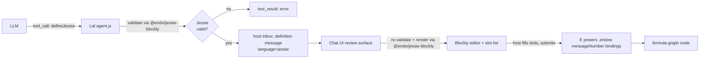

# Lal `defineJessie` Tool with Blockly Rendering

| | |
|---|---|
| **Created** | 2026-05-13 |
| **Updated** | 2026-05-16 |
| **Author** | Kris Kowal (prompted) |
| **Status** | Proposed |

## Background

This design uses terminology from several adjacent projects.
A reader new to Lal and the Endo monorepo can decode the rest of the
document from this glossary.

- **Lal**: the LLM-driven agent shipped in `@endo/lal` (`packages/lal/`).
  Lal proposes structured tool calls to the host on behalf of an LLM
  conversation; the host's Chat UI renders those proposals for human
  review before they execute.
- **The `define` tool**: a tool that Lal exposes to the LLM, taking a
  source string and a `slots` map of named capability holes the host
  fills from their own inventory.
  When the LLM calls `define`, the proposal arrives in the host's inbox
  as a `definition` message (source plus a slot manifest); the Chat UI
  renders that incoming message for review — inline in
  `inbox-component.js` (a `<pre><code>` source block plus one `<input>`
  per slot) and, for the fuller review flow, in `endow-modal.js` — and
  the host fills the slots and submits.
  On submit the host does **not** call `define` again; it calls
  `E(powers).endow(messageNumber, bindings, …)`, which binds the host's
  chosen slot values to the proposal and produces a formula-graph node.
  (`define-form.js` is a *separate* surface — the host's own from-scratch
  proposal composer, opened by the `/define` slash command, which calls
  `E(powers).define(source, slots)`. It is not the renderer for an
  incoming LLM proposal, and is out of scope for this design; see
  § Chat UI: rendering an incoming proposal.)
- **Jessie**: a confined subset of JavaScript that an Endo guest can
  evaluate safely (no ambient globals, no `eval`, no `new Function`, no
  loops outside Justin expressions).
  The Jessie grammar and parser live in `endojs/Jessie`.
- **Justin**: the pure-expression sub-language of Jessie (no statements,
  no `const`/`let`, no imports).
  Justin underpins Jessie's expression-level grammar but is too narrow
  for whole-module proposals.
- **Blockly**: Google's open-source library for building visual,
  block-based program editors. A Blockly *workspace* holds draggable
  *blocks* the user assembles from a *toolbox*; a *code generator* walks
  the assembled blocks and emits source text. `endojs/Jessie#127` adds
  Blockly editors whose blocks are derived from the Jessie grammars, so
  any composable workspace generates valid Jessie.
- **Slots (= capability holes)**: named placeholders in a `define`
  proposal that stand in for capabilities the host owns.
  This document uses "slots" and "capability holes" interchangeably; the
  capability-hole framing is the original mental model from Endo's
  capability literature and the `slots` term is the in-code identifier.

## What is the Problem Being Solved?

`@endo/lal` already exposes a `define(source, slots)` tool that lets the agent
propose JavaScript with named capability holes for the host to fill from their
own inventory.
The proposal arrives in the host's inbox as a `definition` message, which the
Chat UI renders for review (a raw-source block plus a slot list); the host
fills the slots and submits via `E(powers).endow`.
This works, but the surface has two problems for non-programmer users:

1. The proposal language is unconstrained JavaScript.
   A Lal proposal may use ambient globals, control-flow that the host did not
   expect, or syntax the host cannot evaluate intuitively.
   Because the proposal language is unconstrained, reviewing such a proposal
   is the same cognitive load as code review of arbitrary code, which is
   precisely what a capability-constrained UI ought to be able to avoid.
2. The text-editor presentation does not match the proposal model.
   A proposal is "this shape of expression with these slots", not "edit this
   program freely".
   A user who does not read JavaScript fluently has no way to validate the
   proposal before submitting it.

`endojs/Jessie` PR
[#127](https://github.com/endojs/Jessie/pull/127) lands a new
`packages/blockly-tools` with Blockly-based visual editors for the three
layered languages JSON, Justin, and Jessie.
The blocks are derived from the same grammars in
`packages/parse/src/quasi-*.js` that drive the textual checkers, and they
generate syntactically valid source as users compose them.
Jessie itself is a confined subset of JavaScript that an Endo guest can
evaluate without the surface that makes free JavaScript hard to reason about
(no ambient globals, no `eval`, no `new Function`, no loops outside Justin
expressions).

This design proposes a `defineJessie` variant of Lal's `define` tool that
sits alongside the existing `define`.
A `defineJessie` proposal carries:

- Jessie source (validated against the Jessie checker from
  [endojs/Jessie#127](https://github.com/endojs/Jessie/pull/127)).
- The same `slots` shape as `define`.

When such a proposal reaches the host's inbox, the Chat UI renders it with the
Blockly visual editor from a new `@endo/jessie-blockly` package (which vendors
the upstream Jessie tooling until it publishes), so the host sees the proposal
as a tree of labeled blocks with capability holes, edits it visually, and
submits.
The submit path is unchanged (`E(powers).endow`, producing a formula-graph
node with the host's chosen bindings), so the rest of the system — follow-on
use of the result, retention, GC, formula history — is unchanged.

Two surfaces change to support the variant, plus the new shared package:

- A new `language` option on `define` itself.
  `E(powers).define(source, slots, options?)` carries `options.language`
  so the resulting `definition` message can be tagged and the Chat UI
  can pick the right renderer.
  The option is open-ended (`'jessie'` initially, room for future
  language tags) and the absence of the option is treated as the
  existing `define` behavior, so the change is fully back-compatible.
  See Open Question 2 for the maintainer-confirmed shape.
  The tag is a routing *hint*, not a trust boundary: the Blockly renderer
  re-validates the source with `parseJessie` before rendering, so the
  "every Blockly-rendered proposal is valid Jessie" claim holds by
  construction regardless of who set the tag (see § Chat UI and
  Open Question 6).
- The Chat UI's incoming-proposal review surface (the `definition`
  renderer in `inbox-component.js` and the `endow-modal.js` modal) gains
  a Blockly rendering branch, selected when the message is Jessie-valid.
  See § Chat UI: rendering an incoming proposal.
- A new `@endo/jessie-blockly` package that bundles the Jessie
  parser/checker and the Blockly workspace tools.
  See Open Question 3.

## Design

### Overview



Diagram key.
`JV` is the Jessie-validity gate (Lal's `parseJessie` call against the
proposed source).
`TR` is the `tool_result` error the LLM sees if `JV` rejects.
`HM` is the host's inbox `definition` message that carries an accepted
proposal forward, tagged `language=jessie`.
`BE` is the Blockly editor plus slot-list panel the host interacts with,
reached only after the review surface re-validates the source.
`Eval` is the `E(powers).endow(messageNumber, bindings)` call the host
submits once slots are filled — the same submit path the plain
`definition` renderer already uses.

The variant reuses every existing piece of plumbing.
The new code is:

- A new `@endo/jessie-blockly` package (`packages/jessie-blockly/`)
  that bundles the Jessie parser/checker (imported by Lal) and the
  Blockly workspace tools (imported by the Chat package), vendored
  from `endojs/Jessie#127` until `@jessie/parse` and
  `@jessie/blockly-tools` publish on npm, at which point
  `@endo/jessie-blockly` becomes a thin re-export.
- A `defineJessie` entry in Lal's tool registry (`packages/lal/agent.js`)
  with its own JSON schema and case in `executeTool`.
- A Jessie-validation step in that case, citing the checker from
  `@endo/jessie-blockly` (the parser/grammar surface that Jessie PR
  #127's blocks themselves build on, re-exported from the new package).
- A `language: 'jessie'` tag carried on the `definition` message, set by
  the `options.language` argument threaded through `E(powers).define`.
- A Blockly rendering branch in the Chat UI's incoming-proposal review
  surface (`inbox-component.js`'s `definition` renderer and
  `endow-modal.js`), selected when the incoming source re-validates as
  Jessie, and producing the same `{ messageNumber, bindings }` shape the
  existing `endow` submit path consumes.

### Lal-side tool registration and validation

In `packages/lal/agent.js`, add a `defineJessie` entry to the tools array
immediately after `define`.
The shape mirrors `define` exactly, except for the tool name, the description
(which states the Jessie constraint and why), and the validation hook in
`executeTool`:

```js
// --- defineJessie (Jessie-only code with slots for host to fill) ---
{
  type: 'function',
  function: {
    name: 'defineJessie',
    description: `\
Same as define(), but the source must be a Jessie module. Jessie is a
confined subset of JavaScript without ambient globals, eval, new Function,
or unbounded loops outside Justin expressions. The host's Chat UI renders
this proposal as a visual block program (Blockly), which the host can
inspect and edit before filling slots and submitting.

Prefer defineJessie() over define() whenever the proposal fits inside
Jessie. The host's review burden is lower and the visual rendering helps
non-programmer hosts validate the proposal.

Example: Same as define(), but the source must parse as Jessie.
  defineJessie("E(counter).increment()", {"counter": {"label": "..."}})`,
    parameters: { /* identical to define */ },
  },
},
```

In `executeTool`, the `defineJessie` case parses with the Jessie checker
before forwarding to `E(powers).define`:

```js
case 'defineJessie': {
  const { source, slots } = args;
  if (source === undefined) {
    throw new Error('source is required');
  }
  if (slots === undefined) {
    throw new Error('slots is required');
  }
  // Validate against the Jessie grammar.
  const { parseJessie } = await import('@endo/jessie-blockly');
  try {
    parseJessie(source);
  } catch (parseError) {
    throw new Error(`Jessie validation failed: ${parseError.message}`);
  }
  // Tag the proposal so the host's Chat UI can route to the Blockly form.
  return E(powers).define(source, harden(slots), { language: 'jessie' });
}
```

The error path uses the same plain `throw new Error(...)` idiom as the
`source is required` / `slots is required` checks above it and as every
other tool case in `agent.js`, rather than importing `@endo/errors`'
`makeError`/`X`/`q` helpers for one call site.

The third argument to `E(powers).define` is the agreed extension point:
`define(source, slots, options?)` with `options.language` (maintainer
decision 2026-05-14, see Open Question 2 below).
The reserved-slot-key and sibling-method alternatives were considered
and dropped in favor of the explicit `options` bag; both are written up
in § Alternatives Considered.

The Lal-side validator imports from `@endo/jessie-blockly`, the new
Endo-monorepo package that vendors the Jessie parser until upstream
publishes; see Open Question 3 below for the eject-back plan.

### Host-side package message tagging

`define` today produces a daemon-side `definition` message whose body
contains the source and the slot manifest.
The Chat UI renders any such message with its plain `definition` renderer
(the inline `inbox-component.js` view and the `endow-modal.js` modal).

The minimum host-side change is to carry a `language: 'jessie'` tag on the
`definition` message produced by a `defineJessie` proposal, so the Chat UI
can pick the Blockly rendering branch when `language === 'jessie'` and the
existing plain renderer otherwise.
The tag threads through the optional `options.language` argument added to
`E(powers).define` (Open Question 2): the daemon copies it onto the
`definition` message body it constructs.
The tag travels with the message; nothing about retention, formula
construction, or the `endow` submit path changes.

The tag is a *hint* for renderer selection, not a security boundary. Any
capability holder that can call `E(powers).define` directly could set
`options.language: 'jessie'` on arbitrary, unvalidated source. So the
Blockly branch does not trust the tag: it re-runs `parseJessie` on the
incoming source and only renders with Blockly if that succeeds, falling
back to the plain `definition` renderer otherwise (see § Chat UI and
Open Question 6). The invariant "every Blockly-rendered proposal is valid
Jessie" is therefore produced by the renderer's own re-validation, not
carried by a forgeable tag.

### Chat UI: rendering an incoming proposal

The incoming-proposal review surface today lives in two places, both of
which submit through `E(powers).endow`:

- `inbox-component.js`'s `message.type === 'definition'` branch renders
  the proposal inline (a `<pre><code>` source block plus one `<input>`
  per slot) and submits via `E(powers).endow(number, bindings)`.
- `endow-modal.js` (opened by the `endow` command with a message number)
  is the fuller review modal; it fetches the definition's source and
  slots and submits via
  `E(powers).endow(messageNumber, bindings, workerName, resultName)`.

Both branches gain a Blockly rendering path. When a `definition` message
is tagged `language: 'jessie'` **and** re-validates via
`@endo/jessie-blockly`'s `parseJessie`, the surface embeds a Blockly
workspace in place of the raw-source block; otherwise it falls back to the
existing plain renderer. The slot list and the `endow` submit shape are
unchanged — only the source-review widget differs — so the Blockly branch
produces the same `{ messageNumber, bindings }` the plain path already
feeds to `endow`.

Initial source from the LLM is parsed and reconstructed as a Blockly
workspace via Blockly's standard
[JSON serialization format](https://developers.google.com/blockly/guides/configure/web/serialization).
This is the same format the PR #127 tests use as fixtures, so the
round-trip fixtures from Phase 4 reuse the upstream test data directly.
Slot variables in the source are surfaced as **slot blocks** in a dedicated
toolbox category; the host does not edit slot identifiers directly.

The slot list panel from the existing `definition` renderer is preserved
verbatim, since the slot model is identical; only the source editor differs.

#### Slot blocks

A slot in a Jessie program is a free variable in the source whose value the
host will bind at submit time.
Two candidate representations land in Phase 3 behind a feature flag and
are bake-off-compared (see Open Question 4):

1. **Custom `jessie_slot` block.**
   A custom block type with a single dropdown field naming the slot and
   an output shaped like a value (no statement plug).
   The block's code generator emits the slot identifier as a bare
   reference.
   Adding a slot in the slot panel adds a draggable instance of that
   block to the toolbox; removing a slot removes the toolbox entry and
   (with confirmation) any uses of the slot in the workspace.
   Keeps slots in lockstep between the visual program and the slot
   panel without needing a parallel free-variable analysis on the
   generated source.

2. **Standard Blockly variable blocks.**
   Slots are surfaced through Blockly's built-in variable category, so
   the visual UX matches `endojs/Jessie#127`'s Blockly editor for users
   who have seen Jessie tooling elsewhere.
   The slot panel reflects the variable registry rather than acting as
   the source of truth.

Both are built behind a feature flag in Phase 3 and compared on the three
axes and three real proposals that Open Question 4 specifies; the winner
is picked in a follow-up commit on this design before Phase 3 freezes.

#### Validation errors

Two validation surfaces:

1. **Lal-side validation** (above) catches a malformed proposal before it
   ever reaches the host's inbox.
   The LLM sees the validation error as a normal `tool_result` error and
   retries.
2. **Host-side editing** in the Blockly workspace cannot produce invalid
   Jessie by construction: the block grammar is a subset of Jessie's, and
   the code generator emits valid Jessie for any composable workspace.
   The exception is slot identifiers; a slot referenced in the workspace
   that has been removed from the slot panel produces a code-generation
   warning shown inline in the slot panel and blocks the submit button
   until the host resolves it.
   Caveat: the by-construction claim depends on the block grammar
   shipped in `@endo/jessie-blockly` matching the Jessie grammar that
   `endojs/Jessie#127` settles on.
   The vendor package's `parseJessie` validator is the binding
   correctness check on the Lal side, so Lal-side validation fails closed
   if the block grammar and the parser ever drift apart inside
   `@endo/jessie-blockly`.

A "View source" toggle in the form footer reveals the generated Jessie
source as read-only text, so power users can audit the rendering.
There is no "edit as text" mode in v1.
A host who wants to free-edit should compose with the existing `define`
surface instead.
Correspondingly, the LLM should propose `define` rather than `defineJessie`
when the program does not fit the Jessie subset, and the system prompt
says so (see § LLM system-prompt change).

### LLM system-prompt change

In `agent.js`'s `systemPrompt`, add a short paragraph after the existing
`define()` guidance:

> Prefer `defineJessie()` over `define()` when your proposed program is a
> Jessie module (no ambient globals, no `eval`/`new Function`, no loops
> outside Justin expressions). The host's review surface is lighter for
> Jessie proposals because the Chat UI renders them as visual block
> programs. Fall back to `define()` only when your program genuinely
> requires JavaScript features Jessie excludes.

### Dependencies

| Design | Relationship |
|--------|--------------|
| [lal-fae-form-provisioning](lal-fae-form-provisioning.md) | Defines the manager/worker split that owns Lal's tool surface. `defineJessie` is added to the same surface. |
| [chat-slot-slash-commands](chat-slot-slash-commands.md) | Sibling: a user-driven path for inlining anonymous values into slots. `defineJessie`'s slot panel uses the same slot-value model and benefits if slash-slot fillers are available. |
| [chat-markdown-render](chat-markdown-render.md) | Independent. Slot labels and the form's chrome use the standard Chat Markdown renderer. |
| [endojs/Jessie#127](https://github.com/endojs/Jessie/pull/127) | Upstream dependency. The `@jessie/blockly-tools` package and the underlying `@jessie/parse` checker land here, eventually. Until they publish on npm (neither was published as of 2026-05-14), the new `@endo/jessie-blockly` package in this monorepo vendors the equivalent surface so this design is not gated on Jessie #127's merge timeline. |

### Phased implementation

The implementation lands in five phases.
Phase 0 lands the shared `@endo/jessie-blockly` package every later phase
imports from; Phases 1 through 4 then layer the Lal tool registration,
the host-side language tag, the Chat UI Blockly branch, and the tests
and documentation in turn.

1. **Phase 0: `@endo/jessie-blockly` package.**
   Create `packages/jessie-blockly/` with the Jessie parser/checker and
   the Blockly workspace tools, vendored from `endojs/Jessie#127` (or
   re-bundled from scratch against the same grammars).
   The package exposes a `parseJessie` validator for Lal and a Blockly
   workspace factory for the Chat package.
   The vendor step preserves the upstream generation link — the blocks
   and the checker both derive from the same `packages/parse/src/quasi-*.js`
   grammars — rather than copying the two artifacts as independently
   vendored files that could drift; see Open Question 6.
   Mergeable on its own; gives downstream phases a single import surface.

2. **Phase 1: Lal tool registration.**
   Add the `defineJessie` entry to `agent.js`'s tool array, the
   `executeTool` case, and the `@endo/jessie-blockly` import.
   The tool call works end-to-end through the existing plain `definition`
   renderer (the Chat UI does not yet know about `language: 'jessie'`).
   This phase is mergeable on its own and gives Lal a Jessie-validating
   tool even before the Blockly UI lands.

3. **Phase 2: Host-side language tag.**
   Extend `E(powers).define` to accept the `options?` bag with
   `options.language` (per Open Question 2's resolution), and wire the
   `definition`-message construction downstream to carry the tag.
   Wire the Chat UI's `definition` renderer to read the tag (and, per
   Open Question 6, re-validate the source) and choose between the plain
   renderer and the (still-stub) Blockly branch.
   Back-compat invariant: the new third parameter is optional and the
   daemon-side `EndoGuest.define` implementation treats an absent
   `options` argument identically to its prior two-argument behavior.
   Every existing two-argument caller of `E(powers).define` continues
   to work without change, and the `definition` message carries no
   `language` tag in the absent-options case (so the Chat UI defaults to
   the plain renderer).
   Mergeable on its own; the daemon-side change is a no-op for existing
   two-argument callers, and the Chat UI's Blockly branch routes to a
   stub until Phase 3 lands.

4. **Phase 3: Blockly rendering branch in the Chat package.**
   Implement the Blockly rendering branch in `inbox-component.js`'s
   `definition` renderer and in `endow-modal.js`, embedding the
   `@endo/jessie-blockly` Jessie workspace and re-validating incoming
   source before rendering (Open Question 6).
   Build **both** slot-block representations behind a feature flag (the
   custom `jessie_slot` block and the standard Blockly variable blocks;
   see § Slot blocks), run the Open-Question-4 bake-off across the three
   named proposals on all three axes, and land the winner in a follow-up
   commit before the phase freezes.
   Wire the source-view toggle and the slot panel.
   Add the system-prompt nudge that steers the LLM towards `defineJessie`.
   Not mergeable on its own: depends on the Phase 2 routing branch and the
   `@endo/jessie-blockly` workspace surface from Phase 0.
   This is the largest phase because it carries the two-implementation
   bake-off, not just a single wiring pass.

5. **Phase 4: Tests and docs.**
   AVA fixtures from `endojs/Jessie#127`'s `test/test-data.json` (where
   applicable, mirrored into `@endo/jessie-blockly`) cover the
   source-to-workspace and workspace-to-source round trip.
   Add a Lal-side validation-error fixture that feeds a non-Jessie source
   (one with an ambient global, an `eval` call, or a `for-of` loop
   outside a Justin expression) to the `defineJessie` `executeTool`
   case and asserts the call surfaces a normal `tool_result` error whose
   message matches the `Jessie validation failed: ...` shape produced by
   `throw new Error(\`Jessie validation failed: ${parseError.message}\`)`.
   This fixture pins the design's claim that the LLM sees the validation
   error as a tool error and retries.
   Add a host-side submit fixture that drives a Blockly-composed proposal
   through the slot-binding UI to `E(powers).endow` — the real submission
   path — and asserts the resulting bindings match, since `endow` (not a
   second `define`) is what actually lands the proposal.
   Update `packages/lal/primer/tools.md` to document `defineJessie`.
   Update `packages/chat`'s component index to note the Blockly branch.
   Not mergeable on its own: the fixtures presume the implementations
   from Phases 0 through 3 are in place.

Per-phase estimates: Phase 0 is S-sized (1 day; the package is mostly
vendoring and a build wire-up). Phases 1 and 2 are S-sized (1 day each).
Phase 3 is L-sized (4 days): the Blockly integration itself is mostly
wiring, but Phase 3 also carries the two-implementation slot-block bake-off
from Open Question 4 (build both variants, run the three-proposal
comparison on three axes, pick the winner), which is materially more than a
single-implementation pass.
Phase 4 is S-sized (1 day).

Total estimate: M-L-sized, 8 days
(Phase 0 1 + Phase 1 1 + Phase 2 1 + Phase 3 4 + Phase 4 1 = 8).
The Phase-0 vendoring package (+1 day) and the Phase-3 slot-block bake-off
(+2 days over a single-implementation Phase 3) are the two additions over
the original ~5-day sketch.

## Alternatives Considered

- **Replace `define` with `defineJessie` outright.**
  Rejected.
  The existing `define` is in use by Lal and removing it would break
  proposals that rely on JavaScript features Jessie excludes (e.g., a
  `for-of` loop over an array the agent has reason to believe is short).
  The two coexist; the system prompt steers the LLM towards
  `defineJessie` first, and the LLM falls back to `define` when needed.

- **Validate as Justin instead of Jessie.**
  Rejected.
  Justin is the pure-expression subset (no statements, no `const`/`let`,
  no imports), which is too narrow for most proposals.
  Jessie is the natural module-level subset; the Blockly tooling in PR
  #127 already supports it.
  If a Justin-only variant becomes useful later, it can be added as
  `defineJustin` following the same pattern.

- **Render Jessie source in Monaco with a Jessie-aware linter rather than
  Blockly.**
  Rejected.
  Deferred to a possible later power-user toggle; not in v1.
  This addresses problem 1 (Jessie subset) but not problem 2 (text-editor
  presentation does not match the proposal model).
  Blockly is the documented user-facing tool from PR #127 and is the more
  ambitious bet on visual review.
  A Monaco-with-Jessie-linter mode could be added later as a power-user
  toggle without revisiting this design.

- **Embed the Blockly workspace inline in the chat message bubble rather
  than in the modal/inline definition review surface.**
  Rejected.
  Deferred to a possible later iteration; not in v1.
  The existing review surface (the inline `definition` renderer and the
  `endow-modal.js` modal) is where slot filling already happens and where
  the host's focus already lands.
  A fully inline-in-the-transcript Blockly editor is interesting (the
  proposal becomes part of the transcript visually), but it complicates
  editing, keyboard focus, and message threading.
  Worth revisiting once Phase 3 lands and we have real usage data.

- **Build Lal-specific Blockly blocks that bake in Endo capability
  references (e.g., a `lookup-petname` block) rather than reusing PR
  #127's vanilla Jessie blocks.**
  Rejected.
  Deferred to a possible follow-up design; not in v1.
  This couples Lal's tool surface to Blockly block definitions and
  diverges from the Jessie tooling that students and other Jessie users
  will share.
  v1 reuses PR #127's blocks unchanged, with capability holes surfaced as
  slot blocks.
  A future "capability-aware" block palette could be a follow-up design.

- **Block on `endojs/Jessie#127` merging and publishing instead of
  vendoring a copy now.**
  Rejected.
  As of 2026-05-14 neither `@jessie/parse` nor `@jessie/blockly-tools`
  was published on npm and #127 had not landed, so waiting would gate
  this whole design on another repo/team's merge timeline for an
  indefinite period.
  Vendoring a copy in `@endo/jessie-blockly` (Phase 0) lets the work
  proceed now; the cost is drift risk against an actively-evolving
  upstream PR, which is the failure mode § Validation errors and
  Open Question 6 address by preserving the grammar→checker+blocks
  generation link in the vendor step and by re-validating on the render
  side.
  When upstream publishes, `@endo/jessie-blockly` becomes a thin
  re-export and the eject-back is a single-package rename (Open Q1, Q3).
  The tradeoff (schedule certainty now vs. no drift risk later) is judged
  in favor of vendoring; the drift risk is bounded by the two
  mitigations above.

- **Carry the language tag as a reserved key inside the existing `slots`
  map instead of a new `options` argument.**
  Rejected.
  Overloading `slots` (a map of capability holes) with a non-slot control
  key complects two independent concerns and would need every `slots`
  consumer to special-case the reserved key. The explicit `options` bag
  keeps the slot manifest a pure slot manifest.

- **Add a distinct daemon-side `defineJessie` method (a sibling of
  `define`) instead of an `options.language` flag on `define`.**
  Rejected.
  It doubles the daemon surface and the guest interface for what is a
  presentation/routing distinction, and the underlying formula
  construction and `endow` submit path are identical for both. The
  `options` bag adds the routing tag without a second daemon method, and
  is the natural carrier for future per-proposal flags. Because the tag
  is a forgeable hint (any caller of `define` can set it), the safety
  claim rests on renderer-side re-validation (Open Question 6), not on a
  method-level distinction, so a separate method would buy no additional
  guarantee.

## Open Questions

These need maintainer input or an upstream landing before implementation
can start:

1. **`@jessie/parse` package name and checker API.** Resolved
   2026-05-14: as of this date, `@jessie/parse` is not on npm
   (`npm view @jessie/parse` returns 404), and `endojs/Jessie#127` has
   not yet landed.
   The Lal-side validation step therefore depends on whichever Jessie
   parser surface lands first.
   Practical path: bundle the validator inside the new
   `@endo/jessie-blockly` package (see Q3 below) so Lal can import the
   parser and the Chat UI can import the blocks from the same place.
   When the upstream Jessie packages publish, `@endo/jessie-blockly`
   re-exports the upstream parser and the eventual eject-back is a
   single-package rename rather than two.

2. **`E(powers).define` extension for the `language` tag.** Resolved
   2026-05-14: extend `define` with an optional options bag, so the
   signature becomes `define(source, slots, options?)` with
   `options.language`.
   The reserved-slot-key and sibling-method alternatives are dropped (both
   written up in § Alternatives Considered).
   The daemon-side `EndoGuest` interface change is in scope for this
   prototype; the same `options` bag is the natural carrier for future
   per-proposal flags (e.g. confinement hints, presentation hints) so
   the cost is paid once.
   Note that `options.language` is a routing hint only; it is not a
   trust boundary, which is why Open Question 6 puts the safety-relevant
   validation on the render side.

3. **Packaging the Blockly tools for embedded use.** Resolved
   2026-05-14: create a new `@endo/jessie-blockly` package in
   `packages/jessie-blockly/` to keep this prototype moving while the
   upstream Jessie tooling stabilizes.
   The package bundles the Jessie parser/checker and the Blockly
   workspace tools that Lal and the Chat package need, vendored from
   `endojs/Jessie#127` until that PR lands and the upstream packages
   publish.
   Bundle-size caveat — *unmeasured*: embedding a full Blockly workspace
   in the Chat UI bundle adds meaningful weight, and this design does not
   yet have a figure or a budget for it. To be measured at Phase 3 when
   the workspace is first bundled into the Chat esbuild output; if it
   exceeds a to-be-set budget, the fallback is lazy-loading the Blockly
   workspace chunk only when a Jessie proposal is actually rendered.
   Once `@jessie/parse` and `@jessie/blockly-tools` publish on npm,
   `@endo/jessie-blockly` becomes a thin re-export and can be ejected
   back out of the Endo monorepo with a single-package rename.

4. **Slot block design (custom block vs. variable block).** Resolved
   2026-05-14: run a bake-off of the two implementations under Phase 3
   rather than picking on paper.
   Build both variants behind a feature flag in the Chat-side Blockly
   branch: one wires `jessie_slot` as a custom block keyed to the slot
   panel, the other reuses Blockly's standard variable blocks keyed to the
   variable registry.
   Compare on three axes: (a) consistency with `endojs/Jessie#127`'s
   tooling for users who have seen Jessie's editor elsewhere, (b)
   round-trip stability between the slot panel and the workspace under
   slot rename and removal, and (c) the size of the implementation in
   `@endo/jessie-blockly`.
   Run the bake-off on at least three real proposals (the slot-heavy
   counter example, a small Lal-defined formula, and one capability
   composition) and pick the winner in a follow-up commit on this
   design before Phase 3 freezes.
   This bake-off is why Phase 3 is L-sized (see § Phased implementation).
   The fallback if both work is to ship the standard variable approach
   for consistency with PR #127's tooling.

5. **System-prompt steering effectiveness.** Acknowledged (deferred to
   Phase 4+): "Prefer `defineJessie` over `define` when ..." is a soft
   nudge.
   If LLMs systematically pick the wrong one, we may need a harder rule
   (e.g., reject `define()` proposals that would have validated as Jessie
   and return a tool error suggesting `defineJessie` instead).
   This is a Phase 4+ tuning question, not a blocker for the initial
   design.
   Proposed Phase 4 exit criterion for this question: at least 80% of a
   curated test-set of proposals that fit the Jessie subset route to
   `defineJessie` rather than `define`, measured against a frozen
   prompt-and-fixture pair recorded in `packages/lal/test/`.
   The exact threshold is a Phase 4+ tuning knob; the existence of a
   measurable criterion is what makes the question terminable.

6. **Making the "valid Jessie" invariant unforgeable.** Resolved
   2026-05-16: because `options.language` is a caller-settable hint on the
   generic `define` (any capability holder can call
   `define(source, slots, {language: 'jessie'})` with arbitrary source),
   the tag alone cannot carry the safety claim that every Blockly-rendered
   proposal is valid Jessie.
   Resolution: the Chat UI's Blockly branch re-runs `parseJessie` on the
   incoming source before rendering, and falls back to the plain
   `definition` renderer if it fails. The invariant is thus produced by
   the render-side validator (the step that actually ran the check), not
   carried by the tag.
   Complementarily, the Phase 0 vendor step preserves the upstream
   grammar→(checker + blocks) generation link rather than copying the two
   artifacts as independently-vendored files, so the checker the renderer
   runs and the blocks it renders into stay two views of one grammar
   rather than two copies that can drift.

## Prompt

> Draft a design under `packages/lal` (or `packages/chat`, designer's
> call) for a `define-jessie` variant of Lal's `define` tool. The variant
> validates the proposal as Jessie (per the parser/checker landing in
> endojs/Jessie#127) and the Chat UI renders the proposal using the
> Blockly visual editor from that same PR's new `packages/blockly-tools`.
> Cover: where the validation hook fits in Lal's tool-call routing, what
> the Chat UI needs (new component, Blockly integration, message
> rendering), how validation errors surface to the user, and whether the
> variant replaces or coexists with the existing `define`. Open in draft,
> design-only, no implementation.
