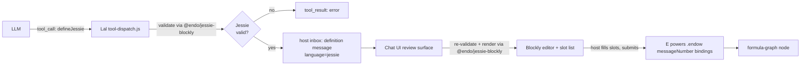

# Lal `defineJessie` Tool with Blockly Rendering

| | |
|---|---|
| **Created** | 2026-05-13 |
| **Updated** | 2026-08-31 |
| **Author** | Kris Kowal (prompted) |
| **Status** | Proposed |

## Background

This design uses terminology from several adjacent projects.
A reader new to Lal and the Endo monorepo can decode the rest of the
document from this glossary.

- **Lal**: the LLM-driven agent shipped in `@endo/lal` (`packages/lal/`).
  Lal proposes structured tool calls to the host on behalf of an LLM
  conversation; the host's Chat UI renders those proposals for human
  review before they execute.
- **The `define` tool**: a tool that Lal exposes to the LLM, taking a
  source string and a `slots` map of named capability holes the host
  fills from their own inventory.
  When the LLM calls `define`, the proposal arrives in the host's inbox
  as a `definition` message (source plus a slot manifest).
  The Chat UI renders that incoming message for review in two places,
  both inside a *confined* (authority-free) component rather than in the
  trusted host frame: inline in the `definition` branch of `InboxRoot` in
  `packages/space-chat/src/inbox.js` (a source block plus one `<input>`
  per slot), mounted by the thin trusted-host wrapper
  `packages/chat/inbox-component.js`; and, for the fuller review flow, in
  the `endow-modal.js` modal (`packages/spaces-util/src/endow-modal.js`).
  That the real renderer lives inside the confinement boundary matters for
  embedding Blockly; see § Chat UI: rendering an incoming proposal.
  The host fills the slots and submits.
  On submit the host does **not** call `define` again; it calls
  `E(powers).endow(messageNumber, bindings, ...)`, which binds the host's
  chosen slot values to the proposal and produces a *formula-graph node*
  (the persistent daemon-side object the proposal becomes once its slots
  are bound, tracked in the formula graph for retention and GC).
  (`define-form.js` is a *separate* surface: the host's own from-scratch
  proposal composer, opened by the `/define` slash command, which calls
  `E(powers).define(source, slots)`. It is not the renderer for an
  incoming LLM proposal, and is out of scope for this design; see
  § Chat UI: rendering an incoming proposal.)
- **Jessie**: a confined subset of JavaScript that an Endo guest can
  evaluate safely: no ambient globals, no `eval`, no `new Function`.
  (The exact statement and iteration constructs Jessie admits are pinned
  against the `endojs/Jessie#127` grammar at Phase 0; see § Phased
  implementation. Earlier drafts described the confinement as "no loops
  outside Justin expressions," which contradicted the fact that Justin is
  a statement-free sub-language and is dropped here pending that grammar
  check.)
  The Jessie grammar and parser live in `endojs/Jessie`.
- **Justin**: the pure-expression sub-language of Jessie (no statements,
  no `const`/`let`, no imports, and so no loops).
  Justin underpins Jessie's expression-level grammar but is too narrow
  for whole-module proposals.
- **Blockly**: Google's open-source library for building visual,
  block-based program editors. A Blockly *workspace* holds draggable
  *blocks* the user assembles from a *toolbox*; a *code generator* walks
  the assembled blocks and emits source text. `endojs/Jessie#127` adds
  Blockly editors whose blocks are derived from the Jessie grammars, so
  any composable workspace generates valid Jessie.
- **Slots (= capability holes)**: named placeholders in a `define`
  proposal that stand in for capabilities the host owns.
  This document uses "slots" and "capability holes" interchangeably; the
  capability-hole framing is the original mental model from Endo's
  capability literature and the `slots` term is the in-code identifier.

## What Is the Problem Being Solved?

`@endo/lal` already exposes a `define(source, slots)` tool that lets the agent
propose JavaScript with named capability holes for the host to fill from their
own inventory.
The proposal arrives in the host's inbox as a `definition` message, which the
Chat UI renders for review (a raw-source block plus a slot list); the host
fills the slots and submits via `E(powers).endow`.
This works, but the surface has two problems for non-programmer users:

1. The proposal language is unconstrained JavaScript.
   A Lal proposal may use ambient globals, control-flow that the host did not
   expect, or syntax the host cannot evaluate intuitively.
   Because the proposal language is unconstrained, reviewing such a proposal
   is the same cognitive load as code review of arbitrary code, which is
   precisely what a capability-constrained UI ought to be able to avoid.
2. The text-editor presentation does not match the proposal model.
   A proposal is "this shape of expression with these slots," not "edit this
   program freely."
   A user who does not read JavaScript fluently has no way to validate the
   proposal before submitting it.

[`endojs/Jessie#127`](https://github.com/endojs/Jessie/pull/127) lands a new
`packages/blockly-tools` with Blockly-based visual editors for the three
layered languages JSON, Justin, and Jessie.
The blocks are derived from the same grammars in
`packages/parse/src/quasi-*.js` that drive the textual checkers, and they
generate syntactically valid source as users compose them.
Jessie itself is a confined subset of JavaScript that an Endo guest can
evaluate without the surface that makes free JavaScript hard to reason about
(no ambient globals, no `eval`, no `new Function`; the exact statement and
iteration constructs it admits are pinned against the `endojs/Jessie#127`
grammar at Phase 0).

This design proposes a `defineJessie` variant of Lal's `define` tool that
sits alongside the existing `define`.
A `defineJessie` proposal carries:

- Jessie source (validated against the Jessie checker from
  [`endojs/Jessie#127`](https://github.com/endojs/Jessie/pull/127)).
- The same `slots` shape as `define`.

When such a proposal reaches the host's inbox, the Chat UI renders it with the
Blockly visual editor from a new `@endo/jessie-blockly` package (which
re-exports the published `@jessie.js/parse` checker and vendors the upstream
Blockly tooling until it publishes), so the host sees the proposal
as a tree of labeled blocks with capability holes, edits it visually, and
submits.
The submit path is unchanged (`E(powers).endow`, producing a formula-graph
node with the host's chosen bindings), so the rest of the system (follow-on
use of the result, retention, GC, formula history) is unchanged.

Two surfaces change to support the variant, plus the new shared package:

- A new `language` option on `define` itself.
  `E(powers).define(source, slots, options?)` carries `options.language`
  so the resulting `definition` message can be tagged and the Chat UI
  can pick the right renderer.
  The option is open-ended (`'jessie'` initially, room for future
  language tags) and the absence of the option is treated as the
  existing `define` behavior, so the change is fully back-compatible.
  See Open Question 2 for the maintainer-confirmed shape.
  The tag is a routing *hint*, not a trust boundary: the Blockly renderer
  re-validates the source with `parseJessie` before rendering, so the
  "every Blockly-rendered proposal is valid Jessie" claim holds by
  construction regardless of who set the tag (see § Chat UI and
  Open Question 6).
- The Chat UI's incoming-proposal review surface (the confined
  `definition` renderer in `packages/space-chat/src/inbox.js` and the
  `endow-modal.js` modal) gains a Blockly rendering branch, selected when
  the message is Jessie-valid.
  See § Chat UI: rendering an incoming proposal.
- A new `@endo/jessie-blockly` package that re-exports the published
  Jessie parser/checker and bundles the Blockly workspace tools.
  See Open Question 3.

## Design

### Overview



Diagram key.
`JV` is the Jessie-validity gate (Lal's `parseJessie` call against the
proposed source).
`TR` is the `tool_result` error the LLM sees if `JV` rejects.
`HM` is the host's inbox `definition` message that carries an accepted
proposal forward, tagged `language=jessie`.
`BE` is the Blockly editor plus slot-list panel the host interacts with,
reached only after the review surface re-validates the source.
`Eval` is the `E(powers).endow(messageNumber, bindings)` call the host
submits once slots are filled; it is the same submit path the plain
`definition` renderer already uses.

The variant reuses every existing piece of plumbing.
The new code is:

- A new `@endo/jessie-blockly` package (`packages/jessie-blockly/`)
  that re-exports the already-published Jessie parser/checker
  (`@jessie.js/parse`, imported by Lal) under its `/parse` subpath and
  bundles the Blockly workspace tools (imported by the Chat package) under
  its `/blockly` subpath, the latter vendored from `endojs/Jessie#127`
  until `@jessie.js/blockly-tools` publishes on npm, at which point that
  half becomes a thin re-export too.
- A `defineJessie` entry in Lal's tool registry
  (`packages/lal/tools/code.js`, alongside `define`) as a `LalToolDef`,
  dispatched from a new `case 'defineJessie'` in the single `switch (name)`
  of `packages/lal/tool-dispatch.js`.
- A Jessie-validation step in that dispatch case, citing the checker from
  `@endo/jessie-blockly/parse` (a thin re-export of the published
  `@jessie.js/parse`, the same parser/grammar surface `endojs/Jessie#127`'s
  blocks build on).
- A `language: 'jessie'` tag carried on the `definition` message, set by
  the `options.language` argument threaded through `E(powers).define`.
- A Blockly rendering branch in the Chat UI's incoming-proposal review
  surface (the confined `definition` renderer in
  `packages/space-chat/src/inbox.js` and the `endow-modal.js` modal),
  selected when the incoming source re-validates as Jessie, and producing
  the same `{ messageNumber, bindings }` shape the existing `endow` submit
  path consumes. Because that renderer runs *inside* the space-chat
  confinement boundary, embedding a DOM-heavy library there is a distinct
  problem Phase 3 must address (§ Chat UI).
- A short system-prompt paragraph in `agent.js`'s `systemPrompt` steering
  the LLM toward `defineJessie` for Jessie-expressible programs (§ LLM
  system-prompt change).

### Lal-side tool registration and validation

Lal's tools are declared as `LalToolDef` records in
`packages/lal/tools/*.js` (the `define` record lives in
`packages/lal/tools/code.js`) and dispatched from a single `switch (name)`
in `packages/lal/tool-dispatch.js`; there is no per-tool `executeTool`
closure or `{ type: 'function', function: { ... } }` schema in `agent.js`.
Add a `defineJessie` record to `code.js` immediately after `define`, and a
`case 'defineJessie'` to the dispatch switch.

The tool record mirrors `define`'s shape (a `name`, a factual `summary`, and
a `params` pattern built with `@endo/patterns`' `M.splitRecord`). The
`summary` is descriptive only: it states what the tool does and its Jessie
constraint, and does **not** carry "prefer this over `define`" steering.
That steering lives solely in the system prompt (§ LLM system-prompt
change), so the two do not drift:

```js
// --- defineJessie (Jessie-only code with slots for host to fill) ---
{
  name: 'defineJessie',
  summary:
    'Propose a reusable program, like define(), but the source must be a ' +
    'Jessie module (a confined subset of JavaScript without ambient ' +
    'globals, eval, or new Function). The host reviews it as a visual ' +
    'block program. Arguments: source (string), slots (object mapping ' +
    'slot name to { label }).',
  params: M.splitRecord({
    source: M.string(),
    slots: M.recordOf(M.string(), M.splitRecord({ label: M.string() })),
  }),
},
```

The dispatch case mirrors the existing `case 'define'` in
`tool-dispatch.js` and adds the Jessie check before forwarding to
`E(powers).define`:

```js
case 'defineJessie': {
  const { source, slots } = args;
  if (source === undefined) {
    throw new Error('source is required');
  }
  if (slots === undefined) {
    throw new Error('slots is required');
  }
  // Validate against the Jessie grammar.
  const { parseJessie } = await import('@endo/jessie-blockly/parse');
  try {
    parseJessie(source);
  } catch (parseError) {
    throw new Error(`Jessie validation failed: ${parseError.message}`);
  }
  // Tag the proposal so the host's Chat UI can route to the Blockly form.
  return E(powers).define(source, harden(slots), { language: 'jessie' });
}
```

The error path uses the same plain `throw new Error(...)` idiom as the
`source is required` / `slots is required` checks above it and as the
existing `case 'define'` in `tool-dispatch.js`, rather than importing
`@endo/errors`'s `makeError`/`X`/`q` helpers for one call site.

The third argument to `E(powers).define` is the agreed extension point:
`define(source, slots, options?)` with `options.language` (maintainer
decision 2026-05-14, see Open Question 2 below).
The reserved-slot-key and sibling-method alternatives were considered
and dropped in favor of the explicit `options` bag; both are written up
in § Alternatives Considered.

The Lal-side validator imports from `@endo/jessie-blockly/parse`, the lean
parser subpath of the new Endo-monorepo package; that subpath re-exports
the already-published `@jessie.js/parse` and never pulls in the Blockly
bundle. See Open Question 3 below for the packaging and eject-back plan.

### Host-side message tagging

`define` today produces a daemon-side `definition` message whose body
contains the source and the slot manifest.
The Chat UI renders any such message with its plain `definition` renderer
(the inline confined view in `packages/space-chat/src/inbox.js` and the
`endow-modal.js` modal).

The minimum host-side change is to carry a `language: 'jessie'` tag on the
`definition` message produced by a `defineJessie` proposal, so the Chat UI
can pick the Blockly rendering branch when `language === 'jessie'` and the
existing plain renderer otherwise.
The tag threads through the optional `options.language` argument added to
`E(powers).define` (Open Question 2): the daemon copies it onto the
`definition` message body it constructs.
The wire form stays back-compatible (an absent `options.language` writes
no tag), but the renderer normalizes a missing tag to the explicit default
`'javascript'` before switching, so every renderer branch and every future
language variant (the design floats `defineJustin`) switches on a uniform
named enum rather than special-casing key-absence.
The tag travels with the message; nothing about retention, formula
construction, or the `endow` submit path changes.

The tag is a *hint* for renderer selection, not a security boundary. Any
capability holder that can call `E(powers).define` directly could set
`options.language: 'jessie'` on arbitrary, unvalidated source. So the
Blockly branch does not trust the tag: it re-runs `parseJessie` on the
incoming source and only renders with Blockly if that succeeds, falling
back to the plain `definition` renderer otherwise (see § Chat UI and
Open Question 6). The invariant "every Blockly-rendered proposal is valid
Jessie" is therefore produced by the renderer's own re-validation, not
carried by a forgeable tag.

### Chat UI: rendering an incoming proposal

The incoming-proposal review surface today lives in two places, both of
which submit through `E(powers).endow`:

- The `message.type === 'definition'` branch of the confined `InboxRoot`
  in `packages/space-chat/src/inbox.js` renders the proposal inline (a
  source block plus one `<input>` per slot) and submits via
  `E(powers).endow(number, bindings)`. `packages/chat/inbox-component.js`
  is only the thin trusted-host wrapper that mounts this confined tree; it
  has no message-type branches of its own.
- `endow-modal.js` (`packages/spaces-util/src/endow-modal.js`, opened by
  the `endow` command with a message number) is the fuller review modal; it
  fetches the definition's source and slots and submits via
  `E(powers).endow(messageNumber, bindings, workerName, resultName)`.

Because the inline renderer runs inside space-chat's *confinement
boundary* (an authority-free component, not the trusted host frame),
embedding a DOM-heavy third-party library (Blockly) there is a materially
different problem from dropping it into a trusted wrapper: the confined
component has no ambient DOM/authority to hand Blockly, so Phase 3 must
either mount the Blockly workspace in the trusted host wrapper
(`inbox-component.js` / `endow-modal.js`) and bridge the composed
source/slots back across the boundary, or extend the confined surface with
exactly the capability Blockly needs. Phase 3 owns resolving this; it is
called out in § Phased implementation, Phase 3.

Both branches gain a Blockly rendering path. When a `definition` message
is tagged `language: 'jessie'` **and** re-validates via
`@endo/jessie-blockly`'s `parseJessie`, the surface embeds a Blockly
workspace in place of the raw-source block; otherwise it falls back to the
existing plain renderer. When a message *is* tagged `language: 'jessie'`
but the Blockly path is not taken (re-validation failed, or the source is
valid Jessie the importer cannot represent as blocks), the fallback is not
silent: the plain renderer shows a dismissible notice that the proposal was
announced as Jessie but is being shown as raw source, so the host can tell a
routing or validation failure from a proposal that was never meant to be
Jessie. Because that fallback drops a non-programmer host back onto exactly
the raw-source surface this design exists to remove, the notice carries a
first-class recovery action, not just an explanation: an **"Ask the agent to
retry"** button that posts a structured rejection (the message number and a
machine-readable reason code, `revalidation-failed` or
`not-block-expressible`) back to the LLM as a `tool_result`-shaped signal,
so escalation does not depend on the host hand-composing a fresh
natural-language ask (§ Validation errors; Open Question 7). The slot list
and the `endow` submit shape are unchanged (only the source-review widget
differs), so the Blockly branch produces the same
`{ messageNumber, bindings }` the plain path already feeds to `endow`.

Rendering an incoming proposal as blocks needs a **source-text -> block-tree
importer**, which is a distinct artifact from the code generator in the
glossary (that walks an assembled workspace and emits source, one direction
only). Blockly's standard
[JSON serialization format](https://developers.google.com/blockly/guides/configure/web/serialization)
round-trips an *existing* workspace to and from JSON; it does not, on its
own, turn an arbitrary Jessie *string* into a block tree. The importer is
therefore either (a) a source -> AST -> blocks pass that `endojs/Jessie#127`
already ships (the same PR whose `test/test-data.json` fixtures Phase 4
reuses), in which case Phase 0 vendors it alongside the checker and blocks,
or (b) an artifact this design must build in Phase 3 if `endojs/Jessie#127` ships only the
generator direction. **Which of the two holds is an unverified premise the
Phase-3 estimate depends on, and Phase 0 must confirm it against `endojs/Jessie#127` before
Phase 3 is scoped** (see § Phased implementation, Phase 0).

Even a `parseJessie`-valid proposal can fall outside what the block grammar
represents, because § Validation errors notes the block grammar is a
*subset* of Jessie's. So the render path has **two** fall-throughs to the
plain `definition` renderer, not one: (1) source that fails `parseJessie`
re-validation (a forged or drifted tag; § Validation errors, Open Question
6), and (2) valid Jessie the importer cannot express as blocks. Both cases
render the plain read-only source view with the visible notice above,
rather than a broken or empty workspace.

Slot variables in the source are surfaced as **slot blocks** in a dedicated
toolbox category; the host does not edit slot identifiers directly.

The slot list panel from the existing `definition` renderer is preserved
verbatim, since the slot model is identical; only the source editor differs.

#### Slot blocks

A slot in a Jessie program is a free variable in the source whose value the
host will bind at submit time.
Two candidate representations land in Phase 3 (see § Phased implementation)
behind a feature flag and are bake-off-compared (see Open Question 4):

1. **Custom `jessie_slot` block.**
   A custom block type with a single dropdown field naming the slot and
   an output shaped like a value (no statement plug).
   The block's code generator emits the slot identifier as a bare
   reference.
   Adding a slot in the slot panel adds a draggable instance of that
   block to the toolbox; removing a slot removes the toolbox entry and
   (with confirmation) any uses of the slot in the workspace.
   Keeps slots in lockstep between the visual program and the slot
   panel without needing a parallel free-variable analysis on the
   generated source.

2. **Standard Blockly variable blocks.**
   Slots are surfaced through Blockly's built-in variable category, so
   the visual UX matches `endojs/Jessie#127`'s Blockly editor for users
   who have seen Jessie tooling elsewhere.
   The slot panel reflects the variable registry rather than acting as
   the source of truth.

Both are built behind a feature flag in Phase 3 and compared on the four
axes and three real proposals that Open Question 4 specifies; the winner
is picked in a follow-up commit on this design before Phase 3 freezes.
Axis (d) (a single source of truth for host-visible slot state) is
weighted **above** the other three, not treated as a tie-breaker. Option 2
(Blockly's variable registry authoritative, the slot panel merely
reflective) structurally reintroduces the two-places-of-truth duplication
Option 1 exists to avoid (the variable registry and the host's
slot-binding model both holding the same capability-hole identity, kept in
sync by a listener this design does not describe), so a candidate that wins
on consistency, round-trip stability, and implementation size but loses on
(d) still loses the bake-off.

#### Validation errors

Two validation surfaces:

1. **Lal-side validation** (above) catches a malformed proposal before it
   ever reaches the host's inbox.
   The LLM sees the validation error as a normal `tool_result` error and
   retries.
2. **Host-side editing** in the Blockly workspace cannot produce invalid
   Jessie by construction: the block grammar is a subset of Jessie's, and
   the code generator emits valid Jessie for any composable workspace.
   The exception is slot identifiers; a slot referenced in the workspace
   that has been removed from the slot panel produces a code-generation
   warning shown inline in the slot panel and blocks the submit button
   until the host resolves it.

   This by-construction guarantee holds only while the vendored block
   grammar and the vendored `parseJessie` checker stay in lockstep, so the
   design does not rely on it alone. Two independent defenses back it up.
   First, the Phase 0 vendor step preserves the upstream generation link so
   the two cannot drift in the first place (§ Phased implementation, Phase
   0; Open Question 6). Second, the render path re-runs `parseJessie` on the
   source the code generator produced, falling back to the plain renderer
   with the visible notice above if it ever disagrees. So if the block
   grammar and the parser did drift inside `@endo/jessie-blockly`, it is the
   render-side re-validation that fails closed, not the (now-untrustworthy)
   by-construction claim.

A "View source" toggle in the form footer reveals the generated Jessie
source as read-only text, so power users can audit the rendering.
There is no "edit as text" mode in v1. A real v1 limitation, called out
honestly: there is no path to free-edit *this specific incoming proposal's*
text either. The plain `definition` renderer is read-only, and
`define-form.js` is a from-scratch composer, not an editor for an inbound
message (§ Background). A host who is unhappy with a rendered proposal can
reject it and author a fresh, unrelated one with the existing `define`
surface, but cannot text-edit the proposal in front of them. Whether that
gap needs an "edit as text" affordance is deferred (see Open Question 7).
Correspondingly, the LLM should propose `define` rather than `defineJessie`
when the program does not fit the Jessie subset, and the system prompt
says so (see § LLM system-prompt change).

### LLM system-prompt change

In `agent.js`'s `systemPrompt`, add a short paragraph after the existing
`define()` guidance:

> Prefer `defineJessie()` over `define()` when your proposed program is a
> Jessie module (no ambient globals, no `eval`, no `new Function`). The
> host's review surface is lighter for Jessie proposals because the Chat UI
> renders them as visual block programs. Fall back to `define()` only when
> your program genuinely requires JavaScript features Jessie excludes.

### Dependencies

| Design | Relationship |
|--------|--------------|
| [lal-fae-form-provisioning](lal-fae-form-provisioning.md) | Defines the manager/worker split that owns Lal's tool surface. `defineJessie` is added to the same surface. |
| [chat-slot-slash-commands](chat-slot-slash-commands.md) | Sibling: a user-driven path for inlining anonymous values into slots. `defineJessie`'s slot panel uses the same slot-value model and benefits if slash-slot fillers are available. |
| [chat-markdown-render](chat-markdown-render.md) | Independent. Slot labels and the form's chrome use the standard Chat Markdown renderer. |
| [`endojs/Jessie#127`](https://github.com/endojs/Jessie/pull/127) | Upstream dependency for the **Blockly tools only**. The checker half is already shipping: `@jessie.js/parse` (dotted scope) has been published on npm since 2022 and is at `0.3.0` (2025-04-15), including the `quasi-jessie-module` module-level grammar this design needs, so Lal can depend on it directly. Only `@jessie.js/blockly-tools` is unpublished (it lands under `endojs/Jessie#127`, not yet merged); the new `@endo/jessie-blockly` package vendors that half until it publishes, so the Chat UI is not gated on `endojs/Jessie#127`'s merge timeline while the parser is a plain dependency. |

### Phased implementation

The implementation lands in five phases.
Phase 0 lands the shared `@endo/jessie-blockly` package every later phase
imports from; Phases 1 through 4 then layer the Lal tool registration,
the host-side language tag, the Chat UI Blockly branch, and the tests
and documentation in turn.

1. **Phase 0: `@endo/jessie-blockly` package.**
   Create `packages/jessie-blockly/` exposing two subpaths: `/parse`, a
   thin re-export of the already-published `@jessie.js/parse` checker (no
   vendoring, since it is a plain npm dependency), and `/blockly`, the Blockly
   workspace tools plus the source-text -> block-tree importer the Chat UI
   needs (§ Chat UI: rendering an incoming proposal).
   The live path for the `/blockly` half is **vendoring** the tools from
   `endojs/Jessie#127` (only `@jessie.js/blockly-tools` is unpublished);
   this is the S-sized (1 day) figure below.
   Two Phase-0 preconditions gate the rest of the plan and must be checked
   before Phase 3 is scoped: (a) confirm `endojs/Jessie#127` actually ships
   the source -> block-tree importer, not only the generator direction, and
   (b) confirm the block grammar and the `parseJessie` checker are derived
   from one grammar source so the vendor step can preserve that link.
   The package exposes a `parseJessie` validator for Lal and a Blockly
   workspace factory (plus the importer) for the Chat package.
   The vendor step preserves the upstream generation link (the vendored
   blocks and the published `@jessie.js/parse` checker both derive from the
   same `packages/parse/src/quasi-*.js` grammars) by pinning the vendored
   `@jessie.js/blockly-tools` snapshot against the exact `@jessie.js/parse`
   version `/parse` re-exports, rather than letting the vendored blocks and
   the depended-on parser drift; see Open Question 6.
   Re-bundling the block set and generator **from scratch** against the
   published `@jessie.js/parse` grammars is *not* an S-sized job; it is
   comparable in scope to what `endojs/Jessie#127` itself required (on the
   order of a week). It is a contingency only if precondition (a) fails and
   `endojs/Jessie#127`'s Blockly tools cannot be vendored, and it would
   replace this whole plan's estimate rather than fit inside the 1-day
   Phase-0 figure.
   Mergeable on its own; gives downstream phases a single import surface.

2. **Phase 1: Lal tool registration.**
   Add the `defineJessie` record to `packages/lal/tools/code.js` (right
   after `define`), a `case 'defineJessie'` to the single `switch (name)`
   in `packages/lal/tool-dispatch.js`, and the
   `@endo/jessie-blockly/parse` import the validation step uses. This is the
   exact shape § Lal-side tool registration and validation describes. (There is
   no per-tool `executeTool` closure or tool array in `agent.js`; the only
   `agent.js` change in this plan is the Phase 3 system-prompt nudge.)
   The tool call works end-to-end through the existing plain `definition`
   renderer (the Chat UI does not yet know about `language: 'jessie'`).
   This phase is mergeable on its own and gives Lal a Jessie-validating
   tool even before the Blockly UI lands.

3. **Phase 2: Host-side language tag.**
   Extend `E(powers).define` to accept the `options?` bag with
   `options.language` (per Open Question 2's resolution), and wire the
   `definition`-message construction downstream to carry the tag.
   Wire the Chat UI's `definition` renderer to read the tag (and, per
   Open Question 6, re-validate the source) and choose between the plain
   renderer and the (still-stub) Blockly branch.
   Back-compat invariant: the new third parameter is optional and the
   daemon-side `define` implementation (the method behind `E(powers).define`,
   where `powers` is the host's `EndoGuest` facet) treats an absent `options`
   argument identically to its prior two-argument behavior.
   Every existing two-argument caller of `E(powers).define` continues
   to work without change, and the `definition` message carries no
   `language` tag in the absent-options case (so the Chat UI defaults to
   the plain renderer).
   Mergeable on its own; the daemon-side change is a no-op for existing
   two-argument callers, and the Chat UI's Blockly branch routes to a
   stub until Phase 3 lands.

4. **Phase 3: Blockly rendering branch in the Chat package.**
   Implement the Blockly rendering branch for the confined `definition`
   renderer in `packages/space-chat/src/inbox.js` and for the
   `endow-modal.js` modal, embedding the `@endo/jessie-blockly/blockly`
   Jessie workspace and re-validating incoming source before rendering
   (Open Question 6). Resolve the confinement-boundary question § Chat UI
   raises first (mount Blockly in the trusted host wrapper and bridge the
   composed source/slots across the boundary, versus extending the confined
   surface), since it determines where the workspace lives and how the
   `{ messageNumber, bindings }` result crosses back.
   Build **both** slot-block representations behind a feature flag (the
   custom `jessie_slot` block and the standard Blockly variable blocks;
   see § Slot blocks), run the Open-Question-4 bake-off across the three
   named proposals on all four axes, and land the winner in a follow-up
   commit before the phase freezes.
   Wire the source-view toggle and the slot panel.
   Add the system-prompt nudge that steers the LLM towards `defineJessie`.
   Not mergeable on its own: depends on the Phase 2 routing branch and the
   `@endo/jessie-blockly` workspace surface from Phase 0.
   This is the largest phase because it carries the two-implementation
   bake-off, not just a single wiring pass.

5. **Phase 4: Tests and docs.**
   AVA fixtures from `endojs/Jessie#127`'s `test/test-data.json` (where
   applicable, mirrored into `@endo/jessie-blockly`) cover the
   source-to-workspace and workspace-to-source round trip.
   Add a Lal-side validation-error fixture that feeds a non-Jessie source
   (one with an ambient global or an `eval` call) to the `defineJessie`
   dispatch case and asserts the call surfaces a normal `tool_result` error
   whose message matches the `Jessie validation failed: ...` shape produced
   by `throw new Error(\`Jessie validation failed: ${parseError.message}\`)`.
   This fixture pins the design's claim that the LLM sees the validation
   error as a tool error and retries.
   Add a **render-side re-validation fixture**: feed a `definition` message
   carrying a *forged* `language: 'jessie'` tag over non-Jessie source and
   assert the Chat UI falls back to the plain renderer with the visible
   notice, rather than the Blockly branch. This pins Open Question 6's
   unforgeability invariant, the one property that resolution exists to
   guarantee.
   Add a **second fall-through fixture** for the other Blockly-fallback
   trigger § Chat UI names: feed a `definition` message whose source *is*
   valid Jessie but lies outside what the block importer can express, and
   assert the same plain-renderer-plus-notice fallback (and the "Ask the
   agent to retry" recovery action) fires, so both named fallback paths
   (not just the forged-tag one) are regression-covered.
   Add a **slot-removal fixture**: a slot referenced in the workspace but
   removed from the slot panel blocks the submit button (§ Validation
   errors), so that submit-guard is regression-covered.
   Add a host-side submit fixture that drives a Blockly-composed proposal
   through the slot-binding UI to `E(powers).endow` (the real submission
   path) and asserts the resulting bindings match, since `endow` (not a
   second `define`) is what actually lands the proposal.
   Update `packages/lal/primer/tools.md` to document `defineJessie`.
   Update `packages/chat`'s component index to note the Blockly branch.
   Not mergeable on its own: the fixtures presume the implementations
   from Phases 0 through 3 are in place.

Per-phase estimates: Phase 0 is S-sized (1 day; the package is mostly
vendoring and a build wire-up). Phases 1 and 2 are S-sized (1 day each).
Phase 3 is L-sized (4 days): the Blockly integration itself is mostly
wiring, but Phase 3 also carries the two-implementation slot-block bake-off
from Open Question 4 (build both variants, run the three-proposal
comparison on four axes, pick the winner), which is materially more than a
single-implementation pass.
Phase 4 is S-sized (1 day).

Total estimate: M-L-sized, 8 days
(Phase 0 1 + Phase 1 1 + Phase 2 1 + Phase 3 4 + Phase 4 1 = 8).
The Phase-0 vendoring package (+1 day) and the Phase-3 slot-block bake-off
(+2 days over a single-implementation Phase 3) are the two additions over
the original ~5-day sketch.

## Alternatives Considered

- **Replace `define` with `defineJessie` outright.**
  Rejected.
  The existing `define` is in use by Lal and removing it would break
  proposals that rely on JavaScript features Jessie excludes (e.g., a
  `for-of` loop over an array the agent has reason to believe is short).
  The two coexist; the system prompt steers the LLM towards
  `defineJessie` first, and the LLM falls back to `define` when needed.

- **Validate as Justin instead of Jessie.**
  Rejected.
  Justin is the pure-expression subset (no statements, no `const`/`let`,
  no imports), which is too narrow for most proposals.
  Jessie is the natural module-level subset; the Blockly tooling in PR
  `endojs/Jessie#127` already supports it.
  If a Justin-only variant becomes useful later, it can be added as
  `defineJustin` following the same pattern.

- **Render Jessie source in Monaco with a Jessie-aware linter rather than
  Blockly.**
  Rejected.
  Deferred to a possible later power-user toggle; not in v1.
  This addresses problem 1 (Jessie subset) but not problem 2 (text-editor
  presentation does not match the proposal model).
  Blockly is the documented user-facing tool from `endojs/Jessie#127` and is the more
  ambitious bet on visual review.
  A Monaco-with-Jessie-linter mode could be added later as a power-user
  toggle without revisiting this design.

- **Embed the Blockly workspace inline in the chat message bubble rather
  than in the modal/inline definition review surface.**
  Rejected.
  Deferred to a possible later iteration; not in v1.
  The existing review surface (the inline `definition` renderer and the
  `endow-modal.js` modal) is where slot filling already happens and where
  the host's focus already lands.
  A fully inline-in-the-transcript Blockly editor is interesting (the
  proposal becomes part of the transcript visually), but it complicates
  editing, keyboard focus, and message threading.
  Worth revisiting once Phase 3 lands and we have real usage data.

- **Build Lal-specific Blockly blocks that bake in Endo capability
  references (e.g., a `lookup-petname` block) rather than reusing PR
  `endojs/Jessie#127`'s vanilla Jessie blocks.**
  Rejected.
  Deferred to a possible follow-up design; not in v1.
  This couples Lal's tool surface to Blockly block definitions and
  diverges from the Jessie tooling that students and other Jessie users
  will share.
  v1 reuses `endojs/Jessie#127`'s blocks unchanged, with capability holes surfaced as
  slot blocks.
  A future "capability-aware" block palette could be a follow-up design.

- **Block on `endojs/Jessie#127` merging and publishing instead of
  vendoring a copy now.**
  Rejected, but only for the Blockly half.
  `@jessie.js/parse` (the checker) is already published on npm (at `0.3.0`
  since 2025-04-15), so the parser is a plain dependency and nothing about
  it is blocked. Only `@jessie.js/blockly-tools` is unpublished (it lands
  under `endojs/Jessie#127`, not yet merged), so waiting *for the Blockly
  tools* would gate the Chat-side work on another repo/team's merge
  timeline for an indefinite period.
  Vendoring the Blockly half in `@endo/jessie-blockly` (Phase 0) lets the
  work proceed now; the cost is drift risk of the vendored blocks against an
  actively-evolving upstream PR, which is the failure mode § Validation
  errors and Open Question 6 address by pinning the vendored blocks against
  the published-parser version they were generated from and by re-validating
  on the render side.
  When `@jessie.js/blockly-tools` publishes, its `/blockly` subpath becomes
  a thin re-export too (the `/parse` subpath already is one). The two halves
  come from **two separate** upstream packages (`@jessie.js/parse`, already
  published, and `@jessie.js/blockly-tools`, pending), so the package keeps
  each behind its own subpath rather than merging them (Open Questions 1 and
  3). Lal's lean parser import (`@endo/jessie-blockly/parse`) therefore never
  structurally depends on the Blockly bundle: the `exports` map splits
  `@endo/jessie-blockly/parse` and `@endo/jessie-blockly/blockly` from the
  start, so completing the eject-back is a per-subpath re-export swap rather
  than a consumer-visible restructure.
  The tradeoff (schedule certainty now vs. no drift risk later) is judged
  in favor of vendoring; the drift risk is bounded by the two
  mitigations above.

- **Carry the language tag as a reserved key inside the existing `slots`
  map instead of a new `options` argument.**
  Rejected.
  Overloading `slots` (a map of capability holes) with a non-slot control
  key complects two independent concerns and would need every `slots`
  consumer to special-case the reserved key. The explicit `options` bag
  keeps the slot manifest a pure slot manifest.

- **Add a distinct daemon-side `defineJessie` method (a sibling of
  `define`) instead of an `options.language` flag on `define`.**
  Rejected.
  It doubles the daemon surface and the guest interface for what is a
  presentation/routing distinction, and the underlying formula
  construction and `endow` submit path are identical for both. The
  `options` bag adds the routing tag without a second daemon method, and
  is the natural carrier for future *presentation/routing* hints. Because
  the tag is a forgeable hint (any caller of `define` can set it), the
  safety claim rests on renderer-side re-validation (Open Question 6), not
  on a method-level distinction, so a separate method would buy no
  additional guarantee. That forgeability is exactly why `options` is
  scoped to presentation/routing hints only: a future safety-relevant flag
  (a confinement hint, say) must **not** be trusted the way a bag entry is
  distrusted here. It needs its own independently-enforced contract, not a
  slot in this untyped bag; see Open Question 2.

## Open Questions

These need maintainer input or an upstream landing before implementation
can start:

1. **Jessie parser package name and checker API.** Resolved
   2026-08-31 (correcting the 2026-05-14 reading): the parser is published
   as `@jessie.js/parse`: dotted scope, **not** `@jessie/parse` (which 404s
   on npm because it is the wrong name). `@jessie.js/parse` has been on npm
   since 2022 and is at `0.3.0` (published 2025-04-15), and ships the
   `quasi-jessie-module` module-level grammar the Lal-side validation step
   needs. So the checker is a plain dependency, not something to vendor.
   Practical path: `@endo/jessie-blockly/parse` re-exports `@jessie.js/parse`
   directly, and Lal imports the validator from that subpath; the Chat UI
   imports the (still-vendored) blocks from `@endo/jessie-blockly/blockly`.
   Only `@jessie.js/blockly-tools` remains unpublished (it lands under
   `endojs/Jessie#127`); when it publishes, the `/blockly` subpath swaps its
   vendored copy for a re-export.

2. **`E(powers).define` extension for the `language` tag.** Resolved
   2026-05-14: extend `define` with an optional options bag, so the
   signature becomes `define(source, slots, options?)` with
   `options.language`.
   The reserved-slot-key and sibling-method alternatives are dropped (both
   written up in § Alternatives Considered).
   The daemon-side `EndoGuest` interface change is in scope for this
   prototype; the same `options` bag is the natural carrier for future
   *presentation/routing* hints, so the cost is paid once.
   Scope caveat: `options.language` is a routing hint only, not a trust
   boundary, which is why Open Question 6 puts the safety-relevant
   validation on the render side. The bag is therefore reserved for hints
   with that same "distrusted, re-validated downstream" discipline. A
   future *safety-relevant* flag (e.g., a confinement hint) must not ride in
   this bag on the assumption that being a bag entry makes it cheap; it
   needs its own contract that is independently enforced where it matters,
   not merely carried and trusted. Mixing a security-relevant flag into the
   same untyped carrier as a presentation hint is out of scope for this
   design and explicitly disallowed by it.

3. **Packaging the Blockly tools for embedded use.** Resolved
   2026-05-14 (package-name detail corrected 2026-08-31): create a new
   `@endo/jessie-blockly` package in `packages/jessie-blockly/` to keep this
   prototype moving while the upstream Blockly tooling stabilizes.
   The package re-exports the published `@jessie.js/parse` checker under its
   `/parse` subpath (Lal's dependency) and bundles the Blockly workspace
   tools under `/blockly` (the Chat package's dependency), the latter
   vendored from `endojs/Jessie#127` until `@jessie.js/blockly-tools`
   publishes.
   Bundle-size caveat (*unmeasured*): embedding a full Blockly workspace
   in the Chat UI bundle adds meaningful weight, and this design does not
   yet have a figure or a budget for it. To be measured at Phase 3 when
   the workspace is first bundled into the Chat esbuild output; if it
   exceeds a to-be-set budget, the fallback is lazy-loading the Blockly
   workspace chunk only when a Jessie proposal is actually rendered.
   Because this package fronts *two* upstream targets (`@jessie.js/parse`,
   needed lean by Lal, and `@jessie.js/blockly-tools`, needed only by the
   Chat package), it exposes them under separate `exports` subpaths
   (`@endo/jessie-blockly/parse` and `@endo/jessie-blockly/blockly`) from
   the start, so Lal's parser import never structurally depends on the
   Blockly bundle. `/parse` is a re-export of the published
   `@jessie.js/parse` today; once `@jessie.js/blockly-tools` also publishes,
   `/blockly` becomes a re-export too, each subpath pointing at its own
   upstream package.

4. **Slot block design (custom block vs. variable block).** Resolved
   2026-05-14: run a bake-off of the two implementations under Phase 3
   rather than picking on paper.
   Build both variants behind a feature flag in the Chat-side Blockly
   branch: one wires `jessie_slot` as a custom block keyed to the slot
   panel, the other reuses Blockly's standard variable blocks keyed to the
   variable registry.
   Compare on four axes: (a) consistency with `endojs/Jessie#127`'s
   tooling for users who have seen Jessie's editor elsewhere, (b)
   round-trip stability between the slot panel and the workspace under
   slot rename and removal, (c) the size of the implementation in
   `@endo/jessie-blockly`, and (d) which candidate preserves a single
   source of truth for host-visible slot state (Option 1 keeps the slot
   panel authoritative; Option 2 makes Blockly's variable registry
   authoritative and the panel merely reflective).
   Run the bake-off on at least three real proposals (the slot-heavy
   counter example, a small Lal-defined formula, and one capability
   composition) and pick the winner in a follow-up commit on this
   design before Phase 3 freezes.
   This bake-off is why Phase 3 is L-sized (see § Phased implementation).
   Axis (d) is the **decisive** axis, not merely a tie-breaker: because
   Option 2 keeps two mutable places (Blockly's variable registry and the
   host's slot-binding model) holding the same capability-hole identity in
   sync, a win for Option 2 on (a)/(b)/(c) does not override a loss on (d).
   The fallback if the two are otherwise even on (a)/(b)/(c) *and* neither
   introduces the duplication (d) guards against is to ship the standard
   variable approach for consistency with `endojs/Jessie#127`'s tooling.

5. **System-prompt steering effectiveness.** Acknowledged (deferred to
   Phase 4+): "Prefer `defineJessie` over `define` when ..." is a soft
   nudge.
   If LLMs systematically pick the wrong one, we may need a harder rule
   (e.g., reject `define()` proposals that would have validated as Jessie
   and return a tool error suggesting `defineJessie` instead).
   This is a Phase 4+ tuning question, not a blocker for the initial
   design.
   Proposed Phase 4 exit criterion for this question: at least 80% of a
   curated test-set of proposals that fit the Jessie subset route to
   `defineJessie` rather than `define`, measured against a frozen
   prompt-and-fixture pair recorded in `packages/lal/test/`.
   The exact threshold is a Phase 4+ tuning knob; the existence of a
   measurable criterion is what makes the question terminable.

6. **Making the "valid Jessie" invariant unforgeable.** Resolved
   2026-05-16: because `options.language` is a caller-settable hint on the
   generic `define` (any capability holder can call
   `define(source, slots, {language: 'jessie'})` with arbitrary source),
   the tag alone cannot carry the safety claim that every Blockly-rendered
   proposal is valid Jessie.
   Resolution: the Chat UI's Blockly branch re-runs `parseJessie` on the
   incoming source before rendering, and falls back to the plain
   `definition` renderer if it fails. The invariant is thus produced by
   the render-side validator (the step that actually ran the check), not
   carried by the tag.
   Complementarily, the Phase 0 vendor step preserves the upstream
   grammar-to-checker-and-blocks generation link by pinning the vendored
   `@jessie.js/blockly-tools` blocks against the exact published
   `@jessie.js/parse` version the renderer runs, rather than letting the
   depended-on checker and the vendored blocks drift, so the checker and the
   blocks it renders into stay two views of one grammar rather than two
   copies that can diverge.

7. **A free-edit affordance for an incoming proposal.** Deferred (not a v1
   blocker). v1 has no way for a host to text-edit *the specific incoming
   proposal in front of them*: the plain `definition` renderer is
   read-only, the Blockly branch edits blocks (not free text), and
   `define-form.js` only authors a fresh proposal from scratch (§ Chat UI:
   rendering an incoming proposal; § Background). A host who wants to
   free-edit an inbound proposal must reject it and re-author. Whether v1's
   "reject and re-author" is sufficient or an "edit as text" mode should be
   added to the review surface is a post-v1 question, terminable once real
   usage shows how often hosts want to tweak a proposal rather than accept
   or reject it as rendered.

## Prompt

> Draft a design under `packages/lal` (or `packages/chat`, designer's
> call) for a `define-jessie` variant of Lal's `define` tool. The variant
> validates the proposal as Jessie (per the parser/checker landing in
> endojs/Jessie#127) and the Chat UI renders the proposal using the
> Blockly visual editor from that same PR's new `packages/blockly-tools`.
> Cover: where the validation hook fits in Lal's tool-call routing, what
> the Chat UI needs (new component, Blockly integration, message
> rendering), how validation errors surface to the user, and whether the
> variant replaces or coexists with the existing `define`. Open in draft,
> design-only, no implementation.
