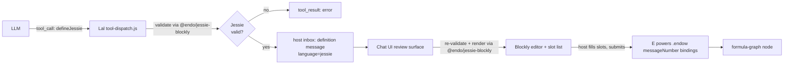

# Lal `defineJessie` Tool with Blockly Rendering

| | |
|---|---|
| **Created** | 2026-05-13 |
| **Updated** | 2026-08-31 |
| **Author** | Kris Kowal (prompted) |
| **Status** | Proposed |

## Background

This design uses terminology from several adjacent projects.
A reader new to Lal and the Endo monorepo can decode the rest of the
document from this glossary.

- **Lal**: the LLM-driven agent shipped in `@endo/lal` (`packages/lal/`).
  Lal proposes structured tool calls to the host on behalf of an LLM
  conversation; the host's Chat UI renders those proposals for human
  review before they execute.
- **The `define` tool**: a tool that Lal exposes to the LLM, taking a
  source string and a `slots` map of named capability holes the host
  fills from their own inventory.
  When the LLM calls `define`, the proposal arrives in the host's inbox
  as a `definition` message (source plus a slot manifest).
  The Chat UI renders that incoming message for review in two places,
  both inside a *confined* (authority-free) component rather than in the
  trusted host frame: inline in the `definition` branch of `InboxRoot` in
  `packages/space-chat/src/inbox.js` (a source block plus one `<input>`
  per slot), mounted by the thin trusted-host wrapper
  `packages/chat/inbox-component.js`; and, for the fuller review flow, in
  the `endow-modal.js` modal (`packages/spaces-util/src/endow-modal.js`).
  That the real renderer lives inside the confinement boundary matters for
  embedding Blockly; see § Chat UI: rendering an incoming proposal.
  The host fills the slots and submits.
  On submit the host does **not** call `define` again; it calls
  `E(powers).endow(messageNumber, bindings, ...)`, which binds the host's
  chosen slot values to the proposal and produces a *formula-graph node*
  (the persistent daemon-side object the proposal becomes once its slots
  are bound, tracked in the formula graph for retention and GC).
  (`define-form.js` is a *separate* surface: the host's own from-scratch
  proposal composer, opened by the `/define` slash command; the composer
  calls `E(powers).define(source, slots)` on submit. It is not the renderer for an
  incoming LLM proposal, and is out of scope for this design; see
  § Chat UI: rendering an incoming proposal.)
- **Jessie**: a confined subset of JavaScript that an Endo guest can
  evaluate safely: no ambient globals, no `eval`, no `new Function`.
  (The exact statement and iteration constructs Jessie admits are pinned
  against the `endojs/Jessie#127` grammar at Phase 0; see § Phased
  implementation. Earlier drafts described the confinement as "no loops
  outside Justin expressions"; that contradicted the fact that Justin is
  a statement-free sub-language, so this document drops the phrase pending
  that grammar check.)
  The Jessie grammar and parser live in `endojs/Jessie`.
- **Justin**: the pure-expression sub-language of Jessie (no statements,
  no `const`/`let`, no imports, and so no loops).
  Justin underpins Jessie's expression-level grammar but is too narrow
  for whole-module proposals.
- **Blockly**: Google's open-source library for building visual,
  block-based program editors. A Blockly *workspace* holds draggable
  *blocks* the user assembles from a *toolbox*; a *code generator* walks
  the assembled blocks and emits source text. `endojs/Jessie#127` adds
  Blockly editors whose blocks are derived from the Jessie grammars, so
  any composable workspace generates valid Jessie.
- **Slots (= capability holes)**: named placeholders in a `define`
  proposal that stand in for capabilities the host owns.
  This document uses "slots" and "capability holes" interchangeably; the
  capability-hole framing is the original mental model from Endo's
  capability literature and the `slots` term is the in-code identifier.

## What is the Problem Being Solved?

`@endo/lal` already exposes a `define(source, slots)` tool that lets the agent
propose JavaScript with named capability holes for the host to fill from their
own inventory.
The proposal arrives in the host's inbox as a `definition` message, which the
Chat UI renders for review (a raw-source block plus a slot list); the host
fills the slots and submits via `E(powers).endow`.
This works, but the surface has two problems for non-programmer users:

1. The proposal language is unconstrained JavaScript.
   A Lal proposal may use ambient globals, control-flow that the host did not
   expect, or syntax the host cannot evaluate intuitively.
   Because the proposal language is unconstrained, reviewing such a proposal
   is the same cognitive load as code review of arbitrary code, which is
   precisely what a capability-constrained UI ought to be able to avoid.
2. The text-editor presentation does not match the proposal model.
   A proposal is "this shape of expression with these slots," not "edit this
   program freely."
   A user who does not read JavaScript fluently has no way to validate the
   proposal before submitting it.

[`endojs/Jessie#127`](https://github.com/endojs/Jessie/pull/127) lands a new
`packages/blockly-tools` with Blockly-based visual editors for the three
layered languages JSON, Justin, and Jessie.
The blocks are derived from the same grammars in
`packages/parse/src/quasi-*.js` that drive the textual checkers, and they
generate syntactically valid source as users compose them.
Jessie itself is a confined subset of JavaScript that an Endo guest can
evaluate without the surface that makes free JavaScript hard to reason about
(no ambient globals, no `eval`, no `new Function`; the exact statement and
iteration constructs it admits are pinned against the `endojs/Jessie#127`
grammar at Phase 0).

This design proposes a `defineJessie` variant of Lal's `define` tool that
sits alongside the existing `define`.
A `defineJessie` proposal carries:

- Jessie source (validated against the Jessie checker from
  [`endojs/Jessie#127`](https://github.com/endojs/Jessie/pull/127)).
- The same `slots` shape as `define`.

When such a proposal reaches the host's inbox, the Chat UI renders it with the
Blockly visual editor from a new `@endo/jessie-blockly` package (which builds a
module-level Jessie checker from the grammar sources `@jessie.js/parse` ships
and vendors the upstream Blockly tooling until it publishes), so the host sees
the proposal
as a tree of labeled blocks with capability holes, fills those holes
visually (the program body itself is read-only; see § Chat UI, editing
scope), and submits.
The submit path is unchanged (`E(powers).endow`, producing a formula-graph
node with the host's chosen bindings), so the rest of the system (follow-on
use of the result, retention, GC, formula history) is untouched.

Two surfaces change to support the variant, plus the new shared package:

- A new routing hint on `define` itself.
  `E(powers).define(source, slots, options?)` carries the language tag in a
  reserved `options.hints` sub-bag (`options.hints.language`), so the
  resulting `definition` message can be tagged and the Chat UI can pick the
  right renderer.
  `options.hints` is the structurally-marked carrier for *distrusted,
  re-validated-downstream* routing data, deliberately distinct from any future
  top-level `options` key, which is reserved for a flag that carries its own
  independently-enforced contract, so a later author cannot reach for this
  bag to smuggle a trust-bearing option in beside a presentation hint (see
  Open Question 2).
  The language tag is open-ended (`'jessie'` initially, room for future
  language tags) and its absence is treated as the existing `define` behavior,
  so the change is fully back-compatible.
  See Open Question 2 for the maintainer-confirmed shape.
  The tag is a routing *hint*, not a trust boundary: the Blockly renderer
  re-validates the source with `parseJessie` before rendering, so the
  "every Blockly-rendered proposal is valid Jessie" claim holds by
  construction regardless of who set the tag (see § Chat UI and
  Open Question 6).
- The Chat UI's incoming-proposal review surface (the confined
  `definition` renderer in `packages/space-chat/src/inbox.js` and the
  `endow-modal.js` modal) gains a Blockly rendering branch, selected when
  the message is Jessie-valid.
  See § Chat UI: rendering an incoming proposal.
- A new `@endo/jessie-blockly` package that builds a module-level Jessie
  checker from the grammar sources the published `@jessie.js/parse` ships and
  bundles the Blockly workspace tools.
  See Open Question 3.

## Design

### Overview



Diagram key.
`JV` is the Jessie-validity gate (Lal's `parseJessie` call against the
proposed source).
`TR` is the `tool_result` error the LLM sees if `JV` rejects.
`HM` is the host's inbox `definition` message that carries an accepted
proposal forward, tagged `language=jessie`.
`BE` is the Blockly editor plus slot-list panel the host interacts with,
reached only after the review surface re-validates the source.
`Eval` is the `E(powers).endow(messageNumber, bindings)` call the host
submits once slots are filled; it is the same submit path the plain
`definition` renderer already uses.

The variant reuses every existing piece of plumbing.
The new code is:

- A new `@endo/jessie-blockly` package (`packages/jessie-blockly/`)
  that exposes a module-level Jessie checker (imported by Lal) under its
  `/parse` subpath and bundles the Blockly workspace tools (imported by the
  Chat package) under its `/blockly` subpath. Neither half is a thin
  re-export today: the `/parse` half **builds** the checker from the Jessie
  and Jessie-module grammar sources the published `@jessie.js/parse` ships
  (see § Lal-side tool registration and validation and Open Question 1), and
  the `/blockly` half is **vendored** from `endojs/Jessie#127` until
  `@jessie.js/blockly-tools` publishes on npm. Each half becomes a thin
  re-export once upstream builds and exports the piece it needs (a
  module-level checker export for `/parse`, a published `blockly-tools`
  package for `/blockly`).
- A `defineJessie` entry in Lal's tool registry
  (`packages/lal/tools/code.js`, alongside `define`) as a `LalToolDef`,
  dispatched from a new `case 'defineJessie'` in the single `switch (name)`
  of `packages/lal/tool-dispatch.js`.
- A Jessie-validation step in that dispatch case, citing the `parseJessie`
  checker from `@endo/jessie-blockly/parse` (a module-level checker the
  package **builds** from the grammar sources the published `@jessie.js/parse`
  ships — not a re-export; Open Question 1 — over the same parser/grammar
  surface `endojs/Jessie#127`'s blocks build on).
- A `language: 'jessie'` tag carried on the `definition` message, set by
  the `options.hints.language` argument threaded through `E(powers).define`.
- A Blockly rendering branch in the Chat UI's incoming-proposal review
  surface (the confined `definition` renderer in
  `packages/space-chat/src/inbox.js` and the `endow-modal.js` modal),
  selected when the incoming source re-validates as Jessie, and producing
  the same `{ messageNumber, bindings }` shape the existing `endow` submit
  path consumes. Because that renderer runs *inside* the space-chat
  confinement boundary, embedding a DOM-heavy library there is a distinct
  problem Phase 3 must address (§ Chat UI).
- A short system-prompt paragraph in `agent.js`'s `systemPrompt` steering
  the LLM toward `defineJessie` for Jessie-expressible programs (§ LLM
  system-prompt change).

### Lal-side tool registration and validation

Lal's tools are declared as `LalToolDef` records in
`packages/lal/tools/*.js` (the `define` record lives in
`packages/lal/tools/code.js`) and dispatched from a single `switch (name)`
in `packages/lal/tool-dispatch.js`; there is no per-tool `executeTool`
closure or `{ type: 'function', function: { ... } }` schema in `agent.js`.
Add a `defineJessie` record to `code.js` immediately after `define`, and a
`case 'defineJessie'` to the dispatch switch.

The tool record mirrors `define`'s shape (a `name`, a factual `summary`, and
a `params` pattern built with `@endo/patterns`' `M.splitRecord`). The
`summary` is descriptive only: it states what the tool does and its Jessie
constraint, and does **not** carry "prefer this over `define`" steering.
That steering lives solely in the system prompt (§ LLM system-prompt
change), so the two do not drift:

```js
// --- defineJessie (Jessie-only code with slots for host to fill) ---
{
  name: 'defineJessie',
  summary:
    'Propose a reusable program, like define(), but the source must be a ' +
    'Jessie module (a confined subset of JavaScript without ambient ' +
    'globals, eval, or new Function). The host usually reviews it as a ' +
    'visual block program, falling back to a plain source view when the ' +
    'proposal cannot be rendered as blocks. Arguments: source (string), ' +
    'slots (object mapping slot name to { label }).',
  params: M.splitRecord({
    source: M.string(),
    slots: M.recordOf(M.string(), M.splitRecord({ label: M.string() })),
  }),
},
```

The dispatch case mirrors the existing `case 'define'` in
`tool-dispatch.js` and adds the Jessie check before forwarding to
`E(powers).define`:

```js
case 'defineJessie': {
  const { source, slots } = args;
  if (source === undefined) {
    throw new Error('source is required');
  }
  if (slots === undefined) {
    throw new Error('slots is required');
  }
  // Validate against the Jessie grammar.
  const { parseJessie } = await import('@endo/jessie-blockly/parse');
  try {
    parseJessie(source);
  } catch (parseError) {
    throw new Error(`Jessie validation failed: ${parseError.message}`);
  }
  // Tag the proposal so the host's Chat UI can route to the Blockly form.
  return E(powers).define(source, harden(slots), {
    hints: { language: 'jessie' },
  });
}
```

The error path uses the same plain `throw new Error(...)` idiom as the
`source is required` / `slots is required` checks above it and as the
existing `case 'define'` in `tool-dispatch.js`, rather than importing
`@endo/errors`'s `makeError`/`X`/`q` helpers for one call site.

The third argument to `E(powers).define` is the agreed extension point:
`define(source, slots, options?)` carrying the language tag under the reserved
`options.hints` sub-bag (`options.hints.language`; maintainer decision
2026-05-14, see Open Question 2 below).
The reserved-slot-key and sibling-method alternatives were considered
and dropped in favor of the explicit `options` bag; both are written up
in § Alternatives Considered.

The Lal-side validator imports `parseJessie` from `@endo/jessie-blockly/parse`,
the lean parser subpath of the new Endo-monorepo package. `parseJessie` is the
package's own module-level Jessie checker, **built** from the grammar sources
`@jessie.js/parse` ships (the published package exports only `bootPeg`, `peg`,
`json`, and `justin`, not a module-level `jessie` checker; Open Question 1), so
`/parse` is a build-from-shipped-source subpath, not a re-export. It depends on
`@jessie.js/parse` for those grammar sources and the PEG bootstrap but never
pulls in the Blockly bundle. See Open Question 3 below for the packaging and
eject-back plan.

### Host-side message tagging

`define` today produces a daemon-side `definition` message whose body
contains the source and the slot manifest.
The Chat UI renders any such message with its plain `definition` renderer
(the inline confined view in `packages/space-chat/src/inbox.js` and the
`endow-modal.js` modal).

The minimum host-side change is to carry a `language: 'jessie'` tag on the
`definition` message produced by a `defineJessie` proposal, so the Chat UI
can pick the Blockly rendering branch when `language === 'jessie'` and the
existing plain renderer otherwise.
The tag threads through the optional `options.hints.language` argument added to
`E(powers).define` (Open Question 2): the daemon copies it onto the
`definition` message body it constructs.
The wire form stays back-compatible (an absent `options.hints.language` writes
no tag), but the renderer normalizes a missing tag to the explicit default
`'javascript'` before switching, so every renderer branch and every future
language variant (the design floats `defineJustin`) switches on a uniform
named enum rather than special-casing key-absence.
The tag travels with the message; nothing about retention, formula
construction, or the `endow` submit path changes.

The tag is a *hint* for renderer selection, not a security boundary. Any
capability holder that can call `E(powers).define` directly could set
`options.hints.language: 'jessie'` on arbitrary, unvalidated source. So the
Blockly branch does not trust the tag: it re-runs `parseJessie` on the
incoming source and only renders with Blockly if that succeeds, falling
back to the plain `definition` renderer otherwise (see § Chat UI and
Open Question 6). The invariant "every Blockly-rendered proposal is valid
Jessie" is therefore produced by the renderer's own re-validation, not
carried by a forgeable tag.

### Chat UI: rendering an incoming proposal

The incoming-proposal review surface today lives in two places, both of
which submit through `E(powers).endow`:

- The `message.type === 'definition'` branch of the confined `InboxRoot`
  in `packages/space-chat/src/inbox.js` renders the proposal inline (a
  source block plus one `<input>` per slot) and submits via
  `E(powers).endow(number, bindings)`. `packages/chat/inbox-component.js`
  is only the thin trusted-host wrapper that mounts this confined tree; it
  has no message-type branches of its own.
- `endow-modal.js` (`packages/spaces-util/src/endow-modal.js`, opened by
  the `endow` command with a message number) is the fuller review modal; it
  fetches the definition's source and slots and submits via
  `E(powers).endow(messageNumber, bindings, workerName, resultName)`.

**Editing scope: slot values only, not the program body.** The Blockly
workspace lets the host inspect the proposal as blocks and fill its
capability holes; it does **not** let the host freely recompose the program
body. This scope is forced by the submit path, not a UI preference:
`endow(messageNumber, bindings)` binds the host's chosen slot values to the
**immutable stored source** at `messageNumber` and carries no channel for a
regenerated body, so any structural edit to the block tree could never reach
execution and would be silently discarded. The block tree is therefore a
read-only visualization of the stored Jessie source with editable slot
holes; a host who wants a different program body rejects the proposal and
asks the agent for a new one (or authors a fresh proposal with
`define-form.js`), the same reject-and-re-author path § Validation errors
and Open Question 7 describe. Keeping edits to slot values is exactly what
keeps every phase's "submit path unchanged" claim true, since a freely
recomposable workspace would demand a submit channel `endow` does not have.

Because the inline renderer runs inside space-chat's *confinement
boundary* (an authority-free component, not the trusted host frame),
embedding a DOM-heavy third-party library (Blockly) there is a materially
different problem from dropping it into a trusted wrapper: the confined
component has no ambient DOM/authority to hand Blockly. This exact
embedding problem is already solved in the same package this design edits.
`packages/spaces-util/src/define-form.js` documents *the Monaco host-node
pattern*: a live Monaco editor is real DOM that cannot enter a confined
vnode tree (`renderConfined` strips refs and real nodes), so the editor
lives on a persistent host `<div>` created once, controlled imperatively by
`createMonacoEditor`, and re-parented into a confined-tree anchor slot
(`data-editor-anchor`) after each render. That file's own comment invites
later forms to copy the seam. Blockly's SVG workspace is structurally the
same category of embedding as Monaco: imperative DOM ownership with its own
focus, cursor, and key handling, not vdom-native. Phase 3's default
approach is therefore to reuse the host-node pattern: mount the Blockly
workspace on a persistent host node owned by the trusted wrapper
(`inbox-component.js` / `endow-modal.js`), re-parent it into a
`data-editor-anchor`-style slot the confined `definition` renderer exposes,
and bridge the composed slot bindings back across the boundary. The one way
this could fail to generalize is Blockly's drag-and-toolbox interaction
model reaching for authority Monaco does not (for example a toolbox flyout
mounted outside the anchored host node), so Phase 3 confirms the pattern
covers Blockly's drag-and-toolbox surface and, only if it does not, falls
back to extending the confined surface with exactly the capability Blockly
needs. Phase 3 owns this; it is called out in § Phased implementation,
Phase 3.

Both branches gain a Blockly rendering path. When a `definition` message
is tagged `language: 'jessie'` **and** re-validates via
`@endo/jessie-blockly`'s `parseJessie`, the surface embeds a Blockly
workspace in place of the raw-source block; otherwise it falls back to the
existing plain renderer. When a message *is* tagged `language: 'jessie'`
but the Blockly path is not taken (re-validation failed, or the source is
valid Jessie the importer cannot represent as blocks), the fallback is not
silent: the plain renderer shows a dismissible notice that the proposal was
announced as Jessie but is being shown as raw source, so the host can tell a
routing or validation failure from a proposal that was never meant to be
Jessie. Because that fallback drops a non-programmer host back onto exactly
the raw-source surface this design exists to remove, the notice carries a
first-class recovery action, not just an explanation. An **"Ask the agent to
retry"** button posts a structured rejection (the message number and a
machine-readable reason code, `re-validation-failed` or
`not-block-expressible`) to the agent as a **plain inbound message in Lal's
inbox round loop** (`runInboxLoop` over inbound messages in
`packages/lal/agent.js`), so escalation does not depend on the host
hand-composing a fresh natural-language ask. The mechanism is specific and
must not be mis-implemented: the button sends a normal inbox message whose
body carries the reason code; `runInboxLoop` notices the new inbound number
and starts a fresh round, but it always invokes `runOneRound` with the
**fixed generic prompt** `'You have new mail. Check your messages and respond
appropriately.'` (`packages/lal/inbox-loop.js`), so the reason code is **not**
threaded into `runOneRound` as an argument. The agent recovers the reason code
by inspecting its own inbox (`listMessages` / `messageHistory`) during that
round. This is a new user-role turn the agent reads, **not** a synthetic
`tool_result` reopening the already-completed `defineJessie` round: Lal's loop
exposes no API to reinject a result into a closed tool call, so the retry is
modeled as the next message the agent reads (§ Validation errors). The slot list
and the `endow` submit shape are unchanged (only the source-review widget
differs), so the Blockly branch produces the same
`{ messageNumber, bindings }` the plain path already feeds to `endow`.

Rendering an incoming proposal as blocks needs a **source-text -> block-tree
importer**, a distinct artifact from the code generator in the glossary (which
walks an assembled workspace and emits source, one direction only). Blockly's
standard
[JSON serialization format](https://developers.google.com/blockly/guides/configure/web/serialization)
round-trips an *existing* workspace to and from JSON; it does not, on its own,
turn an arbitrary Jessie *string* into a block tree.

Earlier drafts left "does `endojs/Jessie#127` already ship that importer?" as an
unverified premise the Phase-3 estimate merely footnoted. That premise has now
been **checked against the live PR and resolves against the plan**:
`endojs/Jessie#127` ships only `src/blocks/*` (block definitions),
`src/generators/*` (the blocks -> source direction, one way), and
`src/toolbox/*`, with a `test/test-data.json` of `{ block, expected-source }`
pairs (no source -> block-tree importer anywhere), and those fixtures are
block -> text only, not invertible. So the importer is an artifact **this design
must build from scratch**, not vendor. § Phased implementation therefore folds
that build into Phase 0 (which owns the `/blockly` subpath the importer lives
in) and **leads the estimate with it**, rather than carrying the vendor-succeeds
case as the default and the from-scratch build as a footnote (see § Phased
implementation, Phase 0).

Even a `parseJessie`-valid proposal can fall outside what the block grammar
represents, because § Validation errors notes the block grammar is a
*subset* of Jessie's. So the render path has **two** fall-throughs to the
plain `definition` renderer, not one: (1) source that fails `parseJessie`
re-validation (a forged or drifted tag; § Validation errors, Open Question
6), and (2) valid Jessie the importer cannot express as blocks. Both cases
render the plain read-only source view with the visible notice above,
rather than a broken or empty workspace.

Slot variables in the source are surfaced as **slot blocks** in a dedicated
toolbox category; the host does not edit slot identifiers directly.

The slot list panel from the existing `definition` renderer is preserved
verbatim, since the slot model is identical; only the source editor differs.

#### Slot blocks

A slot in a `define` proposal is a named capability hole the host binds at
submit time; in the source it appears as a free variable. The existing plain
`define` tool already works this way, its slots being free identifiers in plain
JavaScript source that `endow` binds later.
**Whether a bare free variable is valid Jessie at *parse* time is an unverified
premise this design must not assume.** Jessie's defining guarantee ("no ambient
globals") is enforced by a restricted evaluation scope, but whether
`@jessie.js/parse` *also* statically rejects an unbound identifier reference (as
opposed to admitting it and leaving binding to the host) is exactly the property
a slot mechanism turns on. If the checker admits free references (the plain
`define` model, carried into Jessie), the source generation below stands as
written; if the checker instead requires every slot to be a *declared* import or
parameter, then **both** the Lal-side `parseJessie(source)` validation of a
slotted proposal (§ Lal-side tool registration and validation) **and** the
slot-block source generation below must change to emit slots as declarations
rather than bare references. This is a Phase-0 gating precondition, checked
against the real published `@jessie.js/parse` before Phase 3 is scoped (§ Phased
implementation, Phase 0, precondition (c)); the design does not commit to the
free-variable shape until that check passes.

Given that binding model, slots are surfaced as a **custom `jessie_slot`
block**: a custom block type with a single dropdown field naming the slot and an
output shaped like a value (no statement plug).
The block's code generator emits the slot in whichever form precondition (c)
establishes is valid Jessie (a bare reference, or a declared import/parameter).
On the incoming-proposal review surface this design covers, the slot set is
**fixed by the proposal**: the LLM declared exactly these slots, they are bound
to the immutable stored source at `messageNumber` (§ Chat UI, editing scope),
and the host fills their *values* rather than adding to or removing from the
slot manifest. The `jessie_slot` blocks are therefore **read-only in identity**
— one rendered per declared slot, keyed to the host's slot panel — and the host
drags no new slot into, and deletes no slot from, an incoming block tree.
(Host-driven slot add/remove with cascade into the workspace is a property of
the separate `define-form.js` from-scratch composer, out of scope for this
design; see § Background and § Chat UI, editing scope. Folding it onto the
incoming renderer would be exactly the structural edit the submit path silently
discards.)
Keying the rendered slot blocks to the slot panel rather than to Blockly's
variable registry keeps a **single source of truth** for host-visible slot
identity — the slot panel, populated once from the proposal's manifest — with no
second mutable copy to reconcile, the property the slot model turns on.

The rejected alternative (surfacing slots through Blockly's built-in variable
category, so the visual UX matches `endojs/Jessie#127`'s editor for users who
have seen Jessie tooling elsewhere) is written up in § Alternatives Considered.
It makes Blockly's variable registry authoritative and the slot panel merely
reflective, structurally reintroducing the two-places-of-truth duplication the
custom block avoids (the variable registry and the host's slot-binding model
both holding the same capability-hole identity, kept in sync by a listener this
design would have to add).
Because a single source of truth for slot state is the decisive property here,
that alternative loses on it unconditionally: no gain in consistency, round-trip
stability, or smaller implementation overrides a second authoritative copy of
slot identity.
This design therefore commits to the custom block directly rather than
scheduling a build-both bake-off to re-derive a conclusion the slot model
already settles (see Open Question 4).

#### Validation errors

Two validation surfaces:

1. **Lal-side validation** (above) catches a malformed proposal before it
   ever reaches the host's inbox.
   The LLM sees the validation error as a normal `tool_result` error and
   retries.
2. **Host-side editing** in the Blockly workspace is confined to filling
   slot *values* (§ Chat UI, editing scope; § Slot blocks): the slot set is
   fixed by the proposal and the block tree's structure is read-only, so host
   action cannot produce invalid Jessie by construction — the rendered block
   tree derives from valid stored Jessie source, the block grammar is a subset
   of Jessie's, and the slot blocks the host fills emit valid Jessie in
   whichever form precondition (c) establishes.
   Because the host cannot add or remove slots on an incoming proposal, there
   is no host-driven dangling-slot case here. As a **defensive integrity
   check** (not a consequence of host editing), if the importer ever yields a
   workspace referencing a slot absent from the proposal's slot manifest — an
   importer bug or a drifted vendored grammar — the mismatch surfaces as a
   code-generation warning inline in the slot panel and blocks the submit
   button, the same fail-closed posture the two fall-throughs § Chat UI names
   apply to a proposal the importer cannot faithfully represent.

   This by-construction guarantee holds only while the vendored block
   grammar and the vendored `parseJessie` checker stay in lockstep, so the
   design does not rely on it alone. Two independent defenses back it up.
   First, the Phase 0 vendor step preserves the upstream generation link so
   the two cannot drift in the first place (§ Phased implementation, Phase
   0; Open Question 6). Second, the render path re-runs `parseJessie` on the
   source the code generator produced, falling back to the plain renderer
   with the visible notice above if it ever disagrees. So if the block
   grammar and the parser did drift inside `@endo/jessie-blockly`, it is the
   render-side re-validation that fails closed, not the (now-untrustworthy)
   by-construction claim.

A "View source" toggle in the form footer reveals the generated Jessie
source as read-only text, so power users can audit the rendering.
There is no "edit as text" mode in v1. A real v1 limitation, called out
honestly: there is no path to free-edit *this specific incoming proposal's*
text either. The plain `definition` renderer is read-only, and
`define-form.js` is a from-scratch composer, not an editor for an inbound
message (§ Background). A host who is unhappy with a rendered proposal can
reject it and author a fresh, unrelated one with the existing `define`
surface, but cannot text-edit the proposal in front of them. Whether that
gap needs an "edit as text" affordance is deferred (see Open Question 7).
Correspondingly, the LLM should propose `define` rather than `defineJessie`
when the program does not fit the Jessie subset, and the system prompt
says so (see § LLM system-prompt change).

### LLM system-prompt change

In `agent.js`'s `systemPrompt`, add a short paragraph after the existing
`define()` guidance:

> Prefer `defineJessie()` over `define()` when your proposed program is a
> Jessie module (no ambient globals, no `eval`, no `new Function`). The
> host's review surface is lighter for Jessie proposals because the Chat UI
> renders them as visual block programs. Fall back to `define()` only when
> your program genuinely requires JavaScript features Jessie excludes.

### Dependencies

| Design | Relationship |
|--------|--------------|
| [lal-fae-form-provisioning](lal-fae-form-provisioning.md) | Defines the manager/worker split that owns Lal's tool surface. `defineJessie` is added to the same surface. |
| [chat-slot-slash-commands](chat-slot-slash-commands.md) | Sibling: a user-driven path for inlining anonymous values into slots. `defineJessie`'s slot panel uses the same slot-value model and benefits if slash-slot fillers are available. |
| [chat-markdown-render](chat-markdown-render.md) | Independent. Slot labels and the form's chrome use the standard Chat Markdown renderer. |
| [`endojs/Jessie#127`](https://github.com/endojs/Jessie/pull/127) | Upstream dependency for the **Blockly tools only**. `@jessie.js/parse` (dotted scope) has been published on npm since 2022 and is at `0.3.0` (2025-04-15), and its tarball **ships** the `quasi-jessie` and `quasi-jessie-module` grammar sources (`makeJessie` / `makeJessieModule`) this design needs — but as unbuilt TypeScript (`.js.ts`) that its `exports` map and `main.js`/`all.js` do **not** build or re-export (the published exports are only `bootPeg`, `peg`, `json`, `justin`). So the module-level checker is not directly importable and `@endo/jessie-blockly/parse` **builds** it from those shipped sources rather than re-exporting it (Open Question 1). Separately, `@jessie.js/blockly-tools` is unpublished (it lands under `endojs/Jessie#127`, not yet merged); the new `@endo/jessie-blockly` package vendors that half until it publishes. The Chat UI is gated on neither: the checker builds from what `@jessie.js/parse` already ships, and the Blockly tools are vendored. |

### Phased implementation

The implementation lands in five phases.
Phase 0 lands the shared `@endo/jessie-blockly` package every later phase
imports from; Phases 1 through 4 then layer the Lal tool registration,
the host-side language tag, the Chat UI Blockly branch, and the tests
and documentation in turn.

1. **Phase 0: `@endo/jessie-blockly` package.**
   Create `packages/jessie-blockly/` exposing two subpaths: `/parse`, the
   module-level Jessie checker `parseJessie`, and `/blockly`, the Blockly
   workspace tools plus the source-text -> block-tree importer the Chat UI
   needs (§ Chat UI: rendering an incoming proposal).
   Neither subpath is a thin re-export today. The `/parse` half **builds** its
   checker from the grammar sources the published `@jessie.js/parse` already
   ships: that tarball carries `quasi-jessie.js.ts` (`makeJessie`) and
   `quasi-jessie-module.js.ts` (`makeJessieModule`), but as unbuilt TypeScript
   that `main.js`/`all.js` neither build nor re-export, so the published
   `exports` map reaches only `bootPeg`, `peg`, `json`, and `justin` (Open
   Question 1). Phase 0 therefore strips the TypeScript off those two grammar
   sources (or consumes them through a TS-aware build) and composes
   `jessie = makeJessie(peg.extends(justin))` then
   `jessieModule = makeJessieModule(jessie)` on the same `bootPeg`/`peg` the
   published `main.js` builds `justin` from, wrapping the result as
   `parseJessie`. This is bounded build-and-compose work (the grammar builders
   exist; the cost is the TS build wiring plus a bootstrap sanity check), not a
   free re-export.
   The block set, generator, and toolbox for the `/blockly` half are
   **vendored** from `endojs/Jessie#127` (`@jessie.js/blockly-tools` is
   unpublished). The importer, however, is **not** vendorable: the upstream
   check below has been run and `endojs/Jessie#127` ships only the generator
   direction (blocks -> source), so the source -> block-tree importer must be
   **built from scratch** in this phase. That from-scratch importer is what
   makes Phase 0 the large phase (see the estimate), not a one-day vendoring
   pass.
   Three Phase-0 preconditions gate the rest of the plan:
   - **(a). Resolved, against the vendor path.** Whether `endojs/Jessie#127`
     ships the source -> block-tree importer or only the generator direction.
     Checked against the live PR: it ships `src/blocks/*`, `src/generators/*`
     (blocks -> source, one way), and `src/toolbox/*`, with a block -> text
     `test/test-data.json` (not invertible); there is **no importer**. So the
     importer is a from-scratch build, folded into this phase's estimate.
   - **(b).** Confirm the block grammar and the `parseJessie` checker are
     derived from one grammar source, so the vendor step (and the from-scratch
     importer) can preserve that link.
   - **(c).** Confirm against the module-level checker built in this phase
     (from the grammar sources `@jessie.js/parse` ships) whether a bare free
     variable (an unbound identifier reference) is valid Jessie at parse time,
     or whether every slot must instead be a declared import or parameter
     (§ Slot blocks). This decides the slot source-generation shape and the
     Lal-side `parseJessie` validation of a slotted proposal; the design does
     not commit to the free-variable shape until it passes. Building that
     module checker (above) is itself the first Phase-0 task, since
     preconditions (b) and (c) both run against it.
   The package exposes a `parseJessie` validator for Lal and a Blockly
   workspace factory (plus the from-scratch importer) for the Chat package.
   The vendor step preserves the upstream generation link (the vendored
   blocks and the built `parseJessie` checker both derive from the same
   `packages/parse/src/quasi-*` grammars) by pinning the vendored
   `@jessie.js/blockly-tools` snapshot against the exact `@jessie.js/parse`
   version `/parse` builds its checker from, rather than letting the vendored
   blocks and the grammar sources drift; see Open Question 6.
   Mergeable on its own; gives downstream phases a single import surface.

2. **Phase 1: Lal tool registration.**
   Add the `defineJessie` record to `packages/lal/tools/code.js` (right
   after `define`), a `case 'defineJessie'` to the single `switch (name)`
   in `packages/lal/tool-dispatch.js`, and the
   `@endo/jessie-blockly/parse` import the validation step uses. This is the
   exact shape § Lal-side tool registration and validation describes. (There is
   no per-tool `executeTool` closure or tool array in `agent.js`; the only
   `agent.js` change in this plan is the Phase 3 system-prompt nudge.)
   The tool call works end-to-end through the existing plain `definition`
   renderer (the Chat UI does not yet know about `language: 'jessie'`).
   This phase is mergeable on its own and gives Lal a Jessie-validating
   tool even before the Blockly UI lands.

3. **Phase 2: Host-side language tag.**
   Extend `E(powers).define` to accept the `options?` bag, carrying the
   language tag under its reserved `options.hints` sub-bag
   (`options.hints.language`, per Open Question 2's resolution), and wire the
   `definition`-message construction downstream to carry the tag.
   Wire the Chat UI's `definition` renderer to read the tag (and, per
   Open Question 6, re-validate the source) and choose between the plain
   renderer and the (still-stub) Blockly branch.
   Back-compat invariant: the new third parameter is optional and the
   daemon-side `define` implementation (the method behind `E(powers).define`,
   where `powers` is the host's `EndoGuest` facet) treats an absent `options`
   argument identically to its prior two-argument behavior.
   Making the third argument additive is not only a call-site change; it
   requires editing the `M.interface()` guard, which is the one file the
   "back-compat wire-through" framing must name. The `EndoGuest` guard for
   `define` is `define: M.call(M.string(), M.record()).returns(M.promise())`
   at `packages/daemon/src/interfaces.js:230`, a strict two-argument guard
   with no trailing-optional clause, so `E(powers).define(source, slots, { hints })`
   throws a guard violation before the implementation ever runs. Phase 2 must
   relax that guard to
   `M.call(M.string(), M.record()).optional(M.record()).returns(M.promise())`,
   the same `.optional(...)`-for-trailing-args idiom sibling methods in the
   same file already use (`storeBlob` at `interfaces.js:241`, and `provideMount`),
   and widen the implementation at `packages/daemon/src/guest.js:296`
   (`const define = (source, slots) => mailboxDefine(source, slots)`) to accept
   and forward the optional `options`. Both edits are prerequisites for the
   extension to be additive rather than breaking.
   Every existing two-argument caller of `E(powers).define` continues
   to work without change, and the `definition` message carries no
   `language` tag in the absent-options case (so the Chat UI defaults to
   the plain renderer).
   Mergeable on its own; the daemon-side change is a no-op for existing
   two-argument callers, and the Chat UI's Blockly branch routes to a
   stub until Phase 3 lands.

4. **Phase 3: Blockly rendering branch in the Chat package.**
   Implement the Blockly rendering branch for the confined `definition`
   renderer in `packages/space-chat/src/inbox.js` and for the
   `endow-modal.js` modal, embedding the `@endo/jessie-blockly/blockly`
   Jessie workspace and re-validating incoming source before rendering
   (Open Question 6). Resolve the confinement-boundary question § Chat UI
   raises first (mount Blockly in the trusted host wrapper and bridge the
   composed source/slots across the boundary, versus extending the confined
   surface), since it determines where the workspace lives and how the
   `{ messageNumber, bindings }` result crosses back.
   The confinement-boundary resolution is also where the accessible mount
   point is chosen (Open Question 8).
   Implement the single committed slot-block representation, the custom
   `jessie_slot` block (§ Slot blocks). The design commits to it directly
   rather than building both variants behind a feature flag and running a
   bake-off, because a single source of truth for slot state is the decisive
   property and settles Open Question 4 on paper.
   Wire the source-view toggle and the slot panel.
   Add the system-prompt nudge that steers the LLM towards `defineJessie`.
   Not mergeable on its own: depends on the Phase 2 routing branch and the
   `@endo/jessie-blockly` workspace surface from Phase 0.

5. **Phase 4: Tests and docs.**
   Add AVA fixtures from `endojs/Jessie#127`'s `test/test-data.json` (where
   applicable, mirrored into `@endo/jessie-blockly`) covering the
   source-to-workspace and workspace-to-source round trip.
   Add a Lal-side validation-error fixture that feeds a non-Jessie source
   (one with an ambient global or an `eval` call) to the `defineJessie`
   dispatch case and asserts the call surfaces a normal `tool_result` error
   whose message matches the `Jessie validation failed: ...` shape produced
   by `throw new Error(\`Jessie validation failed: ${parseError.message}\`)`.
   This fixture pins the design's claim that the LLM sees the validation
   error as a tool error and retries.
   Add a **render-side re-validation fixture**: feed a `definition` message
   carrying a *forged* `language: 'jessie'` tag over non-Jessie source and
   assert the Chat UI falls back to the plain renderer with the visible
   notice, rather than the Blockly branch. This pins Open Question 6's
   unforgeability invariant, the one property that resolution exists to
   guarantee.
   Add a **second fall-through fixture** for the other Blockly-fallback
   trigger § Chat UI names: feed a `definition` message whose source *is*
   valid Jessie but lies outside what the block importer can express, and
   assert the same plain-renderer-plus-notice fallback (and the "Ask the
   agent to retry" recovery action) fires, so both named fallback paths
   (not just the forged-tag one) are regression-covered.
   Because the retry is inbox-mediated (§ Chat UI), the retry-path fixture
   asserts the recovery mechanism explicitly rather than just that a button
   posts a message: the "Ask the agent to retry" action posts an inbox
   message carrying the reason code, and the agent surfaces that reason code
   only after inspecting its inbox (`listMessages` / `messageHistory`) in the
   round the fixed generic "You have new mail" prompt starts, confirming the
   reason code is retrieved from the inbox and not from any argument threaded
   into `runOneRound`.
   Add a **slot-manifest-integrity fixture**: a workspace the importer yields
   that references a slot absent from the proposal's slot manifest (an importer
   bug or drifted grammar, not a host edit — the host cannot remove slots on an
   incoming proposal) surfaces the code-generation warning and blocks the
   submit button (§ Validation errors), so that fail-closed submit-guard is
   regression-covered.
   Add a host-side submit fixture that drives a Blockly-composed proposal
   through the slot-binding UI to `E(powers).endow` (the real submission
   path) and asserts the resulting bindings match, since `endow` (not a
   second `define`) is what actually lands the proposal.
   Add an **accessibility fixture** pinning Open Question 8's Phase-3 exit
   criterion: against an incoming Jessie proposal with at least two slots,
   assert every slot-fill-and-submit step reachable in the Blockly branch is
   also reachable keyboard-only and announced to a screen reader (or, if the
   accessible-fallback surface shipped instead, that the plain slot-`<input>`
   path reaches submit without the visual workspace), so the one exit
   criterion still gating Phase 3 is regression-covered rather than untested.
   Update `packages/lal/primer/tools.md` to document `defineJessie`.
   Update `packages/chat`'s component index to note the Blockly branch.
   Not mergeable on its own: the fixtures presume the implementations
   from Phases 0 through 3 are in place.

Per-phase estimates lead with the resolved-against-the-plan importer cost.
Phase 0 is **L-sized (~5 days)**: the vendored blocks, generator, and toolbox
are about a day of wire-up, and building the `/parse` module-level checker from
the grammar sources `@jessie.js/parse` ships (the checker is not a published
export; Open Question 1) is a further modest slice, but the source -> block-tree
importer must be built from scratch (precondition (a) resolved against the
vendor path; `endojs/Jessie#127` ships no importer), which is comparable to a
fresh importer pass and dominates the phase.
Phases 1 and 2 are S-sized (1 day each).
Phase 3 is M-sized (2 days): the Blockly integration is mostly wiring plus
the single committed slot-block representation (no two-implementation
bake-off, since Open Question 4 is settled on paper by the decisive
single-source-of-truth axis).
Phase 4 is S-sized (1 day).

Total estimate: L-sized, ~10 days
(Phase 0 ~5 + Phase 1 1 + Phase 2 1 + Phase 3 2 + Phase 4 1 = ~10).
The dominant cost is the from-scratch importer in Phase 0: the upstream
`endojs/Jessie#127` ships no importer to vendor, so this is not the earlier
1-day vendoring figure; dropping the Phase-3 bake-off in favor of the
committed custom slot block is what trims 2 days back off Phase 3.

## Alternatives Considered

- **Replace `define` with `defineJessie` outright.**
  Rejected.
  The existing `define` is in use by Lal and removing it would break
  proposals that rely on JavaScript features Jessie excludes (for example, a
  `for-of` loop over an array the agent has reason to believe is short).
  The two coexist; the system prompt steers the LLM towards
  `defineJessie` first, and the LLM falls back to `define` when needed.

- **Validate as Justin instead of Jessie.**
  Rejected.
  Justin is the pure-expression subset (no statements, no `const`/`let`,
  no imports), which is too narrow for most proposals.
  Jessie is the natural module-level subset; the Blockly tooling in PR
  `endojs/Jessie#127` already supports it.
  If a Justin-only variant becomes useful later, it can be added as
  `defineJustin` following the same pattern.

- **Render Jessie source in Monaco with a Jessie-aware linter rather than
  Blockly.**
  Rejected.
  Deferred to a possible later power-user toggle; not in v1.
  This addresses problem 1 (Jessie subset) but not problem 2 (text-editor
  presentation-vs-proposal-model mismatch).
  Blockly is the documented user-facing tool from `endojs/Jessie#127` and is the more
  ambitious bet on visual review.
  A Monaco-with-Jessie-linter mode could be added later as a power-user
  toggle without revisiting this design.

- **Embed the Blockly workspace inline in the chat message bubble rather
  than in the modal/inline definition review surface.**
  Rejected.
  Deferred to a possible later iteration; not in v1.
  The existing review surface (the inline `definition` renderer and the
  `endow-modal.js` modal) is where slot filling already happens and where
  the host's focus already lands.
  A fully inline-in-the-transcript Blockly editor is interesting (the
  proposal becomes part of the transcript visually), but it complicates
  editing, keyboard focus, and message threading.
  Worth revisiting once Phase 3 lands and we have real usage data.

- **Build Lal-specific Blockly blocks that bake in Endo capability
  references (for example, a `lookup-petname` block) rather than reusing PR
  `endojs/Jessie#127`'s vanilla Jessie blocks.**
  Rejected.
  Deferred to a possible follow-up design; not in v1.
  This couples Lal's tool surface to Blockly block definitions and
  diverges from the Jessie tooling that students and other Jessie users
  will share.
  v1 reuses `endojs/Jessie#127`'s blocks unchanged, with capability holes surfaced as
  slot blocks.
  A future "capability-aware" block palette could be a follow-up design.

- **Block on `endojs/Jessie#127` merging and publishing instead of
  vendoring a copy now.**
  Rejected, but only for the Blockly half.
  `@jessie.js/parse` is already published on npm (at `0.3.0` since
  2025-04-15) and its tarball ships the Jessie and Jessie-module grammar
  sources, so `@endo/jessie-blockly` can build the module-level checker
  from what is already on npm today (Open Question 1) without waiting on any
  upstream merge — even though that checker is not itself a published
  *export* yet. Only `@jessie.js/blockly-tools` is genuinely unpublished (it
  lands under `endojs/Jessie#127`, not yet merged), so waiting *for the
  Blockly tools* would gate the Chat-side work on another repo/team's merge
  timeline for an indefinite period.
  Vendoring the Blockly half in `@endo/jessie-blockly` (Phase 0) lets the
  work proceed now; the cost is drift risk of the vendored blocks against an
  actively-evolving upstream PR, which is the failure mode § Validation
  errors and Open Question 6 address by pinning the vendored blocks against
  the published-parser version they were generated from and by re-validating
  on the render side.
  When `@jessie.js/blockly-tools` publishes, its `/blockly` subpath becomes
  a thin re-export; the `/parse` subpath becomes one only if upstream also
  builds and exports a module-level `jessie` checker (until then `/parse`
  builds it from the shipped grammar sources; Open Question 1). The two halves
  come from **two separate** upstream packages (`@jessie.js/parse`, already
  published, and `@jessie.js/blockly-tools`, pending), so the package keeps
  each behind its own subpath rather than merging them (Open Questions 1 and
  3). Lal's lean parser import (`@endo/jessie-blockly/parse`) therefore never
  structurally depends on the Blockly bundle: the `exports` map splits
  `@endo/jessie-blockly/parse` and `@endo/jessie-blockly/blockly` from the
  start, so completing the eject-back is a per-subpath re-export swap rather
  than a consumer-visible restructure.
  The tradeoff (schedule certainty now versus no drift risk later) is judged
  in favor of vendoring; the drift risk is bounded by the two
  mitigations above.

- **Surface slots through Blockly's built-in variable category instead of a
  custom `jessie_slot` block.**
  Rejected.
  Reusing Blockly's standard variable blocks would make the visual UX match
  `endojs/Jessie#127`'s editor for users who have seen Jessie tooling
  elsewhere (axis (a) of the original Open-Question-4 comparison), and would
  be a smaller implementation. But it makes Blockly's variable registry the
  authoritative store of slot identity and demotes the host's slot panel to a
  mere reflection of it, structurally reintroducing a two-places-of-truth
  duplication (the variable registry and the host's slot-binding model both
  holding the same capability-hole identity, kept in sync by a listener this
  design would have to add). Because a single source of truth for host-visible
  slot state is the decisive property (§ Slot blocks), this loses
  unconditionally on it regardless of the consistency, round-trip-stability, or
  implementation-size gains. That is why the design commits to the custom
  block directly rather than building both and running a bake-off to re-derive
  that conclusion (Open Question 4).

- **Carry the language tag as a reserved key inside the existing `slots`
  map instead of a new `options` argument.**
  Rejected.
  Overloading `slots` (a map of capability holes) with a non-slot control
  key complects two independent concerns and would need every `slots`
  consumer to special-case the reserved key. The explicit `options` bag (with
  the tag under its reserved `options.hints` sub-bag) keeps the slot manifest a
  pure slot manifest.

- **Add a distinct daemon-side `defineJessie` method (a sibling of
  `define`) instead of an `options.hints.language` flag on `define`.**
  Rejected.
  It doubles the daemon surface and the guest interface for what is a
  presentation/routing distinction, and the underlying formula
  construction and `endow` submit path are identical for both. The
  `options.hints` sub-bag adds the routing tag without a second daemon method,
  and is the natural carrier for future *presentation/routing* hints. Because
  the tag is a forgeable hint (any caller of `define` can set it), the
  safety claim rests on renderer-side re-validation (Open Question 6), not
  on a method-level distinction, so a separate method would buy no
  additional guarantee. That forgeability is exactly why `options.hints` is
  scoped to presentation/routing hints only, and is structurally separated
  from any top-level `options` key: a future safety-relevant flag
  (a confinement hint, say) must **not** be trusted the way a `hints` entry is
  distrusted here. It needs its own independently-enforced contract as a
  top-level option, not a slot in this untyped hints sub-bag; see Open
  Question 2.

## Open Questions

Most of these are now **resolved** (the per-item status says so) and are kept
as a decision log rather than a list of live blockers. The genuinely open items
are accessibility (8, which gates Phase 3) and the two deferred/tuning items (5
and 7); the parser, extension-point, and packaging questions (1 to 3, and 6) are
settled. The upstream premises the plan leaned on have since been checked
directly — the published `@jessie.js/parse@0.3.0` tarball for the checker's real
export surface (Open Question 1), and the live `endojs/Jessie#127` for the
importer — and folded into the Phase-0 preconditions (§ Phased implementation,
Phase 0 (a) and (c), plus the `/parse` checker-build step).

1. **Jessie parser package name and checker API.** Resolved
   2026-08-31, **corrected again the same day against the actual published
   tarball.** The parser package is `@jessie.js/parse`: dotted scope, **not**
   `@jessie/parse` (which 404s on npm because it is the wrong name).
   `@jessie.js/parse` has been on npm since 2022 and is at `0.3.0` (published
   2025-04-15). The earlier reading — that it directly exports a module-level
   Jessie checker Lal could import as a plain dependency — does **not** hold
   under direct inspection: `npm pack @jessie.js/parse@0.3.0` shows an
   `exports` map of only `"."` -> `./src/main.js` (plus `./package.json`), and
   `main.js` (via `all.js`) exports only `bootPeg`, `peg`, `json`, and
   `justin`. The module-level grammar **builders** *do* ship in the tarball —
   `quasi-jessie.js.ts` (default export `makeJessie`) and
   `quasi-jessie-module.js.ts` (default export `makeJessieModule`) — but as
   unbuilt TypeScript (`.js.ts`) that `all.js`/`main.js` neither build nor
   re-export and that the `exports` map does not reach. There is therefore
   **no importable module-level `jessie` checker** in the published package.
   Practical path (corrected): `@endo/jessie-blockly/parse` does **not**
   re-export a checker; it **builds** one from those shipped grammar sources —
   stripping the TypeScript (or building through a TS-aware step) and composing
   `jessie = makeJessie(peg.extends(justin))` then
   `jessieModule = makeJessieModule(jessie)` on the package's own
   `bootPeg`/`peg`, exposed as `parseJessie` — and Lal imports that from
   `@endo/jessie-blockly/parse` (§ Lal-side tool registration and validation;
   § Phased implementation, Phase 0). This is bounded build-and-compose work,
   not vendoring a copy and not a free re-export. `@jessie.js/blockly-tools`
   remains genuinely unpublished (it lands under `endojs/Jessie#127`); when it
   publishes, the `/blockly` subpath swaps its vendored copy for a re-export.
   The `/parse` subpath becomes a re-export only if upstream additionally
   builds and exports a module-level checker — worth an upstream ask, but not
   a blocker, since the grammar sources to build it from are already on npm.

2. **`E(powers).define` extension for the `language` tag.** Resolved
   2026-05-14 (carrier shape refined 2026-08-31): extend `define` with an
   optional options bag, so the signature becomes
   `define(source, slots, options?)`, and carry the language tag under a
   **reserved `options.hints` sub-bag** (`options.hints.language`) rather than
   as a bare top-level `options.language` key.
   The reserved-slot-key and sibling-method alternatives are dropped (both
   written up in § Alternatives Considered).
   The daemon-side `EndoGuest` interface change is in scope for this
   prototype; the `options.hints` sub-bag is the natural carrier for future
   *presentation/routing* hints, so the cost is paid once.
   Concretely, that interface change is the `M.interface()` guard at
   `packages/daemon/src/interfaces.js:230` gaining an `.optional(M.record())`
   clause plus the matching widening of the implementation at
   `packages/daemon/src/guest.js:296`; without both, the third argument fails
   the guard before it reaches the method (§ Phased implementation, Phase 2).
   Scope caveat, made structural: `options.hints.language` is a routing hint
   only, not a trust boundary, which is why Open Question 6 puts the
   safety-relevant validation on the render side. The **`hints` sub-bag** is
   the shape that makes "distrusted, re-validated downstream" visible in the
   data model (not merely a design-doc paragraph), and it is deliberately
   separate from any *top-level* `options` key. A future *safety-relevant* flag
   (for example, a confinement hint) must **not** ride inside `hints` on the
   assumption that being a bag entry makes it cheap; it takes its own top-level
   option with a contract independently enforced where it matters. Mixing a
   security-relevant flag into the `hints` carrier is out of scope for this
   design and structurally discouraged by the split.

3. **Packaging the Blockly tools for embedded use.** Resolved
   2026-05-14 (package-name detail corrected 2026-08-31): create a new
   `@endo/jessie-blockly` package in `packages/jessie-blockly/` to keep this
   prototype moving while the upstream Blockly tooling stabilizes.
   The package exposes a module-level Jessie checker under its `/parse`
   subpath (Lal's dependency), **built** from the grammar sources
   `@jessie.js/parse` ships (not a re-export; the published package exports no
   module-level checker — Open Question 1), and bundles the Blockly workspace
   tools under `/blockly` (the Chat package's dependency), the latter
   vendored from `endojs/Jessie#127` until `@jessie.js/blockly-tools`
   publishes.
   Bundle-size caveat (*unmeasured*): embedding a full Blockly workspace
   in the Chat UI bundle adds meaningful weight, and this design does not
   yet have a figure or a budget for it. To be measured at Phase 3 when
   the workspace is first bundled into the Chat esbuild output; if it
   exceeds a to-be-set budget, the fallback is lazy-loading the Blockly
   workspace chunk only when a Jessie proposal is actually rendered.
   Because this package fronts *two* upstream targets (`@jessie.js/parse`,
   needed lean by Lal, and `@jessie.js/blockly-tools`, needed only by the
   Chat package), it exposes them under separate `exports` subpaths
   (`@endo/jessie-blockly/parse` and `@endo/jessie-blockly/blockly`) from
   the start, so Lal's parser import never structurally depends on the
   Blockly bundle. `/parse` builds its checker from the grammar sources
   `@jessie.js/parse` ships today (Open Question 1); once
   `@jessie.js/blockly-tools` publishes, `/blockly` becomes a thin re-export,
   and `/parse` becomes one only if upstream also builds and exports a
   module-level checker.

4. **Slot block design (custom block versus variable block).** Resolved
   2026-08-31, **on paper, in favor of the custom `jessie_slot` block**,
   superseding the earlier 2026-05-14 plan to run a build-both bake-off under
   Phase 3.
   The two candidates were: (Option 1) `jessie_slot` as a custom block keyed to
   the slot panel, and (Option 2) Blockly's standard variable blocks keyed to
   the variable registry. They were to be weighed on four axes: (a) consistency
   with `endojs/Jessie#127`'s tooling for users who have seen Jessie's editor
   elsewhere, (b) round-trip stability between the slot panel and the workspace
   under slot rename and removal, (c) implementation size in
   `@endo/jessie-blockly`, and (d) a single source of truth for host-visible
   slot state.
   Axis (d) is **unconditionally decisive**, not a tie-breaker: Option 2 makes
   Blockly's variable registry authoritative and demotes the slot panel to a
   reflection, so it keeps two mutable places holding the same capability-hole
   identity in sync, the exact duplication (d) exists to forbid. Because (d)
   is decisive and Option 2 loses on it *structurally* (independent of any
   empirical trial), no outcome on (a)/(b)/(c) can select Option 2. Building it
   anyway behind a feature flag to "confirm" a foregone result was accidental
   schedule cost (it was the reason Phase 3 was L-sized), and the earlier
   fallback clause ("ship the standard variable approach if neither introduces
   the duplication (d) guards against") contradicted (d)'s own premise, since
   Option 2 *always* introduces that duplication.
   Resolution: commit to Option 1 (the custom block) directly; drop the
   bake-off and the feature flag. Phase 3 implements the single custom-block
   representation (§ Slot blocks; § Phased implementation, Phase 3), which is
   why Phase 3 is now M-sized rather than L-sized. If experience later shows
   the variable-registry UX is worth its duplication cost, that is a follow-up
   design, not a v1 flag.

5. **System-prompt steering effectiveness.** Acknowledged (deferred to
   Phase 4+): "Prefer `defineJessie` over `define` when ..." is a soft
   nudge.
   If LLMs systematically pick the wrong one, we may need a harder rule
   (for example, reject `define()` proposals that would have validated as Jessie
   and return a tool error suggesting `defineJessie` instead).
   This is a Phase 4+ tuning question, not a blocker for the initial
   design.
   Proposed Phase 4 exit criterion for this question: at least 80% of a
   curated test-set of proposals that fit the Jessie subset route to
   `defineJessie` rather than `define`, measured against a frozen
   prompt-and-fixture pair recorded in `packages/lal/test/`.
   The exact threshold is a Phase 4+ tuning knob; the existence of a
   measurable criterion is what makes the question terminable.

6. **Making the "valid Jessie" invariant unforgeable.** Resolved
   2026-05-16: because `options.hints.language` is a caller-settable hint on
   the generic `define` (any capability holder can call
   `define(source, slots, { hints: { language: 'jessie' } })` with arbitrary
   source), the tag alone cannot carry the safety claim that every
   Blockly-rendered proposal is valid Jessie.
   Resolution: the Chat UI's Blockly branch re-runs `parseJessie` on the
   incoming source before rendering, and falls back to the plain
   `definition` renderer if it fails. The invariant is thus produced by
   the render-side validator (the step that actually ran the check), not
   carried by the tag.
   Complementarily, the Phase 0 vendor step preserves the upstream
   grammar-to-checker-and-blocks generation link by pinning the vendored
   `@jessie.js/blockly-tools` blocks against the exact published
   `@jessie.js/parse` version the renderer runs, rather than letting the
   depended-on checker and the vendored blocks drift, so the checker and the
   blocks it renders into stay two views of one grammar rather than two
   copies that can diverge.

7. **A free-edit affordance for an incoming proposal.** Deferred (not a v1
   blocker). v1 has no way for a host to text-edit *the specific incoming
   proposal in front of them*: the plain `definition` renderer is
   read-only, the Blockly branch edits blocks (not free text), and
   `define-form.js` only authors a fresh proposal from scratch (§ Chat UI:
   rendering an incoming proposal; § Background). A host who wants to
   free-edit an inbound proposal must reject it and re-author. Whether v1's
   "reject and re-author" is sufficient or an "edit as text" mode should be
   added to the review surface is a post-v1 question, terminable once real
   usage shows how often hosts want to tweak a proposal rather than accept
   or reject it as rendered.

8. **Accessibility of the Blockly review surface.** Open: **gates Phase 3.**
   For any `language: 'jessie'` proposal, this design *replaces* the plain
   text/`<input>` `definition` renderer (screen-reader- and
   keyboard-navigable by construction) with a Blockly drag-and-drop
   workspace, a paradigm with well-known keyboard/screen-reader limitations.
   That is a real regression for exactly the "non-programmer users" this
   design targets (§ What is the Problem Being Solved?): a host who cannot
   operate Blockly non-visually has no stated path to fill slots and submit a
   Jessie proposal, because the "View source" toggle is read-only
   (§ Validation errors) and the free-text edit affordance is deferred (Open
   Question 7), a situation strictly worse than today's plain renderer for
   those users.
   This must be resolved before Phase 3, since it is decided at the same point
   as the confinement-boundary mount question (§ Chat UI), whose default
   resolution reuses the Monaco host-node pattern (a persistent host `<div>`
   re-parented into a `data-editor-anchor` slot). The chosen mount must expose
   an accessible path, and because that host node is owned by the trusted
   wrapper rather than the confined tree, an accessible slot-`<input>` fallback
   can share the same mount rather than needing a separate surface. Options
   include Blockly's own keyboard-nav experiments, an accessible fallback that
   keeps the plain slot-`<input>` surface available on request (so no user is
   forced through the visual workspace), or gating the Blockly branch on an
   opt-in.
   Proposed measurable Phase-3 exit criterion (following Open Question 5's
   pattern): every slot-fill-and-submit step reachable in the Blockly branch
   is also reachable keyboard-only and announced to a screen reader, verified
   against an incoming Jessie proposal with at least two slots; if that cannot
   be met, the accessible-fallback surface is shipped alongside so submission
   never *requires* the visual workspace.

## Prompt

> Draft a design under `packages/lal` (or `packages/chat`, designer's
> call) for a `define-jessie` variant of Lal's `define` tool. The variant
> validates the proposal as Jessie (per the parser/checker landing in
> endojs/Jessie#127) and the Chat UI renders the proposal using the
> Blockly visual editor from that same PR's new `packages/blockly-tools`.
> Cover: where the validation hook fits in Lal's tool-call routing, what
> the Chat UI needs (new component, Blockly integration, message
> rendering), how validation errors surface to the user, and whether the
> variant replaces or coexists with the existing `define`. Open in draft,
> design-only, no implementation.
