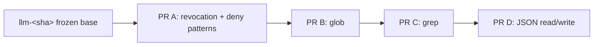

# Mount Extensions Reconstruction (PR #127 split)

| | |
|---|---|
| **Created** | 2026-07-09 |
| **Author** | Kris Kowal (prompted) |
| **Status** | Not Started |
| **Source** | Review on [PR #127](https://github.com/endojs/endo-but-for-bots/pull/127#pullrequestreview-4659737674) |

## Summary

[PR #127](https://github.com/endojs/endo-but-for-bots/pull/127) carries the
mount extensions from the [daemon-mount](daemon-mount.md) plan: a revocation
caretaker, defense-in-depth deny patterns, `glob()`, `grep()`, and JSON file
read/write. The 2026-07-09 review requested that the work be reconstructed on
the current `llm` branch (the mount facilities have since been reshaped around
`@endo/platform`), divided into separate pull requests per feature, and covered
by comprehensive tests, especially every glob variant, on a mount fixture
directory structured for Rust/Node parity. PR #127 closes once the replacement
PRs are open.

This document is the reconstruction plan: what changed under #127's feet, the
concrete four-PR split, the shared fixture and case-table test strategy, and
where each inline review directive lands. It is an execution plan for scope
already tracked by [daemon-mount](daemon-mount.md); it does not introduce new
roadmap scope.

## What changed on `llm` since #127 was cut

The #127 diff does not apply cleanly. A builder reconstructing each feature
must account for the following drift:

- **`EndoMount` is now a `Directory` specialization of `@endo/platform/fs`.**
  The conformance contract lives in
  `packages/daemon/test/mount-platform-fs-conformance.test.js`: every method on
  `PlatformDirectoryInterface` / `PlatformFileInterface` (from
  `@endo/platform/fs/lite`) must appear on the corresponding exo, and mount
  helpers now import from `@endo/platform` (for example `toSafeNumber` from
  `@endo/platform/fs/extended/shared/helpers.js`). New mount methods are
  daemon-local extensions and must be added to the `ENDOMOUNT_EXTENSIONS`
  allowlist in that test, with shapes consistent with the platform idiom.
- **`subDir` no longer exists.** The transient confined sub-root is `subView`
  (fresh `confinementRoot`, fresh `rootId`); the persisted counterpart is the
  `provideSubMount` formula. The revocation tests in #127 that exercised
  `subDir('src')` must exercise `subView` instead. No reconstructed PR may
  reintroduce the `subDir` name.
- **`followNameChanges` is implemented** (snapshot-then-diff stream over
  `FilePowers.watchDirectory`). #127 predates it, so #127's revocation and
  deny-pattern gating never covered it. The reconstruction must gate it: a
  revoked mount's change stream fails, and denied segments appear in neither
  the snapshot batch nor the diff records.
- **`stat()` already landed** on `llm` (via the `daemon-mount-capabilities`
  work and the mount-core chain). The "stat" slice of #127 is not part of the
  split; only revocation, deny patterns, glob, grep, and JSON remain.
- **The mount surface grew `maybeLookup`, `write`, `copy`, and `entry`**, and
  `makeMountExo` derives sub-faces by spreading a shared `ctx` record
  (`subView` does `makeMountExo({ ...ctx, ... })`). The revocation record
  rides that `ctx` spread, which is what makes revocation reach derived faces
  without extra plumbing.

## The four PRs

Each feature is one pull request, reconstructed from the #127 diff as
reference material rather than cherry-picked. All four touch the same files
(`packages/daemon/src/mount.js`, `interfaces.js`, `types.d.ts`,
`help-text-data.js`, `help.md`, and the conformance allowlist), and two have a
real semantic dependency, so the chain is **stacked and serial**:



PR A bases on a frozen `llm-<sha>` snapshot (per the garden's frozen-base
convention); each subsequent PR bases on its predecessor's head branch. Merge
order is bottom-up. Considered and rejected: four independent PRs off `llm`.
Reason: glob must consult the deny-segment set from PR A (denied names must
never leak through glob results, a security invariant), grep selects its files
through glob, and independent PRs would force conflict-heavy rebases across
the shared files after every merge.

### PR A — revocation and deny patterns (`feat/mount-revocation`)

- **Deny patterns.** A `defaultDeniedSegments` set (exported) matching #127's
  list: `.ssh`, `.aws`, `.azure`, `.gcloud`, `.config`, `.gnupg`,
  `.password-store`, `.docker`, `.npmrc`, `.env`, `.env.local`,
  `.env.production`, `.kube`, `.terraform`. Matching is case-insensitive
  (compare `segment.toLowerCase()` against the lowercased set). Enforcement
  points: `assertValidSegment` (direct path resolution throws
  `Access denied: ... is a restricted path`), `list()` filtering, and
  `followNameChanges` (both the snapshot batch and diff events). Ordinary
  dotfiles such as `.gitignore` stay accessible.
- **Override option** (review comment 3548865148): `makeMount` and
  `makeRevocableMount` accept an optional `deniedSegments: Iterable<string>`
  that **replaces** the default set (callers extend by spreading
  `defaultDeniedSegments`). An empty iterable disables denial. The
  `MountFormula` and `ScratchMountFormula` parameter records gain the same
  optional field, plumbed through the daemon's `mount` / `scratch-mount`
  formula handlers, so a mount can be *created* with a different set. CLI
  plumbing for the option is a follow-up, to be filed when PR A opens.
- **Revocation.** `makeRevocableMount(options) -> { mount, control }` with a
  shared `revocation = { revoked: boolean }` record carried on the mount
  `ctx`, so every derived face (sub-views via the `...ctx` spread, entries,
  file exos, `readOnly()` views, `makeDirectory` results, and the
  `followNameChanges` generator) observes the same flag through a common
  `assertLive()` gate on every method. `control` is an `EndoMountControl` exo
  (`revoke()`, `help()`) guarded by a new `MountControlInterface`. The daemon's
  `mount` and `scratch-mount` formulas switch to `makeRevocableMount` and wire
  `context.onCancel(() => control.revoke())`, tying revocation to formula
  cancellation. The control facet stays internal to the daemon for now (see
  Open questions).
- **Tests.** Revocation propagation matrix (mount, `subView`, file handle,
  entry-opened file, `readOnly()` view, an open `followNameChanges` stream);
  deny defaults (direct access throws, `list()` hides, change stream hides,
  `.gitignore` unaffected); override behavior (custom set enforced, defaults
  inert when overridden, empty set admits `.ssh`); formula cancellation
  revokes.

### PR B — glob (`feat/mount-glob`)

`glob(pattern) -> Promise<string[]>` on `EndoMount`, resolved against the
mount face's own root (a `subView`'s glob sees only its sub-root). The pattern
language is specified normatively so a Rust implementation can match it
exactly:

- The pattern splits on `/`; empty segments are dropped (`src//x` equals
  `src/x`, trailing slashes are ignored). A pattern with no segments throws.
- The only metacharacters are `*` and `**`. `*` matches zero or more
  characters within one segment, never `/`, and **does** match leading-dot
  names (a deliberate, documented divergence from POSIX glob). `**` is special
  only as a whole segment and matches zero or more directory levels; embedded
  (`a**b`) it degrades to `*` semantics. Every other character, including
  `?`, `[`, `]`, `{`, `}`, and `+`, is a literal.
- Denied segments never appear in results, even when named literally
  (`.ssh/*` returns an empty array rather than throwing). Entries that escape
  confinement (symlinks out of the mount root) are silently excluded.
  Matching is exact-case (listing-based, so case-sensitive even on
  case-insensitive filesystems).
- Results are mount-face-relative `/`-joined paths, include directories as
  well as files, and are **sorted lexicographically by UTF-16 code unit as a
  final step** (a spec simplification over #127's walk-order output, chosen so
  the Rust side needs no walk-order mirroring).
- Results are capped at 10,000 (`GLOB_MAX_RESULTS`) with silent truncation,
  matching #127 and documented in the help text; the streaming variants design
  (see cross-references) is the durable answer to unbounded result sets.
  Whether the cap should throw instead is an open question below; the builder
  defaults to truncation.

The shared **mount fixture and glob case table** (next section) land in this
PR. The conformance allowlist gains `glob`.

### PR C — grep (`feat/mount-grep`)

`grep(pattern, options?) -> Promise<Array<{ file, line, text }>>` with
`options` of `{ glob = '**/*', maxResults = 1000 }`:

- File selection goes through `glob(options.glob)`, inheriting confinement,
  deny filtering, and ordering; directories are skipped.
- `pattern` is an ECMAScript regular-expression source, evaluated as
  `new RegExp(pattern)` with no flags. Both platforms execute the same
  `mount.js` (V8 under Node, XS under the Rust supervisor), so the engine
  dialect is ECMA-262 on both sides; the parity case table still restricts
  itself to a conservative subset (literals, character classes, anchors,
  alternation, bounded quantifiers).
- Content splits on `\n`; a trailing `\r` is stripped from the matched line
  text (CRLF normalization, a documented divergence from #127). Line numbers
  are 1-based; each matching line yields one record carrying the whole line.
- A file whose text read fails is skipped silently. The case table avoids
  binary fixtures in expectations (Node substitutes U+FFFD where XS may
  throw), and the fixture's binary probe file asserts only that grep does not
  fail, not what it yields.
- `maxResults` caps the match count.

Extends the case tables with `mount-grep-cases.json`; conformance allowlist
gains `grep`.

### PR D — JSON file read and write (`feat/mount-json`)

- `readJson(path) -> Promise<unknown>`: confined text read plus `JSON.parse`;
  throws when the file is missing or the content is not valid JSON.
- `maybeReadJson(path) -> Promise<unknown | undefined>` (review comment
  3548857836): returns `undefined` when the read fails (missing file,
  mirroring `maybeReadText`'s failure envelope exactly), but a present file
  with invalid JSON still throws; the parse sits outside the read's catch.
- `writeJson(path, value) -> Promise<void>`: writable-gated, confined, creates
  parent directories, writes `JSON.stringify(value, null, 2)` plus a trailing
  newline (POSIX-text friendly, a documented divergence from #127). Throws
  when `JSON.stringify` returns `undefined` (non-serializable input) rather
  than writing the string `"undefined"`.
- Help text (`help-text-data.js`, `help.md`), `types.d.ts`, interface shapes,
  and the conformance allowlist cover all three methods. The `EndoMountFile`
  `json()` accessor already exists on `llm` and is untouched.

## Test strategy: mount fixture, case tables, Rust/Node parity

The review's core demand is comprehensive coverage, especially every glob
variant, on a mount fixture directory that supports comparing the Rust and
Node implementations. The design separates the **data** (cross-language JSON
artifacts) from the **runner** (per-platform test code):

1. **`packages/daemon/test/mount-fixture-manifest.json`** — a declarative
   manifest of the canonical fixture tree: an array of
   `{ path, type: 'file' | 'directory' | 'symlink', content?, target?,
   optional? }` records. A manifest (rather than a checked-in tree) is chosen
   because the fixture needs empty directories, denied names such as
   `.ssh/id_rsa` and `.env`, and an escaping symlink, none of which travel
   well in git; and because a JSON manifest is directly consumable by a Rust
   test that materializes the same tree.
2. **`packages/daemon/test/_mount-fixture.js`** — the Node-side builder:
   materializes the manifest into a fresh temp directory per test. Records
   flagged `optional: true` (the symlink case) are skipped on platforms that
   cannot create them, and the case table marks the expectations that depend
   on them.
3. **`packages/daemon/test/mount-glob-cases.json`** and
   **`mount-grep-cases.json`** — case tables of
   `{ name, pattern, options?, expect }` where `expect` is the exact sorted
   result. The tables are the cross-platform contract: the Node runner
   (`mount-glob.test.js`, `mount-grep.test.js`) iterates them with ava, and a
   Rust-side or XS-supervisor-side runner consumes the same three JSON files
   to assert identical results. Wiring that second runner into the Rust
   workspace is a named follow-up, to be filed when PR B opens; until then the
   existing XS/Node `FilePowers` surface-conformance tests in
   `mount-platform-fs-conformance.test.js` remain the guard that the same
   `mount.js` runs under the Rust supervisor.

Fixture layout (canonical tree the manifest encodes):

```
README.md  package.json  data.json  notes.txt  a+b.txt  .gitignore
.ssh/id_rsa  .aws/credentials  .env            (denied names)
src/index.js  src/util.js  src/main.rs  src/README.md
src/nested/deep.js  src/nested/deeper/deepest.js
docs/a.md  docs/B.md  docs/img.png             (binary probe)
[bracket]/b.txt                                 (metacharacter name)
empty/                                          (empty directory)
escape -> <outside the root>                    (optional symlink)
```

Glob variant coverage matrix (each row expands to concrete cases in
`mount-glob-cases.json`; expected lists live in the table, not duplicated
here):

| Variant class | Patterns |
|---|---|
| Literal segments | `README.md`, `src/index.js`, `missing.txt`, `.gitignore` |
| Literal denied names | `.ssh`, `.ssh/id_rsa`, `.env` (all empty results) |
| Single `*` | `*`, `*.md`, `*.txt`, `src/*`, `src/*.js`, `*/README.md` |
| `*` positions within a segment | `src/i*.js`, `src/*.js`, `src/i*x.js`, `src/*i*.js`, `*a*` |
| `**` recursion | `**`, `**/*`, `**/*.js`, `src/**`, `src/**/*.js`, `**/deeper/*.js` |
| `**` matching zero levels | `docs/**/*.md`, `src/**/index.js` |
| Same name at multiple depths | `**/README.md` |
| Metacharacters as literals | `a+b.txt`, `[bracket]/b.txt`, `[bracket]/*` |
| Deny interaction | `**/*` and `*` exclude `.ssh`/`.aws`/`.env`, include `.gitignore` |
| Dotfile matching | `*` and `.*`-shaped patterns against `.gitignore` |
| Directories in results | `src`, `empty`, `*` (directories included) |
| Case sensitivity and ordering | `readme.md` (empty), `docs/*` (`B.md` sorts before `a.md`) |
| Path normalization | `src//nested`, `src/nested/`, empty pattern (throws) |
| Confinement | `**` excludes the escaping symlink target (optional case) |
| Truncation | unit test against a generated wide tree, not the shared fixture |

Grep cases cover: plain literal, anchored (`^`, `$`), character class,
alternation, `options.glob` filtering, `maxResults` cutoff, CRLF
normalization, 1-based line numbers, multi-match files, and the binary-probe
no-failure assertion. JSON cases cover: round trip through
`writeJson`/`readJson`, `maybeReadJson` on a missing file (undefined), on
invalid JSON (throws), nested-value fidelity, and `readJson` of the fixture's
`data.json` (a parity case, since the expected value lives in the case data).

## Inline directive disposition

| Review comment | Directive | Lands in |
|---|---|---|
| 3548865148 (`mount.js` `DENIED_SEGMENTS`) | Overridable deny-set option at mount creation | PR A |
| 3548857836 (`help-text-data.js` `readJson`) | Add `maybeReadJson` with help text and types | PR D |
| 3548875661 (`types.d.ts` `subDir`) | No abbreviations; the method makes a submount | Already satisfied on `llm`: `subDir` was renamed to `subView` with the persisted `provideSubMount` sibling. The reconstruction reintroduces no `subDir`; PR A's tests exercise `subView`. |
| 3548861664 (exo-stream variants) | Design `streamGlob` / `streamGrep` | Separate designer job (`endojs-endo-but-for-bots-mount-stream-glob-grep-127`), not folded here. Anticipated: the fixture manifest and case tables are the shared contract, and `streamGlob(pattern)` must yield exactly the set the glob case table pins for `pattern`. |

## Closing PR #127

PR #127 stays open as the reference diff until all four replacement PRs are
open. The final orchestration step then posts a closing comment on #127
cross-linking the four PRs and this design, and closes it, per the review's
"Create fresh PRs and close this" (a maintainer lifecycle directive, which is
itself the authorization to close).

## Build orchestration

One serial orchestration over five children, halting on failure: PR A builder,
PR B builder, PR C builder, PR D builder, then the #127 closer. Each builder
job names its base (the frozen `llm-<sha>` snapshot for PR A; the
predecessor's head branch for B through D), its head branch, and this design
as the specification, and runs the standard PR-creation chain.

## Open questions

- Should `glob()` throw when it would exceed `GLOB_MAX_RESULTS`, rather than
  silently truncating as #127 did? Truncation is a correctness footgun for
  callers that treat the result as exhaustive; throwing makes the cap visible
  but breaks large-tree callers until the streaming variants exist.
- Should `EndoMountControl` become reachable as a petnameable capability (a
  host-only accessor in the spirit of `provideHostPath` from
  [daemon-mount-capabilities](daemon-mount-capabilities.md)), or remain
  reachable only through formula cancellation? #127 kept it internal; PR A
  preserves that.
- Does CI need a case-insensitive-filesystem lane (macOS) and a Windows lane
  for the parity matrix, or is the Linux lane plus the Rust-side runner
  sufficient?

## References

- [daemon-mount](daemon-mount.md) — the parent plan; its Status names PR #127.
- [daemon-mount-capabilities](daemon-mount-capabilities.md) — the `EndoMount`
  `Directory`-specialization reshape this reconstruction builds on.
- [platform-fs](platform-fs.md) and `@endo/platform/fs/lite` — the conformance
  contract for the mount surface.
- PR #127 diff — reference material for each builder; the review thread
  carries the inline directives mapped above.
