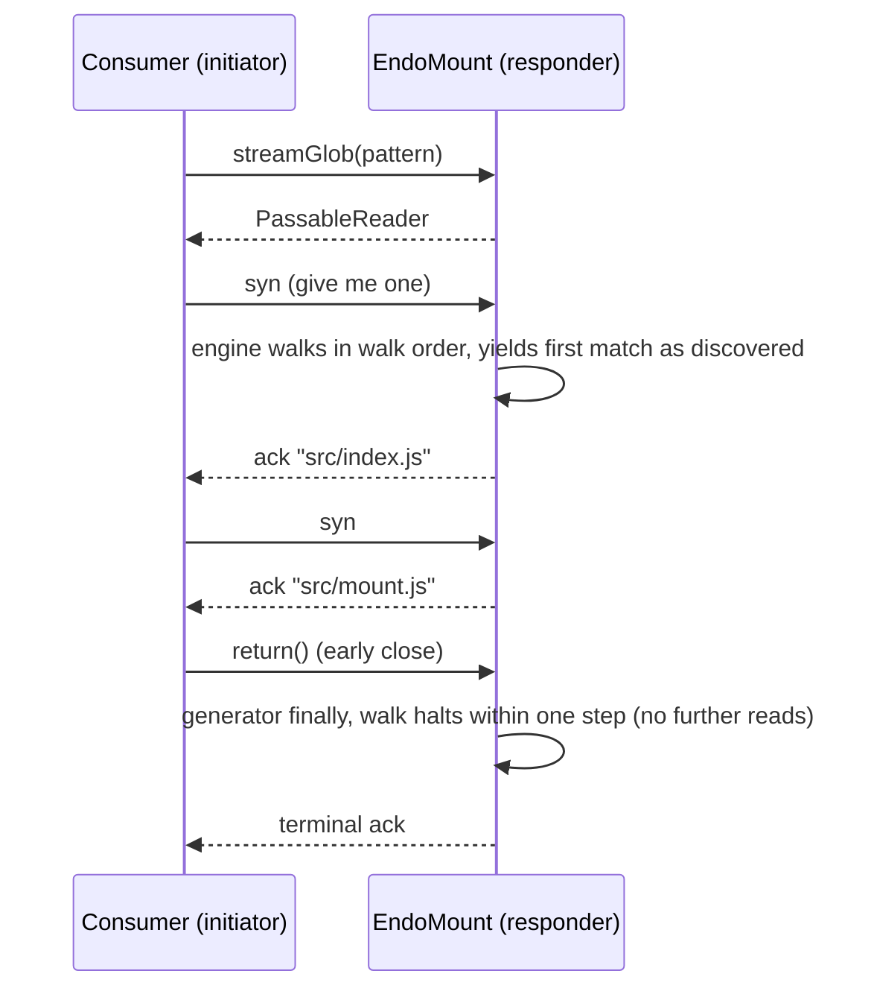

# Streaming Mount Search: `streamGlob` and `streamGrep`

| | |
|---|---|
| **Created** | 2026-07-09 |
| **Updated** | 2026-09-05 |
| **Author** | Kris Kowal (prompted) |
| **Status** | In Progress ([PR #1085](https://github.com/endojs/endo-but-for-bots/pull/1085)) |
| **Source** | Review comments on [PR #127](https://github.com/endojs/endo-but-for-bots/pull/127#discussion_r3548861664) and [PR #1085](https://github.com/endojs/endo-but-for-bots/pull/1085#discussion_r3939436362) |

## Status

The JavaScript `streamGlob` and `streamGrep` surfaces are implemented on PR
#1085. The native Endor engine, fused tree traversal, real Ironhorse parity
path, differential suite, and preliminary benchmark report specified below are
the pending follow-up.

## What is the Problem Being Solved?

The mount extensions branch (PR #127, `feat/mount-extensions`) gives
`EndoMount` two bulk search methods that return fully materialized arrays:

- `glob(pattern) -> Promise<string[]>`
- `grep(pattern, options?) -> Promise<Array<{ file, line, text }>>`

Eager materialization has three scaling problems.
First, protective caps (`GLOB_MAX_RESULTS`, 10,000 paths; `grep`
`options.maxResults`, default 1,000 matches) silently truncate large result
sets, and the protocol offers no way to ask for the rest.
Second, the caller sees nothing until the whole walk finishes, so
time-to-first-result on a large mount is the full traversal time.
Third, memory and marshalled-message size are proportional to the whole
result set on both sides of the CapTP boundary, and `grep` additionally
materializes its entire candidate file list (a full `glob` result) before
reading the first file.

The maintainer directed on the PR #127 help-text review: "Please post a plan
to design exo-stream variants of these methods, like `streamGlob` and
`streamGrep`."

This design adds streaming variants built on `@endo/exo-stream`, the
package this repository already uses for byte streams (`EndoMountFile.
streamBase64`, `write` blob ingestion, tar check-in) and which exists
precisely to bridge async iteration over CapTP with flow control and
pattern guards.

The first implementation on PR #1085 deliberately uses the portable
JavaScript search engine and crosses the XS-to-Rust host boundary once per
directory or file. The follow-up requested in review removes that boundary
cost on Endor, adds a fused `glorpStream`, and makes the same contract runnable
and differential-tested on Node.js, Endor/XS, and Endor/Ironhorse. The second
half is pending; consequently this design is no longer marked fully
implemented.

## Design

### Surface

Two new methods on `EndoMount`:

```
streamGlob(pattern, options?) -> PassableReader<string>
streamGrep(pattern, files, options?) -> PassableReader<{ file, line, text }>
```

- `streamGlob` options: `{ buffer?: number }`.
- `streamGrep` takes a **mandatory** `files` argument — an external stream of
  mount-relative paths to grep, a `PassableReader<string>` (the shape
  `streamGlob` returns), or a promise for one so a caller may pipe
  `E(mount).streamGlob(g)` straight in. Grep does **not** glob: the file set is
  the producer's concern, the streaming twin of the eager `grep(pattern,
  glob(g))` seam (grep's `paths` argument), not a fused glob+grep (the
  streaming `glorp`). "Search everything" and "search a glob subset" are
  expressed by composition, not an option:
    - everything:   `E(mount).streamGrep('TODO', E(mount).streamGlob('**'))`
    - glob subset:  `E(mount).streamGrep('TODO', E(mount).streamGlob('*.js'))`
  Its remaining options are `{ buffer?: number }`. There is deliberately no
  `maxResults`: the consumer bounds the stream by returning early. What early
  close saves is per-method (see cancellation below): for `streamGrep` it elides
  the remaining *supplied files'* content reads (grep reads one file per pull),
  and — because it then pulls no further paths — the unread remainder of the
  *producer's* stream too; whether that halts the producer's directory walk
  depends on whether the producer's walk is itself incremental. For `streamGlob`
  the engine walks in directory-locally sorted walk order (`globPaths({ sorted:
  false })`): it sorts each directory when reached and yields matched paths as
  the walk discovers them, without a whole-tree sort barrier. Its enumeration is
  therefore demand-bounded and early close halts the walk within one walk step —
  and therefore
  `streamGrep(p, streamGlob('**'))` inherits a walk-incremental producer, a first
  match before the whole tree is walked.

Both return a fresh `PassableReader` remotable (from
`@endo/exo-stream/reader-from-iterator.js`) synchronously, the same way
`entry` returns an `EndoMountEntry` and `readOnly` returns the view, so the
consumer can pipeline without an extra round trip:

```js
import { E } from '@endo/far';
import { iterateReader } from '@endo/exo-stream/iterate-reader.js';

for await (const { file, line, text } of iterateReader(
  E(mount).streamGrep('TODO', E(mount).streamGlob('src/**/*.js')),
)) {
  if (foundEnough()) break; // elides grep's remaining supplied-file content
                            // reads and pulls no further paths from the producer
}
```

Interface guards in `MountInterface` (`packages/daemon/src/interfaces.js`):

```js
// Search (streaming)
streamGlob: M.call(M.string())
  .optional(M.splitRecord({}, { buffer: M.number() }))
  .returns(M.remotable('PassableReader')),
streamGrep: M.call(M.string(), M.or(M.remotable('PassableReader'), M.promise()))
  .optional(M.splitRecord({}, { buffer: M.number() }))
  .returns(M.remotable('PassableReader')),
```

Each reader self-describes its element shape through the exo-stream
`readPattern()` facility, so consumers can rely on well-shaped elements or
the stream breaks with an error:

- `streamGlob`: `M.string({ stringLengthLimit: STREAM_STRING_LENGTH_LIMIT })`
  (mount-relative path).
- `streamGrep`: `harden({ file: M.string(), line: M.number(), text: M.string({
  stringLengthLimit: STREAM_STRING_LENGTH_LIMIT }) })`.

  Both use `STREAM_STRING_LENGTH_LIMIT = Infinity` rather than `M.string()`'s
  default `100,000` (or any other finite ceiling). The reader pump enforces
  `readPattern` with `mustMatch` on *every* element, so any finite limit would
  make a single over-limit element — a match line or path over the ceiling (a
  minified bundle, single-line JSON, a lock file, a base64/SVG blob) — throw and
  abort the *whole* stream, dropping every later match: a parity break the eager
  `grep` (no such limit) does not share. And a finite ceiling buys no memory
  protection, because `grepFiles` has already read the whole file into one string
  before the per-element check runs — so `Infinity` is the only value that
  preserves eager-parity without a false memory guarantee.

### Producer implementation

> **As implemented ([PR #1085](https://github.com/endojs/endo-but-for-bots/pull/1085)).**
> The mount stack landed independently of this design: by the time
> `streamGlob`/`streamGrep` were built, `glob()`/`grep()` had already been
> re-based onto the **shared `@endo/platform/fs/search` engine**
> (`provideSearch(filePowers)` -> `search.globPaths` / `search.grepFiles`), which
> yields *batches* of paths / match records from async generators. So there is no
> local `walkGlobMatches`/`grepMatches` to write — the streaming methods reuse the
> **same engine generators** the eager collectors already consume, which is what
> makes drift-freedom automatic. The sketch below of a bespoke walker refactor is
> retained as the original plan; the shipped shape is:

1. `streamGlob()` / `streamGrep()` call `provideSearch(filePowers)` and wrap the
   engine's batch generator (`search.globPaths` / `search.grepFiles`, driven at
   `batchSize: 1` so the yield granularity is one path/record per batch) in an
   async generator that re-checks `assertLive()`. A liveness-checking generator
   (`assertLivePathBatches`) is interposed on each method's *path source* —
   asserting before surfacing each path batch — and `assertLive()` runs again
   before each yield. The two methods differ in **what their path source is**.
   `streamGlob`'s source is `globPaths({ sorted: false })`: paths in
   *directory-locally sorted walk order*. Each directory's names are sorted only
   when the walk reaches it, and each match is yielded as discovered, so the
   liveness check runs between walk steps and a `revoke()` *during* the
   enumeration is observed within one walk step.
   `streamGrep`'s source is the **external `files` reader** — grep no longer
   walks. It adapts that reader into path batches (`iterateReader`, one path per
   singleton batch) and interposes the same liveness check, so the check runs
   between file-stream pulls and thus between the content reads `grepFiles`
   performs per batch: a mid-stream `revoke()` bounds post-revoke *content reads*
   to a single file, including a sparse grep that yields no match for many files.
2. `glob()` / `grep()` are unchanged: they collect the *same* engine generators up
   to `GLOB_MAX_RESULTS` / `maxResults`. The stream methods just omit the cap and
   hand the generator to `readerFromIterator` instead of an accumulator array.
3. `streamGrep` feeds `search.grepFiles` the adapted `files` reader as its path
   source, so — unlike the eager `grep(pattern, glob(g))` composition, which
   awaits the whole (capped) glob array and hands it to grep as one argument — no
   full path array round-trips as grep's argument and the 10,000-path cap is
   dropped: the paths arrive one at a time over the stream. Because grep does not
   enumerate, there is **one walker** — in the producer — and no second walk to
   drift.
4. Ordering and eagerness follow the *producer*. `streamGlob` uses
   **directory-locally sorted walk order** (`globPaths({ sorted: false })`) —
   each directory is sorted when reached and each matched path is yielded as the
   walk discovers it — so it is **incremental in the directory walk**: a first path
   before the whole tree is walked, its enumeration demand-bounded, and its
   streaming win is time-to-first-result on top of bounded marshalled-message size
   and the absent 10,000-path cap. `streamGrep` reads the supplied files'
   *contents* incrementally (one file per pull), so content reads never run ahead
   of demand and early close leaves later supplied files unread. Whether the
   *directory walk* is incremental is the producer's property: fed `streamGlob(g)`
   (walk order) the walk is incremental, so `streamGrep(p, streamGlob('**'))` is
   walk-incremental end to end — a first match before the whole tree is walked. A
   caller needing glob-identical UTF-16 order uses eager `glob()` instead; a
   *sorted* streaming mode was considered and not offered (see § Follow-up). Fed
   `streamGlob(g)`, `streamGrep`'s flattened order is the producer's walk order,
   so it collects to the same **multiset** as eager `grep(pattern, glob(g))`
   (order-independent equality; walk order is not glob's sort).

```js
// Shipped shape (packages/daemon/src/mount.js):
const streamGrep = (pattern, files, options = {}) => {
  assertLive();
  const { buffer = 0 } = options;
  const search = provideSearch(filePowers);
  const generate = async function* generate() {
    assertLive();
    // Adapt the external file reader into path batches grepFiles consumes: one
    // path per singleton batch, liveness-checked between pulls. Grep does not
    // walk; the producer does.
    const fileBatches = assertLivePathBatches(
      (async function* singletonBatches() {
        for await (const relativePath of iterateReader(files, {
          readPattern: M.string({ stringLengthLimit: STREAM_STRING_LENGTH_LIMIT }),
        })) {
          yield [relativePath];
        }
      })(),
    );
    for await (const batch of search.grepFiles(currentDir, pattern, fileBatches, {
      deniedSegments, confinementRoot, batchSize: 1,
    })) {
      for (const match of batch) {
        assertLive();
        yield match;
      }
    }
  };
  return readerFromIterator(generate(), {
    buffer: clampStreamBuffer(buffer),
    readPattern: grepMatchPattern,
    once: true,
  });
};
```

The engine's generators are async. For `streamGrep` the *content* read advances
only as the stream is pulled, so no supplied file is read ahead of consumer
demand beyond the requested pre-ack buffer — early close bounds grep's reads and,
because it then pulls no further paths, the producer's remaining stream too
(whether that halts the producer's *walk* depends on the producer). For
`streamGlob` the directory *enumeration* advances in walk order as the stream is
pulled (`globPaths({ sorted: false })`), yielding each matched path as it is
discovered, so its early close bounds the walk itself, not just marshalling. The
`streamGlob` sequence below shows that walk-incremental shape; `streamGrep`
interleaves `producer path -> file read -> match -> ack`.



### Backpressure and cancellation

Both are delegated wholesale to the Exo Stream Protocol
(`packages/exo-stream/PROTOCOL.md`): data flows on the acknowledge chain,
flow control on the synchronize chain.

- **Backpressure.** With the default `buffer: 0` the stream is fully
  synchronized at the *element* granularity: the producer settles at most one
  element ahead of consumer demand. For `streamGrep` this bounds the file
  *content* reads to demand (grep reads one supplied file per pull) and, because
  grep pulls the `files` reader lazily too, its demand propagates back to the
  producer; for `streamGlob` the walk advances in walk order as the stream is
  pulled, so backpressure governs the directory walk itself, not just marshalling.
  Consumers on high-latency links pass `buffer > 0` to let the producer pre-ack
  that many elements. The producer clamps the requested buffer
  (`clampStreamBuffer`, ceiling `STREAM_BUFFER_MAX = 1,024`) so a remote caller
  cannot demand unbounded pre-materialization; the clamp replaces the eager
  variants' result caps as the daemon-side resource bound.
- **Cancellation.** A consumer that breaks out of `for await` (or calls
  `return(value)` on the iterator) sends the close on the final
  synchronize node; the reader pump calls the generator's `return()`, the
  generator's `finally` runs, and no further filesystem I/O happens. For
  `streamGrep` this elides the remaining supplied files' content reads and stops
  pulling the `files` reader — whose own `return()` propagates to the producer,
  so a walk-incremental `streamGlob` producer stops walking too. For `streamGlob`
  the walk advances in walk order with demand, so early close halts the walk
  within one walk step, saving traversal as well as marshalling. A consumer
  `throw` closes the same way through `iterateReader`.

### Revocation

`streamGlob` and `streamGrep` call `assertLive()` at invocation, and the
generators re-check `assertLive()` per path batch (each method's path source is
wrapped in `assertLivePathBatches`) and again before each yield. A
`EndoMountControl.revoke()` mid-stream therefore causes the next pull to reject on
the acknowledge chain with the same "Mount has been revoked" error the eager
methods throw; `iterateReader` surfaces it as a thrown error at the consumer's
`for await`. The per-path-batch check matters for the `buffer: 0` sparse-grep
case: without it, a grep that matches nothing for many files would reach the
per-yield `assertLive()` only at the (never-arriving) next match, so a revoke
would go unobserved and the daemon would keep reading files supplied by the
stream; with it, post-revoke work halts within one file. For `streamGrep` the
path source is the external `files` reader (grep no longer walks), so this bounds
the *content reads* — a `revoke()` is observed within one supplied file, not
deferred to the end of the stream; any post-revoke *walk* belongs to the producer
and is bounded by the producer's own revocation on the `mount` it was minted
against. For `streamGlob` the directory *enumeration* advances in walk order per
path batch (`globPaths({ sorted: false })`; see § Backpressure and
cancellation), so a `revoke()` landing during its walk is observed within one
walk step. A revoked-but-never-pulled stream holds only a suspended generator
closure (no open file handles between pulls), so no separate teardown
registration with the revocation context is needed.

Revocation is **not** an atomic cutoff when `buffer > 0`. With a non-zero
pre-ack window the producer pump pulls (and settles) up to `buffer` elements
ahead of consumer demand, each past its own `assertLive()` at pull time. A
`revoke()` after those pulls have settled cannot un-deliver them: the consumer
still receives up to the clamped buffer's worth of already-acknowledged
elements, and only the first pull past the drained buffer rejects. The clamp
(`STREAM_BUFFER_MAX`) bounds this revocation-latency window; because the search
readers are latched to a single active stream (see below), the bound is *per
reader*.

Note **who chooses `buffer`.** `makeRevocableMount` deliberately splits the
`EndoMount` facet (the search/stream authority) from the `EndoMountControl`
facet (the `revoke()` authority) so the two can be handed to different trust
levels — the less-trusted party typically holds `EndoMount`, and `buffer` is an
argument to *its* `streamGlob`/`streamGrep` calls. So the party that `revoke()`
is used *against* is the one that selects `buffer`; the revoking party has no
per-grant lever to pin it to `0` (there is no `buffer` ceiling on `makeMount`
today). The clamp bounds the per-reader worst case: after `revoke()` an
untrusted grantee that requested `buffer: STREAM_BUFFER_MAX` receives at most
`STREAM_BUFFER_MAX` further elements. This is a *per-reader* bound because the
search readers are minted once-only (`readerFromIterator({ once: true })`): a
second `stream()` on the same reader rejects rather than starting a second walk
over the shared iterator, which would otherwise both split the element set and
open a second pre-ack window (so `k` concurrent streams could scale the pre-ack
memory and post-revoke delivery as `k*buffer`). Latching to a single active
stream is exactly what a per-request producer wants — a per-search reader has no
meaningful second consumer. The one remaining lever the *revoker* still lacks is
a `buffer` ceiling on `makeMount`/`makeRevocableMount` itself (the grantee, not
the revoker, chooses `buffer` within `[0, STREAM_BUFFER_MAX]`); pinning that per
grant is the residual refinement recorded in § Follow-up. A grantee that itself
wants a hard cutoff keeps `buffer` at the default `0`, where the pump never
pre-pulls and the next pull after `revoke()` rejects with no further delivery.
The test plan pins both the per-reader worst case (revoke immediately after a
`buffer > 0` stream starts; assert the post-revoke delivery is bounded by the
clamped buffer) and the once-only latch (a second `stream()` rejects).

### Confinement, deny patterns, and attenuations

Identical to the eager methods by construction, because the walker is
shared: `isDeniedSegment` and `isConfinedPath` apply to every entry, so
deny-listed names (`.ssh`, `.env`, and the rest) and paths escaping the
confinement root are never yielded. On a `subView` / `subDir` sub-mount the
generator walks under the sub-root's own confinement root.

The streaming methods are reads, so they are available on read-only mounts
(a mount made with `readOnly: true`). The structural `readOnly()`
`ReadableTree` view does **not** carry them, consistent with the existing
exclusion of `glob`, `grep`, and `stat` from that view: the view is the
minimal shared read contract from `@endo/platform/fs`, and callers that
need search keep a mount reference.

### Help text and types

`packages/daemon/src/help-text-data.js` gains two `EndoMount` entries:

- `streamGlob: 'streamGlob(pattern, options?) -> PassableReader<string>\n...'`
- `streamGrep: 'streamGrep(pattern, files, options?) -> PassableReader<{ file, line, text }>\n...'`

Each names the arguments and options, states that the consumer iterates with
`iterateReader` from `@endo/exo-stream/iterate-reader.js`, that `streamGrep`'s
`files` is a mandatory external path stream composed from a producer
(`streamGrep('TODO', streamGlob('**'))`), and that closing a `streamGrep`
iterator early leaves later supplied files unread (grep reads one file per pull),
while whether the walk stops is the producer's concern — for a `streamGlob`
producer the walk advances in walk order, so early close halts its walk within one
walk step. The eager `glob` and `grep` entries gain a
cross-reference sentence ("results are capped; for incremental or
unbounded result sets use streamGlob / streamGrep"). The mount typedefs
type the two methods with `PassableReader` imported from
`@endo/exo-stream`.

### Scope: other bulk methods

- `list(...path)`: one `readDirectory`, bounded by a single directory's
  width. Considered and rejected: `streamList`. Reason: redundant, since
  `streamGlob('*')` (one level) and `streamGlob('**/*')` (recursive) are
  the streaming enumerations.
- `snapshot()`: already scales, since it returns a content-addressed
  `SnapshotTree` whose per-file bytes stream over `streamBase64`; the
  check-in walk is a content-store concern settled in
  [daemon-mount-capabilities](daemon-mount-capabilities.md). Out of scope.
- `followNameChanges()`: declared but unimplemented pending a filesystem
  watcher (see [fs-interface-consolidation](fs-interface-consolidation.md)
  § C1). A change feed is an infinite stream and should ride the same
  `PassableReader` shape when the watcher design lands; named here so that
  design adopts the same protocol (tracking design to be filed with the
  watcher work).

## Native Endor and Fused-Tree Follow-up

This section is the normative implementation brief for the next fixer. It
supersedes the earlier statements that search is mount-only and that
`streamGrep` should drive the platform engine with singleton path and result
batches. It does not change the already-shipped public `streamGlob` or
`streamGrep` element shapes.

### Public surface and internal search contract

Add the fused operation beside `glorp`:

```ts
glorpStream(
  globPattern: string,
  grepPattern: string,
  options?: {
    buffer?: number;
    followSymlinks?: boolean;
  },
): PassableReader<GrepMatch>;
```

`EndoMount.glorpStream` yields the same single `{ file, line, text }` records
and uses the same once-only reader, `buffer` clamp, walk order, and synchronous
remotable return as the other stream methods. It is fused rather than an alias
for `streamGrep(grepPattern, streamGlob(globPattern))`: the implementation
passes both patterns to one search operation, allowing a physical leaf to
enumerate, filter, read, and match entirely in Rust. `MountInterface`,
`EndoMount` in `packages/daemon/src/types.d.ts`, the `makeMountExo` method bag,
and `help-text-data.js` all gain this method; regenerate `help.md` from that
source.

Extend `Search` in `packages/platform/src/fs/search-types.ts` with:

```ts
glorpFiles(
  root: string,
  globPattern: string,
  regexSource: string,
  options?: {
    deniedSegments?: string[];
    confinementRoot?: string;
    batchSize?: number;
    followSymlinks?: boolean;
  },
): AsyncGenerator<GrepMatch[]>;
```

The reference `makeSearch` implementation in
`packages/platform/src/fs/search.js` implements `glorpFiles` by feeding
`globPaths({ sorted: false, includeDirectories: false })` directly into
`grepFiles`; it must not collect an intermediate path array. `provideSearch`
continues to be the sole selection seam: Node file powers receive this
reference implementation, while `makeXsFilePowers` supplies an Endor-native
`search` object. Both `grepFiles` and `glorpFiles` yield result arrays
internally. Batch boundaries are never observable semantics; `mount.js`
flattens them into the existing one-record `PassableReader` surface.

`streamGrep` keeps its mandatory external path reader. On Endor, replace the
singleton adapter with `batchPathReader` in `packages/daemon/src/mount.js`:
it forms batches of at most 64 paths and at most 256 KiB of UTF-8 encoded path
data, permitting one over-limit path as a singleton. The reference Node search
may consume the same path batches, so batching behavior is exercised on every
platform even though only Endor benefits at the process boundary. These are
named internal constants (`SEARCH_INPUT_BATCH_PATHS` and
`SEARCH_INPUT_BATCH_BYTES`), not new public options. The benchmark may justify
changing them later without changing semantics.

### Endor host protocol

Implement a stateful search cursor in a new
`rust/endo/xsnap/src/powers/search.rs`, registered after the existing
filesystem callbacks. It exposes four synchronous host functions:

```text
searchOpen(dirToken, rootRelative, confinementRelative, requestJson)
                                                -> integer handle | "Error: ..."
searchWrite(handle, pathsJsonOrNull)             -> undefined | "Error: ..."
searchRead(handle, limitsJson)                   -> ArrayBuffer
searchClose(handle)                              -> undefined | "Error: ..."
```

`requestJson` has exactly two variants:

```ts
type SearchRequest =
  | {
      kind: 'grep';
      regexSource: string;
      deniedSegments: string[];
    }
  | {
      kind: 'glorp';
      globPattern: string;
      regexSource: string;
      deniedSegments: string[];
      followSymlinks: boolean;
    };
```

`rootRelative` is the directory against which result paths are relative;
`confinementRelative` is the real-path boundary. They differ for a lookup-made
sub-mount, which searches from its `currentDir` while retaining its parent
mount's `confinementRoot`; a true `subView` passes its narrowed `currentDir` for
both. `searchOpen` resolves both through the existing cap-std `HostPowers`
directory token, validates both patterns before allocating a handle, and
constructs a lazy cursor. `searchWrite` supplies a `grep` cursor with one path
batch; `null` closes its input, and calling it for a `glorp` cursor or while an
earlier batch remains is an error. This compiles the regexp once per search
rather than once per batch. A `glorp` cursor owns the directory walk and starts
no I/O until `searchRead`.

`searchRead` returns UTF-8 JSON bytes in an `ArrayBuffer`, decoded in
`packages/daemon/src/bus-manager-rust-xs-powers.js` with the existing native
UTF-8 decoder and `JSON.parse`:

```ts
type SearchReadResult = {
  state: 'more' | 'needInput' | 'done';
  matches: GrepMatch[];
};
```

`limitsJson` carries `{ outputBytes, workFiles, workBytes }`. The adapter uses
256 KiB, 64 files, and 4 MiB respectively; the host clamps output to 16 KiB
through 4 MiB, files to 1 through 1,024, and work bytes to 64 KiB through 64
MiB. A call stops when its next complete record would cross `outputBytes` or
when either work limit is reached, even if it found no match. One record or one
input file larger than its byte limit is processed alone. `state: 'more'`
requests another read, `needInput` asks the grep adapter for another path batch,
and `done` is terminal. Thus large batches, rather than one file/read call,
cross the engine boundary, while sparse searches return to JavaScript often
enough to observe cancellation. The cursor does not retain emitted line text.
Exhaustion releases it automatically; `searchClose` remains mandatory and
idempotent so cancellation and exceptions release a non-exhausted cursor.
Unknown, closed, and cross-worker handles fail closed.

Add the callbacks at the **end** of
`rust/endo/xsnap/src/powers/search.rs::CALLBACKS`, append that slice after
`powers::sqlite::CALLBACKS` in `worker_snapshot_callbacks`, register it last in
`Machine::register_powers`, add `hostSearchOpen` / `hostSearchWrite` /
`hostSearchRead` / `hostSearchClose` aliases in `host_aliases.js`, and declare
them in
`packages/daemon/src/bus-xs-host-globals.d.ts`. The callback ordering is
append-only. Bump `xsnap::SNAPSHOT_SIGNATURE` because the boot-visible callback
table changes; old snapshots must reject by signature rather than bind an old
index to a new function.

`makeXsFilePowers` constructs its optional `search` with a new
`packages/daemon/src/bus-manager-rust-search.js` adapter. The adapter wraps
every cursor in `try/finally`, converts `"Error: "` host results to exceptions,
validates the decoded result shape before yielding it, and re-batches host
responses to the `Search` caller's requested `batchSize` (default 64, ceiling
1,024). Neither `mount.js` nor `provideSearch` calls host globals directly.
The adapter is engine-neutral despite its manager call site: the Ironhorse
parity archive imports the same module. `makeXsFilePowers` accepts an internal
`{ searchImplementation: 'native' | 'js' }` test/benchmark option so the matrix
can force the portable fallback without changing production's native default.

### One parity contract

`packages/platform/src/fs/search.js` remains the executable reference and a
new checked-in `packages/platform/test/search-parity-cases.json` becomes the
language-neutral contract. Every implementation must agree on the flattened
sequence, errors, and cancellation checkpoints; transport batch boundaries do
not participate in equality.

The contract is:

- Glob syntax remains only within-segment `*` and whole-segment `**`; every
  other character is literal. Directory names are sorted by UTF-16 code units
  before descent, yielding deterministic depth-first walk order. A directory
  symlink is reported but not descended by default; `followSymlinks: true`
  permits descent with real-path cycle detection.
- `regexSource` is compiled once per search as `new RegExp(regexSource)` with
  no flags. Move compilation ahead of root resolution so invalid sources reject
  before filesystem I/O. Each file is decoded as UTF-8 with replacement and
  split exactly as `content.split('\n')`; one trailing CR is removed from each
  resulting line, and `test(line)` produces at most one record per matching
  line. Lines and line numbers are 1-based. Consequently an empty file has one
  empty line and a final LF creates a terminal empty line, either of which is a
  match when the regexp accepts the empty string. Matching observes ECMAScript
  UTF-16 string semantics.
- The native scanner compiles and runs the existing XS-derived
  `rust/engine/ironhorse-regexp` engine with an empty flag string. It does not
  substitute the Rust `regex` crate and it does not narrow accepted syntax to
  the unimplemented conservative-regexp design. A source that the reference
  accepts but `ironhorse-regexp` rejects is a parity failure and blocks the
  native path; it is not an implementation-specific skip.
- Results are `{ file, line, text }`, ordered by walk-order file then ascending
  line. Supplied `grepFiles` path batches preserve caller path order. Duplicate
  supplied paths are searched repeatedly. Files that are missing, directories,
  unreadable, denied, or resolve outside confinement are skipped as today.
  Malformed patterns and malformed host frames are errors.
- Matching paths are mount-face-relative `/`-joined strings. Denied segments
  are compared with the same ECMAScript `toLowerCase()` operation as the
  reference and prune before metadata or content access; the Rust runner must
  include non-ASCII cases that detect a Unicode-table mismatch. A named grep
  path follows a symlink only if the resolved target stays under the narrowed
  root. A glorp walk never returns or enters an escaping target, whether or not
  `followSymlinks` is set. Native path sorting and glob matching operate on
  UTF-16 code units, not Rust scalar-value or UTF-8 byte order.

The JSON cases include empty and invalid patterns, regex syntax families
(classes, captures, backreferences, lookaround, anchors, alternation, greedy
and lazy quantifiers, escapes, astral text, lone replacement characters), LF
and CRLF, invalid UTF-8, empty/final-newline/long-line files, dot names, denied
names at every depth, symlink cycles and escapes, unreadable and disappearing
files, duplicate/empty/multi-batch supplied paths, Unicode path ordering, and
responses on both sides of every count and byte batch threshold. Existing
`mount-glob-cases.json`, `mount-grep-cases.json`, and
`mount-glob-contract.json` are inputs to this corpus, not parallel contracts.

### Fused traversal across tree leaves

The fast path must not add search authority to the minimal `ReadableTree`
interface. Instead add `packages/platform/src/fs/tree-search.js`, whose
`glorpTree(root, globPattern, regexSource, options)` accepts either a
`ReadableTree`-compatible root or an extended `Filesystem` plus an optional,
host-private `classifyLeaf(value, prefix)` function. A `Filesystem` is entered
through `root()` and its `Directory`/`File` surface. The portable fallback uses
only tree reads (`list`, `lookup`, and blob `text`), applies the same contract,
and yields `GrepMatch[]`. A successful classifier returns
`{ prefix, glorpFiles }`, where `glorpFiles` has the platform `Search` shape.
The walker carries the prefix when delegating so all matches remain relative to
the original root.

The daemon's `glorpStream` supplies a classifier backed only by local records;
it never trusts a remote method name or a caller-provided physical path:

| Leaf | Recognition and execution |
| --- | --- |
| Physical `EndoMount` or its `readOnly()` view | `getMountBacking` recognizes the local `mountRecords` entry. Delegate the whole subtree to `provideSearch(filePowers).glorpFiles` using the record's `currentDir` as the search root and `physicalRoot` as its confinement root; a true `subView` records both as the narrowed root. Endor therefore selects the Rust cursor. |
| Virtual/composed mount | Add a `compositionRecords` `WeakMap` and host-private `describeFilesystemLeaves(filesystem)` export to `packages/platform/src/fs/extended/compose.js` for `bind`, `namespace`, `chroot`, and `compose`. It returns only `{ prefix, filesystem, posture }` records to the classifier; it never reveals host paths. A primitive in-memory or remote filesystem is searched through its `Directory`/`File` surface unless its local backend supplies a `Search` implementation. Overlay `compose` is walked as the composed visible namespace, not searched independently in both layers, so whiteouts and copy-up visibility remain correct. |
| Generic or remote `ReadableTree` | No native backing is assumed. Walk `list`/`lookup`, read each blob through `text`, and batch results in JavaScript. A daemon content-store `EndoReadableTree` may later add a local classifier backed by its manifest and blob store, but the portable path is required now and participates in parity tests. |

Traversal stops descending generically at a classified leaf and delegates
exactly once, preventing duplicate results. Prefix-aware glob-state forwarding
ensures a pattern is matched against the full root-relative path, not restarted
at the leaf. A leaf under a denied prefix is never classified or contacted.
This is the optimization boundary meant by a file tree descending into a
physical mount, virtual mount, or `ReadableTree`: physical leaves push all work
to Rust, locally searchable virtual leaves push to their backend, and portable
trees remain correct without pretending to be native.

For PR #1085, expose `glorpStream` on `EndoMount` and its structural
`readOnly()` view as an additive daemon extension, but do not add it to
`@endo/platform`'s required `ReadableTreeInterface`. Add
`MountReadableTreeInterface` in `packages/daemon/src/interfaces.js`, spreading
the platform `readableTreeMethodGuards` and `recursiveListMethodGuards` plus the
same `glorpStream` guard, and use it only for the mount-created read-only view.
The generic `glorpTree` function is what tests arbitrary `ReadableTree` and
composed filesystem roots. This reverses the earlier mount-only resolution
narrowly: search remains optional on a tree capability, while fused traversal
can consume every tree shape.

### Backpressure, cancellation, revocation, and confinement

The public reader still controls result delivery one record at a time. There
are now two bounded look-ahead windows: the existing exo-stream `buffer`
(records already acknowledged) and one active native host response (default
256 KiB, with one oversize record allowed). A Rust cursor reads lazily and owns
at most one file body plus its not-yet-emitted response. It must not pre-walk or
pre-read the rest of the tree.

Breaking the consumer loop closes the `glorpStream` generator; its `finally`
calls `searchClose`. Closing `streamGrep` additionally calls `return()` on the
external path reader. Revocation is checked before every host call and before
every public yield. A synchronous host call cannot be preempted, so cancellation
or revocation takes effect after at most the current `searchRead`: no later
work quantum is started and no returned-but-not-yielded record is delivered
after the check. This non-preemption is part of the contract and is tested. A
quantum is bounded by the configured file/input/output limits, except that one
oversize file or record is allowed so valid input remains representable. A
regexp execution within that file is not preemptible; this is the same ReDoS
exposure as the current flagless JavaScript `RegExp` contract. The host reports
`ironhorse-regexp`'s compile/match meter counts for benchmarks, but the follow-up
does not invent a native-only timeout that would break parity. No mock
cancellation token may claim a tighter cutoff.

Native code re-enforces authority rather than trusting JS pre-filtering:
segment validation and denial happen before lookup; all real paths remain below
the narrowed root; link traversal uses the same default and cycle rule; and a
sub-view passes no ancestor authority. The Rust cursor receives no ambient path
other than the capability-scoped `dirToken`, `rootRelative`, and
`confinementRelative`. The virtual and `ReadableTree` fallbacks possess only
their input capabilities. Differential tests instrument every backing and
assert denied/escaping leaves incur zero content reads.

### Real Ironhorse prerequisite

`rust/endo/src/ironhorse_engine.rs::run_worker()` currently returns
`MachineError::Unavailable`; therefore an Ironhorse parity row cannot be a unit
test of `ironhorse-regexp`, a direct `endor run -e ironhorse` script, or an XS
worker relabeled as Ironhorse. The fixer owns the prerequisites for a real
`endor worker -e ironhorse` path:

1. Add a host-callable function ABI to `ironhorse-vm` and the Endor engine
   adapter: install named globals, marshal undefined/boolean/number/string and
   `ArrayBuffer` arguments/results, attach `HostPowers` and worker transport
   context, turn Rust failures into catchable JavaScript errors, and preserve an
   append-only callback identity table in the Ironhorse snapshot signature.
2. Register the same worker-I/O and host-powers names as XS, including the new
   search functions, then execute the actual embedded
   `polyfills -> host_aliases -> SES_BOOT -> WORKER_BOOTSTRAP` sequence. The
   VM must run the bundle rather than a private search-only harness. Any opcode,
   intrinsic, HardenState/Modules/Functions side-table, promise-job, or SES
   incompatibility reached by this boot is part of the fixer scope.
3. Implement the real init/restore/deliver loop over
   `worker_io::WorkerTransport`, drain promise jobs to the same quiescence point
   as `xsnap::run_xs_program`, checkpoint completed cranks through the existing
   `PersistentMachine`, and route `endor worker -e ironhorse` to it. Snapshot
   resume must reject a mismatched host-callback signature.
4. Add an engine choice to the worker-spawn payload and
   `rust/endo/src/engine.rs` so the daemon test harness can request XS or
   Ironhorse explicitly. The response must prove the selected engine (engine
   name plus build identifier); the test rejects a missing or mismatched proof.

The Ironhorse row is enabled only when this production worker boots the actual
daemon/worker archive and completes a search through CapTP. CI may mark the row
unavailable only when the binary was built without the `ironhorse-engine`
feature; in the dedicated parity job that feature is mandatory and
unavailability is a failure.

### Differential test topology

Build one runner, `packages/platform/test/search-parity-runner.js`, that emits
canonical JSON for the shared case corpus. Invoke it in four modes:

1. Node reference `makeSearch` over instrumented Node powers.
2. Node reference `glorpTree` over a portable in-memory `ReadableTree`, plus
   `bind`/`namespace`/`chroot`/`compose` fixtures that place physical,
   in-memory, mount-adapted, and readable-tree leaves at non-root prefixes.
3. A real `endor worker -e xs` calling the daemon `EndoMount` methods through
   CapTP and therefore `makeXsFilePowers().search`.
4. A real `endor worker -e ironhorse` through the identical archive, powers,
   host search cursor, and CapTP calls.

The runner records only flattened results or canonical `{ name, messageClass
}` errors. A parent test compares every Endor mode byte-for-byte to the Node
oracle and separately asserts its engine proof. Run every case at input path
batch sizes 1, 2, 64, and 1,024 and output targets 16 KiB, 256 KiB, and 4 MiB;
the flattened result must not change. Dedicated cancellation probes stop after
the first result and assert cursor closure, no additional path-reader pulls,
and no additional file opens after the current host call. Fault injection
covers malformed JSON, invalid handles, host errors, revocation between reads,
disappearance during a walk, and an output record larger than every target.

Keep unit tests at their owning seams:

- `packages/platform/test/search.test.js`: reference semantics, batch
  invariance, and the full JSON corpus.
- `packages/platform/test/tree-search.test.js`: prefix forwarding, leaf
  classification, overlay visibility, no duplicate descent, generic
  `ReadableTree` fallback, and cancellation propagation.
- `packages/daemon/test/mount-stream-search.test.js`: public reader guards,
  `glorpStream`, liveness/revocation, denial/confinement, and Node collection
  parity.
- `rust/endo/xsnap/tests/search_host.rs`: cursor lifecycle, cap-std
  confinement, wire limits, invalid UTF-8, symlinks, handles, and snapshot
  callback order/signature.
- `rust/endo/tests/search_engine_parity.rs`: production XS and Ironhorse worker
  launch, engine proof, restart/resume, CapTP result parity, and cancellation.

### Reproducible benchmark and preliminary report

Check the harness into `rust/endo/benches/search.rs` and the orchestration
script into `rust/endo/benches/run-search-matrix.sh`. The script builds one
release `endor` with the `ironhorse-engine` feature, records the binary SHA-256,
Rust/Node versions, OS/architecture, CPU model, commit SHA, and fixture seed,
warms each cell three times, then records at least ten measured samples. It
sets `LC_ALL=C`, uses a fixed seed, drops no filesystem caches, and labels the
result as warm-cache; a cold-cache run is optional and must state the privileged
cache-drop command used.

Generate deterministic fixtures outside the timed region at 1 thousand, 10
thousand, and 100 thousand files, crossed with 1 KiB and 64 KiB files and match
densities 0%, 1%, and 100%. Include a 16 MiB single-line case and a mixed tree
with physical, virtual/composed, and `ReadableTree` leaves. Measure:

| Axis | Required values |
| --- | --- |
| Runtime | Node reference, Endor/XS reference fallback, Endor/XS native, Endor/Ironhorse native |
| Operation | `streamGrep` over supplied paths, composed `streamGlob` + `streamGrep`, fused `glorpStream` |
| Input path batch | 1, 64, 1,024 |
| Host output target | 16 KiB, 256 KiB, 4 MiB |
| Consumer | collect all; stop after first match |

Report wall time, time to first result, files/s, MiB/s, peak RSS, host-call
count, bytes crossing the host boundary, file opens after cancellation, and
p50/p95 over samples. Correctness hashes of flattened results must match before
a timing sample is accepted.

The preliminary report is checked in at
`rust/endo/benches/reports/search-<YYYY-MM-DD>-<short-sha>.json` with raw samples
and metadata, plus a same-basename `.md` summary generated by the script. The
Markdown contains the full command, matrix table, correctness hash, notable
regressions, and the chosen default batch values. Commit both files with the
implementation; CI runs only the 1-thousand-file smoke matrix and verifies the
report schema, while the full matrix is reproducible locally.

### Fixer delivery order

The subsequent implementation job is one reviewable stack in this order:

1. Contract corpus and reference `glorpFiles`/`glorpTree` implementation.
2. Rust cursor, XS callbacks/aliases/declarations, Endor search adapter, and
   `streamGrep` input batching.
3. Public `glorpStream`, physical/virtual/`ReadableTree` leaf dispatch, types,
   help, and mount tests.
4. Ironhorse host ABI, real worker boot/transport, engine selection/proof, and
   production parity tests.
5. Benchmark harness and checked-in preliminary JSON/Markdown report.

Each layer must pass its owning unit tests before the next lands. The final
commit runs the full Node/XS/Ironhorse differential suite; no Ironhorse mock,
skipped engine row, regexp-subset exemption, or direct-engine-only harness
satisfies completion.

## Dependencies

| Artifact | Relationship |
| --- | --- |
| [PR #127](https://github.com/endojs/endo-but-for-bots/pull/127) `feat/mount-extensions` | Defines `glob`/`grep` and `walkGlob`; the implementation stacks on this branch or lands after the mount stack merges to `llm` |
| `@endo/exo-stream` (`PROTOCOL.md`, `DESIGN.md`) | The stream remotable shape, reader pump, buffer option, pattern guards |
| `@endo/platform/fs/search` and `@endo/platform/fs/extended` | The normative search generators and physical/virtual/composed filesystem backings the fused traversal dispatches across |
| [ironhorse-engine](ironhorse-engine.md) | The real Ironhorse worker, host-function ABI, SES boot, transport, and promise-drain prerequisites; direct script execution alone is insufficient |
| `rust/engine/ironhorse-regexp` | The XS-derived native regexp implementation used by the Rust cursor and parity-gated against the JavaScript reference |
| [daemon-mount](daemon-mount.md), [daemon-mount-capabilities](daemon-mount-capabilities.md) | The mount surface being extended |
| [fs-interface-consolidation](fs-interface-consolidation.md) § C1 | `followNameChanges` placeholder that should reuse this stream shape |

## Phased Implementation

> **As implemented:** phase 1 was already done by the time this PR landed — the
> eager `glob()`/`grep()` were re-based onto the shared
> `@endo/platform/fs/search` engine, whose batch generators *are* the streaming
> substrate — so no walker refactor was needed here (see § Producer
> implementation). The shipped phases were the stream surface and its tests.

1. **Walker refactor.** *(Already landed.)* The shared
   `@endo/platform/fs/search` engine (`search.globPaths`/`search.grepFiles`,
   batch async generators) replaced the bespoke `walkGlob`; `glob()`/`grep()`
   are bounded collectors over it. Existing glob/grep tests pass unchanged.
2. **Stream surface.** `streamGlob` / `streamGrep` methods, `MountInterface`
   guards, help-text entries, typedefs.
3. **Tests** per the plan below.
4. **Native Endor and fused-tree follow-up.** Pending: the five-layer fixer
   stack under § Fixer delivery order, including a real Ironhorse worker and
   the checked-in benchmark report.

One implementation PR. Its base follows the repository's base-branch inference:
it landed on `llm` after the mount stack merged.

## Design Decisions

1. **Return the `PassableReader` synchronously** (guard
   `M.remotable('PassableReader')`, not `M.promise()`), so
   `iterateReader(E(mount).streamGlob(p))` pipelines. Precedent: `entry`
   and `readOnly` return remotables directly.
2. **No `maxResults` on stream variants.** The consumer's pull-based flow
   control is the bound. For `streamGrep`, early `return()` stops the remaining
   supplied files' content reads and pulls no further paths from the producer;
   for `streamGlob` the walk advances in walk order with demand, so early close
   halts the walk within one walk step. The caps remain on the eager variants,
   whose purpose (bounded single-message results) they fit.
3. **Clamp the `buffer` option** rather than trusting the caller, so the
   pre-ack window is bounded. (This bounds the marshalled pre-ack
   window, not the whole daemon-side high-water mark: `streamGlob` walks in walk
   order and holds no full path set — it yields each path as discovered — and
   `streamGrep` holds one supplied file's contents at a time, though any
   full-path-set commitment lives in whatever producer feeds it. The readers are
   minted once-only, so the window
   is bounded per reader — a grantee cannot open a second concurrent stream to
   multiply it. See § Revocation.)
8. **Mint the search readers once-only** (`readerFromIterator({ once: true })`).
   A per-search reader has no meaningful second consumer, and a second `stream()`
   over the shared iterator would both split the element set and open a second
   pre-ack window; latching keeps the pre-ack and post-revoke windows bounded per
   reader, not per concurrent stream.
4. **One shared engine** (`@endo/platform/fs/search`) for eager and streaming
   variants, preventing behavioral drift in confinement, deny patterns, and
   ordering.
5. **Per-step `assertLive()`** inside the generators, so revocation cuts
   in-flight streams at the next pull.
6. **Streaming search lives on `EndoMount` only**, not on the structural
   `ReadableTree` view, matching the existing `glob`/`grep`/`stat`
   exclusion.
7. **Ordering follows the producer.** `streamGlob` uses the shared engine's
   **directory-locally sorted walk order** (`globPaths({ sorted: false })`) —
   each directory is sorted when reached and each matched path is yielded as the
   walk discovers it — so collecting it yields the same **multiset** as eager
   `glob` (order-independent equality; walk order is not glob's UTF-16 sort), a
   first path before the whole tree is walked. A caller needing glob-identical
   order uses eager `glob()`. `streamGrep` yields records in the order its
   supplied `files` stream delivers paths (path-then-line as each file is read).
   Fed `streamGlob(g)`, that is the producer's walk order, so it collects to the
   same multiset as eager `grep(pattern, glob(g))`. Grep no longer owns an
   enumeration order at all: decoupling moved that choice to the producer, and the
   walk-incremental `streamGlob` producer gives `streamGrep`
   first-match-before-full-walk without touching grep.

9. **`streamGrep` takes a mandatory file stream, not an internal glob**
   ([PR #1085 review](https://github.com/endojs/endo-but-for-bots/pull/1085)).
   An earlier shape fused glob and grep inside `streamGrep` (an `options.glob`
   that enumerated internally, defaulting to `**`) — the streaming twin of the
   eager `glorp` primitive. Review flagged that as a fused glob+grep to avoid:
   grep should accept a **mandatory input stream of files to grep** and compose
   with an independent producer, exactly mirroring the eager `grep(pattern,
   glob(g))` seam. So `streamGrep(pattern, files, { buffer })` now takes the file
   stream as a positional argument and never globs; "everything" and "a subset"
   are `streamGrep(p, streamGlob('**'))` and `streamGrep(p, streamGlob(g))`. The
   consequence for incrementality is item 4 of § Producer implementation: the
   directory walk moves to the producer, and walk-incremental grep comes from the
   walk-order `streamGlob` producer, not from a change to grep.

## Test Plan

> **As implemented:** the tests landed as a standalone
> `packages/daemon/test/mount-stream-search.test.js` built on the
> `buildMountFixture` helper from `packages/daemon/test/_mount-fixture.js`
> (plus a `countingPowers` wrapper for read-count assertions), rather than as
> additions to `mount.test.js`/`_mount-test-helpers.js`. The incrementality
> assertions track the shipped behavior below: `streamGlob`'s walk-order
> incremental enumeration, and `streamGrep`'s fully incremental walk-order
> enumeration.

Covered on a temporary directory tree with `makeMount`:

- **Parity**: collecting `streamGlob` equals `glob` as a **multiset** (walk order
  is not glob's UTF-16 sort); collecting `streamGrep(p, streamGlob(g))` equals
  `grep(p, glob(g))` as a **multiset** (compared through a path-then-line
  canonical key), on the same fixture tree.
- **Content-read incrementality**: with an instrumented `filePowers` counting
  `readFileText`, `streamGrep` reads one supplied file per pull — after the first
  match only the files up to and including it have been read — and closing after
  the first match leaves later supplied files unread (`readFileText` does not
  advance after close). Because the file set is now a *supplied* stream, this is
  tested by feeding grep a producer and asserting per-pull content reads, not by
  asserting a walk count (the walk is the producer's). A companion engine-level
  test asserts `globPaths({ sorted: false })` yields the same multiset as sorted
  mode and reaches its first path after descending only one subtree — the walk-
  order substrate `streamGlob` now drives.
- **Backpressure**: with `buffer: 0`, assert `streamGrep`'s file *content*
  reads do not run ahead of pulls (call counter sampled between pulls).
- **Cancellation**: break out of `for await` on both `streamGlob` and
  `streamGrep`; no unhandled rejection; no further reads after the break.
- **Revocation mid-stream**: revoke between pulls; the next pull rejects
  with "Mount has been revoked". A separate case pins the `buffer > 0`
  revocation-latency window (post-revoke delivery bounded by the clamped
  buffer).
- **Confinement and denial**: a `subView` stream stays scoped to its
  sub-root; a hand-supplied file stream naming a denied / escaping / directory /
  unreadable path is skipped silently, so it cannot widen authority beyond the
  producer's.
- **Pattern guard**: `readPattern()` returns the documented shape; each
  yielded element matches it.
- **Composition / caps**: `streamGrep` composes with `streamGlob(g)` for a
  subset; the streams enumerate past `GLOB_MAX_RESULTS`/`GREP_MAX_RESULTS` (no
  cap); an oversized `buffer` is clamped by `clampStreamBuffer`
  (NaN/Infinity/negative/fractional edge cases included).

## Resolved Questions

- `streamGlob` and `streamGrep` remain `EndoMount` capabilities.
  `glorpStream` is also exposed on the mount's structural read-only view, while
  the generic `glorpTree` helper consumes arbitrary `ReadableTree` values
  without making search a required method of the shared interface. This is the
  narrow extension selected by the native/fused follow-up.
- The producer clamps `buffer` at 1,024 elements. This bounds the *pre-ack*
  window (the marshalled elements pre-pulled ahead of demand), not necessarily the
  whole daemon-side memory high-water mark: `streamGlob` walks in walk order and
  materializes no full path set, so its high-water mark tracks the pre-ack window,
  while a `streamGrep` producer's own internal commitments live in whatever feeds
  it. The specific
  value 1,024 is an **unmeasured provisional ceiling** — large enough not to
  constrain a high-latency consumer in practice, small enough that its worst-case
  pre-materialization is a bounded element count — not a benchmarked optimum.
  Revisit it under measurement (`packages/daemon/test/bench-daemon.js` /
  `packages/benchmark`, reported per `packages/chacha12/BENCH.md`) if the
  round-trip or memory cost ever matters; there is no asymmetric "lower only with
  measurement" gate, since no measurement backs the current value either.

## Follow-up

- **Native Endor search, fused tree traversal, real Ironhorse parity, and the
  benchmark report — pending.** This is fully specified in § Native Endor and
  Fused-Tree Follow-up and is the next fixer's required scope. It is not
  satisfied by the current singleton JavaScript adapter.
- **Per-grant `buffer` ceiling.** The search readers are now minted once-only, so
  the post-revoke delivery window is bounded per reader (§ Revocation). The one
  lever the *revoker* still lacks is a `buffer` ceiling on
  `makeMount`/`makeRevocableMount`: the grantee chooses `buffer` within `[0,
  STREAM_BUFFER_MAX]`, and the revoker cannot pin a grant to `0` short of handing
  a face whose `buffer` is capped lower. Adding a per-grant ceiling would let the
  revoking party bound the post-revoke delivery window it is exposed to, not only
  the grantee. Deferred: the once-only latch already removes the `k*buffer`
  multiplier, so this is a refinement of the residual single-stream window, not a
  correctness gap.
- **Walk-incremental, interruptible `streamGlob` / `streamGrep` — delivered.**
  `streamGlob` now drives its walk in **directory-locally sorted walk order**
  (`globPaths({ sorted: false })`), sorting each directory only when reached and
  yielding each matched path as the walk discovers it, so
  `streamGrep(p, streamGlob('**'))` is walk-incremental end to
  end — a first match before the whole tree is walked — and a mid-stream
  `revoke()` halts the enumeration within one walk step rather than after an
  uninterruptible whole-tree walk. A *sorted* streaming mode was considered and
  deliberately not offered: sorting `streamGlob`'s output before grep would
  re-materialize the whole match set and obviate the pipeline, so a caller needing
  glob-identical UTF-16 order uses eager `glob()` instead. The `sorted` engine
  flag remains available should a sorted streaming variant ever be wanted, but
  none is planned.

## Prompt

> On Endor, build a platform-specific variant of the JavaScript grep that
> carries large batches through the Rust process. Add a fused `glorpStream`
> optimized when a file-tree leaf descends into a physical mount, virtual
> mount, or `ReadableTree`. Verify one contract with comprehensive differential
> tests across the Node.js JavaScript implementation and Endor on both XS and
> Ironhorse, benchmark the variants, and check in the preliminary report.
