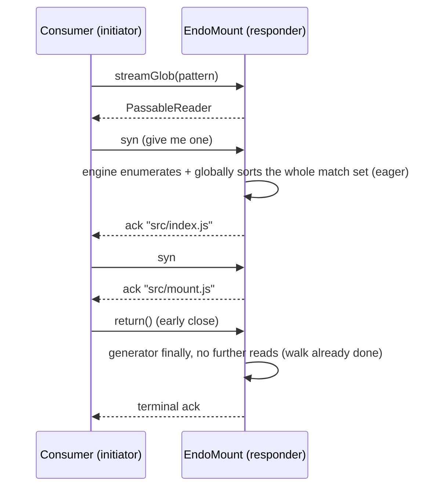

# Streaming Mount Search: `streamGlob` and `streamGrep`

| | |
|---|---|
| **Created** | 2026-07-09 |
| **Author** | Kris Kowal (prompted) |
| **Status** | Implemented ([PR #1085](https://github.com/endojs/endo-but-for-bots/pull/1085)) |
| **Source** | Review comment on [PR #127](https://github.com/endojs/endo-but-for-bots/pull/127#discussion_r3548861664) (mount extensions help text) |

## What is the Problem Being Solved?

The mount extensions branch (PR #127, `feat/mount-extensions`) gives
`EndoMount` two bulk search methods that return fully materialized arrays:

- `glob(pattern) -> Promise<string[]>`
- `grep(pattern, options?) -> Promise<Array<{ file, line, text }>>`

Eager materialization has three scaling problems.
First, protective caps (`GLOB_MAX_RESULTS`, 10,000 paths; `grep`
`options.maxResults`, default 1,000 matches) silently truncate large result
sets, and the protocol offers no way to ask for the rest.
Second, the caller sees nothing until the whole walk finishes, so
time-to-first-result on a large mount is the full traversal time.
Third, memory and marshalled-message size are proportional to the whole
result set on both sides of the CapTP boundary, and `grep` additionally
materializes its entire candidate file list (a full `glob` result) before
reading the first file.

The maintainer directed on the PR #127 help-text review: "Please post a plan
to design exo-stream variants of these methods, like `streamGlob` and
`streamGrep`."

This design adds streaming variants built on `@endo/exo-stream`, the
package this repository already uses for byte streams (`EndoMountFile.
streamBase64`, `write` blob ingestion, tar check-in) and which exists
precisely to bridge async iteration over CapTP with flow control and
pattern guards.

## Design

### Surface

Two new methods on `EndoMount`:

```
streamGlob(pattern, options?) -> PassableReader<string>
streamGrep(pattern, options?) -> PassableReader<{ file, line, text }>
```

- `streamGlob` options: `{ buffer?: number }`.
- `streamGrep` options: `{ glob?: string, buffer?: number }`.
  There is deliberately no `maxResults`: the consumer bounds the stream by
  returning early. What early close saves is per-method (see cancellation
  below): for `streamGrep` it elides the remaining files' *content* reads, but
  for `streamGlob` the engine's global UTF-16 sort forces the whole match set
  before the first element, so the walk is already complete and early close
  saves only marshalling, not traversal.

Both return a fresh `PassableReader` remotable (from
`@endo/exo-stream/reader-from-iterator.js`) synchronously, the same way
`entry` returns an `EndoMountEntry` and `readOnly` returns the view, so the
consumer can pipeline without an extra round trip:

```js
import { E } from '@endo/far';
import { iterateReader } from '@endo/exo-stream/iterate-reader.js';

for await (const { file, line, text } of iterateReader(
  E(mount).streamGrep('TODO', { glob: 'src/**/*.js' }),
)) {
  if (foundEnough()) break; // elides streamGrep's remaining content reads
                            // (the path enumeration is already eager)
}
```

Interface guards in `MountInterface` (`packages/daemon/src/interfaces.js`):

```js
// Search (streaming)
streamGlob: M.call(M.string())
  .optional(M.splitRecord({}, { buffer: M.number() }))
  .returns(M.remotable('PassableReader')),
streamGrep: M.call(M.string())
  .optional(M.splitRecord({}, { glob: M.string(), buffer: M.number() }))
  .returns(M.remotable('PassableReader')),
```

Each reader self-describes its element shape through the exo-stream
`readPattern()` facility, so consumers can rely on well-shaped elements or
the stream breaks with an error:

- `streamGlob`: `M.string()` (mount-relative path).
- `streamGrep`: `harden({ file: M.string(), line: M.number(), text: M.string() })`.

### Producer implementation

> **As implemented ([PR #1085](https://github.com/endojs/endo-but-for-bots/pull/1085)).**
> The mount stack landed independently of this design: by the time
> `streamGlob`/`streamGrep` were built, `glob()`/`grep()` had already been
> re-based onto the **shared `@endo/platform/fs/search` engine**
> (`provideSearch(filePowers)` -> `search.globPaths` / `search.grepFiles`), which
> yields *batches* of paths / match records from async generators. So there is no
> local `walkGlobMatches`/`grepMatches` to write — the streaming methods reuse the
> **same engine generators** the eager collectors already consume, which is what
> makes drift-freedom automatic. The sketch below of a bespoke walker refactor is
> retained as the original plan; the shipped shape is:

1. `streamGlob()` / `streamGrep()` call `provideSearch(filePowers)` and wrap the
   engine's batch generator (`search.globPaths` / `search.grepFiles`, driven at
   `batchSize: 1` so the walk granularity matches one-element-at-a-time demand) in
   an async generator that re-checks `assertLive()` before each yield.
2. `glob()` / `grep()` are unchanged: they collect the *same* engine generators up
   to `GLOB_MAX_RESULTS` / `maxResults`. The stream methods just omit the cap and
   hand the generator to `readerFromIterator` instead of an accumulator array.
3. `streamGrep`'s `options.glob` pipes `search.globPaths` straight into
   `search.grepFiles` as the path source (no intermediate array), so, unlike the
   eager `grep(pattern, glob(g))` composition, no full path list is materialized.
4. Ordering and eagerness follow the engine, not a per-directory walk: glob's order
   is a **global UTF-16 sort over full paths**, which forces the engine to collect
   and sort the whole match set before its first batch. `streamGlob` is therefore
   **not incremental in the directory walk** — its streaming win is bounded
   marshalled-message size and the absent 10,000-path cap, not time-to-first-result.
   `streamGrep` inherits the same eager *enumeration* but reads file *contents*
   incrementally, so early close elides unread files.

```js
// Shipped shape (packages/daemon/src/mount.js):
const streamGlob = (pattern, options = {}) => {
  assertLive();
  const { buffer = 0 } = options;
  const search = provideSearch(filePowers);
  const generate = async function* generate() {
    assertLive();
    for await (const batch of search.globPaths(currentDir, pattern, {
      deniedSegments, confinementRoot, batchSize: 1,
    })) {
      for (const relPath of batch) {
        assertLive();
        yield relPath;
      }
    }
  };
  return readerFromIterator(generate(), {
    buffer: clampStreamBuffer(buffer),
    readPattern: M.string(),
  });
};
```

The engine's generators are async: for `streamGrep` the *content* read advances
only as the stream is pulled, so no file is read ahead of consumer demand beyond
the requested pre-ack buffer. The directory *enumeration*, by contrast, runs to
completion before the first element (the global sort), so early close bounds file
reads, not the walk.



### Backpressure and cancellation

Both are delegated wholesale to the Exo Stream Protocol
(`packages/exo-stream/PROTOCOL.md`): data flows on the acknowledge chain,
flow control on the synchronize chain.

- **Backpressure.** With the default `buffer: 0` the stream is fully
  synchronized at the *element* granularity: the producer settles at most one
  element ahead of consumer demand. For `streamGrep` this bounds file *content*
  reads to demand; for `streamGlob` (and `streamGrep`'s enumeration) the global
  sort has already run the directory walk to completion, so backpressure governs
  only marshalling, not the walk. Consumers on high-latency links pass
  `buffer > 0` to let the producer pre-ack that many elements. The producer
  clamps the requested buffer (`clampStreamBuffer`, ceiling `STREAM_BUFFER_MAX =
  1,024`) so a remote caller cannot demand unbounded pre-materialization; the
  clamp replaces the eager variants' result caps as the daemon-side resource
  bound.
- **Cancellation.** A consumer that breaks out of `for await` (or calls
  `return(value)` on the iterator) sends the close on the final
  synchronize node; the reader pump calls the generator's `return()`, the
  generator's `finally` runs, and no further filesystem I/O happens. For
  `streamGrep` this genuinely elides the remaining files' content reads; for
  `streamGlob` the walk is already complete by the first element, so early close
  saves marshalling, not traversal. A consumer `throw` closes the same way
  through `iterateReader`.

### Revocation

`streamGlob` and `streamGrep` call `assertLive()` at invocation, and the
generators re-check `assertLive()` before each directory read and each
yield. A `MountControl.revoke()` mid-stream therefore causes the next pull
to reject on the acknowledge chain with the same "Mount has been revoked"
error the eager methods throw; `iterateReader` surfaces it as a thrown
error at the consumer's `for await`. A revoked-but-never-pulled stream
holds only a suspended generator closure (no open file handles between
pulls), so no separate teardown registration with the revocation context is
needed.

Revocation is **not** an atomic cutoff when `buffer > 0`. With a non-zero
pre-ack window the producer pump pulls (and settles) up to `buffer` elements
ahead of consumer demand, each past its own `assertLive()` at pull time. A
`revoke()` after those pulls have settled cannot un-deliver them: the consumer
still receives up to the clamped buffer's worth of already-acknowledged
elements, and only the first pull past the drained buffer rejects. The clamp
(`STREAM_BUFFER_MAX`) therefore bounds not only daemon-side memory but this
revocation-latency window.

Note **who chooses `buffer`.** `makeRevocableMount` deliberately splits the
`EndoMount` facet (the search/stream authority) from the `EndoMountControl`
facet (the `revoke()` authority) so the two can be handed to different trust
levels — the less-trusted party typically holds `EndoMount`, and `buffer` is an
argument to *its* `streamGlob`/`streamGrep` calls. So the party that `revoke()`
is used *against* is the one that selects `buffer`; the revoking party has no
per-grant lever to pin it to `0` (there is no `buffer` ceiling on `makeMount`
today). The correct framing is therefore: the **clamp**, not grantor discipline,
is what bounds the worst case — after `revoke()` an untrusted grantee that
requested `buffer: STREAM_BUFFER_MAX` still receives at most `STREAM_BUFFER_MAX`
further elements, never unbounded delivery. A grantee that itself wants a hard
cutoff keeps `buffer` at the default `0`, where the pump never pre-pulls and the
next pull after `revoke()` rejects with no further delivery. A future refinement
could add a per-grant `buffer` ceiling to `makeMount`/`makeRevocableMount` so a
grantor minting a mount for an untrusted holder can pin the window below the
global clamp. The test plan pins the worst case (revoke
immediately after a `buffer > 0` stream starts; assert the post-revoke delivery
is bounded by the clamped buffer).

### Confinement, deny patterns, and attenuations

Identical to the eager methods by construction, because the walker is
shared: `isDeniedSegment` and `isConfinedPath` apply to every entry, so
deny-listed names (`.ssh`, `.env`, and the rest) and paths escaping the
confinement root are never yielded. On a `subView` / `subDir` sub-mount the
generator walks under the sub-root's own confinement root.

The streaming methods are reads, so they are available on read-only mounts
(a mount made with `readOnly: true`). The structural `readOnly()`
`ReadableTree` view does **not** carry them, consistent with the existing
exclusion of `glob`, `grep`, and `stat` from that view: the view is the
minimal shared read contract from `@endo/platform/fs`, and callers that
need search keep a mount reference.

### Help text and types

`packages/daemon/src/help-text-data.js` gains two `EndoMount` entries:

- `streamGlob: 'streamGlob(pattern, options?) -> PassableReader<string>\n...'`
- `streamGrep: 'streamGrep(pattern, options?) -> PassableReader<{ file, line, text }>\n...'`

Each names the options, states that the consumer iterates with
`iterateReader` from `@endo/exo-stream`, and states that closing the
iterator early stops the walk. The eager `glob` and `grep` entries gain a
cross-reference sentence ("results are capped; for incremental or
unbounded result sets use streamGlob / streamGrep"). The mount typedefs
type the two methods with `PassableReader` imported from
`@endo/exo-stream`.

### Scope: other bulk methods

- `list(...path)`: one `readDirectory`, bounded by a single directory's
  width. Considered and rejected: `streamList`. Reason: redundant, since
  `streamGlob('*')` (one level) and `streamGlob('**/*')` (recursive) are
  the streaming enumerations.
- `snapshot()`: already scales, since it returns a content-addressed
  `SnapshotTree` whose per-file bytes stream over `streamBase64`; the
  check-in walk is a content-store concern settled in
  [daemon-mount-capabilities](daemon-mount-capabilities.md). Out of scope.
- `followNameChanges()`: declared but unimplemented pending a filesystem
  watcher (see [fs-interface-consolidation](fs-interface-consolidation.md)
  § C1). A change feed is an infinite stream and should ride the same
  `PassableReader` shape when the watcher design lands; named here so that
  design adopts the same protocol (tracking design to be filed with the
  watcher work).

## Dependencies

| Artifact | Relationship |
| --- | --- |
| [PR #127](https://github.com/endojs/endo-but-for-bots/pull/127) `feat/mount-extensions` | Defines `glob`/`grep` and `walkGlob`; the implementation stacks on this branch or lands after the mount stack merges to `llm` |
| `@endo/exo-stream` (`PROTOCOL.md`, `DESIGN.md`) | The stream remotable shape, reader pump, buffer option, pattern guards |
| [daemon-mount](daemon-mount.md), [daemon-mount-capabilities](daemon-mount-capabilities.md) | The mount surface being extended |
| [fs-interface-consolidation](fs-interface-consolidation.md) § C1 | `followNameChanges` placeholder that should reuse this stream shape |

## Phased Implementation

> **As implemented:** phase 1 was already done by the time this PR landed — the
> eager `glob()`/`grep()` were re-based onto the shared
> `@endo/platform/fs/search` engine, whose batch generators *are* the streaming
> substrate — so no walker refactor was needed here (see § Producer
> implementation). The shipped phases were the stream surface and its tests.

1. **Walker refactor.** *(Already landed.)* The shared
   `@endo/platform/fs/search` engine (`search.globPaths`/`search.grepFiles`,
   batch async generators) replaced the bespoke `walkGlob`; `glob()`/`grep()`
   are bounded collectors over it. Existing glob/grep tests pass unchanged.
2. **Stream surface.** `streamGlob` / `streamGrep` methods, `MountInterface`
   guards, help-text entries, typedefs.
3. **Tests** per the plan below.

One implementation PR. Its base follows the repository's base-branch inference:
it landed on `llm` after the mount stack merged.

## Design Decisions

1. **Return the `PassableReader` synchronously** (guard
   `M.remotable('PassableReader')`, not `M.promise()`), so
   `iterateReader(E(mount).streamGlob(p))` pipelines. Precedent: `entry`
   and `readOnly` return remotables directly.
2. **No `maxResults` on stream variants.** The consumer's pull-based flow
   control is the bound. For `streamGrep`, early `return()` stops the
   remaining content reads; for `streamGlob` the eager global-sort walk has
   already completed by the first element, so early close bounds message
   marshalling, not the walk. The caps remain on the eager variants, whose
   purpose (bounded single-message results) they fit.
3. **Clamp the `buffer` option** rather than trusting the caller, so the
   pre-ack window is the only daemon-side memory commitment.
4. **One shared engine** (`@endo/platform/fs/search`) for eager and streaming
   variants, preventing behavioral drift in confinement, deny patterns, and
   ordering.
5. **Per-step `assertLive()`** inside the generators, so revocation cuts
   in-flight streams at the next pull.
6. **Streaming search lives on `EndoMount` only**, not on the structural
   `ReadableTree` view, matching the existing `glob`/`grep`/`stat`
   exclusion.
7. **Ordering is the shared engine's global UTF-16 sort over full paths** —
   the same order eager `glob`/`grep` produce — so collecting a stream
   reproduces the eager result element-for-element. (It is *not* a per-directory
   depth-first sort; because the sort is global, the whole match set is
   enumerated before the first element.)

## Test Plan

> **As implemented:** the tests landed as a standalone
> `packages/daemon/test/mount-stream-search.test.js` built on the
> `buildMountFixture` helper from `packages/daemon/test/_mount-fixture.js`
> (plus a `countingPowers` wrapper for read-count assertions), rather than as
> additions to `mount.test.js`/`_mount-test-helpers.js`. The incrementality
> assertion tracks the shipped eager-walk / incremental-read split below.

Covered on a temporary directory tree with `makeMount`:

- **Parity**: collecting `streamGlob` equals `glob`; collecting
  `streamGrep` equals `grep`, on the same fixture tree, including order.
- **Incrementality (read asymmetry)**: with an instrumented `filePowers`
  counting `readDirectory` and `readFileText`, on a deep fixture the first
  `streamGrep` match arrives only after the *directory walk* has completed
  (`readDirectory` equals a full `streamGlob` pass — the walk is eager) while
  only the first file's *contents* have been read; closing after the first
  match leaves the deeper file unread.
- **Backpressure**: with `buffer: 0`, assert `streamGrep`'s file *content*
  reads do not run ahead of pulls (call counter sampled between pulls).
- **Cancellation**: break out of `for await` on both `streamGlob` and
  `streamGrep`; no unhandled rejection; no further reads after the break.
- **Revocation mid-stream**: revoke between pulls; the next pull rejects
  with "Mount has been revoked". A separate case pins the `buffer > 0`
  revocation-latency window (post-revoke delivery bounded by the clamped
  buffer).
- **Confinement and denial**: a `subView` stream stays scoped to its
  sub-root (streaming parity with the existing confinement tests).
- **Pattern guard**: `readPattern()` returns the documented shape; each
  yielded element matches it.
- **Options / caps**: `streamGrep` respects `options.glob`; the streams
  enumerate past `GLOB_MAX_RESULTS`/`GREP_MAX_RESULTS` (no cap); an oversized
  `buffer` is clamped by `clampStreamBuffer` (NaN/Infinity/negative/fractional
  edge cases included).

## Resolved Questions

- Streaming search remains an `EndoMount` capability. A later design may
  consider `ReadableTree` and `SnapshotTree`, but this design keeps those
  structural views minimal and does not add search to them.
- The producer clamps `buffer` at 1,024 elements. This is a bounded
  pre-ack window that accommodates high-latency consumers without allowing
  an unbounded daemon-side memory commitment. An implementation may lower
  the limit only with measurement and a corresponding design update.
