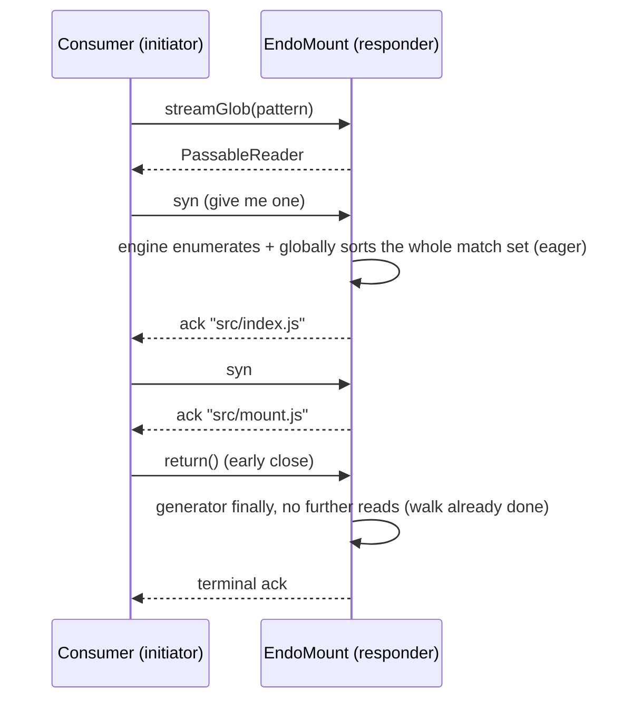

# Streaming Mount Search: `streamGlob` and `streamGrep`

| | |
|---|---|
| **Created** | 2026-07-09 |
| **Updated** | 2026-09-04 |
| **Author** | Kris Kowal (prompted) |
| **Status** | Implemented ([PR #1085](https://github.com/endojs/endo-but-for-bots/pull/1085)) |
| **Source** | Review comment on [PR #127](https://github.com/endojs/endo-but-for-bots/pull/127#discussion_r3548861664) (mount extensions help text) |

## What is the Problem Being Solved?

The mount extensions branch (PR #127, `feat/mount-extensions`) gives
`EndoMount` two bulk search methods that return fully materialized arrays:

- `glob(pattern) -> Promise<string[]>`
- `grep(pattern, options?) -> Promise<Array<{ file, line, text }>>`

Eager materialization has three scaling problems.
First, protective caps (`GLOB_MAX_RESULTS`, 10,000 paths; `grep`
`options.maxResults`, default 1,000 matches) silently truncate large result
sets, and the protocol offers no way to ask for the rest.
Second, the caller sees nothing until the whole walk finishes, so
time-to-first-result on a large mount is the full traversal time.
Third, memory and marshalled-message size are proportional to the whole
result set on both sides of the CapTP boundary, and `grep` additionally
materializes its entire candidate file list (a full `glob` result) before
reading the first file.

The maintainer directed on the PR #127 help-text review: "Please post a plan
to design exo-stream variants of these methods, like `streamGlob` and
`streamGrep`."

This design adds streaming variants built on `@endo/exo-stream`, the
package this repository already uses for byte streams (`EndoMountFile.
streamBase64`, `write` blob ingestion, tar check-in) and which exists
precisely to bridge async iteration over CapTP with flow control and
pattern guards.

## Design

### Surface

Two new methods on `EndoMount`:

```
streamGlob(pattern, options?) -> PassableReader<string>
streamGrep(pattern, options?) -> PassableReader<{ file, line, text }>
```

- `streamGlob` options: `{ buffer?: number }`.
- `streamGrep` options: `{ glob?: string, buffer?: number }`.
  There is deliberately no `maxResults`: the consumer bounds the stream by
  returning early. What early close saves is per-method (see cancellation
  below): for `streamGrep` — which enumerates in *walk order* (`sorted: false`),
  needing no global sort — it elides both the remaining files' *content* reads
  and the *unwalked* remainder of the tree, so early close bounds the directory
  walk itself. For `streamGlob` the engine's global UTF-16 sort (its normative
  contract) forces the whole match set before the first element, so the walk is
  already complete and early close saves only marshalling, not traversal.

Both return a fresh `PassableReader` remotable (from
`@endo/exo-stream/reader-from-iterator.js`) synchronously, the same way
`entry` returns an `EndoMountEntry` and `readOnly` returns the view, so the
consumer can pipeline without an extra round trip:

```js
import { E } from '@endo/far';
import { iterateReader } from '@endo/exo-stream/iterate-reader.js';

for await (const { file, line, text } of iterateReader(
  E(mount).streamGrep('TODO', { glob: 'src/**/*.js' }),
)) {
  if (foundEnough()) break; // elides streamGrep's remaining content reads
                            // and the unwalked rest of the tree (walk order)
}
```

Interface guards in `MountInterface` (`packages/daemon/src/interfaces.js`):

```js
// Search (streaming)
streamGlob: M.call(M.string())
  .optional(M.splitRecord({}, { buffer: M.number() }))
  .returns(M.remotable('PassableReader')),
streamGrep: M.call(M.string())
  .optional(M.splitRecord({}, { glob: M.string(), buffer: M.number() }))
  .returns(M.remotable('PassableReader')),
```

Each reader self-describes its element shape through the exo-stream
`readPattern()` facility, so consumers can rely on well-shaped elements or
the stream breaks with an error:

- `streamGlob`: `M.string({ stringLengthLimit: STREAM_STRING_LENGTH_LIMIT })`
  (mount-relative path).
- `streamGrep`: `harden({ file: M.string(), line: M.number(), text: M.string({
  stringLengthLimit: STREAM_STRING_LENGTH_LIMIT }) })`.

  Both use an explicit large `stringLengthLimit` (`STREAM_STRING_LENGTH_LIMIT =
  10,000,000`, the daemon's existing large-payload convention) rather than
  `M.string()`'s default `100,000`. The reader pump enforces `readPattern` with
  `mustMatch` on *every* element, and a throw there aborts the whole stream — so
  the default limit would make a single match line over 100,000 characters (a
  minified bundle, single-line JSON, a lock file, a base64/SVG blob) terminally
  break `streamGrep`, a parity break the eager `grep` (no such limit) does not
  share.

### Producer implementation

> **As implemented ([PR #1085](https://github.com/endojs/endo-but-for-bots/pull/1085)).**
> The mount stack landed independently of this design: by the time
> `streamGlob`/`streamGrep` were built, `glob()`/`grep()` had already been
> re-based onto the **shared `@endo/platform/fs/search` engine**
> (`provideSearch(filePowers)` -> `search.globPaths` / `search.grepFiles`), which
> yields *batches* of paths / match records from async generators. So there is no
> local `walkGlobMatches`/`grepMatches` to write — the streaming methods reuse the
> **same engine generators** the eager collectors already consume, which is what
> makes drift-freedom automatic. The sketch below of a bespoke walker refactor is
> retained as the original plan; the shipped shape is:

1. `streamGlob()` / `streamGrep()` call `provideSearch(filePowers)` and wrap the
   engine's batch generator (`search.globPaths` / `search.grepFiles`, driven at
   `batchSize: 1` so the yield granularity is one path per batch) in
   an async generator that re-checks `assertLive()`. The `globPaths` path source
   is wrapped in a liveness-checking generator (`assertLivePathBatches`) that
   asserts before surfacing each path batch, and `assertLive()` runs again before
   each yield. The two methods enumerate differently. `streamGlob` uses the
   default `sorted: true`: `globPaths` produces a *globally sorted* result and so
   runs the entire directory walk to completion before its first batch, so the
   liveness check cannot observe a `revoke()` *during* the enumeration — the walk
   runs to completion, and the check earns nothing beyond the per-yield
   `assertLive()`. `streamGrep` passes `sorted: false`: grep needs no global sort
   (its flattened order is path-then-line as files are read), so `globPaths`
   yields matched paths in *walk order* as it discovers them and a path flows
   into `grepFiles` the moment the walk finds it. There the check is load-bearing
   across the whole pipeline — it runs between walk steps and between content
   reads — so a mid-stream `revoke()` bounds post-revoke *walk steps and content
   reads* to a single path batch, including a sparse grep that yields no match
   for many files.
2. `glob()` / `grep()` are unchanged: they collect the *same* engine generators up
   to `GLOB_MAX_RESULTS` / `maxResults`. The stream methods just omit the cap and
   hand the generator to `readerFromIterator` instead of an accumulator array.
3. `streamGrep` always enumerates through `search.globPaths` (defaulting to `**`
   when `options.glob` is omitted, rather than letting `grepFiles` walk the tree
   itself) so the liveness check can be interposed on the path source, and pipes
   it straight into `search.grepFiles` as path batches. So, unlike the eager
   `grep(pattern, glob(g))` composition — which awaits the whole (capped) glob
   array and hands it to grep as one argument — no full path array round-trips as
   grep's argument and the 10,000-path cap is dropped. It passes `sorted: false`,
   so `globPaths` does **not** collect-and-sort the full path set before its
   first batch — a path is surfaced as the walk discovers it. (`globPaths` still
   retains the set of already-emitted paths for dedup, so its walk-phase memory
   is bounded by the match count, but there is no global-sort barrier before the
   first result.)
4. Ordering and eagerness follow the engine's per-method `sorted` flag.
   `streamGlob` uses glob's order — a **global UTF-16 sort over full paths** —
   which forces the engine to collect and sort the whole match set before its
   first batch, so it is **not incremental in the directory walk**; its streaming
   win is bounded marshalled-message size and the absent 10,000-path cap, not
   time-to-first-result. `streamGrep` uses `sorted: false` walk-order enumeration
   (grep needs no global sort), so it **is** incremental in the directory walk:
   the first match can arrive before the whole tree is walked, and it reads file
   *contents* incrementally too. Its flattened order is therefore *walk order*,
   not glob's sorted-path order — a multiset-equal superset of eager `grep`
   (same records, possibly past the eager cap), differing only in cross-file
   order. Early close elides both unread files and the unwalked remainder.

```js
// Shipped shape (packages/daemon/src/mount.js):
const streamGlob = (pattern, options = {}) => {
  assertLive();
  const { buffer = 0 } = options;
  const search = provideSearch(filePowers);
  const generate = async function* generate() {
    assertLive();
    // `assertLivePathBatches` asserts liveness before surfacing each path batch.
    // The global sort runs the whole walk to completion before the first batch,
    // so this bounds post-revoke *content reads* (streamGrep) to one batch; the
    // enumeration itself is uninterruptible.
    const paths = assertLivePathBatches(
      search.globPaths(currentDir, pattern, {
        deniedSegments, confinementRoot, batchSize: 1,
      }),
    );
    for await (const batch of paths) {
      for (const relativePath of batch) {
        assertLive();
        yield relativePath;
      }
    }
  };
  return readerFromIterator(generate(), {
    buffer: clampStreamBuffer(buffer),
    readPattern: M.string({ stringLengthLimit: STREAM_STRING_LENGTH_LIMIT }),
  });
};
```

The engine's generators are async. For `streamGrep` (`sorted: false`) both the
directory *walk* and the *content* read advance only as the stream is pulled, so
neither a directory nor a file is walked/read ahead of consumer demand beyond the
requested pre-ack buffer — early close bounds the walk and the reads alike. For
`streamGlob` the directory *enumeration* runs to completion before the first
element (the global sort, glob's normative contract), so its early close bounds
marshalling, not the walk. The `streamGlob` sequence below shows that eager-walk
shape; `streamGrep` would instead interleave `walk step -> match -> ack`.



### Backpressure and cancellation

Both are delegated wholesale to the Exo Stream Protocol
(`packages/exo-stream/PROTOCOL.md`): data flows on the acknowledge chain,
flow control on the synchronize chain.

- **Backpressure.** With the default `buffer: 0` the stream is fully
  synchronized at the *element* granularity: the producer settles at most one
  element ahead of consumer demand. For `streamGrep` this bounds both the
  directory *walk* and the file *content* reads to demand, since it enumerates in
  walk order (`sorted: false`); for `streamGlob` the global sort has already run
  the directory walk to completion, so backpressure governs only marshalling, not
  the walk. Consumers on high-latency links pass
  `buffer > 0` to let the producer pre-ack that many elements. The producer
  clamps the requested buffer (`clampStreamBuffer`, ceiling `STREAM_BUFFER_MAX =
  1,024`) so a remote caller cannot demand unbounded pre-materialization; the
  clamp replaces the eager variants' result caps as the daemon-side resource
  bound.
- **Cancellation.** A consumer that breaks out of `for await` (or calls
  `return(value)` on the iterator) sends the close on the final
  synchronize node; the reader pump calls the generator's `return()`, the
  generator's `finally` runs, and no further filesystem I/O happens. For
  `streamGrep` this genuinely elides both the remaining files' content reads and
  the unwalked remainder of the tree (walk-order enumeration); for `streamGlob`
  the walk is already complete by the first element, so early close saves
  marshalling, not traversal. A consumer `throw` closes the same way through
  `iterateReader`.

### Revocation

`streamGlob` and `streamGrep` call `assertLive()` at invocation, and the
generators re-check `assertLive()` per path batch (the `globPaths` source is
wrapped in `assertLivePathBatches`) and again before each yield. A
`EndoMountControl.revoke()` mid-stream therefore causes the next pull to reject on
the acknowledge chain with the same "Mount has been revoked" error the eager
methods throw; `iterateReader` surfaces it as a thrown error at the consumer's
`for await`. The per-path-batch check matters for the `buffer: 0` sparse-grep
case: without it, a grep that matches nothing for many files would reach the
per-yield `assertLive()` only at the (never-arriving) next match, so a revoke
would go unobserved and the daemon would keep walking and reading files to the
end of the tree; with it, post-revoke work halts within one path batch. For
`streamGrep` (`sorted: false`) enumeration is walk order, so this bounds both the
*directory walk* and the *content reads* — a `revoke()` landing during the walk
is observed within one path batch, not deferred to the end of the walk. For
`streamGlob` the directory *enumeration* has already run to completion before the
first path batch (the global sort; see § Backpressure and cancellation), so a
`revoke()` landing during its walk is not observed until the walk finishes. A
revoked-but-never-pulled stream holds only a suspended
generator closure (no open file handles between pulls), so no separate teardown
registration with the revocation context is needed.

Revocation is **not** an atomic cutoff when `buffer > 0`. With a non-zero
pre-ack window the producer pump pulls (and settles) up to `buffer` elements
ahead of consumer demand, each past its own `assertLive()` at pull time. A
`revoke()` after those pulls have settled cannot un-deliver them: the consumer
still receives up to the clamped buffer's worth of already-acknowledged
elements, and only the first pull past the drained buffer rejects. The clamp
(`STREAM_BUFFER_MAX`) bounds this revocation-latency window; because the search
readers are latched to a single active stream (see below), the bound is *per
reader*.

Note **who chooses `buffer`.** `makeRevocableMount` deliberately splits the
`EndoMount` facet (the search/stream authority) from the `EndoMountControl`
facet (the `revoke()` authority) so the two can be handed to different trust
levels — the less-trusted party typically holds `EndoMount`, and `buffer` is an
argument to *its* `streamGlob`/`streamGrep` calls. So the party that `revoke()`
is used *against* is the one that selects `buffer`; the revoking party has no
per-grant lever to pin it to `0` (there is no `buffer` ceiling on `makeMount`
today). The clamp bounds the per-reader worst case: after `revoke()` an
untrusted grantee that requested `buffer: STREAM_BUFFER_MAX` receives at most
`STREAM_BUFFER_MAX` further elements. This is a *per-reader* bound because the
search readers are minted once-only (`readerFromIterator({ once: true })`): a
second `stream()` on the same reader rejects rather than starting a second walk
over the shared iterator, which would otherwise both split the element set and
open a second pre-ack window (so `k` concurrent streams could scale the pre-ack
memory and post-revoke delivery as *k×buffer*). Latching to a single active
stream is exactly what a per-request producer wants — a per-search reader has no
meaningful second consumer. The one remaining lever the *revoker* still lacks is
a `buffer` ceiling on `makeMount`/`makeRevocableMount` itself (the grantee, not
the revoker, chooses `buffer` within `[0, STREAM_BUFFER_MAX]`); pinning that per
grant is the residual refinement recorded in § Follow-up. A grantee that itself
wants a hard cutoff keeps `buffer` at the default `0`, where the pump never
pre-pulls and the next pull after `revoke()` rejects with no further delivery.
The test plan pins both the per-reader worst case (revoke immediately after a
`buffer > 0` stream starts; assert the post-revoke delivery is bounded by the
clamped buffer) and the once-only latch (a second `stream()` rejects).

### Confinement, deny patterns, and attenuations

Identical to the eager methods by construction, because the walker is
shared: `isDeniedSegment` and `isConfinedPath` apply to every entry, so
deny-listed names (`.ssh`, `.env`, and the rest) and paths escaping the
confinement root are never yielded. On a `subView` / `subDir` sub-mount the
generator walks under the sub-root's own confinement root.

The streaming methods are reads, so they are available on read-only mounts
(a mount made with `readOnly: true`). The structural `readOnly()`
`ReadableTree` view does **not** carry them, consistent with the existing
exclusion of `glob`, `grep`, and `stat` from that view: the view is the
minimal shared read contract from `@endo/platform/fs`, and callers that
need search keep a mount reference.

### Help text and types

`packages/daemon/src/help-text-data.js` gains two `EndoMount` entries:

- `streamGlob: 'streamGlob(pattern, options?) -> PassableReader<string>\n...'`
- `streamGrep: 'streamGrep(pattern, options?) -> PassableReader<{ file, line, text }>\n...'`

Each names the options, states that the consumer iterates with
`iterateReader` from `@endo/exo-stream/iterate-reader.js`, and states that
closing a `streamGrep` iterator early leaves both the remaining files' contents
unread and the rest of the tree unwalked (grep enumerates in walk order, so early
close bounds the directory walk too), while for `streamGlob` the global-sort walk
is already complete at the first element so early close does not stop its walk.
The eager `glob` and `grep` entries gain a
cross-reference sentence ("results are capped; for incremental or
unbounded result sets use streamGlob / streamGrep"). The mount typedefs
type the two methods with `PassableReader` imported from
`@endo/exo-stream`.

### Scope: other bulk methods

- `list(...path)`: one `readDirectory`, bounded by a single directory's
  width. Considered and rejected: `streamList`. Reason: redundant, since
  `streamGlob('*')` (one level) and `streamGlob('**/*')` (recursive) are
  the streaming enumerations.
- `snapshot()`: already scales, since it returns a content-addressed
  `SnapshotTree` whose per-file bytes stream over `streamBase64`; the
  check-in walk is a content-store concern settled in
  [daemon-mount-capabilities](daemon-mount-capabilities.md). Out of scope.
- `followNameChanges()`: declared but unimplemented pending a filesystem
  watcher (see [fs-interface-consolidation](fs-interface-consolidation.md)
  § C1). A change feed is an infinite stream and should ride the same
  `PassableReader` shape when the watcher design lands; named here so that
  design adopts the same protocol (tracking design to be filed with the
  watcher work).

## Dependencies

| Artifact | Relationship |
| --- | --- |
| [PR #127](https://github.com/endojs/endo-but-for-bots/pull/127) `feat/mount-extensions` | Defines `glob`/`grep` and `walkGlob`; the implementation stacks on this branch or lands after the mount stack merges to `llm` |
| `@endo/exo-stream` (`PROTOCOL.md`, `DESIGN.md`) | The stream remotable shape, reader pump, buffer option, pattern guards |
| [daemon-mount](daemon-mount.md), [daemon-mount-capabilities](daemon-mount-capabilities.md) | The mount surface being extended |
| [fs-interface-consolidation](fs-interface-consolidation.md) § C1 | `followNameChanges` placeholder that should reuse this stream shape |

## Phased Implementation

> **As implemented:** phase 1 was already done by the time this PR landed — the
> eager `glob()`/`grep()` were re-based onto the shared
> `@endo/platform/fs/search` engine, whose batch generators *are* the streaming
> substrate — so no walker refactor was needed here (see § Producer
> implementation). The shipped phases were the stream surface and its tests.

1. **Walker refactor.** *(Already landed.)* The shared
   `@endo/platform/fs/search` engine (`search.globPaths`/`search.grepFiles`,
   batch async generators) replaced the bespoke `walkGlob`; `glob()`/`grep()`
   are bounded collectors over it. Existing glob/grep tests pass unchanged.
2. **Stream surface.** `streamGlob` / `streamGrep` methods, `MountInterface`
   guards, help-text entries, typedefs.
3. **Tests** per the plan below.

One implementation PR. Its base follows the repository's base-branch inference:
it landed on `llm` after the mount stack merged.

## Design Decisions

1. **Return the `PassableReader` synchronously** (guard
   `M.remotable('PassableReader')`, not `M.promise()`), so
   `iterateReader(E(mount).streamGlob(p))` pipelines. Precedent: `entry`
   and `readOnly` return remotables directly.
2. **No `maxResults` on stream variants.** The consumer's pull-based flow
   control is the bound. For `streamGrep` (`sorted: false`), early `return()`
   stops both the remaining content reads and the unwalked rest of the tree; for
   `streamGlob` the eager global-sort walk has already completed by the first
   element, so early close bounds message marshalling, not the walk. The caps
   remain on the eager variants, whose purpose (bounded single-message results)
   they fit.
3. **Clamp the `buffer` option** rather than trusting the caller, so the
   pre-ack window is bounded. (This bounds the marshalled pre-ack
   window, not the whole daemon-side high-water mark: for `streamGlob` the global
   sort materializes the full path set internally before the first batch; for
   `streamGrep` (`sorted: false`) there is no such pre-materialization, but the
   walk still retains the emitted-path dedup set. The readers are minted
   once-only, so the window is bounded per reader — a grantee cannot open a second
   concurrent stream to multiply it. See § Revocation.)
8. **Mint the search readers once-only** (`readerFromIterator({ once: true })`).
   A per-search reader has no meaningful second consumer, and a second `stream()`
   over the shared iterator would both split the element set and open a second
   pre-ack window; latching keeps the pre-ack and post-revoke windows bounded per
   reader, not per concurrent stream.
4. **One shared engine** (`@endo/platform/fs/search`) for eager and streaming
   variants, preventing behavioral drift in confinement, deny patterns, and
   ordering.
5. **Per-step `assertLive()`** inside the generators, so revocation cuts
   in-flight streams at the next pull.
6. **Streaming search lives on `EndoMount` only**, not on the structural
   `ReadableTree` view, matching the existing `glob`/`grep`/`stat`
   exclusion.
7. **Ordering is per-method.** `streamGlob` uses the shared engine's global
   UTF-16 sort over full paths — glob's normative contract — so collecting it
   reproduces eager `glob` element-for-element, and the whole match set is
   enumerated before the first element. `streamGrep` uses `sorted: false`
   walk-order enumeration, because grep needs no global sort (its flattened order
   is path-then-line as files are read); collecting it reproduces eager `grep` as
   a **multiset** (same records, one per matched line per file), not
   element-for-element, since the cross-file order is walk order rather than
   sorted-path order. This is the load-bearing decision behind streamGrep's
   directory-walk incrementality: dropping the sort is what lets a first match
   arrive before the whole tree is walked.

## Test Plan

> **As implemented:** the tests landed as a standalone
> `packages/daemon/test/mount-stream-search.test.js` built on the
> `buildMountFixture` helper from `packages/daemon/test/_mount-fixture.js`
> (plus a `countingPowers` wrapper for read-count assertions), rather than as
> additions to `mount.test.js`/`_mount-test-helpers.js`. The incrementality
> assertions track the shipped behavior below: `streamGlob`'s eager walk, and
> `streamGrep`'s fully incremental walk-order enumeration.

Covered on a temporary directory tree with `makeMount`:

- **Parity**: collecting `streamGlob` equals `glob` including order; collecting
  `streamGrep` equals `grep` as a **multiset** (walk order, so cross-file order
  differs — compared through a path-then-line canonical key), on the same fixture
  tree.
- **Incrementality (directory walk AND content reads)**: with an instrumented
  `filePowers` counting `readDirectory` and `readFileText`, the first
  `streamGrep` match arrives *before* the whole tree is walked — on a fixture of
  many sibling subtrees each carrying a match, `readDirectory` is far below a full
  `streamGlob` pass at the first match, and only the first file's *contents* have
  been read; closing after the first match leaves both the remaining files unread
  and the rest of the tree unwalked (`readDirectory` does not advance after
  close). A companion engine-level test asserts `globPaths({ sorted: false })`
  yields the same multiset as sorted mode and reaches its first path after
  descending only one subtree.
- **Backpressure**: with `buffer: 0`, assert `streamGrep`'s file *content*
  reads do not run ahead of pulls (call counter sampled between pulls).
- **Cancellation**: break out of `for await` on both `streamGlob` and
  `streamGrep`; no unhandled rejection; no further reads after the break.
- **Revocation mid-stream**: revoke between pulls; the next pull rejects
  with "Mount has been revoked". A separate case pins the `buffer > 0`
  revocation-latency window (post-revoke delivery bounded by the clamped
  buffer).
- **Confinement and denial**: a `subView` stream stays scoped to its
  sub-root (streaming parity with the existing confinement tests).
- **Pattern guard**: `readPattern()` returns the documented shape; each
  yielded element matches it.
- **Options / caps**: `streamGrep` respects `options.glob`; the streams
  enumerate past `GLOB_MAX_RESULTS`/`GREP_MAX_RESULTS` (no cap); an oversized
  `buffer` is clamped by `clampStreamBuffer` (NaN/Infinity/negative/fractional
  edge cases included).

## Resolved Questions

- Streaming search remains an `EndoMount` capability. A later design may
  consider `ReadableTree` and `SnapshotTree`, but this design keeps those
  structural views minimal and does not add search to them.
- The producer clamps `buffer` at 1,024 elements. This bounds the *pre-ack*
  window (the marshalled elements pre-pulled ahead of demand), not the whole
  daemon-side memory high-water mark: the engine's global sort materializes the
  full path set internally before the first batch regardless of `buffer`, so the
  clamp caps only the marshalled window, not that internal set. The specific
  value 1,024 is an **unmeasured provisional ceiling** — large enough not to
  constrain a high-latency consumer in practice, small enough that its worst-case
  pre-materialization is a bounded element count — not a benchmarked optimum.
  Revisit it under measurement (`packages/daemon/test/bench-daemon.js` /
  `packages/benchmark`, reported per `packages/chacha12/BENCH.md`) if the
  round-trip or memory cost ever matters; there is no asymmetric "lower only with
  measurement" gate, since no measurement backs the current value either.

## Follow-up

- **Per-grant `buffer` ceiling.** The search readers are now minted once-only, so
  the post-revoke delivery window is bounded per reader (§ Revocation). The one
  lever the *revoker* still lacks is a `buffer` ceiling on
  `makeMount`/`makeRevocableMount`: the grantee chooses `buffer` within `[0,
  STREAM_BUFFER_MAX]`, and the revoker cannot pin a grant to `0` short of handing
  a face whose `buffer` is capped lower. Adding a per-grant ceiling would let the
  revoking party bound the post-revoke delivery window it is exposed to, not only
  the grantee. Deferred: the once-only latch already removes the *k×buffer*
  multiplier, so this is a refinement of the residual single-stream window, not a
  correctness gap.
- **Interruptible `streamGlob` enumeration.** *(Resolved for `streamGrep`.)*
  `streamGrep` now passes `sorted: false`, so its enumeration is walk order and a
  `revoke()` (or early close) during the walk is observed within one path batch —
  the interruptible-enumeration follow-up is closed for grep. It remains open for
  `streamGlob`: with the default `sorted: true`, `globPaths` runs the whole
  directory walk to completion before its first batch (the global sort is glob's
  normative contract), so a `revoke()` during its enumeration is not observed
  until the walk finishes. Making `streamGlob`'s enumeration observe revocation
  would require surfacing partial, pre-sort batches (or a cancellation token
  threaded into `walk`) without breaking glob's sorted-output contract — which
  the shared engine does not expose today.
