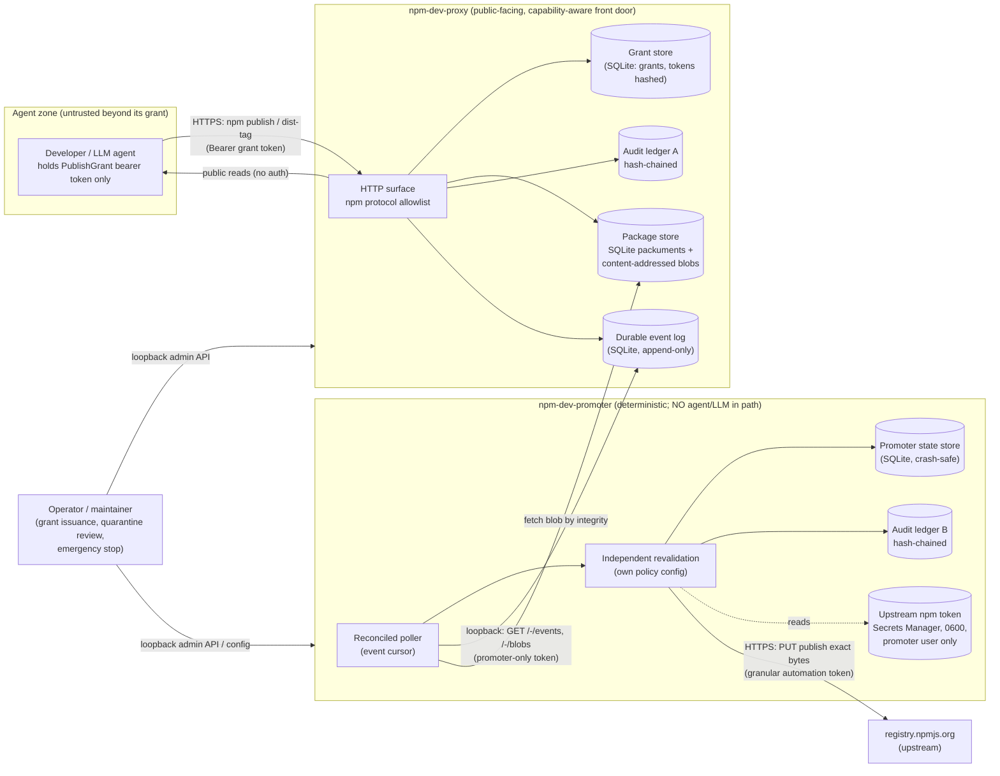
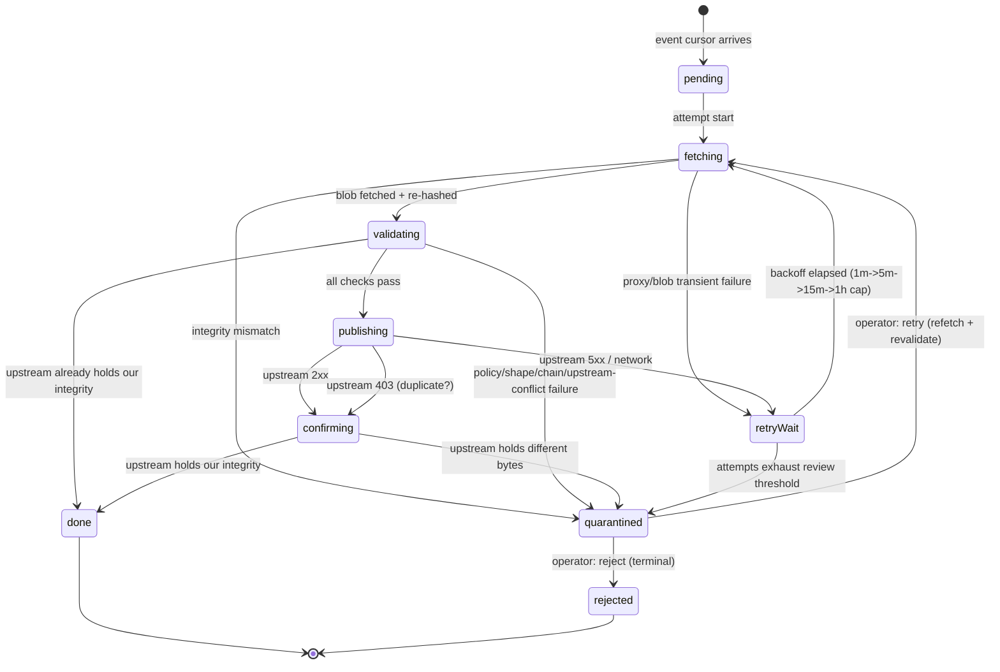

# Capability-Attenuated npm Development Publishing

| | |
|---|---|
| **Created** | 2026-07-30 |
| **Updated** | 2026-08-29 |
| **Author** | Kriscendo Bot (prompted) |
| **Status** | Proposed |

## Summary

AI agents that develop packages need to publish and consume *development
releases* of those packages without ever holding a real npm credential.
This design defines a two-service system:

- a **capability-attenuated publishing proxy** (working name
  `npm-dev-proxy`, demo deployment target `https://npm.minion.town`) that
  speaks enough of the npm registry HTTP protocol for the stock npm CLI,
  and accepts publications only from holders of an attenuated
  `PublishGrant` capability — attenuated to an explicit package allowlist
  and to development releases only; and
- a **deterministic promotion service** (`npm-dev-promoter`) that is the
  sole holder of the upstream npm automation token, has **no agent or LLM
  in its trusted path**, and re-publishes eligible artifacts
  byte-for-byte to the upstream npm registry after independently
  revalidating every fact the proxy already checked.

A *development release* is defined by two co-required conditions: the
version carries a semver **prerelease** component, and the publication
assigns exactly one **dist-tag whose name begins with the literal prefix
`dev-`**. The proxy's accepted mutation vocabulary makes `latest`, any
non-`dev-` tag, unpublish, owner changes, arbitrary metadata mutation,
and out-of-allowlist packages impossible at the proxy boundary — not
merely discouraged.

This document is a design only. The `npm.minion.town` subdomain is a
design target; nothing here authorizes provisioning infrastructure,
altering DNS, creating npm credentials, or publishing packages.

## What is the Problem Being Solved?

The garden's agents (gardeners building Endo packages) increasingly need
the npm *write* path: publish a development release of a package so that
another worktree, another agent, or a demo deployment can install it by
name and version. The existing registry work covers only the read path —
[endor-npm-registry-proxy](endor-npm-registry-proxy.md) fetches and
verifies tarballs into a CAS, and
[registry-capability](registry-capability.md) shapes the daemon's
`EndoRegistry` read capability — and
[registry-capability](registry-capability.md) § *Anti-design steers*
explicitly defers the credentials lane "until the public-only constraint
becomes binding."

Handing an agent an upstream npm token is unacceptable: a single token
leak (or a prompt-injected agent) could publish `latest` releases,
overwrite or unpublish versions, add owners, or publish arbitrary
packages under scopes the maintainer controls. npm's granular access
tokens can be scoped to packages, but they cannot express "development
releases only": any npm token that can publish a package can tag it
`latest`. The missing piece is an **attenuation boundary that npm itself
does not provide**, placed where the agent's only credential terminates.

The problem decomposes into two halves with different trust properties:

1. **Attenuation** — give the agent a capability whose maximum authority
   is "publish development releases of these specific packages," such
   that no request the agent can make — however crafted — exceeds it.
2. **Promotion** — move an accepted development release to the real npm
   registry with a narrowly scoped upstream token, through a path that
   re-derives every security decision deterministically and leaves a
   tamper-evident trail, so the agent-facing proxy's compromise or
   misbehavior cannot by itself cause a bad upstream publication.

## Goals

1. The developer/publisher (human or agent) receives **no upstream npm
   credential** — only a capability authorizing publication to the
   controlled proxy, attenuated to an explicit package allowlist and to
   development releases.
2. An exact, enumerable **mutation vocabulary** at the proxy boundary
   (§ *Accepted mutation vocabulary*): everything outside it is refused
   by construction, including `latest` and production tags, unpublish,
   owner/collaborator changes, arbitrary metadata mutation, and
   out-of-scope packages.
3. **Package/version immutability**: a `(name, version)` pair, once
   accepted, can never be overwritten or removed through the system.
4. The promoted artifact is **never rebuilt or modified** between
   registries: identical tarball bytes, identical integrity, identical
   version manifest content.
5. The promotion service is **deterministic and crash-safe**: durable
   event log, at-least-once delivery, idempotent handling of duplicate
   upstream publishes, partial-failure recovery, quarantine with manual
   review, token rotation, and an emergency stop.
6. A **tamper-evident mapping** from every proxy event to its upstream
   result (or terminal non-result).
7. npm CLI compatibility for the accepted vocabulary (`npm publish`,
   `npm dist-tag`, `npm install` of dev releases, `npm whoami`) without
   patching the CLI.
8. Resistance, by construction, to confused-deputy, tag-race,
   substitution, rollback, and dependency-confusion attacks
   (§ *Threat model*).
9. A deployable non-production demonstration shape at
   `npm.minion.town`, consistent with the minion.town operational
   conventions, at near-zero marginal cost.

## Non-Goals

- **Read-side credentials.** The proxy's reads are public, matching
  [registry-capability](registry-capability.md)'s standing public-only
  constraint for `@registry`. Private upstream packages remain out of
  scope.
- **Production releases.** Nothing in this system can ever move
  `latest` or publish a non-prerelease version upstream. A production
  release path is a separate, human-driven ceremony outside this design.
- **General-purpose registry hosting** (mirroring, upstream read-through
  caching, web UI, many human users). The proxy serves only what was
  published through it. Re-evaluate if the demo outgrows this
  (§ *Build vs adapt: the Verdaccio comparison*).
- **Endo-daemon integration in the first cut.** The capability is
  realized as an HTTP bearer token for the stock npm CLI; the
  Endo-native exo realization (an agent holding a `PublishGrant` object
  with the token never leaving the daemon) is a roadmap note
  (§ *Endo integration roadmap*).
- **npm provenance / Sigstore signing** for the demo (see
  § *Immutability, integrity, signatures, and subject binding* and
  § *Open questions*).

## Where This Sits

This is the **write-path sibling** of the existing registry stack. It
changes nothing in the read path and composes with it at one seam: the
proxy is just an npm registry URL.

| Design | Relationship |
|--------|--------------|
| [endor-npm-registry-proxy](endor-npm-registry-proxy.md) | The Rust read path (fetch -> integrity-check -> CAS -> registry table -> MVS). Unchanged. Its `--registry <url>` / `.npmrc` seam can point at `https://npm.minion.town` to resolve dev releases through the same CAS and registry-table machinery, with integrity verification exactly as for npmjs.com. |
| [registry-capability](registry-capability.md) | The `EndoRegistry` capability shape (`resolve`/`fetch`/`lookup`/`list`) is **read-only by design** and stays so. This design adds no methods to it. The deferred "credentials lane" its anti-design steers name is realized here for the write half only: `PublishGrant` is a *separate* capability family, minted by a `PublishGrantIssuer`, never merged into `@registry`. |
| [gateway-bearer-token-auth](gateway-bearer-token-auth.md) | Precedent for 256-bit bearer tokens, per-IP accruing-penalty rate limiting on failed auth, and explicit opt-in exposure. The proxy reuses that failure-penalty shape for its token surface. |
| [daemon-capability-bank](daemon-capability-bank.md) | The eventual catalog home for `PublishGrant` when the Endo-native realization lands (§ *Endo integration roadmap*). |

## Semantics of a development release

**"Dev- tags" means npm dist-tags whose names begin with the literal
prefix `dev-`.** A *development release* at the proxy boundary is a
publication satisfying **both** of the following, enforced independently:

1. **Prerelease version.** The version string is valid semver with a
   non-empty prerelease component (semver 2.0.0 §9): dot-separated
   identifiers after `-`, each identifier alphanumeric-with-hyphens,
   numeric identifiers without leading zeros. Examples: `1.4.0-dev.3`,
   `0.2.0-alpha.1`, `2.0.0-rc.1`. Build metadata (`+sha.abc`) is
   permitted and, per semver §10, ignored for precedence.
2. **Exactly one `dev-` dist-tag.** The publication assigns exactly one
   dist-tag, and its name matches
   `^dev-[a-z0-9](?:[a-z0-9-]{0,61}[a-z0-9])?$`.
   Tag names colliding with a valid semver range (which npm itself
   forbids) cannot match this pattern, so the proxy rule is strictly
   stronger than npm's own tag rule.

Both conditions are load-bearing, for different failure modes:

- The **prerelease** condition bounds the blast radius of any downstream
  tag accident. [SemVer 2.0.0 §11](https://semver.org/#spec-item-11)
  defines prerelease precedence. Separately,
  [node-semver's prerelease range semantics](https://github.com/npm/node-semver#prerelease-tags)
  exclude a prerelease version from ranges that do not themselves carry
  a prerelease comparator on the same `[major, minor, patch]` tuple, so
  `^1.0.0` / `~1.4.2` / `*` ranges in dependent projects cannot resolve
  to a development release even if it were somehow tagged `latest`.
- The **`dev-` tag** condition is what makes development releases
  *installable by intent* (`npm install pkg@dev-main`) while keeping
  `latest` — the tag `npm install pkg` resolves — structurally
  unreachable through the system.

Direct tag mutation (`npm dist-tag add`) follows the same two conditions:
a `dev-` tag may only be attached to a version that has a prerelease
component, and only to a version already published through the proxy.
Additionally, `dev-` tags are **monotonic**: the proxy persists a
per-package, per-tag high-water mark. A tag that has never existed may be
created pointing at any eligible version; every later target must have
greater semver precedence than that high-water mark. Moving a tag raises
the mark, and removing a tag does not erase it. This closes tag rollback
at the proxy (§ *Threat model*). Tag *removal* of a `dev-` tag is
permitted and audited; removal of `latest` is impossible because `latest`
can never exist on a proxy package.

Version uniqueness provides the third immutability leg: a `(name,
version)` pair may be published exactly once (§ *Immutability, integrity,
signatures, and subject binding*).

## Accepted mutation vocabulary

The proxy is an **allowlist of routes**, not a denylist of dangerous
ones. Every request not listed here receives `405` (known but forbidden
npm surface) or `404` (everything else). No request parameter, header,
or body field can widen a grant's authority.

| Route | Decision |
|-------|----------|
| `PUT /{name}` (publish) | **Conditionally accepted** — all checks in § *Publish validation pipeline* must pass |
| `GET /{name}` (packument) | Public; serves the locally stored document |
| `GET /{name}/{version}` (version manifest) | Public |
| `GET /{name}/-/{file}.tgz` (tarball) | Public; served from the blob store by integrity |
| `PUT /-/package/{name}/dist-tags/{tag}` (`npm dist-tag add`) | **Conditionally accepted** — tag matches `dev-*`, target version exists locally and is prerelease, monotonic move, grant covers `{name}` |
| `DELETE /-/package/{name}/dist-tags/{tag}` (`npm dist-tag rm`) | **Conditionally accepted** — tag matches `dev-*`, grant covers `{name}`; audited |
| `GET /-/package/{name}/dist-tags[/{tag}]` | Public read |
| `GET /-/whoami` | Returns the authenticated grant's `subject` (UX for `npm whoami`) |
| `GET /-/ping` | Unauthenticated liveness |
| `GET /-/blobs/sha512/{integrity}` | Content-addressed blob fetch; **promoter-only** bearer, loopback-only (§ *Promotion service*) |
| `GET /-/events?after={seq}` | Durable event-log feed; **promoter-only** bearer, loopback-only |
| `PUT /{name}` attempting anything but *add exactly one version* (unpublish-by-omission, `npm deprecate` metadata edits, `_rev` games) | Rejected by the publish validation pipeline (§ *Publish validation pipeline*, rules P3/P6) |
| `DELETE /{name}/-rev/{rev}` (whole-package unpublish), `PUT /{name}/-rev/{rev}` (single-version unpublish), `DELETE /{name}/-/{file}.tgz/-rev/{rev}` (tarball unpublish) | `405` |
| `GET /{name}?write=true` (unpublish/deprecate pre-flight read) | Served as an ordinary packument read; the mutation that would follow is refused |
| `/-/package/{name}/collaborators*`, `/-/npm/v1/tokens*`, `/-/v1/login*`, `/-/user/*` (owner, token, login, legacy adduser surface) | `404` |
| Starring, hooks, org, profile, search, audit, and every other registry or npm-external route | `404` |

Two consequences worth stating plainly:

- **`npm unpublish` and `npm deprecate` are impossible**: every wire
  form — whole-package `DELETE /{name}/-rev/{rev}`, single-version
  `PUT /{name}/-rev/{rev}`, tarball `-rev` `DELETE`, and deprecate's
  full-packument `PUT /{name}` — is either an unlisted route (`405`)
  or a publish `PUT` that fails rules P3/P6, rejected without
  dedicated code.
- **`latest` can never come into existence**: not via publish (rule P4),
  not via dist-tag add (tag pattern), not via first-publish defaulting
  (the proxy applies no default tag; a publish that assigns no tag is
  rejected by rule P4).

### Publish validation pipeline

A `PUT /{name}` body (npm's publish document: `_id`, `name`, `versions`,
`dist-tags`, `_attachments`) is accepted only if **all** of these hold,
evaluated in order with a distinct structured error code per rule:

- **P1 — Authenticated.** Bearer token maps to a live grant (not
  revoked, not expired, `notBefore` reached).
- **P2 — In scope.** `{name}` matches the grant's package allowlist
  (exact names or a single trailing-scope pattern such as
  `@minion-town/*`, resolved at issuance into the grant record).
- **P3 — One new version.** The body's `versions` contains exactly one
  entry, and `(name, version)` does not already exist (or exists with
  byte-identical content — see idempotent republish, § *Replay and
  idempotency*).
- **P4 — Development release.** The version satisfies the prerelease
  condition, and the body's `dist-tags` is exactly one tag matching the
  `dev-*` pattern (§ *Semantics of a development release*).
- **P5 — Tarball integrity.** Exactly one attachment; its decoded bytes
  hash (SHA-512, SRI form) to the manifest's `dist.integrity` **as
  recomputed by the proxy from the received bytes** — the client's
  claimed integrity is checked against the computed value, never
  trusted. The legacy `dist.shasum` (SHA-1) is recomputed alongside and
  stored recomputed.
- **P6 — Manifest/tarball subject agreement.** The `package.json` inside
  the tarball has `name` and `version` identical to the publish
  document's. This closes, for everything the proxy accepts, npm's own
  long-standing *manifest-confusion* hole — the npm registry does not
  verify that the manifest in the publish body matches the tarball's
  `package.json` (documented publicly in 2023 by former npm CLI staff
  engineering manager Darcy Clarke, with live PoC packages). Agreement
  is required on `name` + `version` only, **not** on the full manifest:
  the npm CLI legitimately patches the manifest in flight (e.g.
  injecting a `node-gyp rebuild` install script when `binding.gyp`
  exists), so full-manifest equality would reject ordinary publishes.
  The body must not carry fields that would mutate any other version or
  package-level metadata (`time`, `users`, `readme` history, other
  `versions` entries); unknown top-level fields are dropped, not stored.
  The proxy reconstructs what it stores from an allowlist of manifest
  fields rather than persisting the submitted document verbatim.
- **P7 — Monotonic tag.** The `dev-*` tag's target has greater semver
  precedence than its persisted per-package, per-tag high-water mark (if
  any); the move and high-water update are atomic with the packument
  update, and tag removal does not erase the mark.
- **P8 — Limits.** Tarball <= grant `maxTarballBytes` (and <= the global
  hard cap); grant's per-day publish count and per-package version count
  not exceeded; global body-size cap not exceeded.

On acceptance the proxy, **in one SQLite transaction**: stores the
tarball blob content-addressed (write-if-absent), inserts the
`(name, version)` row (unique primary key), applies the tag move,
extends the packument, and appends a `publish-accepted` record to the
audit ledger and a `publish` event to the durable event log with its
content-derived event id (§ *Replay and idempotency*). If any part
fails, nothing is visible: acceptance and audit are atomic, so there is
no state in which a release exists but was not logged.

## Architecture and trust boundaries



Trust boundaries, and what each side may assume:

- **Agent -> proxy.** The agent is assumed potentially compromised or
  prompt-injected at all times. The proxy trusts nothing from the
  request except the token's existence as a lookup key; all authority
  decisions come from the server-side grant record. TLS is the only
  channel protection; the token is a 256-bit random bearer.
- **Proxy -> promoter.** The promoter treats the proxy — including its
  event log — as an *untrusted hint source*. The event log says "bytes
  with this integrity, name, version, tag, grant chain, and subject were
  accepted at this time"; the promoter independently re-fetches the blob
  by integrity, re-hashes it, and re-evaluates every policy rule from
  its **own** configuration before acting (§ *Independent
  revalidation*). This bounds, but does not eliminate, the authority of
  a compromised proxy: it can impersonate an observed allowlisted
  subject and induce a shape-valid development publish for a package
  that subject is allowed to publish. It cannot cross the promoter's
  package allowlist or the prerelease / `dev-*` policy. Preventing that
  residual subject impersonation requires end-to-end request signatures
  that the promoter verifies (§ *Open questions*).
- **Promoter -> upstream.** The promoter is the sole holder of the
  upstream token: a granular, publish-only, automation-type npm token
  scoped to the demonstration organization/scope (§ *Upstream token*).
  The token file never exists in the proxy's filesystem, process, or
  user context; the demo places proxy and promoter in separate systemd
  units under separate users on the same host, with separate-container
  or separate-host isolation as the pre-production option.
- **Operator -> both.** Grant issuance, revocation, quarantine review,
  and the emergency stop are loopback-only admin surfaces (UNIX socket
  or localhost port), never exposed through Caddy.

## Threat model

Actors: the **grant-holding developer/agent** (honest-but-fallible or
prompt-injected; holds only a proxy grant), an **external attacker** (no
grant), a **compromised proxy** (full control of the agent-facing
service, but not the promoter), a **compromised promoter** (worst case:
holds the upstream token; mitigations are the token's narrow scope and
the audit trail), and the **upstream registry** (trusted to enforce its
own version immutability and to not lie about integrity; its compromise
is out of scope).

| Attack | Construction that defeats it |
|--------|------------------------------|
| **Confused deputy** | The proxy never takes authority from request parameters: package, tag, and version decisions derive from the server-side grant record and the recomputed integrity, not from client claims. The promoter never takes authority from the proxy's annotations: it revalidates package allowlist, prerelease rule, `dev-*` tag rule, integrity, grant-chain validity-at-accept-time, and policy from its own config. There is no "admin" field a request can set. |
| **Tag race** | All mutations of one package serialize on a `BEGIN IMMEDIATE` SQLite transaction scoped to the packument row; tag moves are compare-and-swap against the stored tag target evaluated inside the same transaction (monotonic rule included). Two racing publishes of one version: the unique `(name, version)` primary key admits exactly one; the loser gets a deterministic `409`. |
| **Substitution** | Tarball bytes are hashed by the proxy at acceptance (P5) and stored content-addressed; the promoter fetches the blob *by integrity* and re-hashes before publishing; upstream, npm forbids overwriting an existing version — so a duplicate-publish response is checked: same integrity means "already done" (idempotent success), different integrity is an alarm-level quarantine (§ *Crash-safe state machine*). |
| **Rollback** | No unpublish verbs exist at the proxy; versions are immutable; `dev-*` tags move forward only (monotonic rule); `latest` never exists. There is no request that can make an older state visible in place of a newer one. |
| **Dependency confusion** | The allowlist admits only names/scopes the maintainer controls (fixture scope § *Fixture packages and namespaces*); the proxy serves only locally published packages and has **no upstream read-through**, so an upstream squatter's bytes can never be served for an allowlisted name; prerelease versions are invisible to default ranges; `latest` is never set, upstream or locally. Clients compose registries by scope routing (`@minion-town:registry=...`), so non-allowlisted dependencies still resolve from npmjs.com directly, never through a confusion-prone merge. |
| **Grant token theft / leak** | A stolen grant token reaches only the proxy and only within its attenuation (dev releases of allowlisted packages): its maximum abuse product is an unwanted `x.y.z-pre.n` under a `dev-*` tag — invisible to default installs, attributable to the recorded subject, revocable in one admin call. Tokens are stored hashed (SHA-256) server-side; logs carry only the token id prefix. |
| **Prompt-injected agent** | Treated as the standing case, not an anomaly: the vocabulary allowlist bounds the worst publish to the dev-release shape; rate and size limits bound volume; every acceptance is attributed in the ledger. |
| **Replay** | Publish requests map to content-derived event ids (§ *Replay and idempotency*), so a replayed request is an idempotent re-accept or a deterministic `409`, never a duplicate event. |
| **Proxy compromise** | Can refuse service, deface local packuments (detected by ledger re-derivation on restore), and forge events. Independent revalidation rejects packages outside the promoter-owned allowlist, malformed release shapes, and integrity inconsistencies, but `subject` is proxy-authored attribution rather than an end-to-end authentication claim. A compromised proxy can therefore impersonate an observed allowlisted subject and induce a shape-valid development publish for that subject's allowed package. End-to-end request signatures are required to close this residual risk (§ *Open questions*). |
| **Promoter compromise** | The blast radius is the upstream token's scope: a granular access token (the only kind npm issues since the 2025 classic-token retirement) restricted to the fixture organization/scope, with no unpublish, owner, or account rights, optionally pinned to the box's egress IP by the granular-token CIDR restriction, and capped by npm at a 90-day lifetime. Rotation and deactivation procedures bound the window (§ *Token rotation*); the hash-chained ledger attributes every upstream call it made. |

## Capability model

### The `PublishGrant` family

The capability exists in two realizations of one shape:

1. **Canonical form — a server-side grant record** (SQLite, proxy).
   This is the object of record: every authority decision reads it.
2. **HTTP realization — a bearer token** for the stock npm CLI
   (`//npm.minion.town/:_authToken=...` in `.npmrc`). A token is a
   256-bit random secret with an id, minted *from* a grant; the server
   stores only its SHA-256 hash. Multiple tokens may realize one grant
   (per-working-copy issuance); revoking the grant kills its tokens.

```ts
type PublishGrantSpec = {
  // Who the grant is issued to: an agent persona or human identity,
  // recorded on every accepted publish (subject binding).
  subject: string;                       // e.g. "gardener:build-endo-hex"
  // Explicit package allowlist: exact names and/or trailing-scope
  // patterns ("@minion-town/*"). Intersected on attenuation.
  packages: string[];
  expiresAt: string;                     // ISO 8601; REQUIRED; demo max 30 days
  notBefore?: string;
  maxTarballBytes?: number;              // default 10 MiB; hard cap 50 MiB
  maxPublishesPerDay?: number;           // default 50
  maxVersionsPerPackage?: number;        // default 200
  // Fixed by the system, not settable: tagPattern "^dev-", require
  // prerelease, monotonic tags. Non-negotiable policy, never per-grant.
};

type PublishGrantInfo = PublishGrantSpec & {
  grantId: string;          // random id
  parentGrantId?: string;   // delegation chain
  chainHash: string;        // sha256 over parent chainHash + spec
  revokedAt?: string;
  createdAt: string;
};

interface PublishGrantIssuer {
  // Mint a root grant. Operator-only (loopback admin surface).
  issue(spec: PublishGrantSpec): Promise<PublishGrant>;
  list(filter?: { subject?: string }): Promise<PublishGrantInfo[]>;
  inspect(grantId: string): Promise<PublishGrantInfo>;
}

interface PublishGrant {
  info(): PublishGrantInfo;
  // Delegation: derive a narrower grant. Every field of the child spec
  // is intersected with (packages) or bounded by (expiry, limits) the
  // parent's effective value. An omitted field inherits that effective
  // value; it never resets to a broader system default. Widening is a
  // typed error, enforced server-side.
  attenuate(spec: Partial<PublishGrantSpec>): Promise<PublishGrant>;
  // Mint an HTTP bearer token realizing (a copy of) this grant.
  issueHttpToken(note?: string): Promise<{ tokenId: string; secret: string }>;
  // Imperative revocation is correct here: revocation is exercised
  // against *another* party's authority, not the holder's own
  // subscription lifetime. Cascades to derived grants and tokens.
  revoke(reason?: string): Promise<void>;
}
```

Properties that make this a capability system rather than an ACL:

- **Attenuation-only delegation.** A holder can spawn a narrower grant
  (fewer packages, earlier expiry, tighter limits) without operator
  involvement. Every omitted child field inherits the parent's
  effective value, including defaults already resolved at the parent;
  omission can never widen authority. This is the standard
  macaroon-style delegation story, realized over server-side records so
  revocation stays synchronous and total.
  The `chainHash` makes each accepted publish attributable to the exact
  delegation chain that authorized it, and lets the promoter verify the
  chain's validity at accept time.
- **Unforgeability.** Tokens are random secrets looked up by hash; the
  grant record — never the request — carries the authority.
- **Non-negotiable policy.** The `dev-*` tag rule, the prerelease rule,
  version immutability, and tag monotonicity are properties of the
  proxy's validation pipeline, not grant fields: no grant, not even a
  root grant, can publish outside the dev-release shape.

### Revocation and expiry

- Every grant has a mandatory `expiresAt` (demo policy: <= 30 days;
  renewal is a fresh issuance, not an extension).
- `revoke()` marks the grant and, in the same transaction, every grant
  and token derived from it. Token checks happen on every request
  against the live record, so revocation is effective immediately.
- The promoter checks grant-chain validity **at the event's accept
  time**, not at promotion time: a grant revoked *after* a legitimate
  publish does not retroactively block its promotion, but a grant shown
  expired/revoked *before* acceptance (a forged event) fails validation.

### Subject binding

Every accepted publish is bound to the grant's `subject` (and the full
`chainHash`) in the audit ledger and the event log; `GET /-/whoami`
returns the subject so the CLI reflects it. The subject is asserted by
the operator at issuance — it is an attribution anchor, not an
authentication claim. Stronger cryptographic subject binding (per-agent
keypairs signing each request) is a possible hardening and is deferred
(§ *Open questions*).

## Proxy data plane

### Storage

- **SQLite** (WAL mode) for grants/tokens, packuments, the durable
  event log, and both audit ledgers — the same embedded-ACID choice the
  Rust read path made for its registry table
  ([endor-npm-registry-proxy](endor-npm-registry-proxy.md) § *Design
  decisions*), and the substrate that makes per-package serialization a
  one-line transaction.
- **Content-addressed blob store** on the filesystem
  (`blobs/sha512/<aa>/<bb>/<rest>`), write-if-absent, fsync-before-
  commit, referenced from SQLite by integrity. Identical tarballs dedupe
  naturally; a restore can verify every blob against its address
  (§ *Backup and recovery*).
- The stored **packument** is reconstructed from an allowlist of fields
  (`name`, per-version manifest fields as accepted at P6, `dist-tags`,
  `time` created/modified, `dist.integrity`, `dist.tarball` URL pointing
  at the proxy) — never the raw submitted document.

### Replay and idempotency

- A publish's **event id** is content-derived:
  `sha256("npm-dev-proxy/v1" | name | version | integrity | tag |
  chainHash)`. Retried client requests (network flake, CLI retry) map to
  the same event id and the same `(name, version)` row.
- **Idempotent republish**: a `PUT` whose name, version, *and* tarball
  integrity exactly match an existing accepted row returns the original
  success result with no state change and no new event (a `200`
  idempotent-accept, logged at debug level). This path is a pure
  read-and-return: it does not reconstruct or rewrite the stored
  manifest, even if the retry's allowed manifest fields differ. Same
  version, *different* bytes: `409` with npm's own "cannot publish over
  previously published versions" message — deterministic, never a
  silent overwrite.
- Dist-tag add of an already-current `(tag, version)` pair is a no-op
  success. All idempotency decisions are made inside the per-package
  transaction, so they hold under concurrency.

### Concurrency

Per-package mutations serialize on `BEGIN IMMEDIATE` transactions keyed
by the packument row; different packages proceed in parallel. The event
log is a single monotonically sequenced table (`seq INTEGER PRIMARY
KEY`), so the promoter's cursor semantics survive bursts and restarts.
Failed-authentication attempts get the accruing per-IP penalty pattern
from [gateway-bearer-token-auth](gateway-bearer-token-auth.md) § *Rate
limiting* (1 s stacking penalty, lazy sweep), applied before token
lookup so online guessing is both slow and log-quiet.

### Rate and size limits

| Limit | Default | Scope |
|-------|---------|-------|
| Tarball size | 10 MiB per grant, 50 MiB global hard cap | P8 |
| Request body | 64 MiB (base64 inflation accounted) | server |
| Publish rate | 50/day per grant | P8 |
| Versions per package | 200 | P8 |
| Failed auth | accruing 1 s penalty per IP | pre-auth |
| Packument size | 1 MiB stored | server |

### Read behavior

Reads are public and unauthenticated, and the proxy serves **only**
locally published packages: packument, version manifest, tarball, and
dist-tag queries for allowlisted names that exist; `404` for everything
else. There is **no upstream read-through** — the proxy never talks to
npmjs.com, which removes the entire read-side dependency-confusion
class at this boundary. Clients that need both the demo packages and
the public npm universe use npm's scope routing:

```ini
# .npmrc in the consuming project
@minion-town:registry=https://npm.minion.town
//npm.minion.town/:_authToken=<grant token>   # only for publishers
registry=https://registry.npmjs.org
```

This is also the seam where the existing read stack composes:
`endor npm-resolve --registry https://npm.minion.town` and a host whose
`@registry` is configured with that URL resolve dev releases through
[endor-npm-registry-proxy](endor-npm-registry-proxy.md)'s unchanged
fetch/integrity/CAS path — public reads, no credentials, exactly the
public-only constraint [registry-capability](registry-capability.md)
runs on.

### npm CLI compatibility matrix

| Command | Path exercised | Result |
|---------|----------------|--------|
| `npm publish --tag dev-x` (prerelease version, allowlisted) | P1–P8 | Accepted |
| `npm publish` (no tag / `--tag latest` / non-prerelease) | P4 | `403` with structured code |
| `npm dist-tag add pkg@1.2.3-dev.0 dev-x` / `rm dev-x` / `ls` | dist-tag routes | Accepted / accepted-audited / public |
| `npm install pkg@dev-x` / `pkg@1.2.3-dev.0` | read routes + scope routing | Works |
| `npm install pkg` (bare, no `latest` exists) | read routes | `ETARGET` from the CLI — expected: no `latest` tag ever exists |
| `npm whoami` | `GET /-/whoami` | `{username: <subject>}` |
| `npm unpublish` (whole or single-version), `npm deprecate`, `npm owner *`, `npm token *`, `npm adduser`/`login` | rejected routes | `405`/`404` with a pointer to the grant model |
| `npm view` / `npm audit signatures` | packument read | Works for local packages; `dist.signatures` absent (§ *Immutability, integrity, signatures, and subject binding*) |

Two CLI behaviors shape the surface rather than the rules:

- Since npm v10, `npm publish` **GETs the packument first**
  (`preferOnline`) to pre-check overwrites and its own tag guards; a
  `404` answer is how the CLI learns "new package." The read routes
  serve this naturally. The CLI's client-side guards (refusing to
  implicitly re-tag `latest` backwards, the semver-range tag check) are
  conveniences only — the proxy never relies on them (`--force` bypasses
  them), which is why every rule lives server-side in P1–P8.
- `npm unpublish`/`npm deprecate` first `GET /{name}?write=true`; the
  proxy serves that as an ordinary read so the CLI's failure message
  comes from the refused mutation (`405`), not a confusing early `404`.

Yarn (`yarn npm publish`) and pnpm (`pnpm publish`) use the same
publish-document `PUT` shape and the same dist-tag endpoints; the
compat matrix above is re-run for both in acceptance tests, and any
divergence (e.g. a client that GETs the packument before PUT for `_rev`
handling) is served by the read routes — the proxy ignores `_rev` and
gets its concurrency from the transaction layer instead.

## Immutability, integrity, signatures, and subject binding

- **Immutability.** `(name, version)` is a unique primary key written
  once; no route mutates or deletes a version row or its blob. The
  system's only "undo" is forward motion (publish a newer prerelease).
  Upstream, npm's own no-overwrite rule provides the second wall.
- **Tarball and manifest.** The tarball is stored byte-identical to
  what the proxy received and published to; the version manifest stored
  and later promoted is the field-allowlisted reconstruction from P6 —
  so what is promoted is exactly what was validated, and its
  `dist.integrity` is proxy-computed, never client-asserted.
- **Signatures / provenance.** npm's registry-side ECDSA P-256 packument
  signatures (`dist.signatures`, over the template
  `{name}@{version}:{integrity}`) are generated by npmjs.com with its
  own keys, served at `/-/npm/v1/keys` — a documented convention any
  registry could implement for itself. The proxy does not mint
  lookalikes in the first cut (own-key signing is an open question,
  § *Open questions*), and `npm audit signatures` is documented as
  not-applicable to the demo registry. Promoted artifacts receive npm's
  own registry signatures at publish time, indistinguishable from
  hand-published ones. `npm publish --provenance` requires Sigstore
  keyless signing from a supported CI OIDC context (GitHub Actions or
  GitLab CI — it attaches a `<name>-<version>.sigstore` bundle to the
  publish and logs to Rekor), which a token-publishing promoter is not;
  provenance for promoted artifacts is an explicit open question
  (§ *Open questions*). The audit ledger's hash chain
  (§ *Tamper-evident audit mapping*) is the demo's integrity evidence.
- **Subject binding** is as in § *Capability model*: every accepted
  publish and every upstream result carries `subject` + `chainHash`;
  the mapping event -> upstream outcome is keyed by the content-derived
  event id.

## Promotion service

The promoter is a small deterministic daemon with no agent, LLM, or
interactive path in it. Its inputs are the proxy's durable event log,
the proxy's blob store, its own operator-owned policy configuration, and
the upstream npm registry. Its only powerful possession is the upstream
token.

### Upstream token

- **Kind:** npm *granular access token* — the only kind npm issues
  since classic tokens were retired in November 2025 — with read+write
  permission scoped to the fixture organization/scope (granular tokens
  support up to 50 orgs and 50 packages/scopes: one fixture scope fits
  trivially). **Bypass-2FA** enabled, which is the supported automation
  shape. Where the box's egress IP is stable, the token's optional IP
  CIDR restriction pins it to that egress.
- **Lifetime:** npm caps new write-enabled granular tokens at 90 days,
  so rotation is not policy-optional but registry-enforced; the
  rotation runbook (§ *Token rotation*) is part of the design, not an
  afterthought.
- **Storage:** only ever in the promoter's environment: AWS Secrets
  Manager -> 0600 `EnvironmentFile` readable only by the promoter
  service user, rendered via the same presigned-S3/SSM pattern
  minion.town already uses — never through SSM text, never on the
  proxy's filesystem, never in logs.
- **Account:** a dedicated, maintainer-controlled npm account (or the
  maintainer's own account at their discretion) owning the fixture org,
  with WebAuthn 2FA (TOTP setup is being phased out by npm).

### Wake mechanism: durable log + reconciled poll

The proxy's event log is a SQLite table (`seq` monotonic, `eventId`
unique, `kind`, `payload`, `acceptedAt`). The promoter **polls**
`GET /-/events?after={seq}` on loopback with its promoter-only bearer,
persisting its cursor in its own state store. A poll-based reconciler
is chosen deliberately over webhooks: delivery guarantees come from the
durable cursor, not from push reliability; there is no webhook endpoint
to attack, no retry choreography, and recovery from any outage is
"resume from cursor." An optional loopback nudge (proxy -> promoter
`POST /-/nudge` after each accepted publish) may shave latency but is
never authoritative — missing or forged nudges change nothing, because
the cursor is the truth.

The event stream carries two event families:

- **Grant-lifecycle events** (`grant-issued`, `grant-attenuated`,
  `grant-revoked`, each with the full spec and `chainHash`), letting the
  promoter reconstruct grant state independently; and
- **Publish events** (`publish-accepted`), with `name`, `version`,
  `tag`, `integrity`, `subject`, `chainHash`, `acceptedAt`, and the
  content-derived `eventId`.

### Independent revalidation

Before any upstream call, the promoter re-derives every security
decision from sources it owns:

1. **Fetch and re-hash.** Fetch the blob from the proxy *by integrity*
   (`GET /-/blobs/sha512/{integrity}`); recompute SHA-512; a mismatch
   with the event's claimed integrity is quarantine-on-first-sight
   (substitution or corruption).
2. **Policy check against its own config.** The promoter's policy file
   (operator-owned, not derived from proxy state) pins the package
   allowlist **and the per-subject allowlist**: which subjects may
   publish which packages. A publish event whose name is outside the
   promoter's own allowlist, or whose asserted subject is not authorized
   for that name, is quarantined. This bounds a compromised proxy to the
   union of package permissions already present in the promoter's
   config; it does not prove that the asserted subject originated this
   request.
3. **Shape check.** Version has a prerelease component; tag matches
   `dev-*`; sizes within limits.
4. **Grant-chain consistency check.** Against the grant state
   reconstructed from the event stream: the `chainHash` exists, was not
   expired or revoked at `acceptedAt`, and covers the package. This
   catches proxy *bugs* and sloppy forgeries. A determined compromised
   proxy can fabricate a chain consistent with its own event stream and
   reuse an allowlisted subject; controls 2 and 4 do not provide
   end-to-end subject authentication.
5. **Upstream state check.** GET the upstream version manifest. If the
   `(name, version)` already exists upstream: identical integrity -> the
   publish is already done (record DONE; this is also the
   crash-recovery path); different integrity -> quarantine and alert —
   an immutable coordinate holding different bytes upstream is a
   substitution or upstream-integrity incident, never something to
   push past.

Only then does the promoter publish: the exact blob bytes fetched and
re-hashed in step 1, the field-allowlisted manifest from the event
(payload recorded at accept time), and the same `dev-*` tag —
`npm publish --tag <dev-tag>` semantics against the upstream registry
API directly (no CLI subprocess required, though the CLI is an
acceptable implementation shim). **The tarball is never rebuilt,
repacked, or modified between registries**; byte identity is an
acceptance-tested invariant (§ *Acceptance tests*).

### Crash-safe state machine



- Every state is a row (`eventId` PK, `state`, `attempts`, `lastError`,
  `upstreamEvidence` JSON, timestamps) mutated in a single SQLite
  transaction; the cursor advances only when an event reaches a
  terminal state (`done`, `rejected`), giving **at-least-once**
  semantics: anything non-terminal is re-driven after restart.
- The single non-transactional edge — the upstream HTTP call — is
  bracketed: transition to `publishing` (recording the attempt) *before*
  the call; record the outcome *after*. A crash inside the bracket
  recovers into the `confirming` flow: ask the upstream what it holds
  and reconcile through the `confirming` flow above. The upstream
  publish is therefore effectively idempotent from the state machine's
  point of view.
- **Duplicate upstream publish handling.** npm forbids overwriting a
  published version (a name+version can never be reused, even after
  unpublish); a duplicate attempt surfaces as `403` ("cannot publish
  over previously published versions"; the legacy `EPUBLISHCONFLICT`
  code is retired). The `confirming` state treats `403` as "go look":
  upstream manifest integrity equal to ours -> `done`; different ->
  `quarantined` + alert.
- **Partial failure recovery.** Upstream 5xx/network -> bounded
  exponential backoff (1m, 5m, 15m, then 1h cap), retrying indefinitely
  with an operator alert at 24h backlog age; upstream 4xx other than
  the duplicate case -> definitive, `quarantined`. Proxy unreachable ->
  same backoff on `fetching`. Every retry is safe because every effect
  is idempotent or confirmable.
- **Quarantine and manual review.** Quarantine is a pager condition
  (alert on entry). The loopback admin surface lists quarantined events
  with full evidence; the operator's actions — `retry`, `reject`
  (terminal, recorded), or edit-policy-then-retry — are themselves
  ledgered.
- **Emergency stop.** A persistent `enabled=false` flag in the
  promoter's state store (set via admin surface or config) is checked
  before every publish attempt and between retries; while stopped, the
  poller keeps draining and validating (so the backlog stays observable)
  but performs zero upstream calls. Layers beyond it, in order of
  finality: revoke grants at the proxy (stops inflow), `systemctl stop`,
  and — the ultimate stop — deactivate the npm token at the registry
  (documented, manual, outside this system).

### Token rotation

Registry-enforced <= 90-day token lifetime makes rotation routine:
(1) maintainer mints a successor granular token in the npm web UI
(same scope, Bypass-2FA, CIDR); (2) update Secrets Manager; (3) SSM
re-render + promoter restart; (4) promoter self-test performs an
upstream `whoami` with the new token and ledger-records the fingerprint
of the npm username (never the token); (5) maintainer deactivates the
predecessor. Both tokens are valid during the cutover window, so
rotation never stalls the queue. A rotation *drill* is a stage-2 exit
item (§ *Staged rollout*), so the first real rotation is not the first
attempted rotation.

### Tamper-evident audit mapping

Both services keep append-only audit ledgers (JSONL, one record per
line, fsync-before-ack):

```json
{
  "seq": 114,
  "prevHash": "sha256:…",
  "ts": "2026-07-30T00:00:00.000Z",
  "kind": "upstream-publish-result",
  "payload": { "…": "…" },
  "hash": "sha256(canonical(seq|prevHash|ts|kind|payload))"
}
```

- **Ledger A (proxy):** `grant-issued`/`attenuated`/`revoked`,
  `publish-accepted` (with `eventId`, `integrity`, `subject`,
  `chainHash`), `publish-rejected` (rule, token id prefix),
  `tag-mutated`, rate-limit trips.
- **Ledger B (promoter):** every state transition, every validation
  verdict with its evidence, every upstream request/response (status,
  body hash, npm username fingerprint — never the token), quarantine
  entries and resolutions, emergency-stop engagements, rotations.
- The **mapping** proxy event -> upstream result is the join on
  `eventId` (content-derived, § *Replay and idempotency*) plus
  `chainHash` for authority; every accepted publish has exactly one
  terminal ledger-B record (`done` or `rejected`) or is visibly
  in-flight — "visibly" because both ledgers are hash-chained, so
  deletion or reordering is detectable by re-derivation.
- A future hardening anchors each day's ledger-B head hash into the
  garden journal as a transparency anchor (a one-line `message` entry),
  giving the chain a second, off-box witness. Not required for the
  demo; noted here so the ledger format keeps a slot for it.

## Storage and deployment components

| Component | Tech | Notes |
|-----------|------|-------|
| `npm-dev-proxy` | Node 22 LTS, SQLite (WAL), filesystem blob store | Public-facing via Caddy; state `/var/lib/npm-dev-proxy/` |
| `npm-dev-promoter` | Node 22 LTS, SQLite | No inbound exposure; outbound to loopback proxy + npmjs.com; state `/var/lib/npm-dev-promoter/` |
| TLS termination | Caddy, per-concern `conf.d/npm.minion.town.caddy` | Automatic Let's Encrypt once DNS exists; only the proxy is exposed |
| Process management | systemd units, separate `DynamicUser` per service, `MemoryMax` 128M/96M | Fits the minion.town box's memory-capped conventions |
| Secrets | AWS Secrets Manager -> 0600 `EnvironmentFile` via presigned S3 | minion.town `DEPLOYMENT.md` pattern; upstream token never crosses SSM text |
| Deploys | SSM-driven idempotent scripts | Same lane as minion.town's `deploy/aws/scripts/*` |

**DNS/TLS (design target — nothing here is provisioned by this job):**
one `A`/`AAAA` record for `npm.minion.town` pointing at the minion.town
EC2 box; Caddy obtains and renews a single-name Let's Encrypt
certificate (HTTP-01/TLS-ALPN-01) and reverse-proxies
`npm.minion.town` -> the proxy's localhost port. No wildcard needed; the
promoter has no DNS presence at all.

## Fixture packages and namespaces

- **Scope:** `@minion-town` — an npm organization the maintainer
  registers as an explicit stage-2 precondition (scoped *public*
  packages are free). Until that org exists and is owned by the
  maintainer-controlled account, upstream promotion stays disabled and
  the system runs as a self-contained demo.
- **Fixture packages:** `@minion-town/fixture-alpha` (a tiny library)
  and `@minion-town/fixture-beta` (depends on alpha, enabling a
  transitive dev-install walk). No install scripts, no native code,
  versions `0.0.x-dev.n`.
- **Namespace hygiene rules** (encoded in both the proxy allowlist and
  the promoter's policy config): never `@endo/*` or any scope with real
  consumers; never a name that exists upstream under someone else's
  control (checked at the stage-2 gate); no unscoped lookalikes of
  popular packages (dependency-confusion optics cut both ways).

## Observability without secret leakage

- **Logs:** JSON lines, one event per line, at both services. Carried
  fields: `eventId`, `seq`, `subject`, `grantId`, token *id prefix*
  (first 8 chars — enough to correlate, useless to wield), package,
  version, tag, integrity, decision, rule code, latency. **Never
  logged:** grant token secrets, `Authorization` header values, the
  upstream npm token (the promoter logs only the npm username
  fingerprint), request bodies (hashes only).
- **Metrics** (localhost-only Prometheus text): publishes
  accepted/rejected by rule, dist-tag mutations, auth-failure counts,
  promoter transitions by from/to, upstream request latency, queue
  backlog age, ledger head seq.
- **Health:** `/healthz` on both services (Caddy-exposed for the proxy,
  loopback for the promoter) plus a promoter `/status` showing cursor,
  backlog, stop flag — loopback only.
- **Alerts:** quarantine entry, backlog age > 24h, auth-failure burst,
  any ledger write failure (also fail-closed: a publish that cannot be
  ledgered is not accepted), upstream 4xx storm.

## Backup and recovery

- **What matters:** the SQLite stores (packuments, grants, event log,
  promoter state) and the two ledgers; the blob store is content-
  addressed and therefore self-verifying on restore.
- **How:** nightly `tar` of `/var/lib/npm-dev-proxy` and
  `/var/lib/npm-dev-promoter` (SQLite online backup via `.backup` for
  consistency) to the existing private artifacts bucket with a 30-day
  lifecycle, via the minion.town SSM pattern.
- **Restore:** fresh volume -> restore latest tarball -> verify: ledger
  hash chains re-derive to their heads; every blob hashes to its
  address; promoter reconciles `publishing`-state rows through the
  confirm flow. Worst case for never-promoted dev releases is RPO 24h —
  acceptable: the publisher can re-publish identically (idempotent).
- A restore **drill** is a stage-2 exit item.

## Cost

| Item | Marginal cost |
|------|---------------|
| Compute | ~$0 — same EC2 box as minion.town, ~224 MiB added footprint |
| TLS | $0 — Let's Encrypt |
| Backups | cents/month — a few MB/day into the existing bucket |
| npm organization | $0 — public scoped packages |
| Operator time | the real cost: quarterly token rotation (~15 min), weekly ledger glance |

## Staged rollout

| Stage | Content | Exit criteria |
|-------|---------|---------------|
| **S0 — local** | Proxy + promoter on loopback; fixture grants; promoter in `dryRun` (validates, records "would publish", zero upstream capability — no token present) | Full acceptance suite green, including adversarial and failure-injection cases (§ *Acceptance tests*) |
| **S1 — deployed demo** | `npm.minion.town` live behind Caddy; grants issued to a gardener job; promoter still `dryRun` | End-to-end dev release published through the proxy and consumed via scope routing; ledgers inspected; dry-run promoter validates every event |
| **S2 — live-fire upstream** | Token installed; promoter enabled for the fixture scope | **All stage-2 conditions met** (below); one fixture release promoted; byte-identity check upstream vs proxy; emergency-stop drill, rotation drill, restore drill executed |
| **S3 — operate** | Allowlist widened only by maintainer decision; weekly audit review; quarterly rotation | Sustained clean ledgers |

**Explicit conditions before any real upstream publication (the
stage-2 gate), all required:**

1. Maintainer sign-off recorded (a journal `message` entry naming this
   design and the go-ahead).
2. The `@minion-town` npm org created and owned by the
   maintainer-controlled account, WebAuthn 2FA enforced.
3. Granular token scoped to exactly the fixture org/scope, Bypass-2FA,
   CIDR-pinned where egress allows; stored only in the promoter's
   secret path; no other copy anywhere.
4. Fixture names confirmed unclaimed-or-controlled upstream.
5. S0 and S1 exit criteria green; the adversarial and failure-injection
   suites passing against the deployed instance, not just locally.
6. Emergency-stop, token-rotation, and backup-restore drills each
   executed once and ledger-verified.
7. Quarantine runbook written (who gets paged, what `retry`/`reject`
   mean, what evidence to capture).
8. The promoter's policy config reviewed line-by-line by the
   maintainer — it, not the proxy, is the last authority.

## Build vs adapt: the Verdaccio comparison

Verdaccio is the obvious existing-registry candidate. The question is
which security properties it provides natively, which a plugin could
add, and which remain custom either way (source-checked against
Verdaccio v5.33/master, 2026-07-30):

| Security property | Verdaccio native | Via plugin | Custom minimum proxy |
|-------------------|------------------|------------|----------------------|
| npm-CLI-compatible registry surface | Yes | — | ~small, must build |
| Per-package-name publish ACL (user/group) | Yes (`packages:` patterns) | — | Yes (grant records) |
| `dev-*`-tag-only / prerelease-only vocabulary | **No** — ACLs are name-pattern x group only; no semver/tag predicates | Middleware plugin *can* intercept `PUT /:package` before the API router (source-confirmed; the docs page claiming otherwise is stale) and reject by body inspection | Native — the vocabulary *is* the server |
| `allow_publish` hook sees version/tag | **No** — auth hooks receive `{name}` from URL params only; version is `undefined` on publish, tag name never passed | Middleware body inspection instead | Native |
| Per-token capability attenuation (package subset, expiry, delegation, revocation) | **No** — tokens carry identity only; npm's granular-token fields (`packages`, `scopes`, `expires`) are *accepted but ignored* | `apiJWTmiddleware` takeover possible (disables login/adduser) | Native (grant records) |
| Immutable versions / no unpublish | Mostly — write-once tarballs, 409 on re-publish; unpublish disableable per pattern (`unpublish:` empty) | — | Native (no unpublish route exists) |
| No upstream read-through | Yes — omit `proxy` from the pattern | — | Native (no uplink code exists) |
| Rate/size limits | Yes (`max_body_size`, `userRateLimit`, global rate limit) | — | Native |
| Structured logs with auth redaction | Yes (pino, redact paths) | — | Native |
| Tamper-evident hash-chained audit ledger | **No** (note: its built-in `audit` middleware is npm-*advisory* proxying, not an audit trail) | Custom regardless | Custom, small |
| Deterministic promoter (state machine, revalidation, upstream token isolation) | N/A — out of Verdaccio's scope entirely | Custom regardless | Custom, small |
| Trusted computing base | Verdaccio + its dependency tree (hundreds of packages), plus an ACL/framework model whose defaults you must keep fighting | Same, plus plugin | Node stdlib HTTP + SQLite + a handful of pinned deps |

The decisive rows are the middle three. The properties this design
exists for — the `dev-*`/prerelease vocabulary, per-token attenuation,
the ledger, the promoter — are custom code under either option. What
Verdaccio adds on top is a large dependency tree and an **inverted
failure posture**: the enforcement point would be a middleware wrapping
a framework whose own behavior is *more* permissive (Verdaccio would
happily tag `latest` for an authenticated user with publish rights), so
a plugin bug fails *open* toward broader authority. The minimum proxy
has no broader behavior underneath it: a validation bug fails *closed*
against a route allowlist. Verdaccio's genuine strengths — uplink
read-through caching, a web UI, multi-user human workflows, storage
plugins — are exactly the features this demo does not want. (Its
security-advisory record is clean — no auth or publish-path CVEs in the
last two years — so this is a fit argument, not a fear argument.)

**Decision: build the minimum proxy** (estimated 1.5–2.5k LOC core plus
the promoter at ~1k), keeping Verdaccio as the documented fallback if
the demo ever grows into a general-purpose registry (many human users,
read-through mirroring) — at which point this design's promoter and
ledger would carry over unchanged, and only the front door would be
re-evaluated.

## Implementation decomposition

Phased so each phase lands a testable increment; the demo gate
(§ *Staged rollout*) sits between phases 3 and 4.

- **Phase 1 — proxy core.** HTTP route allowlist; publish validation
  pipeline P1–P8; grant store + token issuance/verification; SQLite
  packuments + content-addressed blob store; dist-tag routes with
  monotonic rule; ledger A; event log; read routes; `whoami`/`ping`;
  rate/size limits; per-IP auth penalty. *Tests:* vocabulary,
  immutability, capability, adversarial groups (§ *Acceptance tests*).
- **Phase 2 — promoter.** Event-feed poller with durable cursor;
  independent revalidation (own policy config, per-subject allowlist);
  state machine with crash recovery and confirm flow; upstream publisher
  (registry API client); quarantine + admin surface; ledger B; `dryRun`
  mode. *Tests:* state-machine, duplicate-handling, failure-injection
  groups.
- **Phase 3 — demo operations.** systemd units + users; Caddy
  `conf.d/npm.minion.town.caddy`; backup/restore scripts; metrics +
  alert wiring; runbooks (quarantine, rotation, stop, restore). *Tests:*
  deployed acceptance re-run (S1), drill scripts.
- **Phase 4 — live-fire gate.** Execution of the stage-2 checklist
  (operator work, not code), then one promoted fixture release with
  byte-identity verification.

Home for phases 1–2 code: see § *Open questions* (repo placement);
phase 3 config belongs with the minion.town deployment layer per that
project's conventions.

## Acceptance tests

Named, so future builders and reviewers can point at them. Groups A–D
run at S0 and re-run against the deployed instance at S1/S2.

**A. Vocabulary and validation.**

- A1 happy path: allowlisted name, `1.4.0-dev.3`, `--tag dev-main` ->
  accepted; packument serves it; tarball fetchable; event logged with
  content-derived `eventId`.
- A2 `latest` anywhere (publish with no tag, `--tag latest`,
  `dist-tag add ... latest`) -> `403`/`405`; no `latest` ever appears in
  any packument.
- A3 non-prerelease version -> rejected P4; prerelease with non-`dev-`
  tag (`beta`) -> rejected P4.
- A4 out-of-allowlist name (including a scope-lookalike) -> rejected P2.
- A5 unpublish in all three wire forms (`DELETE -rev`, `PUT -rev`,
  tarball `-rev` DELETE) -> `405`; `npm deprecate` (full-packument PUT)
  -> rejected P3/P6.
- A6 owner/collaborator/token/login/adduser routes -> `404`.
- A7 integrity mismatch (flip one tarball byte) -> rejected P5; claimed
  integrity disagreeing with computed -> rejected P5.
- A8 tarball `package.json` name/version disagreeing with the publish
  document (manifest-confusion probe) -> rejected P6.
- A9 smuggled mutations in the publish body (extra `versions` entries,
  `time`/`users` fields, `_rev` tricks) -> rejected or provably dropped
  (stored packument contains none of them).
- A10 dist-tag add onto a nonexistent version, onto a non-prerelease
  version, moving a tag *backward*, or removing then recreating a tag
  below its persisted high-water mark -> rejected; tag rm of `dev-*`
  audited; tag rm of `latest` -> `405`.
- A11 oversized tarball, body over cap, 51st publish in a day, 201st
  version -> rejected P8 with distinct codes.

**B. CLI compatibility** (re-run for npm >= 10, yarn, pnpm): publish,
`dist-tag add/rm/ls`, `whoami`, install by tag and by exact version,
bare `npm install pkg` -> clean `ETARGET` (no `latest`), and the
pre-publish packument GET (npm >= 10 behavior) served correctly for
both new and existing packages.

**C. Immutability and idempotency.**

- C1 republish same `(name, version)` with identical bytes -> idempotent
  success, no new event.
- C2 republish same version, different bytes -> deterministic `409`.
- C3 two parallel publishes of the same version -> exactly one accepted.
- C4 N parallel dist-tag moves + publishes against one package ->
  final state linearizable; monotonicity never violated; ledgers
  consistent with final state.
- C5 replay a captured publish request verbatim -> idempotent outcome,
  one `eventId`.

**D. Capability lifecycle.**

- D1 expired grant -> `403`; `notBefore` not yet reached -> `403`.
- D2 revoked grant -> immediate `403` for all its tokens and derived
  grants.
- D3 attenuated grant (package subset, earlier expiry) works inside its
  subset and fails outside; attempted widening attenuation -> typed
  error.
- D4 token theft simulation: a valid token used from a foreign context
  still cannot exceed its attenuation (the theft's product is a
  ledgered dev-release at worst).
- D5 `chainHash` on the accepted event matches the grant chain that
  authorized it.

**E. Adversarial.**

- E1 confused-deputy probes: bodies/headers/params naming admin fields,
  alternate subjects, widened scopes -> no effect on stored authority.
- E2 dependency-confusion probe: allowlisted name also existing
  upstream -> proxy serves only its local copy; nothing upstream is read
  through; non-allowlisted names 404.
- E3 substitution between proxy and promoter (blob endpoint returns
  wrong bytes) -> promoter hash check fails -> quarantine, zero upstream
  calls.
- E4 forged events injected into the event log (unknown `chainHash`,
  out-of-policy package, expired-at-accept grant) -> independent
  revalidation quarantines each, naming the failed check.
- E5 prompt-injection scenario suite: an agent instructed (via
  adversarial text) to publish `latest`, unpublish, add owners, push
  out-of-scope packages -> every attempt refused and ledgered.

**F. Failure injection.**

- F1 SIGKILL the promoter between upstream-call and outcome-record ->
  restart -> confirm flow -> exactly one upstream publish, `done`,
  evidence recorded.
- F2 upstream 403-duplicate with matching integrity -> `done`; with
  different integrity -> quarantine + alert.
- F3 upstream 5xx / network partition -> backoff retries -> eventual
  success; no duplicate upstream publish observable.
- F4 upstream definitive 4xx -> quarantine; operator `retry` and
  `reject` paths exercised and ledgered.
- F5 SIGKILL the proxy between blob write and accept-commit -> restart ->
  either the publish fully exists with its event or not at all;
  consistency sweep collects any orphan blob.
- F6 ledger write failure (read-only ledger file) -> publish fails
  closed (not accepted); alert fires.
- F7 disk-full on blob write -> clean 5xx, no partial packument.
- F8 emergency stop engaged mid-backlog -> zero further upstream calls;
  disengage -> backlog drains.
- F9 clock manipulation around `expiresAt` -> expiry enforced by server
  clock.

**G. End-to-end and drills.**

- G1 fixture walk: `fixture-alpha@0.0.1-dev.0` (tag `dev-main`), then
  `fixture-beta` depending on it -> clean-project install via
  scope-routed `.npmrc` resolves both, alpha from the proxy, everything
  else from npmjs.
- G2 promoter dry-run at S1: every accepted event validated, zero
  upstream calls (assert by upstream request counter).
- G3 (stage-2 only) promoted artifact byte-identity: SHA-512 of the
  upstream tarball == SHA-512 of the proxy blob == the accept-time
  computed integrity.
- G4 drills: emergency stop, token rotation, backup-restore with
  ledger-head re-derivation — each leaves ledger evidence.

## Design Decisions

1. **Two co-required conditions for a development release** (prerelease
   version ∧ exactly one `dev-*` dist-tag). Each defends a different
   failure mode — range-invisibility vs `latest`-unreachability — and
   neither alone is sufficient (§ *Semantics of a development
   release*).
2. **Route allowlist, not behavior denylist.** The proxy implements
   only the accepted vocabulary; everything else is absent, so
   dangerous npm surface (unpublish, deprecate, owners, tokens) is
   impossible by construction rather than by interdiction.
3. **Server-side grant records with bearer-token realization** instead
   of self-contained macaroons: revocation must be synchronous and
   total, and delegation still works via `attenuate()`. Macaroons are
   the listed fallback if offline attenuation ever becomes a
   requirement (§ *Open questions*).
4. **Non-negotiable system policy.** The dev-release shape,
   immutability, and tag monotonicity live in the validation pipeline,
   not in grant fields — no grant, however broad, can exceed them.
5. **Separate promoter process with operator-owned policy.** The
   promoter's per-subject allowlist (its own config, not the proxy's
   data) bounds a compromised proxy to configured package permissions;
   it does not authenticate the proxy-authored subject. Splitting the
   upstream token into a second process/user prevents credential theft
   and keeps the residual publish authority inside the promoter's
   release-shape and package policies.
6. **Durable log + reconciled poll** for the wake mechanism: delivery
   guarantees from a persisted cursor, no push endpoint to attack,
   trivial crash recovery. Webhook nudges optional, never authoritative.
7. **Exact-bytes promotion.** The promoter fetches by integrity,
   re-hashes, and publishes the identical tarball; the manifest it
   sends is the field-allowlisted record from accept time. Byte
   identity is an acceptance-tested invariant (G3), not an aspiration.
8. **No read-through.** The proxy serves only its own packages; clients
   compose registries by npm scope routing. This deletes the read-side
   dependency-confusion class at this boundary and keeps the proxy
   ignorant of upstream credentials entirely.
9. **Monotonic `dev-*` tags.** A persistent per-package, per-tag
   high-water mark makes tag motion forward-only even across removal and
   recreation, closing tag rollback while removal stays possible and
   audited.
10. **Hash-chained ledgers on both services**, joined by
    content-derived `eventId` and `chainHash`: tamper-evidence without a
    transparency-log dependency, with a garden-journal anchor as a
    documented future hardening.
11. **Build the minimum proxy over adapting Verdaccio** — the security
    properties are custom either way, and the minimum proxy fails
    closed where a Verdaccio plugin would fail open (§ *Build vs adapt:
    the Verdaccio comparison*).

## Anti-design steers

- **Considered and rejected: issuing the agent a narrowly scoped npm
  granular token directly.** npm tokens can be package-scoped but
  cannot express "development releases only" — any publish-capable npm
  token can tag `latest`. The attenuation this design exists for is not
  expressible in npm's token model at all.
- **Considered and rejected: promoter logic inside the proxy process.**
  One process holding both the agent surface and the upstream token
  collapses the trust boundary that bounds proxy compromise.
- **Considered and rejected: webhook-only promotion wake-up.** Push
  delivery has no crash-safe cursor; retained only as an optional
  latency nudge.
- **Considered and rejected: allowing `latest` "temporarily" for the
  demo.** The property that `latest` can never exist is cheap at design
  time and expensive to retrofit; a single accidental `latest` on a
  real scope is the incident this system prevents.
- **Considered and rejected: unpublish for "cleanup."** No undo
  exists — upstream's own reuse ban (a name+version can never be
  reused, even after unpublish) makes deletion semantics treacherous.
  Dev releases age out by obscurity; removal, if ever truly needed, is
  a manual upstream-admin action outside this system, inside npm's
  unpublish policy windows.

## Open questions

- **Where does the code live?** Options: (a) a standalone repo
  (`kriscendobot/npm-dev-registry`) — keeps the Endo fork clean and the
  deploy coupling loose; (b) the minion.town repo as transplant-shaped
  service code per that project's "deployment + configuration layer,
  code shaped for transplant" convention; (c) a package in
  endo-but-for-bots — only natural once the Endo-native realization
  exists. Recommendation: (a), with (b) acceptable.
- **Trusted publishing instead of a stored token?** npm's OIDC trusted
  publishing (GA 2025, GitHub Actions/GitLab CI) is npm's recommended
  token-free path: a promoter running as a GitHub Actions workflow
  could publish with no long-lived token at all, and get Sigstore
  provenance attestations automatically. It relocates the promoter off
  the minion.town box and binds publication to a workflow identity.
  Recommend evaluating as the pre-production form; the self-hosted
  promoter above remains the demo form. Which CI identity would the
  workflow bind to?
- **Provenance/signing for promoted artifacts.** Beyond trusted
  publishing's automatic attestations, should the promoter sign
  anything itself (and should the proxy implement its own
  `/-/npm/v1/keys` + ECDSA packument signatures so
  `npm audit signatures` works against the demo registry)? Recommended:
  neither for the demo; the hash-chained ledgers carry the evidence.
- **Macaroons later?** Server-side grant records were chosen for
  synchronous total revocation (Decision 3). If offline attenuation or
  third-party caveats become real requirements (e.g. a delegating
  pipeline of agents), is a macaroon realization of `PublishGrant`
  worth adding beside the records?
- **Stronger subject binding.** Subjects are operator-asserted strings,
  and the proxy authors the event field the promoter currently checks.
  Closing the compromised-proxy residual risk requires an end-to-end
  proof the proxy cannot forge: should grant tokens be bound to
  per-agent signing keys, with request signatures carried through the
  event and verified by the promoter? The stock npm CLI cannot emit
  such signatures directly, so this would require a credential helper
  or signing sidecar; until then, the threat model retains the bounded
  residual risk above.
- **Human publishers.** Does the maintainer want a (still dev-only)
  grant for hand-testing, or is the system agent-only by policy?
- **Grant expiry ceiling.** Demo policy says <= 30 days per grant. Is a
  longer ceiling wanted for long-lived service agents, given renewal is
  just re-issuance?

## Endo integration roadmap

The first cut realizes `PublishGrant` as an HTTP bearer token because
the publisher is the stock npm CLI running in arbitrary agent
worktrees. The Endo-native form — out of scope here, named so the
shapes above do not preclude it — is an exo package
`@endo/exo-npm-publisher` (the `exo-` prefix per convention for
`@endo/*` packages whose primary surface is passable interfaces over
CapTP): a `PublishGrantIssuer` exo holding the token inside the daemon,
vending `PublishGrant` facets whose `publish()` performs the
npm-protocol calls, so an agent never holds the token at all. That
realization composes with [daemon-capability-bank](daemon-capability-bank.md)
as the catalog of record, and any long-lived feed-follower in it takes
a `cancelled` `Promise<never>` argument rather than exposing an
imperative `cancel()` (the daemon's standard cancellation shape).
[registry-capability](registry-capability.md)'s `@registry` stays
strictly read-only; this family is the write lane it deliberately never
grew.

## Dependencies

| Design | Relationship |
|--------|--------------|
| [endor-npm-registry-proxy](endor-npm-registry-proxy.md) | Read path this design composes with at the registry-URL seam; unchanged. |
| [registry-capability](registry-capability.md) | Read-only capability shape kept intact; this design realizes the write half of its deferred credentials lane as a separate capability family. |
| [gateway-bearer-token-auth](gateway-bearer-token-auth.md) | Precedent reused for bearer tokens, per-IP auth-failure penalties, and explicit opt-in exposure. |
| [daemon-capability-bank](daemon-capability-bank.md) | Eventual catalog home of the Endo-native `PublishGrant` (roadmap). |

## Prompt

> Design a capability-secure npm publishing attenuation system,
> reconciled with the existing endor-npm-registry-proxy and
> registry-capability designs. The developer/publisher must receive no
> upstream npm credential: it receives only a capability authorizing
> publication to a controlled proxy registry, attenuated to an explicit
> package allowlist and development releases. Specify whether "dev-
> tags" means npm dist-tags whose names begin dev- (and how prerelease
> semver participates), and define the exact accepted publish/tag
> mutation vocabulary so latest, production tags, unpublish, owner
> changes, arbitrary metadata mutation, and out-of-scope packages are
> impossible at the proxy boundary.
>
> Design the proxy data plane and capability protocol; package/version
> immutability; tarball, manifest, integrity, signature/provenance, and
> subject binding; revocation and expiry; replay/idempotency;
> concurrency; audit records; rate and size limits; read behavior; and
> resistance to confused-deputy, tag-race, substitution, rollback, and
> dependency-confusion attacks. Keep the real upstream npm automation
> token isolated in a separate deterministic promotion service with no
> agent/LLM in its trusted path. That service wakes from a durable
> event log, webhook, or reconciled poll when an eligible new dev-*
> publication appears, independently revalidates package, version, tag,
> integrity, capability authority, and policy, and then publishes the
> exact artifact to the upstream npm registry with the narrowest
> available npm token and package scope. Specify crash-safe state
> transitions, at-least-once delivery, duplicate upstream publish
> handling, partial failure recovery, quarantine/manual review, token
> rotation, emergency stop, and a complete tamper-evident mapping from
> proxy event to upstream result. Never rebuild or modify the tarball
> between registries.
>
> Include a threat model and trust-boundary diagram; capability
> object/interface shapes; HTTP/npm CLI compatibility; storage and
> deployment components; DNS/TLS and operational design for a
> non-production demonstration at npm.minion.town; safe fixture
> packages/namespaces; observability without secret leakage;
> backup/recovery; cost; staged rollout; and explicit conditions before
> any real upstream publication is enabled. The demo subdomain is a
> design target, not authorization to provision infrastructure, alter
> DNS, create npm credentials, or publish packages. Compare building
> the minimum proxy against adapting an existing registry such as
> Verdaccio, and identify which security properties require a custom
> capability-aware front door or deterministic promoter. Deliver a
> design document, implementation decomposition, acceptance tests
> (including adversarial and failure-injection cases), and open
> decisions. No implementation, credential creation, DNS change,
> deployment, or upstream npm publication in this job.
