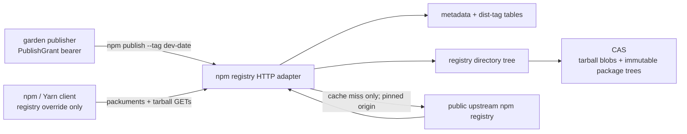

# npm Development Registry Serving

| | |
|---|---|
| **Created** | 2026-09-28 |
| **Author** | Kriscendo Bot (prompted) |
| **Status** | Proposed |

## Summary

Add an npm-registry HTTP adapter to the existing `@endo/exo-npm` registry,
CAS, and registry-table machinery. The adapter accepts constrained development
publishes, records both the immutable version and its npm dist-tag, and serves
ordinary npm packuments and tarballs to unmodified npm and Yarn clients.

The first deployment is `https://npm.minion.town`. It is a staging registry for
packages built from `endojs/endo-but-for-bots`; it is not a production release
system. A client can set this URL as its only registry and install a staged
package plus its entire transitive graph. Packages not staged locally are
demand-fetched through a pinned upstream registry, verified, checked into the
same store, and re-served under `npm.minion.town` URLs. The client never falls
back to npm's default registry and no pre-warmed client cache is required.

This is the protocol-serving slice missing from
[endor-npm-registry-proxy](endor-npm-registry-proxy.md). That design gives
`endor` a registry *consumer*. This design exposes the same underlying package
store as a registry *server* for stock package managers.

## What is the Problem Being Solved?

Development packages on the `llm` roadmap branch need to be exercised from
other repositories before any production npm release. Git dependencies do not
exercise npm packing, workspace dependency rewriting, dist-tags, registry
metadata, or a normal package manager's transitive resolver. Publishing to
production npm is too consequential and npm credentials cannot express
"development releases only."

The repository already has most of the read-side mechanics:

- `@endo/exo-npm` and the daemon registry implementation understand npm
  packuments, integrity, tarballs, dependency metadata, and CAS trees;
- [endor-npm-registry-proxy](endor-npm-registry-proxy.md) has a complete Rust
  consumption path using a registry table and CAS; and
- [npm-registry-as-directory-tree](npm-registry-as-directory-tree.md) defines
  the reusable read presentation: registry root -> npm hub -> package -> exact
  version -> immutable package tree.

What is absent is a server boundary that speaks the ordinary npm registry HTTP
protocol, a write path that retains exact tarball bytes and dist-tags, and an
end-to-end proof using a real npm or Yarn client rather than `endor run`.

## Goals

1. Accept `npm publish --registry https://npm.minion.town --tag
   dev-YYYY-MM-DD` from the garden's bot publisher identity for an allowlisted
   set of packages.
2. Store the received tarball byte-for-byte in the CAS, extract the existing
   immutable package tree, and atomically index the package version and
   dist-tag in the registry tables.
3. Serve packuments, version manifests, dist-tags, and tarballs with the
   ordinary npm registry protocol, including scoped package names and npm's
   abbreviated install metadata media type.
4. Let npm and Yarn resolve every transitive dependency while configured with
   `npm.minion.town` as their only registry.
5. Reuse the directory-tree read path and package-ingestion mechanics rather
   than build a second package store behind the HTTP adapter.
6. Preserve immutable `(name, version)` coordinates and verify every staged or
   mirrored tarball before it becomes visible.

## Non-goals

- **No production-npm promotion mechanics.** This design does not publish,
  copy, retag, or promote a staged package to `registry.npmjs.org`. Any future
  promotion ceremony is separate work with separate authority. In particular,
  the promoter in
  [npm-dev-publisher-attenuation](npm-dev-publisher-attenuation.md) is not a
  prerequisite or an implementation phase of this staging-serving slice.
- No production tags. Publish and tag mutations accept only `dev-*`; `latest`
  cannot be created by this service.
- No unpublish, deprecate, owner management, token management, search, audit,
  web UI, or general multi-tenant registry administration.
- No private upstream dependencies in the first deployment. Upstream
  read-through is anonymous and pinned to the public npm registry.
- No replacement for npm's or Yarn's dependency solver. The stock client
  chooses the graph from served metadata; the server guarantees that every
  selected edge is fetchable through the same origin.
- No change to `endor`'s runtime identity, default `exports` conditions,
  builtin modules, or globals. Those remain the subject of
  endojs/endo-but-for-bots PR #879.

## Relationship to the existing designs

| Design | Relationship |
|---|---|
| [npm-registry-as-directory-tree](npm-registry-as-directory-tree.md) | Normative read substrate. The HTTP adapter traverses the package/version tree for exact-version content. Dist-tags remain metadata beside the tree, exactly as that design's non-goal requires. |
| [endor-npm-registry-proxy](endor-npm-registry-proxy.md) | Supplies the fetch, integrity, registry-table, CAS ingestion, and offline-cache precedent. This design adds an HTTP server and exact tarball retention; it does not change `endor run`. |
| [registry-capability](registry-capability.md) | Deprecated public capability shape whose shipped implementation remains a compatibility source while the directory-tree adapter lands. It is not the new HTTP API. |
| [npm-dev-publisher-attenuation](npm-dev-publisher-attenuation.md) | Supplies the `PublishGrant` security vocabulary and the development-only mutation rules. This design narrows the first deploy to staging and deliberately defers that design's production promoter. It also changes the earlier demo's “local packages only” read rule by adding bounded public-upstream read-through so one global registry override can install a full graph. |
| [llm-dev-publish](llm-dev-publish.md) | Future source workflow. Its immutable-SHA build, manifest rewriting, and FIFO sequencing may publish here; this design fixes the serving contract independently of that automation. |

### PR #879 does not block this design

PR #879 asks which runtime identity and default `exports` condition set
`endor run` should claim when it **executes** a fetched package in XS. This
registry never executes package modules and never selects an `exports` branch.
It stores and serves npm metadata and tarball bytes. An ordinary npm or Yarn
client installs those bytes, and the consumer's Node runtime applies its own
execution and `exports` rules later. Therefore #879 does not block the publish
path, the serve path, the deployment, or the validation in this design. This
design neither answers nor modifies #879.

## Release identity: version and tag are paired

Every accepted publish has both an immutable SemVer version and an explicit
mutable npm dist-tag:

```
version: <source-major>.<minor>.<patch>-dev.<UTC-commit-time-YYYYMMDDHHMMSS>.g<sha7>
tag:     dev-<UTC-commit-date-YYYY-MM-DD>
```

For example, source version `1.7.0` at commit `3aa902d` made at
2026-09-28T23:19:03Z becomes
`1.7.0-dev.20260928231903.g3aa902d` and is published with
`--tag dev-2026-09-28`.

The prerelease component is required because npm permits a package version to
be published only once. Date alone is not unique enough for multiple builds in
one day; the commit timestamp preserves chronological SemVer order and `g` plus
the short commit hash removes same-second collisions without risking an
all-numeric identifier with a leading zero. A rerun of the same immutable
commit derives the same coordinate and is an idempotent retry only when the
tarball bytes match.

The date tag is the human-facing channel. It may advance within that UTC day to
a later version, but never move backward in SemVer precedence. A publish
request must contain exactly one `dev-YYYY-MM-DD` tag matching the version's
commit date. Later `npm dist-tag add` calls may move that same date tag forward
or add a separately reserved `dev-latest` tag; they may not create a non-`dev-`
tag. Recording the tag in durable state is part of the publish transaction, not
an optional follow-up.

## Architecture



The npm client, not the server, performs dependency resolution. The important
serving invariant is stronger than a redirect: every packument returned to the
client contains `dist.tarball` URLs on `https://npm.minion.town`, and every one
of those URLs is backed by the same CAS and registry tables. The adapter never
returns an upstream tarball URL or HTTP redirect to one.

## Publish path

### Authentication and authority

The deployment maps a 256-bit bearer token to a `PublishGrant` record. The
initial grant has subject `garden-llm-publisher`, an explicit package allowlist,
an expiry, and no authority other than the routes below. Tokens are stored only
as hashes. Public reads need no credential.

The accepted mutation surface is deliberately small:

| Request | Result |
|---|---|
| `PUT /{encoded-package}` from `npm publish` | Accept only one new development version and exactly one matching `dev-YYYY-MM-DD` tag. |
| `PUT /-/package/{encoded-package}/dist-tags/{tag}` | Accept an allowlisted `dev-*` tag pointing to an existing local prerelease, subject to monotonic movement. |
| `DELETE /-/package/.../dist-tags/...` | Refused in the first cut; tags advance, they do not disappear. |
| unpublish, deprecate, owners, users, tokens, login | `404` or `405`; no implementation path reaches storage. |
| `GET /-/whoami` | Return the authenticated grant subject for npm CLI diagnostics. |

The bearer is a staging credential, not an npmjs.com credential. The service
has no upstream write credential at all.

### Validation and atomic commit

For `PUT /{encoded-package}`, the adapter validates before making the version
visible:

1. Decode and canonicalize the scoped or unscoped package name. The path name,
   document `_id`/`name`, version-manifest `name`, and tarball `package.json`
   name must agree.
2. Authenticate a live grant and verify that it covers the canonical package
   name.
3. Require exactly one version and one attachment in the publish document.
4. Parse strict SemVer and require the version shape in § Release identity.
   Require exactly one matching `dev-YYYY-MM-DD` dist-tag.
5. Bound the request and unpacked archive sizes, file count, and path lengths;
   reject absolute paths, `..`, links that escape the package root, duplicate
   paths, and unsupported archive entries.
6. Compute SHA-512 SRI and SHA-1 `shasum` from the received tarball rather than
   trusting client fields. Check the inner `package.json` name and version.
7. Store the exact `.tgz` bytes as a CAS blob and use the existing package
   ingestion path to create the immutable package tree.
8. In one SQLite transaction, insert the version row, insert or advance the
   tag row, and append the audit event. Only then may a packument read expose
   the version.

CAS writes precede the SQLite transaction because the filesystem and SQLite
cannot share a transaction. A crash may leave unreachable CAS blobs, which the
normal CAS collector may reclaim; it must never leave a visible table row whose
blob or tree is absent. A repeated `(name, version)` with identical tarball
integrity and the same tag is a no-op success. Different bytes or a different
publish-time tag receive `409`; tag changes use the explicit dist-tag route.

### Durable schema

Extend the registry table rather than introduce a second database vocabulary:

```sql
CREATE TABLE packages (
  name TEXT NOT NULL,
  version TEXT NOT NULL,
  tree_hash TEXT NOT NULL,
  tarball_hash TEXT NOT NULL,
  integrity TEXT NOT NULL,
  shasum TEXT NOT NULL,
  fetched_at INTEGER NOT NULL,
  PRIMARY KEY (name, version)
);

CREATE TABLE package_versions (
  name TEXT NOT NULL,
  version TEXT NOT NULL,
  manifest_json TEXT NOT NULL,
  integrity TEXT NOT NULL,
  shasum TEXT NOT NULL,
  source TEXT NOT NULL CHECK (source IN ('published', 'upstream')),
  indexed_at INTEGER NOT NULL,
  PRIMARY KEY (name, version)
);

CREATE TABLE dist_tags (
  name TEXT NOT NULL,
  tag TEXT NOT NULL,
  version TEXT NOT NULL,
  source TEXT NOT NULL CHECK (source IN ('published', 'upstream')),
  updated_at INTEGER NOT NULL,
  PRIMARY KEY (name, tag),
  FOREIGN KEY (name, version) REFERENCES package_versions(name, version)
);

CREATE TABLE package_meta (
  name TEXT PRIMARY KEY,
  upstream_json TEXT,
  upstream_etag TEXT,
  expires_at INTEGER,
  fetched_at INTEGER NOT NULL
);
```

`package_versions` indexes metadata as soon as an upstream packument is
validated, before a client necessarily selects or requests its tarball.
`packages` remains the existing materialization table: a row means the exact
tarball and extracted tree are present in the CAS. An accepted local publish
inserts both rows atomically; an upstream tarball request fills the `packages`
row after verifying content against `package_versions`. Implementations may
migrate the existing `hash` column to `tree_hash` or keep it as a compatibility
alias. The required semantics are one exact tarball blob and one extracted tree
per materialized version, not the spelling of the migration.

## Serve path

### npm registry HTTP surface

The first cut supports the requests npm and Yarn need for install and the
accepted publish workflow:

| Request | Response |
|---|---|
| `GET`/`HEAD /{encoded-package}` | Full packument or install-v1 projection, with `versions`, `dist-tags`, validators, and local tarball URLs. |
| `GET`/`HEAD /{encoded-package}/{version}` | One synthesized version manifest. |
| `GET`/`HEAD /{encoded-package}/-/{file}.tgz` | Exact stored tarball bytes with immutable caching and SRI-consistent length/content. |
| `GET /-/package/{encoded-package}/dist-tags[/{tag}]` | Public tag map or one tag. |
| `GET /-/ping` | Public liveness. |

Routes accept npm's percent-encoded scoped name (`@endo%2fpatterns`) and the
slash spelling where clients use it, but canonicalize both to one key. JSON
errors use npm-compatible status codes and a stable `{ error, reason }` body.

The packument is synthesized from the durable version/tag rows. Each version's
`dist` object contains the server-computed `integrity`, `shasum`, and an
absolute tarball URL rooted at the configured public registry origin. The
adapter honors `Accept: application/vnd.npm.install-v1+json`; it may initially
serve the safe full document for both media types, then add an abbreviated
projection without changing stored truth.

### Full-graph read-through

Using a global registry override means requests for public third-party
dependencies also reach `npm.minion.town`. On a cache miss:

1. Fetch the package packument from one configured, HTTPS upstream origin
   (`https://registry.npmjs.org` in the first deployment), with conditional
   requests and a bounded TTL.
2. Validate the document and merge it with locally published versions.
   Locally published `dev-*` versions and tags are authoritative additions;
   upstream metadata cannot delete or replace them.
3. Rewrite every served tarball URL to the local registry origin. Never proxy
   an arbitrary host from `dist.tarball`; the upstream tarball request is
   reconstructed against the pinned upstream origin.
4. When the client requests a selected tarball, fetch it, verify its upstream
   SRI, retain the exact blob, extract it through the existing bounded ingester,
   insert its `source='upstream'` row, and serve the retained bytes.
5. Coalesce concurrent misses for the same package/version. A failed upstream
   request returns a bounded `502`/`504`; it never redirects the client or asks
   the client to try the default registry.

This yields a demand-filled mirror of precisely the graph clients use, not a
general crawler. Once a graph has been installed, disabling upstream egress and
installing again from a second empty client cache proves that the same store is
sufficient.

### Reusing the directory tree

The HTTP adapter does not add dist-tags to the directory tree. The tree
design's path remains:

```
/npm/<package>/<exact-version> -> immutable CAS package tree
```

Packument and tag tables are HTTP metadata indexes beside that tree. A
published or mirrored transaction makes an exact version visible to the
package directory, and a tarball GET reads the `tarball_hash` associated with
that same version. Internal resolution of an exact version traverses the
registry tree; it must not instantiate a parallel map of package trees inside
the HTTP server.

Because [npm-registry-as-directory-tree](npm-registry-as-directory-tree.md) is
still in progress, the implementation either lands its required Node adapter
first or in the same implementation series. A temporary adapter over the
shipped `EndoRegistry` implementation is acceptable only if the public HTTP
handler is already expressed in terms of the tree interface and the
compatibility adapter is deleted when the tree lands.

## Ownership map

| Boundary | Mechanism | Policy | Durable state | Lifecycle / commit authority | Value crossing |
|---|---|---|---|---|---|
| npm/Yarn client -> registry HTTP adapter | npm registry request/response encoding | Adapter authenticates mutations, bounds inputs, and chooses supported routes | None on the client; server-side records below | Adapter admits or rejects a request; client owns its lockfile and install retry | Publish document, packument, tag map, or tarball bytes, all in npm vocabulary |
| HTTP adapter -> registry tree and writer | Tree lookup for reads; narrow internal `providePublishedVersion`/`provideUpstreamVersion` writer for ingestion | Registry core enforces immutable coordinates and tag rules | Registry SQLite tables and CAS | Registry core commits the visibility transaction; CAS collector reclaims unreachable blobs | Canonical name, exact version, manifest, integrity, tarball blob, and immutable tree |
| Registry server -> public upstream registry | Bounded anonymous metadata/tarball fetch | Server alone chooses the pinned upstream origin, TTL, and accepted integrity | Server cache rows and CAS; upstream owns its registry | Server retries or fails a miss and decides when cached metadata refreshes | Validated upstream packument or tarball bytes |
| Core package -> deployment | Injectable state paths, public origin, fetch power, and grant lookup | Deployment selects hostnames, credentials, resource limits, and process policy | `minion.town` deployment owns the live state directory and secret | Deployment owns start/stop, backup, restore, and rollout | Configuration and capabilities, not npm protocol values |

The registry core owns all persistent package, tag, audit, and CAS state. It
also owns the transaction that keeps or discards a new version. The deployment
owns process restart, backup, restore, and replay after a crash. HTTP request
classification belongs to the adapter; package execution classification does
not occur here and belongs to the eventual consuming runtime.

The inner/outer naming check holds: core values are package versions, trees,
blobs, and publish results. They are not named for deployment lifecycle terms
such as rollout, checkpoint, promotion, or restart. In particular, a stored
`PublishResult` is not a production “promotion” result.

## Repository split and review surfaces

This work needs **two companion design PRs** because the reusable mechanism and
the live deployment have different owners and different review bases:

| Repository | Design responsibility | Design base | Later implementation base |
|---|---|---|---|
| `endojs/endo-but-for-bots` | This document; npm HTTP adapter, publish validator, metadata/tag schema, read-through cache, directory-tree integration, and conformance fixtures in/around `@endo/exo-npm` | frozen snapshot of roadmap branch `llm` | a separate implementation PR on the project's implementation base, not this design PR |
| `kriscendobot/minion.town` | Companion [`designs/npm-minion-town-registry.md`](https://github.com/kriscendobot/minion.town/pull/134); hosting, pin/build, DNS/TLS, Caddy, systemd, state directory, monitoring, and publish-auth secret | frozen snapshot of `main` | a later implementation PR on `main` |

The minion repository remains a deployment and configuration layer, not the
home of registry-serving library code. It consumes a pinned Endo build; it does
not copy the protocol handler into `src/`.

## Failure, freshness, and recovery

- Package/version content is immutable. Recovery never overwrites a coordinate;
  it completes an invisible pre-commit ingest or retries from the client.
- Published metadata is durable and has no expiry. Upstream metadata has a TTL
  and ETag, with stale-if-error permitted only for versions already present.
- SQLite runs in WAL mode. Shutdown checkpoints and backups follow the owning
  deployment's runbook; the database and CAS are restored as one generation.
- If a row references a missing blob/tree, startup verification marks the
  version unavailable and fails readiness. It does not serve corrupt metadata.
- Dist-tag moves serialize per package in the same transaction that checks
  monotonicity.
- The server logs subject, package, version, tag, outcome, and content
  integrity, never bearer tokens or Authorization headers.

## Security considerations

- Publish authentication terminates only over TLS. The loopback service trusts
  no forwarded identity header; it validates its own bearer.
- The package allowlist and `dev-*`/prerelease constraints are checked after
  canonicalization and again inside the storage transaction.
- Tar extraction is data parsing, never code execution. No lifecycle script is
  run on the server.
- Upstream read-through is an outbound HTTPS capability restricted to one
  configured origin. Packument-provided URLs cannot create SSRF authority.
- Bounds cover compressed bytes, expanded bytes, entry count, path length,
  JSON size, response time, and concurrent misses.
- All public tarball responses are immutable and carry an ETag derived from
  content. Packuments and tags are mutable metadata and must not receive
  immutable caching.
- A compromised publisher can publish only allowlisted development versions to
  this staging registry. Since there is no production promoter or upstream
  write credential, it cannot turn that authority into a production npm
  release through this system.

## Phased implementation

1. **Core storage delta.** Retain exact tarball blobs, add manifests and
   dist-tags, migrate existing tables, and expose a narrow transactional writer
   beside the registry tree.
2. **Read server.** Serve local packuments, version manifests, tags, and
   tarballs; pass a protocol conformance suite using npm and Yarn fixtures.
3. **Development publish.** Add bearer grants, publish validation,
   `npm whoami`, idempotency, tag monotonicity, archive bounds, and audit rows.
4. **Full-graph proxy.** Add pinned-origin packument and tarball read-through,
   local URL rewriting, miss coalescing, TTL/ETag refresh, and offline replay.
5. **Deployment and acceptance.** Consume the core from the companion
   minion.town deployment design and run the cold-client validation below.

Each phase is independently testable. No phase adds production promotion.

## Validation

The implementation is not complete until a live, clean-room exercise proves
the actual client behavior:

1. Select a small real package set from `endojs/endo-but-for-bots` including a
   target with both internal `@endo/*` and external transitive dependencies
   (for example, stage `@endo/errors`, `@endo/patterns`, and
   `@endo/exo-npm`, then install the latter; the builder confirms the final set
   from the generated package manifests).
2. Build from one immutable commit. Rewrite publishable workspace dependencies
   to the exact shared prerelease coordinate, pack with the repository's normal
   packer, and publish every selected package with
   `--registry https://npm.minion.town --tag dev-2026-09-28` using the bot
   grant. Assert each `npm view <name>@dev-2026-09-28 version` equals the
   generated manifest and that the packument records the tag.
3. Start a fresh container or disposable VM with no `node_modules`, lockfile,
   npm/Yarn cache, user `.npmrc`, or prior access to `npm.minion.town`. Allow
   its egress only to DNS and `npm.minion.town`; in particular, block direct
   access to `registry.npmjs.org` and common npm CDN hosts.
4. Configure a **global** registry override, not only an `@endo` scope override:
   `npm_config_registry=https://npm.minion.town/`. Install the target by dated
   tag with npm. In a second fresh environment, configure Yarn's
   `npmRegistryServer` to the same URL and install the same target.
5. Run `npm ls --all` (and the Yarn equivalent), exercise a harmless import
   from the installed target, and inspect the generated lockfiles. Every
   resolved tarball URL must have origin `npm.minion.town`; server access logs
   must account for every packument and tarball request. No default-registry
   request may appear in the client's network trace.
6. Compare the installed graph with the server's registry tables and CAS: every
   selected `(name, version)` has a manifest, exact tarball blob, and extracted
   tree with verified integrity.
7. Disable the registry server's upstream egress, create a **third** empty
   client cache, and repeat the install. This proves that the graph demand-filled
   by the cold run is now served entirely from the same store and not from a
   client cache or hidden upstream fallback.
8. Negative checks: reject `latest`, a non-prerelease version, a mismatched
   date tag, an out-of-allowlist package, a same-version/different-byte retry,
   and an archive traversal entry. Confirm none becomes visible in a packument.

The test may use `--ignore-scripts` for the graph/protocol assertion so package
lifecycle code cannot obscure the network result. A separate ordinary install
may run when the chosen packages' declared scripts are safe; server-side script
execution is never part of the test.

## Design decisions

1. **One global registry override, therefore bounded read-through.** A scope-only
   override would let the default registry satisfy external dependencies and
   would not prove the requested isolation. Demand-filled upstream mirroring is
   the smallest way to make one-origin installation work.
2. **Exact tarball plus extracted tree.** npm clients need `.tgz` bytes while
   Endo consumers need readable trees. Retaining both by content hash lets one
   version row serve both without repacking, which would change integrity.
3. **Metadata beside, not inside, the directory tree.** Dist-tags are mutable
   aliases and the directory-tree design intentionally excludes them. Keeping
   a tag table preserves that invariant while the HTTP adapter synthesizes the
   npm view.
4. **Development date tag plus commit-derived unique version.** Humans get a
   memorable daily channel; storage gets an immutable collision-resistant
   coordinate.
5. **Two design PRs.** Core protocol/storage behavior belongs on the Endo
   roadmap; deployment authority belongs in minion.town. Combining them would
   either put AWS policy in a portable package or duplicate registry code in a
   deployment repository.
6. **Staging ends at staging.** Deferring production promotion keeps the first
   deliverable useful and removes an npmjs.com credential from its trusted
   computing base.

## Open questions

None. Production promotion is deferred work, not an unanswered question in
this design.

## Prompt

> Design a served, npm-protocol-compatible registry proxy at
> `https://npm.minion.town` for dated `-dev` releases of
> `endojs/endo-but-for-bots` packages. It must accept authenticated npm publish
> with explicit dist-tags, serve stock npm/Yarn installs including full
> transitive graphs through one registry override, reuse the existing CAS,
> registry-table, and directory-tree work, separate Endo mechanism from
> minion.town deployment, state that #879 does not block serving, defer all
> production-npm promotion, and specify a cold-cache end-to-end proof.
