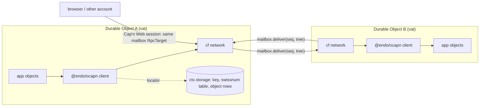
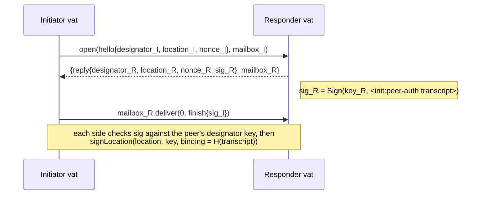
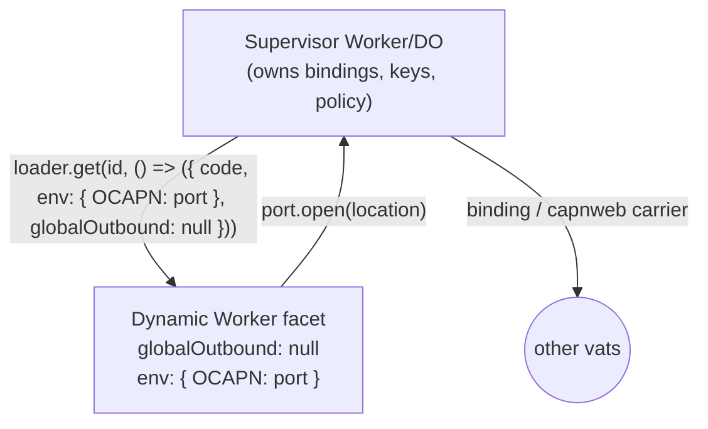

# OCapN over Cloudflare RPC and Cap'n Web

| | |
|---|---|
| **Created** | 2026-09-30 |
| **Author** | Dan Connolly (prompted), Kriscendo Bot (prompted) |
| **Status** | Proposed |

## What is the Problem Being Solved?

Cloudflare Workers offer object-capability-flavored RPC: service bindings,
Durable Object (DO) stubs, `WorkerEntrypoint`, `RpcTarget`, and the
browser-reachable [Cap'n Web](https://github.com/cloudflare/capnweb)
protocol. Dynamic Worker facets look a lot like Endo compartments. Two things
are missing for building persistent, confined object systems on that platform:

1. **No caller identity.** A callee learns nothing about who called it, so
   there is no grant matching and no way to check that the party presenting a
   reference is the party it was given to.
2. **No persistence story for references.** Platform stubs die with the
   isolate. Making a reference survive eviction means something like
   `@agoric/swingset-liveslots`, which is a large undertaking.

An experiment in [dckc/awesome-ocap#78](https://github.com/dckc/awesome-ocap/pull/78)
(a counter web component with a "copy URL" button, instantiable several times
as a dynamic worker) hit both limits. It also opened a confinement hole: the
supposedly confined worker received general `fetch` egress through
`globalOutbound` (review comment r4140235148 on that PR).

This design treats Cloudflare's RPC and Cap'n Web only as **message carriers
between OCapN peers**. OCapN carries the object references, supplies peer
identity through its handshake, and supplies persistence through sturdyrefs.
Platform stubs appear in exactly one place: the two mailbox stubs that make up a
session's carrier.

The feasibility sketch this design expands is on
[kriscendobot/garden#117](https://github.com/kriscendobot/garden/issues/117).

## Target Model



A **Durable Object is an OCapN vat**: it runs single-threaded, has durable
`ctx.storage`, and has a stable id. Live references are scoped to a session,
and a session is scoped to the in-memory isolate. Anything that must outlive
eviction is a sturdyref whose swissnum is a row in the DO's storage.

## Description of the Design

### The `cf` network

A new package, `@endo/ocapn-cloudflare`, provides `makeCloudflareNetwork(...)`,
which returns an `OcapnNetwork` (`packages/ocapn/src/client/types.js`). It is a
`provideSession` + `inboundSessions` network like `.np`
([ocapn-noise-network.md](ocapn-noise-network.md)): it owns its handshake and
hands OCapN core a finished, authenticated `NetworkSession`. It does not use
the connect-style `op:start-session` path.

#### Location scheme

```js
harden({
  type: 'ocapn-peer',
  network: 'cf',
  transport: 'cf', // legacy mirror during the network migration
  designator: '<64 lowercase hex: Ed25519 public key>',
  hints: {
    'cf-do': '<script>/<class>/<id-hex or name>', // binding-reachable
    'capnweb': 'wss://example.workers.dev/ocapn', // internet-reachable
  },
});
```

Following the identity rule in
[ocapn-network-transport-separation.md](ocapn-network-transport-separation.md),
the routing identity is `(network, designator)` and hints are reachability
only. The **designator is the vat's long-term Ed25519 public key**, not a DO
id. A DO id is not something a remote peer can verify, and it does not exist
for a browser or cross-account peer. The DO generates its key pair on first
activation and keeps the private key in `ctx.storage`. The platform operator
can read that key, but the operator already runs the vat's code, so this adds
no new trust.

The sturdyref URI is the existing `ocapn://<designator>.cf/s/<swissnum>`
serialization from `locationToLocationId` and `sturdyrefs.js`, with the hints
as query parameters. It replaces the counter demo's "copy URL".

#### Carriers

Every carrier has the same abstract shape. Each direction of a session is a
**mailbox**, an `RpcTarget` with one method:

```js
// One mailbox per direction per session. Returns nothing; carries no stubs.
interface OcapnMailbox {
  deliver(seq: bigint, frame: OcapnTree | Uint8Array): void;
}
```

Opening a session exchanges the two mailboxes in a single call, so the callee
never has to find a route back to a caller it cannot identify:

```js
// Exposed by the vat's front door (DO method, WorkerEntrypoint, or Cap'n Web main).
open(hello: OcapnTree, initiatorMailbox: OcapnMailbox):
  Promise<{ reply: OcapnTree, responderMailbox: OcapnMailbox }>
```

| Carrier | Front door | Reach | Frame type |
|---|---|---|---|
| **binding** | `open` on a DO class (via `env.NS.get(id)`) or on a `WorkerEntrypoint` (service binding) | same account; the supervisor must hold the binding | tree (structured clone) |
| **capnweb** | `open` on the Cap'n Web main `RpcTarget` (`newWorkersRpcResponse` in a Worker/DO; `newWebSocketRpcSession` from a browser or Node peer) | anywhere with HTTPS | tree (Cap'n Web JSON) |
| **ws-bytes** | hibernatable WebSocket accepted by a DO (`ctx.acceptWebSocket`) | anywhere | bytes (existing Syrup/CBOR, optionally the `.np` Noise network) |

The binding and capnweb carriers share one implementation: both pass
`RpcTarget`s by reference and both preserve the tree. The ws-bytes carrier is
the existing byte world (`websocket.js`, or the `.np` WebSocket transport)
hosted inside a DO. It is listed for completeness, it is phase 4, and it
gives no session persistence (see *Session lifetime*).

Mailbox discipline, which the network enforces on both ends:

- `deliver` returns `undefined`. Nobody pipelines on its result, and no stub
  ever appears inside a frame. The receiver rejects any frame that contains a
  function, an `RpcTarget`, a stub, or a promise, and aborts the session.
  OCapN's answer positions and `op:deliver` are the only pipelining. Cap'n
  Web's pipelining is never used on frames, and neither is Workers RPC
  promise pipelining. Mixing the two stub worlds would bring back the identity
  and persistence problems this design exists to avoid.
- The two mailbox stubs are the only platform capabilities in a session. The
  network disposes them (`[Symbol.dispose]`) when the session closes.

#### Peer identity: the handshake

The platform tells the callee nothing about its caller. The default OCapN
`op:start-session` check is not enough either: the location signature in
`client/handshake.js` "only proves the peer holds the fresh session key it just
minted — nothing ties that to who the transport says they are". A
`verifyPeerLocation` hook cannot fill the gap either, because the platform
supplies no transport fact to check against.

The `cf` network therefore authenticates the designator key itself. It reuses
the proven shape of the two existing authenticating netlayers: the Goblins
`init:peer-auth` challenge in `netlayers/websocket.js`, and the designator
check in `ocapn-noise`'s `exchangeIdentity`.



- `transcript` is the canonical Syrup encoding of
  `<init:peer-auth nonce_I nonce_R designator_I designator_R>`. The record label
  keeps the signature from being usable as an oracle for any other signed term.
- Each side signs the transcript with its **designator** key and checks the
  peer's signature against `hex → key` of the peer's advertised designator. A
  mismatch aborts, just as `.np` rejects an advertised designator that differs
  from the Noise identity.
- The location signature is bound to `binding = SHA-256(transcript)`
  (`cryptography.signLocation`'s `binding` argument, which `.np` uses for the
  Noise handshake hash). The resulting `NetworkSession.remoteLocationSignature`
  therefore cannot be replayed into another session.
- `sessionId` is `makeSessionId` over the two designator keys, as today.
- Crossed hellos between the same two designators resolve by the existing
  `compareSessionKeysForCrossedHellos` rule (ebfb#806).

Grant matching then works without any help from the platform. Three-party
handoffs (`desc:handoff-give` / `desc:handoff-receive`) are signed by
designator keys that were authenticated this way.

#### Ordering and reliability

OCapN requires each session to be ordered and reliable. The network does not
rely on a platform ordering guarantee:

- Every `deliver` carries `seq`, a per-direction counter starting at `0n`.
- The receiver accepts only `seq === expected`. A frame that arrives early is
  held in a reorder buffer bounded at `maxReorder` (default 64). A gap still
  open after the buffer fills, or a duplicate `seq`, aborts the session.
- A **rejected `deliver` call is never retried.** The failure is ambiguous (the
  frame may or may not have run), and a retry could deliver twice. The session
  aborts (`op:abort`, best effort), and outstanding answers reject with a
  "session severed" error, the same as a dropped TCP connection. The OCapN
  client already reconnects on the next `provideSession`.
- The sender limits itself to `maxInFlight` unresolved `deliver` calls
  (default 64) and queues the rest. The resolution of `deliver` is the only
  back-pressure signal.

This makes delivery at-most-once and ordered per session, which is what OCapN
assumes. Exactly-once across sessions is out of scope: application state that
must survive is reached through sturdyrefs and stored transactionally (see
*Sturdyrefs in DO storage*).

#### Session lifetime across eviction and hibernation

OCapN session state (import and export tables, answer positions, the GC
refcount table) lives in isolate memory. It is not persisted, because doing so
would require liveslots-style virtualization of every live reference.
Consequently:

- **Eviction ends every session.** The peer's next `deliver` rejects, and the
  peer aborts. Promises for in-flight answers reject. The peer re-enlivens
  whatever it needs through sturdyrefs.
- **Hibernation.** A DO holding only binding or capnweb sessions is evicted,
  not hibernated, once idle. Its mailbox stubs die with it, which is the case
  above. A DO holding ws-bytes sessions can hibernate while its sockets stay
  open. On wake, a `webSocketMessage` for a socket whose attachment
  (`serializeAttachment`) records an older isolate epoch has no session behind
  it, so the DO sends `op:abort` and closes. A hibernated DO never pretends to
  continue a session.
- **Keep-alive is a policy choice, not a mechanism.** A vat that wants
  long-lived live references may keep a request or alarm pending, at the cost
  of paying for wall time. The network provides no keep-alive by default.

### Confinement: the facet's only egress is an OCapN session endpoint

In #78 the facet held something `fetch`-shaped. In this design the facet
holds **no general egress**:



- The supervisor loads the facet with `globalOutbound: null` (no `fetch`, no
  `connect`) and an `env` whose **only** entry is `OCAPN`, an `OcapnPort`
  `RpcTarget` it constructs itself:

  ```js
  interface OcapnPort {
    // Dial a peer; the supervisor applies its dial policy and runs the carrier.
    open(location, hello, facetMailbox): Promise<{ reply, peerMailbox }>;
  }
  ```

  The facet's `cf` network is `makeCloudflareNetwork({ port: env.OCAPN })`.
  Inbound sessions reach the facet through the supervisor, which calls the
  facet entrypoint's `open` with the same signature as a front door.
- The facet runs the vat: the OCapN client, its app objects, and its
  designator key. The supervisor is a **frame router**. It carries opaque
  frames between the facet's mailboxes and the carriers, and it never
  interprets or proxies HTTP. Everything the facet can reach is a capability
  granted to it inside OCapN.
- The supervisor holds the carrier bindings (DO namespaces, service bindings,
  the Cap'n Web endpoint) and the **dial policy** (which designators or hints a
  facet may open). Policy is the supervisor's business, so revoking a facet's
  network reach means refusing `open`.
- Storage: if the facet is a DO facet (`ctx.facets.get`) it uses its own
  SQLite database, isolated from the supervisor, which holds its key and its
  sturdyref tables. Otherwise the supervisor gives it an
  attenuated storage `RpcTarget` scoped to the facet id, and it can impose a
  quota there (see *Open questions*).

This removes the web-key relay allowlist from #78 entirely: there is no HTTP
relay left to allowlist.

### Sturdyrefs in DO storage

`makeOcapn({ locator })` already accepts a caller-owned
`{ get(secret) → object | Promise<object> }` (`client/index.js`,
`makeSturdyRefTracker` in `client/sturdyrefs.js`), and bootstrap
`fetch(swissnum)` calls it. The Cloudflare vat supplies a storage-backed
locator. Liveslots is not needed.

```sql
CREATE TABLE sturdyref (
  swissnum BLOB PRIMARY KEY,   -- 32 random bytes
  object_id TEXT NOT NULL,
  created_at INTEGER NOT NULL
);
CREATE TABLE object (
  id TEXT PRIMARY KEY,
  kind TEXT NOT NULL,          -- e.g. 'counter'
  state TEXT NOT NULL          -- JSON; per-kind schema
);
```

- **Mint.** `mintSturdyRef(objectId)` inserts a row with a fresh random
  swissnum and returns `makeSturdyRef(selfLocation, swissnumBytes)`. The
  button serializes that as the `ocapn://…/s/…` URI.
- **Enliven.** `locator.get(secret)` looks up the row and calls the kind's
  maker, e.g. `makeCounter(objectId)`. That returns an exo whose methods read
  and write the `object` row inside the DO's single-threaded turn, so each
  method is its own storage transaction. An in-memory `Map<objectId, exo>`
  keeps identity stable within one isolate lifetime.
- **Revoke.** Delete the `sturdyref` row. New enlivenments then fail. A live
  reference handed out earlier stays usable until its session ends, unless the
  kind's maker returns a revocable forwarder that re-checks the row on every
  call. The counter demo uses the forwarder, so revocation takes effect
  immediately.
- **Enliven elsewhere.** `enlivenSturdyRef` in another vat dials the
  designator through the hints (the `cf-do` hint if it holds the binding,
  otherwise `capnweb`), completes the handshake above, and calls bootstrap
  `fetch`.

The cost of this model: an object must be reachable by swissnum to survive
eviction. Non-sturdy references die with their session. The first design does
not try to make them survive; that would be the virtual/durable-kind work this
design sets aside.

### Tree codec: OCapN values as native structure

dckc asked (p.s. on #117) to use the carriers' own structured serialization as
the OCapN serialization rather than flattening OCapN to bytes and hiding the
bytes inside the carrier. This is the default frame type for the binding and
capnweb carriers.

#### Generalizing the codec and session envelope

`OcapnReader`/`OcapnWriter` (`packages/ocapn/src/codec-interface.d.ts`) are a
cursor API (`enterRecord`, `readInteger`, `peekTypeHint`, …) and never mention
bytes. Only the envelope does: `MakeReader(bytes)`, `getBytes()`,
`diagnose(bytes)`, and `NetworkSession.reader/writer: Uint8Array`. The change:

```ts
export interface OcapnCodec<M = Uint8Array> {
  makeReader(message: M, options?): OcapnReader;
  makeWriter(options?): OcapnWriter<M>;   // getMessage(): M
  diagnose(message: M): string;
  atEnd(reader: OcapnReader, message: M): boolean; // replaces index < length
}
// OcapnWriter keeps getBytes() on byte codecs as an alias of getMessage().
// NetworkSession<M>: reader: Reader<M>, writer: Writer<M>.
```

- `dispatchMessageData` in `client/ocapn.js` and the handshake reader in
  `client/handshake.js` loop `while (reader.index < data.length)`. They switch
  to `codec.atEnd`. For the tree codec one frame is exactly one message.
- `writeOcapnMessage` (`codecs/operations.js`) returns `M`.
- The op and descriptor codecs above the reader and writer do not change.
- `makeOcapn` gains **`signingCodec`**, a canonical *byte* codec used for
  `makeCryptography`. Today `makeCryptography(codec)` signs with the session
  codec. With a tree codec the two separate. `signingCodec` defaults to
  `codec` when `codec` produces bytes, and it is required otherwise.

#### Tree representation

| OCapN (codec type hint) | Tree value | Notes |
|---|---|---|
| null, undefined, boolean, string | same JS value | |
| integer | `bigint` (always) | a JS `number` is never an integer, so the two can't be confused |
| float64 | `number`; -0 is written `['ocapn-negzero']` | Workers RPC keeps NaN, ±Infinity, and -0. Cap'n Web keeps NaN and ±Infinity (via its `nan`/`inf` tags) but flattens -0 to 0, so the shared convention always escapes -0. The reader also accepts a bare -0 |
| bytestring | `Uint8Array` | the reader hands out a frozen copy (`@endo/immutable-arraybuffer`) |
| list | `[[...items]]` | a literal list is wrapped, the way Cap'n Web wraps literal arrays |
| record | `['ocapn-rec', label, ...fields]` | label: a JS string means a **selector**; a `Uint8Array` means a bytestring; `['ocapn-str', s]` means a string label |
| selector (outside a label) | `['ocapn-sel', name]` | |
| set | `['ocapn-set', ...items]` | |
| dictionary | plain object with string keys | the writer uses this form only if every key is a string other than `__proto__`; the reader presents keys in the byte codec's canonical order |
| dictionary (general) | `['ocapn-dict', k1, v1, k2, v2, ...]` | any other key type, or a `__proto__` key |

**The escape rule** is one sentence: *an `Array` in an OCapN tree is either
`[[...]]` (a literal list) or has a string tag from the table above
(`ocapn-rec`, `ocapn-str`, `ocapn-sel`, `ocapn-set`, `ocapn-dict`,
`ocapn-negzero`) at index 0*. Every other array shape (`[]`, an unknown tag, a non-string non-array
first element) is a decode error. Sets and dictionaries are not required to
arrive in canonical order, because the tree is never signed (below).

**One convention serves both carriers.** Workers RPC structured-clones the
tree as it is. Cap'n Web round-trips any JS value made of these types, and it
escapes our tagged arrays inside its own wire encoding (its literal-array
wrapping), so the tags pass through without our touching its wire format. The
same frame therefore works on either carrier, and a supervisor can forward
frames between a binding and a Cap'n Web session without re-encoding.

A tree the platform delivers may contain JS values outside this table (a
`Map`, a `Date`, a stub, an object with a prototype). The reader rejects them.
It validates the tree as it reads, never trusts it, and never calls a getter.

#### Signed subterms: signed over canonical bytes, carried as trees

The sketch said signed subterms must stay canonical Syrup bytes. Reading the
code shows a weaker requirement is enough. Signatures (location signatures,
`desc:handoff-give`, `desc:handoff-receive`) are made **and verified** by
re-serializing the *decoded structure*: `serializeHandoffGive(handoffGive,
codec)` and `getLocationBytesForSignature` in `cryptography.js`. That is
already how Syrup peers verify. So:

- Signed objects travel **as trees**, in their normal `desc:sig-envelope`
  shape. No opaque byte blobs are added to the message grammar.
- Signing and verification call `signingCodec`, a canonical byte codec, on
  the abstract value. This is sound because the tree codec represents the
  OCapN data model faithfully, and canonical encoding is a function of the
  abstract value alone.
- `signingCodec` must be the same across every network the vat uses **and**
  across the three parties of a handoff. The requirement already exists
  (`makeOcapn` makes registered networks agree on one codec). It is now stated
  in terms of the signing codec. The default is canonical Syrup, the codec in
  the OCapN spec and the one Goblins uses.

#### Interaction with Noise

Noise encrypts bytes, so tree frames and `.np` cannot be layered. The design
takes a position instead of combining them:

- **Binding carrier:** frames never leave Cloudflare's network. The
  designator handshake above gives authentication. Noise would add only
  protection from the platform, which already runs the vat's code. So there
  is no Noise.
- **capnweb carrier:** TLS protects the transport, and the designator
  handshake authenticates the peer. The trust gap versus Noise is TLS
  termination at Cloudflare's edge, which is again the platform.
- **Untrusted relays or a need for end-to-end encryption:** use the ws-bytes
  carrier with the `.np` network and bytes. A vat that needs both worlds runs
  two `makeOcapn` instances, one per codec family, until the codec becomes a
  per-network choice (see *Open questions*).

## Verification of platform claims

The sketch marked several Cloudflare and Cap'n Web claims *(verify)*. The
results, checked on 2026-09-30:

| # | Claim | Result | Source |
|---|---|---|---|
| 1 | Workers RPC carries structured-clone values | **Confirmed, with extensions.** It covers "nearly all" structured-cloneable types, and functions, `RpcTarget` subclasses, streams, and `Request`/`Response` become stubs or pass by reference. The page does not list bigint, typed arrays, NaN, ±Infinity, or -0 one by one; they come from the structured-clone algorithm, which preserves all of them. The tree codec depends on exactly these and on nothing else. | [workers/runtime-apis/rpc](https://developers.cloudflare.com/workers/runtime-apis/rpc/) |
| 2 | Platform RPC gives the callee no caller identity | **Confirmed.** `ctx.props` exists, but the *binding configurer* sets it (a service binding, or `getEntrypoint(name, { props })` on a Worker Loader). It is configuration, not an assertion by the caller. `ctx.access` does not propagate across RPC hops. A supervisor may use `props` to tell a facet its own facet id, but peer identity still has to come from the in-band handshake. | [runtime-apis/context](https://developers.cloudflare.com/workers/runtime-apis/context/), [bindings/worker-loader](https://developers.cloudflare.com/workers/runtime-apis/bindings/worker-loader/) |
| 3 | Ordering and at-most-once across DO RPC | **Partially.** Calls on one DO stub are E-ordered, and input gates serialize handling around storage. Errors marked `.retryable` are left to the *caller* to retry "if idempotent", and `.overloaded` errors should not be retried. The runtime does not guarantee at-most-once for a caller that retries. Hence: `seq` checking stays as defense in depth, and the network never retries (*Ordering and reliability*). | [DO state API](https://developers.cloudflare.com/durable-objects/api/state/), [DO error handling](https://developers.cloudflare.com/durable-objects/best-practices/error-handling/) |
| 4 | Dynamic Worker `globalOutbound: null` | **Confirmed.** `null` makes `fetch()` and `connect()` throw. `env` may hold serializable values and service bindings, including `ctx.exports` loopback bindings (for the supervisor's `OcapnPort`). DO facets (`ctx.facets.get(...)`) each get their **own SQLite database**, which the dynamic code uses without seeing the supervisor's data. | [worker-loader.mdx](https://github.com/cloudflare/cloudflare-docs/blob/production/src/content/docs/workers/runtime-apis/bindings/worker-loader.mdx), [DO facets](https://developers.cloudflare.com/dynamic-workers/usage/durable-object-facets/) |
| 5 | Cap'n Web escapes via tagged arrays; its handling of `Map` and -0 | **Confirmed, with two refutations.** Literal arrays are wrapped as `[[...]]`. Tags include `bigint`, `bytes`, `date`, `undefined`, `inf`, `-inf`, `nan`, `error`, `import`, `export`, `pipeline`, `promise`. **`Map` and `Set` are not supported.** **-0 is not preserved** at the JSON encoding level (no special case; `JSON.stringify(-0)` is `"0"`). The tree codec therefore writes no `Map` or `Set`, and escapes -0 itself (`['ocapn-negzero']`). | `Devaluator.devaluateImpl` in [src/serialize.ts](https://github.com/cloudflare/capnweb/blob/main/src/serialize.ts), `typeForRpc` in [src/core.ts](https://github.com/cloudflare/capnweb/blob/main/src/core.ts), [concepts/values.mdx](https://github.com/cloudflare/capnweb/blob/main/packages/docs/src/content/docs/concepts/values.mdx) |
| 6 | Cap'n Web pipelining; ordering; resume after hibernation | **Partially.** Pipelining and `RpcTarget` stubs are core features. A WebSocket session is one ordered transport, but no explicit ordering guarantee is documented (the `seq` check covers this). **There is no resumption:** after a disconnect "every stub from that session is permanently broken". This agrees with *Session lifetime*. | [guides/sessions.mdx](https://github.com/cloudflare/capnweb/blob/main/packages/docs/src/content/docs/guides/sessions.mdx), [transports/websocket.mdx](https://github.com/cloudflare/capnweb/blob/main/packages/docs/src/content/docs/transports/websocket.mdx) |
| 7 | Hibernatable WebSocket behavior | **Confirmed.** `ctx.acceptWebSocket`, the `webSocketMessage` handler after wake, and `serializeAttachment` (at most **16,384 bytes**, enough for an epoch and session tag) all behave as described. In-memory state resets while the socket stays open. | [DO WebSockets](https://developers.cloudflare.com/durable-objects/best-practices/websockets/) |
| 8 | DO storage | **Confirmed.** Async KV, synchronous `ctx.storage.kv`, and SQL (`ctx.storage.sql.exec`) are available. The limit is 10 GB per SQLite-backed object, and a key plus its value may not exceed 2 MB. There is no per-facet quota below that, so quotas remain a supervisor concern. | [DO limits](https://developers.cloudflare.com/durable-objects/platform/limits/) |

## Ownership map

| Boundary | Mechanism | Policy | Durable state | Lifecycle / commit | Value crossing |
|---|---|---|---|---|---|
| OCapN core ↔ `cf` network | network: handshake, seq, reorder, mailbox calls | core: which location to open; network: `maxInFlight`/`maxReorder` | none | network aborts the session; core rejects answers | `NetworkSession<OcapnTree>` (one message per frame) |
| codec ↔ carrier | tree codec: validation, escape rule | none | none | none | `OcapnTree` (plain data) |
| facet ↔ supervisor | supervisor: carriers, frame routing | supervisor: dial policy, storage quota | facet: key and tables (DO facet); supervisor: attenuated store otherwise | supervisor: load, unload, refuse `open` | `OcapnPort` / `OcapnMailbox` stubs plus frames |
| vat ↔ `ctx.storage` | locator, kind makers | app: which objects get sturdyrefs | DO storage: key, `sturdyref`, `object` | DO single-threaded turn = transaction; revoke = delete row | swissnum → object id |

1. **Persistent state:** the vat DO (or the supervisor-granted store). OCapN
   core and the network own none.
2. **Commit/discard:** the vat's storage transaction per turn. A session
   abort discards only in-memory state.
3. **Restart/replay:** nothing is replayed. After eviction, peers
   re-enliven through sturdyrefs.
4. **Execution classification:** the network classifies carrier failures
   (rejected `deliver`, a `seq` gap, a non-data frame) as session aborts. It
   never classifies application errors.

Naming check: the network produces a *session*, not a *connection*. It exposes
no `Connection` and does not implement `connect`, because the carrier has no
connection of its own. The name `mailbox` is used only for the one-method
carrier stub.

## Dependencies

| Design | Relationship |
|---|---|
| [ocapn-network-transport-separation.md](ocapn-network-transport-separation.md) | `(network, designator)` identity; hints as reachability |
| [ocapn-noise-network.md](ocapn-noise-network.md) | `provideSession`/`inboundSessions` shape; designator-matches-key check; the byte world the ws-bytes carrier reuses |
| [ocapn-iroh-netlayer.md](ocapn-iroh-netlayer.md) | precedent for an out-of-tree network package with a duck-typed platform mock in CI |
| [slots-ocapn-op-lanes.md](slots-ocapn-op-lanes.md) | unaffected; op codecs sit above the reader/writer seam |

## Phased Implementation

1. **Tree codec in `@endo/ocapn`.** Make `OcapnCodec<M>` generic, add
   `signingCodec`, `atEnd`, and `@endo/ocapn/tree` (`treeCodec`). Byte codecs
   are unchanged apart from the alias. No Cloudflare dependency.
2. **`@endo/ocapn-cloudflare` network over an in-process carrier.** Implement
   the handshake, seq/reorder, and mailbox discipline against an in-memory
   carrier that round-trips each frame through `structuredClone`. Add a second
   in-memory carrier through Cap'n Web's own serializer. Both run in Node CI.
3. **workerd.** Add DO and `WorkerEntrypoint` front doors, the storage-backed
   locator and sturdyref tables, the supervisor `OcapnPort`, and facet loading
   with `globalOutbound: null`. Port the counter demo: "copy sturdyref"
   replaces "copy URL".
4. **ws-bytes carrier** (optional): hibernatable WebSocket hosting the byte
   networks, with epoch-checked abort on wake.

## Test Plan

- **Tree codec unit tests** (`packages/ocapn/test/tree/`): round-trip every
  row of the tree table, including NaN, ±Infinity, -0, an empty list `[[]]`, a
  list whose first element is a tag-looking string, nested records,
  string-labeled and bytestring-labeled records, and non-string dictionary
  keys. Negative cases: `[]`, an unknown tag, `Map`, `Date`, a function, an
  object with a prototype, an accessor property. Each must be rejected without
  calling a getter.
- **Cross-codec equivalence property:** for the existing Syrup test vectors
  and `python-test-suite` fixtures, check `syrup → value → tree →
  structuredClone → value → syrup` is byte-identical, and repeat through Cap'n
  Web's serialize/deserialize.
- **Existing client suites over the tree network:** parameterize
  `client.test.js`, `handoffs.test.js`, `sturdyref.test.js`,
  `pipeline.test.js`, and `gc.test.js` (via `makeTestClientPair` in
  `test/_util.js`) over the in-memory `cf` network with `treeCodec` and
  `signingCodec: syrupCodec`. Handoff tests cover signing over canonical bytes
  while carrying trees.
- **Network tests:** designator mismatch aborts; a replayed transcript
  signature from another session fails the `binding` check; out-of-order
  `seq` within `maxReorder` is reordered; a gap, a duplicate, or a stub inside
  a frame aborts; a rejected `deliver` aborts and is not retried; crossed
  hellos converge on one session.
- **workerd harness** (`@cloudflare/vitest-pool-workers` or Miniflare, run
  from a separate CI job): two DO vats bootstrap-fetch each other over the
  binding carrier; a Node peer reaches a DO over capnweb; a sturdyref minted in
  DO A is enlivened from DO B, A is forcibly reset (the harness's DO-abort
  facility), and the sturdyref enlivens again with its state intact;
  revocation takes effect immediately through the forwarder; a facet loaded
  with `globalOutbound: null` fails `fetch` and still reaches peers through
  `OCAPN`.

## Design Decisions

1. **Carrier, not reference system.** Platform stubs are limited to the two
   mailboxes of a session. OCapN owns references, identity, and persistence.
2. **Designator = Ed25519 key, authenticated in-band.** The platform supplies
   no caller identity, and `op:start-session` alone does not bind the
   designator.
3. **At-most-once, never retry.** An ambiguous `deliver` failure aborts the
   session, so nothing is delivered twice.
4. **Sessions are isolate-scoped.** Persistence comes from sturdyrefs plus
   per-object storage rows, not from virtualized live references.
5. **Trees on the wire, canonical bytes only for signing.** This follows from
   verification already re-serializing decoded structure.
6. **One escape convention for both carriers.** Wrap literal lists; tag
   everything else at index 0.

## Known Gaps and TODOs

- [ ] Confirm `@endo/ocapn` (and `harden`) loads and runs in workerd; whether
  to lock down there is part of phase 3.
- [ ] Per-facet storage quota, to be filed with the supervisor work.

## Open questions

1. Should the codec become a **per-network** choice (so one `makeOcapn` can
   host a tree network and the byte `.np` network together), or is one
   `makeOcapn` per codec family acceptable for now?
2. Should the **signing codec be canonical Syrup** fixed by the OCapN spec, or
   configurable (for example canonical CBOR, so that CBOR-world `.np` peers
   can verify handoff certificates minted in the tree world)?
3. For a dynamic-Worker facet that is **not** a DO facet, should the
   supervisor grant an attenuated storage `RpcTarget` with a quota, or should
   facets that mint sturdyrefs be required to be DO facets?
4. Is the **dictionary fast path** (a plain object for string keys) worth its
   second representation, or should every dictionary use
   `['ocapn-dict', …]` for a single canonical tree shape?
5. Should a vat be able to opt into an **alarm keep-alive** so live
   references survive idle periods, or should sturdyrefs remain the only
   persistence story?

## Prompt

> Sketch the feasibility of using cloudflare RPC (and capn web) as an ocapn
> netlayer. […] I'm inclined to punt and not try to use cloudflare's object
> references at all for persistent references. I'm interested to just use it
> as an ocapn data transfer and use ocapn marshalling to carry object
> references. Sturdyrefs should work too, right? […] Presuming an initial
> feasibility sketch is straightforward, write up a detailed design as an
> endo-but-for-bots design.
>
> p.s. please explore use of using cloudflare rpc's serialization (structured
> clone?) as an ocapn serialization rather than just turning ocapn into bytes
> and stuffing the bytes into the lower layer. likewise capnweb's RPC that
> uses arrays of a certain length as an escape hatch. let's make as much use
> of that structure as we can
>
> — dckc, [kriscendobot/garden#117](https://github.com/kriscendobot/garden/issues/117)
