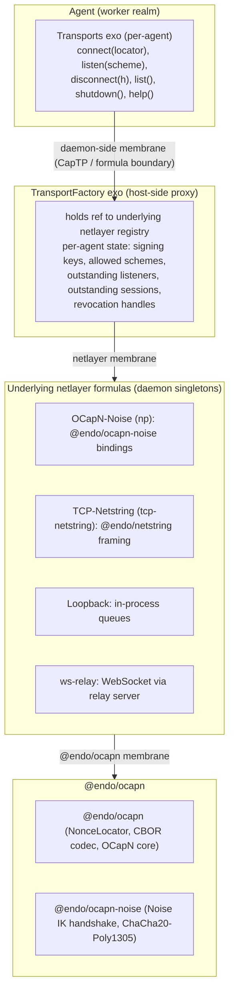

# OCapN integration with the daemon: per-agent `@transports`

| | |
|---|---|
| **Created** | 2026-05-07 |
| **Updated** | 2026-08-31 |
| **Author** | kriscendobot (prompted by kriskowal) |
| **Status** | Not Started |
| **Source** | Issue [endojs/endo-but-for-bots#118](https://github.com/endojs/endo-but-for-bots/issues/118) |
| **Supersedes** | the network-facing pieces of [daemon-agent-network-identity](daemon-agent-network-identity.md) (per-agent `NETS`; `registerAgentKey`/`unregisterAgentKey`) |

## What is the Problem Being Solved?

The daemon today exposes the OCapN-adjacent network surface as a single
host-wide `@nets` capability.
`packages/daemon/src/host.js` and `packages/daemon/src/guest.js` both
inject the same `networksDirectoryId` under the special name `@nets`,
which resolves to a daemon-singleton directory of named netlayer
formulas (loopback, ws-relay, tcp-netstring, iroh, and, since
2026-08-25, a daemon-side OCapN-Noise netlayer,
`packages/daemon/src/networks/ocapn.js`, registered at `@nets/ocapn`
by `setup-ocapn.js`).
Every agent the daemon hosts sees the same registry, can list every
registered net, and can connect through every net the daemon knows
about.

The just-consolidated OCapN-Noise stack
(Issue [endojs/endo-but-for-bots#118](https://github.com/endojs/endo-but-for-bots/issues/118)
item (a), folding PRs
[endojs/endo-but-for-bots#111](https://github.com/endojs/endo-but-for-bots/pull/111),
[endojs/endo-but-for-bots#112](https://github.com/endojs/endo-but-for-bots/pull/112),
[endojs/endo-but-for-bots#113](https://github.com/endojs/endo-but-for-bots/pull/113)
into `llm`, the repository's integration branch) introduces a real,
mutually authenticated transport family for the daemon to mediate.
Bringing that stack online while keeping `@nets` as the agent-facing
surface would fix the singleton problem in the wrong layer and would
foreclose several capabilities-discipline properties the daemon should
preserve.

The limitations of `@nets` as a singleton are:

1. **No scoping.**
   Every agent sees every net.
   A guest cannot be granted access to a Noise session over a private
   substrate while being denied the public WebSocket relay; both
   live on the same `@nets` directory.

2. **No revocation.**
   Removing a net from `@nets` affects every agent at once.
   There is no per-agent kill-switch for a network capability that
   was over-granted, and no way for an agent to drop its own
   transports without reaching into a shared directory.

3. **No per-agent identity.**
   The Ed25519 signing key for OCapN-Noise is materialized inside
   the netlayer formula, which is shared.
   An agent cannot present a distinct network identity from its
   sibling without instantiating a separate netlayer, which then
   conflicts with the singleton structure.

4. **Lifetime mismatch.**
   `@nets` is tied to the daemon's lifetime.
   An agent's network access does not end when the agent is
   disincarnated, restarted, or revoked; it merely becomes
   unreachable through one path.
   Sockets, listeners, and Noise sessions remain bound to the
   shared directory.

5. **No composition with mounts and other agent caps.**
   Other agent-held capabilities (`@main`, `@host`, `Mount` from
   `daemon-mount`) live inside the agent's confinement boundary.
   `@nets` punches a hole in that boundary by exposing the host's
   network registry directly.
   The cap-handoff pattern used by `provideMount` and (per the
   in-flight `feat/platform-fs` work) `daemon-mount`/`platform-fs`
   integration does not apply here.

## Goals and Scope

### Goals

- Replace the host-singleton `@nets` directory with a per-agent
  `@transports` capability that the daemon mints on the agent's
  behalf.
- Preserve OCapN-Noise IK netlayer compatibility with the
  consolidated
  [endojs/endo-but-for-bots#111](https://github.com/endojs/endo-but-for-bots/pull/111)/[endojs/endo-but-for-bots#112](https://github.com/endojs/endo-but-for-bots/pull/112)/[endojs/endo-but-for-bots#113](https://github.com/endojs/endo-but-for-bots/pull/113)
  stack. (Noise IK is the Noise Protocol Framework handshake pattern
  in which the **I**nitiator's static key is transmitted and the
  responder's static key is **K**nown to the initiator ahead of time,
  out-of-band; that out-of-band prior knowledge is what the inbound
  routing preamble below leans on. That tradeoff is expanded below,
  where the routing preamble is discussed.)
- Define the cap-handoff path: how the daemon manufactures
  per-agent transports, how an agent obtains them, how they are
  revoked, and how they cohabit with mounts and other agent-held
  caps.
- Reuse the in-guest-backend / host-side-proxy pattern (the agent
  holds a facade while the daemon holds the real backend and proxies
  between them; glossed in *Daemon Side: `TransportFactory`*) from the
  cross-platform sandbox work (jcorbin, `PLAN/endo_posix_sandbox.md`)
  and the agent-held + daemon-mediated pattern from the in-flight
  `Mount` reshape
  (PR [endojs/endo-but-for-bots#122](https://github.com/endojs/endo-but-for-bots/pull/122),
  `designs/platform-fs-daemon-integration.md`
  on `feat/platform-fs`).

### Out of Scope

- OCapN spec changes; the wire format and locator structure are
  governed by `ocapn-network-transport-separation` and
  `ocapn-noise-network`, both of which are upstream of this design.
- Cross-language transport adapters (a Go or Rust daemon's
  `@transports` is its own concern; the JS daemon ships first).
- New transport schemes (QUIC, WebTransport).
  Schemes are added in their own designs; the `@transports`
  envelope must accommodate them but does not specify them.
- Cross-peer revocation propagation (when a remote daemon revokes
  a session, how the local daemon learns of it).
  The OCapN GC story handles session liveness; this design covers
  the local cap-handoff only.

## Design

### Capability Surface

#### Agent Side: `Transports`

Each agent holds a single `Transports` exo, registered in its
pet store under the special name `@transports`.
The exo presents these methods:

```js
const TransportsInterface = M.interface('Transports', {
  // Discovery
  list: M.call().returns(M.promise()),                // -> string[] (available scheme names)
  has: M.call(M.string()).returns(M.promise()),        // scheme -> boolean

  // Outgoing sessions
  connect: M.call(M.any())                             // Locator: ed25519 public key + connection hint
    .optional(M.record())                              // { hints? } dial overrides; see below
    .returns(M.promise()),                             // -> Session

  // Incoming sessions
  listen: M.call(M.string())                           // scheme
    .optional(M.record())                              // { port?, host? }
    .returns(M.promise()),                             // -> Listener

  // Lifecycle
  disconnect: M.call(M.any()).returns(M.promise()),    // a Session or Listener (from connect/listen)
  shutdown: M.call().returns(M.promise()),

  help: M.call().optional(M.string()).returns(M.string()), // optional topic, matching sibling interfaces
});
```

The shape mirrors the `OcapnNetwork` interface defined in
`designs/ocapn-network-transport-separation.md` but is a per-agent
surface, not a host-singleton.
A `Session` is the same authenticated, encrypted CapTP-bearing
session that `OcapnNetwork.connect` returns, and a `Listener`
delivers `Session` instances over a name-changes-style follow.

The `handle` that `disconnect` accepts **is** a `Session` or a
`Listener` (the very value `connect` or `listen` returned), not a
separate opaque id. `disconnect(session)` drops that one session;
`disconnect(listener)` stops that one listener (and, being the
narrowest teardown, is what the CLI's per-handle `revoke` verb fronts,
Design Decision #9). The `M.any()` guard on the parameter is only
because `Session`/`Listener` are remotable exos rather than a matcher
literal; semantically the input shape of `disconnect` is exactly the
output shape of `connect`/`listen`.

The `Session`/`Listener` exos handed back do **not** carry their own
`close()`/`disconnect()` method: teardown routes solely through the
parent `Transports.disconnect(handle)`. This deliberately diverges from
the lower-layer `TransportListener.close()` /
`OcapnNoiseTransport.shutdown()` in
`ocapn-network-transport-separation`; centralizing teardown on the
per-agent view keeps revocation, accounting, and the
`thisDiesIfThatDies` bookkeeping in one place rather than spelling the
same teardown at two adjacent layers, at the cost of one extra hop.

`connect`'s optional second argument, `{ hints? }`, does **not**
duplicate the locator's own embedded connection hint (Design Decision
#4): the locator's hint is the *default* dial target the peer
advertised, and `hints` is a per-call **override/supplement** the
caller supplies when it has better local knowledge (a specific relay
to prefer, an alternate host:port for the same identity). Precedence
is caller-first: a field present in `hints` overrides the same field
read out of the locator; fields absent from `hints` fall back to the
locator's hint. The routing target (the Ed25519 public key) is
**never** taken from `hints`; it comes only from the locator and stays
authoritative for routing (Design Decision #4). A caller that has
nothing to override omits the argument entirely and dials on the
locator's hint alone.

`list()` enumerates the transport **schemes** this agent may use
(the direct replacement for enumerating the old `@nets` directory):
it returns an array of scheme-name strings such as `['np',
'tcp-netstring']` (`np` is OCapN-Noise; the schemes are glossed in the
list under *Daemon Side: `TransportFactory`*), filtered to the agent's
`allowedSchemes`. It does
not return peer `Locator`s (a peer address is supplied *to*
`connect`, not enumerated by `list`), and `has(scheme)` is the
membership test for the same set. This is the single return-shape
statement for `list()`; Design Decision #10's "the host reaches
netlayers through `@transports.list()`" refers to this same
scheme enumeration.

#### Daemon Side: `TransportFactory`

`HostInterface` (`packages/daemon/src/interfaces.js`) gains:

```js
provideTransports(petName, options): Promise<Transports>
updateTransportsPolicy(petName, policyPatch): Promise<void>
revokeTransports(petName): Promise<void>
registerNetwork(scheme, networkServiceId): Promise<void>
```

`registerNetwork` is the host-privileged write side of the
daemon-internal netlayer registry, the cutover replacement for the
bootstrap scripts' `move(..., ['@nets', X])` (see *Netlayer
Registration Moves to a Host-Internal Path*); it is never reachable
from an agent's `@transports`.

`revokeTransports(petName)` is the host-side, whole-agent
kill-switch: it tears down the named agent's entire `Transports`
view: every outstanding listener and session fails, the agent's
per-agent signing keys are de-registered from the shared netlayers'
inbound demux, and subsequent `connect`/`listen` calls on that
view reject. It is the coarse counterpart to the agent-side
`disconnect(handle)` (drops one session) and `shutdown()` (agent
retires its own view); `revokeTransports` is the only one a *host*
can invoke against an agent it no longer trusts. Sibling agents are
unaffected. It is idempotent: revoking an already-revoked or
never-provisioned petName resolves without error. (The CLI's
per-handle `endo transports revoke <handle> --as <agent>` in Design
Decision #9 is the finer-grained, agent-facing verb and fronts
`disconnect(handle)`, not this host method; the two share the word
"revoke" for deliberately different granularities.)

where `provideTransports`'s `options` carries:

- `allowedSchemes`: `['np', 'tcp-netstring', ...]`. The schemes the
  agent may use; defaults to the host's currently-enabled set.
- `signingKeys`: optional, defaults to a fresh per-agent Ed25519
  pair (see `daemon-agent-network-identity`); a host may supply
  its own keys for agents that need a stable network identity.
- `listenPolicy`: `'none' | 'allow'`. Whether the agent may open
  listening sockets (`'allow'`) or may not listen at all (`'none'`).
  A third, daemon-mediated `'request'` mode (the agent asks and the
  daemon opens a listener on its behalf, subject to approval) is
  deliberately **not** specified here: its request/approval workflow
  (what `listen()` returns while a request is pending, who resolves
  it, how the daemon records the pending grant) is its own design and
  is deferred to future work rather than named as an enum value with
  no mechanism behind it.
- `outboundPolicy`: optional address allowlist or matcher.
- `delegateFrom`: optional parent petName; present only when this
  view is a delegated child (Design Decision #9). Its policy fields
  narrow, never widen, the parent's grant.

These fields split into two lifecycles: `signingKeys` is **durable
identity** (persisted across restart per *Daemon Restart*, and
deliberately preserved for delegated children per Design Decision #9),
while `allowedSchemes`/`listenPolicy`/`outboundPolicy` are **revisable
policy** an operator narrows or tightens mid-lifetime. Because those
lifecycles differ, policy is revised through its own method rather
than by re-formulating identity. See Design Decision #11 for
`updateTransportsPolicy` and the semantics of re-calling
`provideTransports` on an already-provisioned petName.

The host side wraps each agent's `Transports` exo over the
daemon's underlying network primitives.
The wrapper is the host-side proxy in the in-guest-backend /
host-side-proxy pattern: the agent holds the facade, the daemon
holds the actual netlayer instances and routes between them.

Each underlying transport is a **single shared instance per
scheme**, not one instance per agent.
Every agent that uses a given transport shares that transport
instance, which listens on **one per-transport port** (not a
per-agent port) and is responsible for **relaying each incoming
session to the owning agent by the peer's Ed25519 public key**.
Routing is on Ed25519 identity throughout: every transport must be
able to demultiplex sessions by public key.

For inbound Noise IK sessions this demultiplexing must happen
*before* the handshake completes: the responder static key is the
owning agent's per-agent identity, so the daemon has to select the
correct agent's private key before it can decrypt the initiator's
first handshake message. The transport therefore carries the
target agent's Ed25519 public key in an unencrypted routing
preamble ahead of the Noise handshake (an SNI-style selector); the
daemon looks up the owning local agent and its responder key from
that preamble and hands the session to that agent's `Transports`
view. It does not trial-decrypt against every local agent's key,
so inbound dispatch stays O(1) in the number of hosted agents. The
concrete preamble framing is fixed in the implementation PR
against the `ocapn-noise-network` netlayer (see *Affected
Packages*).

The identity-routed-throughout claim applies to every shared scheme,
but the selector each scheme carries differs and is not a Noise-only
mechanism:

- **`np` (OCapN-Noise):** the unencrypted SNI-style preamble above,
  read before the handshake because the responder key selects the
  decryption key.
- **`tcp-netstring`:** the target agent's Ed25519 public key rides as
  a leading netstring-framed selector frame ahead of the CapTP
  stream, read by the shared listener to pick the owning agent. No
  pre-handshake constraint applies (the scheme is not Noise-wrapped),
  so the selector is an ordinary first frame rather than a preamble.
- **`ws-relay`:** the relay already keys connections by identity, so
  the selector is the relay's per-identity route; the shared listener
  reads the target key from the relay envelope.
- **`loopback`:** no wire selector at all; the proxy resolves the
  destination local agent directly from the locator before dispatch
  (see *Capability Sharing Across Agents (Same-Daemon)*).

A scheme that cannot carry such a selector cannot support per-agent
`listen()` over a shared port and is out of scope until it can; the
schemes above all can, so the shared-port design holds for the active
set. Only the `np` preamble is pre-handshake and therefore incurs the
cleartext-identity tradeoff below; the other selectors are ordinary
in-band routing frames.

**Tradeoff: the routing preamble exposes the target identity in
cleartext.** The SNI-style selector carries the target agent's
Ed25519 public key unencrypted, ahead of the Noise handshake, so any
on-path observer learns *which agent, by identity,* a given inbound
session addresses before encryption begins. This is the same
metadata leak plaintext-SNI is known for, and it does cut against the
scoping/isolation framing elsewhere in this design (the *No scoping*
limitation, Limitation #1): identity-based routing that puts the
identity on the wire is a weaker confidentiality property than one that
hides it.

The design accepts the leak deliberately, having weighed it against the
adversary the paragraph names first: a **passive on-path observer**.
That observer gains something real and new. It can read, per inbound
session, *which agent identity* is being addressed, and can correlate
traffic to a specific identity over time, none of which it could do
before this preamble existed. The one bound on the harm is narrow and
applies only to an *active* party: a would-be **initiator** already had
to know the responder's static key out-of-band to attempt Noise **IK**
at all, so against that party the preamble reveals nothing the protocol
was keeping secret. That bound does **not** cover the passive
eavesdropper, who never needed the key to watch the wire; against it the
leak is a genuine metadata exposure, accepted rather than argued away.
What makes it acceptable is the second, independent ground: the
alternative that would hide the identity from a passive observer
(trial-decryption against every local agent's responder key)
reintroduces the O(hosted-agents) inbound cost this selector exists to
remove and still leaks timing, so hiding it is not free even in the
alternative. What the leak does *not* weaken is the scoping property
this design closes (Limitation #1, *No scoping*): an observer learning
*whom* a session addresses does not let a guest *reach* a scheme or peer
its `allowedSchemes`/`outboundPolicy` denies: routing visibility is not
routing authority. Hiding the responder
selector (e.g. a blinded or rendezvous-style identifier) is possible
but is a wire-format concern owned by `ocapn-noise-network`, out of
scope here; this design records the exposure rather than silently
trading it for the dispatch win.

The per-agent `Transports` exo is therefore a scoped *view* over
shared, identity-routed transport instances. It isolates
discovery, revocation, accounting, and identity per agent while
the physical socket, port, and connection coalescing stay shared.

### Layer Cake



Each edge the diagram labels *membrane* is a capability boundary: a
CapTP/formula or netlayer interface an object reference crosses (and is
mediated at) but that plain data does not traverse transparently.
"Membrane" is this codebase's standing name for such a boundary; it is
a structural label here, not a new mechanism this design introduces.

The daemon retains the netlayer registry; the agent never sees it.
The agent sees only the `Transports` exo, which decides per-call
which netlayer to dispatch to based on locator scheme and policy.

### Lifecycle

#### Creation

When an agent is formulated (`makeHost`, `makeGuest`), the daemon
calls the same public host method that mints any transports view,
`provideTransports(petName, options)` (*Capability Surface*, Daemon
Side), instead of injecting `networksDirectoryId` under `@nets`.
Birth-time provisioning is not a distinct primitive: it is a
`provideTransports` of the new agent's petName, which is fresh and so
never trips Design Decision #11's reject-on-already-provisioned rule.
Internally `provideTransports` formulates the durable `Transports`
formula (there is no separately-named `formulateTransports`
primitive), and the resulting `transportsId` is stored under
`@transports` in the agent's special-store map.
The formulation is durable (a new `Transports` formula type) so
that the cap survives daemon restart with the same identity but
fresh socket state.

`@nets` is not provided at all, neither to new agents nor to
existing ones.
The agent-facing surface is `@transports` outright: there is no
`@nets`/`@transports` coexistence window.
`@nets` is not widely deployed, so a staged migration is
unnecessary; the swap is a single cutover (see *Replacing
`@nets`*).

#### Revocation

Two granularities:

1. **Per-handle**: the agent calls `disconnect(handle)` to drop a
   single session or listener.
   The daemon-side proxy invalidates that handle's underlying
   socket and any CapTP-level references hanging off it.

2. **Per-agent**: `shutdown()` revokes the entire `Transports`
   capability.
   The daemon may also call into the proxy from outside (e.g.,
   when the host disinherits the agent) to force a shutdown
   regardless of agent cooperation.

Sibling agents are unaffected.
The host's underlying netlayers continue to serve other
`Transports` proxies.

#### Garbage Collection

A `Transports` proxy participates in the daemon's existing
`thisDiesIfThatDies` chain.
When the agent dies, its proxy dies, which cascades to outstanding
sockets and listeners.
Underlying netlayer formulas have no incoming reference from the
proxy; they are pinned by the daemon's `@endo` formula and
collected only at daemon shutdown.

When a shared transport *instance* is itself collected (its
formula garbage-collected and the instance consequently
cancelled/disincarnated) it must **close all of its sessions**,
so that every presence and promise carried over those sessions is
partitioned/rejected.
This is the one revocation invariant this design owes the wider
session-partitioning story (see *Cross-peer revocation
propagation* under Out of Scope, Future Work).

#### Daemon Restart

Per-agent signing keys are persisted with the `Transports`
formula's deferred-task params so that the restored agent presents
the same network identity.
Outstanding sessions do not persist; they are re-established on
demand.
Listeners re-bind to their configured ports if the host policy
permits; otherwise the agent must re-call `listen()`.

### Capability Sharing Across Agents (Same-Daemon)

When two agents within the same daemon need to talk over the same
Noise session, they do not coordinate via the `Transports` exo.
The daemon brokers internally:

- Agent A calls `connect(locatorB)` against its `Transports`.
- The proxy resolves `locatorB` to a local agent and returns a
  loopback session (no Noise handshake; in-process direct cap
  forwarding).

The loopback shortcut is a delivery optimization, **not** a policy
bypass: A's `outboundPolicy` and `allowedSchemes` still gate the call
before the fast path is taken. Because the loopback substitution
happens for a locator whose nominal scheme A was permitted to dial,
the proxy evaluates the standing checks against that locator (the
`loopback` scheme must be in A's `allowedSchemes`, and A's
`outboundPolicy` must admit the sibling's connection hint) *before*
resolving to in-process delivery; a denial rejects exactly as it
would on the wire path. This preserves the *No scoping* property
(Limitation #1): a guest denied a sibling by policy cannot reach it
merely because both live on the same daemon.

The cross-daemon counterpart (two agents on different daemons,
each holding its own Noise session over the shared wire) is
covered under *Capability Sharing Across Agents (Cross-Daemon)*
below.

The netlayer is responsible for connection coalescing (one Noise
socket carrying CapTP for many local-agent sessions); the
`Transports` proxy presents an independent session per agent so
that revocation, accounting, and identity remain per-agent.

### Replacing `@nets`

`@nets` is not widely deployed, so there is no migration window,
no shadowing, and no deprecation period: `@transports` replaces
`@nets` in a single cutover, all in the one change.

"Not widely deployed" justifies skipping a *migration window*, not
skipping *coordination*. The cutover is **atomic**: everything that
touches the old `@nets` name lands in the **same PR/commit**, so there
is no interval in which `@transports` exists while a caller still
reaches for `@nets`. That same-change boundary explicitly includes the
two injection-site removals (`host.js`/`guest.js`), the four netlayer
setup scripts, the four host-privileged chat slash-commands in
`command-executor.js`, and the six test fixtures (all enumerated under
*Internal Callers Move to `@transports`*), plus the three bundled
production agents (Lal, Fae, Familiar; *Upgrade Considerations*). None
of these surfaces may lag the cutover, because each would throw the
moment `@nets` names nothing. If the whole set cannot land atomically
the cutover is not taken: there is no partial-cutover state, and
rollback is reverting the single change. This is the sequencing/
atomicity guarantee the "not widely deployed" premise leans on, stated
rather than assumed.

#### Agents Get `@transports`, Not `@nets`

Add a `Transports` formula type and a `provideTransports` host
method.
Formulation populates `@transports`; `@nets` is never injected.
There is no dual-population and no agent-side
`@transports`-then-`@nets` fallback probe.

#### Internal Callers Move to `@transports`

The current callers of the literal `@nets` name, from
`grep -rn '@nets' --include=*.js packages/` (scope: every JS file
under `packages/`, source and test) at this PR's base, are:

- **Injection sites** (`host.js:499`, `guest.js:102`): the two
  `specialNames['@nets'] = networksDirectoryId` writes removed by
  *`@nets` Injection Is Removed* below.
- **Netlayer bootstrap scripts** (`networks/setup-{tcp,ws-relay,
  ocapn,iroh}.js`): the `E(powers).move(..., ['@nets', X])`
  registrations retargeted onto `registerNetwork` (see *Netlayer
  Registration Moves to a Host-Internal Path*).
- **Chat slash-commands in `packages/spaces-util/src/command-executor.js`**
  (`command-executor.js:731`, `:770`, `:803`, `:849`): four live,
  non-test, host-privileged `E(powers).move([...], ['@nets', scheme])`
  write sites backing the `/network`, `/network-ocapn`,
  `/network-iroh`, and `/network-ws-relay` commands. These are the
  same registration pattern as the setup scripts and **must retarget
  onto `registerNetwork` in the same cutover**. With no `@nets`
  target to `move()` into, they would otherwise throw the moment the
  cutover lands. `packages/spaces-util/` is listed in *Affected
  Packages* accordingly.
- **Test fixtures** (`packages/daemon/test/{_multiplayer-suite,
  invite-retention-ocapn,endo,ws-relay,channel-relay}.js`,
  `packages/claude-sandbox/test/live-daemon.test.js`): updated to
  `@transports` in the same change.

Note that `manager.js` (the daemon core, formerly `daemon.js`,
renamed in the already-landed `daemon-rename-to-manager` work)
contains **no** literal `@nets` reference: `makePeer`
(`manager.js:6383`) and `getAllNetworkAddresses`
(`manager.js:6230`) take the `networksDirectoryId` id as a
parameter and never resolve the `@nets` pet name, so they need no
call-site edit. They already operate on the retained internal
registry. Agent-facing callers that previously listed nets and
selected one instead look up `@transports` and call
`connect(locator)`; `getAllNetworkAddresses` stays a
daemon-internal helper used by the `TransportFactory` proxy, not
surfaced to agents.

#### `@nets` Injection Is Removed

`@nets` is removed from `specialNames` in `host.js` (the
injection site is `host.js:499`) and `guest.js`.
The `networksDirectoryId` parameter remains on the formulation
path because the daemon still needs the underlying netlayer
registry; only the agent-facing surface is removed.

#### Netlayer Registration Moves to a Host-Internal Path

Removing the agent-facing `@nets` name also removes the path the
daemon's own bootstrap scripts use to *install* a netlayer today.
The four operational setup scripts
(`packages/daemon/src/networks/setup-{tcp,ws-relay,ocapn,iroh}.js`)
each register a network service by moving it into the `@nets`
directory of an agent's powers:
`E(powers).move(['network-service-X'], ['@nets', 'X'])` under
`--powers @agent`. This is how the `ocapn.js` netlayer this design
repurposes gets registered (`setup-ocapn.js`). Once `@nets` names
nothing in any pet store, that `move()` target no longer resolves,
so registration must retarget the daemon-internal registry that the
retained `networksDirectoryId` designates.

The registry keeps a **write side** distinct from the agent-facing
read side. `@transports.list()`/`has()` are read-only scheme
enumeration for agents (per *Capability Surface*); installing a
netlayer is a **host-privileged** operation, never reachable from an
agent's `@transports`. The daemon exposes it as a host method on
`HostInterface` alongside `provideTransports`:

```js
registerNetwork(scheme, networkServiceId): Promise<void>
```

which moves the named network service into the daemon's internal
netlayer registry (the directory `networksDirectoryId` designates)
under `scheme`. The setup scripts change their one `move()` call
from `E(powers).move(['network-service-X'], ['@nets', 'X'])` to
`E(host).registerNetwork('X', networkServiceId)` (reached through
`@host`, which survives the cutover), so a netlayer is installed
without any agent-visible `@nets` directory. The
`TransportFactory` proxy then dispatches over whatever schemes the
registry holds, and `@transports.list()` reflects the resulting set.
Registration stays host-only: an agent can neither enumerate the
registry's write side nor install a netlayer, only use the schemes
its policy allows.

#### Per-Agent Signing Keys

With `@transports` in place, the per-agent Ed25519 key path
(blocked today on the singleton) becomes natural.
This design **supersedes** the network-facing pieces of
`daemon-agent-network-identity` (Status: In Progress). That design
enumerates four pieces of work; its two already-done pieces (locator
construction with agent keys, its item #1, and `LOCAL_NODE` formula
storage, item #2) are independent groundwork this design builds on
(the `@keypair` per-agent keypairs they landed are exactly what
`signingKeys` reuses). Its two **not-yet-done** network pieces are the
ones `@transports` replaces, differently shaped: the per-agent `NETS`
special name (its item #3) becomes the per-agent `Transports` view, and
its `registerAgentKey`/`unregisterAgentKey` network-registration
interface (item #4) is subsumed by the `TransportFactory`'s per-agent
signing-key registration/de-registration against the shared netlayers'
inbound demux (*Daemon Side: `TransportFactory`*). The two designs land
together, with `@transports` as the per-agent network-identity surface
and `daemon-agent-network-identity` thereby reduced to its completed
keypair groundwork (see this design's **Supersedes** metadata).

### Capability Sharing Across Agents (Cross-Daemon)

Two daemons connecting over OCapN-Noise:

- Daemon X's agent A calls `connect(locator)` where `locator`
  designates an agent B on daemon Y.
- A's `Transports` proxy on X dispatches to the `np` netlayer.
- The `np` netlayer either reuses an existing Noise session to
  Y (if X and Y are already connected) or initiates a new Noise
  IK handshake.
- The session delivers a CapTP channel scoped to A and B; other
  agents on X with their own sessions to agents on Y reuse the
  same Noise session at the wire level but hold independent
  CapTP channels at the cap level.

This matches the `OcapnNetwork` model from
`ocapn-network-transport-separation`; the per-agent layer sits
on top of (not in lieu of) the per-daemon netlayer.

## Affected Packages

- `packages/daemon/`: `host.js`, `guest.js`, `manager.js` (the
  daemon core, formerly `daemon.js`), `interfaces.js`,
  `types.d.ts`, `formula-type.js`, `help-text-data.js`, and the
  netlayer bootstrap scripts
  `networks/setup-{tcp,ws-relay,ocapn,iroh}.js` (retarget their
  `move(..., ['@nets', X])` onto `registerNetwork`, see *Netlayer
  Registration Moves to a Host-Internal Path*).
- `packages/spaces-util/`: `src/command-executor.js`. The
  `/network`, `/network-ocapn`, `/network-iroh`, and
  `/network-ws-relay` chat slash-commands each do
  `E(powers).move([...], ['@nets', scheme])` (`command-executor.js:731`,
  `:770`, `:803`, `:849`) and retarget onto `registerNetwork` in the
  same cutover (see *Internal Callers Move to `@transports`*); left
  unretargeted they throw once `@nets` names nothing.
- `packages/ocapn/`: must expose `OcapnNetwork` registration
  surface that the proxy consumes (depends on
  `ocapn-network-transport-separation`).
- `packages/ocapn-noise/`: no changes; bindings are consumed by
  the netlayer that the proxy fronts.
- `packages/daemon/src/networks/ocapn.js` + `setup-ocapn.js`
  (**daemon-side OCapN-Noise netlayer, already landed, repurposed, not
  rebuilt**). The `np` netlayer the proxy dispatches to already
  exists as this pair (protocol `ocapn+noise+tcp`, registered at
  `@nets/ocapn`), landed 2026-08-25, six days before this PR's
  base. This design does **not** introduce a parallel
  `packages/ocapn-noise-network/` package; it **repurposes** the
  landed `ocapn.js` netlayer as the shared per-daemon substrate
  that the per-agent `TransportFactory` proxy fronts. The
  implementation work is therefore wiring the proxy over the
  existing netlayer (per-agent signing-key registration/revocation,
  identity-routed inbound demux, much of which
  `@endo/ocapn-noise`'s `network.js` already provides via
  `addSigningKeys`/`removeSigningKeys` and its per-key `registeredKeys`
  map), not standing up a new netlayer. Where earlier references in
  this doc cite `ocapn-noise-network`, they name the design that
  motivated `ocapn.js`, not a package still to be built.
  Note that the shipped code (`packages/ocapn-noise`) and this
  design use Noise **IK**; the `ocapn-noise-network` design doc
  still describes Noise **XX** in places and is stale on that
  point. The IK handshake as implemented is authoritative, and the
  `ocapn-noise-network` doc is to be reconciled to IK. Do not
  reintroduce the `np` netlayer to the XX shape.
- `packages/cli/`: the per-agent transports verbs
  `endo transports [--listeners]`, `endo listen <scheme>`, and
  `endo revoke <handle>`, each addressed with the flat `--as <agent>`
  option, and the `endo mkguest <child> --transports-from <parent>`
  delegation flag (each bound to a named method, see Design Decision
  #9). No new `@nets`-shaped CLI surface is retired, because none exists
  today (Design Decision #10).

## Design Decisions

The questions raised during design review are resolved as follows
(the resolutions are directives from the review, not open choices).

1. **`Transports` is a formula.**
   It gets durability and named-pet-store presence for free at the
   cost of a formula boundary per method call, matching the `Mount`
   precedent.
   Restart handling is the deferred-task-params path in
   *Daemon Restart*; there is no exo-with-daemon-internals variant.

2. **The listen port is per-transport, not per-agent.**
   A transport *instance* is shared by all peers that use it and
   listens on **one** port; the physical transport relays each
   incoming session to the owning agent by the peer's Ed25519
   public key (see *Layer Cake*).
   There is therefore no 100-agents-100-ports pool to allocate and
   no per-agent port quota: `listen({ port: 0 })` binds (or reuses)
   the single per-transport port, and demultiplexing to agents is
   by identity, not by port.
   The `{ port?, host? }` argument on `listen` (and the CLI `listen`
   verb's `--port`/`--host` flags) is therefore an operator hint that
   configures **where the shared per-transport socket binds**, and it
   is honored only on that socket's **first** bind. A later agent's
   `listen` on an already-bound scheme registers that agent's Ed25519
   key for inbound demux on the existing shared socket and **ignores**
   any `port`/`host` it passes: the value cannot move an already-bound
   shared port, and honoring it per-agent would reintroduce the
   per-agent-port allocation this decision forecloses. The precedence
   is thus first-binder-wins, shared thereafter, never a silent
   per-agent rebind.

3. **Routing is on Ed25519 identity.**
   Inbound Noise sessions and outbound dials both route on the peer's
   Ed25519 public key: every shared transport demultiplexes inbound
   sessions by that key (*Daemon Side: `TransportFactory`*), the
   locator carries it as the authoritative routing target (Design
   Decision #4), and a delegated child forks a fresh key rather than
   sharing its parent's (Design Decision #9).

   This design does **not** unify with the daemon's *gateway* ingress
   (the gateway is the remote-access front end an operator reaches at
   `https://<host>/#agent=<id>`, authenticating a caller over CapTP by
   `GatewayBootstrap.fetch(token)`). The gateway's bearer-token
   boundary (`gateway-bearer-token-auth`) authenticates by presenting
   an agent's **formula identifier** (an opaque 256-bit capability
   secret, the same SSH-key/API-token authority model), which is *not*
   an Ed25519 public key and carries no Noise-style
   proof-of-possession. The two ingress paths therefore stay distinct:
   `Transports` routes `np` and its sibling schemes on Ed25519
   identity, while the gateway remains a separate bearer-secret
   surface. An earlier revision of this decision claimed the two
   "converge" on one identity; that claim is withdrawn as unsupported
   by `gateway-bearer-token-auth`, which ties the token to a formula
   identifier, not a key.

4. **`connect()` accepts a public key and a connection hint from
   the locator.**
   The locator supplies the peer's Ed25519 public key (the routing
   target) together with a connection hint (`tcp:host=...`, relay
   address, etc.).
   `connect` takes the locator (exo or serialized string) and
   reads the public key and hint out of it; the public key, not the
   hint, is authoritative for routing.
   `connect`'s optional `{ hints? }` second argument is a per-call
   override of the locator's connection hint only (caller-first
   precedence; see *Capability Surface*), never of the routing key.

5. **`outboundPolicy` is a concrete matcher.**
   The proxy enforces `outboundPolicy` against the locator's
   connection hint before dispatching.
   A minimal policy is a suffix-match allowlist, with CIDR support
   for IP hints:

   ```js
   const outboundPolicy = {
     // allow if the hint host matches any suffix...
     allowHostSuffixes: ['.internal.example', 'localhost'],
     // ...or falls in any CIDR block
     allowCidrs: ['10.0.0.0/8', 'fd00::/8'],
     // default when nothing matches
     otherwise: 'deny', // 'deny' | 'allow'
   };
   ```

   `connect(locator)` extracts the hint (`{ scheme, host, port }`) and
   requires a match in `allowHostSuffixes` or `allowCidrs`; a miss
   throws under `otherwise: 'deny'`.
   The routing target (the Ed25519 key) is not policy-checked here:
   `outboundPolicy` gates *where on the wire* the agent may dial,
   not *whom* it may address.

   Scheme gating has a **single source of truth**: the top-level
   `allowedSchemes` (*Capability Surface*, Daemon Side), revisable via
   `updateTransportsPolicy` (Design Decision #11). `outboundPolicy`
   deliberately carries **no** scheme axis of its own. An earlier
   revision duplicated it as `outboundPolicy.allowSchemes`, but that
   became redundant once `allowedSchemes` itself was made revisable
   (Design Decision #11): narrowing which schemes an agent may dial is
   now an `updateTransportsPolicy({ allowedSchemes })` call, so a second
   independently-settable allowlist over the same axis (and the
   precedence rule needed to reconcile the two) is removed. The scheme a
   locator names must be in `allowedSchemes`; `outboundPolicy` governs
   only host/CIDR.

6. **An unregistered scheme throws.**
   If the agent calls `connect(npLocator)` and the daemon has no
   `np` netlayer, `connect` rejects.
   Silent fallback is rejected as a cap-discipline violation.

7. **The proxy does not expose underlying netlayer versions or
   capabilities to the agent.**
   Leaking host configuration outweighs the diagnostic value.
   `help()` returns a static string (or, given an optional topic
   argument, a static topic-scoped string, matching the `help`
   signature every sibling daemon interface carries); there is no
   netlayer-capability introspection surface.

8. **Transports and `daemon-mount` stay independent for now.**
   A transport and a mount are both agent-held caps, but they do
   not share a revocation/audit surface in this design.
   A common surface is revisited when the capability-bus /
   capability-bank design lands (see *Capability bank
   integration*).

9. **The CLI is per-agent, and subagents can be created with
   delegated transports.**
   The verbs are flat top-level commands addressed with the
   established `--as <agent>` option: `endo transports [--listeners]
   --as <agent>`, `endo listen <scheme> --as <agent>`, and
   `endo revoke <handle> --as <agent>`. Each binds to a named method on
   the agent's `Transports` exo (*Capability Surface*).

   This reuses the CLI's one addressing convention. Every existing
   capability command in `packages/cli/src/endo.js` is a flat
   top-level verb that names "which agent" with `--as <agent>`
   (`commonOptions.as`, on `mount`, `mktmp`, `spawn`, `eval`); there is
   no `endo agent <name> ...` command group and no second-level command
   group anywhere in the CLI. An earlier revision grouped the verbs
   under a nested `endo agent <name> transports ...` prefix on the
   argument that they read as a cohesive subgroup; that argument
   applies equally to the paired verbs sibling capabilities already
   have (`mount`/`checkin`/`checkout`) yet none of those introduced a
   command group, so the transports verbs follow the flat convention
   too. A user who has learned "operations take `--as <agent>`" reaches
   transports the same way instead of a prefix that exists nowhere
   else. The `--as`-shaped delegation flag on `mkguest` (below) follows
   the same convention.
   - `endo transports [--listeners] --as <agent>` -> `list()`
     (enumerate the agent's allowed schemes) or, with `--listeners`,
     enumerate the agent's **outstanding listeners** by handle (see
     below). The bare form is scheme enumeration; `--listeners` is how
     an operator recovers the handles a later `revoke` names.
   - `endo listen <scheme> [--name NAME] [--port N] [--host H]
     --as <agent>` -> `listen(scheme, opts)`: the verb is named
     `listen` to map 1:1 onto the `listen()` method it fronts (an
     earlier revision spelled it `add`, which read as "grant a scheme"
     rather than "open a listener"; `listen` removes that ambiguity).
     It opens an inbound **listener** on a scheme, the durable, managed
     counterpart
     to a transient locator-driven `connect` (which the CLI does not
     surface as a verb: an outbound dial is issued by an agent from
     code with a locator in hand, not typed as a standing `transports`
     entry). Because each CLI verb is a **separate process**, `listen`
     cannot hand a later `revoke` an in-memory `Listener` exo: it
     instead **persists** the returned `Listener` in the agent's pet
     store under a stable handle (`--name`, defaulting to the scheme
     name, disambiguated with a suffix when a scheme has several
     listeners) and prints that handle to stdout. The handle is a
     durable pet name resolvable in any later invocation, not a
     process-local reference.
   - `endo revoke <handle> --as <agent>` -> `disconnect(handle)`:
     `<handle>` is the durable pet name `listen` printed (recoverable
     via `endo transports --listeners`); the CLI resolves it to the
     persisted `Listener` in
     the agent's pet store and drops that one session or listener. This
     is the fine-grained agent-facing verb, distinct from the host's
     whole-agent `revokeTransports` (see *Daemon Side*).

   It must be possible to create a subagent with **delegated**
   transports: a parent agent grants a subset of its transports
   (schemes, outbound policy, listen policy) to a child at
   formulation time, so delegation is a first-class CLI and API
   operation, not just host-minted provisioning. Its **named
   surface** is the same host method that mints any transports view,
   `provideTransports(childPetName, { delegateFrom: parentPetName,
   allowedSchemes, listenPolicy, outboundPolicy })`, invoked at
   subagent formulation with `delegateFrom` naming the parent and the
   policy fields narrowing (never widening) the parent's grant; the
   daemon rejects any field that exceeds the parent's. This is a
   `provideTransports` of a **new** child petName, so it does not
   collide with the reject-on-existing rule of Design Decision #11. The CLI
   spelling is a flag on the subagent-creation command
   (`endo mkguest <child> --transports-from <parent>
   [--schemes np,tcp-netstring] [--listen none|allow]
   [--outbound <policy>]`), not the `listen` verb above: `listen`
   operates on an existing agent's own view, delegation provisions a
   child's.
   The delegated child gets its **own fresh** per-agent Ed25519
   identity (a distinct `Transports` capability provisioned with a
   narrowed slice of the parent's policy), not a share of the
   parent's signing key. Because routing, revocation, and demux all
   key on Ed25519 identity (Design Decision #3), sharing the parent's key
   would collapse the child's sessions when the parent is revoked
   or `shutdown()`, violating the per-agent isolation this design
   rests on. With a forked identity the child survives parent
   revocation; the parent-to-child liveness edge is instead carried
   by the formulation `thisDiesIfThatDies` chain (see *Garbage
   Collection*), so disincarnating the parent still cascades to the
   child, but revoking the parent's *transports* does not.

10. **`@nets` is retired.**
    `@nets` is not kept as a host-only special name.
    The host reads the available schemes through
    `@transports.list()` and installs netlayers through the
    host-only `registerNetwork(scheme, networkServiceId)` method
    (the daemon-internal registry's write side, see *Netlayer
    Registration Moves to a Host-Internal Path*); there is no
    surviving directory-shaped `@nets` view for any agent, host
    included.
    The cutover (see *Replacing `@nets`*) removes `@nets`
    outright, with no deprecation window.
    There is no `endo nets` CLI command to retire: no such command
    exists in `packages/cli/src/endo.js` today (`@nets` was reached
    only through the generic pet-store verbs and the host-privileged
    `move()` sites, not a dedicated `nets` verb), so the CLI change is
    purely the *addition* of the transports verbs above, not a
    retirement.

11. **Policy is revised without regenerating identity;
    re-`provideTransports` is a reject, not a silent re-mint.**
    `provideTransports` bundles a durable identity (`signingKeys`)
    with revisable policy (`allowedSchemes`/`listenPolicy`/
    `outboundPolicy`), which have different natural lifecycles:
    tightening an allowlist or narrowing a scheme grant is the exact
    mid-lifetime operation Limitation #2 ("No revocation") motivates,
    while the identity must stay put so peers keep recognizing the
    agent (and so a delegated child's identity is not disturbed by the
    parent's, Design Decision #9). So the host exposes a dedicated
    `updateTransportsPolicy(petName, policyPatch)` that replaces the
    policy fields on an existing `Transports` in place (same formula,
    same `signingKeys`, same durable identity) and takes effect on
    subsequent `connect`/`listen` calls (in-flight sessions already
    admitted are not retroactively torn down; a tightening operator
    who needs immediate teardown uses `revokeTransports`). Narrowing
    a policy therefore never requires round-tripping the old signing
    keys back through a re-provision. Correspondingly,
    `provideTransports` on a petName that is **already provisioned
    rejects** rather than replacing in place or silently minting a
    fresh identity: it is provisioning, not update. Re-provisioning
    from scratch is `revokeTransports(petName)` (which tears the old
    view down, identity included) followed by a fresh
    `provideTransports`; the two-call shape makes the identity
    discontinuity explicit at the call site rather than hiding it
    inside an overloaded formulate.

## Out of Scope, Future Work

- **Cross-language transport adapters.**
  The `endor` Rust daemon will need its own `@transports`
  implementation; the cap surface should be portable but the
  implementation is per-runtime.
  Concretely, `endor` should be able to benefit from transports
  implemented in Node.js workers, and this design should be
  integrated well enough to make that path available **for parity
  testing**: the JS-worker transport is the reference the Rust
  runtime is checked against, not a throwaway.

- **Alternative transports (QUIC, WebTransport, Tor).**
  Each is its own design and is left as an exercise for the
  future; some of these are intended for future support.
  The `@transports` envelope must accept any scheme the
  netlayer registry supports.

- **Cross-peer revocation propagation.**
  This is orthogonal to this change.
  The daemon supports multiple levels of revocation, and OCapN
  (and other CapTPs) are responsible for ensuring that session
  termination both revokes all pending promises over the session
  and partitions presences.
  Partitioning presences is not yet visible, and there are designs
  in flight to address that; this change need not carry the
  concern, **except** for one invariant that *is* in scope: when a
  transport's formula is collected and its instance is consequently
  cancelled/disincarnated, it must **close all of its sessions**,
  so that every presence and promise carried over them is
  partitioned/rejected.
  (When daemon Y revokes agent B, agent A on daemon X may still
  hold a `Session` handle; today that session simply fails on next
  message, and a future design may add a revocation notification
  channel.)

- **Fine-grained per-locator policy.**
  Today the `outboundPolicy` is a single allowlist (per Design
  Decision #5).
  Per-target rate limits, audit logging, and budget enforcement
  are deferred to a **follow-up design planned upon completion of
  this change**.

- **Capability bank integration.**
  The capability bank is an abstract requirement: it does not
  impose requirements on this proposal other than that it should
  exist.
  When `daemon-capability-bank` (M5) lands, `@transports` becomes
  one of the capabilities the bank manages, alongside `@mount`,
  `@timer`, etc.
  This design does not pre-empt that integration; the `Transports`
  exo is shaped to fit a future bank surface.

## Test Plan

Concrete tests come with the implementation PR.
Shape only:

- **Unit: `Transports` exo.**
  Mock `TransportFactory`; verify `connect`, `listen`,
  `disconnect`, `shutdown` dispatch, and revocation.

- **Integration: per-agent isolation.**
  Two agents on the same daemon, each with `@transports`.
  Agent A's `shutdown()` does not affect agent B's sessions.
  Agent A cannot enumerate agent B's listeners.

- **Integration: per-agent identity.**
  Two agents present distinct Ed25519 identities to a remote
  peer.
  The remote sees two distinct `OcapnLocation` designators.

- **Integration: inbound identity demux (Design Decision #2).**
  Two agents both `listen()` on the same shared per-transport
  port. An inbound session addressed to agent A's Ed25519 key is
  delivered only to A's `Transports` view and never to B, and a
  session addressed to B never reaches A. Exercises the shared
  socket / identity-routed demultiplexing that Design Decision #2
  rests on (the inverse of the outbound "per-agent identity" case
  above).

- **Integration: revocation.**
  Host calls `revokeTransports(petName)`; agent's outstanding
  sessions fail; sibling agents unaffected.

- **Integration: shared-transport-instance collection closes its
  sessions (Garbage Collection).**
  Two agents hold sessions over one shared transport instance; drive
  that instance's formula to collection (cancellation/disincarnation)
  and assert **every** session it carried is closed, so the presences
  and promises over them are partitioned/rejected. Exercises the one
  GC-adjacent revocation invariant this design explicitly owns
  (*Garbage Collection*; *Cross-peer revocation propagation* under Out
  of Scope, Future Work), the invariant the design's own prose calls
  out but which no other test bullet covers.

- **Integration: daemon restart.**
  Agent's `Transports` formula restores; signing keys
  preserved; outstanding sessions are not preserved (correct
  behavior, documented).

- **Integration: `@nets` is gone.**
  A formulated agent exposes `@transports` and no `@nets`;
  a lookup of `@nets` fails (there is no coexistence window to
  test; the cutover is complete).

- **Integration: cross-agent loopback.**
  Two local agents connect via `connect(locatorOfSibling)`;
  no Noise handshake; in-process delivery.

- **Integration: cross-daemon Noise.**
  Two daemons, each with one agent; A connects to B over `np`
  netlayer; CapTP message round-trips.

- **Unit: `outboundPolicy` matcher (Design Decision #5).**
  Drive the matcher directly: a hint whose host matches
  `allowHostSuffixes` connects; one in an `allowCidrs` block
  connects; a hint matching neither suffix nor CIDR throws under
  `otherwise: 'deny'` and connects under `otherwise: 'allow'`. Confirms
  the gate runs on the locator's connection hint (the wire target),
  never on the Ed25519 routing key, and carries **no** scheme axis of
  its own (scheme gating is the top-level `allowedSchemes`, exercised
  by the policy-update test below).

- **Integration: unregistered scheme throws (Design Decision #6).**
  With no `np` netlayer registered, `connect(npLocator)` rejects;
  assert no silent fallback to another scheme. Symmetrically,
  `listen('np')` rejects.

- **Integration: privilege separation of `registerNetwork`.**
  An agent's `@transports` view exposes no way to install a
  netlayer: assert `registerNetwork` is absent from the
  `Transports` interface and is reachable only as a host method on
  `@host`; a formulated agent holding only `@transports` cannot
  enumerate or write the daemon-internal registry, only use the
  schemes its policy allows (see *Netlayer Registration Moves to a
  Host-Internal Path*, Design Decision #10).

- **Integration: delegated subagent transports (Design Decision #9).**
  A parent provisioned with `['np', 'tcp-netstring']` delegates via
  `provideTransports(child, { delegateFrom: parent, allowedSchemes:
  ['np'] })`: assert the child gets a **fresh** Ed25519 identity
  distinct from the parent's (a remote peer sees two designators),
  that a delegation attempting to widen beyond the parent's grant
  (e.g. `allowedSchemes: ['np','tcp-netstring','iroh']`) is rejected,
  and (the asymmetric liveness/revocation split) that
  `revokeTransports(parent)` leaves the child's sessions **alive**
  (forked identity) while disincarnating the parent agent **cascades**
  to the child through the `thisDiesIfThatDies` chain (see *Garbage
  Collection*).

- **Integration: policy update preserves identity (Design Decision #11).**
  `updateTransportsPolicy(agent, { allowedSchemes: ['np'] })` on an
  agent provisioned with `['np','tcp-netstring']` narrows the grant
  (a subsequent `connect` on `tcp-netstring` throws) while the agent's
  Ed25519 identity is unchanged (same designator to a remote peer);
  and `provideTransports` on the already-provisioned petName rejects
  rather than re-minting.

## Compatibility Considerations

- This is a breaking change to the agent-facing API.
  `@nets` becomes `@transports` with a different shape.
  Agents that look up `@nets` directly break; because this is
  not widely deployed there is no compatibility shim; the few
  such agents are updated to `@transports` in the same change.

- The daemon's persistence format gains a new formula type
  (`Transports`).
  Old daemon state files lack it; on resolve the daemon
  formulate-on-first-resolve populates `@transports` for any
  agent that lacks it and drops `@nets`.

- The CLI gains the per-agent transports verbs `endo transports`,
  `endo listen`, and `endo revoke` (each addressed with `--as <agent>`,
  Design Decision #9). There is no `endo nets` command to retire
  alongside `@nets`: none exists today (Design Decision #10), so this
  is a pure addition, with no deprecation window and no migration
  window to warn through.

## Upgrade Considerations

- Agents bundled with the daemon (Lal, Fae, Familiar) must be
  updated to use `@transports`.
  This is coordinated with the consolidated
  [endojs/endo-but-for-bots#111](https://github.com/endojs/endo-but-for-bots/pull/111)/[endojs/endo-but-for-bots#112](https://github.com/endojs/endo-but-for-bots/pull/112)/[endojs/endo-but-for-bots#113](https://github.com/endojs/endo-but-for-bots/pull/113)
  stack
  (item (a) of [endojs/endo-but-for-bots#118](https://github.com/endojs/endo-but-for-bots/issues/118)).

- External consumers of `@endo/ocapn` are unaffected; the
  network-transport-separation work governs their surface.

- The `loopback-network` formula in
  `packages/daemon/src/networks/loopback.js` is repurposed:
  the `TransportFactory` proxy uses it as the default for
  in-daemon sibling connections.
  Existing test fixtures that use `@nets` to reach the loopback
  are updated to `@transports` in the same change; there is no
  migration shim.
