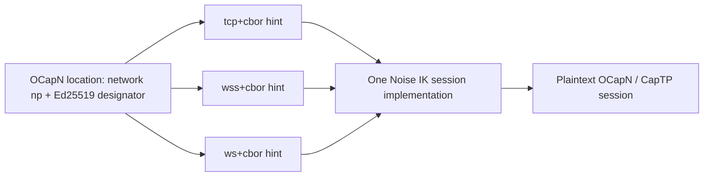

# OCapN Network/Transport Separation

| | |
|---|---|
| **Created** | 2026-02-14 |
| **Updated** | 2026-08-30 |
| **Author** | Kris Kowal (prompted), Kriscendo Bot (prompted) |
| **Status** | In Progress |

## What is the Problem Being Solved?

An OCapN location identifies a network, while a transport only carries that
network's bytes. `@endo/ocapn-noise` already has the beginnings of that
separation: its `.np` network owns the Noise handshake and offers
`provideSession`, and its TCP and WebSocket adapters supply byte streams.
However, `addTransport()` both registers a dial adapter and immediately starts
its listener. A location is then made by flattening every listener's hints.
That makes publication an accidental side effect of registration, and gives a
daemon no explicit, independently managed TCP+CBOR-frame and WebSocket
listening surfaces.

This is the prerequisite for the WebSocket work proposed in
endojs/endo-but-for-bots PR #684. That PR must remain deferred: it must not
invent daemon URL formats or configure a WebSocket listener directly while the
network API cannot publish the same peer's complete, multi-transport location.

## Target Model

An OCapN location names the network and identity; hints name zero or more ways
to reach that identity. For Noise, the network is always `np`, and the
designator is the 32-byte Ed25519 public key rendered as 64 lowercase hex
characters. The legacy `transport: 'np'` field remains on the wire during the
`network` migration, but it is not used to select a byte carrier.

For `.np`, the OCapN session-routing identity is `(network, designator)`, not
the complete serialized location. Hints can change when an endpoint binds,
rebounds, or is withdrawn; including them in `locationToLocationId` would make
one authenticated peer look like several peers and defeat crossed-hello and
session reuse. The client therefore obtains the network's canonical peer ID
from `network: 'np'` plus the designator. Legacy netlayers keep their existing
location serialization until they migrate to this identity rule.



This design uses one word per axis.
A **transport** (`tcp`, `wss`, `ws`) is the byte-stream carrier; it is the value
the interface field `scheme` carries.
A **wire codec** (`cbor`) is the framing-and-encoding profile the transport's
bytes commit to; it is the value the interface field `codecName` carries.
A **combination** is a `<transport>+<codec>` pair; it is the published hint key.
Earlier drafts spelled the transport axis "carrier" or "scheme" interchangeably
in the tables; the tables below name it once, as the transport.

Hints retain the OCapN location's string-to-string table so they remain
serializable by the existing codec.
In an external locator, each table entry is an `@`-delimited path component of
the form `<transport>+<codec>:<value>`.
Hints do **not** go in the query string; the query string is reserved for
alleged attributes such as `type`, consistent with
[daemon-locator-reference.md](daemon-locator-reference.md).

**There is exactly one hint per transport-and-codec combination.**
The hint key is `<transport>+<codec>`, and its value is the single dial string a
peer needs to reach that combination.
The maintainer directive constrains the key ("one hint per transport protocol");
this design refines "transport protocol" to the transport-and-codec combination,
so that a future `tcp+cbor` and `tcp+syrup` are two distinct keys rather than two
values under a single `tcp`.
An earlier draft split the TCP carrier across two keys (`tcp+cbor:host`,
`tcp+cbor:port`), which is an aberration (separate host and port hints for one
protocol) superseded here (Kris Kowal,
[issue #58 comment](https://github.com/kriscendobot/garden/issues/58#issuecomment-5447781817),
2026-08-28: "Separate hints for the TCP host and port is an aberration.
There should only be one hint per transport protocol.").
The `<transport>:<field>` sub-keying is dropped.
The initial combinations are:

| Transport | Codec | Published hint | Value | Framing |
|---|---|---|---|---|
| `tcp` | `cbor` | `tcp+cbor` | `host:port` authority (IPv6 literals bracketed, for example `[::1]:3469`) | One definite-length CBOR byte string per Noise handshake or ciphertext frame |
| `wss` | `cbor` | `wss+cbor` | `host:port/path` (path required, for example `peer.example:443/ocapn-cbor-np`) | One binary WebSocket message per Noise handshake or ciphertext frame |
| `ws` | `cbor` | `ws+cbor` | `host:port/path` (path required) | One binary WebSocket message per Noise handshake or ciphertext frame |

The value grammar differs by transport.
`tcp+cbor` publishes a bare `host:port` authority.
`wss+cbor` and `ws+cbor` publish `host:port/path`, and the path is **required**,
not a fixed well-known default: a WebSocket endpoint mounted behind a shared TLS
terminator distinguishes peers by path, so the hint must carry it.
The examples here use `/ocapn-cbor-np`, the path minion.town already serves for
this transport-and-codec combination (see
[gateway-package.md](gateway-package.md) § `/ocapn-cbor-np` WebSocket
subprotocol); minion.town and this design are kept aligned, and either may be
corrected toward the other.

On the wire, each `@`-delimited component is `encodeURIComponent`-encoded
exactly as [daemon-locator-reference.md](daemon-locator-reference.md) § Locator
with Connection Hints specifies, so that `@` (the component delimiter), `:`, and
`/` inside a value round-trip cleanly; an `@` appearing in a WebSocket path is
therefore escaped as `%40` and cannot be mistaken for a delimiter.
A parser first decodes the whole component, then splits the decoded string
structurally: on the first `:` to separate the `<transport>+<codec>` key from
the value, then on `:` and `/` within the value to recover host, port, and path
(with IPv6 hosts bracketed).
The examples below are shown decoded for readability.
For example, an external peer locator ends with components that decode to
`@wss+cbor:peer.example:443/ocapn-cbor-np@tcp+cbor:127.0.0.1:3469`.

A peer filters hints to combinations for which it implements both the transport
and the codec, then tries eligible combinations in its configured preference
order.
This permits a browser to ignore direct-TCP hints while a LAN peer uses raw IPv6
TCP without a relay.
Future relay hints can participate in speculative connection races.

`tcp+cbor` is deliberately distinct from the current TCP netstring adapter: the
combination prefix is a wire commitment, not a nickname.
The `cbor` codec names the byte-string framing primitive described by
[cbor-frame.md](cbor-frame.md) (now named `@endo/cbor-frame`), with a bounded
inbound frame size.
A peer only selects a transport-and-codec combination for which it has both a
registered dial adapter and a complete hint.
A failed dial closes its partial stream before the next eligible combination is
tried.

Only one published endpoint per transport-and-codec combination is allowed in a
location, which the one-hint rule makes structural.
Registering two `ws+cbor` listeners must fail rather than silently overwrite the
`ws+cbor` hint.
A future multi-endpoint combination needs an explicitly specified encoding,
rather than an array smuggled into the string-only hints table.

## Target API

`addTransport` registers a dial adapter only.
Listening is a separate, explicit operation and returns a listener handle used
to withdraw the associated hints.

A transport carries its own `codec` and derives its wire-codec name from it, so
the network never takes a parallel free-form `codecName` that could disagree
with the codec object.
Registering `makeTcpCborTransport()` and a future `makeTcpSyrupTransport()`
therefore yields two distinct combinations (`tcp+cbor` and `tcp+syrup`) that can
publish side by side.

```js
const network = makeOcapnNoiseNetwork();
const keyId = network.addSigningKeys(signingKeys);

const tcp = makeTcpCborTransport(); // scheme 'tcp', codec name 'cbor'
const wss = makeWebSocketTransport({
  WebSocket,
  WebSocketServer,
  scheme: 'wss', // 'ws' or 'wss'; codec name 'cbor'
});
network.addTransport(tcp);
network.addTransport(wss);

const tcpListener = await network.listen(tcp, {
  host: '127.0.0.1',
  port: 3469,
});
const wssListener = await network.listen(wss, {
  host: '127.0.0.1',
  port: 443,
  path: '/ocapn-cbor-np',
  advertisedAuthority: 'peer.example:443',
});

const location = network.locationFor(keyId);
// location.hints === {
//   'tcp+cbor': '127.0.0.1:3469',
//   'wss+cbor': 'peer.example:443/ocapn-cbor-np',
// }
// External locator path (shown decoded):
// /@tcp+cbor:127.0.0.1:3469@wss+cbor:peer.example:443/ocapn-cbor-np

tcpListener.close(); // withdraws only the tcp+cbor hint and listener
wssListener.close(); // withdraws only the wss+cbor hint and listener
```

The transport and listener contracts are:

```ts
interface OcapnNoiseTransport<ListenOptions> {
  readonly scheme: string; // byte-stream carrier, such as tcp, ws, or wss
  readonly codecName: string; // wire codec, derived from the codec, such as cbor
  connect(hint: string): Promise<ByteStream>;
  listen(
    options: ListenOptions,
    accept: (stream: ByteStream) => void,
  ): Promise<TransportListener>;
  shutdown(): void;
}

interface TransportListener {
  readonly hint: string; // the transport's single dial value: host:port, plus /path for ws and wss
  close(): void;
}

interface OcapnNoiseNetwork {
  addTransport(transport: OcapnNoiseTransport<unknown>): void;
  listen(
    transport: OcapnNoiseTransport<unknown>,
    options: unknown,
  ): Promise<TransportListener>;
  locationFor(keyId: KeyIdHex): OcapnLocation;
}
```

The network keys each `listener.hint` under
`${transport.scheme}+${transport.codecName}` and validates the composite key and
the encoding of the hint value before publication; the hint value's internal
grammar (authority, or authority plus path) stays the transport's responsibility
rather than the network's.
Locator serialization emits each pair as an `@<transport>+<codec>:<value>` path
component, percent-encoded per
[daemon-locator-reference.md](daemon-locator-reference.md).
A listener is live only after binding succeeds; a failed bind changes neither
the registered adapters nor any advertised location.
`removeTransport` fails while that transport owns a listener.
`shutdown` closes every listener, then every transport and session.
Locations are snapshots: callers publish a newly obtained location after an
endpoint is added, removed, or rebound, and existing sessions continue
independently of later hint changes.

Inbound Noise routing is unchanged. Every listener hands its stream to the
same responder path; the cleartext intended-responder-key prefix chooses the
registered signing key. Thus TCP and WebSocket can terminate sessions for the
same `.np` designator without either listener possessing a special identity or
without a transport becoming part of the identity.

## Migration Plan

1. Treat the single `tcp:url` listener hint (a `tcp:`-prefixed URL string)
   introduced by PR #1072, and the analogous `ws:url` WebSocket hint, as
   transitional implementation details. Normalize the TCP one to an authority at
   the transport boundary, publish it as `tcp+cbor`, and serialize it as an
   `@tcp+cbor:<authority>` locator path component. Normalize the WebSocket one to
   a `host:port/path` value, publish it as `ws+cbor` or `wss+cbor`, and serialize
   it as an `@ws+cbor:<host:port/path>` component (percent-encoding any `@` in the
   path) rather than publishing a full URL as the hint.
2. Land or expose the bounded `@endo/cbor-frame` reader/writer from
   [cbor-frame.md](cbor-frame.md), and implement `makeTcpCborTransport`. Keep the
   netstring TCP adapter available under its current scheme; it is not wire
   compatible with `tcp+cbor`.
3. Split the current `OcapnNoiseTransport.listen(handler)` into
   `listen(options, accept)`, and change `addTransport` to registration only.
   Update the mock, TCP, and WebSocket adapters plus their tests. Provide a
   short-lived compatibility helper only if an external consumer still calls
   the old one-step API; do not retain implicit listening in the new API.
4. Add `OcapnNoiseNetwork.listen`, atomic hint aggregation,
   duplicate-transport-and-codec
   rejection, ordered fallback, and lifecycle tests. The core
   `@endo/ocapn` `OcapnNetwork.provideSession` and `inboundSessions` surface is
   already the correct handoff and does not gain transport knowledge. Change its
   `.np` session key to `(network, designator)` so hint publication never
   creates a second session for the same authenticated peer.
5. Migrate all Noise fixtures to obtain locations only after listeners bind.
   Exercise TCP-only, WS-only, and dual-listener peers; verify that a dual
   peer dials a TCP-only and a WS-only peer, that the preferred unreachable
   hint falls back, and that closing one listener removes only its hints.
6. Only then resume PR #684 as a daemon adapter. It creates the TCP+CBOR and
   WebSocket listeners through this API, persists each resolved bind address
   independently, and publishes one serialized `.np` location in the daemon
   peer address. It does not add a transport-specific location format or
   duplicate transport-selection logic in `packages/daemon/src/networks/ocapn.js`.

## Security and Compatibility

Noise IK continues to authenticate the designator regardless of the carrier;
connection hints are untrusted routing suggestions, not identity assertions.
The TCP frame reader must cap declared lengths before allocation, and both
listener adapters must reject non-binary or malformed frames and close the
stream. WebSocket TLS is useful defense in depth but does not replace Noise.

This changes the private, pre-1.0 `@endo/ocapn-noise` embedding API. The OCapN
location codec remains compatible because the published hints are still string
values and `transport: 'np'` remains present during the `network` migration.
External locator serialization changes from transitional `tcp:url` / `ws:url`
entries to `@`-delimited composite hints; query parameters remain available for
alleged attributes. The design intentionally creates a new TCP wire
combination: a netstring peer and a `tcp+cbor` peer must not be treated as
interchangeable.

## Test Plan

- Unit-test publication, deterministic hint order,
  duplicate-transport-and-codec rejection, bind rollback, listener withdrawal,
  and adapter removal while listening.
- Round-trip the hint grammar through serialize and parse: a `tcp+cbor`
  authority, an IPv6-bracketed `[::1]:3469` authority, a `wss+cbor`
  `host:port/path` value, and a path containing an `@` (asserting it is
  percent-encoded in the locator and decoded back). Reject a `wss+cbor` value
  with no path and a malformed authority.
- Assert a netstring TCP peer and a `tcp+cbor` peer are not treated as
  interchangeable.
- Run Noise handshake and encrypted message exchange over TCP+CBOR-frame,
  WebSocket, and a mixed pair with only one mutually supported carrier.
- Run crossed-hello and inbound-session tests with opposite transports, proving
  that session deduplication keys on the Noise identity rather than an endpoint.
- Rebind or withdraw an advertised endpoint, then provide a session through the
  newly published location and assert reuse of the existing `.np` session.
- Feed fragmented, oversized, malformed, and text WebSocket frames; assert the
  connection closes without an unbounded allocation or a stuck reader.
- At the daemon layer, once PR #684 resumes, run the shared multiplayer suite
  with TCP only, WebSocket only, and both listeners enabled, including restart
  persistence of both resolved ports.

## Dependencies

| Design | Relationship |
|---|---|
| [cbor-frame.md](cbor-frame.md) | Supplies the TCP CBOR byte-string framing primitive. |
| [ocapn-noise-network.md](ocapn-noise-network.md) | Supplies the Noise IK session, key routing, and transport plugin substrate amended here. |
| [ocapn-noise-session-reconnect.md](ocapn-noise-session-reconnect.md) | Must preserve session ownership and close behavior across every carrier. |
| [ocapn-noise-key-only-session-boundary.md](ocapn-noise-key-only-session-boundary.md) | A relay forwards the framed ciphertext stream to these terminating listeners. |

## Prompt

> Let's return to PR #684 after OCapN has been refactored such that the Noise
> Protocol Network (`.np`) provides connection hints for multiple transports
> and can listen on both WebSocket and TCP+CBOR-frame ports separately.
