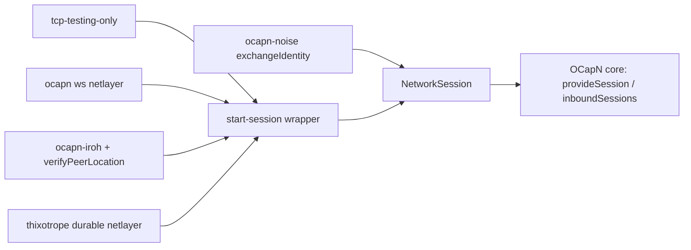

# OCapN Network-Owned Identity Exchange (TCP-for-Test Extraction)

| | |
|---|---|
| **Created** | 2026-02-14 |
| **Updated** | 2026-10-07 |
| **Author** | Kris Kowal (prompted), Kriscendo Bot (prompted) |
| **Status** | In Progress |

## Status

Revised 2026-10-07 against `llm` at `f1e3065`, after the build job for the
2026-02-24 draft stopped because that draft had been overtaken. The
2026-02-24 draft assumed that `op:start-session` was redundant for
OCapN-Noise and that the TCP-for-testing netlayer was its only user. Neither
holds on current `llm`:

- **OCapN-Noise already owns its session.** `@endo/ocapn-noise` delivers
  authenticated sessions through `OcapnNetwork.provideSession` and
  `inboundSessions`, and the client's `makeInternalSessionFromNetwork`
  bypasses the core handshake for them. Noise still runs an encrypted
  `op:start-session` exchange (`exchangeIdentity` in
  `packages/ocapn-noise/src/network.js`). That exchange is not redundant. It
  carries the peer's location signature, which three-party handoffs need, and
  binds that signature to the Noise handshake hash. It also checks that the
  advertised designator is the Noise-authenticated key.
- **Four connect-style consumers depend on the core fallback.**
  `establishSession` and `handleMessageData` in
  `packages/ocapn/src/client/index.js` fall back to `sendHandshake` and
  `handleHandshakeMessageData` (`packages/ocapn/src/client/handshake.js`)
  for:
  `tcp-testing-only` (`packages/ocapn/src/netlayers/tcp-test-only.js`, which
  already routes its outbound hello through a `sendSessionHandshake` hook but
  still receives through the core), the `@endo/ocapn/netlayer/ws` netlayer
  (`init:peer-auth`, then core `op:start-session`), `@endo/ocapn-iroh`
  (core `op:start-session` plus the `verifyPeerLocation` hook, which binds the
  claimed designator to the QUIC-authenticated `EndpointId`), and
  `@endo/thixotrope`'s `makeDurableNetLayer`, whose first hello goes through
  the core handshake and whose resumptions go through `resumeSession`.
- **Hints are not identity.** Merged
  [#1071](https://github.com/endojs/endo-but-for-bots/pull/1071) revised
  [ocapn-network-transport-separation](ocapn-network-transport-separation.md)
  so that there is one hint per `<transport>+<codec>` combination. For `.np`,
  session identity is `(network, designator)`, independent of hints. Draft
  [#684](https://github.com/endojs/endo-but-for-bots/pull/684) stays deferred
  behind that model, and this design does not depend on it.
- **Framing has landed.** Commit `bdb9ddc50d` added the `framing` option to
  `makeTcpNetLayer` (`'syrup'` by default via `@endo/syrup-frame`, and
  `'none'` for the Python `ocapn-test-suite`). See
  [ocapn-tcp-syrup-framing](ocapn-tcp-syrup-framing.md). The identity
  exchange now reads one framed record.

No code has landed for the remaining phases below.

## What is the Problem Being Solved?

OCapN core still has two ways to establish a session. One is a
network-provided `NetworkSession`. The other is a byte `Connection` on which
the core runs `op:start-session`, checks the location signature, calls an
optional `verifyPeerLocation` hook, and resolves crossed hellos. As a result,
the core holds identity policy that belongs to the networks. Iroh's transport
binding is a hook into the core's handshake. The core signs locations with an
empty channel binding, which is meaningful only for unauthenticated test
transports. The client also carries three optional hooks
(`sendSessionHandshake`, `handleSessionHandshake`, `verifyPeerLocation`)
that exist only to let a network customize a handshake it does not own.

The goal is for **each network to own its identity exchange**. The core
accepts only authenticated `NetworkSession`s, and the `op:start-session`
fallback is removed from the core once every consumer has moved off it.

## Description of the Design

### One core contract: `NetworkSession`

The only way a session enters the core is through `provideSession(location)`
and `inboundSessions`, using the existing `NetworkSession` typedef in
`packages/ocapn/src/client/types.js` (`sessionId`, `selfIdentity`,
`remotePublicKeyBytes`, `remoteLocation`, `remoteLocationSignature`, `reader`,
`writer`, `close`, `isInitiator`). This is the existing path that OCapN-Noise
uses, so the core gains no new mechanism. The core continues to deduplicate
by location ID, as the `inboundSessions` consumer already does. It no longer
verifies identity or arbitrates crossed hellos.

### Shared exchange for connect-style netlayers: `@endo/ocapn/start-session`

The `op:start-session` logic moves out of `client/handshake.js` into a new
export, `@endo/ocapn/start-session`, which networks opt into:

```js
/**
 * Wrap a connect-style NetLayer factory into an OcapnNetwork factory that
 * runs op:start-session per connection and yields NetworkSessions.
 *
 * @param {NetworkFactory} makeNetLayer - today's `(handlers, logger) =>
 *   NetLayer` factory, unchanged.
 * @param {object} [options]
 * @param {(location: OcapnLocation) => ArrayBuffer} [options.channelBinding]
 *   - defaults to an empty binding (test transports).
 * @returns {NetworkFactory} - yields an OcapnNetwork exposing
 *   `provideSession` and `inboundSessions`.
 */
export const makeStartSessionNetwork = (makeNetLayer, options) => { ... };
```

The wrapper supplies its own `handlers` to the wrapped netlayer. It owns the
per-connection self identity (today the core's `getSelfIdentityForConnection`
and `makeSelfIdentity`), the version check, location-signature verification,
crossed-hello resolution (`compareSessionKeysForCrossedHellos`, keyed by
`locationToLocationId` of the peer's location), and `makeSessionId`. If the
wrapped netlayer exposes `verifyPeerLocation(connection, peerLocation)`, the
wrapper calls it after the signature verifies and before yielding the session,
with the same contract as today. This lets Iroh keep its binding unchanged.
The wrapper passes the core's `resumeSession` handler through unchanged so
that thixotrope resumption continues to work (see Open questions). The pure
message helpers (`encodeStartSession`, `verifyStartSession`) are exported
separately. Noise can then optionally reuse them in `exchangeIdentity`, with
the handshake hash as the channel binding. Noise is not required to adopt
them.

On the wire, nothing changes for any network. The Python test suite, Iroh
peers, and WebSocket peers still see the same `op:start-session` records.

### Ownership map

| Boundary | Mechanism | Policy | Durable state | Lifecycle / commit | Value crossing |
|---|---|---|---|---|---|
| Transport, then network | netlayer or Noise transport (bytes, framing) | none | none | network closes the connection | framed bytes |
| Network's identity exchange | `start-session` wrapper, or Noise `exchangeIdentity` | network: signature binding, peer binding (`verifyPeerLocation`, Noise key check), crossed hellos | none (thixotrope: resume records) | network decides whether a session exists | `NetworkSession` |
| Network, then core | core session manager | dedupe by location ID | none | core ends a session on reader EOF | plaintext OCapN frames |

Who owns persistent state? The network, and only thixotrope has any. Who
commits or discards a session? The network decides whether a session exists,
and the core ends it. Who handles restart and replay? Thixotrope, through
`resumeSession`. Who classifies execution? CapTP in the core, unchanged.
Naming check: the wrapper produces a *session*, not a *connection*, and
`start-session` names the exchange it runs.



### Phases (the Iroh migration comes before core removal)

1. **Extract.** Add `@endo/ocapn/start-session` by moving code out of
   `client/handshake.js`. The core fallback temporarily calls the same
   functions, so behavior is identical. Unit-test the wrapper against mocked
   connections, covering version mismatch, a bad signature, a rejection from
   `verifyPeerLocation`, and crossed hellos in both orders.
2. **Migrate Iroh.** `@endo/ocapn-iroh` exports its netlayer wrapped by
   `makeStartSessionNetwork`. `verifyPeerLocation` keeps its role of
   promoting the connection, cancelling the handshake timeout, and starting
   the heartbeat. Iroh's tests for impersonation rejection, timeouts, and
   crossed hellos must pass against the wrapper before the next phase.
3. **Migrate the remaining connect-style consumers.** Move `tcp-testing-only`
   (dropping its `sendSessionHandshake` hook), the `ws` netlayer, and
   thixotrope's durable netlayer. Update `goblin-chat` and the Python
   test-suite harness to use the wrapped factories.
4. **Remove the core fallback.** Delete the `connect` + handshake branch of
   `establishSession`, the handshake branch of `handleMessageData` (bytes on
   a connection that has no session now abort), `client/handshake.js`, and the
   `sendSessionHandshake`, `handleSessionHandshake`, and `verifyPeerLocation`
   members of the client types. `makeOcapn` rejects a network that lacks
   `provideSession`. Run this phase only after phases 2 and 3 have merged and
   a search for `handleHandshakeMessageData`/`sendHandshake` outside
   `start-session` finds nothing.

Considered and rejected: making `op:start-session` private to
tcp-for-test (the 2026-02-24 draft). That would break Iroh and WebSocket, and
it would force the same exchange to be copied into each of them.

## Security Considerations

- Peer binding remains the network's responsibility. Iroh binds to the QUIC
  `EndpointId` and Noise binds to the Noise static key. TCP-for-testing and
  `ws` have no transport authentication, and they keep the same face-value
  trust they have today, now stated in their own module.
- The core documents that it trusts the network's `NetworkSession`, including
  `remoteLocationSignature`, which three-party handoffs rely on.
- Hints remain untrusted routing suggestions. The exchange binds identity to
  the designator, never to a hint.

## Test Plan

- Existing `client.test.js`, `netlayer-websocket.test.js`,
  `netlayer-tcp-syrup.test.js`, the Python suite (`framing: 'none'`), the
  `ocapn-iroh` tests, and thixotrope `durable-sessions` pass at every phase.
- New: the core receives a mocked `NetworkSession` and reaches CapTP with no
  `op:start-session` bytes written. After phase 4, `makeOcapn` with a bare
  connect-only netlayer throws.

## Dependencies

| Design | Relationship |
|---|---|
| [ocapn-network-transport-separation](ocapn-network-transport-separation.md) | Defines `OcapnNetwork` and the #1071 hint model; this design leaves hints alone. |
| [ocapn-noise-network](ocapn-noise-network.md) | Already network-owned; keeps its encrypted exchange. |
| [ocapn-iroh-netlayer](ocapn-iroh-netlayer.md) | Must migrate (phase 2) before the core fallback is removed. |
| [thixotrope](thixotrope.md) | Durable netlayer migrates in phase 3. |
| [ocapn-tcp-syrup-framing](ocapn-tcp-syrup-framing.md) | Landed (`bdb9ddc50d`); the exchange reads one framed record. |

## Open questions

- Should `resumeSession` also move behind the network contract, so that
  thixotrope yields resumed sessions as `NetworkSession`s, or should it stay
  as the core handler this design passes through? It is not an identity
  exchange, because the resume token authenticates it. However, it is the
  last network-to-core path other than `NetworkSession`. Recommendation:
  keep it in the core for now, and track the move as a follow-up (to be
  filed).
- Should Noise's `exchangeIdentity` adopt the shared `encodeStartSession` and
  `verifyStartSession` helpers in this work, or later?

## Prompt

> Revise the `ocapn-tcp-for-test-extraction` design: OCapN-Noise already skips
> the core handshake but still runs an encrypted `op:start-session` identity
> exchange, `@endo/ocapn-iroh` depends on the core handshake plus
> `verifyPeerLocation`, and merged #1071 introduced the multi-transport hint
> model. Each network owns its identity exchange; sequence an Iroh migration
> before the core `op:start-session` fallback is removed.
