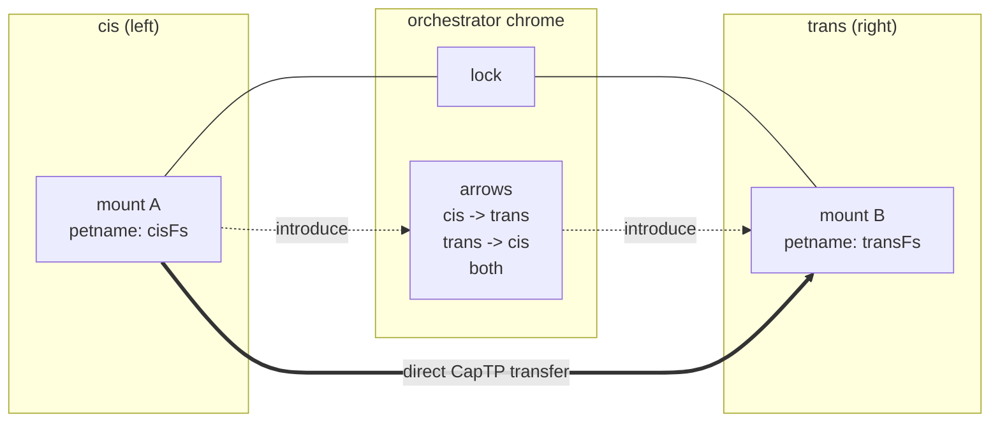

# Parallel cis/trans File-Tree Browser with Direct CapTP Sync

| | |
|---|---|
| **Created** | 2026-06-27 |
| **Author** | kriskowal (prompted) |
| **Status** | Proposed |

## What is the Problem Being Solved?

Endo's headline value proposition is hard to demonstrate in a sentence:
capabilities can be handed from party to party, and once two parties hold
references to each other they communicate **directly**, peer to peer, without
the party that introduced them staying in the data path.
This design is a showcase application that makes that property visible.

The surface is a two-panel file-tree browser, modelled on a classic dual-pane
FTP or sync client.
The left panel is the **cis** side and the right panel is the **trans** side.
Each panel mounts a filesystem (its own machine, a peer's machine, a scratch
space), and the application synchronizes files between them with the full
settings vocabulary an FTP client offers (newer-wins, mirror, update,
delete-extraneous, dry-run, include/exclude filters, conflict handling).

The point that distinguishes it from every FTP client: the application is an
**orchestrator** that holds capabilities to both mounts, but it induces the two
mounted parties to transfer file content **directly to each other** over a
CapTP channel they establish between themselves.
The bytes never pass through the orchestrator.
The orchestrator brokers an introduction (it hands each side a locator for the
other) and then steps out of the transfer path.
This is the third-party rendezvous that Endo's object-capability model makes
ordinary, and it is the headline capability this showcase exists to dramatize.

## Where This Lives

The application is a **weblet**: a static web app served by the daemon with a
CapTP bridge to a guest's powers
(see [daemon-weblet-application](daemon-weblet-application.md) and
[daemon-web-gateway](daemon-web-gateway.md)).
It is hosted the same way Chat hosts weblet panes
(see [familiar-chat-weblet-hosting](familiar-chat-weblet-hosting.md)):
the UI runs in an iframe, receives a `MessagePort`, and stands up CapTP over it
to reach its endowed powers, falling back to the gateway WebSocket when run in
an external browser.

The two-pane layout reuses the partitioned-shell model the Chat weblet pane
already establishes; the file-tree rendering and keyboard navigation can adapt
the behavior-layer pattern documented in
[OUTLINER_INTERACTION_PATTERNS](OUTLINER_INTERACTION_PATTERNS.md)
(arrow keys navigate, Enter opens, Backspace removes), so the editing surface is
not invented from scratch.

This design is a **Milestone 8 (Peer App Sharing)** showcase: it is the
end-to-end demonstration that the peer-connection, mount, and locator substrate
composes into a recognizable product.
It does not introduce new daemon primitives; it composes existing ones.

## What "Mount a Filesystem" Means Here

Each panel is endowed with one **mount capability**
(see [daemon-mount](daemon-mount.md) and
[daemon-mount-capabilities](daemon-mount-capabilities.md)).
A mount wraps a physical directory subtree as a capability with a confined,
symlink-aware read/write interface, granted to a guest under a **petname** in
that guest's own petstore.
The guest resolves it with `E(powers).lookup(petName)`.

The interface each panel consumes (`EndoMount`):

| Method | Use in the browser |
|--------|--------------------|
| `list(...path)` | Populate a directory node's children |
| `stat(path)` | Size / mtime / kind for compare rules and the row display |
| `lookup(path)` | Descend into a subdirectory or open a file handle |
| `readText` / `read` | Source bytes for a transfer |
| `writeText` / `write` | Destination write for a transfer |
| `makeDirectory`, `remove`, `move` | Mirror structural operations |
| `readOnly()` | Attenuate a panel to view-only |
| `followNameChanges(...path)` | Live-refresh a panel without polling |
| `snapshot()` | Capture a directory for a dry-run plan or a clone |

A panel may mount a local directory (`provideMount(path, petName)`), a scratch
space (`provideScratchMount(petName)`), or **a mount that lives on another
peer**, reached through a locator (below).
The cis and trans mounts need not be on the same daemon: that asymmetry is the
entire point.

## Panel, Lock, and Arrow UX



**Panels.**
Each panel shows one mount's tree.
A panel header offers "mount…" (pick a local directory, a scratch space, or
paste a peer locator) and a breadcrumb for the current directory.

**Lock (center).**
When engaged, navigation is mirrored.
Descending into `src/` on cis descends into `src/` on trans (and the reverse),
so the two panels traverse in lockstep.
If the mirrored path is absent on the other side, the panel shows it as a ghost
row (present-on-one-side), which is itself a sync signal.
The lock governs **navigation only**; it does not move data.

**Arrows (center).**
Three engagement states pick the sync direction:
cis -> trans (push), trans -> cis (pull), or bidirectional.
Pressing the active arrow runs a sync of the current directory (or the current
selection) under the configured settings.
A dry-run preview is the default first press; a second confirm executes.

## Sync-Settings Model

The settings are a hardened record the orchestrator passes into the transfer.
They mirror the useful subset of an FTP client's options:

| Setting | Values | Meaning |
|---------|--------|---------|
| `direction` | `push` / `pull` / `both` | Which arrow is engaged |
| `mode` | `mirror` / `update` | Mirror makes the destination match the source exactly; update only copies source-newer entries |
| `compare` | `mtime` / `size` / `mtime+size` / `content` | How "same" is decided (`content` hashes via `snapshot()`) |
| `tiebreak` | `newer-wins` / `larger-wins` / `source-wins` / `ask` | Conflict resolution when both sides changed |
| `deleteExtraneous` | `true` / `false` | In mirror mode, remove destination entries absent from source |
| `dryRun` | `true` / `false` | Compute and display the plan without executing |
| `include` / `exclude` | glob list | Filter the candidate set |
| `recursive` | `true` / `false` | Whole subtree or single directory |

The orchestrator computes a **plan** (a list of per-entry operations: copy,
overwrite, delete, skip, conflict) by walking `list`/`stat` (and `snapshot()`
when `compare === 'content'`) on both mounts.
The plan is what a dry run renders.
Crucially, computing the plan reads only **metadata** through the orchestrator;
executing the plan moves **content** directly between peers.

## The Headline: Direct Party-to-Party Sync

The orchestrator holds both mount capabilities, but it must not become the byte
relay.
Endo makes this natural: the orchestrator hands each mounting party a
**locator** for the other party's mount, the two parties dial each other
directly using the locator's connection hints, and content streams over the
direct CapTP session.

### The substrate

A **locator** is the externalizable, shareable form of a capability
(see [daemon-locator-reference](daemon-locator-reference.md)):

```
endo://{peerKey}/{formulaAddress}@{hint1}@{hint2}?type=mount
```

`peerKey` is the Ed25519 public key of the peer hosting the mount;
`formulaAddress` is the durable formula number; the `@`-delimited **connection
hints** (`ws-relay+captp0://…`, `tcp:…`, `libp2p+captp0://…`, `tor:….onion:…`)
are the ephemeral transport addresses at which that peer is currently
reachable.
The directory surface exposes `locate(...path) -> locator` (externalize a
petname to a shareable locator) and `writeLocator(path, locator)` (bind an
incoming locator under a local petname); receiving a locator with hints feeds
`addPeerInfo` so the network layer can dial that peer.

### The handshake

```mermaid
sequenceDiagram
  participant O as Orchestrator (browser weblet)
  participant A as Peer A (cis daemon)
  participant B as Peer B (trans daemon)
  Note over O: holds cisMount (on A) and transMount (on B)
  O->>B: E(transDir).locate('transFs')
  B-->>O: locator_B (endo://keyB/...@hints?type=mount)
  O->>A: E(cisDir).writeLocator('peerTransFs', locator_B)
  Note over A: addPeerInfo(hints of B); resolve mount B
  O->>A: E(cisHost).sync(planForA, 'peerTransFs', settings)
  A->>B: dial B directly via hints; makeCapTP session
  Note over A,B: direct CapTP channel A <-> B
  loop each plan entry
    A->>B: E(remoteMountB).read(path)  (pull)  or  write(path, bytes) (push)
    B-->>A: bytes  /  ack
  end
  A-->>O: per-entry progress + completion
  Note over O: never saw a single content byte
```

The orchestrator's `sync` request to peer A names the **plan** and the
**petname under which A now holds B's mount**.
From that point A treats B's mount like any other remote capability: it opens a
direct CapTP session to B (the minimal `makeCapTP` over the dialed transport)
and issues `read`/`write`/`stat` eventual-sends straight to B.
Progress events flow back to the orchestrator for the UI; content does not.

For two peers that have not yet met, the introduction rides the existing
invitation flow
(`endo://{peerKey}/{invitationAddress}?type=invitation&from=…`, with daemon
`invite`/`accept` already shipped per
[app-sharing-milestone](app-sharing-milestone.md)): the orchestrator can mint
or relay an invitation so the two daemons establish a peer relationship, then
hand over the mount locator.
When both mounts are on the **same** daemon, the "direct" channel collapses to a
local capability send and the property holds trivially.

### Why this is the showcase

In an FTP client the client process reads every byte from the source and writes
every byte to the destination; it is structurally the middle of an hourglass.
Here the orchestrator is structurally a **matchmaker**: it composes the plan
from metadata and brokers the locator exchange, then the file content takes a
path the orchestrator is not on.
That inversion is only expressible because capabilities are first-class,
forwardable references rather than connection-scoped handles, and it is the
single most legible demonstration of what object-capability transport buys.

## Dependencies

| Design | Relationship |
|--------|--------------|
| [daemon-mount](daemon-mount.md), [daemon-mount-capabilities](daemon-mount-capabilities.md) | The per-panel filesystem capability and its interface |
| [filesystem-watchers](filesystem-watchers.md) | `followNameChanges` for live panel refresh |
| [daemon-locator-reference](daemon-locator-reference.md), [daemon-locator-terminology](daemon-locator-terminology.md) | The locator format and the `locate` / `writeLocator` / `addPeerInfo` surface the rendezvous rides |
| [daemon-weblet-application](daemon-weblet-application.md), [daemon-web-gateway](daemon-web-gateway.md), [familiar-chat-weblet-hosting](familiar-chat-weblet-hosting.md) | Where the UI lives and how it gets its powers bridge |
| [app-sharing-milestone](app-sharing-milestone.md), [endo-app-sharing](endo-app-sharing.md), [familiar-deep-link-invitations](familiar-deep-link-invitations.md) | The peer-connection (`invite`/`accept`) flow the cross-daemon case rides; same milestone |
| [OUTLINER_INTERACTION_PATTERNS](OUTLINER_INTERACTION_PATTERNS.md) | Reusable tree-navigation behavior layer |

## Design Decisions

1. **Weblet, not a bespoke shell.**
   The application is a weblet so it inherits the powers bridge, sandboxing, and
   hosting that the weblet substrate already provides, and so it can run both as
   a Chat pane and in an external browser.

2. **Orchestrator computes the plan from metadata; peers move the content.**
   The split between a metadata-only planning phase (which legitimately flows
   through the orchestrator) and a content phase (which must not) is the design's
   load-bearing boundary.
   Keeping `snapshot()`-based content comparison on the planning side preserves
   the property even for the `compare === 'content'` setting, because the hashes,
   not the bytes, reach the orchestrator.

3. **Locator-based introduction is the baseline mechanism.**
   The rendezvous is built on the shipped locator + peer-info + invitation
   machinery, which already lets one daemon dial another given its locator and
   hints.
   This is deliberately the lighter of the two available mechanisms.
   Considered and rejected as a hard prerequisite: requiring OCapN's
   cryptographic three-party handoff (the gift-and-deposit / handoff-give /
   handoff-receive descriptors in `packages/ocapn`).
   Reason: the minimal `@endo/captp` the daemon runs does not implement those
   descriptors, and the showcase does not need the stronger unforgeability
   guarantee to demonstrate direct transfer.
   See Open Questions for when the stronger mechanism becomes warranted.

4. **The lock governs navigation, the arrows govern data.**
   Separating the two keeps the mental model clean: you can traverse in lockstep
   to compare without ever risking a write, and you only move bytes when you
   press an arrow.

5. **Dry-run first.**
   The first arrow press always previews the plan; execution is a second,
   explicit confirm.
   This matches the destructive-operation caution an FTP client's mirror /
   delete-extraneous modes demand.

## Open Questions

- Should the direct transfer use OCapN's cryptographic three-party handoff
  (gift-and-deposit) rather than plain locator introduction once OCapN lands in
  the daemon's CapTP path?
  The stronger mechanism matters when the orchestrator should be unable to
  impersonate either peer or replay the introduction; the showcase does not
  require it, but a security-narrative version of the demo might.
  To be filed against the OCapN-in-daemon track if the maintainer wants the
  hardened variant.

- For the content-streaming transfer itself, do we want a streaming chunk
  protocol on the mount interface (range reads / writes), or is whole-file
  `read`/`write` adequate for the showcase?
  Large-file transfer would want the range-I/O surface that the blob interface
  consolidation introduced; small-file demos do not.

- How should bidirectional conflicts be surfaced in the UI when `tiebreak` is
  `ask`?
  A per-entry modal, a conflicts queue, or a third "conflicts" center column are
  all plausible; the design leaves the choice to the UI iteration.

- Should a panel be able to mount **more than one** filesystem and present a
  unified virtual tree (per the VFS framing in
  [daemon-capability-filesystem](daemon-capability-filesystem.md)), or is one
  mount per panel the right scope for the showcase?

- When the two mounts are on the same daemon, is it worth special-casing the
  "direct" path at all, or does letting it collapse to a local send (and saying
  so in the UI) tell the story better?

## Prompt

> Vision: a two-panel ("cis" left / "trans" right) parallel file-tree browsing
> space.
> You mount a file system on each panel and orchestrate synchronization between
> them: a lock in the middle (engaged, every navigation on either panel is
> mirrored on the other), arrows in the middle (synchronize the selection from
> one side to the other, unidirectional or bidirectional).
> Like an FTP client, support the full set of useful synchronization settings
> (newer-wins, size/mtime compare, mirror vs. update, delete-extraneous,
> dry-run preview, conflict handling, include/exclude filters).
> UNLIKE an FTP client and its core showcase point: using CapTP and locators,
> the orchestrator induces the two mounted parties to synchronize directly with
> each other (peer-to-peer) rather than relaying bytes through the orchestrator.
> The design should make this third-party-rendezvous the headline capability:
> how locators are exchanged, how the direct CapTP channel is established, and
> how the orchestrator hands off so the transfer never passes through it.
> Survey where this best lives (Endo's existing UI / weblet / petstore / daemon
> surfaces) and what "mount a file system" means in terms of Endo
> powers/petnames; specify the panel/lock/arrow UX and the sync-settings model;
> and detail the CapTP + locator handshake that achieves direct party-to-party
> sync.
</content>
</invoke>
