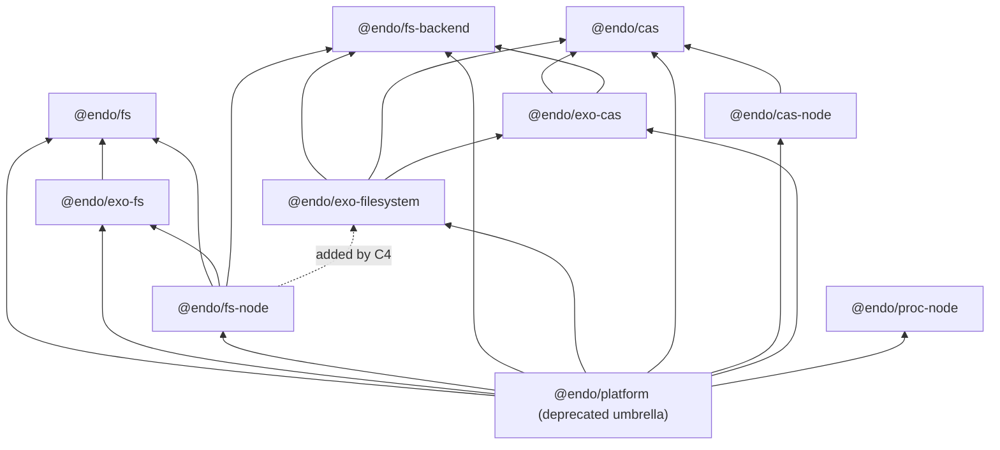

# Explode `@endo/platform` into per-dimension endo/exo package pairs

| | |
|---|---|
| **Created** | 2026-07-10 |
| **Author** | Kris Kowal (prompted) |
| **Status** | Not Started |
| **Source** | Garden job `design-explode-platform-into-dimension-packages` |

## Summary

`@endo/platform` has grown into a monolith holding several unrelated platform
dimensions behind one package boundary. This design splits it into focused
packages, one per dimension actually present in its source, each shipped as a
parallel pair: a plain `@endo/<dim>` package (pure logic and platform binding,
no exo machinery) and an `@endo/exo-<dim>` package (the passable facet:
interface guards and `makeExo` factories). The split follows the precedent
already in the tree: `@endo/http-confine` (pure core) under
`@endo/exo-http-client` (passable facet). Two members depart from the bare
`@endo/<dim>` / `@endo/exo-<dim>` grammar, and the departures are deliberate,
not oversights (Design Decision 1 records each): the extended dimension ships
as `@endo/fs-backend` (pure protocol) paired with `@endo/exo-filesystem`
(the `Filesystem` capability) rather than `fs`/`exo-fs`, whose names are
already taken by the snapshot tier; and `@endo/proc-node` has no exo half at
all, because `proc.js` is Node-bound and has no passable facet in this repo.
`@endo/platform` survives the
transition as a thin, deprecated umbrella of one-line re-export shims so no
consumer breaks mid-flight; its removal is reserved for a next-major bump.

## What is the Problem Being Solved?

One package currently hosts four visible surfaces — a content-addressed
snapshot model, its Node.js powers, a pipelinable `Filesystem` capability with
pluggable backends, and child-process helpers — plus a fifth, a
content-addressed store, smeared across three of them; the next section
enumerates all six rows the source yields. Consequences:

- **Dependency over-coupling.** A consumer that wants only `systemCapture`
  (`packages/chat/vite-endo-plugin.js`) drags in `@endo/exo`,
  `@endo/exo-stream`, `@endo/stream-node`, and the whole filesystem surface.
- **No enforced endo/exo seam.** Exo minting is scattered: `snapshot-store.js`
  and `fs-node/local-blob.js` call `makeExo` directly inside otherwise-plain
  modules, so there is no package boundary a pure consumer can stand behind,
  unlike the `http-confine` / `exo-http-client` pair. The cost is concrete: a
  consumer that wants only the pure snapshot method suites still links the exo
  machinery those modules mint, and nothing prevents the next plain module from
  growing another `makeExo` call.
- **An interior with no boundary.** The `exports` map used to carry a
  `"./fs/extended/*": "./src/fs/extended/*"` deep wildcard, which exposed
  every source file as public API. That wildcard is gone, but the enumerated
  map that replaced it still publishes interior modules —
  `./fs/extended/shared/helpers.js`, `./fs/extended/type-guards.js`,
  `./fs/extended/wrap-backend.js` — because consumers already import them
  directly. Enumerating the leak made it legible; only a package boundary
  closes it.
- **The extended surface already wants out.** `src/fs/extended/DESIGN.md`
  describes itself as a standalone package, and
  [endo-fs-backend-seam](endo-fs-backend-seam.md) already built the internal
  three-layer seam (pure `FsBackend` protocol below, exo upper layer above)
  that this split promotes to a package boundary.

## The Dimensions, Derived from Source

The originating garden job's prompt
(`design-explode-platform-into-dimension-packages`, the **Source** row above)
guessed `fs`, `cas`, `net`, `http`. The source says otherwise. From `packages/platform`'s `exports` map and `src/` layout:

| Dimension | Source today | What it is | Target packages |
|---|---|---|---|
| fs, snapshot tier (the `./fs/lite` subpath, hence "lite": the snapshot model without the Node binding) | `src/fs/` | Content-addressed snapshot model: `SnapshotStore` / `SnapshotBlob` / `SnapshotTree` types and method suites, `checkin` / `checkout`, `reader-byte-length`, and the confined-search pair `confinement.js` / `search.js` | `@endo/fs` |
| fs, exo facet | `src/exo-fs.js` + `src/blob.js` + `src/fs/interfaces.js` | `makeSnapshotBlob` / `makeSnapshotTree` / readable-blob exo factories and the `@endo/patterns` interface guards | `@endo/exo-fs` |
| fs, Node binding | `src/fs-node/` | `local-blob`, `local-tree`, `tree-writer` (Node-backed snapshot powers), `content-store-powers`, and `search-powers` | `@endo/fs-node` |
| fs, extended | `src/fs/extended/` | The pipelinable `Filesystem` capability: pure `FsBackend` protocol plus backends below, `wrapBackend` exo upper layer plus combinators (`compose`, `layer`, `readonly`, `cached-fs`) above | `@endo/fs-backend` + `@endo/exo-filesystem` (its Node conveniences to `@endo/fs-node`) |
| cas | `src/fs/extended/cas.js`, `src/fs-node/content-store-powers.js`, `src/fs/extended/shared/blob-ref.js` | Content-addressed store: the `makeMemoryCas` / `cacheBackedRead` consumer, the `ContentStoreFilePowers` / `ContentStoreCryptoPowers` contracts (typedefs currently in `src/fs/types.d.ts`), and the passable `BlobRef` handle | `@endo/cas` + `@endo/cas-node` + `@endo/exo-cas` |
| proc | `src/proc.js` | Child-process helpers: `systemCapture`, `waitForExit`, `waitForMessage`, `waitForSpawn`, `waitForExitOrCancel` | `@endo/proc-node` |

**Findings that reshape the prompt:**

- **There is no `net` or `http` dimension in `@endo/platform`.** Those already
  shipped as the exploded pair `@endo/http-confine` + `@endo/exo-http-client`.
  They are the precedent for this design, not part of its work.
- **`cas` is real but not a top-level export.** It is smeared across three
  files in two directories, and its filesystem-backed store already escaped to
  `@endo/daemon-cas`, which describes itself as "extracted as an intermediate
  seam before the Phase 5 Rust CAS swap"
  (`packages/daemon-cas/package.json`). Consolidating the remaining contract, memory
  implementation, Node powers, and passable handle is part of this split.
- **`proc` has no exo facet and should not grow one here.** Its passable
  process-facing relatives already exist as their own packages
  (`@endo/exo-shell`, `@endo/host-spawner`, `@endo/endo-fs-exec`).

## The Endo/Exo Boundary Rule

The load-bearing rule, applied uniformly (mirroring `http-confine` /
`exo-http-client`):

> `@endo/<dim>` defines **no** interface guards and calls **no** exo maker.
> `@endo/exo-<dim>` owns every `M.interface` guard and every `makeExo` /
> `Far` call for the dimension, and depends on `@endo/<dim>` for the method
> suites and types it wraps.

Three clarifications the current code forces:

1. **Method suites are the seam.** `exo-fs.js` already has the right shape:
   `makeSnapshotBlob(store, sha256)` wraps a plain method suite
   (`snapshotBlobMethods`) in an exo. The split extracts the stray `makeExo`
   call sites out of `snapshot-store.js`, `local-blob.js`, `local-tree.js`,
   and `tree-writer.js` into the exo package, leaving plain method-suite
   factories behind.
2. **Platform-binding packages may consume exo factories but define none.**
   `@endo/fs-node` mints `LocalBlob` / `LocalTree` by composing its Node-backed
   method suites with `@endo/exo-fs` factories. The endo/exo axis (who defines
   guards and exos) is orthogonal to the platform axis (who imports `node:*`).
3. **The rule constrains *definition*, not *dependency*.** "Calls no exo maker"
   forbids a plain `@endo/<dim>` from **defining** guards or minting exos; it
   does not forbid it from **depending on** an `exo-*` package. `@endo/fs` and
   `@endo/cas` list `@endo/exo-stream` in their dependency rows for the passable
   stream types their method suites carry, and that is permitted: they consume a
   passable shape, they do not define one. The dependency-row entries below are
   not table errors.

Which packages actually get exo-free weight, since that is the cost the seam
was opened for: `@endo/fs-backend` (errors, eventual-send, harden) and
`@endo/proc-node` (harden) are the two genuinely exo-free leaves, and they are
the ones a consumer like `packages/chat/vite-endo-plugin.js` or `@endo/git`
reaches for. `@endo/fs`, `@endo/cas`, and `@endo/cas-node` shed the filesystem
and exo-minting surface but still carry `@endo/exo-stream` for passable stream
types. `@endo/fs-node`, `@endo/exo-fs`, `@endo/exo-cas`, and
`@endo/exo-filesystem` are exo-carrying by construction. The seam therefore
buys a large dependency cut for pure consumers and a definitional one — the
enforced absence of guards and `makeExo` — everywhere else.

## Target Package Set

| Package | Contents (moved from `packages/platform/src/`) | Workspace dependencies |
|---|---|---|
| `@endo/fs` | `fs/` snapshot model minus `interfaces.js` and the `makeExo` sites in `snapshot-store.js`; the pure confined-search pair `fs/confinement.js` + `fs/search.js` with `fs/search-types.ts`; the snapshot-side typedefs of `fs/types.ts` and `fs/types-index.d.ts` | errors, harden, stream, exo-stream, base64, hex, eventual-send |
| `@endo/exo-fs` | `exo-fs.js`, `blob.js` (the `ReadableBlob` exo), `fs/interfaces.js`, the exo-minting factory extracted from `snapshot-store.js`, plus `LocalBlob` / `LocalTree` / `ReadableBlobRange` guards and factories extracted from `fs-node/` | fs, exo, patterns, base64, utf8, exo-stream, harden |
| `@endo/fs-node` | `fs-node/` method suites (`local-blob`, `local-tree`, `tree-writer`) and `search-powers.js`, minus exo minting; later (child C4) also `fs/extended/backends/node-fs-backend.js` as `./backend` and the `node-fs.js` / `node-fs-module.js` conveniences | fs, fs-backend, exo-fs, stream-node, hex, harden, base64, exo-stream; after C4 also exo-filesystem |
| `@endo/fs-backend` | `fs/extended/backend-types-index.js` and its `backend-types-index.d.ts`, `backends/in-memory-backend.js`, `backends/from-mount-backend.js`, and the pure scalar/path helpers of `fs/extended/shared/` — `path-tables`, `stat-table`, `qid`, and from `shared/helpers.js` the scalar/path suite `toSafeNumber`, `rangesOverlap`, `assertChildName`, `toSegments`, `isStrictDescendantPath`, `movePathToPath`, `mintBrand`, `materialiseViaWalk`, `computeOpenMode` (all four `toSafeNumber` consumers — `fs-node/local-blob.js`, `fs/extended/cached-fs.js`, `backends/from-mount-backend.js`, `shared/blob-ref.js`/`cursor-exo.js` — are extended-tier or below, so this leaf is reachable from each; none reaches `@endo/fs`) | errors, eventual-send, harden |
| `@endo/exo-filesystem` | `fs/extended/wrap-backend.js`, `type-guards.js` (minus `BlobRefInterface`, which moves to `@endo/exo-cas`; renamed `src/interfaces.js` per the scaffolding convention), `attach.js`, `posix-fs.js`, the combinators (`compose.js`, `layer.js`, `readonly.js`, `cached-fs.js`, `in-memory.js`, `from-mount.js`, and their `*-module.js` twins except the Node ones), the exo-defining `shared/` modules (`cursor-exo`, `watcher-exo`, `xattrs-exo`, `lock-table`), the guard-and-exo modules added since this design's first draft (`clone.js`, `posture.js`) and the `mkmem.js` `endo run` script that mints an in-memory `Filesystem` cap, and the passable-bytes porcelain `fs/extended/helpers.js` (`walk`, `collectBytes`, `collectStream`) — its consumers are all extended-tier, so this is acyclic | fs-backend, cas, exo-cas, exo, exo-stream, patterns, errors, eventual-send, base64, harden |
| `@endo/cas` | `fs/extended/cas.js` (`makeMemoryCas`, `cacheBackedRead`) plus the `ContentStoreFilePowers` / `ContentStoreCryptoPowers` typedefs lifted out of `fs/types.ts`, **and the shared bytes plumbing from `shared/helpers.js` (`EMPTY_BYTES`, `makeBytesReaderFromBytes`)** — `@endo/cas` is the deepest leaf reached by all three consumers of that plumbing (`cas.js` here, `blob-ref.js` → `@endo/exo-cas`, `cached-fs.js`/`wrap-backend.js` → `@endo/exo-filesystem`), so homing it here keeps the graph acyclic where homing it in `@endo/exo-filesystem` would close an `exo-cas → exo-filesystem` cycle. `makeBytesReaderFromBytes` already imports `@endo/exo-stream/bytes-reader-from-iterator.js`, which `@endo/cas` depends on; the eventual consolidation of these helpers into `@endo/exo-stream` stays a named follow-up, not yet filed (Decision 5) | errors, eventual-send, exo-stream, harden |
| `@endo/cas-node` | `fs-node/content-store-powers.js` | cas, stream-node, hex, harden |
| `@endo/exo-cas` | `fs/extended/shared/blob-ref.js` plus `BlobRefInterface` lifted from `type-guards.js` | cas, fs-backend, exo, patterns, base64, errors, harden |
| `@endo/proc-node` | `proc.js`, verbatim (imports `fs`, `path`, `child_process`, so it is Node-bound and carries the `-node` suffix) | harden |
| `@endo/platform` | Nothing but one-line re-export shims (below) | all nine packages above |

The table above is exhaustive for the modules it names, and a named placement
always wins over the chain below — that is where the exceptions live, and there
are exactly two: `shared/blob-ref.js` imports `node:crypto` yet lands in
`@endo/exo-cas` (§ Known Wart Carried Forward), and `fs/extended/helpers.js`
is porcelain over the exo `Filesystem` surface yet defines no guard, so it
lands in `@endo/exo-filesystem` rather than `@endo/fs-backend`. Any
`fs/extended` module *not* named above follows the rule mechanically, as an
ordered chain (first match wins, so a module that both defines exos and imports
Node builtins — e.g. `node-fs-backend.js` — resolves to `@endo/fs-node`, matching
the table above):

1. **if** it defines interface guards or mints exos → `@endo/exo-filesystem`;
2. **else if** it imports a Node builtin, in either the `node:*` form
   (`node:fs`, `node:crypto`) or the bare form (`fs`, `path`,
   `child_process`), since the tree still uses both → `@endo/fs-node`;
3. **else** → `@endo/fs-backend`.

Step 2 tests for a Node builtin under either spelling on purpose: `proc.js` and
several `fs-node/` modules import the bare form (`import fs from 'fs'`), so a rule
keyed on the literal `node:*` prefix alone would mis-sort them.

The dependency graph of the target set (an arrow `A --> B` reads "A depends on
B"; every edge exists from the child that creates the depending package, except
`fsnode --> exofilesystem`, which child C4 adds when `@endo/fs-node` absorbs the
extended Node conveniences):

`@endo/daemon-cas` is repointed from `@endo/platform` to `@endo/cas` +
`@endo/cas-node` (it consumes `ContentStoreFilePowers` and the Node powers
factory) but otherwise stays as it is; folding or renaming it is out of scope
(a named follow-up, not yet filed).

### Shared Leaf Modules (Why the Split Stays Acyclic)

The two `shared/` modules that several dimensions import are the only places
the partition could close a cycle, so each is homed explicitly rather than
"mechanically":

- **`shared/helpers.js` is not one module's worth of one dimension** — it holds
  two unrelated families. Its **scalar/path helpers** (`toSafeNumber`,
  `rangesOverlap`, `assertChildName`, `toSegments`, `isStrictDescendantPath`,
  `movePathToPath`, `mintBrand`, `materialiseViaWalk`, `computeOpenMode`) go to
  `@endo/fs-backend`; its **bytes plumbing** (`EMPTY_BYTES`,
  `makeBytesReaderFromBytes`) goes to `@endo/cas`. Both are pure leaves reached
  by every consumer without a back-edge: `@endo/exo-cas`'s `blob-ref.js` imports
  a scalar helper (→ `fs-backend`) and the bytes plumbing (→ `cas`), and
  `@endo/exo-filesystem` imports both, so both `exo-cas` and `exo-filesystem`
  depend *down* into `fs-backend` and `cas`, never sideways into each other's
  exo package. Homing the bytes plumbing in `@endo/exo-filesystem` (its largest
  consumer) was rejected precisely because `exo-cas` also consumes it, which
  would close `exo-cas → exo-filesystem` against the drawn
  `exofilesystem --> exocas` edge.
- **`fs/extended/type-guards.js` splits by name**, not by file:
  `BlobRefInterface` moves to `@endo/exo-cas` (the one guard `blob-ref.js` needs
  from itself); every other guard stays in `@endo/exo-filesystem`. `blob-ref.js`
  imports only `BlobRefInterface` from `type-guards.js`, so lifting that one
  name is exactly what keeps `exo-cas` from depending on `exo-filesystem`.

### Known Wart Carried Forward

`blob-ref.js` imports `node:crypto` for SHA-256. The moves in this design are
verbatim, so `@endo/exo-cas` initially carries a `node:crypto` import even
though nothing else about it is Node-bound — that is the wart. (By contrast
`content-store-powers.js` also imports `node:crypto`, but it lands in
`@endo/cas-node`, where a Node builtin is exactly what the package is for; it is
not a wart.) Injecting a digest power (so `@endo/exo-cas` and
`@endo/exo-filesystem` become browser-usable) is a named follow-up, not yet
filed; it is not part of this split because sync-versus-async hashing
changes call shapes.

## Compatibility: The Deprecated Umbrella

**No consumer breaks at any point in the split.** Eighteen workspace packages
import `@endo/platform/...` today (9p-server, agent-tools, agentry, chat, cli,
daemon, daemon-cas, endo-fs-exec, exo-git, exo-unzip, exo-zip, fae, fetch, git,
lal, reminder, sha256, space-file-explorer). The transition:

1. **Hollow, do not delete.** Each child moves module bodies into the new
   packages and replaces every moved file under `packages/platform/src/` with
   a one-line shim (`export * from '@endo/fs';`, or the narrower named
   re-export where the file held only part of a new package's surface; `.d.ts`
   shims re-export types the same way). The `exports` map keeps every current
   subpath, because the file tree keeps its shape; only file bodies hollow
   out.
2. **Deprecate at birth.** The umbrella's `description` and README state that
   it is a transitional re-exporter and name the focused package for each
   subpath. A changeset recording the deprecation policy accompanies the
   first child.
3. **Repoint incrementally.** Consumers migrate per package in the final
   orchestration child (and opportunistically sooner); each repoint is
   mechanical per the table below.
4. **Remove at next major.** The umbrella's deletion is reserved for a
   next-major bump with a changeset note. Because `@endo/platform` is
   `"private": true` there are no external consumers, so the practical gate is
   in-repo: a grep for `@endo/platform` under `packages/` (excluding the
   umbrella itself) returning zero hits.

[inter-package-plain-re-exports](inter-package-plain-re-exports.md) (#543)
prescribes the staging this transition follows — repoint importers, deprecate
the re-exports, then remove them — even though that design classifies a plain
re-exporter like this umbrella as an anti-pattern. The two are consistent
because the umbrella is never a durable surface; it exists to make the split
additive.

### Consumer Repoint Map

| Old import | New import |
|---|---|
| `@endo/platform/fs` (conditional, Node-only today) | `@endo/fs-node` |
| `@endo/platform/fs/lite` | `@endo/fs` |
| `@endo/platform/fs/lite/types`, `.../types.js` | `@endo/fs` (`./src/types.js`) |
| `@endo/platform/fs/node` | `@endo/fs-node` |
| `@endo/platform/exo-fs` | `@endo/exo-fs` |
| `@endo/platform/blob` | `@endo/exo-fs` |
| `@endo/platform/fs/search` | `@endo/fs` (`./src/search.js`) |
| `@endo/platform/fs/search.types`, `.../search.types.js` | `@endo/fs` (`./src/search-types-index.d.ts`) |
| `@endo/platform/fs/node/search` | `@endo/fs-node` |
| `@endo/platform/proc` | `@endo/proc-node` |
| `@endo/platform/fs/extended` (index), by name — see split below | four packages (not one) |
| &nbsp;&nbsp;• `makeNodeFilesystem`, `makeNodeFsBackend` | `@endo/fs-node` |
| &nbsp;&nbsp;• `makeMemoryCas`, `cacheBackedRead` | `@endo/cas` |
| &nbsp;&nbsp;• `makeInMemoryBackend`, `makeFromMountBackend` | `@endo/fs-backend` |
| &nbsp;&nbsp;• everything else (`makeInMemoryFilesystem`, `readOnly`, `mountAsFilesystem`, `compose`/`chroot`/`bind`/`namespace`/`emptyFilesystem`, `makeLayer`/`LayerInterface`, `withCachedReads`, `wrapBackend`, `walk`/`collectBytes`/`collectStream`, `PosixFsInterface`, the `type-guards.js` re-exports except `BlobRefInterface`) | `@endo/exo-filesystem` |
| &nbsp;&nbsp;• `BlobRefInterface` (also re-exported by the index) | `@endo/exo-cas` |
| `@endo/platform/fs/extended/backend-types`, `.../backend-types.js` | `@endo/fs-backend` |
| `@endo/platform/fs/extended/types-index.js` | `@endo/exo-filesystem` (type surface) |
| `@endo/platform/fs/extended/type-guards.js` — by name | split: `BlobRefInterface` → `@endo/exo-cas`; all other guards → `@endo/exo-filesystem` (`./src/interfaces.js`) |
| `@endo/platform/fs/extended/{in-memory,from-mount,readonly,layer,cached-fs}.js` | `@endo/exo-filesystem` (named exports) |
| `@endo/platform/fs/extended/{node-fs,node-fs-module}.js` | `@endo/fs-node` |
| `@endo/platform/fs/extended/helpers.js` (`walk`, `collectBytes`, `collectStream`) | `@endo/exo-filesystem` |
| `@endo/platform/fs/extended/cas.js` | `@endo/cas` |
| `@endo/platform/fs/extended/shared/blob-ref.js` | `@endo/exo-cas` |
| `@endo/platform/fs/extended/shared/helpers.js` — by name | split: scalar/path helpers (`toSafeNumber`, …) → `@endo/fs-backend`; bytes plumbing (`EMPTY_BYTES`, `makeBytesReaderFromBytes`) → `@endo/cas` |

## Package Scaffolding

Each new package clones the shape of `packages/http-confine` /
`packages/exo-http-client`, adjusted to platform's current conventions:

- **`package.json`**: `"type": "module"`, `"private": true` and version
  `0.1.0` matching platform today, a `description` that names the package's
  partner (every existing paired package does this — "Pair with `@endo/exo-git`",
  "pair with `@endo/host-spawner`" — so `ls packages/` tells pure from exo from
  binding), explicit `exports` map with `types` conditions and **no deep
  wildcard** (the umbrella already enumerates its subpaths; every public module
  in a new package is likewise an enumerated subpath), workspace `dependencies` per the table above, the
  standard `scripts` block (`lint:types` via `tsc`, `test` via ava),
  `"extends": ["plugin:@endo/internal"]` eslint config.
- **The guard module is `src/interfaces.js` in every `@endo/exo-*` package**,
  matching `packages/exo-git` and `packages/exo-shell`. `fs/interfaces.js`
  keeps its name into `@endo/exo-fs`; `fs/extended/type-guards.js` is renamed
  to `src/interfaces.js` on the way into `@endo/exo-filesystem` (and the
  `BlobRefInterface` it sheds lands in `@endo/exo-cas/src/interfaces.js`). The
  rename happens during the move, while the module is not yet an enumerated
  public subpath.
- **Subpaths are spelled `./src/<file>.js`**, as `exo-git`, `exo-shell`, and
  `git` do, not the bare `./types` / `./type-guards` style that only the
  umbrella uses. The repoint map below writes the short form for legibility;
  the `exports` maps write the file form.
- **tsconfig**: per-package `tsconfig.json` + `tsconfig.build.json` copied
  from platform's; `tsconfig.composite.json` is generated, so each child
  reruns `scripts/generate-composite-tsconfigs.mjs` after editing workspace
  dependency edges.
- **Workspace wiring**: the root `workspaces: ["packages/*"]` glob picks the
  new directories up automatically. The lockfile update lands as its own
  `chore: Update yarn.lock` commit per the repo's retcon discipline.
- **Tests relocate with their subjects**: `local-blob.test.js` and
  `snapshot-hash.test.js` to `@endo/fs-node` / `@endo/fs`, `blob.test.js` to
  `@endo/exo-fs`; `blobref.test.js`
  to `@endo/exo-cas`; `cas.test.js` to `@endo/cas`;
  `content-store-powers.test.js` to `@endo/cas-node`; `search.test.js`,
  `confinement.test.js`, and `_search-fixture.js` to `@endo/fs`;
  `local-tree.test.js` and `node-fs.test.js` to `@endo/fs-node`; the extended
  suite (`wrap-backend*`, `in-memory`, `from-mount`, `compose`, `layer`,
  `readonly`, `cached-fs`, `clone`, `posture`, `guard-schemas`, `cursor`,
  `lock`, `watch`, `pipeline*`, `optimal-querying`, `configurations`,
  `shared-helpers`) to `@endo/exo-filesystem`. `test/_captp-pair.js` is duplicated or shared as a tiny
  test helper where needed.
- **Green gates per child**: repo-wide `yarn build`, `yarn lint`
  (types + eslint), and `yarn test` pass at every child's completion, not just
  at the end.
- **Enforce the boundary rule mechanically**, so it does not decay the way the
  current scattered `makeExo` sites did: each `@endo/<dim>` (plain) package adds
  a lint/test gate asserting it defines no `M.interface` guard and makes no
  `makeExo` / `Far` call — either an eslint `no-restricted-imports` on
  `@endo/exo`/`@endo/patterns` in the plain packages, or a small ava test that
  greps its own `src/` for `makeExo(`/`M.interface`. The gate lands with the
  first child that creates a plain package (C2) and is copied to each
  subsequent plain package.

## Execution Plan: An Orchestration

This is a multi-part refactor, so it runs as one **orchestration job** over
**serial** parked children with `--on-child-failure halt` (per the garden's
standing decomposition pattern). Serial order respects the dependency arrows:
`exo-cas` must exist before `exo-filesystem` moves, and the fs trio must exist
before `fs-node` absorbs the extended node pieces.

| Child | Work | Size |
|---|---|---|
| C1 | `@endo/proc-node`: move `proc.js`, hollow the shim, repoint nothing yet. Proves the umbrella pattern end to end on the smallest dimension. | S |
| C2 | `@endo/fs` + `@endo/exo-fs` + `@endo/fs-node` (snapshot tier only): extract the `makeExo` sites per the boundary rule, and seed `@endo/fs-backend` with its pure scalar/path-helper leaf (`toSafeNumber` and the sibling helpers), because `fs-node/local-blob.js` imports `toSafeNumber` and must repoint to a package that exists by this child. The backend protocol and backends join `@endo/fs-backend` in C4; this child stands up only the leaf. Hollow shims. | M |
| C3 | `@endo/cas` + `@endo/cas-node` + `@endo/exo-cas`: lift the powers typedefs out of `fs/types.ts`, move `cas.js` and `blob-ref.js`, repoint platform-internal imports (extended still lives in platform and imports `BlobRef` from `@endo/exo-cas`), hollow shims. | S-M |
| C4 | `@endo/fs-backend` grows the backend protocol + backends (its scalar/path leaf already exists from C2), `@endo/exo-filesystem` is created, and `@endo/fs-node` grows `./backend` plus the Node conveniences: the big move, mechanical under the seam [endo-fs-backend-seam](endo-fs-backend-seam.md) already built. Hollow shims, relocate the extended test suite. | L |
| C5 | Consumer repoint sweep across all eighteen importers, umbrella deprecation notice + changeset, prune the umbrella's enumerated shim subpaths down to those still in use, regenerate composite tsconfigs, and add the zero-importer grep gate to the umbrella's removal checklist. | M |

Every child hollows what it moves in the same commit series that creates the
new packages, so the tree is never in a state where an existing import path
fails to resolve. The property the prompt asked for — that `@endo/platform`
keeps re-exporting every current subpath so no consumer breaks while the split
proceeds — is achieved per-child rather than as a separate first step:
hollowing (replacing each moved module body with a re-export shim in the same
commit) is what makes each child additive.

## Design Decisions

1. **Names.** `@endo/fs`, `@endo/exo-fs`, `@endo/fs-node`, `@endo/fs-backend`,
   `@endo/exo-filesystem`, `@endo/cas`, `@endo/cas-node`, `@endo/exo-cas`,
   `@endo/proc-node`. The `-node` suffix follows the `@endo/stream` /
   `@endo/stream-node` precedent, and the `exo-` prefix follows the pairs
   already in the tree (`@endo/http-confine` / `@endo/exo-http-client`,
   `@endo/git` / `@endo/exo-git`, `@endo/exo-shell`) rather than any written
   style guide — there is no `designs/`-level style document to appeal to, so
   the precedent is the authority. Considered and rejected: `@endo/endo-fs`
   (the extended surface's self-chosen name in its DESIGN.md) because the
   scope makes it stutter and because its primary surface is passable, which
   the in-tree `exo-` precedent reserves for the `exo-` prefix;
   `@endo/exo-fs-extended` because it names a tier of the old monolith rather
   than the surface itself.

   **Two departures from the bare `@endo/<dim>` / `@endo/exo-<dim>` grammar,
   recorded here so the reader is not surprised:**
   - **The extended dimension is `@endo/fs-backend` / `@endo/exo-filesystem`,
     not `@endo/fs-extended` / `@endo/exo-fs-extended`.** The bare `fs`/`exo-fs`
     names are already spent on the snapshot tier, and the pure half of the
     extended dimension is genuinely the *backend protocol* while the exo half
     is genuinely the *`Filesystem` capability*; naming each for what it is
     reads better than a mechanical `-extended` suffix. The cost — the pair's
     halves share no stem, and `@endo/exo-fs` (snapshot) sits one abbreviation
     away from `@endo/exo-filesystem` (the cap) — is accepted deliberately.
   - **`@endo/proc-node` has no exo half** (see Decision 4) and carries the
     `-node` suffix because `proc.js` imports `fs`, `path`, and `child_process`
     and is therefore Node-bound; leaving it bare `@endo/proc` would violate
     this design's own `-node`-means-platform-binding convention.
2. **The boundary is "who defines guards and exos."** Platform-binding
   packages may consume exo factories (`@endo/fs-node` mints `LocalTree` via
   `@endo/exo-fs`) but define none. Considered and rejected: forbidding
   `-node` packages from touching exos at all. Reason: it would force a
   fourth package per dimension for the minting glue, with no consumer.
3. **Umbrella as transitional plain re-exporter, deprecated at birth.**
   Consistent with the staging in
   [inter-package-plain-re-exports](inter-package-plain-re-exports.md);
   removal reserved for the next major with a changeset note, gated in practice on
   the in-repo zero-importer grep since the package is private.
4. **`@endo/proc-node` ships without an exo pair.** Its passable relatives
   already exist (`@endo/exo-shell`, `@endo/host-spawner`,
   `@endo/endo-fs-exec`). Inventing
   `@endo/exo-proc` here would be speculative.
5. **Moves are verbatim; refactors are confined to the boundary rule.** The
   only code changes are extracting `makeExo` call sites and guard
   definitions. The `node:crypto` digest-injection wart and any
   byte-reader-helper consolidation into `@endo/exo-stream` are named
   follow-ups, not yet filed, not riders on this split.
6. **`cas` is a dimension, `net`/`http` are not.** Derived from source: cas
   material exists in platform and has an external consumer
   (`@endo/daemon-cas`); no network code does.

## Dependencies

| Design | Relationship |
|---|---|
| [platform-fs](platform-fs.md) | Built the monolith this design splits; stays Complete as history |
| [endo-fs-backend-seam](endo-fs-backend-seam.md) | Built the internal FsBackend/exo seam that becomes the `@endo/fs-backend` / `@endo/exo-filesystem` package boundary |
| [inter-package-plain-re-exports](inter-package-plain-re-exports.md) | Governs the umbrella's lifecycle: repoint, deprecate, remove |
| [fs-interface-reconciliation](fs-interface-reconciliation.md), [fs-interface-consolidation](fs-interface-consolidation.md) | In-flight interface work on the same surfaces; C2/C4 rebase over whatever has landed |
| [daemon-cas-management](daemon-cas-management.md) | `@endo/daemon-cas` consumes `@endo/cas` + `@endo/cas-node` after C3 |

## Open Questions

- Should `@endo/daemon-cas` eventually fold into `@endo/cas-node` (or rename
  to drop the `daemon-` prefix) once the umbrella is gone? Out of scope here;
  default is no change.
- Do the chosen bare names (`@endo/fs`, `@endo/cas`) collide
  with any reserved upstream `endojs/endo` package plans? The packages are
  private on the `llm` line, so the question only bites at ferry time.

## Prompt

The verbatim brief lives in the garden job record named in the **Source** row
(`design-explode-platform-into-dimension-packages`) and is not reproduced word
for word here. Its four asks, restated so the two claims this design makes
against it are checkable:

1. Explode `@endo/platform` into per-dimension packages, each a plain
   `@endo/<dim>` half plus a passable `@endo/exo-<dim>` half, following the
   `http-confine` / `exo-http-client` precedent.
2. Take the dimensions to be roughly `fs`, `cas`, `net`, and `http`, but
   derive the real set from the source rather than from that list.
3. Keep `@endo/platform` re-exporting every subpath it exports today, so no
   in-repo consumer breaks while the split proceeds.
4. Lay the work out as an orchestration.

The two places this design argues with the brief: there is no `net` or `http`
dimension in `@endo/platform`, so ask 2's guess is corrected against source
(§ The Dimensions, Derived from Source); and ask 3's umbrella-first property is
delivered per-child by hollowing rather than as a separate first step
(§ Execution Plan: An Orchestration).
