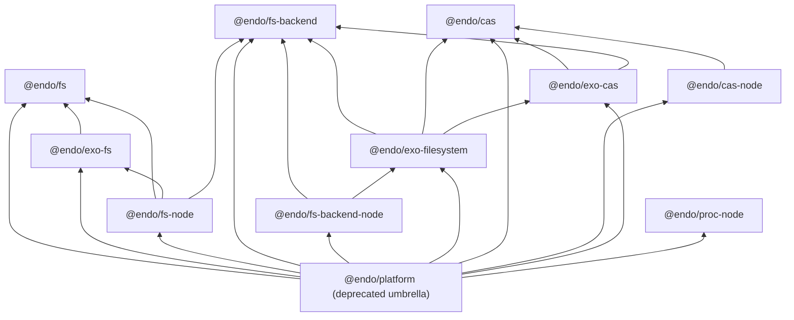

# Explode `@endo/platform` into per-dimension endo/exo package pairs

| | |
|---|---|
| **Created** | 2026-07-10 |
| **Updated** | 2026-09-04 |
| **Author** | Kris Kowal (prompted) |
| **Status** | Not Started |
| **Source** | Garden job `design-explode-platform-into-dimension-packages` |

## Summary

`@endo/platform` has grown into a monolith holding several unrelated platform
dimensions behind one package boundary. This design splits it into focused
packages, one per dimension actually present in its source, each shipped as a
parallel pair: a plain `@endo/<dim>` package (pure logic and platform binding,
no exo machinery) and an `@endo/exo-<dim>` package (the passable facet: its
interface guards and `makeExo` factories). The split follows the precedent
already in the tree: `@endo/http-confine` (pure core) under
`@endo/exo-http-client` (passable facet). Three members depart from the bare
`@endo/<dim>` / `@endo/exo-<dim>` grammar, and the departures are deliberate
rather than oversights (Decision 1 records each). The extended dimension ships
as `@endo/fs-backend` (pure protocol) paired with `@endo/exo-filesystem` (the
`Filesystem` capability) rather than `fs`/`exo-fs`, whose names are already
taken by the snapshot tier; its Node binding is `@endo/fs-backend-node`; and
`@endo/proc-node` has no exo half at all, because `proc.js` is Node-bound and
has no passable facet in this repo. `@endo/platform` survives the transition as
a thin, deprecated umbrella of one-line re-export shims so no consumer breaks
mid-flight, and its removal is reserved for a next-major bump.

## What is the Problem Being Solved?

One package currently hosts four visible surfaces: a content-addressed snapshot
model, its Node.js powers, a pipelinable `Filesystem` capability with pluggable
backends, and child-process helpers. A fifth surface, a content-addressed
store, is smeared across three of them. The next section enumerates the source
as six table rows, because the fs dimension alone splits four ways (snapshot
model, exo facet, Node binding, and the extended `Filesystem`), which with the
cas and proc rows makes six. Consequences:

- **Dependency over-coupling.** A consumer that wants only `systemCapture`
  (`packages/chat/vite-endo-plugin.js`) drags in `@endo/exo`,
  `@endo/exo-stream`, `@endo/stream-node`, and the whole filesystem surface.
- **No enforced endo/exo seam.** Exo minting is scattered: `snapshot-store.js`
  and `fs-node/local-blob.js` call `makeExo` directly inside otherwise-plain
  modules, so there is no package boundary a pure consumer can stand behind,
  unlike the `http-confine` / `exo-http-client` pair. The cost is concrete: a
  consumer that wants only the pure snapshot method suites still links the exo
  machinery those modules mint, and nothing prevents the next plain module from
  growing another `makeExo` call.
- **An interior with no boundary.** The `exports` map used to carry a
  `"./fs/extended/*": "./src/fs/extended/*"` deep wildcard, which exposed
  every source file as public API. That wildcard is gone, but the enumerated
  map that replaced it still publishes interior modules
  (`./fs/extended/shared/helpers.js` and `./fs/extended/wrap-backend.js`)
  because consumers already import them directly. Enumerating the leak made it
  legible; only a package boundary closes it.
- **The extended surface already wants out.** `src/fs/extended/DESIGN.md`
  describes itself as a standalone package, and
  [endo-fs-backend-seam](endo-fs-backend-seam.md) already built the internal
  three-layer seam (pure `FsBackend` protocol below, exo upper layer above)
  that this split promotes to a package boundary.

## The Dimensions, Derived from Source

The originating garden job's prompt
(`design-explode-platform-into-dimension-packages`, the **Source** row above)
guessed `fs`, `cas`, `net`, and `http`. The source says otherwise. From
`packages/platform`'s `exports` map and `src/` layout:

| Dimension | Source today | What it is | Target packages |
|---|---|---|---|
| fs, snapshot tier (the `./fs/lite` subpath, hence "lite": the snapshot model without the Node binding) | `src/fs/` | Content-addressed snapshot model: `SnapshotStore` / `SnapshotBlob` / `SnapshotTree` types and method suites, `checkin` / `checkout`, `reader-byte-length`, and the confined-search pair `confinement.js` / `search.js` | `@endo/fs` |
| fs, exo facet | `src/exo-fs.js` + `src/blob.js` + `src/fs/interfaces.js` | `makeSnapshotBlob` / `makeSnapshotTree` / readable-blob exo factories and the `@endo/patterns` interface guards | `@endo/exo-fs` |
| fs, Node binding | `src/fs-node/` | `local-blob`, `local-tree`, `tree-writer` (Node-backed snapshot powers), `content-store-powers`, and `search-powers` | `@endo/fs-node` |
| fs, extended | `src/fs/extended/` | The pipelinable `Filesystem` capability: pure `FsBackend` protocol plus backends below, `wrapBackend` exo upper layer plus combinators (`compose`, `layer`, `readonly`, `cached-fs`) above | `@endo/fs-backend` + `@endo/exo-filesystem` (its Node backend and conveniences to `@endo/fs-backend-node`) |
| cas | `src/fs/extended/cas.js`, `src/fs-node/content-store-powers.js`, `src/fs/extended/shared/blob-ref.js` | Content-addressed store: the `makeMemoryCas` / `cacheBackedRead` consumer, the `ContentStoreFilePowers` / `ContentStoreCryptoPowers` contracts (typedefs currently in `src/fs/types.d.ts`), and the passable `BlobRef` handle | `@endo/cas` + `@endo/cas-node` + `@endo/exo-cas` |
| proc | `src/proc.js` | Child-process helpers: `systemCapture`, `waitForExit`, `waitForMessage`, `waitForSpawn`, `waitForExitOrCancel` | `@endo/proc-node` |

**Findings that reshape the prompt:**

- **There is no `net` or `http` dimension in `@endo/platform`.** Those already
  shipped as the exploded pair `@endo/http-confine` + `@endo/exo-http-client`.
  They are the precedent for this design, not part of its work.
- **`cas` is real but not a top-level export.** It is smeared across three
  files in two directories, and its filesystem-backed store already escaped to
  `@endo/daemon-cas`, which describes itself as "extracted as an intermediate
  seam before the Phase 5 Rust CAS swap"
  (`packages/daemon-cas/package.json`). Consolidating the remaining contract,
  memory implementation, Node powers, and passable handle is part of this
  split. This design's `@endo/cas` is a distinct surface from the existing
  `@endo/mem-cas`; Decision 7 records why they do not merge and why the bare
  name goes where it does.
- **`proc` has no exo facet and should not grow one here.** Its passable
  process-facing relatives already exist as their own packages
  (`@endo/exo-shell`, `@endo/host-spawner`, `@endo/endo-fs-exec`).

## The Endo/Exo Boundary Rule

The load-bearing rule, applied uniformly (mirroring `http-confine` /
`exo-http-client`):

> `@endo/<dim>` defines **no** interface guards and calls **no** exo maker.
> `@endo/exo-<dim>` owns every `M.interface` guard and every `makeExo` /
> `Far` call for the dimension, and depends on `@endo/<dim>` for the method
> suites and types it wraps.

Three clarifications the current code forces:

1. **Method suites are the seam.** `exo-fs.js` already has the right shape:
   `makeSnapshotBlob(store, sha256)` wraps a plain method suite
   (`snapshotBlobMethods`) in an exo. The split extracts the stray `makeExo`
   call sites out of `snapshot-store.js`, `local-blob.js`, `local-tree.js`,
   and `tree-writer.js` into the exo package, leaving plain method-suite
   factories behind.
2. **Platform-binding packages may consume exo factories but define none.**
   `@endo/fs-node` mints `LocalBlob` / `LocalTree` by composing its Node-backed
   method suites with `@endo/exo-fs` factories, and `@endo/fs-backend-node`
   mints a Node `Filesystem` by composing `node-fs-backend.js` with
   `@endo/exo-filesystem`'s `wrapBackend`. The endo/exo axis (who defines
   guards and exos) is orthogonal to the platform axis (who imports `node:*`).
3. **The rule constrains *definition*, not *dependency*.** "Calls no exo maker"
   forbids a plain `@endo/<dim>` from **defining** guards or minting exos; it
   does not forbid it from **depending on** an `exo-*` package. `@endo/fs` and
   `@endo/cas` list `@endo/exo-stream` in their dependency rows for the passable
   stream types their method suites carry, and that is permitted: they consume a
   passable shape, they do not define one. The dependency-row entries below are
   not table errors.

Exo-free weight is the cost the seam was opened for. `@endo/fs-backend` (errors,
eventual-send, harden) and `@endo/proc-node` (harden) are the two genuinely
exo-free leaves, and they are the ones a consumer like
`packages/chat/vite-endo-plugin.js` or `@endo/git` reaches for.
The Node backend leaf `@endo/fs-backend-node` (via its `./backend` subpath) is
likewise exo-free in what it defines. `@endo/fs`, `@endo/cas`, and
`@endo/cas-node` shed the extended-`Filesystem` and exo-minting surfaces but
still carry `@endo/exo-stream` for passable stream types. `@endo/fs-node`, `@endo/exo-fs`,
`@endo/exo-cas`, and `@endo/exo-filesystem` are exo-carrying by construction.
The seam therefore buys a large dependency cut for pure consumers and a
definitional one (the enforced absence of guards and `makeExo`) everywhere
else.

## Target Package Set

| Package | Contents (moved from `packages/platform/src/`) | Workspace dependencies |
|---|---|---|
| `@endo/fs` | `fs/` snapshot model minus `interfaces.js` and the `makeExo` sites in `snapshot-store.js`; the pure confined-search pair `fs/confinement.js` + `fs/search.js` with `fs/search-types.ts`; the snapshot-side typedefs of `fs/types.ts` and `fs/types-index.d.ts` | errors, harden, stream, exo-stream, base64, hex, eventual-send |
| `@endo/exo-fs` | `exo-fs.js`, `blob.js` (the `ReadableBlob` exo), `fs/interfaces.js`, the exo-minting factory extracted from `snapshot-store.js`, plus `LocalBlob` / `LocalTree` / `ReadableBlobRange` guards and factories extracted from `fs-node/` | fs, exo, patterns, base64, utf8, exo-stream, harden |
| `@endo/fs-node` | `fs-node/` method suites (`local-blob`, `local-tree`, `tree-writer`) and `search-powers.js`, minus exo minting. Snapshot tier only; the extended-tier Node backend lives in `@endo/fs-backend-node` | fs, fs-backend, exo-fs, stream-node, hex, harden, base64, exo-stream |
| `@endo/fs-backend` | `fs/extended/backend-types-index.js` and its `backend-types-index.d.ts`, `backends/in-memory-backend.js`, `backends/from-mount-backend.js`, and the pure scalar/path helpers of `fs/extended/shared/` (`path-tables`, `stat-table`, `qid`, and from `shared/helpers.js` the scalar/path suite `toSafeNumber`, `rangesOverlap`, `assertChildName`, `toSegments`, `isStrictDescendantPath`, `movePathToPath`, `mintBrand`, `materialiseViaWalk`, `computeOpenMode`). All four `toSafeNumber` consumers (`fs-node/local-blob.js`, `fs/extended/cached-fs.js`, `backends/from-mount-backend.js`, `shared/blob-ref.js` / `cursor-exo.js`) are extended-tier or below, so this leaf is reachable from each; none reaches `@endo/fs` | errors, eventual-send, harden |
| `@endo/fs-backend-node` | `fs/extended/backends/node-fs-backend.js` (the pure Node `FsBackend`, published as the `./backend` subpath) plus the Node `Filesystem` conveniences `node-fs.js` (`makeNodeFilesystem`) and `node-fs-module.js`, which mint a cap by consuming `@endo/exo-filesystem`'s `wrapBackend` (a permitted consume, not a define; Decision 2) | fs-backend, exo-filesystem, stream-node, base64, eventual-send, harden |
| `@endo/exo-filesystem` | `fs/extended/wrap-backend.js`, `type-guards.js` (minus `BlobRefInterface`, which moves to `@endo/exo-cas`; renamed `src/interfaces.js` per the scaffolding convention), `attach.js`, `posix-fs.js`, the combinators (`compose.js`, `layer.js`, `readonly.js`, `cached-fs.js`, `in-memory.js`, `from-mount.js`, and their `*-module.js` twins except the Node ones), the exo-defining `shared/` modules (`cursor-exo`, `watcher-exo`, `xattrs-exo`, `lock-table`), the guard-and-exo modules added since this design's first draft (`clone.js`, `posture.js`), the `mkmem.js` `endo run` script that mints an in-memory `Filesystem` cap, and the passable-bytes porcelain `fs/extended/helpers.js` (`walk`, `collectBytes`, `collectStream`), whose consumers are all extended-tier, so this is acyclic | fs-backend, cas, exo-cas, exo, exo-stream, patterns, errors, eventual-send, base64, harden |
| `@endo/cas` | `fs/extended/cas.js` (`makeMemoryCas`, `cacheBackedRead`) plus the `ContentStoreFilePowers` / `ContentStoreCryptoPowers` typedefs lifted out of `fs/types.ts`, **and the shared bytes plumbing from `shared/helpers.js` (`EMPTY_BYTES`, `makeBytesReaderFromBytes`)**. `@endo/cas` is the deepest leaf reached by all three consumers of that plumbing (`cas.js` here, `blob-ref.js` in `@endo/exo-cas`, `cached-fs.js` / `wrap-backend.js` in `@endo/exo-filesystem`), so homing it here keeps the graph acyclic where homing it in `@endo/exo-filesystem` would close an `exo-cas` to `exo-filesystem` cycle. `makeBytesReaderFromBytes` already imports `@endo/exo-stream/bytes-reader-from-iterator.js`, which `@endo/cas` depends on. Consolidating these helpers into `@endo/exo-stream` stays a named follow-up, not yet filed (Decision 5) | errors, eventual-send, exo-stream, harden |
| `@endo/cas-node` | `fs-node/content-store-powers.js` | cas, stream-node, hex, harden |
| `@endo/exo-cas` | `fs/extended/shared/blob-ref.js` plus `BlobRefInterface` lifted from `type-guards.js` | cas, fs-backend, exo, patterns, base64, sha256, errors, harden |
| `@endo/proc-node` | `proc.js`, verbatim (imports `fs`, `path`, `child_process`, so it is Node-bound and carries the `-node` suffix) | harden |
| `@endo/platform` | Nothing but one-line re-export shims (below) | all ten packages above |

The table above is exhaustive for the modules it names, and a named placement
always wins over the chain below. The table is where the exceptions live, and
there are exactly two: `fs/extended/helpers.js` is porcelain over the exo
`Filesystem` surface yet defines no guard, so it lands in `@endo/exo-filesystem`
rather than `@endo/fs-backend`; and `mkmem.js` is an `endo run` script that
mints an in-memory `Filesystem` cap, so it follows the cap it mints into
`@endo/exo-filesystem` even though it imports nothing but `@endo/eventual-send`.
Any `fs/extended` module *not* named above follows the rule mechanically, as an
ordered chain (first match wins):

1. **if** it defines interface guards or mints exos (calls `makeExo` /
   `M.interface` / `Far`) directly, then `@endo/exo-filesystem`;
2. **else if** it imports a Node builtin, in either the `node:*` form
   (`node:fs`, `node:crypto`) or the bare form (`fs`, `path`,
   `child_process`), since the tree still uses both, then
   `@endo/fs-backend-node`;
3. **else** `@endo/fs-backend`.

For example `node-fs-backend.js` imports `node:fs/promises` and defines no exo
(no `makeExo` / `M.interface` / `Far`), so step 2 routes it to
`@endo/fs-backend-node`, matching the table above; `node-fs.js` likewise imports
Node builtins and only *consumes* `wrapBackend`, so it too lands in
`@endo/fs-backend-node`. Step 2 tests for a Node builtin under either spelling
on purpose: `proc.js` and several `fs-node/` modules import the bare form
(`import fs from 'fs'`), so a rule keyed on the literal `node:*` prefix alone
would mis-sort them.

The dependency graph of the target set (an arrow `A --> B` reads "A depends on
B"; every edge exists from the child that creates the depending package):

`@endo/daemon-cas` is repointed from `@endo/platform` to `@endo/cas` +
`@endo/cas-node` (it consumes `ContentStoreFilePowers` and the Node powers
factory) but otherwise stays as it is; folding or renaming it is out of scope
(a named follow-up, not yet filed).

### Shared Leaf Modules (Why the Split Stays Acyclic)

Three barrels the partition divides could close a cycle, so each is homed
explicitly rather than "mechanically":

- **`shared/helpers.js` is not one module's worth of one dimension.** It holds
  two unrelated families. Its **scalar/path helpers** (`toSafeNumber`,
  `rangesOverlap`, `assertChildName`, `toSegments`, `isStrictDescendantPath`,
  `movePathToPath`, `mintBrand`, `materialiseViaWalk`, `computeOpenMode`) go to
  `@endo/fs-backend`; its **bytes plumbing** (`EMPTY_BYTES`,
  `makeBytesReaderFromBytes`) goes to `@endo/cas`. Both are pure leaves reached
  by every consumer without a back-edge: `@endo/exo-cas`'s `blob-ref.js` imports
  a scalar helper (`fs-backend`) and the bytes plumbing (`cas`), and
  `@endo/exo-filesystem` imports both, so both `exo-cas` and `exo-filesystem`
  depend *down* into `fs-backend` and `cas`, never sideways into each other's
  exo package. Homing the bytes plumbing in `@endo/exo-filesystem` (its largest
  consumer) was rejected precisely because `exo-cas` also consumes it, which
  would close `exo-cas` to `exo-filesystem` against the drawn
  `exofilesystem --> exocas` edge.

  Homing the scalar/path helpers in `@endo/fs-backend` gives the snapshot-tier
  `@endo/fs-node` a workspace dependency on an extended-tier package (its
  `local-blob.js` imports `toSafeNumber`), which is a residual cross-tier
  package edge and should be justified with the same candor as the naming
  departures rather than left implicit in a dependency-table cell. The tradeoff
  is deliberate and narrow. The alternative that fully severs the edge is a
  dependency-free micro-leaf for these nine trivial functions (each imports
  nothing beyond `harden`), which trades one small cross-tier edge for a tenth
  published package whose entire reason to exist is to hold nine scalars, a
  worse cost, and one the split's own "one package per real dimension" thesis
  argues against. Duplicating the nine functions into `@endo/fs-node` was
  likewise rejected: it re-forks a shared definition the extended tier also
  depends on, exactly the drift the seam exists to stop. So the edge stays. It
  does not fully undo the "one dimension pulls in another's surface" coupling the
  Problem section indicts (npm resolution is whole-package, so `@endo/fs-node`
  does pull all of `@endo/fs-backend`, protocol and both backend implementations
  included, not just the nine helpers it uses), but it narrows that coupling's
  weight to a single light leaf rather than eliminating it: `@endo/fs-backend`'s
  own dependency row is `errors` / `eventual-send` / `harden` and no more, so the
  transitive closure the snapshot tier inherits is small, where the pre-split
  monolith dragged in `@endo/exo`, `@endo/exo-stream`, `@endo/stream-node`, and
  the whole filesystem surface. The narrowing, not a clean severance, is what the
  edge buys, and naming it plainly here is the point.
- **`fs/extended/type-guards.js` splits by name**, not by file:
  `BlobRefInterface` moves to `@endo/exo-cas` (the one guard `blob-ref.js` needs
  from itself); every other guard stays in `@endo/exo-filesystem`. `blob-ref.js`
  imports only `BlobRefInterface` from `type-guards.js`, so lifting that one
  name is exactly what keeps `exo-cas` from depending on `exo-filesystem`.
- **`fs/index.js`, the `./fs/lite` barrel, splits by name too.** Its first
  export block re-exports 24 interface guards from `fs/interfaces.js`
  (`ReadableBlobRangeInterface`, `PathEntryInterface`, `SnapshotBlobInterface`,
  and the rest); those guards move to `@endo/exo-fs` with `interfaces.js`, while
  the method suites and factories it re-exports (`snapshotBlobMethods`,
  `snapshotTreeMethods`, `makeSnapshotStore`, `checkinTree`, and the snapshot
  types) go to `@endo/fs`. So a consumer of `@endo/platform/fs/lite` repoints
  **by name**, exactly as the `fs/extended` index does: guard imports to
  `@endo/exo-fs`, method-suite imports to `@endo/fs`. `git/src/native-git-backend.js`
  and `daemon/src/mount.js`, for example, import `ReadableBlobRangeInterface`
  from `fs/lite`, so they go to `@endo/exo-fs`, not `@endo/fs`. `@endo/fs` never
  re-exports the guards (that would close a cycle against the drawn
  `exofs --> fs` edge); the reassembly that keeps "no consumer breaks" true
  lives in the umbrella, whose `./fs/lite` shim re-exports from **both**
  `@endo/fs` and `@endo/exo-fs`. That is acyclic because the shim sits in the
  deprecated umbrella, which already depends on both, not in `@endo/fs`.

### Digest Sourcing (No Node Binding in `@endo/exo-cas`)

`blob-ref.js` computes SHA-256 with `@endo/sha256`, not `node:crypto`
(`packages/platform/src/fs/extended/shared/blob-ref.js:16`, with an in-source
comment at lines 63-64 recording that the choice is deliberate: the module rides
the XS daemon bundle's compartment graph, where a static `node:crypto` import
would not resolve). So `@endo/exo-cas` carries **no** Node binding, its
dependency row lists `@endo/sha256` (the real digest dependency), and it is
already browser-usable. There is therefore no digest-injection follow-up for
`@endo/exo-cas`. The genuinely Node-bound digest is
`content-store-powers.js`, which imports `node:crypto` and lands in
`@endo/cas-node`, where a Node builtin is exactly what the package is for.

## Compatibility: The Deprecated Umbrella

The split runs as five ordered orchestration children, C1 through C5
(§ Execution Plan); a **child** is one such sub-job. The invariant below is
delivered per child.

**No consumer breaks at any point in the split.** Sixteen workspace packages
declare a dependency on `@endo/platform` and import from it (9p-server,
agent-tools, agentry, chat, cli, daemon, daemon-cas, endo-fs-exec, exo-git, fae,
fetch, git, lal, reminder, space-file-explorer, exo-unzip). Two more (exo-zip,
sha256) name `@endo/platform` only in doc comments and declare no dependency, so
they are not part of the repoint sweep. The transition:

1. **Hollow, do not delete.** Each child moves module bodies into the new
   packages and replaces every moved file under `packages/platform/src/` with
   a one-line shim (`export * from '@endo/fs';`, or the narrower named
   re-export where the file held only part of a new package's surface; `.d.ts`
   shims re-export types the same way). The `exports` map keeps every current
   subpath, because the file tree keeps its shape; only file bodies hollow
   out.
2. **Deprecate at birth.** The umbrella's `description`, its README, and an
   `@deprecated` JSDoc tag on each re-export shim state that it is a
   transitional re-exporter and name the focused package for each subpath, so
   the deprecation surfaces at the call site in an editor and under `tsc` (the
   affordance step 3's incremental repoint relies on). A changeset recording the
   deprecation policy accompanies the first child.
3. **Repoint incrementally.** Consumers migrate per package in the final
   orchestration child (and opportunistically sooner); each repoint is
   mechanical per the table below, except the two by-name barrels (`fs/lite` and
   the `fs/extended` index), whose rows split the import by symbol.
4. **Remove at next major.** The umbrella's deletion is reserved for a
   next-major bump with a changeset note. `@endo/platform` is **publishable**
   (no `private` flag, `publishConfig: {"access": "public"}`), so the gate has
   two halves. The in-repo half gates on the dependency declaration plus import
   specifiers (not a bare grep, which would false-positive on prose mentions of
   the package name): no `packages/*`
   manifest lists `@endo/platform` as a dependency and no module imports a
   `@endo/platform` specifier, excluding the umbrella itself. The external half
   is at least one published major that carries the deprecation notice before
   the package disappears, since a published consumer cannot be grepped for.

[inter-package-plain-re-exports](inter-package-plain-re-exports.md) (#543)
prescribes the staging this transition follows (repoint importers, deprecate
the re-exports, then remove them) even though that design classifies a plain
re-exporter like this umbrella as an anti-pattern. The two are consistent
because the umbrella is never a durable surface; it exists to make the split
additive.

### Consumer Repoint Map

The `exports` maps write the file form (`./src/<file>.js`); this table writes
the short form for legibility. Every row names subpaths the umbrella actually
exports.

| Old import | New import |
|---|---|
| `@endo/platform/fs` (conditional, Node-only today) | `@endo/fs-node` |
| `@endo/platform/fs/lite`, by name | split: interface guards (`ReadableBlobRangeInterface`, `PathEntryInterface`, `SnapshotBlobInterface`, and the other 21 re-exported from `interfaces.js`) to `@endo/exo-fs`; method suites and types (`snapshotBlobMethods`, `snapshotTreeMethods`, `makeSnapshotStore`, `checkinTree`, ...) to `@endo/fs` |
| `@endo/platform/fs/lite/types`, `.../types.js` | `@endo/fs` (`./src/types.js`) |
| `@endo/platform/fs/node` | `@endo/fs-node` |
| `@endo/platform/exo-fs` | `@endo/exo-fs` |
| `@endo/platform/blob` | `@endo/exo-fs` |
| `@endo/platform/fs/search` | `@endo/fs` (`./src/search.js`) |
| `@endo/platform/fs/search.types`, `.../search.types.js` | `@endo/fs` (`./src/search-types-index.d.ts`) |
| `@endo/platform/fs/node/search` | `@endo/fs-node` |
| `@endo/platform/proc` | `@endo/proc-node` |
| `@endo/platform/fs/extended` (index), by name, see split below | five packages (not one) |
| &nbsp;&nbsp;- `makeNodeFilesystem`, `makeNodeFsBackend` | `@endo/fs-backend-node` |
| &nbsp;&nbsp;- `makeMemoryCas`, `cacheBackedRead` | `@endo/cas` |
| &nbsp;&nbsp;- `makeInMemoryBackend`, `makeFromMountBackend` | `@endo/fs-backend` |
| &nbsp;&nbsp;- everything else (`makeInMemoryFilesystem`, `readOnly`, `mountAsFilesystem`, `compose`/`chroot`/`bind`/`namespace`/`emptyFilesystem`, `makeLayer`/`LayerInterface`, `withCachedReads`, `wrapBackend`, `walk`/`collectBytes`/`collectStream`, `PosixFsInterface`, the `type-guards.js` re-exports except `BlobRefInterface`) | `@endo/exo-filesystem` |
| &nbsp;&nbsp;- `BlobRefInterface` (also re-exported by the index) | `@endo/exo-cas` |
| `@endo/platform/fs/extended/backend-types`, `.../backend-types.js` | `@endo/fs-backend` |
| `@endo/platform/fs/extended/types-index.js` | `@endo/exo-filesystem` (type surface) |
| `@endo/platform/fs/extended/{in-memory,from-mount,readonly,layer,cached-fs}.js` | `@endo/exo-filesystem` (named exports) |
| `@endo/platform/fs/extended/{node-fs,node-fs-module}.js` | `@endo/fs-backend-node` |
| `@endo/platform/fs/extended/cas.js` | `@endo/cas` |
| `@endo/platform/fs/extended/shared/helpers.js`, by name | split: scalar/path helpers (`toSafeNumber`, ...) to `@endo/fs-backend`; bytes plumbing (`EMPTY_BYTES`, `makeBytesReaderFromBytes`) to `@endo/cas` |

## Package Scaffolding

Each new package clones the shape of `packages/http-confine` /
`packages/exo-http-client`, adjusted to platform's current conventions:

- **`package.json`**: `"type": "module"`, version `0.0.0`, the version at which
  the recently added siblings (`@endo/exo-git`, `@endo/exo-shell`) started, and
  platform's
  own publish posture (no `private` flag, `publishConfig: {"access":
  "public"}`) because a published umbrella re-exporting an unpublished
  `@endo/fs` would dangle. A `description` names the package's partner and tier
  (most existing paired packages do this, for example "Pair with
  `@endo/exo-git`," and "pair with `@endo/host-spawner`," so `ls packages/` tells
  pure from exo from binding; the `http-confine` / `exo-http-client` pair is one
  that does not, and its `description` is corrected in passing). The manifest
  carries an explicit `exports` map with `types` conditions and **no deep
  wildcard** (the umbrella already enumerates its subpaths; every public module
  in a new package is likewise an enumerated subpath), workspace `dependencies`
  per the table above, the standard `scripts` block (`lint:types` and
  `test:types` via `tsc`, `test` via ava), and the
  `"extends": ["plugin:@endo/internal"]` eslint config.
- **A README per package.** Each new package ships a README naming its partner
  package and its tier (all eight precedent packages do). The umbrella README
  carries the "which of these do I use" orientation map only transitionally;
  because § Compatibility removes the umbrella at next major, the durable home
  for that map is this design plus the per-package READMEs, not the umbrella
  README alone.
- **Confusable-name disambiguation is a hard README requirement, not a nicety.**
  This split names two near-collisions the README shape must actively steer a
  reader away from (both accepted deliberately in Decision 1 rather than renamed,
  so the README pointer is the mitigation that carries the cost):
  - `@endo/exo-fs` (snapshot facet, 13 sites) and `@endo/exo-filesystem`
    (extended `Filesystem` capability, 71 sites) read as a typo of each other
    yet belong to different dimensions. The `@endo/exo-fs` README **opens** with
    "if you want the pipelinable `Filesystem` capability, you want
    `@endo/exo-filesystem`, not this package," and `@endo/exo-filesystem`'s
    README opens with the reciprocal pointer to `@endo/exo-fs`. The same
    reciprocal pointer pair sits between `@endo/fs` and `@endo/fs-backend`, since
    the bare `@endo/fs` deliberately names the minority snapshot surface while
    the 71-site extended surface has no guessable bare name (Decision 1): the
    `@endo/fs` README **opens** with "if you want the `Filesystem` capability,
    see `@endo/fs-backend` / `@endo/exo-filesystem`," so the more-common wrong
    guess self-corrects in under one page.
  - `@endo/cas` (`has(info)` / `get(info)` / `put(info, bytes)`) and the
    existing `@endo/mem-cas` family (`has(hash)` / `read(hash)` / `write(bytes)`)
    are two same-domain stores spelling their read/write operations with
    different verb pairs (Decision 7). A developer who has used one will reach
    for the other's verbs on the wrong package. Both `@endo/cas`'s and (via a
    changeset note) `@endo/mem-cas`'s READMEs state the verb pair is deliberate
    and why the two contracts do not merge, cross-linking each other, so the
    mismatch is documented at the point of confusion rather than discovered by a
    failed call. If the Open Questions npm/family check reassigns the bare
    `@endo/cas` name (below), this pointer moves with it to the renamed package.
- **The guard module is `src/interfaces.js` in every `@endo/exo-*` package**,
  matching `packages/exo-git` and `packages/exo-shell`. `fs/interfaces.js`
  keeps its name into `@endo/exo-fs`; `fs/extended/type-guards.js` is renamed
  to `src/interfaces.js` on the way into `@endo/exo-filesystem` (and the
  `BlobRefInterface` it sheds lands in `@endo/exo-cas/src/interfaces.js`). The
  rename happens during the move, while the module is not yet an enumerated
  public subpath.
- **Subpaths are spelled `./src/<file>.js`**, as `exo-git`, `exo-shell`, and
  `git` do, not the bare `./types` / `./type-guards` style that only the
  umbrella uses. The repoint map above writes the short form for legibility;
  the `exports` maps write the file form.
- **tsconfig**: per-package `tsconfig.json` + `tsconfig.build.json` copied
  from platform's; `tsconfig.composite.json` is generated, so each child
  reruns `scripts/generate-composite-tsconfigs.mjs` after editing workspace
  dependency edges.
- **Workspace wiring**: the root `workspaces: ["packages/*"]` glob picks the
  new directories up automatically. The lockfile update lands as its own
  `chore: Update yarn.lock` commit per the repo's retcon discipline.
- **Tests relocate with their subjects**, and the relocation is a total
  function over `packages/platform/test/`: every test file is assigned or
  explicitly retained. `local-blob.test.js` and `snapshot-hash.test.js` go to
  `@endo/fs-node` / `@endo/fs`, `blob.test.js` to `@endo/exo-fs`,
  `blobref.test.js` to `@endo/exo-cas`, `cas.test.js` to `@endo/cas`,
  `content-store-powers.test.js` to `@endo/cas-node`, `search.test.js` /
  `confinement.test.js` / `_search-fixture.js` to `@endo/fs`,
  `local-tree.test.js` to `@endo/fs-node`, and `node-fs.test.js` to
  `@endo/fs-backend-node`. The extended suite (`wrap-backend*`, `in-memory`,
  `from-mount`, `compose`, `layer`, `readonly`, `cached-fs`, `clone`, `posture`,
  `guard-schemas`, `cursor`, `lock`, `watch`, `pipeline*`, `optimal-querying`,
  `configurations`) goes to `@endo/exo-filesystem`. `shared-helpers.test.js`
  **splits with its subject**: the scalar/path cases follow the scalar/path
  helpers to `@endo/fs-backend`, and the bytes-plumbing cases follow
  `EMPTY_BYTES` / `makeBytesReaderFromBytes` to `@endo/cas`, so neither leaf
  ships untested. The type tests `fs-types-source.test-d.ts` and
  `path-entry-issuer-types.test-d.ts` go with the types they exercise
  (`@endo/fs` and `@endo/exo-fs` respectively) and run under `test:types`; the
  `test/snapshots/` and `mount-*.json` fixtures move with the test that reads
  each. `test/_captp-pair.js` is duplicated or shared as a tiny test helper
  where needed.
- **Green gates per child**: repo-wide `yarn build`, `yarn lint`
  (types + eslint), and `yarn test` pass at every child's completion, not just
  at the end.
- **Enforce the boundary rule mechanically**, so it does not decay the way the
  current scattered `makeExo` sites did. The current stray `makeExo` sites are
  in `-node` modules (`fs-node/local-blob.js:150`, `local-tree.js:38`,
  `tree-writer.js:17`), where Decision 2 forbids *defining* an exo but permits
  *consuming* one, and an `eslint no-restricted-imports` on `@endo/exo` cannot
  express that difference. So the gate is a small ava test in each plain
  `@endo/<dim>` package that greps its own `src/` for `makeExo(` / `M.interface`
  / `Far(` and fails on a hit; the plain packages that carry no exo import at
  all additionally get the `no-restricted-imports` lint as a cheaper first line.
  The gate lands with the first child that creates a plain package (C2) and is
  copied to each subsequent plain package. The grep is a syntactic proxy for a
  semantic invariant, and does not claim otherwise: an aliased maker
  (`import { interface as mkI }` then `mkI(...)`, or `const bind = Far`) spells
  the forbidden operation without matching the literal patterns and would slip
  past. That gap is accepted because aliasing an exo maker to slip a guard
  definition into a package whose whole purpose is to hold none would be a
  deliberate, conspicuous act in a small, single-dimension `src/` under review,
  not the incremental drift the gate exists to stop (a contributor adding a plain
  `makeExo(` to a growing module, exactly how the current scattered sites
  accreted). The gate is calibrated to that realistic failure mode; a call-graph
  check that survives aliasing is available later if the cheaper textual gate
  ever proves insufficient.

## Execution Plan: An Orchestration

This is a multi-part refactor, so it runs as one **orchestration job** over
**serial** parked children with `--on-child-failure halt` (per the garden's
standing decomposition pattern). Serial order respects the dependency arrows:
`exo-cas` must exist before `exo-filesystem` moves, and the fs trio must exist
before `fs-backend-node` binds the extended backend.

| Child | Work | Size |
|---|---|---|
| C1 | `@endo/proc-node`: move `proc.js`, hollow the shim, repoint nothing yet. Proves the umbrella pattern end to end on the smallest dimension. | S |
| C2 | `@endo/fs` + `@endo/exo-fs` + `@endo/fs-node` (snapshot tier only): extract the `makeExo` sites per the boundary rule, and seed `@endo/fs-backend` with its pure scalar/path-helper leaf (`toSafeNumber` and the sibling helpers), because `fs-node/local-blob.js` imports `toSafeNumber` and must repoint to a package that exists by this child. The backend protocol and backends join `@endo/fs-backend` in C4; this child stands up only the leaf. Hollow shims. | M |
| C3 | `@endo/cas` + `@endo/cas-node` + `@endo/exo-cas`: lift the powers typedefs out of `fs/types.ts`, move `cas.js` and `blob-ref.js`, repoint platform-internal imports (extended still lives in platform and imports `BlobRef` from `@endo/exo-cas`), hollow shims. | S-M |
| C4 | `@endo/fs-backend` grows the backend protocol + backends (its scalar/path leaf already exists from C2), `@endo/exo-filesystem` is created, and `@endo/fs-backend-node` is created holding the extended Node binding (`node-fs-backend.js` as `./backend` plus the `node-fs` conveniences): the big move, mechanical under the seam [endo-fs-backend-seam](endo-fs-backend-seam.md) already built. Hollow shims, relocate the extended test suite. | L |
| C5 | Consumer repoint sweep across all sixteen importers, umbrella deprecation notice + changeset, prune the umbrella's enumerated shim subpaths, regenerate composite tsconfigs, and add the removal gate to the umbrella's checklist. Each pruned subpath is a partial package removal, so it carries the same two-half gate as whole-package removal (no in-repo importer *and* a published deprecation major), not an in-repo-use-only prune. | M |

Every child hollows what it moves in the same commit series that creates the
new packages, so the tree is never in a state where an existing import path
fails to resolve. The property the prompt asked for (that `@endo/platform`
keeps re-exporting every current subpath so no consumer breaks while the split
proceeds) is achieved per-child rather than as a separate first step:
hollowing (replacing each moved module body with a re-export shim in the same
commit) is what makes each child additive.

## Design Decisions

1. **Names.** `@endo/fs`, `@endo/exo-fs`, `@endo/fs-node`, `@endo/fs-backend`,
   `@endo/fs-backend-node`, `@endo/exo-filesystem`, `@endo/cas`,
   `@endo/cas-node`, `@endo/exo-cas`, `@endo/proc-node`. The `-node` suffix
   follows the `@endo/stream` / `@endo/stream-node` precedent, and the `exo-`
   prefix follows the pairs already in the tree (`@endo/http-confine` /
   `@endo/exo-http-client`, `@endo/git` / `@endo/exo-git`, `@endo/exo-shell`)
   rather than any written style guide (there is no `designs/`-level style
   document to appeal to, so the precedent is the authority). Considered and
   rejected: `@endo/endo-fs` (the extended surface's self-chosen name in its
   DESIGN.md) because the scope makes it stutter and because its primary surface
   is passable, which the in-tree `exo-` precedent reserves for the `exo-`
   prefix; and `@endo/exo-fs-extended` because it names a tier of the old
   monolith rather than the surface itself.

   **The bare `@endo/fs` names the snapshot tier, the minority surface by
   consumer count.** `@endo/platform/fs/lite` (the snapshot model, target
   `@endo/fs`) has 13 consumer import sites; `@endo/platform/fs/extended` (the
   `Filesystem` capability) has 71 and receives two stem-free names
   (`@endo/fs-backend`, `@endo/exo-filesystem`). A user who types `@endo/fs`
   gets snapshots, while the surface 5x more consumers actually use has no
   guessable bare name. The bare name goes to the snapshot tier anyway, on the
   grounds that the snapshot model is the fs *primitive* the extended capability
   is built over, and that `@endo/exo-fs` / `@endo/exo-filesystem` read better
   than `@endo/fs-lite` / `@endo/exo-fs-extended`. That is a deliberate override
   of the usage counts, recorded here so the tradeoff is explicit rather than
   silent. Because the override sends the most-trafficked entry point to the
   wrong guess, it is paid down at the surface it hurts: § Package Scaffolding
   makes a reciprocal "if you want the `Filesystem` capability, see
   `@endo/fs-backend` / `@endo/exo-filesystem`" pointer at the top of the
   `@endo/fs` README a hard requirement, so the wrong guess self-corrects in
   under one page.

   **Three departures from the bare `@endo/<dim>` / `@endo/exo-<dim>` grammar,
   recorded here so the reader is not surprised:**
   - **The extended dimension is `@endo/fs-backend` / `@endo/exo-filesystem`,
     not `@endo/fs-extended` / `@endo/exo-fs-extended`.** The bare `fs`/`exo-fs`
     names are already spent on the snapshot tier, and the pure half of the
     extended dimension is genuinely the *backend protocol* while the exo half
     is genuinely the *`Filesystem` capability*; naming each for what it is
     reads better than a mechanical `-extended` suffix. The cost (the pair's
     halves share no stem, and `@endo/exo-fs` for snapshots sits one
     abbreviation away from `@endo/exo-filesystem` for the cap) is accepted
     deliberately, and mitigated rather than left bare: § Package Scaffolding
     requires `@endo/exo-fs` and `@endo/exo-filesystem` to open their READMEs
     with reciprocal "you probably want the other one if ..." pointers, so a
     caller who reached the confusable near-twin lands on the disambiguation
     before the API.
   - **The extended Node binding is `@endo/fs-backend-node`, its own package,
     not folded into `@endo/fs-node`.** `@endo/fs-node` binds the snapshot tier;
     `@endo/fs-backend-node` binds the extended tier. Keeping them separate
     preserves the `X` / `X-node` reading (each `-node` package is the Node
     binding of exactly its same-stem dimension) and keeps a consumer that wants
     only `makeNodeFsBackend` (the pure `FsBackend` over `node:fs`, used by
     `9p-server`, `agent-tools`, `exo-git`) off the snapshot tier's dependency
     closure. Folding both dimensions into one `@endo/fs-node` would re-braid
     exactly the over-coupling this split exists to undo, and prying them apart
     later would be a second breaking package split.
   - **`@endo/proc-node` has no exo half** (see Decision 4) and carries the
     `-node` suffix because `proc.js` imports `fs`, `path`, and `child_process`
     and is therefore Node-bound; leaving it bare `@endo/proc` would violate
     this design's own `-node`-means-platform-binding convention.
2. **The boundary is "who defines guards and exos."** Platform-binding
   packages may consume exo factories (`@endo/fs-node` mints `LocalTree` via
   `@endo/exo-fs`; `@endo/fs-backend-node` mints a `Filesystem` via
   `@endo/exo-filesystem`'s `wrapBackend`) but define none. Considered and
   rejected: forbidding `-node` packages from touching exos at all. Reason: it
   would force a fourth package per dimension for the minting glue, with no
   consumer.
3. **Umbrella as transitional plain re-exporter, deprecated at birth.**
   Consistent with the staging in
   [inter-package-plain-re-exports](inter-package-plain-re-exports.md);
   removal reserved for the next major with a changeset note, gated on both
   the in-repo zero-importer check (dependency declaration plus import
   specifiers) and one published deprecation major, since the package is
   publishable rather than private.
4. **`@endo/proc-node` ships without an exo pair.** Its passable relatives
   already exist (`@endo/exo-shell`, `@endo/host-spawner`,
   `@endo/endo-fs-exec`). Inventing `@endo/exo-proc` here would be speculative.
5. **Moves are verbatim; refactors are confined to the boundary rule.** The
   only code changes are extracting `makeExo` call sites and guard
   definitions. Any byte-reader-helper consolidation into `@endo/exo-stream` is
   a named follow-up, not yet filed, not a rider on this split. One caveat to
   "verbatim": `mkmem.js` carries a `new URL('./src/in-memory-module.js',
   import.meta.url)` reference (`mkmem.js:13`), so it must land at
   `@endo/exo-filesystem`'s package root (not under `src/`) for that URL to
   resolve, or the reference is rewritten in the move. C4 chooses the placement
   that keeps the URL correct.
6. **`cas` is a dimension, `net`/`http` are not.** Derived from source: cas
   material exists in platform and has an external consumer
   (`@endo/daemon-cas`); no network code does.
7. **`@endo/cas` is a disjoint surface from the existing `@endo/mem-cas`, and
   does not merge with it.** `packages/mem-cas` already declares itself "the
   common `CasStore` interface other CAS backends implement" and roots a family
   (`mem-cas`, planned `git-cas`, `daemon-cas`). Its surface is a **raw-bytes
   store keyed on the content hash**: `has(hash)` / `read(hash)` /
   `write(bytes)`, async, over a `CasInterface`
   (`packages/mem-cas/src/store.js`). This design's `@endo/cas` is a different
   contract: a **`BlobInfo`-keyed snapshot CAS** used by the filesystem tier
   (`has(info)` / `get(info)` / `put(info, bytes)`, sync, over `BlobInfo`
   handles carrying length and metadata, from
   `packages/platform/src/fs/extended/cas.js`). The keys, the sync/async shape,
   and the interface all differ, so merging them would union two unrelated
   contracts under one name, which is the monolith problem this design exists to
   undo. They stay separate. Staying separate leaves a live ergonomic hazard the
   split must not ship silent: the two same-domain stores spell read/write with
   different verb pairs (`get` / `put` here versus `read` / `write` in the
   `mem-cas` family), so a developer who has used one will reach for the other's
   verbs on the wrong package. Per § Package Scaffolding, both `@endo/cas`'s and
   (via a changeset note) `@endo/mem-cas`'s READMEs therefore state the verb pair
   is deliberate and why the contracts do not merge, cross-linking each other, so
   the mismatch is read at the point of confusion rather than hit as a failed
   call. Because `@endo/mem-cas` already occupies the
   family-generic slot, whether this design's snapshot CAS should take the bare
   `@endo/cas` at all is folded into the Open Questions npm-scope check below;
   if that check says the bare name belongs to the `mem-cas` family, this
   design's packages take a snapshot-qualified name (for example
   `@endo/snapshot-cas` / `@endo/exo-snapshot-cas`) instead, a mechanical rename
   applied before C3 names its first bare package.

## Dependencies

| Design | Relationship |
|---|---|
| [platform-fs](platform-fs.md) | Built the monolith this design splits; stays Complete as history |
| [endo-fs-backend-seam](endo-fs-backend-seam.md) | Built the internal FsBackend/exo seam that becomes the `@endo/fs-backend` / `@endo/exo-filesystem` package boundary |
| [inter-package-plain-re-exports](inter-package-plain-re-exports.md) | Governs the umbrella's lifecycle: repoint, deprecate, remove |
| [fs-interface-reconciliation](fs-interface-reconciliation.md), [fs-interface-consolidation](fs-interface-consolidation.md) | In-flight interface work on the same surfaces; C2/C4 rebase over whatever has landed |
| [daemon-cas-management](daemon-cas-management.md) | `@endo/daemon-cas` consumes `@endo/cas` + `@endo/cas-node` after C3 |
| `packages/mem-cas` | The existing `CasStore` family root; Decision 7 records why `@endo/cas` is disjoint and does not merge with it |

## Open Questions

- Should `@endo/daemon-cas` eventually fold into `@endo/cas-node` (or rename
  to drop the `daemon-` prefix) once the umbrella is gone? Out of scope here;
  default is no change.
- Do the chosen bare names (`@endo/fs`, `@endo/cas`) collide with any
  reserved upstream `endojs/endo` package plans, or with the existing
  `@endo/mem-cas` family's claim on the CAS stem (Decision 7)? `@endo/platform`
  is publishable and these packages inherit that posture, so the question bites
  at first publish, not only at ferry time. Deciding it needs an npm-registry
  check against the `@endo` scope plus an in-tree family check, and it **gates
  C2** (the first child that names a bare package), not merely "before C2."

## Prompt

The verbatim brief lives in the garden job record named in the **Source** row
(`design-explode-platform-into-dimension-packages`) and is not reproduced word
for word here. Its four asks, restated so the two claims this design makes
against it are checkable:

1. Explode `@endo/platform` into per-dimension packages, each a plain
   `@endo/<dim>` half plus a passable `@endo/exo-<dim>` half, following the
   `http-confine` / `exo-http-client` precedent.
2. Take the dimensions to be roughly `fs`, `cas`, `net`, and `http`, but
   derive the real set from the source rather than from that list.
3. Keep `@endo/platform` re-exporting every subpath it exports today, so no
   in-repo consumer breaks while the split proceeds.
4. Lay the work out as an orchestration.

The two places this design argues with the brief: there is no `net` or `http`
dimension in `@endo/platform`, so ask 2's guess is corrected against source
(§ The Dimensions, Derived from Source); and ask 3's umbrella-first property is
delivered per-child by hollowing rather than as a separate first step
(§ Execution Plan: An Orchestration).
